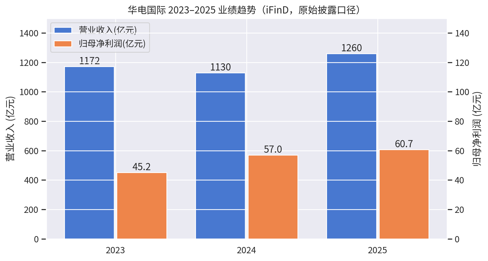
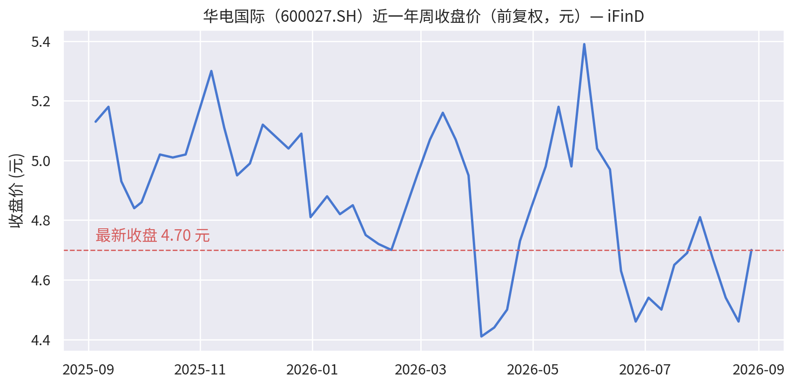

# 华电国际（600027.SH / 01071.HK）深度分析

**报告日期：2026-08-29** ｜ 数据来源：iFinD（财报/行情/股东）、公司公告及公开报道（标注于正文）

---

## 一、核心结论

- **基本面处于"电量承压、盈利韧性"阶段**：2026 年上半年营收 542.64 亿元（-9.49%）、归母净利润 31.05 亿元（-20.47%），主因发电量下滑 10.65% 与参股绿电投资收益回落；但度电税前利润同比 +30.5%，火电主业盈利能力实际在改善。
- **盈利质量与分红是主要看点**：2025 年经营现金流 272.2 亿元（大幅高于净利润），2025 年度每股派现 0.23 元、分红率 48.47%，2026 年中期再派 0.09 元/股，A 股静态股息率约 4.9%。
- **估值不贵**：A 股收盘价 4.70 元（2026-08-28），对应 2025 年约 9 倍 PE、1.1 倍 PB；中金 2026-08-28 维持"跑赢行业"，A 股目标价 6.22 元（约 +35% 空间）。
- **主要风险**：电量被新能源与水电挤压、市场电价下行、煤价反弹，以及少数股东损益与永续债利息对归母利润的摊薄。

---

## 二、公司概况与股东结构

华电国际是中国华电集团旗下常规能源（火电为主）整合平台，实控人为国务院国资委，A+H 两地上市。截至 2026 年 6 月末，控股在运发电企业 57 家，控股装机容量 **7,864.56 万千瓦**：煤电 5,398 万千瓦（68.64%）、气电 2,217.3 万千瓦、水电 245.9 万千瓦、光伏 3.36 万千瓦；清洁能源装机占比 31.36%（[北极星电力网: 2026-08-27](https://m.bjx.com.cn/mnews/20260827/1510403.shtml)）。

股东结构（iFinD，2026-08-24 数据）：中国华电集团直接持股 **45.63%**（第一大大股东，国有法人），前十大股东合计持股 72.21%，主要还包括香港中央结算（H 股）、山东发展投资、申能股份、国调基金二期、中央汇金、太平人寿等。总股本 116.12 亿股（公司公告，2026-08-27），股东户数约 15.72 万户（[东方财富: 2026-08-28](https://finance.eastmoney.com/a/202608283857461317.html)）。

2025 年完成集团资产注入：同一控制下合并华电江苏能源等 8 家单位（2025-06-01 交割），并以定增募资 34.28 亿元，投向望亭 2×66 万千瓦扩建等项目（[腾讯新闻: 2026-03-27](https://news.qq.com/rain/a/20260327A06OQP00)）。

---

## 三、财务分析（2023–2025 年报，iFinD 原始披露口径）

| 指标（亿元） | 2023 | 2024 | 2025 |
|---|---|---|---|
| 营业收入 | 1,171.8 | 1,129.9 | 1,260.1 |
| 营业成本 | 1,096.5 | 1,030.7 | 1,116.0 |
| 财务费用 | 36.0 | 32.3 | 31.6 |
| 投资收益 | 37.8 | 34.8 | 31.5 |
| 营业利润 | 57.0 | 83.3 | 101.6 |
| 净利润 | 48.1 | 68.4 | 82.2 |
| **归母净利润** | **45.2** | **57.0** | **60.7** |
| 少数股东损益 | 2.9 | 11.3 | 21.5 |
| 经营活动现金流净额 | 132.5 | 163.4 | 272.2 |
| 购建资产现金支出 | 104.9 | 90.7 | 150.6 |
| 总资产 | 2,230.4 | 2,238.8 | 2,642.3 |
| 资产负债率 | 62.6% | 61.5% | 61.4% |
| 少数股东权益 | 136.2 | 187.4 | 329.3 |
| 永续债（其他权益工具） | 306.6 | 250.2 | 210.0 |

数据来源：iFinD 三大报表（2023/2024/2025 年报，各期原始披露值）。

**解读：**

1. **收入同口径下滑、利润微增**：2025 年报对 2024 年追溯调整后，2025 年营收同比 **-10.95%**（电量、电价双降），归母净利润 60.7 亿元、同比 **+1.39%**（[腾讯新闻: 2026-03-27](https://news.qq.com/rain/a/20260327A06OQP00)）。利润靠煤价下行带来的成本改善支撑。
2. **盈利能力中等但趋势向上**：2025 年毛利率 11.44%、净利率 6.52%、ROE 8.89%、ROIC 4.51%、基本 EPS 0.49 元、每股净资产 4.15 元（iFinD 财务指标）。ROIC 偏低是重资产火电的共性。
3. **现金流是最大亮点**：2025 年经营现金流 272.2 亿元，约为归母净利润的 4.5 倍，覆盖资本开支（150.6 亿元）后自由现金流充裕，支撑分红提升。
4. **归母摊薄需关注**：少数股东损益从 2023 年 2.9 亿元升至 2025 年 21.5 亿元（注入资产少数股权占比高）；永续债存量 210 亿元，其利息在 EPS 计算中先行扣除。
5. **杠杆稳中有降**：资产负债率由 62.6% 降至 61.4%，2026 年中报进一步降至 60.68%（[东方财富: 2026-08-28](https://finance.eastmoney.com/a/202608283857461317.html)）。2025 年末有息负债约 1,328 亿元（短期借款 385.5 + 一年内到期非流动负债 236.7 + 长期借款 451.3 + 应付债券 254.9，iFinD 测算），财务费用连续三年下降（36.0 → 31.6 亿元）。

**分部结构（2025 年报，iFinD）**：售电收入 1,118.1 亿元（占比 88.7%，毛利率 13.22%，+2.73pct）；售热 124.6 亿元（占比 9.9%，毛利率 -6.80%，改善 8.8pct）；其他 1.4%。区域上山东（329.7 亿，毛利率 15.17%）、江苏（220.1 亿）、广东（112.7 亿）为核心市场（[腾讯新闻: 2026-03-27](https://news.qq.com/rain/a/20260327A06OQP00)）。

---

## 四、2026 年半年报：短期承压（2026-08-27 披露）

| 指标 | 2026H1 | 同比 |
|---|---|---|
| 营业收入 | 542.64 亿元 | -9.49% |
| 归母净利润 | 31.05 亿元 | **-20.47%** |
| 扣非净利润 | 30.84 亿元 | -17.86% |
| 基本 EPS | 0.25 元 | -24.24% |
| 经营现金流净额 | 91.31 亿元 | -40.95% |
| 中期分红 | 0.09 元/股（约 10.45 亿元） | — |

（[金融界: 2026-08-27](https://24h.jrj.com.cn/2026/08/27170658251796.shtml)、[港交所公告: 2026-08-27](https://www.hkexnews.hk/listedco/listconews/sehk/2026/0827/2026082700704_c.pdf)）

Q2 单季归母净利润 13.16 亿元、同比 -31.37%，下滑幅度扩大（[搜狐·证券之星: 2026-08-29](https://m.sohu.com/a/1069119855_115377?scm=10001.325_13-325_13.0.0-0-0-0-0.5_1334)）。

**经营层面**（[北极星电力网: 2026-08-27](https://m.bjx.com.cn/mnews/20260827/1510403.shtml)）：
- 发电量 1,077.85 亿千瓦时（-10.65%），上网电量 1,010.38 亿千瓦时（-10.82%）；机组平均利用小时 1,382 小时，其中煤电 1,639 小时（-9.7%）——水电出力改善 + 新能源及新投机组挤压。
- 平均上网电价 517.78 元/兆瓦时（**+0.19%**），容量电价机制对电量电价下行形成对冲。
- 入炉标煤单价 833.75 元/吨（**-2.0%**），成本端继续改善。

**中金点评**（[中金在线: 2026-08-28](http://www.chinatpg.com/home/news/pages/n_id/168020.html)）：1H26 度电税前利润 0.041 元/千瓦时、同比 **+30.5%**，火电盈利具韧性；利润下滑主因绿电投资收益大幅回落（参股华电新能 1H26 净利同比 -33.7%）及利用小时承压；碳排放权交易净收益 4.6 亿元（上年同期仅 186.8 万元）增厚利润。

---

## 五、估值与市场表现

- **A 股**：收盘价 4.70 元（2026-08-28，iFinD 周线），近一年区间 4.34–5.90 元。总市值约 546 亿元（116.12 亿股）。
- **估值倍数**：按 2025 年归母净利润 60.7 亿元计算，静态 PE 约 **9.0 倍**；PB 约 **1.1 倍**（2026H1 每股净资产 4.29 元）；2025 年度每股派现 0.23 元对应静态股息率约 **4.9%**。
- **机构观点**：中金 2026-08-28 下调 2026/27 年归母净利润预测 12.7%/13.3% 至 **45.7/55.9 亿元**，当前 A 股对应 2026/27 年 PE 12.7/10.2 倍、H 股 9.5/7.6 倍；维持"跑赢行业"评级，目标价 **A 股 6.22 元 / H 股 5.35 港元**，分别有约 35% 上行空间（[中金在线: 2026-08-28](http://www.chinatpg.com/home/news/pages/n_id/168020.html)）。

---

## 六、投资逻辑与风险提示

**看多逻辑**
1. 容量电价 + 煤价下行周期下，火电度电盈利逆势改善（1H26 度电税前利润 +30.5%）；
2. 现金流强劲、资本开支收敛，分红率近 50%，静态股息率约 4.9%，类债属性突出；
3. 集团资产注入后资产质量与区域布局优化（江苏等高电价区域占比提升），百万千瓦机组占比提高；
4. 碳交易收益、气电/抽蓄等新增长点逐步贡献。

**风险提示**
1. **电量下行**：新能源装机高增持续挤压火电利用小时，1H26 发电量 -10.65% 若延续，将侵蚀全年利润；
2. **电价市场化下行**：容量电价对冲幅度有限，若市场电价降幅扩大则营收承压；
3. **煤价反弹**：盈利对入炉煤价高度敏感（2026H1 已现企稳迹象）；
4. **归母摊薄**：少数股东损益快速上升 + 永续债利息，归母增速持续低于净利润增速；
5. **应收账款体量较大**（约为年报归母净利润的 1.8 倍），需关注补贴与电费回收（[搜狐·证券之星: 2026-08-29](https://m.sohu.com/a/1069119855_115377?scm=10001.325_13-325_13.0.0-0-0-0-0.5_1334)）。

---

## 七、验证跟踪表（前瞻指标）

| 跟踪指标 | 确认/证伪阈值 | 触发后的含义 |
|---|---|---|
| 2026 全年归母净利润 | 低于中金预测 45.7 亿元 → 证伪乐观预期 | 下修估值中枢至 9–10 倍 PE |
| 2026H2 发电量同比 | 降幅收窄至 -5% 以内 → 确认电量企稳 | 盈利韧性逻辑强化 |
| 入炉标煤单价 | 升破 900 元/吨 → 成本逻辑逆转 | 度电利润改善逻辑失效 |
| 分红率 | 维持 ≥45% | 高股息配置价值延续 |
| 永续债规模 | 继续净偿还（现 210 亿元） | 归母摊薄减轻，EPS 弹性上升 |

> **免责声明**：本报告基于公开数据整理，不构成投资建议。数据以 iFinD 及各标注来源为准，2026H1 报表明细 iFinD 尚未收录（接口返回为空），半年报数据引自公司公告及媒体报道。
