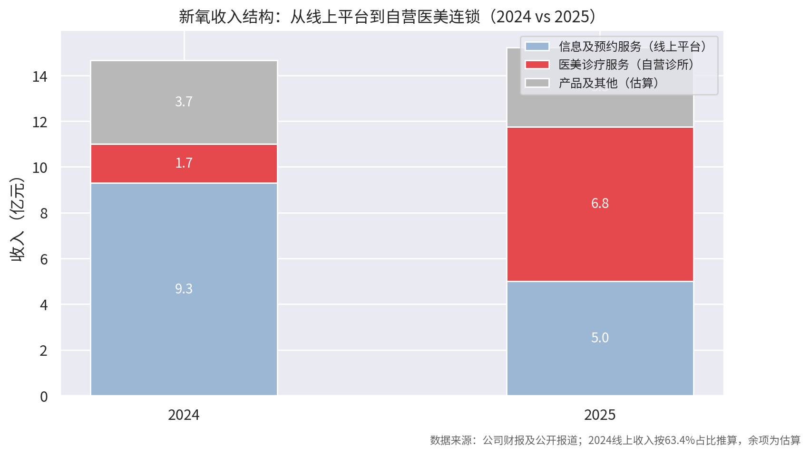
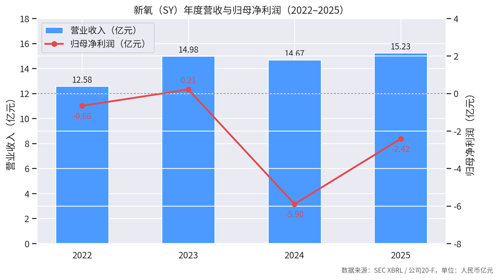
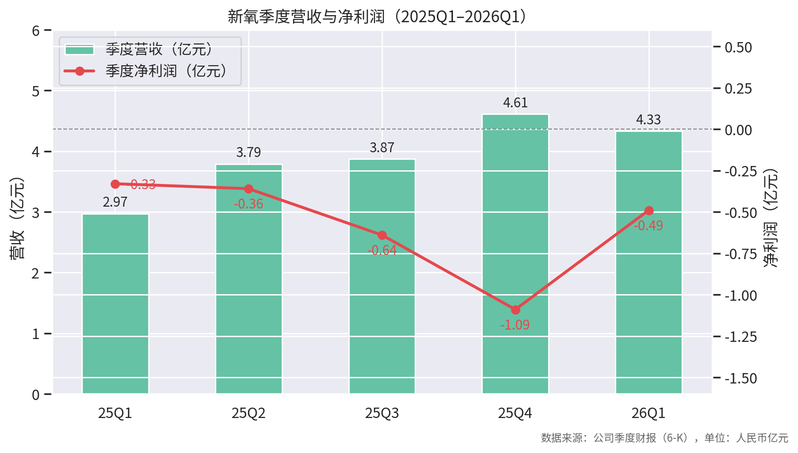

# 新氧（So-Young International, NASDAQ: SY）研究报告

**报告日期：2026-08-29** ｜ 财务数据截至 2026Q1（2026-05-22 披露）｜ 行情数据截至 2026-08-27/28 收盘

---

## 摘要（先读结论）

新氧正处于一场"背水一战"式的转型中：传统线上医美平台业务（信息及预约服务）以每年约 -30% 的速度萎缩，公司把筹码押在自营轻医美连锁"新氧青春诊所"上。转型在**收入端已被验证**——医美诊疗收入 2025 年同比 +298.7%，2026Q1 占比已超 65%，且 41/54 家门店单店盈利；但在**利润端尚未兑现**——2025 年归母净亏 2.42 亿元，2026Q1 亏损同比扩大约 49%。

**核心矛盾**：营收结构重构成功 vs 整体仍在烧钱（现金+短投从 2025 年中约 10 亿元降至 2026Q1 末 8.80 亿元）。管理层喊出"2026 年单季度扭亏"目标，2026Q2 财报（**2026-08-31 盘前**，即本报告发布后两天）是第一个关键验证点。

**估值**：市值约 2.41 亿美元（2026-08-28 收盘 2.40 美元），P/S(TTM) 仅 0.145，P/B 约 1.08；企业价值为负（-6170 万美元），即账上现金（约 1.11 亿美元）已超过市值+债务——市场定价已包含相当程度的悲观预期。2 位覆盖分析师均为"买入"，目标价中值 7.37 美元（但覆盖极少，参考价值有限）。

**一句话**：这是一家现金比市值贵、转型故事真实但尚未扭亏的小市值中概股，投资逻辑取决于"2026 年能否单季扭亏"这一可验证命题。

---

## 一、公司概况与商业模式

新氧成立于 2013 年，2019 年 5 月在纳斯达克上市（发行价 13.8 美元/ADS），为"互联网医美第一股"。创始人金星任董事长兼 CEO（财新网: 2021-11-23 https://companies.caixin.com/2021-11-23/101809045.html）。SEC 注册信息：CIK 1758530，开曼群岛注册，财年截止 12 月 31 日，全职员工 2,348 人（Yahoo Finance: 2026-08-27）。

**收入结构——已从纯平台转向"平台+自营连锁+上游产品"复合体：**

| 业务板块 | 2024 年 | 2025 年 | 趋势 |
|---|---|---|---|
| 信息及预约服务（线上平台） | 约 9.3 亿元（占 63.4%） | 5.0 亿元，**-32.2%** | 持续萎缩，2026Q1 仅 0.80 亿元，-34% |
| 医美诊疗服务（自营"新氧青春诊所"） | 1.7 亿元（+1206%） | 6.75 亿元，**+298.7%**，占比 44% | 2026Q1 达 2.82 亿元（+185.8%），占比超 65% |
| 产品及维养服务（含奇致激光器械） | 约 3.7 亿元 | 约 3.5 亿元 | 2025Q2 单季 -28.1%，相对平稳 |

（来源：中国经济网: 2026-05-26 http://finance.ce.cn/stock/gsgdbd/202605/t20260526_2990566.shtml；新浪财经: 2026-06-25 https://finance.sina.com.cn/stock/observe/2026-06-25/doc-inierihq1014324.shtml；东方财富: 2026-03-31；2024 线上收入按 63.4% 占比推算，"产品及其他"为余项估算）

**转型路径**：从医美信息中介 → 下游自营连锁（平价轻医美"青春诊所"，长期目标 8–10 年千店）+ 上游供应链垂直整合（2021 年 8.19 亿元收购武汉奇致激光 87.6% 股权；与西宏生物定制"奇迹童颜 3.0"；2026 年 4 月与锦波生物深度合作独家专供新品）（腾讯网: 2025-10-10 https://news.qq.com/rain/a/20251009A081IP00；腾讯网: 2026-05-25 https://news.qq.com/rain/a/20260525A08F9N00）。

**门店扩张**：2025 年末 49 家（15 城）→ 2026Q1 末 54 家（16 城）→ 2026 年 5 月 59 家（17 城）。2026 年 1 月起战略重点从"规模扩张"转向"经营指标提升"（腾讯网: 2026-01-29 https://news.qq.com/rain/a/20260129A052IV00）。

**为什么要转型**：平台模式被综合流量平台"降维打击"——付费机构数从 2023 年 1,659 家降至 2024 年 1,174 家，MAU 从 2021 年 850 万降至 2024 年 150 万，美团医美、阿里健康等以高频本地生活流量切入轻医美（腾讯网/趣解商业: 2025-10-14 https://news.qq.com/rain/a/20251014A045VH00；36氪: 2020-09-07 https://m.36kr.com/p/872521198204806）。

## 二、财务分析

### 2.1 年度财务（SEC XBRL 数据，经审计，单位：人民币亿元）

| 财年 | 营业收入 | 同比 | 归母净利润 | 总资产 | 现金及等价物 |
|---|---|---|---|---|---|
| 2022 | 12.58 | — | -0.66 | 31.98 | 6.94 |
| 2023 | 14.98 | +19.1% | +0.21 | 32.15 | 4.26 |
| 2024 | 14.67 | -2.1% | **-5.90** | 27.35 | 5.88 |
| 2025 | 15.23 | +3.9% | **-2.42**（收窄 59%） | 26.50 | 4.18 |

数据来源：SEC EDGAR XBRL facts（us-gaap 标准标签，is_audited=true）。注：2024 年大额亏损与转型投入及资产减值相关；2025 年末现金+短期投资合计 8.72 亿元。

### 2.2 季度趋势（2025Q1–2026Q1，单位：人民币亿元）

| 季度 | 营收 | 同比 | 净利润 | 医美诊疗收入 | 关键信号 |
|---|---|---|---|---|---|
| 2025Q1 | 2.97 | — | -0.33 | — | — |
| 2025Q2 | 3.79 | -7.0% | -0.36 | 1.44 亿（+426%），首成最大收入来源 | — |
| 2025Q3 | 3.87 | — | -0.64 | 1.84 亿（+305%） | — |
| 2025Q4 | 4.61 | 约 +25%（单季新高） | -1.09（同比大幅收窄） | 2.48 亿（+205%），占比首破 50% | — |
| 2026Q1 | 4.33 | **+45.6%** | -0.49（亏损同比扩大约 49%） | 2.82 亿（+186%），占比超 65% | 41/54 门店单店盈利；48 家经营性现金流转正 |

（来源：公司 6-K 季度财报；华尔街见闻: 2026-03-25 https://wallstreetcn.com/articles/3768389；富途: 2026-05-23 https://news.futunn.com/en/post/73542267）

**2026Q1 经营质量细节**：到店就诊 14.8 万人次（+172%）；核心会员贡献超 80% 医美收入、季度复购率近 80%；医美业务毛利率 27%（同比 +8.4pct）。但销售费用 +33.7%、管理费用 +42.5%；现金及短投从 2025 年末 9.36 亿元降至 8.80 亿元（GuruFocus: 2026-05-22 https://finance.yahoo.com/sectors/healthcare/articles/young-international-inc-sy-q1-190029626.html；finsee.ai: 2026-05-22 https://finsee.ai/earnings/sy/2026/q1/en/）。

### 2.3 资产负债与现金（Yahoo Finance，截至 2026-03-31 / FY2025 年报）

- 总现金 7.98 亿元（约 7.94 元/股），总债务 3.80 亿元，债务/权益 23.6%，流动比率 1.73
- FY2025 末：总资产 26.50 亿元，股东权益 15.53 亿元，累计亏损 -11.75 亿元
- 2025 年经营性现金流 -1.05 亿元；按当前烧钱速度，现金储备约可支撑 2–3 年，但若持续重资产扩张存在再融资需求

### 2.4 股东回报

2024 年度特别股息每 ADR 0.0265 美元（除息 2025-04-08）；2025Q4 累计回购 1,525 万元人民币——规模都很小，象征意义大于实质（东方财富: 2026-03-31）。

## 三、市场表现与估值

**行情（Yahoo Finance，截至 2026-08-27/28 收盘）：**

| 指标 | 数值 |
|---|---|
| 股价 / 市值 | US$2.40 / **US$2.41 亿** |
| 52 周区间 | US$1.28 – 4.75 |
| 近 1 年 / 2026 年至今 | **-39.6%** / -13.1%（同期标普 500 +20.5%） |
| 50 日 / 200 日均线 | 1.88 / 2.62 |
| Beta / 日均成交量 | 2.06 / 约 35.7 万股 |

**估值指标（TTM，最近季度 2026-03-31）：**

| 指标 | 数值 | 解读 |
|---|---|---|
| P/S (TTM) | **0.145** | 极度低估区间，反映市场对亏损与转型的折价 |
| P/B | 1.08 | 略高于账面价值 |
| P/E | n/m（亏损） | 远期 P/E -28（分析师预期仍亏） |
| **企业价值 EV** | **-6,170 万美元（为负）** | 现金 > 市值+债务，典型的"深度价值陷阱 or 深度价值机会"形态 |
| 毛利率 / 净利率 | 46.0% / **-15.6%** | 自营诊疗毛利率（27%）远低于平台业务，拖累整体 |

**股权与做空**：内部人持股 21.7%，机构持股 19.7%（32 家机构），做空仓位占流通股 3.8%（short ratio 9.57）。内部人交易方面，2026 年仅 COO 李格菲、CMO 王贝的期权行权/授予（Form 4，SEC EDGAR），无公开市场买卖。

**分析师**：仅 2 位覆盖，均"买入"，目标价区间 4.85–9.90 美元、中值 7.37 美元；2025-07-08 花旗上调至"买入"、目标价 0.8→5.5 美元。覆盖极少，目标价参考价值有限。

## 四、近期重要事件（2025–2026）

1. **央视 315 晚会点名（2026-03-15）**：曝光外泌体医美乱象，新氧"安心美"小程序曾上架乔洛施 AR 外泌体项目并导流线下机构，被点名后下架全部外泌体项目（搜狐/界面新闻: 2026-03-15 https://www.sohu.com/a/996862359_130887）。
2. **LDM 仪器宣传争议（2026-05）**：青春诊所宣传"德国 LDM-MED"，实际使用 HILDM 设备，被质疑误导性宣传（中国经济网: 2026-05-26，同上）。
3. **童颜针价格战与供应商冲突（2025 全年）**：奇迹童颜低价策略遭普丽妍、圣博玛断货及"非官方合作机构"名单抵制；斐缦生物断供并质疑产品来源；新氧发《严正声明》回击。金星称"谈不上围剿，对业务没有太大影响"（中国经济网: 2025-09-25 http://finance.ce.cn/stock/gsgdbd/202509/t20250925_2487936.shtml；凤凰网: 2026-01-29 https://finance.ifeng.com/c/8qJBKqm4bGn）。
4. **高管变动**：2025-12 起金星兼任临时 CFO；**2026-08-03 起沈楠（原高途 CFO）出任 CFO**，分管财务、人力、法务及合规——信号意义：加强财务纪律与合规（雷递网: 2026-08-07 https://www.leinews.com/n34591/detail.html；经济观察网: 2026-08-22 https://www.eeo.com.cn/2026/0822/1007993.shtml）。
5. **行政处罚**：关联公司 2024-09 因未经审查的超声炮广告被罚 1.2 万元（金额小，但反映广告合规是持续性风险点）。
6. **消费金融**：2026-08-18 公司回应"氧分呗"未开展线下推广，通华小贷利率 14%（新浪财经: 2026-08-28 https://stock.finance.sina.com.cn/usstock/quotes/SY.html）——细节未进一步核实。

## 五、行业背景

- **市场规模**：口径差异大，仅供参考——艾媒咨询估 2025 年医美服务市场约 3,701 亿元（艾媒: 2026-01-05 https://report.iimedia.cn/repo154-0/72733.html）；中商产业研究院估 2025 年 3,247 亿元、轻医美占比 52%（中商情报网: 2025-08-14 https://www.askci.com/news/chanye/20250814/094813275513609225683370.shtml）；前瞻产业研究院预计 2030 年超 6,000 亿元、CAGR 约 12%，行业 CR10 不足 5%、高度分散（前瞻: 2025-06-30 https://bg.qianzhan.com/trends/detail/506/250630-08f5b7ff.html）。中国医美渗透率不足 5%（韩国超 20%），长期空间仍在。
- **监管**：2021 年八部委专项整治、2023 年 11 部门指导意见确立常态化严监管；2026 年 315 晚会聚焦外泌体乱象，合规成本持续上升。严监管长期利好合规连锁龙头，短期增加成本。
- **竞争**：垂直平台（更美、美呗）式微；流量端被美团医美、阿里健康等挤压；新氧转型后竞争坐标变为"自营连锁 vs 其他医美机构"，且自营诊所与平台入驻机构存在利益冲突。

## 六、风险因素

| 风险 | 说明 | 程度 |
|---|---|---|
| 持续亏损与现金消耗 | 2025 年亏 2.42 亿、经营现金流 -1.05 亿；2026Q1 亏损同比扩大 49%；现金+短投 8.80 亿元且逐季下降 | **高** |
| 传统业务崩塌快于新业务盈利爬坡 | 信息及预约服务连续多季度 -30% 以上 | **高** |
| 合规/监管 | 315 点名、广告处罚、仪器宣传争议；自营医疗机构直接承担医疗事故、广告法、医师资质责任，敞口远大于平台时代 | **高** |
| 供应链对抗 | 上游厂商断供、"非官方机构"名单影响产品可得性与品牌信任（各方各执一词，需跟踪） | 中高 |
| 中概股/流动性 | 2022-05 曾被 SEC 列入"预摘牌名单"（36氪: 2022-11-28），最新 HFCAA 状态**未核实**；市值仅 2.4 亿美元、日均成交约 37 万股、Beta 2.06 | 中高 |
| 估值逻辑切换 | 市场尚未对"医美连锁服务商"的新身份形成定价共识 | 中 |

## 七、关键跟踪点（验证表）

| 跟踪指标 | 验证阈值 | 时点 | 触发后的含义/动作 |
|---|---|---|---|
| **2026Q2 财报：是否单季扭亏或大幅减亏** | 净利润 ≥ -2,000 万元为积极信号；若亏损 ≥ Q1 的 4,900 万元则证伪"年内扭亏"叙事 | **2026-08-31 盘前** | 达成→重估逻辑启动；证伪→下调转型可信度 |
| 医美诊疗收入增速 | 指引 3.07–3.17 亿元（+102.6%~119.5%），低于下限为负面 | 2026Q2 财报 | 低于指引→扩张故事降温 |
| 单店盈利门店比例 | 2026Q1 为 41/54（76%）；持续提升为正面 | 每季 | 若下滑说明新店爬坡恶化 |
| 现金+短投余额 | 若单季消耗 >1 亿元需警惕融资风险 | 每季 | 加速消耗→关注增发/借款 |
| 供应商关系 | 锦波生物合作产品放量 vs 更多厂商断供 | 持续 | 决定"独家定制"模式可行性 |
| 新 CFO 沈楠的口径变化 | 首次主导财报会（预计 Q2/Q3） | 2026H2 | 关注资本开支与费用管控信号 |
| HFCAA 认定状态 | 是否再次被 SEC 点名 | 持续 | 被点名→退市风险重估 |

## 八、数据来源与局限

- **财务数据**：SEC EDGAR XBRL facts（年度，经审计）+ Yahoo Finance 财务报表（季度）。注意：SEC 数据源未能返回新氧 20-F/6-K 的 filings 元数据（该内部库未收录 FPI 申报记录），20-F accession 未获取；季度明细以 Yahoo Finance/公司 6-K 新闻稿为准。
- **行情数据**：Yahoo Finance，截至 2026-08-27/28 收盘。
- **业务与新闻**：公开中文媒体报道（见正文各处标注），其中收入结构 2024 年分部数字为按比例推算的估算值，已与原始披露数字分开标注。
- **未核实项**：HFCAA 最新认定状态；"氧分呗"消费金融业务细节；2026Q2 财报实际数字（2026-08-31 披露）。

---

*本报告仅为信息整理与研究分析，不构成投资建议。*
