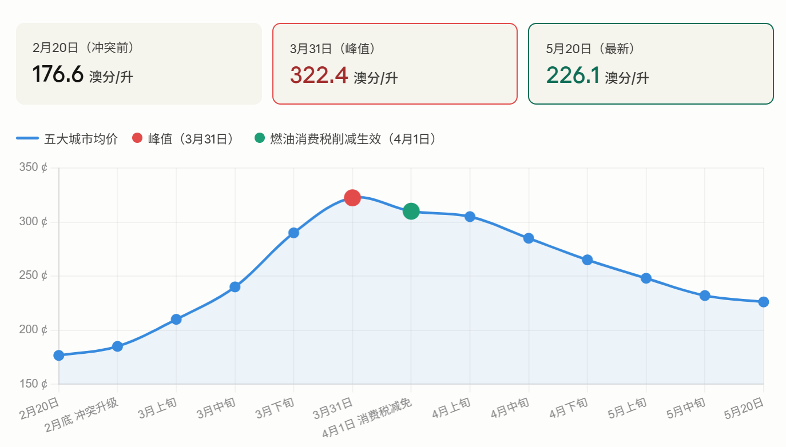
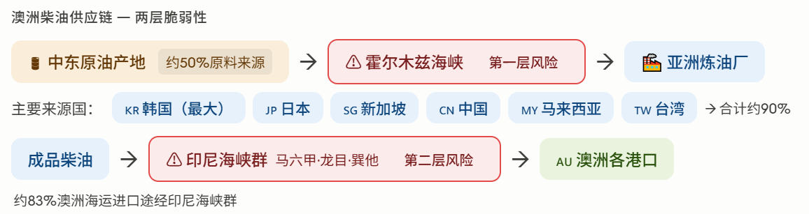
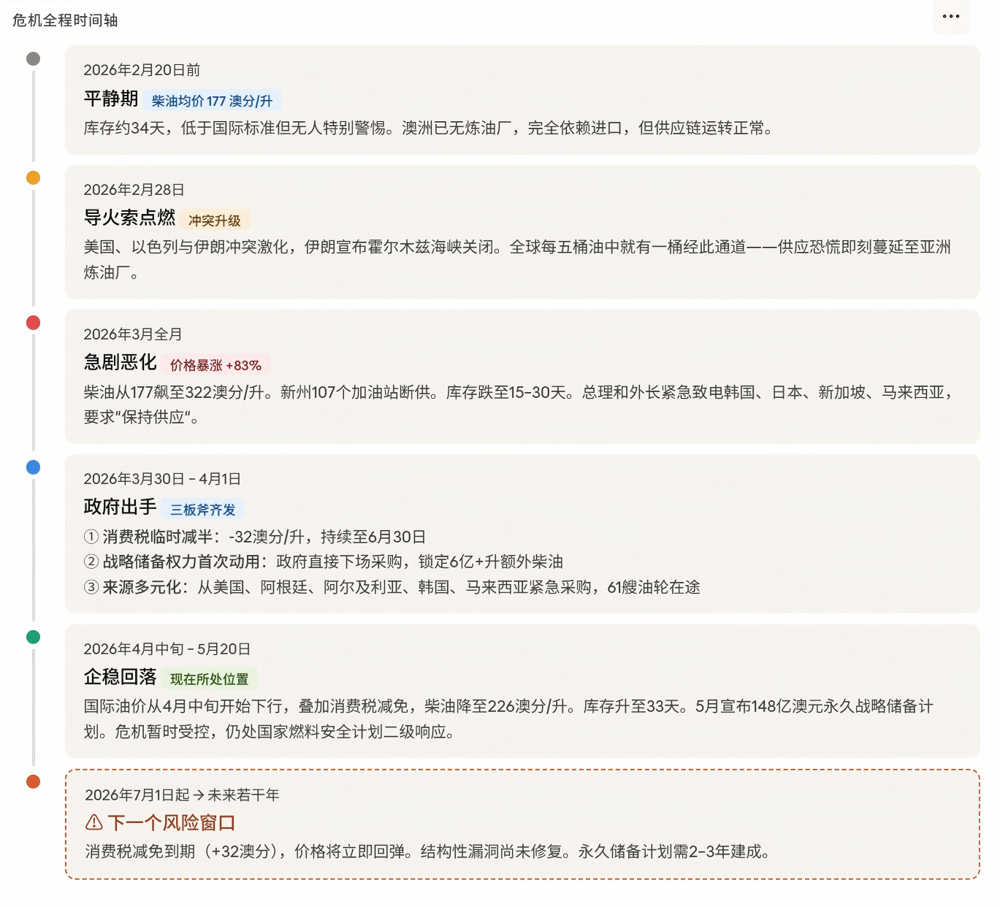
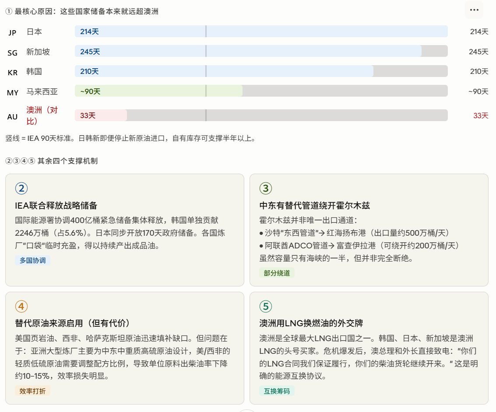
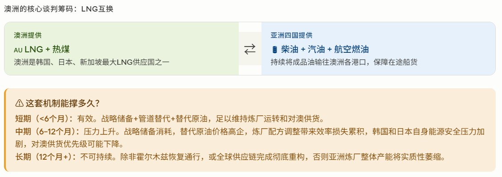

注：数据来源为 ACCC（澳大利亚竞争与消费者委员会）2026年5月22日周报，涵盖悉尼、墨尔本、布里斯班、阿德莱德、珀斯五大城市日均零售价均值。

以下是澳洲柴油价格近两个月变化的完整梳理：

**背景触发（2月底）**

2026年2月28日，美国、以色列与伊朗之间的中东冲突急剧升级。澳洲高度依赖从亚洲进口柴油，而亚洲大型炼油厂使用的原油品种恰恰是中东产量最大、出柴油率最高的品种，因此价格受冲击尤为剧烈。2月20日五大城市柴油均价约为176.6澳分/升。

**暴涨阶段（3月全月）**

从2月底至3月31日，五大城市柴油均价从约176.6飙升至322.4澳分/升，涨幅接近83%，创历史罕见记录。与此同时，澳洲柴油库存告急，整体库存仅维持15至30天，是国际能源署成员国中库存最低的国家之一，供应危机叠加价格飞涨，引发社会广泛关注。

**政府干预（4月1日）**

3月30日，澳大利亚联邦政府宣布临时削减燃油消费税，4月1日起正式生效，削减幅度共计32澳分/升（原税率52.6澳分/升减半，叠加对关税收入的额外豁免）。但4月初由于新加坡Gasoil 10 ppm国际基准价格同步暴涨，抵消了消费税减免的效果，柴油零售价短期内未能明显下行。

**持续回落（4月中旬至今）**

进入4月下旬后，国际精炼柴油价格开始大幅回落，叠加消费税减免的双重效应，零售价格加速下降。5月20日，五大城市柴油日均零售价已降至226.1澳分/升，较3月31日峰值下降了96.3澳分/升（降幅约30%）。190多个偏远地区的柴油均价同期也累计下降约89澳分/升。

**当前情况**

截至5月20日，各主要城市柴油零售均价大致为：悉尼226.5、墨尔本232.9、布里斯班229.2、阿德莱德225.4、珀斯216.7澳分/升。尽管较峰值已大幅下降，但仍比冲突前（2月20日）高出约49.5澳分/升，即约28%。消费税减免政策将持续至2026年6月30日，届时价格走势需持续关注。

## 为什么没有柴油荒

柴油价格库存情况如何，我前两个月看到说会引发柴油荒，但目前看好像也没有，是为什么？

"柴油荒"并非没有发生，而是**局部发生了，但全面危机被政府干预及时遏制**。以下是完整来龙去脉：

**危机确实部分发生了**

3月间，新南威尔士州就有逾107个加油站出现柴油断供。当时全国柴油库存仅约15至30天，是国际能源署成员国中最低水平，而国际能源署要求的标准是90天。彼时多位专家警告说，真正的考验将在4月和5月到来，4月中旬之后的供应尤为"棘手"。

**但全面"柴油荒"为何没有爆发？核心原因有以下几点：**

第一，**政府紧急动用了从未使用过的战略储备权力**。联邦政府启用《燃油安全立法》中的战略储备条款，主动下场采购并分配燃油，共额外锁定逾6亿升柴油及1亿升航空燃油。这在澳洲历史上是头一次。

第二，**进口来源快速多元化**。原本澳洲柴油大量依赖中东-亚洲精炼厂，冲突爆发后迅速转向美国、韩国、马来西亚、阿根廷、阿尔及利亚等替代来源。能源部长Bowen在5月报告称，已有61艘油轮在途，合计超过41亿升油品将陆续到港。

第三，**政府宣布了史上最大规模燃料安全投资**。2026年5月6日，联邦政府宣布148亿澳元的"燃料安全与韧性一揽子计划"，目标是建立澳洲第一个永久性政府持有实物燃料储备，目标规模约10亿升，以柴油和航空燃油为主。设计目标是确保至少50天的国内在岸供应。

第四，**国际油价从4月中旬起开始回落**，降低了进口成本，也使采购和锁量更容易操作。

**目前的库存状况（2026年5月）**

截至5月，汽油储备已从3月的约34天提升至约46天，柴油约33天，航空燃油约30天。虽然仍远低于国际能源署90天标准，但已比危机最严峻时好转很多，且有大量在途船货作为缓冲。

**还有哪些隐患未完全解决**

澳洲目前仍处于国家燃料安全计划的"二级响应"状态（四级中的第二级），并非完全解除警报。本质上的结构性弱点没有消失：澳洲没有本土炼油厂（最后一家于2014年关闭），完全依赖进口成品油，"准时制"供应链缺乏冗余。此次危机暴露的问题，正是这次148亿澳元大投资试图系统性解决的。

简单说，危机没有失控，主要是政府反应足够快、足够大力，而不是因为供应本身没有问题。

## 霍尔木兹海峡持续封锁影响

目前澳大利亚的柴油从哪里进口，如果后续霍尔木兹海峡持续封锁，会产生多大影响

**澳洲的柴油从哪里来**

澳洲进口的是**精炼柴油成品**，而非原油。主要来源国是韩国、日本、新加坡、中国、马来西亚和台湾，这几个亚洲炼油中心合计供应约90%的澳洲燃油。澳洲本身近年已没有大型炼油厂——最后几座分别于2012至2021年间陆续关闭，彻底失去国内炼制能力。

**霍尔木兹封锁为何影响澳洲**

表面上看，澳洲自己并不直接从中东进口原油（近三年中东原油进口接近于零）。但问题在于，那些向澳洲供应柴油的亚洲炼厂，其原料原油大量来自中东海湾国家，而这些原油必须经过霍尔木兹海峡运出。这是**两步上游的间接暴露**——封锁影响炼厂原料，炼厂产量减少，澳洲进口随之收紧。这一链条中，澳洲的"中东依赖度"约为50%。

**供应链上存在两层风险**

澳大利亚战略政策研究所（ASPI）的分析指出，澳洲供应链有两个相互独立的薄弱环节。第一层是霍尔木兹，影响原油供应亚洲炼厂；第二层是印尼海峡群（马六甲、龙目、巽他），澳洲约83%的海运进口都要从这里过境。如果两层同时受阻，情况将远不是价格问题，而是物理上无法得到燃油。

**目前封锁对澳洲的实际影响是可控但尚未消除的**

当前价格仍比冲突前高出约28%，柴油库存33天只有IEA建议标准的三分之一。短期内，政府通过战略储备权力锁定的6亿多升额外柴油、来自美国、韩国、马来西亚、阿根廷等非中东替代来源的新供货，以及正在赶来的61艘油轮，构成了足够的缓冲。

**如果封锁持续三个月以上**，亚洲炼厂的备用原油储备会逐渐告罄，替代来源（西非、美洲）运距更长、成本更高，全球同时争抢替代供应，澳洲将面临真正的结构性压力。届时农业、矿业、长途运输等高柴油依赖行业会首当其冲，进而波及大宗商品出口和整体经济。

**战略盲点：北部基础设施缺口**

ASPI的一个重要警告是，达尔文距离新加坡仅4天航程，地理位置理想。但澳洲北部的储油、配送基础设施极为薄弱，主要是为本地消耗而设计的，而非全国应急枢纽。若进口受阻，北部既没有足够储量，也缺乏向南输送的内陆运输能力。148亿澳元的燃料安全计划对此有所涉及，但建设需要时间。

简单说：霍尔木兹持续封锁不会让澳洲立刻断油，但每多封锁一个月，缓冲就少一层；超过三个月如果没有新的替代供应链完全补位，澳洲将面临比今天严峻得多的局面。

## 澳大利亚是如何度过这次柴油危机的

用最直观的方式告诉我，澳大利亚是如何度过这次柴油危机的，是永久度过还是暂时减缓，如果是暂缓，后续危机什么时候会重新爆发

用一句话概括：**澳洲这次是靠"应急输液"撑过去的，不是真正痊愈。**

打个比喻：病人发了高烧，医生给打了退烧针（消费税减免）、从外面运来了应急血液（6亿升战略采购）、换了几家供血医院（来源多元化）。烧是退了，但造成体虚的根本原因——没有自己的造血功能（炼油厂）、血库太薄（库存仅90天目标的三分之一）——一个都没解决。

**最近的一个风险节点是今年7月1日**，消费税减免到期，届时零售价将立刻跳涨32澳分/升。如果那时霍尔木兹仍未恢复正常通行，价格很可能重新回到峰值区间。148亿澳元的永久储备计划是真实的投入，但建成要到2027–2028年，这之间的窗口期依然脆弱。

这五个机制叠加在一起，构成了亚洲炼厂在霍尔木兹封锁下仍能供货的完整逻辑。其中最关键的是**储备厚度**和**LNG互换**这两条，其余三条是辅助支撑。

用最直白的话说：**日本有214天储备、韩国有210天、新加坡有245天，它们根本不需要霍尔木兹"立刻恢复"才能维持运转**，完全可以先用存货支撑，同时慢慢切换到替代原油来源。而澳洲刚好有它们最需要的东西——LNG，这让这笔"以气换油"的外交交易从一开始就顺理成章。

反过来看澳洲的脆弱性就更清楚了：它的库存只有33天，相当于只拿了1%的牌就上了桌，全靠别人手里有底牌才撑过去的。
