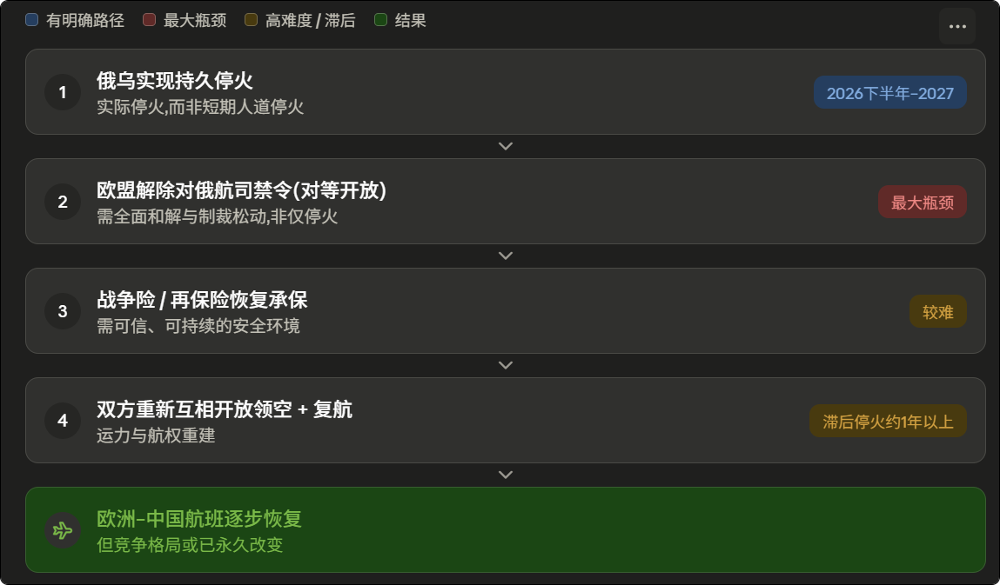

# 俄乌何时停战

# 停战不等于开放

中国航司的主导地位已经固化

这是一组对等禁飞。 2022 年是欧盟/英国先禁止俄航司,俄罗斯随即对 35 个以上"不友好"国家关闭领空。要重新开放,欧盟得先解除对俄航司的禁令——这才是最大瓶颈:欧盟立场比美国强硬,即便华盛顿和莫斯科先谈成(克宫已明确要求美方先恢复对俄通航),没有布鲁塞尔点头,大规模复飞仍难落地。停火 ≠ 制裁解除。

其次是战争险。 即使俄方承诺不打,保险/再保险商未必愿意为战区或刚停火地区承保——乌克兰利沃夫机场复航就是卡在保险上。再加上俄方扣留外资租赁飞机等历史遗留问题,信任重建需要时间。

中东堵点：欧洲飞亚洲原本的绕飞方案是走南线(中东/中亚)避开俄罗斯。但美以对伊朗的军事行动(2 月底起)导致科威特、巴林、伊朗、伊拉克、以色列、卡塔尔等约七国领空关闭或严格限制,卡塔尔航空在 2/28–3/24 取消了约 89% 的航班,中亚/阿塞拜疆走廊因此更加拥堵。也就是说,连"绕飞"这条退路在 2026 年也变窄了——短期内欧中航线压力不减反增。

“难以逆转”：不对称竞争是关键。 中国航司照常飞越俄领空,时间和油耗不变、票价更低;欧洲航司绕飞要多飞 1–4 小时,运营成本约高出 40%(燃油占成本约四分之一)。结果是中国航司已占中欧运力(不含俄航司)约 83%,远高于 2019 年的约三分之二。欧洲一侧大面积收缩:维珍航空、北欧航空(SAS)今年已完全退出中国;英航停掉伦敦—北京、缩减上海与香港;汉莎在评估法兰克福—北京;最依赖俄领空的芬兰航空受创最重;LOT 等"悄悄撤退"。这种格局即便日后领空重开,部分欧洲航司也未必恢复已砍掉的航线——中国航司的主导地位已经固化。

"停战"要分三层,否则会误判

第一层、临时停火,已经发生过。 在特朗普斡旋下,俄乌 5 月 8–11 日实施过三天人道主义停火并交换各 1000 名战俘,但随即破裂、互指对方违约。这类零星短停火随时可能再现,但不是"停战"。

第二层、持久停火 / 停火线冻结,这才是现实意义上的"战争结束"(上图蓝线)。

第三层、正式和平条约 / 法理终战,概率低、时间远(上图橙虚线)。

死结是**顿巴斯**。 俄方要价是乌军撤出仍控制的约 10% 顿涅茨克(一条筑垒带);乌方民调 52% 认为"用整个顿巴斯换安全保障"不可接受,泽连斯基坚持"不割地"。其次是安全保障年限(美方提 15 年、乌方要 20 年以上)和乌克兰放弃北约。更根本的是普京 6 月初在圣彼得堡论坛重申:不需要先停火再谈,他要的是按自身条件"彻底结束"。双方都无法在战场上决定性取胜——这是典型的"时机未成熟"困局。

战场:俄军年初拿下波克罗夫斯克/米尔诺赫拉德,但自去年 12 月起停滞,推进速度比一战索姆河还慢;日均伤亡约千人、月征兵 2.5–3 万仅够补损。→ 僵持,既无突破也无崩溃,利于最终谈判但不催生速决。

俄经济:IMF 估 2026 增长仅 1.1%,一季度环比萎缩 0.3%(2023 年以来首次),油气收入跌超 25%,布伦特约 60 美元,欧盟已出台第 20 轮制裁。→ 压力渐增但非崩盘,普京仍能再撑一两年。

乌兵员与外援:严重缺人、开小差创纪录、拟再征 16 万;本土军工只满足约 40%,其余靠西方。→ 时间越久越不利乌克兰,长期推动其接受冻结。

美国 / 特朗普:主动施压双方、促成 5 月停火与三方会谈(1 月阿布扎比、2 月日内瓦);但 6 月 4 日鲁比奥称谈判停滞、有升级风险。→ 加速器型变量,特朗普想要协议,但对普京的实际筹码有限。

普京个人意愿:多数分析师认为这是决定性变量。目前仍是最大化要价,若下半年判定前线"走入死胡同"才可能松动。

