# 原料

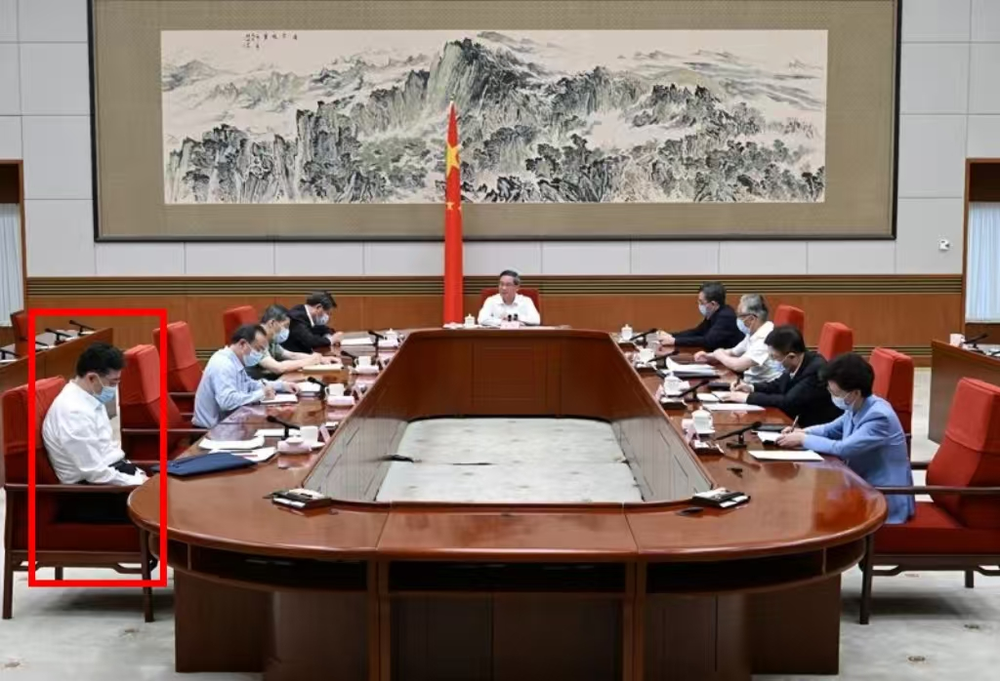

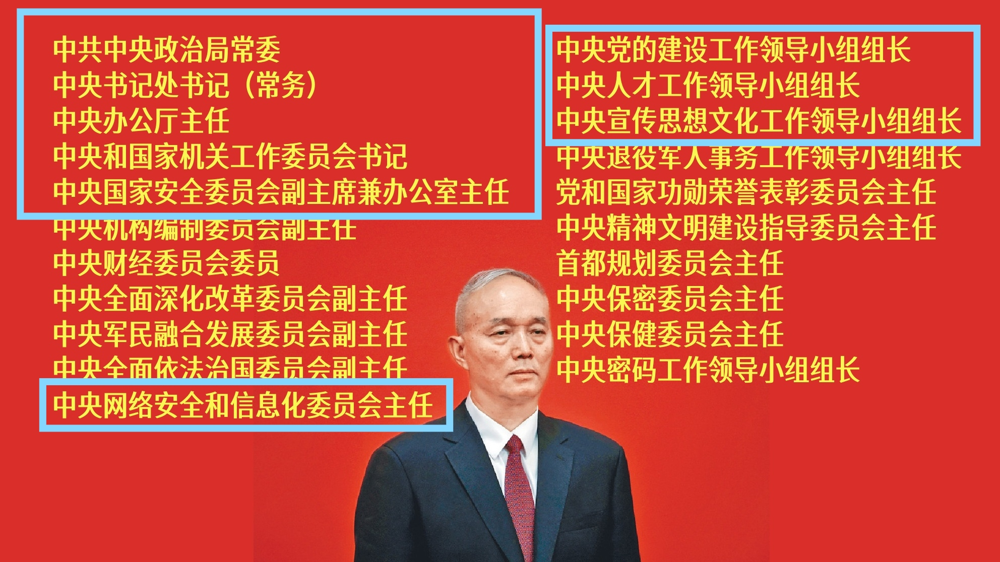

蔡奇出任中央党校校长，陈希卸任。

Ding：但他年龄偏大，和习一样

CE：

```
不影响，规矩早就被打破了
Old Money的思维方式是不一样的 
嗯，其实是地方zf搞股权投资，需要拉个皮套（指俞浩-追觅）上去，他（俞浩）就是看准了地方现在的核心矛盾，地方也希望有高科技
这个皮，吹的越大，"品牌越响"，地方zf就越容易做，和"追觅"合作了 ，其实是搞传统项目，套个皮，这个商业模式，应该叫，品牌手套，所以需要全员，都不做技术，而做宣传，实际项目主导和投资，也不是他，而是地方zf
和贾不一样，贾是西山会倒了，是之前的模式，派系 - 资本 - 前台企业的模式，俞是新的一种品牌手套，地方zf都可以用的模式，其实是轻资产模式，就是全员搞宣传
自己项目拿个几个点，他需要吹的越大，地方zf才好用这个品牌，例如地方说，和阿里合作了，都是会得到zf自己财政上倾斜的 
他把自己吹成阿里，腾讯一个级别，地方就可以说和追觅合作了，阿里，腾讯，这个皮是不会随便给地方用的，所以需要个能吹的和阿里，腾讯一样级别的皮 
信不信不重要了，地方和公司各取所需
是双方都很清楚定位，地方需要品牌手套，他自己也很清楚自己的价值就是把这个品牌手套给吹大，吹到和阿里，腾讯也不够大，所以吹到和Tesla，NVIDIA一样大，只要社会有这个认知就可以了，以为这个品牌很好
```

Other：

理解了，所以他的所有言论都是为了这个目的

叫停应该是更上层看不下去了（也可能是没交换明白），吹牛是他自由，但现在合着伙这么多项目一起套我钱就不答应了

根源应该还是回归到CE之前那篇央地博弈


CE：

```
早就换Control了
台面上那个是puppet已经很久
深层原因，没有看到的这么简单 
```

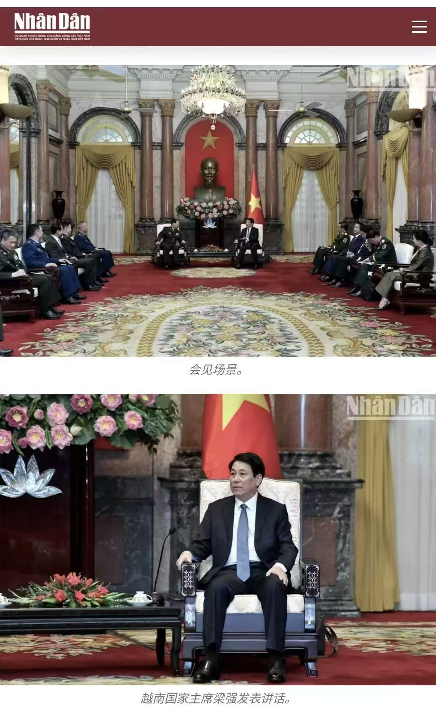

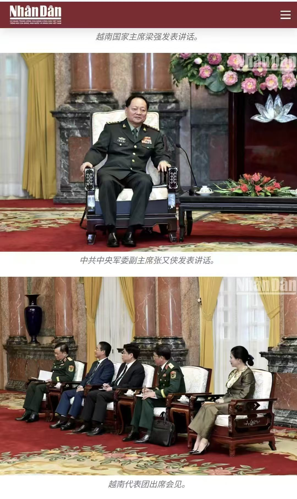

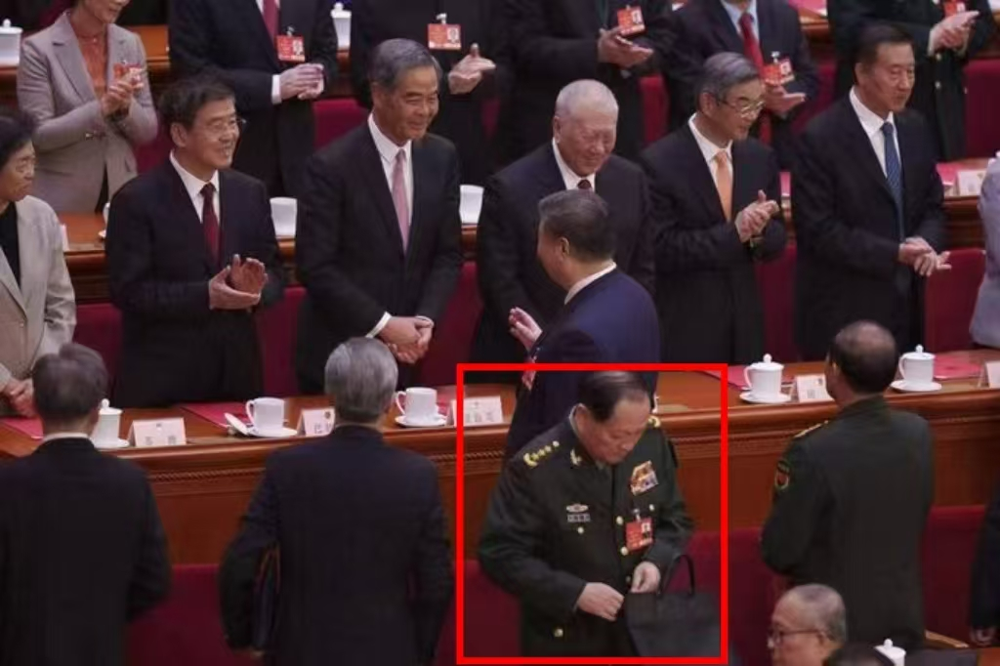

一切的开始，是从zhang 

把现在台面上puppet的jundui中培植的势力给连根拔起 

Zhang control Jun dui的时候

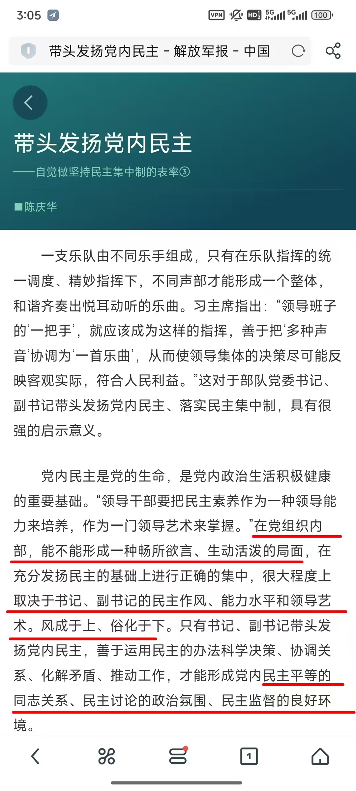

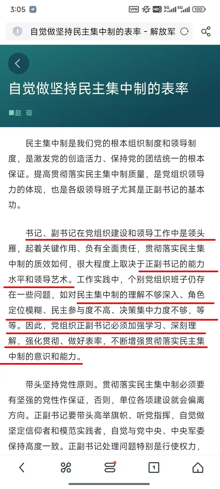

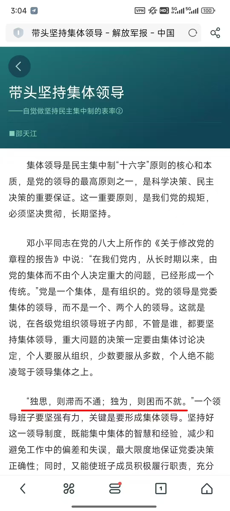

枪杆子出zq的，没了枪杆子，就开始成为台面puppet

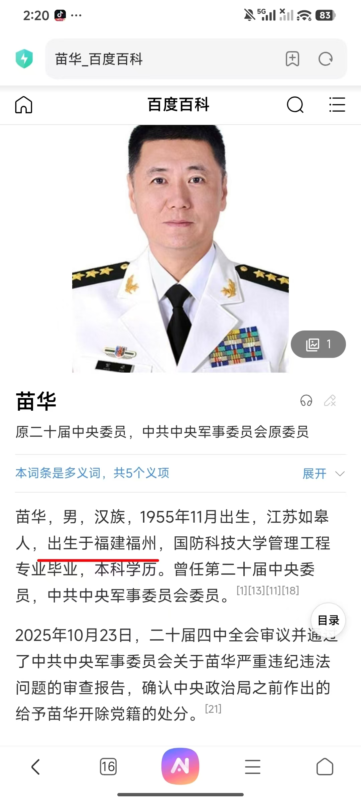


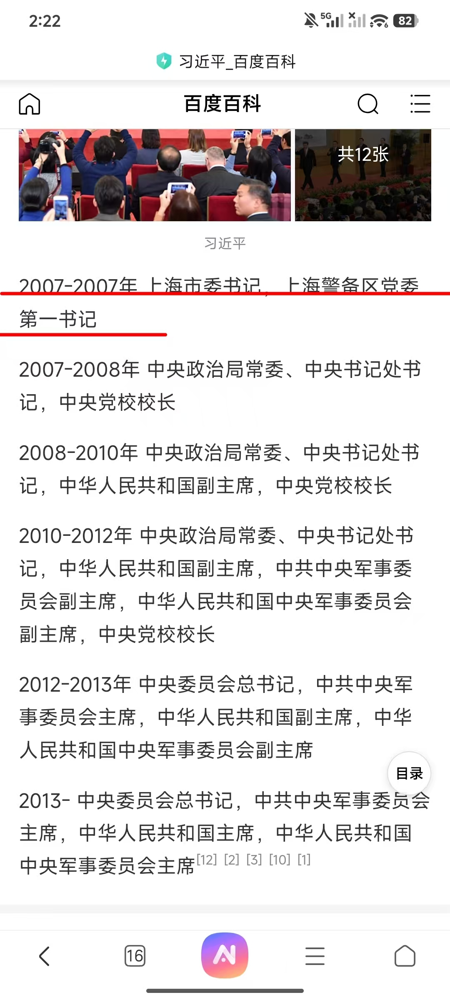


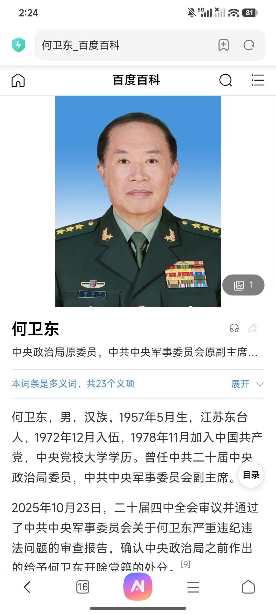

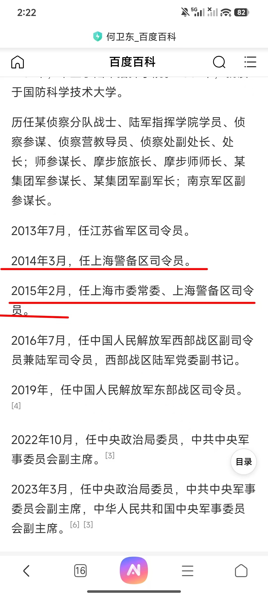

Ding:

但zhang 倒了， 怎么理解？


CE:

被搞突袭

苗这些都是消失半年以上，才宣布处理结果,这半年时间，就是各个派系谈判交易的时候

zhang刚消失两天，1号就急吼吼的马上要宣布结果，因为就是突袭才成功的 


Ding:

zhang的势力会被清除？


CE:

你处理了我的这个人，但是那个你不能动，这类的交易 

不会，依然控制半个jun dui

1号急吼吼宣布结果，现在人大开完了，zhang都消失了，但是还是在人大名单上 

所以为什么后面太监能反过来将军1号

因为没了枪杆子，实际组织派系，原来听指令的党鞭，反而就成为了最大的权力节点

包括hu和jiang的对抗，为什么tuan会溃败的这么快

ling被收拾了，组织整个tuan的党鞭和权力节点没了 

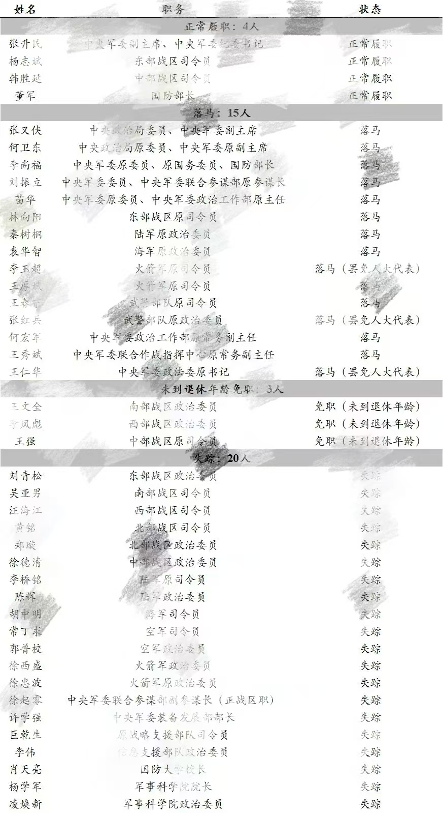

要结合一起看，才能理解

（一段视频）而且是Wang Yi，去捏手锤腿，表示我和你很麻吉，我对你掏心掏肺 

这组关系中，谁是大哥，谁是小弟 

1号培植的，替换wang yi的，但是wang yi非常不喜欢这个人 

之前是外交部礼宾司司长

1号培植起来，准备逐步清洗外交系统的 

wang本身，外交部亚洲司起步

整个外交系统，其实都是相对封闭的

包括wang为什么在亚洲司起步，因为有自己人照顾 

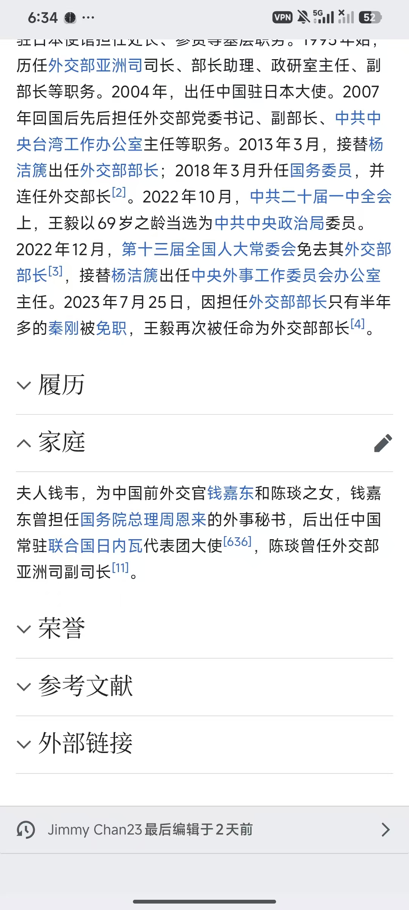

第一任的外交部长，就是zhou 

兼任

现在是1号安插进去的战狼系统，反而被清洗了 

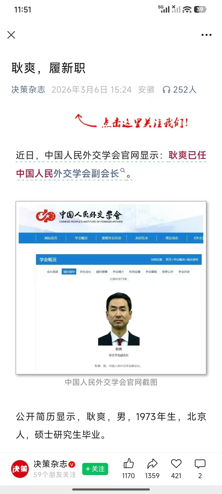

一撸到底，年纪轻轻的，就去赋闲了 

帮忙干活的，就是Cai

1号也保不住

qin都保不住呢

所以结构与秩序，远没有台面上看到的，这么简单的，而理解结构与秩序，是理解这个世界的基础

```
New Money转Old Money的方式，思考会不一样  
New Money赚的是波动
Old Money赚的是结构 
是思维方式的转变 
New Money赚波动，本质上是赚系统的暂时性失衡 
信息在圈层间流动的时差套利 
政策转向的窗口期 
技术代际切换的认知差 
价格偏离的均值回归 
New Money依赖信息差，Old Money生产信息差，New Money追逐波动，Old Money 定义波动发生的边界 
```

Other:

1是puppet ，太监是大佬？他们不是一伙的？[晕]

CE:

原来是

所以原来的党鞭，负责组织上下的，就成为了新的最大权力节点 

左2.3的职位，就是党鞭如下图：


jiang - zeng 

hu - ling

bing bang外交 

xiao学生，本来就是靠着厚黑，一直干别人

现在是被别人给轮流干了


Other：

解坊军几个月来一直没响应坚决拥护拿张


CE：

这个是国内最重要的经济学，财政学，zz学的运行结构和逻辑 

解放军报，直接全国发，下图


书记，指的就是1号

副书记，指的就是当时control jun dui的zhang


Ding：

这个文章是什么时候的？

CE：

zhang control的时候 

被搞突袭了

xiao学生，搞厚黑，那是炉火纯青

zhang刚消失2天，就发布了

因为1号根本control不了

是谈都无法谈 （苗这些都是消失半年以上，才宣布处理结果）


# 分析

It's in the 事件 subfolder.这篇是个微信群聊天记录，用了大量代号和拼音缩写来规避审查，所以你看不懂。它分两条线：一条聊政治权力结构，一条聊一个商业模式。我先把"黑话"解码，再说它在讲什么。注意一点：**里面绝大部分是网络小道消息和阴谋论式的推测，不是官方事实**，看个思路就行，别当真。

>  代号对照

- **1号** = 最高领导人（习近平）
- **puppet（傀儡）** = 他们认为台面上的1号已经是个被架空的傀儡
- **zhang** = 张又侠（军委副主席，被指曾实际掌控军队）
- **jundui / jun dui** = 军队
- **党鞭** = 负责组织、上传下达的权力枢纽角色
- **苗** = 苗华（军中政工高官，曾"消失"被查）
- **qin** = 秦刚（前外长，被免）
- **wang yi** = 王毅（外长）
- **战狼** = 战狼外交那一批人
- **zhou** = 周恩来（首任外长）
- **Cai / 蔡奇**、**陈希** = 开头那条新闻的主角
- **hu / jiang** = 胡锦涛 / 江泽民；**tuan** = 团派（共青团派系）
- **ling** = 令计划（胡的大秘，被抓）；**zeng** = 曾庆红（江的人）
- **贾 / 西山会** = 贾跃亭那种"派系—资本—前台公司"的旧模式
- **俞浩 / 追觅** = 追觅科技创始人俞浩
- **央地博弈** = 中央和地方政府之间的利益博弈

政治这条线在讲什么

他们的核心论点借用了毛的那句"**枪杆子里出政权**"，引申出一套"谁控制了军队和组织系统，谁才有真权力"的分析框架：

故事版本是——张又侠一度实际掌控军队，把1号在军中培植的人"连根拔起"，于是1号失去了枪杆子，沦为台面上的"傀儡"。但后来张本人又被"**突袭**"拿下（他们说张才消失两天、6月1日就急着宣布结果，正因为是突袭才成功；对比苗华那种消失半年才公布，是因为各派系要慢慢谈判交易）。

由此延伸出一个反直觉的结论：当最高领导失去枪杆子后，**原本只负责执行、上传下达的"党鞭"（组织系统的人），反而变成了最大的权力节点**——也就是那句"为什么太监能反过来将军1号"。他们用胡锦涛—令计划、江泽民—曾庆红举例：扳倒了那个组织枢纽，整个派系就垮得很快（团派溃败是因为令计划被收拾）。外交系统也套这个框架：1号安插的"战狼"系统反被清洗，秦刚都保不住。

那句视频细节（王毅给某人捏手捶腿）是在判断"谁是大哥谁是小弟"——意思是被1号培植来替换王毅的人，反而失势了。

**一句话总结这条线**：群里有人在用"军权+组织权才是真权力"的逻辑，推演一套"习近平已被架空"的剧情。这是典型的海外/网络政治传言，没有任何可靠证据，当成一种分析视角看即可。

> 商业这条线在讲什么（俞浩/追觅）

这段其实和政治是同一个人在借题发挥，讲一个叫"**品牌手套**"的商业模式：

地方政府想搞股权投资、想要"高科技政绩"，但直接做传统项目不好看。于是找一个能"吹"的科技品牌（追觅/俞浩）当外壳——把品牌吹得越大、越响（吹到对标特斯拉、英伟达级别），地方政府就越容易借这个名义立项、给财政倾斜（"我们和追觅合作了"听起来就像"和阿里腾讯合作了"）。**实际项目主导和出钱的是地方政府，公司只是出个名头、抽几个点**，所以"全员搞宣传、不做技术"。

他们把这个和贾跃亭对比：贾是旧的"派系—资本—前台公司"模式（靠后台关系），俞浩是新的"轻资产品牌手套"模式（任何地方政府都能拿来用）。所谓"叫停"，是说更上层看不下去了——吹牛可以，但合伙这么多项目一起套钱就不行了。

> 最后那段 New Money / Old Money

是发言者（CE）的个人感悟，跳出具体事件讲投资哲学：

> New Money 赚的是**波动**（信息差、政策窗口、技术换代的认知差、价格回归）；Old Money 赚的是**结构**——不是追逐波动，而是去**定义**波动发生的边界、去生产信息差。

放在这个群（你的投资笔记库）里，意思是：理解政治权力的"结构与秩序"，和理解市场的底层结构，是同一种思维——这也是为什么这篇被你归到投资资料里。

---

要不要我帮你把这篇整理成一份带正常人名、去黑话的清晰备忘录存到文件夹里？不过提醒一句，这些政治内容基本都是未经证实的传闻。


你完全没有党史基础，那我从最底层的"游戏规则"讲起，不堆人名。理解了规则，再看那篇就通了。

**第一件事：在中国，真正的权力不来自"职位"，来自两样东西——枪和人事。**

毛泽东有句名言"枪杆子里出政权"。意思是：谁能指挥军队，谁就有最终的话语权。光有个"主席""书记"的头衔没用，如果军队不听你的，你就是个摆设（群里说的"傀儡 puppet"就是这个意思）。

第二样是"组织人事权"，群里叫"党鞭"。简单说就是：**谁来决定谁升官、谁被查、谁被调走**。这个人表面上只是"办事的、执行的"，看着不起眼，但因为全党上下的官员前途都捏在他手里，所以他实际上是个隐形的权力枢纽。群里那句"为什么太监能反过来将军"就是说——那个看似只是"管事的太监"，其实手里攥着所有人的命运，反而能制服名义上的皇帝。

**把这两条记住，整篇文章的逻辑就是：判断一个人是真有权还是空架子，不看他的头衔，看他手里还有没有"枪"（军队）和"人事权"。**

------

**第二件事：派系。**

中共高层不是铁板一块，是一个个"山头"。每个大佬底下都有自己的人马。文章举了两个历史例子（这就是你说的"党史"，其实就是过去二十年的权力斗争）：

- 江泽民这个山头，干活的核心助手是曾庆红。
- 胡锦涛那个山头（叫"团派"，因为这些人都是从共青团系统上来的），核心助手是令计划。

规律是：**你想打垮一个山头，不用一个个打，只要把那个"核心助手/人事枢纽"拿掉，整个山头就自己散了。** 令计划一被抓，团派很快就垮了——因为组织这帮人的那根线断了。这是文章反复强调的"结构"。

------

**第三件事：那篇文章到底在传什么"瓜"？**

理解了上面两条，故事就简单了。群里有人（代号 CE）在讲一个**未经证实的传闻**，剧情是这样：

1. 有个军队里的实权人物（文中代号 zhang，影射张又侠），一度真正掌握了军队，把最高领导（代号"1号"，影射习近平）安插在军中的人马清除掉了。
2. 一旦最高领导失去了对军队的控制，按"枪杆子"的逻辑，他就从真皇帝变成了"傀儡"——名义还在，实权没了。
3. 但后来这个 zhang 自己又被"突袭"拿下了。（群里的"证据"是：通常高官出事要消失大半年才公布结果，因为各派系要私下谈判交易；而 zhang 才消失两天就急着宣布，说明是搞突然袭击、来不及谈。）
4. 结论：现在最高领导其实也没完全赢回来，权力散落在几个掌握"人事权"的人手里。

外交系统那段是同一个逻辑的小例子：最高领导本想安插自己人、慢慢换掉老外长（王毅），结果自己安插的人反而被清洗了——证明"1号"没那么大权力，连秦刚（被免职的前外长）都保不住。

------

**最重要的一句话：这些都是网上的政治小道消息和推测，没有任何官方证据，很可能是假的。** 它的价值不在"内幕是否属实"，而在于它示范了一种**分析视角**——别看头衔，看谁掌握军队和人事。这也是为什么发言者最后扯到投资（"看结构而不是看表面波动"），并被你收进了投资笔记库。

至于开头那条"蔡奇当中央党校校长、陈希卸任"，那是真实的人事调动新闻，只是被当成了这场讨论的引子。


### 推荐的书籍

你的笔记库里其实已经有几本很对路的了——《红色轮盘》《美国反对美国》《潜规则》《万历十五年》《以利为利》。这些其实已经在讲"权力的真实运作 vs 表面规则"。下面按入门到深入推荐几本，专门讲你关心的这套"枪+人事=权力""派系斗争"的逻辑。

**最对症的一本，先读这本：**

理查德·麦格雷戈《党：中国共产党不可告人的世界》(Richard McGregor, *The Party*)。它正好系统讲了那篇文章里的两个核心机制——党怎么控制军队、怎么通过"中组部"控制全国所有重要官员的任免（也就是群里说的"党鞭/人事权"）。读完这本，你再回头看那篇聊天，会瞬间通透。

**入门、好读的：**

傅高义《邓小平时代》——以邓为主线，把改革开放年代的高层博弈讲得清楚又好读，是了解当代权力结构最好的起点之一。

赵紫阳《改革历程》（口述录音整理）——前总书记本人讲八九前后高层是怎么决策、怎么斗的，第一手视角，理解"台面规则"和"台下实权"的差距特别直观。

**讲派系斗争、最贴近那篇主题的：**

杨继绳《中国改革年代的政治斗争》——专门写改革开放后历次高层路线斗争和人事较量，"谁扳倒谁、靠的是什么"讲得很细。

**讲这套规则是怎么形成的（真正的"党史"源头）：**

高华《红太阳是怎样升起的：延安整风运动的来龙去脉》——这本是关键。它讲毛泽东当年怎么靠"整风"（思想清洗）+ 牢牢抓住组织人事权，从一个山头一步步变成绝对核心。那篇文章里所有的"党鞭""清洗""枪杆子"逻辑，源头都在这里。学界公认的经典。

**偏学术、想深挖再读：**

寇健文《中共菁英政治的演变》——研究高层接班、派系、权力交接制度化的学术著作，框架感强。

邹谠《二十世纪中国政治：从宏观历史与微观行动的角度看》——分析框架的奠基之作，偏理论，适合最后读。

------

建议路径：先《党》打底搞懂机制 → 《邓小平时代》补当代脉络 → 《红太阳是怎样升起的》看源头 → 想深入再上杨继绳和寇健文。


### 俞浩和地方政府是什么意思

这条线和政治无关，是讲一个商业套路。我先讲背景，你就懂了。再次提醒：这是群里那个人的**推测和评论**，不是关于俞浩/追觅的已证实事实。

**背景：地方政府为什么要"搞投资"？**

中国的地方政府（市、区一级）有个长期的考核压力：要招商引资、要出"高科技政绩"、要让本地经济数据好看。同时它们手里有钱（财政、各种"政府引导基金"），需要投出去。

但问题是：地方政府如果直接说"我们投了一个修路、盖厂房的传统项目"，不好看、没政绩；可如果说"我们引进了一家明星高科技公司、和它合作搞前沿产业"，那就既有面子、又容易立项、还能从上面争取到更多财政支持。

**所以地方政府真正缺的，是一个"听起来很高科技的牌子"。**

------

**什么是"品牌手套"？**

群里把俞浩/追觅比作一只"手套"。意思是：

地方政府是那只"手"——真正出钱、真正主导项目的是它。 追觅这个品牌是套在手上的"手套"——提供一个光鲜的外壳。

操作上：地方政府想干的事（哪怕是比较传统的项目），套上"和追觅合作"这个名头来做。对外宣传就变成"我们引进了明星科技企业落地高科技产业园"。**钱是地方出的，活是地方主导的，公司主要负责"出名头、抽几个点"。**

这就是为什么群里说这家公司"全员搞宣传、不做技术"——因为在这个模式里，公司最大的价值不是技术，而是**把牌子吹得足够响**。

------

**为什么要拼命"吹"？**

关键在这句：牌子越大，地方越好用。

打个比方：如果一个地方说"我们和阿里、腾讯合作了"，含金量很高，上级一听就愿意给政策、给钱。但阿里腾讯这种顶级牌子，不会随便借给一个小地方用。

所以地方需要一个"够大、又愿意被借用"的牌子。俞浩做的事，就是把追觅这个品牌使劲往上吹——吹到对标特斯拉、英伟达那个量级。**只要社会上形成了"这是个超级科技公司"的认知就够了**，至于是不是真的有那么牛，"信不信不重要，地方和公司各取所需"。

群里说的"叫停"，是指上面（更高层）后来看不下去了——你吹牛是你的自由，但你借着这个牌子，和一堆地方合伙立项、把财政的钱往里套，那就不行了。

------

**和贾跃亭有什么区别？**

群里特意对比了贾跃亭（乐视）：

- 贾是**旧模式**："派系—资本—前台公司"。靠的是背后有政治派系撑腰（"西山会"），派系一倒，公司就完了。
- 俞浩是**新模式**："品牌手套"，更轻。不依赖某个后台派系，而是把自己包装成一个谁都能拿来用的通用品牌，全国各地的地方政府都能套。所以叫"轻资产"——核心资产就是那块会吹的招牌。

------

一句话：这段在讲一种"**地方政府出钱出力、借一个被吹大的科技品牌当门面，把传统投资包装成高科技政绩**"的玩法。说的真假无从核实，但它描述的"地方政府需要高科技政绩、所以愿意配合一个明星品牌"的底层动机，是真实存在的现象。


