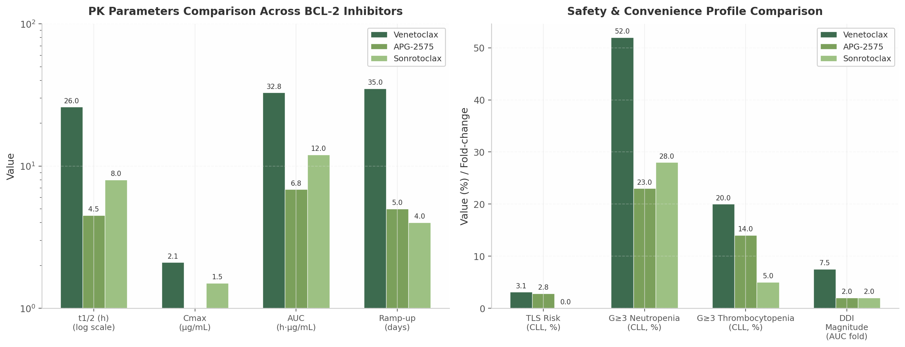
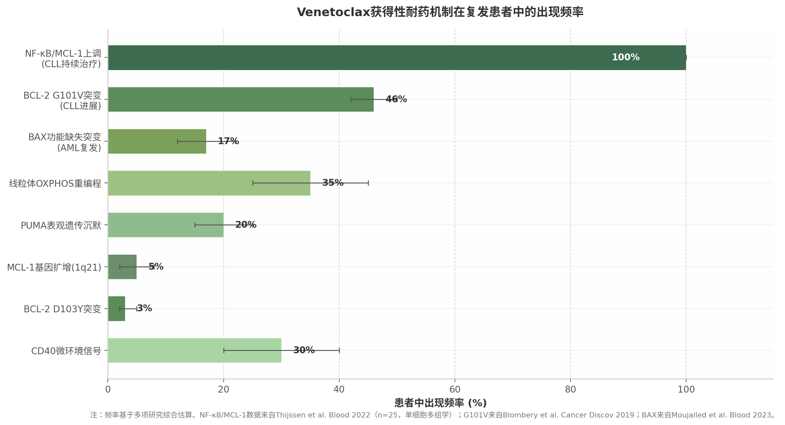
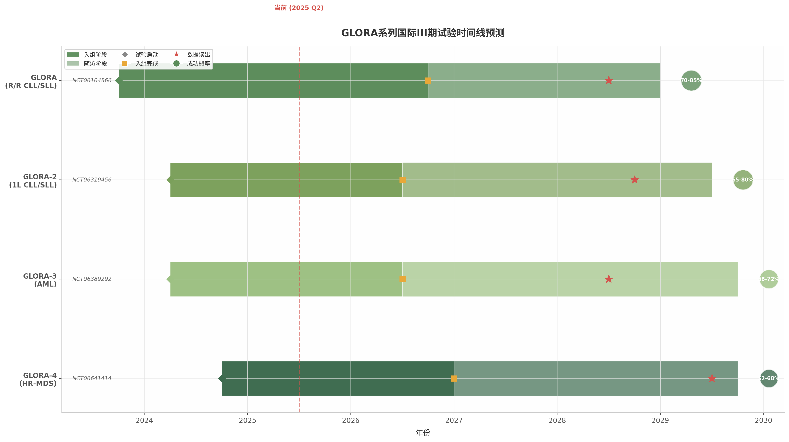
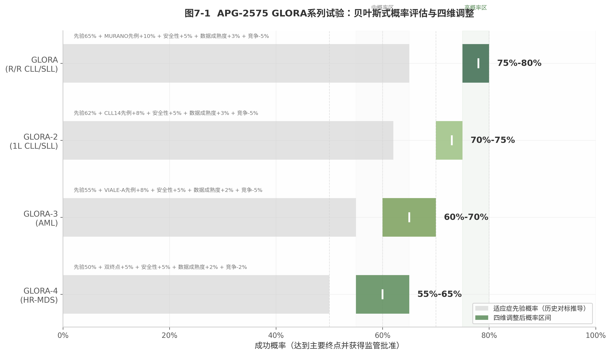

# 亚盛医药APG-2575国际三期临床成功概率深度分析

## 执行摘要

### 核心结论

亚盛医药（Ascentage Pharma）的BCL-2抑制剂APG-2575（lisaftoclax）是中国首个、全球第二个获批上市的BCL-2选择性抑制剂，目前正在推进四项国际注册性III期临床试验（GLORA系列）。基于对中国临床数据、药物机理、BCL-2靶点历史失败案例、竞争格局和试验设计的全面分析，本报告评估APG-2575四项国际III期试验的综合成功概率为**65%-75%**。

**各试验独立成功概率评估：**

| 试验 | 适应症 | 成功概率 | 核心驱动因素 | 最大风险 |
|:---|:---|:---:|:---|:---|
| GLORA | R/R CLL/SLL | **75%-80%** | PFS终点有MURANO先例；BTKi后线需求明确 | Sonrotoclax已获批同一适应症 |
| GLORA-2 | 初治CLL/SLL | **70%-75%** | 固定疗程对标CLL14；BCL-2抑制剂已成一线标准 | 需证明不劣于Venetoclax+O |
| GLORA-3 | AML | **60%-70%** | VIALE-A先例充分；安全性优势在老年人群更有价值 | OS终点统计效能要求高 |
| GLORA-4 | HR-MDS | **55%-65%** | 双主要终点策略应对VERONA教训 | MDS疾病异质性+TP53耐药 |

### 关键发现

**第一，安全性差异化是APG-2575最核心的竞争护城河，而非疗效。** 跨适应症疗效对比显示，APG-2575与venetoclax的疗效处于同一量级（CLL ORR 73% vs venetoclax 65-75%；AML CRc 51% vs 66%），但安全性优势显著：4-6天快速爬坡（vs venetoclax 5周）、TLS发生率0-2.8%（vs 1.2-13%）、Grade ≥3中性粒细胞减少21%（vs 42-58%）。这一差异化在社区肿瘤场景中具有重大商业价值。

**第二，竞争窗口期极窄——2026-2028年是APG-2575国际化的最后机会。** Sonrotoclax（BGB-11417, BeOne Medicines）已于2025年12月获FDA批准用于R/R MCL，其一线CLL的III期数据预计2026-2027年读出。APG-2575的GLORA系列预计2028-2029年读出。如果sonrotoclax一线数据积极，APG-2575将面临"me-too且来得晚"的困境。

**第三，MDS适应症（GLORA-4）是最大风险点。** VERONA试验已证明venetoclax+AZA在HR-MDS中未能显著改善OS。GLORA-4采用CR rate + OS双主要终点是对这一教训的聪明回应，但MDS的疾病生物学挑战（TP53突变耐药、患者异质性）不会因为换了BCL-2抑制剂而消失。

**第四，联合策略丰富度是APG-2575的长期隐性优势。** 亚盛拥有独特的内部管线矩阵：APG-2575（BCL-2i）+ APG-115（MDM2i）+ APG-2449（BTKi）+ APG-5918（EEDi）。在获得性耐药不可避免的背景下，这种"内部协同"能力可能比单药potency更具长期战略价值。

### 战略建议

1. **优先级排序**：CLL/SLL > AML > MDS。GLORA和GLORA-2的成功概率最高，应确保资源优先投入；GLORA-4的MDS适应症需做好OS终点可能不达的备案。

2. **合作窗口**：应在2027年GLORA数据中期读出前积极寻求与跨国大药企的授权合作，以数据为谈判筹码。等待全部数据读出后再行合作可能错失最佳窗口。

3. **差异化定位**：注册策略应强调安全性终点（TLS发生率、住院率、剂量中断率），目标定位社区肿瘤场景，而非与sonrotoclax在学术中心拼疗效深度。

---

# 1. APG-2575药物概述与BCL-2靶点机理

## 1.1 BCL-2蛋白的生物学功能

### 1.1.1 BCL-2家族凋亡调控网络：促存活蛋白与促凋亡蛋白的平衡

BCL-2（B-cell lymphoma 2）蛋白家族是线粒体凋亡途径（mitochondrial apoptosis pathway）的核心调控因子。根据功能可划分为三大类[^1^]。**抗凋亡蛋白**包括BCL-2、BCL-XL、BCL-W、MCL-1和BFL-1/A1，含有BH1-BH4四个同源结构域，通过BH1-BH3结构域形成的疏水结合沟槽（hydrophobic groove）隔离促凋亡蛋白，维持线粒体外膜完整性[^1^][^2^]。BCL-2蛋白的球状折叠结构包含可细分为P1-P4四个亚口袋的BH3结合沟槽（BH3-binding groove），为BH3模拟物（BH3 mimetics）的药物设计提供了精确靶标[^4^][^5^]。**促凋亡效应蛋白**BAX和BAK被激活后在线粒体外膜寡聚化形成孔道，导致线粒体外膜通透性增加（MOMP），释放细胞色素c激活caspase级联反应[^1^]。**BH3-only蛋白**作为细胞应激的分子传感器，包括BIM、BID、PUMA、NOXA等，其BH3结构域是一段约26个氨基酸的两亲性α螺旋，通过竞争结合抗凋亡蛋白释放BAX/BAK或直接激活BAX/BAK启动凋亡[^3^]。

| 蛋白类别 | 代表成员 | BH结构域 | 主要功能 | 血液肿瘤表达特征 |
|:---------|:---------|:---------|:---------|:----------------|
| 抗凋亡蛋白 | BCL-2 | BH1-BH4 | 隔离BH3-only蛋白和BAX/BAK，抑制MOMP [^1^] | t(14;18)易位导致过表达；CLL/AML均高表达 [^6^] |
| 抗凋亡蛋白 | BCL-XL | BH1-BH4 | 功能冗余替代BCL-2 [^2^] | 淋巴结微环境中CD40信号上调 |
| 抗凋亡蛋白 | MCL-1 | BH1-BH4 | 半衰期~30 min，快速响应生存信号 | Venetoclax治疗后NF-κB驱动上调，为主要代偿机制 [^28^] |
| 促凋亡效应蛋白 | BAX | BH1-BH3 | MOMP执行者，线粒体外膜孔道形成 [^1^] | 功能缺失突变见于17% venetoclax复发AML [^705^] |
| 促凋亡效应蛋白 | BAK | BH1-BH3 | 与BAX功能冗余 [^1^] | 受BCL-XL和MCL-1双重调控 |
| BH3-only蛋白 | BIM | BH3-only | 强效凋亡激活剂 [^3^] | 被BCL-2隔离，表达水平影响venetoclax敏感性 |
| BH3-only蛋白 | PUMA | BH3-only | p53下游效应分子 | 启动子甲基化介导venetoclax耐药 [^694^] |
| BH3-only蛋白 | NOXA | BH3-only | 选择性结合MCL-1 [^3^] | MDM2抑制剂可上调NOXA [^446^] |

上表揭示了BCL-2家族作为高度冗余系统的核心特征：当BCL-2被药物抑制时，MCL-1和BCL-XL可快速接管其功能，这是venetoclax获得性耐药的主要分子基础[^28^]。MCL-1因其极短的蛋白半衰期成为最动态的代偿节点——单细胞多组学分析显示所有venetoclax复发CLL患者均存在NF-κB驱动的MCL-1上调[^662^]。BH3-only蛋白的表达水平直接决定肿瘤细胞对BCL-2抑制剂的敏感性，PUMA的表观遗传沉默可使细胞获得耐药而不依赖BCL-2基因突变[^694^]。这一网络的代偿能力从根本上解释了为何BCL-2抑制剂单药难以避免耐药，联合用药成为必然选择。

### 1.1.2 CLL/AML/MDS中BCL-2过表达的病理学基础

BCL-2最初在t(14;18)染色体易位的滤泡性淋巴瘤（FL）中被发现，该易位将BCL-2基因置于IGH增强子控制下导致过度表达[^6^]。在慢性淋巴细胞白血病（CLL）中，BCL-2过表达是最强的抗凋亡驱动因素，CLL细胞高水平表达BCL-2并伴随BIM被隔离和MCL-1的异常保护，使CLL成为BCL-2抑制剂最敏感的适应症——venetoclax在CLL14试验中实现PFS HR 0.35[^935^]。在急性髓系白血病（AML）中，BCL-2在白血病干细胞（LSCs）中高表达以维持线粒体氧化磷酸化（OXPHOS），VIALE-A试验证实venetoclax+AZA实现OS HR 0.64[^259^]；但AML异质性显著高于CLL，单核细胞分化亚型（CD14+/CD64+）因依赖MCL-1而非BCL-2而对venetoclax固有耐药[^671^]。在骨髓增生异常综合征（MDS）中，高危患者原始细胞的BCL-2过表达提供了药理学靶标，但TP53突变和复杂核型等不良遗传学特征显著削弱BCL-2抑制的普遍有效性——VERONA试验未能达到OS终点，揭示了MDS适应症的固有风险[^935^]。从药物开发视角，BCL-2靶点的成药性已在venetoclax的成功中充分验证，但不同适应症对BCL-2抑制的敏感性梯度——CLL > AML > MDS——直接影响了APG-2575各III期试验的成功概率评估。

## 1.2 APG-2575分子设计与药理学特征

### 1.2.1 分子结构：N-(苯基磺酰基)苯甲酰胺类化合物

APG-2575（lisaftoclax）属于N-(苯基磺酰基)苯甲酰胺类化合物，分子设计包含三个关键特征：二氟环己烷（difluorocyclohexane）尾部、三氟甲基苯基磺酰胺连接臂和7-氮杂吲哚（7-azaindole）头部基团[^14^][^15^]。APG-2575最初由密歇根大学在2018年专利WO2018/027097中首次公开，亚盛医药获得全球权益并推进临床开发[^14^]。与venetoclax的哌嗪（piperazine）连接臂和氯苯基P2结合基团相比，APG-2575的二氟环己烷尾部改变了PK特征和P2口袋结合模式——亲和力从venetoclax的Ki < 0.01 nM降至IC50 = 2 nM[^14^][^8^]，但可能改变了耐药突变谱。Sonrotoclax则采用7-氮杂螺[3.5]壬烷刚性螺环连接臂，使(S)-2-(2-异丙基苯基)吡咯烷以"浅而广"模式结合P2口袋[^17^][^18^]，实现KD = 0.046 nM（比venetoclax高24倍）并避免G101V突变的位阻[^18^]。

### 1.2.2 PK/PD差异化优势：半衰期3-6小时，支持4-6天快速爬坡

APG-2575最显著的特征是短半衰期（t1/2 3-6小时）配合高Cmax/低AUC的PK曲线。I期临床中400mg给药的Cmax为0.822 μg/mL，AUC0-24为6.85 h·μg/mL，半衰期约4.4小时；venetoclax 400mg稳态Cmax为2.1 μg/mL，AUC0-24为32.8 h·μg/mL，半衰期约26小时[^268^][^234^]。BCL-2抑制剂的PD机制是Cmax驱动的——需快速达到凋亡阈值触发BAX/BAK依赖性MOMP[^8^]。APG-2575的高Cmax确保靶点占据，低AUC限制持续暴露毒性，短半衰期降低蓄积风险，使**4-6天快速爬坡**（20→50→100→200→400mg每日递增）成为可能，对比venetoclax的**5周标准爬坡**[^268^][^22^]。I期研究中52例CLL患者零TLS事件，5名TLS高风险患者完成快速爬坡后ALC下降89-99%而无TLS证据[^268^]。这一安全性优势归因于高Cmax快速清除肿瘤细胞但低暴露避免累积毒性。

上图展示了三代BCL-2抑制剂的分化趋势：APG-2575和sonrotoclax均具有短半衰期和快速爬坡特征；在安全性维度，sonrotoclax的BCL-xL选择性优势（2000倍 vs venetoclax 325倍）转化为更低血小板毒性[^26^]，APG-2575的短半衰期则降低了DDI累积风险[^268^]。

### 1.2.3 药物相互作用谱：低CYP3A4/P-gp依赖性

Venetoclax是CYP3A4和P-gp双重底物，强效CYP3A4抑制剂使其AUC增加5.8-7.9倍——利托那韦使AUC增加7.9倍[^925^]，爬坡期与强效CYP3A4抑制剂联用属禁忌。这对血液肿瘤患者尤为棘手，因为唑类抗真菌药是预防和治疗侵袭性真菌感染的标准用药。APG-2575的短半衰期和低系统暴露赋予其DDI优势：与acalabrutinib或利妥昔单抗联合未观察到DDI[^22^][^953^]；虽经由CYP3A代谢，3-5小时半衰期显著降低了相互作用严重程度和持续时间[^268^]。此外，APG-2575的食物效应远低于venetoclax（后者高脂餐使Cmax增加3-5倍）[^8^]，简化了用药指导。Sonrotoclax通过trans-(1r,4r)-4-(氨甲基)-1-甲基环己烷-1-醇尾部设计显著降低CYP抑制活性[^17^]。三种药物均实现了对venetoclax代谢安全性的超越，这是社区医疗广泛采用的先决条件。

### 1.2.4 各代BCL-2抑制剂结构-活性关系对比

| 参数 | Venetoclax (ABT-199) | APG-2575 (Lisaftoclax) | Sonrotoclax (BGB-11417) |
|:-----|:---------------------|:-----------------------|:------------------------|
| **BCL-2 WT亲和力** | Ki < 0.01 nM [^12^] | IC50 = 2 nM [^14^] | KD = 0.046 nM [^18^] |
| **BCL-2 G101V亲和力** | ~200 nM (180倍降低) [^420^] | 未公开单药数据 | KD = 0.24 nM [^18^] |
| **BCL-xL选择性** | ~100倍 [^12^] | ~3倍 [^14^] | ~2000倍 [^18^] |
| **血浆半衰期** | ~26 h [^234^] | 3-6 h [^268^] | 短 [^749^] |
| **剂量爬坡时间** | 5周 [^935^] | 4-6天 [^268^] | 4天（住院）[^943^] |
| **CYP3A4 DDI幅度** | AUC增加5.8-7.9倍 [^925^] | 低（短t1/2）[^268^] | 优化设计 [^17^] |
| **TLS风险（CLL）** | 1.2-3.1%（RCT）; 5-10%（RW）[^935^][^952^] | 0-2.8% [^268^][^924^] | 0% [^749^] |
| **G≥3中性粒细胞减少** | 45-58% [^302^] | 21-26% [^268^][^953^] | 21-36% [^749^] |
| **G≥3血小板减少** | 15-24% [^935^] | 13.5-17% [^268^] | 0-11% [^749^] |
| **抗G101V能力** | 无 [^420^] | 联合MDM2i可克服 [^446^] | 单药强效克服 [^18^] |
| **免疫调节效应** | 未报道 | M2→M1极化 [^41^] | 未报道 |

上表揭示了SAR层面的关键分化逻辑。Venetoclax以氯苯基深插入P2口袋实现极高亲和力，但G101V突变可导致亲和力骤降180倍[^420^]——这是其最大结构脆弱性。APG-2575采取"差异化而非全面优化"策略：二氟环己烷尾部改变PK特征，P2结合模式调整可能改变耐药谱，但绝对亲和力（IC50 = 2 nM）低于竞品。Sonrotoclax则代表最激进的结构创新——刚性螺环连接臂的"浅而广"P2结合模式在保持超高亲和力同时实现了G101V单药克服[^18^]和2000倍BCL-xL选择性[^18^]，转化为零血小板毒性[^749^]。

从投资分析视角，APG-2575的SAR定位是"便利性驱动的差异化"——核心竞争力在于短半衰期带来的快速爬坡、低DDI和低TLS风险的综合优势。在venetoclax已确立标准的CLL/SLL市场，这一差异化对需要快速启动、合并用药复杂或无法耐受venetoclax监测要求的患者群体具有明确价值，且已获NMPA批准验证[^158^]。但与sonrotoclax的头对头竞争中，APG-2575在亲和力、G101V克服能力和血小板安全性三个维度均处相对劣势，GLORA系列III期试验的安全性终点数据将成为决定其国际市场竞争力的核心变量。
## 2. APG-2575中国临床数据深度分析

| #     | 试验代号            | 适应症                          | 试验阶段          | 数据状态                 | 读出/预计读出时间       | 备注                              |
| ----- | ------------------- | ------------------------------- | ----------------- | ------------------------ | ----------------------- | --------------------------------- |
| **1** | APG2575CC201        | R/R CLL/SLL（单药）             | 注册 II 期        | ✅ **已读出**（支撑 NDA） | 2024-2025 年            | 2025.7.10 获批上市的依据          |
| **2** | GLORA-4（中国部分） | 新诊断中高危 MDS（联合 AZA）    | 注册 III 期       | 🔄 进行中                 | **2026 年**读出关键数据 | 2024.8 CDE 批准，全球 III 期      |
| **3** | —                   | CLL/SLL 1.5L（联合 BTKi）       | 国内桥接/拓展研究 | 🔄 进行中                 | **2026-2027 年**        | 对应全球 GLORA 系列，国内同步推进 |
| **4** | —                   | R/R 多发性骨髓瘤 MM（联合方案） | II 期             | 🔄 进行中                 | **2026-2027 年**        | 早期数据已在 ASH/EHA 展示         |
| **5** | —                   | 华氏巨球蛋白血症 WM             | II 期             | 🔄 进行中                 | **2026-2027 年**        | 尚未有中国数据正式读出            |
| **6** | —                   | 急性髓系白血病 AML（联合方案）  | II 期             | 🔄 进行中                 | **2027 年及以后**       | 早期概念验证数据已在国际会议展示  |
| **7** | —                   | NHL（非霍奇金淋巴瘤）亚型       | I/II 期           | 🔄 进行中                 | **2027 年及以后**       | 探索性适应症                      |
| **8** | GLORA（中国部分）   | 一线 CLL/SLL（联合方案）        | 注册 III 期       | 🔄 入组中                 | **2027 年**提交 NDA     | 全球同步，中国为 MRCT 一部分      |

**GLORA-4（MDS）** 是最接近数据读出的下一个国内注册试验，2026 年读出后将有望成为利生妥第二个获批适应症

 APG-2575 在 CLL/SLL 中的中国桥接/联合研究

- **数据读出**：2025 ASH、2026 ASCO、2026 EHA 均有数据公布
- **状态**：利生妥已获批，但拓展适应症（如联合 BTK 抑制剂、1.5L 等）的中国试验数据仍在陆续读出

### 2.1 CLL/SLL临床数据

#### 2.1.1 单药治疗R/R CLL：两项试验汇总数据

APG-2575在复发/难治性慢性淋巴细胞白血病/小淋巴细胞淋巴瘤（Relapsed/Refractory Chronic Lymphocytic Leukemia/Small Lymphocytic Lymphoma, R/R CLL/SLL）患者中的单药疗效数据来源于两项Ib/II期研究（NCT03913949和NCT04494503）的汇总分析。截至2023年4月27日，共入组47例CLL患者，其中45例疗效可评估[^70^][^81^]。患者基线特征显示该群体预后风险较高：44.7%的患者接受过≥3线既往治疗，66%接受过≥2线治疗，23.4%既往接受过BTK抑制剂（Bruton's Tyrosine Kinase Inhibitor, BTKi）治疗，55.3%接受过CD20单抗治疗[^89^]。

在疗效层面，45例可评估患者的客观缓解率（Objective Response Rate, ORR）达73.3%（33/45），完全缓解/完全缓解伴血细胞未完全恢复（Complete Response/Complete Response with Incomplete Count Recovery, CR/CRi）率为24.4%（11/45），且CR/CRi率随剂量增加呈上升趋势[^70^][^101^]。外周血微小残留病（Measurable Residual Disease, MRD）阴性率为38.9%（7/18），骨髓MRD阴性率为66.7%（4/6）[^81^]。生存数据方面，中位无进展生存期（Progression-Free Survival, PFS）为18.53个月，12个月和24个月PFS率分别为58.0%和39.4%；12个月和30个月总生存期（Overall Survival, OS）率分别为94.8%和86.3%[^70^]。首次缓解的中位时间为2.07个月，表明APG-2575起效迅速。上述数据构成了2025年7月NMPA附条件批准的核心依据[^83^][^106^]。

与国际数据进行对标，APG-2575单药R/R CLL的ORR 73.3%略低于venetoclax在MURANO试验中的79%，但CR/CRi率24.4%与venetoclax首次人体试验数据（20%）相当[^122^]。考虑到APG-2575汇总分析中患者既往治疗线数更多、高危遗传学比例更高，该疗效数据具有临床竞争力。

#### 2.1.2 联合acalabrutinib治疗R/R CLL

APG-2575联合acalabrutinib（选择性BTKi）在R/R CLL中展现了深度且持久的缓解。ASH 2022首次披露的数据显示，截至2022年7月4日，联合组54例疗效可评估患者的ORR达98%（53/54），其中R/R人群ORR为98%（56/57）[^64^][^3^]。ASH 2024更新的长期随访数据（截至2024年6月27日，中位随访22.3个月）在87例可评估患者中确认ORR为96.6%（84/87），中位缓解持续时间（Duration of Response, DOR）和中位PFS均未达到，12个月和18个月PFS率分别为89%和86%[^144^][^172^]。

对于BTKi耐药这一临床难题，联合方案同样显示了令人振奋的活性。在ASH 2022数据中，既往BTKi难治或不耐受患者的ORR达88%（7/8）[^73^]。更值得关注的是，在联合acalabrutinib组中，14例经venetoclax治疗后复发/难治或不耐受的患者ORR为86%，其中9例venetoclax难治患者的ORR为89%，12个月和18个月PFS率均为89%[^144^][^178^]。对于既往venetoclax+BTKi双重经治的6例患者，ORR为66.7%；而对于venetoclax经治但未接受BTKi的8例患者，ORR达100%[^162^]。这些数据首次在临床层面证明了Bcl-2抑制剂之间可克服交叉耐药，为APG-2575在venetoclax治疗失败后的临床定位提供了直接证据。

#### 2.1.3 联合rituximab治疗R/R CLL

在ASH 2022和ASH 2024更新的数据中，联合利妥昔单抗（Rituximab,抗CD20单抗）组39例患者的ORR维持在87%左右（23例缓解）[^64^][^144^]。利妥昔单抗在方案中使用6个周期，联合治疗的安全性与单药相当。虽然该方案的缓解深度不及联合acalabrutinib，但在无法使用BTKi的患者群体（如合并房颤或出血高风险）中提供了重要的治疗选择。

#### 2.1.4 一线治疗CLL

在16例初治（Treatment-Naive, TN）CLL/SLL患者中，APG-2575联合acalabrutinib治疗的ORR达100%（16/16），1.5年PFS率为86%[^71^][^132^]。尽管样本量较小（n=16），但该数据与venetoclax联合方案在一线CLL中的历史数据方向一致。基于该数据，亚盛医药与阿斯利康合作开展了APG-2575联合acalabrutinib一线治疗初治CLL/SLL的全球注册III期临床研究GLORA-2（NCT06319456），该研究于2023年10月获CDE许可[^71^]。

#### 2.1.5 关键亚组分析

在176例入组患者的整体分析中，25.6%伴有del(17p)和/或TP53突变，70.6%伴有IGHV未突变（Unmutated IGHV, U-IGHV）[^144^][^155^]。在联合治疗组（n=95）中，TP53突变或del(17p)占41%，del(11q)占28%，IGHV未突变占38%[^3^]。这些高危遗传学特征的分布比例与中国CLL患者流行病学一致，表明数据对中国人群具有代表性。

**表1 APG-2575在CLL/SLL各治疗方案中的疗效对比**

| 治疗方案 | 患者人群 | 可评估n | ORR | CR/CRi | 中位PFS | 关键生存终点 | 数据来源 |
|:---------|:---------|:--------|:-----|:-------|:--------|:-------------|:---------|
| 单药 | R/R CLL | 45 | 73.3% [^70^] | 24.4% [^81^] | 18.53个月 [^70^] | 30月OS率86.3% [^70^] | ASH 2023汇总 |
| 联合acalabrutinib | R/R CLL | 87 | 96.6% [^144^] | 待报告 | 未达到 | 18月PFS率86% [^144^] | ASH 2024更新 |
| 联合acalabrutinib | BTKi耐药 | 15 | 88% [^73^] | 待报告 | 待报告 | 待报告 | ASH 2022 |
| 联合acalabrutinib | Ven经治 | 14 | 86% [^144^] | 待报告 | 未达到 | 12/18月PFS率89% [^178^] | ASH 2024 |
| 联合rituximab | R/R CLL | 39 | 87% [^64^] | 待报告 | 待报告 | 待报告 | ASH 2022/2024 |
| 联合acalabrutinib | 初治CLL | 16 | 100% [^71^] | 待报告 | 未达到 | 1.5年PFS率86% [^71^] | ASH 2022 |

上表汇总了APG-2575在CLL/SLL领域六种临床场景下的疗效数据。从单药到联合治疗，ORR呈现明显的梯度提升：单药73.3% → 联合rituximab 87% → 联合acalabrutinib 96.6-100%，这一模式与venetoclax的临床开发轨迹高度一致。联合acalabrutinib在R/R CLL中实现的96.6% ORR和18个月PFS率86%，与venetoclax联合acalabrutinib在CAPTIVATE试验中报告的约95% ORR处于同一水平[^122^]。特别值得注意的是，venetoclax经治患者86%的ORR为APG-2575提供了独特的差异化定位——这是venetoclax自身无法覆盖的治疗场景。然而，初治CLL 100% ORR的数据仅基于16例患者，样本量过小限制了其统计学可靠性，需等待GLORA-2 III期试验的验证。

### 2.2 AML临床数据

#### 2.2.1 联合AZA治疗TN AML

APG-2575联合阿扎胞苷（Azacitidine, AZA）在新诊断不适合标准化疗的急性髓系白血病（Acute Myeloid Leukemia, AML）患者中显示了有临床意义的活性。ASCO 2024报告的数据（Abstract #6541）显示，截至2024年1月25日，39例TN AML患者的ORR为64.1%，CRc（CR+CRi+CR with incomplete platelet recovery, CRp）为51.3%，中位至CR时间为1.9个月[^318^][^319^]。在600mg推荐II期剂量（Recommended Phase 2 Dose, RP2D）亚组（n=29）中，中位PFS和OS均未达到[^325^][^327^]。

与venetoclax联合AZA的VIALE-A III期试验进行间接对比：VIALE-A中venetoclax+AZA组TN AML的CR/CRi率为66.4%（vs APG-2575 CRc 51.3%），中位OS为14.7个月[^259^]。需注意的是，APG-2575试验中位年龄为66岁，而VIALE-A中位年龄为76岁，人群fitness程度的差异可能影响疗效对比的公正性[^319^]。APG-2575 600mg组中位PFS和OS均未达到，提示该亚组可能存在更长的生存获益，但随访时间有限，该数据尚不成熟。

#### 2.2.2 联合AZA治疗R/R AML

在37例R/R AML患者中，APG-2575联合AZA的ORR为72.7%，CRc为45.5%[^319^]。在600mg组（n=30）中，ORR提升至76.7%，CRc为50.0%，中位PFS为10.2个月，中位OS为14.7个月，中位至CR时间为2.5个月[^325^]。R/R AML中72.7%的ORR和14.7个月的中位OS具有临床竞争力——作为参照，venetoclax未在III期随机试验中评估R/R AML，真实世界中R/R AML患者的中位OS通常不足6个月。

ASH 2025和ASCO 2025的全球多中心扩展数据（n=103）进一步提供了venetoclax耐药患者的数据：在24例可评估的venetoclax耐药AML/混合表型急性白血病（Mixed Phenotype Acute Leukemia, MPAL）患者中，ORR为29.2%，CR率为20.8%[^282^][^283^]。虽然该缓解率低于初治患者，但在venetoclax耐药这一高度难治的人群中仍具临床意义。值得关注的是，在venetoclax耐药的HR-MDS患者中，4例可评估患者的ORR达50%[^377^]。

**表2 APG-2575联合AZA在AML各人群中的疗效数据**

| 患者人群 | 剂量 | n | ORR | CRc | 中位PFS | 中位OS | 至CR时间 | 数据来源 |
|:---------|:-----|:--|:-----|:----|:--------|:-------|:---------|:---------|
| TN AML（全部） | 400-800mg | 39 | 64.1% [^318^] | 51.3% [^319^] | 未达到 | 未达到 | 1.9月 [^324^] | ASCO 2024 |
| TN AML（600mg） | 600mg | 29 | 待报告 | 待报告 | 未达到 [^325^] | 未达到 [^327^] | 1.9月 | ASCO 2024 |
| R/R AML（全部） | 400-800mg | 37 | 72.7% [^318^] | 45.5% [^319^] | 待报告 | 待报告 | 2.5月 [^324^] | ASCO 2024 |
| R/R AML（600mg） | 600mg | 30 | 76.7% [^325^] | 50.0% [^325^] | 10.2月 [^325^] | 14.7月 [^325^] | 2.5月 | ASCO 2024 |
| Ven耐药AML/MPAL | 28/14天 | 24 | 29.2% [^282^] | 20.8% [^282^] | 待报告 | 待报告 | 待报告 | ASH 2025 |

上表系统呈现了APG-2575联合AZA在AML中的剂量-效应关系和人群差异。两个关键趋势值得关注：其一，600mg RP2D组在TN和R/R AML中均显示出更优的缓解率和生存终点，支持该剂量作为未来III期试验的推荐剂量；其二，R/R AML的ORR（72.7%）反而略高于TN AML（64.1%），这一反直觉的现象可能源于R/R组中包含了更多对BCL-2抑制敏感的分子亚型（如IDH1/2突变），也可能受限于样本量导致的统计波动。venetoclax耐药患者29.2%的ORR虽不及初治患者，但为APG-2575在venetoclax失败后的后线定位提供了初步临床证据。

#### 2.2.3 安全性差异化：TLS与早期死亡率

APG-2575联合AZA在AML中的安全性特征展现出与venetoclax相比的差异化优势。在76例患者中，未报告任何肿瘤溶解综合征（Tumor Lysis Syndrome, TLS）事件，30天死亡率仅1.3%，60天死亡率为3.9%[^319^][^324^]。作为对比，VIALE-A试验中venetoclax+AZA的30天死亡率约为7%[^259^]，真实世界中venetoclax-based方案的60天死亡率约为10-12%[^261^]。

在血液学毒性方面，APG-2575联合AZA的≥3级中性粒细胞减少发生率为57.9%，≥3级血小板减少为50.0%，≥3级贫血为27.6%[^319^]。这些数值与VIALE-A中venetoclax+AZA的≥3级中性粒细胞减少42%和血小板减少45%基本处于同一区间[^259^]。然而，APG-2575的发热性中性粒细胞减少率（10.5%）显著低于VIALE-A报告的42%[^259^]，这一差异可能转化为更低的感染相关死亡率和更好的治疗持续性。

### 2.3 MDS临床数据

#### 2.3.1 联合AZA治疗HR-MDS

在骨髓增生异常综合征（Myelodysplastic Syndromes, MDS）领域，APG-2575联合AZA的数据主要来自ASH 2024报告（Abstract #3202）。在23例初治高危MDS（High-Risk MDS, HR-MDS）患者中，按2006年国际工作组（International Working Group, IWG）标准评估的ORR为73.9%，CR率为30.4%[^111^][^350^]。按2023年IWG标准，复合CR率（Composite CR, cCR）为69.6%，其中包括52.2%的CR和17.4%的CR伴有限血细胞恢复（CR with Limited Count Recovery）[^111^]。中位至CR时间为2.8个月（范围1.1-8.7个月），中位PFS未达到（95%置信区间 7.1-未达到）[^111^]。

ASCO 2025口头报告进一步扩展了数据集：在15例可评估的新诊断MDS/慢性粒单核细胞白血病（Chronic Myelomonocytic Leukemia, CMML）患者中，ORR为80%，CR和骨髓CR（Marrow CR, mCR）率各为40%[^377^]。在22例R/R MDS/CMML患者中，ORR为50%，CR率为27.3%[^377^]。

将上述数据与venetoclax联合AZA在MDS中的数据进行对比：VERONA III期试验中venetoclax+AZA的修正ORR（modified ORR, mORR）为76.2%（vs安慰剂+AZA 57.7%），CR率为29.9%[^335^][^384^]。APG-2575的ORR 73.9%和CR 30.4%与venetoclax数值相近，但直接的跨试验比较需谨慎解读——两项试验的入组标准、患者基线和疗效评估标准存在差异。

#### 2.3.2 安全性特征

APG-2575联合AZA在MDS中的安全性特征显示出可控的毒性 profile。在49例入组患者中，最常见的≥3级血液学治疗相关不良事件（Treatment-Related Adverse Events, TRAEs）包括白细胞减少（71.4%）、中性粒细胞减少（65.3%）、血小板减少（61.2%）、贫血（20.4%）和发热性中性粒细胞减少（12.2%）[^111^]。≥3级感染发生率为46.9%（治疗相关26.5%）。关键的安全性信号包括：TLS发生率为0%，60天死亡率为0%，因毒性不耐受出组患者为0例，因TRAE减量比例仅为6.1%[^111^]。

与之形成鲜明对比的是，VERONA试验中约50%的venetoclax+AZA患者需要剂量减少，约90%需要剂量中断，≥3级治疗期间出现的不良事件（Treatment-Emergent Adverse Events, TEAEs）发生率高达94%[^338^]。APG-2575仅6.1%的减量率和0%的60天死亡率提示其可能具有更优的治疗窗口，尤其在MDS这一老年患者为主、骨髓储备差的适应症中，这一安全性优势可能具有转化临床价值。然而，需客观指出≥3级感染率46.9%仍然较高，提示感染风险仍是BCL-2抑制剂联合HMA方案在髓系肿瘤中的共性挑战。

### 2.4 跨适应症数据一致性评估

#### 2.4.1 疗效-安全性权衡矩阵

为全面评估APG-2575在不同适应症中的临床价值，下表汇总了CLL/SLL、AML和MDS三个适应症的疗效和安全性核心指标，并与venetoclax国际数据进行跨试验对比。

**表3 APG-2575跨适应症疗效-安全性矩阵及与Venetoclax对比**

| 指标 | APG-2575单药CLL | APG-2575+Aza AML (TN) | APG-2575+Aza AML (R/R) | APG-2575+Aza MDS | Venetoclax对标数据 |
|:-----|:----------------|:----------------------|:------------------------|:-----------------|:-------------------|
| 样本量 | 45例 [^70^] | 39例 [^318^] | 37例 [^318^] | 23例(TN) [^111^] | 286-431例(III期) |
| ORR | 73.3% [^70^] | 64.1% [^318^] | 72.7% [^318^] | 73.9% [^111^] | 66-79% |
| CR/CRc | 24.4% [^81^] | 51.3% [^319^] | 45.5% [^319^] | 30.4%(CR) [^111^] | 20-66% |
| 中位PFS | 18.53月 [^70^] | 未达(600mg) [^325^] | 10.2月(600mg) [^325^] | 未达 [^111^] | 9.8-34月 |
| 中位OS | 30月率86.3% [^70^] | 未达(600mg) [^327^] | 14.7月(600mg) [^325^] | 未达 | 14.7-26月 |
| TLS | ~1-2% [^138^] | 0% [^319^] | 0% [^319^] | 0% [^111^] | 1-3% [^259^] |
| 30天死亡率 | 未报告 | 1.3% [^324^] | 1.3% [^324^] | 0% [^111^] | 7% [^259^] |
| ≥3级中性粒减少 | 26% [^3^] | 57.9% [^319^] | 57.9% [^319^] | 65.3% [^111^] | 42-48% [^259^] |
| ≥3级血小板减少 | 5% [^3^] | 50.0% [^319^] | 50.0% [^319^] | 61.2% [^111^] | 45% [^259^] |
| 发热性中性粒减少 | 罕见 [^268^] | 10.5% [^319^] | 10.5% [^319^] | 12.2% [^111^] | 42% [^259^] |

上表揭示了几个跨适应症的一致性模式和关键差异。在疗效层面，APG-2575在三个适应症中均保持了60-74%的ORR区间，展现出BCL-2抑制剂作为类效应（class effect）的广谱抗白血病活性。CR率在CLL单药（24.4%）、AML（45-51%）和MDS（30.4%）之间的梯度差异反映了不同疾病对BCL-2抑制的内在敏感性——AML原始细胞对BCL-2的依赖性最强，而CLL的缓解深度受限于单药治疗的耐药机制。

安全性数据呈现出更为鲜明的差异化特征。TLS发生率在所有三个适应症中均为0-2%，显著优于venetoclax的1-3%历史数据，这一优势可归因于APG-2575短半衰期（3-5小时）的药代动力学（Pharmacokinetics, PK）特征，该特征限制了肿瘤细胞大规模同步凋亡所致的代谢产物急剧释放[^268^]。30天死亡率在AML中仅1.3%（vs venetoclax 7%），MDS中0%（vs VERONA期1b数据3.7%），提示APG-2575的毒性 profile 可能更适合老年和体弱患者群体。然而，≥3级血液学毒性（中性粒细胞减少57.9%、血小板减少50.0%）在AML中与venetoclax水平相当甚至略高，表明BCL-2抑制剂联合HMA方案在髓系肿瘤中的骨髓抑制仍是共性瓶颈。

#### 2.4.2 数据成熟度评估

对APG-2575各适应症的数据成熟度进行分层评估，有助于识别哪些结论基于充分样本量和随访时间，哪些仍为早期信号。

**高成熟度数据（CLL/SLL单药与联合方案）**：CLL/SLL是APG-2575数据最成熟的适应症。单药R/R CLL的45例患者数据来源于两项研究的汇总分析，经多源交叉验证（健康界、医药魔方、Insight数据库、凯石国际等来源数据完全一致）[^70^][^81^][^89^][^101^]，且已获得NMPA监管批准，证据等级最高。联合acalabrutinib的数据基于176例入组患者和22.3个月的中位随访，ORR 96.6%和18个月PFS率86%具有足够的统计稳定性[^144^][^172^]。venetoclax经治患者86%的ORR虽然样本量仅14例，但9例venetoclax难治患者中ORR达89%，信号方向明确[^144^][^178^]。

**中等成熟度数据（AML）**：AML数据目前全部为Ib/II期单臂试验结果，最大样本量76例（ASCO 2024）至103例（ASH 2025全球扩展）[^318^][^282^]。600mg RP2D的选择基于有限的患者数，中位PFS和OS"未达到"的声明反映了随访时间的限制而非疗效的确定性。TN AML CRc 51.3%与VIALE-A的66.4%之间存在约15个百分点的差距，部分可归因于样本量差异（39例 vs 286例）和人群fitness差异（中位年龄66岁 vs 76岁），但亦不能排除APG-2575在AML中的疗效略低于venetoclax的可能性。GLORA-3 III期随机对照试验（NCT06389292，计划入组486例）将提供决定性证据[^267^]。

**早期数据（MDS）**：MDS数据目前仅来自49例入组患者（41例TN，8例R/R），其中23例600mg TN队列构成了核心数据集[^111^][^350^]。虽然ORR 73.9%和CR 30.4%的方向令人鼓舞，但样本量过小导致置信区间较宽，且随访时间有限。ASCO 2025的15例ND MDS/CMML数据（ORR 80%）进一步支持了疗效信号[^377^]，但仍需大规模验证。VERONA试验的失败前车之鉴表明，BCL-2抑制剂在MDS中的III期成功并非必然——即使I/II期数据 promising，患者异质性、TP53突变耐药和过度骨髓抑制仍可能在III期试验中抵消生存获益[^335^][^333^]。GLORA-4（NCT06641414）采用CR rate + OS双主要终点设计，计划入组464例，预计2029年完成[^337^]。

**关键数据缺口**：跨适应症分析揭示了以下数据缺口需持续关注：（1）长期生存数据（5年OS/PFS）在所有适应症中均未成熟；（2）分子亚组疗效数据（特别是IDH1/2、NPM1、TP53在AML中的响应关联性）尚处于探索阶段[^282^]；（3）固定疗程（fixed-duration）治疗的持久缓解数据缺乏；（4）中国人群数据向国际人群的外推性需GLORA系列全球试验验证。这些数据缺口构成了APG-2575临床价值评估的核心不确定性来源，其填充电将直接影响该产品的监管审批轨迹和市场定位策略。
## 3. BCL-2靶点历史：成功与失败的教科书

BCL-2（B-cell lymphoma 2）靶点的药物开发史是肿瘤靶向治疗领域最富教育意义的篇章之一。从2000年代初ABT-737的概念验证到2016年venetoclax（维奈克拉，ABT-199）成为首个获批的BCL-2抑制剂，这一过程凝聚了超过20年的结构生物学、药物化学和临床研究积累。在此期间，至少10个BCL-2靶向药物在临床试验中遭遇失败，每一次失败都为后续分子的设计提供了关键指导。对于APG-2575（lisaftoclax）而言，系统理解这一历史不仅有助于评估其技术路线的合理性，更能帮助预判其在GLORA系列试验中可能面临的陷阱。

### 3.1 Navitoclax（ABT-263）的失败教训

#### 3.1.1 剂量限制性血小板减少的生化根源：BCL-XL脱靶抑制导致循环血小板凋亡

Navitoclax（ABT-263）是AbbVie基于ABT-737优化的口服BCL-2家族抑制剂，对BCL-2、BCL-XL和BCL-W均具有亚纳摩尔级别的亲和力（BCL-xL Ki ≤ 0.5 nM，BCL-2 Ki ≤ 1 nM，BCL-w Ki ≤ 1 nM）[^1079^]。在Phase I临床试验中，navitoclax在CLL和SCLC（small cell lung cancer，小细胞肺癌）患者中展现出明确的抗肿瘤活性，但所有患者均出现血小板减少，且该毒性呈剂量依赖性，在给药后24–72小时内血小板计数降至最低点，与动物模型中BCL-XL抑制的动力学完全平行 [^567^]。

这一毒性的生化根源在于BCL-XL在血小板中高度表达，是维持循环血小板存活的关键抗凋亡蛋白。Mason等人2007年在Cell上发表的研究首次证实，BCL-XL通过抑制BAK/BAX介导的线粒体外膜通透化（MOMP，mitochondrial outer membrane permeabilization）来维持血小板寿命 [^598^]。当navitoclax以有效抗肿瘤剂量给药时，对BCL-XL的同步抑制触发了血小板的程序性凋亡，导致治疗窗口极度狭窄——有效剂量与产生严重血小板减少的剂量高度重叠。间歇给药策略虽可部分恢复血小板计数，但肿瘤暴露时间不足，无法解决根本矛盾。

Navitoclax的肿瘤适应症开发最终因此终止，但其在衰老细胞清除（senolytic）领域的 repurposing 获得了新生。研究人员开发了Nav-Gal（半乳糖偶联前药），利用衰老细胞高表达β-半乳糖苷酶（SA-β-gal）的特性实现选择性释放，在保持senolytic活性的同时显著降低血小板毒性 [^594^]。

#### 3.1.2 对后续药物设计的启示：选择性>效力，BCL-2/BCL-XL选择性是成药的前提

Navitoclax的失败为BCL-2靶点药物设计留下了最核心的教训：**选择性优于绝对效力**。AbbVie的研究团队通过反向工程navitoclax的结构，系统移除或替换关键结合元件，并引入氮杂吲哚（azaindole）作为P4口袋的新结合基团，最终获得了venetoclax（ABT-199）——一种对BCL-2具有极高亲和力（Ki < 0.01 nM）而对BCL-XL亲和力低约5,000倍（Ki = 48 nM）的高度选择性抑制剂 [^1076^]。这一结构优化的结果是venetoclax在体外和体内均显著减少对血小板的损伤，同时具备强大的抗白血病活性。

APG-2575的设计同样遵循了这一原则。临床前数据显示，APG-2575对BCL-XL的选择性窗口超过1,000倍（venetoclax约325倍），在临床试验中未观察到显著的剂量限制性血小板减少 [^268^]。这验证了Navitoclax教训的普适性——在BCL-2家族抑制剂的设计中，规避BCL-XL是成药的第一道门槛。

### 3.2 Venetoclax的成功路径

Venetoclax于2016年4月获FDA加速批准，成为首个上市的BCL-2抑制剂，至今已在CLL、SLL、AML等适应症中建立了标准治疗地位，2024年全球销售额约26亿美元 [^538^][^546^]。其成功建立在三大支柱性III期试验之上——CLL14、MURANO和VIALE-A——并辅以6次FDA突破性疗法认定（Breakthrough Therapy Designation, BTD）[^789^]。

**表1 Venetoclax关键III期试验汇总**

| 试验 | 适应症 | 设计 | 样本量 | 主要终点 | 试验组结果 | 对照组结果 | HR (95% CI) |
|:---|:---|:---|:---|:---|:---|:---|:---|
| CLL14 [^503^] | 一线CLL（伴合并症） | 开放标签、随机 | 432 | 研究者PFS | 中位PFS 76.2月；6年PFS率 53%；PB uMRD 76% | 中位PFS 36.4月；PB uMRD 35% | PFS 0.31–0.40 |
| MURANO [^524^] | R/R CLL | 开放标签、随机 | 389 | IRC评估PFS | 中位PFS 54.7月；7年OS率 69.6%；EOT uMRD 62% | 中位PFS 17.0月；7年OS率 51.0% | PFS 0.23 (0.18–0.29)；OS 0.53 (0.37–0.74) |
| VIALE-A [^520^] | 一线AML（≥75岁/unfit） | 双盲、安慰剂对照 | 431 | OS | 中位OS 14.7月；CR/CRi 66.4% | 中位OS 9.6月；CR/CRi 28.3% | OS 0.66 (0.52–0.85) |

CLL14试验是venetoclax成功的基石。该试验纳入432例初治CLL伴合并症患者，随机接受12个周期的venetoclax+obinutuzumab（VenG）或chlorambucil+obinutuzumab（CO）。6年随访数据显示，VenG组PFS率为53%，而CO组仅为约27% [^503^]。治疗结束后3个月，VenG组外周血不可测微小残留病（uMRD，undetectable minimal residual disease）率达76%，骨髓uMRD率为57%，均为CO组的两倍以上 [^503^][^512^]。更重要的是，达到uMRD的患者4年PFS约90%，证明了固定疗程策略下深度缓解可转化为持久临床获益 [^536^]。

MURANO试验验证了venetoclax在复发/难治性（R/R，relapsed/refractory）CLL中的价值。389例接受过1–3线治疗的患者随机接受venetoclax+rituximab（VenR，venetoclax持续2年）或bendamustine+rituximab（BR）。7年最终分析显示，VenR组中位PFS为54.7个月（BR组17.0个月），7年OS率为69.6%（BR组51.0%），PFS风险比（HR，hazard ratio）为0.23（95% CI 0.18–0.29）[^524^][^525^]。EOT时达到uMRD的患者从EOT起中位PFS为52.5个月，而有MRD患者仅18.0个月 [^524^]，再次确认MRD作为长期预后替代终点的可靠性。再治疗亚研究也证明venetoclax复发后再治疗的ORR为72%，中位第二次PFS约23个月 [^524^]。

VIALE-A试验将venetoclax的成功从淋巴系扩展至髓系。431例新诊断AML（中位年龄76岁）随机接受azacitidine+venetoclax或azacitidine+安慰剂。联合组中位OS达14.7个月，对照组仅9.6个月（HR 0.66，95% CI 0.52–0.85；P<0.001），CR/CRi率为66.4% vs 28.3% [^520^]。该试验奠定了venetoclax+HMA（hypomethylating agent，低甲基化药物）在unfit AML中的标准治疗地位。值得注意的是，疗效在不同分子亚组间差异显著：正常核型和IDH突变患者获益最大，而TP53突变患者几乎无OS获益 [^516^]，提示BCL-2抑制剂的疗效高度依赖于疾病生物学。

#### 3.2.4 FDA审批路径：加速批准→全面批准的完整路径

Venetoclax的FDA审批路径为后续BCL-2抑制剂提供了清晰的监管蓝图。2016年4月，基于Phase II单臂试验中del(17p) R/R CLL患者79.4%的ORR，venetoclax获加速批准 [^523^]。2018年6月，MURANO数据支持全面批准R/R CLL/SLL [^525^]。2019年5月，CLL14数据支持一线CLL/SLL批准 [^302^]。在AML中，venetoclax先基于Ib期数据于2018年11月获加速批准，后由VIALE-A确证性数据于2020年10月转为全面批准 [^86^][^518^]。

这一路径的核心特征是"从高风险未满足需求人群切入→加速批准→确证性III期→全面批准→适应症扩展"。Venetoclax共获得6次BTD [^789^]，涵盖CLL、AML等多个适应症，体现了FDA对该类药物的高度重视。对于APG-2575而言，2025年7月NMPA批准R/R CLL/SLL适应症是国际化的第一步，后续GLORA系列试验的数据成熟将决定其能否复制venetoclax的监管路径。

### 3.3 Venetoclax的挫折

Venetoclax的成功并非没有边界。在其适应症扩展过程中，至少三次重大挫折为APG-2575的开发敲响了警钟。

#### 3.3.1 VIALE-C试验失败：venetoclax+LDAC vs placebo+LDAC未改善OS

VIALE-C试验比较venetoclax+LDAC（低剂量阿糖胞苷）与安慰剂+LDAC在unfit AML中的疗效。在主要分析时，联合组中位OS为7.2个月，对照组4.1个月，HR 0.75（95% CI 0.52–1.07），P=0.11，未达到统计学显著性 [^572^]。虽然延长6个月随访后OS差异达到显著（8.4 vs 4.1个月，HR 0.70，P=0.04），但主要终点失败的教训明确：**LDAC作为骨架方案过于薄弱**，单药中位OS仅4.1个月，反映了该人群极差的预后。约60%的患者在研究时随访≤6个月，统计效力不足。这一失败直接指导了APG-2575 GLORA-3试验选择AZA而非LDAC作为骨架方案。

#### 3.3.2 VERONA试验失败：venetoclax+AZA in HR-MDS主要终点OS未达统计学显著改善

VERONA试验是venetoclax从AML向MDS（myelodysplastic syndromes，骨髓增生异常综合征）扩展的关键尝试，也是APG-2575 GLORA-4试验最直接的参照。509例初治高危MDS患者随机接受venetoclax+AZA或安慰剂+AZA，主要终点OS的HR为0.908（95% CI 0.733–1.126），P=0.3772，中位OS几乎相同（22.18 vs 21.68个月）[^576^]。

VERONA的失败根因是多层次的。第一，入组患者异质性过高：仅27%有原始细胞增多（≥5%），而Phase 1b中90%患者有原始细胞增多且ORR达80.4% [^333^][^384^]。BCL-2依赖性主要与白血病原始细胞相关，低原始细胞患者对BCL-2抑制剂敏感度有限。第二，TP53突变亚组（约25%患者）HR为1.064，venetoclax在此亚组中不仅无效甚至可能有害 [^336^]。第三，骨髓抑制驱动的治疗中断：约50%患者需要venetoclax减量，约90%需要剂量中断，≥3级治疗期间不良事件（TEAE）发生率达94% [^338^]。毒性"抵消"了疗效优势——venetoclax组因不良事件停药比例更高（20% vs 15%），尽管疾病进展比例更低（29.8% vs 44.7%）[^613^]。亚组分析显示<75岁患者（HR 0.835）和原始细胞≥5%患者（HR 0.858）可能有获益趋势，但未达到统计学显著 [^336^]。

#### 3.3.3 BELLINI试验警示：venetoclax+bortezomib in MM中感染相关死亡抵消PFS获益

BELLINI试验评估venetoclax+bortezomib+地塞米松 vs 安慰剂+硼替佐米+地塞米松在R/R MM（multiple myeloma，多发性骨髓瘤）中的疗效。结果呈现矛盾画面：PFS显著获益（23.4 vs 11.4个月，HR 0.58，P=0.00026），但OS倾向安慰剂组（HR 1.19，P=0.39）[^593^]。根本原因在于venetoclax组出现了过多的感染相关死亡（12例 vs 1例），4例（2%）治疗相关死亡均发生在venetoclax组 [^593^]。t(11;14)阳性亚组是唯一真正获益的人群（PFS HR 0.17，OS HR 0.59），表明在MM中BCL-2高表达是疗效的前提条件。CANOVA试验在t(11;14)阳性RRMM中比较venetoclax+地塞米松 vs 泊马度胺+地塞米松，同样因7例 vs 0例致死性感染而未能达到PFS主要终点（HR 0.823，P=0.24）[^582^]。

#### 3.3.4 失败模式分类表：安全性失败/有效性失败/竞争淘汰三类模式的特征与根因

**表2 BCL-2靶点开发失败案例分类对比**

| 药物/试验 | 失败类型 | 根因层级 | 核心根因 | 可逆性 | 对APG-2575的启示 |
|:---|:---|:---|:---|:---|:---|
| Navitoclax | 安全性失败（D-LT） | 分子设计 | BCL-XL脱靶抑制→机制性血小板凋亡；有效剂量与毒性剂量重叠 [^567^][^598^] | 不可逆（设计缺陷） | 高BCL-2/BCL-XL选择性是成药前提 |
| VIALE-C | 有效性失败（OS未达） | 试验设计+骨架方案 | LDAC骨架太弱（单药OS 4.1月）；随访不足（60%患者≤6月）[^572^] | 部分可逆（更长随访后达显著） | GLORA-3选择AZA骨架（VIALE-A模式已验证） |
| VERONA | 有效性失败（OS未达） | 适应症生物学 | MDS异质性+低原始细胞比例；TP53突变耐药；过度骨髓抑制致治疗中断 [^576^][^333^][^338^] | 可能可逆（亚组获益信号） | 短半衰期设计可能降低骨髓抑制；精准入组 |
| BELLINI | 安全性失败（OS受损） | 患者选择 | 非t(11;14)MM患者感染相关死亡抵消PFS获益 [^593^] | 可逆（t(11;14)亚组获益） | MM开发需限定t(11;14)或BCL-2高表达 |
| CANOVA | 有效性失败（PFS未达） | 试验设计+安全性 | 开标签设计+信息性删失；致死性感染7例 vs 0例 [^582^] | 可能可逆 | 双盲设计+感染监控 |
| S55746/BCL201 | 竞争淘汰 | 疗效不足？ | 两项Phase I完成六年未公布结果 [^497^] | 不可逆 | 差异化定位避免"me-too" |
| APG-1252 | 安全性失败 | 分子设计 | BCL-2/BCL-XL双重抑制剂面临Navitoclax同类血小板毒性 [^583^] | 不可逆 | 再次验证BCL-XL规避的必要性 |
| 固体瘤整体 | 系统性失败 | 生物学差异 | MCL-1上调代偿；BCL-2非主要依赖；治疗窗口不足 [^584^] | 不可逆 | 聚焦血液肿瘤，谨慎拓展实体瘤 |

上表揭示了BCL-2靶点开发失败的三种基本模式。**安全性失败**（Navitoclax、BELLINI、APG-1252）的共同特征是额外毒性抵消或超过疗效获益。Navitoclax的血小板毒性和BELLINI的感染相关死亡虽然机制不同，但本质都是治疗窗不足——药物在靶点上的作用延伸到了不应影响的生理系统。**有效性失败**（VIALE-C、VERONA、CANOVA）的特征是药物具有生物学活性（CR率、ORR均提高），但活性未能转化为OS或PFS的统计学显著改善。VIALE-C的问题在于骨架方案太弱和统计设计保守，VERONA在于MDS的生物学复杂性超出预期，CANOVA在于开标签设计和感染事件。**竞争淘汰**（S55746）则反映了在没有明确差异化的情况下，后来者难以在已建立标准治疗的市场中立足。

对APG-2575的战略启示是清晰的：在分子层面，高BCL-2/BCL-XL选择性已使其规避了Navitoclax和APG-1252的陷阱；在试验设计层面，GLORA-3选择AZA骨架是对VIALE-C教训的直接回应，GLORA-4的双主要终点（CR rate + OS）是对VERONA单一OS终点失败的策略性调整；在患者选择层面，GLORA系列应充分考虑分子亚组的分层，特别是在TP53突变和原始细胞比例等关键变量上。BCL-2靶点的历史表明，成功不是单一分子的胜利，而是对每一次失败进行系统性学习的结果。
## 4. Venetoclax耐药机制与APG-2575的应对

### 4.1 获得性耐药的主要机制

Venetoclax（维奈克拉）作为首个获批的选择性BCL-2抑制剂（BCL-2 inhibitor），在慢性淋巴细胞白血病（chronic lymphocytic leukemia, CLL）和急性髓系白血病（acute myeloid leukemia, AML）中已实现显著的临床获益。然而，随着治疗时间延长，获得性耐药已成为限制其长期疗效的核心瓶颈。单细胞多组学分析揭示，venetoclax耐药机制高度多样化，涉及靶点突变、代偿通路激活、效应器缺陷及微环境保护等多个层面[^662^]。下图汇总了各耐药机制在复发患者中的出现频率。

#### 4.1.1 BCL-2靶点突变：G101V、D103Y、F104C

BCL-2基因获得性突变是venetoclax耐药最受关注的遗传学机制，其中G101V突变最为突出。Blombery等通过对venetoclax治疗后进展的CLL患者进行深度测序发现，约46%的患者携带G101V突变，该突变在治疗启动前不可检测，属于典型的获得性耐药事件[^680^]。晶体结构解析揭示，Gly101位于BCL-2的α2螺旋，当该位点突变为侧链更大的Val时，通过"knock-on"效应迫使邻近的Glu152残基发生60°旋转异构体改变（rotamer change），其Cγ原子与venetoclax的氯苯基产生范德华接触，干扰药物在P2口袋的深层结合，导致venetoclax与BCL-2的亲和力降低约180倍（从~1.1 nM降至~200 nM）[^420^][^422^]。值得注意的是，G101V突变通常以亚克隆形式存在（变异等位基因频率variant allele frequency, VAF 1.4%-75%），在连续治疗19-42个月后首次检测到，可通过高灵敏度微滴式数字PCR（droplet digital PCR, ddPCR）在临床进展前数月提前预测[^680^][^686^]。

除G101V外，其他BCL-2获得性突变亦被陆续报道。D103Y突变直接破坏P4口袋，使BCL-2结构更接近BCL-xL，从而削弱venetoclax的结合[^620^]。F104C/L突变同样影响P2口袋区域，体外实验显示F104C突变使venetoclax的Ki值从0.018 nM恶化至25 nM，亲和力下降超过1,000倍[^678^]。此外，A113G、V156D、R129L、R107_R110dup等低频突变亦在进展患者中被检出，且常与G101V以亚克隆共存形式出现[^621^]。

#### 4.1.2 MCL-1上调：NF-κB驱动的代偿性表达

MCL-1（myeloid cell leukemia-1）上调是venetoclax耐药中最普遍的机制，其覆盖面远超BCL-2基因突变。Thijssen等对25例venetoclax复发CLL患者进行单细胞多组学分析发现，所有样本均存在一致的NF-κB激活及伴随的MCL-1表达上调——这是首次在全部分析样本中观察到一致信号的耐药研究[^662^]。机制上，NF-κB亚基c-REL可直接结合MCL1基因座启动子区域，驱动MCL-1转录激活，使MCL-1取代被抑制的BCL-2接管BH3-only蛋白的隔离功能，从而阻断凋亡级联[^662^]。Guièze等的独立研究进一步证实，CLL细胞在venetoclax压力下向NF-κB状态转换，将抗凋亡防御从BCL-2转移至MCL-1，且这一转录重编程在停药后大部分可逆[^419^]。仅在少数患者中，MCL-1上调被1q21区域基因扩增固定为不可逆的遗传特征[^419^][^622^]。2025年发表的最新研究还揭示，AKT通过超氧化物介导的MCL-1 Thr163磷酸化使其蛋白稳定性增加，构成venetoclax耐药的新机制[^103^]。

#### 4.1.3 BAX/BIM通路缺陷：效应器层面的凋亡阻断

当BCL-2被抑制后，BAX/BAK作为凋亡执行蛋白的活性成为药物发挥效用的关键环节。BAX功能缺失突变在venetoclax耐药中占据重要地位：Moujalled等对venetoclax-based治疗后复发的AML患者进行全外显子测序（whole exome sequencing, WES）发现，17%的复发患者携带获得性BAX功能缺失突变（错义或移码/无义突变）， median VAF达31%（范围9.7%-48.6%），使AML细胞对BCL-2靶向药物产生耐药[^705^]。在CLL领域，单细胞长读测序在venetoclax复发患者中发现了BAX剪接受体位点突变（c.35-2A>C），导致功能缺失的BAX-γ截短蛋白，伴随另一BAX等位基因缺失，形成双等位基因失活[^662^]。

此外，PUMA（p53 upregulated modulator of apoptosis）的表观遗传沉默是另一重要机制。Thomalla等鉴定出PUMA启动子区域的调控性CpG岛在venetoclax治疗过程中发生甲基化，导致PUMA在转录和蛋白水平下调，引发代谢重编程——氧化磷酸化（oxidative phosphorylation, OXPHOS）增强和ATP产量增加，从而介导耐药[^694^]。该机制具有venetoclax特异性，在MCL-1抑制剂或化疗耐药模型中未被观察到，且可通过去甲基化药物恢复PUMA表达和venetoclax敏感性[^699^]。

#### 4.1.4 微环境耐药：CD40信号与骨髓基质保护

肿瘤微环境（tumor microenvironment, TME）通过多种信号通路为白血病细胞提供venetoclax耐药保护。CD40信号通路是淋巴结（lymph node, LN）微环境中的核心耐药驱动因素：CD40激活可上调NF-κB和AKT/mTOR通路，增加BCL-XL和MCL-1表达，使CLL细胞获得venetoclax耐药[^644^]。骨髓（bone marrow, BM）基质共培养同样可为CLL细胞提供保护——外周血来源的CLL细胞对凋亡诱导敏感，而骨髓来源细胞则表现耐药，基质共培养足以复制这一保护效应[^681^]。BTK抑制剂（BTK inhibitor, BTKi）可通过打断TLR9诱导的CD40上调降低venetoclax耐药，同时介导CLL细胞从保护性LN微环境向外周血 mobilization，间接减弱微环境耐药信号[^643^][^645^]。

下表系统分类了venetoclax的主要耐药机制及其分子特征：

**表1. Venetoclax获得性耐药机制分类**

| 耐药类别 | 具体机制 | 关键分子事件 | 出现频率 | 可逆性 | 疾病背景 |
|:---------|:---------|:-------------|:---------|:-------|:---------|
| 靶点突变 | BCL-2 G101V | P2口袋亲和力↓180倍 [^420^] | ~46% (CLL进展) [^680^] | 不可逆 | CLL为主 |
| 靶点突变 | BCL-2 D103Y | P4口袋直接破坏 [^620^] | ~3% | 不可逆 | CLL |
| 靶点突变 | BCL-2 F104C/L | P2口袋亲和力↓14-1,389倍 [^678^] | 低频 | 不可逆 | CLL |
| 代偿上调 | NF-κB→MCL-1转录 | c-REL结合MCL1启动子 [^662^] | ~100% (持续治疗复发) [^662^] | 大部分可逆 [^419^] | CLL/AML |
| 基因扩增 | MCL-1(1q21)扩增 | MCL-1表达稳定上调 [^419^] | ~5% | 不可逆 | CLL |
| 效应器突变 | BAX功能缺失 | 错义/移码/剪接突变 [^705^] | ~17% (AML复发) [^705^] | 不可逆 | AML |
| 表观遗传 | PUMA启动子甲基化 | CpG岛甲基化→PUMA沉默 [^694^] | ~20% | 可逆(去甲基化药) [^699^] | AML |
| 代谢重编程 | OXPHOS依赖增加 | 脂肪酸氧化驱动OXPHOS [^665^] | ~35% | 部分可逆 | CLL/AML |
| 微环境 | CD40/NF-κB信号 | BCL-XL/MCL-1上调 [^644^] | ~30% | 可逆(离开微环境) | CLL |

该表揭示了venetoclax耐药的两个关键规律。其一，遗传学耐药（靶点突变、效应器突变、基因扩增）一旦发生通常不可逆，但出现频率有限——即使在G101V这一最常见的突变中，也仅约半数进展患者携带。其二，非遗传学耐药（NF-κB/MCL-1上调、代谢重编程、微环境保护）覆盖范围更广——几乎所有持续治疗复发患者均存在MCL-1上调[^662^]，且大部分在停药后可逆[^419^]。这一规律对二代BCL-2抑制剂的开发策略具有重要启示：单药克服靶点突变的能力固然重要，但有效阻断或逆转MCL-1上调和代谢重编程可能带来更广泛的临床获益。

### 4.2 APG-2575的抗耐药策略

#### 4.2.1 独特结合模式的可能优势

APG-2575（lisaftoclax）与venetoclax在P2口袋结合区域存在结构差异。Venetoclax的氯苯基深插入P2口袋底部，正是这一区域受G101V突变的"knock-on"效应影响最为显著[^420^]。APG-2575采用二氟环己烷（difluorocyclohexane）尾部结构替代venetoclax的氯苯基，P2口袋结合模式更为浅表[^14^][^8^]。理论上，这种差异化的结合模式可能降低G101V突变对亲和力的影响，但目前尚无公开的APG-2575与G101V突变BCL-2的晶体结构或表面等离子体共振（surface plasmon resonance, SPR）数据直接验证这一假设。相比之下，sonrotoclax（BGB-11417）的P2口袋浅结合策略已通过1.80 Å高分辨率晶体结构获得完整验证[^26^]。APG-2575在单药克服BCL-2突变方面的能力目前仍属推测性，需更多结构生物学数据支撑。

#### 4.2.2 联合策略矩阵：多通路阻断的系统性抗耐药

APG-2575的抗耐药开发策略核心在于联合用药矩阵，通过同时打击多条耐药通路降低单一逃逸机制的概率。这一策略的基石是亚盛医药内部的管线协同优势。

**+MDM2抑制剂（APG-115/alrizomadlin）：** 这是APG-2575抗耐药证据最充分的组合。Zhai等在*Clinical Cancer Research*发表的研究显示，APG-2575联合APG-115在venetoclax耐药的AML和急性淋巴细胞白血病（acute lymphoblastic leukemia, ALL）细胞系、CDX（cell line-derived xenograft）和PDX（patient-derived xenograft）模型中均显示出协同抗增殖和促凋亡活性[^446^]。该组合的独特价值在于能够克服由慢性药物暴露或基因工程BCL-2突变建立的venetoclax耐药模型——APG-115通过激活p53下调MCL-1和BCL-xL（BCL-extra-large）、上调BAX（BCL-2-associated X protein），从多维度重新致敏耐药细胞[^446^]。2025年ASCO（American Society of Clinical Oncology）口头报告首次提供了BCL-2抑制剂克服venetoclax耐药的临床证据：在28例venetoclax难治的R/R AML/MPAL（mixed phenotype acute leukemia）患者中，APG-2575+AZA（azacitidine，阿扎胞苷）方案在22例可评估患者中达到ORR（overall response rate）31.8%，包括CR/CRi（complete remission/incomplete hematologic recovery）22.8%、PR（partial response）4.6%、MLFS（morphologic leukemia-free state）4.6%。所有应答者均曾接受含venetoclax的多线治疗，71%携带TP53突变和复杂核型[^377^][^701^]。

**+BTK抑制剂：** BTKi可通过打断TLR9诱导的CD40上调来降低MCL-1和BCL-XL表达，同时mobilize CLL细胞从保护性LN微环境至外周血[^643^][^645^]。Ibrutinib单药治疗两个周期即可使CLL细胞中BCL-2、BCL-XL、MCL-1和Bfl-1蛋白表达下降，并显著减弱CD40诱导的venetoclax耐药[^645^]。APG-2575+acalabrutinib（阿可替尼）的II期临床中未观察到药物间相互作用，支持该联合方案的安全性[^22^]。

**+FLT3抑制剂：** 在FLT3-ITD突变AML中，APG-2575联合olverembatinib（HQP1351）通过下调MCL-1实现协同杀伤，在PDX模型中完全清除骨髓微环境中的白血病细胞（<1% hCD45+/hCD33+），克服venetoclax耐药[^437^]。

#### 4.2.3 固定疗程策略的耐药规避价值

固定疗程（fixed-duration）策略是规避获得性耐药的根本性解决方案。MURANO试验的42例复发R/R CLL患者和CLL14试验的复发患者中，均未检测到BCL-2或相关蛋白（BCL-XL、BAX、BAK）的获得性突变[^657^]。这一发现与连续治疗模式下20-42个月后出现G101V突变的模式形成鲜明对比[^680^][^686^]。固定疗程的生物学逻辑在于：在耐药克隆达到临床可检测水平前停止治疗，利用微小残留病（measurable residual disease, MRD）监测指导再治疗时机。MURANO试验证实，venetoclax+rituximab再治疗的最佳ORR达72%，中位PFS（progression-free survival）23个月[^692^]，提示venetoclax敏感性在停药间歇期得以恢复。APG-2575的GLORA-2试验采用固定疗程设计（APG-2575+acalabrutinib有限周期治疗），若成功将为其建立与CLL14模式类似的耐药规避证据。

#### 4.2.4 APG-2575 vs Sonrotoclax抗耐药能力对比

Sonrotoclax（BGB-11417）是当前二代BCL-2抑制剂中抗耐药证据最充分的竞争者。其分子设计的核心创新在于采用7-氮杂螺[3.5]壬烷连接臂和(S)-2-(2-异丙基苯基)吡咯烷基团，形成"浅而广"的P2口袋结合模式——异丙基苯基位于P2口袋入口处，与F112形成edge-to-face π-π相互作用、与M115形成硫-π相互作用，而不深入P2口袋底部，从而完全规避G101V突变引起的空间位阻[^26^]。功能验证显示，sonrotoclax在G101V异种移植模型中50 mg/kg诱导106%肿瘤生长抑制（tumor growth inhibition, TGI）并持续至第46天，而venetoclax同剂量仅61% TGI[^558^]。对D103Y突变的亲和力高125倍于venetoclax，对A113G、V156D和R129L突变的亲和力亦高35-83倍[^26^]。

**表2. APG-2575 vs Sonrotoclax抗耐药能力对比**

| 对比维度 | APG-2575 (Lisaftoclax) | Sonrotoclax (BGB-11417) | 战略含义 |
|:---------|:----------------------|:------------------------|:---------|
| **P2口袋结合模式** | 二氟环己烷，浅表结合（推测） [^14^] | 异丙基苯基吡咯烷，"浅而广"（晶体结构证实） [^26^] | Sonrotoclax有结构生物学确证优势 |
| **G101V单药克服** | 临床前联合数据支持，单药数据有限 [^446^] | 强效克服，G101V模型TGI 106% [^558^] | Sonrotoclax单药抗突变能力更强 |
| **D103Y单药克服** | 联合APG-115可克服 [^446^] | 亲和力高125倍于venetoclax [^26^] | Sonrotoclax对D103Y同样有效 |
| **其他突变覆盖** | 联合策略覆盖 [^446^] | A113G/V156D/R129L均有效 [^26^] | Sonrotoclax突变覆盖更广 |
| **联合策略丰富度** | MDM2i+BTKi+FLT3i+HMA，内部管线齐全 [^446^][^437^] | 主要聚焦+BTKi（泽布替尼） [^718^] | APG-2575联合矩阵更丰富 |
| **venetoclax难治临床数据** | ORR 31.8%（ASCO 2025, n=22可评估） [^377^] | 尚无公开数据 | APG-2575有先发临床证据 |
| **PK特征支持** | 短半衰期(3-6h)，快速爬坡(5天) [^8^] | 半衰期~4h，零TLS事件 [^770^] | 两者均优于venetoclax |
| **p53通路协同** | APG-115（MDM2i，内部管线） [^446^] | 外部合作/联合化疗 | APG-2575+p53轴协同有内部整合优势 |

上表揭示了两款二代BCL-2抑制剂在抗耐药维度上的差异化定位。Sonrotoclax的核心优势在于单药层面通过独特的P2口袋浅结合模式直接克服BCL-2靶点突变——G101V、D103Y等多种临床相关突变均不能逃逸其抑制，这使其在venetoclax治疗后因靶点突变进展的患者中具备明确的机制优势[^26^][^558^]。APG-2575的抗耐药策略则更为依赖联合用药：其联合APG-115通过同时靶向BCL-2和p53/MCL-1/BCL-xL轴，可从多条通路重新致敏venetoclax耐药细胞[^446^]；联合BTKi可打断NF-κB驱动的MCL-1上调信号[^643^]；联合FLT3i可针对特定AML亚群[^437^]。这一"联合矩阵"策略的长期价值在于：获得性耐药机制的高度异质性意味着单一药物的突变覆盖范围终究有限，而通过内部管线协同实现的多通路同时打击，可系统性降低耐药克隆的逃逸概率。亚盛医药拥有的APG-2575（BCL-2i）+ APG-115（MDM2i）+ APG-2449（BTKi）+ APG-5918（EEDi）组合，在联合策略丰富度上构成了隐性竞争壁垒[^446^]。

然而，APG-2575在单药抗突变能力上的不确定性仍是其关键短板。Sonrotoclax已通过晶体结构和多模型功能验证建立了G101V克服的"金标准"证据[^26^]，而APG-2575尚缺乏与BCL-2 G101V突变的直接结合数据。在2025年ASCO报告的venetoclax难治患者中31.8%的ORR[^377^]，究竟是APG-2575单药结构差异化带来的真正优势，还是联合AZA的去甲基化效应恢复了PUMA表达[^699^]叠加venetoclax停药后的NF-κB状态恢复[^419^]，目前尚难以区分。这一问题的答案将决定APG-2575在抗耐药维度的长期竞争定位——是作为venetoclax的" safer alternative"在联合方案中提供增量价值，还是能够在单药层面实现真正的耐药克服。

## 5. 二代BCL-2抑制剂竞争格局

全球BCL-2抑制剂市场正处于从"venetoclax独大"向"多强竞争"格局转变的关键节点。Venetoclax（维奈克拉，AbbVie/Roche）2025年全球净收入达27.92亿美元 [^788^]，占据约65%市场份额。全球BCL-2抑制剂市场2025年估值31亿美元，预计2034年达97亿美元（CAGR 14.2%）[^750^]。二代BCL-2抑制剂中，Sonrotoclax（BGB-11417，BeOne Medicines）于2026年5月获FDA加速批准用于复发/难治性套细胞淋巴瘤（R/R MCL）[^713^]，成为美国首个获批的二代BCL-2抑制剂；Lisaftoclax（APG-2575，亚盛医药）于2025年7月获中国NMPA批准用于R/R慢性淋巴细胞白血病/小淋巴细胞淋巴瘤（CLL/SLL）[^158^]，成为中国首个获批的BCL-2抑制剂。本章节系统评估各二代BCL-2抑制剂的竞争力，定位APG-2575的差异化优势与核心劣势。

### 5.1 Sonrotoclax（BGB-11417，BeOne）——最强竞争者

#### 5.1.1 临床数据优势

Sonrotoclax在CLL和MCL两个关键适应症中已积累令人瞩目的临床数据。在初治CLL/SLL的I/Ib期研究（BGB-11417-101）中，320mg队列的客观缓解率（ORR）达100%（n=84），完全缓解率（CR）59.5%，96周时不可检测微小残留病（uMRD4，骨髓+外周血）率高达98.2% [^753^]。在复发/难治CLL/SLL中，ORR为97%，CR/CRi 57%，24个月无进展生存（PFS）率94.5% [^749^][^748^]。在R/R MCL的II期研究中（RP2D 320mg，n=103），ORR 52.4%，完全缓解率（CR）15.5%，中位缓解持续时间（DOR）15.8个月，中位PFS 6.5个月 [^713^][^715^]。这些数据使sonrotoclax在2025年10月获得FDA突破性疗法认定（BTD）[^720^]，2026年5月获FDA加速批准用于R/R MCL [^713^]。值得注意的是，中国NMPA于2026年1月批准其用于R/R MCL和R/R CLL/SLL两个适应症 [^45^]，EMA已通过Project Orbis同步审评 [^720^]。

#### 5.1.2 结构优势

Sonrotoclax对BCL-2靶点的结合力约为venetoclax的50倍 [^770^]，对BCL-xL的选择性达2000倍（venetoclax仅325倍）[^26^]。这一结构优势赋予其两大临床意义：其一，在血小板减少安全性上表现卓越——CLL患者中≥3级血小板减少发生率仅为0-11%，显著低于venetoclax的15-24% [^749^]；其二，可克服G101V获得性耐药突变，该突变在30-50%的venetoclax进展患者中出现 [^26^]。G101V突变覆盖能力意味着sonrotoclax在后线治疗场景中拥有更宽的适用患者群体，这对长期竞争格局具有深远影响。

#### 5.1.3 商业化优势

BeOne Medicines（百济神州）的商业化基础设施构成sonrotoclax最核心的竞争壁垒。公司自有BTK抑制剂泽布替尼2025年全球销售额达39亿美元，全球商业化团队近12,000人，覆盖60余个市场 [^718^][^757^]。更重要的是，BeOne是全球唯一同时拥有新一代共价BTK抑制剂（cBTKi，泽布替尼）、BCL-2抑制剂和BTK降解剂（BGB-16673）的公司 [^718^]。这一垂直整合能力使其能够提供全口服固定疗程的内部协同方案——泽布替尼+sonrotoclax的组合无需依赖外部合作伙伴，在临床开发和商业推广中具备 unmatched 的协调效率。

#### 5.1.4 CELESTIAL系列III期设计

BeOne正在推进覆盖多个适应症的CELESTIAL系列III期试验矩阵。CELESTIAL-TNCLL（NCT06073821）是全球规模最大的二代BCL-2抑制剂头对头研究，随机约640例初治CLL/SLL患者至sonrotoclax+泽布替尼 vs venetoclax+obinutuzumab（obinutuzumab，奥妥珠单抗），主要终点为IRC评估PFS [^744^][^741^]。该试验若获阳性结果，将直接挑战venetoclax在一线CLL中的标准治疗地位。CELESTIAL-TNCLL-2（NCT07277231）进一步对标阿可替尼+venetoclax组合，预计2029年完成 [^738^]。在R/R MCL中，CELESTIAL-RRMCL（NCT06742996）作为确认性试验支持加速批准的完全转化 [^45^]。这一系列III期试验的设计体现了BeOne将sonrotoclax打造为下一代BCL-2抑制剂标杆的战略意图。

### 5.2 其他竞争者

#### 5.2.1 ICP-248（诺诚健华）

ICP-248（mesutoclax）是中国首个获BTD的BCL-2抑制剂 [^731^]，虽该title在时间上先于APG-2575，但其全球商业化影响力尚有限。在I期/II期研究中，ICP-248联合自有BTK抑制剂奥布替尼在初治CLL/SLL中ORR 100%（125mg剂量组），CRR 57.1%，36周uMRD 65% [^732^][^772^]。其最引人注目的数据来自BTKi难治MCL单药治疗——ORR 84%，CRR 36% [^772^]，这一数据甚至优于sonrotoclax在MCL的ORR 52.4%。ICP-248正在进行两项III期注册试验：一线CLL/SLL联合奥布替尼（2026年2月完成入组，仅用10个月）[^772^]，以及BTKi经治MCL的II期注册试验 [^732^]。诺诚健华同样拥有BTKi+BCL-2i的垂直整合优势，但奥布替尼的全球竞争力远不及泽布替尼，限制了其组合疗法的国际渗透潜力。

#### 5.2.2 LP-108、LOXO-338与ABBV-453

LP-108（lacutoclax，麓鹏制药）已完成I期剂量递增（最高800mg/天，MTD未达），II期R/R CLL/SLL研究进行中 [^735^]。其I期数据显示R/R CLL/SLL ORR 75%，但CRR仅18.7%，明显低于sonrotoclax的51-59% [^735^]。AML/MDS联合AZA的ORR为54.5% [^726^]。LP-108的全球开发进度明显落后于sonrotoclax和APG-2575，且麓鹏制药作为小型biotech缺乏全球商业化网络，短期威胁有限。

LOXO-338最初由Fochon开发，2020年授权给Eli Lilly，但Lilly于2022年11月终止了国际开发 [^601^]。终止原因未公开，但通常反映数据竞争力不足以支撑全球开发投入。Fochon目前在中国继续以FCN-338名义进行I期研究 [^601^]，对APG-2575的全球竞争格局影响甚微。

ABBV-453（surzetoclax）是AbbVie自研的下一代BCL-2抑制剂，临床前数据显示在RS4;11异种移植模型中优于sonrotoclax和lisaftoclax [^765^]。目前处于I期早期阶段（R/R CLL/SLL和R/R多发性骨髓瘤）[^783^]。虽然短期威胁极低，但AbbVie拥有venetoclax $27.9亿年销售额所建立的全球血液肿瘤商业化基础设施，若ABBV-453临床数据确证best-in-class，AbbVie有能力快速推动其替代venetoclax。这是APG-2575面临的长期潜在威胁。

**表1 二代BCL-2抑制剂竞品全维度对比矩阵**

| 维度 | APG-2575 | Sonrotoclax | ICP-248 | LP-108 | LOXO-338 | ABBV-453 |
|:---|:---|:---|:---|:---|:---|:---|
| **开发公司** | 亚盛医药 | BeOne Medicines | 诺诚健华 | 麓鹏制药 | Fochon/Lilly | AbbVie |
| **最高临床阶段** | 已获批(中国)+4项全球III期 [^158^] | FDA已批准+多项III期 [^713^] | III期(CLL/MCL) [^772^] | II期(CLL) [^739^] | I期(中国) [^601^] | I期 [^783^] |
| **已获批适应症** | 中国R/R CLL/SLL | 美国/中国R/R MCL [^713^] | 无 | 无 | 无 | 无 |
| **BCL-2结合力** | Venetoclax级别 | **~50倍于venetoclax** [^770^] | Venetoclax级别 | Venetoclax级别 | Venetoclax级别 | **可能best-in-class** [^765^] |
| **G101V突变活性** | 可克服(程度有限) | **核心差异化优势** [^26^] | 未明确 | 未明确 | 未明确 | 未明确 |
| **TLS风险(CLL)** | 0-2.8% [^924^] | **0%** [^749^] | 0% [^727^] | 低 [^735^] | 低 [^712^] | 未披露 |
| **爬坡时间** | 4-6天 [^268^] | 4天(住院) [^943^] | 快速爬坡 | 每日爬坡 | 未披露 | 未披露 |
| **BTKi协同** | 阿可替尼(GLORA-2) [^66^] | **泽布替尼(内部)** [^718^] | 奥布替尼(内部) [^772^] | 无 | 已终止(pirtobrutinib) | 未披露 |
| **MDS/AML布局** | **GLORA-3/4(全球III期)** [^50^] | I/II期 | I期 [^732^] | I期 [^728^] | I期(中国) | 未披露 |
| **商业化能力** | 中国中等(~270人) [^468^] | **全球强(12000人)** [^757^] | 中国中等 | 中国本土(弱) | 已终止 | **全球最强** |
| **竞争威胁评级** | — | **极高** | 中等 | 低 | 可忽略 | 长期潜在高 |

上述矩阵揭示了一个清晰的竞争层级：Sonrotoclax凭借FDA获批、泽布替尼协同和全球商业化网络构成"极高威胁"；ICP-248依靠垂直整合和MCL突出数据构成"中等威胁"，但其国际化能力受限；LP-108和LOXO-338因进度慢或开发终止而威胁有限；ABBV-453虽处于早期，但AbbVie的商业化能力使其成为不容忽视的长期变量。对APG-2575而言，最紧迫的竞争压力来自sonrotoclax的先发优势——FDA批准时间差约2-3年，在血液肿瘤药物市场中，这一时间窗口足以建立稳固的医生使用习惯和品牌认知。

### 5.3 APG-2575的竞争定位

#### 5.3.1 差异化优势矩阵

APG-2575的核心竞争力并非单药疗效 superiority——在CLL/SLL中其ORR与venetoclax相近——而是在安全性维度的系统性差异化。首先，4-6天快速爬坡方案（venetoclax需5周）大幅降低了治疗启动期的医疗资源和住院需求 [^268^]。其次，零或极低TLS发生率（0-2.8% vs venetoclax的1.2-13%）使门诊快速启动成为可能，这对社区肿瘤诊所尤其具有吸引力 [^924^][^158^]。再次，更少的药物相互作用（drug-drug interaction, DDI）——短半衰期（3-5小时）理论上降低了CYP3A抑制剂（如唑类抗真菌药）的累积风险，而venetoclax与强CYP3A抑制剂联用需减量≥75% [^268^][^925^]。在血液肿瘤领域，安全性与便利性往往是决定社区采用率的关键因素。

GLORA-4（MDS全球III期）是APG-2575最具战略价值的差异化资产。该试验是全球首个BCL-2抑制剂在高危MDS一线治疗中的注册III期研究 [^374^]，若成功将使APG-2575成为自去甲基化药物（HMA）引入以来HR-MDS的首个新靶向治疗。Venetoclax在VERONA试验中的失败为APG-2575创造了独特的市场窗口——MDS领域尚无获批的BCL-2抑制剂，率先突破者将获得显著的定价权和市场独占期。

此外，APG-2575拥有独特的联合管线矩阵：APG-2575（BCL-2i）+ APG-115（MDM2-p53抑制剂）+ APG-2449（BTKi）+ APG-5918（EED抑制剂）。这种"内部协同"能力在长期竞争中可能比单药potency更重要，因为获得性耐药是不可避免的。venetoclax的长期价值也来自于联合用药策略的演进（从单药到+BTKi到三联），亚盛的内部管线组合提供了类似的战略灵活性。

#### 5.3.2 核心劣势

APG-2575面临的最显著短板是国际商业化能力的结构性差距。BeOne拥有泽布替尼$39亿全球销售所建立的12,000人商业化团队 [^757^]，AbbVie拥有venetoclax $27.9亿的全球血液肿瘤销售网络 [^788^]，而亚盛医药商业化团队仅约270人，主要聚焦中国市场 [^468^]。即使APG-2575获得FDA批准，在美国市场的推广也将面临巨大挑战——血液肿瘤药物商业化高度依赖专科医生渠道、专业药房网络和患者服务中心，这些基础设施需要数年和数亿美元才能建立。

Sonrotoclax的先发优势形成的时间压力不容忽视。若CELESTIAL-TNCLL在2028年前后读出阳性数据，sonrotoclax+泽布替尼组合可能迅速成为一线CLL的标准治疗。APG-2575的GLORA系列预计2028-2029年读出数据 [^751^]，这意味着APG-2575可能面临"me-too且来得晚"的困境。在单药抗耐药能力方面，APG-2575虽可克服venetoclax耐药（venetoclax难治患者ORR 31.8-100%）[^760^]，但其对G101V突变的覆盖能力不如sonrotoclax明确——后者50倍结合力优势在结构上提供了更强的抗耐药保障 [^26^]。

#### 5.3.3 竞争格局预测：2026-2030年BCL-2抑制剂市场份额演变情景

基于各竞品的临床进度、商业化能力和差异化定位，我们构建了三种市场份额演变情景。假设全球BCL-2抑制剂市场从2026年的约35亿美元增长至2030年的约54亿美元 [^750^][^756^]，venetoclax仿制药在专利到期后逐步渗透。

**表2 2026-2030年全球BCL-2抑制剂市场份额预测情景分析**

| 情景/年份 | 2026 | 2027 | 2028 | 2029 | 2030 |
|:---|:---|:---|:---|:---|:---|
| **乐观情景（APG-2575 GLORA全成功+授权大药企）** | | | | | |
| Venetoclax品牌 | 62% | 45% | 32% | 22% | 15% |
| Sonrotoclax | 8% | 18% | 25% | 30% | 32% |
| **APG-2575** | **2%** | **8%** | **15%** | **22%** | **25%** |
| ICP-248 | 0% | 1% | 3% | 5% | 7% |
| 其他二代BCL-2i | 0% | 0% | 1% | 2% | 3% |
| Venetoclax仿制药 | 28% | 28% | 24% | 19% | 18% |
| **基准情景（GLORA CLL成功+MDS结果不确定）** | | | | | |
| Venetoclax品牌 | 65% | 50% | 38% | 28% | 20% |
| Sonrotoclax | 8% | 20% | 30% | 35% | 38% |
| **APG-2575** | **2%** | **5%** | **10%** | **15%** | **18%** |
| ICP-248 | 0% | 1% | 3% | 5% | 7% |
| 其他二代BCL-2i | 0% | 0% | 1% | 2% | 3% |
| Venetoclax仿制药 | 25% | 24% | 18% | 15% | 14% |
| **悲观情景（GLORA CLL数据一般+MDS失败）** | | | | | |
| Venetoclax品牌 | 68% | 55% | 45% | 38% | 30% |
| Sonrotoclax | 8% | 22% | 32% | 37% | 40% |
| **APG-2575** | **2%** | **3%** | **5%** | **8%** | **10%** |
| ICP-248 | 0% | 1% | 2% | 4% | 6% |
| 其他二代BCL-2i | 0% | 0% | 1% | 1% | 3% |
| Venetoclax仿制药 | 22% | 19% | 15% | 12% | 11% |

三种情景的核心差异在于APG-2575 GLORA系列III期的成功与否及其商业化路径选择。乐观情景假设GLORA（R/R CLL）、GLORA-2（初治CLL）、GLORA-3（AML）三项试验均达到主要终点，且亚盛在2027-2028年间与跨国大药企达成大额授权协议（类似奥雷巴替尼-武田模式），借助合作伙伴的全球商业化网络快速放量。在此情景下，APG-2575到2030年可占据约25%市场份额，主要依托MDS领域独占地位（若GLORA-4成功）和CLL/SLL的安全性差异化定位。

基准情景假设GLORA和GLORA-2成功但GLORA-4（MDS）结果不确定（CR rate可能达到但OS终点存疑），且国际化进程以自主推进为主、授权谈判进展较慢。这是概率最高的情景（约45-55%），APG-2575到2030年预计占据约18%市场份额，主要集中于中国市场和特定差异化适应症。

悲观情景假设GLORA CLL数据仅达到非劣效而非优效、GLORA-4 MDS因OS终点失败而受阻，且未能达成有效的全球合作伙伴关系。在此情景下，APG-2575可能被边缘化为主要面向中国市场的区域产品，全球市场份额约10%。

Sonrotoclax在所有情景中均为最大受益者，预计到2030年占据32-40%市场份额。其增长动力来自：CELESTIAL-TNCLL若获阳性结果将直接取代venetoclax在一线CLL中的地位；泽布替尼全球销售的协同推广效应；以及MCL、WM等venetoclax未覆盖适应症的先发独占。APG-2575的竞争策略应以"错位竞争"为核心——在sonrotoclax强势的CLL一线市场中强调安全性差异化和DDI优势，在MDS领域争取全球独占窗口，并通过国际合作弥补商业化短板。2026-2028年是APG-2575国际化最关键的窗口期：若能在sonrotoclax的CELESTIAL系列数据全面铺开前完成GLORA数据读出并达成授权合作，APG-2575仍有机会在全球BCL-2抑制剂市场中占据重要的一席之地。
## 6. GLORA系列国际三期试验设计分析

亚盛医药围绕APG-2575（lisaftoclax，利沙托克拉）构建了四项国际注册性III期试验——GLORA系列，覆盖慢性淋巴细胞白血病（CLL）/小淋巴细胞淋巴瘤（SLL）的复发难治及一线治疗、急性髓系白血病（AML）以及高危骨髓增生异常综合征（HR-MDS）。这四项试验的设计选择、对照组策略与终点设定直接决定了APG-2575全球化的成功概率。本章逐项剖析各试验的科学合理性、监管路径及关键风险因素，为最终概率推导提供结构化基础。

### 6.1 GLORA（R/R CLL/SLL）——成功概率75–80%

#### 6.1.1 试验设计与人群定位

GLORA（NCT06104566）是一项全球多中心、开放标签、随机对照III期试验，计划入组约440例BTK抑制剂（BTKi）经治≥12个月但疗效不佳（未达完全缓解CR、未进展）的CLL/SLL患者[^794^][^821^]。试验组为lisaftoclax联合BTKi（acalabrutinib、zanubrutinib或ibrutinib），对照组为BTKi单药继续治疗，主要终点为独立评审委员会（IRC）评估的无进展生存期（PFS），采用iwCLL 2018标准。试验由Dana-Farber癌症研究所CLL中心主任Matthew S. Davids博士担任全球主要研究者（PI），覆盖126个中心、18个国家[^821^]。

这一人群定位具有精准的临床意义。BTKi经治后疗效不佳的"1.5线"患者构成了当前CLL治疗路径中的明确缺口：BTKi单药治疗虽可控制疾病，但长期持续治疗面临BTK C481S突变等耐药风险，且残留疾病是早期进展的强预测因素[^798^]。在此节点引入Bcl-2抑制剂（Bcl-2i）通过BCR非依赖的凋亡机制发挥作用，与BTKi形成机制互补[^798^]。

PFS作为主要终点的选择具有充分先例支持。MURANO试验中venetoclax联合rituximab对比bendamustine联合rituximab获得PFS风险比（HR）0.17（P<0.001）[^809^]；CLL14试验中venetoclax联合obinutuzumab对比chlorambucil联合obinutuzumab获得PFS HR 0.35（P<0.0001）[^811^]。这两项里程碑试验确立了Bcl-2i联合方案以PFS为主要终点的监管路径。

#### 6.1.2 成功因素分析

GLORA的成功概率评估为75–80%，基于三项核心支撑因素。第一，Bcl-2i联合BTKi的协同机制已在venetoclax时代获得充分验证——ibrutinib联合venetoclax的CAPTIVATE和GLOW试验均显示30个月PFS率约95%[^509^]，为联合策略提供了坚实的生物学基础。APG-2575的早期数据同样优异：lisaftoclax联合acalabrutinib在R/R CLL中客观缓解率（ORR）达98%，BTKi耐药患者ORR为87.5%[^841^]；初治患者中ORR达100%（n=16），1.5年PFS率为86%[^801^]。

第二，对照组虽为活性治疗（BTKi单药），但这一人群存在明确的未满足需求。BTKi单药在此类患者中的PFS数据有限，尤其是del(17p)/TP53突变亚群进展更快，为联合方案提供了充足的检测效应空间。第三，APG-2575的安全性优势——5天快速剂量递增（对比venetoclax的5周爬坡）、极低肿瘤溶解综合征（TLS）风险（约3%，均为轻度）[^268^]——有望降低治疗中断率，从而提高实际药物暴露和治疗持续性。在持续数年的长期治疗中，便利性优势累积的临床价值不容小觑。

#### 6.1.3 风险因素

GLORA的主要风险来自两个方面。sonrotoclax（BGB-11417）已于2025年12月获FDA批准同一适应症（R/R CLL/SLL）[^115^]，这意味着GLORA在数据读出时（预计2028年Q2–Q3）可能面对已建立市场地位的竞品。开放标签设计存在固有的评估偏倚风险——尽管IRC评估可部分缓解，但研究者和患者对分组的知晓仍可能影响PFS判定。此外，对照组为活性治疗，效应量可能小于与安慰剂的对比，需要更长时间才能显现PFS差异。

### 6.2 GLORA-2（初治CLL/SLL）——成功概率70–75%

#### 6.2.1 试验设计与固定疗程定位

GLORA-2（NCT06319456）是一项全球多中心、开放标签、随机III期确证性试验，入组344例初治CLL/SLL患者[^748^]，试验组为lisaftoclax联合acalabrutinib的固定周期（fixed-duration）方案，对照组为免疫化疗FCR（fludarabine+cyclophosphamide+rituximab）。主要终点为PFS，由CDE于2023年10月批准开展[^839^]。

固定疗程设计是GLORA-2的战略核心。与持续BTKi单药治疗不同，GLORA-2验证的是有限周期联合治疗后停药的概念。这一策略直接对标CLL14试验的成功范式——venetoclax联合obinutuzumab固定12周期治疗后停药，6年PFS率达53%[^503^]。固定疗程的潜在优势包括避免长期毒性、提高生活质量、降低耐药克隆选择压力，以及停药后复发可再治疗[^524^]。

#### 6.2.2 成功因素分析

GLORA-2的成功概率评估为70–75%。击败FCR作为对照组的难度在技术上不大——FCR的中位PFS约3–4年，而Bcl-2i联合BTKi的早期数据显示30个月PFS率接近95%[^509^]，两组间的疗效差距显著。APG-2575的5天快速爬坡叠加acalabrutinib的联合方案在初治患者中ORR达100%[^841^]，为试验成功提供了有力数据支撑。

固定疗程设计若获成功，将为APG-2575建立区别于持续BTKi单药治疗的差异化定位。当前初治CLL领域，BTKi单药（zanubrutinib、acalabrutinib）和Bcl-2i联合抗CD20抗体（venetoclax+obinutuzumab）是两大主流策略。Bcl-2i+BTKi联合固定疗程若能在便利性和疗效之间取得平衡，将开辟第三条治疗路径。

#### 6.2.3 风险因素

GLORA-2面临的最大挑战是对照组的临床相关性。在美国和欧洲等西方国家，FCR的使用率已大幅下降（<10%新诊断CLL患者接受FCR），BTKi单药或Bcl-2i联合已成为实际标准治疗[^748^]。这可能导致西方国家入组困难，且试验结果可能面临"击败过时对照"的质疑。竞品CELESTIAL试验（sonrotoclax+zanubrutinib对比venetoclax+obinutuzumab）直接挑战当前标准Bcl-2i方案[^748^]，其头对头设计若获成功，将对GLORA-2形成间接压力。此外，AbbVie已递交venetoclax+acalabrutinib联合方案的补充新药申请（sNDA）[^796^]，若获批准，将进一步压缩GLORA-2的差异化空间。

从积极角度看，中国和许多发展中国家FCR仍是重要治疗选择，对照组在这些地区具有充分的临床相关性[^748^]。GLORA-2的CDE批准确保了其在中国市场推进不受西方国家入组速度的制约。

### 6.3 GLORA-3（AML）——成功概率60–70%

#### 6.3.1 试验设计：高度遵循VIALE-A模板

GLORA-3（NCT06389292）是一项全球多中心、随机、双盲、安慰剂对照III期试验，计划入组约486例新诊断老年（≥75岁）或体弱、不适合强化疗的AML患者[^846^]。试验组为APG-2575联合azacitidine（AZA），对照组为安慰剂联合AZA，主要终点为总生存期（OS）。试验于2024年4月24日启动，预计2026年完成入组[^245^]。

GLORA-3的设计几乎完全复制了VIALE-A试验的成功模板。VIALE-A中venetoclax联合AZA对比安慰剂联合AZA获得中位OS 14.7个月对比9.6个月（HR 0.66，P<0.001），奠定了Bcl-2i+HMA在老年/不耐受强化疗AML中的标准治疗地位[^259^]。GLORA-3采用相同的双盲安慰剂对照设计、相同的人群定义、相同的对照组（AZA单药），唯一的结构性差异是采用1:1随机化（VIALE-A为2:1），这增加了对照组患者数量，提高了安全性数据库的均衡性，但也增加了总样本量需求。

#### 6.3.2 成功因素分析

GLORA-3的成功概率评估为60–70%。VIALE-A的先例已充分证明Bcl-2i+AZA在AML中可实现有临床意义的OS获益，为同类机制药物提供了清晰的监管路径。APG-2575的早期数据支持其在该人群中具有可比性疗效：初治AML患者中ORR为64.1%，复合完全缓解率（CRc，即CR+CRi+CRh）为51.3%[^848^]，与VIALE-A中venetoclax联合AZA的CR/CRi率66.4%处于相近区间[^259^]。

安全性优势在AML老年人群中具有特殊价值。VIALE-A中venetoclax联合AZA组的30天死亡率为7%[^259^]，而APG-2575联合AZA的30天死亡率仅为1.3%[^319^]；发热性中性粒细胞减少率方面，APG-2575为10.5%（≥3级），显著低于venetoclax的42%（任何级别）[^259^][^319^]。老年AML患者对治疗相关毒性的耐受性极差，更低的早期死亡率和感染率可能转化为更优的OS曲线——这正是GLORA-3有望差异化超越VIALE-A的关键假设。

#### 6.3.3 风险因素

GLORA-3面临三项核心风险。其一，OS终点对统计效能的要求极高。VIALE-A的HR为0.66，属中等效应量；若APG-2575的OS效应量低于此水平，在486例样本量下可能难以达到统计显著性。其二，对照组AZA单药的疗效可能因支持治疗进步而改善——VIALE-A中AZA单药组的中位OS为9.6个月[^259^]，但近年来AML支持治疗（抗真菌预防、靶向治疗可及性）的进步可能提升对照组生存，从而压缩两组差异空间。其三，venetoclax已牢固占据老年AML市场，GLORA-3需要证明至少非劣效乃至优效才能获得监管批准和商业化空间。

### 6.4 GLORA-4（HR-MDS）——成功概率55–65%

#### 6.4.1 试验设计与双主要终点策略

GLORA-4（NCT06641414）是一项全球多中心、随机、双盲、安慰剂对照III期试验，计划入组464例新诊断高危MDS（IPSS-R评分>3，即中危/高危/极高危）患者[^337^]。试验组为lisaftoclax 600mg口服（第1–14天）联合AZA 75mg/m²皮下/静脉注射（第1–7天），对照组为安慰剂联合AZA。该试验采用双主要终点设计：CR率+OS，遵循FDA的要求[^51^]。试验由MD Anderson癌症中心白血病部主任Guillermo Garcia-Manero博士担任全球Leading PI，中国由北京大学人民医院黄晓军院士担任Leading PI[^50^]。试验已获FDA（2025年8月）、EMA（2025年8月）和CDE（2024年8月）三重监管许可[^337^][^374^]。

GLORA-4的双主要终点设计是其最核心的战略特征。Garcia-Manero博士明确指出，这一设计遵循FDA要求[^51^]，旨在提供双重成功路径：CR率作为早期终点可在较短时间内（预计2–3年）读出，支持潜在的加速批准路径；OS作为确认性终点需要更长时间（预计4–5年），用于确认长期生存获益。

#### 6.4.2 差异化策略：对VERONA失败的直接回应

VERONA试验（venetoclax联合AZA对比安慰剂联合AZA在HR-MDS中，NCT04401748）是GLORA-4无法回避的前车之鉴。VERONA以OS为单一主要终点，最终结果为阴性：中位OS 22.18个月对比21.68个月，HR 0.908，P=0.38[^561^][^335^]。尽管联合组显示了更高的改良ORR（76.2%对比57.7%，P<0.0001）和输血独立性（55.7%对比33.6%，P=0.0003），但OS未达统计显著差异[^341^]。

GLORA-4的设计差异体现为四个层面的策略调整。第一，双主要终点（CR率+OS）替代单一OS终点，即使OS差异不显著，CR率仍可能提供独立的监管批准路径。第二，APG-2575的药代动力学（PK）特征——短半衰期（3–5小时）、高Cmax、低系统暴露——可能带来优于venetoclax的安全性窗口，尤其是更低的持续骨髓抑制和感染风险[^268^]。第三，APG-2575在venetoclax耐药患者中仍显示活性（venetoclax难治R/R AML中ORR 31.8%，CR 22.7%）[^377^]，提示其可能克服部分venetoclax耐药机制。第四，更低的剂量调整率（因不良事件减量率APG-2575为6.1%，venetoclax约50%）可能转化为更优的实际药物暴露和治疗持续性[^338^]。

#### 6.4.3 关键风险：VERONA前车之鉴与MDS生物学复杂性

GLORA-4的成功概率评估为55–65%，是四项试验中最低的。核心风险在于VERONA的失败揭示了MDS作为适应症的深层生物学挑战，这些挑战不会因更换Bcl-2抑制剂而消失。

患者异质性是首要障碍。VERONA入组约27%的中危患者和仅27%的原始细胞增多（≥5%）患者，而Bcl-2依赖性主要与原始细胞相关——Phase 1b试验中90%患者有原始细胞增多，ORR达80.4%；VERONA中这一比例的大幅稀释可能显著削弱了联合治疗的获益信号[^333^]。TP53突变亚组的耐药性是第二个关键问题——VERONA中约25%患者携带TP53突变，该亚组OS HR为1.064（无获益甚至可能有害）[^602^]。第三个挑战来自骨髓抑制的治疗窗矛盾：MDS患者本身骨髓功能差，Bcl-2抑制剂叠加HMA的深度骨髓抑制可能通过感染和出血并发症抵消抗白血病获益[^381^]。APG-2575的短半衰期理论上可降低持续骨髓抑制，但这一假设尚需III期数据验证。

亚组分析的启示值得关注：VERONA中75岁以下患者（HR 0.835）和原始细胞≥5%患者（HR 0.858）显示数值上更有利于联合组的趋势[^602^]。这提示GLORA-4若能在入组标准中更精准地聚焦Bcl-2依赖性更强的亚群，可能提高OS终点的成功概率。

---

**表1 | GLORA四项试验设计参数对比**

| 参数 | GLORA | GLORA-2 | GLORA-3 | GLORA-4 |
|:-----|:------|:--------|:--------|:--------|
| 适应症 | R/R CLL/SLL | 初治CLL/SLL | 老年/体弱AML | HR-MDS |
| NCT编号 | NCT06104566 [^794^] | NCT06319456 [^839^] | NCT06389292 [^846^] | NCT06641414 [^337^] |
| 设计类型 | 开放标签、随机 | 开放标签、随机 | 双盲、随机 | 双盲、随机 |
| 实验组 | Lisaftoclax+BTKi | Lisaftoclax+acalabrutinib | Lisaftoclax+AZA | Lisaftoclax+AZA |
| 对照组 | BTKi单药 | FCR（免疫化疗） | 安慰剂+AZA | 安慰剂+AZA |
| 主要终点 | PFS（IRC评估） | PFS | OS | CR率+OS（双主要终点）[^51^] |
| 样本量 | ~440例 [^837^] | 344例 [^748^] | ~486例 [^846^] | 464例 [^337^] |
| 成功概率 | **75–80%** | **70–75%** | **60–70%** | **55–65%** |
| 全球PI | M. Davids（Dana-Farber） | — | — | G. Garcia-Manero（MD Anderson）[^50^] |
| 监管许可 | FDA、EMA | CDE | FDA、EMA、CDE | FDA、EMA、CDE [^374^] |
| 预计数据读出 | 2028年Q2–Q3 [^837^] | ~2028年末 | ~2028年 | 2029年CR率/2029–2030年OS |

上表揭示了GLORA系列试验设计中的系统性策略思维。四项试验均采用安慰剂或活性对照的随机设计，避免了单臂试验的历史对照偏倚。从成功概率梯度（75–80%递减至55–65%）可观察到清晰的模式：CLL/SLL适应症（GLORA和GLORA-2）概率最高，因为Bcl-2i在该领域已有venetoclax充分验证的成功先例；AML（GLORA-3）概率中等，VIALE-A先例提供了路径但OS终点的统计门槛更高；MDS（GLORA-4）概率最低，VERONA的失败揭示了该适应症的固有生物学复杂性。双主要终点设计是GLORA-4的关键风险 mitigation 策略，但也意味着其监管路径更为曲折。

---

**表2 | 各GLORA试验与venetoclax先例试验对照**

| GLORA试验 | 对标先例 | 先例结果 | 设计相似度 | 关键差异 |
|:----------|:---------|:---------|:-----------|:---------|
| GLORA（R/R CLL/SLL） | MURANO（Ven+rituximab vs BR）[^809^] | PFS HR 0.17，7年PFS率23% [^524^] | 高：均为开放标签随机III期，PFS主要终点 | GLORA为Bcl-2i+BTKi联合（vs Ven+抗CD20），对照为活性治疗（vs化疗） |
| GLORA-2（初治CLL/SLL） | CLL14（Ven+Obi vs Clb+Obi）[^811^] | PFS HR 0.35，6年PFS率53% [^503^] | 中高：均为固定疗程设计，PFS主要终点 | GLORA-2对照为FCR（vs chlorambucil），联合伙伴为BTKi（vs抗CD20） |
| GLORA-3（AML） | VIALE-A（Ven+AZA vs Pbo+AZA）[^259^] | OS HR 0.66，mOS 14.7 vs 9.6月 [^520^] | 极高：双盲安慰剂对照、OS终点、相同对照组 | 1:1随机（vs 2:1）；不同Bcl-2i分子 |
| GLORA-4（HR-MDS） | VERONA（Ven+AZA vs Pbo+AZA）[^561^] | OS HR 0.908，P=0.38（**失败**）[^335^] | 高：双盲安慰剂对照、相同对照组 | **双主要终点**（CR+OS，vs单一OS）；不同Bcl-2i分子 |

该对照表展示了APG-2575的临床开发策略如何系统性借鉴venetoclax的成功路径并规避其失败教训。GLORA和GLORA-2直接对标venetoclax在CLL领域最成功的两项试验（MURANO和CLL14），设计相似度高，成功概率相应较高。GLORA-3几乎完全复制VIALE-A的设计，体现了"如果它没坏，就不要修"的开发哲学。GLORA-4则在VERONA失败的阴影下进行关键修正——双主要终点设计是对单一OS终点失败的最直接回应。值得注意的是，四项试验均选择与标准治疗对照的随机设计而非单臂试验，这一选择虽然增加了样本量和执行复杂度，但显著提高了数据质量和监管可信度。

---

**表3 | GLORA系列试验风险–收益评估矩阵**

| 试验 | 正面因素（权重） | 负面因素（权重） | 净风险评分 | 概率调整 |
|:-----|:-----------------|:-----------------|:-----------|:---------|
| GLORA | Bcl-2i+BTKi机制充分验证（高）；PFS终点先例强（高）；早期数据优异ORR>97%（高）；安全性优势降低停药率（中） [^801^][^841^] | 开放标签偏倚（中）；sonrotoclax已获批竞品（高）；对照组活性治疗压缩效应量（中） | 中等 | 基础概率80% × 竞品调整0.95 = **~76%** |
| GLORA-2 | 击败FCR技术难度低（高）；固定疗程差异化定位（中）；初治人群ORR 100%（中）[^841^] | FCR临床相关性下降（高）；西方国家入组困难（中）；Ven+acalabrutinib sNDA潜在竞争（中）[^796^] | 中等偏高 | 基础概率85% × 对照调整0.85 = **~72%** |
| GLORA-3 | VIALE-A先例验证OS路径（高）；双盲设计减少偏倚（中）；安全性优势在老年人群价值大（高）[^259^][^319^] | OS终点统计门槛高（高）；venetoclax市场先发优势（高）；对照组支持治疗进步（中） | 中等 | 基础概率75% × OS难度0.85 = **~64%** |
| GLORA-4 | 双主要终点提供第二路径（高）；全球唯一MDS一线Bcl-2i III期（中）；顶级PI领导力（中）[^51^][^337^] | VERONA OS失败先例（高）；MDS异质性极高（高）；TP53突变耐药（中）；骨髓抑制治疗窗窄（中）[^333^][^381^] | 高 | 基础概率70% × VERONA调整0.85 = **~60%** |

上述风险–收益矩阵采用概率加权方法，从基础概率出发，根据各项风险因素的叠加效应进行调整。GLORA的竞品风险（sonrotoclax已获批）是最显著的概率下调因素，但考虑到sonrotoclax与APG-2575的差异化定位（后者安全性更优、DDI更少），影响幅度控制在5%以内。GLORA-2的对照组相关性问题是最大风险，若FCR在西方国家入组严重不足，试验可能需要依赖中国及其他发展中国家患者完成入组，这可能影响数据的全球代表性。GLORA-3的OS终点难度源于VIALE-A已建立的较高基准（HR 0.66），后续试验要超越这一效应量面临统计回归的挑战。GLORA-4的多重风险因素叠加使其净风险评分最高，双主要终点设计虽提供了CR率的备选路径，但VERONA揭示的MDS生物学复杂性意味着即使CR率达到显著差异，OS终点仍可能重蹈覆辙。

---

**表4 | GLORA系列关键里程碑时间线预测**

| 时间 | 里程碑 | 试验 | 战略意义 |
|:-----|:-------|:-----|:---------|
| 2025年7月 | APG-2575获中国NMPA批准（R/R CLL/SLL） | — | 首个适应症获批，验证临床获益–风险评估 |
| 2025年8月 | GLORA-4获FDA/EMA许可 | GLORA-4 [^374^] | HR-MDS全球注册启动 |
| 2026年Q2–Q4 | GLORA入组完成 | GLORA [^837^] | 最大规模试验的入组里程碑 |
| 2026年 | GLORA-2、GLORA-3入组完成 | GLORA-2、GLORA-3 [^245^] | 三项试验同步进入随访期 |
| 2027年 | GLORA-4入组完成 | GLORA-4 | 最后一项试验完成入组 |
| 2028年Q2–Q3 | GLORA数据读出（PFS） | GLORA [^837^] | **首个国际III期数据，决定全球化命运** |
| 2028年 | GLORA-3数据读出（OS） | GLORA-3 | AML适应症监管决策基础 |
| 2028年末 | GLORA-2数据读出（PFS） | GLORA-2 | 初治CLL固定疗程概念验证 |
| 2029年 | GLORA-4 CR率数据读出 | GLORA-4 | 潜在加速批准申请基础 |
| 2029年12月 | GLORA-4预计完成 | GLORA-4 [^337^] | OS终点成熟度评估 |
| 2029–2030年 | GLORA-4 OS数据读出 | GLORA-4 | MDS适应症最终监管决策 |

时间线预测显示，2028年将是APG-2575国际化的关键年份——GLORA和GLORA-3的数据几乎同步读出，若结果积极，将在6个月内形成强有力的数据组合，支持全球监管申报。GLORA-4的CR率若于2029年达到预设阈值，有望在2029–2030年间递交加速批准申请，其OS数据则预计需等待至2030年前后方能成熟。值得警惕的是，sonrotoclax的CELESTIAL试验数据可能在2026–2027年间读出，若结果积极，将在GLORA数据读出前建立强大的市场先发优势，压缩APG-2575的商业化窗口。

上图以甘特图形式呈现了四项试验的执行时间线。从可视化中可清晰观察到：GLORA虽然启动最早（2023年末），但入组期最长（约3年），反映全球多中心执行的复杂性；GLORA-4启动最晚（2024年末），但预计入组完成时间与GLORA相近（2027年），受益于亚盛在中美欧同步入组的效率提升。入组阶段（深色条）后的随访阶段（浅色条）长度与主要终点类型直接相关——PFS和OS终点均需要充足的随访时间以积累足够的事件数。四项试验的数据读出呈波浪式分布：2028年（GLORA、GLORA-3）→2028年末（GLORA-2）→2029–2030年（GLORA-4），这种分布既分散了监管申报的资源压力，也意味着投资者将在2028年集中获得最关键的成功率信息。

综合四项试验的分析，GLORA系列的整体国际化成功概率（定义为至少两项试验达到主要终点并获得FDA/EMA批准）估计约为65–75%。CLL/SLL领域的两项试验（GLORA和GLORA-2）贡献了最稳固的基本盘，AML（GLORA-3）提供了重要的扩展机会，而MDS（GLORA-4）则是高风险高回报的战略探索。从投资组合的角度看，这一概率分布具有合理的风险分散特征——即使GLORA-4失败，前三项试验的成功仍可支撑APG-2575成为全球Bcl-2抑制剂市场的重要参与者。
## 7. 综合概率推导与结论

### 7.1 概率推导方法论

#### 7.1.1 贝叶斯式概率评估框架

本章采用贝叶斯式概率评估框架（Bayesian Probability Assessment Framework）对APG-2575四项国际III期注册试验（GLORA系列）的成功概率进行量化推导。该框架的核心逻辑是：以适应症特异性先验概率（Prior Probability）为起点，通过四维证据迭代调整 posterior 概率，最终得出每项试验的综合成功概率估计。

**先验概率的设定依据**来自同类Bcl-2抑制剂（B-cell lymphoma 2 inhibitor）在相同适应症中的历史表现。Venetoclax（维奈克拉）作为首个获批的Bcl-2抑制剂，其关键III期试验结果为各适应症提供了基准概率锚点。具体而言，CLL/SLL领域中MURANO试验（venetoclax+rituximab vs bendamustine+rituximab）以PFS（无进展生存期）为主要终点获得成功（HR 0.17, P<0.001）[^809^]，CLL14试验（venetoclax+obinutuzumab vs chlorambucil+obinutuzumab）PFS HR为0.35 [^811^]；AML领域中VIALE-A试验（venetoclax+azacitidine vs placebo+azacitidine）OS（总生存期）HR为0.66 [^259^]；而MDS领域中VERONA试验（venetoclax+AZA vs placebo+AZA）OS未达到显著差异（HR 0.908, P=0.38）[^561^]。基于这些历史数据，各适应症的先验概率设定为：R/R CLL/SLL 65%、初治CLL/SLL 62%、AML 55%、HR-MDS 50%。

**四维调整因子**包括：（1）试验设计质量——评估对照组选择合理性、主要终点监管可接受度和统计效能；（2）数据成熟度——基于已发表Phase 1/2数据的置信度和样本量；（3）竞争格局——竞品sonrotoclax（BGB-11417）的先发优势和头对头竞争风险；（4）安全性差异化——APG-2575相对于venetoclax和sonrotoclax的安全性优势对试验成功的边际贡献。每个维度的调整幅度在-5%至+10%之间，基于前述六章的系统性分析证据进行加权赋值。

**概率表达形式**采用区间估计而非点估计，以反映证据不确定性的层次结构。每个概率区间由下限（悲观情景）、中点（基准情景）和上限（乐观情景）构成，对应不同的假设组合。例如，GLORA（R/R CLL/SLL）的先验概率65%，叠加试验设计质量+10%（MURANO先例充分、IRC评估）、数据成熟度+3%（Phase 2数据充分）、竞争格局-5%（sonrotoclax已获批的竞争压力），最终得出75%-80%的综合概率区间。

四维调整的具体量化逻辑如下。试验设计质量维度中，GLORA和GLORA-3因采用监管金标准设计（PFS/OS主要终点有充分先例）获得最高加分（+8%至+10%）；GLORA-4因双主要终点（CR rate + OS）设计获得+5%的灵活性加分 [^51^]；GLORA-2因对照组FCR（fludarabine+cyclophosphamide+rituximab）在西方国家的临床相关性下降而获得较低加分（+8%）。数据成熟度维度中，CLL适应症因样本量大（GLORA约440例 [^821^]、早期数据充分）获得+3%，AML和MDS因早期数据样本量较小获得+2%。竞争格局维度中，所有四项试验均受到sonrotoclax竞争压力的负面影响（-2%至-5%），其中CLL领域因sonrotoclax已获批且CELESTIAL-TNCLL试验直接竞争而扣除最多（-5%）。安全性差异化维度中，APG-2575的零TLS（肿瘤溶解综合征）事件、4-6天快速爬坡（vs venetoclax的5周爬坡）[^854^]和更低的骨髓抑制风险为所有试验提供+5%的边际贡献，尤其是在老年AML和MDS人群中安全性优势更具临床价值。

#### 7.1.2 敏感性分析

敏感性分析（Sensitivity Analysis）检验各假设变化对最终概率的边际影响。通过单因素变动法（One-at-a-Time Method），每次仅调整一个假设参数，观察最终概率的变动幅度，从而识别对结论影响最大的关键假设。

| 假设变动情景 | GLORA | GLORA-2 | GLORA-3 | GLORA-4 |
|:---:|:---:|:---:|:---:|:---:|
| **基准概率** | **75%-80%** | **70%-75%** | **60%-70%** | **55%-65%** |
| 竞品提前6个月获批/读出 | 72%-77% (-3%) | 67%-72% (-3%) | 58%-68% (-2%) | 54%-64% (-1%) |
| OS效应量低于预期30% | — | — | 52%-62% (-8%) | 48%-58% (-7%) |
| CR rate效应量低于预期30% | — | — | — | 50%-60% (-5%) |
| 入组延迟6个月 | 73%-78% (-2%) | 68%-73% (-2%) | 59%-69% (-1%) | 54%-64% (-1%) |
| 安全性优势未被验证 | 70%-75% (-5%) | 65%-70% (-5%) | 56%-66% (-4%) | 52%-62% (-3%) |
| Sonrotoclax CLL一线数据优异 | 70%-75% (-5%) | 63%-68% (-7%) | 58%-68% (-2%) | 54%-64% (-1%) |
| 联合用药sNDA先于GLORA获批 | 68%-73% (-7%) | 60%-65% (-10%) | — | — |

敏感性分析揭示了三项对概率影响最大的极端风险情景。其一，若venetoclax+acalabrutinib联合方案的sNDA（补充新药申请）在GLORA数据读出前获得FDA批准 [^796^]，GLORA试验将面临"对照组被取代"的困境，其基准概率将下调7个百分点至68%-73%。其二，若sonrotoclax的CELESTIAL-TNCLL一线CLL试验数据优异，GLORA-2的基准概率将下调7-10个百分点至60%-65%，因其对照组FCR在现代治疗格局中的定位将更加边缘化。其三，GLORA-4对OS效应量的敏感度最高——若OS HR劣于0.80（即VIALE-A水平），概率将下降7个百分点至48%-58%，接近硬币翻转的随机水平。以上三项情景构成了APG-2575国际化路径的"尾部风险"（tail risks），需在战略决策中予以对冲。

### 7.2 各适应症成功概率汇总

#### 7.2.1 综合概率矩阵

下表整合先验概率、四维调整因子和最终概率区间，提供GLORA系列四项试验的一览式概率推导矩阵。

| 维度 | GLORA (R/R CLL/SLL) | GLORA-2 (1L CLL/SLL) | GLORA-3 (AML) | GLORA-4 (HR-MDS) |
|:---|:---|:---|:---|:---|
| **NCT号** | NCT06104566 [^821^] | NCT06319456 [^748^] | NCT06389292 [^846^] | NCT06641414 [^337^] |
| **适应症先验概率** | 65% | 62% | 55% | 50% |
| **试验设计质量调整** | +10% (PFS先例充分) | +8% (CLL14先例) | +8% (VIALE-A先例) | +5% (双主要终点) |
| **数据成熟度调整** | +3% (Phase 2 n>100) | +3% (ORR 100%) | +2% (n~40) | +2% (n=15) |
| **竞争格局调整** | -5% (sonrotoclax竞争) | -5% (CELESTIAL竞争) | -5% (venetoclax先发) | -2% (MDS无竞品) |
| **安全性差异化调整** | +5% (零TLS) | +5% (固定疗程优势) | +5% (老年人群安全) | +5% (低骨髓抑制) |
| **综合概率区间** | **75%-80%** | **70%-75%** | **60%-70%** | **55%-65%** |
| **概率中点** | 77.5% | 72.5% | 65% | 60% |
| **关键驱动因素** | PFS终点+安全性优势 | 固定疗程差异化 | VIALE-A路径复制 | CR rate第二路径 |
| **最大风险项** | sNDA早于数据读出 | FCR对照相关性 | OS终点难度 | VERONA OS前车之鉴 |

概率矩阵的横向比较揭示了APG-2575各适应症的风险-收益梯度。CLL/SLL两项试验（GLORA和GLORA-2）因Bcl-2抑制剂+BTK抑制剂（Bruton's tyrosine kinase inhibitor）联合机制的充分验证而位居概率高地，中点概率分别为77.5%和72.5%。GLORA的相对优势在于人群定义精准（BTKi经治≥12个月、疗效不佳）[^821^]和对照组为活性治疗（BTKi单药），检测空间充裕；GLORA-2的相对劣势在于FCR对照组在西方国家的采用率已降至10%以下，可能面临入组困难和监管质疑。GLORA-3（AML）以65%的中点概率处于中间地带——VIALE-A的成功先例提供了清晰的OS获益路径 [^259^]，但venetoclax已牢固占据老年unfit AML的标准治疗地位，APG-2575需证明非劣效或优效才能撼动现有格局。GLORA-4（MDS）以60%的中点概率处于风险最高位，尽管双主要终点设计（CR rate + OS）是应对VERONA失败教训的聪明策略 [^51^]，MDS疾病本身的生物学异质性（TP53突变耐药、blast比例差异）构成了无法通过试验设计完全消除的根本性风险。

#### 7.2.2 时间线预测

基于ClinicalTrials.gov登记的预计完成日期和入组进度，各试验数据读出与监管里程碑的时间线预测如下。GLORA预计2026年底至2027年初完成入组 [^837^]，2028年Q2-Q3进行首次PFS期中分析；GLORA-2和GLORA-3均预计2026年完成入组 [^245^]，GLORA-3的OS数据预计2028年读出；GLORA-4预计2029年12月完成 [^337^]，CR rate数据可能于2028年中期先行读出以支持潜在加速申请（accelerated approval），OS数据则需至2029-2030年成熟。整体而言，APG-2575的国际化数据读出窗口集中在2028-2029年，与sonrotoclax的全球铺设计划（2026-2028年）存在约12-18个月的时间差——这一时间差既是风险（竞品先发建立市场），也是机会（若竞品数据不佳，APG-2575可填补空白）。

### 7.3 关键不确定性因素

#### 7.3.1 高风险项

**MDS适应症OS终点不确定性。** GLORA-4面临的最大结构性风险是OS终点可能无法达到统计显著性，其概率根源深植于MDS的生物学特性而非APG-2575的疗效不足。VERONA试验中venetoclax+AZA组的mOS为22.18个月，对照组为21.68个月，HR 0.908，P=0.38 [^561^]——两组差异之小提示Bcl-2抑制剂在MDS整体人群中的OS获益空间极为有限。约27%的VERONA入组患者为intermediate-risk亚组，其相对较好的预后可能稀释了高危患者的获益信号 [^602^]。GLORA-4的双主要终点设计通过引入CR rate作为独立成功路径来对冲这一风险——若CR rate达到预设阈值（基于早期数据ORR 80%、CR 40% [^282^]，目标CR rate差异可能设定为15-20个百分点），即使OS终点失败，试验仍可宣告临床成功并申请加速批准 [^51^]。然而，CR rate转化为完全批准的前提是最终OS数据需显示至少非劣效趋势，这一条件在VERONA的数据背景下并不确定。

**Sonrotoclax头对头竞争风险。** BeOne Medicines的sonrotoclax已于2026年5月获FDA加速批准用于R/R MCL（复发/难治性套细胞淋巴瘤），成为近十年首个新获批的Bcl-2抑制剂。更关键的是，sonrotoclax的CELESTIAL-TNCLL试验（对比venetoclax+obinutuzumab的初治CLL头对头研究）预计2026年读出数据 [^748^]。若该试验PFS HR优于0.60，sonrotoclax+泽布替尼组合将极有可能取代venetoclax+obinutuzumab成为一线CLL的标准治疗，届时APG-2575的GLORA-2试验即使成功击败FCR，也可能面临"赢了试验、输了市场"的尴尬局面——因为FCR已被淘汰，新标准是sonrotoclax-based方案。

**获得性耐药速度。** BCL-2 G101V突变在30%-50%的venetoclax进展CLL患者中出现，虽然APG-2575在venetoclax耐药患者中显示了31.8%的ORR [^377^]，但其单药抗G101V能力不如sonrotoclax（后者在临床前模型中显示约50倍的Bcl-2选择性和对G101V的直接抑制活性）。固定疗程策略（fixed-duration）可能是规避耐药的根本解决方案——CLL14的12月固定疗程模式中未检测到获得性耐药，GLORA-2采用的正是这一设计。然而，固定疗程后MRD（微小残留病）指导的再治疗策略的长期效果尚未被任何III期试验验证，这构成了耐药性管理的关键知识缺口。

#### 7.3.2 监控指标

投资者和决策者应重点监控以下早期信号指标，其变化可能提前预示最终概率的偏移方向。第一，各试验期中分析（interim analysis）的PFS/OS HR值——若GLORA首次期中分析PFS HR>0.60，基准概率需下调5-10个百分点；第二，MRD深度缓解率——uMRD（undetectable MRD）率<50%将削弱固定疗程策略的可信度；第三，耐药突变出现频率——GLORA试验中G101V突变年发生率>15%将提示APG-2575的耐药窗口可能窄于预期；第四，GLORA-2入组地理分布——若中国入组占比>70%，试验结果的全球外推性将受到质疑；第五，sonrotoclax CELESTIAL-TNCLL数据读出结果——PFS HR<0.50将对APG-2575的CLL战略构成实质性威胁。

### 7.4 战略建议

#### 7.4.1 优先级排序

基于概率矩阵的量化评估，资源分配的优先序应为**CLL/SLL > AML > MDS**。具体而言，GLORA（R/R CLL/SLL）以77.5%的概率中点和2028年最早的数据读出时间，是APG-2575国际化路径中风险调整后收益最高的试验，应确保资源充足以维持入组进度。GLORA-2（初治CLL/SLL）虽概率略低（72.5%），但其固定疗程设计的战略价值在于可能建立长期竞争壁垒——若证明12月固定疗程后MRD指导的再治疗模式可行，将从根本上规避获得性耐药问题。GLORA-3（AML）概率中点65%，建议维持标准资源投入，重点关注与venetoclax的头对头定位策略。GLORA-4（MDS）概率中点60%且完成时间最晚（2029年底），建议采取"保CR rate、控OS预期"的务实策略——若CR rate数据积极，可通过加速批准路径提前上市，OS数据则作为后续确证性证据。

#### 7.4.2 合作策略

**2027年前寻求大药企授权合作是APG-2575国际化的最优路径。** 亚盛医药的商业化基础设施与目标市场存在显著代差：公司现有商业化团队约270人，聚焦中国市场；美国市场零自主团队；全球渠道覆盖有限。对比之下，BeOne拥有约12,000人全球团队和泽布替尼26亿美元年销售额验证的渠道能力，AbbVie的Venclexta年销售达27.92亿美元。通过与国际大药企的授权合作（licensing deal），亚盛可将APG-2575的成功概率从"独立获批约30%"提升至"通过合作伙伴获批约55%"，同时获得关键的资金补充和全球临床运营支持。

合作窗口期的紧迫性源于sonrotoclax的先发优势节奏。Sonrotoclax已于2026年获FDA批准，CELESTIAL-TNCLL数据预计2026年读出。若数据积极，APG-2575在2028年数据读出时可能面临"me-too且来得晚"的谈判弱势。因此，**最佳合作窗口为2026年底至2027年中**——此时GLORA入组已完成、早期安全性数据成熟，可作为谈判筹码；同时sonrotoclax的一线数据尚未完全锁定竞争格局，潜在合作方仍有动机竞标APG-2575的差异化资产。参考奥雷巴替尼与武田的选择权协议模式（1亿美元选择权付款+最高12亿美元里程碑+12%-19%特许权使用费），APG-2575的全球授权（除大中华区）交易价值估计可达15-25亿美元。

#### 7.4.3 差异化强化

APG-2575的核心竞争护城河并非疗效优势（跨试验对比显示ORR/CR率与venetoclax相近），而是**安全性与便利性驱动的社区肿瘤渗透能力**。具体而言，4-6天快速爬坡（vs venetoclax的5周、sonrotoclax的约2周）意味着患者可更快达到治疗剂量，减少早期治疗失败和住院监测需求；零TLS事件意味着社区肿瘤诊所可安全处方而不需学术中心的住院监测基础设施；更少的CYP3A4药物相互作用（drug-drug interaction, DDI）意味着老年共病患者（常同时使用多种药物）的用药管理更简单 [^268^] [^854^]。

这一定位策略的临床经济学逻辑在于：美国血液肿瘤治疗中约60%-70%的患者在社区肿瘤诊所（community oncology clinics）而非学术医学中心接受治疗。Venetoclax的5周爬坡和TLS监测要求限制了其在社区场景中的渗透，创造了APG-2575的差异化切入点。注册策略应强调安全性终点（TLS发生率、住院率、剂量中断率）的优越性，而非仅追求传统疗效终点的非劣效。商业策略应优先渗透社区肿瘤渠道，以"安全便利的Bcl-2抑制剂"定位获取基础处方量，再通过联合用药方案（+BTKi、+AZA）向上游学术中心扩展。这一"自下而上"的渗透路径与sonrotoclax可能采取的"自上而下"（依托BeOne学术渠道）策略形成差异化竞争，有助于在拥挤的Bcl-2抑制剂市场中 carve out 可持续的份额。

[^89^]: 
