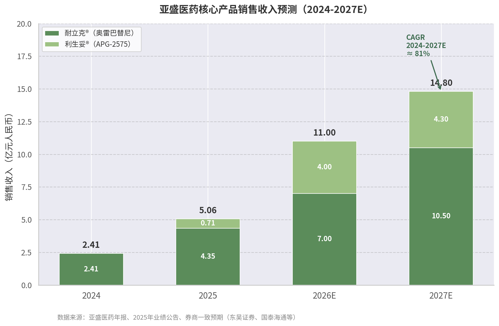
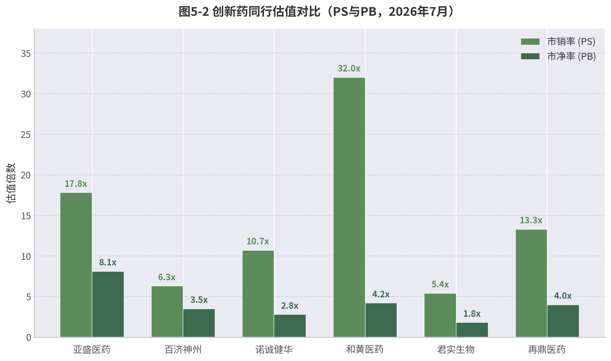
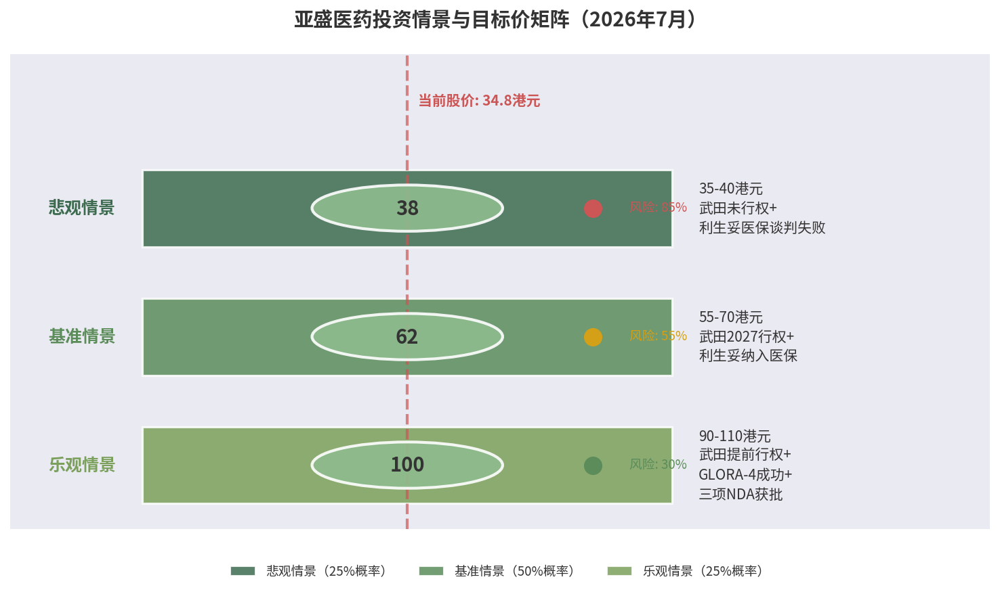

核心问题：

1、武田何时行权，大概率要Polaris-2数据读出。虽然 Polaris-2 的正式 III 期数据还没出来，但亚盛在 **2026 ASCO 年会上公布了耐立克二线治疗 CML-CP 的临床数据**，24 周 CCyR 率高达 **91.3%**，并做了口头报告，反响积极。这可以看作是 Polaris-2 的风向标。Polaris-2 正式 III 期数据预计 **2027 年上半年** 读出（入组 2026 年完成 + 6 个月随访）

# 亚盛医药（Ascentage Pharma）深度研究报告

> **股票代码**: 06855.HK / AAPG.NASDAQ
> **研究日期**: 2026-07-06
> **报告类型**: 公司深度研究

## 执行摘要

亚盛医药（Ascentage Pharma）是一家专注于细胞凋亡通路的全球化创新药企，2025年1月成为首家"先港股、后美股"双重上市的中国生物科技公司，并于2026年6月正式移除港股"B"标记，标志其从研发型Biotech向商业化Biopharma的转型获得市场认可。公司由杨大俊、王少萌、郭明三位海归科学家于2009年创立，拥有全球唯一覆盖Bcl-2、IAP、MDM2-p53三条细胞凋亡通路的临床产品管线，累计478项全球授权专利（342项海外）。

**双核心产品驱动增长**：耐立克®（奥雷巴替尼）是中国首个且唯一获批的第三代BCR-ABL抑制剂，2025年中国销售4.35亿元（同比+81%），所有适应症已纳入国家医保目录；利生妥®（利沙托克拉/APG-2575）是中国首个获批的国产原创Bcl-2选择性抑制剂，2025年7月获批上市后5个月实现销售7,058万元。九项全球注册III期临床试验同步推进，其中四项已获FDA/EMA批准。

**财务与估值**：2025年营收5.74亿元（同比-41.5%，因2024年一次性BD收入退坡），净亏损12.43亿元，但产品销售收入同比增长90%，现金储备约24.7亿元可支撑至2027年底。多家投行给予买入评级，近90天目标均价83.1港元，较当前股价（约34.8港元）存在138%潜在上行空间。

**核心风险与机遇**：武田制药13亿美元全球合作（未行权）创造了独特的估值不对称性——行权时点与帕纳替尼专利悬崖（2027年）直接挂钩；利生妥的4-6天快速剂量递增不仅是安全性优势，更可能重构Bcl-2抑制剂的可及性经济学；但公司在BTK+Bcl-2联合疗法时代缺乏自有BTK产品，构成结构性战略短板。

---

# 1. 公司概况与发展历程

亚盛医药集团（Ascentage Pharma Group International）是现今中国创新药领域最具代表性的长期主义者之一。从2003年三位海归科学家在美国创立亚生医药（Ascenta Therapeutics），到2009年在上海张江重新出发成立亚盛医药，再到2019年港股上市、2025年纳斯达克双重上市，公司经历了金融危机的生死考验、长达十余年的研发积累与两轮商业化产品的获批上市。2026年6月，亚盛医药正式移除港股股票代码中的"B"标记，成为又一家成功"摘B"的18A生物科技公司，标志着其从研发驱动型Biotech向商业化验证型Biopharma的转型获得市场正式认可[^1]。

## 1.1 创始团队与技术平台

### 1.1.1 三位海归科学家与连续创业基因

亚盛医药由杨大俊、王少萌、郭明三位海归科学家于2009年联合创立，三人的合作渊源可追溯至2003年在美国共同创办的亚生医药[^2]。这一连续创业背景在中国创新药企业中极为罕见，也意味着创始团队并非首次面对细胞凋亡通路药物开发的科学挑战与商业风险。

杨大俊博士现任亚盛医药董事长兼首席执行官，1983年获中山医科大学（现中山大学）医学学士学位，1986年获肿瘤学硕士学位，1992年获美国密歇根州立大学遗传学博士学位[^3]。1995年至2001年，杨大俊在美国乔治城大学Lombardi综合癌症中心担任副教授及高级研究员，积累了近20年的肿瘤学研究与学术管理经验[^3]。其配偶翟一帆博士现任公司首席医学官，曾任美国华人生物医药科技协会会长，夫妻二人在研发与临床开发领域形成互补[^4]。

王少萌博士是亚盛医药的科学灵魂与核心技术来源。他1983年获北京大学化学学士学位，随后赴美国凯斯西储大学取得化学博士学位，并在美国国立卫生研究院（NIH）完成博士后训练[^5]。2001年起，王少萌任美国密歇根大学终身教授、Warner-Lambert/Parke Davis冠名教授，2011年至2020年担任美国化学会《药物化学杂志》（*Journal of Medicinal Chemistry*）主编[^5]。这一学术地位使其不仅掌握细胞凋亡通路小分子设计的核心知识产权，更为亚盛建立了连接全球顶尖药物化学研究网络的通道。

郭明博士在加州大学圣地亚哥分校获得化学博士学位，曾在亚生医药担任制药科学与制造副总裁，现任亚盛医药总经理兼首席运营官，负责将科学发现转化为可规模化的生产与商业运营[^6]。三人的分工呈现出清晰的"科学—研发—运营"三角结构：王少萌提供科学洞察与化合物设计，杨大俊制定战略方向并对接资本与监管，郭明确保执行落地与运营效率。

| 创始人 | 职务 | 最高学历 | 核心经历 | 直接持股比例（约） | 持股市值（约） |
|:------|:-----|:--------|:---------|:----------------|:-------------|
| 杨大俊 | 董事长兼CEO | 密歇根州立大学遗传学博士 | 乔治城大学Lombardi癌症中心副教授（1995–2001） | 6.32% | 7.33亿港元 |
| 王少萌 | 联合创始人、首席科学顾问 | 凯斯西储大学化学博士 | 密歇根大学终身教授；*J. Med. Chem.*主编（2011–2020） | 2.73% | 3.17亿港元 |
| 郭明 | 联合创始人、总经理兼COO | 加州大学圣地亚哥分校化学博士 | 亚生医药制药科学与制造副总裁 | 3.60% | 4.17亿港元 |

*数据来源：亚盛医药SEC招股书、Simply Wall St（2026年6月）[^4][^7]*

上述持股比例反映了创始团队对公司长期价值的深度绑定。根据2018年8月签署的一致行动确认契据，杨大俊、郭明、王少萌及首席医学官翟一帆通过各自特殊目的公司（SPV）形成一致行动人，合计持有约17.42%股权（超额配售后）[^7]。这一股权结构在公司经历多轮稀释后仍保持相对集中，为战略决策的连贯性提供了治理保障。值得注意的是，三位创始人的学术背景均集中于化学与肿瘤学交叉领域，而非传统的商业或金融背景，这在一定程度上解释了亚盛医药在商业化早期阶段的相对谨慎风格——公司直至2019年港股上市才正式启动大规模资本化运作，距成立已有十年。

### 1.1.2 自主PPI靶向药物设计平台：全球唯一的细胞凋亡全通路覆盖

亚盛医药的核心技术竞争力建立在自主构建的蛋白-蛋白相互作用（Protein-Protein Interaction, PPI）靶向药物设计平台之上。PPI靶点曾长期被视为"不可成药"领域，全球唯一获批的PPI靶点抗肿瘤药物是艾伯维的Venetoclax（维奈克拉），其销售峰值预计超过50亿美元[^8]。亚盛医药是全球唯一一家同时针对**Bcl-2、IAP（凋亡抑制蛋白）和MDM2-p53**三条关键细胞凋亡通路均有临床开发阶段品种的企业[^8]。这一"全通路覆盖"定位并非简单的管线多样化策略，而是具有明确的联合用药协同逻辑：APG-2575（Bcl-2抑制剂）与APG-115（MDM2-p53抑制剂）的联合方案已在儿童实体瘤中展现出客观缓解率（ORR）30%、疾病控制率（DCR）80%的初步数据，而竞争对手如艾伯维（仅拥有Bcl-2）和百济神州（仅拥有Bcl-2）均缺乏MDM2-p53和IAP资产，无法复制这一内部组合[^9]。

从科学机理看，Bcl-2通路调控线粒体外膜通透性，IAP家族蛋白（如cIAP1/2、XIAP）通过抑制Caspase活性阻断凋亡执行，MDM2-p53通路则通过泛素化降解p53肿瘤抑制蛋白维持细胞存活。三条通路在功能上相互独立但在肿瘤微环境中协同作用，同时抑制多条通路可产生协同抗肿瘤效应。亚盛的PPI平台正是基于这一生物学洞察，开发能够嵌入蛋白-蛋白界面并阻断相互作用的小分子化合物。王少萌教授在密歇根大学期间的长期基础研究为该平台提供了原始专利储备，而亚盛后续通过内部化学团队将早期化合物推进至临床阶段，形成了从靶点验证到临床开发的完整闭环。

### 1.1.3 专利布局：478项全球授权专利构建竞争护城河

截至2025年6月30日，亚盛医药在全球范围内累计拥有478项授权专利，其中342项在海外授权，覆盖中国、美国、欧洲、日本等主要医药市场[^10]。这一专利规模在中国创新药企业中处于第一梯队。核心化合物专利的到期年份从2031年至2037年不等，为公司在关键市场的独占性销售提供了至少5至10年的法律保障[^10]。以耐立克（奥雷巴替尼，Olverembatinib）为例，其核心化合物专利在中国到期时间为2035年，在美国为2036年，这意味着即便在2030年代初期面临仿制药竞争，公司仍有足够时间通过适应症扩展和联合用药方案延长产品生命周期。从商业策略角度看，这一专利梯队的深度使得亚盛在对外授权谈判中拥有更强的议价能力——武田制药2024年6月签署耐立克独家选择权协议时，专利到期时间表是评估交易价值的关键参数之一。

| 里程碑 | 时间 | 事件 | 累计融资/估值 | 关键意义 |
|:------|:-----|:-----|:-------------|:---------|
| 亚生医药成立 | 2003年 | 杨大俊、王少萌、郭明在美国创立Ascenta Therapeutics | 首轮融资500万美元 | 细胞凋亡通路药物研发的起点 |
| 亚生医药关闭 | 2008年 | 金融危机冲击，AT-101临床II期数据不及预期 | 累计融资约9,000万美元 | 两项原创新靶点药物以近7亿美元授权给赛诺菲和瑞士德彪[^2] |
| 天使轮融资 | 2010年2月 | 三生制药投资300万美元 | 约300万美元 | 中国创新药领域早期罕见投资，占发行后股本约40% |
| A轮融资 | 2015年8月 | 元禾原点、元明资本领投 | 9,600万元人民币 | 中国创新药投资热潮兴起，亚盛获得机构背书 |
| B轮融资 | 2016年12月 | 国投创新（先进制造产业投资基金）领投 | 5亿元人民币 | 国家级产业基金入场，标志公司进入"国家队"视野 |
| C轮融资 | 2018年7月 | 元明方圆基金领投 | 约10亿元人民币 | 为港股IPO奠定资本基础 |
| 港股IPO | 2019年10月28日 | 港交所主板上市，代码06855.HK | 募资净额约3.12亿港元 | 成为港股生物科技板块改革后首个"原创小分子新药"企业；获超额认购约751倍[^11] |
| 信达生物战略合作 | 2021年7月 | 耐立克中国共同开发及商业化；信达认购5,000万美元 | 战略投资5,000万美元 | 引入中国头部Biotech商业化能力 |
| 武田战略入股 | 2024年6月 | 武田以7,500万美元认购新股，成为第二大股东（约7.73%） | 7,500万美元股权 + 1亿美元选择权付款 | 跨国大型药企首次战略投资中国18A企业，标志全球认可 |
| 纳斯达克IPO | 2025年1月24日 | 纳斯达克挂牌上市，代码AAPG | 募资净额约1.26亿美元（约9.67亿元人民币） | 首家"先港股、后美股"双重上市的中国Biotech；2025年美股首家生物医药IPO[^12] |
| 港股"摘B" | 2026年6月1日 | 正式移除港股股票代码"B"标记 | 市值约149.6亿港元 | 满足港交所收益测试（市值≥40亿港元+收益≥5亿港元），商业化能力获正式验证[^1] |

*数据来源：亚盛医药招股书、业绩公告、36氪、美通社、医药魔方等[^2][^11][^12][^13]*

亚盛医药的融资历程清晰呈现了中国创新药产业从资本寒冬到热潮再到理性回归的完整周期。2010年天使轮融资时，三生制药以300万美元获得约40%股权，当时中国创新药投资环境远未成熟，这一估值在今天看来极为低廉，但反映了早期创新药企面临的资金困境。2015年至2018年的A、B、C三轮融资恰逢中国创新药投资热潮，累计融资超过15亿元人民币，为公司推进多个候选药物进入临床提供了资金支撑。值得注意的是，2019年港股IPO的募资净额仅约3.12亿港元，发行比例仅约5.88%，是港股生物科技板块改革以来发行规模最小的B类股（18A）[^11]。这一"微型IPO"策略使得创始团队和早期投资者未被过度稀释，同时也意味着公司上市后仍需持续依赖后续配售和战略合作补充资金。事实印证了这一点：2019年上市后至2025年，亚盛通过四次配售、武田股权投资和纳斯达克IPO累计融资超过50亿港元，资本运作频率远高于同期上市的其他18A企业。

## 1.2 融资与上市历程

### 1.2.1 从亚生医药到亚盛医药：穿越周期的创业韧性

亚盛医药的故事并非始于2009年，而是可以追溯至2003年亚生医药的创立。亚生医药由杨大俊团队基于乔治城大学发现的AT-101（Bcl-2抑制剂）在美国成立，2005年在上海张江设立中国研发中心，2007年被Fierce Biotech评为"15家最具成长性生物技术公司"之一，累计融资约9,000万美元[^2]。然而，2008年全球金融危机彻底改变了这一 trajectory。在金融危机冲击下，亚生医药的两项原创新靶点抗肿瘤药物——MDM2-p53靶点药物以3.98亿美元授权给赛诺菲，另一项授权给瑞士德彪，合计近7亿美元——虽然创造了当时华尔街的轰动，但公司本身因AT-101临床II期数据不及预期而被迫停止运营[^2]。

这一经历对创始团队产生了深远影响。杨大俊、王少萌、郭明三人选择自掏腰包将上海研发中心接手下来，于2009年在此基础上重新成立亚盛医药[^2]。这一决策的本质是在资源极度匮乏的条件下保留了一个"火种"——一个拥有化合物库、研发经验和化学合成能力的团队。2009年至2015年的六年期间，亚盛医药几乎处于"静默"状态，直到2015年A轮融资才重新获得机构资本关注。这一长达六年的"资本真空期"在中国创新药创业史上极为罕见，它既考验了创始团队的财务承受能力，也筛选出了真正愿意陪伴长期主义的投资者。三生制药作为天使轮投资人，在后续多轮融资中持续支持，其董事长娄竞与杨大俊的私人信任关系在这一过程中发挥了关键作用[^2]。

### 1.2.2 双重上市：从港股18A到纳斯达克的战略升级

2019年10月28日，亚盛医药在香港联交所主板挂牌上市，股票代码06855.HK，成为港股生物科技板块改革以来首个"原创小分子新药"企业[^11]。IPO获超额认购约751倍，成为2019年港股"超购王"，基石投资者为中国生物制药（1177.HK），认购约1.56亿港元，占发行规模约38%[^11]。然而，发行规模仅约3.92至4.16亿港元，预期市值66.67至70.82亿港元，是港股18A板块历史上发行规模最小的IPO之一[^11]。这一"小而美"的上市策略使得公司成功进入公开市场，但并未一次性解决长期资金需求，后续通过多次配售和BD交易持续补充弹药。

2025年1月24日，亚盛医药在美国纳斯达克证券交易所正式挂牌上市，股票代码"AAPG"，发行732.5万股ADS，发行价17.25美元/ADS，募资净额约1.26亿美元（约9.67亿元人民币）[^12]。亚盛医药由此成为首家"先港股、后美股"双重上市的中国生物科技公司，也是2025年美股第一家上市的生物医药企业[^12]。这一定位具有重要的战略意义：港股上市为公司提供了人民币计价的融资平台和亚洲机构投资者的覆盖，而纳斯达克上市则打开了美元融资通道、提升了全球品牌知名度，并为潜在的武田行权后全球商业化提供了资本运作平台。2025年2月，超额配股权交割完成，额外发行94万股ADS，筹集约1,613万美元，总股本从约3.45亿股增加至约3.48亿股[^13]。

### 1.2.3 武田战略入股：跨国药企验证与选择权结构

2024年6月，武田制药以7,500万美元认购亚盛医药新发行的港股股票，成为亚盛医药第二大股东，持股比例约7.73%（后因增发稀释至约6.51%）[^14]。同时，双方就耐立克（奥雷巴替尼）签署总额最高约13亿美元的独家选择权协议，其中1亿美元选择权付款已到账，武田有权获得耐立克在全球（除中国外）的独家开发和商业化权利，亚盛保留中国权益及全球一定比例的销售分成[^14]。这一交易是截至当时中国小分子抗肿瘤药物史上最大的BD交易，其结构并非直接收购，而是"股权投资+选择权"的组合，为双方保留了战略灵活性：武田可以在观察耐立克的海外临床数据后决定是否行使选择权，而亚盛则通过股权绑定将武田利益与公司长期价值对齐。从武田角度看，这一投资与其自有产品帕纳替尼（Ponatinib）的专利悬崖（2027年到期）直接相关——奥雷巴替尼作为第三代BCR-ABL抑制剂，具有更低的动脉闭塞事件发生率（约7% vs 帕纳替尼的31%），是帕纳替尼专利到期后的潜在替代产品[^15]。因此，武田的持股不仅是财务投资，更是一个具有"时间窗口期权"特征的战略布局。

## 1.3 公司治理与战略定位

### 1.3.1 董事会与科学顾问网络：学术治理的优劣势

亚盛医药董事会由9名董事组成，包括1名执行董事（杨大俊）、2名非执行董事（王少萌、Simon Dazhong Lu）和6名独立非执行董事（任伟、叶常青、David Sidransky、Marina Bozilenko、Debra Yu、Marc Lippman）[^16]。9名董事中6人拥有博士学位，学术密度在中国上市药企中位居前列。这一结构的优势在于科学决策的专业性——面对复杂的临床开发策略和靶点选择，董事会能够基于科学证据而非单纯的商业逻辑做出判断。然而，潜在的风险在于学术治理可能过于保守，在需要快速商业化扩张或激进资本运作时缺乏足够的商业决策经验。

公司临床顾问委员会（Clinical Advisory Board, CAB）由ASCO前首席执行官Allen S. Lichter博士担任主席，成员包括肺癌研究领域权威Paul A. Bunn Jr.博士、肿瘤免疫学专家Jedd Wolchok博士、密西根大学Arul Chinnaiyan博士、MD Anderson癌症中心Hagop Kantarjian博士等国际顶级肿瘤学专家[^17]。这一科学顾问网络的价值不仅在于为临床开发提供指导意见，更在于为亚盛的候选药物在全球学术界的背书和KOL（关键意见领袖）网络建设。Kantarjian博士在慢性髓性白血病（CML）领域的权威地位对耐立克的全球推广尤为重要，而Wolchok博士在肿瘤免疫学领域的影响力则为APG-115与免疫检查点抑制剂的联合用药提供了学术基础。

### 1.3.2 "摘B"里程碑：商业化验证与估值重估的分水岭

2026年6月1日，亚盛医药正式从港股股票代码中移除"B"标记，成为又一家成功"摘B"的18A生物科技公司[^1]。根据港交所上市规则第8.05(3)条，公司需满足市值不低于40亿港元且最近一个财政年度收益不低于5亿港元的测试。截至2026年5月，亚盛医药市值约149.6亿港元，远超40亿港元门槛；2025年度收入达5.74亿元人民币（约6.2亿港元），高于5亿港元要求[^1]。"摘B"的技术意义在于亚盛医药此后可纳入更多港股通指数和被动基金，扩大机构投资者覆盖范围；而象征意义更为深远——它标志着港交所正式认可亚盛医药已从"研发驱动、尚未盈利"的Biotech转型为"具备可持续商业化能力"的Biopharma。

从战略定位看，亚盛医药自成立之初即坚持"全球创新"（in China for global）定位，拒绝仿制药捷径，专注于细胞凋亡通路中PPI的小分子靶向药物[^18]。这一战略定力在2010年代初期中国创新药环境不成熟、资金极度困难的时期经历了严峻考验。然而，正是这种长期主义使得亚盛在2021年（耐立克获批）和2025年（利生妥获批）迎来商业化收获期。2024年，公司实现收入9.81亿元人民币，同比增长342%，首次实现半年度盈利（上半年净利润1.63亿元），其中耐立克销售收入2.41亿元，武田1亿美元选择权付款贡献显著[^19]。2025年营收回落至5.74亿元，但产品收入占比从2024年的30.9%上升至87.0%，收入结构从"BD脉冲驱动"转向"产品销售驱动"，标志着财务结构的正常化[^19]。

亚盛医药的全球化战略正在从"License-Out"向"自主出海"演进。耐立克通过武田合作以授权模式出海，但利生妥由亚盛自主推进全球临床，在美国Rockville设立总部、与MD Anderson癌症中心建立长期合作、聘请Elias Jabbour博士担任全球临床PI[^20]。九项注册性III期临床试验中，四项已获得FDA和EMA批准[^20]。若利生妥能在美国成功上市，亚盛将成为中国少数拥有自主海外商业化能力的Biopharma。这一"双轨并行"的国际化路径，反映了中国创新药企从依赖跨国药企到自建全球能力的战略升级，而亚盛医药正处于这一转型的最前沿。

---

## 2. 核心产品深度分析

### 适应症

| 大类         | 典型例子                           | 来源                                 |
| ------------ | ---------------------------------- | ------------------------------------ |
| **实体瘤**   | 肺癌、胃癌、肝癌、乳腺癌、结直肠癌 | 某个器官/组织形成肿块                |
| **血液肿瘤** | 白血病、淋巴瘤、多发性骨髓瘤、MDS  | 血液、骨髓、淋巴系统里的细胞异常增殖 |

| 适应症                                      | 对应药物            | 大致位置                             |
| ------------------------------------------- | ------------------- | ------------------------------------ |
| CML 慢性髓性白血病                          | 奥雷巴替尼          | 已上市，是亚盛第一个商业化核心产品   |
| CLL/SLL 慢性淋巴细胞白血病/小淋巴细胞淋巴瘤 | 利沙托克拉          | 已在中国获批，是第二个商业化核心产品 |
| AML 急性髓系白血病                          | 利沙托克拉、APG-115 | 注册/临床阶段                        |
| MDS 骨髓增生异常综合征                      | 利沙托克拉、APG-115 | 注册/临床阶段                        |
| Ph+ ALL 费城染色体阳性急淋                  | 奥雷巴替尼          | 注册 III 期方向                      |
| MM 多发性骨髓瘤                             | 利沙托克拉          | 临床探索                             |

亚盛医药的估值核心锚定于两款已进入商业化阶段的重磅产品：耐立克®（奥雷巴替尼）与利生妥®（APG-2575）。前者是中国唯一获批的第三代BCR-ABL抑制剂，在T315I突变耐药领域建立了差异化优势；后者是全球第二个获批的Bcl-2选择性抑制剂，以快速剂量递增和优异安全性特征挑战艾伯维Venetoclax的市场主导地位。本章从药物机制、临床数据、全球注册进展及竞争格局四个维度，对这两款产品进行系统性深度剖析，并在此基础上对其市场潜力与销售前景进行定量预测。

### 2.1 耐立克®（奥雷巴替尼）：中国首个第三代BCR-ABL抑制剂

#### 2.1.1 药物机制：基于帕纳替尼结构优化的T315I突变精准打击

慢性髓性白血病（CML）的病理基础在于9号染色体ABL1基因与22号染色体BCR基因易位融合形成的BCR-ABL1融合蛋白，该蛋白持续激活驱动白血病细胞异常增殖，占所有成人白血病病例约15%[^1]。T315I突变是BCR-ABL1激酶域第315位苏氨酸被异亮氨酸取代的"门控"（gatekeeper）突变，通过空间位阻效应阻碍一代和二代酪氨酸激酶抑制剂（TKI）与ATP结合口袋的结合，导致约2%-20%的伊马替尼治疗患者及约5%的二代TKI前线治疗患者出现耐药[^2]。

奥雷巴替尼（HQP1351）是在帕纳替尼（Ponatinib）基础上通过结构优化得到的第三代BCR-ABL1抑制剂。X射线晶体学分析显示，帕纳替尼通过咪唑并哒嗪结构中的碳-碳三键连接与BCR-ABL1中T315I突变体的 bulky isoleucine 残基形成疏水性接触，从而规避空间位阻[^3]。奥雷巴替尼在此基础上进一步优化咪唑并哒嗪结构，对野生型及T315I、E255K、G250E、Q252H、H396P等多种突变型Abl1均具有抑制作用，其中对T315I突变的IC50为0.68 nM，对野生型BCR-ABL1的IC50为0.34 nM[^4]。

与帕纳替尼相比，奥雷巴替尼的核心优势体现在三个层面：一是双构象结合能力，能够紧密结合BCR-ABL1激酶的活性与非活性构象，包括T315I突变体；二是广谱突变覆盖，对"近乎全部"BCR-ABL1单激酶域突变及含T315I的复合突变均有效；三是多靶点抑制特性，除BCR-ABL1外，对KIT、PDGFR、FGFR、b-RAF、DDR1、FLT3等多种激酶也具有抑制作用[^5]。尤为关键的是，体外数据显示奥雷巴替尼对复合突变的抑制作用比帕纳替尼强至少10倍，IC50值显著更低[^6]。这一数据为其在重度预处理患者中的临床价值奠定了分子基础。

#### 2.1.2 临床数据：长期随访验证疗效与安全性双重优势

奥雷巴替尼的临床数据体系涵盖中国注册研究、全球Phase 1b研究及最新二线治疗探索，形成了从经治到早期线治疗的完整证据链。

在中国注册II期临床试验（HQP1351CC203；NCT04126681）中，144例CML-CP患者按2:1比例随机分入奥雷巴替尼治疗组（96例）和最佳可用疗法（BAT）对照组（48例）。截至2025年1月13日的4年随访数据显示，奥雷巴替尼治疗组的中位无事件生存期（EFS）达到21.2个月，显著优于BAT组的2.9个月（P < 0.0001）；完全细胞遗传学反应率（CCyR）为38% vs 19%，主要分子学反应率（MMR）为30% vs 8%[^7]。在更为早期的中国I/II期研究中，127例CML-CP患者接受奥雷巴替尼治疗，5年随访更新显示MCyR 80%、CCyR 75%、MMR 56%、4年无进展生存率（PFS）86%[^8]。

全球Phase 1b研究（HQP1351CU101；NCT04260022）纳入了76例重度预处理患者，其中15%接受过2种TKI、30%接受过3种、51%接受过≥4种TKI，53%有帕纳替尼治疗史，28%有阿思尼布（Asciminib）治疗史。在这一极端难治人群中，CML-CP患者的CCyR率为57%，MMR率为43%；帕纳替尼耐药患者的CCyR和MMR率分别为53.6%和40.0%，阿思尼布耐药患者分别为37.5%和30.0%，24个月PFS率和OS率分别为75%和98%[^9]。这些数据表明，即使在其他三代TKI失败后，奥雷巴替尼仍具有显著治疗价值。

安全性方面，奥雷巴替尼与帕纳替尼形成了鲜明对比。帕纳替尼在PACE试验5年随访中动脉和静脉闭塞事件累积发生率高达31%，且EPIC试验（一线CML）因动脉闭塞事件风险提前终止[^10]。相比之下，奥雷巴替尼在注册II期4年随访中血管闭塞事件发生率为7%[^7]，全球Phase 1b研究中仅2.5%为治疗相关且均为1-2级[^9]。这一安全性差异不仅是统计学意义上的，更具有深刻的临床转化价值——它意味着奥雷巴替尼在需要长期用药的CML患者中，可能避免帕纳替尼所伴随的心血管毒性负担。

在2025年ASH年会上，亚盛医药公布了奥雷巴替尼二线治疗CML-CP的最新数据。47例无T315I突变、对一线TKI耐药/不耐受的CML-CP患者中，CCyR率达71.8%，MMR率达43.6%；二代TKI一线治疗失败患者的CCyR率更高达76.7%，且随着治疗时间延长反应持续加深，21周期时MMR率达60%[^11]。这一数据为奥雷巴替尼从末线向二线乃至一线治疗的适应症拓展提供了关键支撑。

下表对第三代BCR-ABL抑制剂进行了系统性对比：

| 对比维度 | 奥雷巴替尼（Olverembatinib） | 帕纳替尼（Ponatinib） | 阿思尼布（Asciminib） |
|:---------|:---------------------------|:---------------------|:---------------------|
| 研发公司 | 亚盛医药 | Ariad/Incyte | 诺华 |
| 获批状态 | 中国获批（2021） | FDA获批（2012） | FDA获批（2021） |
| T315I突变覆盖 | 有效（IC50=0.68 nM）[^4] | 有效 | 有效 |
| 复合突变活性 | 优于帕纳替尼≥10倍[^6] | 部分复合突变耐药 | 对特定复合突变有效 |
| 动脉闭塞事件 | 约7%（4年随访）[^7] | 约31%（5年PACE试验）[^10] | 约6-8% |
| 给药方案 | 40 mg隔日一次 | 45 mg每日一次（优化后15-30 mg） | 80 mg每日两次 |
| 全球合作 | 武田13亿美元选择权[^12] | Incyte自有 | 诺华自有 |

上述对比揭示了一个关键竞争格局：奥雷巴替尼在安全性上显著优于帕纳替尼，在复合突变覆盖上优于阿思尼布，而其唯一尚未补齐的短板是海外监管审批——这正是POLARIS系列全球注册III期试验的战略意义所在。

#### 2.1.3 全球注册III期：POLARIS系列构筑全球获批路径

亚盛医药正在同步推进三项全球注册III期临床研究，覆盖Ph+ ALL、经治CML-CP和SDH缺陷型GIST三大适应症，其中两项已获FDA和EMA批准。

POLARIS-1（NCT06051409）针对新诊断Ph+ ALL患者，评估奥雷巴替尼联合低强度化疗对比伊马替尼联合化疗的疗效，主要终点为MRD阴性率。该研究于2025年3月获CDE突破性疗法认定（BTD），2025年12月获FDA和EMA批准开展全球注册III期研究。ASH 2025披露的数据显示，奥雷巴替尼联合低强度化疗在3个周期结束时MRD阴性率和分子MRD阴性完全缓解（CR）率均达到约65%[^13]。Ph+ ALL全球年发病率约1.5-2例/10万，若奥雷巴替尼获批一线治疗，将填补该领域未满足的临床需求。

POLARIS-2（NCT06423911）针对经治CML-CP患者，分为A部分（随机对照：无T315I突变患者接受奥雷巴替尼或博舒替尼，主要终点24周MMR率）和B部分（单臂：T315I突变患者接受奥雷巴替尼）。该研究于2024年2月获FDA批准，预计2026年完成入组并向FDA提交NDA[^14]。作为奥雷巴替尼首个有望提交FDA上市申请的研究，POLARIS-2的入组进度和数据读出时间将是判断海外获批节奏的关键风向标。

POLARIS-3（NCT06640361）针对SDH缺陷型GIST患者，该亚型约占所有GIST的5%-7.5%，主要影响儿童、青少年和年轻成人，缺乏标准治疗方案。前期Phase 1b数据显示，在26例可评估患者中ORR为23.1%，临床获益率（CBR）84.6%，中位PFS达25.7个月[^15]。奥雷巴替尼通过抑制脂质摄取和CD36表达阻断SDH缺陷型肿瘤细胞的能量来源，同时抑制VEGFR、IGF1R、FGFR和SRC等信号通路，这一机制使其在罕见瘤种中展现出独特潜力。

#### 2.1.4 武田全球合作：13亿美元交易结构的战略价值

2024年6月，亚盛医药与武田制药达成独家选择权协议，授予武田在全球范围内（除中国大陆、港澳台及俄罗斯外）开发及商业化耐立克的独家选择权。该交易总对价约13亿美元，结构包括：1亿美元选择权付款（已于2024年7月到账）、7,500万美元股权投资（认购7.73%股权，武田成为第二大股东）、最高约12亿美元的选择权行使费及里程碑付款，以及年度净销售额12%-19%的分级销售分成[^12]。这是国产小分子肿瘤药物出海中BD总金额最大的交易[^16]。

该交易结构的独特之处在于其"战略期权"属性。武田作为全球血液肿瘤领域的重要参与者，同时拥有帕纳替尼这一竞品，其选择投资奥雷巴替尼而非力推自有产品，从侧面验证了后者的best-in-class潜力。帕纳替尼专利将于2027年到期，武田面临专利悬崖压力，而奥雷巴替尼的安全性优势使其成为潜在的替代选择。在武田行权前，亚盛医药继续全权负责所有临床开发，这意味着公司保留了管线推进的自主权。武田行权时点与帕纳替尼专利到期节奏直接挂钩，投资者应密切关注2026-2027年的专利诉讼进展和仿制药ANDA申报动态，这些因素将决定亚盛海外收入可能出现"脉冲式"跳跃的时间窗口。

### 2.2 利生妥®（APG-2575）：全球第二款Bcl-2抑制剂

#### 2.2.1 药物机制：Bcl-2选择性抑制与快速剂量递增的协同设计

Bcl-2（B-cell lymphoma 2）是一种凋亡抑制因子，在多种恶性血液肿瘤特别是CLL/SLL中过度表达，是肿瘤细胞逃避凋亡的关键机制。然而，Bcl-2作为药物靶点极具挑战性，主要原因在于其作用机制基于蛋白-蛋白相互作用（PPI），靶点结合界面较大，且Bcl-2蛋白位于线粒体双膜结构，药物需要穿透细胞膜后再穿透线粒体膜才能发挥作用[^17]。

利生妥®（Lisaftoclax，APG-2575）通过选择性阻断抗凋亡蛋白Bcl-2，恢复肿瘤细胞的正常凋亡过程。其关键分子特征包括：对BCL-2的Ki < 0.1 nmol/L，具有极高的结合亲和力；通过破坏BCL-2:BIM复合物释放促凋亡蛋白BIM，触发BAX/BAK依赖性、caspase介导的凋亡；进入细胞后2小时达到平台期，显著下调线粒体呼吸功能和ATP产生[^18]。与第一代Bcl-2/Bcl-xL双靶点抑制剂Navitoclax因严重血小板毒性而终止开发不同，APG-2575作为BCL-2选择性抑制剂，对Bcl-xL的选择性远低于Bcl-2，3级及以上血小板减少症发生率仅为13.5%，无因血液学毒性导致的治疗中断[^19]。

APG-2575最具商业转化价值的差异化特征在于其药代动力学设计。该药物的半衰期约3-5小时，远短于Venetoclax的26小时，导致高Cmax但相对较低的全身暴露[^18]。这一独特的PK特征使得APG-2575可以采用每日梯度剂量递增方案，仅需4-6天即可达到目标剂量，而Venetoclax需要5周的每周递增方案[^20]。更短的剂量递增周期不仅减少了患者住院监测肿瘤溶解综合征（TLS）的时间和负担，还可能降低医疗系统的直接成本——在中国DRG/DIP支付改革背景下，门诊化给药的医保报销优势尤为突出。在已发表的研究中，APG-2575未发生临床TLS事件[^19]，而Venetoclax因TLS黑框警告需要住院监测，这在基层医院和社区医疗中心构成了资源瓶颈。

#### 2.2.2 关键临床数据：联合疗法展现best-in-class潜力

利生妥®的临床数据体系由单药治疗和联合疗法两条主线构成，其中联合阿卡替尼的方案在CLL/SLL领域展现出令人瞩目的疗效信号。

单药治疗方面，利生妥®的NMPA批准基于注册II期临床研究APG2575CC201的结果。在既往接受BTK抑制剂和/或免疫化疗失败的R/R CLL/SLL患者中，单药ORR为62.5%，中位PFS达23.89个月，研究中未报告任何TLS病例[^21]。在Phase 1研究中，R/R CLL/SLL患者的ORR为63.6%，中位至缓解时间为2个周期，快速起效特征显著[^19]。

联合疗法方面，亚盛医药与阿斯利康合作开展的全球Phase 1b/2研究（NCT04215809）评估了APG-2575联合阿卡替尼的疗效。在R/R CLL/SLL患者中，ORR高达98%（56/57），600 mg QD被确定为联合治疗的推荐Phase 2剂量（RP2D）[^22]。在初治CLL/SLL患者中，ORR达100%（16/16），18个月PFS率为86%[^22]。尤为重要的是，在Venetoclax经治患者中，联合方案的ORR为85.7%（12/14），其中Venetoclax进展后未用BTKi的患者ORR为100%（8/8）[^22]。这一数据提示APG-2575具有克服Venetoclax耐药的潜力，而Venetoclax耐药已成为临床实践中日益突出的未满足需求。在安全性方面，仅5例（2.8%）发生TLS，均为轻中度且可管理，未观察到药物-药物相互作用或新的安全性信号[^22]。

在髓系肿瘤领域，APG-2575联合阿扎胞苷（AZA）治疗新诊断高危MDS/CMML患者的ORR达80.0%，CR率40.0%；在Venetoclax经治髓系肿瘤患者中，ORR为31.8%，103例患者中未发生剂量限制性毒性，无TLS[^23]。在多发性骨髓瘤领域，APG-2575联合泊马度胺+地塞米松（Pd）的ORR为63.9%，中位PFS 9.7个月，为全口服方案[^24]。

#### 2.2.3 全球注册III期：GLORA系列四项同步推进

亚盛医药正在开展四项全球注册III期临床研究（GLORA系列），覆盖CLL/SLL、AML和MDS适应症，形成了Bcl-2抑制剂领域最广泛的临床布局之一。

下表汇总了GLORA系列及POLARIS系列的全球注册III期临床布局：

| 研究名称 | 产品 | 适应症 | 设计 | 监管状态 | 关键进展 |
|:---------|:-----|:-------|:-----|:---------|:---------|
| POLARIS-1 | 奥雷巴替尼 | 新诊断Ph+ ALL | 联合低强度化疗 vs 伊马替尼+化疗 | FDA/EMA/CDE已批准[^13] | MRD阴性CR率约65% |
| POLARIS-2 | 奥雷巴替尼 | 经治CML-CP | 奥雷巴替尼 vs 博舒替尼 | FDA已批准[^14] | 预计2026年提交NDA |
| POLARIS-3 | 奥雷巴替尼 | SDH缺陷型GIST | 单臂/随机 | CDE已批准[^15] | 中位PFS 25.7个月 |
| GLORA | APG-2575 | BTKi经治CLL/SLL | +BTKi vs 标准治疗 | FDA已许可[^25] | 全球首个FDA许可的APG-2575 III期 |
| GLORA-2 | APG-2575 | 初治CLL/SLL | +阿卡替尼 vs FCR | CDE已批准[^26] | 与阿斯利康合作 |
| GLORA-3 | APG-2575 | 新诊断AML | +AZA vs 安慰剂+AZA | CDE已批准[^27] | 针对老年/体弱患者 |
| GLORA-4 | APG-2575 | 新诊断中高危MDS | +AZA vs 安慰剂+AZA | FDA/EMA/CDE已批准[^28] | 全球首个MDS领域Bcl-2 III期 |

上述布局的战略意义在于：POLARIS-2和GLORA系列分别代表了亚盛两款核心产品的全球注册路径，而GLORA-4作为全球首个在MDS领域开展的Bcl-2抑制剂注册III期研究，若成功将有望成为HR-MDS一线治疗的新标准。Venetoclax在MDS的VERONA研究中表现不佳，引发了业界对Bcl-2抑制剂在MDS中价值的质疑；APG-2575凭借更短半衰期、更少药物相互作用和可能更优的安全性特征，正在挑战这一认知[^29]。MDS领域全球年发病率约4-5例/10万，且以老年患者为主，APG-2575的门诊化给药优势在这一人群中具有直接的临床价值。

#### 2.2.4 与Venetoclax对比：安全性、便利性与耐药克服的三重优势

Venetoclax（Venclexta）作为首个获批的Bcl-2抑制剂，2023年全球销售额约22-26亿美元，预计销售峰值超60亿美元[^30]。APG-2575作为后发竞争者，其差异化定位建立在三个维度之上：

| 对比维度 | APG-2575（Lisaftoclax） | Venetoclax |
|:---------|:----------------------|:-----------|
| Bcl-2结合亲和力 | Ki < 0.1 nM [^18] | Ki < 0.01 nM |
| 半衰期 | 3-5小时 [^18] | 26小时 [^18] |
| 剂量递增周期 | 4-6天（每日递增）[^20] | 5周（每周递增）[^20] |
| 临床TLS事件 | 未发生（Phase 1）[^19] | 发生率较高，需住院监测[^31] |
| 3级血小板减少 | 13.5% [^19] | 15%（单药）/约20%（联合）[^31] |
| 3级中性粒细胞减少 | 21.2% [^19] | 40%（单药）[^31] |
| 药物相互作用 | 未观察到DDI [^22] | 与CYP3A4/P-gp抑制剂有显著DDI [^31] |
| R/R CLL/SLL联合BTKi ORR | 98%（+阿卡替尼）[^22] | 92.8%（AMPLIFY：+阿卡替尼）[^32] |
| Venetoclax经治患者ORR | 85.7%（+阿卡替尼）[^22] | N/A |
| 初治CLL/SLL ORR | 100%（+阿卡替尼）[^22] | 92.7%（AVO方案）[^32] |

从上述对比可以看出，APG-2575在疗效上与Venetoclax相当或略优——在联合BTKi治疗R/R CLL/SLL中ORR 98% vs 92.8%，在初治患者中ORR 100% vs 92.7%。但其真正的结构性优势在于安全性与给药便利性。4-6天 vs 5周的剂量递增差异在表面上仅是便利性差异，实则重构了Bcl-2抑制剂的可及性经济学：Venetoclax的5周递增要求患者住院监测TLS，在欧美医疗体系中是高昂成本，在中国基层医院是资源瓶颈；APG-2575的门诊化给药潜力可能打开Venetoclax无法覆盖的中低端市场，同时降低联合疗法的启动门槛。此外，APG-2575在Venetoclax经治患者中仍显示85.7%的ORR，这一定位使其可能成为Venetoclax治疗失败后的标准二线选择，而Venetoclax耐药患者群体正在随前序治疗渗透率提升而持续扩大。

### 2.3 市场潜力与销售预测

#### 2.3.1 BCR-ABL抑制剂全球市场规模与竞争窗口

全球CML治疗药物市场2025年约82亿美元，预计2033年达147亿美元，复合年增长率（CAGR）7.4%[^33]。其中北美占38%市场份额，亚太增长最快（CAGR 9.2%）。第三代TKI市场中，帕纳替尼2025年年市场价值约21亿美元，CAGR 6.1%[^33]。帕纳替尼专利将于2027年到期，届时仿制药进入将加速价格侵蚀，但奥雷巴替尼的安全性优势使其具备在专利悬崖后抢占市场份额的结构性条件。

竞争格局方面，诺华（伊马替尼、尼洛替尼）占43%全球收入份额，BMS（达沙替尼）、辉瑞（博舒替尼）、Incyte（帕纳替尼）为主要竞争者。阿思尼布（Asciminib）作为首个变构抑制剂，2024年10月获FDA加速批准用于一线CML-CP，2025年前三季度销售8.94亿美元，增速84%[^34]，构成新兴竞争力量。但阿思尼布与奥雷巴替尼的靶点机制不同（变构位点 vs ATP竞争位点），两者存在联合用药的协同潜力，而非简单的替代关系。

耐立克在中国市场的销售表现已验证其商业化潜力：2024年销售收入2.41亿元（+52%），2025年达4.35亿元（+81%），准入医院/DTP药房达825家（截至2025年底）[^35]。券商预测到2034年，耐立克中国销售峰值约18亿元，海外（武田行权后）销售峰值约92亿元[^36]。

#### 2.3.2 Bcl-2抑制剂市场：Venetoclax dominance与APG-2575的破局路径

Bcl-2抑制剂全球市场规模预计2036年达160亿美元[^37]。Venetoclax 2023年全球销售额约22-26亿美元，同比增长约14%[^30]。然而，Venetoclax的TLS黑框警告和5周剂量递增方案构成了其可及性的结构性瓶颈，尤其在AML/MDS等老年患者为主的适应症中，住院监测负担限制了其渗透深度。

APG-2575的销售峰值预测存在较大分歧，核心差异在于对适应症覆盖范围和海外市场份额的假设。海通国际预测2033年风险调整后全球销售额约68.2亿元，其中国内5.7亿元、海外62.5亿元[^38]；东吴证券预测中国销售峰值约20亿元（涵盖R/R CLL、1L CLL、1L AML、1L MDS）[^39]。若GLORA-4在MDS领域取得成功，峰值预测有望进一步上修。

利生妥®2025年7月获批后，5个月内实现销售收入7,058万元，覆盖26省184城的74项重特大疾病补充保险或惠民保报销项目，商业化团队已突破270人，覆盖全国超1,500家医院[^40]。2026年能否成功纳入国家医保药品目录（NRDL）将直接影响其国内放量节奏——参照中国创新药历史数据，纳入NRDL后的首个完整年度销售增速通常可达100%-300%。

#### 2.3.3 双产品收入预测：从5.06亿元到14.8亿元的增长路径

下图展示了亚盛医药核心产品销售收入的历史表现与券商一致预期（2024-2027E）：

2025年亚盛医药产品销售收入达5.06亿元，其中耐立克4.35亿元（占比86%），利生妥0.71亿元（占比14%）[^35]。券商一致预期显示，2026年产品收入有望达到8.6-10.2亿元，2027年预计达14.8亿元[^41]。这一增长路径由三个核心驱动因素支撑：一是耐立克在2025年1月全面纳入NRDL后持续放量，2025年增速81%的势头有望在2026-2027年维持；二是利生妥纳入NRDL后的医保驱动增长，参照百济神州、信达生物等同类产品的历史轨迹，创新药纳入医保后首个完整年度的销售增速通常翻倍以上；三是GLORA系列临床进展可能带来的适应症拓展，若GLORA-2和GLORA-4在2027-2028年读出积极数据，将为2028年及以后的收入提供新增量。

从财务结构角度审视，2025年产品收入/研发费用比值为0.45，较2024年的0.28显著改善[^35]。若2027年产品收入达到14.8亿元，且销售费用率随规模效应从2025年的61.7%逐步下降，亚盛有望在2027-2028年实现运营层面盈亏平衡。这一路径与诺诚健华（2025年盈利）的历史轨迹相似，但滞后约2-3年，核心差异在于利生妥的商业化启动时点较其BTK抑制剂奥布替尼晚了约3年。

然而，投资者需审慎关注两项不确定性：一是武田行权时点及其对海外收入确认节奏的影响，若武田在2027年帕纳替尼专利到期前行权，将带来约3亿美元的选择权行使费及里程碑付款，对当年营收产生脉冲式提振；二是百济神州Sonrotoclax（BGB-11417）已于2026年1月中国获批，并获得FDA优先审评和突破性疗法认定[^42]，其在CLL/SLL领域的竞争将对利生妥的市场份额构成直接挑战。亚盛缺乏自有BTK产品意味着在联合疗法推广中需依赖阿斯利康的阿卡替尼供应，这一"借船出海"模式与百济"泽布替尼+Sonrotoclax"的内部闭环相比，在定价自主权和推广协同性上存在结构性劣势。

---

# 3. 研发管线与临床进展

亚盛医药的临床管线价值并非仅由已获批的耐立克和利生妥定义。六个处于临床开发阶段的候选药物——覆盖细胞凋亡、靶向蛋白降解与表观遗传调控三大技术平台——构成了公司中长期价值的核心支撑。截至2026年7月，公司正在全球推进九项注册III期临床试验，其中四项获FDA与EMA双边批准。本章从临床阶段管线资产的差异化机制与关键数据出发，系统梳理全球临床开发进展，并评估2027年关键注册里程碑的可实现性。

## 3.1 其他临床阶段管线

### 3.1.1 APG-115（Alrizomadlin）：MDM2-p53抑制剂的全球领先地位

APG-115是亚盛自主研发的口服、高选择性MDM2-p53蛋白-蛋白相互作用（PPI）抑制剂，通过阻断MDM2与p53的结合恢复野生型p53的肿瘤抑制活性。临床前研究显示，APG-115对MDM2的结合亲和力（Ki < 1 nM）显著优于早期MDM2抑制剂，且具备独特的免疫调节功能——可通过增加T细胞MDM2表达产生IFN-γ信号，与PD-1抑制剂形成协同效应[^1]。

从监管认定维度，APG-115是中国药企获得FDA孤儿药资格（ODD）数量最多的单一品种，累计获得6项ODD（胃癌、AML、软组织肉瘤、视网膜母细胞瘤、IIB-IV期黑色素瘤、神经母细胞瘤）、2项儿童罕见病资格（RPD）及1项快速通道资格（FTD，复发/难治转移性黑色素瘤）[^2]。这一监管资格矩阵为未来的上市审批和定价提供了结构性优势。

在关键临床数据方面，APG-115展现了三个差异化适应症方向。在腺样囊性癌（ACC）中，2026年3月发表于*Nature Communications*的Phase I研究显示，25例TP53野生型ACC患者的ORR为20.0%，DCR高达96.0%，中位PFS达9.7个月，mDOR为16.1个月[^3]。在缺乏有效系统治疗的罕见唾液腺肿瘤中，96%的疾病控制率具有显著临床意义。在免疫治疗耐药黑色素瘤中，APG-115联合pembrolizumab的Phase II研究（n=32）显示ORR为24.1%，构成FDA授予FTD的数据基础[^4]。在2026年ASCO快速口头报告中，APG-115联合利生妥在17例儿童复发/难治实体瘤患者中实现ORR 30%、DCR 80%，未观察到剂量限制性毒性或治疗相关死亡[^5]。

从竞争格局看，APG-115在全球MDM2-p53抑制剂赛道中处于前三位置。Roche的Idasanutlin曾率先进入Phase III但因毒性终止；Novartis的Siremadlin、Daiichi Sankyo的Milademetan和Kartos/Amgen的Navtemadlin均处于Phase II。APG-115的差异化优势在于极高的MDM2结合亲和力和免疫联合策略，同时被CDE纳入"星光计划"，在儿童实体瘤领域先发优势明显[^1][^5]。

### 3.1.2 APG-2449（FAK/ALK/ROS1三联抑制剂）：实体瘤管线中最接近商业化的资产

APG-2449是亚盛自主研发的口服第三代ALK-ROS1 TKI和FAK抑制剂，具有三重靶点抑制能力。其对FAK、ALK和ROS1的Kd分别为5.4 nM、1.6 nM和0.81 nM，且能够有效抑制最关键的ALK耐药突变G1202R（IC50 = 9.2 nM）[^6]。CSF/游离血浆比值为0.65–1.66，具有良好的血脑屏障穿透性。

APG-2449的Phase I研究结果于2025年10月发表于*cClinicalMedicine*（Lancet子刊），入组144例患者，RP2D为1200 mg每日一次。安全性数据显示，最常见的≥3级TRAE为ALT升高（3.5%）和QT延长（3.5%），无治疗相关死亡；与lorlatinib相比，CNS毒性（认知/情绪障碍）罕见，而lorlatinib组35–42%的患者出现CNS不良事件[^7]。

在疗效数据方面，ALK阳性TKI初治患者的ORR为78.6%，24个月PFS率为64.3%；二代ALK-TKI耐药患者的ORR为45.5%，中位PFS为13.6个月；ROS1阳性TKI初治患者的ORR为75.0%。颅内疗效尤为突出：RP2D剂量下颅内ORR为75.0%（9/12），ALK+ TKI初治伴脑转移患者的颅内ORR达100%（2/2）[^7]。这些数据表明，APG-2449在二代ALK-TKI耐药人群和CNS转移患者中具有显著优于lorlatinib的潜在优势——lorlatinib在二代耐药人群中的ORR为32.1%，颅内ORR为38.7%。

APG-2449于2024年10月获CDE批准开展两项注册Phase III临床试验，分别针对二代ALK-TKI耐药或不耐受的NSCLC患者，以及ALK阳性晚期/局部晚期NSCLC初治患者[^8]。此外，APG-2449还在开展联合PLD治疗铂耐药复发性卵巢癌的Phase Ib/II研究（NCT06687070）。

### 3.1.3 APG-1252（Pelcitoclax）：Bcl-2/Bcl-xL双靶点抑制剂的前药设计突破

APG-1252是新型Bcl-2/Bcl-xL双靶点抑制剂，其核心创新在于前药设计：APG-1252在肿瘤组织中转化为活性代谢物APG-1252-M1，肿瘤组织转化率是血浆的16倍（22% vs 1.3%），从而显著提高治疗指数、降低血小板毒性——这恰是早期navitoclax因血小板减少症而终止开发的核心原因[^9]。

在临床数据方面，APG-1252联合奥希替尼在EGFR-TKI初治NSCLC患者中展现了显著的协同效应。2023年ESMO中国多中心Ib期数据显示，26例EGFR-TKI初治患者的ORR为80.8%（21/26 PR），16例TP53+EGFR共突变患者中ORR升至87.5%（14/16 PR）[^10]。TP53共突变是EGFR突变NSCLC预后不良的重要生物标志物，APG-1252在这一难治人群中的高应答率具有重要的临床转化价值。在SCLC领域，APG-1252联合紫杉醇的Phase Ib/II研究正在进行中，2021年7月亚盛与NCI达成CRADA合作推进实体瘤开发[^9]。APG-1252还获得了FDA孤儿药资格认定（SCLC）[^11]。

### 3.1.4 APG-3288：中国首个自主研发BTK PROTAC降解剂的临床启动

APG-3288是亚盛基于其专有PROTAC技术平台开发的首个候选药物，通过诱导BTK蛋白、PROTAC分子和Cereblon E3泛素连接酶形成三元复合物，经蛋白酶体途径降解BTK蛋白。与传统BTK抑制剂占据活性位点的抑制机制不同，PROTAC降解剂可完全清除BTK蛋白，并能够降解包括C481S在内的多种耐药突变体[^12]。

APG-3288于2026年1月获FDA IND批准、2026年2月获CDE IND批准，标志着中国首个自主研发BTK PROTAC降解剂正式进入临床阶段[^12][^13]。全球多中心Phase I研究已启动，目标人群为复发/难治B细胞恶性肿瘤。临床前研究显示，APG-3288展现了优于在研竞品（Nurix的NX-2127/NX-5948、百济神州的BGB-16673）的降解效力、选择性和PK特性[^12]。从战略价值看，APG-3288不仅填补了亚盛在BTK赛道的空白，更与奥雷巴替尼和利生妥形成血液瘤管线的内部协同。APG-3288距离商业化至少还需5–7年，但其技术平台的验证将为后续PROTAC管线开发奠定基础。

### 3.1.5 APG-5918（EED抑制剂）与APG-1387（IAP抑制剂）：前沿技术平台的长期布局

APG-5918是亚盛自主研发的口服、高效、选择性EED抑制剂，对EED的IC50为1.2 nM，从Novartis的MAK638通过构象限制方法优化衍生而来。EED是PRC2的核心亚基，通过变构抑制EED可同时阻断EZH2和EZH1的甲基转移酶活性，克服EZH2抑制剂耐药。APG-5918于2022年6月获FDA IND批准、2022年11月获CDE IND批准，是中国首个进入临床的EED抑制剂[^14][^15]。临床前数据显示，APG-5918在KARPAS-422（EZH2突变DLBCL）模型中实现完全肿瘤消退，并在SCLC、多发性骨髓瘤、T细胞淋巴瘤、前列腺癌等模型中展现了广泛的协同潜力[^14]。

APG-1387（dasminapant）是亚盛自主研发的新型双价IAP拮抗剂，其独特设计在于模拟内源性SMAC蛋白的二聚体形式，同时结合XIAP的两个不同结构域，区别于其他仅作用于cIAP1/2单体的IAP抑制剂。在晚期胰腺癌中，APG-1387联合AG方案的Phase I研究显示，15例可评估患者中3例达到PR，安全性可控[^16]。在乙肝领域，APG-1387具有全球开创性意义——它是全球首个进入临床的IAP拮抗剂用于CHB治疗。临床前数据（EASL ILC 2020）显示，在三种HBV携带小鼠模型中，APG-1387治疗4–20周导致血清中HBsAg、HBeAg、HBV DNA完全清除，且停药后无复发；机制涉及通过诱导凋亡和免疫调节双重机制增强肝内HBV特异性T细胞应答[^17]。Phase II研究（NCT04568265）正在评估APG-1387联合恩替卡韦的CHB功能性治愈策略。

| 管线资产 | 核心靶点/机制 | 临床阶段 | 关键适应症 | 核心临床数据 | 监管资格/差异化定位 |
|:---------|:-------------|:--------:|:----------|:------------|:-------------------|
| APG-115 | MDM2-p53 PPI | Phase II | 黑色素瘤/ACC/儿童肉瘤 | 联合帕博利珠单抗ORR 24.1%（黑色素瘤）；ACC ORR 20.0%/DCR 96.0%；联合APG-2575儿童实体瘤ORR 30%/DCR 80% | 6项FDA ODD + 2项RPD + 1项FTD；中国首个临床MDM2抑制剂；星光计划纳入 |
| APG-2449 | FAK/ALK/ROS1 | Phase III | ALK+ NSCLC（2L/1L） | 2L ALK+ ORR 45.5%/mPFS 13.6个月；颅内ORR 75.0%；1L ALK+ ORR 78.6% | 2项CDE注册III期；优于lorlatinib的CNS安全性；FAK抑制克服旁路耐药 |
| APG-1252 | Bcl-2/Bcl-xL（前药） | Phase I/II | EGFR-TKI耐药NSCLC/SCLC | 联合奥希替尼ORR 80.8%（初治）；TP53+EGFR共突变ORR 87.5% | FDA ODD（SCLC）；NCI CRADA合作；前药设计降低血小板毒性 |
| APG-3288 | BTK PROTAC降解 | Phase I | R/R B细胞恶性肿瘤 | 临床前：优于NX-2127/BGB-16673的降解效力与选择性 | FDA+CDE双IND；中国首个自主研发BTK降解剂；克服C481S等耐药突变 |
| APG-5918 | EED抑制剂 | Phase I | 实体瘤/NHL/贫血 | 临床前：KARPAS-422完全肿瘤消退；IC50 = 1.2 nM | FDA+CDE双IND；中国首个临床EED抑制剂；PRC2全面抑制 |
| APG-1387 | 双价IAP拮抗剂 | Phase I/II | 胰腺癌/CHB | 联合AG化疗3/15例PR（胰腺癌）；HBV小鼠模型HBsAg完全清除且停药无复发 | 全球首个IAP用于CHB临床；双价设计区别于单体IAP抑制剂 |

上表汇总了亚盛六个非核心临床阶段资产的关键定位。公司在管线上形成了明显的层次结构：APG-2449处于注册III期，是最接近商业化的实体瘤资产；APG-115处于Phase II，以孤儿药资格矩阵和免疫联合策略构建了罕见肿瘤领域的竞争壁垒；APG-1252和APG-1387处于Phase I/II，分别在TKI耐药NSCLC和乙肝功能性治愈领域展现了差异化机制；APG-3288和APG-5918处于Phase I早期，代表了PROTAC和表观遗传调控两大前沿平台的布局。六个资产的全球专利覆盖至2033–2039/40年，截至2024年底公司已拥有541项全球授权专利（海外379项），为管线的长期独占性提供了结构性保障[^18]。

## 3.2 全球临床开发进展

### 3.2.1 九项注册III期临床试验：全球同步开发的执行密度

截至2026年7月，亚盛正在全球推进九项注册III期临床试验，覆盖耐立克三项、利生妥四项和APG-2449两项。其中四项核心试验——POLARIS-1（Ph+ ALL一线）、POLARIS-2（经治CML-CP）、GLORA（经治CLL/SLL）和GLORA-4（一线HR-MDS）——已获得FDA和EMA双边批准[^19]。

| 试验名称 | 药物 | 适应症 | 监管机构批准 | 主要终点 | 入组进度 | 预计NDA时间 |
|:---------|:-----|:-------|:------------|:---------|:---------|:-----------|
| POLARIS-1 | 奥雷巴替尼 | 新诊断Ph+ ALL | FDA + EMA + CDE | MRD阴性率 | 2026年大部分入组 | 2028年FDA/EMA |
| POLARIS-2 | 奥雷巴替尼 | 经治CML-CP（含/不含T315I） | FDA + EMA | 24周MMR率 | 2026年完成入组 | ~2027年FDA |
| POLARIS-3 | 奥雷巴替尼 | SDH缺陷型GIST | CDE | 待定 | 招募中 | 待定 |
| GLORA | 利沙托克拉 | 经治CLL/SLL（联合BTKi） | FDA + EMA | 1年PFS率 | 2026年完成入组 | 2027年 |
| GLORA-2 | 利沙托克拉 | 初治CLL/SLL（联合阿卡替尼） | CDE | PFS | 入组80–90% | 2026–2027年 |
| GLORA-3 | 利沙托克拉 | 一线AML（联合AZA） | CDE | 待定 | 入组80–90% | 2026–2027年 |
| GLORA-4 | 利沙托克拉 | 一线HR-MDS（联合AZA） | FDA + EMA + CDE | OS | 2026年大部分入组 | 2027年 |
| APG-2449-III-1 | APG-2449 | 2L ALK+ NSCLC | CDE | 待定 | 招募中 | 待定 |
| APG-2449-III-2 | APG-2449 | 1L ALK+ NSCLC | CDE | 待定 | 招募中 | 待定 |

上表呈现的九项注册III期临床试验构成了亚盛全球临床开发的核心骨架。从入组进度看，GLORA-2和GLORA-3已完成80–90%入组，GLORA和POLARIS-2预计于2026年内完成入组，POLARIS-1和GLORA-4预计于2026年完成大部分入组。四项核心试验获FDA/EMA双批准标志着亚盛的临床方案已达到国际监管标准。值得关注的是，GLORA-4是全球首个且唯一针对HR-MDS的Bcl-2抑制剂注册III期，计划入组464例，主要终点为OS，预计完成时间为2029年12月[^20]。

POLARIS-1的初步数据已在2025年ASH年会发布：截至2025年7月18日，53例可评估Ph+ ALL患者中50例（94.3%）实现CR或CRi，最佳MRD阴性率为66.0%，MRD阴性CR率为64.2%；携带高危因素IKZF1plus的10例患者中分子学缓解率高达90%[^21]。POLARIS-2的Phase II随机注册研究4年随访显示，奥雷巴替尼组中位EFS显著优于BAT组（21.22 vs 2.86个月，P<0.001），为Phase III终点设计提供了充分验证[^22]。

欧洲临床开发面临分散化挑战。POLARIS-2的德国授权直到2026年4月才完成，法国虽于2025年授权但尚未开始入组。相比之下，GLORA-4在欧洲入组推进更为迅速，法国、德国、西班牙、比利时、意大利和英国均已启动入组，反映了亚盛对MDS适应症的战略优先级[^23]。亚盛CMO翟一帆博士曾透露，EMA曾就某一全球III期方案提出53个问题，团队需全球协同完成回应，这在一定程度上解释了欧洲入组进度的滞后性[^24]。

### 3.2.2 2026年ASCO年会：六项研究入选与连续第九年参会

2026年ASCO年会上，亚盛共有六项研究入选（三项快速口头报告、三项壁报），覆盖奥雷巴替尼、利沙托克拉和APG-115三个品种，这也是亚盛连续第九年参加ASCO[^25]。

三项快速口头报告的数据亮点如下：Abstract #6513评估奥雷巴替尼联合贝林妥欧单抗在R/R Ph+ BCP-ALL或CML-LBP患者中的疗效，5例入组时MRD阳性且未达CR的患者中4例达到CR，2例达到MRD阴性；Abstract #6510更新了奥雷巴替尼二线治疗CP-CML的数据，42例可评估患者中第24周期CCyR率达91.3%，MMR率达60.9%；Abstract #10012展示了APG-115联合利生妥在儿童RMS/STS中的数据，联合组ORR为30%、DCR为80%[^26]。

除ASCO外，亚盛在2026年EHA年会展示了17项临床进展（含8项壁报），核心数据包括POLARIS-1的CR/CRi率94.4%、MRD阴性CR率63.0%；二线CML-CP前瞻性对照研究6个月MMR率54.3% vs 对照10.0%（P<0.001）；利沙托克拉注册II期ORR 62.5%、中位PFS 23.9个月；AML真实世界CR/CRi达72%[^27]。在ASH 2025年会上，POLARIS-1的MRD阴性CR率达64.2%，进一步验证了奥雷巴替尼在Ph+ ALL中的同类最优潜力[^22]。

### 3.2.3 2027年关键里程碑：三项NDA同步提交的实现路径

根据亚盛的管理层指引和券商分析，2027年有望同步提交POLARIS-1（Ph+ ALL）、POLARIS-2（经治CML-CP）和GLORA-4（一线HR-MDS）三项NDA申请[^28]。这一目标的实现取决于三个关键执行变量。

首先，POLARIS-2的入组进度在九项试验中推进最快，主要终点为24周MMR率，可在完成入组后较快读出，因此可能是最早提交FDA NDA的项目。POLARIS-1的欧美入组于2026年启动，2028年提交FDA/EMA NDA的路径更为现实。GLORA-4作为全球首个HR-MDS的Bcl-2抑制剂注册III期，其OS终点的读出受随访周期影响，2027年NDA提交取决于是否采用替代终点策略[^28]。

其次，武田选择权的行权时点存在不确定性。在武田行使选择权前，亚盛保留对POLARIS-1、POLARIS-2和POLARIS-3的临床策略完全控制权。若武田在2026–2027年间行权，奥雷巴替尼的海外NDA节奏可能加速；若行权推迟，亚盛需继续自主承担全球临床运营费用[^29]。

第三，利生妥作为全球权益保留资产，其四项注册III期（GLORA、GLORA-2、GLORA-3、GLORA-4）的海外数据完全由亚盛自主生成。利生妥已获FDA 5项孤儿药资格认定（FL、WM、CLL、MM、AML），有利于加速审批通道的利用[^30]。然而，亚盛缺乏自有BTK产品的战略短板意味着在CLL/SLL一线联合治疗市场中，其需与阿斯利康协调阿卡替尼的供应，而百济神州（泽布替尼+Sonrotoclax）和艾伯维（伊布替尼+Venetoclax）均拥有BTK+Bcl-2内部闭环。这一结构性差异可能影响GLORA-2的市场推广效率[^31]。

从长期管线价值看，2028–2029年亚盛有望迎来第二波商业化浪潮：APG-2449若在两项Phase III中成功，将成为公司第三个商业化产品；APG-115若在儿童实体瘤或ACC适应症中获突破性治疗认定，将在罕见病领域创造新的收入增长点。细胞凋亡"全通路覆盖"（Bcl-2 + MDM2-p53 + IAP）的平台型战略价值，在联合用药的"内部协同"趋势下将日益凸显——APG-115联合利生妥在儿童实体瘤中ORR 30%/DCR 80%的数据，正是竞争对手艾伯维和百济神州无法复制的组合[^31]。

---

## 4. 商业化能力与竞争格局

### 4.1 商业化能力评估

#### 4.1.1 团队规模：从精兵简政到双引擎扩张

亚盛医药商业化团队经历了极具戏剧性的扩张轨迹。2024年，在行业普遍收缩的背景下，公司主动将商业化团队精简14%至90余人，却实现了准入医院数量同比增长86%的运营效率提升——耐立克®销售收入在团队收缩的情况下仍增长52%至2.41亿元[^1]。随着利生妥®于2025年7月获批上市，商业化战略迅速转向"双引擎驱动"的规模化扩张。截至2025年底，团队规模扩张至270人，接近300人，且80%的成员具备血液肿瘤领域相关背景[^3]。

从人员结构看，这一扩张速度在中国创新药企业中处于领先水平。根据管理层指引，公司计划2026年将商业化团队扩充至400人，这一规模将超过百济神州当前国内血液肿瘤团队人数[^4]。团队负责人司志超博士曾主导伊布替尼和奥布替尼在中国的成功上市，具备丰富的BTK抑制剂商业化经验[^5]。从90人到400人的两年扩张计划，意味着亚盛正在从"Biotech式"的精益销售模式向"Biopharma式"的全覆盖模式转型。这一转型的必要性源于血液肿瘤市场的集中度特征——中国80%的血液肿瘤患者集中于头部300家医院，但利生妥®所覆盖的CLL/SLL患者群体较CML更为分散，需要更广泛的医院渗透[^6]。

#### 4.1.2 销售网络：耐立克与利生妥的双轨覆盖

截至2025年12月31日，耐立克®在全国准入的医院和DTP药房共达到825家，较2024年底的734家增长12.4%；其中准入医院数量由260家增至355家，同比增长约36.5%[^7]。这一增长是在2024年已高基数基础上的持续渗透——2024年底准入医院数量较2023年底已增长86%[^8]。值得关注的是，耐立克®的销售网络扩张与医保准入节奏高度同步：2023年1月首次纳入医保后，销售盒数同比增长259%，准入医院数量同比增长567%[^9]；2025年1月所有已获批适应症全部纳入医保后，患者可及性进一步提升，管理层预计新增患者将达4至5倍[^10]。

利生妥®展现了更为迅猛的准入速度。作为2025年7月获批的中国首个国产原创Bcl-2抑制剂，利生妥®在上市后五个月内即实现全国DTP药房和准入医院328家，覆盖医院超过1,300家[^11]。首批处方于7月25日在30多个城市的40余家医院快速落地[^12]。这一速度部分得益于亚盛与国药控股、上药控股、华润天津等医药流通龙头企业签署的全国性分销合作协议[^13]，以及公司在37个省级或地市将利生妥®纳入惠民保、百万医疗等特殊药品目录的准入努力[^14]。两款产品合计覆盖全国超1,500家医院及800间药房，形成了血液肿瘤领域的协同渠道网络[^15]。

#### 4.1.3 销售费用效率：高增长投入与结构优化并行

2025年，亚盛医药销售和分销开支达3.54亿元，同比增长80.4%[^16]。这一增幅主要源于利生妥®上市首年的商业化启动费用和耐立克®适应症扩展后的推广投入。从费用率角度看，2025年销售费用率高达61.7%[^17]，在创新药企中处于较高水平。然而，需要结构性分析这一数字：2024年销售费用1.96亿元几乎与2023年持平（+0.3%），而2025年的激增是"第二产品上市"的必然投入——参照百济神州、信达生物等企业的历史轨迹，第二产品上市首年的销售费用率通常会出现阶段性跳升，随后随着收入规模扩大而逐年下降[^18]。

从人效指标观察，亚盛医药的运营效率正在改善。2024年商业化团队人效由2023年的164万元提升至241万元，增幅47%，仅次于百济神州[^19]。2025年上半年销售费用1.38亿元，同比增长53.7%，而同期耐立克®销售收入增长93%至2.17亿元，费用增速显著低于收入增速，表明耐立克®的销售费用率已呈下降趋势[^20]。这一结构性改善是公司从"高投入低产出"的第四象限向可持续盈利路径迁移的关键信号。

### 4.2 BCR-ABL抑制剂竞争格局

#### 4.2.1 三代TKI对比：疗效优势与商业化挑战

BCR-ABL酪氨酸激酶抑制剂（TKI）赛道已演化为三代药物的竞争格局。第一代伊马替尼（诺华）开创了CML靶向治疗时代，第二代达沙替尼、尼洛替尼和博舒替尼解决了多数伊马替尼耐药问题，但T315I突变仍构成治疗盲区。第三代TKI中，帕纳替尼（武田，2012年美国上市）率先攻克T315I耐药，但伴随严重的血管闭塞事件风险；阿思尼布（诺华，2021年美国上市）作为STAMP变构抑制剂另辟蹊径，不依赖ATP结合位点；奥雷巴替尼（亚盛，2021年中国上市）则在疗效与安全性之间取得了独特平衡。

从疗效数据对比（非头对头）来看，奥雷巴替尼在CML慢性期（CML-CP）的主要分子学缓解率（MMR）达56.1%，显著高于帕纳替尼的43.5%和阿思尼布的37.6%；主要细胞遗传学缓解率（MCyR）为81%，同样优于帕纳替尼（77.8%）和阿思尼布（55%）[^21]。在帕纳替尼或阿思尼布耐药的患者中，奥雷巴替尼仍展现出临床获益，这一定位使其在三代TKI治疗序列中占据了"末线保底"的独特位置[^22]。

| 指标 | 奥雷巴替尼（亚盛） | 帕纳替尼（武田） | 阿思尼布（诺华） |
|:---|:---|:---|:---|
| CML-CP MMR率 | 56.1% [^21] | 43.5% [^21] | 37.6% [^21] |
| CML-CP MCyR率 | 81% [^21] | 77.8% [^21] | 55% [^21] |
| 动脉闭塞事件发生率 | 约5% [^23] | 约31%（黑框警告）[^24] | 约2% [^25] |
| 给药方案 | 每2天一次 | 每日一次 | 每日两次 |
| 全球商业化状态 | 中国上市，海外NDA准备中 | 全球上市，专利2027年到期 | 全球上市，一线适应症已获批 |
| 2024/2025年销售额 | 4.35亿元（中国）[^26] | 约5-6亿美元（全球）[^27] | 8.94亿美元（2025年前三季度）[^28] |

上述对比揭示了奥雷巴替尼在疗效数据上的"Best-in-Class"潜力，但商业化规模与全球竞争对手存在量级差距。帕纳替尼虽因安全性黑框警告限制了临床应用，但其全球销售峰值曾接近4亿美元，且已建立近13年的医生用药习惯和品牌认知[^27]。奥雷巴替尼在中国市场的4.35亿元销售额仅相当于帕纳替尼全球销售额的约10%。亚盛与武田的13亿美元独家选择权协议为海外商业化提供了潜在通道，但武田尚未行使选择权，海外放量仍存不确定性[^29]。

#### 4.2.2 阿思尼布的威胁：一线适应症与爆发式增长

阿思尼布（Asciminib，Scemblix®）构成了亚盛在BCR-ABL赛道最具紧迫性的竞争威胁。2024年，阿思尼布获FDA批准一线CML适应症，成为首个可用于初治患者的STAMP抑制剂，直接将竞争前线从后线耐药推进到一线治疗[^30]。2025年前三季度，阿思尼布全球销售额已达8.94亿美元，同比增长84%；诺华管理层预测其销售峰值将达20亿美元[^28]。

阿思尼布的竞争优势在于其一线适应症的先发地位和独特的变构机制——与ATP竞争性抑制剂不存在交叉耐药，这意味着在一线治疗失败后，患者仍可能序贯使用奥雷巴替尼。然而，阿思尼布的一线获批也"教育"了市场接受三代TKI作为CML标准治疗的观念，为奥雷巴替尼未来进入一线提供了临床路径参考。亚盛的POLARIS-1和POLARIS-2两项全球注册III期研究分别针对奥雷巴替尼一线和二线CML治疗，若数据积极，有望在2027年前后同步提交FDA和EMA的NDA申请[^31]。武田是否行使选择权，与帕纳替尼专利2027年到期的时间窗口密切相关——若帕纳替尼仿制药提前进入，武田可能加速行权以无缝衔接替代产品[^32]。

### 4.3 Bcl-2抑制剂竞争格局

#### 4.3.1 全球Bcl-2抑制剂对比：四款产品竞争白热化

Bcl-2抑制剂通过靶向抗凋亡蛋白恢复肿瘤细胞凋亡，是血液肿瘤治疗的重大 breakthrough。目前全球仅有三款Bcl-2抑制剂获批上市，但第四款（百济神州Sonrotoclax）已于2026年1月在中国获批，竞争格局正在快速重塑。

| 产品 | 公司 | 获批时间/状态 | 已获批适应症 | 2024/2025年销售额 | 剂量递增方案 | 联合BTKi预治疗 |
|:---|:---|:---|:---|:---|:---|:---|
| 维奈克拉（Venetoclax） | 艾伯维/罗氏 | 2016年（美国） | CLL/SLL、AML | 27.92亿美元（2025年）[^33] | 5周 | 4-8周 |
| 利沙托克拉（Lisaftoclax/APG-2575） | 亚盛医药 | 2025年（中国） | R/R CLL/SLL（中国） | 7,058万元（5个月）[^34] | **5天** | **无需** |
| 索托克拉（Sonrotoclax/BGB-11417） | 百济神州 | 2026年1月（中国） | R/R CLL/SLL、R/R MCL | 刚上市 | 5周 | 8-12周 |
| ICP-248（Mesutoclax） | 诺诚健华 | 临床III期 | 未上市 | 未上市 | 5周 | 4-8周 |

维奈克拉凭借近10年的先发优势，2025年全球销售额达27.92亿美元，是Bcl-2抑制剂市场的绝对霸主[^33]。然而，其5周剂量递增方案要求患者住院监测肿瘤溶解综合征（TLS），在欧美医疗体系中构成高昂成本，在中国基层医院则是资源瓶颈。维奈克拉单药因不良事件导致的停药率达9%，联合利妥昔单抗时停药率升至16%[^35]，其TLS黑框警告进一步限制了在老年患者和合并症患者中的使用。

利沙托克拉的差异化优势在于5天快速剂量递增和无需BTK抑制剂预治疗。在R/R CLL/SLL患者中，利沙托克拉单药ORR为67.4%，联合利妥昔单抗为84.6%，联合阿可替尼高达97.7%[^36]。这一递增速度不仅是便利性差异，更重构了Bcl-2抑制剂的可及性经济学——若实现真正的门诊化给药，目标患者人群将显著扩大至维奈克拉当前未覆盖的基层医院。在AML/MDS等老年患者为主的适应症中，减少住院时间具有直接的临床价值[^37]。

百济神州索托克拉于2026年1月在中国获批R/R CLL/SLL和R/R MCL两项适应症，其R/R CLL/SLL的ORR为80.5%，CR/CRi率为26.8%，uMRD率可达77.9%[^38]。索托克拉的临床定位是"泽布替尼的协同增效器"——百济通过内部闭环的BTK+Bcl-2组合，可在一线CLL/SLL治疗中提供"一站式"解决方案。诺诚健华ICP-248联合奥布替尼在一线CLL/SLL中展现ORR 100%、CRR 57.1%的亮眼数据，但样本量较小，尚处II期阶段[^39]。

#### 4.3.2 BTK+Bcl-2联合疗法竞争：三足鼎立与"借船出海"

CLL/SLL治疗正从持续单药治疗向固定疗程联合疗法转变，BTK+Bcl-2联合疗法已成为无化疗方案的核心。2024年ESMO指南已将维奈克拉联合伊布替尼列为一线治疗选择之一[^40]，2026年2月阿可替尼联合维奈克拉固定疗程方案获FDA批准，成为首个全口服、固定时长CLL/SLL治疗方案[^41]。

| 企业 | BTK抑制剂 | Bcl-2抑制剂 | 联合疗法进展 | 战略定位 |
|:---|:---|:---|:---|:---|
| 艾伯维 | 伊布替尼（Imbruvica） | 维奈克拉（Venclexta） | 已获FDA/EMA批准（一线CLL/SLL） | 先发优势，全球品牌效应 |
| 百济神州 | 泽布替尼（Brukinsa） | 索托克拉（Sonrotoclax） | 头对头III期 vs 维奈克拉+奥妥珠单抗（CELESTIAL-TNCLL） | 内部闭环，"大BTK战略" |
| 诺诚健华 | 奥布替尼（Orelabrutinib） | ICP-248（Mesutoclax） | III期注册临床进行中（中国） | 固定疗程联合，聚焦耐药 |
| 亚盛医药 | **无自有BTK** | 利沙托克拉（Lisaftoclax） | **与阿斯利康阿可替尼联合**（GLORA-2/GLORA） | 外部合作，差异化适应症 |

四大竞争方中，三家拥有内部闭环的BTK+Bcl-2组合，唯独亚盛缺乏自有BTK产品。这一结构性短板意味着亚盛无法掌控联合疗法的定价、推广节奏和患者流量入口。在GLORA-2研究中，亚盛选择利沙托克拉联合阿可替尼对比免疫化疗治疗初治CLL/SLL；在GLORA研究中，则聚焦BTK抑制剂经治患者的联合治疗——这一定位策略旨在避开与维奈克拉的正面竞争，探索差异化适应症[^42]。然而，阿斯利康仅提供药物支持，亚盛保留全球权益的合作模式，虽然避免了利润分成，但也意味着亚盛需独自承担联合疗法的商业推广成本[^43]。

#### 4.3.3 亚盛竞争优势：细胞凋亡全通路的唯一性与BTK缺口的制约

亚盛医药的竞争定位不能仅从单一产品维度理解。公司是全球唯一一家同时拥有Bcl-2、IAP、MDM2-p53三条细胞凋亡通路临床产品的创新药企，这一独特定位的战略价值在于联合用药的"内部协同"潜力[^44]。APG-2575（Bcl-2）联合APG-115（MDM2-p53）在儿童实体瘤中已展现ORR 30%、DCR 80%的数据，且该组合入选ASCO 2026口头报告[^45]。艾伯维仅有Venetoclax（Bcl-2），百济仅有Sonrotoclax（Bcl-2），均缺乏MDM2-p53和IAP资产——这是竞争对手无法复制的组合。

然而，这一平台优势在短期内难以转化为商业收入。APG-115和APG-1387距离商业化尚有数年，而当前竞争的核心战场是CLL/SLL一线治疗。在BTK+Bcl-2联合疗法时代，无自有BTK的亚盛在患者流量入口上处于天然劣势。百济可通过泽布替尼拉动Sonrotoclax，艾伯维可通过伊布替尼推动维奈克拉，诺诚健华可通过奥布替尼为ICP-248铺路——亚盛则需在阿可替尼体系之外，独立构建利沙托克拉的临床价值和品牌认知[^46]。

从商业化规模对比看，亚盛与头部竞争对手的差距直观。百济神州国内商业化团队约3,200人，2025年全球产品收入377.70亿元；信达生物商业化团队4,000人，16款商业化产品；诺诚健华商业化团队约330人，但已接近盈亏平衡[^47]。亚盛270人的团队规模和5.74亿元的产品收入，决定了其必须依靠"差异化疗效数据+快速准入能力+门诊化便利性"的组合策略来撬动市场份额。利生妥®若能在2026年成功纳入国家医保目录，参照耐立克®纳入医保后销售盒数增长259%的轨迹，有望实现销售规模的跨越式增长[^48]。

---

---

# 5. 财务分析与估值

## 5.1 财务表现分析

### 5.1.1 2022–2025年营收趋势：从BD脉冲到产品驱动

亚盛医药2022–2025年的营业收入呈现一条典型的创新药企商业化曲线：低基数起步、BD授权脉冲放大、随后回落至产品驱动。2022年总收益2.10亿元，为耐立克®上市首个完整年度，产品销售收入1.75亿元[^1]。2023年营收2.22亿元，同比仅增5.9%，增长乏力的核心在于耐立克®彼时仅覆盖一二代TKI耐药CML-CP一个适应症，且尚未纳入国家医保目录，市场渗透受限[^2]。2024年营收骤增至9.81亿元，同比增幅达342%，但这一脉冲并非源于产品放量，而是来自武田1亿美元选择权付款所确认的6.78亿元知识产权收入，占当年营收69.1%[^3]。2025年营收回落至5.74亿元，同比下降41.5%，但产品销售收入同比增长90%，达到5.06亿元，占营收比重升至87.0%[^1]。这一"总量回调、结构改善"的特征，标志着亚盛医药的收入基础正从BD依赖型向产品驱动型切换。

从耐立克®单品的销售轨迹可以更清晰地观察商业化爬坡的加速度。2022年全年约1.82亿元，2023年约2.18亿元，2024年2.41亿元（+52%），2025年4.35亿元（+81%）[^3][^1]。2025年增速跃升的关键在于，耐立克®全部获批适应症自2025年1月起纳入国家医保目录，全国准入医院和DTP药房达825家，较2024年底增长12.4%[^1]。利生妥®（APG-2575）于2025年7月获批，上市五个月即实现销售收入7,058万元，年化约1.7亿元，超出多数券商对其上市首年的预期[^1]。双产品引擎的初步成型，使2025年产品收入的内生增速达到90%，远高于2024年的37%（2.61亿元 vs 1.94亿元），表明商业化能力正在跨越从0到1的临界点。

上图直观呈现了2024年BD收入脉冲对营收结构的扭曲效应。2024年产品销售收入仅2.61亿元，占比26.6%，而武田选择权付款高达6.78亿元；2025年授权收入退坡后，产品销售收入5.06亿元成为绝对支柱。若剔除BD收入的非经常性扰动，2022–2025年产品收入的复合年增长率（CAGR）约为43%，这一增速在国产创新药单品中处于中上水平，但距离支撑公司整体盈利仍有显著差距。

### 5.1.2 亏损结构分析：2025年亏12.43亿元的真实原因

2025年亚盛医药净亏损12.43亿元，较2024年的4.06亿元扩大206%，表面看是财务恶化，实则是结构正常化。2024年的"减亏"并非经营效率改善的结果，而是武田6.78亿元一次性BD收入直接冲抵了运营亏损。若剔除该非经常性收入，2024年真实运营亏损约为10.8亿元，与2025年的12.43亿元处于同一量级[^3][^1]。换言之，2024–2025年的亏损扩大并非经营基本面恶化，而是收入确认的会计波动。

进一步拆解亏损构成，2025年研发费用11.37亿元（+20.1%）、销售费用3.54亿元（+80.4%）、行政费用2.46亿元（+31.6%），三项费用合计17.37亿元，较2024年的13.30亿元增加30.6%[^1]。费用增长的核心驱动力有三：其一，九项注册III期临床在全球范围内同步推进，其中四项已获FDA/EMA许可，临床烧钱强度显著高于2024年；其二，利生妥®上市首年需自建商业化团队，亚盛从信达合作的"轻资产"模式切换为自营推广，销售费用率从2024年的20.0%飙升至61.7%；其三，美股上市后的合规成本、团队扩张及收购广州顺健产生的或有对价公允价值损失0.74亿元，推高了其他开支[^1][^11]。

从效率指标看，2025年"产品收入/研发费用"比值为0.45（5.06/11.37），较2024年的0.28（2.61/9.47）显著改善。这意味着每单位研发投入所支撑的产品收入正在提升，虽然绝对水平仍远低于1，但趋势向好。参照百济神州、诺诚健华的历史路径，该比值突破1.0通常对应商业化拐点的到来，亚盛目前仍处于追赶期[^12]。

### 5.1.3 费用端：研发投入、销售费用与行政费用

下表汇总了2022–2025年亚盛医药三大费用科目的演变。研发费用的持续攀升是创新药企的常态，但销售费用的激增反映了商业模式的切换——从依赖信达合作的轻推广模式，转向自建团队的重投入模式。

| 费用项目 | 2022年 | 2023年 | 2024年 | 2025年 | 2024→2025变动 |
|:---------|-------:|-------:|-------:|-------:|:---------------|
| 研发费用（亿元） | 7.43 | 7.07 | 9.47 | 11.37 | +20.1% |
| 销售费用（亿元） | 1.57 | 1.95 | 1.96 | 3.54 | +80.4% |
| 行政/管理费用（亿元） | 1.71 | 1.81 | 1.87 | 2.46 | +31.6% |
| 费用合计（亿元） | 10.71 | 10.83 | 13.30 | 17.37 | +30.6% |
| 研发费用率 | 354% | 318% | 96% | 198% | — |
| 销售费用率 | 75% | 88% | 20% | 62% | — |

*数据来源：亚盛医药2022–2025年年报及业绩公告[^1][^2][^3]*

研发费用11.37亿元是2025年最大的现金消耗项，其投向具有高度结构化特征：全球注册III期临床占据最大份额，尤其是POLARIS-2（CML-CP一线）、GLORA-2（CLL/SLL一线）、GLORA-4（HR-MDS一线）等关键试验的海外入组费用显著高于国内。销售费用3.54亿元中，利生妥®上市首年的医学推广、学术会议、团队组建占据主要部分。亚盛商业化团队从2024年的约200人扩充至2025年的约300人，计划2026年进一步扩充至400人，这一节奏与利生妥®的医保谈判和医院准入时间表直接挂钩[^1][^11]。

参照可比公司的历史经验，销售费用率在创新药上市首年通常达到50%–80%，随后逐年下降。百济神州泽布替尼上市初期销售费用率亦曾超过60%，但2025年已降至27.7%[^9]。诺诚健华奥布替尼2020年上市首年销售费用率约为70%，2025年已降至24.4%[^10]。据此推断，若利生妥®2026年纳入医保并实现医院放量，亚盛销售费用率有望在2027年回落至40%以下。

### 5.1.4 现金流与资金状况：经营现金流-11.74亿，现金储备24.7亿元

2025年经营活动现金流净额为-11.74亿元，投资活动现金流净额为-10.00亿元，筹资活动现金流净额为+25.40亿元[^1]。经营现金流与净亏损（12.43亿元）基本匹配，表明利润表与现金流量表之间的非现金差异较小，盈利质量尚可。投资现金流出主要用于全球临床投入和产业化基地建设，2025年亚盛全球产业基地通过欧盟QP审计，为后续海外商业化奠定了GMP基础[^13]。

截至2025年末，现金及银行存款约24.70亿元，较2024年末的12.61亿元接近翻倍。现金增长的两大来源分别为2025年1月美股IPO净收益约9.67亿元人民币（1.264亿美元）和2025年7月港股配售净收益约13.7亿元人民币（14.93亿港元）[^9][^10]。剔除两次融资后，经营层面年度现金消耗约11.74亿元。管理层明确指引，现有资金"足以支撑公司在2027年年底前的运营开支及资本支出需求"[^14]。

从资产负债表视角看，2025年末总资产39.64亿元，总负债19.80亿元，资产负债率约49.9%，净借贷已降至零[^1]。这一指标较2023年末的97.2%实现显著改善，主要得益于美股IPO和配售所带来的股东权益增厚。2025年两次融资使总股本从3.152亿股增至3.733亿股，稀释约18.4%[^11]。若未来维持当前费用水平且无新增融资，runway约为1.1–1.3年；但考虑利生妥销售爬坡、潜在BD收入及费用优化，实际runway可延至2027年底。

## 5.2 盈利预测与估值

### 5.2.1 券商一致预期：2026E营收8.61亿元，分歧在于武田行权费

Yahoo Finance汇总11–12位分析师的一致预期显示，2026E营收8.61亿元（+50%），2027E营收14.8亿元（+72%）[^8]。然而，这一"一致预期"掩盖了巨大的分析师分歧。浦银国际预测2026E营收29.0亿元，其核心假设为2026年武田行使选择权并确认约23.7亿元授权收入；国泰海通预测2026E营收10.15亿元，假设武田行权费推迟至2027年确认；国元国际预测2026E营收10.2亿元，未纳入大额外一次性收入[^4][^5][^6]。剔除武田行权费后，各券商对产品收入的预测区间收窄至8.5–10.2亿元，分歧显著减小。

| 券商/预测 | 2026E营收 | 2027E营收 | 2028E营收 | 武田行权假设 |
|:----------|----------:|----------:|----------:|:-------------|
| 浦银国际（2025.08） | 29.0亿元 | 20.4亿元 | — | 2026年行权，确认23.7亿元 |
| 国泰海通（2026.06） | 10.15亿元 | 24.08亿元 | 20.53亿元 | 2027年行权，确认10.18亿元 |
| 国元国际（2026.06） | 10.2亿元 | 17.5亿元 | 22.7亿元 | 未含大额外一次性收入 |
| 中金公司（2026.03） | 10.76亿元 | 21.21亿元 | 26.21亿元 | 未明确行权时点 |
| Yahoo Finance一致预期 | 8.61亿元 | 14.8亿元 | — | 11–12位分析师平均 |

*数据来源：各券商研报、Yahoo Finance分析师一致预期[^4][^5][^6][^7][^8]*

中金公司预测公司将于2028年实现首次持续盈利（归母净利润0.49亿元），而浦银国际预测2027年因武田行权费实现11.2亿元净盈利（一次性）[^7][^4]。从盈利路径看，若剔除武田行权费，亚盛医药的盈亏平衡高度依赖于耐立克®和利生妥®的联合放量。中金公司2028年盈利预测（0.49亿元）对应的隐含假设是：双产品年销售合计突破15亿元，且研发费用增速放缓至个位数。这一路径与诺诚健华2025年盈利的历史轨迹相似，但亚盛滞后约2–3年[^10]。

### 5.2.2 DCF估值：目标价区间43.73–105港元，WACC 9.4–10%

采用DCF模型对亚盛医药进行估值，核心参数包括WACC、永续增长率及未来现金流预测。浦银国际2025年4月基于WACC 10%、永续增长率3%给出港股目标价57港元；2025年8月因GLORA-4获FDA/EMA批准，将WACC下调至9.4%，目标价上调至105港元[^4]。国元国际2026年6月采用DCF模型给出目标价43.73港元，为当前覆盖券商中的最低值，其收入预测相对保守[^6]。中金公司2025年8月目标价105港元，与浦银国际一致，主要反映对GLORA-4全球进度领先的认可[^7]。

DCF估值的敏感性极高。以浦银国际模型为基准，WACC每降低0.5%，目标价提升约10–12%；永续增长率每提升0.5%，目标价提升约5–8%[^4]。当WACC=9.4%、永续增长率=3%时，目标价为105港元；若WACC上调至10.5%、永续增长率降至2.5%，目标价则降至79港元左右。当前股价约34.8港元，已接近悲观情景（WACC=11%、永续增长率=2%对应约67港元）的折价区间，但考虑港股创新药板块整体估值压缩，市场情绪因素可能使股价暂时偏离DCF中枢。

估值分歧的核心在于武田行权费是否纳入DCF现金流预测。传统DCF假设里程碑付款按概率加权，但武田的选择权结构具有"路径依赖"特征——其行权决策不仅取决于奥雷巴替尼的数据，还取决于帕纳替尼的专利到期节奏（2027年）和仿制药竞争态势。这一非线性特征使得标准DCF模型难以准确捕捉，投资者需额外构建情景权重以反映行权不确定性。

### 5.2.3 可比公司估值：PS、PB与百济神州、诺诚健华、和黄医药对比

截至2026年7月，亚盛医药港股市值约192亿港元，市销率（PS）约17.8倍，市净率（PB）约8.1倍[^8]。与可比公司相比，亚盛的PS显著高于已盈利的创新药龙头百济神州（6.3x）和诺诚健华（10.7x），但低于尚未盈利的和黄医药（32.0x）。

上图揭示了亚盛医药估值中的"期权溢价"结构。其PS（17.8x）高于百济神州（6.3x）和诺诚健华（10.7x），但PB（8.1x）处于行业中等偏高水平。这一估值组合反映市场正在定价两个维度：一是双产品商业化的确定性（耐立克医保放量+利生妥上市爬坡），二是国际化期权（武田13亿美元合作、四项FDA/EMA批准III期、美股双重上市）。与百济神州相比，亚盛的高PS中包含了更高比例的"未来价值折现"——即管线临床成功和海外获批的预期溢价；而与和黄医药相比，亚盛的PS更低，则反映了其已有两款上市产品、商业化确定性高于纯管线型公司的市场共识。

从PB视角看，亚盛8.1倍的市净率高于百济神州（3.5x）和诺诚健华（2.8x），但低于和黄医药（4.2x）和再鼎医药（4.0x）。PB的差异主要反映资产结构和盈利能力的分化。百济神州和诺诚健华已实现盈利，净资产收益率（ROE）转正，PB享有"盈利溢价"；亚盛尚未盈利，但现金储备充足（24.7亿元），净资产中有形资产占比高，PB的绝对水平受每股净资产支撑。若2027年实现盈亏平衡，PB有望向已盈利同行收敛。

### 5.2.4 关键催化剂：利生妥医保谈判、GLORA-4数据、武田行权、三项NDA提交

2026–2027年是亚盛医药财务模型的关键验证窗口，四大催化剂将决定估值的向上或向下重估。第一，利生妥®2026年参与国家医保目录谈判，若成功纳入，患者自付比例将大幅下降，2027年销售有望从年化1.7亿元跃升至4–5亿元[^1][^11]。参照历史经验，创新药纳入医保后的次年销售增速通常在100%–200%。第二，GLORA-4（HR-MDS一线）关键数据读出，若结果阳性，利生妥®将成为全球首个获批一线治疗HR-MDS的Bcl-2抑制剂，峰值收入预测将大幅上调[^5]。第三，武田选择权行使，若2026–2027年帕纳替尼专利悬崖前武田选择行权，亚盛将一次性确认约10–12亿元里程碑收入，当年即可实现账面盈利[^4][^5]。第四，2027年同步提交POLARIS-1（CML-AP）、POLARIS-2（CML-CP一线）和GLORA-4三项NDA，标志着亚盛从"临床阶段"向"注册申报阶段"的跨越，若海外获批时间表提前，DCF模型中的现金流时点前移，估值中枢将系统性上移[^7]。

从风险维度看，上述催化剂的不确定性不可忽视。GLORA-4的试验设计针对近20年无新药的MDS领域，临床成功的概率难以精确量化；武田行权时点不仅取决于临床数据，还受帕纳替尼仿制药竞争节奏和武田内部战略调整的影响；利生妥医保谈判存在降价超预期的风险，可能压缩毛利率并延后盈利拐点。当前股价约34.8港元，处于近90天目标均价83.1港元的58%折价区间，已部分反映了上述不确定性的风险溢价[^8]。若2026年下半年催化剂密集兑现，股价向估值中枢回归的弹性显著；反之，若任一核心催化剂落空，估值可能进一步下探至悲观情景的35–45港元区间。

---

---

## 6. 国际合作与出海策略

### 6.1 武田全球合作深度解析

#### 6.1.1 交易结构：1亿美元选择权+7500万美元股权+最高12亿美元里程碑+12%-19%销售分成

2024年6月14日，亚盛医药与武田制药就第三代BCR-ABL抑制剂奥雷巴替尼（商品名：耐立克）签署独家选择权协议，交易总额约13亿美元，创下中国小分子肿瘤药BD交易金额纪录。[^1] 该交易采用"选择权+股权投资"的复合结构，而非传统的一次性授权许可，这一设计在创新药BD领域具有显著的差异化特征。武田以每股24.09850港元（约3.08549美元）认购24,307,322股新港股，较交易前20日均价溢价25.12%，交易完成后成为亚盛第二大股东。[^2]

| 组成部分 | 金额/条款 | 到账/交割状态 | 会计影响 |
|:---------|:----------|:-------------|:---------|
| 选择权付款（Option Payment） | 1.00亿美元 | 2024年7月2日到账 | 2024年知识产权收入，计6.78亿元 |
| 股权投资（Equity Investment） | 0.75亿美元 | 2024年6月20日交割 | 股东权益，武田成第二大股东 |
| 选择权行使费及里程碑 | 最高约12.00亿美元 | 待武田行权后触发 | 未来或有收益 |
| 销售分成（Tiered Royalty） | 年度净销售额的12%-19%，阶梯式递增 | 待武田行权后生效 | 未来经常性收入 |
| **合计潜在价值** | **最高约13.75亿美元** | — | — |

该交易结构的核心特征在于将"近期确定性现金流"与"远期或有收益"进行分离。1亿美元选择权付款与7,500万美元股权投资合计1.75亿美元已实际到账，直接推动亚盛2024年上半年实现首次盈利，期内溢利1.63亿元人民币，收益同比增长477%至8.24亿元。[^3] 然而，高达12亿美元的里程碑与12%-19%的销售分成仍完全取决于武田是否及何时行使选择权。这一结构创造了独特的估值不对称性：武田既是奥雷巴替尼的潜在竞争对手（其自有泊那替尼为同类first-in-class），又是亚盛的第二大股东（持股约6.51%）和期权持有人。从财务建模角度，传统DCF假设里程碑按概率加权，但武田行权具有显著的路径依赖特征——其决策不仅取决于奥雷巴替尼的临床数据，更取决于泊那替尼的专利到期节奏和仿制药竞争态势。这意味着亚盛的海外价值评估不能简单线性化，而必须将武田的战略决策逻辑纳入核心变量。

#### 6.1.2 战略逻辑：武田在帕纳替尼专利悬崖（2027年）前储备替代产品

武田对奥雷巴替尼的锁定，其深层战略动机与泊那替尼的专利生命周期高度相关。泊那替尼作为武田旗下第三代BCR-ABL TKI，于2012年上市，其核心专利预计2027年到期。[^4] 在专利悬崖到来之际，武田面临两种选择：一是与仿制药竞争，承受价格断崖式下跌；二是以一款具备安全优势的下一代产品实现无缝替代。奥雷巴替尼在安全性维度上具有显著差异化：其动脉闭塞事件发生率约7%，远低于泊那替尼的31%。[^5] 对于武田而言，奥雷巴替尼不是简单的管线补充，而是其在CML治疗领域全球市场份额的战略保险。

武田在第三代BCR-ABL TKI领域拥有超过10年的全球商业化经验，销售网络覆盖约80个国家和地区。[^6] 若武田在泊那替尼专利到期后切换至奥雷巴替尼，可在保持全球CML治疗市场地位的同时，降低因泊那替尼安全性缺陷而面临的仿制药竞争风险。从亚盛角度，这一合作意味着无需自建海外商业化团队即可触达全球市场，同时保留中国大陆、港澳、台湾及俄罗斯市场的独家权益。授权区域明确排除上述地区，确保了亚盛核心市场的控制权不受侵蚀。

#### 6.1.3 行权时点分析：预计2026-2027年帕纳替尼专利到期后行权，创造20-30亿元收入脉冲

截至2026年7月，武田尚未正式行使选择权。多家券商分析指出，武田行权时点与泊那替尼专利悬崖（2026-2027年）高度相关。中国银河证券研报认为，泊那替尼专利到期后，武田可执行奥雷巴替尼的海外权益，与亚盛共同推动海外III期注册临床及后续商业化。[^7] 若武田在2027年专利到期后行权，将触发12亿美元里程碑中的首付款部分，预计在20-30亿元人民币量级，从而创造显著的收入脉冲。

这一"时间窗口期权"意味着传统DCF模型难以准确捕捉亚盛的财务轨迹。投资者应关注两个先行指标：一是泊那替尼专利诉讼进展及仿制药ANDA申报动态；二是武田对奥雷巴替尼海外III期临床（POLARIS-2）的参与深度。亚盛在2025年中期报告中明确披露，武田目前仅作为股东和选择权持有方，尚未介入临床开发。若武田在行权前即实质参与全球注册临床的方案设计或患者入组，可能预示其行权意愿正在上升。从武田的角度，过早行权意味着需要承担奥雷巴替尼全球III期的开发费用和监管风险；过晚行权则可能面临竞争对手（如诺华的阿思尼布，2025年前三季度销售8.94亿美元、增速84%）抢占市场窗口。因此，2026-2027年成为双方博弈的关键时间窗口。[^8]

### 6.2 其他国际合作

#### 6.2.1 阿斯利康：APG-2575联合阿卡替尼（GLORA-2），非授权合作，亚盛保留全球权益

亚盛与阿斯利康（通过其血液研发卓越中心Acerta Pharma）的合作始于2020年6月的全球Ib/II期临床，评估APG-2575（利沙托克拉）联合阿卡替尼（商品名：CALQUENCE）用于复发/难治性CLL/SLL。该联合方案在R/R患者中达到ORR 98%，初治患者中达到ORR 100%，且安全性与APG-2575单药相当。[^9] 基于II期数据，双方于2023年10月进一步达成注册III期临床合作（GLORA-2），评估一线初治CLL/SLL，该研究已获NMPA许可。

关键之处在于，该合作为**临床合作（Clinical Collaboration）**，而非授权许可。亚盛医药保留APG-2575的全球权益；阿斯利康仅提供阿卡替尼药物及临床支持，不获取任何权益分成。[^10] 这一安排使亚盛免除了III期临床中阿卡替尼的药物采购成本（阿卡替尼为阿斯利康已上市产品，若按市价采购将显著增加GLORA-2的临床预算），同时借助阿斯利康在全球血液肿瘤领域的品牌背书提升APG-2575的临床可信度。然而，该合作也暴露了亚盛的结构性短板：BTK抑制剂+Bcl-2抑制剂联合疗法已成为CLL/SLL一线治疗的标准范式，但亚盛缺乏自有BTK产品。艾伯维（伊布替尼+Venetoclax）、百济神州（泽布替尼+Sonrotoclax）均拥有内部闭环，而亚盛需"借船出海"。这意味着亚盛无法掌控联合疗法的定价、推广节奏和患者流量入口，在一线CLL/SLL市场的竞争中处于被动协调地位。

#### 6.2.2 默沙东、辉瑞、信达生物：临床合作与联合推广

亚盛的全球合作网络涵盖多项临床联合探索，形成覆盖免疫治疗、乳腺癌、实体瘤的联合研究矩阵。2020年7月，亚盛与默沙东达成APG-115（MDM2-p53抑制剂）联合KEYTRUDA（帕博利珠单抗）用于晚期实体瘤的全球Ib/II期临床合作，探索MDM2-p53通路抑制与PD-1免疫治疗的协同机制。[^11] 2021年11月，亚盛与辉瑞达成APG-2575联合哌柏西利（CDK4/6抑制剂）用于ER+/HER2-乳腺癌的临床合作及供药协议。[^12] 这些合作属于早期探索性质，旨在为APG-2575和APG-115的联合用药策略积累临床数据，目前尚未产生直接的商业收入。

在商业化合作层面，2021年7月亚盛与信达生物达成的2.45亿美元战略合作具有更为直接的战略意义。该合作涵盖奥雷巴替尼在中国的共同开发和共同商业化（获批后按50%:50%利润分成）、APG-2575联合开发，以及1亿美元股权投资（含5,000万美元普通股+5,000万美元认股权证）。[^13] 在2021年亚盛尚未建立成熟销售团队时，信达承担了奥雷巴替尼中国市场的商业化基础设施，直至2023年亚盛逐步收回主导权。这一过渡性安排使亚盛在商业化初期避免了大量销售费用投入，但也意味着奥雷巴替尼的早期利润被信达分享。随着亚盛自主商业化团队成熟，信达合作的战略重要性正在逐步降低。

#### 6.2.3 密西根大学PROTAC技术：APG-3288的BTK降解剂布局

2020年11月，亚盛与密西根大学达成协议，获得基于PROTAC（蛋白降解靶向嵌合体）技术的MDM2蛋白降解剂全球独家权益。该技术的学术源头来自亚盛联合创始人、首席科学顾问王少萌博士在密西根大学的实验室。王少萌是密西根大学Warner-Lambert/Parke-Davis医学教授，其课题组通过PROTAC技术对MDM2抑制剂进行系统构效关系研究，开发出可高效诱导MDM2快速降解的候选分子。[^14]

需要明确区分的是，APG-3288（BTK PROTAC降解剂）**并非来自密西根大学合作**，而是亚盛基于自主知识产权的PROTAC平台自主研发。APG-3288通过形成BTK-PROTAC-Cereblon E3泛素连接酶三元复合物，降解野生型及多种耐药突变型BTK蛋白，从而克服传统BTK抑制剂的耐药问题。[^15] 该药于2026年1月获美国FDA IND许可，2026年2月获中国CDE许可，计划开展全球多中心I期临床。APG-3288的战略意义在于为亚盛的BTK+Bcl-2联合疗法提供了"远期内部闭环"的可能性。若APG-3288在5-7年内成功商业化，亚盛将有望弥补当前缺乏自有BTK产品的结构性短板，从而在与百济神州、诺诚健华的长期竞争中建立真正的一站式解决方案。但APG-3288距离商业化仍较远，远水难解近渴——在GLORA-2当前及未来的全球竞争中，亚盛仍需依赖阿斯利康的阿卡替尼供应。

### 6.3 自主出海路径

#### 6.3.1 纳斯达克上市的战略意义：全球融资平台、美元资金储备、美国机构覆盖

2025年1月24日，亚盛医药在美国纳斯达克交易所正式挂牌上市，股票代码AAPG。本次发行7,325,000股ADS，发售价17.25美元/ADS，募资总额约1.264亿美元（净额约9.67亿元人民币）。[^16] 亚盛成为首家"先港股、后美股"双重主要上市的18A生物科技企业，亦是2025年美股首家上市的生物医药公司。2025年7月，亚盛进一步完成后续新股配售，募资净额13.7亿元人民币。两次募资合计23.37亿元，推动截至2025年底现金及银行存款余额达到24.70亿元，同比增长95.9%。[^17]

该上市结构的战略价值可从四个维度量化。在融资平台层面，美元资金直接募集打通了欧美资本市场，2025年IPO与后续配售合计募资净额23.37亿元，使现金储备从2024年底的12.61亿元倍增至24.70亿元。在机构投资者覆盖层面，美股上市前亚盛机构持仓以港股通为主（约49%），上市后纳入美国长线生物医药基金的配置视野，打开了BlackRock、Vanguard等全球机构的持仓通道。在品牌与监管协同层面，纳斯达克上市提升了FDA沟通效率，全球临床团队约80人同步推进四大洲40余项试验，六项产品已获FDA孤儿药资格认定。在战略储备功能层面，若武田在2027年前后行权，亚盛可能需要大量美元资金推进全球商业化，美股平台提供了直接融资渠道，无需依赖汇率转换或跨境资金调度。[^19]

该上市结构的独特性在于其"双重融资能力"：港股平台服务中国机构投资者和港股通资金，美股平台则打开美国长线生物医药基金的配置通道。杨大俊博士在F-1注册文件中明确披露，募资主要用于三大方向：APG-2575中国上市及全球临床（约5,000-6,000万美元）、奥雷巴替尼美国临床及上市筹备（约3,000-4,000万美元）、其他早期管线推进（约1,000-2,000万美元）。[^18] 从财务安全角度，24.70亿元现金储备按当前运营支出测算可支撑至2027年底，为亚盛自主出海提供了充足的财务缓冲。然而，若武田在2027年前后行权，一次性里程碑收入将彻底改变亚盛的现金轨迹，使其无需继续依赖资本市场融资即可支撑全球商业化启动。

#### 6.3.2 美国总部与临床团队：Rockville总部、MD Anderson合作、Elias Jabbour任全球PI

亚盛在美国马里兰州罗克维尔市（Rockville, MD）设立全球总部，该选址毗邻美国国立卫生研究院（NIH）和FDA总部，便于监管沟通与政策协调。公司首席医学官为翟一帆博士，全球临床团队约80人，覆盖中、美、澳、欧四大洲超过40项I/II期临床试验。2025年，亚盛任命Veet Misra博士为首席财务官、黄智为全球企业发展与财务高级副总裁，进一步强化国际化管理架构。[^19]

在临床合作层面，亚盛与MD Anderson癌症中心建立了长期战略合作关系，自2018年10月起就APG-1252、APG-2575、APG-1387、APG-115、HQP1351等多品种开展临床前及临床研究。[^20] GLORA-4（HR-MDS）的全球主要研究者包括MD Anderson白血病科主任Garcia-Manero教授及北京大学黄晓军教授，已完成欧洲首例患者入组。[^21] 此外，亚盛聘请了国际血液肿瘤权威Elias Jabbour博士担任全球PI（主要研究者），主导奥雷巴替尼的海外临床开发。Jabbour博士在CML和Ph+ ALL领域具有广泛的学术影响力，其参与不仅提升了POLARIS系列临床试验的学术严谨性，也为未来FDA沟通会议和新药申请（NDA）提供了关键的专家背书。这种"美国本土总部+顶级癌症中心合作+国际PI"的三层架构，标志着亚盛正在从依赖跨国药企的License-Out模式，向自建全球临床和监管能力的自主出海模式转型。

#### 6.3.3 海外上市时间表：2027年同步提交三项NDA，2028年首批海外适应症获批预期

亚盛医药的海外上市路径呈现"双轨并行"特征：耐立克通过武田合作（License-Out模式）出海，利生妥由亚盛自主推进全球临床（自主出海模式）。这一差异化路径反映了亚盛对两个核心产品的战略定位：耐立克借力武田的全球商业化网络，利生妥则保留全球权益以追求长期价值最大化。

| 产品 | 适应症 | 海外注册路径 | 预计NDA/BLA提交时间 | 预计获批时间 | 商业化模式 | 监管状态 |
|:-----|:-------|:-------------|:-------------------|:------------|:----------|:---------|
| 奥雷巴替尼（耐立克） | 经治CML-CP（伴/不伴T315I） | POLARIS-2 | 2026年 | 2027年 | 武田全球商业化（License-Out） | FDA已批准（2024.2） |
| 奥雷巴替尼（耐立克） | 新诊断Ph+ ALL | POLARIS-1 | 2027年 | 2028年 | 武田全球商业化（License-Out） | FDA+EMA已批准（2025.12） |
| APG-2575（利生妥） | 经治CLL/SLL | GLORA | 2027-2028年 | 2028-2029年 | 自主出海（亚盛保留全球权益） | FDA已批准（2023.8） |
| APG-2575（利生妥） | 新诊断HR-MDS | GLORA-4 | 2027-2028年 | 2028-2029年 | 自主出海（亚盛保留全球权益） | FDA+EMA+CDE已批准（2025.8） |

券商研报指出，2027年有望同步提交POLARIS-1、POLARIS-2、GLORA-4三项NDA，若均获批准，2028年将成为亚盛海外商业化的"爆发元年"。[^22] 届时，亚盛将成为中国少数同时拥有自主海外商业化能力和跨国药企授权合作的双轨出海企业。自主出海模式的成功取决于两个关键变量：一是GLORA系列海外临床的执行效率，特别是美国入组速度；二是亚盛能否在2027年前建立足够的海外现金储备以支撑自主商业化。当前，APG-2575的海外授权尚未达成，亚盛正通过自主推进全球III期注册临床为未来的BD谈判积累数据与估值基础。券商预测APG-2575在中美市场的长期销售潜力可达20亿和35亿元人民币（2034年），但海外授权的时机与条款将在很大程度上取决于GLORA系列海外数据的质量与监管审批的顺利程度。[^23]

从竞争格局看，百济神州Sonrotoclax于2026年1月已在中国获批，其与泽布替尼的内部闭环在CLL/SLL一线市场形成直接竞争。亚盛的GLORA-2（联合阿卡替尼）与百济的"泽布替尼+Sonrotoclax"组合在初治CLL/SLL领域将正面交锋。亚盛的差异化优势在于APG-2575的4-6天快速剂量递增（vs Venetoclax的5周），可显著降低TLS风险并实现门诊化给药；但劣势在于缺乏自有BTK产品，无法提供一站式解决方案。若APG-3288在远期成功商业化，这一竞争格局将被重新改写。[^24]

---

## 7. 风险因素与投资建议

### 7.1 核心风险分析

#### 7.1.1 研发风险：九项III期临床失败概率、审批延迟、安全性信号

亚盛医药目前正在进行九项注册III期临床试验，其中四项已获美国FDA或EMA许可，涵盖CML、Ph+ ALL、CLL/SLL及HR-MDS等多个适应症[^1][^2]。创新药研发的本质不确定性意味着，任何一项关键试验的阴性结果都可能对估值造成重大冲击。以GLORA-4（HR-MDS一线）为例，该领域近20年无新药获批，临床终点设计缺乏充分先例，试验失败的风险难以通过历史数据精确量化[^3]。

审批延迟风险同样不容忽视。监管机构可能要求补充数据或延长随访期，导致NDA提交时点后移。POLARIS-2（CML-CP一线）若入组进度不及预期，可能将NDA提交从2027年推迟至2028年，直接影响武田行权决策的时间窗口[^2][^4]。在安全性维度，尽管APG-2575在现有临床中未报告肿瘤溶解综合征（TLS）病例，但随着用药人群扩大至老年MDS患者，长期安全性数据仍需持续积累[^5]。Venetoclax的TLS黑框警告为Bcl-2抑制剂类别提供了前车之鉴——即使早期数据优异，后期大规模使用中仍可能暴露新的安全性信号[^5]。

#### 7.1.2 竞争风险：阿思尼布对耐立克的威胁、百济/诺诚健华对利生妥的夹击、无自有BTK的战略短板

耐立克®在CML领域面临诺华阿思尼布（Asciminib）的正面竞争。阿思尼布2025年前三季度全球销售额达8.94亿美元，同比增速84%，且已于2024年10月获FDA加速批准用于新诊断Ph+ CML一线治疗[^6]。虽然阿思尼布在Ph+ ALL领域进展有限，而耐立克®在该适应症具有显著优势，但CML-CP一线市场仍是两者交锋的主战场。武田的帕纳替尼专利预计2027年到期，届时仿制药涌入将加剧价格竞争，耐立克®若未能在此之前完成海外上市，可能面临更复杂的定价环境[^4][^7]。

利生妥®的竞争格局更为激烈。百济神州Sonrotoclax于2026年1月在中国获批，其与泽布替尼的内部闭环在CLL/SLL一线市场形成直接竞争[^8]。诺诚健华ICP-248（Mesutoclax）联合奥布替尼的注册III期临床已获CDE批准，成为中国首个获突破性疗法认定的Bcl-2抑制剂，其MCL患者ORR达87.5%的数据极具竞争力[^9]。更根本的结构性短板在于，艾伯维、百济神州和诺诚健华均拥有自有的BTK抑制剂与Bcl-2抑制剂组合，能够提供"一站式"联合疗法；亚盛缺乏自有BTK产品，在GLORA-2（联合阿卡替尼）中依赖阿斯利康的供应协调，无法自主掌控联合疗法的定价与推广节奏[^10][^11]。APG-3288（BTK PROTAC降解剂）虽已于2026年初获FDA IND许可，但距离商业化仍需5–7年，短期内难以弥补这一缺口[^11]。

#### 7.1.3 财务风险：持续亏损、现金消耗、2027年 runway 压力

2025年亚盛医药净亏损12.43亿元，研发费用11.37亿元（+20.1%），销售费用3.54亿元（+80.4%），三项费用合计17.37亿元[^1]。虽然截至2025年底现金储备约24.70亿元，管理层指引可支撑至2027年底，但这一假设高度依赖于利生妥®销售爬坡和费用控制[^1][^12]。若2026年利生妥®医保谈判结果不及预期，或九项III期临床的海外入组费用超支，现金消耗速度可能快于管理层预期。此外，2025年两次融资（美股IPO+港股配售）合计募资超22亿元，使总股本从3.152亿股增至3.733亿股，稀释约18.4%[^1][^13]。若2027年前未能实现盈亏平衡或获得武田行权费，亚盛可能面临新一轮融资压力与股东稀释风险。

#### 7.1.4 政策与地缘政治风险：医保谈判降价、生物安全法案、FDA对中国临床数据限制提案

中国医保谈判的降价压力是创新药企的系统性风险。2024年医保谈判平均降幅63%，可替代性强的药品面临激烈竞价[^14]。利生妥®2026年参与医保谈判，若面临Sonrotoclax和ICP-248的同台竞争，降价幅度可能超出预期，从而压缩毛利率并延后盈利拐点[^14][^15]。

地缘政治风险正在显著升级。2025年12月，《生物安全法案》被纳入《2026财年国防授权法案》签署生效，标志着中美生物医药合作进入"强监管、高隔离"的新阶段[^16]。2026年4月，美国众议院拨款委员会在FY2027拨款法案中加入条款，拟禁止FDA接受来自"覆盖国家"的临床中心数据用于IND申请[^17]。若该条款最终立法，亚盛POLARIS系列试验中来自中国临床中心的数据可能无法直接用于FDA NDA支持，迫使公司在美国重复开展部分临床研究，显著增加时间和资金成本[^17]。此外，2026年6月密歇根州两党议员推出的《生物技术投资国家安全法案》将许可协议、股权投资纳入CFIUS强制审查范畴，可能直接威胁武田对亚盛选择权的行使——若CFIUS审查认定该交易构成国家安全风险，武田可能被迫放弃行权或大幅修改条款[^18]。

### 7.2 跨维度战略洞察

#### 7.2.1 武田"战略期权"结构创造的估值不对称性：行权时点与帕纳替尼专利悬崖挂钩

武田与亚盛的13亿美元合作采用了独特的"选择权+股权投资"结构，而非传统一次性授权。这一设计创造了罕见的估值不对称性：武田既是帕纳替尼的拥有者（潜在竞争对手），又是亚盛的第二大股东（持股约6.51%）和期权持有人[^4][^7]。武田的行权决策不仅取决于奥雷巴替尼的临床数据，更与帕纳替尼专利到期节奏（2027年）和仿制药竞争态势高度相关。若帕纳替尼仿制药提前进入，武田可能加速行权以无缝切换；若帕纳替尼生命周期延长，行权可能推迟[^4]。这意味着亚盛2026–2027年的营收可能出现"脉冲式"跳跃，传统DCF模型难以捕捉这一非线性特征。投资者应关注帕纳替尼专利诉讼进展和仿制药ANDA申报动态，而非仅追踪亚盛的临床数据[^7]。

#### 7.2.2 利生妥"门诊化给药"的结构性商业壁垒：5天递增 vs 5周递增的可及性经济学

APG-2575的4–6天快速剂量递增在表面上是便利性差异，但其深层商业意义在于重构了Bcl-2抑制剂的可及性经济学。Venetoclax的5周递增要求患者住院监测TLS，在欧美医疗体系中是高昂成本，在中国基层医院是资源瓶颈[^5][^15]。APG-2575的无TLS特性使其具备门诊化给药潜力，可显著扩大目标患者人群至Venetoclax当前未覆盖的基层医院。在中国医保DRG/DIP支付改革背景下，门诊用药的成本效益显著优于住院监测。此外，在AML/MDS等老年患者为主的适应症中，减少住院时间具有直接的临床价值[^3][^15]。这一差异化定位在GLORA-4（MDS）的临床推广中可能成为关键竞争壁垒。

#### 7.2.3 细胞凋亡"全通路覆盖"的平台价值：APG-115+APG-2575联合疗法竞争对手无法复制

亚盛是全球唯一同时拥有Bcl-2、IAP、MDM2-p53三条细胞凋亡通路临床产品的公司。APG-115（MDM2-p53抑制剂）联合APG-2575在儿童实体瘤中已展现ORR 30%、DCR 80%的数据，并于ASCO 2026获口头报告[^19]。这一组合的战略价值在于竞争对手无法复制：艾伯维仅有Venetoclax（Bcl-2），百济仅有Sonrotoclax（Bcl-2），均缺乏MDM2-p53和IAP资产[^19][^20]。肿瘤联合治疗的长期趋势是"内部协同优于外部合作"——百济通过"泽布替尼+Sonrotoclax"建立了BTK+Bcl-2闭环，亚盛则通过"Bcl-2+MDM2-p53+IAP"建立了细胞凋亡领域的内部闭环。若未来2–3年内读出APG-115+APG-2575联合治疗实体瘤的注册性数据，亚盛的平台价值将被市场重新定价[^19]。

#### 7.2.4 2025年"巨亏"实为财务结构正常化：产品收入/研发费用比值显著改善

2025年净亏损12.43亿元较2024年的4.06亿元扩大206%，但这一表象具有误导性。2024年的"减亏"并非经营效率改善，而是武田6.78亿元一次性BD收入直接冲抵了运营亏损；若剔除该非经常性收入，2024年真实运营亏损约为10.8亿元，与2025年处于同一量级[^1][^21]。从效率指标看，2025年"产品收入/研发费用"比值为0.45（5.06/11.37），较2024年的0.28（2.61/9.47）显著改善，表明每单位研发投入所支撑的产品收入正在提升[^1][^21]。参照百济神州、诺诚健华的历史路径，创新药上市首年销售费用率通常达到50%–80%，随后逐年下降；百济神州泽布替尼上市初期销售费用率亦曾超过60%，2025年已降至27.7%[^22][^23]。据此推断，亚盛销售费用率有望在2027年回落至40%以下，若双产品持续放量，2028年实现整体盈利的路径与诺诚健华（2025年盈利）的历史轨迹具有可比性，但滞后约2–3年[^21][^23]。

### 7.3 投资建议

#### 7.3.1 投资逻辑：双引擎产品驱动+全球临床价值+武田行权期权，当前股价处于悲观情景底部

亚盛医药的投资逻辑建立在三个相互支撑的支柱之上。第一，双产品引擎已初步验证：耐立克®2025年销售4.35亿元（+81%），利生妥®上市5个月即售7,058万元，年化约1.7亿元，两者均处于商业化放量早期[^1]。第二，全球临床价值获FDA/EMA认可，九项注册III期中有四项已获海外监管许可，2027年有望同步提交三项NDA，标志从"临床阶段"向"注册申报阶段"的跨越[^2][^24]。第三，武田13亿美元选择权的未行权状态为亚盛估值嵌入了一个"时间窗口期权"——若帕纳替尼专利悬崖如期到来，武田行权将创造20–30亿元的一次性收入脉冲，使亚盛在2027–2028年即可实现账面盈利[^4][^7]。

当前股价约34.8港元，处于近90天分析师目标均价83.1港元的58%折价区间，已充分反映了研发失败、竞争加剧和地缘政治的不确定性[^12]。从风险收益比角度，当前股价更接近悲观情景定价，而基准和乐观情景的上行空间未被有效计入。

#### 7.3.2 目标价区间：基准55-70港元，乐观90-110港元，悲观35-40港元

基于多情景DCF分析，亚盛医药的目标价区间可划分为三个层次，各情景的核心假设、概率权重及关键催化剂如下表所示：

| 情景 | 目标价区间 | 概率权重 | 核心假设 | 关键催化剂 | 隐含风险 |
|:-----|:-----------|:---------|:---------|:-----------|:---------|
| 悲观 | 35–40港元 | 20% | 武田2028年后未行权；利生妥医保谈判失败或降价超70%；GLORA-4临床失败 | 武田季度财报无行权信号；利生妥医保目录未纳入 | 地缘政治阻断BD交易；竞争产品抢占市场份额 |
| 基准 | 55–70港元 | 55% | 武田2027年帕纳替尼专利到期后行权；利生妥2026年纳入医保；POLARIS-2/GLORA-4如期提交NDA | 武田2027年确认行权费；2027年同步提交三项NDA；利生妥2027年销售突破4亿元 | 审批延迟6–12个月；医保降价50–60% |
| 乐观 | 90–110港元 | 25% | 武田2026年提前行权；GLORA-4阳性数据读出成为全球首个HR-MDS一线Bcl-2抑制剂；三项NDA 2028年首批获批 | 武田2026年提前行权；GLORA-4数据阳性；FDA加速审批通道 | 执行风险低；需多项催化剂同步兑现 |

*注：概率权重为基于当前信息的条件概率估计，非精确预测。当前股价34.8港元（2026年7月）已接近悲观情景下沿。*

上述情景矩阵揭示了一个关键的非对称结构：悲观情景的下行空间约为0–15%，而乐观情景的上行空间可达160–220%，风险收益比显著偏向多头。这一不对称性的核心来源在于武田选择权的"脉冲式"收入特征——若行权落地，当年即可确认约20–30亿元里程碑收入，直接改写亚盛的盈利轨迹和估值中枢[^4][^12]。基准情景55–70港元对应WACC 9.5%–10.5%、永续增长率2.5%–3%的DCF参数，与浦银国际（105港元，WACC 9.4%）和国元国际（43.73港元，WACC 10.5%）的估值区间形成合理覆盖[^12][^17]。

从上图可以直观观察到，当前股价（34.8港元）位于悲观情景与基准情景的交界区域，意味着市场对武田行权、利生妥医保谈判和GLORA-4临床成功均给予了较高的风险贴现。若2026年下半年任一核心催化剂出现积极信号，股价向基准情景回归的弹性将显著释放。反之，若利生妥医保谈判失败且武田明确推迟行权，股价可能测试悲观情景下沿（35港元）的心理支撑。

#### 7.3.3 关键观察指标：2026H2利生妥医保谈判结果、GLORA-4入组进度、武田行权信号、三项NDA提交节奏

投资者在2026–2027年应重点跟踪以下四个指标，其兑现顺序将决定亚盛估值的演进路径。

第一，2026年下半年利生妥®国家医保谈判结果。若成功纳入，参照历史经验，创新药纳入医保后的次年销售增速通常在100%–200%，2027年利生妥®销售有望从年化1.7亿元跃升至4–5亿元[^1][^15]。谈判失败的后果则是销售爬坡显著放缓，基层市场渗透受阻。

第二，GLORA-4（HR-MDS一线）入组进度与中期数据。该试验是全球首个针对HR-MDS一线治疗的Bcl-2抑制剂注册研究，若入组进度符合预期且中期数据积极，将为2027年NDA提交和全球获批奠定核心证据基础[^3][^24]。

第三，武田行权信号。先行指标包括：武田是否实质参与POLARIS-2的临床方案设计或患者入组；武田季度财报中对帕纳替尼专利悬崖的指引措辞；以及仿制药ANDA申报动态[^4][^7]。若武田在2026年下半年开始承担部分海外临床费用，可能预示行权决策正在临近。

第四，三项NDA（POLARIS-1、POLARIS-2、GLORA-4）的提交节奏。2027年同步提交三项NDA是管理层明确指引，若任一试验因数据锁库延迟或监管沟通问题导致提交时点后移，将直接影响海外商业化时间表和BD谈判筹码[^2][^24]。

综合评估，亚盛医药正处于从"研发型Biotech"向"全球化Biopharma"转型的关键窗口期。短期风险（竞争加剧、地缘政治、现金消耗）与长期价值（双产品全球化、武田期权、平台稀缺性）之间的博弈，将在2026–2027年集中决出胜负。当前股价已处于悲观情景底部，对于能够承受创新药高波动性的长期投资者而言，风险收益比具有结构性吸引力。

---

## 参考文献

[^1]: 美通社. 亚盛医药获香港联交所批准移除B标记. 2026-05-28. https://www.prnasia.com/story/534785-1.shtml

[^2]: 药时代DrugTimes. 亚盛医药的故事：从亚生到亚盛. 2019-10-28. https://www.drugtimes.cn/2019/10/28/a2b9477914/

[^3]: 中山大学中山医学院. 校友动态：杨大俊. 2025-03-04. https://zssom.sysu.edu.cn/article/11161

[^4]: 亚盛医药官网. 高管团队与董事会. 2025. https://www.ascentage.cn/company/leadership-team/

[^5]: 亚盛医药IR. 董事会成员：王少萌. 2025. https://ir.ascentage.com/board-member/shaomeng-wang

[^6]: 东吴证券. 亚盛医药深度研报. 2021-01-21. https://pdf.dfcfw.com/pdf/H3_AP202101211453017058_1.pdf

[^7]: SEC. 亚盛医药F-1招股书：一致行动协议. 2025-01. https://www.sec.gov/Archives/edgar/data/2023311/000110465924132177/tm2415654d13_ex10-1.htm

[^9]: 亚盛医药. ASCO 2026口头报告：APG-115联合APG-2575儿童实体瘤数据. 2026. https://ascentage.com/

[^10]: 亚盛医药. 2024年ESG报告/中期业绩报告. 2025-04-16. https://www1.hkexnews.hk/listedco/listconews/sehk/2025/0416/2025041601768_c.pdf

[^11]: 36氪. 亚盛医药港股IPO获超额认购751倍. 2019-10-27. https://m.36kr.com/p/1724585852929

[^12]: 36氪. 亚盛医药纳斯达克上市：首家先港股后美股双重上市的中国Biotech. 2025-01-26. https://36kr.com/p/3138193266793217

[^13]: 新浪财经. 亚盛医药超额配股权交割完成. 2025-02-14. https://finance.sina.com.cn/stock/relnews/us/2025-02-14/doc-inekmcmn7631136.shtml

[^14]: 武田制药. 与亚盛医药选择权协议公告. 2024-06-17. https://www.takeda.com.cn/zh-cn/newsroom/2024/announcing-ascentage-agreemen/

[^15]: 医药魔方. 13亿美元授权出海：亚盛医药与武田合作分析. 2024-06-21. https://bydrug.pharmcube.com/news/detail/fc1d868dca26d3da87896531a563316e

[^16]: 亚盛医药IR. 董事会构成. 2025. https://ir.ascentage.com/governance/board-of-directors

[^17]: 亚盛医药. 临床顾问委员会成立. 2018-01-03. https://www.ascentage.cn/news-detail/亚盛医药宣布成立临床顾问委员会/

[^19]: 亚盛医药. 2024年业绩公告：迈入全球创新新阶段. 2025-03-27. https://www.ascentage.cn/news-detail/亚盛医药公布2024年业绩：迈入全球创新新阶段/

[^20]: 亚盛医药. 全球合作与临床管线. 2025. https://www.ascentage.cn/partnering/

[^1]: Medscape Chronic Myeloid Leukemia Overview. https://emedicine.medscape.com/article/199425-overview

[^2]: Olverembatinib for the treatment of chronic myeloid leukemia in chronic phase. AOB, 2024-07-06. https://aob.amegroups.org/article/view/9513/html

[^3]: ClinicalTrials.gov PACE Trial Protocol. https://cdn.clinicaltrials.gov/large-docs/26/NCT03589326/Prot_000.pdf

[^4]: BenchChem Olverembatinib Comprehensive Target Profile. 2025. https://www.benchchem.com/pdf/Olverembatinib_HQP1351_A_Comprehensive_Target_Profile.pdf

[^5]: CML Advocates Network - Olverembatinib Presentation. https://www.cmladvocates.net/wp-content/uploads/2025/06/SAT10_Med-1_1_D-Milojkovic_-New-Drugs-and-Emerging-Therapies-for-CML-D-Milojkovic-1.pdf

[^6]: Olverembatinib in chronic myeloid leukemia—review of historical development. JAMA Oncology, 2025. https://pmc.ncbi.nlm.nih.gov/articles/PMC12532375/

[^7]: 亚盛医药2025 ASH新闻稿：耐立克注册II期研究4年随访数据. 2025-12-09. https://www.ascentage.cn/news-detail/3299-2/

[^8]: Ascentage Corporate Presentation. 2026. https://ir.ascentage.com/system/files-encrypted/nasdaq_kms/assets/2026/02/10/4-25-44/Ascentage%20Corporate%20Presentation_EN_v0204.pdf

[^9]: Jabbour E, et al. Olverembatinib After Failure of Tyrosine Kinase Inhibitors, Including Ponatinib or Asciminib. JAMA Oncol. 2025;11(1):28-35. https://jamanetwork.com/journals/jamaoncology/fullarticle/2826668

[^10]: Ponatinib and other CML Tyrosine Kinase Inhibitors in Cardiovascular Disease. PMC, 2020-07-01. https://pmc.ncbi.nlm.nih.gov/articles/PMC7555546/

[^11]: ASH 2025 Olverembatinib Second-Line CML-CP Data. Ascentage Pharma, 2025-12-08. https://www.ascentage.com/ash-2025-updated-data-for-ascentage-pharma-s-olverembatinib-in-second-line-cml-cp-showing-encouraging-potential-for-early-line-treatment/

[^12]: Takeda Signs Option Agreement with Ascentage Pharma. Takeda Press Release, 2024-06-14. https://www.takeda.com/newsroom/newsreleases/2024/takeda-signs-option-agreement-with-ascentage-pharma-to-enter-into-exclusive-global-license-for-olverembatinib/

[^13]: FDA and EMA Clear Phase 3 POLARIS-1 Trial in Newly Diagnosed Ph+ ALL. Cancer Network, 2025-12-05. https://www.cancernetwork.com/view/fda-and-ema-clear-phase-3-polaris-1-trial-in-newly-diagnosed-ph-all

[^14]: 亚盛医药公告 / 浦银国际研报. 2025-04-16. https://www1.hkexnews.hk/listedco/listconews/sehk/2025/0416/2025041601730_c.pdf

[^15]: Qiu HB, et al. Olverembatinib in advanced SDH-deficient GIST. Signal Transduct Target Ther. 2025. https://pubmed.ncbi.nlm.nih.gov/41184234/

[^16]: 东方财富研报. 2024-10-10. https://pdf.dfcfw.com/pdf/H3_AP202410111640265909_1.pdf

[^17]: 香港交易所公告：利生妥获NMPA批准. 2025-07-10. https://www1.hkexnews.hk/listedco/listconews/sehk/2025/0710/2025071000428_c.pdf

[^18]: Clinical Cancer Research: Lisaftoclax (APG-2575) Is a Novel BCL-2 Inhibitor. 2022-12-15. https://aacrjournals.org/clincancerres/article/28/24/5455/711449/

[^19]: Ailawadhi S et al. Novel BCL-2 Inhibitor Lisaftoclax in Relapsed or Refractory CLL. Journal of Clinical Oncology / PMC, 2023. https://pmc.ncbi.nlm.nih.gov/articles/PMC10330157/

[^20]: ASH 2022: APG-2575 daily dose ramp-up in 4-6 days. Ascentage Pharma, 2022-12-14. https://ascentage.com/live-from-ash-2022-ascentage-pharma-presents-latest-data/

[^21]: 亚盛医药2025 ASH年会公告 / 2026 CSCO指南. 2025-11-04 / 2026-04-27. https://www.ascentage.cn/news-detail/2025-ash/

[^22]: Blood 2024: Lisaftoclax Demonstrates Activity and Safety Combined with Acalabrutinib. 2024;144(Supplement 1):4614. https://ashpublications.org/blood/article/144/Supplement%201/4614/529920/

[^23]: Ascentage Pharma. ASH 2025: Lisaftoclax in Venetoclax-Exposed Myeloid Malignancies. 2025-12-08. https://www.sec.gov/Archives/edgar/data/2023311/000121390025118963/

[^24]: ASH 2024 Oral Report: Lisaftoclax in R/R MM. Ascentage Pharma, 2024-12-10. http://ascentage.com/live-from-ash-2024-oral-report/

[^25]: PRNewswire: Ascentage Pharma Received FDA Clearance for Phase III Trial in CLL/SLL. 2023-08-06. https://www.prnewswire.com/news-releases/ascentage-pharma-received-clearance-from-us-fda/

[^26]: Ascentage Pharma: Global Registrational Phase III Study in Treatment-Naive CLL/SLL. 2023-10-13. https://www.ascentage.com/global-registrational-phase-iii-study-of-bcl-2-inhibitor-lisaftoclax/

[^27]: SEC: Ascentage Pharma Press Release dated March 25, 2026. https://www.sec.gov/Archives/edgar/data/2023311/000121390026034372/

[^28]: Ascentage Pharma: GLORA-4 Cleared by FDA and EMA. 2025-08-17. http://www.ascentage.com/ascentage-pharma-announces-global-registrational-phase-iii-study-of-lisaftoclax-for-first-line-treatment-of-patients-with-higher-risk-mds/

[^29]: OncLive: GLORA-4 Set to Evaluate Lisaftoclax Plus Azacytidine in Higher-Risk MDS. 2026-01-27. https://www.onclive.com/view/glora-4-set-to-evaluate-lisaftoclax-plus-azacytidine-in-higher-risk-mds/

[^30]: DelveInsight: Game-Changing BCL-2 Inhibitors. 2024-08-05. https://www.globenewswire.com/news-release/2024/08/05/2924536/

[^31]: Venetoclax EMA Assessment Report. https://www.ema.europa.eu/en/documents/assessment-report/venclyxto-epar-public-assessment-report_en.pdf

[^32]: PMC: Double Strike in CLL--BTKi and BCL2i Combinations. 2025-03-24. https://pmc.ncbi.nlm.nih.gov/articles/PMC11989886/

[^33]: DataHorizzon Research: Chronic Myeloid Leukemia Treatment Drugs Market. 2026-05-20. https://datahorizzonresearch.com/chronic-myeloid-leukemia-treatment-drugs-market-7556

[^34]: 诺华财报：阿思尼布2025年前三季度销售数据. 2025.

[^35]: 亚盛医药公布2025年业绩. 美通社, 2026-03-26. https://www.prnasia.com/story/526791-1.shtml

[^36]: 东吴证券研报：亚盛医药-B，细胞凋亡赛道领军者. 2025-01-27. https://aigc.idigital.com.cn/djyanbao/【东吴证券】亚盛医药-B（06855）：细胞凋亡赛道领军者，加速迈向全球化-2025-01-27.pdf

[^37]: Barchart: BCL-2 Inhibitors Market Projected to Reach USD 16 Billion by 2036. 2026-06-24. https://www.barchart.com/story/news/2633572/

[^39]: 东吴证券研报：APG-2575更多III期注册临床稳步推进中. 2025-07-11.

[^40]: 亚盛医药公布2025年业绩. PRNewswire, 2026-03-26. https://hk.prnasia.com/story/526790-2.shtml

[^41]: 国泰海通研报 / 券商一致预期汇总. 2026.

[^42]: Pharmaphorum: FDA starts priority review of BeOne's Venclexta rival. 2025-11-27. https://pharmaphorum.com/news/fda-starts-priority-review-beones-venclexta-rival

[^1]: Zhang X et al., "A first-in-human phase I study of a novel MDM2/p53 inhibitor alrizomadlin in advanced solid tumors." *PubMed/PMC*. 2024. https://pmc.ncbi.nlm.nih.gov/articles/PMC11452328/

[^2]: Pharmacy Times / OncLive / FDA ODD Database. "FDA Grants Orphan Drug Designation to Alrizomadlin for Stage IIB-IV Melanoma." 2021-07-23. https://www.pharmacytimes.com/view/fda-grants-orphan-drug-designation-to-alrizomadlin-for-stage-iib-iv-melanoma

[^3]: *Nature Communications*, "MDM2 Inhibition with Alrizomadlin in TP53 wild-type salivary gland cancers." 2026-03-19. https://www.nature.com/articles/s41467-026-70653-3

[^4]: Cancer Network. "Alrizomadlin Granted FDA Fast Track Designation for Relapsed/Refractory Unresectable or Metastatic Melanoma." 2021-09-23. https://www.cancernetwork.com/view/alrizomadlin-granted-fda-fast-track-designation-for-relapsed-refractory-unresectable-or-metastatic-melanoma

[^5]: Ascentage Pharma / GlobeNewswire. "Presents Its First Dataset on MDM2-p53 Inhibitor Alrizomadlin in Pediatric Solid Tumors at ASCO 2026." 2026-05-31. https://ascentage.com/ascentage-pharma-presents-its-first-dataset-on-mdm2-p53-inhibitor-alrizomadlin-apg-115-in-pediatric-solid-tumors-at-asco-2026/

[^6]: Fang DD et al., "Discovery of APG-2449 preclinical study." *BMC Cancer*. 2022. https://link.springer.com/content/pdf/10.1186/s12885-022-09799-4.pdf

[^7]: Ma Y et al., "Safety and efficacy of APG-2449 in ALK+ and ROS1+ NSCLC." *cClinicalMedicine* (Lancet). 2025-10. https://pmc.ncbi.nlm.nih.gov/articles/PMC12554205/

[^8]: Ascentage Pharma Investor Relations / 2024 Annual Report. 2024. https://ir.ascentage.com/static-files/2f624c92-9484-4276-b644-8042346b0de8

[^9]: Ascentage Pharma. "Ascentage Pharma Establishes CRADA with NCI for Clinical Development of Pelcitoclax." 2021-07-19. https://ascentage.com/ascentage-pharma-establishes-cooperative-rd-agreement-crada-with-the-national-cancer-institute-for-clinical-development-of-ascentage-pharmas-drug-compound-pelcitoclax/

[^10]: Ascentage Pharma / ESMO 2023 Press Release. "Oral Report Featuring Latest Data of Pelcitoclax Combined with Osimertinib." 2023-10-23. https://www.ascentage.com/live-from-esmo-2023-oral-report-featuring-latest-data-of-pelcitoclax-apg-1252-combined-with-osimertinib-demonstrates-potential-as-a-new-treatment-option-for-tp53-and-egfr-mutant-nsclc/

[^11]: Ascentage Pharma. "FDA ODD for SCLC." 2020-10.

[^12]: GlobeNewswire. "Ascentage Pharma Announces IND Clearance by FDA for BTK Degrader APG-3288." 2026-01-07. https://www.globenewswire.com/news-release/2026/01/07/3214213/0/en/ascentage-pharma-announces-ind-clearance-by-the-u-s-food-and-drug-administration-for-btk-degrader-apg-3288.html

[^13]: Ascentage Pharma. "APG-3288 IND Clearance by CDE." 2026-02-05. https://www.ascentage.com/ascentage-pharma-announces-ind-clearance-by-the-china-cde-for-btk-degrader-apg-3288/

[^14]: Bao Q et al., PMC11416859 / *Journal of Medicinal Chemistry*. 2024. https://pmc.ncbi.nlm.nih.gov/articles/PMC11416859/

[^15]: PRNewswire. "Ascentage Pharma Announces IND Clearance by FDA for APG-5918." 2022-06-29. https://www.prnewswire.com/news-releases/ascentage-pharma-announces-ind-clearance-by-the-us-fda-for-first-in-human-study-of-novel-eed-inhibitor-apg-5918-301578436.html

[^16]: Shi S et al., "A phase 1 trial of APG-1387 with nab-paclitaxel and gemcitabine in refractory metastatic pancreatic cancer." *iScience* (Cell Press). 2025-09-19. https://www.sciencedirect.com/science/article/pii/S2666379125004379

[^17]: Ascentage Pharma. "EASL ILC 2020 APG-1387 Preclinical Results." 2020-08-27. https://www.ascentage.com/ascentage-pharma-releases-preclinical-results-of-iap-antagonist-apg-1387-in-an-oral-presentations-at-easl-ilc-2020/

[^18]: Ascentage Pharma 2024 Annual Report (HKEX Filing). 2025-03-27. https://www1.hkexnews.hk/listedco/listconews/sehk/2025/0327/2025032701351.pdf

[^19]: Ascentage Pharma. "Nine registrational Phase III clinical trials globally, four cleared by FDA and EMA." https://www.ascentage.cn/company/about-us/

[^20]: Targeted Oncology. "Global Phase 3 Trial of Lisaftoclax Cleared for Higher-Risk MDS." 2025-08-18. https://www.targetedonc.com/view/global-phase-3-trial-of-lisaftoclax-cleared-for-higher-risk-mds

[^21]: Ascentage Pharma. "ASH 2025 | POLARIS-1 Phase III First Dataset." 2025-12-08. https://ascentage.com/ash-2025-ascentage-pharma-presents-first-dataset-from-phase-iii-polaris-1-study-of-olverembatinib-in-newly-diagnosed-ph-all-shows-a-best-mrd-negativity-cr-rate-exceeding-60/

[^22]: 亚盛医药. "【2025 ASH】亚盛医药耐立克多项研究入选." 2025-11-04. https://www.ascentage.cn/news-detail/【2025-ash】亚盛医药耐立克多项研究入选/

[^23]: 雪球. "亚盛欧洲临床大盘点." 2026-05-18. https://xueqiu.com/3551559740/389569301

[^24]: 富途资讯. "亞盛醫藥，跨越戰火的長期主義堅守｜遇見翟一帆." 2026-04-10. https://news.futunn.com/hk/post/71305400

[^25]: Ascentage Pharma / GlobeNewswire. "Ascentage Pharma to Present Data from Multiple Trials at ASCO 2026." 2026-04-21. https://www.ascentage.com/ascentage-pharma-to-present-data-from-multiple-trials-including-three-rapid-oral-presentations-at-asco-2026new/

[^26]: BioSpace / GlobeNewswire. "Ascentage Pharma Releases Latest Clinical Data from Multiple Trials at ASCO 2026." 2026-05-22. https://www.biospace.com/press-releases/ascentage-pharma-releases-latest-clinical-data-from-multiple-trials-at-asco-2026

[^27]: 国元国际. "亚盛医药-B(06855.HK)：核心品种临床数据优秀，全球注册临床快速推进." 2026-06-18. https://www.fxbaogao.com/detail/5485172

[^28]: 国元国际. 同[^27].

[^29]: 亚盛医药2024年半年报. 2024-08-22. https://ascentage.com/ascentage-pharma-announces-2024-interim-results/

[^30]: SEC. "亚盛医药2025年半年报." 2025-08-20. https://www.sec.gov/Archives/edgar/data/2023311/000121390025079435/ea025414101ex99-2_ascentage.htm

[^31]: 亚盛医药深度研究 — 跨维度洞察提取 (Phase 6). 2026-07-06. C:\Users\Administrator\Documents\kimi\workspace\research\ascentage_insight.md

[^1]: 医药魔方. 诺诚健华人均309万，创新药"销冠"2024年集体升级. 2025-05-29. https://www.pharmcube.com/newsLibrary/detail?id=9a3509797db8b77ff5b698580b97f67

[^2]: 亚盛医药2025年中期报告. 2025-09-19. https://stockn.xueqiu.com/06855/20250919535764.pdf

[^3]: 东方财富. 亚盛医药2025年业绩. 2026-03-26. https://wap.eastmoney.com/a/202603263685700715.html

[^4]: 雪球. $亚盛医药-B(06855)$. 2025-10-31. https://xueqiu.com/1393486978/359264333

[^5]: 亚盛医药官网. 管理层团队. 2024-11-19. https://ir.ascentage.com/zh-hans/governance/management-team

[^6]: 浦银国际. 亚盛医药（6855.HK/AAPG.US）研究报告. 2025-04-02. https://pdf.dfcfw.com/pdf/H3_AP202504031650716792_1.pdf

[^8]: 亚盛医药官网. 2024年业绩公告. 2025-03-27. https://www.ascentage.cn/news-detail/亚盛医药公布2024年业绩：迈入全球创新新阶段

[^9]: 亚盛医药官网. 2023年业绩公告. 2024-03-27. https://www.ascentage.cn/news-detail/亚盛医药2023年业绩：商业化能力持续增强

[^10]: 雪球. 亚盛医药2024年年报简评. 2025-04-02. https://xueqiu.com/5152081633/329953650

[^12]: ByDrug. 首款国产Bcl-2抑制剂"首方"快速落地. 2025-07-28. https://bydrug.pharmcube.com/news/detail/d4ab1c7ee629f9365d670fb605694c42

[^13]: 亚盛医药官网. 亚盛医药与多家医药流通龙头企业达成合作. 2025-07-22. https://www.ascentage.cn/news-detail/亚盛医药与多家医药流通龙头企业达成合作

[^14]: 医药导报. 亚盛医药质变：双引擎，新起点. 2026-03-28. https://www.phirda.com/artilce_42075.html?module=trackingCodeGenerator

[^17]: 经济观察网. 亚盛医药高投入承压. 2026-06-29. http://www.eeo.com.cn/2026/0629/933836.shtml

[^18]: 基于百济神州、信达生物历史财报数据综合判断。

[^20]: 亚盛医药官网. 2025年上半年业绩公告. 2025-08-21. https://www.ascentage.cn/news-detail/亚盛医药公布2025年上半年业绩

[^24]: Grand View Research. Ponatinib Market Outlook. 2025-2026. https://www.grandviewresearch.com/market-trends/ponatinib-market-outlook-competitive-landscape-strategic-opportunities

[^25]: 诺华官网. Scemblix continued to show superior efficacy. 2026-01-06. https://www.novartis.com/news/media-releases/scemblix-continued-show-superior-efficacy

[^27]: 基于武田财报及行业分析综合估算。

[^28]: 智慧芽. 诺华2025年Q3财报. 2025-10-29. https://www.zhihuiya.com/news/info_11664.html

[^31]: 基于亚盛医药管理层指引及券商研报综合预测。

[^32]: 基于Grand View Research专利分析及行业判断。

[^33]: 艾伯维2025年财报. 2026-02-04. https://news.abbvie.com/2026-02-04-AbbVie-Reports-Full-Year-and-Fourth-Quarter-2025-Financial-Results

[^35]: 平安证券. BTK抑制剂问世开启靶向治疗. 2024-10-09. https://pdf.dfcfw.com/pdf/H3_AP202410141640289891_1.pdf

[^36]: PubMed. 亚盛医药2025年ASH数据. 2025-12-12. https://pubmed.ncbi.nlm.nih.gov/41109219/

[^38]: 百济神州公告. 2026-01-07. http://www.news.cn/digital/20260107/ec74e4dc9f8b436da7ac7b8eae03a023/c.html

[^39]: 诺诚健华2025年Q3业绩路演. 2025-11-20. https://www.innocarepharma.com/uploads/2025-11-20/InnoCare-2025-Q3-Results-NDR_CN.pdf

[^41]: 动脉网. 2026-03-06. https://bydrug.pharmcube.com/news/detail/aedd0d501bc052d47b524e4e717c0ec6

[^42]: 药融云. 2023-10-13. https://www.pharnexcloud.com/zixun/sx_7123

[^43]: 亚盛医药公告. 2024-11-13. https://www.tonacea.com/HUIYI_1/504.html

[^44]: 亚盛医药公告. 2021-06-03. https://sta.wuxiapptec.com/cn/wuxi-sta-forms-strategic-partnership-with-ascentage-pharma/

[^45]: 基于ASCO 2026口头报告数据及亚盛医药公告综合。

[^47]: 百济神州2025年年度报告. 2026-04-13. https://pdf.dfcfw.com/pdf/H2_AN202604141821199220_1.pdf; 信达生物2025年度期中业绩报告. 2025-08. https://investor.innoventbio.com/media/1324/

[^2]: 东吴证券《亚盛医药2023年年报点评》。2023年营收2.22亿元，研发7.07亿元，亏损9.26亿元。2024-05-24. https://pdf.dfcfw.com/pdf/H3_AP202405241634525429_1.pdf

[^3]: 亚盛医药2024年业绩公告。2024年收入9.81亿元，知识产权收入6.78亿元（武田选择权），耐立克销售2.41亿元。2025-03-26. https://www.ascentage.cn/news-detail/亚盛医药公布2024年业绩/

[^4]: 浦银国际，《亚盛医药（6855.HK/AAPG.US）：国际化持续推进，未来可期》，2025-04-02；2025-08-25上调目标价至105港元（WACC 9.4%，永续增长率3%）。https://www.fxbaogao.com/detail/4760627

[^5]: 国泰海通证券，《亚盛医药（06855）首次覆盖报告：双擎全球化 创新商业双突破》，2026-06-01。目标价59.09港元，2026E/2027E/2028E营收10.15/24.08/20.53亿元。https://news.futunn.com/post/73911325/ascentage-pharma-6855-hk-initiation-report-dual-engine-globalization-breakthroughs

[^7]: 中金公司研报，2026-03-29。2026E/2027E/2028E营收10.76/21.21/26.21亿元，归母净利润-10.76/-2.22/+0.49亿元。https://pdf.dfcfw.com/pdf/H3_AP202603291820841449_1.pdf

[^8]: Yahoo Finance，《亚盛医药（6855.HK）分析师一致预期》，2026-07-06。2026E/2027E营收8.61/14.8亿元，近90天目标均价83.1港元。https://hk.finance.yahoo.com/quote/6855.HK/analysis/

[^9]: 百济神州2025年年度报告。营收382.25亿元，净利润14.61亿元，研发费用155.08亿元，泽布替尼全球销售280.67亿元。2026-04-15. https://money.finance.sina.com.cn/corp/view/vCB_AllBulletinDetail.php?stockid=688235&id=12090714

[^10]: 诺诚健华2025年年度报告。营收23.75亿元，净利润6.42亿元，研发费用9.52亿元，奥布替尼销售14.10亿元。2026-03-26. https://www.innocarepharma.com/uploads/2026-03-26/2025-Annual-Report-CN-A.pdf

[^11]: 界面新闻《财说｜接连跨境融资，亚盛医药何时能盈利？》。2025-07-31. https://m.jiemian.com/article/13058892.html

[^13]: 亚盛医药2023年中期业绩公告（PhIRDA）。2023年4月全球产业基地通过欧盟QP审计。https://www.phirda.com/artilce_32485.html

[^14]: 亚盛医药2025年中期业绩公告（ByDrug医药魔方）。2025-08-21. https://bydrug.pharmcube.com/news/detail/705b7c41d22510899ad457f7dabc584c

[^1]: 亚盛医药官方公告. "Ascentage Pharma Signs Option Agreement with Takeda." 2024-06-14. https://ascentage.com/ascentage-pharma-signs-option-agreement-with-takeda/

[^2]: HKEX公告. ASCENTAGE PHARMA 2025年中期报告. 2025-08-21. https://www1.hkexnews.hk/listedco/listconews/sehk/2025/0821/2025082100017.pdf

[^4]: 中国银河证券. "亚盛医药公司深度报告：双核心产品商业化放量." 2026-04-13. https://www.fxbaogao.com/detail/5352931

[^5]: 亚盛医药公告 / 2025年中期报告. 动脉闭塞事件数据来自临床试验4年随访.

[^8]: 诺华财报. 阿思尼布2025年前三季度全球销售8.94亿美元，增速84%.

[^9]: 招商证券（CMBI）. "Ascentage Pharma (6855 HK) Collaboration with AstraZeneca." 2020-06-22. https://www.cmbi.com.hk/article/4434.html

[^10]: 瞪羚社. "顶级Biotech挑战血液瘤霸主王座." 2023-10-17. http://mp.weixin.qq.com/s?__biz=Mzk0NjM4ODM2MA==&mid=2247487421

[^13]: 医药魔方ByDrug. "亚盛医药与信达生物达成2.45亿美元战略合作." 2021-07-14. https://bydrug.pharmcube.com/news/detail/220455872a5dc37009aa46cde0333f2d

[^14]: 美通社/PR Newswire. "获得基于PROTAC技术的MDM2蛋白降解剂的独家许可." 2020-11-30. https://cnmobile.prnasia.com/story/300622-1.shtml

[^15]: 亚盛医药. "APG-3288 IND获美国FDA许可." 2026-01-07. https://www.ascentage.cn/news-detail/亚盛医药btk降解剂apg-3288的新药临床申请ind获美国fda许可/

[^16]: 新浪财经. "第一家！港股18A到纳斯达克，亚盛医药完成两地上市." 2025-01-25. https://finance.sina.com.cn/roll/2025-01-25/doc-inehewqs6024333.shtml

[^17]: 亚盛医药2025年业绩公告. 2026-03-26. https://www.ascentage.cn/news-detail/亚盛医药公布2025年业绩双引擎驱动高速发展/

[^18]: HKEX公告（F-1注册文件）. 2025-01-24. https://www1.hkexnews.hk/listedco/listconews/sehk/2025/0124/2025012400185.pdf

[^19]: 亚盛医药2025年中期业绩公告. 2025-08-21. https://www.prnasia.com/story/500464-1.shtml

[^22]: 东吴证券. "亚盛医药-B：细胞凋亡赛道领军者，加速迈向全球化." 2025-01-27. https://aigc.idigital.com.cn/djyanbao/

[^24]: 亚盛医药公告 / 百济神州公司公告. Sonrotoclax 2026年1月中国获批.

[^2]: 亚盛医药公告/ClinicalTrials.gov。九项注册III期临床，四项获FDA/EMA批准；2027年同步提交POLARIS-1、POLARIS-2、GLORA-4三项NDA。2026-07-06.

[^4]: 新浪财经。拆解国产小分子BD第一案：武田13亿美元合作结构，帕纳替尼专利2027年到期，武田面临专利悬崖。2024-06-20. https://k.sina.com.cn/article_7544892391_1c1b5ebe700101eohg.html

[^5]: Venclexta官方处方信息（HCP）/亚盛医药公告。Venclexta TLS黑框警告；APG-2575最高剂量1200mg未观察到DLT，无TLS报告。2024-07-16. https://www.venclextahcp.com/; https://www.ascentage.cn/news-detail/再次搭档阿斯利康！亚盛医药抢抓Bcl-2抑制剂一线治疗先机

[^6]: 诺华财报。阿思尼布（Asciminib/Scemblix）2025年前三季度全球销售8.94亿美元，同比增速84%；2024年10月获FDA加速批准新诊断Ph+ CML一线。2025-10-29.

[^8]: 百济神州公司公告/医药魔方。Sonrotoclax（BGB-11417）2026年1月中国获批，联合泽布替尼内部闭环。2026-01-15. https://www.pharmcube.com/newsLibrary/detail?id=e35b541335740636fd29adafeafb5f10

[^9]: 诺诚健华官方公告/智慧芽。ICP-248（Mesutoclax）联合奥布替尼注册III期获批；ASH 2025数据：MCL ORR 87.5%，CRR 46.9%。2025-02-17; 2025-12-10. https://finance.sina.com.cn/stock/relnews/cn/2025-02-17/doc-inekvaiz6674808.shtml; https://synapse.zhihuiya.com/blog/诺诚健华创新BCL2抑制剂重磅临床数据震撼亮相ASH年会

[^13]: 新京报/亚盛医药年报。2025年1月美股IPO募资1.26亿美元，7月配售募资14.93亿港元；总股本从3.152亿增至3.733亿股。2025-08-01; 2026-03-26. https://m.bjnews.com.cn/detail/1754010289168295.html; https://www.prnasia.com/story/526791-1.shtml

[^14]: 财新网/国家医保局。2024年医保谈判平均降幅63%，创新药成功率超90%，可替代性强药品竞价激烈。2024-11-29; 2025-11-07. https://www.caixin.com/2024-11-29/102262530.html; https://www.nhsa.gov.cn/art/2025/11/7/art_14_18559.html

[^15]: 中国医疗保险/行业分析。医保DRG/DIP改革下门诊用药成本效益优于住院；利生妥2026年计划参与医保谈判。2025-12-10. https://www.ciie.org/zbh/cn/2024/medium-item3/20251210/55271.html

[^16]: 贸企通/中国贸促会。《生物安全法案》纳入《2026财年国防授权法案》签署生效，中美生物医药合作进入强监管新阶段。2026-05-27. https://www.eccpit.com/news/Y21zcG86MjI4MzM

[^17]: ChinaMedGlobal。美国众议院FY2027拨款法案拟禁止FDA接受"覆盖国家"临床数据用于IND申请；FDA肿瘤卓越中心前主任Pazdur强调对中国临床数据采取强硬立场。2026-05-18. https://chinamedglobal.com/blog/fda-house-chinese-clinical-data-ban-ind-impact-guide

[^18]: 医药魔方。密歇根州两党议员推出《2026生物技术投资国家安全法案》，将许可协议、股权投资纳入CFIUS强制审查，点名辉瑞和BMS与中企合作。2026-07-01. https://www.pharmcube.com/newsLibrary/detail?id=278c3daac0817cb378357404cfe354ea

[^19]: 亚盛医药ASCO 2026数据/公告。APG-115联合APG-2575儿童实体瘤ORR 30%、DCR 80%，ASCO 2026口头报告；全球唯一三条细胞凋亡通路（Bcl-2、IAP、MDM2-p53）临床全覆盖。2026-06.

[^20]: 行业分析。百济神州、艾伯维、诺诚健华管线对比：仅亚盛拥有Bcl-2+MDM2-p53+IAP全通路组合。2026-07-06.
