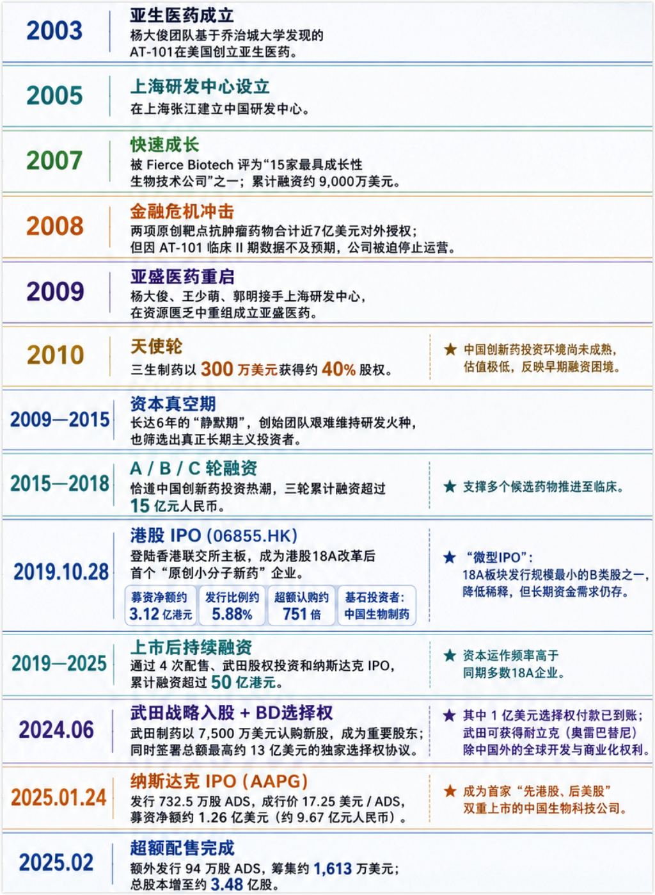

核心管线：

1. 利沙托克拉（APG-2575）
2. 奥雷巴替尼（APG-1351）

核心问题：

1、武田何时行权，大概率要Polaris-2数据读出。虽然 Polaris-2 的正式 III 期数据还没出来，但亚盛在 **2026 ASCO 年会上公布了耐立克二线治疗 CML-CP 的临床数据**，24 周 CCyR 率高达 **91.3%**，并做了口头报告，反响积极。这可以看作是 Polaris-2 的风向标。Polaris-2 正式 III 期数据预计 **2027 年上半年** 读出（入组 2026 年完成 + 6 个月随访）

2、Lisaftoclax 的 GLORA-4 临床，针对 MDS 适应症，CR 数据预计 2027 年 6 月左右读出，OS 可能要等到 2029 年。（2025 年 8 月完成入组，Venetoclax 是入组 27 个月，随访 28 个月，死亡事件数 66%）

# 概述

亚盛医药（Ascentage Pharma）是一家专注于细胞凋亡通路的全球化创新药企，公司由杨大俊、王少萌、郭明三位科学家于2009年创立，拥有全球唯一覆盖Bcl-2、IAP、MDM2-p53三条细胞凋亡通路的临床产品管线。

公司是全球唯一一家同时拥有Bcl-2、IAP、MDM2-p53三条细胞凋亡通路临床产品的创新药企，这一独特定位的战略价值在于联合用药的"内部协同"潜力。APG-2575（Bcl-2）联合APG-115（MDM2-p53）在儿童实体瘤中已展现ORR 30%、DCR 80%的数据，且该组合入选ASCO 2026口头报告。

**双核心产品驱动增长**：奥雷巴替尼是中国首个且唯一获批的第三代BCR-ABL抑制剂，2025年中国销售4.35亿元（同比+81%），所有适应症已纳入国家医保目录；利沙托克拉是中国首个获批的国产原创Bcl-2选择性抑制剂，2025年7月获批上市后5个月实现销售7,058万元。

九项全球注册III期临床试验同步推进，其中四项已获FDA/EMA批准。

亚盛医药的核心技术竞争力建立在自主构建的蛋白-蛋白相互作用（Protein-Protein Interaction, PPI）靶向药物设计平台之上。PPI靶点曾长期被视为"不可成药"领域，全球唯一获批的PPI靶点抗肿瘤药物是艾伯维的Venetoclax（维奈克拉）其销售峰值预计超过50亿美元。亚盛医药是全球唯一一家同时针对**Bcl-2、IAP（凋亡抑制蛋白）和MDM2-p53**三条关键细胞凋亡通路均有临床开发阶段品种的企业。

从科学机理看，Bcl-2通路调控线粒体外膜通透性，IAP家族蛋白（如cIAP1/2、XIAP）通过抑制Caspase活性阻断凋亡执行，MDM2-p53通路则通过泛素化降解p53肿瘤抑制蛋白维持细胞存活。三条通路在功能上相互独立但在肿瘤微环境中协同作用，同时抑制多条通路可产生协同抗肿瘤效应。

## 主要适应症

| 适应症                                      | 对应药物            | 大致位置                             |
| ------------------------------------------- | ------------------- | ------------------------------------ |
| CML 慢性髓性白血病                          | 奥雷巴替尼          | 已上市，是亚盛第一个商业化核心产品   |
| CLL/SLL 慢性淋巴细胞白血病/小淋巴细胞淋巴瘤 | 利沙托克拉          | 已在中国获批，是第二个商业化核心产品 |
| AML 急性髓系白血病                          | 利沙托克拉、APG-115 | 注册/临床阶段                        |
| MDS 骨髓增生异常综合征                      | 利沙托克拉、APG-115 | 注册/临床阶段                        |
| Ph+ ALL 费城染色体阳性急淋                  | 奥雷巴替尼          | 注册 III 期方向                      |
| MM 多发性骨髓瘤                             | 利沙托克拉          | 临床探索                             |

## 早期管线

3.1.1 APG-115（Alrizomadlin）：MDM2-p53抑制剂的全球领先地位

3.1.2 APG-2449（FAK/ALK/ROS1三联抑制剂）：实体瘤管线中最接近商业化的资产

3.1.3 APG-1252（Pelcitoclax）：Bcl-2/Bcl-xL双靶点抑制剂的前药设计突破

3.1.4 APG-3288：中国首个自主研发BTK PROTAC降解剂的临床启动

3.1.5 APG-5918（EED抑制剂）与APG-1387（IAP抑制剂）：前沿技术平台的长期布局

| 管线资产 | 核心靶点/机制        |  临床阶段  | 关键适应症             | 核心临床数据                                                 | 监管资格/差异化定位                                          |
| :------- | :------------------- | :--------: | :--------------------- | :----------------------------------------------------------- | :----------------------------------------------------------- |
| APG-115  | MDM2-p53 PPI         |  Phase II  | 黑色素瘤/ACC/儿童肉瘤  | 联合帕博利珠单抗ORR 24.1%（黑色素瘤）；ACC ORR 20.0%/DCR 96.0%；联合APG-2575儿童实体瘤ORR 30%/DCR 80% | 6项FDA ODD + 2项RPD + 1项FTD；中国首个临床MDM2抑制剂；星光计划纳入 |
| APG-2449 | FAK/ALK/ROS1         | Phase III  | ALK+ NSCLC（2L/1L）    | 2L ALK+ ORR 45.5%/mPFS 13.6个月；颅内ORR 75.0%；1L ALK+ ORR 78.6% | 2项CDE注册III期；优于lorlatinib的CNS安全性；FAK抑制克服旁路耐药 |
| APG-1252 | Bcl-2/Bcl-xL（前药） | Phase I/II | EGFR-TKI耐药NSCLC/SCLC | 联合奥希替尼ORR 80.8%（初治）；TP53+EGFR共突变ORR 87.5%      | FDA ODD（SCLC）；NCI CRADA合作；前药设计降低血小板毒性       |
| APG-3288 | BTK PROTAC降解       |  Phase I   | R/R B细胞恶性肿瘤      | 临床前：优于NX-2127/BGB-16673的降解效力与选择性              | FDA+CDE双IND；中国首个自主研发BTK降解剂；克服C481S等耐药突变 |
| APG-5918 | EED抑制剂            |  Phase I   | 实体瘤/NHL/贫血        | 临床前：KARPAS-422完全肿瘤消退；IC50 = 1.2 nM                | FDA+CDE双IND；中国首个临床EED抑制剂；PRC2全面抑制            |
| APG-1387 | 双价IAP拮抗剂        | Phase I/II | 胰腺癌/CHB             | 联合AG化疗3/15例PR（胰腺癌）；HBV小鼠模型HBsAg完全清除且停药无复发 | 全球首个IAP用于CHB临床；双价设计区别于单体IAP抑制剂          |

# 奥雷巴替尼

[亚盛_奥雷巴替尼](./亚盛_奥雷巴替尼.md)

# 利沙托克拉

[亚盛_利沙托克拉](./亚盛_利沙托克拉.md)

