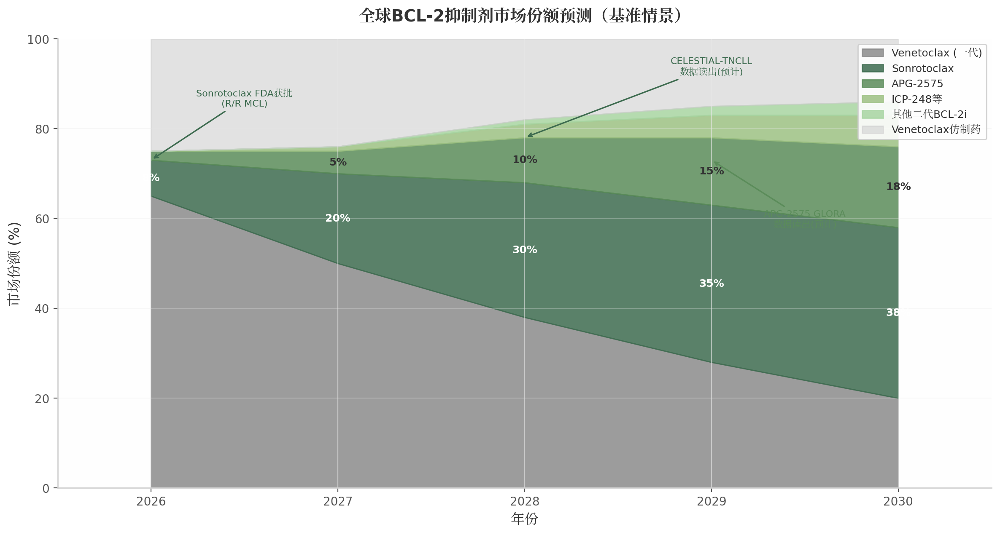

# 亚盛医药APG-2575国际三期临床成功概率深度分析

## 执行摘要

### 核心结论

亚盛医药（Ascentage Pharma）的BCL-2抑制剂APG-2575（lisaftoclax）是中国首个、全球第二个获批上市的BCL-2选择性抑制剂，目前正在推进四项国际注册性III期临床试验（GLORA系列）。基于对中国临床数据、药物机理、BCL-2靶点历史失败案例、竞争格局和试验设计的全面分析，本报告评估APG-2575四项国际III期试验的综合成功概率为**65%-75%**。

**各试验独立成功概率评估：**

| 试验 | 适应症 | 成功概率 | 核心驱动因素 | 最大风险 |
|:---|:---|:---:|:---|:---|
| GLORA | R/R CLL/SLL | **75%-80%** | PFS终点有MURANO先例；BTKi后线需求明确 | Sonrotoclax已获批同一适应症 |
| GLORA-2 | 初治CLL/SLL | **70%-75%** | 固定疗程对标CLL14；BCL-2抑制剂已成一线标准 | 需证明不劣于Venetoclax+O |
| GLORA-3 | AML | **60%-70%** | VIALE-A先例充分；安全性优势在老年人群更有价值 | OS终点统计效能要求高 |
| GLORA-4 | HR-MDS | **55%-65%** | 双主要终点策略应对VERONA教训 | MDS疾病异质性+TP53耐药 |

### 关键发现

**第一，安全性差异化是APG-2575最核心的竞争护城河，而非疗效。** 跨适应症疗效对比显示，APG-2575与venetoclax的疗效处于同一量级（CLL ORR 73% vs venetoclax 65-75%；AML CRc 51% vs 66%），但安全性优势显著：4-6天快速爬坡（vs venetoclax 5周）、TLS发生率0-2.8%（vs 1.2-13%）、Grade ≥3中性粒细胞减少21%（vs 42-58%）。这一差异化在社区肿瘤场景中具有重大商业价值。

**第二，竞争窗口期极窄——2026-2028年是APG-2575国际化的最后机会。** Sonrotoclax（BGB-11417, BeOne Medicines）已于2025年12月获FDA批准用于R/R MCL，其一线CLL的III期数据预计2026-2027年读出。APG-2575的GLORA系列预计2028-2029年读出。如果sonrotoclax一线数据积极，APG-2575将面临"me-too且来得晚"的困境。

**第三，MDS适应症（GLORA-4）是最大风险点。** VERONA试验已证明venetoclax+AZA在HR-MDS中未能显著改善OS。GLORA-4采用CR rate + OS双主要终点是对这一教训的聪明回应，但MDS的疾病生物学挑战（TP53突变耐药、患者异质性）不会因为换了BCL-2抑制剂而消失。

**第四，联合策略丰富度是APG-2575的长期隐性优势。** 亚盛拥有独特的内部管线矩阵：APG-2575（BCL-2i）+ APG-115（MDM2i）+ APG-2449（BTKi）+ APG-5918（EEDi）。在获得性耐药不可避免的背景下，这种"内部协同"能力可能比单药potency更具长期战略价值。

### 战略建议

1. **优先级排序**：CLL/SLL > AML > MDS。GLORA和GLORA-2的成功概率最高，应确保资源优先投入；GLORA-4的MDS适应症需做好OS终点可能不达的备案。

2. **合作窗口**：应在2027年GLORA数据中期读出前积极寻求与跨国大药企的授权合作，以数据为谈判筹码。等待全部数据读出后再行合作可能错失最佳窗口。

3. **差异化定位**：注册策略应强调安全性终点（TLS发生率、住院率、剂量中断率），目标定位社区肿瘤场景，而非与sonrotoclax在学术中心拼疗效深度。

---

# 1. APG-2575药物概述与BCL-2靶点机理

## 1.1 BCL-2蛋白的生物学功能

### 1.1.1 BCL-2家族凋亡调控网络：促存活蛋白与促凋亡蛋白的平衡

BCL-2（B-cell lymphoma 2）蛋白家族是线粒体凋亡途径（mitochondrial apoptosis pathway）的核心调控因子。根据功能可划分为三大类。**抗凋亡蛋白**包括BCL-2、BCL-XL、BCL-W、MCL-1和BFL-1/A1，含有BH1-BH4四个同源结构域，通过BH1-BH3结构域形成的疏水结合沟槽（hydrophobic groove）隔离促凋亡蛋白，维持线粒体外膜完整性。BCL-2蛋白的球状折叠结构包含可细分为P1-P4四个亚口袋的BH3结合沟槽（BH3-binding groove），为BH3模拟物（BH3 mimetics）的药物设计提供了精确靶标。**促凋亡效应蛋白**BAX和BAK被激活后在线粒体外膜寡聚化形成孔道，导致线粒体外膜通透性增加（MOMP），释放细胞色素c激活caspase级联反应。

**BH3-only蛋白**作为细胞应激的分子传感器，包括BIM、BID、PUMA、NOXA等，其BH3结构域通过竞争结合抗凋亡蛋白释放BAX/BAK或直接激活BAX/BAK启动凋亡。

| 蛋白类别 | 代表成员 | BH结构域 | 主要功能 | 血液肿瘤表达特征 |
|:---------|:---------|:---------|:---------|:----------------|
| 抗凋亡蛋白 | BCL-2 | BH1-BH4 | 隔离BH3-only蛋白和BAX/BAK，抑制MOMP  | t(14;18)易位导致过表达；CLL/AML均高表达  |
|  | BCL-XL | BH1-BH4 | 功能冗余替代BCL-2  | 淋巴结微环境中CD40信号上调 |
|  | MCL-1 | BH1-BH4 | 半衰期~30 min，快速响应生存信号 | Venetoclax治疗后NF-κB驱动上调，为主要代偿机制  |
| 促凋亡效应蛋白 | BAX | BH1-BH3 | MOMP执行者，线粒体外膜孔道形成  | 功能缺失突变见于17% venetoclax复发AML  |
|  | BAK | BH1-BH3 | 与BAX功能冗余  | 受BCL-XL和MCL-1双重调控 |
| BH3-only蛋白 | BIM | BH3-only | 强效凋亡激活剂  | 被BCL-2隔离，表达水平影响venetoclax敏感性 |
|  | PUMA | BH3-only | p53下游效应分子 | 启动子甲基化介导venetoclax耐药  |
|  | NOXA | BH3-only | 选择性结合MCL-1  | MDM2抑制剂可上调NOXA  |

上表揭示了BCL-2家族作为高度冗余系统的核心特征：当BCL-2被药物抑制时，MCL-1和BCL-XL可快速接管其功能，这是venetoclax获得性耐药的主要分子基础。MCL-1因其极短的蛋白半衰期成为最动态的代偿节点——单细胞多组学分析显示所有venetoclax复发CLL患者均存在NF-κB驱动的MCL-1上调。BH3-only蛋白的表达水平直接决定肿瘤细胞对BCL-2抑制剂的敏感性，PUMA的表观遗传沉默可使细胞获得耐药而不依赖BCL-2基因突变。这一网络的代偿能力从根本上解释了为何BCL-2抑制剂单药难以避免耐药，联合用药成为必然选择。

### 1.1.2 CLL/AML/MDS中BCL-2过表达的病理学基础

BCL-2最初在t(14;18)染色体易位的滤泡性淋巴瘤（FL）中被发现，该易位将BCL-2基因置于IGH增强子控制下导致过度表达。**在慢性淋巴细胞白血病（CLL）中，BCL-2过表达是最强的抗凋亡驱动因素，CLL细胞高水平表达BCL-2并伴随BIM被隔离和MCL-1的异常保护，使CLL成为BCL-2抑制剂最敏感的适应症**——venetoclax在CLL14试验中实现PFS HR 0.35。在急性髓系白血病（AML）中，BCL-2在白血病干细胞（LSCs）中高表达以维持线粒体氧化磷酸化（OXPHOS），VIALE-A试验证实venetoclax+AZA实现OS HR 0.64；但**AML异质性显著高于CLL，单核细胞分化亚型（CD14+/CD64+）因依赖MCL-1而非BCL-2而对venetoclax固有耐药**。**在骨髓增生异常综合征（MDS）中，高危患者原始细胞的BCL-2过表达提供了药理学靶标，但TP53突变和复杂核型等不良遗传学特征显著削弱BCL-2抑制的普遍有效性**——VERONA试验未能达到OS终点，揭示了MDS适应症的固有风险。从药物开发视角，BCL-2靶点的成药性已在venetoclax的成功中充分验证，**但不同适应症对BCL-2抑制的敏感性梯度——CLL > AML > MDS——直接影响了APG-2575各III期试验的成功概率评估**。

## 1.2 APG-2575分子设计与药理学特征

### 1.2.1 分子结构：N-(苯基磺酰基)苯甲酰胺类化合物

APG-2575（lisaftoclax）属于N-(苯基磺酰基)苯甲酰胺类化合物，分子设计包含三个关键特征：二氟环己烷（difluorocyclohexane）尾部、三氟甲基苯基磺酰胺连接臂和7-氮杂吲哚（7-azaindole）头部基团。APG-2575最初由密歇根大学在2018年专利WO2018/027097中首次公开，亚盛医药获得全球权益并推进临床开发。与venetoclax的哌嗪（piperazine）连接臂和氯苯基P2结合基团相比，APG-2575的二氟环己烷尾部改变了PK特征和P2口袋结合模式——亲和力从venetoclax的Ki < 0.01 nM降至IC50 = 2 nM，但可能改变了耐药突变谱。Sonrotoclax则采用7-氮杂螺[3.5]壬烷刚性螺环连接臂，使(S)-2-(2-异丙基苯基)吡咯烷以"浅而广"模式结合P2口袋，实现KD = 0.046 nM（比venetoclax高24倍）并避免G101V突变的位阻。

### 1.2.2 PK/PD差异化优势：半衰期3-6小时，支持4-6天快速爬坡

APG-2575最显著的特征是短半衰期（t1/2 3-6小时）配合高Cmax/低AUC的PK曲线。I期临床中400mg给药的Cmax为0.822 μg/mL，AUC0-24为6.85 h·μg/mL，半衰期约4.4小时；venetoclax 400mg稳态Cmax为2.1 μg/mL，AUC0-24为32.8 h·μg/mL，半衰期约26小时。BCL-2抑制剂的PD机制是Cmax驱动的——需快速达到凋亡阈值触发BAX/BAK依赖性MOMP。APG-2575的高Cmax确保靶点占据，低AUC限制持续暴露毒性，短半衰期降低蓄积风险，使**4-6天快速爬坡**（20→50→100→200→400mg每日递增）成为可能，对比venetoclax的**5周标准爬坡**。I期研究中52例CLL患者零TLS事件，5名TLS高风险患者完成快速爬坡后ALC下降89-99%而无TLS证据。这一安全性优势归因于高Cmax快速清除肿瘤细胞但低暴露避免累积毒性。

**Kimi给的Sonrotoclax 的爬坡期、DDI 和安全性部分存在明显错误！！！**

上图展示了三代BCL-2抑制剂的分化趋势：APG-2575和sonrotoclax均具有短半衰期和快速爬坡特征；在安全性维度，sonrotoclax的BCL-xL选择性优势（2000倍 vs venetoclax 325倍）转化为更低血小板毒性，APG-2575的短半衰期则降低了DDI累积风险。

### 1.2.3 药物相互作用谱：低CYP3A4/P-gp依赖性

Venetoclax是CYP3A4和P-gp双重底物，**强效CYP3A4抑制剂使其AUC增加5.8-7.9倍**——利托那韦使AUC增加7.9倍，爬坡期与强效CYP3A4抑制剂联用属禁忌。这对血液肿瘤患者尤为棘手，因为唑类抗真菌药是预防和治疗侵袭性真菌感染的标准用药。APG-2575的短半衰期和低系统暴露赋予其DDI优势：与acalabrutinib或利妥昔单抗联合未观察到DDI；虽经由CYP3A代谢，3-5小时半衰期显著降低了相互作用严重程度和持续时间。此外，APG-2575的食物效应远低于venetoclax（后者高脂餐使Cmax增加3-5倍），简化了用药指导。Sonrotoclax通过trans-(1r,4r)-4-(氨甲基)-1-甲基环己烷-1-醇尾部设计显著降低CYP抑制活性。三种药物均实现了对venetoclax代谢安全性的超越，这是社区医疗广泛采用的先决条件。

### 1.2.4 各代BCL-2抑制剂结构-活性关系对比

| 参数 | Venetoclax (ABT-199) | APG-2575 (Lisaftoclax) | Sonrotoclax (BGB-11417) |
|:-----|:---------------------|:-----------------------|:------------------------|
| **BCL-2 WT亲和力** | Ki < 0.01 nM  | IC50 = 2 nM  | KD = 0.046 nM  |
| **BCL-2 G101V亲和力** | ~200 nM (180倍降低)  | 未公开单药数据 | KD = 0.24 nM  |
| **BCL-xL选择性** | ~100倍  | ~3倍  | ~2000倍  |
| **血浆半衰期** | ~26 h  | 3-6 h  | 短  |
| **剂量爬坡时间** | 5周  | 4-6天  | 4天（住院） |
| **CYP3A4 DDI幅度** | AUC增加5.8-7.9倍  | 低（短t1/2） | 优化设计  |
| **TLS风险（CLL）** | 1.2-3.1%（RCT）; 5-10%（RW） | 0-2.8%  | 0%  |
| **G≥3中性粒细胞减少** | 45-58%  | 21-26%  | 21-36%  |
| **G≥3血小板减少** | 15-24%  | 13.5-17%  | 0-11%  |
| **抗G101V能力** | 无  | 联合MDM2i可克服  | 单药强效克服  |
| **免疫调节效应** | 未报道 | M2→M1极化  | 未报道 |

上表揭示了SAR层面的关键分化逻辑。Venetoclax以氯苯基深插入P2口袋实现极高亲和力，但G101V突变可导致亲和力骤降180倍——这是其最大结构脆弱性。APG-2575采取"差异化而非全面优化"策略：二氟环己烷尾部改变PK特征，P2结合模式调整可能改变耐药谱，但绝对亲和力（IC50 = 2 nM）低于竞品。Sonrotoclax则代表最激进的结构创新——刚性螺环连接臂的"浅而广"P2结合模式在保持超高亲和力同时实现了G101V单药克服和2000倍BCL-xL选择性，转化为零血小板毒性。

从投资分析视角，APG-2575的SAR定位是"便利性驱动的差异化"——核心竞争力在于短半衰期带来的快速爬坡、低DDI和低TLS风险的综合优势。在venetoclax已确立标准的CLL/SLL市场，这一差异化对需要快速启动、合并用药复杂或无法耐受venetoclax监测要求的患者群体具有明确价值，且已获NMPA批准验证。但与sonrotoclax的头对头竞争中，APG-2575在亲和力、G101V克服能力和血小板安全性三个维度均处相对劣势，GLORA系列III期试验的安全性终点数据将成为决定其国际市场竞争力的核心变量。

### 5.2 其他竞争者

#### 5.2.1 ICP-248（诺诚健华）

ICP-248（mesutoclax）是中国首个获BTD的BCL-2抑制剂 ，虽该title在时间上先于APG-2575，但其全球商业化影响力尚有限。在I期/II期研究中，ICP-248联合自有BTK抑制剂奥布替尼在初治CLL/SLL中ORR 100%（125mg剂量组），CRR 57.1%，36周uMRD 65% 。其最引人注目的数据来自BTKi难治MCL单药治疗——ORR 84%，CRR 36% ，这一数据甚至优于sonrotoclax在MCL的ORR 52.4%。ICP-248正在进行两项III期注册试验：一线CLL/SLL联合奥布替尼（2026年2月完成入组，仅用10个月），以及BTKi经治MCL的II期注册试验 。诺诚健华同样拥有BTKi+BCL-2i的垂直整合优势，但奥布替尼的全球竞争力远不及泽布替尼，限制了其组合疗法的国际渗透潜力。

#### 5.2.2 LP-108、LOXO-338与ABBV-453

LP-108（lacutoclax，麓鹏制药）已完成I期剂量递增（最高800mg/天，MTD未达），II期R/R CLL/SLL研究进行中 。其I期数据显示R/R CLL/SLL ORR 75%，但CRR仅18.7%，明显低于sonrotoclax的51-59% 。AML/MDS联合AZA的ORR为54.5% 。LP-108的全球开发进度明显落后于sonrotoclax和APG-2575，且麓鹏制药作为小型biotech缺乏全球商业化网络，短期威胁有限。

LOXO-338最初由Fochon开发，2020年授权给Eli Lilly，但Lilly于2022年11月终止了国际开发 。终止原因未公开，但通常反映数据竞争力不足以支撑全球开发投入。Fochon目前在中国继续以FCN-338名义进行I期研究 ，对APG-2575的全球竞争格局影响甚微。

ABBV-453（surzetoclax）是AbbVie自研的下一代BCL-2抑制剂，临床前数据显示在RS4;11异种移植模型中优于sonrotoclax和lisaftoclax 。目前处于I期早期阶段（R/R CLL/SLL和R/R多发性骨髓瘤）。虽然短期威胁极低，但AbbVie拥有venetoclax $27.9亿年销售额所建立的全球血液肿瘤商业化基础设施，若ABBV-453临床数据确证best-in-class，AbbVie有能力快速推动其替代venetoclax。这是APG-2575面临的长期潜在威胁。

**表1 二代BCL-2抑制剂竞品全维度对比矩阵**

| 维度 | APG-2575 | Sonrotoclax | ICP-248 | LP-108 | LOXO-338 | ABBV-453 |
|:---|:---|:---|:---|:---|:---|:---|
| **开发公司** | 亚盛医药 | BeOne Medicines | 诺诚健华 | 麓鹏制药 | Fochon/Lilly | AbbVie |
| **最高临床阶段** | 已获批(中国)+4项全球III期  | FDA已批准+多项III期  | III期(CLL/MCL)  | II期(CLL)  | I期(中国)  | I期  |
| **已获批适应症** | 中国R/R CLL/SLL | 美国/中国R/R MCL  | 无 | 无 | 无 | 无 |
| **BCL-2结合力** | Venetoclax级别 | **~50倍于venetoclax**  | Venetoclax级别 | Venetoclax级别 | Venetoclax级别 | **可能best-in-class**  |
| **G101V突变活性** | 可克服(程度有限) | **核心差异化优势**  | 未明确 | 未明确 | 未明确 | 未明确 |
| **TLS风险(CLL)** | 0-2.8%  | **0%**  | 0%  | 低  | 低  | 未披露 |
| **爬坡时间** | 4-6天  | 4天(住院)  | 快速爬坡 | 每日爬坡 | 未披露 | 未披露 |
| **BTKi协同** | 阿可替尼(GLORA-2)  | **泽布替尼(内部)**  | 奥布替尼(内部)  | 无 | 已终止(pirtobrutinib) | 未披露 |
| **MDS/AML布局** | **GLORA-3/4(全球III期)**  | I/II期 | I期  | I期  | I期(中国) | 未披露 |
| **商业化能力** | 中国中等(~270人)  | **全球强(12000人)**  | 中国中等 | 中国本土(弱) | 已终止 | **全球最强** |
| **竞争威胁评级** | — | **极高** | 中等 | 低 | 可忽略 | 长期潜在高 |

上述矩阵揭示了一个清晰的竞争层级：Sonrotoclax凭借FDA获批、泽布替尼协同和全球商业化网络构成"极高威胁"；ICP-248依靠垂直整合和MCL突出数据构成"中等威胁"，但其国际化能力受限；LP-108和LOXO-338因进度慢或开发终止而威胁有限；ABBV-453虽处于早期，但AbbVie的商业化能力使其成为不容忽视的长期变量。对APG-2575而言，最紧迫的竞争压力来自sonrotoclax的先发优势——FDA批准时间差约2-3年，在血液肿瘤药物市场中，这一时间窗口足以建立稳固的医生使用习惯和品牌认知。

### 5.3 APG-2575的竞争定位

#### 5.3.1 差异化优势矩阵

APG-2575的核心竞争力并非单药疗效 superiority——在CLL/SLL中其ORR与venetoclax相近——而是在安全性维度的系统性差异化。首先，4-6天快速爬坡方案（venetoclax需5周）大幅降低了治疗启动期的医疗资源和住院需求 。其次，零或极低TLS发生率（0-2.8% vs venetoclax的1.2-13%）使门诊快速启动成为可能，这对社区肿瘤诊所尤其具有吸引力 。再次，更少的药物相互作用（drug-drug interaction, DDI）——短半衰期（3-5小时）理论上降低了CYP3A抑制剂（如唑类抗真菌药）的累积风险，而venetoclax与强CYP3A抑制剂联用需减量≥75% 。在血液肿瘤领域，安全性与便利性往往是决定社区采用率的关键因素。

GLORA-4（MDS全球III期）是APG-2575最具战略价值的差异化资产。该试验是全球首个BCL-2抑制剂在高危MDS一线治疗中的注册III期研究 ，若成功将使APG-2575成为自去甲基化药物（HMA）引入以来HR-MDS的首个新靶向治疗。Venetoclax在VERONA试验中的失败为APG-2575创造了独特的市场窗口——MDS领域尚无获批的BCL-2抑制剂，率先突破者将获得显著的定价权和市场独占期。

此外，APG-2575拥有独特的联合管线矩阵：APG-2575（BCL-2i）+ APG-115（MDM2-p53抑制剂）+ APG-2449（BTKi）+ APG-5918（EED抑制剂）。这种"内部协同"能力在长期竞争中可能比单药potency更重要，因为获得性耐药是不可避免的。venetoclax的长期价值也来自于联合用药策略的演进（从单药到+BTKi到三联），亚盛的内部管线组合提供了类似的战略灵活性。

#### 5.3.2 核心劣势

APG-2575面临的最显著短板是国际商业化能力的结构性差距。BeOne拥有泽布替尼$39亿全球销售所建立的12,000人商业化团队 ，AbbVie拥有venetoclax $27.9亿的全球血液肿瘤销售网络 ，而亚盛医药商业化团队仅约270人，主要聚焦中国市场 。即使APG-2575获得FDA批准，在美国市场的推广也将面临巨大挑战——血液肿瘤药物商业化高度依赖专科医生渠道、专业药房网络和患者服务中心，这些基础设施需要数年和数亿美元才能建立。

Sonrotoclax的先发优势形成的时间压力不容忽视。若CELESTIAL-TNCLL在2028年前后读出阳性数据，sonrotoclax+泽布替尼组合可能迅速成为一线CLL的标准治疗。APG-2575的GLORA系列预计2028-2029年读出数据 ，这意味着APG-2575可能面临"me-too且来得晚"的困境。在单药抗耐药能力方面，APG-2575虽可克服venetoclax耐药（venetoclax难治患者ORR 31.8-100%），但其对G101V突变的覆盖能力不如sonrotoclax明确——后者50倍结合力优势在结构上提供了更强的抗耐药保障 。

#### 5.3.3 竞争格局预测：2026-2030年BCL-2抑制剂市场份额演变情景

基于各竞品的临床进度、商业化能力和差异化定位，我们构建了三种市场份额演变情景。假设全球BCL-2抑制剂市场从2026年的约35亿美元增长至2030年的约54亿美元 ，venetoclax仿制药在专利到期后逐步渗透。

**表2 2026-2030年全球BCL-2抑制剂市场份额预测情景分析**

| 情景/年份 | 2026 | 2027 | 2028 | 2029 | 2030 |
|:---|:---|:---|:---|:---|:---|
| **乐观情景（APG-2575 GLORA全成功+授权大药企）** | | | | | |
| Venetoclax品牌 | 62% | 45% | 32% | 22% | 15% |
| Sonrotoclax | 8% | 18% | 25% | 30% | 32% |
| **APG-2575** | **2%** | **8%** | **15%** | **22%** | **25%** |
| ICP-248 | 0% | 1% | 3% | 5% | 7% |
| 其他二代BCL-2i | 0% | 0% | 1% | 2% | 3% |
| Venetoclax仿制药 | 28% | 28% | 24% | 19% | 18% |
| **基准情景（GLORA CLL成功+MDS结果不确定）** | | | | | |
| Venetoclax品牌 | 65% | 50% | 38% | 28% | 20% |
| Sonrotoclax | 8% | 20% | 30% | 35% | 38% |
| **APG-2575** | **2%** | **5%** | **10%** | **15%** | **18%** |
| ICP-248 | 0% | 1% | 3% | 5% | 7% |
| 其他二代BCL-2i | 0% | 0% | 1% | 2% | 3% |
| Venetoclax仿制药 | 25% | 24% | 18% | 15% | 14% |
| **悲观情景（GLORA CLL数据一般+MDS失败）** | | | | | |
| Venetoclax品牌 | 68% | 55% | 45% | 38% | 30% |
| Sonrotoclax | 8% | 22% | 32% | 37% | 40% |
| **APG-2575** | **2%** | **3%** | **5%** | **8%** | **10%** |
| ICP-248 | 0% | 1% | 2% | 4% | 6% |
| 其他二代BCL-2i | 0% | 0% | 1% | 1% | 3% |
| Venetoclax仿制药 | 22% | 19% | 15% | 12% | 11% |

三种情景的核心差异在于APG-2575 GLORA系列III期的成功与否及其商业化路径选择。乐观情景假设GLORA（R/R CLL）、GLORA-2（初治CLL）、GLORA-3（AML）三项试验均达到主要终点，且亚盛在2027-2028年间与跨国大药企达成大额授权协议（类似奥雷巴替尼-武田模式），借助合作伙伴的全球商业化网络快速放量。在此情景下，APG-2575到2030年可占据约25%市场份额，主要依托MDS领域独占地位（若GLORA-4成功）和CLL/SLL的安全性差异化定位。

基准情景假设GLORA和GLORA-2成功但GLORA-4（MDS）结果不确定（CR rate可能达到但OS终点存疑），且国际化进程以自主推进为主、授权谈判进展较慢。这是概率最高的情景（约45-55%），APG-2575到2030年预计占据约18%市场份额，主要集中于中国市场和特定差异化适应症。

悲观情景假设GLORA CLL数据仅达到非劣效而非优效、GLORA-4 MDS因OS终点失败而受阻，且未能达成有效的全球合作伙伴关系。在此情景下，APG-2575可能被边缘化为主要面向中国市场的区域产品，全球市场份额约10%。

Sonrotoclax在所有情景中均为最大受益者，预计到2030年占据32-40%市场份额。其增长动力来自：CELESTIAL-TNCLL若获阳性结果将直接取代venetoclax在一线CLL中的地位；泽布替尼全球销售的协同推广效应；以及MCL、WM等venetoclax未覆盖适应症的先发独占。APG-2575的竞争策略应以"错位竞争"为核心——在sonrotoclax强势的CLL一线市场中强调安全性差异化和DDI优势，在MDS领域争取全球独占窗口，并通过国际合作弥补商业化短板。2026-2028年是APG-2575国际化最关键的窗口期：若能在sonrotoclax的CELESTIAL系列数据全面铺开前完成GLORA数据读出并达成授权合作，APG-2575仍有机会在全球BCL-2抑制剂市场中占据重要的一席之地。
## 6. GLORA系列国际三期试验设计分析

亚盛医药围绕APG-2575（lisaftoclax，利沙托克拉）构建了四项国际注册性III期试验——GLORA系列，覆盖慢性淋巴细胞白血病（CLL）/小淋巴细胞淋巴瘤（SLL）的复发难治及一线治疗、急性髓系白血病（AML）以及高危骨髓增生异常综合征（HR-MDS）。这四项试验的设计选择、对照组策略与终点设定直接决定了APG-2575全球化的成功概率。本章逐项剖析各试验的科学合理性、监管路径及关键风险因素，为最终概率推导提供结构化基础。

### 6.1 GLORA（R/R CLL/SLL）——成功概率75–80%

#### 6.1.1 试验设计与人群定位

GLORA（NCT06104566）是一项全球多中心、开放标签、随机对照III期试验，计划入组约440例BTK抑制剂（BTKi）经治≥12个月但疗效不佳（未达完全缓解CR、未进展）的CLL/SLL患者。试验组为lisaftoclax联合BTKi（acalabrutinib、zanubrutinib或ibrutinib），对照组为BTKi单药继续治疗，主要终点为独立评审委员会（IRC）评估的无进展生存期（PFS），采用iwCLL 2018标准。试验由Dana-Farber癌症研究所CLL中心主任Matthew S. Davids博士担任全球主要研究者（PI），覆盖126个中心、18个国家。

这一人群定位具有精准的临床意义。BTKi经治后疗效不佳的"1.5线"患者构成了当前CLL治疗路径中的明确缺口：BTKi单药治疗虽可控制疾病，但长期持续治疗面临BTK C481S突变等耐药风险，且残留疾病是早期进展的强预测因素。在此节点引入Bcl-2抑制剂（Bcl-2i）通过BCR非依赖的凋亡机制发挥作用，与BTKi形成机制互补。

PFS作为主要终点的选择具有充分先例支持。MURANO试验中venetoclax联合rituximab对比bendamustine联合rituximab获得PFS风险比（HR）0.17（P<0.001）；CLL14试验中venetoclax联合obinutuzumab对比chlorambucil联合obinutuzumab获得PFS HR 0.35（P<0.0001）。这两项里程碑试验确立了Bcl-2i联合方案以PFS为主要终点的监管路径。

#### 6.1.2 成功因素分析

GLORA的成功概率评估为75–80%，基于三项核心支撑因素。第一，Bcl-2i联合BTKi的协同机制已在venetoclax时代获得充分验证——ibrutinib联合venetoclax的CAPTIVATE和GLOW试验均显示30个月PFS率约95%，为联合策略提供了坚实的生物学基础。APG-2575的早期数据同样优异：lisaftoclax联合acalabrutinib在R/R CLL中客观缓解率（ORR）达98%，BTKi耐药患者ORR为87.5%；初治患者中ORR达100%（n=16），1.5年PFS率为86%。

第二，对照组虽为活性治疗（BTKi单药），但这一人群存在明确的未满足需求。BTKi单药在此类患者中的PFS数据有限，尤其是del(17p)/TP53突变亚群进展更快，为联合方案提供了充足的检测效应空间。第三，APG-2575的安全性优势——5天快速剂量递增（对比venetoclax的5周爬坡）、极低肿瘤溶解综合征（TLS）风险（约3%，均为轻度）——有望降低治疗中断率，从而提高实际药物暴露和治疗持续性。在持续数年的长期治疗中，便利性优势累积的临床价值不容小觑。

#### 6.1.3 风险因素

GLORA的主要风险来自两个方面。sonrotoclax（BGB-11417）已于2025年12月获FDA批准同一适应症（R/R CLL/SLL），这意味着GLORA在数据读出时（预计2028年Q2–Q3）可能面对已建立市场地位的竞品。开放标签设计存在固有的评估偏倚风险——尽管IRC评估可部分缓解，但研究者和患者对分组的知晓仍可能影响PFS判定。此外，对照组为活性治疗，效应量可能小于与安慰剂的对比，需要更长时间才能显现PFS差异。

### 6.2 GLORA-2（初治CLL/SLL）——成功概率70–75%

#### 6.2.1 试验设计与固定疗程定位

GLORA-2（NCT06319456）是一项全球多中心、开放标签、随机III期确证性试验，入组344例初治CLL/SLL患者，试验组为lisaftoclax联合acalabrutinib的固定周期（fixed-duration）方案，对照组为免疫化疗FCR（fludarabine+cyclophosphamide+rituximab）。主要终点为PFS，由CDE于2023年10月批准开展。

固定疗程设计是GLORA-2的战略核心。与持续BTKi单药治疗不同，GLORA-2验证的是有限周期联合治疗后停药的概念。这一策略直接对标CLL14试验的成功范式——venetoclax联合obinutuzumab固定12周期治疗后停药，6年PFS率达53%。固定疗程的潜在优势包括避免长期毒性、提高生活质量、降低耐药克隆选择压力，以及停药后复发可再治疗。

#### 6.2.2 成功因素分析

GLORA-2的成功概率评估为70–75%。击败FCR作为对照组的难度在技术上不大——FCR的中位PFS约3–4年，而Bcl-2i联合BTKi的早期数据显示30个月PFS率接近95%，两组间的疗效差距显著。APG-2575的5天快速爬坡叠加acalabrutinib的联合方案在初治患者中ORR达100%，为试验成功提供了有力数据支撑。

固定疗程设计若获成功，将为APG-2575建立区别于持续BTKi单药治疗的差异化定位。当前初治CLL领域，BTKi单药（zanubrutinib、acalabrutinib）和Bcl-2i联合抗CD20抗体（venetoclax+obinutuzumab）是两大主流策略。Bcl-2i+BTKi联合固定疗程若能在便利性和疗效之间取得平衡，将开辟第三条治疗路径。

#### 6.2.3 风险因素

GLORA-2面临的最大挑战是对照组的临床相关性。在美国和欧洲等西方国家，FCR的使用率已大幅下降（<10%新诊断CLL患者接受FCR），BTKi单药或Bcl-2i联合已成为实际标准治疗。这可能导致西方国家入组困难，且试验结果可能面临"击败过时对照"的质疑。竞品CELESTIAL试验（sonrotoclax+zanubrutinib对比venetoclax+obinutuzumab）直接挑战当前标准Bcl-2i方案，其头对头设计若获成功，将对GLORA-2形成间接压力。此外，AbbVie已递交venetoclax+acalabrutinib联合方案的补充新药申请（sNDA），若获批准，将进一步压缩GLORA-2的差异化空间。

从积极角度看，中国和许多发展中国家FCR仍是重要治疗选择，对照组在这些地区具有充分的临床相关性。GLORA-2的CDE批准确保了其在中国市场推进不受西方国家入组速度的制约。

### 6.3 GLORA-3（AML）——成功概率60–70%

#### 6.3.1 试验设计：高度遵循VIALE-A模板

GLORA-3（NCT06389292）是一项全球多中心、随机、双盲、安慰剂对照III期试验，计划入组约486例新诊断老年（≥75岁）或体弱、不适合强化疗的AML患者。试验组为APG-2575联合azacitidine（AZA），对照组为安慰剂联合AZA，主要终点为总生存期（OS）。试验于2024年4月24日启动，预计2026年完成入组。

GLORA-3的设计几乎完全复制了VIALE-A试验的成功模板。VIALE-A中venetoclax联合AZA对比安慰剂联合AZA获得中位OS 14.7个月对比9.6个月（HR 0.66，P<0.001），奠定了Bcl-2i+HMA在老年/不耐受强化疗AML中的标准治疗地位。GLORA-3采用相同的双盲安慰剂对照设计、相同的人群定义、相同的对照组（AZA单药），唯一的结构性差异是采用1:1随机化（VIALE-A为2:1），这增加了对照组患者数量，提高了安全性数据库的均衡性，但也增加了总样本量需求。

#### 6.3.2 成功因素分析

GLORA-3的成功概率评估为60–70%。VIALE-A的先例已充分证明Bcl-2i+AZA在AML中可实现有临床意义的OS获益，为同类机制药物提供了清晰的监管路径。APG-2575的早期数据支持其在该人群中具有可比性疗效：初治AML患者中ORR为64.1%，复合完全缓解率（CRc，即CR+CRi+CRh）为51.3%，与VIALE-A中venetoclax联合AZA的CR/CRi率66.4%处于相近区间。

安全性优势在AML老年人群中具有特殊价值。VIALE-A中venetoclax联合AZA组的30天死亡率为7%，而APG-2575联合AZA的30天死亡率仅为1.3%；发热性中性粒细胞减少率方面，APG-2575为10.5%（≥3级），显著低于venetoclax的42%（任何级别）。老年AML患者对治疗相关毒性的耐受性极差，更低的早期死亡率和感染率可能转化为更优的OS曲线——这正是GLORA-3有望差异化超越VIALE-A的关键假设。

#### 6.3.3 风险因素

GLORA-3面临三项核心风险。其一，OS终点对统计效能的要求极高。VIALE-A的HR为0.66，属中等效应量；若APG-2575的OS效应量低于此水平，在486例样本量下可能难以达到统计显著性。其二，对照组AZA单药的疗效可能因支持治疗进步而改善——VIALE-A中AZA单药组的中位OS为9.6个月，但近年来AML支持治疗（抗真菌预防、靶向治疗可及性）的进步可能提升对照组生存，从而压缩两组差异空间。其三，venetoclax已牢固占据老年AML市场，GLORA-3需要证明至少非劣效乃至优效才能获得监管批准和商业化空间。

### 6.4 GLORA-4（HR-MDS）——成功概率55–65%

#### 6.4.1 试验设计与双主要终点策略

GLORA-4（NCT06641414）是一项全球多中心、随机、双盲、安慰剂对照III期试验，计划入组464例新诊断高危MDS（IPSS-R评分>3，即中危/高危/极高危）患者。试验组为lisaftoclax 600mg口服（第1–14天）联合AZA 75mg/m²皮下/静脉注射（第1–7天），对照组为安慰剂联合AZA。该试验采用双主要终点设计：CR率+OS，遵循FDA的要求。试验由MD Anderson癌症中心白血病部主任Guillermo Garcia-Manero博士担任全球Leading PI，中国由北京大学人民医院黄晓军院士担任Leading PI。试验已获FDA（2025年8月）、EMA（2025年8月）和CDE（2024年8月）三重监管许可。

GLORA-4的双主要终点设计是其最核心的战略特征。Garcia-Manero博士明确指出，这一设计遵循FDA要求，旨在提供双重成功路径：CR率作为早期终点可在较短时间内（预计2–3年）读出，支持潜在的加速批准路径；OS作为确认性终点需要更长时间（预计4–5年），用于确认长期生存获益。

#### 6.4.2 差异化策略：对VERONA失败的直接回应

VERONA试验（venetoclax联合AZA对比安慰剂联合AZA在HR-MDS中，NCT04401748）是GLORA-4无法回避的前车之鉴。VERONA以OS为单一主要终点，最终结果为阴性：中位OS 22.18个月对比21.68个月，HR 0.908，P=0.38。尽管联合组显示了更高的改良ORR（76.2%对比57.7%，P<0.0001）和输血独立性（55.7%对比33.6%，P=0.0003），但OS未达统计显著差异。

GLORA-4的设计差异体现为四个层面的策略调整。第一，双主要终点（CR率+OS）替代单一OS终点，即使OS差异不显著，CR率仍可能提供独立的监管批准路径。第二，APG-2575的药代动力学（PK）特征——短半衰期（3–5小时）、高Cmax、低系统暴露——可能带来优于venetoclax的安全性窗口，尤其是更低的持续骨髓抑制和感染风险。第三，APG-2575在venetoclax耐药患者中仍显示活性（venetoclax难治R/R AML中ORR 31.8%，CR 22.7%），提示其可能克服部分venetoclax耐药机制。第四，更低的剂量调整率（因不良事件减量率APG-2575为6.1%，venetoclax约50%）可能转化为更优的实际药物暴露和治疗持续性。

#### 6.4.3 关键风险：VERONA前车之鉴与MDS生物学复杂性

GLORA-4的成功概率评估为55–65%，是四项试验中最低的。核心风险在于VERONA的失败揭示了MDS作为适应症的深层生物学挑战，这些挑战不会因更换Bcl-2抑制剂而消失。

患者异质性是首要障碍。VERONA入组约27%的中危患者和仅27%的原始细胞增多（≥5%）患者，而Bcl-2依赖性主要与原始细胞相关——Phase 1b试验中90%患者有原始细胞增多，ORR达80.4%；VERONA中这一比例的大幅稀释可能显著削弱了联合治疗的获益信号。TP53突变亚组的耐药性是第二个关键问题——VERONA中约25%患者携带TP53突变，该亚组OS HR为1.064（无获益甚至可能有害）。第三个挑战来自骨髓抑制的治疗窗矛盾：MDS患者本身骨髓功能差，Bcl-2抑制剂叠加HMA的深度骨髓抑制可能通过感染和出血并发症抵消抗白血病获益。APG-2575的短半衰期理论上可降低持续骨髓抑制，但这一假设尚需III期数据验证。

亚组分析的启示值得关注：VERONA中75岁以下患者（HR 0.835）和原始细胞≥5%患者（HR 0.858）显示数值上更有利于联合组的趋势。这提示GLORA-4若能在入组标准中更精准地聚焦Bcl-2依赖性更强的亚群，可能提高OS终点的成功概率。

---

**表1 | GLORA四项试验设计参数对比**

| 参数 | GLORA | GLORA-2 | GLORA-3 | GLORA-4 |
|:-----|:------|:--------|:--------|:--------|
| 适应症 | R/R CLL/SLL | 初治CLL/SLL | 老年/体弱AML | HR-MDS |
| NCT编号 | NCT06104566  | NCT06319456  | NCT06389292  | NCT06641414  |
| 设计类型 | 开放标签、随机 | 开放标签、随机 | 双盲、随机 | 双盲、随机 |
| 实验组 | Lisaftoclax+BTKi | Lisaftoclax+acalabrutinib | Lisaftoclax+AZA | Lisaftoclax+AZA |
| 对照组 | BTKi单药 | FCR（免疫化疗） | 安慰剂+AZA | 安慰剂+AZA |
| 主要终点 | PFS（IRC评估） | PFS | OS | CR率+OS（双主要终点） |
| 样本量 | ~440例  | 344例  | ~486例  | 464例  |
| 成功概率 | **75–80%** | **70–75%** | **60–70%** | **55–65%** |
| 全球PI | M. Davids（Dana-Farber） | — | — | G. Garcia-Manero（MD Anderson） |
| 监管许可 | FDA、EMA | CDE | FDA、EMA、CDE | FDA、EMA、CDE  |
| 预计数据读出 | 2028年Q2–Q3  | ~2028年末 | ~2028年 | 2029年CR率/2029–2030年OS |

**表2 | 各GLORA试验与venetoclax先例试验对照**

| GLORA试验 | 对标先例 | 先例结果 | 设计相似度 | 关键差异 |
|:----------|:---------|:---------|:-----------|:---------|
| GLORA（R/R CLL/SLL） | MURANO（Ven+rituximab vs BR） | PFS HR 0.17，7年PFS率23%  | 高：均为开放标签随机III期，PFS主要终点 | GLORA为Bcl-2i+BTKi联合（vs Ven+抗CD20），对照为活性治疗（vs化疗） |
| GLORA-2（初治CLL/SLL） | CLL14（Ven+Obi vs Clb+Obi） | PFS HR 0.35，6年PFS率53%  | 中高：均为固定疗程设计，PFS主要终点 | GLORA-2对照为FCR（vs chlorambucil），联合伙伴为BTKi（vs抗CD20） |
| GLORA-3（AML） | VIALE-A（Ven+AZA vs Pbo+AZA） | OS HR 0.66，mOS 14.7 vs 9.6月  | 极高：双盲安慰剂对照、OS终点、相同对照组 | 1:1随机（vs 2:1）；不同Bcl-2i分子 |
| GLORA-4（HR-MDS） | VERONA（Ven+AZA vs Pbo+AZA） | OS HR 0.908，P=0.38（**失败**） | 高：双盲安慰剂对照、相同对照组 | **双主要终点**（CR+OS，vs单一OS）；不同Bcl-2i分子 |

该对照表展示了APG-2575的临床开发策略如何系统性借鉴venetoclax的成功路径并规避其失败教训。

**表4 | GLORA系列关键里程碑时间线预测**

| 时间 | 里程碑 | 试验 | 战略意义 |
|:-----|:-------|:-----|:---------|
| 2025年7月 | APG-2575获中国NMPA批准（R/R CLL/SLL） | — | 首个适应症获批，验证临床获益–风险评估 |
| 2025年8月 | GLORA-4获FDA/EMA许可 | GLORA-4  | HR-MDS全球注册启动 |
| 2026年Q2–Q4 | GLORA入组完成 | GLORA  | 最大规模试验的入组里程碑 |
| 2026年 | GLORA-2、GLORA-3入组完成 | GLORA-2、GLORA-3  | 三项试验同步进入随访期 |
| 2027年 | GLORA-4入组完成 | GLORA-4 | 最后一项试验完成入组 |
| 2028年Q2–Q3 | GLORA数据读出（PFS） | GLORA  | **首个国际III期数据，决定全球化命运** |
| 2028年 | GLORA-3数据读出（OS） | GLORA-3 | AML适应症监管决策基础 |
| 2028年末 | GLORA-2数据读出（PFS） | GLORA-2 | 初治CLL固定疗程概念验证 |
| 2029年 | GLORA-4 CR率数据读出 | GLORA-4 | 潜在加速批准申请基础 |
| 2029年12月 | GLORA-4预计完成 | GLORA-4  | OS终点成熟度评估 |
| 2029–2030年 | GLORA-4 OS数据读出 | GLORA-4 | MDS适应症最终监管决策 |

### 7.2 各适应症成功概率汇总

#### 7.2.1 综合概率矩阵

下表整合先验概率、四维调整因子和最终概率区间，提供GLORA系列四项试验的一览式概率推导矩阵。

| 维度 | GLORA (R/R CLL/SLL) | GLORA-2 (1L CLL/SLL) | GLORA-3 (AML) | GLORA-4 (HR-MDS) |
|:---|:---|:---|:---|:---|
| **NCT号** | NCT06104566  | NCT06319456  | NCT06389292  | NCT06641414  |
| **适应症先验概率** | 65% | 62% | 55% | 50% |
| **试验设计质量调整** | +10% (PFS先例充分) | +8% (CLL14先例) | +8% (VIALE-A先例) | +5% (双主要终点) |
| **数据成熟度调整** | +3% (Phase 2 n>100) | +3% (ORR 100%) | +2% (n~40) | +2% (n=15) |
| **竞争格局调整** | -5% (sonrotoclax竞争) | -5% (CELESTIAL竞争) | -5% (venetoclax先发) | -2% (MDS无竞品) |
| **安全性差异化调整** | +5% (零TLS) | +5% (固定疗程优势) | +5% (老年人群安全) | +5% (低骨髓抑制) |
| **综合概率区间** | **75%-80%** | **70%-75%** | **60%-70%** | **55%-65%** |
| **概率中点** | 77.5% | 72.5% | 65% | 60% |
| **关键驱动因素** | PFS终点+安全性优势 | 固定疗程差异化 | VIALE-A路径复制 | CR rate第二路径 |
| **最大风险项** | sNDA早于数据读出 | FCR对照相关性 | OS终点难度 | VERONA OS前车之鉴 |

概率矩阵的横向比较揭示了APG-2575各适应症的风险-收益梯度。CLL/SLL两项试验（GLORA和GLORA-2）因Bcl-2抑制剂+BTK抑制剂（Bruton's tyrosine kinase inhibitor）联合机制的充分验证而位居概率高地，中点概率分别为77.5%和72.5%。GLORA的相对优势在于人群定义精准（BTKi经治≥12个月、疗效不佳）和对照组为活性治疗（BTKi单药），检测空间充裕；GLORA-2的相对劣势在于FCR对照组在西方国家的采用率已降至10%以下，可能面临入组困难和监管质疑。GLORA-3（AML）以65%的中点概率处于中间地带——VIALE-A的成功先例提供了清晰的OS获益路径 ，但venetoclax已牢固占据老年unfit AML的标准治疗地位，APG-2575需证明非劣效或优效才能撼动现有格局。GLORA-4（MDS）以60%的中点概率处于风险最高位，尽管双主要终点设计（CR rate + OS）是应对VERONA失败教训的聪明策略 ，MDS疾病本身的生物学异质性（TP53突变耐药、blast比例差异）构成了无法通过试验设计完全消除的根本性风险。

#### 7.2.2 时间线预测

基于ClinicalTrials.gov登记的预计完成日期和入组进度，各试验数据读出与监管里程碑的时间线预测如下。GLORA预计2026年底至2027年初完成入组 ，2028年Q2-Q3进行首次PFS期中分析；GLORA-2和GLORA-3均预计2026年完成入组 ，GLORA-3的OS数据预计2028年读出；GLORA-4预计2029年12月完成 ，CR rate数据可能于2028年中期先行读出以支持潜在加速申请（accelerated approval），OS数据则需至2029-2030年成熟。整体而言，APG-2575的国际化数据读出窗口集中在2028-2029年，与sonrotoclax的全球铺设计划（2026-2028年）存在约12-18个月的时间差——这一时间差既是风险（竞品先发建立市场），也是机会（若竞品数据不佳，APG-2575可填补空白）。
