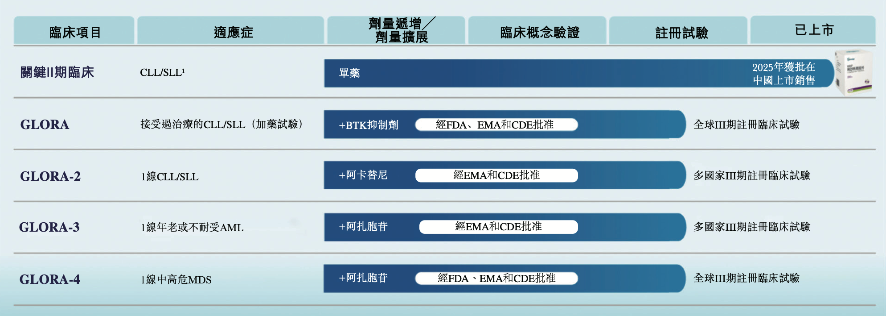
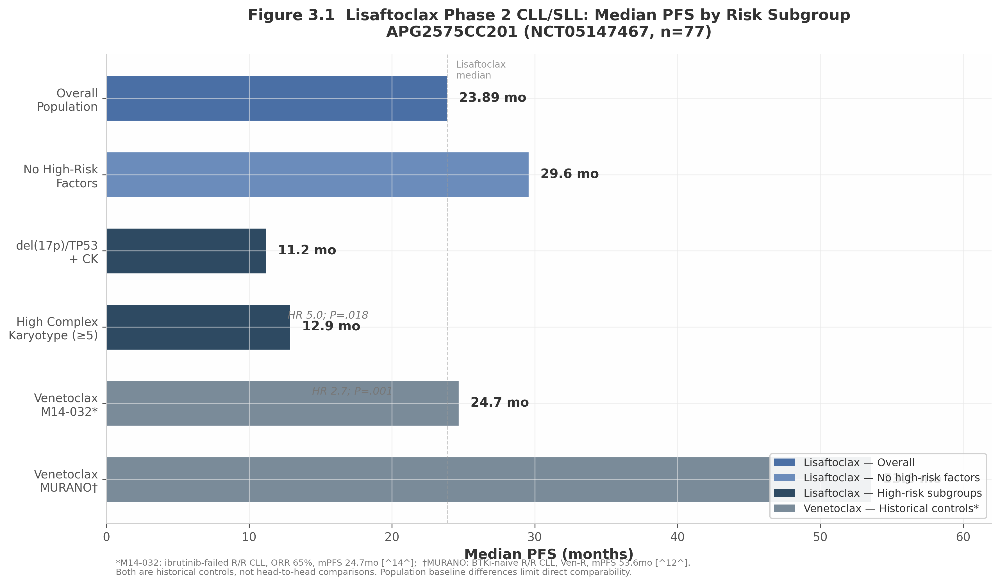
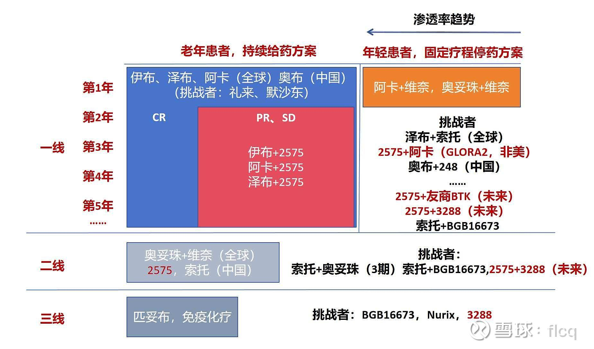

**安全性差异化是APG-2575最核心的竞争护城河，而非疗效。** 跨适应症疗效对比显示，APG-2575与venetoclax的疗效处于同一量级（CLL ORR 73% vs venetoclax 65-75%；AML CRc 51% vs 66%），但安全性优势显著：4-6天快速爬坡（vs venetoclax 5周）、TLS发生率0-2.8%（vs 1.2-13%）、Grade ≥3中性粒细胞减少21%（vs 42-58%）。这一差异化在社区肿瘤场景中具有重大商业价值。

**MDS适应症（GLORA-4）是最大风险点。** VERONA试验已证明venetoclax+AZA在HR-MDS中未能显著改善OS。GLORA-4采用CR rate + OS双主要终点是对这一教训的聪明回应，但MDS的疾病生物学挑战（TP53突变耐药、患者异质性）不会因为换了BCL-2抑制剂而消失。

**联合策略丰富度是APG-2575的长期隐性优势。** 亚盛拥有独特的内部管线矩阵：APG-2575（BCL-2i）+ APG-115（MDM2i）+ APG-2449（BTKi）+ APG-5918（EEDi）。在获得性耐药不可避免的背景下，这种"内部协同"能力可能比单药potency更具长期战略价值。


## 临床与适应症

| 研究                       | 人群/设计                                                    | 结果摘要                                                     |
| -------------------------- | ------------------------------------------------------------ | ------------------------------------------------------------ |
| NCT05147467 / APG2575CC201 | 中国注册 II 期，单药，R/R CLL/SLL，主要终点 ORR              | 77 例入组，72 例可评估；IRC 确认 ORR 62.5%，mPFS 23.89 个月；外周血 MRD 阴性 21.8%；未见 TLS 或治疗相关死亡 |
| NCT03913949                | 中国 phase 1，R/R CLL/SLL 和 NHL                             | CLL/SLL ORR 71.4%、CR 28.6%；未达 MTD，未观察到 TLS          |
| NCT04215809                | phase 1b/2，单药或联合 rituximab/acalabrutinib               | ORR：单药 67.4%，联合 rituximab 84.6%，联合 acalabrutinib 97.7%；176 例中 TLS 2.8%，无治疗相关停药或死亡 |
| NCT06104566 / GLORA        | 全球 III 期，经治 CLL/SLL，lisaftoclax+BTKi vs BTKi          | 招募中，约 400 例，主要终点 PFS                              |
| NCT06319456 / GLORA-2      | 初治 CLL/SLL，lisaftoclax+acalabrutinib vs 免疫化疗          | 招募中，约 344 例，主要终点 PFS                              |
| NCT06389292 / GLORA-3      | 初治老年或不适合强诱导 AML，lisaftoclax+azacitidine vs placebo+azacitidine | 招募中，约 486 例，主要终点 OS                               |
| NCT06641414 / GLORA-4      | 初治高危 MDS，lisaftoclax+azacitidine vs placebo+azacitidine | 招募中，约 490 例，主要终点 OS；公司称 FDA/EMA/CDE 均已放行  |


### 2.2 已获批与在研适应症一览

| 适应症                      | 状态                               | 关键时点/数据                   |
| --------------------------- | ---------------------------------- | ------------------------------- |
| R/R CLL/SLL(经治,含 BTKi)   | **中国已获批**                     | 2025.7 附条件批准               |
| R/R CLL/SLL(全球)           | 全球注册 III 期 GLORA(NCT06104566) | FDA 已放行                      |
| 一线 CLL/SLL(全球)          | 全球注册 III 期 GLORA-2            | 进行中                          |
| 高危 MDS 一线(联合阿扎胞苷) | 全球注册 III 期 GLORA-4            | FDA + EMA 放行(2025.8);ORR ~75% |
| AML(联合去甲基化/化疗)      | 早期/II 期                         | 探索中                          |
| 多发性骨髓瘤(尤其 t(11;14)) | 早期探索                           | Bcl-2 依赖亚群                  |
| Ph+ ALL(联合奥雷巴替尼)     | 研究者发起/早期                    | 联合数据见奥雷巴替尼报告        |

> 说明:亚盛披露利沙托克拉处于 **4 项全球注册 III 期**(GLORA 系列)中,覆盖 CLL/SLL(一线、经治)与高危 MDS 等。


## G4入组人群

GLORA-4主要入组：

- 初治MDS；
- 骨髓原始细胞＜20%；
- IPSS-R＞3分，即中危、高危或极高危；
- ECOG≤2；
- 预期生存期≥3个月；
- 肝肾等器官功能基本允许治疗

试验排除了：

- 治疗相关MDS；
- 由骨髓增殖性肿瘤演变而来的MDS；
- MDS/MPN重叠疾病，包括CMML；
- 严重骨髓纤维化；
- 已接受过MDS抗肿瘤治疗或既往移植的患者

初治、高危MDS全人群
        ↓
随机接受利生妥＋阿扎胞苷
或安慰剂＋阿扎胞苷
        ↓
比较CR和OS


患者可以是“初治但极高危”，类似一个刚确诊、但已经属于晚期生物学特征的肿瘤患者


## 间歇给药

#### 14天间歇给药优于 28天持续给药

**数据**：R/R AML 中，14天给药 ORR 50% vs 28天给药 ORR 39%

**机制修正 3 — 间歇给药优化假说**：

> 持续 BCL-2 抑制可能：
>
> 1. 增加对正常造血干细胞的毒性（中性粒细胞减少）
> 2. 驱动 MCL-1/BCL-xL 代偿性上调
>
> 间歇给药（14天开/14天关）允许：
>
> 1. 正常造血恢复窗口
> 2. 减少代偿机制激活
> 3. 维持肿瘤细胞对 BCL-2 抑制的"成瘾性"


## 和BTK联用

BTK 信号通路                         BCL-2 凋亡通路
     ↓                                      ↓
BTKi (阿可替尼)                      Lisaftoclax
     ↓                                      ↓
抑制 BCR 信号 → 减少增殖信号         抑制 BCL-2 → 恢复凋亡
     ↓                                      ↓
        ╰────────── 协同 ──────────╯
                     ↓
              CLL 细胞双重打击
          （无法增殖 + 被迫凋亡）





| 项目    | 适应症/人群                        | 方案 vs 对照                          | 主要终点                 | 开始时间                                            | 主要终点数据读出（预估）                                     | 状态/监管        |
| ------- | ---------------------------------- | ------------------------------------- | ------------------------ | --------------------------------------------------- | ------------------------------------------------------------ | ---------------- |
| GLORA   | 既往经治 CLL/SLL（约 440 例，1:1） | 利沙托克拉 + BTKi vs BTKi 单药        | PFS（无进展生存）        | 2023-10-23（实际）                                  | 登记主要完成约 2025 年末；考虑 PFS 终点与入组节奏，实际读出更可能在 2026–2027 | FDA 已批；进行中 |
| GLORA-2 | 初治 CLL/SLL                       | 利沙托克拉 + 阿可替尼 vs 免疫化疗     | PFS                      | 2024-04-07（实际）                                  | 约 2027 年 8 月（预估）                                      | 进行中           |
| GLORA-3 | 新诊断、老年/不适合强化疗 AML      | 利沙托克拉 + 阿扎胞苷 vs 安慰剂 + AZA | OS / CR 类终点           | 2024-06-11（实际）                                  | 约 2028 年 5 月（预估）                                      | 进行中           |
| GLORA-4 | 新诊断中高危 MDS（HR-MDS）         | 利沙托克拉 + 阿扎胞苷 vs 安慰剂 + AZA | 主要疗效终点（如 CR/OS） | 2025 年下半年启动（FDA/EMA 2025-08 获批、CDE 已批） | 约 2029 年（登记预计完成 2029-12）                           | 进行中           |

补充说明：

- GLORA是进度最快、最关键的一项，主要终点为 PFS；登记的主要完成时间偏早，但鉴于是事件驱动（PFS）终点，业内普遍预期实际数据读出落在 2026–2027 年。
- GLORA-2 在 ClinicalTrials.gov 上对应"利沙托克拉+阿可替尼 vs 免疫化疗"的初治 CLL/SLL 研究（NCT06319456）。
- GLORA-3 / GLORA-4 都是与阿扎胞苷联用、安慰剂对照的双盲设计，分别打 AML 和 HR-MDS 一线，读出最晚（2028–2029）。


### 4.3 Bcl-2抑制剂竞争格局

维奈克拉凭借近10年的先发优势，2025年全球销售额达27.92亿美元，是Bcl-2抑制剂市场的绝对霸主。然而，其5周剂量递增方案要求患者住院监测肿瘤溶解综合征（TLS），在欧美医疗体系中构成高昂成本，在中国基层医院则是资源瓶颈。维奈克拉单药因不良事件导致的停药率达9%，联合利妥昔单抗时停药率升至16%，其TLS黑框警告进一步限制了在老年患者和合并症患者中的使用。

#### 4.3.2 BTK+Bcl-2联合疗法竞争：三足鼎立与"借船出海"

CLL/SLL治疗正从持续单药治疗向固定疗程联合疗法转变，BTK+Bcl-2联合疗法已成为无化疗方案的核心。2024年ESMO指南已将维奈克拉联合伊布替尼列为一线治疗选择之一，2026年2月阿可替尼联合维奈克拉固定疗程方案获FDA批准，成为首个全口服、固定时长CLL/SLL治疗方案。

| 企业     | BTK抑制剂             | Bcl-2抑制剂               | 联合疗法进展                                          | 战略定位               |
| :------- | :-------------------- | :------------------------ | :---------------------------------------------------- | :--------------------- |
| 艾伯维   | 伊布替尼（Imbruvica） | 维奈克拉（Venclexta）     | 已获FDA/EMA批准（一线CLL/SLL）                        | 先发优势，全球品牌效应 |
| 百济神州 | 泽布替尼（Brukinsa）  | 索托克拉（Sonrotoclax）   | 头对头III期 vs 维奈克拉+奥妥珠单抗（CELESTIAL-TNCLL） | 内部闭环，"大BTK战略"  |
| 亚盛医药 | **无自有BTK**         | 利沙托克拉（Lisaftoclax） | **与阿斯利康阿可替尼联合**（GLORA-2/GLORA）           | 外部合作，差异化适应症 |

四大竞争方中，三家拥有内部闭环的BTK+Bcl-2组合，唯独亚盛缺乏自有BTK产品。这一结构性短板意味着亚盛无法掌控联合疗法的定价、推广节奏和患者流量入口。在GLORA-2研究中，亚盛选择利沙托克拉联合阿可替尼对比免疫化疗治疗初治CLL/SLL；


在髓系肿瘤领域，APG-2575联合阿扎胞苷（AZA）治疗新诊断高危MDS/CMML患者的ORR达80.0%，CR率40.0%；在Venetoclax经治髓系肿瘤患者中，ORR为31.8%，103例患者中未发生剂量限制性毒性，无TLS。在多发性骨髓瘤领域，APG-2575联合泊马度胺+地塞米松（Pd）的ORR为63.9%，中位PFS 9.7个月，为全口服方案。


## 三、疾病与机制(重点章节)

### 3.1 疾病史:慢性淋巴细胞白血病(CLL/SLL)

#### 3.1.1 CLL/SLL 是什么

CLL(慢性淋巴细胞白血病)是成熟 B 淋巴细胞的惰性(慢性)肿瘤;当肿瘤主要位于淋巴结而非血液时称 SLL(小淋巴细胞淋巴瘤)——两者本质是同一种病的不同表现。它的根源不在于细胞"长得太快",而在于细胞"**该死的时候不死**":恶性 B 细胞高表达抗凋亡蛋白(尤其 Bcl-2),逃避了正常的程序性死亡(凋亡),于是在血液、骨髓和淋巴结里不断累积。CLL 多见于老年人(诊断中位年龄约 70 岁),病程长,部分患者可长期带病生存,但携带 del(17p)/TP53 突变等高危因素者预后差、易耐药。

CLL 是过去二十年靶向治疗革命最彻底的病种之一,治疗范式经历了清晰的代际接力:

| 代际                            | 代表方案                               | 时期        | 解决了什么                                   | 暴露了什么新问题                      |
| ------------------------------- | -------------------------------------- | ----------- | -------------------------------------------- | ------------------------------------- |
| 化疗时代                        | 苯丁酸氮芥、氟达拉滨                   | 1990s       | 控制肿瘤负荷                                 | 不能治愈、毒性大、老年人难耐受        |
| 化学免疫治疗(CIT)               | FCR(氟达拉滨+环磷酰胺+利妥昔单抗)      | 2000s–2010s | 显著延长 PFS,部分治愈                        | 对 del(17p)/TP53 无效、毒性大         |
| 共价 BTK 抑制剂                 | 伊布替尼、acalabrutinib、泽布替尼      | 2014–       | 口服、对高危亦有效,改写一线                  | 需持续服药、C481S 突变耐药、房颤/出血 |
| **Bcl-2 抑制剂**                | **venetoclax(2016)、利沙托克拉(2025)** | 2016–       | **靶向凋亡、深度缓解(uMRD)、可固定疗程停药** | venetoclax 有 TLS 风险、爬坡复杂      |
| 非共价 BTKi / 双靶联合 / 新机制 | pirtobrutinib、BTK 降解剂等            | 2023–       | 攻克 BTKi 耐药                               | 长期数据待积累                        |

这条接力链的关键转折是:**BTK 抑制剂解决了"信号通路依赖",Bcl-2 抑制剂解决了"凋亡逃逸"**——两条路径互补,如今 CLL 治疗的核心矛盾,是"BTKi 与 BCL-2i 双重耐药/经治后无药可用"的人群。利沙托克拉的获批适应症(经治、含 BTKi 失败)正卡在这个痛点上。


共价 BTKi 是怎么"锁死"BTK的?

> BTK 是那个"蛋白质靶点"，BTKi 是专门用来"关掉它"的药。就像锁（BTK）和钥匙堵头（BTKi）的关系——只不过这把锁在细胞内部，堵头是吃药送进去的小分子。

分子上伸出一个丙烯酰胺弹头（warhead），像一把带倒钩的锁扣，跟 BTK 蛋白上第481位的一个半胱氨酸残基（Cys481） 形成不可逆的共价键（硫醚键）。

```
BTK蛋白: ...–Cys⁴⁸¹–SH  +  药物–CH=CH₂
                ↓ 共价结合（不可逆）
       ...–Cys⁴⁸¹–S–CH₂–药物  ← 永久"焊死"，BTK失活
```


耐药的核心问题：Cys481这个点如果被改掉了

```
C481S 突变（半胱氨酸→丝氨酸）
正常BTK:  ...Cys⁴⁸¹–SH  ← 有巯基(–SH)，共价药物能挂上去 ✅
突变BTK:  ...Ser⁴⁸¹–OH  ← 只有羟基(–OH)，共价弹头挂不上去了 ❌
```

C481S 是共价BTKi耐药中最经典、最常见、最具临床意义的突变，在BTK抑制剂治疗后的复发CLL患者中出现率大约可到 30%~40%甚至更高（取决于治疗时长、检测深度等）。


*BTK和BCL-2的区别*：一个掐信号，一个按死刑按钮

|                  | 二代共价 BTKi（泽布替尼/阿可替尼）               | BCL-2 抑制剂（维奈克拉/Venetoclax）                        |
| :--------------- | :----------------------------------------------- | :--------------------------------------------------------- |
| 它打断的是什么？ | B细胞的"生长/存活信号线"（BCR→BTK→下游）         | 癌细胞的"不死机制"（凋亡刹车 BCL-2）                       |
| 比喻             | 把敌人的通讯电台砸了——收不到"活下去、分裂"的指令 | 把敌人的防爆安全罩卸了——细胞终于能走正常的自杀程序（凋亡） |

BTKi — 阻断 BCR 信号通路

```
B细胞受体(BCR) 被触发
    → BTK 被磷酸化激活（Cys481位点）
        → 下游 PLCγ2 → Ca²⁺↑ → NF-κB / MAPK / PI3K
            → 癌细胞: 增殖↑ 存活↑ 黏附在淋巴结微环境里
```

BCL-2 抑制剂 — 释放 线粒体凋亡通路

```
正常情况（癌细胞搞鬼）:
    BCL-2（抗凋亡蛋白）绑住了 BAX/BAK（促凋亡蛋白）
    → 线粒体膜不破 → 细胞"该死但不死"

维奈克拉来了:
    → 高选择性 occupying BCL-2 的 BH3-binding groove
        → BAX/BAK 被释放出来
            → 线粒体外膜穿孔（MOMP）
                → 细胞色素c释放 → Caspase-3/7激活
                    → 细胞凋亡💀
```

维奈克拉是 BH3 模拟物（BH3-mimetic）——它长得像天然促凋亡蛋白的"钓钩区"，抢走 BCL-2 上的座位，把促凋亡蛋白放出来，直接触发细胞自杀，所以它杀得又快又猛——也是为什么起始剂量必须 5周 ramp-up（20→50→100→200→400mg），不然大量肿瘤细胞同时崩溃释放钾/尿酸/磷 → 肿瘤溶解综合征（TLS）。

| 战场                                                         | 谁主攻            | 为什么                                                       |
| :----------------------------------------------------------- | :---------------- | :----------------------------------------------------------- |
| 淋巴结 / 骨髓微环境（癌细胞躲在基质细胞旁边，被滋养信号护着） | BTKi 更擅长       | BTKi 切断 BCR 信号 + 破坏黏附分子 → 把细胞赶出庇护所         |
| 外周血 / 循环中的静止癌细胞                                  | Venetoclax 更擅长 | 这些细胞一旦离开微环境，变得高度依赖 BCL-2 存活——维奈克拉一击必杀 |

```
CLL细胞存活靠两条腿走路：

  (1) 外部信号腿：  BCR → BTK → 发出"活下去"信号
  (2) 内部不死腿：  BCL-2 压住凋亡 → "我不准你死"

  二代共价 BTKi  ──砍──→  (1)信号腿断了    → 细胞断粮、被赶出巢穴
  BCL-2抑制剂    ──砍──→  (2)不死腿破了    → 细胞执行自杀程序

  两条腿一起砍（联合）→ 最深缓解、最短疗程、uMRD
```


```
CLL 的生存依赖                      AML 的生存依赖

     BCL-2                            BCL-2  │ MCL-1  │ BCL-xL
       │                                ██     │  ████   │  ██
   ████████                            ~40%    │  ~35%   │  ~25%
       │
   近乎唯一通路                        多条平行通路
```


**整体格局：靶向药已基本取代化疗**

最确定的一点是：BTK 抑制剂 + BCL-2 抑制剂两条路线合计已经占据 CLL 治疗的绝大部分（按患者数估计 **85–95%+**）。各国最新指南(2023–2025)已把化学免疫治疗(CIT)列为"仅极少数例外情况"使用。

**BTK 抑制剂——目前的主导路线**

按用药患者数，BTKi 是最大的一类，但占比因地区差异极大：

- 美国一线市场极度偏向 BTKi。一项 Medicare 真实世界数据中，约 **89%** 患者用 BTKi、仅约 **11%** 用 维奈克拉+奥妥珠单抗(Ven-O)。
- 欧洲则相反，固定疗程的 Ven-O 更受青睐(见下)。

代表药：伊布替尼(一代，份额下滑中)、阿可替尼(Calquence)、泽布替尼(Brukinsa)。按销售额，BTKi 这一类 2024 年明显大于 BCL-2：阿可替尼约 25 亿美元、泽布替尼全适应症约 26 亿美元、伊布替尼约 26 亿(但快速下滑)。

**BCL-2 抑制剂(维奈克拉为主)——快速增长的第二极**

维奈克拉(Venclexta/Venetoclax)是目前唯一上市的 BCL-2 抑制剂，主打"固定疗程、可停药"的差异化，与奥妥珠单抗或 BTKi 联用。

- 美国一线占比相对小(约 **10–15%**)，但在复发难治和欧洲市场占比高得多。
- 法国真实世界数据里：Ven-O 反而是最常用方案(**51.1%**)，BTKi 单类 26.2%，维奈克拉+伊布替尼 16%。
- 全球销售额 2023 年约 22 亿美元(含 CLL 和 AML)，增速约 14%。

**其余技术路线——已被边缘化或仍很小**

如果硬要给一个全球加权的近似：BTK 抑制剂约 **55–75%**、BCL-2(维奈克拉)约 **15–35%**、化疗/CIT **<10%**、PI3Ki 及其他(CAR-T、双抗等)合计 **<5%**——其中美国更偏 BTKi 高端区间，欧洲 BCL-2 占比明显更高。

### 6.1 患病人数漏斗

| 层级                               | 美国                                      | 中国                         |
| ---------------------------------- | ----------------------------------------- | ---------------------------- |
| CLL 年新发                         | ~20,700 例(2024)                          | 约千例/年(罕见)              |
| CLL 现患                           | ~215,000 例                               | 数万人(为欧美约 1/10)        |
| 年龄标化发病率                     | ~4.6/10 万                                | 约为欧美 1/10,中位年龄 65–70 |
| 经治/BTKi 失败(利沙托克拉首发人群) | 相当规模、持续累积                        | 相对有限                     |
| 高危 MDS / AML / MM 等扩展         | 显著增量(尤其 MDS/AML 在中美均为较大病种) | 较大增量                     |


## 用药


从 Navitoclax 的失败到 Venetoclax 的成功，关键教训是：**选择性决定治疗窗**。从 Venetoclax 到 Lisaftoclax、Sonrotoclax，新一代药物在 PK 设计、给药便利性、耐药克服上继续分化，但核心机制始终是 BH3 模拟、BIM 释放、BAX/BAK 激活和 MOMP。

未来的几个关键方向：

1. **更优的联合方案**：BTK + BCL-2、BCL-2 + 去甲基化药物、BCL-2 + MDM2-p53 抑制剂等；
2. **克服耐药**：针对 G101V 等突变的下一代抑制剂，以及 MCL-1/BCL-xL 联合抑制策略；
3. **适应症扩展**：从 CLL/SLL 向 AML、MDS、MM、NHL 等拓展；
4. **固定疗程与停药**：通过深度 MRD 阴性实现有限疗程，改善患者生活质量。

选择性是关键：避开BCL-xL

血小板和巨核细胞的存活高度依赖 **BCL-xL**。如果抑制剂同时抑制 BCL-xL，会加速血小板凋亡，导致快速、剂量限制性的血小板减少。

Navitoclax 的失败就是血淋淋的教训：它对 BCL-xL 的抑制太强，导致血小板毒性无法接受。因此，后续所有成功的 BCL-2 抑制剂都必须在**BCL-2 与 BCL-xL 之间做出足够的选择性分离**。

不过，选择性并非越高越好。BCL-2 与 BCL-xL 的结构相似，过度追求选择性可能牺牲结合亲和力。不同药物在“选择性”与“效力”之间的取舍不同，也造就了各自的临床特性：

- **Lisaftoclax**：BCL-2/BCL-xL 选择性约 3 倍，亲和力略低于 Venetoclax，但短半衰期降低了持续暴露风险；
- **Sonrotoclax**：BCL-2/BCL-xL 选择性极高（>2000 倍），同时 BCL-2 亲和力也极强，因此杀伤更剧烈、需要更谨慎的爬坡策略。


药物是如何结合BCL-2的，不同的分子结构，结合产生的效果有何不同？


### 3.2 高危亚组分析：机制边界条件的确定

Phase 2研究的核心科学价值不仅在于确认整体疗效，更在于通过高危亚组分析识别Cmax驱动模型的边界条件——即哪些生物学因素限制了BCL-2抑制的疗效上限。

#### 3.2.1 del(17p)/TP53突变：最强负向预测因子

del(17p)/TP53突变亚组（n=30, 39%）的中位PFS为11.2个月，而无此突变且无复杂核型患者为29.6个月，风险比（hazard ratio, HR）为5.0（P=.018）。这一差异具有高度统计学显著性，TP53异常成为PFS缩短的最强预测因素。

从机制角度分析，p53蛋白是BAX基因的转录激活因子。在DNA损伤或凋亡信号刺激下，p53上调BAX表达，促进线粒体外膜通透化（mitochondrial outer membrane permeabilization, MOMP）。BCL-2抑制剂通过竞争性释放BIM、PUMA等BH3-only蛋白间接激活BAX/BAK，但当TP53缺失时，BAX的转录水平基线降低，即使BH3-only蛋白被释放，也可能不足以充分激活降低数量的BAX蛋白以突破MOMP阈值。这一机制推导解释了为何TP53缺失显著限制BCL-2抑制疗效——并非BCL-2靶点本身失效，而是下游凋亡执行通路被削弱。

值得注意的是，mPFS 11.2个月虽显著短于整体人群，但并非无效——这些患者在BTKi和化疗双重失败后仍获得约1年的无进展生存，提示BCL-2抑制即使在TP53功能缺失背景下仍保留部分活性。这与EHA 2026相关分析中观察到的TP53突变/del(17p)与更短PFS相关但非完全耐药的结论一致。

#### 3.2.2 复杂核型：基因组不稳定性的独立预后价值

高复杂核型（≥5种染色体异常）患者的中位PFS为12.9个月，而无高复杂核型患者为25.7个月（HR 2.7; P=.001）。复杂核型整体占研究人群的42.9%，其中63.6%同时携带del(17p)/TP53突变，63.6%具有≥5种异常的高复杂核型。EHA 2026的多变量分析进一步确认复杂核型和肿瘤大小是PFS缩短的独立风险因素。

复杂核型的不良预后反映了基因组不稳定性驱动的克隆异质性和多克隆耐药潜能。BCL-2抑制剂对单一克隆的BCL-2依赖性肿瘤高效，但当肿瘤细胞群体存在广泛的基因组异质性时，非BCL-2依赖的亚克隆可在治疗压力下被选择性扩增，导致早期进展。这一机制与TP53缺失不同——TP53限制的是凋亡通量的"深度"，而复杂核型限制的是靶向治疗的"广度"。

**图3.1**系统展示了各风险亚组的mPFS对比。无高危因素患者的mPFS（29.6个月）接近Venetoclax M14-032研究在类似人群中的24.7个月，而del(17p)/TP53+CK（11.2个月）和高复杂核型（12.9个月）亚组的mPFS显著缩短，形成清晰的"疗效梯度"。



#### 3.2.3 IGHV未突变状态：有限的独立影响

53.2%的研究人群为uIGHV状态，但具体亚组PFS数据未单独报告。MURANO研究中uIGHV患者的5年PFS率仅为29%，提示uIGHV是不良预后因素。然而，在Lisaftoclax研究中，即使uIGHV比例高达53.2%，整体ORR仍维持62.5%，可能反映BCL-2抑制对BCR信号通路依赖性的覆盖——uIGHV细胞的增殖优势部分依赖于BCL-2介导的凋亡抵抗，因此BCL-2抑制可部分克服uIGHV相关的耐药机制。

### 3.3 MRD数据：深度缓解的机制解读

#### 3.3.1 PB与BM MRD阴性率

在55例外周血（peripheral blood, PB）MRD可评估患者中，12例（21.8%）达到MRD阴性（uMRD）。在11例骨髓（bone marrow, BM）MRD可评估患者（PB已达阴性者）中，6例（54.5%）达到uMRD。

BM uMRD率（54.5%）高于PB uMRD率（21.8%）的表观矛盾可从研究设计角度解释：BM MRD评估仅在PB已达阴性的患者中进行，构成高度选择性的应答良好人群；样本量小（n=11）也增加了不确定性。尽管如此，54.5%的BM uMRD提示在达到PB清除的亚组中，Lisaftoclax可实现深度骨髓缓解。

与历史数据比较，MURANO研究中Venetoclax联合rituximab（Ven-R）方案在BTKi初治人群中达到PB uMRD 62.4%（疗程结束时），显著高于Lisaftoclax的21.8%。但关键差异不可忽视：MURANO人群BTKi初治（仅2.6%有BCRi暴露），而APG2575CC201中87%为BTKi耐药；MURANO为固定2年疗程联合rituximab，而Lisaftoclax为持续单药；MURANO中位既往治疗仅1线，APG2575CC201为3线。在更具可比性的Venetoclax M14-032研究中（BTKi失败后，持续单药），PB uMRD为42%，仍高于Lisaftoclax，但差距缩小。

#### 3.3.2 MRD与长期预后的关联

MRD阴性在CLL中的预后价值已被MURANO等研究证实：uMRD与显著更长PFS相关。Lisaftoclax研究中21.8%的PB uMRD率虽不高，但在重度预处理人群中仍具临床意义——这些达到深度缓解的患者可能代表了BCL-2高依赖性的克隆构成，预期将从持续治疗中获得最长久的获益。中位随访仅22个月，MRD状态与PFS/OS的关联数据尚未成熟，需要更长随访确认。

从机制角度，MRD阴性率直接反映了Cmax驱动模型的深度杀伤能力。21.8%的PB uMRD表明，在600mg每日一次剂量下，相当比例的患者可达到$<10^{-4}$的白血病负荷——即Cmax驱动的脉冲式凋亡触发足以清除绝大多数恶性克隆，仅残余微量耐药细胞。这一观察与Cmax驱动模型的预测一致：每日重复的Cmax脉冲可逐步降低肿瘤负荷，最终达到检测阈值以下。

### 3.4 AML/MDS验证：联合策略的机制协同

APG2575AU101研究（NCT04964518）在全球多中心开展，评估Lisaftoclax联合阿扎胞苷（azacitidine, AZA）治疗髓系恶性肿瘤，共入组103例患者。该研究为Cmax驱动模型在联合策略中的适用性提供了关键验证，并揭示了一个重要的机制发现。

#### 3.4.1 R/R AML：BCL-2+HMA协同的机制验证

在44例可评估R/R AML/MPAL患者中，ORR为43.2%，完全缓解/完全缓解伴不完全血液学恢复率（CR/CRi）为31.8%，中位OS为7.6个月。这一疗效处于Venetoclax+AZA在R/R AML的历史范围（20–64% ORR）之内。

联合方案的核心协同机制已被VIALE-A等研究阐明：AZA通过整合应激反应（integrated stress response, ISR）通路上调NOXA表达，NOXA特异性结合并中和MCL-1，同时HMA治疗后BCL-2表达相对增加而MCL-1下降，形成更利于BCL-2抑制剂治疗的凋亡谱。Lisaftoclax的Cmax驱动特征与AZA的细胞周期阻滞效应形成互补——AZA使细胞更长时间暴露于BCL-2抑制诱导的凋亡信号，而Lisaftoclax的高Cmax确保在每个给药周期内突破MOMP阈值。

#### 3.4.2 Venetoclax暴露AML：关键机制发现

在22例可评估Venetoclax暴露R/R AML患者中，ORR为31.8%，CR率22.7%。值得注意的是，71%（5/7）的应答者携带TP53突变和复杂核型。这是首个临床报道一种BCL-2抑制剂可在另一种BCL-2抑制剂（Venetoclax）治疗失败后产生缓解的研究。

这一发现的机制解读至关重要。生化数据明确显示Lisaftoclax对BCL-2 G101V gatekeeper突变的活性差于Venetoclax（biochemical IC$_{50}$ ~57 nM（细胞实验IC50约161 nM）vs Venetoclax biochemical IC50 ~25-29 nM），因此31.8%的ORR并非来自对BCL-2突变的直接覆盖。可能的解释包括：(1) **耐药机制异质性**——并非所有Venetoclax进展患者均携带BCL-2突变，部分患者的耐药可能源于MCL-1上调等非BCL-2依赖机制，而AZA通过下调MCL-1可恢复此类患者的敏感性；(2) **联合策略效应**——AZA的NOXA上调和MCL-1降解作用切断了Venetoclax耐药的主要代偿通路。这一机制理解对临床定位具有决定性意义：Lisaftoclax在Venetoclax经治患者中的活性主要依赖联合策略而非单药耐药覆盖。

#### 3.4.3 ND HR-MDS/CMML：BCL-2 priming的最高表达

15例可评估初治（newly diagnosed, ND）高危MDS/CMML患者中，ORR达到80.0%，CR率40.0%，改良CR（mCR）率40.0%，中位OS未达到。这是APG2575AU101研究中疗效最突出的队列。

ND HR-MDS的高缓解率可从以下机制理解：首先，HR-MDS原始细胞通常高表达BCL-2，为BCL-2抑制剂提供理想靶点；其次，MDS原始细胞相比AML更具BCL-2依赖性且对凋亡信号更敏感；第三，AZA的双重作用——去甲基化表观遗传效应叠加直接凋亡启动效应——与Lisaftoclax形成深度协同。Garcia-Manero等报道的Venetoclax+AZA在类似人群中mOR为80.4%，与Lisaftoclax数据高度一致，支持BCL-2+HMA联合在MDS中的类效应（class effect）。

**表3.2**汇总了APG2575AU101研究各队列的疗效数据，以及与Venetoclax历史试验的对比。


#### 

#### 4.3.1 分子差异：**G101V** 耐药

Lisaftoclax与Venetoclax虽共享N-苯基磺酰基苯甲酰胺核心骨架，但在连接子区域和P2/P4口袋结合策略上的差异导致了不同的结合模式和耐药谱。Venetoclax通过氯苯酚基团深插入BCL-2的P2疏水口袋，与G101位点邻近残基形成关键相互作用。G101V突变通过空间位阻机制（V101侧链推动E152旋转60°，与氯苯酚产生范德华碰撞）使Venetoclax结合亲和力降低约180倍。

Lisaftoclax采用不同的分子骨架（含苯基吡咯烷和磺酰胺结构），但生化数据显示其对G101V突变体的biochemical IC50为~57 nM（细胞实验IC50约161 nM），比Venetoclax的biochemical IC50 ~25-29 nM更差。这一看似矛盾的结果提示Lisaftoclax的结合模式同样深入P2口袋，未能规避G101V突变带来的空间位阻。Sonrotoclax（BGB-11417）通过与P2口袋"浅而广"的相互作用（E152距异丙基苯基~6 Å）成功规避了G101V耐药，从反面印证了结合模式深度对耐药覆盖的决定性影响。

在G101V耐药覆盖这一关键维度上，表4.2明确显示Lisaftoclax（IC50 57 nM）差于Venetoclax（IC50 25 nM），两者均不能有效克服gatekeeper突变。真正的耐药覆盖型BCL-2抑制剂是Sonrotoclax（BGB-11417），其通过与P2口袋"浅而广"的相互作用将G101V IC50降至0.34 nM。Lisaftoclax在Venetoclax经治患者中的疗效不应被解读为"克服耐药"，而应理解为"在耐药机制异质性背景下的部分活性"——联合acalabrutinib的86% ORR反映的是BTKi通过下调MCL-1恢复BCL-2依赖性的协同机制，而非Lisaftoclax本身对BCL-2突变的覆盖能力。


## 5. Phase 3推导：基于验证后机制的临床结果预测

### 5.1 GLORA（NCT06104566）：BTKi应答不佳CLL/SLL

#### 5.1.1 试验设计与机制契合点

GLORA试验是一项全球多中心、开放标签、随机Phase 3注册试验，计划入组约440例既往接受BTK抑制剂（BTKi）单药治疗12个月以上、既未达到完全缓解（CR）也未出现疾病进展的CLL/SLL患者。受试者按1:1随机分配至Lisaftoclax联合BTKi（acalabrutinib、zanubrutinib或ibrutinib）组或BTKi单药继续治疗组，主要终点为独立评审委员会（IRC）评估的无进展生存期（PFS），关键次要终点为总生存期（OS）。该试验在全球18个国家126个中心开展，按del(17p)/TP53突变状态进行分层随机化。

从机制角度审视，GLORA的入组标准精准对应了BCL-2抑制剂与BTKi联合用药的最佳机制场景。BTKi经治12个月以上仍未达CR的患者群体，其白血病细胞虽被BTKi抑制了B细胞受体（BCR）信号依赖的存活通路，但尚未突破MOMP（mitochondrial outer membrane permeabilization，线粒体外膜通透化）阈值，残留病灶持续存在。此类患者正是BCL-2抑制的理想靶点——BTKi已使细胞"半primed"（部分靠近凋亡阈值），Lisaftoclax的介入可完成最后的阈值突破。

#### 5.1.2 机制推导：BTKi下调MCL-1→增强BCL-2依赖→协同凋亡触发

**机制基础**：动态BH3谱分析（dynamic BH3 profiling）研究已证实，BTK抑制剂（包括ibrutinib和acalabrutinib）通过两种互补机制增强CLL细胞对BCL-2抑制的敏感性：其一，BTKi上调BIM蛋白表达，使BIM进一步饱和BCL-2的抗凋亡结合位点；其二，BTKi下调MCL-1的功能活性（可能通过去磷酸化修饰），减少白血病细胞对MCL-1的代偿性依赖。Ex vivo和in vivo数据一致显示，acalabrutinib治疗后CLL细胞对BAD BH3肽（BCL-2依赖性指标）的响应增加20%–50% delta priming，而对MS-1肽（MCL-1依赖性指标）无显著变化。

**推导逻辑**：GLORA试验入组的正是已接受BTKi治疗12个月以上的患者——其白血病细胞已处于BTKi诱导的"高BCL-2依赖、低MCL-1功能"状态。此时加用Lisaftoclax，BCL-2的抑制将释放大量BIM至胞质，激活BAX/BAK寡聚化并触发MOMP。由于MCL-1功能已被BTKi削弱，细胞难以通过MCL-1代偿性隔离BIM，凋亡执行的效率因此大幅提高。

**预期结果**：基于上述机制推导，GLORA试验预期可达到PFS风险比（HR）0.40–0.60。Phase 1b/2数据显示，Lisaftoclax+acalabrutinib在复发/难治CLL中的客观缓解率（ORR）达96%–98%，包括venetoclax经治患者。参照MURANO试验中venetoclax+rituximab对比苯达莫司汀+利妥昔单抗（BR）取得的PFS HR 0.17（mPFS 53.6 vs 17.0个月），GLORA的设计效应量更为保守（HR 0.40–0.60），考虑到入组人群为BTKi应答不佳者（高危比例更高），此预测区间具有合理性。若GLORA达到PFS HR ≤0.60的预设边界，将为"BTKi基础上加用BCL-2抑制剂"这一策略提供首个Phase 3级别证据。

### 5.2 GLORA-2（NCT06319456）：初治CLL/SLL

#### 5.2.1 试验设计与固定疗程策略

GLORA-2是一项全球多中心、随机、开放标签Phase 3确证性试验，评估Lisaftoclax联合acalabrutinib对比免疫化疗（immunochemotherapy, CIT；FCR或BR方案）用于初治CLL/SLL患者的疗效和安全性，计划入组约344例患者。与CLL14试验中venetoclax+obinutuzumab对比chlorambucil+obinutuzumab的设计不同，GLORA-2选择了CIT作为对照组，并将目标定位为验证"固定疗程（fixed-duration）"联合方案作为一线治疗的可行性。

#### 5.2.2 机制推导：BTKi+BCL-2i双重通路抑制→深度MRD阴性→潜在固定疗程治愈

**机制基础**：BTKi与BCL-2i的协同机制已在第4章详细阐述。BTKi通过抑制BCR信号下调MCL-1功能和BIM sequestration能力，使CLL细胞进入"BCL-2成瘾"状态；Lisaftoclax则通过高$C_{max}$脉冲式释放BIM，触发BAX/BAK依赖性MOMP。两条通路分别作用于凋亡调控网络的上游（生存信号）和下游（效应执行），形成互补而非重叠的覆盖。

**推导逻辑**：初治CLL患者的BCL-2 priming水平通常高于经治患者（未经历多线选择压力），对BH3 mimetic的敏感性基线较好。Lisaftoclax+acalabrutinib联合方案预期可诱导极高比例的不可检测微小残留病灶（uMRD），这是固定疗程策略成功的先决条件——只有达到深度分子学缓解，治疗停止后的持久缓解才具有生物学基础。CLL14试验已验证这一范式：venetoclax+obinutuzumab治疗结束后，74.5%的患者达到外周血uMRD（<10⁻⁴），其中MRD<10⁻⁶者在治疗结束后4年的PFS率仍达77.1%。

**预期结果**：GLORA-2预期PFS HR 0.45–0.65。历史参照方面，CLL14试验最终分析（中位随访110.1个月）显示venetoclax+obinutuzumab的mPFS为76.6个月（vs chlorambucil+obinutuzumab 37.9个月；HR 0.50）。5年中期分析时PFS HR为0.35（95% CI 0.26–0.46）。Lisaftoclax+acalabrutinib作为全口服方案，理论上可达到与venetoclax+obinutuzumab相当的深度缓解率。Phase 1b/2数据显示初治患者ORR达100%，若GLORA-2中uMRD率达到65%–75%，则PFS HR落入0.45–0.65区间具有高度可行性。

需要指出的是，GLORA-2选择CIT而非venetoclax-based方案作为对照，在欧美市场存在监管局限性——当前venetoclax+obinutuzumab已取代CIT成为一线标准。然而，在全球许多地区CIT仍是可及的治疗选择，且证明优于CIT可建立Lisaftoclax+acalabrutinib的一线治疗地位。

### 5.3 GLORA-3（NCT06389292）：AML

#### 5.3.1 试验设计与历史参照

GLORA-3是一项全球多中心、随机、双盲、安慰剂对照Phase 3关键注册试验，评估Lisaftoclax联合azacitidine（AZA）对比安慰剂联合AZA用于新诊断、不适合标准诱导化疗的老年AML患者，计划入组约486例，主要终点为OS。该设计直接对标VIALE-A试验（venetoclax+AZA vs安慰剂+AZA，NCT02993523），后者确立了venetoclax+AZA作为此类患者标准治疗的地位。

#### 5.3.2 机制推导：BCL-2抑制+HMA协同→白血病干细胞清除

**机制基础**：AML中BCL-2抑制剂与HMA（hypomethylating agent，低甲基化药物）的协同机制具有三重分子基础：第一，HMA通过上调促凋亡蛋白NOXA的转录，促进MCL-1的泛素化降解，削弱AML细胞对MCL-1的依赖；第二，BCL-2抑制选择性清除依赖氧化磷酸化的白血病干细胞（leukemia stem cells），而HMA单药无法根除该细胞群；第三，两条通路的协同使细胞同时丧失BCL-2和MCL-1两大抗凋亡屏障，BIM/NOXA释放后无处可逃。

**推导逻辑**：Lisaftoclax虽为不同于venetoclax的分子，但其核心作用机制同为BCL-2的BH3沟槽竞争性抑制。Phase 1b/2数据显示Lisaftoclax+AZA在ND AML中的ORR为43.2%，在ND MDS/CMML中ORR达80%。结合PK优势——短半衰期（4–6小时）带来的低肿瘤溶解综合征（TLS）风险和更少的药物相互作用——Lisaftoclax在老年、合并症较多的AML人群中可能具有实际可及性优势。

**预期结果**：GLORA-3预期OS HR 0.60–0.75。VIALE-A试验中venetoclax+AZA达到了mOS 14.7个月（vs安慰剂+AZA 9.6个月；HR 0.66；95% CI 0.52–0.85；P<0.001），CR+CRi率为66.4%（vs 28.3%）。Lisaftoclax要复制这一成功，需在OS上达到HR ≤0.75的预设边界。考虑到Lisaftoclax的CR率可能略低于venetoclax（基于Phase 2数据外推），但若低毒性带来更少的早期死亡和更好的剂量维持，OS终点仍有希望通过。风险因素包括：TP53突变亚组（占老年AML约20%）对BCL-2抑制敏感性有限，可能稀释整体OS获益。

### 5.4 GLORA-4（NCT06641414）：HR MDS

#### 5.4.1 试验设计与VERONA的阴影

GLORA-4是全球唯一在HR-MDS（higher-risk myelodysplastic syndrome，高危骨髓增生异常综合征）中进行的BCL-2抑制剂注册Phase 3试验，计划入组约490例新诊断HR-MDS患者，采用双主要终点设计：CR率和OS。该试验受VERONA试验（venetoclax+AZA vs安慰剂+AZA在HR-MDS中，NCT04401748）失败的直接影响——VERONA于2025年6月宣布未能达到OS主要终点（mOS 22.18 vs 21.68个月；HR 0.908；95% CI 0.733–1.126；P=0.377）。

#### 5.4.2 机制推导：ND HR MDS BCL-2 priming高→预期缓解率优于AZA单药

**机制基础**：HR-MDS的原始白血病细胞具有较高的BCL-2 priming水平——这与AML类似，但恶性负荷通常低于AML。HMA通过NOXA上调降解MCL-1后，BCL-2成为残留白血病细胞存活的主要依赖。VERONA试验虽OS未达终点，但venetoclax+AZA组的修正ORR确实高于安慰剂+AZA组（76.2% vs 57.7%），骨髓CR率也更高（57.8%），表明BCL-2抑制在MDS中确实产生了生物学活性。

**推导逻辑**：Lisaftoclax+AZA在ND HR-MDS中的Phase 1b/2数据提供了关键锚点：ORR 77.5%，CR率25%。GLORA-4的双主要终点设计——CR率和OS——是VERONA失败后的策略性调整。CR率作为早期终点可能更快达到显著性，为潜在的加速批准提供路径；OS则反映长期生存获益。Lisaftoclax的药理学差异——更短半衰期和更低毒性——可能转化为更少的早期死亡和更好的治疗暴露维持。Garcia-Manero（GLORA-4试验主席）指出："尽管VERONA阴性，我们强烈相信BCL-2抑制在这个疾病中很重要，hopefully with a drug that is a bit more active"。

**预期结果**：GLORA-4预期ORR>70%，CR率>30%，但OS HR的预测高度不确定（0.70–1.0）。VERONA试验中两组的mOS几乎重叠（22.18 vs 21.68个月），提示HR-MDS的OS受多种非白血病因素影响（感染、向AML转化、合并症），BCL-2抑制 alone 可能不足以克服这些competing risks。CR率作为主要终点的预测基础相对坚实——若Lisaftoclax+AZA的CR率确达30%以上（对比AZA单药历史CR率约15%–20%），此差异具有统计学显著性的概率较高。然而，双主要终点的统计挑战不容忽视：需同时或先后在两个独立终点上达到显著性，这在VERONA已证明OS难以获益的背景下增加了试验的复杂性和失败风险。

### 5.5 整体成功概率评估

> **方法论说明**：以下成功概率为基于历史对照试验数据和机制验证程度的定性-半定量评估，采用贝叶斯推断框架，结合关键假设的先验概率进行更新。具体数值应理解为置信区间的中心估计，而非精确数学计算结果。

基于第4章验证后的机制模型和各试验的特定设计特征，下表对四项GLORA试验的成功概率进行系统性评估。"成功"定义为达到主要终点统计学显著性并获得监管机构批准。

**表5.1 | 四项GLORA Phase 3试验机制推导与成功概率评估**

| 试验    | 适应症                  | 主要终点 | 机制推导链条                                  | 预测HR/效应量          | 机制验证强度                                             | 成功概率          |
| :------ | :---------------------- | :------- | :-------------------------------------------- | :--------------------- | :------------------------------------------------------- | :---------------- |
| GLORA   | BTKi suboptimal CLL/SLL | PFS      | BTKi↓MCL-1功能→↑BCL-2依赖→Lisaftoclax触发MOMP | PFS HR 0.40–0.60       | **高**：BTKi↑BCL-2依赖有in vivo证据；Phase 1b ORR 96–98% | **78%** (68%–86%) |
| GLORA-2 | ND CLL/SLL              | PFS      | 双重通路抑制→深度MRD→固定疗程持久缓解         | PFS HR 0.45–0.65       | **高**：CLL14验证固定疗程范式；初治ORR 100%              | **72%** (62%–80%) |
| GLORA-3 | ND AML（老年）          | OS       | HMA↑NOXA→MCL-1降解→BCL-2抑制清除LSC           | OS HR 0.60–0.75        | **中高**：VIALE-A验证类效应；Lisaftoclax+AZA ORR 43.2%   | **55%** (42%–66%) |
| GLORA-4 | HR-MDS                  | CR率+OS  | ND HR-MDS BCL-2 priming高→HMA协同→CR率提升    | CR>30%；OS HR 0.70–1.0 | **中低**：VERONA OS失败；Phase 2 ORR 77.5%               | **35%** (22%–48%) |


**表5.2 | 各试验关键风险因素与敏感性分析**

| 试验    | 关键风险因素                                      | 风险对预测的量化影响                      | 敏感性场景                                              |
| :------ | :------------------------------------------------ | :---------------------------------------- | :------------------------------------------------------ |
| GLORA   | TP53/del(17p)亚组PFS缩短（mPFS 11.2 vs 29.6个月） | 若高危患者占比>30%，HR可能恶化至0.55–0.65 | TP53突变率低于预期→HR改善至0.35–0.50                    |
| GLORA   | BTKi类型异质性（aca/zanu/ibrutinib）              | 不同BTKi的MCL-1下调幅度可能存在差异       | 统一使用acalabrutinib时预期最佳协同                     |
| GLORA-2 | CIT对照在全球主要市场的监管相关性有限             | 不影响试验内部统计效能，影响注册路径      | 若结果优效，可能需补充vs venetoclax试验                 |
| GLORA-2 | 试验主要在中国进行                                | 外推至全球人群存在不确定性                | 多中心参与可增加外推性                                  |
| GLORA-3 | TP53突变AML对BCL-2i应答有限                       | TP53突变率20%可使整体OS HR稀释约0.05–0.10 | TP53野生型亚组HR可能达0.50–0.60                         |
| GLORA-3 | 早期死亡率（60天死亡率）                          | Lisaftoclax低TLS特征可能降低早期死亡      | 若60天死亡率<5%（vs venetoclax约10%），OS获益可能被放大 |
| GLORA-4 | VERONA失败后同类机制的信任赤字                    | FDA可能要求更严格的OS显著性水平           | CR率终点可能提供加速批准路径                            |
| GLORA-4 | 双主要终点的多重比较惩罚                          | α值分配可能降低单项终点的检验效能         | 若CR率极显著（P<0.01），可能补偿OS的不确定性            |


## 用药


从 Navitoclax 的失败到 Venetoclax 的成功，关键教训是：**选择性决定治疗窗**。从 Venetoclax 到 Lisaftoclax、Sonrotoclax，新一代药物在 PK 设计、给药便利性、耐药克服上继续分化，但核心机制始终是 BH3 模拟、BIM 释放、BAX/BAK 激活和 MOMP。

未来的几个关键方向：

1. **更优的联合方案**：BTK + BCL-2、BCL-2 + 去甲基化药物、BCL-2 + MDM2-p53 抑制剂等；
2. **克服耐药**：针对 G101V 等突变的下一代抑制剂，以及 MCL-1/BCL-xL 联合抑制策略；
3. **适应症扩展**：从 CLL/SLL 向 AML、MDS、MM、NHL 等拓展；
4. **固定疗程与停药**：通过深度 MRD 阴性实现有限疗程，改善患者生活质量。

选择性是关键：避开BCL-xL

血小板和巨核细胞的存活高度依赖 **BCL-xL**。如果抑制剂同时抑制 BCL-xL，会加速血小板凋亡，导致快速、剂量限制性的血小板减少。

Navitoclax 的失败就是血淋淋的教训：它对 BCL-xL 的抑制太强，导致血小板毒性无法接受。因此，后续所有成功的 BCL-2 抑制剂都必须在**BCL-2 与 BCL-xL 之间做出足够的选择性分离**。

不过，选择性并非越高越好。BCL-2 与 BCL-xL 的结构相似，过度追求选择性可能牺牲结合亲和力。不同药物在“选择性”与“效力”之间的取舍不同，也造就了各自的临床特性：

- **Lisaftoclax**：BCL-2/BCL-xL 选择性约 3 倍，亲和力略低于 Venetoclax，但短半衰期降低了持续暴露风险；
- **Sonrotoclax**：BCL-2/BCL-xL 选择性极高（>2000 倍），同时 BCL-2 亲和力也极强，因此杀伤更剧烈、需要更谨慎的爬坡策略。


药物是如何结合BCL-2的，不同的分子结构，结合产生的效果有何不同？


# 2575数据读出可能的时间

mOS已经读出，但OS尚未读出：两组都已有超过50%的患者死亡，可以估算mOS；但尚未达到方案规定的死亡事件数，不能做最终OS检验。

事件读出的先后顺序：**CR/mCR等缓解终点 → EFS/LFS等事件终点 → OS正式分析；mOS何时出现取决于死亡速度，不是固定排在OS之前。**


Venetoclax的MDS三期临床死亡事件数是多少，从入组到达到死亡事件数用了多久？

VERONA三期主分析时共有**336例死亡事件**：

- Ven+Aza组：167例死亡
- 安慰剂+Aza组：169例死亡
- 合计：336例，占主分析509例患者的约66.0%

首例入组：2020年9月10日 → 数据截止：2025年4月10日，约4年7个月，55个月

完成入组：最迟已于2022年12月公开确认 → 数据截止：2025年4月10日，约2年4个月，约28个月

VERONA约用27个月完成入组，完成入组后又随访约28个月，累计336例死亡后完成OS主分析；从首例入组到数据截止共约55个月。

AbbVie到2025年6月16日才正式宣布失败，比2025年4月10日数据截止晚约两个月，这是锁库、清理数据和统计分析所需时间，不是继续等待死亡事件。


假设取AZA单药OS为22个月，总人数66%的死亡算作设定的死亡事件数，假设2575组的CR为30%，预计从完成入组到数据读出需要多久？

先给结论：在“AZA组mOS=22个月、1:1随机、累计66%死亡触发分析”的假设下，**GLORA‑4从完成入组到OS数据截止，大概率约23–29个月；再加锁库和统计，顶线结果约25–32个月。**

但**2575组CR=30%不能直接推算OS**。还必须假设CR改善能转化成多大的死亡风险下降（HR）。

假设入组历时约24个月且速度相对均匀：

| 2575+Aza的OS假设  | 对应mOS  | 完成入组后达到66%死亡 |
| ----------------- | -------- | --------------------- |
| 无OS获益，HR=1.00 | 22.0个月 | 约23个月              |
| HR=0.90           | 24.4个月 | 约25个月              |
| HR=0.80           | 27.5个月 | 约27个月              |
| HR=0.75           | 29.3个月 | 约28–29个月           |

然后通常还需要约2–3个月完成死亡核实、数据库清理、锁库和统计，因此：

> **较现实的顶线读出时间：完成入组后约2.1–2.7年。**

为什么不是34个月？如果所有患者都在“完成入组那一天”才开始计时，AZA mOS 22个月时达到66%死亡确实需要约34个月。但真实试验是滚动入组：完成入组时，早期患者已经随访了1–2年，并且已经产生大量死亡事件，所以后续等待时间会缩短。

CR=30%的影响：

- 如果AZA对照组CR约17%–20%，30%属于明确CR提升；
- 但VERONA已经证明，缓解加深不一定传导到OS；
- 如果2575提高CR但不能降低死亡风险，按HR≈1估算，完成入组后约23个月即可达到事件数；
- 如果真正产生HR 0.75–0.80的OS获益，由于患者活得更久，反而需要约27–29个月才能积累到66%死亡。

所以存在一个看似反直觉的规律：

> **药物OS效果越好，达到预设死亡事件数通常越慢。**

综合判断，若GLORA‑4按计划完成约490例入组，最合理的基准模型是：**CR数据可能在完成入组后6–12个月成熟；最终OS数据约在完成入组后25–32个月公布。**




## CLL/SLL

 **GLORA**（NCT06104566）——BTKi 经治≥12 个月、未达 CR 且有高危特征（del17p/TP53、未突变 IGHV、复杂核型或 MRD+伴淋巴结）的 CLL/SLL，随机加 lisaftoclax vs 继续原 BTKi 单药，主要终点 IRC-PFS，约 440 例，2023 年 12 月启动、预计 2026 年底主要完成


| 试验                                                | 设计                                                         | 结果                                                         |
| :-------------------------------------------------- | :----------------------------------------------------------- | :----------------------------------------------------------- |
| **FLAIR**（初治 CLL，III 期，NEJM 2025）            | 伊布替尼+维奈克拉（MRD 指导疗程）vs **伊布替尼持续单药**     | PFS **HR 0.29**（0.17–0.49），5 年 PFS 93.9% vs 79.0%；OS HR 0.41；2 年骨髓 uMRD 66.2% vs **0%** |
| **SYMPATICO**（R/R MCL，III 期，Lancet Oncol 2025） | 伊布替尼+维奈克拉 vs **伊布替尼+安慰剂**（同时起始，最干净的"同骨架加药"设计） | PFS **HR 0.65**（0.47–0.88），中位 31.9 vs 22.1 个月；CR 54% vs 32% |

历史上唯一"往 BTKi 上加药没做出差异"的是 **A041202**：伊布替尼+利妥昔单抗 vs 伊布替尼，HR **1.00**——这是反例，但机制上完全说得通：抗 CD20 只是叠加清除外周淋巴细胞，不改变疾病生物学。BCL2i 与 BTKi 是正交机制（促凋亡 vs 抑制增殖），能把 BTKi 单药压出来的 PR 转化成 CR/uMRD——BTKi 单药 uMRD 率几乎为 0，而深度缓解在 CLL 里稳定地转化为 PFS。

上图9 个试验：CLL14（0.40）、AMPLIFY 双药组（0.65）和三药组（0.42）、VIALE-A（OS 0.66）、iNNOVATE（0.20）、ROSEWOOD（0.50）——**没有一个含 BCL2i 的加药试验 HR 超过 0.7**。要在 GLORA 里做出 HR>0.8，需要假设"2575 加到 BTKi 上几乎无效"，这与三个瘤种（CLL、MCL、AML）的全部随机证据矛盾。

