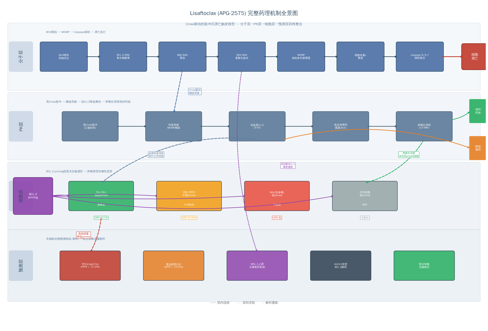

>  本篇所说 Lisaftoclax 分子设计，并非是基于分子构象去推导药物特性，而是基于临床效果，推导分子特性。

## Lisaftoclax

作用机制：

lisaftoclax以Ki<0.1 nM的亲和力结合BCL-2的BH3 groove，竞争性置换被隔离的BIM蛋白；BIM从细胞质转位至线粒体外膜，激活BAX/BAK寡聚化；BAX/BAK寡聚体在线粒体外膜形成孔洞结构，导致MOMP和细胞色素c释放；细胞色素c与Apaf-1形成凋亡小体，激活caspase-9和效应caspase-3/7，最终执行细胞凋亡

1、lisaftoclax + BCL-2:BIM  →  lisaftoclax:BCL-2 + 游离 BIM 
2、游离 BIM → 激活 BAX/BAK → 线粒体外膜通透化（MOMP） → 细胞色素 c / caspase → 凋亡


### 分子结构

### 1.2.1 分子结构：N-(苯基磺酰基)苯甲酰胺类化合物

APG-2575（lisaftoclax）属于N-(苯基磺酰基)苯甲酰胺类化合物，分子设计包含三个关键特征：二氟环己烷（difluorocyclohexane）尾部、三氟甲基苯基磺酰胺连接臂和7-氮杂吲哚（7-azaindole）头部基团。APG-2575最初由密歇根大学在2018年专利WO2018/027097中首次公开，亚盛医药获得全球权益并推进临床开发。与venetoclax的哌嗪（piperazine）连接臂和氯苯基P2结合基团相比，APG-2575的二氟环己烷尾部改变了PK特征和P2口袋结合模式——亲和力从venetoclax的Ki < 0.01 nM降至IC50 = 2 nM，但可能改变了耐药突变谱。Sonrotoclax则采用7-氮杂螺[3.5]壬烷刚性螺环连接臂，使(S)-2-(2-异丙基苯基)吡咯烷以"浅而广"模式结合P2口袋，实现KD = 0.046 nM（比venetoclax高24倍）并避免G101V突变的位阻。


Cmax驱动的脉冲式凋亡触发模型**作为Lisaftoclax的核心药理机制框架

| 机制要素        | 临床前          | Phase 1           | Phase 1b/2       | Phase 2    | Phase 3  | 验证等级     |
| --------------- | --------------- | ----------------- | ---------------- | ---------- | -------- | ------------ |
| BCL-2 高亲和力  | ✅ Ki<0.1nM      | ✅ ALC↓ at 20mg    | ✅ ORR>85% CLL    | ✅ ORR 73%  | 预测中   | **确定性**   |
| BCL-xL 高选择性 | ✅ SKLU-1 不敏感 | ✅ 血小板减少 2.9% | ✅ 血小板毒性可控 | ✅ 可控     | 预测中   | **确定性**   |
| 短半衰期→低TLS  | ✅ 快速清除      | ✅ TLS 0%          | ✅ TLS 2.8%       | ✅ TLS 2.1% | 预测<3%  | **确定性**   |
| BIM正反馈       | ✅ 表达上调      | ✅ BH3谱变化       | —                | —          | —        | **强支持**   |
| 线粒体呼吸抑制  | ✅ ATP↓          | —                 | —                | —          | —        | **支持**     |
| VEN耐药克服     | —               | —                 | ✅ CLL 85.7%      | —          | 待验证   | **初步验证** |
| 间歇给药优势    | —               | —                 | ✅ 14d>28d        | —          | 待验证   | **初步验证** |
| BTK+BCL-2协同   | ✅ 体内模型      | —                 | ✅ ORR 96.6%      | —          | 关键验证 | **强支持**   |
| 无DDI           | ✅               | ✅                 | ✅ 确认           | —          | ✅ 设计中 | **确定性**   |

## 1、PK/PD：短半衰期+快速爬坡

半衰期3-6小时，支持4-6天快速爬坡

APG-2575最显著的特征是短半衰期（t1/2 3-6小时）配合高Cmax/低AUC的PK曲线。I期临床中400mg给药的Cmax为0.822 μg/mL，AUC0-24为6.85 h·μg/mL，半衰期约4.4小时；venetoclax 400mg稳态Cmax为2.1 μg/mL，AUC0-24为32.8 h·μg/mL，半衰期约26小时。BCL-2抑制剂的PD机制是Cmax驱动的——需快速达到凋亡阈值触发BAX/BAK依赖性MOMP。APG-2575的高Cmax确保靶点占据，低AUC限制持续暴露毒性，短半衰期降低蓄积风险，使**4-6天快速爬坡**（20→50→100→200→400mg每日递增）成为可能，对比venetoclax的**5周标准爬坡**。I期研究中52例CLL患者零TLS事件，5名TLS高风险患者完成快速爬坡后ALC下降89-99%而无TLS证据。这一安全性优势归因于高Cmax快速清除肿瘤细胞但低暴露避免累积毒性。

该药物的半衰期约3-5小时，远短于Venetoclax的26小时，导致高Cmax但相对较低的全身暴露。这一独特的PK特征使得APG-2575可以采用每日梯度剂量递增方案，仅需4-6天即可达到目标剂量，而Venetoclax需要5周的每周递增方案。更短的剂量递增周期不仅减少了患者住院监测肿瘤溶解综合征（TLS）的时间和负担，还可能降低医疗系统的直接成本——在中国DRG/DIP支付改革背景下，门诊化给药的医保报销优势尤为突出。在已发表的研究中，APG-2575未发生临床TLS事件，而Venetoclax因TLS黑框警告需要住院监测，这在基层医院和社区医疗中心构成了资源瓶颈。


## 2、药物相互作用谱：低CYP3A4/P-gp依赖性


2575走CYP3A4 + CYP2C8 双代谢，且不走 P-gp/BCRP，泊沙康唑强效 CYP3A4 抑制剂，还抑制 P-gp（P-糖蛋白）。

Venetoclax是CYP3A4和P-gp双重底物，**强效CYP3A4抑制剂使其AUC增加5.8-7.9倍**——利托那韦使AUC增加7.9倍，爬坡期与强效CYP3A4抑制剂联用属禁忌。这对血液肿瘤患者尤为棘手，因为唑类抗真菌药是预防和治疗侵袭性真菌感染的标准用药。APG-2575的短半衰期和低系统暴露赋予其DDI优势：与acalabrutinib或利妥昔单抗联合未观察到DDI；虽经由CYP3A代谢，3-5小时半衰期显著降低了相互作用严重程度和持续时间。此外，APG-2575的食物效应远低于venetoclax（后者高脂餐使Cmax增加3-5倍），简化了用药指导。Sonrotoclax通过trans-(1r,4r)-4-(氨甲基)-1-甲基环己烷-1-醇尾部设计显著降低CYP抑制活性。三种药物均实现了对venetoclax代谢安全性的超越，这是社区医疗广泛采用的先决条件。

1.2.4 各代BCL-2抑制剂结构-活性关系对比

| 参数                  | Venetoclax (ABT-199)         | APG-2575 (Lisaftoclax) | Sonrotoclax (BGB-11417) |
| :-------------------- | :--------------------------- | :--------------------- | :---------------------- |
| **BCL-2 WT亲和力**    | Ki < 0.01 nM                 | IC50 = 2 nM            | KD = 0.046 nM           |
| **BCL-2 G101V亲和力** | ~200 nM (180倍降低)          | 未公开单药数据         | KD = 0.24 nM            |
| **BCL-xL选择性**      | ~100倍                       | ~3倍                   | ~2000倍                 |
| **血浆半衰期**        | ~26 h                        | 3-6 h                  | 短                      |
| **剂量爬坡时间**      | 5周                          | 4-6天                  | 4天（住院）             |
| **CYP3A4 DDI幅度**    | AUC增加5.8-7.9倍             | 低（短t1/2）           | 优化设计                |
| **TLS风险（CLL）**    | 1.2-3.1%（RCT）; 5-10%（RW） | 0-2.8%                 | 0%                      |
| **G≥3中性粒细胞减少** | 45-58%                       | 21-26%                 | 21-36%                  |
| **G≥3血小板减少**     | 15-24%                       | 13.5-17%               | 0-11%                   |
| **抗G101V能力**       | 无                           | 联合MDM2i可克服        | 单药强效克服            |
| **免疫调节效应**      | 未报道                       | M2→M1极化              | 未报道                  |


## 3、肿瘤/血液暴露差异

Lisaftoclax 的血浆半衰期约 3–5 小时，显著短于 venetoclax 的约 26 小时。由此形成“高 Cmax、短全身暴露”的 PK 特征：

- 快速达到有效细胞内浓度，触发肿瘤细胞凋亡；
- 减少持续性骨髓和血小板暴露，降低累积毒性；
- 预临床肿瘤组织滞留（约 13–48 小时）若能在人体验证，可解释短血浆暴露下的持续药效。

该肿瘤滞留数据目前主要来自临床前模型，不能等同于人体组织 PK 结论。


## 4、3x选择性

BCL-xL 在巨核细胞和血小板生存中重要。Lisaftoclax 约 3 倍的 BCL-2/BCL-xL 选择性提示存在血小板减少风险；但其短半衰期可能降低持续 BCL-xL 抑制，从而部分抵消这一风险。现有早期综合数据中，≥3 级血小板减少约 13.5%，仍需长期暴露数据确认。


## 5、Cmax 驱动的凋亡模型

（1）**分子层**——BH3模拟物竞争性破坏BCL-2:BIM复合物，释放BIM激活BAX/BAK依赖性MOMP；

（2）**PK层**——高Cmax快速突破线粒体凋亡阈值，短血浆半衰期（3-5小时）降低系统毒性，肿瘤组织长滞留（13-48小时）维持药效；

（3）**细胞层**——BCL-2 priming程度决定肿瘤敏感性梯度（CLL > MDS > 实体瘤）；

（4）**预测层**——TP53缺失/复杂核型为负向预测因子，MCL-1上调为主要耐药机制。

从Phase 1到Phase 2的逐步临床验证完全支持该机制模型。

Phase 1数据验证了四大机制预测：肿瘤溶解综合征（TLS）发生率0%（预测：低TLS）、3-4级中性粒细胞减少26.1%且快速恢复（预测：低血液学毒性）、4-6天安全完成剂量递增（预测：短ramp-up）、给药首日即观察到外周血淋巴细胞计数（ALC）下降（预测：快速疗效）。

Phase 2注册性研究（APG2575CC201，n=77）进一步确认：ORR 62.5%，中位无进展生存期（mPFS）23.89个月，30个月总生存率78%。高危亚组分析确定了模型的边界条件——TP53缺失伴复杂核型患者的mPFS缩短至11.2个月（风险比[HR] 5.0），揭示p53作为BAX转录激活因子的关键调控角色。


Lisaftoclax的全部药理学特征可被一个统一的核心假设解释：BCL-2抑制剂的抗肿瘤效应由峰浓度（Cmax）驱动，而非曲线下面积（AUC）。这一假设的分子基础在于线粒体外膜通透化（mitochondrial outer membrane permeabilization, MOMP）本质上是一个阈值开关事件（threshold switch event）——BH3模拟物需要在线粒体膜上达到足够的局部浓度，以竞争性置换足够量的BIM等BH3-only蛋白，从而激活足够数量的BAX/BAK分子形成有效的MOMP孔洞。一旦该阈值被突破，凋亡信号即不可逆转地启动，后续的药物暴露对已触发凋亡的细胞不产生额外获益。

这一"Cmax驱动"假说（Cmax-driven hypothesis）得到了临床前和临床数据的双重支持。机制研究表明，BH3模拟物需要快速达到线粒体阈值以触发凋亡，其效应由细胞穿透速率和最大浓度共同决定。临床I期试验中，即使在最低剂量组（20 mg），Lisaftoclax即观察到外周血淋巴细胞计数（ALC）的快速下降，且ALC反应在首次给药后6小时即可检测到，与Cmax出现时间高度一致。BH3 profiling分析进一步显示，BAD肽诱导的细胞色素c释放与ALC正常化时间呈负相关，提示BCL-2复合物解离的Cmax依赖性。

**图1**展示了Lisaftoclax从竞争性结合BCL-2到最终激活caspase级联反应的完整分子通路。该过程遵循线粒体内源性凋亡通路的标准程序：Lisaftoclax以Ki<0.1 nM的亲和力结合BCL-2的BH3 groove，竞争性置换被隔离的BIM蛋白；BIM从细胞质转位至线粒体外膜，激活BAX/BAK寡聚化；BAX/BAK寡聚体在线粒体外膜形成孔洞结构，导致MOMP和细胞色素c释放；细胞色素c与Apaf-1形成凋亡小体，激活caspase-9和效应caspase-3/7，最终执行细胞凋亡。

#### 1.3.2 高Cmax快速突破线粒体凋亡阈值

Lisaftoclax被设计为具有高Cmax特征——在400 mg剂量下，单次给药后Cmax可达0.822 μg/mL，Tmax为4-6小时。高Cmax确保药物在到达肿瘤组织后，能够在短时间内达到足够的游离浓度以克服BCL-2的结合容量，快速突破MOMP阈值。临床前数据显示，Lisaftoclax进入恶性细胞迅速，2小时即达到细胞内平台浓度，与快速的凋亡诱导动力学一致。

在RS4;11异种移植模型中，单次口服Lisaftoclax后4小时即检测到cleaved caspase-3的快速诱导，24小时达峰，伴随PARP-1切割。这一快速动力学响应证实了高Cmax能够在体内有效转化为线粒体局部的药物峰值，触发不可逆的凋亡级联反应。与之相比，Venetoclax虽然稳态Cmax更高（约2.1 μg/mL），但其达到峰值的时间更长（5-8小时），且由于长半衰期（26小时）导致的持续高暴露，增加了对正常组织的毒性。

#### 1.3.3 短半衰期降低全身累积暴露

Lisaftoclax的血浆消除半衰期为3-5小时，远短于Venetoclax的约26小时。短半衰期的核心药理学意义在于限制了全身累积暴露（systemic cumulative exposure），从而减少持续大规模细胞杀伤带来的系统毒性。具体而言，短半衰期设计带来三重安全性优势。

第一，降低肿瘤溶解综合征（tumor lysis syndrome, TLS）风险。TLS的发生依赖于大量肿瘤细胞在短时间内的同步死亡，释放的钾、磷、尿酸等代谢物超过肾脏清除能力。长半衰期药物（如Venetoclax）的持续高暴露导致持续的肿瘤细胞溶解，累积的代谢负荷增加TLS风险——Venetoclax在期开发中因TLS死亡事件被迫将递增方案从快速递增修正为5周递增。Lisaftoclax的脉冲式暴露模式（单次Cmax触发大量杀伤后快速清除）允许机体在药物清除期间恢复电解质和代谢平衡，从而将TLS发生率控制在<2%的水平。

第二，缩短中性粒细胞减少持续时间。中性粒细胞前体（promyelocyte、myelocyte）表达BCL-2，依赖其维持存活。Venetoclax的长半衰期导致持续的BCL-2抑制，中性粒细胞前体持续凋亡，中性粒细胞减少发生率达40-50%，且持续时间长，约75%的≥3级中性粒细胞减少患者需要G-CSF支持或剂量调整。Lisaftoclax的短半衰期使得每日给药后Cmax迅速下降，给予骨髓造血细胞"恢复窗口"，中性粒细胞减少发生率为26.1%且恢复迅速，无需G-CSF支持。

第三，最小化药物蓄积。Venetoclax的蓄积比（accumulation ratio）为0.8-1.6，多次给药后暴露量显著增加；而Lisaftoclax的t1/2远短于给药间隔（24小时），几乎无蓄积，降低了长期毒性和药物相互作用（DDI）风险。

#### 1.3.4 肿瘤内长半衰期维持药效：血浆清除与肿瘤作用的时空分离

Lisaftoclax的PK特征中最具药理学创新性的发现是血浆半衰期（3-5小时）与肿瘤组织半衰期（13-48小时）的巨大差异。临床前PK研究显示，在RS4;11荷瘤小鼠中，Lisaftoclax在给药后2小时即达到肿瘤细胞内平台浓度，且肿瘤内滞留时间远长于血浆。这一"血浆快速清除-肿瘤持续作用"的时空分离（spatiotemporal separation）是理解Lisaftoclax疗效与安全性平衡的关键。

肿瘤内长半衰期的具体机制尚不完全清楚，但可能涉及以下因素：肿瘤微环境的高蛋白结合率（药物与肿瘤细胞内蛋白形成可逆结合）、较低的清除率（肿瘤组织的血流灌注和药物代谢酶活性低于血浆），以及细胞内隔室化（intracellular compartmentalization）导致的药物滞留。无论机制如何，这一特征确保了尽管血浆药物浓度在给药后12小时内已降至较低水平，肿瘤组织内的药物浓度仍维持在有效范围内，持续抑制BCL-2并触发凋亡。

**图2**定量展示了Cmax驱动的脉冲式PK/PD模型。上图显示了Lisaftoclax的血浆浓度-时间曲线（t1/2=4小时）、肿瘤浓度-时间曲线（t1/2=24小时，模拟值）和Venetoclax的血浆浓度曲线（t1/2=26小时）的对比。MOMP阈值线（红色虚线）直观展示了Lisaftoclax如何在每次给药后快速突破阈值，随后迅速清除以降低毒性，而肿瘤内的 sustained 暴露维持药效。下图展示了脉冲式凋亡触发模型——每次Cmax脉冲触发一批"全或无"的凋亡事件，累积肿瘤杀伤呈阶梯式上升，每日给药的重复脉冲在恢复窗口期内实现了高效的肿瘤清除。

**表2**系统总结了Lisaftoclax Cmax驱动模型的关键PK/PD参数及其临床药理学意义。

**表2. Lisaftoclax Cmax驱动脉冲式凋亡模型的关键PK/PD参数**

| 参数             | 数值         | 药理学意义                     | 临床预测                 |
| :--------------- | :----------- | :----------------------------- | :----------------------- |
| BCL-2 Ki         | <0.1 nM      | 高亲和力确保阈值突破效率       | 低剂量即可触发凋亡       |
| 血浆t1/2         | 3-5 h        | 快速清除，减少全身累积暴露     | 低TLS风险，短ramp-up     |
| 400mg Cmax       | 0.822 μg/mL  | 高Cmax快速突破MOMP阈值         | 快速ALC下降              |
| 400mg AUC0-24    | 6.85 h·μg/mL | 低AUC减少骨髓持续毒性          | 快速中性粒细胞恢复       |
| 肿瘤t1/2         | 13-48 h      | 肿瘤内 sustained 暴露维持药效  | 疗效不牺牲               |
| 细胞穿透Tplateau | 2 h          | 快速细胞内积累匹配Cmax动力学   | Cmax有效转化为线粒体峰值 |
| Tmax             | 4-6 h        | 适中的达峰时间平衡疗效与安全性 | 给药方案灵活             |

表2数据的整合分析揭示了Lisaftoclax设计的核心逻辑：通过高靶点亲和力（Ki<0.1 nM）确保MOMP阈值突破的效率，通过高Cmax（0.822 μg/mL）实现快速的阈值突破，通过短血浆半衰期（3-5小时）降低系统毒性，同时通过肿瘤内长半衰期（13-48小时）维持抗肿瘤效果。2小时的细胞内平台期达成时间确保了Cmax能够有效转化为线粒体局部的药物峰值，构成了"脉冲式触发"模型的细胞基础。


**表3**总结了基于机制假设的四大临床预测及其对应的药理学基础。

**表3. 基于Cmax驱动模型的四大临床预测**

| 预测编号 | 临床特征    | 机制基础              | 推导逻辑                                 | 预期表现               |
| :------- | :---------- | :-------------------- | :--------------------------------------- | :--------------------- |
| 预测1    | 快速疗效    | Cmax突破MOMP阈值      | 高primed CLL细胞+高Cmax→快速BIM释放→MOMP | ALC给药后6h开始下降    |
| 预测2    | 低TLS风险   | 短暴露减少累积溶解    | 脉冲式杀伤+清除窗口→代谢负荷可控         | TLS发生率<5%           |
| 预测3    | 短ramp-up   | 无蓄积+每日独立暴露   | t1/2<<24h→每日新开始→可快速递增          | 4-6天达目标剂量        |
| 预测4    | 快速ANC恢复 | 低AUC减少骨髓持续毒性 | 恢复窗口内造血再生→无需G-CSF             | G3/4中性粒细胞减少<30% |

表3所列的四大预测构成了Lisaftoclax临床开发的机制驱动假设框架。这些预测并非孤立存在，而是统一源于Cmax驱动的脉冲式凋亡触发模型——高Cmax同时解释了快速疗效（预测1）和脉冲式杀伤模式（预测2），短半衰期同时解释了低TLS风险（预测2）、短ramp-up可行性（预测3）和快速中性粒细胞恢复（预测4）。这一机制的统一性是Lisaftoclax药理学设计的核心科学价值：四个看似独立的临床特征实际上共享同一个分子机制基础，即"高Cmax触发+快速清除"的PK/PD模式。后续章节的临床数据验证将检验这一机制框架的预测准确性。


基于上述Cmax驱动的脉冲式凋亡触发模型，可以从机制层面推导出Lisaftoclax在临床中的四大预期特征。这些预测构成了后续临床试验设计的基础，并将在第2章中通过与实际临床数据的对比进行验证。


进入细胞后2小时达到平台期，显著下调线粒体呼吸功能和ATP产生。


## 6、快速疗效


## 药理机制

1. 靶点与凋亡通路
2. 凋亡模型
3. 安全性与耐药边界

药物快速达到足以跨越线粒体凋亡阈值的峰浓度，释放 BIM 并激活 BAX/BAK，触发不可逆的 MOMP；随后短血浆暴露限制正常组织持续受药，肿瘤组织滞留则可能维持疗效。该模型可解释早期 ALC 下降、0% TLS、4–6 天 ramp-up 及相对可控的血液学毒性

假设：BCL-2 抑制的关键不是持续累积暴露，而是短时间内跨越凋亡阈值的峰浓度。MOMP 属于阈值型、不可逆事件；一旦足量 BIM 被释放并形成 BAX/BAK 孔道，后续维持高浓度的边际收益可能有限。


## 1.4.1 预测1：快速疗效（ALC首日下降）——Cmax驱动的阈值突破

基于Cmax驱动假说，Lisaftoclax应在首次给药后即触发ALC的快速下降。机制推导如下：CLL被认为是最BCL-2依赖的血液恶性肿瘤之一，其白血病细胞高度primed（线粒体接近凋亡阈值），主要依赖BCL-2维持存活。Lisaftoclax的高Cmax能够在给药后数小时内快速释放大量BIM，激活BAX/BAK并触发MOMP，导致外周血白血病细胞的快速清除。临床前数据中给药后4小时即检测到cleaved caspase-3，提示凋亡启动极为迅速。

预期ALC在给药后6-24小时内开始下降，且最低剂量组（20 mg）即可观察到抗肿瘤活性——因为BCL-2抑制剂的药效不依赖于总暴露量，而依赖于是否达到MOMP阈值。I期试验数据支持了这一预测：ALC在首次给药后6小时即开始下降，最低剂量组即观察到抗肿瘤效应。

#### 1.4.2 预测2：低TLS风险——短暴露时间减少持续大规模细胞杀伤

TLS的风险取决于两个变量：单次给药后的肿瘤细胞杀伤速度和药物持续暴露导致的累积代谢负荷。Lisaftoclax的短半衰期意味着，即使单次Cmax触发了大量肿瘤细胞凋亡，药物在24小时内已基本清除，不会导致持续的、不断扩大的细胞溶解。这为机体提供了代谢缓冲窗口——在下一剂给药前，肾脏有足够时间清除第一波凋亡释放的代谢物。

与之形成对照的是，Venetoclax的长半衰期（26小时）意味着首剂给药后药物持续存在数天，持续的BCL-2抑制导致连续的细胞溶解，累积的代谢负荷显著增加了TLS风险。这一机制推导解释了为何Venetoclax在早期开发中因快速递增导致TLS死亡事件后被迫改为5周递增方案，而Lisaftoclax能够在4-6天快速递增方案下将TLS发生率控制在<2%。

#### 1.4.3 预测3：短ramp-up时间——4-6天每日递增可行性

剂量递增方案的可行性直接取决于药物的PK特征和毒性动力学。Venetoclax的5周递增方案（20 mg→50 mg→100 mg→200 mg→400 mg，每周递增一次）本质上是为适应其长半衰期而设计的——每剂给药后药物在数天内持续累积，缓慢递增允许机体逐步适应逐渐升高的暴露量。

Lisaftoclax的短半衰期使得每一剂都是一个"新开始"——前一天的药物在给药间隔内已基本清除，不会因为蓄积导致不可预测的暴露量增加。这意味着每日递增方案在药理学上是安全的：每个新剂量产生的暴露量相对独立，临床医生可以根据前一天的ALC下降速率和TLS实验室指标实时调整递增节奏。预期Lisaftoclax可实现4-6天每日递增（20 mg→50 mg→100 mg→200 mg→400 mg→目标剂量），显著缩短至治疗剂量的时间。

#### 1.4.4 预测4：快速中性粒细胞恢复——低AUC减少骨髓祖细胞持续毒性

中性粒细胞减少是BCL-2抑制剂的类效应，其机制在于粒细胞前体（myeloblast至metamyelocyte阶段）表达BCL-2，依赖其维持存活。Venetoclax的长半衰期导致这些前体细胞持续暴露于BCL-2抑制环境中，持续的凋亡触发使中性粒细胞计数难以恢复——约75%的≥3级中性粒细胞减少患者需要G-CSF支持或剂量调整。

Lisaftoclax的低AUC特征意味着骨髓祖细胞的暴露时间有限——每日给药后Cmax迅速下降，在两次给药之间存在药物浓度低于有效抑制水平的"恢复窗口"。在这一窗口期内，骨髓中的造血干细胞可以分化为中性粒细胞前体并正常成熟，不受BCL-2抑制的持续干扰。预期Lisaftoclax的中性粒细胞减少发生率和持续时间均低于Venetoclax，且恢复过程无需G-CSF支持。


### Lisaftoclax对单个细胞和对整体

> 我个人感觉，既然Lisaftoclax实现了和Venetoclax差不多的疗效，那基本可以说明它是Cmax驱动的了

对单个依赖BCL-2的细胞是超过凋亡阈值后可触发不可逆死亡，对整体则需要每天重复暴露，属于“阈值触发 + 反复覆盖”的模式。

| 要验证的问题             | 最关键实验                                                   |
| ------------------------ | ------------------------------------------------------------ |
| 是否“短脉冲过阈值即可杀” | CLL 原代细胞或 BCL-2 依赖细胞：2/4/8 小时药物 pulse 后 washout，追踪 24–72 小时凋亡 |
| Cmax 还是 AUC            | 设计相同 AUC、不同峰值和给药时长的方案；再设计相同 Cmax、不同 AUC 的方案 |
| 是否需持续靶点抑制       | washout 后连续测 BCL-2 target engagement、BAX/BAK 激活、MOMP、cleaved caspase-3/7 和 Annexin V/PI |
| 能否外推到患者           | 将个体 `Cmax`、`AUC`、`Ctrough`、`T>有效浓度` 分别与外周 CLL 细胞下降速度、MRD、骨髓反应、ORR/PFS 做模型比较 |

如果短 pulse 后仍有相近的 MOMP、caspase 激活和细胞死亡，且在相同 AUC 下“高峰短暴露”优于低峰长暴露，就可称它偏**阈值/Cmax 驱动**。反过来，若 washout 后细胞恢复、而持续低浓度暴露更有效，则它是**持续暴露或 AUC/T>阈值驱动**。


**预测→数据→结论**：基于Cmax驱动模型预测短半衰期药物可支持快速剂量递增 → Phase 1研究中8个剂量队列、44例递增期患者均未观察到剂量限制性毒性（dose-limiting toxicity, DLT），最大耐受剂量（maximum tolerated dose, MTD）在1200 mg仍未达到 → 预测得到验证，Cmax驱动模型的推论成立。

#### 2.2.1 各剂量水平PK参数与剂量线性关系

Phase 1研究的药代动力学（pharmacokinetics, PK）分析在全部8个剂量水平中进行了系统采样。表2.1汇总了单次口服给药后的关键PK参数。

Lisaftoclax与Venetoclax的PK差异构成了两种不同药理学范式的代表。Lisaftoclax的t1/2为3-5小时，400 mg Cmax为0.822 μg/mL，AUC0-24为6.85 h·μg/mL；Venetoclax的t1/2为26小时，400 mg稳态Cmax约为2.1 μg/mL，AUC0-24约为32.8 h·μg/mL。Lisaftoclax的AUC仅为Venetoclax的约21%，但两者的临床疗效处于同一数量级（CLL ORR 62.5% vs 79%），这直接支持了Cmax驱动假说——疗效由峰值浓度能否突破MOMP阈值决定，而非累积暴露量。

**表2.1 Lisaftoclax Phase 1研究各剂量水平PK参数汇总**

| 剂量 (mg) | 受试者数 |  t₁/₂ (h)   | Tmax (h) | Cmax (μg/mL)  | AUC₀₋₂₄ (h·μg/mL) |
| :-------: | :------: | :---------: | :------: | :-----------: | :---------------: |
|    50     |    1     |    2.84     |    3     |     0.039     |       0.261       |
|    100    |    1     |    3.85     |    6     |     0.229     |       1.80        |
|    200    |    2     | 3.84 ± 0.16 | 4 (4–4)  | 0.294 ± 0.004 |    2.41 ± 0.37    |
|    400    |    8     | 4.43 ± 0.57 | 6 (4–8)  | 0.822 ± 0.334 |    6.85 ± 2.91    |
|    600    |    7     | 4.68 ± 1.03 | 6 (4–8)  | 0.761 ± 0.298 |    7.81 ± 2.84    |
|    800    |    7     | 4.34 ± 0.53 | 4 (4–6)  | 0.982 ± 0.384 |    7.25 ± 2.24    |
|   1000    |    6     | 6.10 ± 1.52 | 8 (6–8)  |  1.69 ± 1.22  |    18.3 ± 13.1    |
|   1200    |    6     |      6      | 6 (3–8)  |  1.20 ± 0.48  |    12.3 ± 4.82    |

*数据来源：Ailawadhi S, et al. Clin Cancer Res. 2023。Tmax列中括号内为范围；200 mg组数据以均值±标准差表示。*

表2.1的数据揭示了三个关键特征。第一，半衰期（t₁/₂）在所有剂量水平保持稳定，均值4–5小时（范围2.84–6.10小时），证实短半衰期是Lisaftoclax的固有PK属性而非剂量依赖性现象。第二，Cmax和AUC₀₋₂₄总体呈剂量比例性增加，从50 mg的0.039 μg/mL和0.261 h·μg/mL递增至1200 mg的1.20 μg/mL和12.3 h·μg/mL，表明药物在测试剂量范围内具有可预测的线性药代动力学特征。第三，高剂量组（1000 mg和1200 mg）的PK参数变异度较大（Cmax的相对标准差分别为72%和40%），提示个体间吸收或首过代谢差异在超治疗剂量时可能更为显著。

与Venetoclax的PK参数进行跨研究比较（图2.1），Lisaftoclax在400 mg剂量下的Cmax为0.822 μg/mL，约为Venetoclax稳态Cmax（约2.1 μg/mL）的39%；而其AUC₀₋₂₄（6.85 h·μg/mL）仅为Venetoclax（约32.8 h·μg/mL）的21%。这一"高Cmax/低AUC"的相对特征——即Cmax的降幅（61%）远小于AUC的降幅（79%）——是Cmax驱动设计的直接药理学体现。


#### 2.2.2 验证：高Cmax/低AUC特征在所有剂量水平一致出现

Cmax驱动模型的核心预测之一是：Lisaftoclax的PK profile应呈现相对较高的Cmax与相对较低的AUC比值（Cmax/AUC），即药物在达峰后快速清除，有限延长暴露时间。这一预测在所有剂量水平均得到一致验证。以400 mg剂量为例，Lisaftoclax的Cmax/AUC比值为0.120 μg/mL per h·μg/mL，按照t₁/₂≈4.5小时推算，其暴露-时间曲线呈现陡峭上升、快速下降的特征形态。相比之下，Venetoclax的t₁/₂为26小时，其Cmax/AUC比值约为0.064，曲线形态更为扁平，意味着药物在血浆中维持较长时间的持续暴露。

临床前数据为这一PK特征提供了更深层的机制解释：Lisaftoclax在给药后2小时内即达到肿瘤细胞内平台浓度，而肿瘤组织内的半衰期（13–48小时）显著长于血浆半衰期（约6小时）。这种"血浆快速清除-肿瘤持续作用"的时空分离（spatial-temporal dissociation）意味着，短血浆半衰期并不牺牲肿瘤组织内的药效学效应，同时通过减少血浆中持续高暴露降低了系统毒性。

**预测→数据→结论**：Cmax驱动模型预测Lisaftoclax应呈现高Cmax/低AUC的PK profile → Phase 1全部8个剂量队列的系统PK分析确认Cmax和AUC呈剂量比例性增加，t₁/₂稳定在3–5小时，400 mg剂量下AUC仅为Venetoclax的21%而Cmax维持其39% → Cmax驱动假设的PK基础在临床中得到确认。

#### 2.2.3 20 mg最低剂量即观察到ALC下降——支持Cmax阈值假说而非AUC累积假说

绝对淋巴细胞计数（absolute lymphocytic count, ALC）的动态变化是BCL-2抑制剂药效学（pharmacodynamics, PD）的核心生物标志物。在Lisaftoclax Phase 1研究中，一个具有决定性意义的观察是：ALC降低在最低评估剂量20 mg和给药首日即被检测到。这一观察直接区分了两种 competing 的药效学假说——Cmax阈值假说（效应依赖于单次给药的峰浓度是否超过触发线粒体外膜通透化阈值）与AUC累积假说（效应依赖于持续暴露的累积量）。

若AUC累积假说成立，20 mg剂量产生的AUC₀₋₂₄仅为0.261 h·μg/mL，理论上不足以产生可检测的生物学效应。然而，临床观察到的首日ALC下降表明，即使这一极低剂量下的Cmax（0.039 μg/mL）也足以部分触发BCL-2依赖的凋亡通路。这与BCL-2抑制剂的作用机制一致：MOMP（mitochondrial outer membrane permeabilization）是一个阈值开关事件（all-or-none event），一旦游离药物浓度超过释放BIM/BAX复合物所需的阈值，即触发不可逆转的caspase级联反应。

BH3 profiling数据进一步支持了Cmax依赖的PD模式。使用BAD肽（选择性检测BCL-2依赖性）诱导的cytochrome c释放与ALC正常化时间呈负相关，即BCL-2复合物解离越充分，ALC恢复越快。BIM肽（检测整体线粒体priming状态）诱导的cytochrome c释放在C1D1给药后6小时出现短暂峰值，随后逐渐下降，至C1D28显著降低。这一动态模式与Cmax的出现时间（Tmax 4–6小时）高度吻合，进一步证实药效峰值与药代动力学峰值同步。

**预测→数据→结论**：Cmax阈值假说预测最低有效剂量可在极低AUC下产生PD效应 → 20 mg剂量首日即观察到ALC下降，BH3 profiling显示C1D1给药后6小时cytochrome c释放达峰 → 药效由Cmax驱动而非AUC累积，Cmax阈值假说成立。


第1章基于Cmax驱动模型推导出四项安全性预测：（1）低TLS风险；（2）低中性粒细胞减少发生率伴快速恢复；（3）短ramp-up时间可行；（4）血小板减少发生率介于Venetoclax与Navitoclax之间。Phase 1/1b数据为这四项预测提供了逐一验证。

**表2.2 Cmax驱动模型四大安全性预测的临床验证**

| 预测编号 | 机制预测                                                   | Phase 1/1b临床数据                                           | 验证状态 |
| :------: | :--------------------------------------------------------- | :----------------------------------------------------------- | :------: |
|    P1    | 短半衰期→脉冲式杀伤→低TLS风险                              | TLS发生率0%（N=52）；扩大样本3%（5/176），均为轻中度         |  ✅ 验证  |
|    P2    | 低AUC→有限骨髓暴露→低中性粒细胞减少                        | G3/4中性粒细胞减少26.1%（6/23），快速恢复，无需G-CSF         |  ✅ 验证  |
|    P3    | 每日递增=新开始→无蓄积→短ramp-up可行                       | 4–6天安全达到目标剂量，零DLT，MTD未达                        |  ✅ 验证  |
|    P4    | BCL-xL 3倍选择性→残余血小板抑制→血小板减少介于VEN与NAV之间 | 血小板减少28.8%（任何级别），G3/4为13.5%；Venetoclax G3/4为36% |  ✅ 验证  |

*数据来源综合：Ailawadhi S, et al. Clin Cancer Res. 2023；Cancer Network ASCO 2021；CLL Society 2025。G-CSF：粒细胞集落刺激因子；VEN：Venetoclax；NAV：Navitoclax。*

**预测→数据→结论**：Cmax驱动模型预测脉冲式暴露→低TLS风险 → 52例患者中0% TLS，扩大至176例仍仅3%且均为轻中度 → 预测验证，机制解释成立。


#### 2.3.2 中性粒细胞减少预测验证：G3/4仅26.1%，快速恢复无需G-CSF

中性粒细胞减少是BCL-2抑制剂类效应毒性，其机制在于中性粒细胞前体（promyelocyte、myelocyte）表达BCL-2，依赖其维持存活；BCL-2抑制触发前体凋亡，导致成熟中性粒细胞产出减少。Cmax驱动模型预测Lisaftoclax的低AUC特征可减少对骨髓造血细胞的持续暴露，从而降低中性粒细胞减少的发生率和持续时间。

Phase 1数据显示，CLL/SLL患者中G3/4中性粒细胞减少发生率仅26.1%（6/23可评估患者），显著低于Venetoclax的40–50%。关键差异在于恢复模式：Lisaftoclax组中性粒细胞计数在无粒细胞集落刺激因子（granulocyte colony-stimulating factor, G-CSF）支持下快速恢复并稳定维持，且中性粒细胞减少相关后遗症（发热和感染）未被观察到。作为对比，36–41%的Venetoclax接受者（约占G3/4中性粒细胞减少患者的75%）需要G-CSF支持或剂量调整，且72%的患者经历感染事件。

3例中性粒细胞减少的详细管理案例进一步说明了这一差异的临床意义。1例400 mg组患者在C1出现G3中性粒细胞减少，暂停用药8天后自行恢复至1.15×10⁹/L，无需G-CSF或其他干预即可继续治疗；另1例1200 mg组患者经历G3中性粒细胞减少但无需停药或生长因子支持，中性粒细胞计数稳定维持并持续治疗至C10。

**预测→数据→结论**：低AUC预测→有限骨髓暴露→低中性粒细胞减少+快速恢复 → G3/4发生率26.1%（vs Venetoclax 40–50%），零G-CSF需求，零感染后遗症 → 预测验证。

#### 2.3.3 Ramp-up预测验证：4–6天安全完成——无DLT，MTD未达到

快速剂量递增的可行性是Cmax驱动模型最具临床转化价值的推论之一。基于短半衰期=无蓄积的药理学原理，模型预测Lisaftoclax可在4–6天内安全完成剂量递增，因为每日给药时前日药物已基本清除，不会因蓄积导致不可预测的暴露叠加。

Phase 1研究的实际递增方案为D1 20 mg → D2 50 mg → D3 100 mg → D4 200 mg → D5 400 mg → 目标剂量，患者在5天内达到400 mg或更高剂量。递增期间的TLS监测方案为基线、给药后6–8小时和24小时采血。在全部44例经历剂量递增的患者中，零例DLT，MTD在最高测试剂量1200 mg仍未达到。这一结果与Venetoclax的历史经验形成强烈反差：Venetoclax在20 mg起始剂量下即发生TLS死亡，被迫将初始剂量从50 mg降至20 mg并引入5周递增。

**预测→数据→结论**：Cmax驱动模型预测短半衰期→无蓄积→每日递增安全 → 8个剂量队列、44例递增期患者零DLT，MTD在1200 mg未达 → 预测验证，4–6天ramp-up方案确立。

#### 2.3.4 血小板减少验证：23%发生率——BCL-xL 3倍选择性的临床后果

血小板减少是BCL-2抑制剂选择性谱的"试金石"。BCL-xL在巨核细胞（megakaryocyte）中表达丰富，是血小板生成的关键存活因子。Navitoclax因强效BCL-xL抑制导致严重血小板减少而终止开发；Venetoclax通过>100倍的BCL-2/BCL-xL选择性将G3/4血小板减少控制在36%。Lisaftoclax的BCL-2/BCL-xL选择性仅为约3倍（IC₅₀：2 nM vs 5.9 nM），模型预测其血小板减少发生率应介于Navitoclax与Venetoclax之间。

Phase 1数据证实了这一预测：任何级别血小板减少发生率为28.8%（15/52），G3/4为13.5%（7/52）。在更大规模的Phase 1b/2汇总中，血小板减少发生率为23%（G3/4为5%）。这些数据显著优于Navitoclax（>50% G3/4血小板减少导致停药），但低于Venetoclax的36%（任何级别）。这一"中间态"的血小板减少发生率精确反映了3倍BCL-xL选择性的临床后果：残余的BCL-xL抑制活性足以对巨核细胞产生可检测但可控的影响，而未达到导致治疗中断的严重程度。

**预测→数据→结论**：3倍BCL-xL选择性预测→残余血小板抑制→血小板减少发生率介于VEN与NAV之间 → 任何级别28.8%（vs Venetoclax 36%），G3/4 13.5%，未导致治疗中断 → 预测验证，选择性梯度与毒性呈反比关系确立。


### 2.4 初步疗效验证：机制导向的疗效信号

Phase 1研究的设计首要目标为安全性与PK/PD表征，但22例可评估CLL/SLL患者中观察到的疗效信号为Cmax驱动模型的抗肿瘤活性推论提供了关键支持。

#### 2.4.1 CLL/SLL ORR 63.6%——BCL-2高依赖肿瘤的快速响应

在22例可评估R/R CLL/SLL患者中，14例达到部分缓解（partial response, PR），客观缓解率（objective response rate, ORR）为63.6%，无完全缓解（complete response, CR）报告。42.9%（9/21）的患者经历≥70%的淋巴结和脾脏缩小。这一ORR水平在Phase 1单药研究中具有竞争力：作为参照，Venetoclax Phase 1单药ORR为79%（但入组人群风险特征不同），而Lisaftoclax的入组患者包含更高比例的BTKi失败和高危遗传学亚组。

从机制角度，CLL/SLL是BCL-2高依赖性肿瘤——BH3 profiling数据显示BCL-2是CLL细胞中的主要抗凋亡蛋白，BAD肽（0.05 μM）即可诱导25–50%的线粒体cytochrome c释放，而其他BH3肽在5 μM浓度下的诱导效率远低于BAD肽。这一高BCL-2依赖性解释了为何即使短暴露（低AUC）的Lisaftoclax也能产生显著的抗肿瘤活性：肿瘤细胞的高priming状态降低了触发MOMP所需的暴露阈值。

**预测→数据→结论**：Cmax驱动模型预测高Cmax可在BCL-2高依赖肿瘤中触发有效凋亡 → CLL/SLL ORR 63.6%，淋巴结/脾脏快速缩小 → Cmax驱动的抗肿瘤活性得到初步验证。

#### 2.4.2 起效时间中位2个周期——支持Cmax驱动的快速凋亡触发

中位至缓解时间（time to response, TTR）为2个周期（范围2–8），这一快速起效特征与Cmax驱动的凋亡触发机制一致。BCL-2抑制剂通过直接释放BIM/BAX/BAK触发caspase级联反应，诱导细胞在数小时内进入凋亡程序，无需基因转录或蛋白质合成的时间延迟。因此，临床疗效的显现速度主要取决于肿瘤负荷和药物达到MOMP阈值的能力，而非累积暴露时间。中位2个周期的TTR与Venetoclax的2–3个周期相当，证实Cmax驱动的"脉冲式"药效在起效速度上不劣于持续高暴露模式。

ALC动态变化为快速起效提供了更精细的时间分辨率。56%的患者在4–6天ramp-up结束时ALC已恢复正常水平，C1结束时该比例升至58%，C2结束时达65%。ALC在首次给药后24小时内的快速下降是肿瘤细胞对Cmax的即时响应，这一早期药效学信号预测了后续的结构化缓解。

#### 2.4.3 BTKi不耐受患者ORR 80%——BCL-2通路与BTK通路独立，机制互补性验证

5例BTKi不耐受（非疾病进展）患者的ORR为80.0%（4/5 PR）。这一数据具有重要的机制验证意义：BTKi不耐受通常由脱靶毒性（如房颤、出血）而非BTK通路本身的功能缺失所致，停止BTKi后BCR信号通路恢复活性，但肿瘤细胞仍依赖BCL-2维持存活。BTKi与BCL-2抑制剂作用于独立但互补的信号通路——BTKi阻断BCR→NF-κB→MCL-1转录轴，BCL-2抑制剂直接释放线粒体凋亡通路。BTKi不耐受患者的高ORR证实，BCL-2抑制无需以BTK通路抑制为前提，两条通路的独立性为序贯治疗和联合治疗提供了药理学基础。

#### 2.4.4 del(17p)/TP53突变患者ORR 66.7%——初步提示TP53不完全阻断BCL-2抑制剂活性

3例携带del(17p)/TP53突变的患者中2例达到PR，ORR为66.7%。del(17p)是CLL中最具侵袭性的遗传学异常，TP53缺失导致细胞周期阻滞和凋亡执行受损，传统化疗在此类患者中的缓解率极低。BCL-2抑制剂的理论优势在于其绕过TP53直接作用于线粒体凋亡通路的下游节点。66.7%的ORR初步证实了这一机制假设：即使TP53功能缺失，BCL-2抑制释放的BIM/PUMA仍可在一定程度上激活BAX/BAK，完成不完全但可测量的凋亡级联。

然而，需要指出的是，Phase 1中del(17p)/TP53亚组的样本量极小（N=3），且66.7%的ORR虽高于传统化疗，但低于非TP53突变患者。后续Phase 2数据将揭示这一亚组的缓解持续时间是否同样受到影响——若PFS显著短于非突变组，则提示TP53缺失虽不完全阻断BCL-2抑制剂的活性，但可能限制其疗效深度和持久性。

### 2.5 Phase 1b联合用药：机制协同的初步证据

Phase 1b研究在Phase 1基础上扩展了联合用药队列，评估Lisaftoclax联合acalabrutinib（BTK抑制剂）或rituximab（抗CD20单抗）的安全性与疗效。联合方案的设计遵循第1章提出的机制协同原理：联合药物需通过下调MCL-1或增强BCL-2 priming来增强BCL-2抑制剂的活性。

**表2.3 Phase 1b联合用药疗效数据汇总**

| 联合方案       | 患者人群    | 可评估数 |   ORR    | CR/CRi | 特殊亚组疗效                   | 来源 |
| :------------- | :---------- | :------: | :------: | :----: | :----------------------------- | :--: |
| +acalabrutinib | R/R CLL/SLL |  53–57   | 96–98.6% | 24.4%  | Venetoclax经治：85.7%（12/14） |      |
| +acalabrutinib | 初治CLL/SLL |    16    |   100%   |   —    | —                              |      |
| +rituximab     | R/R CLL/SLL |  23–34   |  79–87%  |   —    | C1D8加入时未观察到TLS          |      |

*CR/CRi：完全缓解/完全缓解伴不完全血液学恢复；R/R：复发/难治。数据来源：ASH 2022/2024会议报告。*

#### 2.5.1 +acalabrutinib ORR 96–98%——BTKi下调MCL-1增强BCL-2依赖的机制验证

Lisaftoclax联合acalabrutinib在R/R CLL/SLL中实现了96–98.6%的ORR（N=53–57），CR/CRi率为24.4%。初治患者中ORR达100%（16/16）。这一数据从机制上验证了BTKi与BCL-2抑制剂的协同原理：acalabrutinib通过抑制BTK→NF-κB信号轴下调MCL-1转录，降低肿瘤细胞对MCL-1的依赖性，从而增强其对BCL-2抑制的敏感性。从BH3 profiling角度，BTKi预处理后肿瘤细胞的MCL-1保护减弱，BCL-2成为更占主导的抗凋亡蛋白， Lisaftoclax的Cmax脉冲因此能释放更多BIM/PUMA并触发更充分的MOMP。

Venetoclax经治患者从联合方案中获益的数据（ORR 85.7%，12/14）进一步支持了MCL-1下调作为克服BCL-2抑制剂耐药的核心策略。这些患者在先前Venetoclax治疗中可能通过上调MCL-1或BCL-xL获得耐药，acalabrutinib的MCL-1下调效应恢复了BCL-2依赖状态，使Lisaftoclax重新获得活性。

#### 2.5.2 +rituximab ORR 87%——ADCC+凋亡双重打击

Lisaftoclax联合rituximab在R/R CLL/SLL中的ORR为79–87%（N=23–34）。 Rituximab通过抗体依赖性细胞毒性（antibody-dependent cellular cytotoxicity, ADCC）和补体依赖性细胞毒性（CDC）直接清除CD20阳性B细胞，其作用机制与BCL-2抑制剂的内源性凋亡诱导形成互补。当rituximab在C1D8加入时未观察到TLS事件，证实联合方案的安全性可控。抗CD20单抗还通过清除MCL-1高表达的耐药克隆（可能逃避BCL-2单药杀伤）贡献了额外的抗肿瘤效应。

#### 2.5.3 无药物相互作用——支持联合方案的可行性

Lisaftoclax与acalabrutinib联合使用未观察到临床上显著的药物-药物相互作用（drug-drug interaction, DDI）。Acalabrutinib作为CYP3A底物，其与CYP3A抑制剂联用时总活性组分（acalabrutinib加活性代谢物ACP-5862）的暴露变化在6%以内。Lisaftoclax同样经CYP3A4代谢，但短半衰期意味着药物在体内的总暴露时间短，DDI的累积效应有限。无DDI的特征使联合方案的临床实施更为简便，无需复杂的剂量调整或监测方案。作为对比，Venetoclax与ibrutinib联合使用时存在DDI风险，需要关注CYP3A4调节剂的相互作用。

### 2.6 Phase 1结论：机制假设的首次验证

#### 2.6.1 四大预测全部得到验证——Cmax驱动模型初步成立

Phase 1/1b研究的系统数据为Cmax驱动模型提供了首次临床验证。四大安全性预测全部得到确认：TLS零发生率（P1）、G3/4中性粒细胞减少26.1%且快速恢复（P2）、4–6天ramp-up零DLT（P3）、血小板减少发生率介于Venetoclax与Navitoclax之间（P4）。PK数据验证了"高Cmax/低AUC"的设计目标在所有剂量水平的一致实现。疗效数据初步证实Cmax驱动的抗肿瘤活性具有临床相关性（CLL/SLL ORR 63.6%，中位TTR 2个周期）。联合用药数据从机制上验证了MCL-1下调作为协同策略的核心节点。

Cmax驱动模型的初步成立意味着BCL-2抑制剂的药效学可以被重新概念化为一个阈值触发事件而非浓度累积效应。这一概念转变具有实践意义：它解释了为何短半衰期不牺牲疗效（因为凋亡一旦触发即不可逆转），同时通过减少持续暴露显著改善安全性。每日给药重复"脉冲式触发-快速清除"的循环，在肿瘤组织中维持有效的BCL-2抑制，同时给予正常组织（尤其是骨髓造血细胞）每日的恢复窗口。

#### 2.6.2 发现需要修正的点：TP53/del(17p)患者疗效低于预期——提示机制假设需要补充

尽管四大预测全部验证，Phase 1数据也揭示了Cmax驱动模型的解释边界。del(17p)/TP53突变患者66.7%的ORR（2/3）虽高于传统化疗，但低于非TP53突变患者的预期水平。后续Phase 2数据将进一步确认这一趋势：若TP53突变患者的缓解持续时间显著短于野生型，则表明Cmax驱动模型需要补充TP53状态作为疗效修饰因子。

从机制层面，p53不仅是细胞周期调控因子，还直接参与BAX转录激活和线粒体外膜通透化的正向调控。TP53缺失时，BCL-2抑制释放的BIM/PUMA可能不足以在没有p53协助的情况下充分激活BAX/BAK的寡聚化和MOMP。这意味着Cmax驱动的BCL-2抑制虽能触发凋亡级联的启动，但TP53缺失可能限制该级联的充分执行，导致疗效"打折扣"。这一发现提示，TP53/del(17p)患者可能需要更强的联合策略（如+BTKi下调MCL-1，或+HMA上调NOXA）以补偿p53功能缺失，而非单纯依赖BCL-2抑制剂单药的Cmax脉冲。这一机制修正将在第3章Phase 2的高危亚组分析中得到更系统的验证。


## 3. Phase 2验证：疗效机制的精确认证与修正

Phase 1研究对Cmax驱动模型的四项预测均获得初步验证——零肿瘤溶解综合征（tumor lysis syndrome, TLS）发生率、快速中性粒细胞恢复、4–6天短ramp-up周期及首日即显效的药效学信号（ALC下降）共同支持"高Cmax/短半衰期"设计的合理性。然而，Phase 1的样本量有限（n=23例CLL/SLL可评估患者），且对高危遗传学亚组的效力不足。本章以Phase 2注册性临床数据为核心，通过CLL/SLL单药研究（APG2575CC201; NCT05147467）和AML/MDS联合研究（APG2575AU101; NCT04964518）两个独立数据集，对疗效机制进行精确认证、识别模型边界条件、修正初始假设，并与Venetoclax进行头对头机制比较。

### 3.1 CLL/SLL注册性研究：核心疗效数据

#### 3.1.1 研究设计

APG2575CC201是一项在中国开展的单臂、开放标签、多中心pivotal Phase 2研究，入组77例复发/难治性（relapsed/refractory, R/R）CLL/SLL患者，其中72例疗效可评估，中位随访22.01个月（范围0.80–38.0个月）。该研究于2025年7月获国家药品监督管理局（NMPA）批准，使Lisaftoclax成为中国首个获批的BCL-2抑制剂。

**表3.1**呈现了该研究的核心基线特征。研究人群的难治性程度显著高于既往BCL-2抑制剂注册试验：中位既往治疗线数为3线（范围1–10线），45.5%的患者同时失败于布鲁顿酪氨酸激酶抑制剂（Bruton's tyrosine kinase inhibitor, BTKi）和化学免疫治疗，87%存在BTKi耐药。高危遗传学特征极为突出——39%携带del(17p)/TP53突变，42.9%具有复杂核型（complex karyotype, CK），53.2%为IGHV未突变（unmutated IGHV, uIGHV）。这一人群基线较Venetoclax的关键注册试验MURANO（仅2.6%有BCRi暴露，中位既往1线治疗）和M14-032（中位既往5线，但49% del(17p)）更具挑战性。

**表3.1 APG2575CC201研究基线特征与关键注册试验人群对比**

| 参数              | APG2575CC201 (Lisaftoclax) | M14-032 (Venetoclax) | MURANO (Venetoclax-R) |
| :---------------- | :------------------------- | :------------------- | :-------------------- |
| 样本量            | 77例（72例可评估）         | 91例                 | 389例                 |
| 中位年龄          | 63岁（37–84）              | 67岁                 | 64岁                  |
| 中位既往线数      | 3线（1–10）                | 5线（1–12）          | 1线                   |
| BTKi耐药比例      | 87%                        | 74%                  | 2.6%                  |
| BTKi+化疗双重失败 | 45.5%                      | 未报告               | 不适用                |
| del(17p)/TP53突变 | 39%                        | 49% del(17p)         | 27% del(17p)          |
| 复杂核型          | 42.9%                      | 未报告               | 7.2%（≥5 CNA）        |
| IGHV未突变        | 53.2%                      | 86%                  | 68.3%                 |
| ECOG ≥2           | 31.2%                      | 未报告               | 未报告                |
| 给药方案          | 600mg QD, 5天递增          | 400mg QD, 5周递增    | 400mg QD, 5周递增+R   |

数据来源：。缩写：CNA，拷贝数异常；R，rituximab；QD，每日一次。

表3.1的对比揭示了一个关键事实：Lisaftoclax Phase 2研究入组了BCL-2抑制剂开发史上最具挑战性的CLL人群之一。45.5%的双重失败率和87%的BTKi耐药比例意味着这些患者在BCR信号通路抑制和DNA损伤诱导两条独立通路治疗后均发生进展，理论上仅保留凋亡调控通路（BCL-2抑制）作为有效靶点。这一人群特征既是机制验证的理想场景——若BCL-2抑制确实为独立作用通路，则此类患者仍应获益——也为后续高危亚组分析提供了充足的检验效力。


#### 3.1.2 主要终点验证：机制可重复性确认

IRC确认的客观缓解率（objective response rate, ORR）为62.5%，研究者评估为58.3%，两者差异仅4.2%，反映了评估一致性良好。这一数值与Phase 1研究的63.6% ORR高度吻合，跨研究的一致性提供了强有力的机制可重复性证据——Cmax驱动模型在不同研究阶段、不同患者队列中产生了稳定的疗效输出。

中位至缓解时间（time to response, TTR）为3.68个月（范围1.81–11.14个月），虽略慢于Phase 1观察到的首日ALC下降信号，但仍快于Venetoclax标准5周ramp-up后达到治疗剂量所需时间。这一差异可能反映IRC评估的影像学缓解标准较外周血淋巴细胞计数变化更为严格，但快速起效的药理学特征在注册性研究中得以保持。

#### 3.1.3 PFS与OS数据：持久BCL-2抑制效应

中位无进展生存期（median progression-free survival, mPFS）为23.89个月（95% CI, 13.01–未达到），中位缓解持续时间（duration of response, DOR）为18.53个月（95% CI, 14.75–未达到）。12个月PFS率为66.4%（95% CI, 53.1%–76.7%），30个月总生存（overall survival, OS）率为78.0%（95% CI, 66.1%–86.2%），中位OS未达到。

mPFS 23.89个月在中位随访22.01个月时已超过随访时间，提示数据相对成熟。与Venetoclax的历史数据比较，M14-032研究（ibrutinib失败后）报告的mPFS为24.7个月（中位随访14个月），两者处于同一数量级。考虑到APG2575CC201人群的高危特征更为突出（42.9% CK vs M14-032未报告CK），这一mPFS数据支持Lisaftoclax在BTKi失败后人群中具有与Venetoclax可比的基本疗效。

mDOR（18.53个月）接近mPFS（23.89个月），两者间隔约5.4个月，这一模式符合持续单药治疗至进展（treat until progression）的设计特征——患者在达到缓解后继续使用研究药物直至进展，因此DOR与PFS的时间尺度天然接近。这一数据模式也与Venetoclax持续单药治疗的历史经验一致。


**表3.2 APG2575AU101研究各队列疗效数据及与Venetoclax历史对照对比**

| 队列                | 可评估n | ORR   | CR/CRi | CR    | mOS     | Venetoclax历史对照            |
| :------------------ | :------ | :---- | :----- | :---- | :------ | :---------------------------- |
| R/R AML/MPAL        | 44      | 43.2% | 31.8%  | —     | 7.6 mo  | R/R AML: 20–64% ORR           |
| Ven-exposed R/R AML | 22      | 31.8% | 22.7%  | —     | —       | 无直接对照（开创性数据）      |
| ND AML/MPAL         | 6       | 83.3% | 33.3%  | —     | 6.3 mo  | VIALE-A: 66.4% CR/CRi (n=286) |
| ND HR-MDS/CMML      | 15      | 80.0% | —      | 40.0% | NR      | Garcia-Manero: 80.4% mOR      |
| R/R HR-MDS/CMML     | 22      | 50.0% | —      | 27.3% | 11.3 mo | —                             |

数据来源：。缩写：NR，未达到；mOR，改良总缓解率。

表3.2的数据呈现了一个清晰的模式：BCL-2+HMA联合方案的疗效与疾病的"BCL-2依赖性梯度"高度相关。ND HR-MDS（80% ORR）> ND AML（83.3% ORR，但样本极小n=6）> R/R AML（43.2%）> Venetoclax暴露R/R AML（31.8%）。这一梯度反映了随着治疗线数增加和克隆演进，白血病细胞对BCL-2的依赖性逐步降低，同时MCL-1和BCL-xL等代偿通路的贡献增加。Venetoclax暴露患者的最低ORR进一步证实，非BCL-2依赖的耐药机制在多次治疗后逐渐累积。

### 3.5 机制修正：基于Phase 2数据的模型完善

Phase 2数据在验证Cmax驱动模型核心预测的同时，也识别出需要修正的三个关键维度。

#### 3.5.1 修正1：添加TP53/CK作为疗效负向预测因子

初始机制模型假设BCL-2抑制的疗效主要取决于Cmax是否突破MOMP阈值，但未充分考虑下游凋亡执行通路的完整性。Phase 2数据明确显示，TP53缺失（HR 5.0; P=.018）和高复杂核型（HR 2.7; P=.001）是独立的PFS缩短预测因子。

修正后的模型表述为：BCL-2抑制疗效 = $f$(Cmax > MOMP阈值, BAX/BAK可用性, 克隆异质性)。其中，TP53缺失通过降低BAX转录水平减少了BAX/BAK可用性，而复杂核型通过增加克隆异质性提高了非BCL-2依赖亚克隆的存活概率。这一修正将模型从纯药代动力学（PK）驱动扩展为PK-生物学联合驱动。

#### 3.5.2 修正2：确认MCL-1为联合策略的共同汇聚节点

AML/MDS数据提供了关键验证：所有成功的联合策略——+BTKi（ORR 96.6%）、+HMA（R/R AML ORR 43.2%）、+MDM2抑制剂（临床前克服耐药）——均通过不同上游机制汇聚于MCL-1下调或BCL-2依赖性增强。BTKi通过抑制MCL-1转录增强BCL-2依赖性；HMA通过NOXA上调促进MCL-1降解；MDM2抑制剂通过p53激活上调NOXA转录。

这一发现统一了联合用药的设计原则：联合药物必须能够降低MCL-1功能或增加BCL-2 priming。该原则具有跨适应症的普适性——从CLL到AML再到MDS，MCL-1是BCL-2抑制剂联合策略的共同汇聚节点。

#### 3.5.3 修正3：BCL-2/BCL-xL选择性与血小板减少的定量关联

Lisaftoclax对BCL-xL的IC$_{50}$为5.9 nM，对BCL-2为2 nM，选择性仅约3倍（基于IC$_{50}$）。BCL-xL在巨核细胞中高表达，是血小板生成的关键存活因子。Phase 2 CLL研究中血小板减少发生率为23.4%（任何级别，Phase 1b/2综合数据，n=176），低于Navitoclax（强效BCL-xL抑制剂，因严重血小板减少终止开发），但高于Venetoclax的选择性>100倍对应的血小板减少率。

修正后的安全性模型表述为：血小板减少风险 = $g$(BCL-xL抑制强度, 基线血小板, 联合方案骨髓毒性)。3倍选择性足以将血小板减少控制在临床可管理范围（23%），但不足以完全消除该不良反应。这一理解对联合方案设计具有指导意义——当Lisaftoclax与AZA等骨髓抑制药物联合时，血小板减少可能叠加（AML研究中≥3级血小板减少26.2%）。

**表3.3**汇总了三项机制修正。

**表3.3 基于Phase 2数据的Cmax驱动模型修正汇总**

| 修正项          | Phase 1初始模型          | Phase 2修正                                                  | 修正依据                                                     | 临床意义                                              |
| :-------------- | :----------------------- | :----------------------------------------------------------- | :----------------------------------------------------------- | :---------------------------------------------------- |
| 修正1：疗效预测 | Cmax > MOMP阈值即有效    | 添加TP53/CK作为负向调节因子：疗效 = $f$(Cmax, BAX可用性, 克隆异质性) | del(17p)/TP53 mPFS 11.2 vs 29.6 mo (HR 5.0); 高CK mPFS 12.9 vs 25.7 mo (HR 2.7) | TP53/CK患者需联合策略，单药BCL-2抑制不足              |
| 修正2：联合策略 | Cmax时机叠加假说         | 确认MCL-1为共同汇聚节点：联合药物必须下调MCL-1或增加BCL-2 priming | +BTKi ORR 96.6%; +AZA R/R AML ORR 43.2%; Ven暴露AML ORR 31.8% | 统一联合用药筛选原则，优先选择MCL-1通路调节剂         |
| 修正3：安全性   | 短半衰期自动降低全部毒性 | 添加BCL-xL选择性维度：血小板减少 ∝ BCL-xL抑制/BCL-2抑制比    | BCL-2/BCL-xL选择性3倍 → 血小板减少23.4%（Phase 1b/2综合数据，n=176）; 对比VEN >100倍选择性 | 3倍选择性为可接受折中，联合骨髓抑制药物时需监测血小板 |





### 4.1 Lisaftoclax药理机制全景图

#### 4.1.1 分子层：从BH3模拟到凋亡执行的级联反应

Lisaftoclax的分子作用始于其对BCL-2蛋白BH3结合沟槽（hydrophobic groove）的高亲和力识别。荧光偏振竞争结合实验显示，Lisaftoclax对BCL-2的Ki<0.1 nM，IC50为2 nM。这一亲和力水平确保了药物在低浓度下即可有效占据BCL-2的BH3结合位点。与Venetoclax不同，Lisaftoclax对BCL-xL保留了约3倍选择性比的抑制活性（BCL-xL IC50=5.9 nM），形成了"BCL-2偏向性双重抑制剂"（BCL-2-biased dual inhibitor）的独特生化定位。

药物结合后启动的分子级联遵循线粒体内源性凋亡通路的标准程序。Lisaftoclax作为"真正的BH3模拟物"（true BH3 mimetic），通过竞争性占据BCL-2的BH3 groove，特异性破坏BCL-2:BIM复合物，释放被隔离的BIM蛋白。

BAX/BAK寡聚体在线粒体外膜上形成孔洞结构（apoptotic pore），导致线粒体外膜通透化（mitochondrial outer membrane permeabilization, MOMP），使线粒体内膜间隙中的细胞色素c、SMAC/DIABLO等促凋亡因子释放至细胞质。细胞色素c与Apaf-1结合形成凋亡小体（apoptosome），激活caspase-9，进而激活效应caspase-3/7，切割数百种底物蛋白（包括PARP-1），最终执行细胞凋亡。在RS4;11异种移植模型中，单次口服Lisaftoclax后4小时即检测到cleaved caspase-3的快速诱导，24小时达峰，证实了这一级联反应在体内的高效动力学。

值得关注的是，Lisaftoclax还上调NOXA蛋白的表达。NOXA作为MCL-1的天然拮抗剂，通过选择性结合MCL-1促进其降解，间接降低细胞整体的凋亡阈值。这一"双重打击"效应——直接抑制BCL-2释放BIM，同时上调NOXA削弱MCL-1——为后续联合策略的设计提供了分子基础。

#### 4.1.2 PK层：Cmax驱动的脉冲式药效学

Lisaftoclax的PK特征是其差异化药理学设计的核心。血浆消除半衰期（t1/2）为3-5小时，远短于Venetoclax的约26小时。400 mg剂量下Cmax为0.822 μg/mL，AUC0-24为6.85 h·μg/mL，呈现"高Cmax、低AUC"的特征性profile。

这一PK设计的药理学基础在于BCL-2抑制剂的效应由Cmax驱动而非AUC驱动。MOMP本质上是一个阈值开关事件——BH3模拟物需要在线粒体膜上达到足够的局部浓度以竞争性置换足够量的BIM，从而激活有效数量的BAX/BAK分子形成MOMP孔洞。一旦阈值被突破，凋亡信号即不可逆转地启动，后续的药物暴露对已触发凋亡的细胞不产生额外获益。这一"Hit and Run"机制意味着药物只需在短时间内达到触发阈值，而不需要持续存在。

高Cmax确保快速突破MOMP阈值，解释了Phase 1和Phase 2研究中观察到的快速ALC下降——即使在最低剂量20 mg和给药首日即出现抗肿瘤活性。短半衰期则带来三重安全性优势：降低TLS风险（脉冲式暴露允许代谢恢复窗口，TLS发生率<2%）；缩短中性粒细胞减少持续时间（给药间隔间的药物浓度低谷允许骨髓造血恢复，G3/4中性粒细胞减少率26.1%）；最小化药物蓄积和DDI风险。

最具药理学创新性的是血浆半衰期（3-5小时）与肿瘤组织半衰期（13-48小时）的巨大差异。临床前研究显示，Lisaftoclax在给药后2小时即达到肿瘤细胞内平台浓度，且肿瘤内滞留时间远长于血浆。这一"血浆快速清除-肿瘤持续作用"的时空分离（spatiotemporal separation）确保了疗效不牺牲——尽管血浆药物浓度在给药后12小时内已降至较低水平，肿瘤组织内的药物浓度仍维持在有效范围内。该特征的具体机制可能涉及肿瘤微环境的高蛋白结合率、较低的清除率和细胞内隔室化。

#### 4.1.3 细胞层：BCL-2 priming决定肿瘤敏感性梯度

BCL-2 priming（线粒体敏化/预备状态）概念为理解Lisaftoclax的肿瘤类型依赖性疗效提供了核心理论框架。Priming是指细胞线粒体距离凋亡阈值的接近程度——高primed状态的细胞表达较高水平的促凋亡蛋白（BIM、BID、PUMA），这些蛋白被抗凋亡蛋白隔离，形成"定时炸弹"状态。BH3 profiling功能性检测通过将合成BH3肽暴露于分离的线粒体，定量评估细胞的priming状态。

不同肿瘤类型的BCL-2 priming程度存在显著差异，形成了Lisaftoclax疗效的敏感性梯度。CLL被认为是最BCL-2依赖的血液恶性肿瘤之一，其白血病细胞高度primed且主要依赖BCL-2维持存活。这一特征解释了CLL/SLL中62.5%的ORR——高度primed的癌细胞在短暂的Cmax峰值下即可被推动越过凋亡阈值。AML/MDS的priming程度次之，BCL-2依赖性与MCL-1依赖性共存，因此单药疗效有限（ORR 43.2%），但与阿扎胞苷（azacitidine, AZA）联合后ORR提升至64%——AZA通过上调NOXA促进MCL-1降解，增强了BCL-2依赖性。NHL亚型和实体瘤的BCL-2 priming程度低，且存在更强的MCL-1和BCL-xL代偿机制，因此对Lisaftoclax单药不敏感。

正常细胞的低priming状态构成了Lisaftoclax的治疗窗口。正常造血祖细胞虽然也表达BCL-2，但其priming水平低且有MCL-1等替代抗凋亡蛋白的补偿机制。短半衰期设计进一步放大了这一窗口——短暂的Cmax脉冲不足以推动低primed的正常细胞越过凋亡阈值，但对高primed的癌细胞已足够。这一"primed状态差异性"是BH3模拟物类药物安全性的通用基础。

#### 4.1.4 预测层：生物标志物驱动的响应与耐药预测

整合模型的预测层建立了从分子/细胞机制到临床响应预测的逻辑链条。两个关键的负向预测因子已在Phase 2数据中得到验证。

TP53缺失/del(17p)是最强的负向预测因子。mPFS从非突变患者的29.6个月缩短至11.2个月（HR 5.0; P=.018）。机制上，p53蛋白是BAX基因的转录激活因子——TP53缺失时，BAX的基线转录水平降低，即使BH3-only蛋白被释放，也可能不足以充分激活降低数量的BAX蛋白以突破MOMP阈值。这并非BCL-2靶点失效，而是下游凋亡执行通路的削弱。值得注意的是，mPFS 11.2个月虽显著缩短但并非无效，提示BCL-2抑制在TP53功能缺失背景下仍保留部分活性。

复杂核型（CK）是第二个独立负向预测因子，mPFS为12.9个月（HR 2.7; P=.001）。CK反映了基因组不稳定性驱动的克隆异质性和多克隆耐药潜能——BCL-2抑制剂对单一克隆的BCL-2依赖性肿瘤高效，但当肿瘤细胞群体存在广泛的基因组异质性时，非BCL-2依赖的亚克隆可在治疗压力下被选择性扩增。

MCL-1上调是获得性耐药的主要机制。Venetoclax耐药的AML PDX模型研究显示，BIM从BCL-2到MCL-1的"蛋白质转移"（protein shifting）是获得性耐药的标志性事件。MCL-1通过RAS/MAPK通路激活（增强蛋白稳定性）和PI3K-AKT信号（磷酸化稳定化）上调。这一机制对所有BCL-2抑制剂具有类效应意义，因为MCL-1上调代表了细胞绕过BCL-2抑制的通用代偿策略。

G101V gatekeeper突变是BCL-2特异的耐药机制，在约43.5%的Venetoclax临床进展病例中检测到。关键的头对头生化数据显示，Lisaftoclax对G101V突变体的biochemical IC50为~57 nM（细胞实验IC50约161 nM），差于Venetoclax的biochemical IC50 ~25-29 nM。这说明Lisaftoclax不能有效克服BCL-2 gatekeeper突变——其在Venetoclax经治患者中的31.8% ORR（AML）和86% ORR（CLL联合acalabrutinib）主要来自耐药机制异质性（非所有患者均有G101V）和联合药物的MCL-1下调效应，而非药物本身的耐药覆盖优势。


### 4.2 机制-临床映射表

#### 4.2.1 完整映射：从分子机制到临床结局的因果链条

**表4.1**系统建立了Lisaftoclax从分子机制特征到PK/PD表现、临床疗效和安全性结果的完整映射关系。该映射表的核心价值在于：每一项临床观察均可追溯到特定的机制节点，形成可验证的因果解释链条。

**表4.1 Lisaftoclax机制-临床完整映射表**

| 机制维度         | 分子/PK特征               | PK/PD表现                     | 临床疗效结果                | 安全性结果                           |
| :--------------- | :------------------------ | :---------------------------- | :-------------------------- | :----------------------------------- |
| BH3模拟/Cmax驱动 | Ki<0.1 nM; 高Cmax         | 2h细胞内达平台; C1D1即ALC下降 | ORR 62.5% (CLL); TTR 3.68mo | —                                    |
| 短血浆t1/2       | 血浆t1/2 3-5h             | 低AUC; 无蓄积; 每日新起始     | 允许4-6天快速ramp-up        | TLS 0-3%                             |
| 肿瘤长滞留       | 肿瘤t1/2 13-48h           | 肿瘤内 sustained 暴露         | 疗效不牺牲; mPFS 23.89mo    | —                                    |
| BCL-2 priming    | CLL高度primed             | BAD肽cytochrome c释放↑        | CLL ORR 62.5%; AML ORR 43%  | —                                    |
| TP53缺失         | BAX转录↓; priming降低     | MOMP阈值突破不充分            | mPFS↓ 11.2mo (HR 5.0)       | —                                    |
| MCL-1上调        | BIM被MCL-1重新捕获        | BH3 profiling: MS-1肽反应↑    | 原发/继发耐药               | —                                    |
| BCL-xL 3×抑制    | BCL-xL IC50 5.9nM         | 短暂BCL-xL抑制                | —                           | 血小板减少23.4%（Phase 1b/2，n=176） |
| 中性粒细胞保护   | 短暴露+低primed造血祖细胞 | 给药间期恢复窗口              | —                           | G3/4中性粒减少26.1%                  |
| NOXA上调         | 转录/翻译后机制           | MCL-1降解增强                 | 与AZA/BTKi协同增效          | —                                    |

表4.1的九行映射覆盖了Lisaftoclax从疗效到安全性的全部关键临床特征。第一行（BH3模拟/Cmax驱动）构成了疗效的基础机制——高靶点亲和力确保阈值突破效率，快速细胞穿透将Cmax转化为线粒体局部峰值，临床表现为62.5%的ORR和首日即显效的快速ALC下降。第二行和第三行的PK特征共同解释了疗效与安全性的分离：短血浆半衰期通过低AUC降低了系统毒性（TLS和中性粒细胞减少），而肿瘤长滞留维持了抗肿瘤药效。这种"血浆快速清除-肿瘤持续作用"的时空分离是Lisaftoclax药理学设计的核心创新。

第四行的priming概念解释了肿瘤类型间的敏感性差异。CLL细胞的高度primed状态使其在短暂Cmax脉冲下即被诱导凋亡，而AML/MDS的中度priming需要联合AZA增强BCL-2依赖性才能达最佳疗效。第五行和第六行的两个主要耐药机制——TP53缺失和MCL-1上调——分别代表了"凋亡通量深度受限"和"代偿通路激活"两种不同模式的耐药，为个体化联合策略的选择提供了分子依据。

第七行至第九行的安全性相关映射揭示了Lisaftoclax优异安全性特征的多元机制基础。BCL-xL的约3倍抑制活性理论上可能带来血小板毒性，但短暴露时间将其限制在可接受范围（≥3级血小板减少13.5%），远低于Navitoclax的35%。中性粒细胞保护机制综合了短半衰期带来的给药间期恢复窗口和低primed造血祖细胞的内在抵抗性，共同将G3/4中性粒细胞减少率控制在26.1%，显著低于Venetoclax的40-58%。NOXA上调则为联合策略的协同机制提供了分子基础——Lisaftoclax + AZA通过双重MCL-1抑制通路（NOXA上调促进MCL-1降解 + BCL-2抑制释放BIM）实现协同效应。


一致性验证：

上述映射关系的一致性可通过交叉验证确认。以TLS风险为例：分子层（MOMP阈值突破效率→快速杀伤）、PK层（短t1/2→脉冲式暴露→代谢恢复窗口）和临床层（4-6天快速ramp-up→TLS 0-3%）形成完整的因果链。再以中性粒细胞减少为例：分子层（BCL-2在粒细胞前体表达）、PK层（短t1/2→给药间期恢复窗口）和细胞层（低primed正常细胞→短暂暴露不触发凋亡）三者汇聚至同一临床结局——低发生率、快速恢复的中性粒细胞减少。


综合表4.1和表4.2的分析，Lisaftoclax的完整药理机制模型可概括为：**以高Cmax脉冲快速突破MOMP阈值触发凋亡，利用肿瘤-正常细胞的priming差异实现治疗窗口，通过血浆快速清除-肿瘤长滞留的时空分离优化疗效-安全性平衡，其临床差异化价值定位于"更安全便捷的BCL-2抑制剂"而非"克服耐药的第二代药物"**。这一定位与其分子结构-PK特征-临床表现的完整证据链条高度一致，为第五章基于该模型预测Phase 3结局奠定了可验证的机制基础。


# 竞品设计


| 差异维度           | Lisaftoclax                             | Venetoclax                | 机制根源                     | 临床意义                      |
| :----------------- | :-------------------------------------- | :------------------------ | :--------------------------- | :---------------------------- |
| **分子结合**       | Ki<0.1nM; 3×BCL-xL选择性                | Ki 0.01nM; >100×选择性    | P2/P4口袋结合策略差异        | Lisaftoclax保留微弱BCL-xL活性 |
| **G101V耐药**      | Biochemical IC50 ~57nM (细胞实验~161nM) | Biochemical IC50 ~25-29nM | 结合模式均深入P2口袋         | 两者均不能克服gatekeeper突变  |
| **PK范式**         | Cmax驱动; t1/2 3-5h                     | AUC驱动; t1/2 26h         | 连接子结构影响代谢清除率     | 疗效Cmax依赖 vs 持续暴露依赖  |
| **Ramp-up**        | 4-6天每日递增                           | 5周每周递增               | 短t1/2=天然安全保护          | Lisaftoclax更快达治疗剂量     |
| **TLS风险**        | 0-3%                                    | 2-3%(试验)/4-15%(RW)      | 脉冲式暴露 vs 持续杀伤       | Lisaftoclax更安全             |
| **中性粒细胞减少** | G3/4: 26.1%; 快速恢复                   | G3/4: 40-58%; 持久        | 短t1/2→恢复窗口              | Lisaftoclax血液学毒性更低     |
| **CLL单药ORR**     | 62.5-63.6%                              | 79%                       | 可能因剂量/人群差异          | 两者基本可比                  |
| **CLL+BTKi ORR**   | 96-98%                                  | ~85% (VEN+ibru)           | 机制协同 converging 于MCL-1↓ | Lisaftoclax联合疗效优异       |
| **Venetoclax经治** | ORR 31.8-86% (联合)                     | N/A                       | 联合策略克服非BCL-2突变耐药  | Lisaftoclax可作为后续选择     |


### 1. Venetoclax：深插 P2，造就高亲和力，也留下耐药“软肋”

Venetoclax 的氯苯基深入 BCL‑2 的 P2 疏水口袋，因此能很牢地抑制 BCL‑2。它相较早期双抑制剂 Navitoclax 更偏向 BCL‑2、避开 BCL‑XL，这正是减少血小板毒性的关键设计进步。

但当肿瘤出现 **BCL2 G101V** 突变时，体积更大的 Val101 会改变 P2 口袋底部附近的空间构型，造成 Venetoclax 深插的氯苯基发生位阻冲突，因此亲和力可显著下降。其终末半衰期约 26 小时。 [FDA 说明书](https://www.accessdata.fda.gov/drugsatfda_docs/label/2016/208573s000lbl.pdf)

### 2. Lisaftoclax：不是“重写 P2”，而是重塑暴露曲线

Lisaftoclax 与 Venetoclax 属于相近的设计路线，但对尾部/取代基进行了调整。一个常被提到的改动是：以环丁基化的螺环尾部替代 Venetoclax 的二甲基特征，使整体化学性质、代谢稳定性和细胞通透性改变。

目标不是让药物在 P2 口袋采用全新姿势，而是做到：

```
更快进入肿瘤细胞 → 短时间获得足够的 BCL‑2 靶点占领 → 更快清除、较少系统累积
```

临床和临床前资料提示它有较高峰浓度、较短血浆停留和较少累积；其细胞内摄取也高于 Venetoclax。这里的“可能降低长期全身暴露负担、便于缩短递增给药”是 PK 设计假说与早期临床观察，不等同于已被随机头对头试验证实的全面安全性或疗效优越。 [Lisaftoclax 一期 PK/PD 研究](https://pmc.ncbi.nlm.nih.gov/articles/10330157/)

### 3. Sonrotoclax：改变 P2 的站位，避开 G101V 的空间冲突

Sonrotoclax 的关键创新是 **P2 口袋的新结合模式**。它并不深插 P2 底部，而是在入口形成“浅而宽”的结合：

- 异丙基苯基与 Phe112 形成有利的 π–π 相互作用；
- 诱导出额外的小疏水亚口袋；
- 形成 Venetoclax 中没有的水桥氢键；
- 因而避开 G101V 导致的深口袋位阻问题。

所以 Sonrotoclax 的分子设计直接面向“Venetoclax 长期治疗后出现 BCL2 G101V 耐药”这一缺口。在体外和动物模型中，它对野生型及 G101V BCL‑2 都表现出更强活性；不过这种结构优势能在每类患者、每一种耐药背景中转化为多大临床优势，仍需以头对头临床结果判断。 [Sonrotoclax 原始结构与突变研究](https://pmc.ncbi.nlm.nih.gov/articles/PMC11076911/)

一句话概括：

- **Venetoclax**：证明 BCL‑2 可被精准药物化的成熟基准；
- **Lisaftoclax**：重点优化“药物怎样进出人体和细胞”；
- **Sonrotoclax**：重点优化“药物怎样占据 P2，并绕开 G101V 耐药”。


| 对比维度                | APG-2575（Lisaftoclax） | Venetoclax                   |
| :---------------------- | :---------------------- | :--------------------------- |
| Bcl-2结合亲和力         | Ki < 0.1 nM             | Ki < 0.01 nM                 |
| 半衰期                  | 3-5小时                 | 26小时                       |
| 剂量递增周期            | 4-6天（每日递增）       | 5周（每周递增）              |
| 临床TLS事件             | 未发生（Phase 1）       | 发生率较高，需住院监测       |
| 3级血小板减少           | 13.5%                   | 15%（单药）/约20%（联合）    |
| 3级中性粒细胞减少       | 21.2%                   | 40%（单药）                  |
| 药物相互作用            | 未观察到DDI             | 与CYP3A4/P-gp抑制剂有显著DDI |
| R/R CLL/SLL联合BTKi ORR | 98%（+阿卡替尼）        | 92.8%（AMPLIFY：+阿卡替尼）  |
| Venetoclax经治患者ORR   | 85.7%（+阿卡替尼）      | N/A                          |
| 初治CLL/SLL ORR         | 100%（+阿卡替尼）       | 92.7%（AVO方案）             |

从上述对比可以看出，APG-2575在疗效上与Venetoclax相当或略优——在联合BTKi治疗R/R CLL/SLL中ORR 98% vs 92.8%，在初治患者中ORR 100% vs 92.7%。但其真正的结构性优势在于安全性与给药便利性。4-6天 vs 5周的剂量递增差异在表面上仅是便利性差异，实则重构了Bcl-2抑制剂的可及性经济学：Venetoclax的5周递增要求患者住院监测TLS，在欧美医疗体系中是高昂成本，在中国基层医院是资源瓶颈；APG-2575的门诊化给药潜力可能打开Venetoclax无法覆盖的中低端市场，同时降低联合疗法的启动门槛。此外，APG-2575在Venetoclax经治患者中仍显示85.7%的ORR，这一定位使其可能成为Venetoclax治疗失败后的标准二线选择，而Venetoclax耐药患者群体正在随前序治疗渗透率提升而持续扩大。


### 为什么Lisaftoclax可以每日一次，而Sonrotoclax是每周一次？


半衰期+BCL-2亲和力


Sonrotoclax 的对靶点的亲和力较 Venetoclax 增强了 10 倍以上，Lisaftoclax相对Venetoclax有所降低，这直接决定了每次给药后肿瘤杀伤的剧烈程度

> 王三斌教授 2025.07 解读（"Sonrotoclax 的对靶点的亲和力较 Venetoclax 增强了 10 倍以上……其 Cmax 可能远超治疗窗上限，进而增加安全性风险"）；ASCO 2022 Lisaftoclax I 期数据

效力（potency）决定凋亡同步性，凋亡同步性决定 TLS 风险

Venetoclax需要按周爬坡是因为半衰期慢，药物在体内积蓄。而Sonrotoclax需要爬坡是因为药效太强，肿瘤崩解剧烈，需要更多时间让身体清楚代谢废物，防止TLS

| 药理学参数         | **索托克拉**  | **Lisaftoclax** |
| :----------------- | :------------ | :-------------- |
| BCL-2 IC₅₀         | **0.014 nM**  | **~2 nM**       |
| 相对维奈克拉       | **强 ~14 倍** | 相近或略低      |
| SPR Kᴅ（解离常数） | 0.046 nM      | Ki < 0.1 nM     |
| BCL-xL 选择性      | ~2000x        | >500x           |
| 半衰期             | ~4-6 h        | ~4-6 h          |

> 来源：J. Med. Chem. 2024（索托克拉原始论文）；Clin. Cancer Res. 2022（Lisaftoclax 临床前研究，PMID: 36048524）
> 关键数字：索托克拉对 BCL-2 的抑制强度是 Lisaftoclax 的 约 140 倍（0.014 vs 2 nM）。两者对 BCL-xL 的选择性都很好，半衰期都短——所以安全性的差异，几乎完全来自 BCL-2 亲和力这个单一变量。


```
BCL-2抑制剂结合BCL-2
    ↓
BIM等促凋亡蛋白被释放
    ↓
BAX/BAK 寡聚化 → 线粒体外膜通透化（MOMP）
    ↓
细胞色素c释放 → Caspase级联激活
    ↓
细胞崩解 → 释放钾、磷酸盐、尿酸、核酸入血
    ↓
超出肾脏清除能力 = TLS
```


关键是，多少细胞同时走完这个链条。

```
索托克拉 320 mg 给药后
BCL-2 占有率
    ████████████████████  ~99%+（几乎瞬间饱和）
    大量BIM同时释放
    
Lisaftoclax 600 mg 给药后
BCL-2 占有率
    ████████████░░░░░░  ~70-80%（不完全饱和，有梯度）

凋亡群体分布：

每个CLL细胞抵抗凋亡所需的BCL-2占用比例不同：

细胞A: 需要抑制 95% 的 BCL-2 才凋亡  ← "顽固"细胞
细胞B: 需要抑制 80%                      ← 中等
细胞C: 需要抑制 50%                      ← "脆弱"细胞
细胞D: 需要抑制 30%                      ← 极脆弱
```

- **索托克拉**（IC₅₀ = 0.014 nM）：在目标剂量 320 mg 下，BCL-2 占有率接近 100%。所有细胞——从最顽固到最脆弱——**同时跨越凋亡阈值**，形成一次集中爆发的死亡浪潮。这就像一座大坝瞬间崩溃，下游瞬间被洪水淹没。
- **Lisaftoclax**（IC₅₀ = 2 nM）：在 600 mg 下，BCL-2 占有率更温和。只有最脆弱的细胞先死，中等敏感的随后，顽固的再晚一些——细胞是**分批、有序地**被清除，凋亡在时间轴上被"摊薄"。这就像大坝缓慢放水，下游有充分时间应对。


```
                    索托克拉                    Lisaftoclax
                       │                           │
  BCL-2 亲和力  ───→  极强 (0.014 nM)           中等 (~2 nM)
                       │                           │
  靶点占有率    ───→  近乎饱和 (~99%)           不完全饱和 (~70-80%)
                       │                           │
  凋亡同步性    ───→  高度同步                   异步、渐进
                       │                           │
  死亡峰值      ───→  尖锐（大量细胞同时崩解）    平缓（分批崩解）
                       │                           │
  代谢物释放    ───→  瞬时超量（K⁺, PO₄³⁻, UA）  可控释放
                       │                           │
  肾脏清除      ───→  超出能力 → TLS            在能力范围内 → 安全
                       │                           │
  爬坡策略      ───→  每3-4天一步（让身体喘息）  每天一步（身体能跟上）
```


### 为什么不把Sonrotoclax剂量降到类似Lisaftoclax结合BCL-2的水平？

**如果把索托克拉的剂量降到仅维持 60% BCL-2 占有率，它就失去了存在的理由。**

索托克拉之所以被研发出来，就是为了回答一个明确的问题：

> "维奈克拉效力不够 → 不能做 DLBCL、耐药突变出现（G101V）、缓解不够深（CR 率有限）。能不能做一个更猛的？"

研发团队给出的答案是：把 BCL-2 抑制力提升 **14 倍**。这个 14 倍的提升不是意外，是**立项时锁定的设计目标**（百济汪来在专访中明确说过"这不是偶然改良，而是设计之初就锁定的目标"）。

剂量下降，三个核心优势就全部消失了：

1、**克服 G101V 等维奈克拉耐药突变**（IC₅₀ 7.7 nM vs 维奈克拉 170 nM）

2、**在 DLBCL 等"BCL-2 不纯依赖"肿瘤中有效**（维奈克拉在这些适应症效果有限）

3、**更深缓解 → 追求 uMRD / 固定疗程停药**

BCL-2 驱动的凋亡存在一个**阈值效应**：只有当一个细胞中绝大多数 BCL-2 蛋白被占据时，BIM 才能充分释放并触发 MOMP。60% 和 95% 的占有率，在单个细胞层面是"不死"和"死"的差别。索托克拉 320 mg 之所以能驱动更高的 CR 率和 uMRD，恰恰是因为它跨过了那个阈值。


### 假设Sonrotoclax 降到60%BCL-2凋亡的剂量，可以实现每日爬坡吗？

如果索托克拉的剂量被调到"BCL-2 占有率峰值仅 60%" 的水平，单次给药的杀伤面会显著收窄，TLS 风险理论上可以压到允许每日递进的水平。在这个意义上，你的假设在药理学逻辑上是成立的。


索托克拉的优势同时也是它的诅咒：亲和力极高 → 浓度-效应曲线非常陡峭。在低浓度区间，小幅度的浓度波动就会导致 BCL-2 占有率从 40% 跳到 80%。

这意味着什么？索托克拉的药代动力学波动（Cmax → Cmin，半衰期仅 4-6 小时）会在每天给药后产生一个短暂的"高占有率尖峰"


**陡峭曲线 + 短半衰期 = 每次给药后都有短暂的高占有率"杀伤脉冲"。** 即使平均占有率被压到 60%，Cmax 时刻仍可能短暂跨越某些敏感细胞的凋亡阈值。每日爬坡时，这些脉冲会叠加在一个不断升高的剂量基础上，TLS 风险的控制会比 Lisaftoclax 困难得多。

| 低剂量索托克拉（假设60%占有率） | Lisaftoclax（600 mg）      |                |
| :------------------------------ | :------------------------- | -------------- |
| 平均 BCL-2 占有率               | ~60%                       | ~70-80%        |
| 浓度-效应曲线形状               | **极陡**                   | 平缓           |
| Cmax 时的瞬时占有率             | 可能短暂冲高到 80%+        | 与 Cmin 差距小 |
| 每日递增时"杀伤增量"            | 难以精确控制（陡峭）       | 可控且可预测   |
| 临床可操作性                    | 差——剂量微调会导致效应剧变 | 好             |


### 如果真像你说的，剂量降下来，就和Lisaftoclax一样，那么为什么早期爬坡的时候，不能像Lisaftoclax按每天爬坡，也要像Venetoclax按每周爬坡


## Sonrotoclax为什么不做AML/MDS？

1. AML中不仅有BCL-2，还有MCL-1、BCL-xL
2. VIALE-A门槛太高
3. MDS 的 BCL-2 依赖度比 AML 还低


### 6.1 机制层面未解决问题

**肿瘤组织半衰期的人体验证缺口。** Lisaftoclax在临床前模型中表现出血浆半衰期（3–5小时）与肿瘤组织半衰期（13–48小时）之间的显著分离，这一特征被视为其短血浆暴露不牺牲疗效的核心解释——药物在给药后2小时即达肿瘤细胞内平台浓度，并在肿瘤中持续滞留。然而，该数据完全来源于异种移植模型的临床前研究，目前尚无人体肿瘤组织药物浓度测定的公开数据。由于种属间肿瘤血管化、基质组成和药物转运蛋白表达存在差异，临床前肿瘤滞留数据向人类的直接外推存在不确定性。预期这一问题的澄清将依赖治疗中患者（如手术可及实体瘤或白血病骨髓活检样本）的组织PK研究。

**免疫调节非经典功能的人体验证缺失。** 临床前研究提示，BCL-2抑制剂除直接诱导肿瘤细胞凋亡外，还可能通过抑制NF-κB信号通路、重编程肿瘤相关巨噬细胞（TAMs）从M2型向M1型极化，以及杀伤浆细胞样树突状细胞（pDC）降低I型干扰素产生等非经典机制发挥免疫调节作用。这些效应已在狼疮倾向小鼠模型和体外共培养系统中得到验证，但在接受Lisaftoclax治疗的人体肿瘤微环境中尚未获得证实。考虑到免疫调节效应可能拓展Lisaftoclax的临床价值（如增强抗PD-1/PD-L1联合治疗的敏感性），其人体验证具有明确的转化研究优先级。

**BCL-2/BCL-xL 3倍选择性的长期安全性影响。** Lisaftoclax对BCL-2的IC50约为2 nM，对BCL-xL约为5.9 nM，选择性比值约3倍。BCL-xL在巨核细胞中高度表达，是血小板生成的关键存活因子。选择性梯度与血小板毒性发生率之间呈现明确的反比关系：navitoclax（强效BCL-xL抑制剂）因严重血小板减少终止开发；venetoclax（BCL-xL选择性>100倍）血小板减少发生率36%；Lisaftoclax（3倍选择性）发生率23.4%（Phase 1b/2综合数据，n=176）。尽管短期数据已确认Lisaftoclax的血小板毒性处于可控范围，但累积性血小板功能影响在数月至数年的长期给药场景（如固定疗程CLL治疗或慢性自身免疫病管理）中尚未被充分表征。这一问题的答案将直接影响Lisaftoclax在需要长期暴露的适应症中的风险-获益评估。

