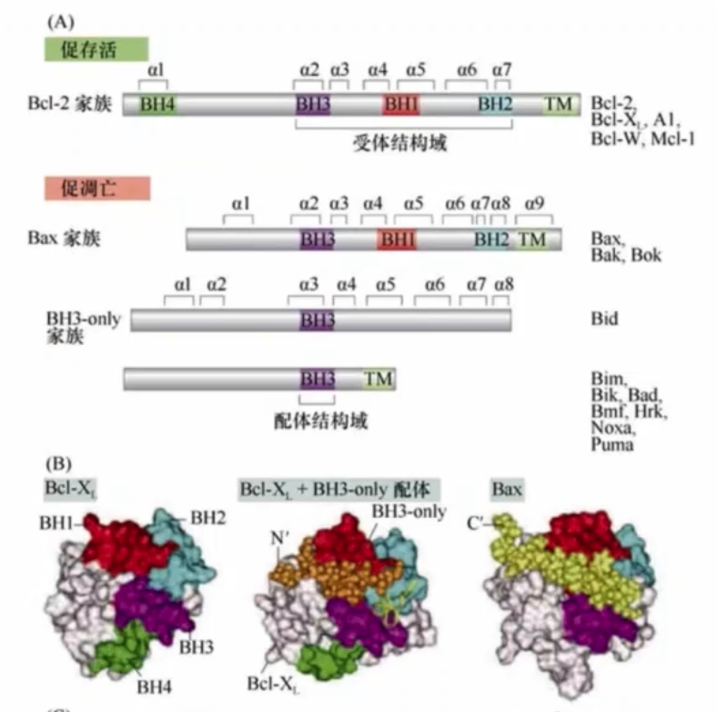
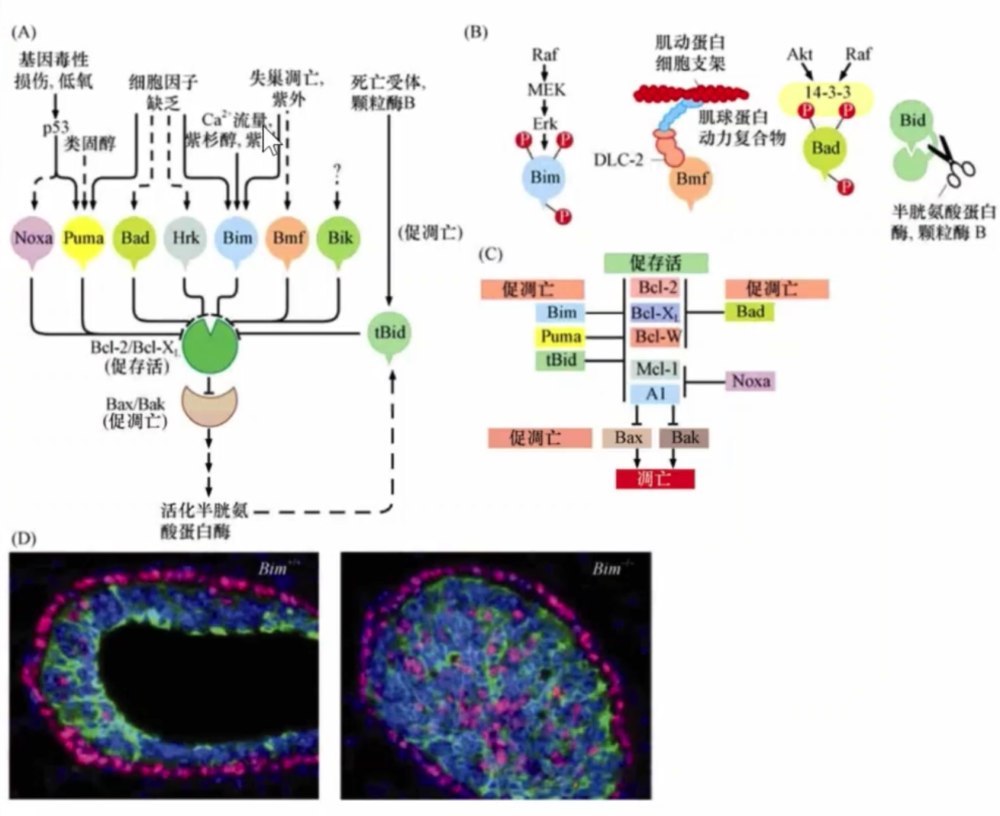
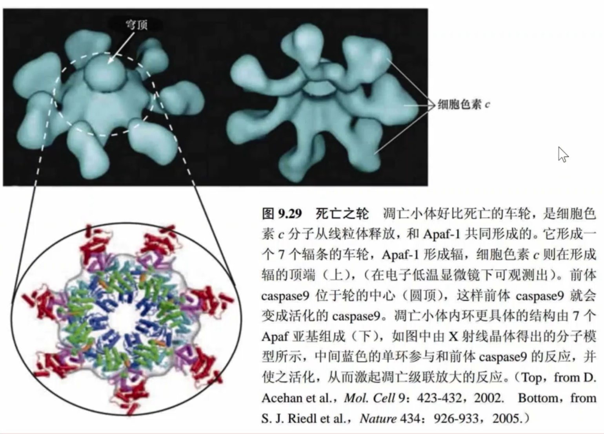
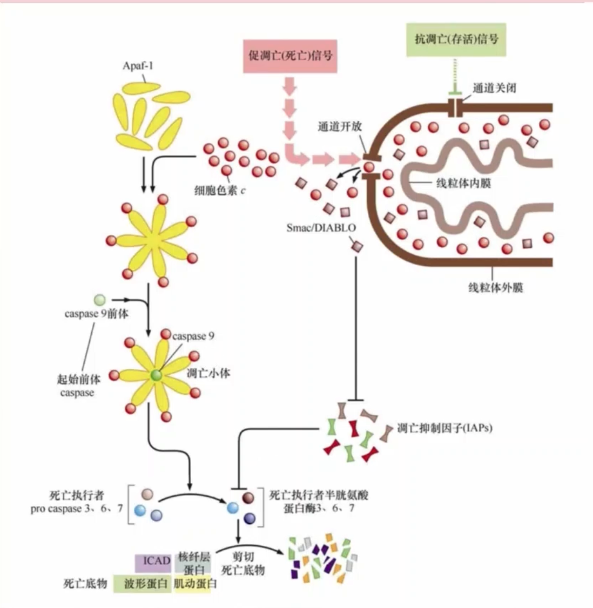
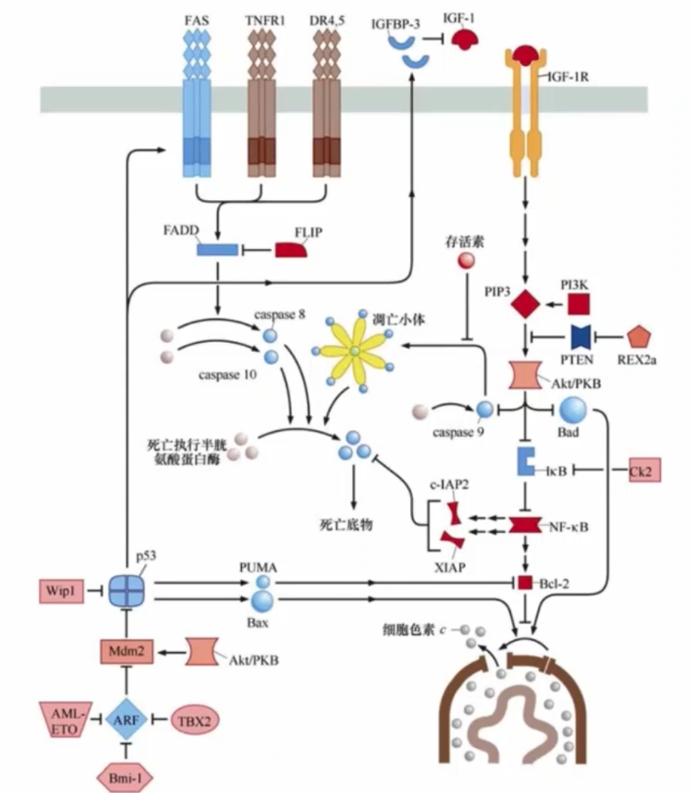
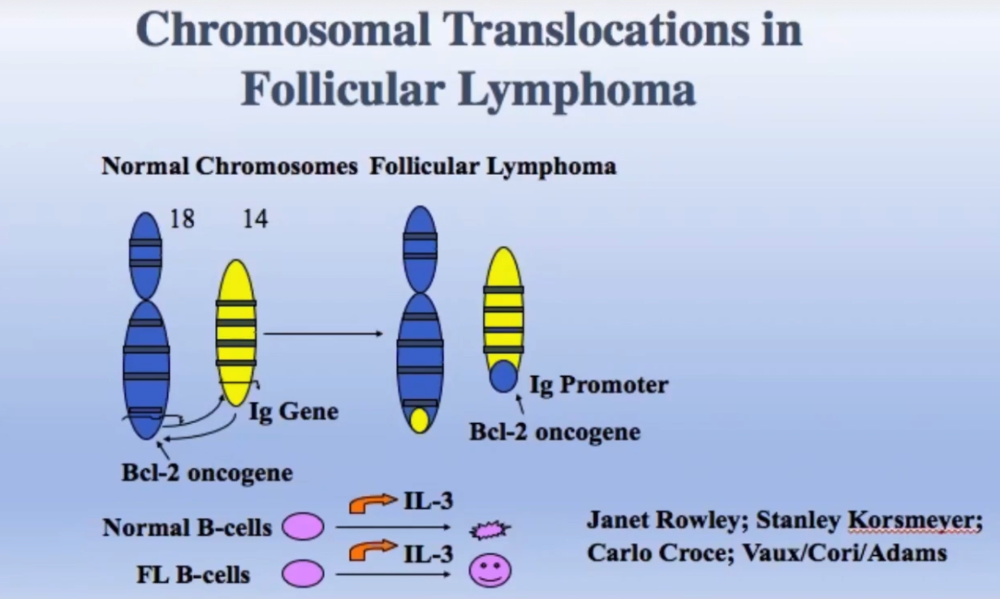
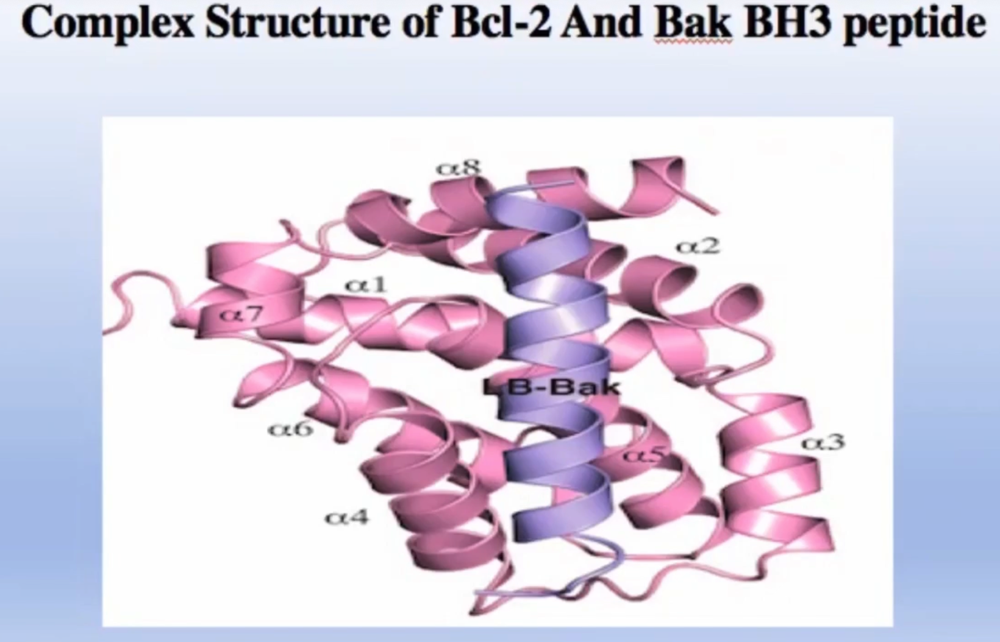
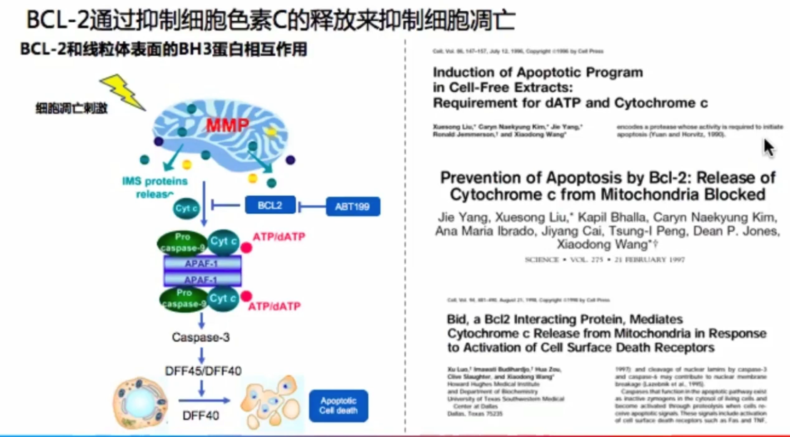
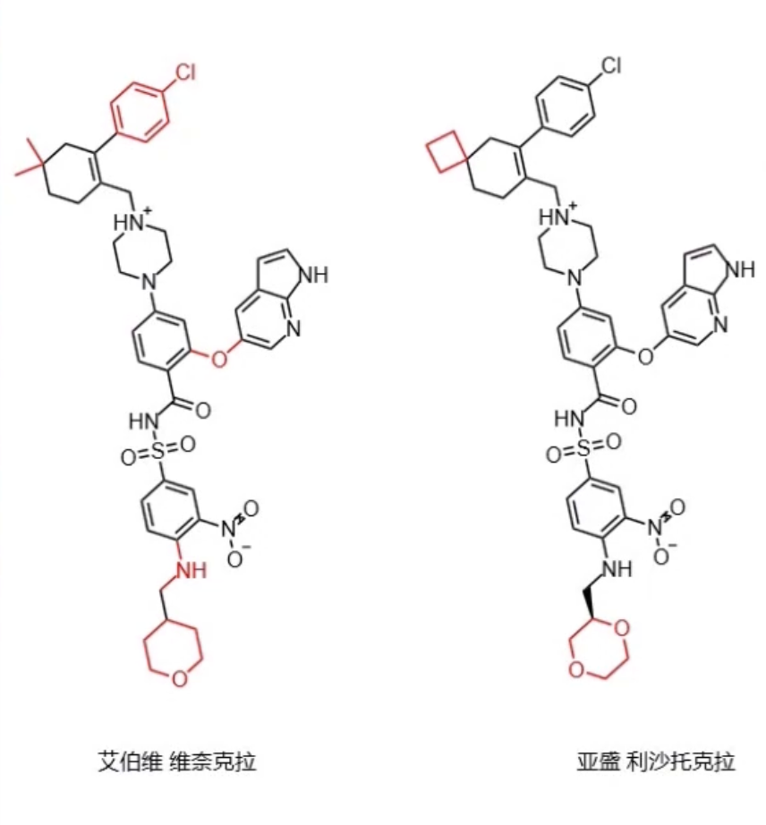

经典细胞凋亡（三）死亡之轮和bcl家族：https://www.bilibili.com/video/BV1Lu4y1X7nH

院士专场 新一代BCL2抑制剂的开发历程-王晓东：https://www.bilibili.com/video/BV19q4y1p75C/

BCL-2抑制剂 | 蜕变之旅：https://www.bilibili.com/video/BV1aMgWzhEUU/

