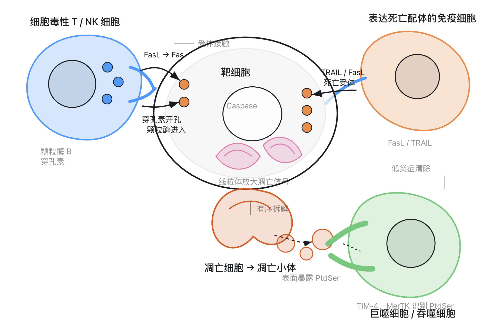
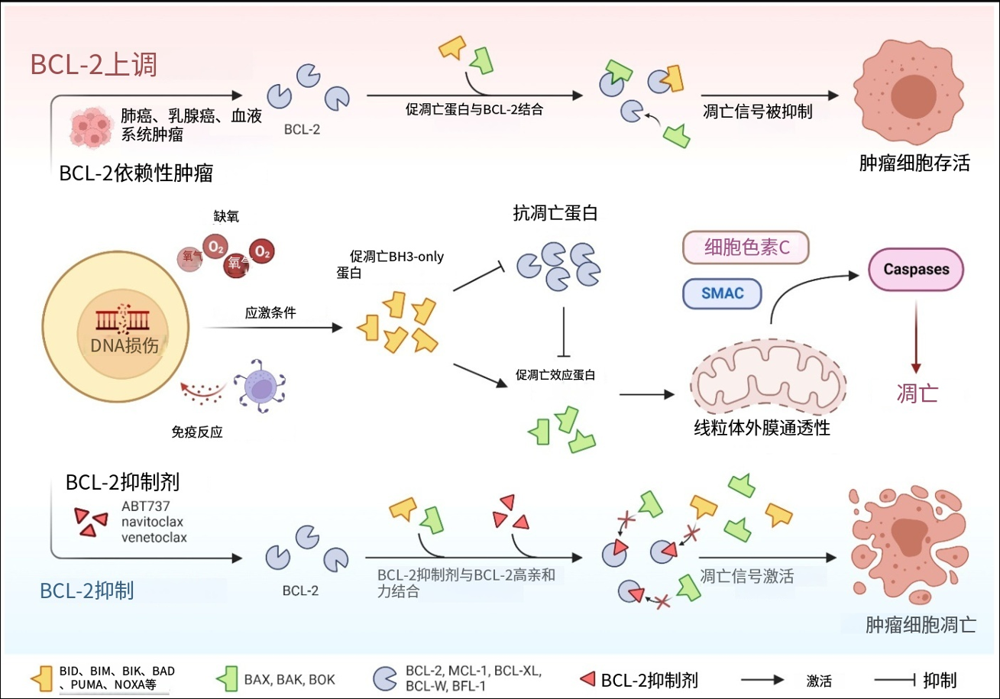
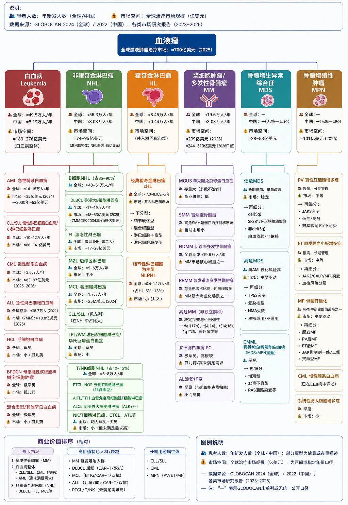
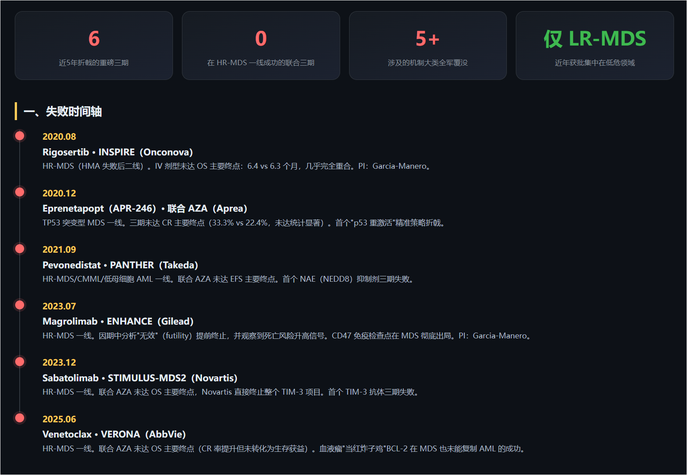

# MDS 适应症 20 年药物发展与治疗标准全景分析
## ——兼论 Lisaftoclax（利沙托克拉，APG-2575）在 MDS 方向的探索与展望

> 报告日期：2026-08-29。所有关键事实均附来源（格式：来源: 日期(URL)）。标注「公司口径」的数据来自企业新闻稿/会议披露，尚未经同行评议全文或监管审评文件确认。

---

## 摘要（结论先行）

1. **MDS 药物发展呈清晰的"四阶段"结构**：支持治疗时代（2004 年前）→ 去甲基化药物（HMA）时代（2004–2019，阿扎胞苷/来那度胺/地西他滨三足鼎立）→ 分层精准治疗时代（2020 至今，低危端 luspatercept、imetelstat、ivosidenib 接连获批）→ 高危端联合策略屡败（2020–2025，VERONA 等 5 个 III 期全部失败）。

2. **20 年间 MDS 领域 FDA 获批药物仅 7 个，且全部集中在低危端或维持 HMA 框架**：高危 MDS（HR-MDS）自 2004 年阿扎胞苷以来**没有任何新机制药物获批**，HMA 单药（CR 率仅约 15%–20%、真实世界中位 OS 14–18 个月）至今仍是不能移植患者的标准一线。

3. **治疗标准的核心演变在于"分层"而非"换药"**：分层工具从 IPSS（1997，4 组）演进到 IPSS-M（2022，纳入 31 基因突变、6 组，重分层 46% 患者）；低危 MDS 已形成按 SF3B1/RS、del(5q)、输血依赖程度细分的路径，高危 MDS 仍以 HMA 单药 + 移植评估为骨架。

4. **Lisaftoclax（利沙托克拉）是当前全球唯一进入 HR-MDS 注册 III 期（GLORA-4）的 BCL-2 抑制剂**：其 ND HR-MDS 早期数据 ORR 77.5%–80%、60 天死亡率 0、无 TLS（公司口径），药代上短半衰期（3–5 h vs 维奈克拉 26 h）支持 5 天快速爬坡；但维奈克拉 VERONA III 期的失败（OS HR 0.908）提示——**反应率优势不等于生存获益**，GLORA-4（预计 2029 年读出 OS）之前，一切"有效"表述只能限定在缓解率层面。

5. **展望**：Lisaftoclax 在 MDS 的机会在于（i）VERONA 失败后成为赛道"独苗"；（ii）人群聚焦（限定原始细胞 >5% 的 HR-MDS）与给药优化（14 天/周期）吸取了 VERONA 教训；（iii）维奈克拉耐药后人群已有初步活性信号。核心风险在于 OS 终点本身的高难度、TP53 突变亚组的天然耐药、以及 BCL-2 类药物骨髓抑制毒性的管理。

---

## 一、疾病背景与流行病学

骨髓增生异常综合征（MDS，2022 年起 WHO/ICC 分类中亦称"骨髓增生异常性肿瘤"）是一组起源于造血干/祖细胞的克隆性疾病，特征为无效造血、外周血细胞减少和向急性髓系白血病（AML）转化的风险。

- **美国**：SEER 年龄校正发病率约 3.9–4.7/10 万；LLS 统计 2016–2020 年年均新发 15,529 例（保险索赔口径估计 3–4 万例/年），中位诊断年龄 70–76 岁，86% 患者 ≥60 岁，男性多于女性（约 1.5–1.8:1）。来源：LLS Facts 2023-2024: (https://www.lls.org/sites/default/files/2024-09/PS80_FactsBook_2024.pdf)；SEER21 分析 PMC10198393: (https://pmc.ncbi.nlm.nih.gov/articles/PMC10198393/)
- **中国**：官方口径发病率 0.23–1.51/10 万（显著低于欧美，存在诊断率低/报告不全的争议）；上海 2004–2007 年调查发病率 1.51/10 万、中位发病年龄 62 岁，约 1/3 患者转化为 AML。市场研究口径（弗若斯特沙利文）估计 2019 年中国新发约 22,100 例、5 年生存率 23%（美国约 29%）。注意：另有专家按德国发病率外推的"30 余万/年"说法，与前者相差 10 倍以上，两种口径均有局限。来源：国家卫健委 MDS-EB 诊疗指南: (http://www.nhc.gov.cn/yzygj/c100068/202204/0c1f7d3aca0545abbeb02030ce255930/files/1732863055128_24413.pdf)；德琪医药招股书（弗若斯特沙利文）: 2020-11(https://www1.hkexnews.hk/listedco/listconews/sehk/2020/1120/9519527/sehk20082601449_c.pdf)；央广网: 2014-10-26(http://news.cnr.cn/native/city/201410/t20141026_516664454.shtml)
- **亚洲人群特征**：中位发病年龄（56–62 岁）低于西方；+8 为最常见核型异常，孤立 del(5q) 罕见（0.9%–4%）——这直接影响来那度胺等"分型药物"在中国的适用人群规模。来源：单中心 550 例研究 PMC7364886: (https://pmc.ncbi.nlm.nih.gov/articles/PMC7364886/)

---

## 二、MDS 药物发展 20 年（2004–2026）：四个阶段


### 2.1 阶段一：支持治疗时代（2004 年前）——无药可用

2004 年之前，MDS 没有任何获批药物，唯一手段是支持治疗：红细胞/血小板输注、促红细胞生成素（ESA）、G-CSF、抗感染和去铁治疗；异基因造血干细胞移植（allo-HSCT）是仅有的潜在治愈手段，但仅少数年轻、有供者、无严重合并症的患者适合。来源：PMC 综述 PMC3627328: (https://pmc.ncbi.nlm.nih.gov/articles/PMC3627328/)

### 2.2 阶段二：HMA 时代（2004–2019）——奠基的三个药

**（1）阿扎胞苷（azacitidine，Vidaza/维达莎）——MDS 第一个获批药物、首个去甲基化药物**

- 2004-05-19 FDA 常规批准，覆盖所有 FAB 亚型 MDS；基于 CALGB 9221 等研究，CR 10%–17%、血液学改善 23%–36%。来源：FDA 审批综述（Oncologist 2005）: (https://pubmed.ncbi.nlm.nih.gov/15793220/)；PMC3627328: (https://pmc.ncbi.nlm.nih.gov/articles/PMC3627328/)
- 里程碑式的 **AZA-001** III 期（358 例 HR-MDS）：中位 OS 24.5 vs 15.0 个月（HR 0.58，p=0.0001），2 年生存率 50.8% vs 26.2%——首个证明 OS 获益的 MDS 药物，2008-08-21 FDA 扩展标签纳入该 OS 数据；2008-12-17 获 EMA 批准。来源：Lancet Oncol 2009 经 PMC2948932: (https://pmc.ncbi.nlm.nih.gov/articles/PMC2948932/)；FierceBiotech: 2008-08-21(https://www.fiercebiotech.com/biotech/vidaza-r-receives-expanded-fda-approval-to-include-overall-survival-higher-risk-mds)；EMA Vidaza EPAR: (https://www.ema.europa.eu/en/medicines/human/EPAR/vidaza)
- 意义：首个基于"表观遗传治疗"理念获批的抗癌药物（Nature 临床肿瘤学评论: (https://www.nature.com/articles/ncponc0352)）。

**（2）来那度胺（lenalidomide，Revlimid）——首个按细胞遗传学亚型精准用药**

- 2005-12-27 FDA 加速批准（Subpart H），用于 del(5q) 低危/中危-1 MDS 输血依赖贫血；关键研究（MDS-002/003 系列）红细胞输血独立率约 64%–67%，细胞遗传学缓解率约 44%。来源：FDA 批准信: (https://www.accessdata.fda.gov/drugsatfda_docs/nda/2005/021880s000_Revlimid_Approv.pdf)；PMC3573434: (https://pmc.ncbi.nlm.nih.gov/articles/PMC3573434/)
- 局限：亚洲人群孤立 del(5q) 比例仅 0.9%–4%，该药在中国 MDS 适用人群很小。

**（3）地西他滨（decitabine，Dacogen）——第二个 HMA**

- 2006-05-02 FDA 批准，覆盖全部 FAB 亚型及 IPSS 中危-1/中危-2/高危；关键 III 期 CR+PR 仅 17%（CR 9%）。来源：FDA 孤儿药数据库: (https://www.accessdata.fda.gov/scripts/opdlisting/oopd/detailedIndex.cfm?cfgridkey=122298)；NCBI 综述 PMC4036667: (https://www.ncbi.nlm.nih.gov/pmc/articles/PMC4036667/)
- 值得注意：EMA **未批准**地西他滨的 MDS 适应症（欧洲仅 2012 年批准其用于老年 AML），MDS 适应症的疗效证据标准在两大监管体系间并不一致。来源：EMA 评审综述（PubMed）: (https://pubmed.ncbi.nlm.nih.gov/27091416/)

**时代特征**：HMA 确立了 HR-MDS 一线标准，但疗效天花板明显——CR 率不足 20%，且此后约 20 年高危 MDS 无新机制药物获批。Gilead 在 2023 年 ENHANCE 失败声明中的原话即"高危 MDS 近 20 年没有新一类药物获批"。来源：AJMC: (https://www.ajmc.com/view/top-5-most-read-myelodysplastic-syndromes-articles-of-2023)

### 2.3 阶段三：分层精准时代（2020– ）——突破集中在低危端

| 药物 | 获批时间/机构 | 适应症 | 关键注册数据 | 机制意义 |
|---|---|---|---|---|
| Luspatercept（Reblozyl） | 2020-04-03 FDA | ESA 失败的 MDS-RS / MDS/MPN-RS-T 贫血 | MEDALIST：8 周 RBC-TI **37.9% vs 13.2%**（p<0.0001，NEJM 2020） | 首个红细胞成熟剂（TGF-β 配体陷阱） |
| 口服地西他滨+cedazuridine（Inqovi） | 2020-07-07 FDA | MDS/CMML（中危-1 及以上） | 与静脉地西他滨暴露等效；CR 18%–21%；49%–53% 输血依赖转独立 | 首个口服 HMA（剂型革新） |
| Luspatercept 一线扩展 | 2023-08-28 FDA | ESA-naïve 低危 MDS 贫血 | COMMANDS 头对头 vs 依泊汀α：主要复合终点 **58.5% vs 31.2%**（Lancet 2023） | 挑战 ESA 20 年一线地位 |
| 艾伏尼布（ivosidenib，Tibsovo） | 2023-10-24 FDA | IDH1 突变 R/R MDS | 单臂 18 例，CR+PR 39%（全部 CR）；67% 输血依赖转独立 | **MDS 首个分子靶向药**（伴随诊断同步获批） |
| Imetelstat（Rytelo） | 2024-06-06 FDA | ESA 失败/不耐受的输血依赖低危 MDS | IMerge：8 周 RBC-TI **39.8% vs 15%**；24 周 28% vs 3.3%（Lancet 2024） | **首个端粒酶抑制剂**；经 ODAC 12:2 投票获批 |

来源：FDA luspatercept: 2020-04-03(https://www.fda.gov/drugs/resources-information-approved-drugs/fda-approves-luspatercept-aamt-anemia-adults-mds)；FDA Inqovi 审批综述 PMC9378483: (https://pmc.ncbi.nlm.nih.gov/articles/PMC9378483/)；Cancer Network: 2023-08-29(https://www.cancernetwork.com/view/fda-approves-luspatercept-in-low-risk-myelodysplastic-syndrome)；FDA ivosidenib: 2023-10-24(https://www.fda.gov/drugs/resources-information-approved-drugs/fda-approves-ivosidenib-myelodysplastic-syndromes)；FDA imetelstat: 2024-06-06(https://www.fda.gov/drugs/resources-information-approved-drugs/fda-approves-imetelstat-low-intermediate-1-risk-myelodysplastic-syndromes-transfusion-dependent)

**时代特征**：获批逻辑从"统一化疗样药物"变为"按生物学亚型/通路细分"——红细胞生成通路（luspatercept）、端粒酶（imetelstat）、IDH1 突变（ivosidenib）。**但这些突破全部集中在低危 MDS 的贫血管理，目标是输血独立（生活质量终点），无一证明 OS 获益**（imetelstat 获批时 FDA 明确指出无 CR/PR 或 OS 获益）。

### 2.4 阶段四（暗线）：高危端"HMA+1"联合策略的集体挫败（2014–2025）

高危 MDS 领域过去 10 年的主线是一部"III 期失败史"：

| 药物（机制） | III 期试验 | 结果 |
|---|---|---|
| Rigosertib（PLK1/PI3K） | ONTIME（2014）、INSPIRE（2020） | 两次 III 期均未达 OS 终点 |
| Eprenetapopt/APR-246（TP53 复活剂） | TP53 突变 MDS III 期（2020-12） | CR 33.3% vs 22.4%，数值更高但**未达统计学显著** |
| Pevonedistat（NEDD8） | PANTHER（2022） | 未达 EFS 终点 |
| Magrolimab（抗 CD47） | ENHANCE（2023-07 终止） | 中期分析判定无效；2024-02 FDA 全面临床搁置，Gilead 终止全部血液肿瘤开发 |
| Sabatolimab（抗 TIM-3） | STIMULUS-MDS2（2024） | OS HR 0.85，p=0.0825 未达标；诺华 2024-01 全面终止该项目 |
| **维奈克拉 venetoclax（BCL-2）** | **VERONA（2025-06 宣布失败）** | **OS HR 0.908，p=0.3772**；中位 OS 22.2 vs 21.7 个月 |

来源：ONTIME（Lancet Oncol 2016）: (https://pubmed.ncbi.nlm.nih.gov/26968357/)；INSPIRE（SymBio IR）: (https://www.symbiopharma.com/en/ir/pdf/20220325_SR_4582_EN_20220325.pdf)；eprenetapopt（GlobeNewswire）: 2020-12-28(https://www.globenewswire.com/news-release/2020/12/28/2150874/0/en/Aprea-Therapeutics-Announces-Results-of-Primary-Endpoint-from-Phase-3-Trial-of-Eprenetapopt-in-TP53-Mutant-Myelodysplastic-Syndromes-MDS.html)；ENHANCE（Gilead 新闻稿）: 2023-07-21(https://www.gilead.com/news-and-press/press-room/press-releases/2023/7/gilead-to-discontinue-phase-3-enhance-study-of-magrolimab-plus-azacitidine-in-higher-risk-mds)；sabatolimab（pharmaphorum）: 2024-01-31(https://pharmaphorum.com/news/novartis-calls-time-tim3-drug-sabatolimab-mds)；VERONA（AbbVie 财报）: 2025-07-31(https://news.abbvie.com/2025-07-31-AbbVie-Reports-Second-Quarter-2025-Financial-Results)

其中 **VERONA 的失败最具风向标意义**：维奈克拉+阿扎胞苷在 AML 已大获成功（VIALE-A），其 MDS Ib 期数据也极为亮眼（mOR 80.4%、中位 OS 26.0 个月，Blood 2025: (https://pubmed.ncbi.nlm.nih.gov/39652823/)），并曾获 FDA 突破性疗法认定（2021-07）；但 509 例 III 期中 OS 曲线基本重合——反应率（mOR 76.6% vs 57.7%、mCR 57.8% vs 37.5%）和输血独立率（55.7% vs 33.6%）的显著优势未能转化为生存获益。来源：Dana-Farber（ASH 2025 报告）: 2025-12-06(https://physicianresources.dana-farber.org/news/phase-iii-verona-trial-results-show-potential-benefit-for-some-groups-with-myelodysplastic-syndrome-mds)；SOHO Insider: 2025-10-21(https://sohoinsider.com/news/verona-phase-3-trial-shows-no-survival-benefit-in-high-risk-mds)

学界对 VERONA 失败的解读集中于两点：入组人群偏"软"（近 1/3 为中危、仅 27% 原始细胞增多，而 BCL-2 依赖性与原始细胞负荷相关）、TP53 突变者对 BCL-2 抑制天然不敏感。来源：综述 PMC13184396: (https://pmc.ncbi.nlm.nih.gov/articles/PMC13184396/)。这两条教训直接构成了后文 Lisaftoclax 试验设计的参照系。

### 2.5 中国（NMPA）获批与医保脉络

- **地西他滨**：2009 年进入中国并获原 SFDA 批准，长期是中国唯一可用的 HMA，衍生出 CAG/HAG 等本土联合方案。来源：Dove Medical Press 综述: 2015-10-03(https://www.dovepress.com/spotlight-on-decitabine-for-myelodysplastic-syndromes-in-chinese-patie-peer-reviewed-fulltext-article-OTT)
- **阿扎胞苷（维达莎）**：2017 年 4 月获 CFDA 批准，2018 年纳入国家医保乙类（国内由百济神州销售）。来源：美通社（百济神州）: 2018-02-06(https://www.prnasia.com/story/201780-1.shtml)
- **罗特西普（luspatercept/利布洛泽）**：2025-06-04 NMPA 批准较低危 MDS 贫血适应症（基于 COMMANDS/MEDALIST + 亚洲桥接 MDS-004），为**中国近 20 年来首个较低危 MDS 创新药**；2025 年 12 月纳入国家医保目录，并进入《CSCO 恶性血液病诊疗指南（2025）》一线推荐。来源：BMS 中国: 2025-06-04(https://www.bms.com/cn/media/press-release-listing/06042025.html)；新华网: 2025-12-08(http://www.news.cn/health/20251208/1d6292b712884af19e1dbff5548bccc8/c.html)
- **利沙托克拉（lisaftoclax/利生妥）**：2025-07-10 NMPA 附条件批准（首个适应症为 BTKi 经治 CLL/SLL，非 MDS）——为中国首个、全球第二个获批的 BCL-2 抑制剂。来源：亚盛医药官网: 2025-07-10(https://www.ascentage.com/ascentage-pharma-announces-its-novel-bcl-2-inhibitor-lisaftoclax-approved-by-china-nmpa-ushering-in-a-new-era-for-the-treatment-of-cll-sll/)

---

## 三、治疗标准的演变：从"统一分层"到"分子整合"

### 3.1 危险分层工具：IPSS → IPSS-R → IPSS-M

| 工具 | 年份 | 变量 | 分组 |
|---|---|---|---|
| IPSS | 1997 | 细胞遗传学（3 组）+ 骨髓原始细胞 + 血细胞减少系列数 | 4 组 |
| IPSS-R | 2012 | 细胞遗传学细化为 5 组 + 三系血细胞减少按严重度加权 | 5 组 |
| IPSS-M | 2022 | 临床参数 + 细胞遗传学 + **31 基因突变**（TP53 multi-hit 为最强不良因素 HR 3.27；SF3B1 为保护性因素） | 6 组 |

IPSS-M 将 46% 患者重新分层（74% 上调），IPSS-R 中危患者中 21% 被上调至极高危——分子信息直接改变治疗决策。来源：Greenberg et al., Blood 2012;120:2454；Bernard et al., NEJM Evidence: 2022-06-28(https://evidence.nejm.org/doi/full/10.1056/EVIDoa2200008)；独立验证（Blood Cancer Journal 2023）: (https://www.nature.com/articles/s41408-023-00894-8.pdf)

### 3.2 低危 MDS（LR-MDS）现行治疗路径（以 NCCN v2.2025 为代表）

- **症状性贫血 + RS≥15%（或 RS≥5% 伴 SF3B1 突变）**：一线 **luspatercept**（1 类首选）；失败后换 **imetelstat**（1 类首选）；sEPO≤200 者仍可先用 ESA。
- **del(5q)**：来那度胺。
- **RS<15% 且 sEPO≤500**：ESA 与 luspatercept 并列首选；sEPO>500 者评估免疫抑制治疗（IST）候选或进入 HMA/imetelstat。
- 来源：JNCCN（NCCN Guidelines Insights MDS v2.2025）: 2025-03-10(https://jnccn.org/view/journals/jnccn/23/3/article-p66.xml?print)

低危端的目标已从"维持血象"升级为"摆脱输血依赖"（RBC-TI），luspatercept（COMMANDS 58.5% vs 31.2%）与 imetelstat（IMerge 39.8% vs 15%）构成了 ESA 之后的两条新支柱。

### 3.3 高危 MDS（HR-MDS）现行治疗路径

- **唯一潜在治愈手段仍是 allo-HSCT**；不适合移植者以 **HMA 单药**（阿扎胞苷/地西他滨/口服 Inqovi）为标准一线；适合强化疗者的 AML 样诱导多作为移植桥接。来源：NCCN 患者指南 2026: (https://www.nccn.org/patients/guidelines/content/pdf/mds-patient.pdf)；Haematologica 综述（Kröger N）: 2025-02-01(https://aamds.org/research-article/treatment-high-risk-myelodysplastic-syndromes)
- 中国《MDS 中国诊断与治疗指南（2026 年版）》（中华血液学杂志，2026-02 上线）：较低危路径纳入艾伏尼布（IDH1）、TPO-RA；较高危路径注明"**HMA+维奈克拉用于复发难治患者或移植前桥接治疗**"。来源：PubMed 41839623: 2026-02-14(https://pubmed.ncbi.nlm.nih.gov/41839623/)

### 3.4 未满足需求（量化）

1. **HMA 单药疗效天花板**：试验口径 CR 约 15%–17%、中位 OS 约 24.5 个月（AZA-001）；真实世界中位 OS 仅 14–18 个月，约 50% 患者原发耐药。2025 年综述结论："联合方案迄今未能改写 HMA 单药范式"。来源：PMC2948932: (https://pmc.ncbi.nlm.nih.gov/articles/PMC2948932/)；AME 述评: 2026-06-04(https://aob.amegroups.org/article/view/13020/html)；Stempel et al., Cancers 2025: (https://pubmed.ncbi.nlm.nih.gov/40805168/)
2. **HMA 失败后无标准方案**：R/R MDS 中位 OS 仅 4–6 个月（原发耐药 4.6 vs 继发 7.4 个月）；转化 AML 后中位 OS 约 4 个月。来源：Adès L 综述 PMC8925703: (https://pmc.ncbi.nlm.nih.gov/articles/PMC8925703/)；Blood Cancers Today: 2022-09-30(https://www.bloodcancerstoday.com/post/poor-prognosis-after-transformation-to-aml-following-hma-therapy-in-mds)
3. **TP53 突变 MDS**：对化疗、HMA、维奈克拉方案反应均差；multi-hit TP53 中位 OS 约 8.7 个月、5 年 OS<10%（即使移植）。来源：Cancer Discov 2022（PMC9627130）: (https://pmc.ncbi.nlm.nih.gov/articles/PMC9627130/)；Frontiers in Oncology 综述: 2026-02-23(https://www.frontiersin.org/journals/oncology/articles/10.3389/fonc.2026.1735418/full)
4. **老年主体人群难以触及根治手段**：约 80% HR-MDS 患者诊断时即不适合移植（首要原因高龄）；60–80 岁患者仅 6%–8% 实际接受 allo-HSCT。来源：Dove Medical Press 真实世界研究: (https://www.dovepress.com/article/download/104178)；MDPI 综述: 2024-04-29(https://www.mdpi.com/2227-9059/12/5/975)

---

## 四、Lisaftoclax（利沙托克拉，APG-2575）在 MDS 方向的探索与展望

### 4.1 药物背景：一个"后发但差异化"的 BCL-2 抑制剂

- **基本情况**：亚盛医药（Ascentage Pharma，6855.HK / NASDAQ: AAPG）自主研发的口服选择性 BCL-2 抑制剂，中国商品名"利生妥®"；2025-07-10 获 NMPA 附条件批准用于 BTKi 经治 CLL/SLL，是中国首个、全球第二个获批的 BCL-2 抑制剂。来源：亚盛医药官网: 2025-07-10（同上）；The Cancer Letter: 2025-07-11(https://cancerletter.com/drugs-and-targets/20250711_11b/)
- **关键差异化（vs 维奈克拉）**：
  - **药代**：半衰期约 3–5 小时（维奈克拉约 26 小时），高 Cmax、低蓄积 → 支持 **5 天每日递增完成爬坡**（维奈克拉需 5 周），这对骨髓储备差的 MDS 老年患者的剂量管理有实际意义。
  - **安全性**：首次人体研究（52 例）无临床/实验室 TLS；CLL 大样本（176 例）TLS 仅 2.8%、≥3 级血小板减少 8.5%——骨髓抑制相关毒性谱理论上更可控。
  - 来源：Ailawadhi et al., Clin Cancer Res 2023（PMC10330157）: (https://pmc.ncbi.nlm.nih.gov/articles/PMC10330157/)；Med 2025（PubMed 41109219）: (https://pubmed.ncbi.nlm.nih.gov/41109219/)
- **权益格局**：与信达生物的 2.45 亿美元合作（2021-07）仅涉及联合用药临床合作与股权；武田 13 亿美元交易（2024-06）标的是奥雷巴替尼——**利沙托克拉的全球权益完整保留在亚盛手中**。来源：亚盛官网: 2021-07-14(https://www.ascentage.com/ascentage-pharma-and-innovent-biologics-reach-multifaceted-strategic-agreement-totaling-us245-million-.../)；亚盛官网: 2024-06-14(https://www.ascentage.com/ascentage-pharma-signs-option-agreement-with-takeda-.../)

### 4.2 MDS 临床数据时间线（均为公司会议披露口径，尚未见同行评议全文）

| 时间/会议 | 研究 | 人群与样本 | 核心数据 |
|---|---|---|---|
| ASH 2023 #2925 | 中国 I 期 | 22 例 MDS（15 初治/7 R/R） | MDS 队列 ORR **70.0%**，CR/mCR 60.0%；无 TLS |
| **ASH 2024 #3202** | 中国 Ib/II 期 APG2575AC101（NCT04501120），联合 AZA | 49 例（41 初治 + 8 R/R；TP53 突变占 23.1%） | 初治 MDS ORR **77.5%**、CR 25.0%；600mg 组按 IWG2023 复合 CR **69.6%**；**60 天死亡率 0、TLS 0**；≥3 级血液学 TRAE 高（中性粒细胞减少 65.3%、血小板减少 65.3%）但剂量降低仅 8.2% |
| ASCO 2025 #6505（口头） | 全球 Ib/II 期 APG2575AU101（NCT04964518） | 97 例（含 15 例 ND HR-MDS） | TN-MDS/CMML ORR 64%；确定 ND HR-MDS 的 RP2D 为 600mg D1–14 |
| **ASH 2025 #1641** | 同上研究更新 | 103 例（40 例 HR-MDS/CMML） | **ND HR-MDS/CMML：ORR 80.0%、CR 40.0%、mCR 40.0%**，中位 OS 未达到；R/R HR-MDS/CMML 中位 OS 11.3 个月；维奈克拉经治 AML/MPAL ORR 31.8%——公司称"BCL-2 克服 BCL-2 耐药"的首个临床证据 |

来源：亚盛官网 ASH 2024 数据稿: 2024-12-10(https://www.ascentage.com/live-from-ash-2024-ascentage-pharma-releases-updated-data-of-bcl-2-inhibitor-lisaftoclax-in-mds-that-demonstrates-potential-clinical-benefits-and-favorable-safety/)；ASH 2024 摘要页: (https://ash.confex.com/ash/2024/webprogram/Paper205371.html)；亚盛官网 ASH 2025 数据稿: 2025-12-07(https://ascentage.com/ash-2025-ascentage-pharma-presents-encouraging-data-from-phase-ib-ii-study-of-bcl-2-inhibitor-lisaftoclax-in-venetoclax-exposed-patients-with-myeloid-malignances/)

**数据解读要点**：反应率层面（ORR 77.5%–80%）与维奈克拉 Ib 期（mOR 80.4%）处于同一量级；真正的差异化信号在于**安全性结构**（0 早期死亡、0 TLS、骨髓抑制可管理）和**给药便利性**（5 天爬坡）。但必须强调：VERONA 已经证明此类反应率优势在 III 期可能完全不转化为 OS——早期单臂数据的"惊艳"在 MDS 领域有反复破灭的先例（eprenetapopt 早期 ORR 87%→III 期失败；magrolimab 早期 ORR 75%→终止）。

### 4.3 GLORA-4：全球注册 III 期（MDS 适应症成败的决胜局）

- **登记号**：NCT06641414（方案号 APG2575MG301）；设计为全球多中心、随机、双盲、安慰剂对照 III 期：**利沙托克拉 + 阿扎胞苷 vs 安慰剂 + 阿扎胞苷，一线治疗新诊断 HR-MDS，主要终点 OS**；给药为利沙托克拉 D1–14 + AZA D1–7（28 天/周期）。来源：CenterWatch: (https://www.centerwatch.com/clinical-trials/listings/NCT06641414/)；Duke Health 研究页: (https://www.dukehealth.org/clinical-trials/directory/pro00120001)
- **规模与进度**：计划入组约 490 例（CenterWatch/Veeva 口径；中文媒体引公司口径为 464 例，以 ClinicalTrials.gov 为准），预计 2029 年完成；中国 CDE 2024-05 给予临床许可，**2025-08-17 FDA 与 EMA 双双许可**，中美欧同步入组。来源：亚盛官网: 2025-08-17(https://www.ascentage.com/ascentage-pharma-announces-global-registrational-phase-iii-study-of-lisaftoclax-for-first-line-treatment-of-patients-with-higher-risk-myelodysplastic-syndrome-cleared-by-us-fda-and-ema/)；亚盛 2024 年报（HKEX）: 2025-04-16(https://www1.hkexnews.hk/listedco/listconews/sehk/2025/0416/2025041601729.pdf)
- **学术背书**：全球共同牵头 PI 为 Guillermo Garcia-Manero（MD Anderson 白血病系主任，VERONA 的报告者）与黄晓军院士（北京大学人民医院）。
- **定位**（公司口径）：利沙托克拉是"**目前全球唯一进入 HR-MDS 注册 III 期的 BCL-2 抑制剂**"；若成功，有望成为"HMA 之后 20 余年来首个 HR-MDS 一线靶向疗法"。来源：亚盛官网: 2025-08-17（同上）

**与 VERONA 的设计对比（吸取的教训）**：

| 维度 | VERONA（维奈克拉，失败） | GLORA-4（利沙托克拉） |
|---|---|---|
| 人群 | IPSS-R 中危+高危（近 1/3 中危，原始细胞负荷偏低） | 聚焦 ND HR-MDS（中国 Ib/II 期入组要求原始细胞 >5%、IPSS-R>3.5），人群更"硬" |
| 给药强度 | 维奈克拉 14 天/28 天（从 28 天减量而来，骨髓毒性驱动减量/中断更多） | 利沙托克拉 D1–14；短半衰期药物理论上周期内清除更快、蓄积更少 |
| 终点 | OS 主要终点（CR 双主要终点） | OS 主要终点 |
| 背景 | AML 成功外推 + Ib 期乐观数据 | Ib/II 期数据 + VERONA 的事后教训 |

### 4.4 竞争格局

- **维奈克拉（AbbVie/罗氏）**：VERONA 失败后 MDS 开发前景冻结（至今无 MDS 适应症），但亚组信号（>5% 原始细胞、需桥接移植者）提示 BCL-2 机制在 MDS 并未被"证伪"，只是未在广谱人群中证明 OS。来源：Dana-Farber: 2025-12-06（同上）；SOHO Insider: 2025-10-21（同上）
- **Sonrotoclax（BGB-11417，百济神州/BeOne）**：下一代 BCL-2 抑制剂，经 Ib/II 期 BGB-11417-103（NCT04771130）布局 AML/MDS/MDS-MPN，但其 III 期重心在 CLL/NHL，MDS 尚无注册性研究。来源：BeOne Medical Affairs: (https://beonemedaffairs.com/us/clinical-trials/hematology/bgb-11417-103-trial/)
- **非 BCL-2 赛道**：bexmarilimab（BEXMAB，TP53 突变 HR-MDS，2025-08 获 FDA 同意推进注册性 2/3 期）、IRAK1/4 抑制剂等仍在角逐。来源：MDS Foundation 汇编: (https://www.mds-foundation.org/api/file/file/Fall%202025%20MDS%20News_DIGITAL_opt.pdf)
- **中国 IIT 探索**：已有研究者发起"利沙托克拉+地西他滨用于维奈克拉治疗失败 MDS"的单臂 II 期（ChiCTR2600125359，24 例，2026-01 首例入组）——切入维奈克拉耐药这一真实未满足场景。来源：药融云引 ChiCTR: 2026-05-26(https://www.pharnexcloud.com/data/lcsy_03dee88950a3d97a885c927a9a924d66.html)
- **指南认可**：2026 版《CSCO 淋巴瘤诊疗指南》与《CSCO 恶性血液病诊疗指南》均已纳入利沙托克拉，覆盖 CLL/SLL、AML、MDS。来源：经济观察网: 2026-05-17(http://www.eeo.com.cn/2026/0517/880191.shtml)

### 4.5 展望：机会与风险

**机会**
1. **赛道独占性**：VERONA 出局后，GLORA-4 是 BCL-2 机制在 HR-MDS 唯一的注册级赌注，若读出阳性将直接定义"HMA+BCL-2"新标准，且中美欧三地同步申报路径已打开。
2. **人群聚焦策略**：限定 HR-MDS（原始细胞 >5%）避开了 VERONA"中危人群稀释效应"的坑——BCL-2 依赖性与原始细胞负荷正相关，聚焦人群理论上效应量更大。
3. **安全性即差异化**：MDS 患者基线血细胞减少严重（ASH 2024 队列基线 ≥3 级贫血 70.8%），短半衰期 + 5 天爬坡 + 低 TLS/低早期死亡，可能减少剂量中断——VERONA 中联合组 AZA 减量/中断更频繁正是其被诟病的因素之一。
4. **耐药后市场**：维奈克拉经治人群的初步活性（AML/MPAL ORR 31.8%）+ 中国 IIT 布局，为"BCL-2 耐药后 BCL-2"这一新叙事提供支点。

**风险**
1. **OS 终点的历史魔咒**：HR-MDS 领域近 10 年 6 个 III 期全部倒在 OS/EFS 上；利沙托克拉的反应率数据与维奈克拉同量级，没有先验理由保证 OS 结局不同。MDS 的 OS 受后续治疗（移植、进展为 AML 后的治疗）高度混杂——VERONA 中移植率差异（17% vs 13%）即是例子。
2. **TP53 亚组**：约占 HR-MDS 20%–25%（ASH 2024 队列中 23.1%），对 BCL-2 抑制天然不敏感；GLORA-4 若未对 TP53 分层富集或排除，该亚组可能稀释整体效应。
3. **单臂早期数据的固有偏倚**：现有 MDS 数据均为公司披露的单臂 Ib/II 期、样本量小（核心队列 40–49 例）、随访短（中位 OS 均未达到），骨髓抑制率并不低（≥3 级中性粒细胞减少 65%）。
4. **商业化不确定性**：利沙托克拉中国定价（约 ¥6,590/盒，药房报价口径）且尚未见进入国家医保的公开信息；即便 GLORA-4 成功，MDS 人群以老年为主，支付能力/医保准入将决定放量天花板。来源：北京美信康年药房网: (https://www.bjmxkn.com/mx3000.html)

### 4.6 前瞻性验证里程碑表（建议跟踪清单）

| 里程碑/指标 | 时间窗 | 确认信号（强化判断） | 挑战信号（削弱判断） | 触发动作 |
|---|---|---|---|---|
| GLORA-4 入组进度 | 2026–2028 | 按计划完成中美欧入组（约 490 例） | 入组显著延迟/方案修订 | 重新评估 2029 读出时点 |
| ASH/EHA 2026–2027 数据更新 | 每年 6 月/12 月 | 中位 OS 趋于成熟且数值 >24 个月；TP53 亚组有活性 | 随访延长后缓解持续时间快速衰减 | 下调 OS 阳性概率假设 |
| GLORA-4 OS 读出 | 预计 2029 | **HR<0.80 且 p<0.05**；CR/复合 CR 同步显著 | 重蹈 VERONA（HR≥0.90） | 阳性→关注 NMPA/FDA 申报；阴性→管线价值重估 |
| 维奈克拉耐药 IIT（ChiCTR2600125359） | 2026–2027 | ORR≥30% 且有缓解持续 | ORR<15% | 评估"耐药后"适应症拓展价值 |
| 中国医保谈判（CLL 适应症） | 2026–2027 | 纳入 NRDL → MDS 适应症未来可及性改善 | 连续未进医保 | 调整中国市场放量预期 |
| 监管资格认定 | 持续 | MDS 获 FDA 突破性疗法/孤儿药认定（目前 5 项 ODD 不含 MDS） | 无进展 | 影响审评速度与独占期假设 |

---

## 五、总结

过去 20 年，MDS 的药物发展史是一部"低危端节节突破、高危端原地踏步"的不对称历史：低危 MDS 已从"输血+ESA"演进到 luspatercept、imetelstat、ivosidenib 按亚型精准管理的时代；而高危 MDS 自 2004 年阿扎胞苷确立 HMA 标准后，所有"HMA+1"联合尝试（包括曾最被看好的维奈克拉 VERONA）均未能在 III 期证明 OS 获益。分层体系本身则从细胞遗传学时代跨入分子时代（IPSS-M），为"把对的药给对的人"提供了工具。

Lisaftoclax 恰是在这一背景下接过了 BCL-2 机制在 MDS 的接力棒：差异化的药代/安全性结构、聚焦高危人群的试验设计、VERONA 失败后的赛道独占位置，构成了它的机会；而 MDS 领域 OS 终点的历史魔咒、TP53 亚组、以及单臂早期数据的固有不确定性，构成了它的风险。**GLORA-4 的 OS 读出（预计 2029 年）将是下一个十年 MDS 治疗格局最重要的单一事件**——它若成功，将终结 HR-MDS 二十余年无新机制药物获批的历史；它若失败，BCL-2 机制在 MDS 的探索很可能整体退回到"桥接移植/特定亚组"的窄场景。

---

## 附录：数据口径与引用说明

1. 疗效数据分「临床试验口径」与「真实世界口径」：AZA-001 中位 OS 24.5 个月为试验口径，真实世界 HMA 单药中位 OS 14–18 个月。
2. Lisaftoclax 的 MDS 疗效数据（ORR 77.5%–80% 等）均为**公司会议披露口径**（ASH 2024/2025 摘要），单臂、小样本，尚未见同行评议全文与独立审评确认。
3. GLORA-4 样本量存在 464（公司中文口径）与 490（登记平台口径）两种表述；完成时间 2029-06 / 2029-12 亦有差异，以 ClinicalTrials.gov（NCT06641414）当前记录为准。
4. 中国 MDS 年新发存在"约 2.2 万例"（弗若斯特沙利文市场口径）与"30 余万"（专家按德国发病率外推）两种差异 >10 倍的估计，本报告正文采用前者并标注来源。
5. 维奈克拉 VERONA 为阴性试验：任何"BCL-2 抑制剂在 HR-MDS 有效"的表述仅适用于反应率层面，OS 获益尚无任何 III 期证据。
6. 三份详细调研笔记（含全部来源链接）存于本目录：`MDS药物获批史调研笔记.md`、`MDS调研笔记.md`、`lisaftoclax-MDS-调研笔记.md`。


# 从药理机制及过往案例看GLORA-4


排除低危MDS

MDS中的Treg变化比较特别，不同疾病阶段呈现完全相反的模式。

早期/低危MDS是Treg功能不足，自身免疫损害，CXCR4 表达下调Treg 无法正常归巢到骨髓，免疫刹车失灵，自身免疫系统攻击正常造血前体细胞，加重无效造血（低危 MDS 患者常伴有自身免疫表现（10-20% 有系统性自身免疫疾病）），适合采用免疫抑制治疗（ATG、环孢素）

晚期/高危MDS：Treg过度浸润，免疫逃逸。Treg数量大幅增加，CXCR4表达升高，恶性克隆免疫逃逸，此时才需要解除抑制，而不是加强抑制。

AZA可下调Treg


Treg浸润本身会导致自身免疫，免疫细胞攻击正常细胞，导致血细胞减少。

低危 MDS 中 Treg 不足伴随的炎症微环境（TNF-α/IFN-γ 升高），**TNF-α 可以下调 BCL-2 的表达** ，降低正常细胞的凋亡阈值，如果再用BCL-2抑制剂，会更敏感，同样剂量的药物会杀伤更多正常的细胞。

| 细胞类型                  | BCL-2 依赖性             | Venetoclax 影响         |
| :------------------------ | :----------------------- | :---------------------- |
| **正常 HSC**              | 依赖 MCL-1，不依赖 BCL-2 | 相对保留 ✓              |
| **粒细胞前体**            | **依赖 BCL-2**           | 被杀伤 → 中性粒细胞减少 |
| **红系前体**              | **部分依赖 BCL-2**       | 被杀伤 → 贫血加重       |
| **巨核前体**              | **部分依赖 BCL-2**       | 被杀伤 → 血小板减少     |
| **白血病干细胞/原始细胞** | 高表达 BCL-2             | 被杀伤（这是有益的）    |

| 正确方向（免疫抑制治疗） | 错误方向（Venetoclax）        |                                        |
| :----------------------- | :---------------------------- | -------------------------------------- |
| **治疗**                 | ATG / 环孢素                  | Venetoclax                             |
| **作用机制**             | 抑制 CD8+ CTL、恢复 Treg 功能 | 抑制 BCL-2 → 促进凋亡                  |
| **对免疫攻击**           | **减少**对正常前体的免疫攻击  | **不解决**免疫攻击                     |
| **对正常前体**           | 保留（不再被 CTL 杀）         | **额外杀伤**（BCL-2 依赖的前体被凋亡） |
| **有效率**               | 30% 脱离输血（低危 MDS）      | VERONA 中 < 5% blasts 获益不明显       |
| **骨髓抑制**             | 无                            | 3-4 级中性粒细胞减少 76.9%             |

低危MDS以恢复Treg功能为主，恢复Treg后可恢复正常造血。


## 过往MDS临床

$亚盛医药-B(06855)$
GLORA4的临床试验虽然还在入组，而实际上的试验结果，公司都已经看到了。
1.取得CR的患者，无论是持续用药，还是去接受骨髓移植，生存期都非常显著比没有取得CR的患者更长。
2.只要治疗组CR率显著高于对照组，OS做出来也是顺理成章。
3.VERONA不仅仅是OS未取得统计学差异的优效，CR率相比对照组AZA单药也几乎没有差异。
4.联合治疗CR率比单药高很多，在Bcl2过往的临床试验，以及在真实世界应用中，都是如此。
5.VERONA试验失败的根本原因是治疗组AZA减量的比例过大，减了一半多的剂量，造成了疗效不足。
6.GLORA4就看整体AZA减量的比例，就能知道最后的结果了。如果AZA减量比例低，同时就算减量，也是减到50mg而非36mg，那么CR率做出阳性结果就顺理成章了。
7.而前两个周期减量的情况，公司临床团队肯定是随时掌握的，所以在JP Morgan的时候，大俊已经说得非常直白了。


GLORA-4，一线HR-MDS，APG2575靠什么来赢下全球三期？：https://xueqiu.com/1393486978/351692187


- 药理机制
  - Venetoclax、Sonrotoclax、Lisaftoclax
  - 半衰期、BCL-2亲和力、BCL-xL选择性、起效时间（快速细胞进入）、代谢通路
- 疾病特征
  - CLL/SLL、AML、MDS，CLL对BCL-2很敏感，AML会更多依赖MCL-1
- 过往历史
  - Venetoclax、off-label、真实人群
  - 其余MDS药物

药物研究的基本范式：从药理预测临床结果，从临床结果验证、迭代药理机制，只盯着临床的数据，就像无根浮萍，没有锚点，心里就没底。

故本文也是如此，先看药物设计的底层逻辑，再用这个逻辑去验证早期临床反应和数据，再根据结果，看有无增量信息或原来的药物原理假象是否有漏洞，进行增删改，行程新的机理，进行下次临床预测，循环往复进行迭代。


> 构建药理机制，根据已有临床数据印证，根据药理机制推导进行中临床的结果，根据临床结果再次印证药理机制，如果发现对不齐，则重新构建药理机制。从早期临床到1b、到2期、到3期，一步一步构建和验证
>
> 根据这个范式，能否预测维特克拉会在AZA联用时失败，进而预测MDS适应症中的失败？当时的人是否有过这类担忧？还是说大概知道会失败，但还是做了这个**VIALE-A**三期临床


《我的创新药选股策略》一文讲了我自己的创新药选股方式，但还有几点需要补充的，一个是漏了临床入组标准，一个是创新药和其他行业的区别。

药企临床入组标准越符合真实世界患者分布或者入组患者越难治，到了开大三期临床时，暴雷的可能性越低。如果初期临床就筛选患者去做好数据，那我会比较担心这款药。分析一家药企，最重要的是看它药好不好。一方面是药理机制和同类产品的差异，对比其优劣；另一方面是过往临床数据分析。由于人体机制的复杂，很多时候也是用临床反推药理，最后还是要落到临床上看，所以我会比较在乎药企临床的选择。

创新药和其他行业有个很明显的区别，药的好坏有**标准客观且信息详实**：一款药能延长20%的患者2年寿命还是5年，都有客观的临床数据做支撑。很多投资的错误是投资者主观臆断出来的，倘若可以在推断中提高客观信息的比例，推断的结论会更真实

普通人和机构基本没有信息差距，药物临床数据都是公开的，竞品信息也容易获得，搞内幕交易的除外，更多的还是认知差距。


# 药理机制


1. APG-2575最显著的特征是短半衰期（t1/2 3-6小时）配合高Cmax/低AUC的PK曲线
2. 低CYP3A4/P-gp依赖性


### 分子设计


lisaftoclax与venetoclax在P2口袋结合区域存在结构差异。Venetoclax的氯苯基深插入P2口袋底部，正是这一区域受G101V突变的"knock-on"效应影响最为显著。APG-2575采用二氟环己烷（difluorocyclohexane）尾部结构替代venetoclax的氯苯基，P2口袋结合模式更为浅表。理论上，这种差异化的结合模式可能降低G101V突变对亲和力的影响，但目前尚无公开的APG-2575与G101V突变BCL-2的晶体结构或表面等离子体共振（surface plasmon resonance, SPR）数据直接验证这一假设。相比之下，sonrotoclax（BGB-11417）的P2口袋浅结合策略已通过1.80 Å高分辨率晶体结构获得完整验证。APG-2575在单药克服BCL-2突变方面的能力目前仍属推测性，需更多结构生物学数据支撑。


#### 综述

Lisaftoclax 以**高 Cmax、短血浆半衰期和短 ramp-up**换取更便捷、潜在更可控的 BCL-2 抑制方案

核心模型为：药物快速达到足以跨越线粒体凋亡阈值的峰浓度，释放 BIM 并激活 BAX/BAK，触发不可逆的 MOMP；随后短血浆暴露限制正常组织持续受药，肿瘤组织滞留则可能维持疗效。该模型可解释早期 ALC 下降、0% TLS、4–6 天 ramp-up 及相对可控的血液学毒性。

现有数据支持其在 CLL/SLL 中的活性和联合治疗潜力，但 TP53 缺失/突变、复杂核型及 MCL-1 上调仍是关键疗效边界。

#### 1、靶点与凋亡通路

*对BCL-xL的抑制*

Lisaftoclax 是 BH3 模拟物，通过占据 BCL-2 的 BH3 结合槽，置换被隔离的促凋亡蛋白（主要为 BIM），继而激活 BAX/BAK、诱发线粒体外膜通透化（MOMP），启动 caspase 级联反应并执行凋亡。

其生化特征为 BCL-2 偏向、但仍保留 BCL-xL 抑制活性：BCL-2 IC50 约 2 nM，BCL-xL IC50 约 5.9 nM，MCL-1 IC50 >5,000 nM。因此，它更接近“BCL-2 偏向性双重抑制剂”，而非 venetoclax 式的高度 BCL-2 选择性抑制剂。细胞实验中，其对 BCL-2 与 BCL-xL 依赖细胞均有功能性活性。

2、Cmax脉冲式凋亡模型

快速达到有效细胞内浓度，触发肿瘤细胞凋亡

本报告的统一假设是：BCL-2 抑制的关键不是持续累积暴露，而是短时间内跨越凋亡阈值的峰浓度。MOMP 属于阈值型、不可逆事件；一旦足量 BIM 被释放并形成 BAX/BAK 孔道，后续维持高浓度的边际收益可能有限。

> 高Cmax，低AUC，没有持续压制，BIM为什么不被其他BCL-2拦截

肿瘤组织滞留（约 13–48 小时）大于血液滞留，血浆半衰期约 3–5 小时(venetoclax 约 26 小时)

肿瘤滞留数据目前主要来自临床前模型


#### 3、安全性

BCL-xL 在巨核细胞和血小板生存中重要。Lisaftoclax 约 3 倍的 BCL-2/BCL-xL 选择性提示存在血小板减少风险；但其短半衰期可能降低持续 BCL-xL 抑制，从而部分抵消这一风险。现有早期综合数据中，≥3 级血小板减少约 13.5%，仍需长期暴露数据确认。

对于 venetoclax 常见的 BCL-2 G101V 耐药突变，Lisaftoclax 的生化 IC50 约 57 nM、细胞 IC50 约 61 nM，活性并不显示其具有明确的耐药覆盖优势。因此，其主要竞争价值在安全性、给药便利性和联合方案，而非 G101V 克服能力。MCL-1 上调仍是最重要的旁路耐药机制。


细胞内进入更快、血液中停留更短、半衰期更快

至于 **P2 口袋**，可以把 BCL‑2 的疏水沟槽想成几格凹槽，P1、P2、P3、P4 是其中的不同“卡位”。Venetoclax 的一部分基团会较深地插入 P2；而 Sonrotoclax 的相应基团停在 P2 入口附近，位置更靠近 α4 螺旋，并形成额外的疏水、π–π 和水桥氢键相互作用。

APG‑2575 的卖点偏“PK 与细胞摄取”；Sonrotoclax 的卖点偏“P2 口袋新姿势与 G101V 耐药覆盖”


APG-2575（lisaftoclax）与venetoclax在P2口袋结合区域存在结构差异。Venetoclax的氯苯基深插入P2口袋底部，正是这一区域受G101V突变的"knock-on"效应影响最为显著。APG-2575采用二氟环己烷（difluorocyclohexane）尾部结构替代venetoclax的氯苯基，P2口袋结合模式更为浅表。理论上，这种差异化的结合模式可能降低G101V突变对亲和力的影响，但目前尚无公开的APG-2575与G101V突变BCL-2的晶体结构或表面等离子体共振（surface plasmon resonance, SPR）数据直接验证这一假设。相比之下，sonrotoclax（BGB-11417）的P2口袋浅结合策略已通过1.80 Å高分辨率晶体结构获得完整验证。APG-2575在单药克服BCL-2突变方面的能力目前仍属推测性，需更多结构生物学数据支撑。

Sonrotoclax（BGB-11417）是当前二代BCL-2抑制剂中抗耐药证据最充分的竞争者。其分子设计的核心创新在于采用7-氮杂螺[3.5]壬烷连接臂和(S)-2-(2-异丙基苯基)吡咯烷基团，形成"浅而广"的P2口袋结合模式——异丙基苯基位于P2口袋入口处，与F112形成edge-to-face π-π相互作用、与M115形成硫-π相互作用，而不深入P2口袋底部，从而完全规避G101V突变引起的空间位阻。功能验证显示，sonrotoclax在G101V异种移植模型中50 mg/kg诱导106%肿瘤生长抑制（tumor growth inhibition, TGI）并持续至第46天，而venetoclax同剂量仅61% TGI。对D103Y突变的亲和力高125倍于venetoclax，对A113G、V156D和R129L突变的亲和力亦高35-83倍。

**表2. APG-2575 vs Sonrotoclax抗耐药能力对比**

| 对比维度                   | APG-2575 (Lisaftoclax)             | Sonrotoclax (BGB-11417)                    | 战略含义                         |
| :------------------------- | :--------------------------------- | :----------------------------------------- | :------------------------------- |
| **P2口袋结合模式**         | 二氟环己烷，浅表结合（推测）       | 异丙基苯基吡咯烷，"浅而广"（晶体结构证实） | Sonrotoclax有结构生物学确证优势  |
| **G101V单药克服**          | 临床前联合数据支持，单药数据有限   | 强效克服，G101V模型TGI 106%                | Sonrotoclax单药抗突变能力更强    |
| **D103Y单药克服**          | 联合APG-115可克服                  | 亲和力高125倍于venetoclax                  | Sonrotoclax对D103Y同样有效       |
| **其他突变覆盖**           | 联合策略覆盖                       | A113G/V156D/R129L均有效                    | Sonrotoclax突变覆盖更广          |
| **联合策略丰富度**         | MDM2i+BTKi+FLT3i+HMA，内部管线齐全 | 主要聚焦+BTKi（泽布替尼）                  | APG-2575联合矩阵更丰富           |
| **venetoclax难治临床数据** | ORR 31.8%（ASCO 2025, n=22可评估） | 尚无公开数据                               | APG-2575有先发临床证据           |
| **PK特征支持**             | 短半衰期(3-6h)，快速爬坡(5天)      | 半衰期~4h，零TLS事件                       | 两者均优于venetoclax             |
| **p53通路协同**            | APG-115（MDM2i，内部管线）         | 外部合作/联合化疗                          | APG-2575+p53轴协同有内部整合优势 |


#### Cmax

**APG‑2575 的直接凋亡机制是靶点占领**——药物在细胞内结合 BCL‑2、破坏 BCL‑2:BIM 复合物，继而启动 BAX/BAK、线粒体外膜通透化和 caspase 凋亡；**较高的 Cmax 是帮助它在短时间内达到足够靶点占领的一种 PK 设计特征**。 

```
高 Cmax → 更快/更高的细胞内游离药物浓度 → BCL‑2 占领超过凋亡阈值 → BIM 释放 → BAX/BAK → 凋亡111111111111
```

但中间两个限定很重要：

- 不是总血药浓度 Cmax 本身“按下死亡按钮”，而是**肿瘤细胞内的游离药物浓度与 BCL‑2 占领率**；
- 是否进入凋亡还取决于肿瘤对 BCL‑2 的依赖、BIM 储量、MCL‑1/BCL‑XL 的替代保护，以及暴露持续时间，不能只看 Cmax。

APG‑2575 确实被设计为“**高 Cmax、短半衰期、低累积**”：临床中约 3–5 小时半衰期，且没有明显多次给药累积。这个特征的策略含义是“快速有效打击 + 缩短全身暴露窗口”，而不是已经证明存在一个普适的、仅由 Cmax 决定的凋亡开关。


#### 耐药

Sonrotoclax和Lisaftoclax耐药能力区别（尤其是处理各种突变）？=> 分子结构差异

耐药的代价、分子设计与安全性、DDI


1、BCL-2靶点突变：G101V、D103Y、F104C

2、MCL-1上调：NF-κB驱动的代偿性表达，覆盖面远超BCL-2基因突变，MCL-1取代被抑制的BCL-2接管BH3-only蛋白的隔离功能

3、BAX/BIM通路缺陷：效应器层面的凋亡阻断；PUMA（p53 upregulated modulator of apoptosis）的表观遗传沉默

4、 微环境耐药：CD40信号与骨髓基质保护

**表1. Venetoclax获得性耐药机制分类**

| 耐药类别   | 具体机制         | 关键分子事件            | 出现频率             | 可逆性           | 疾病背景 |
| :--------- | :--------------- | :---------------------- | :------------------- | :--------------- | :------- |
| 靶点突变   | BCL-2 G101V      | P2口袋亲和力↓180倍      | ~46% (CLL进展)       | 不可逆           | CLL为主  |
| 靶点突变   | BCL-2 D103Y      | P4口袋直接破坏          | ~3%                  | 不可逆           | CLL      |
| 靶点突变   | BCL-2 F104C/L    | P2口袋亲和力↓14-1,389倍 | 低频                 | 不可逆           | CLL      |
| 代偿上调   | NF-κB→MCL-1转录  | c-REL结合MCL1启动子     | ~100% (持续治疗复发) | 大部分可逆       | CLL/AML  |
| 基因扩增   | MCL-1(1q21)扩增  | MCL-1表达稳定上调       | ~5%                  | 不可逆           | CLL      |
| 效应器突变 | BAX功能缺失      | 错义/移码/剪接突变      | ~17% (AML复发)       | 不可逆           | AML      |
| 表观遗传   | PUMA启动子甲基化 | CpG岛甲基化→PUMA沉默    | ~20%                 | 可逆(去甲基化药) | AML      |
| 代谢重编程 | OXPHOS依赖增加   | 脂肪酸氧化驱动OXPHOS    | ~35%                 | 部分可逆         | CLL/AML  |
| 微环境     | CD40/NF-κB信号   | BCL-XL/MCL-1上调        | ~30%                 | 可逆(离开微环境) | CLL      |


### 核心逻辑：不是"打开"，是"释放"

Venetoclax 做的事可以概括为一句话：

> **抢占 BCL-2 的疏水沟槽，把被扣押的促凋亡蛋白挤出牢房。**

---

### 第一步：理解癌细胞里的"人质劫持"局面

在癌细胞（尤其是 CLL）中：

```
正常情况下 BCL-2 的沟槽里关着谁？
                          BIM
                           │
    ┌──────────────────────┐│
    │       BCL-2          ▼│
    │  ┌──────────────────┐ │
    │  │ 疏水沟槽（锁孔）  │ │
    │  │  BIM BH3 插在里面 │ │  ← 被扣押，无法行动
    │  └──────────────────┘ │
    └──────────────────────┘
              │
              ▼
        BIM 动弹不得
              │
              ▼
    无法激活 BAX/BAK → 无法打孔 → 细胞不死
```

BCL-2 高度过表达 → 大量 BIM 被扣押在沟槽里 → 凋亡通路被"刹车踩死"。

---

### 第二步：Venetoclax 登场 — "假钥匙"竞争

Venetoclax 是一个 **BH3 模拟物（BH3 mimetic）**——它长得像 BIM 的 BH3 结构域。

```
Venetoclax 的 BH3 模拟结构 vs 天然 BIM BH3：

BIM BH3 核心序列：   ...h₁-s-X-X-h₂-X-X-h₃-s-D-X-h₄...
                        │          │          │
                       疏水残基    必为Leu    疏水残基
                       
Venetoclax：设计成比天然 BIM 对沟槽的亲和力更高
```

**竞争替换过程：**

```
     ┌──────────────────────┐
     │       BCL-2          │
     │  ┌──────────────┐    │     Venetoclax（更高亲和力）
     │  │ 疏水沟槽      │◄───│──────────────────────────────
     │  │ BIM 占着 🔒   │    │     "让开，我比它贴得更紧"
     │  └──────────────┘    │
     └──────────────────────┘
              │
              ▼
     BIM 被挤出沟槽 → 释放！
```

---

### 第三步：释放后的连锁反应

被释放的 BIM 恢复自由身后：

```
BIM（自由） ──激活──► BAX/BAK ──构象变化──► 寡聚化
                                                  │
                                                  ▼
                                          在线粒体外膜打孔
                                                  │
                                                  ▼
                                    细胞色素 c 漏出到胞浆
                                                  │
                                                  ▼
                              Caspase-9 → Caspase-3/7 级联
                                                  │
                                                  ▼
                                            细胞凋亡 💀
```

---

### 一个精准的类比

| 场景              | 对应         |
| ----------------- | ------------ |
| BCL-2 的疏水沟槽  | 手铐         |
| BIM（促凋亡蛋白） | 被铐住的警察 |
| Venetoclax        | 万能钥匙     |

> **BCL-2 用手铐铐住了警察 BIM，癌细胞因此无法被"执法"。Venetoclax 这把钥匙插进去，手铐开了，警察 BIM 被放出来 → 叫上 BAX/BAK 特警队 → 在线粒体膜上破门 → 癌细胞伏法。**

---

### 关键细节：为什么 Venetoclax 能做到"更高亲和力"？

回顾上一轮讨论的**四个疏水口袋 P1-P4**：

```
BCL-2 疏水沟槽内部结构（剖面）：

  ╔════╗ ╔════╗ ╔════╗ ╔════╗
  ║ P1 ║ ║ P2 ║ ║ P3 ║ ║ P4 ║   ← 四个疏水口袋
  ╚════╝ ╚════╝ ╚════╝ ╚════╝
    ▲      ▲      ▲      ▲
    │      │      │      │
    ▼      ▼      ▼      ▼
  BIM 天然 BH3：P1+P2+P3 主要结合，亲和力中等
  Venetoclax：  P2+P4 精准锁定，亲和力 sub-nM 级（约 1000 倍于天然）
```

Venetoclax 通过 **基于结构的理性设计（NMR 片段筛选 + 药物化学优化）**，精确匹配了 BCL-2 沟槽的 P2 和 P4 口袋，实现了远超天然 BIM BH3 的结合力。这就是它能"挤掉"BIM 的物理化学基础。

---

### 一句话总结

> **Venetoclax 不是直接"打开"促凋亡蛋白，而是作为一把比原装钥匙更契合锁孔的假钥匙，插入 BCL-2 的疏水沟槽（BH1-BH3 形成），把被扣押的天然促凋亡蛋白 BIM 挤出去。释放后的 BIM 激活 BAX/BAK 在线粒体膜上打孔，启动凋亡级联，癌细胞死亡。**


BCL-2家族同时存在抗凋亡蛋白和促凋亡蛋白，谁的声音大，谁决定命运，本身是一个**动态竞争系统**。促凋亡蛋白如：BIM、BAX、BAK、Noxa、PUMA，致力于线粒体外膜通透化。抗凋亡蛋白如：BCL-2、MCL-1，致力于阻止线粒体损伤。BIM可以结合MCL-1和BCL-2两个靶点，Noxa更偏向MCL-1。


| 蛋白类别       | 代表成员 | BH结构域 | 主要功能                            | 血液肿瘤表达特征                              |
| :------------- | :------- | :------- | :---------------------------------- | :-------------------------------------------- |
| 抗凋亡蛋白     | BCL-2    | BH1-BH4  | 隔离BH3-only蛋白和BAX/BAK，抑制MOMP | t(14;18)易位导致过表达；CLL/AML均高表达       |
|                | BCL-XL   | BH1-BH4  | 功能冗余替代BCL-2                   | 淋巴结微环境中CD40信号上调                    |
|                | MCL-1    | BH1-BH4  | 半衰期~30 min，快速响应生存信号     | Venetoclax治疗后NF-κB驱动上调，为主要代偿机制 |
| 促凋亡效应蛋白 | BAX      | BH1-BH3  | MOMP执行者，线粒体外膜孔道形成      | 功能缺失突变见于17% venetoclax复发AML         |
|                | BAK      | BH1-BH3  | 与BAX功能冗余                       | 受BCL-XL和MCL-1双重调控                       |
| BH3-only蛋白   | BIM      | BH3-only | 强效凋亡激活剂                      | 被BCL-2隔离，表达水平影响venetoclax敏感性     |
|                | PUMA     | BH3-only | p53下游效应分子                     | 启动子甲基化介导venetoclax耐药                |
|                | NOXA     | BH3-only | 选择性结合MCL-1                     | MDM2抑制剂可上调NOXA                          |

> BH3-only 蛋白是一类促凋亡的 BCL‑2 家族蛋白。它们共同特点是：通常只保留一个关键的 **BH3 结构域**，没有完整的 BCL‑2 蛋白折叠；这个 BH3 片段在需要时形成 α 螺旋，插入 BCL‑2、BCL‑XL、MCL‑1 等抗凋亡蛋白的疏水沟槽。
>
> 常见成员包括：BIM、BID、PUMA、NOXA、BAD、BIK、BMF、HRK。
>
> 作用可以简单理解为“把细胞的死亡开关推向开启”：
>
> **解除刹车**：BAD、NOXA 等占据 BCL‑2 类蛋白的疏水沟槽，让其不能再抑制 BAX/BAK。
>
> **直接点火**：BIM、截短 BID（tBID）、PUMA 等还可直接促进 BAX/BAK 激活。
>
> **执行结果**：BAX/BAK 在线粒体外膜聚集并形成孔道，释放细胞色素 c，随后启动 caspase 级联反应，使细胞发生内源性凋亡


冗余、高可用：当BCL-2被药物抑制时，MCL-1和BCL-XL可快速接管其功能，这是venetoclax获得性耐药的主要分子基础。MCL-1因其极短的蛋白半衰期成为最动态的代偿节点——单细胞多组学分析显示所有venetoclax复发CLL患者均存在NF-κB驱动的MCL-1上调

BH3-only蛋白的表达水平直接决定肿瘤细胞对BCL-2抑制剂的敏感性，PUMA的表观遗传沉默可使细胞获得耐药而不依赖BCL-2基因突变


BH3-only蛋白是细胞应激的分子传感器，不同成员会接收不同应激通路的信号，并把这些信号转换为对 BCL‑2 凋亡网络的调控。如：

**PUMA、NOXA**：常由 DNA 损伤后的 p53 诱导表达。

**BIM**：可在生长因子撤除、PI3K–AKT 信号降低或内质网应激时增加/被激活。

**BAD**：受存活信号相关的磷酸化调控。

**BID**：可被死亡受体通路中的 caspase‑8 切割为活性的 tBID。

它们本质上是一个“压力输入 → 线粒体凋亡输出”的转换层：轻度或短暂应激时，抗凋亡蛋白仍能压住信号；当应激足够强或持续足够久，BH3-only 蛋白累积并占据 BCL‑2 的沟槽，最终释放/激活 BAX 和 BAK，让受损细胞有序退出

> https://www.nature.com/articles/cdd2017186


CLL常依赖BCL-2 → Venetoclax有效，多发性骨髓瘤常依赖MCL-1 → MCL-1抑制剂成为重要方向，一些淋巴瘤同时依赖BCL-2/MCL-1 → 需要组合策略

> 线粒体：平时负责给细胞供能（产生ATP），受到损伤时会释放死亡信号，让细胞自毁
>
> 正常情况下，线粒体内部细胞色素C被锁住，细胞正常存活，但如果细胞决定死亡，则会释放Cytochrome c，激活Caspase，导致细胞凋亡
>
> 线粒体外膜可以理解成一道门，打开则Cyt C出来
>
> 外膜 |  Cyt C | 线粒体


Lisaftoclax半衰期约 **3-5小时**，论文强调其“血浆停留时间有限、系统暴露较低”。BCL-2抑制剂杀细胞很快，如果药物持续高暴露时间长，理论上更容易造成持续、集中性的肿瘤细胞裂解。Lisaftoclax更像是高峰值触发凋亡、但不长时间滞留。

BCL-2 失控的是细胞把“不要凋亡”的信号开得太强，导致本该死亡的异常血液细胞继续存活；不同疾病里，BCL-2 被抬高的原因不同。2575作为BCL-2抑制剂（BH3模拟剂），通过结合抗凋亡蛋白抑制其活性和功能，从而促进细胞凋亡。

短半衰期+双通路代谢带来良好的安全性和适用性，无DDI，少TLS。

```
Lisaftoclax
    ↓
竞争性结合 BCL-2 蛋白 BH3 疏水槽
    ↓
置换 BCL-2:BIM 复合物 → 释放 BIM 蛋白
    ↓
释放 BAX/BAK 促凋亡蛋白
    ↓
线粒体外膜通透化 (MOMP)
    ↓
细胞色素 c 释放 → Caspase-9 → Caspase-3/7 级联激活
    ↓
PARP 切割 → 凋亡执行


化学式：
1、lisaftoclax + BCL-2:BIM  →  lisaftoclax:BCL-2 + 游离 BIM 
2、游离 BIM → 激活 BAX/BAK → 线粒体外膜通透化（MOMP） → 细胞色素 c / caspase → 凋亡

部分释义：
BIM：负责“发出死亡命令、解除刹车”，不直接制造线粒体孔洞，主要作用是调节其他BCL-2家族成员
BAX/BAK：负责“执行死亡动作、打穿线粒体膜”
MOMP（mitochondrial outer membrane permeabilization，线粒体外膜通透化）
MOMP通常被认为是线粒体凋亡不可逆的关键步骤


细胞受到严重压力
        ↓
   BH3-only蛋白激活
        ↓
 ┌─────────────┐
 │             │
BIM/Noxa      （其他BH3-only）
 │
 │ 抑制BCL-2/MCL-1
 ↓
释放BAX/BAK
 ↓
BAX/BAK在线粒体外膜打孔
 ↓
Cytochrome c释放
 ↓
Caspase激活
 ↓
细胞凋亡
```

| 类型         | 代表蛋白        | 作用                     |
| ------------ | --------------- | ------------------------ |
| 抗凋亡蛋白   | BCL-2、MCL-1    | 关闭死亡开关             |
| BH3-only蛋白 | BIM、Noxa、PUMA | 解除刹车/发出信号        |
| 执行蛋白     | BAX、BAK        | 打开线粒体，释放死亡因子 |

BIM和Noxa都是BH3-only，但有所区别

BIM比较晚能，既可以中和MCL-1，也能中和BCL-2，触发BAX/BAK。Noxa更偏向MCL-1。


为什么Lisaftoclax实验中出现了Noxa上调，但Venetoclax没有？

核心原因通常不是BCL-2本身，而是**药物触发的应激反馈不同**。Lisaftoclax可能诱导更强的应激反应，细胞受到药物压力后，会通过转录程序补偿。Venetoclax主要是用自身的BH3置换BIM

```
BCL-2被抑制
      ↓
细胞感受到死亡压力
      ↓
激活p53、FOXO、ATF4等应激通路
      ↓
Noxa转录增加
      ↓
MCL-1下降
      ↓
增强凋亡

部分释义：p53、FOXO、ATF4等应激通路导致转录增加：

p53 → Noxa典型路径：
DNA损伤 / 强烈细胞压力 -> p53稳定化 ->  p53进入细胞核 -> 结合PMAIP1(Noxa)启动子 -> Noxa↑
P53的任务是检查细胞是否值得继续存活。如果损伤严重，p53会启动PUMA、Noxa、Bax促凋亡基因

ATF4 → Noxa（这是细胞压力过大时的“自毁程序”。）
ATF4主要响应：
内质网压力
氨基酸缺乏
蛋白折叠压力

蛋白压力
 ↓
PERK-eIF2α通路
 ↓
ATF4↑
 ↓
Noxa↑
 ↓
促进凋亡

FOXO → Noxa
FOXO感知：
氧化压力
营养状态
能量状态

氧化应激
 ↓
FOXO进入核
 ↓
Noxa↑
 ↓
线粒体凋亡增加

Noxa不是普通的凋亡蛋白，它是细胞感受到“活不下去”时，被各种压力传感器叫出来的执行辅助因子。
```


BCL-2耐药：

```
正常情况：
Venetoclax占据BCL-2
↓
BIM释放
↓
BIM激活BAX/BAK
↓
凋亡


耐药情况1：
MCL-1 ↑↑
↓
MCL-1抓住BIM
↓
BIM无法激活BAX/BAK
↓
不凋亡


耐药情况2：BIM不足
BCL-2抑制
↓
没有足够BIM释放
↓
BAX/BAK无法启动
↓
耐药


其他耐药：BAX/BAK坏了、其他抗凋亡蛋白补位（BCL-2家族还有BCL-xL、BCL-W，也可以MCL-1 + BCL-xL继续压制BAX/BAK）
```


Lisaftoclax机制反映到临床数据会有什么表现？在具体的适应症如CLL/SLL、AML、MDS中，有何不同？

1. 更高缓解率（ORR、CR）、更深缓解（MRD阴性）

2. 对高MCL-1患者更有效

3. 对Venetoclax耐药患者仍有效

4. 更少出现治疗早期失败

5. 对TP53突变CLL

   p53无法激活—> PUMA/Noxa下降，如果Lisaftoclax本身能诱导Noxa（非完全依赖p53），理论上可能改善。

6. 因为AML和CLL完全不同。AML细胞两种依赖（BCL-2、MCL-1）都有，尤其是干细胞样AML和复发AML更容易依赖MCL-1。若Lisaftoclax增加Noxa，则理论上会有更多的AML细胞进入凋亡，且延长缓解时间（PFS、RFS）。在Venetoclax失败患者中，通常MCL-1补偿+BCL-xL补偿，可能仍有效

7. MDS比AML复杂，MDS本身细胞处于半死亡状态，很多异常克隆，增殖不强，但逃逸凋亡。若Lisaftoclax上调Noxa，则可能导致更深的CR、更低的残留病灶

重点注意Venetoclax耐药患者和MCL-1高表达患者，临床指标主要是减少残留细胞逃逸方向，可以看DoR、PFS、OS


绕过MCL-1

- BCL-xL升高

  BAX/BAK缺陷

  TP53异常

  线粒体代谢改变


细胞凋亡当浓度达到一定值时，会变得不可逆。这种BIM结合的数量，一方面和药的结合力相关，一方面和药物浓度相关。


真正要测“是否容易被推过阈值”，研究者通常看 BH3 profiling、BCL-2:BIM 共沉淀/置换、BAX/BAK 激活、线粒体膜电位或 cytochrome c 释放，以及单细胞 Annexin V/caspase 阳性比例。


[快了鼠鼠——从BCL-2到亚盛医药的APG2575](https://xueqiu.com/2693678800/330594845)

利托沙克拉（lisaftoclax，APG-2575）的核心药理是：**选择性解除肿瘤细胞依赖的 BCL-2“刹车”，恢复线粒体凋亡。**

机制链可以理解为：

抑制 BCL-2 → 释放/增强 BIM 等促凋亡信号 → 激活 BAX/BAK → 线粒体外膜通透化（MOMP）→ 细胞色素c释放 → caspase-3/7 激活 → PARP切割与细胞凋亡


**破坏 BCL-2:BIM 复合物**

BCL-2 原本会“扣住”促凋亡蛋白 BIM，使肿瘤细胞逃避免死。利托沙克拉作为 BH3 模拟剂占据 BCL-2 的结合槽，解离 BCL-2:BIM 复合物 → 释放促凋亡蛋白BIM。这是最直接、最确定的主机制。

**BIM 增加并转位到线粒体**

药物处理后，BIM 蛋白增加，且更多 BIM 从胞浆进入线粒体；这会推动 BAX/BAK 聚集、在线粒体膜上打孔。其原因可能是 BCL-2 对 BIM 的“封存”被解除，并伴随细胞应激后的促凋亡信号增强。

不过要注意：论文证明了这一现象与凋亡增强相关，**并未完全证明 APG-2575 是如何直接令 BIM 表达升高的**。

**Noxa 增加**

Noxa 是另一种 BH3-only 促凋亡蛋白，尤其可中和抗凋亡蛋白 MCL-1。它增加后，相当于减少了肿瘤细胞借 MCL-1“绕开”BCL-2 抑制的机会，因此可协同放大凋亡。其上调更可能是药物暴露后的细胞应激/凋亡程序的一部分，而非利托沙克拉已被证实直接靶向 Noxa。

**MOMP、细胞色素 c 释放、caspase-3/7 上升**

这是线粒体凋亡通路被真正推过“不可逆阈值”的结果。细胞色素 c 外泄后会启动 caspase 级联反应，最终拆解细胞内蛋白和 DNA 修复系统，使细胞进入程序性死亡。

**氧耗（OCR）、储备呼吸与 ATP 下降**

更合理的解读是：线粒体膜受损和凋亡启动后，线粒体功能随之崩解，因而呼吸和 ATP 生成降低。它们主要是凋亡过程的伴随/下游表现，不能简单理解成该药首先是“线粒体呼吸链抑制剂”。

| 机制                         | 2575 vs Venetoclax                                         |
| :--------------------------- | :--------------------------------------------------------- |
| **细胞摄取速度**             | 更快，RPMI8226细胞内浓度高1.44-1.61倍；KMS-11高1.46-1.92倍 |
| **细胞色素c释放**            | 更强                                                       |
| **caspase-3/7活化**          | 骨髓瘤和WMG中显著更高                                      |
| **凋亡诱导率**               | 骨髓瘤 72.92% vs 37.04%；WMG 60.20% vs 50.00%              |
| **MOMP（线粒体外膜通透化）** | 更显著增加                                                 |
| **BIM蛋白水平**              | 2小时内快速显著增加，6小时后下降                           |
| **Noxa蛋白水平**             | 1-6小时内显著升高（**Venetoclax对此无显著影响**）          |
| **BIM线粒体转位**            | 线粒体中BIM积累更多                                        |

与Venetoclax相比，2575有两个关键结构改造：

-  二甲基基团	-> 环丁基环
-  四氢-2H-吡喃基团 -> 1,4-二氧六环

这两个位置的修饰是2575所有差异化药理效应的**根本物质基础**。构效关系研究表明这两个位置可以改造且不影响对BCL-2的高亲和力结合，这赋予了2575独特的理化性质。

结构改造最直接的结果是**更快的细胞摄取速率**。2575进入肿瘤细胞后约2小时胞内浓度即达平台期，且在各时间点都高于Venetoclax。**这是下游一系列增强效应的第一推动力**——更多的药物分子更快地到达线粒体靶点，意味着：更高效地解离BCL-2:BIM复合物；更快达到触发凋亡所需的线粒体阈值浓度；

2575不仅进入细胞更快，其**解离BCL-2:BIM复合物的效率也可能更强**，释放出更多的游离BIM。

这是2575与Venetoclax最显著的分子层面差异之一。Noxa是BH3-only促凋亡蛋白，能**选择性中和MCL-1**（另一种抗凋亡蛋白）。2575上调Noxa意味着即使在MCL-1有一定表达的情况下，也能通过Noxa来"解除"MCL-1的保护作用，这可能是2575在耐药模型中表现更优的原因之一。


# 疾病特征

慢性淋巴细胞白血病（CLL）中，BCL-2过表达是最强的抗凋亡驱动因素，BCL-2高表达导致BIM被隔离，使得CLL成为BCL-2抑制剂最敏感的适应症。各BCL-2抑制剂也在CLL适应症中展示出最好的治疗效果。

急性髓系白血病（AML），AML的异质性显著高于CLL，单核细胞分化亚型（CD14+/CD64+）依赖MCL-1而非BCL-2，导致对Venetoclax耐药。

骨髓增生异常综合征（MDS）中，高危患者原始细胞BCL-2过表达，但TP53突变和复杂核型等不良遗传削弱了BCL-2抑制的普遍有效性。

不同适应症对BCL-2抑制剂敏感性梯度为：CLL>AML>MDS


## Noxa上调

> Lisaftoclax 抑制 BCL‑2 → BIM 被释放并转向线粒体 → 线粒体受压/凋亡信号增强 → NOXA 增加 → 抑制 MCL‑1 → 更彻底地启动 BAX/BAK 凋亡

BIM–BAX/BAK 通路启动后，线粒体功能下降、膜电位受损、ATP 生成降低；这不是外界的化疗/缺氧本身，而是药物触发的**细胞内线粒体应激**。在一些肿瘤细胞中，这会通过应激相关转录和蛋白稳定性调控，使 NOXA 增多。  

但要注意：**“Lisaftoclax 为什么一定会上调 NOXA”的精确上游通路，在该研究中并未被完整证明。** 因此最严谨的表述是“观察到与凋亡和线粒体压力相关的 NOXA 增加”，而不是已证明 “Lisaftoclax 直接诱导某一个特定转录因子，从而产生 NOXA”。

**3. NOXA 增加为何会让杀伤更强？**

NOXA 主要是 **MCL‑1 的拮抗者**。当 Lisaftoclax 把 BCL‑2 这道“生存防线”解除后，NOXA 再去抑制 MCL‑1，相当于继续拆除另一道防线；BIM、BAX/BAK 就更容易推动细胞凋亡。MCL‑1 保护常是 BCL‑2 抑制剂耐药的重要来源，因此 NOXA 增加在机制上可放大药效。


从基因表达层面，到SLL/CLL、AML、MDS的BCL-2失控的原理

> CLL/SLL：不肯死
>
> AML：幼稚细胞疯狂扩增 + 不分化
>
> **MDS：造血工厂质量失控，做了很多废品**

**BCL-2 失控的本质，是细胞把“不要凋亡”的信号开得太强，导致本该死亡的异常血液细胞继续存活；不同疾病里，BCL-2 被抬高的原因不同。**

从基因表达层面看，正常路径是：BCL2 基因 DNA→ 转录成 BCL2 mRNA→ 翻译成 BCL-2 蛋白→ BCL-2 在线粒体外膜上抑制凋亡


如果调控失衡：

BCL2 mRNA 增多、或 BCL2 mRNA 不再被 miRNA 压制、或 BCL-2 蛋白更稳定、或细胞更依赖 BCL-2

→ BCL-2 抗凋亡能力增强 → 肿瘤细胞不容易死


CLL/SLL 里，BCL-2 失控主要是“刹车丢了 + 生存信号增强”。

del(13q14)

→ miR-15a / miR-16-1 减少

→ 对 BCL2 mRNA 的抑制减弱

→ BCL-2 蛋白升高

→ CLL/SLL 细胞不容易凋亡

再加上：BCR 信号、淋巴结微环境、CD40L、BAFF、IL-4 →  给 CLL/SLL 细胞持续生存信号


所以 CLL/SLL 的特点是：**细胞不一定疯狂增殖，但特别“不肯死”。**


**AML**

AML 里，BCL-2 失控更像是“白血病干/祖细胞把 BCL-2 当成保命系统”。

AML 细胞，尤其是白血病干细胞，常常高度依赖线粒体抗凋亡机制：

AML 白血病干细胞 → 氧化磷酸化依赖较强 → 线粒体凋亡阈值被 BCL-2 抬高 → 细胞更难被清除


很多 AML 并不是因为 `BCL2` 基因易位，而是因为：分化阻滞、转录程序异常、FLT3 / RAS / IDH / NPM1 等突变背景、骨髓微环境生存信号

共同把细胞推向：BCL-2、MCL-1、BCL-XL 等抗凋亡蛋白依赖

所以 AML 里说 BCL-2，重点常是：**白血病细胞对 BCL-2 有功能依赖**，这就是 venetoclax 在 AML 中有效的基础。


**MDS**

MDS 比较复杂，因为它有阶段差异。

低危/早期 MDS 常见特点是：

无效造血
→ 造血细胞容易凋亡
→ 血细胞生成不足


但到了高危 MDS，或向 AML 转化时，情况会变成：

异常克隆获得生存优势

→ 抗凋亡机制增强

→ BCL-2 / MCL-1 等上调或依赖增强

→ 异常造血克隆更容易存活和扩增


所以 MDS 的逻辑是：早期：细胞死得太多，导致无效造血；高危/进展期：异常克隆越来越会逃避死亡


CLL/SLL 的 BCL-2 失控主要来自 miR-15a/16-1 缺失和微环境生存信号；AML 的 BCL-2 失控主要表现为白血病干/祖细胞对线粒体抗凋亡机制的依赖；MDS 则从早期无效造血的高凋亡状态，逐渐演变为高危克隆依赖 BCL-2/MCL-1 等抗凋亡通路而逃避死亡。


肿瘤细胞有两种途径被杀死，他杀和自杀。前者依赖激活免疫系统，代表药物为PD-1系列，后者依赖打开细胞凋亡，代表药物为VEN。

本文主要分析亚盛APG-2575，一种靶向BCL-2的小分子抑制剂。



https://www.mdpi.com/2072-6694/15/20/4957




| 项目           | 内容                                                         |
| -------------- | ------------------------------------------------------------ |
| 通用名         | 利沙托克拉(Lisaftoclax)                                      |
| 研发代号       | APG-2575                                                     |
| 靶点           | Bcl-2                                                        |
| 给药方式       | 口服,每日一次;起始4–6天每日快速爬坡至目标剂量                |
| 机制           | 让不会凋亡的癌细胞重新学会自杀                               |
| 权益方         | 亚盛医药，截止2026.7.9，暂无海外授权                         |
| 中国获批       | 2025 年 7 月 10 日                                           |
| 获批适应症     | 既往≥1 线系统治疗(含 BTKi)的成人 R/R CLL/SLL（中国）         |
| 进行中三期临床 | GLORA/GLORA-2/GLORA-3/GLORA-4                                |
| 临床主要适应症 | CLL/SLL、AML、MSD                                            |
| 进度           | 中国刚上市（2025 年中）、放量早期，全球后期临床、多适应症并行出海早期 |

在介绍2575之前，我们先对血液瘤分类有个大体的认知。肿瘤分为实体瘤和血液瘤，血液瘤下面又分为几个大类，分别是淋巴瘤、浆细胞肿瘤、白血病。

| 子类               | 占比 | 核心细分                                         |
| ------------------ | ---- | ------------------------------------------------ |
| 淋巴瘤             | ~51% | 霍奇金淋巴瘤（HL）、非霍奇金淋巴瘤（NHL，占90%） |
| 白血病             | ~36% | ALL、AML、CLL、CML                               |
| 浆细胞肿瘤         | ~13% | 多发性脊髓瘤（MM）                               |
| 其他（MDS、MPN等） | —    | 骨髓增生异常综合征、骨髓增殖性肿瘤               |




## CLL/SLL

APG-2575（lisaftoclax）与venetoclax在P2口袋结合区域存在结构差异。Venetoclax的氯苯基深插入P2口袋底部，正是这一区域受G101V突变的"knock-on"效应影响最为显著。APG-2575采用二氟环己烷（difluorocyclohexane）尾部结构替代venetoclax的氯苯基，P2口袋结合模式更为浅表。理论上，这种差异化的结合模式可能降低G101V突变对亲和力的影响，但目前尚无公开的APG-2575与G101V突变BCL-2的晶体结构或表面等离子体共振（surface plasmon resonance, SPR）数据直接验证这一假设。相比之下，sonrotoclax（BGB-11417）的P2口袋浅结合策略已通过1.80 Å高分辨率晶体结构获得完整验证。APG-2575在单药克服BCL-2突变方面的能力目前仍属推测性，需更多结构生物学数据支撑。

## AML


## MSD


### VEN+AZA在MDS失败的原因以及对2575+AZA的启示

MDS病症下患者贫血、中性粒细胞低、血小板低、正常造血储备差。

> AZA（阿扎胞苷）会抑制骨髓，是因为它在攻击异常造血细胞时，也会误伤正在快速分裂的正常造血祖细胞。
>
> AZA 上调促凋亡蛋白（BIM、NOXA）
>
> - **传统化疗**：杀死快速分裂的细胞（正常和恶性一起杀）→ 骨髓抑制
> - **AZA（标准剂量）**：重新编程异常细胞的表观遗传状态 → 诱导分化 + 恢复正常造血 → 血细胞计数回升
>
> 在标准剂量（75 mg/m²）下，AZA 对骨髓的影响是**双向且时序分离**的：
>
> **早期（前 1-2 个周期）**：细胞减少往往**暂时加重**——这不是表观遗传效应，而是 AZA 对增殖期造血祖细胞的轻度直接毒性。
>
> **后期（3-6 个周期后）**：随着 DNMT 耗竭和去甲基化累积——
>
> - 沉默的促分化基因重新表达
> - 异常克隆被抑制
> - **正常造血逐渐恢复**（三系血细胞回升）
> - 输血依赖减少——49% 患者获得血液学改善
>
> 
>
> 可以把骨髓想成“血细胞工厂”：
>
> 1. AZA是一种“假胞苷”，结构类似正常的核酸原料。
> 2. 细胞分裂、制造DNA和RNA时，会把AZA掺进去。
> 3. AZA一方面抑制DNA甲基化，帮助部分异常基因恢复表达；另一方面也会干扰DNA、RNA及蛋白质合成。
> 4. 骨髓造血祖细胞需要不断分裂，因而对这种干扰特别敏感。
> 5. 正常血细胞的生产暂时下降，于是出现中性粒细胞减少、血小板减少和贫血。
>
> MDS患者本身的造血功能已经很差，所以这种现象更加明显。治疗最初几个周期中，AZA既在清除异常克隆，又尚未让正常造血恢复，因此血象可能先下降、之后才改善。
>
> 一句话概括：AZA通过干扰异常细胞的DNA和RNA发挥作用，但正常造血细胞也需要快速合成DNA和RNA，因此会被同时抑制。

AZA的作用是表观遗传调节 + 温和细胞毒，降低异常甲基化，改善异常造血克隆、改善分化、延缓疾病进展、改善血象、骨髓抑制明显。由此产生的结果是血液学改善 HI、输血依赖减少、AML 转化延后、OS 延长、治疗期间骨髓抑制、感染、血小板低/中性粒低常见。AZA不擅长大幅度清除癌变细胞。临床数据上就是CR弱，OS行。

| 指标          | AZA          | 低剂量阿糖胞苷 / 强化化疗 |
| ------------- | ------------ | ------------------------- |
| 中位 OS       | **24.5个月** | **15.0个月**              |
| 2年生存率     | **约50.8%**  | **约26.2%**               |
| CR            | **约17%**    | 约8%                      |
| CR + PR       | **约29%**    | 约12%                     |
| 血液学改善 HI | **约49%**    | 约29%                     |


AZA+VEN：缓解更深，但毒性和治疗中断可能更重，最终毒副作用大于OS获益。

**为什么 AML 里 VEN+AZA 可以成功，MDS 里却可能不行**？

AML 里疾病负荷高、进展快：不强力杀白血病细胞，患者很快进展/死亡，所以 VEN 带来的杀伤增益很大，足以超过毒性成本。

MDS 病程相对慢一些，主要问题是无效造血和血细胞低，患者需要长期维持造血功能。这时如果联用药物让血象更差，OS 就容易被抵消。

AML：房子着火，强力灭火剂值得用，哪怕有副作用

MDS：房子线路老化，不能用太猛的灭火剂把电路也冲坏

AZA 单药在 MDS 中靠较温和、可持续的表观遗传调节延缓病程；VEN+AZA 虽然可能更强地清除异常克隆、提高缓解率，但在骨髓储备很差的 MDS 患者中会加重骨髓抑制、感染和治疗中断，导致缓解率提升不一定转化为 OS 获益。


# 过往案例

# 更高危 MDS（HR-MDS）三期临床失败地图

2020–2025 · 一线/HMA 失败后大空间的"新药坟场"风险水位盘点

数据核实日期：2026-07-14 ｜ 来源：Blood《The conundrum of drug development in HR-MDS》、各申办方公告、ClinicalTrials.gov




## 失败归因：为什么 HR-MDS 是"三期坟场"

- **疾病异质性极高**：HR-MDS 是一组分子背景迥异的疾病集合，"一个联合方案打天下"难以在所有亚型都胜出，整体 ITT 人群往往被稀释。
- **对照组太强**：单药 AZA 本身是难以撼动的标准治疗，"AZA + X"要在它之上再挤出 OS 获益，门槛极高。
- **CR 率 ≠ 生存获益**：多个项目（VERONA、magrolimab）能提高缓解率，却无法转化为 OS——提示 IWG 2006 疗效标准可能高估/低估真实获益。
- **早期信号误导**：均在 I/II 期显示"惊艳"数据（magrolimab ORR 91%、APR-246 CR 50%），三期一放大就回归现实——小样本单臂的过度乐观是系统性陷阱。
- **老年+高危人群脆弱**：叠加新机制常带来额外毒性/感染，抵消疗效增益（magrolimab 死亡风险升高即典型）。


## 对照组：同期在"低危 MDS"却接连成功

- **Luspatercept**（Reblozyl，MEDALIST/COMMANDS）— 低危 MDS 贫血，✅ 获批并成为一线新标准。
- **Imetelstat**（Rytelo，IMerge）— 低危 MDS 输血依赖，✅ 2024 获批，首个端粒酶抑制剂。
- **CC-486 口服阿扎胞苷**（Onureg，QUAZAR）— AML 维持治疗，✅ 获批。
- ➟ **关键启示**：钱和人才没有变，变的是**适应症选择**——同一批 KOL 在低危/维持领域捷报频传，在 HR-MDS 一线却全军覆没。风险不在团队，在"赛道"。

BCL-2（B-cell lymphoma 2）靶点的药物开发史是肿瘤靶向治疗领域最富教育意义的篇章之一。从2000年代初ABT-737的概念验证到2016年venetoclax（维奈克拉，ABT-199）成为首个获批的BCL-2抑制剂，这一过程凝聚了超过20年的结构生物学、药物化学和临床研究积累。在此期间，至少10个BCL-2靶向药物在临床试验中遭遇失败，每一次失败都为后续分子的设计提供了关键指导。对于APG-2575（lisaftoclax）而言，系统理解这一历史不仅有助于评估其技术路线的合理性，更能帮助预判其在GLORA系列试验中可能面临的陷阱。

### 3.1 Navitoclax（ABT-263）的失败教训

#### 3.1.1 剂量限制性血小板减少的生化根源：BCL-XL脱靶抑制导致循环血小板凋亡

Navitoclax（ABT-263）是AbbVie基于ABT-737优化的口服BCL-2家族抑制剂，对BCL-2、BCL-XL和BCL-W均具有亚纳摩尔级别的亲和力（BCL-xL Ki ≤ 0.5 nM，BCL-2 Ki ≤ 1 nM，BCL-w Ki ≤ 1 nM）。在Phase I临床试验中，navitoclax在CLL和SCLC（small cell lung cancer，小细胞肺癌）患者中展现出明确的抗肿瘤活性，但所有患者均出现血小板减少，且该毒性呈剂量依赖性，在给药后24–72小时内血小板计数降至最低点，与动物模型中BCL-XL抑制的动力学完全平行 。

这一毒性的生化根源在于BCL-XL在血小板中高度表达，是维持循环血小板存活的关键抗凋亡蛋白。Mason等人2007年在Cell上发表的研究首次证实，BCL-XL通过抑制BAK/BAX介导的线粒体外膜通透化（MOMP，mitochondrial outer membrane permeabilization）来维持血小板寿命 。当navitoclax以有效抗肿瘤剂量给药时，对BCL-XL的同步抑制触发了血小板的程序性凋亡，导致治疗窗口极度狭窄——有效剂量与产生严重血小板减少的剂量高度重叠。间歇给药策略虽可部分恢复血小板计数，但肿瘤暴露时间不足，无法解决根本矛盾。

Navitoclax的肿瘤适应症开发最终因此终止，但其在衰老细胞清除（senolytic）领域的 repurposing 获得了新生。研究人员开发了Nav-Gal（半乳糖偶联前药），利用衰老细胞高表达β-半乳糖苷酶（SA-β-gal）的特性实现选择性释放，在保持senolytic活性的同时显著降低血小板毒性 。

#### 3.1.2 对后续药物设计的启示：选择性>效力，BCL-2/BCL-XL选择性是成药的前提

Navitoclax的失败为BCL-2靶点药物设计留下了最核心的教训：**选择性优于绝对效力**。AbbVie的研究团队通过反向工程navitoclax的结构，系统移除或替换关键结合元件，并引入氮杂吲哚（azaindole）作为P4口袋的新结合基团，最终获得了venetoclax（ABT-199）——一种对BCL-2具有极高亲和力（Ki < 0.01 nM）而对BCL-XL亲和力低约5,000倍（Ki = 48 nM）的高度选择性抑制剂 。这一结构优化的结果是venetoclax在体外和体内均显著减少对血小板的损伤，同时具备强大的抗白血病活性。

APG-2575的设计同样遵循了这一原则。临床前数据显示，APG-2575对BCL-XL的选择性窗口超过1,000倍（venetoclax约325倍），在临床试验中未观察到显著的剂量限制性血小板减少 。这验证了Navitoclax教训的普适性——在BCL-2家族抑制剂的设计中，规避BCL-XL是成药的第一道门槛。

### 3.2 Venetoclax的成功路径

Venetoclax于2016年4月获FDA加速批准，成为首个上市的BCL-2抑制剂，至今已在CLL、SLL、AML等适应症中建立了标准治疗地位，2024年全球销售额约26亿美元 。其成功建立在三大支柱性III期试验之上——CLL14、MURANO和VIALE-A——并辅以6次FDA突破性疗法认定（Breakthrough Therapy Designation, BTD）。

**表1 Venetoclax关键III期试验汇总**

| 试验    | 适应症                 | 设计             | 样本量 | 主要终点   | 试验组结果                                  | 对照组结果                    | HR (95% CI)                               |
| :------ | :--------------------- | :--------------- | :----- | :--------- | :------------------------------------------ | :---------------------------- | :---------------------------------------- |
| CLL14   | 一线CLL（伴合并症）    | 开放标签、随机   | 432    | 研究者PFS  | 中位PFS 76.2月；6年PFS率 53%；PB uMRD 76%   | 中位PFS 36.4月；PB uMRD 35%   | PFS 0.31–0.40                             |
| MURANO  | R/R CLL                | 开放标签、随机   | 389    | IRC评估PFS | 中位PFS 54.7月；7年OS率 69.6%；EOT uMRD 62% | 中位PFS 17.0月；7年OS率 51.0% | PFS 0.23 (0.18–0.29)；OS 0.53 (0.37–0.74) |
| VIALE-A | 一线AML（≥75岁/unfit） | 双盲、安慰剂对照 | 431    | OS         | 中位OS 14.7月；CR/CRi 66.4%                 | 中位OS 9.6月；CR/CRi 28.3%    | OS 0.66 (0.52–0.85)                       |

CLL14试验是venetoclax成功的基石。该试验纳入432例初治CLL伴合并症患者，随机接受12个周期的venetoclax+obinutuzumab（VenG）或chlorambucil+obinutuzumab（CO）。6年随访数据显示，VenG组PFS率为53%，而CO组仅为约27% 。治疗结束后3个月，VenG组外周血不可测微小残留病（uMRD，undetectable minimal residual disease）率达76%，骨髓uMRD率为57%，均为CO组的两倍以上 。更重要的是，达到uMRD的患者4年PFS约90%，证明了固定疗程策略下深度缓解可转化为持久临床获益 。

MURANO试验验证了venetoclax在复发/难治性（R/R，relapsed/refractory）CLL中的价值。389例接受过1–3线治疗的患者随机接受venetoclax+rituximab（VenR，venetoclax持续2年）或bendamustine+rituximab（BR）。7年最终分析显示，VenR组中位PFS为54.7个月（BR组17.0个月），7年OS率为69.6%（BR组51.0%），PFS风险比（HR，hazard ratio）为0.23（95% CI 0.18–0.29）。EOT时达到uMRD的患者从EOT起中位PFS为52.5个月，而有MRD患者仅18.0个月 ，再次确认MRD作为长期预后替代终点的可靠性。再治疗亚研究也证明venetoclax复发后再治疗的ORR为72%，中位第二次PFS约23个月 。

VIALE-A试验将venetoclax的成功从淋巴系扩展至髓系。431例新诊断AML（中位年龄76岁）随机接受azacitidine+venetoclax或azacitidine+安慰剂。联合组中位OS达14.7个月，对照组仅9.6个月（HR 0.66，95% CI 0.52–0.85；P<0.001），CR/CRi率为66.4% vs 28.3% 。该试验奠定了venetoclax+HMA（hypomethylating agent，低甲基化药物）在unfit AML中的标准治疗地位。值得注意的是，疗效在不同分子亚组间差异显著：正常核型和IDH突变患者获益最大，而TP53突变患者几乎无OS获益 ，提示BCL-2抑制剂的疗效高度依赖于疾病生物学。

#### 3.2.4 FDA审批路径：加速批准→全面批准的完整路径

Venetoclax的FDA审批路径为后续BCL-2抑制剂提供了清晰的监管蓝图。2016年4月，基于Phase II单臂试验中del(17p) R/R CLL患者79.4%的ORR，venetoclax获加速批准 。2018年6月，MURANO数据支持全面批准R/R CLL/SLL 。2019年5月，CLL14数据支持一线CLL/SLL批准 。在AML中，venetoclax先基于Ib期数据于2018年11月获加速批准，后由VIALE-A确证性数据于2020年10月转为全面批准 。

这一路径的核心特征是"从高风险未满足需求人群切入→加速批准→确证性III期→全面批准→适应症扩展"。Venetoclax共获得6次BTD ，涵盖CLL、AML等多个适应症，体现了FDA对该类药物的高度重视。对于APG-2575而言，2025年7月NMPA批准R/R CLL/SLL适应症是国际化的第一步，后续GLORA系列试验的数据成熟将决定其能否复制venetoclax的监管路径。

### 3.3 Venetoclax的挫折

Venetoclax的成功并非没有边界。在其适应症扩展过程中，至少三次重大挫折为APG-2575的开发敲响了警钟。

#### 3.3.1 VIALE-C试验失败：venetoclax+LDAC vs placebo+LDAC未改善OS

VIALE-C试验比较venetoclax+LDAC（低剂量阿糖胞苷）与安慰剂+LDAC在unfit AML中的疗效。在主要分析时，联合组中位OS为7.2个月，对照组4.1个月，HR 0.75（95% CI 0.52–1.07），P=0.11，未达到统计学显著性 。虽然延长6个月随访后OS差异达到显著（8.4 vs 4.1个月，HR 0.70，P=0.04），但主要终点失败的教训明确：**LDAC作为骨架方案过于薄弱**，单药中位OS仅4.1个月，反映了该人群极差的预后。约60%的患者在研究时随访≤6个月，统计效力不足。这一失败直接指导了APG-2575 GLORA-3试验选择AZA而非LDAC作为骨架方案。

#### 3.3.2 VERONA试验失败：venetoclax+AZA in HR-MDS主要终点OS未达统计学显著改善

VERONA试验是venetoclax从AML向MDS（myelodysplastic syndromes，骨髓增生异常综合征）扩展的关键尝试，也是APG-2575 GLORA-4试验最直接的参照。509例初治高危MDS患者随机接受venetoclax+AZA或安慰剂+AZA，主要终点OS的HR为0.908（95% CI 0.733–1.126），P=0.3772，中位OS几乎相同（22.18 vs 21.68个月）。

VERONA的失败根因是多层次的。第一，入组患者异质性过高：仅27%有原始细胞增多（≥5%），而Phase 1b中90%患者有原始细胞增多且ORR达80.4% 。BCL-2依赖性主要与白血病原始细胞相关，低原始细胞患者对BCL-2抑制剂敏感度有限。第二，TP53突变亚组（约25%患者）HR为1.064，venetoclax在此亚组中不仅无效甚至可能有害 。第三，骨髓抑制驱动的治疗中断：约50%患者需要venetoclax减量，约90%需要剂量中断，≥3级治疗期间不良事件（TEAE）发生率达94% 。毒性"抵消"了疗效优势——venetoclax组因不良事件停药比例更高（20% vs 15%），尽管疾病进展比例更低（29.8% vs 44.7%）。亚组分析显示<75岁患者（HR 0.835）和原始细胞≥5%患者（HR 0.858）可能有获益趋势，但未达到统计学显著 。

#### 3.3.3 BELLINI试验警示：venetoclax+bortezomib in MM中感染相关死亡抵消PFS获益

BELLINI试验评估venetoclax+bortezomib+地塞米松 vs 安慰剂+硼替佐米+地塞米松在R/R MM（multiple myeloma，多发性骨髓瘤）中的疗效。结果呈现矛盾画面：PFS显著获益（23.4 vs 11.4个月，HR 0.58，P=0.00026），但OS倾向安慰剂组（HR 1.19，P=0.39）。根本原因在于venetoclax组出现了过多的感染相关死亡（12例 vs 1例），4例（2%）治疗相关死亡均发生在venetoclax组 。t(11;14)阳性亚组是唯一真正获益的人群（PFS HR 0.17，OS HR 0.59），表明在MM中BCL-2高表达是疗效的前提条件。CANOVA试验在t(11;14)阳性RRMM中比较venetoclax+地塞米松 vs 泊马度胺+地塞米松，同样因7例 vs 0例致死性感染而未能达到PFS主要终点（HR 0.823，P=0.24）。

#### 3.3.4 失败模式分类表：安全性失败/有效性失败/竞争淘汰三类模式的特征与根因

**表2 BCL-2靶点开发失败案例分类对比**

| 药物/试验     | 失败类型              | 根因层级          | 核心根因                                                     | 可逆性                       | 对APG-2575的启示                        |
| :------------ | :-------------------- | :---------------- | :----------------------------------------------------------- | :--------------------------- | :-------------------------------------- |
| Navitoclax    | 安全性失败（D-LT）    | 分子设计          | BCL-XL脱靶抑制→机制性血小板凋亡；有效剂量与毒性剂量重叠      | 不可逆（设计缺陷）           | 高BCL-2/BCL-XL选择性是成药前提          |
| VIALE-C       | 有效性失败（OS未达）  | 试验设计+骨架方案 | LDAC骨架太弱（单药OS 4.1月）；随访不足（60%患者≤6月）        | 部分可逆（更长随访后达显著） | GLORA-3选择AZA骨架（VIALE-A模式已验证） |
| VERONA        | 有效性失败（OS未达）  | 适应症生物学      | MDS异质性+低原始细胞比例；TP53突变耐药；过度骨髓抑制致治疗中断 | 可能可逆（亚组获益信号）     | 短半衰期设计可能降低骨髓抑制；精准入组  |
| BELLINI       | 安全性失败（OS受损）  | 患者选择          | 非t(11;14)MM患者感染相关死亡抵消PFS获益                      | 可逆（t(11;14)亚组获益）     | MM开发需限定t(11;14)或BCL-2高表达       |
| CANOVA        | 有效性失败（PFS未达） | 试验设计+安全性   | 开标签设计+信息性删失；致死性感染7例 vs 0例                  | 可能可逆                     | 双盲设计+感染监控                       |
| S55746/BCL201 | 竞争淘汰              | 疗效不足？        | 两项Phase I完成六年未公布结果                                | 不可逆                       | 差异化定位避免"me-too"                  |
| APG-1252      | 安全性失败            | 分子设计          | BCL-2/BCL-XL双重抑制剂面临Navitoclax同类血小板毒性           | 不可逆                       | 再次验证BCL-XL规避的必要性              |
| 固体瘤整体    | 系统性失败            | 生物学差异        | MCL-1上调代偿；BCL-2非主要依赖；治疗窗口不足                 | 不可逆                       | 聚焦血液肿瘤，谨慎拓展实体瘤            |

上表揭示了BCL-2靶点开发失败的三种基本模式。**安全性失败**（Navitoclax、BELLINI、APG-1252）的共同特征是额外毒性抵消或超过疗效获益。Navitoclax的血小板毒性和BELLINI的感染相关死亡虽然机制不同，但本质都是治疗窗不足——药物在靶点上的作用延伸到了不应影响的生理系统。**有效性失败**（VIALE-C、VERONA、CANOVA）的特征是药物具有生物学活性（CR率、ORR均提高），但活性未能转化为OS或PFS的统计学显著改善。VIALE-C的问题在于骨架方案太弱和统计设计保守，VERONA在于MDS的生物学复杂性超出预期，CANOVA在于开标签设计和感染事件。**竞争淘汰**（S55746）则反映了在没有明确差异化的情况下，后来者难以在已建立标准治疗的市场中立足。

对APG-2575的战略启示是清晰的：在分子层面，高BCL-2/BCL-XL选择性已使其规避了Navitoclax和APG-1252的陷阱；在试验设计层面，GLORA-3选择AZA骨架是对VIALE-C教训的直接回应，GLORA-4的双主要终点（CR rate + OS）是对VERONA单一OS终点失败的策略性调整；在患者选择层面，GLORA系列应充分考虑分子亚组的分层，特别是在TP53突变和原始细胞比例等关键变量上。BCL-2靶点的历史表明，成功不是单一分子的胜利，而是对每一次失败进行系统性学习的结果。


Navitoclax（ABT-263），对BCL-2和BCL-xL的亲和性都很高，导致同步抑制触发了血小板的程序性凋亡，导致治疗窗口极度狭窄——有效剂量与产生严重血小板减少的剂量高度重叠。间歇给药策略虽可部分恢复血小板计数，但肿瘤暴露时间不足，无法解决根本矛盾。

Navitoclax的失败为BCL-2靶点药物设计留下了最核心的教训：**选择性优于绝对效力**。venetoclax（ABT-199）——一种对BCL-2具有极高亲和力（Ki < 0.01 nM）而对BCL-XL亲和力低约5,000倍（Ki = 48 nM）的高度选择性抑制剂 。

**表1 Venetoclax关键III期试验汇总**

| 试验    | 适应症                 | 设计             | 样本量 | 主要终点   | 试验组结果                                  | 对照组结果                    | HR (95% CI)                               |
| :------ | :--------------------- | :--------------- | :----- | :--------- | :------------------------------------------ | :---------------------------- | :---------------------------------------- |
| CLL14   | 一线CLL（伴合并症）    | 开放标签、随机   | 432    | 研究者PFS  | 中位PFS 76.2月；6年PFS率 53%；PB uMRD 76%   | 中位PFS 36.4月；PB uMRD 35%   | PFS 0.31–0.40                             |
| MURANO  | R/R CLL                | 开放标签、随机   | 389    | IRC评估PFS | 中位PFS 54.7月；7年OS率 69.6%；EOT uMRD 62% | 中位PFS 17.0月；7年OS率 51.0% | PFS 0.23 (0.18–0.29)；OS 0.53 (0.37–0.74) |
| VIALE-A | 一线AML（≥75岁/unfit） | 双盲、安慰剂对照 | 431    | OS         | 中位OS 14.7月；CR/CRi 66.4%                 | 中位OS 9.6月；CR/CRi 28.3%    | OS 0.66 (0.52–0.85)                       |

CLL14试验是venetoclax成功的基石。该试验纳入432例初治CLL伴合并症患者，随机接受12个周期的venetoclax+obinutuzumab（VenG）或chlorambucil+obinutuzumab（CO）。6年随访数据显示，VenG组PFS率为53%，而CO组仅为约27% 。治疗结束后3个月，VenG组外周血不可测微小残留病（uMRD，undetectable minimal residual disease）率达76%，骨髓uMRD率为57%，均为CO组的两倍以上 。更重要的是，达到uMRD的患者4年PFS约90%，证明了固定疗程策略下深度缓解可转化为持久临床获益 。

MURANO试验验证了venetoclax在复发/难治性（R/R，relapsed/refractory）CLL中的价值。389例接受过1–3线治疗的患者随机接受venetoclax+rituximab（VenR，venetoclax持续2年）或bendamustine+rituximab（BR）。7年最终分析显示，VenR组中位PFS为54.7个月（BR组17.0个月），7年OS率为69.6%（BR组51.0%），PFS风险比（HR，hazard ratio）为0.23（95% CI 0.18–0.29）。EOT时达到uMRD的患者从EOT起中位PFS为52.5个月，而有MRD患者仅18.0个月 ，再次确认MRD作为长期预后替代终点的可靠性。再治疗亚研究也证明venetoclax复发后再治疗的ORR为72%，中位第二次PFS约23个月 。

VIALE-A试验将venetoclax的成功从淋巴系扩展至髓系。431例新诊断AML（中位年龄76岁）随机接受azacitidine+venetoclax或azacitidine+安慰剂。联合组中位OS达14.7个月，对照组仅9.6个月（HR 0.66，95% CI 0.52–0.85；P<0.001），CR/CRi率为66.4% vs 28.3% 。该试验奠定了venetoclax+HMA（hypomethylating agent，低甲基化药物）在unfit AML中的标准治疗地位。值得注意的是，疗效在不同分子亚组间差异显著：正常核型和IDH突变患者获益最大，而TP53突变患者几乎无OS获益 ，提示BCL-2抑制剂的疗效高度依赖于疾病生物学。


### Venetoclax的挫折

Venetoclax的成功并非没有边界。在其适应症扩展过程中，至少三次重大挫折为APG-2575的开发敲响了警钟。


VIALE-C试验失败：venetoclax+LDAC vs placebo+LDAC未改善OS

VIALE-C试验比较venetoclax+LDAC（低剂量阿糖胞苷）与安慰剂+LDAC在unfit AML中的疗效。在主要分析时，联合组中位OS为7.2个月，对照组4.1个月，HR 0.75（95% CI 0.52–1.07），P=0.11，未达到统计学显著性 。虽然延长6个月随访后OS差异达到显著（8.4 vs 4.1个月，HR 0.70，P=0.04），但主要终点失败的教训明确：**LDAC作为骨架方案过于薄弱**，单药中位OS仅4.1个月，反映了该人群极差的预后。约60%的患者在研究时随访≤6个月，统计效力不足。这一失败直接指导了APG-2575 GLORA-3试验选择AZA而非LDAC作为骨架方案。

#### 3.3.2 VERONA试验失败：venetoclax+AZA in HR-MDS主要终点OS未达统计学显著改善

VERONA试验是venetoclax从AML向MDS扩展的关键尝试，也是APG-2575 GLORA-4试验最直接的参照。509例初治高危MDS患者随机接受venetoclax+AZA或安慰剂+AZA，主要终点OS的HR为0.908（95% CI 0.733–1.126），P=0.3772，中位OS几乎相同（22.18 vs 21.68个月）。

VERONA的失败根因是多层次的。第一，入组患者异质性过高：仅27%有原始细胞增多（≥5%），而Phase 1b中90%患者有原始细胞增多且ORR达80.4% 。BCL-2依赖性主要与白血病原始细胞相关，低原始细胞患者对BCL-2抑制剂敏感度有限。第二，TP53突变亚组（约25%患者）HR为1.064，venetoclax在此亚组中不仅无效甚至可能有害 。第三，骨髓抑制驱动的治疗中断：约50%患者需要venetoclax减量，约90%需要剂量中断，≥3级治疗期间不良事件（TEAE）发生率达94% 。毒性"抵消"了疗效优势——venetoclax组因不良事件停药比例更高（20% vs 15%），尽管疾病进展比例更低（29.8% vs 44.7%）。亚组分析显示<75岁患者（HR 0.835）和原始细胞≥5%患者（HR 0.858）可能有获益趋势，但未达到统计学显著 。

#### 3.3.3 BELLINI试验警示：venetoclax+bortezomib in MM中感染相关死亡抵消PFS获益

BELLINI试验评估venetoclax+bortezomib+地塞米松 vs 安慰剂+硼替佐米+地塞米松在R/R MM（multiple myeloma，多发性骨髓瘤）中的疗效。结果呈现矛盾画面：PFS显著获益（23.4 vs 11.4个月，HR 0.58，P=0.00026），但OS倾向安慰剂组（HR 1.19，P=0.39）。根本原因在于venetoclax组出现了过多的感染相关死亡（12例 vs 1例），4例（2%）治疗相关死亡均发生在venetoclax组 。t(11;14)阳性亚组是唯一真正获益的人群（PFS HR 0.17，OS HR 0.59），表明在MM中BCL-2高表达是疗效的前提条件。CANOVA试验在t(11;14)阳性RRMM中比较venetoclax+地塞米松 vs 泊马度胺+地塞米松，同样因7例 vs 0例致死性感染而未能达到PFS主要终点（HR 0.823，P=0.24）。


> 为什么VIALE-A成功了，而VIALE-C失败了?
>
> VIALE‑C 更准确地说是：**在预设的主要分析时点，未达到 OS（总生存期）统计学显著性**；不是“Venetoclax + LDAC 完全无效”。
>
> | 试验                    | 方案                                       | 主要 OS 结果                            | 结论                                                         |
> | ----------------------- | ------------------------------------------ | --------------------------------------- | ------------------------------------------------------------ |
> | VIALE‑A                 | Venetoclax + 阿扎胞苷 vs 阿扎胞苷          | 14.7 vs 9.6 个月；HR 0.66；`P<0.001`    | 明确成功                                                     |
> | VIALE‑C 主分析          | Venetoclax + 低剂量阿糖胞苷（LDAC）vs LDAC | 7.2 vs 4.1 个月；HR 0.75；`P=0.11`      | 未达预设显著性                                               |
> | VIALE‑C 额外 6 个月随访 | 同上                                       | 8.4 vs 4.1 个月；HR 0.70；名义 `P=0.04` | 提示获益，但属于事后/非预设确认性分析，不能“补救”原主终点失败 |
>
> VIALE‑A 的生存获益由原始 III 期研究明确证实。 [VIALE‑A，NEJM](https://www.nejm.org/doi/full/10.1056/NEJMoa2012971)
> VIALE‑C 在主分析时约 60% 患者入组后不足 6 个月，成熟度不足是其结果不稳定的重要背景；追加随访后才出现更明显的生存曲线分离。 [VIALE‑C 随访报告](https://pmc.ncbi.nlm.nih.gov/articles/PMC8486817/)
>
> 为什么会不同？最合理的解释是多个因素叠加，而不是单一原因。
>
> 1. **治疗骨架不同，阿扎胞苷本身通常比 LDAC 更有活性**
>
> 在不能接受强化化疗的新诊断 AML 中，LDAC 对照组的中位 OS 只有 4.1 个月，而 VIALE‑A 中阿扎胞苷对照组为 9.6 个月。这反映了两者基础治疗强度不同，也说明 VIALE‑C 的患者/治疗背景整体更困难。  
>
> 阿扎胞苷除了直接抑制异常髓系细胞外，还是低甲基化药，能改变白血病细胞的转录和凋亡依赖状态；这在生物学上可能与 Venetoclax 形成更持续的协同。**但 VIALE‑A 与 VIALE‑C 不是头对头试验，不能仅靠跨试验 OS 证明“阿扎胞苷一定比 LDAC 协同更强”。**
>
> 1. **VIALE‑C 纳入了既往接受过 HMA 的患者**
>
> VIALE‑C 中约 **20%** 患者既往使用过低甲基化药；VIALE‑A 没有这类既往 HMA 暴露。既往 HMA 治疗、尤其疗效不佳的患者通常代表疾病更难治，也可能削弱以低强度治疗为基础的组合效果。 [两项研究差异的综述分析](https://ascopubs.org/doi/10.1200/JCO.21.00080)
>
> 1. **VIALE‑C 样本更小、主分析更早，统计把握度不足**
>
> VIALE‑A 随机了 431 人；VIALE‑C 为 211 人。VIALE‑C 的主分析发生得更早、事件数和随访都较少，因此虽看到 HR 0.75 的死亡风险下降趋势，但 95% CI 跨过 1，未能排除随机波动。
>
> 1. **LDAC 组合也有活性，但疗效“幅度/稳定性”较弱**
>
> VIALE‑C 后续 OS 从 7.2 更新到 8.4 个月，说明早期截点低估了获益；但其绝对生存仍低于 VIALE‑A 的 14.7 个月。最谨慎的结论是：**Venetoclax 的药效并未消失，但在 LDAC 骨架、更复杂/部分既往 HMA 暴露的人群和较早分析的共同条件下，证据强度不足以复制 VIALE‑A 那种确定的 III 期成功。**
>
> 一句话总结：
>
> `VIALE‑A = 更成熟随访 + 更大样本 + 阿扎胞苷骨架 + 治疗初始人群 → 明确 OS 获益。`
> `VIALE‑C = LDAC 骨架 + 20% 既往 HMA 暴露 + 样本较小且早期分析不成熟 → 有获益趋势，但主终点未过统计门槛。`

**表2 BCL-2靶点开发失败案例分类对比**

| 药物/试验     | 失败类型              | 根因层级          | 核心根因                                                     | 可逆性                       | 对APG-2575的启示                        |
| :------------ | :-------------------- | :---------------- | :----------------------------------------------------------- | :--------------------------- | :-------------------------------------- |
| Navitoclax    | 安全性失败（D-LT）    | 分子设计          | BCL-XL脱靶抑制→机制性血小板凋亡；有效剂量与毒性剂量重叠      | 不可逆（设计缺陷）           | 高BCL-2/BCL-XL选择性是成药前提          |
| VIALE-C       | 有效性失败（OS未达）  | 试验设计+骨架方案 | LDAC骨架太弱（单药OS 4.1月）；随访不足（60%患者≤6月）        | 部分可逆（更长随访后达显著） | GLORA-3选择AZA骨架（VIALE-A模式已验证） |
| VERONA        | 有效性失败（OS未达）  | 适应症生物学      | MDS异质性+低原始细胞比例；TP53突变耐药；过度骨髓抑制致治疗中断 | 可能可逆（亚组获益信号）     | 短半衰期设计可能降低骨髓抑制；精准入组  |
| BELLINI       | 安全性失败（OS受损）  | 患者选择          | 非t(11;14)MM患者感染相关死亡抵消PFS获益                      | 可逆（t(11;14)亚组获益）     | MM开发需限定t(11;14)或BCL-2高表达       |
| CANOVA        | 有效性失败（PFS未达） | 试验设计+安全性   | 开标签设计+信息性删失；致死性感染7例 vs 0例                  | 可能可逆                     | 双盲设计+感染监控                       |
| S55746/BCL201 | 竞争淘汰              | 疗效不足？        | 两项Phase I完成六年未公布结果                                | 不可逆                       | 差异化定位避免"me-too"                  |
| APG-1252      | 安全性失败            | 分子设计          | BCL-2/BCL-XL双重抑制剂面临Navitoclax同类血小板毒性           | 不可逆                       | 再次验证BCL-XL规避的必要性              |
| 固体瘤整体    | 系统性失败            | 生物学差异        | MCL-1上调代偿；BCL-2非主要依赖；治疗窗口不足                 | 不可逆                       | 聚焦血液肿瘤，谨慎拓展实体瘤            |


# Venetoclax

1、高选择性，对BCL-xL结合力弱，导致血小板减少安全性上好。CLL患者中≥3级血小板减少发生率仅为0-11%，显著低于venetoclax的15-24%

2、克服G101V获得性耐药突变，该突变在30-50%的venetoclax进展患者中出现 


## AZA临床数据


AZA-001（pivotal Phase III，Fenaux 2007 / Silverman 2011二次分析，n=179）

| 定义         | 包含           | 数值               |
| :----------- | :------------- | :----------------- |
| CR only      | 完全缓解       | **17%**            |
| CR + PR      | 加部分缓解     | **~29%**           |
| CR + PR + HI | 再加血液学改善 | **~51%**（91/179） |


Brunner et al., *Blood Advances* 2022（meta-analysis，n=1908，最系统）

| 定义                             | AZA     | DAC  |
| :------------------------------- | :------ | :--- |
| 骨髓ORR（CR+PR+mCR，**不含HI**） | **21%** | 29%  |
| HI（单独）                       | **38%** | 15%  |


# AZA+VEN


患者治疗前：异常原始细胞15%+正常造血20%

AZA+VEN：异常原始细胞2%+正常造血5%

AZA单药：异常原始细胞5%+正常造血30%


### off-label数据

ven+aza在off-label真实世界中的治疗MDS的mOS是多少

如果问的是**较高危MDS，而不是已经转化为AML**，真实世界数据没有一个统一的mOS。比较合理的概括是：

> **混合人群总体mOS约16–20个月；初治患者约20–26个月；既往HMA失败患者约11–13个月。**

代表性数据如下：

| 真实世界队列                    | 人群                             | mOS                   |
| ------------------------------- | -------------------------------- | --------------------- |
| Ball等，44例                    | 初治和经治MDS混合，部分接受移植  | **19.5个月**          |
| 同一队列                        | 既往HMA失败                      | **11.4个月**          |
| 中国45例队列                    | 91%为高危/极高危，初治与经治混合 | **499天，约16.4个月** |
| 美国多中心/单中心队列摘要，89例 | 一线HMA+Ven                      | **26.2个月**          |
| 同一研究                        | R/R、既往接受HMA                 | **13.2个月**          |

来源：[Ball等，Blood Advances真实世界研究](https://pmc.ncbi.nlm.nih.gov/articles/PMC7362378/)、[中国高危MDS真实世界研究](https://pmc.ncbi.nlm.nih.gov/articles/PMC11078685/)、[美国真实世界队列摘要](https://www.sciencedirect.com/science/article/pii/S0006497124045907)。

需要注意三个问题：

- **移植会明显拉长OS**：早期真实世界队列中不少应答者随后接受异基因移植，所以19.5个月不能全部归因于Ven+aza。
- **既往是否使用过aza最关键**：未经HMA治疗的一线患者明显优于aza失败后再加Ven。
- **TP53突变获益较弱**：近期真实世界比较中，TP53突变MDS接受HMA+Ven的mOS约**13.7个月**，并没有优于HMA单药的16.4个月；这是非随机回顾性比较，但至少说明高缓解率未必转化为OS改善。[TP53真实世界研究](https://haematologica.org/article/view/13087)

作为参照，前瞻性Ⅰb期初治高危MDS的Ven+aza mOS为**26.0个月**，但这不是普通真实世界队列，而且患者经过筛选。[前瞻性Ⅰb期研究](https://pubmed.ncbi.nlm.nih.gov/39652823/)

因此，如果要给模型放一个数字，我会这样取：

- **一线高危MDS：mOS基准约24–26个月**
- **真实世界混合人群：约17–20个月**
- **既往aza/HMA失败：约11–13个月**
- **TP53突变：大约10–14个月，且Ven的生存增益尚不确定**

这也意味着不能拿AML VIALE‑A的14.7个月直接当作MDS的BCL‑2“天花板”：MDS患者病程更早、疾病负荷更低，而且部分患者能够桥接移植，因此一线MDS的mOS完全可能超过两年。


## aza or ven

mds中，bcl-2+aza，如果有一个因为毒性药减量，那么减哪个好，我的意思是，哪个对mds更重要

这是一个非常实际的临床决策问题，直接关系到剂量管理策略。让我搜索相关循证证据。
答案很明确：**先减 venetoclax，维持 AZA 剂量**。但这背后有一个非常讽刺的发现——VERONA 试验的方案恰好做了相反的选择。让我逐层解释。


一、为什么 AZA 对 MDS 更重要

基于我们之前整条讨论链的逻辑：

| 维度       |                   AZA                   |                  Venetoclax                   |
| ---------- | :-------------------------------------: | :-------------------------------------------: |
| 主要通路   |          通路 A（HI）+ 部分 B           |                 通路 B（mCR）                 |
| OS 获益    | 唯一在 III 期证实的 MDS 单药（AZA-001） |              VERONA 未达 OS 终点              |
| OS 驱动力  |  HI 49% >> CR 17%，HI 降低死亡风险 93%  |              mCR ↑但不传导到 OS               |
| HI 贡献    |         HI 率 49%（通路 A 强）          | HI 率仅 49.4% vs 对照 41.2%（P=0.07，未显著） |
| 对正常 HSC |                相对保留                 |                 骨髓抑制更强                  |

> **一句话**：AZA 是 MDS 的 OS 驱动药物，通过 HI（通路 A）改善生存；Venetoclax 主要提升 mCR（通路 B），但 mCR 在 MDS 中不改善 OS。所以减 AZA 等于削弱了 OS 获益的根基。

---

## 二、VERONA 做了相反的选择——但那是被双盲设计"绑架"的

这是最关键的发现。ASH 官方对 VERONA PI Dr. Jacqueline Garcia 的采访原文：

> **"The protocol prioritized reduction of the azacitidine backbone before venetoclax/placebo, which was necessary as the trial was double-blind."**

翻译：方案优先减 AZA 后再调 Venetoclax/安慰剂——**这是"必须的"，因为试验是双盲的。**

原因很简单：双盲试验中，研究者不知道患者分在 Ven+Aza 还是 Pbo+Aza 组。如果毒性出现时要调整"venetoclax/安慰剂"的剂量，就等于暴露了分组信息（只有 Ven 组才有 venetoclax 可调）。所以方案被迫选择先减"公开标签"的 AZA——**这是试验设计的妥协，不是经过生物学考量的临床策略。**

VERONA 实际执行的结果证实了这一点：

- AZA 减量率：Ven+Aza 组 **48.6%** vs Pbo+Aza 组 27.2%（**几乎翻倍**）
- Ven 减量率：仅 12.5% vs 6.9%

> VERONA 等于在"减掉 OS 驱动药物"的同时"维持毒性药物全量"——**双重受损**。这可能恰恰是 OS 阴性的一个未被讨论的原因。

---

## 三、Venetoclax 才是毒性的主要来源

毒性管理首先要"减对药"。数据清楚显示 Venetoclax 是骨髓抑制的主因：

| 毒性指标             | Ven+Aza | Pbo+Aza |   倍数   |
| -------------------- | :-----: | :-----: | :------: |
| 3-4 级中性粒细胞减少 |  76.9%  |  58.9%  |   1.3×   |
| 3-4 级血小板减少     |  63.5%  |  52.0%  |   1.2×   |
| 剂量中断             |  78.8%  |  67.9%  |    —     |
| 因细胞减少导致的延迟 |  17.4%  |  3.4%   | **5.1×** |

Daver 教授的原话：

> "One of the on-target adverse effects that is seen with venetoclax is **prolonged myelosuppression**, especially for neutrophil recovery but also for platelet recovery."

日本 PK 研究进一步证实：**Venetoclax 血药浓度过高（AUC₀₋₂₄↑）是持续 ≥28 天 3 级中性粒细胞缺乏的独立预测因子**（OR=54.3, P=0.007）。Venetoclax 暴露过度→骨髓抑制延长→感染风险升高→NRM 升高。

> **减 AZA 根本不减轻 Venetoclax 的毒性**。毒性在 Ven 那里，你却去减 AZA——等于头痛医脚。

---

## 四、减 Venetoclax 不损害疗效的证据

这是关键——Venetoclax 可以减量甚至停药，疗效不掉：

### 证据 1：SE1 vs SE2 头对头比较（M15-531 Phase Ib）

| 策略 | 操作                                     | CR/mCR 率 |
| ---- | ---------------------------------------- | :-------: |
| SE1  | 研究者选择减 AZA 或 Ven                  |  **86%**  |
| SE2  | 先减 AZA（→50→36mg/m²），再减 Ven（→7d） |  **86%**  |

两种策略疗效**完全相同**。虽然 SE2 没有直接测"先减 Ven"的策略，但它证明 Ven 减到 7 天时疗效不降——Ven 的剂量弹性很大。

### 证据 2：中国真实世界——半量 Ven 维持疗效

浙大附一研究：Ven 200mg/day（标准剂量的一半）+ AZA 标准剂量治疗 AML：

- **100% CR/CRi**，中位 OS >24.6 个月
- 3 级血小板减少仅 21.4%（vs 标准剂量 24-89.5%）
- **NCCN 2025 指南已正式推荐：在细胞减少持续时采用半量 Ven 策略，同时维持 AZA 剂量，不影响疗效**

### 证据 3：法国研究——Ven 停药后复发风险不增加

法国单中心研究（n=19）：57.9% 的患者在 2 个周期后因毒性停用 Venetoclax，转为 AZA 单药：

- 停 Ven 组 DOR = 9.0 个月 vs 继续 Ven 组 = 3.7 个月（P=0.09，无显著差异）
- **"early venetoclax discontinuation did not increase the relapse risk"**

### 证据 4：苏大附一真实世界

30 例 HR-MDS 中 7 例 Ven 减至 50-100mg/day：

- CR/mCR 仍达 24/30（80%）
- 中位 OS 29.3 个月
- CR/mCR 组 OS 显著优于未缓解组（NR vs 5.9 月, P=0.002）

---

## 五、为什么减 Ven 有效——骨髓评估指导下的精准调整

Daver 教授描述的临床实践流程解释了为什么减 Ven 有效：

1. **第 1 周期末做骨髓评估**（day 21-28）
2. 如果骨髓已清除原始细胞（形态学缓解），但血象仍低 → **不是白血病导致的血象低，而是 Ven 的骨髓抑制**
3. 此时**停 Ven 1-2 周**，等血象恢复后再开下一周期
4. 后续周期 Ven 从 28 天缩短至 14-21 天
5. **大部分患者的缓解持续维持**

> 这个流程的核心逻辑是：**Ven 的作用是"打掉原始细胞"，一旦打掉了就不需要全量维持**；而 AZA 的作用是"持续重编程基因表达、维持分化、改善造血"，需要持续的周期给药才能维持 HI——所以 AZA 的剂量强度更重要。

---

## 六、总结：正确策略

| 原则                   | 操作                                                |
| ---------------------- | --------------------------------------------------- |
| 毒性出现时**先减 Ven** | 缩短天数（14→10→7d）或减量（400→200mg）             |
| **维持 AZA 剂量强度**  | 75mg/m² × 7d 全量，尽量不减                         |
| 第 1 周期末做骨髓评估  | 骨髓清了→停 Ven 等恢复；没清→继续                   |
| 持续监测 HI            | HI 比缓解率更能预测 OS                              |
| 桥接移植者例外         | 如果目标是快速细胞减灭桥接移植，可短期维持 Ven 全量 |

**一句话总结**：在 MDS 中，**AZA 比 Venetoclax 更重要**——AZA 是唯一证实改善 OS 的药物（通过 HI/通路 A），而 Venetoclax 的毒性是 NRM 的主要来源、其 mCR 提升又不传导到 OS。VERONA 试验因双盲设计被迫"先减 AZA 后减 Ven"的做法，恰恰可能削弱了 OS 获益的根基。临床实践中应**先减 Venetoclax、维持 AZA 剂量强度**，这在多项真实世界研究和 NCCN 2025 指南中已得到支持——Ven 减量后疗效不降，而 AZA 全量维持才能保留 OS 获益。
已更新工作日志。

## 总结

**毒性减药时，应先减 Venetoclax，维持 AZA 剂量。** 理由有三层：

**1. AZA 对 MDS 更重要（生物学层面）**

- AZA 是唯一在 III 期试验中证实改善 OS 的 MDS 单药，其获益主要通过 HI（通路 A）驱动——HI 率 49% 远超 CR 率 17%，仅达 HI 的患者死亡风险仍降低 93%
- Venetoclax 主要提升 mCR（通路 B），但 mCR 在 MDS 中不传导到 OS

**2. Venetoclax 才是毒性主因（药理学层面）**

- 3-4 级中性粒细胞减少 76.9% vs 58.9%，因细胞减少导致的延迟高达 17.4% vs 3.4%（5.1 倍）
- 日本 PK 研究证实 Ven 暴露过高是持续 ≥28 天 3 级粒缺的独立预测因子（OR=54.3）
- 减 AZA 根本不减轻 Ven 的毒性——等于头痛医脚

**3. 减 Ven 不损害疗效（临床证据层面）**

- M15-531 头对头比较：两种减药策略 CR/mCR 均为 86%
- 中国半量 Ven（200mg）100% CR/CRi，中位 OS >24.6 月；NCCN 2025 已正式推荐
- 法国研究：停 Ven 后缓解持续时间不缩短
- Ven 的作用是"打掉原始细胞"，打掉后不需要全量维持；AZA 的作用是"持续重编程、维持分化、改善造血"，需要持续给药

**最讽刺的发现**：VERONA 试验因双盲设计被迫"先减 AZA"（ASH 官方采访 Garcia 原话："necessary as the trial was double-blind"），导致 AZA 减量率翻倍（48.6% vs 27.2%）而 Ven 仅 12.5%——**减掉了 OS 驱动药物、保留了毒性药物全量**，这可能恰恰是 OS 阴性的一个未被充分讨论的原因。临床实践中不应照搬 VERONA 的减药策略，而应反过来——先减 Ven、维持 AZA。

<svg viewBox="0 0 680 760" width="100%" xmlns="http://www.w3.org/2000/svg" role="img">  <title>Venetoclax与阿扎胞苷联合治疗MDS时的剂量调整策略对比</title>  <desc>对比两种减药策略：先减AZA（VERONA试验方案）vs 先减Venetoclax（生物学优选方案），展示各自的临床后果。</desc>  <defs>    <marker id="arrow" viewBox="0 0 10 10" refX="8" refY="5" markerWidth="6" markerHeight="6" orient="auto-start-reverse">      <path d="M2 1L8 5L2 9" fill="none" stroke="context-stroke" stroke-width="1.5" stroke-linecap="round" stroke-linejoin="round"/>    </marker>  </defs>  <rect x="20" y="10" width="320" height="720" rx="12" fill="#FCEBEB" stroke="#F09595" stroke-width="0.5"/>  <rect x="350" y="10" width="310" height="720" rx="12" fill="#E1F5EE" stroke="#5DCAA5" stroke-width="0.5"/>  <text x="180" y="38" text-anchor="middle" font-size="14" font-weight="500" fill="#791F1F">策略A：先减AZA</text>  <text x="180" y="56" text-anchor="middle" font-size="12" fill="#A32D2D">VERONA试验方案</text>  <text x="505" y="38" text-anchor="middle" font-size="14" font-weight="500" fill="#04342C">策略B：先减Venetoclax</text>  <text x="505" y="56" text-anchor="middle" font-size="12" fill="#0F6E56">生物学与循证优选</text>  <rect x="40" y="72" width="280" height="72" rx="8" fill="#F7C1C1" stroke="#E24B4A" stroke-width="0.5"/>  <text x="180" y="92" text-anchor="middle" font-size="13" font-weight="500" fill="#501313">减AZA剂量/天数</text>  <text x="180" y="110" text-anchor="middle" font-size="12" fill="#791F1F">VERONA中48.6%患者减量</text>  <text x="180" y="128" text-anchor="middle" font-size="12" fill="#791F1F">（对照组仅27.2%）</text>  <rect x="370" y="72" width="270" height="72" rx="8" fill="#9FE1CB" stroke="#1D9E75" stroke-width="0.5"/>  <text x="505" y="92" text-anchor="middle" font-size="13" font-weight="500" fill="#04342C">减Ven剂量/缩短天数</text>  <text x="505" y="110" text-anchor="middle" font-size="12" fill="#085041">400mg→200mg, 14d→10→7d</text>  <text x="505" y="128" text-anchor="middle" font-size="12" fill="#085041">VERONA中仅12.5%患者减量</text>  <path d="M180 148 L180 165" stroke="#E24B4A" stroke-width="1.5" marker-end="url(#arrow)"/>  <path d="M505 148 L505 165" stroke="#1D9E75" stroke-width="1.5" marker-end="url(#arrow)"/>  <rect x="40" y="170" width="280" height="88" rx="8" fill="#FAECE7" stroke="#F0997B" stroke-width="0.5"/>  <text x="180" y="190" text-anchor="middle" font-size="13" font-weight="500" fill="#4A1B0C">丢失OS驱动药物</text>  <text x="180" y="208" text-anchor="middle" font-size="12" fill="#712B13">AZA是唯一证实改善OS的</text>  <text x="180" y="224" text-anchor="middle" font-size="12" fill="#712B13">MDS单药(AZA-001)</text>  <text x="180" y="240" text-anchor="middle" font-size="12" fill="#712B13">HI 49%→通路A→OS获益</text>  <rect x="370" y="170" width="270" height="88" rx="8" fill="#EAF3DE" stroke="#97C459" stroke-width="0.5"/>  <text x="505" y="190" text-anchor="middle" font-size="13" font-weight="500" fill="#173404">保留OS驱动药物</text>  <text x="505" y="208" text-anchor="middle" font-size="12" fill="#27500A">维持AZA全量→保留通路A</text>  <text x="505" y="224" text-anchor="middle" font-size="12" fill="#27500A">→保留HI→保留OS获益</text>  <text x="505" y="240" text-anchor="middle" font-size="12" fill="#27500A">NCCN 2025推荐维持AZA剂量</text>  <path d="M180 262 L180 279" stroke="#E24B4A" stroke-width="1.5" marker-end="url(#arrow)"/>  <path d="M505 262 L505 279" stroke="#1D9E75" stroke-width="1.5" marker-end="url(#arrow)"/>  <rect x="40" y="284" width="280" height="88" rx="8" fill="#FAECE7" stroke="#F0997B" stroke-width="0.5"/>  <text x="180" y="304" text-anchor="middle" font-size="13" font-weight="500" fill="#4A1B0C">毒性源头未解决</text>  <text x="180" y="322" text-anchor="middle" font-size="12" fill="#712B13">Ven是骨髓抑制主因</text>  <text x="180" y="338" text-anchor="middle" font-size="12" fill="#712B13">G3-4中性粒缺77.3%</text>  <text x="180" y="354" text-anchor="middle" font-size="12" fill="#712B13">减AZA不减轻Ven毒性</text>  <rect x="370" y="284" width="270" height="88" rx="8" fill="#EAF3DE" stroke="#97C459" stroke-width="0.5"/>  <text x="505" y="304" text-anchor="middle" font-size="13" font-weight="500" fill="#173404">直接解决毒性源头</text>  <text x="505" y="322" text-anchor="middle" font-size="12" fill="#27500A">减Ven→减轻骨髓抑制</text>  <text x="505" y="338" text-anchor="middle" font-size="12" fill="#27500A">→减少感染/出血NRM</text>  <text x="505" y="354" text-anchor="middle" font-size="12" fill="#27500A">→保留AZA剂量强度</text>  <path d="M180 376 L180 393" stroke="#E24B4A" stroke-width="1.5" marker-end="url(#arrow)"/>  <path d="M505 376 L505 393" stroke="#1D9E75" stroke-width="1.5" marker-end="url(#arrow)"/>  <rect x="40" y="398" width="280" height="100" rx="8" fill="#FCEBEB" stroke="#E24B4A" stroke-width="0.5"/>  <text x="180" y="418" text-anchor="middle" font-size="13" font-weight="500" fill="#501313">疗效未获补偿</text>  <text x="180" y="436" text-anchor="middle" font-size="12" fill="#791F1F">Ven保留全量但</text>  <text x="180" y="452" text-anchor="middle" font-size="12" fill="#791F1F">CR率无提升(18% vs 20.2%)</text>  <text x="180" y="468" text-anchor="middle" font-size="12" fill="#791F1F">mCR↑但mCR不改善OS</text>  <text x="180" y="484" text-anchor="middle" font-size="12" fill="#791F1F">→毒性抵消了获益</text>  <rect x="370" y="398" width="270" height="100" rx="8" fill="#E1F5EE" stroke="#1D9E75" stroke-width="0.5"/>  <text x="505" y="418" text-anchor="middle" font-size="13" font-weight="500" fill="#04342C">疗效可维持</text>  <text x="505" y="436" text-anchor="middle" font-size="12" fill="#085041">Ven减量后疗效不降</text>  <text x="505" y="452" text-anchor="middle" font-size="12" fill="#085041">CR/mCR均86%(SE1=SE2)</text>  <text x="505" y="468" text-anchor="middle" font-size="12" fill="#085041">半量Ven仍100% CR/CRi(中国)</text>  <text x="505" y="484" text-anchor="middle" font-size="12" fill="#085041">停Ven后复发风险不增(法国)</text>  <path d="M180 502 L180 519" stroke="#E24B4A" stroke-width="1.5" marker-end="url(#arrow)"/>  <path d="M505 502 L505 519" stroke="#1D9E75" stroke-width="1.5" marker-end="url(#arrow)"/>  <rect x="40" y="524" width="280" height="68" rx="8" fill="#F7C1C1" stroke="#E24B4A" stroke-width="0.5"/>  <text x="180" y="548" text-anchor="middle" font-size="14" font-weight="500" fill="#501313">VERONA结果</text>  <text x="180" y="568" text-anchor="middle" font-size="13" fill="#791F1F">OS: 22.2月 vs 21.7月</text>  <text x="180" y="584" text-anchor="middle" font-size="13" fill="#791F1F">HR 0.908, P=0.38 阴性</text>  <rect x="370" y="524" width="270" height="68" rx="8" fill="#9FE1CB" stroke="#1D9E75" stroke-width="0.5"/>  <text x="505" y="548" text-anchor="middle" font-size="14" font-weight="500" fill="#04342C">预期获益</text>  <text x="505" y="568" text-anchor="middle" font-size="13" fill="#085041">保留OS驱动+降低NRM</text>  <text x="505" y="584" text-anchor="middle" font-size="13" fill="#085041">可能释放OS获益信号</text>  <path d="M180 596 L180 613" stroke="#E24B4A" stroke-width="1.5" marker-end="url(#arrow)"/>  <path d="M505 596 L505 613" stroke="#1D9E75" stroke-width="1.5" marker-end="url(#arrow)"/>  <rect x="50" y="618" width="260" height="52" rx="8" fill="#501313" stroke="none"/>  <text x="180" y="640" text-anchor="middle" font-size="13" font-weight="500" fill="#FCEBEB">减OS驱动药 + 保留毒性药</text>  <text x="180" y="658" text-anchor="middle" font-size="12" fill="#F7C1C1">双重受损，OS获益被抵消</text>  <rect x="380" y="618" width="250" height="52" rx="8" fill="#04342C" stroke="none"/>  <text x="505" y="640" text-anchor="middle" font-size="13" font-weight="500" fill="#E1F5EE">保留OS驱动药 + 减毒性药</text>  <text x="505" y="658" text-anchor="middle" font-size="12" fill="#9FE1CB">双重获益，最大化OS潜力</text>  <rect x="40" y="690" width="280" height="28" rx="6" fill="none" stroke="#E24B4A" stroke-width="0.5" stroke-dasharray="3,3"/>  <text x="180" y="708" text-anchor="middle" font-size="11" fill="#A32D2D">注：VERONA因双盲设计被迫先减AZA</text>  <rect x="370" y="690" width="270" height="28" rx="6" fill="none" stroke="#1D9E75" stroke-width="0.5" stroke-dasharray="3,3"/>  <text x="505" y="708" text-anchor="middle" font-size="11" fill="#0F6E56">注：临床实践中应先减Ven维持AZA</text></svg>

# Only Venetoclax or AZA

Venetoclax没做单药在MDS上的适应症


2009年，AZA单药三期临床AZA-001 mOS 24.5个月

2025年，VEN+AZA 三期临床VERONA mOS 22.2个月，对照组AZA单药21.7个月


# Venetoclax

快速清场的杀伤力且停留在血液内时间很长，导致骨髓造血能力一直被抑制，影响血象改善，导致毒性盖过收益。


## 为什么tp53特别是双等位突变、复杂核型的MDS患者在临床中难以缓解


机制 1：凋亡通路彻底失活——化疗和靶向药共同的命门

p53 是细胞凋亡的"总开关"。几乎所有化疗药物的杀癌机制最终都要经过 p53 → BAX/PMAIP1 → 线粒体 → caspase 这条凋亡通路：

**双等位 TP53 失活后，这条通路从头到尾断裂了：**

- p53 不存在 → BAX 不被上调
- p53 不存在 → PMAIP1（NOXA）不被上调
- BAX 表达本身就降低（TP53 缺失直接导致 BAX 转录减少）
- 线粒体孔无法形成 → 细胞色素 C 不释放 → caspase 不激活

> **结果**：DNA 损伤信号到达了，但"死刑执行器"（BAX/BAK）无人启动。癌细胞"收到了死刑判决书但没有刽子手来执行"。

CRISPR 全基因组筛选（Cancer Discov 2019）直接证实：TP53、BAX、PMAIP1 三个基因的敲除**都导致 venetoclax 耐药**——它们正是 p53 凋亡通路的核心节点。

### 机制 2：基因组不稳定 → 复杂核型 → 多重耐药同时涌现

p53 的另一个核心功能是维持基因组稳定性——它在 DNA 损伤时暂停细胞周期（G1/S 检查点），给修复系统时间修复 DNA。如果修复不了，才启动凋亡。

**双等位 TP53 失活后，两道防线全部丧失：**

1. **G1/S 检查点消失** → 带有 DNA 损伤的细胞不停复制 → 突变不断累积
2. **凋亡清除消失** → 严重基因组损伤的细胞不被淘汰 → 染色体异常代代传递

这导致一个灾难性后果——**染色质碎裂（chromothripsis）**：

> 一次性大规模染色体断裂 → 随机重新拼接 → 一步形成数十个染色体异常

数据显示，**35% 的 TP53 突变 MDS/AML 发生染色质碎裂**，最常累及 5 号、17 号、21 号染色体。这不是渐进式的基因突变积累，而是"染色体地震"——一次事件就产生大量异常。

复杂核型（≥3 个无关染色体异常）因此形成，通常包括：

- **5 号染色体缺失（-5/del5q）**：丢失 RPS14、APC、CTNNA1 等抑癌基因
- **7 号染色体缺失（-7/del7q）**：丢失 EZH2、CUTL1 等
- **17 号染色体缺失（-17/del17p）**：TP53 本身丢失（正反馈恶性循环）
- **复杂单体性核型（monosomal karyotype）**

这些染色体异常各自携带不同的耐药基因缺失，**多重耐药机制同时涌现**——不是对一个药耐药，而是对几乎所有药都耐药。

### 机制 3：白血病干细胞对 HMA 固有耐药——TP53 克隆"清不掉"

Fred Hutchinson 癌症中心的前瞻性研究（PMC5451346）提供了最直接的分子证据。他们对移植后复发、接受 AZA 治疗的 MDS/AML 患者进行了连续骨髓采样和突变追踪：

| 患者         | TP53 突变 VAF 变化         | 临床反应 |
| :----------- | :------------------------- | :------- |
| AZA 应答者   | 突变克隆**消失**（VAF→0）  | 有效     |
| AZA 无应答者 | TP53 突变 VAF **几乎不变** | 无效     |

> 原文结论："Mutations in TP53 remained unchanged over the course of treatment, suggesting that clones with TP53 mutations were refractory to azacitidine."

**这意味着 AZA 治疗后即使骨髓原始细胞降到 < 5%（形态学 mCR），TP53 突变克隆仍然原封不动地潜伏着——这是"假性缓解"。** 形态学上看不到原始细胞了，但 TP53 驱动的白血病干细胞一个都没少。

这也解释了为什么 TP53 突变 MDS 的缓解极其短暂——所谓的"缓解"从一开始就不是真正的清除，只是暂时压低了原始细胞计数。

### 机制 4：Venetoclax 逃逸——初始有效但快速失效

Venetoclax 通过抑制 BCL-2 → 释放 BAX/BAK → 线粒体凋亡。这条路看起来不依赖 p53，应该对 TP53 突变有效。但实际情况远更复杂。

**TP53 缺失通过两条机制导致 venetoclax 逃逸：**

**4a. BAX/BAK 激活阈值升高**

p53 直接调控 BAX 的转录。TP53 双等位缺失 → BAX 基础表达降低 → **触发线粒体凋亡所需的 BAX/BAK 寡聚化阈值升高**。

Venetoclax 能暂时抑制 BCL-2、释放少量 BAX，但量不够 → 线粒体膜孔打不开 → 凋亡不触发。初期可能因为残余 BAX 量够用而有效，但随着 TP53 突变克隆获得竞争优势，耐药克隆逐渐主导 → **逃逸**。

**4b. 代谢重编程——OXPHOS 依赖转换**

TP53 突变 AML 细胞表现出**氧化磷酸化（OXPHOS）增强**和白血病干细胞群富集。BCL-2 抑制主要靶向依赖糖酵解的原始细胞，而 TP53 突变的 LSC 依赖 OXPHOS 生存 → venetoclax 打不到它们。

此外，TP53 突变细胞还通过**上调一碳代谢**抵抗阿糖胞苷诱导的死亡，提供更强的抗氧化能力和活性氧管理。

**临床数据直接验证：**

| 指标              | multi-hit TP53 | single-hit TP53 | 野生型  |
| :---------------- | :------------- | :-------------- | :------ |
| Ven+HMA 的 CR/CRi | **38%**        | 63%             | 67%     |
| RFS（无复发生存） | **7.9 月**     | —               | 19.3 月 |
| OS                | **5.9 月**     | —               | 16.6 月 |

### 机制 5：免疫微环境逃逸——"免疫特权"表型

TP53 突变不仅改变了癌细胞本身，还重塑了整个骨髓免疫微环境（PMC7731792）：

| 免疫变化             | 机制                             | 后果                    |
| :------------------- | :------------------------------- | :---------------------- |
| **HSC 表面 PD-L1 ↑** | p53缺失→miR-34a↓→MYC↑→PD-L1转录↑ | 癌细胞"隐身"于T细胞     |
| **细胞毒性T细胞 ↓**  | OX40+ CD8+ T 细胞减少            | 抗肿瘤免疫第一线削弱    |
| **辅助性T细胞 ↓**    | Th 细胞减少                      | 免疫协调能力下降        |
| **NK 细胞 ↓**        | ICOS+ 和 4-1BB+ NK 细胞减少      | 先天免疫监视削弱        |
| **Treg ↑**           | ICOShigh/PD-1- Treg 扩张         | 免疫抑制增强            |
| **MDSC ↑**           | 髓系来源抑制细胞扩张             | 释放颗粒酶B杀伤红系前体 |

> 原文结论："The microenvironment of TP53 mutant MDS and sAML has an **immune-privileged, evasive phenotype**."

这个免疫逃逸表型有两个严重后果：

1. **削弱 GVL 效应** → 移植后复发率极高（即使异基因造血干细胞移植也难以控制）
2. **为免疫治疗提供靶点** → 抗 PD-L1 等免疫检查点抑制剂正在 TP53 突变 MDS 中探索

### 机制 6：治疗压力下克隆清扫——越治越选出来 TP53

这是最"阴险"的机制——**治疗本身在正向选择 TP53 突变克隆**。

因为 TP53 突变细胞具有凋亡抗性和基因组不稳定带来的高适应性，任何治疗压力（化疗、HMA、venetoclax）都会**优先杀死敏感克隆，留下 TP53 突变克隆**。

临床证据：

- 来那度胺治疗 del(5q) MDS 时，TP53 突变克隆被选择出来并快速进展为 AML
- HMA 治疗中 TP53 VAF 的动态变化比基线 TP53 状态更能预测预后
- Jaiswal 等的 CHIP 研究显示：携带 TP53 突变的克隆造血个体，在接受化疗后发展 t-MN 的风险增加 **10 倍**——化疗直接"激活"了潜伏的 TP53 克隆

> **治疗像一个筛子**：敏感的克隆被筛掉了，TP53 突变这个最危险的克隆反而被"筛"到了最上面。越治，TP53 克隆占比越高，疾病越难治。


以上 6 大机制叠加后，形成了对现有三大治疗手段的全面耐药：

| 治疗手段       | 耐药机制                                              | 临床数据                        |
| :------------- | :---------------------------------------------------- | :------------------------------ |
| **HMA**        | 机制3（克隆不清除）+ 机制1（凋亡失效）                | CR 10-25%，OS 8-12 月           |
| **Venetoclax** | 机制4（BAX阈值↑+OXPHOS逃逸）+ 机制1                   | multi-hit CR/CRi 38%，OS 5.9 月 |
| **异基因移植** | 机制5（GVL削弱）+ 机制3（LSC残留）+ 机制6（克隆清扫） | 3 年 OS 23%，复发率 >50%        |

> 移植虽然是唯一可能治愈的手段，但只有 7-18% 的 TP53 突变 MDS 患者能走到移植这一步——因为前两重困境导致绝大多数患者根本无法达到移植所需的缓解深度。

<svg viewBox="0 0 680 720" width="100%" role="img" font-size="11px">
    <rect width="100%" height="100%" fill="#f2f2f2" />
    <title>TP53双等位突变与复杂核型MDS多维耐药机制</title>
    <desc>展示TP53 multi-hit与复杂核型导致MDS治疗难治的6大机制：凋亡通路失活、基因组不稳定、白血病干细胞耐药、venetoclax逃逸、免疫逃逸、克隆清扫</desc>
    <defs>
        <marker id="arrow" viewBox="0 0 10 10" refX="8" refY="5" markerWidth="6" markerHeight="6"
            orient="auto-start-reverse">
            <path d="M2 1L8 5L2 9" fill="#fff" stroke="context-stroke" stroke-width="1.5" stroke-linecap="round"
                stroke-linejoin="round" />
        </marker>
    </defs>
    <text x="340" y="28" text-anchor="middle">TP53 multi-hit + 复杂核型 MDS：6大耐药机制</text> <text class="ts"
        x="340" y="46" text-anchor="middle">中位 OS 仅 8.7 月（mono-allelic: 30 月；野生型: 42 月）</text>
    <line x1="40" y1="58" x2="640" y2="58" stroke="#000" stroke-width="0.5" /> <text x="40"
        y="76">核心突变事件</text>
    <g>
        <rect x="40" y="84" width="270" height="52" rx="8" /> <text x="50" y="103"
            fill="#fff">等位基因1: 错义突变</text> <text x="50" y="121" fill="#fff">DNA结合域(R175/R248/R273) →
            p53错误折叠</text>
    </g> <text x="130" y="152" text-anchor="middle">+</text>
    <g>
        <rect x="40" y="158" width="270" height="52" rx="8" /> <text x="50" y="177"
            fill="#fff">等位基因2: 17p缺失 / cnLOH</text> <text x="50" y="195" fill="#fff">杂合性缺失 →
            野生型p53完全丧失</text>
    </g>
    <path d="M175 215 L175 235" stroke="#E24B4A" stroke-width="1.5" fill="#fff" marker-end="url(#arrow)" />
    <g>
        <rect x="40" y="240" width="270" height="44" rx="8" /> <text x="175" y="258"
            text-anchor="middle" fill="#fff" dominant-baseline="central">双等位TP53失活 → p53功能归零</text> <text class="ts"
            x="175" y="274" text-anchor="middle" fill="#fff" dominant-baseline="central">"基因组守护者"彻底丧失</text>
    </g>
    <line x1="320" y1="262" x2="370" y2="262" stroke="#EF9F27" stroke-width="1.5" fill="#fff"
        marker-end="url(#arrow)" /> <text x="345" y="256" text-anchor="middle" fill="#fff">触发</text> <text
        x="345" y="272" text-anchor="middle" fill="#fff">6大机制</text>
    <g>
        <rect x="375" y="84" width="265" height="52" rx="8" /> <text x="385" y="103"
            fill="#fff">机制1: 凋亡通路彻底失活</text> <text x="385" y="121" fill="#fff">p53→BAX/PMAIP1轴断裂 →
            化疗无法触发凋亡</text>
    </g>
    <g>
        <rect x="375" y="144" width="265" height="52" rx="8" /> <text x="385" y="163"
            fill="#fff">机制2: 基因组不稳定→复杂核型</text> <text x="385" y="181"
            fill="#fff">染色质碎裂(35%)→5/7/17号染色体缺失→多药耐药</text>
    </g>
    <g>
        <rect x="375" y="204" width="265" height="52" rx="8" /> <text x="385" y="223"
            fill="#fff">机制3: LSC对HMA固有耐药</text> <text x="385" y="241" fill="#fff">TP53 VAF治疗中不变 →
            克隆无法清除</text>
    </g>
    <g>
        <rect x="375" y="264" width="265" height="52" rx="8" /> <text x="385" y="283"
            fill="#fff">机制4: Venetoclax逃逸</text> <text x="385" y="301"
            fill="#fff">BAX/BAK激活阈值↑→初始有效但快速逃逸</text>
    </g>
    <g>
        <rect x="375" y="324" width="265" height="52" rx="8" /> <text x="385" y="343"
            fill="#fff">机制5: 免疫微环境逃逸</text> <text x="385" y="361" fill="#fff">PD-L1↑ + Treg↑ + NK/T细胞↓
            → 免疫特权</text>
    </g>
    <g>
        <rect x="375" y="384" width="265" height="52" rx="8" /> <text x="385" y="403"
            fill="#fff">机制6: 治疗压力下克隆清扫</text> <text x="385" y="421" fill="#fff">TP53克隆被正向选择 →
            取代其他克隆</text>
    </g>
    <line x1="40" y1="460" x2="640" y2="460" stroke="#000" stroke-width="0.5" /> <text x="40"
        y="478">临床结局：三重困境</text>
    <g>
        <rect x="40" y="488" width="190" height="100" rx="8" /> <text x="50" y="508"
            fill="#fff">HMA疗效极差</text> <text x="50" y="526" fill="#fff">CR率 10-25%</text> <text class="ts"
            x="50" y="544" fill="#fff">VAF>40%: OS 4-7月</text> <text x="50" y="562"
            fill="#fff">TP53克隆不被清除</text> <text x="50" y="580" fill="#fff">→ 假性缓解</text>
    </g>
    <g>
        <rect x="245" y="488" width="190" height="100" rx="8" /> <text x="255" y="508"
            fill="#fff">Venetoclax逃逸</text> <text x="255" y="526" fill="#fff">multi-hit
            CR/CRi仅38%</text> <text x="255" y="544" fill="#fff">(vs single-hit 63%)</text> <text class="ts"
            x="255" y="562" fill="#fff">RFS 7.9月(vs wt 19.3月)</text> <text x="255" y="580" fill="#fff">OS
            5.9月(vs wt 16.6月)</text>
    </g>
    <g>
        <rect x="450" y="488" width="190" height="100" rx="8" /> <text x="460" y="508"
            fill="#fff">移植后仍高复发</text> <text x="460" y="526" fill="#fff">3年OS仅23%</text> <text class="ts"
            x="460" y="544" fill="#fff">(vs 非TP53 40-50%)</text> <text x="460" y="562"
            fill="#fff">复发率>50%</text> <text x="460" y="580" fill="#fff">GVL效应被削弱</text>
    </g>
    <line x1="40" y1="608" x2="640" y2="608" stroke="#000" stroke-width="0.5" /> <text x="40"
        y="626">关键数据对比（n=3324, Bernard et al.）</text>
    <g>
        <rect x="40" y="636" width="185" height="68" rx="8" fill="#000" stroke="#639922" stroke-width="0.5" /> <text
            x="50" y="656" fill="#fff">TP53 野生型</text> <text x="50" y="674" fill="#fff">中位OS: 3.5年
            (42月)</text> <text x="50" y="692" fill="#fff">AML转化率: 低</text>
    </g>
    <g>
        <rect x="240" y="636" width="185" height="68" rx="8" fill="#000" stroke="#EF9F27" stroke-width="0.5" /> <text
            x="250" y="656" fill="#fff">TP53 单等位</text> <text x="250" y="674" fill="#fff">中位OS:
            2.5年 (30月)</text> <text x="250" y="692" fill="#fff">≈ 野生型预后</text>
    </g>
    <g>
        <rect x="440" y="636" width="200" height="68" rx="8" /> <text x="450" y="656"
            fill="#fff">TP53 multi-hit</text> <text x="450" y="674" fill="#fff">中位OS: 8.7月</text> <text
            x="450" y="692" fill="#fff">AML转化率高 + 化疗CR仅10%</text>
    </g>
</svg>


# FDA MDS 药物临床全景报告（2004–2026）

> 本报告由三份分报告合并而成：早期获批药物（阿扎胞苷、来那度胺、地西他滨）、近期获批药物（罗特西普、伊美司他、艾伏尼布、口服地西他滨 Inqovi）、未获批但影响重大的管线（rigosertib、pevonedistat、eprenetapopt、magrolimab、tamibarotene、venetoclax、sabatolimab 等）。全文数据整理截至 2026-08-29；所有关键数字均来自行内引用的公开检索来源，检索不到的项目明确标注"未检索到"。

---

## 执行摘要

过去 20 余年，FDA 在骨髓增生异常综合征（MDS）领域的批准脉络呈"双峰"格局。第一波出现在 2004–2006 年：2004 年 5 月 19 日，阿扎胞苷（Vidaza）成为首个获批用于 MDS 的药物，覆盖全部 FAB 亚型，并于 2008 年凭 AZA-001 研究成为首个在高危 MDS 显示统计学显著总生存（OS）获益的药物（中位 OS 24.5 vs 15.0 个月，HR 0.58）；2005 年 12 月 27 日，来那度胺（Revlimid）按 Subpart H 加速批准用于 del(5q) 低危输血依赖 MDS，是 MDS 中首个按细胞遗传学亚型精准获批的药物；2006 年 5 月 2 日，地西他滨（Dacogen）获批用于 IPSS 中危-1 及以上各亚型 MDS。这三个药物共同奠定了此后十余年 MDS 治疗的全部骨架。

此后是长达十余年的批准空白期，直到 2019–2024 年出现第二波获批：2020 年 7 月口服地西他滨/cedazuridine（Inqovi）以药代等效证据成为首个口服低甲基化药物；2020 年 4 月罗特西普（luspatercept，Reblozyl）获批用于 ESA 失败的 MDS-RS 贫血，并于 2023 年 8 月凭 COMMANDS 研究扩展为低危输血依赖 MDS 贫血的一线治疗；2023 年 10 月艾伏尼布（ivosidenib，Tibsovo）成为首个且唯一获批用于 IDH1 突变复发/难治 MDS 的分子靶向药；2024 年 6 月伊美司他（imetelstat，Rytelo）作为全球首个端粒酶抑制剂获批用于 ESA 失败的低危输血依赖 MDS。第二波获批几乎全部集中于**低危 MDS 的贫血管理与分子分型精准治疗**。

与第二波获批平行的是高危 MDS 领域一连串声势浩大却全军覆没的 3 期失败：rigosertib（INSPIRE，2020 年 8 月，OS 6.4 vs 6.3 个月，p=0.33）、eprenetapopt（2020 年 12 月，CR 33.3% vs 22.4%，p=0.13）、pevonedistat（PANTHER，2021 年 9 月，EFS HR 0.968，p=0.557）、magrolimab（ENHANCE，2023 年 7 月因无效终止，2024 年 2 月因死亡风险失衡被 FDA 全面临床搁置）、sabatolimab（STIMULUS-MDS2，2024 年 1 月项目终止，OS HR 0.85，p=0.0825）、tamibarotene（SELECT-MDS-1，2024 年 11 月，CR 23.8% vs 18.8%，p=0.2084）、venetoclax（VERONA，2025 年 6 月，OS HR 0.908，p=0.3772）。共同模式高度一致：小样本 2 期数据亮眼 → 引发高额交易与突破性疗法资格 → 大样本随机 3 期未能重复早期信号。

由此形成当前的 MDS 治疗骨架：**低危**以改善贫血为主线——ESA 为起点，失败后按表型分流（环状铁粒幼细胞/SF3B1 突变用罗特西普，罗特西普已前移为一线选择；不分 RS 状态可用伊美司他；del(5q) 用来那度胺；IDH1 突变复发/难治用艾伏尼布）；**高危**仍以低甲基化药物（阿扎胞苷/地西他滨，含口服 Inqovi）± 异基因造血干细胞移植为唯一有 OS 证据的支柱，所有" HMA+靶向/免疫"联合策略（BCL-2、CD47、TIM-3、NAE、p53 再激活、RARα）均在 3 期折戟，至今无一联合方案获批。

---

## 总览表（FDA 获批药物）

| 药物                                                         | FDA 批准日期                                                 | 适应症                                                       | 关键试验                                                     | 核心疗效结论                                                 |
| ------------------------------------------------------------ | ------------------------------------------------------------ | ------------------------------------------------------------ | ------------------------------------------------------------ | ------------------------------------------------------------ |
| Azacitidine（阿扎胞苷，Vidaza）                              | 2004-05-19（首次）；2008-08-21 标签加入 OS                   | 所有 FAB 亚型 MDS；2008 年扩展加入高危 MDS 总生存获益        | CALGB 9221；AZA-001                                          | AZA-001：中位 OS 24.5 vs 15.0 月（HR 0.58，p=0.0001）（Lancet Oncology: 2009-02-21(https://pubmed.ncbi.nlm.nih.gov/19230772/)） |
| Lenalidomide（来那度胺，Revlimid）                           | 2005-12-27（加速批准，Subpart H）                            | del(5q) 细胞遗传学异常（伴或不伴其他异常）的低危/中危-1 输血依赖性贫血 MDS | MDS-003；MDS-004                                             | MDS-003：67% 患者实现输血独立，45% 完全细胞遗传学缓解（NEJM: 2006-10-05(https://pubmed.ncbi.nlm.nih.gov/17021321/)） |
| Decitabine（地西他滨，Dacogen）                              | 2006-05-02                                                   | 所有 FAB 亚型、IPSS 中危-1/中危-2/高危 MDS；2010 年新增 5 日门诊方案 | D-0007；EORTC/GMDSSG 06011                                   | D-0007：ORR 17% vs 0%（p<0.001）；EORTC 06011：OS 未显著改善，PFS 显著延长（Cancer: 2006-04-15(https://pubmed.ncbi.nlm.nih.gov/16532500/)；JCO: 2011-05-20(https://pubmed.ncbi.nlm.nih.gov/21483003/)） |
| Luspatercept-aamt（罗特西普，Reblozyl，BMS/Celgene）         | 2020-04-03（ESA 失败后 MDS-RS）；2023-08-28（扩展至一线、不限 RS） | ESA 失败/不适用、需 ≥2 RBC 单位/8 周的极低–中危 MDS-RS（含 MDS/MPN-RS-T）；2023 年扩展为未用过 ESA 的极低–中危 MDS 输血相关贫血一线治疗 | MEDALIST（III 期，vs 安慰剂）；COMMANDS（III 期，vs epoetin alfa） | MEDALIST：≥8 周 RBC 输血独立 37.9% vs 13.2%（p<0.0001）；COMMANDS 中期分析：≥12 周 RBC-TI 且 Hb 升高 ≥1.5 g/dL 58.5% vs 31.2%（p<0.0001） |
| Decitabine + Cedazuridine（口服地西他滨，Inqovi，Astex/大冢，美国由 Taiho Oncology 商业化） | 2020-07-07                                                   | 成人 MDS（含 CMML；FAB 分型 RA/RARS/RAEB；IPSS 中危-1、中危-2、高危） | ASTX727-01-B（II 期）与 ASTX727-02/ASCERTAIN（III 期），口服 vs IV 地西他滨交叉设计 | 5 日累积 AUC 几何均值比 98.9%（口服/IV 暴露等效）；CR 率 21%（III 期）/18%（II 期） |
| Ivosidenib（艾伏尼布，Tibsovo，Servier）                     | 2023-10-24                                                   | IDH1 突变（FDA 批准检测确认）复发/难治 MDS                   | AG120-C-001（I 期单臂，N=18）                                | CR+PR 率 38.9%（全部为 CR）；基线输血依赖者 67% 转为输血独立；中位 OS 35.7 个月 |
| Imetelstat（伊美司他，Rytelo，Geron）                        | 2024-06-06                                                   | IPSS 低危/中危-1、需 ≥4 RBC 单位/8 周、ESA 失败/失效/不适合的输血依赖 MDS（首个端粒酶抑制剂） | IMerge / MDS3001（II/III 期，III 期部分 2:1 vs 安慰剂）      | ≥8 周 RBC-TI 39.8% vs 15.0%（p<0.001）；≥24 周 RBC-TI 28.0% vs 3.3%（p<0.001） |

## 总览表（未获批但影响重大的管线）

| 药物                              | 公司/靶点                                                    | 关键 3 期                          | 失败时间                                          | 核心结果                                                     |
| --------------------------------- | ------------------------------------------------------------ | ---------------------------------- | ------------------------------------------------- | ------------------------------------------------------------ |
| Rigosertib（IV）                  | Onconova（日/韩权益：SymBio）；Ras 模拟小分子，多激酶（RAF/PI3K/PLK）抑制剂 | ONTIME、INSPIRE                    | 2020 年 8 月                                      | INSPIRE 未达 OS 主要终点（6.4 vs 6.3 个月，p=0.33，HR 1.13） |
| Eprenetapopt（APR-246）+ 阿扎胞苷 | Aprea Therapeutics；突变型 p53 再激活剂                      | TP53 突变 MDS 3 期（NCT03745716）  | 2020 年 12 月                                     | 未达 CR 主要终点（33.3% vs 22.4%，p=0.13）                   |
| Pevonedistat + 阿扎胞苷           | Takeda（武田）；NEDD8 激活酶（NAE）抑制剂                    | PANTHER（Pevonedistat-3001）       | 2021 年 9 月                                      | 未达 EFS 主要终点（ITT HR 0.968，p=0.557）                   |
| Magrolimab + 阿扎胞苷             | Gilead（49 亿美元收购 Forty Seven 获得）；抗 CD47 单抗       | ENHANCE（MDS）、ENHANCE-2/3（AML） | 2023 年 7 月（ENHANCE）；2024 年 2 月（全面搁置） | ENHANCE 因无效终止；后续因死亡风险失衡被 FDA 全面临床搁置    |
| Sabatolimab（MBG453）+ HMA        | Novartis（诺华）；抗 TIM-3 单抗                              | STIMULUS-MDS2                      | 2024 年 1 月                                      | 未达 OS 主要终点（HR 0.85，p=0.0825），全项目终止            |
| Tamibarotene（SY-1425）+ 阿扎胞苷 | Syros；口服选择性 RARα 激动剂（RARA 过表达生物标志物）       | SELECT-MDS-1                       | 2024 年 11 月                                     | 未达 CR 主要终点（23.8% vs 18.8%，p=0.2084）                 |
| Venetoclax（维奈克拉）+ 阿扎胞苷  | AbbVie / Roche；BCL-2 抑制剂                                 | VERONA                             | 2025 年 6 月                                      | 未达 OS 主要终点（HR 0.908，p=0.3772）                       |

---

# 第一部分：FDA 获批药物（2004–2006 早期）

（Azacitidine / Decitabine / Lenalidomide）

## 一、Azacitidine（阿扎胞苷，Vidaza/维达莎）

### A. 基本信息

- **FDA 首次批准日期：2004 年 5 月 19 日**（皮下注射剂型），为首个获批用于 MDS 的药物；批准基于 CALGB 9221 等 2 项单臂研究和 2 项随机对照研究，覆盖全部 FAB 亚型（RA、RARS（伴中性粒细胞减少/血小板减少或需输血者）、RAEB、RAEB-T、CMML）。FDA 评审文件明确记载 Vidaza 于 2004-05-19 获批（FDA/Drugs@FDA 评审文件: 2016-04-04(https://www.accessdata.fda.gov/drugsatfda_docs/nda/2016/208216Orig1s000MedR.pdf)；Drugs.com: 2004-05-19(https://www.drugs.com/history/vidaza.html)）。
- **静脉给药途径扩展：2007 年 1 月 30 日**，FDA 批准 IV 给药 sNDA（Drugs.com: 2007-01-30(https://www.drugs.com/history/vidaza.html)）。
- **2008 年标签更新（加入总生存数据）：2008 年 8 月 21 日**，Celgene 宣布 FDA 批准标签扩展，将 AZA-001 研究的总生存（OS）数据纳入标签——Vidaza 成为首个在高危 MDS 显示统计学显著生存获益的药物；新闻稿援引中位 OS 24.5 vs 15 个月、HR 0.58（95%CI 0.43–0.77）、2 年生存率 50.8% vs 26.2%（Celgene 新闻稿经 Fierce Biotech 发布: 2008-08-21(https://www.fiercebiotech.com/biotech/vidaza-r-receives-expanded-fda-approval-to-include-overall-survival-higher-risk-mds)）。HemOnc 条目记载标签更新日期为 2008-08-20（HemOnc.org: 2004-05-19(https://hemonc.org/wiki/Azacitidine_(Vidaza))）。

### B. 关键临床试验

#### 1. CALGB 9221（注册研究）

- **试验设计**：III 期随机对照试验，191 例 MDS 患者随机至 azacitidine 75 mg/m² 皮下注射每日 1 次 × 7 天、每 28 天为一周期，对比最佳支持治疗（BSC）；支持治疗组 4 个月病情进展者可交叉至 azacitidine 组（最终约 55% 观察组患者交叉）。入组人群覆盖全部 FAB 亚型及各 IPSS 风险组（Silverman LR 等, J Clin Oncol 2002;20(10):2429-2440, PMID 12011120: 2002-06-01(https://pubmed.ncbi.nlm.nih.gov/12011120/)；综述: 2011(https://pmc.ncbi.nlm.nih.gov/articles/PMC3033133/)）。
- **主要终点与关键疗效**：
  - 总有效率（CR+PR+HI）**60% vs 5%**（p<0.0001）：azacitidine 组 CR 7%、PR 16%、HI 37%；支持治疗组仅 5%（HI）（J Clin Oncol: 2002-06-01(https://pubmed.ncbi.nlm.nih.gov/12011120/)；综述: 2011(https://pmc.ncbi.nlm.nih.gov/articles/PMC3033133/)）。
  - 中位至 AML 转化或死亡时间：**21 个月 vs 12–13 个月**（p=0.007）；以 AML 转化为首发事件者 15% vs 38%（p=0.001）（综述: 2011(https://pmc.ncbi.nlm.nih.gov/articles/PMC3033133/)）。
  - 交叉至 azacitidine 组的患者有效率 47%，证实药物疗效（Dovepress 综述: 2010(https://www.dovepress.com/article/download/5251)）。
  - OS 无显著差异（中位约 20 vs 14 个月），归因于交叉设计（Dovepress 综述: 2010(https://www.dovepress.com/article/download/5251)）。
- **亚组结果**：
  - 低危 MDS（CALGB 9221 中 44 例）：有效率 59%（CR 9%、PR 18%、HI 32%），中位 OS 44 个月 vs 对照 27 个月（Dovepress 综述: 2010(https://www.dovepress.com/article/download/5251)）。
  - 2006 年按 WHO 分类和 IWG 标准对 CALGB 三项研究（8421/8921/9221）的再分析：有效率 40–47%（CR 10–17%、PR 罕见、HI 23–36%），中位有效持续 13.1 个月，90% 有效者在第 6 周期前起效（Silverman 2006 再分析，经 Khan 综述: 2012(https://pmc.ncbi.nlm.nih.gov/articles/PMC3627328/)）。
- **安全性要点**：以血细胞减少为主；生活质量（疲乏、心理状态）显著改善（综述: 2011(https://pmc.ncbi.nlm.nih.gov/articles/PMC3033133/)）。具体 ≥3 级血细胞减少发生率数字：本次检索未获得逐项数字（未检索到）。

#### 2. AZA-001（国际 III 期，确认生存获益）

- **试验设计**：国际多中心、开放标签、随机 III 期（NCT00071799），358 例 IPSS 中危-2 或高危 MDS（中位年龄 69 岁，ECOG 0–2）1:1 随机至 azacitidine（75 mg/m²/d × 7 天，q28d，≥6 周期）或常规治疗（CCR：研究者预先选择的 BSC 59%、低剂量阿糖胞苷 27% 或强化疗 14%）。主要终点 OS；中位治疗 9 个周期（Fenaux P 等, Lancet Oncol 2009;10(3):223-232, PMID 19230772: 2009-02-21(https://pubmed.ncbi.nlm.nih.gov/19230772/)；PMC5796398: 2018(https://www.ncbi.nlm.nih.gov/pmc/articles/PMC5796398/)）。
- **主要终点与关键疗效**：
  - 中位 OS **24.5 个月 vs 15.0 个月**，HR 0.58（95%CI 0.43–0.77），p=0.0001；2 年生存率 50.8% vs 26.2%（Lancet Oncol: 2009-02-21(https://pubmed.ncbi.nlm.nih.gov/19230772/)）。
  - CR 17% vs 8%（p=0.015）、PR 12% vs 4%（p=0.0094）、HI 49%；总有效率 78%（按 IWG 2000）（Dovepress 综述表 1/表 2: 2010(https://www.dovepress.com/article/download/5251)）。
  - 中位至 AML 转化时间 17.8 vs 11.5 个月（HR 0.50，95%CI 0.35–0.70，p<0.001）；至死亡或 AML 转化 13.0 vs 7.6 个月（p=0.0025）（产品特性概要（加拿大/欧盟 SmPC）: 未标注日期(https://pdf.hres.ca/dpd_pm/00066865.PDF)）。
  - 输血独立：基线 RBC 输血依赖者中 45.0% vs 11.4% 转为不依赖（差值 33.6%，95%CI 22.4–44.6，p<0.0001），中位持续 13 个月（欧盟 SmPC: 2024-01-05(https://ec.europa.eu/health/documents/community-register/2024/20240105161302/anx_161302_en.pdf)）。
- **亚组结果**（尽量列全）：
  - **年龄**：生存获益见于全部年龄组（<65、≥65、≥75 岁）；≥75 岁亚组（87 例，约占 1/4）2 年生存率 55% vs 15%（p=0.0003）（Seymour 2010，经老年患者综述: 2017(https://pmc.ncbi.nlm.nih.gov/articles/PMC5167077/)）。
  - **骨髓原始细胞 20–30%（WHO 分类低原始细胞 AML，即原 FAB RAEB-T，113 例）**：中位 OS 24.5 vs 16.0 个月（p=0.005），2 年生存率 50% vs 16%（Fenaux JCO 2010，经 PMC7065485: 2019-05-20(https://www.ncbi.nlm.nih.gov/pmc/articles/PMC7065485/) 及 Wiley/IJC 综述: 2025-11-07(https://onlinelibrary.wiley.com/doi/10.1002/ijc.70197)）。
  - **细胞遗传学**：IPSS 细胞遗传学好/中/差（含单体 7）各组 OS 获益一致；**-7/del(7q) 患者中位 OS 13.1 vs 4.6 个月（p=0.0017）**（Dovepress 综述表 2: 2010(https://www.dovepress.com/article/download/5251)；SmPC: 2024-01-05(https://ec.europa.eu/health/documents/community-register/2024/20240105161302/anx_161302_en.pdf)）。另有分析提示复杂核型背景下的 7 号染色体异常亚组获益可能不如孤立性 -5/-7、+8 或正常核型（Oncotarget: 2018-06-12(https://www.oncotarget.com/article/25328/text/)）。
  - **对照方案分层**：azacitidine 对比 BSC 和对比低剂量阿糖胞苷均有显著 OS 获益；对比强化疗亚组无显著差异（因强化疗亚组样本量小）（老年患者综述: 2017(https://pmc.ncbi.nlm.nih.gov/articles/PMC5167077/)）。
  - **非 CR 应答者**：排除 CR 患者后，azacitidine 组 1 年生存率仍优于 CCR（68% vs 56%，p=0.15，趋势），提示即使未达 CR 仍有生存获益（List 2008，经 Khan 综述: 2012(https://pmc.ncbi.nlm.nih.gov/articles/PMC3627328/)）。
  - 基因突变亚组：AZA-001 未见系统分子亚组数据（未检索到；相关分子亚组数据主要来自 AML 研究 AZA-AML-001）。
- **安全性要点**：主要为 ≥3 级血细胞减少及注射部位反应；AZA-001 中 azacitidine 组 89% 为高危患者，具体 3/4 级血细胞减少率本次未逐项检索到（未检索到）。真实世界奥地利 HMA 注册研究（1406 例、13780 周期）证实其毒性谱与 III 期研究一致，该真实世界队列中位 OS 13.9 个月（奥地利 AGMT 注册研究: 2021-04-01(https://www.ncbi.nlm.nih.gov/pmc/articles/PMC9140081/)）。
- **后续/真实世界研究**：AZA-001 中位随访 21.1 个月（IQR 15.1–26.9）（PMC6775690: 2019(https://pmc.ncbi.nlm.nih.gov/articles/PMC6775690/)）；老年患者（含 >75 岁）亚组分析发表于 2010 年后（Seymour 2010，来源同上）。

### C. 当前治疗地位

Azacitidine 至今仍是高危 MDS 一线标准治疗的基石（也是 MDS/AML 联合方案如 HMA+venetoclax 的骨架），是唯一在 III 期随机研究中证实 OS 获益的 MDS 单药（PMC5796398: 2018(https://www.ncbi.nlm.nih.gov/pmc/articles/PMC5796398/)）。

---

## 二、Lenalidomide（来那度胺，Revlimid）

### A. 基本信息

- **FDA 首次批准日期：2005 年 12 月 27 日**，按 21 CFR 314.520（Subpart H）**加速批准**；适应症为：伴 del(5q) 细胞遗传学异常（伴或不伴其他细胞遗传学异常）的低危或中危-1（IPSS）MDS 所致的输血依赖性贫血，规格 5 mg/10 mg 胶囊；因致畸风险配套 RevAssist（REMS）限制分发计划（FDA 批准信 NDA 21-880: 2005-12-27(https://www.accessdata.fda.gov/drugsatfda_docs/nda/2005/021880s000_Revlimid_Approv.pdf)）。
- FDA 肿瘤药物咨询委员会 2005-09-14 推荐完全批准；PDUFA 日期曾延长 3 个月（Drugs.com 批准史: 2005-12-27(https://www.drugs.com/history/revlimid.html)）。
- **后续标签/适应症演变**：MDS 适应症此后保持稳定；其他适应症扩展（2006 年多发性骨髓瘤、2013 年套细胞淋巴瘤、2015 年初诊 MM、2017 年 MM 移植后维持、2019 年 FL/MZL）不属于 MDS 范畴（Drugs.com 批准史: 2025-08-28(https://www.drugs.com/history/revlimid.html)）。EMA 最初拒绝批准（担忧 AML 转化风险及单臂设计），2013 年 6 月欧洲批准限于孤立 del(5q) 的低危输血依赖 MDS（PMC3573434: 2012(https://pmc.ncbi.nlm.nih.gov/articles/PMC3573434/)；PMC4567225: 2015(https://pmc.ncbi.nlm.nih.gov/articles/PMC4567225/)）。

### B. 关键临床试验

#### 1. MDS-003（CC-5013-MDS-003，注册研究）

- **试验设计**：多中心、单臂、II 期，148 例 IPSS 低危/中危-1、伴 del(5q31)、RBC 输血依赖的 MDS 患者；lenalidomide 10 mg 每日 1 次 × 21 天/28 天（n=46）或 10 mg 连续每日口服（n=102）。主要终点：输血独立（TI）及细胞遗传学反应（List A 等, N Engl J Med 2006;355(14):1456-1465, PMID 17021321: 2006-10-05(https://pubmed.ncbi.nlm.nih.gov/17021321/)；研究设计细节见 PMC6188096: 2018(https://pmc.ncbi.nlm.nih.gov/articles/PMC6188096/)）。
- **主要终点与关键疗效**：
  - 112/148（76%）患者有反应：**99 例（67%）实现输血独立**，13 例（9%）输血需求减少 >50%；两种给药方案间无显著差异（Duong 综述: 2012(https://pmc.ncbi.nlm.nih.gov/articles/PMC3573434/)）。
  - 中位起效时间 4.6 周；应答者中位血红蛋白升高 5.4 g/dL；62% 的 TI 持续 ≥1 年；中位 TI 持续 2.2 年（Duong 综述: 2012(https://pmc.ncbi.nlm.nih.gov/articles/PMC3573434/)；MDPI 综述: 2023-06-27(https://www.mdpi.com/1718-7729/30/7/459)）。
  - 细胞遗传学：85 例可评估者中 **73% 至少部分细胞遗传学反应，45% 完全细胞遗传学缓解**（Frontiers in Oncology 综述: 2014(https://www.frontiersin.org/journals/oncology/articles/10.3389/fonc.2014.00264/full)）。
- **亚组结果（按细胞遗传学复杂度）**：
  - 孤立 del(5q)：细胞遗传学反应率 77%；伴 1 种额外异常：67%；伴 ≥2 种额外异常：50%（差异无统计学意义）（List 2006 NEJM，经 Duong 综述: 2012(https://pmc.ncbi.nlm.nih.gov/articles/PMC3573434/)）。
  - 合并 MDS-001+MDS-003 的分析：完全/部分细胞遗传学应答者生存显著优于无应答者（中位 OS 未达到 vs 28 个月，p<0.0001；10 年 OS 估计 87% vs 4%，p=0.01）（Afable 2011，经 Duong 综述: 2012(https://pmc.ncbi.nlm.nih.gov/articles/PMC3573434/)）。
  - 血栓/血细胞减少与疗效相关性：多变量分析中，治疗早期出现血小板减少（较基线降 ≥50%）和中性粒细胞减少（降 ≥75%）与 del(5q) 患者获得输血独立的概率更高相关（Sekeres 2008，经 Duong 综述: 2012(https://pmc.ncbi.nlm.nih.gov/articles/PMC3573434/)）。
- **长期随访（MDS-003 延伸分析）**：List 等（Leukemia 2014;28:1033-1040）报告，实现 TI 者中位 OS 4.3 年 vs 无应答者 2.0 年；细胞遗传学应答者 4.9 年 vs 3.1 年；实现 TI 或细胞遗传学反应与 AML 进展风险下降相关（Leukemia: 2014-05，经 Frontiers 综述: 2014(https://www.frontiersin.org/journals/oncology/articles/10.3389/fonc.2014.00264/full)；文献条目: 2018(https://pmc.ncbi.nlm.nih.gov/articles/PMC6142510/)）。
- **安全性要点**：最常见 ≥3 级不良事件为中性粒细胞减少（55%）和血小板减少（44%），其次为贫血（7%）、白细胞减少（6%）、皮疹（6%）；因不良事件停药率 20%（MDS-003 数据，经 Celgene 全球安全数据库分析: 2015(https://pmc.ncbi.nlm.nih.gov/articles/PMC4567225/)）。

#### 2. MDS-004（CC-5013-MDS-004，验证性 III 期）

- **试验设计**：多中心、随机、双盲、安慰剂对照 III 期，205 例 IPSS 低危/中危-1、del(5q)（伴或不伴其他异常）、RBC 输血依赖 MDS，随机（1:1:1）至 lenalidomide 10 mg（d1–21/28d，n=69）、5 mg 连续（n=69）或安慰剂（n=67）；16 周无红细胞反应者可交叉至 lenalidomide 5 mg（安慰剂组 84% 非应答者交叉）。主要终点：RBC 输血独立 ≥26 周（Fenaux P 等, Blood 2011;118(14):3765-3776, PMID 21753188: 2011-10-06(https://pubmed.ncbi.nlm.nih.gov/21753188/)；试验设计见 PMC6188096: 2018(https://pmc.ncbi.nlm.nih.gov/articles/PMC6188096/)）。
- **主要终点与关键疗效**：
  - RBC-TI ≥26 周：**10 mg 组 56.1%、5 mg 组 42.6%、安慰剂组 5.9%**（两剂量组 vs 安慰剂均 p<0.001）（Fenaux 2011，经 Duong 综述: 2012(https://pmc.ncbi.nlm.nih.gov/articles/PMC3573434/)）。
  - 细胞遗传学反应率：10 mg 组 50%、5 mg 组 25%、安慰剂组 0%（Duong 综述: 2012(https://pmc.ncbi.nlm.nih.gov/articles/PMC3573434/)）。
  - 反应持久：双盲期实现 RBC-TI（≥8 周）者中位反应持续时间在中位随访 1.55 年时未达到（Fenaux 2011，经 SEHH 幻灯转载: 未标注日期(https://www.sehh.es/images/stories/recursos/2014/formacion/formacion-continuada/cursos-sehh-fehh/14_Enrique_Ocio.pdf)）。
  - OS 与 AML 进展：lenalidomide 组与安慰剂组 AML 进展和 OS 无显著差异；但实现 RBC-TI ≥8 周与 OS 延长、AML 进展相对风险下降趋势相关（MDPI 综述: 2023-06-27(https://www.mdpi.com/1718-7729/30/7/459)）。值得注意的是，MDS-004 中 5 年 AML 累积进展率约 40%（高于历史数据 20%），后续研究将其归因于既有或新发 TP53 突变亚克隆的选择性扩增，而非 lenalidomide 直接致白血病效应（德国 G-BA 评估文件援引 Fenaux 2011 及后续研究: 2023-11-02(https://www.g-ba.de/downloads/40-268-10188/2023-11-02_AM-RL-XII_Luspatercept_D-946_ZD.pdf)）。
- **亚组结果**：
  - **孤立 del(5q) 亚组**：Giagounidis 等（Eur J Haematol 2014;93:429-438, PMID 见 PMC 条目）对 MDS-004 孤立 del(5q) 亚组的分析证实该亚组疗效更佳（来源为文献引用条目: 2018(https://pmc.ncbi.nlm.nih.gov/articles/PMC6142510/)，具体数值未检索到）。
  - **输血负荷/血红蛋白**：未检索到按输血负荷的正式亚组疗效数字（未检索到）。
  - **TP53 突变状态**：MDS-004 时代未常规检测；后续研究显示 del(5q) 患者中既有或新发 TP53 突变亚克隆者对 lenalidomide 敏感性下降、进展率更高；但部分 TP53 突变患者仍可获得 2–3 年持久缓解，TP53 突变并非用药禁忌，但需密切监测（MDPI 综述: 2023-06-27(https://www.mdpi.com/1718-7729/30/7/459)；G-BA 文件: 2023-11-02(https://www.g-ba.de/downloads/40-268-10188/2023-11-02_AM-RL-XII_Luspatercept_D-946_ZD.pdf)）。
- **安全性要点**：3/4 级不良事件（5 mg/10 mg 组）：中性粒细胞减少 74%/75%、血小板减少 33%/41%、白细胞减少 13%/9%、贫血 6%/3%、深静脉血栓 1%/6%；因不良事件停药率 8.7%/17.4%（Celgene 安全数据库分析: 2015(https://pmc.ncbi.nlm.nih.gov/articles/PMC4567225/)）。

### C. 当前治疗地位

Lenalidomide 仍是 del(5q) 低危输血依赖 MDS 的标准一线靶向治疗（获批 20 年后仍为该人群首选），也是 MDS 中首个按细胞遗传学亚型精准获批的药物（NEJM 2006 评述，经 ClearCancer 条目: 2026-05-13(https://ccc.lighthope.ai/research/experts/by-domain/MDS_systemic_therapy_polish/)；PMC3573434: 2012(https://pmc.ncbi.nlm.nih.gov/articles/PMC3573434/)）。

---

## 三、Decitabine（地西他滨，Dacogen/达珂）

### A. 基本信息

- **FDA 首次批准日期：2006 年 5 月 2 日**（MGI Pharma；现为 Otsuka 旗下）。适应症：初治或经治、原发或继发的所有 FAB 亚型 MDS（RA、RARS、RAEB、RAEB-T、CMML）及 IPSS 中危-1、中危-2、高危组；推荐方案为 15 mg/m² 静脉输注 3 小时、每 8 小时一次 × 3 天，每 6 周重复（Aetna 政策文件援引 FDA 公告: 2006-05-02(https://es.aetna.com/cpb/medical/data/800_899/0868.html)；Drugs.com 仿制药页确认 Otsuka 批准日期 2006-05-02: 2026-06-11(https://www.drugs.com/availability/generic-dacogen.html)）。
- **标签更新：2010 年 3 月 11 日**，FDA 批准 5 日门诊方案（20 mg/m² IV 1 小时 × 5 天，每 4 周重复），替代需住院的 3 日方案（PMC4036667 综述: 2014(https://www.ncbi.nlm.nih.gov/pmc/articles/PMC4036667/)）。
- FDA 2006 年标签及医学评审见：Dacogen label（2006-05 修订）(https://www.accessdata.fda.gov/drugsatfda_docs/label/2006/021790lbl.pdf) 与医学审评（2006）(https://www.accessdata.fda.gov/drugsatfda_docs/nda/2006/021790s000_Dacogen_MedR.pdf)（经 FDA 批准总结引用: 2022(https://pmc.ncbi.nlm.nih.gov/articles/PMC9378483/)）。

### B. 关键临床试验

#### 1. D-0007（注册 III 期，NCT00043381）

- **试验设计**：北美多中心、开放标签、随机 III 期，170 例成人 MDS（符合 FAB 标准，IPSS 中危-1 30.5%、中危-2 43.5%、高危 26%；含原发与继发、CMML），89 例随机至 decitabine + 支持治疗，81 例至单纯支持治疗；decitabine 15 mg/m² 静注 3 小时、每 8 小时一次、连续 3 天，每 6 周重复。主要终点：总有效率（CR+PR，IWG 2000 标准）及至 AML 转化或死亡时间（Kantarjian H 等, Cancer 2006;106(8):1794-1803, PMID 16532500: 2006-04-15(https://pubmed.ncbi.nlm.nih.gov/16532500/)；Cancer Network 批准报道: 2006-06-01(https://www.cancernetwork.com/view/fda-approves-decitabine-myelodysplastic-syndromes)；NCCN 指南转载: 2020(https://cdn.reachmd.com/uploads/11694_myelodysplastic.pdf)）。
- **主要终点与关键疗效**：
  - ITT 人群 ORR（CR+PR）：**17%（15/89）vs 0%**（p<0.001）；CR 9%、PR 8%；另有 13% HI（对照 7%），总改善率 30% vs 7%。中位起效 3.3 个月，中位缓解持续 10.3 个月（Saba 综述表 2: 2007(https://pmc.ncbi.nlm.nih.gov/articles/PMC2376088/)）。
  - 可评估人群（病理确认 MDS 且完成 ≥2 周期）ORR 21%（Cancer Network: 2006-06-01(https://www.cancernetwork.com/view/fda-approves-decitabine-myelodysplastic-syndromes)）。
  - 中位至 AML 转化或死亡时间：**12.1 vs 7.8 个月**（p=0.16，未达显著）；支持治疗组 AML 转化或死亡风险为 decitabine 组的 1.68 倍（PMID 16532500 数据经 CCC 条目: 2026-05-13(https://ccc.lighthope.ai/research/claims/cc-claim-layer4-093/)；NCCN: 2020(https://cdn.reachmd.com/uploads/11694_myelodysplastic.pdf)）。
  - 所有 CR/PR 应答者在缓解期均摆脱红细胞和血小板输注；基线有细胞遗传学异常且可评估的 8 例应答者全部获得细胞遗传学反应（7 例主要、1 例次要）（Saba 综述: 2007(https://pmc.ncbi.nlm.nih.gov/articles/PMC2376088/)）。
- **亚组结果**：
  - **按 IPSS 风险**：CR+PR 率——中危-1 14%（4/28）、中危-2 18%（7/38，p=0.011）、高危 17%（4/23）；各亚组均有效（Kantarjian 2006 原文表: 2006-03-13(https://acsjournals.onlinelibrary.wiley.com/doi/10.1002/cncr.21792)）。
  - **按 FAB 亚型**：RAEB 19%（9/47，p=0.002）、RAEB-T 18%（3/17）、RA 16%（2/12）、CMML 17%（1/6）（同上）。
  - **IPSS 中危-2/高危亚组 OS**：12.0 vs 6.8 个月（p=0.03，支持治疗组更差）（SciELO 综述援引 Kantarjian 2006: 未标注日期(https://www.scielo.br/j/htct/a/M9qy7g7tXykxxhD6xpTQ4ts/?format=pdf)）。
  - **细胞遗传学风险组**：基线分布均衡（好 49%、中 16–22%、差 23–29%）；亚组有效率数字未检索到。
  - **中位治疗周期仅 3 个**（89 例中 43 例完成 ≥2 周期；15 例应答者中位 6 周期），作者认为若设计允许更长疗程，获益可能更大（Saba 综述: 2007(https://pmc.ncbi.nlm.nih.gov/articles/PMC2376088/)）。
  - 汇总分析（D-0007+DACO-020，按骨髓原始细胞分层，IWG 2006 标准）证实各原始细胞层级均有获益（PMC4120256: 2014(https://pmc.ncbi.nlm.nih.gov/articles/PMC4120256/)）。
- **安全性要点**：最常见不良反应为中性粒细胞减少、血小板减少、贫血、发热、疲乏、恶心、咳嗽、瘀点、便秘、腹泻；建议至少治疗 4 个周期（Cancer Network: 2006-06-01(https://www.cancernetwork.com/view/fda-approves-decitabine-myelodysplastic-syndromes)）。5 日方案研究中 3/4 级血液学毒性：中性粒细胞减少 37%、血小板减少 24%、贫血 22%，并有 8 例感染/出血相关死亡（PMC4036667: 2014(https://www.ncbi.nlm.nih.gov/pmc/articles/PMC4036667/)）。

#### 2. EORTC/GMDSSG 06011（欧洲验证性 III 期）

- **试验设计**：EORTC 白血病组与德国 MDS 研究组联合的随机 III 期（NCT00043134，2002-05-23 启动），233 例 ≥60 岁（中位 70 岁，范围 60–90）、IPSS 中危/高危、不适合强化疗的 MDS（53% 为不良细胞遗传学；含 61 例 RAEB-t），随机至 decitabine 15 mg/m² 静注 4 小时、每日 3 次 × 3 天、每 6 周一次 vs BSC。主要终点 OS（Lübbert M 等, J Clin Oncol 2011;29(15):1987-1996, PMID 21483003: 2011-05-20(https://pubmed.ncbi.nlm.nih.gov/21483003/)；EORTC 官网: 2026-05-05(https://www.eortc.org/research_field/clinical-detail/06011/)）。
- **主要终点与关键疗效**：
  - **OS 未达显著差异：中位 10.1 vs 8.5 个月**（HR 0.88，95%CI 0.66–1.17，p=0.38）。
  - **PFS 显著改善：6.6 vs 3.0 个月**（HR 0.68，95%CI 0.52–0.88，p=0.004）；1 年 AML 转化率 22% vs 33%（p=0.036）。
  - 最佳疗效：CR 13% vs 0%、PR 6% vs 0%、HI 15% vs 2%、疾病进展 29% vs 68%；生活质量参数改善（JCO 摘要: 2011-05-20(https://pubmed.ncbi.nlm.nih.gov/21483003/)）。
- **亚组结果**：
  - **单体核型（MK）亚组分析**（206 例有核型信息者）：decitabine 的 ORR 在正常核型 36.1%、MK 阴性 16.7%、MK 阳性 43.6%（单一单体 44.4%、≥2 个单体 MK2+ 43.3%）；PFS 获益见于正常核型（HR 0.55，p=0.03）和 MK2+（HR 0.50，p=0.016）亚组；任何亚组 OS 均未改善（Lübbert 2016, Ann Hematol, PMID 26596971: 2015-11-23(https://pubmed.ncbi.nlm.nih.gov/26596971/)）。
  - 多变量分析：MDS 病程短为独立不良预后因素（JCO 2011，同上）。
- **安全性要点**：3/4 级发热性中性粒细胞减少 25% vs 7%；3/4 级感染 57% vs 52%（JCO 摘要: 2011-05-20(https://pubmed.ncbi.nlm.nih.gov/21483003/)）。

#### 3. 剂量优化与后续研究（5 日方案）

- MD Anderson 随机研究（95 例 MDS/CMML）比较 3 种方案：20 mg/m²/d IV × 5 天、20 mg/m²/d 皮下 × 5 天、10 mg/m²/d IV × 10 天；**5 日 IV 方案 CR 率最高（39%，另两臂 24% 和 21%）**，被确定为最优方案（Kantarjian 2007，经 Saba 综述: 2007(https://pmc.ncbi.nlm.nih.gov/articles/PMC2376088/)；NCCN: 2020(https://cdn.reachmd.com/uploads/11694_myelodysplastic.pdf)）。
- ADOPT 研究（99 例，5 日门诊方案）：CR 17%、总有效率（含 HI）51%（Steensma 2009，经 Khan 综述: 2012(https://pmc.ncbi.nlm.nih.gov/articles/PMC3627328/)）。
- 这些研究构成 2010 年 3 月 11 日 FDA 批准 5 日方案的依据（PMC4036667: 2014(https://www.ncbi.nlm.nih.gov/pmc/articles/PMC4036667/)）。

### C. 当前治疗地位

Decitabine 与 azacitidine 并列为高危 MDS 一线去甲基化药物标准选择（两者无头对头前瞻比较，临床视为大体等效；其 5 日方案为门诊常用给药方式），但两项随机 III 期均未证明 OS 显著获益（PMC3627328: 2012(https://pmc.ncbi.nlm.nih.gov/articles/PMC3627328/)；PMC5796398: 2018(https://www.ncbi.nlm.nih.gov/pmc/articles/PMC5796398/)）。

---

# 第二部分：FDA 获批药物（2019–2024 近期）

（Luspatercept / Imetelstat / Ivosidenib / Decitabine+Cedazuridine）

## 一、Luspatercept-aamt（罗特西普，Reblozyl）

### A. 基本信息

| 项目                       | 内容                                                         |
| -------------------------- | ------------------------------------------------------------ |
| FDA 批准日期（MDS 适应症） | **2020-04-03**：治疗 ESA 失败、需 ≥2 RBC 单位/8 周的成人极低–中危（IPSS-R）伴环状铁粒幼细胞 MDS（MDS-RS）或 MDS/MPN-RS-T 相关贫血（FDA: 2020-04-03(https://www.fda.gov/drugs/resources-information-approved-drugs/fda-approves-luspatercept-aamt-anemia-adults-mds)） |
| FDA 一线扩展批准           | **2023-08-28**：作为一线治疗用于未使用过 ESA（ESA-naïve）、可能需要定期 RBC 输注的极低–中危 MDS 成人患者的贫血（不再要求 RS 阳性）（Bristol Myers Squibb 新闻稿: 2023-08-28(https://news.bms.com/news/details/2023/U.S.-FDA-Approves-Bristol-Myers-Squibbs-Reblozyl-luspatercept-aamt-as-First-Line-Treatment-of-Anemia-in-Adults-with-Lower-Risk-Myelodysplastic-Syndromes-MDS-Who-May-Require-Transfusions/default.aspx)） |
| 监管资格                   | MDS 适应症获孤儿药资格（2018-03-18 授予）与快速通道（Fast Track，2015-12-03 授予）（FDA BLA 761136 审评文件: 2020(https://www.accessdata.fda.gov/drugsatfda_docs/nda/2020/761136Orig2s000SumR.pdf)）；一线扩展 sBLA 获**优先审评**（Priority Review），PDUFA 日期 2023-08-28（Cancer Network: 2023-05(https://www.cancernetwork.com/view/fda-gives-priority-review-to-luspatercept-aamt-for-anemia-in-lower-risk-mds)） |
| 开发公司                   | 最初由 Acceleron Pharma 与 Celgene 联合开发；2020 年批准时持证人为 Celgene，现属 **Bristol Myers Squibb（BMS）**（FDA: 2020-04-03(https://www.fda.gov/drugs/resources-information-approved-drugs/fda-approves-luspatercept-aamt-anemia-adults-mds)） |
| 机制/用法                  | TGF-β 超家族配体陷阱（ActRIIB-Fc 融合蛋白，红细胞成熟剂）；皮下注射，起始 1.0 mg/kg 每 3 周一次，可滴定至 1.75 mg/kg（FDA: 2020-04-03，同上） |

### B. 关键临床试验

#### B1. MEDALIST（NCT02631070，III 期，支持 2020 年批准）

**设计与人群**

- 随机、双盲、安慰剂对照、多中心 III 期；按 **2:1** 随机至 luspatercept（n=153，起始 1.0 mg/kg，可滴定至 1.75 mg/kg，皮下注射 q3w）或安慰剂（n=76），共 **229 例**，65 个中心、11 个国家（2016–2017 年入组）；两组均联合最佳支持治疗（含 RBC 输注）（FDA: 2020-04-03(https://www.fda.gov/drugs/resources-information-approved-drugs/fda-approves-luspatercept-aamt-anemia-adults-mds)；J Clin Invest 综述: 2019(https://www.jci.org/articles/view/133678/files/pdf)）
- 入组人群：IPSS-R 极低/低/中危 MDS-RS（RS ≥15%，或 SF3B1 突变者 RS ≥5%，骨髓原始细胞 <5%），随机前 16 周内 RBC 输注 ≥2 单位/8 周，ESA 难治或不太可能应答（内源性 EPO >200 U/L）；95% 患者既往用过 ESA，43% 基线输血负荷 ≥6 单位/8 周；luspatercept 组 SF3B1 突变率 93%（138/148）、安慰剂组 86%（64/74）（J Clin Invest 综述: 2019(https://www.jci.org/articles/view/133678/files/pdf)；PMC7948289: 2021(https://www.ncbi.nlm.nih.gov/pmc/articles/PMC7948289/)）

**主要终点与关键疗效**

- 主要终点（第 1–24 周内 RBC 输血独立 ≥8 周）：**37.9%（58/153，95% CI 30.2–46.1）vs 13.2%（10/76，95% CI 6.5–22.9），治疗差 24.6%（95% CI 14.5–34.6），p<0.0001**（FDA: 2020-04-03(https://www.fda.gov/drugs/resources-information-approved-drugs/fda-approves-luspatercept-aamt-anemia-adults-mds)）；NEJM 原文报告 38% vs 13%（比值比 5.1，P<0.001）（Fenaux P, et al. N Engl J Med 2020;382:140-151: 2020-01-09(https://pubmed.ncbi.nlm.nih.gov/31914241/)）
- 关键次要终点 RBC-TI ≥12 周：第 1–24 周 **28.1% vs 7.9%**（OR 5.1，P=0.0002）；第 1–48 周 **33% vs 12%**（均 p<0.001）（J Clin Invest 综述: 2019(https://www.jci.org/articles/view/133678/files/pdf)；PMC9894202: 2023(https://www.ncbi.nlm.nih.gov/pmc/articles/PMC9894202/)）
- 红系血液学改善（HI-E，第 1–24 周）：**52.9% vs 11.8%**；最长单次输血独立期中位持续时间 **30.6 周 vs 13.6 周**（J Clin Invest 综述: 2019(https://www.jci.org/articles/view/133678/files/pdf)）

**亚组结果**

- NEJM 报告主要终点获益在各预设亚组方向一致；具体逐项百分比未在本次检索到的来源中完整列出（**未检索到原文逐项数字**）。
- 基线内源性 EPO 200–500 U/L 亚组：40% 的 luspatercept 治疗患者 RBC 输注量减少（PMC9894202: 2023(https://www.ncbi.nlm.nih.gov/pmc/articles/PMC9894202/)）。
- MEDALIST 中 MDS/MPN-RS-T 亚群（Komrokji 等分析）：RBC-TI ≥8 周（第 1–24 周）**64.3% vs 22.2%**，改良 HI-E 71.4% vs 11.1%，均高于全人群的 37.9% vs 13.2%（Komrokji RS, et al. Leukemia 2022;36:1432-5: 2022(https://www.nature.com/articles/s41375-022-01521-4.pdf)）。

**安全性**

- 常见 AE（luspatercept vs 安慰剂）：疲劳 27% vs 13%、腹泻 22% vs 9%、乏力 20% vs 12%、恶心 20% vs 9%、头晕 20% vs 5%；多为 1–2 级，且随治疗时间延长而减少（NCBI LiverTox 注释书目（引 NEJM 2020）: 2023-07-27(https://www.ncbi.nlm.nih.gov/books/NBK574494/)）
- FDA 说明书最常见（>10%）不良反应还包括头痛、肌肉骨骼疼痛、关节痛、咳嗽、腹痛、呼吸困难、超敏反应（FDA: 2020-04-03(https://www.fda.gov/drugs/resources-information-approved-drugs/fda-approves-luspatercept-aamt-anemia-adults-mds)）

#### B2. COMMANDS（NCT03682536，III 期，支持 2023 年一线扩展）

**设计与人群**

- 开放标签、随机 **1:1**、阳性对照 III 期：luspatercept（1.0 mg/kg 起，可滴定至 1.75 mg/kg，q3w）vs **epoetin alfa**（450 IU/kg 起，可滴定至 1050 IU/kg，每周）；共 363 例（luspatercept 182 例 vs epoetin alfa 181 例，全分析集）（COMMANDS 长期随访分析（PMC12182481）: 2025(https://pmc.ncbi.nlm.nih.gov/articles/PMC12182481/)）
- 入组人群：≥18 岁、ESA-naïve、RBC 输血依赖、IPSS-R 极低/低/中危 MDS；随机按基线输血负荷（<4 vs ≥4 单位/8 周）、RS 状态、内源 EPO（≤200 vs >200 U/L）分层；全人群中 73% 为 RS+、约 63% 携带 SF3B1 突变（同上；JCO 综述 PMC13277726: 2025(https://pmc.ncbi.nlm.nih.gov/articles/PMC13277726/)）

**主要终点与关键疗效（中期分析，ASCO 2023 / Lancet 2023）**

- 主要终点（第 1–24 周 RBC-TI ≥12 周且平均 Hb 升高 ≥1.5 g/dL）：**58.5%（86/147）vs 31.2%（48/154）**，共同风险差 26.6（95% CI 15.8–37.4），**p<0.0001**（OR 3.1，95% CI 1.9–5.0）（AML Hub（引 Garcia-Manero, JCO 2023 摘要 7003 与 Platzbecker 等 Lancet 2023;402:373-385）: 2023-07-26(https://aml-hub.com/medical-information/luspatercept-for-esa-naive-td-patients-with-lr-mds-interim-analysis-from-the-commands-study)）
- 关键次要终点（第 1–24 周）：HI-E ≥8 周 **74.1% vs 51.3%**（P<0.0001）；RBC-TI ≥12 周 **66.7% vs 46.1%**（P=0.0003）；RBC-TI ≥24 周 **47.6% vs 29.2%**（P=0.0012）（Cancer Network: 2023(https://www.cancernetwork.com/view/luspatercept-controls-anemia-in-transfusion-dependent-mds-population)；健康界（引 BMS 新闻稿 2023-08-28）: 2023-08-31(https://www.cn-healthcare.com/articlewm/20230831/wap-content-1599708.html)）
- 全 ITT 主要分析（数据截止 2023-03-31，Della Porta 等，Lancet Haematol 2024;11(9):e646-e658）：主要终点 **60% vs 35%**（CRD 25.4，95% CI 15.8–35.0，p<0.0001）（PMC12182481: 2025(https://pmc.ncbi.nlm.nih.gov/articles/PMC12182481/)；PMC12868996: 2025(https://pmc.ncbi.nlm.nih.gov/articles/PMC12868996/)）

**亚组结果（Lancet Haematol 2024 主要分析，主要终点达标率，luspatercept vs epoetin alfa）**

- RS 阳性：**65%（70/108）vs 26%（29/112）**；RS 阴性：41%（16/39）vs 46%（19/41）
- SF3B1 突变：**70%（64/92）vs 31%（27/88）**；SF3B1 未突变：42%（22/53）vs 32%（20/62）
- 内源 EPO ≤200 U/L：**63%（74/118）vs 36%（44/121）**；EPO >200–<500 U/L：41%（12/29）vs 12%（4/33）
- 基线输血负荷 <4 单位/8 周：**66%（61/92）vs 39%（35/90）**
  （以上均引自 Lancet Haematol 2024 主要分析附录，经 STAT 存档: 2024(https://www.statnews.com/wp-content/uploads/2024/02/madness-24-22.pdf)）
- 突变谱亚组分析：luspatercept 在 SF3B1 突变者中优势显著（风险差 0.38，95% CI 0.25–0.50），SF3B1 野生型中风险差 0.09（95% CI -0.11–0.30）（PMC12868996: 2025(https://pmc.ncbi.nlm.nih.gov/articles/PMC12868996/)）

**长期随访（数据截止 2023-09-22；中位随访 21.4 vs 20.3 个月）**

- 最长单次 RBC-TI ≥1 年：**44.5% vs 27.6%（P=0.0003）**；≥1.5 年：**30.2% vs 13.8%（P<0.0001）**
- RBC-TI ≥12 周中位持续时间 **126.6 周 vs 89.7 周（HR 0.61，95% CI 0.4–0.95，P=0.026）**；累积 RBC-TI 时长 **154.7 周 vs 91.1 周（P=0.0016）**
- 亚组（≥1.5 年 RBC-TI，luspatercept vs epoetin alfa）：EPO ≤200 U/L 35.9% vs 15.3%；输血负荷 <4 单位/8 周 34.7% vs 18.0%；≥4 单位/8 周 21.9% vs 7.1%；RS- 24.5% vs 16.0%；SF3B1 未突变 21.5% vs 13.9%
- 疾病进展：进展为高危 MDS 2.2% vs 3.4%，进展为 AML 3.8% vs 4.4%，两组均低且相近
  （以上均引自 PMC12182481: 2025(https://pmc.ncbi.nlm.nih.gov/articles/PMC12182481/)）

**安全性**

- 特别关注事件（EOI）发生率：luspatercept 61.0% vs epoetin alfa 48.6%；最常见为乏力（32.4% vs 25.7%）；经暴露校正后高血压发生率 luspatercept 组更高（13.7 vs 9.4/100 人年）；乏力与高血压发生率随时间下降（PMC12182481: 2025(https://pmc.ncbi.nlm.nih.gov/articles/PMC12182481/)）
- BMS 说明书层面最常见不良反应：腹泻、疲劳、高血压、外周水肿、恶心、呼吸困难（健康界（引 BMS 新闻稿）: 2023-08-31(https://www.cn-healthcare.com/articlewm/20230831/wap-content-1599708.html)）

### D. 在当前 MDS 治疗格局中的地位

Luspatercept 是低危 MDS 贫血治疗的标杆药物：在 RS+/SF3B1 突变 ESA 失败人群中是标准二线，并凭 COMMANDS 成为输血依赖低危 MDS 贫血（尤其 EPO 水平较低者）与 ESA 并列甚至更优的**一线选择**（PMC12182481: 2025(https://pmc.ncbi.nlm.nih.gov/articles/PMC12182481/)）。

---

## 二、Imetelstat（伊美司他，Rytelo）

### A. 基本信息

| 项目              | 内容                                                         |
| ----------------- | ------------------------------------------------------------ |
| FDA 批准日期      | **2024-06-06**：成人 IPSS 低危至中危-1 MDS、输血依赖贫血（需 ≥4 RBC 单位/8 周）、对 ESA 无应答/失效/不适合（FDA: 2024-06-06(https://www.fda.gov/drugs/resources-information-approved-drugs/fda-approves-imetelstat-low-intermediate-1-risk-myelodysplastic-syndromes-transfusion-dependent)） |
| 监管资格/审评历程 | 2017-10 获快速通道（低危 MDS）（Drugs.com 审批历史: 2024(https://www.drugs.com/history/rytelo.html)）；NDA 2023-06-16 提交，PDUFA 2024-06-16；因获益-风险存在争议，FDA 于 **2024-03-14 召开 ODAC 专家咨询会，以 12:2 投票认定获益大于风险**（FDA ODAC 会议纪要: 2024-03-14(https://www.fda.gov/media/180262/download)；FDA 批准总结（PMC12614338）: 2025(https://pmc.ncbi.nlm.nih.gov/articles/PMC12614338/)） |
| 开发公司          | **Geron Corporation**（FDA: 2024-06-06，同上）               |
| 机制/用法         | 全球首个获批的端粒酶抑制剂（寡核苷酸，竞争性结合端粒酶 RNA 模板）；7.1 mg/kg（相当于 7.5 mg/kg 钠盐）静脉滴注 2 小时，每 4 周一次（JADPRO 综述（PMC12333969）: 2025(https://pmc.ncbi.nlm.nih.gov/articles/PMC12333969/)） |

### B. 关键临床试验：IMerge / MDS3001（NCT02598661，II/III 期）

**设计与人群**

- III 期部分为随机（**2:1**）、双盲、安慰剂对照、多中心，共 **178 例**（imetelstat 118 例 vs 安慰剂 60 例）；imetelstat 7.1 mg/kg IV 每 4 周（28 天周期），按基线输血负荷（4–6 vs >6 单位/8 周）与 IPSS 风险（低危 vs 中危-1）分层；所有患者接受含 RBC 输注的支持治疗（FDA: 2024-06-06(https://www.fda.gov/drugs/resources-information-approved-drugs/fda-approves-imetelstat-low-intermediate-1-risk-myelodysplastic-syndromes-transfusion-dependent)；Platzbecker U, et al. Lancet 2024;403:249-260: 2024-01-20(https://pubmed.ncbi.nlm.nih.gov/38048786/)）
- 入组人群：IPSS 低危/中危-1、non-del(5q)、RBC 输血依赖（随机前 16 周内 ≥4 单位/8 周；中位 6 单位/8 周）、ESA 复发/难治/不适合，且未用过来那度胺或 HMA；91.5% 既往用过 ESA、5.9% 用过 luspatercept（FDA 批准总结（PMC12614338）: 2025(https://pmc.ncbi.nlm.nih.gov/articles/PMC12614338/)；JADPRO 综述: 2025(https://pmc.ncbi.nlm.nih.gov/articles/PMC12333969/)）

**主要终点与关键疗效（主要分析，数据截止 2022-10-13）**

- 主要终点 ≥8 周 RBC-TI：**39.8%（47/118，95% CI 30.9–49.3）vs 15.0%（9/60，95% CI 7.1–26.6）**，差值 24.8%（95% CI 9.9–36.9），**p<0.001**（FDA 批准总结（PMC12614338）: 2025(https://pmc.ncbi.nlm.nih.gov/articles/PMC12614338/)；Lancet 2024 报告 40% vs 15%，p=0.0008）
- 关键次要终点 ≥24 周 RBC-TI：**28.0%（33/118，95% CI 20.1–37.0）vs 3.3%（2/60，95% CI 0.4–11.5），p<0.001**（同上）
- ≥1 年 RBC-TI（申办方事后分析，截止 2022-10）：13.6% vs 1.7%（FDA 批准总结，同上）；延长随访（截止 2023-10）为 17.8% vs 1.7%（EHA 2024 摘要 S184: 2024-06(https://s3.eu-central-1.amazonaws.com/m-anage.com.storage.eha/temp/eha24_abstract_bodies/S184.pdf)）
- 应答者中位 RBC-TI 持续时间：**51.6 周（95% CI 26.9–83.9）vs 13.3 周（8.0–24.9），HR 0.23，p<0.001**；≥8 周应答者中位 Hb 较基线升高 3.55 g/dL vs 0.80 g/dL（JADPRO 综述: 2025(https://pmc.ncbi.nlm.nih.gov/articles/PMC12333969/)）
- HI-E（IWG 2018）：42.4% vs 13.3%（FLASCO 幻灯（引 Lancet 2024）: 2024(https://flasco.org/wp-content/uploads/1050-Murthy-REVISED-MDS-flasco-hsm.pdf)）

**亚组结果（≥8 周 / ≥24 周 RBC-TI，imetelstat vs 安慰剂）**

- RS 阳性：**45% vs 19%**（≥8 周；p=0.016）、33% vs 5%（≥24 周）；RS 阴性：32% vs 9%（≥8 周）、20% vs 0%（≥24 周）（Cancer Network（引 Lancet 2024）: 2024-03-14(https://www.cancernetwork.com/view/fda-odac-votes-in-favor-of-imetelstat-benefits-vs-risks-in-lower-risk-mds)；JMCP: 2024-11-29(https://www.jmcp.org/doi/full/10.18553/jmcp.2024.30.12.1479)）
- 按基线输血负荷（4–6 vs >6 单位/8 周）与 IPSS（低危 vs 中危-1）亚组均达到统计学显著的 8 周 TI 获益（Geron 公司新闻稿: 2023-01(https://ir.geron.com/investors/press-releases/press-release-details/2023/Geron-Announces-Positive-Top-Line-Results-from-IMerge-Phase-3-Trial-of-Imetelstat-in-Lower-Risk-MDS/default.aspx)）

**总生存/随访（OS 更新，数据截止 2024-01-05；中位随访 imetelstat 32 个月 vs 安慰剂 28 个月）**

- 中位 OS：**40.4 个月（imetelstat）vs 未达到（安慰剂），HR 0.98（95% CI 0.53–1.82）**；2 年 OS 率 78% vs 74%（应答者 81%、无应答者 75%）（EHA 2024 摘要 S184: 2024-06(https://s3.eu-central-1.amazonaws.com/m-anage.com.storage.eha/temp/eha24_abstract_bodies/S184.pdf)）
- FDA 审评观点：OS 无获益，且"不能排除潜在危害"（未分层模型 HR 1.11，95% CI 0.61–2.03），要求上市后继续随访生存数据（FDA NDA 217779 多学科审评: 2024(https://www.accessdata.fda.gov/drugsatfda_docs/nda/2024/217779Orig1s000MultidisciplineR.pdf)）
- 进展为 AML：1.7% vs 3.3%（HR 0.45，95% CI 0.06–3.23）；中位 PFS 两组均未达到（Hematology Advisor: 2024-09-19(https://www.hematologyadvisor.com/reports/myelodysplastic-syndrome-mds-imetelstat-durable-transfusion-independence/)）

**安全性**

- 3/4 级 TEAE：91% vs 47%；3/4 级中性粒细胞减少 **68% vs 3%**、血小板减少 **62% vs 8%**、贫血 19% vs 7%、白细胞减少 8% vs 0%（Cancer Network（引 Lancet 2024）: 2024-03-14(https://www.cancernetwork.com/view/fda-odac-votes-in-favor-of-imetelstat-benefits-vs-risks-in-lower-risk-mds)）
- 任意级别：中性粒细胞减少 74%、血小板减少 75%；3/4 级事件中位持续时间短（中性粒细胞减少 1.9 周、血小板减少 1.4 周），81%/86% 在 2 周内恢复至 ≤2 级；未增加 ≥3 级出血或感染（JADPRO 综述: 2025(https://pmc.ncbi.nlm.nih.gov/articles/PMC12333969/)）

### D. 在当前 MDS 治疗格局中的地位

Imetelstat 是**全球首个获批的端粒酶抑制剂**，为 ESA 失败后（无论 RS 状态，包括 RS 阴性和高输血负荷）的低危输血依赖 MDS 提供了与 luspatercept 机制完全不同的选择，已获 NCCN 指南 1 类/2A 类推荐，但需权衡血细胞减少的管理负担（GlobeNewswire/Royalty Pharma: 2024-11-07(https://www.globenewswire.com/news-release/2024/11/07/2976540/0/en/Royalty-Pharma-to-Acquire-Royalty-Interest-in-Geron-s-RYTELO-for-125-Million.html)；FDA 批准总结: 2025(https://pmc.ncbi.nlm.nih.gov/articles/PMC12614338/)）。

---

## 三、Ivosidenib（艾伏尼布，Tibsovo）

### A. 基本信息

| 项目                       | 内容                                                         |
| -------------------------- | ------------------------------------------------------------ |
| FDA 批准日期（MDS 适应症） | **2023-10-24**：成人 IDH1 突变（经 FDA 批准检测确认）复发/难治 MDS；同日批准 Abbott RealTime IDH1 Assay 作为伴随诊断（FDA: 2023-10-24(https://www.fda.gov/drugs/resources-information-approved-drugs/fda-approves-ivosidenib-myelodysplastic-syndromes)） |
| 监管资格                   | 该适应症获**优先审评（Priority Review）、突破性疗法认定（Breakthrough Therapy）与孤儿药资格**（Pharmaceutical Technology（引 FDA）: 2023-10(https://www.pharmtech.com/view/fda-approves-novel-therapy-for-rare-form-of-blood-cancers)） |
| 开发公司                   | **Servier Pharmaceuticals**（原 Agios 资产，2021 年随 Agios 肿瘤业务转入 Servier）（FDA: 2023-10-24，同上） |
| 机制/用法                  | 口服突变型 IDH1（mIDH1）选择性抑制剂，降低 2-HG、诱导分化；500 mg 每日一次口服，28 天为一周期（FDA: 2023-10-24，同上） |

### B. 关键临床试验：AG120-C-001（NCT02074839，I 期单臂）

**设计与人群**

- 开放标签、单臂、多中心 I 期研究中的 MDS 亚组；共入组 19 例、疗效分析集 **18 例**成人 IDH1 突变 R/R MDS；ivosidenib 500 mg 口服 QD，直至进展/不耐受/移植；中位治疗时长 9.3 个月，中位随访 27.1 个月（FDA: 2023-10-24(https://www.fda.gov/drugs/resources-information-approved-drugs/fda-approves-ivosidenib-myelodysplastic-syndromes)；FDA 批准总结（PMC12233196）: 2025(https://pmc.ncbi.nlm.nih.gov/articles/PMC12233196/)）
- 基线特征：中位年龄 74 岁（61–82）；83%（15/18）既往接受过 HMA、17% 接受过强化疗；IPSS-R 低危 22%、中危 39%、高危 17%、极高危 17%；IDH1 亚型：R132C 50%、R132H 28%、R132G 11%、R132L/R132S 各 6%（FDA 批准总结，同上）

**主要终点与关键疗效**

- 主要终点 CR+PR 率（IWG 2006 MDS 标准）：**38.9%（7/18，95% CI 17.3–64.3），所有应答均为 CR**；中位至 CR 时间 1.9 个月（范围 1.0–5.6）；中位 CR 持续时间不可估计（范围 1.9–80.8+ 个月）（FDA: 2023-10-24(https://www.fda.gov/drugs/resources-information-approved-drugs/fda-approves-ivosidenib-myelodysplastic-syndromes)）
- 输血获益（FDA 分析，RBC+血小板合并）：基线输血依赖的 9 例中 **6 例（67%）在任意 56 天窗口转为输血独立**；基线已独立的 9 例中 7 例（78%）维持独立；中位至输血独立时间 2.4 个月（FDA 批准总结（PMC12233196）: 2025(https://pmc.ncbi.nlm.nih.gov/articles/PMC12233196/)）
- 最终发表数据（DiNardo 等，Blood Advances 2024）：客观缓解率（CR+PR+mCR）**83.3%（95% CI 58.6–96.4）**；骨髓 CR 44.4%；RBC 输血依赖者 71.4%（5/7）、血小板依赖者 75.0%（3/4）转为独立；CR 患者 5 年仍处于缓解的 KM 概率 68.6%（DiNardo CD, et al. Blood Adv 2024（PMC11372395）: 2024(https://pmc.ncbi.nlm.nih.gov/articles/PMC11372395/)）

**亚组结果**

- 按 IDH1 亚型：7 例 CR 中 6 例为 R132C、1 例为 R132S；**5 例 R132H 患者无 CR/PR**（其中 4 例达骨髓 CR），R132G/R132L 亦无 CR/PR——与 AML 中 IDH1 抑制剂对 R132H 应答较差的既往报道一致（样本量小，结论受限）（FDA 批准总结（PMC12233196）: 2025(https://pmc.ncbi.nlm.nih.gov/articles/PMC12233196/)）
- 基线 mIDH1 VAF：CR 患者中位 VAF（14%）数值上低于骨髓 CR 患者（25%）（DiNardo 等: 2024(https://pmc.ncbi.nlm.nih.gov/articles/PMC11372395/)）

**总生存**

- 中位 OS **35.7 个月（95% CI 13.1–NE）**；1/3/5 年生存率 **86.9% / 46.3% / 46.3%**；11.1%（2/18）进展为 AML（DiNardo 等: 2024(https://pmc.ncbi.nlm.nih.gov/articles/PMC11372395/)）

**安全性**

- ≥5% 严重不良反应：分化综合征、疲劳、皮疹；最常见（≥20%）不良反应：关节痛、疲劳、咳嗽、腹泻、食欲下降、黏膜炎、肌痛、瘙痒；说明书含 QTc 延长警示（FDA: 2023-10-24(https://www.fda.gov/drugs/resources-information-approved-drugs/fda-approves-ivosidenib-myelodysplastic-syndromes)）
- 最终亚组分析（N=19）：治疗相关 AE 42.1%（多为 1–2 级），≥3 级治疗相关 TEAE 10.5%（疲劳、低钠血症各 1 例）；2 级分化综合征 10.5%、1 级 QT 延长 5.3%；无治疗相关死亡（DiNardo 等: 2024(https://pmc.ncbi.nlm.nih.gov/articles/PMC11372395/)）

**支持性证据**

- IDIOME 研究（NCT03503409，II 期单臂）：IDH1 突变 R/R MDS 中 CR 21%、PR 7%，作为 FDA 审批的支持性数据（FDA 批准总结（PMC12233196）: 2025(https://pmc.ncbi.nlm.nih.gov/articles/PMC12233196/)）

### D. 在当前 MDS 治疗格局中的地位

Ivosidenib 是**首个且唯一获批用于 IDH1 突变 R/R MDS 的分子靶向药**（IDH1 突变仅占 MDS 约 3.6%），以深度、持久的 CR 和输血独立为 HMA 失败后的这一小众人群提供了精准治疗选择（Pharmaceutical Technology: 2023-10(https://www.pharmtech.com/view/fda-approves-novel-therapy-for-rare-form-of-blood-cancers)；FDA 批准总结: 2025(https://pmc.ncbi.nlm.nih.gov/articles/PMC12233196/)）。

---

## 四、Decitabine + Cedazuridine（口服地西他滨，Inqovi）

### A. 基本信息

| 项目         | 内容                                                         |
| ------------ | ------------------------------------------------------------ |
| FDA 批准日期 | **2020-07-07**：成人 MDS，含既往经治/初治、原发/继发性 MDS（FAB 分型：RA、RARS、RAEB 及 CMML），IPSS 中危-1、中危-2、高危组（FDA 批准总结（PMC9378483 / Clin Cancer Res 2022;28:3411-16）: 2022-08-15(https://pmc.ncbi.nlm.nih.gov/articles/PMC9378483/)） |
| 监管资格     | 孤儿药资格 + **优先审评（Priority Review）**（AJMC: 2020-08-24(https://www.ajmc.com/view/inqovi-tablets-fda-approved-for-treatment-of-mds-and-cml-available-at-biologics-by-mckesson)） |
| 开发公司     | **Astex Pharmaceuticals**（大冢制药 Otsuka 全资子公司）开发；美国由 **Taiho Oncology** 商业化（FDA 批准总结，同上；Drugs.com 审批历史: 2026(https://www.drugs.com/history/inqovi.html)） |
| 机制/用法    | 固定剂量复方：decitabine 35 mg（低甲基化剂）+ cedazuridine 100 mg（胞苷脱氨酶 CDA 抑制剂，阻断胃肠道/肝脏对地西他滨的首过代谢）；每 28 天周期的第 1–5 天口服，空腹服用（Drugs.com: 2026(https://www.drugs.com/history/inqovi.html)） |

### B. 关键临床试验：ASTX727-01-B（II 期）与 ASTX727-02 / ASCERTAIN（III 期）

**设计（两试验设计相同）**

- 随机、开放标签、**2 序列交叉**研究：第 1–2 周期患者随机接受口服 DEC-C（35/100 mg，第 1–5 天）或 IV 地西他滨（20 mg/m²，第 1–5 天，28 天周期），第 3 周期起全部改用口服 DEC-C；主要终点为 **5 日累积地西他滨 AUC 的口服/IV 等效性**；次要终点含 CR 率、输血独立等（FDA 批准总结（PMC9378483）: 2022-08-15(https://pmc.ncbi.nlm.nih.gov/articles/PMC9378483/)；FDA NDA 212576 多学科审评: 2020(https://www.accessdata.fda.gov/drugsatfda_docs/nda/2020/212576Orig1s000MultidisciplineR.pdf)）
- 人群：ASTX727-01-B（NCT02103478）n=80；ASTX727-02（NCT03306264，ASCERTAIN）n=133；中位年龄均 71 岁；均为 IPSS 中危-1/中危-2/高危 MDS 及 CMML（III 期另含 8% 低危）；III 期中 RBC 输血依赖 39%、血小板依赖 8%；仅约 5–8% 既往暴露过 HMA（FDA 批准总结，同上）

**主要终点与关键疗效**

- 药代动力学等效（III 期主要终点）：口服 DEC-C 与 IV 地西他滨的 5 日累积 AUC 几何均值比 **98.93%（90% CI 92.66–105.6）**，完全落在预设 80%–125% 等效区间内（FDA NDA 212576 审评: 2020(https://www.accessdata.fda.gov/drugsatfda_docs/nda/2020/212576Orig1s000MultidisciplineR.pdf)；Savona 等报告 98.9%，见 PMC8087224: 2021(https://pmc.ncbi.nlm.nih.gov/articles/PMC8087224/)）
- CR 率（FDA 校正后，IWG 2006；两试验均无 PR）：III 期 **21%（28/133，95% CI 15–29）**、II 期 **18%（14/80，95% CI 10–28）**；中位至 CR 时间 4.3 / 4.8 个月；中位 CR 持续时间 **7.5 个月（III 期）/ 8.7 个月（II 期）**（FDA 批准总结（PMC9378483）: 2022-08-15(https://pmc.ncbi.nlm.nih.gov/articles/PMC9378483/)）
- 输血转化：基线输血依赖者转为独立 III 期 **53%（30/57）**、II 期 **49%（20/41）**；基线独立者维持独立 63%（48/76）/ 64%（25/39）（同上）
- II 期已发表数据（Garcia-Manero 等，Blood 2020;136:674-683）：总缓解率 60%、CR 21%，中位 OS 约 18.3 个月，与 IV 地西他滨历史数据一致（Garcia-Manero G, et al. Blood 2020: 2020(https://pubmed.ncbi.nlm.nih.gov/32285126/)；PMC8087224: 2021(https://pmc.ncbi.nlm.nih.gov/articles/PMC8087224/)）
- FDA 评价：口服 DEC-C 的 CR 率与 IV 地西他滨历史 CR 率（9–15%，IWG 2000 标准）相当；LINE-1 去甲基化等药效学指标亦与 IV 相当（FDA NDA 212576 审评: 2020(https://www.accessdata.fda.gov/drugsatfda_docs/nda/2020/212576Orig1s000MultidisciplineR.pdf)）

**亚组结果**

- CR 率在多数人口学与疾病亚组（年龄、性别、国家、种族、MDS vs CMML、IPSS 分层）间总体可比，但部分亚组样本量小（FDA NDA 212576 审评: 2020(https://www.accessdata.fda.gov/drugsatfda_docs/nda/2020/212576Orig1s000MultidisciplineR.pdf)）；逐项百分比未检索到完整列表。

**安全性**

- 骨髓抑制为主：血小板减少 82%、中性粒细胞减少 73%、贫血 71%、发热性中性粒细胞减少 33%（PMC8087224: 2021(https://pmc.ncbi.nlm.nih.gov/articles/PMC8087224/)）
- 3/4 级实验室异常（第 1 周期，口服 vs IV）：白细胞/中性粒细胞减少 65% vs 59%、血红蛋白降低 41% vs 36%、血小板减少 65% vs 67%；不良反应谱总体与 IV 地西他滨一致（FDA 批准总结（PMC9378483）: 2022-08-15(https://pmc.ncbi.nlm.nih.gov/articles/PMC9378483/)）
- 上市后要求：进一步评估 cedazuridine 对 QT、食物影响、中重度肝损/重度肾损的影响（同上）

### D. 在当前 MDS 治疗格局中的地位

Inqovi 是**首个口服低甲基化药物**，以与 IV 地西他滨等效的暴露和相当的 CR 率成为中高危 MDS/CMML 的门诊口服标准选项之一，核心价值在于免除每月 5 天静脉/皮下给药的就医负担（FDA 批准总结: 2022-08-15(https://pmc.ncbi.nlm.nih.gov/articles/PMC9378483/)）。（补充：2026-05-13 FDA 又批准其与 venetoclax 联用治疗不适合强化疗的新诊断 AML，超出本报告 2019–2024 范围，仅作备注。FDA: 2026-05-13(https://www.fda.gov/drugs/resources-information-approved-drugs/fda-approves-oral-combination-decitabine-and-cedazuridine-tablets-venetoclax-newly-diagnosed-acute)）

### 本部分主要引用来源汇总

1. FDA. FDA approves luspatercept-aamt for anemia in adults with MDS. 2020-04-03. https://www.fda.gov/drugs/resources-information-approved-drugs/fda-approves-luspatercept-aamt-anemia-adults-mds
2. Fenaux P, et al. Luspatercept in Patients with Lower-Risk Myelodysplastic Syndromes. N Engl J Med 2020;382:140-151. https://pubmed.ncbi.nlm.nih.gov/31914241/
3. FDA BLA 761136（Reblozyl）审评摘要. 2020. https://www.accessdata.fda.gov/drugsatfda_docs/nda/2020/761136Orig2s000SumR.pdf
4. Platzbecker U, et al. COMMANDS 中期分析. Lancet 2023;402:373-385（经 AML Hub 与 Nature 参考文献确认）
5. Della Porta MG, et al. COMMANDS 主要分析. Lancet Haematol 2024;11(9):e646-e658（亚组数字经 STAT 存档附录 PDF 确认）
6. COMMANDS 长期输血独立随访（2025）. https://pmc.ncbi.nlm.nih.gov/articles/PMC12182481/
7. FDA. FDA approves imetelstat for low- to intermediate-1 risk MDS with transfusion-dependent anemia. 2024-06-06. https://www.fda.gov/drugs/resources-information-approved-drugs/fda-approves-imetelstat-low-intermediate-1-risk-myelodysplastic-syndromes-transfusion-dependent
8. Platzbecker U, et al. IMerge III 期. Lancet 2024;403:249-260. https://pubmed.ncbi.nlm.nih.gov/38048786/
9. FDA 批准总结：Imetelstat（含监管历程与获益-风险分析）. https://pmc.ncbi.nlm.nih.gov/articles/PMC12614338/
10. FDA ODAC 会议纪要（2024-03-14，12:2 投票）. https://www.fda.gov/media/180262/download
11. FDA NDA 217779（imetelstat）多学科审评（含 OS 更新）. https://www.accessdata.fda.gov/drugsatfda_docs/nda/2024/217779Orig1s000MultidisciplineR.pdf
12. EHA 2024 摘要 S184（IMerge OS 与持久 TI）. https://s3.eu-central-1.amazonaws.com/m-anage.com.storage.eha/temp/eha24_abstract_bodies/S184.pdf
13. FDA. FDA approves ivosidenib for myelodysplastic syndromes. 2023-10-24. https://www.fda.gov/drugs/resources-information-approved-drugs/fda-approves-ivosidenib-myelodysplastic-syndromes
14. FDA 批准总结：Ivosidenib for R/R IDH1-mutated MDS. Clin Cancer Res 2025. https://pmc.ncbi.nlm.nih.gov/articles/PMC12233196/
15. DiNardo CD, et al. AG120-C-001 MDS 亚组最终结果. Blood Adv 2024. https://pmc.ncbi.nlm.nih.gov/articles/PMC11372395/
16. FDA 批准总结：Decitabine and Cedazuridine Tablets for MDS. Clin Cancer Res 2022;28:3411-3416. https://pmc.ncbi.nlm.nih.gov/articles/PMC9378483/
17. FDA NDA 212576（INQOVI）多学科审评. 2020. https://www.accessdata.fda.gov/drugsatfda_docs/nda/2020/212576Orig1s000MultidisciplineR.pdf
18. Garcia-Manero G, et al. Oral cedazuridine/decitabine for MDS and CMML: phase 2 PK/PD randomized crossover study. Blood 2020;136(6):674-683. https://pubmed.ncbi.nlm.nih.gov/32285126/

---

# 第三部分：未获批但影响重大的管线

> **范围说明**：本部分梳理 2020–2025 年间在高危 MDS（HR-MDS）领域备受瞩目、但最终因 3 期确证性试验失败或安全性问题而终止/搁置的管线。共同模式是：**小样本 2 期数据亮眼（常为单臂、无对照）→ 引发高额交易/突破性疗法资格 → 大样本随机 3 期未能重复早期信号**。所有关键数字均来自公开检索来源（公司新闻稿、同行评议论文、ASH/EHA/SOHO 会议报道），行内标注；查不到的明确写"未检索到"。

## 1. Rigosertib（Onconova）——两度 3 期折戟的 Ras 通路小分子

### A. 背景

- **机制**：Rigosertib 是一种"Ras 模拟物（Ras mimetic）"小分子，通过结合多种激酶（RAF、PI3K、PLK1）的 Ras 结合域，阻断 RAS 效应通路信号（MDPI 综述：2024-04-03 (https://www.mdpi.com/1718-7729/31/4/148)）。
- **公司**：Onconova Therapeutics（NASDAQ: ONTX，后更名 Traws Pharma）；SymBio（日本/韩国权益，2011 年以 750 万美元首付+里程碑引进）（Edison Group：2022-10-05 (https://www.edisongroup.com/research/at-the-turning-point/27695/)）。
- **受关注原因**：HMA（阿扎胞苷/地西他滨）失败后的 HR-MDS 当时无任何获批药物，预后极差（中位 OS 约 4–6 个月），rigosertib 是该人群走得最远的在研药物；且早期数据提示特定亚组获益。

### B. 关键试验（按时间顺序）

- **ONTIME（3 期，Lancet Oncology 2016）**：299 例 HMA 失败的 RAEB-1/RAEB-2/RAEB-t/CMML 患者按 2:1 随机至 IV rigosertib（199 例）vs 最佳支持治疗 BSC（100 例）。主要终点 OS：**中位 OS 8.2 vs 5.9 个月，HR 0.87（95% CI 0.67–1.14），p=0.33，未达到统计学显著**（PMC5802598 引 ONTIME 数据：(https://pmc.ncbi.nlm.nih.gov/articles/PMC5802598/)）。
  - **亚组信号（"造成影响"的主要来源）**：原发性 HMA 失败亚组中位 OS 8.6 vs 5.3 个月（HR 0.72，p=0.06）（同上 PMC 来源）；按 INSPIRE 入组标准回顾的亚组（77 例 vs 39 例）OS 7.9 vs 4.1 个月，HR 0.48（95% CI 0.31–0.74），p=0.0008（Edison Group 引 Lancet Oncol 2016：2022-10-05 (https://www.edisongroup.com/research/new-formulations-extend-treakisym-patent-life-2/19821/)）。正是该亚组信号促成了 INSPIRE。
- **INSPIRE（NCT02562443，关键 3 期）**：全球随机开放标签，360 例（经 IDMC 期中分析后样本量从 225 例重估扩至 360 例），2:1 随机至 IV rigosertib+BSC vs 医生选择（PC）+BSC；入组为 HMA 起始 1 年内/9 个疗程内进展、无效或复发的 HR-MDS；主要终点 OS（Onconova SEC 文件：2018 (https://www.sec.gov/Archives/edgar/data/1130598/000110465918033471/a18-8632_1ex10d2.htm)）。
  - **结果（2020 年 8 月 24 日公布）**：ITT 人群中位 OS **6.4 个月（rigosertib）vs 6.3 个月（PC），p=0.33**，未达主要终点；HR 1.13（95% CI 0.88–1.46）（Onconova 新闻稿：2020-08-24 (https://www.globenewswire.com/news-release/2020/08/24/2082504/0/en/onconova-therapeutics-announces-topline-results-from-the-pivotal-phase-3-inspire-trial.html)；HR 来自 Onconova 10-K：(https://www.sec.gov/Archives/edgar/data/1130598/000110465921038452/tm211024-1_10k.htm)）。
  - **预设 VHR-MDS 亚组**：两臂 OS 完全相同（均 5.2 个月，HR 1.12，95% CI 0.83–1.51，p=0.47）（Onconova 10-K：同上 SEC 链接）。ONTIME 中的亚组信号未能在前瞻性试验中重复。

### C. 结局与影响

- Onconova 宣布聚焦口服 rigosertib（KRAS+ 肺癌等实体瘤）与 CDK4/6+ARK5 抑制剂 ON 123300；SymBio 保留日本权益（SymBio 投资者资料：2020-08-25 (https://www.symbiopharma.com/en/news/pdf/20200825e.pdf)）。
- **一句话影响**：INSPIRE 的失败强化了"HMA 失败后 HR-MDS 是无药可救的最难人群"这一共识，也成为"2 期/回顾性亚组信号无法预测 3 期结果"的教科书案例。

---

## 2. Pevonedistat（Takeda）+ 阿扎胞苷——NAE 抑制剂从突破性疗法到全面终止

### A. 背景

- **机制**：first-in-class NEDD8 激活酶（NAE）抑制剂，阻断 cullin 类 E3 泛素连接酶的 neddylation，破坏蛋白稳态、诱导肿瘤细胞凋亡；临床前与阿扎胞苷有协同（The ASCO Post：2022-02-25 (https://ascopost.com/issues/february-25-2022/no-significant-benefit-for-pevonedistat-plus-azacitidine-in-higher-risk-myelodysplastic-syndrome/)）。
- **公司**：Takeda（武田）。
- **受关注原因**：2020 年 7 月获 FDA **突破性疗法资格（BTD）**用于 HR-MDS（Clinical Trials Arena：2022-07-11 (https://www.clinicaltrialsarena.com/news/takeda-pevonedistat-leukaemia-trial/)）；2 期随机数据非常漂亮（见下）。

### B. 关键试验（按时间顺序）

- **随机 2 期（Sekeres 等，Leukemia 2021）**：120 例（pevonedistat+AZA 58 例 vs AZA 单药 62 例）。**HR-MDS 亚组：中位 OS 23.9 vs 19.1 个月；EFS 20.2 vs 14.8 个月（HR 0.539，p=0.045）；ORR 79.3% vs 56.7%；CR 率近翻倍 51.7% vs 26.7%；缓解持续时间 34.6 vs 13.1 个月**（Sekeres et al., Leukemia：2021 (https://www.nature.com/articles/s41375-021-01125-4)）。这是"造成影响"的核心数据来源。
- **PANTHER（Pevonedistat-3001，NCT03268954，3 期）**：全球随机，pevonedistat+AZA（227 例）vs AZA 单药（227 例），入组初治 HR-MDS（324 例）、高危 CMML（27 例）、20%–30% 原始细胞 AML（103 例）；主要终点 EFS（事件定义：HR-MDS/CMML 的死亡或转 AML，AML 的死亡）（Takeda 新闻稿：2021-09-01 (https://www.takedaoncology.com/news/news-releases/takeda-provides-update-on-phase-3-panther-pevonedistat-3001-trial/)）。
  - **2021 年 9 月 1 日宣布未达到 EFS 主要终点的预设统计学显著性**（同上 Takeda 新闻稿）。
  - **正式发表数据（Adès 等，Lancet Haematology 2022）**：ITT 人群中位 EFS **17.7 vs 15.7 个月（HR 0.968，95% CI 0.757–1.238，p=0.557）**；HR-MDS 队列 EFS 19.2 vs 15.6 个月（HR 0.887，p=0.431）；HR-MDS 队列中位 OS 21.6 vs 17.5 个月（HR 0.785，p=0.092，未显著）；IRC 评估的 CR 率 24% vs 32%（对照组更高）（Adès et al., Lancet Haematol：2022 (https://pmc.ncbi.nlm.nih.gov/articles/PMC9631625/)）。
  - **事后（post hoc）亚组/暴露分析**：HR-MDS 中接受 >3 个疗程者 OS 23.8 vs 20.6 个月（p=0.021），>6 个疗程者 27.1 vs 22.5 个月（p=0.008）——提示"足疗程"重要，但非预设分析（同上 PMC9631625）。

### C. 结局与影响

- 武田**终止了 pevonedistat 的全部相关研究**（2 期中获益患者可在医生判断下继续用药），该分子随后从 Takeda Oncology 管线中移除；入选 Fierce Biotech"2021 年十大临床失败"（Fierce Biotech：2022-03-01 (https://www.fiercebiotech.com/special-reports/2021s-top-10-clinical-trial-flops)）。
- **一句话影响**：PANTHER 的失败削弱了"NAE 抑制"假说，并凸显了 HR-MDS 对照组（足疗程阿扎胞苷单药）疗效被低估导致 2 期信号虚高的问题。

---

## 3. Eprenetapopt（APR-246，Aprea）+ 阿扎胞苷——TP53 突变 MDS 的"明星"陨落

### A. 背景

- **机制**：first-in-class 突变 p53 再激活剂，前体药物转化为活性物 MQ，通过半胱氨酸结合恢复突变 p53 野生型构象与功能（JCO 论文：PMC8099410 (https://pmc.ncbi.nlm.nih.gov/articles/PMC8099410/)）。
- **公司**：Aprea Therapeutics（波士顿/斯德哥尔摩）。
- **受关注原因**：TP53 突变 MDS/AML 是预后最差的分子亚型（阿扎胞苷单药 CR 率 <20%）；eprenetapopt 获 FDA **突破性疗法、孤儿药、快速通道资格**（Aprea 新闻稿：2021-09-20 (https://www.globenewswire.com/news-release/2021/09/20/2300117/0/en/Aprea-Therapeutics-Presents-Data-From-Phase-1-2-Trial-of-Eprenetapopt-APR-246-in-Advanced-Solid-Tumors-at-ESMO-Congress-2021.html)）；2 期数据 CR 率 50% 上下，为当时该人群最亮眼数据。

### B. 关键试验（按时间顺序）

- **美国 1b/2 期（NCT03072043，Sallman 等，JCO 2021）**：55 例 TP53 突变 MDS/低原始细胞 AML，eprenetapopt+AZA。**ITT 人群 ORR 71%、CR 44%（MDS 患者 CR 50%），中位 OS 10.8 个月**；89% 为复杂核型/多打击 TP53（Sallman et al., JCO：2021 (https://pmc.ncbi.nlm.nih.gov/articles/PMC8099410/)）。
- **法国 GFM 1b/2 期（EHA 2020 更新）**：28 例可评估 MDS 患者 **ORR 75%、CR 57%**；ITT（n=52）中位 OS 12.1 个月；**51%（20/39）应答患者达到 NGS 检测的突变 TP53 VAF 转阴**（按 TP53 VAF 的生物标志物分析）（Aprea 新闻稿：2020-06-12 (https://ir.aprea.com/news-releases/news-release-details/aprea-therapeutics-presents-results-french-phase-ibii-clinical-0/)）。
- **3 期确证试验（NCT03745716）**：随机对照，eprenetapopt+AZA vs AZA 单药，一线 TP53 突变 MDS；主要终点 CR 率。
  - **结果（2020 年 12 月 28 日公布）**：ITT 154 例，CR 率 **33.3%（95% CI 23.1%–44.9%）vs 22.4%（95% CI 13.6%–33.4%），p=0.13**，未达主要终点；中位 OS 两臂相近（Aprea 新闻稿：2020-12-28 (https://ir.aprea.com/news-releases/news-release-details/aprea-therapeutics-announces-results-primary-endpoint-phase-3)）。

### C. 结局与影响

- 该药在髓系（及淋系）肿瘤中的开发被置于**临床搁置（clinical hold）**，公司转向下一代口服 p53 再激活剂 APR-548（Aprea 新闻稿：2021-09-20，同上 GlobeNewswire 链接）。
- **一句话影响**：2 期 ~50% CR 率与 3 期 33.3% vs 22.4%（p=0.13）的落差，成为"单臂小样本+富集人群高估疗效"的经典反面教材，也让 TP53 突变 MDS 此后多年无靶向突破。

---

## 4. Magrolimab（吉利德，抗 CD47）+ 阿扎胞苷——49 亿美元明星交易的崩塌

### A. 背景

- **机制**：人源化抗 CD47 单抗，阻断 CD47-SIRPα"别吃我"信号，使巨噬细胞吞噬肿瘤细胞（PharmExec：2024 (https://www.pharmexec.com/view/gilead-discontinuing-development-of-magrolimab-in-hematologic-cancers-following-full-clinical-hold-by-fda-for-increased-risk-of-death)）。
- **公司/交易**：Forty Seven 原研；**2020 年 Gilead 以 49 亿美元收购 Forty Seven，主要即为了 magrolimab**（biopharmaapac：2026-07-28 (https://biopharmaapac.com/analysis/31/8245/stopped-the-six-year-cost-of-trials-that-never-reached-the-finish-line.html)）。2020 年 9 月获 FDA 突破性疗法资格（一线高危/极高危 MDS）（PharmExec：同上）。
- **受关注原因**：CD47 是当时最热门的肿瘤免疫靶点之一；1b 期 MDS 数据（ORR 92%、CR 50%）轰动 ASH。

### B. 关键试验（按时间顺序）

- **1b 期（ASH 2019，Forty Seven 新闻稿）**：46 例可评估（24 例 MDS、22 例 AML）。**MDS：ORR 92%，CR 50%（12/24），mCR 33%；中位起效时间 1.9 个月**；TP53 突变 AML 中 78% 应答（Forty Seven 新闻稿：2019-12-09 (https://ir.fortyseveninc.com/news-releases/news-release-details/forty-seven-inc-announces-updated-data-ongoing-clinical-trial)）。
- **1b 期扩展更新（Sallman 等，EHA 2022，n=95）**：CR 33%、ORR 75%；中位 OS 未达到（随访 17.1 个月），12/24 个月 OS 率 75%/52%；**TP53 突变亚组 CR 40%、中位 OS 16.3 个月**（EHA Library：2022-06-12 (https://library.ehaweb.org/eha/2022/eha2022-congress/357030/david.a.sallman.magrolimab.in.combination.with.azacitidine.for.patients.with.html)；另见 The ASCO Post：2023-03-16 (https://ascopost.com/news/march-2023/magrolimab-plus-azacitidine-in-higher-risk-myelodysplastic-syndromes/)）。
- **ENHANCE（NCT04313881，3 期，一线 HR-MDS）**：随机双盲，magrolimab+AZA vs 安慰剂+AZA。**2023 年 7 月 21 日 Gilead 宣布在预设期中分析中因无效（futility）终止**，并建议 MDS 患者停用 magrolimab（Gilead 新闻稿：2023-07-21 (https://www.gilead.com/news/news-details/2023/gilead-to-discontinue-phase-3-enhance-study-of-magrolimab-plus-azacitidine-in-higher-risk-mds)）。
- **后续连锁崩塌**：ENHANCE-2（TP53 突变 AML）2023 年 9 月因临时分析显示不可能改善生存而终止；**2024 年 2 月 ENHANCE-3 因 IDMC 判定无效且死亡风险增加（主要归因于呼吸衰竭和感染）而终止，FDA 随即对所有 AML/MDS magrolimab 研究实施全面临床搁置（full clinical hold）**；ENHANCE 与 ENHANCE-2 回顾分析同样提示死亡风险增加（Cancer Network：2024-02-09 (https://www.cancernetwork.com/view/fda-places-full-clinical-hold-on-magrolimab-trials-in-aml-mds)）。

### C. 结局与影响

- 2024 年 4 月 Gilead 将 magrolimab 剩余实体瘤研究移出管线，**事实上全面放弃该资产**，49 亿美元收购大幅减值（biopharmaapac：2026-07-28，同上链接）。
- **一句话影响**：从"最热 CD47 靶点+突破性疗法"到"无效+死亡失衡+全面搁置"，magrolimab 是 MDS/AML 领域金额最大、影响最深远的 3 期失败，直接重创了整个 CD47 赛道。

---

## 5. Tamibarotene（SY-1425，Syros）+ 阿扎胞苷——生物标志物筛选策略的失败

### A. 背景

- **机制**：口服选择性视黄酸受体 α（RARα）激动剂；针对血液检测可识别的 **RARA 基因过表达**亚群（约占 HR-MDS 的 50%、AML 的 30%）（Stein et al., Leuk Lymphoma：2023-12 (https://pubmed.ncbi.nlm.nih.gov/37571998/)）。
- **公司**：Syros Pharmaceuticals。
- **受关注原因**：2023 年 1 月获 FDA 快速通道资格（HR-MDS RARA+）（Cancer Network：(https://www.cancernetwork.com/view/fda-gives-tamibarotene-fast-track-designation-for-high-risk-mds)）；2 期在 RARA+ 初治 unfit AML 中 CR/CRi 61%、CR 50%，且 2023 年 12 月 SELECT-AML-1 初步三联数据 CR/CRi 高达 100%（9/9）vs 70%（7/10），曾推动股价大涨。

### B. 关键试验（按时间顺序）

- **2 期（SY-1425-201，NCT02807558；de Botton 等，Blood Advances 2022）**：51 例初治 unfit AML（RARA+ 22 例 / RARA− 29 例）。**RARA+ 可评估 18 例：CR/CRi 61%、CR 50%，中位至复合 CR 仅 1.2 个月，72% 脱离输血**；RARA− 组疗效仅与阿扎胞苷单药相当——支持 RARA 过表达作为预测性生物标志物（de Botton et al., Blood Adv：2022 (https://www.ncbi.nlm.nih.gov/pmc/articles/PMC10165187/)）。同一试验的 R/R AML 队列（28 例 RARA+）：CR/CRi 19%、中位 OS 5.9 个月（Stein et al.：2023，同上 PubMed 链接）。
- **SELECT-MDS-1（NCT04797780，3 期）**：多国、随机、双盲、安慰剂对照（2:1），初治 HR-MDS 且 RARA 过表达；共随机 246 例（tamibarotene+AZA 164 例 vs 安慰剂+AZA 82 例，13 国 135 中心）；主要终点为前 190 例的 CR 率（Syros 新闻稿：2024-11-12 (https://finance.yahoo.com/news/syros-announces-topline-data-select-213000645.html)）。
  - **结果（2024 年 11 月 12 日公布）**：前 190 例 ITT 分析，CR 率 **23.8%（n=126；95% CI 16.7%–32.2%）vs 18.8%（n=64；95% CI 10.1%–30.5%），p=0.2084**，未达主要终点；公司宣布终止研究（同上新闻稿）。
  - **亚组/生物标志物分析（正式发表，DeZern 等 2025）**：原始细胞 10%–14% 亚组 CR 21.4% vs 7.0%；**各 RARA 表达四分位均有应答者，提示 RARA 过表达本身不能有效区分 tamibarotene 获益人群**（PMC12359220：2024-05-28 收录 (https://pmc.ncbi.nlm.nih.gov/articles/PMC12359220/)）。

### C. 结局与影响

- 试验失败触发对 Oxford Finance 贷款的**违约事件**；此前 2024 年 8 月 SELECT-AML-1 也因中期无效（CR/CRi 65% vs 70%）终止；消息公布次日股价盘前暴跌约 80%，公司陷入生存危机（OncologyPipeline：2024-11-14 (https://www.oncologypipeline.com/apexonco/end-looms-syros)）。
- **一句话影响**：SELECT-MDS-1 的失败说明"伴随诊断筛选"并不能替代足够的疗效幅度——RARA 过表达标记未能在大样本随机试验中转化为 CR 获益。

---

## 6. Venetoclax（维奈克拉）+ 阿扎胞苷——VERONA：BCL-2 抑制剂冲击 HR-MDS 失利

### A. 背景

- **机制**：first-in-class 选择性 BCL-2 抑制剂，恢复肿瘤细胞凋亡；已在 80 多个国家获批（CLL/SLL、unfit AML 联合 HMA 等）（AbbVie 新闻稿转载：2025-06-16 (https://www.medindia.net/health-press-release/AbbVie-Provides-Update-on-VERONA-Trial-for-Newly-Diagnosed-Higher-Risk-Myelodysplastic-Syndromes-716393-1.htm)）。
- **公司**：AbbVie / Roche（联合开发）。
- **受关注原因**：VIALE-A 在 AML 的巨大成功使业界普遍预期"VEN+AZA 能复制到 HR-MDS"；1b 期数据被视为当然的下一个突破。

### B. 关键试验（按时间顺序）

- **1b 期（NCT02942290，初治 HR-MDS，Blood 2025 正式发表）**：107 例。**CR 29.9%、骨髓 CR 50.5%，中位 OS 26.0 个月**（95% CI 18.1–51.5），12/24 个月 OS 率 71.2%/51.3%；TP53 突变者（n=20）CR 25%、中位 OS 仅 11.2 个月；12.3% 转化为 AML（PMC11923426：(https://pmc.ncbi.nlm.nih.gov/articles/PMC11923426/)）。这是 VERONA 设计的依据，也是"此前非常受关注"的来源。
- **VERONA（NCT04401748，3 期）**：全球随机双盲，初治 HR-MDS（IPSS-R >3），1:1 随机至 venetoclax（400 mg，d1–14）+AZA vs 安慰剂+AZA；主要终点 OS（关键次要终点含 mOR、CR）（AbbVie 新闻稿：2025-06-16，同上 Medindia 链接；入组规模报道为 531 例随机 / 509 例分析，见 Hematology Advisor：2025-07-08 (https://www.hematologyadvisor.com/news/venetoclax-plus-azacitidine-misses-in-treatment-naive-higher-risk-mds/) 与 SOHO Insider：2025-10-21 (https://sohoinsider.com/news/verona-phase-3-trial-shows-no-survival-benefit-in-high-risk-mds/)）。
  - **结果（2025 年 6 月 16 日公布）**：**未达到 OS 主要终点，HR 0.908（分层 log-rank p=0.3772）**；无新安全性信号（AbbVie 新闻稿：2025-06-16，同上链接）。
  - **SOHO 2025 口头报告（Garcia-Manero）**：两臂中位 OS 均约 22 个月，曲线基本重叠；维奈克拉组 mORR 与输血独立率更高；发热性中性粒细胞减少 23% vs 16%；森林图未见任何亚组（含原始细胞 10%–19%）有明确 OS 获益（SOHO Insider：2025-10-21，同上链接；Dana-Farber 新闻稿：2025-12-06 (https://www.dana-farber.org/newsroom/news-releases/2025/phase-iii-verona-trial-results-show-potential-benefit-for-some-groups-with-myelodysplastic-syndrome-mds)）。该报告获 SOHO 2025"Top Abstract Award"。

### C. 结局与影响

- AbbVie/Roche 强调该结果**不影响 venetoclax 已获批适应症**；MDS 拓展计划止步。截至 2025 年，MDS 适应症仍无 BCL-2 抑制剂获批，同赛道进度领先者转为亚盛医药 lisaftoclax（GLORA-4）（东方财富研报 PDF：2025-06-25 (https://pdf.dfcfw.com/pdf/H3_AP202506251697171055_1.pdf)）。
- **一句话影响**：VERONA 证明 AML 的成功范式不能直接平移至 HR-MDS——缓解率提高（mORR、输血独立改善）未能转化为生存获益。

---

## 7. Sabatolimab（MBG453，诺华，抗 TIM-3）——STIMULUS 项目全线终止

### A. 背景

- **机制**：人源化 IgG4 抗 TIM-3 单抗；TIM-3 表达于免疫细胞与白血病干细胞（正常造血干细胞不表达），兼具免疫激活与直接靶向白血病干细胞的理论优势（Zeidan et al., Lancet Haematol：2024 (https://pubmed.ncbi.nlm.nih.gov/38065203/)）。
- **公司**：Novartis（诺华）。
- **受关注原因**：1b 期（NCT03066648）在高危/极高危 MDS 中 ORR 56.9%、CR 19.6%，中位缓解持续时间 17.1 个月，安全性好（PMC13359886 综述：(https://pmc.ncbi.nlm.nih.gov/articles/PMC13359886/)）。

### B. 关键试验（按时间顺序）

- **STIMULUS-MDS1（NCT03946670，随机双盲 2 期）**：127 例初治中危/高危/极高危 MDS，sabatolimab+HMA（65 例）vs 安慰剂+HMA（62 例），双主要终点 CR 与 PFS。**未达主要终点：CR 22% vs 18%（p=0.77）；中位 PFS 11.1 vs 8.5 个月（HR 0.75，95% CI 0.48–1.17，p=0.1022）**（Zeidan et al., Lancet Haematol：2024-01 (https://www.sciencedirect.com/science/article/pii/S2352302623003332)）。尽管 2 期已阴性，因安全性可控仍推进 3 期。
- **STIMULUS-MDS2（NCT04266301，3 期）**：全球随机双盲，约 530 例初治 HR-MDS/CMML-2，sabatolimab+AZA vs 安慰剂+AZA，主要终点 OS。
  - **结果（2024 年 1 月宣布失败/终止）**：诺华在 2024 年 1 月 31 日财报披露中宣布**全面终止 sabatolimab 全部临床项目**（含 AML 与低危 MDS 早期试验）（ChinaMedGlobal 综述：2026-07-30 (https://chinamedglobal.com/blog/tim3-inhibitor-competitive-landscape)；另见 icMDS 立场文件引 Clinical Trials Arena 报道 (https://pmc.ncbi.nlm.nih.gov/articles/PMC11969261/)）。
  - **EHA 2024 披露的完整数据**：中位 OS **22.31 vs 18.83 个月，HR 0.85（95% CI 0.67–1.07），p=0.0825**，未达统计学显著；CR 19.6% vs 14.3%；中位 PFS 13.6 vs 10.1 个月（HR 0.70，95% CI 0.56–0.86）（ChinaMedGlobal 引 EHA 2024 Zeidan 摘要 S180：同上链接）。

### C. 结局与影响

- sabatolimab 从诺华优先管线中彻底剔除；连同 2025 年 GSK cobolimab 在 NSCLC 的 COSTAR Lung 失败，TIM-3 被视为继 TIGIT 之后"第二个 3 期全军覆没的下一代检查点"（ChinaMedGlobal：2026-07-30，同上链接）。
- **一句话影响**：STIMULUS-MDS2 证明免疫检查点策略在"冷"MDS 骨髓微环境中缺乏预测性生物标志物时难以奏效。

---

## 8. 其他值得提及的项目

- **Eltrombopag（艾曲泊帕，TPO 受体激动剂）+ 阿扎胞苷——SUPPORT 3 期**：356 例血小板 <75×10⁹/L 的中危/高危 MDS 患者 1:1 随机。**因无效且安全性担忧被 IDMC 建议提前终止**；终止时主要终点（前 4 疗程血小板输血独立）达成率 eltrombopag 组反而更低（16% vs 31%），ORR 20% vs 35%，并有向 AML 进展增多的趋势（Dickinson et al., Lancet Haematol 2018，PMC6337824：(https://pmc.ncbi.nlm.nih.gov/articles/PMC6337824/)）。2 期 ASPIRE 曾显示每周血小板减少事件更少（54% vs 69%），提示早期信号与 3 期结局背离（Preprints 综述：2024 (https://www.preprints.org/manuscript/202402.0668/v1/download)）。
- **CC-486（口服阿扎胞苷）在低危 MDS 的探索**：虽凭 QUAZAR AML-001 获批 AML 维持治疗（中位 OS 24.7 vs 14.8 个月），其在 MDS 的拓展以低危为主：AZA-MDS-003（QUAZAR Lower-Risk MDS）随机 216 例，RBC 输血独立 ≥56 天达成率 30.8% vs 11.1%（p=0.0002），血小板改善 24.3% vs 6.5%（d-nb.info 综述：(https://d-nb.info/138308792X/34)；设计论文 PMC4855808：(https://pmc.ncbi.nlm.nih.gov/articles/PMC4855808/)）。该适应症最终未获 FDA 批准用于 MDS。

---

## 本部分小结：共同教训

1. **2 期信号普遍虚高**：rigosertib 的回顾性亚组、pevonedistat 的 2 期随机（OS 23.9 vs 19.1）、eprenetapopt 的单臂 CR ~50%、magrolimab 的 ORR 92%、tamibarotene 的 CR/CRi 100%（9/9）——全部未能在 3 期重复。
2. **对照组疗效被低估**：PANTHER 中阿扎胞苷单药中位 OS 17.5 个月，明显好于历史数据（Adès 等指出这一点，PMC9631625）。
3. **生物标志物≠疗效保证**：TP53 突变（eprenetapopt）、RARA 过表达（tamibarotene）筛选的人群 3 期仍失败。
4. **安全性可致命**：magrolimab 从"无效"升级为"死亡风险增加+FDA 全面搁置"，是唯一的硬性安全性出局案例。

---

## 附注与局限

**"未检索到"项目汇总**（按三个分文件如实归并）：

- **早期获批部分（part1）**：CALGB 9221 与 AZA-001 的逐项 ≥3 级血细胞减少发生率原始数字；D-0007 细胞遗传学亚组有效率数字；MDS-004 孤立 del(5q) 亚组具体数值；MDS-004 按输血负荷的正式亚组疗效数字；AZA-001 系统分子突变亚组数据（相关数据主要来自 AML 研究 AZA-AML-001）。
- **近期获批部分（part2）**：MEDALIST 各预设亚组的逐项百分比（NEJM 仅报告方向一致，未在检索到的来源中完整列出）；Inqovi（ASTX727-01-B/ASCERTAIN）各人口学与疾病亚组的逐项百分比未检索到完整列表。
- **未获批管线部分（part3）**：VERONA 详细数据的正式全文发表情况未检索到（截至 2025 年底公开报道）。

**引用链条说明**：

- 本报告数字均来自行内引用的 FDA 文件、期刊原文摘要（PubMed/期刊页面）、公司新闻稿及同行评议综述；PubMed 检索日期即各文献发表日期。部分数字为二手引用链条（如综述转引原文、新闻稿援引未发表数据），行内引用中已标注"经 XX 综述"等字样。
- **VERONA**：详细数据已陆续在 SOHO 2025/ASH 2025 披露，正式全文发表情况未检索到；本报告相关数字来自 AbbVie 新闻稿（2025-06-16）、Hematology Advisor（2025-07-08）、SOHO Insider（2025-10-21）与 Dana-Farber 新闻稿（2025-12-06）等会议/新闻来源，而非同行评议全文。
- **COMMANDS 亚组数字**：引自 Lancet Haematol 2024 主要分析附录，经 STAT 存档 PDF 确认（https://www.statnews.com/wp-content/uploads/2024/02/madness-24-22.pdf）。
- **IMerge OS 更新**：来自 EHA 2024 摘要 S184 与 FDA NDA 217779 多学科审评；FDA 审评观点（未分层模型 HR 1.11）与申办方报告（HR 0.98）存在差异，文中已并列呈现。
- **公司归属**：阿扎胞苷、来那度胺的原研公司（Pharmion/Celgene）现均归属 Bristol Myers Squibb；地西他滨原研 MGI Pharma 后归 Otsuka（大冢）（Drugs.com: 2026-06-11(https://www.drugs.com/availability/generic-dacogen.html)）。

---

## 文件说明

本报告由三份分报告合并而成，未新增任何无来源的数字或结论；编辑性改动仅限于标题层级统一、概览表合并与重复内容消除。三个分文件路径：

- [part1_early_approved.md](/Users/zendu/Documents/kimi/tasks/2026-08-29/13-32-50-b9963c97/part1_early_approved.md)（早期获批：阿扎胞苷、来那度胺、地西他滨）
- [part2_recent_approved.md](/Users/zendu/Documents/kimi/tasks/2026-08-29/13-32-50-b9963c97/part2_recent_approved.md)（近期获批：罗特西普、伊美司他、艾伏尼布、口服地西他滨 Inqovi）
- [part3_not_approved.md](/Users/zendu/Documents/kimi/tasks/2026-08-29/13-32-50-b9963c97/part3_not_approved.md)（未获批但影响重大：rigosertib、pevonedistat、eprenetapopt、magrolimab、tamibarotene、venetoclax、sabatolimab 等）

**全文数据截至日期：2026-08-29。**


# MDS治疗链路和通信传导

从上游到下游：

基因/染色体异常 → 表观遗传与代谢 → RNA剪接 → 蛋白翻译/核糖体 → 分化、增殖、凋亡和自我更新 → 骨髓微环境/免疫选择 → 克隆扩增 → 无效造血、细胞减少或AML转化

**克隆起源层**
年龄、治疗相关DNA损伤、胚系易感、CHIP/CCUS。

**基因与染色体层**
IDH1/2、TP53、del(5q)、−7/7q−、复杂核型、RUNX1、RAS。
成功：IDH1–艾伏尼布、del(5q)–来那度胺。
失败/未解决：TP53–eprenetapoptⅢ期失败，尚无可靠TP53精准药。

**表观遗传与代谢层**
TET2、DNMT3A、ASXL1、EZH2及IDH产生的2-HG。
成功：阿扎胞苷；地西他滨及口服地西他滨/西达尿苷有临床活性。

**RNA剪接层——原链路完全缺失**
SF3B1、SRSF2、U2AF1、ZRSR2。
目前没有获批的直接剪接体抑制药；SF3B1异常可通过环形铁粒幼细胞和红系成熟表型，间接连接到罗特西普。

**核糖体、线粒体和蛋白翻译层——原链路缺失**
del(5q)→RPS14不足→核糖体应激→p53激活；SF3B1→线粒体铁代谢异常。
对应来那度胺、罗特西普及支持治疗。

**转录与分化层**
RARA、RUNX1、GATA程序及TGF-β/SMAD。
Tamibarotene失败；罗特西普和ESA在低危贫血端成功。

**增殖、信号与细胞周期层**
RAS/MAPK、FLT3、JAK/STAT、PI3K及NEDD8。
Rigosertib、pevonedistat的Ⅲ期均失败。

**细胞命运层**
BCL-2介导的凋亡逃逸、p53检查点、端粒酶维持。
Venetoclax注册性失败；Lisaftoclax待定；Imetelstat在低危输血依赖场景成功。

**微环境与免疫选择层**
TIM-3、CD47、S100A8/9、TLR/IRAK、炎症性细胞因子和基质细胞。
Sabatolimab失败；抗CD47的magrolimab＋AZAⅢ期也因无效和毒性失败


第1层 基因突变:    IDH1 成功，但只有 4% 的人有靶点
第2层 表观遗传:    AZA/DAC 最成功，覆盖大部分患者
第3层 分化阻滞:    Tamibarotene 失败
第4层 克隆扩增:    Rigosertib 两次失败
第5层 免疫+端粒:   Imetelstat 成功，Sabatolimab 失败
第6层 凋亡逃逸:    Venetoclax 失败，Lisaftoclax 待定


https://codebuddy.work/agents/tasks/share/qTxi8IJTn2?platform=workbuddy


## 


| 失败药物                    | 年份  | 机制          | 失败的直接原因                |
| --------------------------- | ----- | ------------- | ----------------------------- |
| Rigosertib (ONTIME)         | 2016  | RAS通路抑制剂 | OS无差异                      |
| Guadecitabine (ASTRAL-3)    | ~2018 | DNMT抑制剂    | OS无差异                      |
| Eprenetapopt/APR-246        | 2020  | p53再激活剂   | CR率未达统计学意义            |
| Rigosertib (INSPIRE)        | 2020  | RAS通路抑制剂 | OS无差异（第二次失败）        |
| Pevonedistat                | 2021  | NAE抑制剂     | EFS无差异，早期停药率高       |
| Magrolimab (ENHANCE)        | 2023  | 抗CD47单抗    | OS+CR双失败，毒性增加死亡风险 |
| Sabatolimab (STIMULUS-MDS2) | 2024  | 抗TIM-3       | OS无显著差异                  |
| Tamibarotene (SELECT-MDS-1) | 2024  | RARα激动剂    | CR率未达统计学意义            |
| Venetoclax (VERONA)         | 2025  | BCL-2抑制剂   | OS无差异                      |

近30年来，仅7个药物获得FDA/EMA批准用于MDS（阿扎胞苷、来那度胺、地西他滨、地西他滨/cedazuridine、luspatercept、imetelstat、ivosidenib），而大多数 MDS 患者在诊断后3年内没有有效治疗选择。**未来方向**已明确指向：基于分子分型的富集设计、更精准的终点选择（IWG 2023标准）、以及适应性试验设计。


## 


| 文献                                                         | 期刊/年份                         | 核心内容                                                     |
| :----------------------------------------------------------- | :-------------------------------- | :----------------------------------------------------------- |
| **"Why has it been so difficult to develop new drugs for MDS?"** — Santini V, Mittelman M, Steensma D | MDS Foundation, 2025              | 全面回顾30年MDS药物研发困境：疾病异质性、老年合并症、终点选择不当、试验设计缺陷等七大障碍 |
| **"The wider perspective: 20 years of clinical trials in MDS"** — Duetz C et al. | *Br J Haematol* 2022              | 2000-2020年384种药物、48项III期试验的系统分析                |
| **"The conundrum of drug development in HR-MDS"** — Zeidan AM et al. | *Blood* 2025                      | 6项最近失败的III期试验（eprenetapopt、magrolimab、pevonedistat、sabatolimab、tamibarotene、venetoclax）的教训总结 |
| **"Learning from late-stage trial failures in HR-MDS"** — 综述 | *Expert Rev Anticancer Ther* 2026 | 15项失败关键试验设计缺陷分析，提出适应性试验+生物标志物富集新范式 |
| **"Treatment of high-risk MDS"** — 多中心综述                | *Haematologica* 2025              | HR-MDS治疗全景，聚焦HMA联合方案、移植策略和新兴靶向治疗      |
| **"Contemporary Approach to Diagnosis and Classification of MDS"** — icMDS | *Modern Pathology* 2024           | MDS多步骤诊断路径的实操指南                                  |


