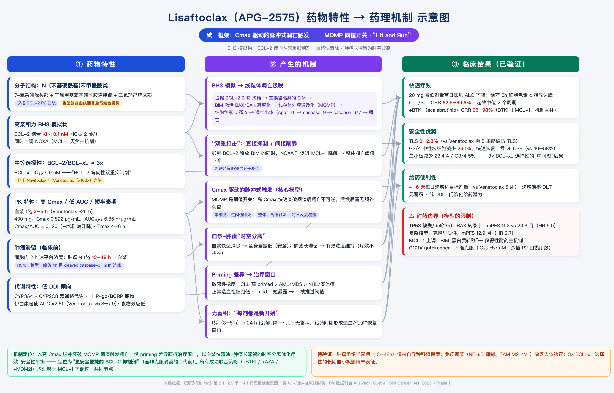

### 整体

1. 对 BCL-2 的结合力（BH3 沟槽）
2. 对 BCL-xL 的亲和力（选择性）

> ps: 不要从分子层面去解释这一切

Lisaftoclax 的全部药理学特征可由一个统一假设解释：**BCL-2 抑制剂的抗肿瘤效应由峰浓度（Cmax）驱动，而非曲线下面积（AUC）**。分子基础在于 MOMP 是阈值开关事件——BH3 模拟物需在线粒体膜上达到足够局部浓度以置换足量 BIM、激活足够 BAX/BAK 形成 MOMP 孔洞；阈值一旦突破，凋亡不可逆，后续暴露无额外获益（"Hit and Run"）。

1. 分子层：BH3 模拟物竞争性破坏 BCL-2:BIM 复合物，释放 BIM 激活 BAX/BAK 依赖性 MOMP；
2. PK 层：高 Cmax 快速突破凋亡阈值；短血浆半衰期（3–5 小时）降低系统毒性；肿瘤组织长滞留（13–48 小时，临床前数据）维持药效；
3. 细胞层：BCL-2 priming 程度决定肿瘤敏感性梯度（CLL > MDS/AML > NHL/实体瘤）；正常造血祖细胞低 primed，构成治疗窗口；
4. 预测层：TP53 缺失/复杂核型为负向预测因子，MCL-1 上调为主要耐药机制。

对单个细胞是"超过阈值即不可逆死亡"，对整体则是"阈值触发 + 每日反复覆盖"。

亚盛的完整论证不是「短半衰期降低 TLS」这么简单，而是：高 Cmax 保证疗效（Cmax 驱动杀伤），短 t½ + 低 AUC 降低累积毒性和血浆滞留。这是一个「疗效靠 Cmax、安全靠低 AUC」的解耦论证，本身是自洽的

#### 从Phase 1到Phase 2的逐步临床验证完全支持该机制模型。

Phase 1数据验证了四大机制预测：肿瘤溶解综合征（TLS）发生率0%（预测：低TLS）、3-4级中性粒细胞减少26.1%且快速恢复（预测：低血液学毒性）、4-6天安全完成剂量递增（预测：短ramp-up）、给药首日即观察到外周血淋巴细胞计数（ALC）下降（预测：快速疗效）。

Phase 2注册性研究（APG2575CC201，n=77）进一步确认：ORR 62.5%，中位无进展生存期（mPFS）23.89个月，30个月总生存率78%。高危亚组分析确定了模型的边界条件——TP53缺失伴复杂核型患者的mPFS缩短至11.2个月（风险比[HR] 5.0），揭示p53作为BAX转录激活因子的关键调控角色。

Lisaftoclax的全部药理学特征可被一个统一的核心假设解释：BCL-2抑制剂的抗肿瘤效应由峰浓度（Cmax）驱动，而非曲线下面积（AUC）。这一假设的分子基础在于线粒体外膜通透化（mitochondrial outer membrane permeabilization, MOMP）本质上是一个阈值开关事件（threshold switch event）——BH3模拟物需要在线粒体膜上达到足够的局部浓度，以竞争性置换足够量的BIM等BH3-only蛋白，从而激活足够数量的BAX/BAK分子形成有效的MOMP孔洞。一旦该阈值被突破，凋亡信号即不可逆转地启动，后续的药物暴露对已触发凋亡的细胞不产生额外获益。

这一"Cmax驱动"假说（Cmax-driven hypothesis）得到了临床前和临床数据的双重支持。机制研究表明，BH3模拟物需要快速达到线粒体阈值以触发凋亡，其效应由细胞穿透速率和最大浓度共同决定。临床I期试验中，即使在最低剂量组（20 mg），Lisaftoclax即观察到外周血淋巴细胞计数（ALC）的快速下降，且ALC反应在首次给药后6小时即可检测到，与Cmax出现时间高度一致。BH3 profiling分析进一步显示，BAD肽诱导的细胞色素c释放与ALC正常化时间呈负相关，提示BCL-2复合物解离的Cmax依赖性。

**图1**展示了Lisaftoclax从竞争性结合BCL-2到最终激活caspase级联反应的完整分子通路。该过程遵循线粒体内源性凋亡通路的标准程序：Lisaftoclax以Ki<0.1 nM的亲和力结合BCL-2的BH3 groove，竞争性置换被隔离的BIM蛋白；BIM从细胞质转位至线粒体外膜，激活BAX/BAK寡聚化；BAX/BAK寡聚体在线粒体外膜形成孔洞结构，导致MOMP和细胞色素c释放；细胞色素c与Apaf-1形成凋亡小体，激活caspase-9和效应caspase-3/7，最终执行细胞凋亡。

### 预测

| 要验证的问题             | 最关键实验                                                   |
| ------------------------ | ------------------------------------------------------------ |
| 是否“短脉冲过阈值即可杀” | CLL 原代细胞或 BCL-2 依赖细胞：2/4/8 小时药物 pulse 后 washout，追踪 24–72 小时凋亡 |
| Cmax 还是 AUC            | 设计相同 AUC、不同峰值和给药时长的方案；再设计相同 Cmax、不同 AUC 的方案 |
| 是否需持续靶点抑制       | washout 后连续测 BCL-2 target engagement、BAX/BAK 激活、MOMP、cleaved caspase-3/7 和 Annexin V/PI |
| 能否外推到患者           | 将个体 `Cmax`、`AUC`、`Ctrough`、`T>有效浓度` 分别与外周 CLL 细胞下降速度、MRD、骨髓反应、ORR/PFS 做模型比较 |

如果短 pulse 后仍有相近的 MOMP、caspase 激活和细胞死亡，且在相同 AUC 下“高峰短暴露”优于低峰长暴露，就可称它偏**阈值/Cmax 驱动**。反过来，若 washout 后细胞恢复、而持续低浓度暴露更有效，则它是**持续暴露或 AUC/T>阈值驱动**。

**表3**总结了基于机制假设的四大临床预测及其对应的药理学基础。

**表3. 基于Cmax驱动模型的四大临床预测**

| 预测编号 | 临床特征    | 机制基础              | 推导逻辑                                 | 预期表现               |
| :------- | :---------- | :-------------------- | :--------------------------------------- | :--------------------- |
| 预测1    | 快速疗效    | Cmax突破MOMP阈值      | 高primed CLL细胞+高Cmax→快速BIM释放→MOMP | ALC给药后6h开始下降    |
| 预测2    | 低TLS风险   | 短暴露减少累积溶解    | 脉冲式杀伤+清除窗口→代谢负荷可控         | TLS发生率<5%           |
| 预测3    | 短ramp-up   | 无蓄积+每日独立暴露   | t1/2<<24h→每日新开始→可快速递增          | 4-6天达目标剂量        |
| 预测4    | 快速ANC恢复 | 低AUC减少骨髓持续毒性 | 恢复窗口内造血再生→无需G-CSF             | G3/4中性粒细胞减少<30% |

表3所列的四大预测构成了Lisaftoclax临床开发的机制驱动假设框架。这些预测并非孤立存在，而是统一源于Cmax驱动的脉冲式凋亡触发模型——高Cmax同时解释了快速疗效（预测1）和脉冲式杀伤模式（预测2），短半衰期同时解释了低TLS风险（预测2）、短ramp-up可行性（预测3）和快速中性粒细胞恢复（预测4）。这一机制的统一性是Lisaftoclax药理学设计的核心科学价值：四个看似独立的临床特征实际上共享同一个分子机制基础，即"高Cmax触发+快速清除"的PK/PD模式。后续章节的临床数据验证将检验这一机制框架的预测准确性。

### 凋亡级联

1. lisaftoclax + BCL-2:BIM → lisaftoclax:BCL-2 + 游离 BIM
2. 游离 BIM → 激活 BAX/BAK → 线粒体外膜通透化（MOMP）→ 细胞色素 c / caspase → 凋亡

### 分子结构

APG-2575（lisaftoclax）属于N-(苯基磺酰基)苯甲酰胺类化合物，分子设计包含三个关键特征：二氟环己烷（difluorocyclohexane）尾部、三氟甲基苯基磺酰胺连接臂和7-氮杂吲哚（7-azaindole）头部基团。APG-2575最初由密歇根大学在2018年专利WO2018/027097中首次公开，亚盛医药获得全球权益并推进临床开发。与venetoclax的哌嗪（piperazine）连接臂和氯苯基P2结合基团相比，APG-2575的二氟环己烷尾部改变了PK特征和P2口袋结合模式——亲和力从venetoclax的Ki < 0.01 nM降至IC50 = 2 nM，但可能改变了耐药突变谱。Sonrotoclax则采用7-氮杂螺[3.5]壬烷刚性螺环连接臂，使(S)-2-(2-异丙基苯基)吡咯烷以"浅而广"模式结合P2口袋，实现KD = 0.046 nM（比venetoclax高24倍）并避免G101V突变的位阻。

### 高亲和力

Lisaftoclax 以 Ki<0.1 nM 的亲和力结合 BCL-2 的 BH3 结合沟槽，竞争性置换被隔离的 BIM 蛋白；BIM 转位至线粒体外膜，激活 BAX/BAK 寡聚化；BAX/BAK 寡聚体形成孔洞导致 MOMP 和细胞色素 c 释放；细胞色素 c 与 Apaf-1 形成凋亡小体，激活 caspase-9 及效应 caspase-3/7，执行细胞凋亡。

### 中等选择性

血小板和巨核细胞存活高度依赖 BCL-xL。Navitoclax 因强 BCL-xL 抑制导致不可接受的血小板减少而终止开发——**选择性决定治疗窗**是 Navitoclax→Venetoclax 的核心教训。但选择性并非越高越好：BCL-2 与 BCL-xL 结构相似，过度追求选择性可能牺牲亲和力。

- **Lisaftoclax**：BCL-2/BCL-xL 选择性约 3 倍（IC50 2 nM vs 5.9 nM），"BCL-2 偏向性双重抑制剂"。血小板减少任何级别 28.8%（Ph1，15/52）、G3/4 13.5%；Ph1b/2 综合（n=176）任何级别 23.4%、G3/4 5%——介于 Navitoclax（>50% G3/4，终止开发）与 Venetoclax（G3/4 36%，选择性 >100 倍）之间，精确反映 3 倍选择性的"中间态"后果。短半衰期降低持续 BCL-xL 抑制，部分抵消风险。
- **Sonrotoclax**：选择性极高（>2000 倍），BCL-2 亲和力也极强，杀伤更剧烈、需更谨慎爬坡。

长期安全性缺口：累积性血小板功能影响在数月至数年长期给药场景中尚未充分表征。AML 联合 AZA 时 ≥3 级血小板减少升至 50–61%（骨髓毒性叠加）。

#### 血小板减少验证：23%发生率——BCL-xL 3倍选择性的临床后果

血小板减少是BCL-2抑制剂选择性谱的"试金石"。BCL-xL在巨核细胞（megakaryocyte）中表达丰富，是血小板生成的关键存活因子。Navitoclax因强效BCL-xL抑制导致严重血小板减少而终止开发；Venetoclax通过>100倍的BCL-2/BCL-xL选择性将G3/4血小板减少控制在36%。Lisaftoclax的BCL-2/BCL-xL选择性仅为约3倍（IC₅₀：2 nM vs 5.9 nM），模型预测其血小板减少发生率应介于Navitoclax与Venetoclax之间。

Phase 1数据证实了这一预测：任何级别血小板减少发生率为28.8%（15/52），G3/4为13.5%（7/52）。在更大规模的Phase 1b/2汇总中，血小板减少发生率为23%（G3/4为5%）。这些数据显著优于Navitoclax（>50% G3/4血小板减少导致停药），但低于Venetoclax的36%（任何级别）。这一"中间态"的血小板减少发生率精确反映了3倍BCL-xL选择性的临床后果：残余的BCL-xL抑制活性足以对巨核细胞产生可检测但可控的影响，而未达到导致治疗中断的严重程度。

**预测→数据→结论**：3倍BCL-xL选择性预测→残余血小板抑制→血小板减少发生率介于VEN与NAV之间 → 任何级别28.8%（vs Venetoclax 36%），G3/4 13.5%，未导致治疗中断 → 预测验证，选择性梯度与毒性呈反比关系确立。

### PK 特性 - 短半衰期

| 参数          | 数值                 | 药理学意义                     | 临床预测              |
| ------------- | -------------------- | ------------------------------ | --------------------- |
| BCL-2 Ki      | <0.1 nM（IC50 2 nM） | 高亲和力确保阈值突破效率       | 低剂量即可触发凋亡    |
| 血浆 t½       | 3–5 h                | 快速清除，减少全身累积         | 低 TLS、短爬坡        |
| 400mg Cmax    | 0.822 μg/mL          | 高 Cmax 突破 MOMP 阈值         | 快速 ALC 下降         |
| 400mg AUC₀₋₂₄ | 6.85 h·μg/mL         | 低 AUC 减少骨髓持续毒性        | 快速中性粒细胞恢复    |
| 肿瘤 t½       | 13–48 h（临床前）    | 肿瘤内持续暴露维持药效         | 疗效不牺牲            |
| 细胞内达平台  | 2 h                  | 快速细胞内积累匹配 Cmax 动力学 | Cmax 转化为线粒体峰值 |
| Tmax          | 4–6 h                | 平衡疗效与安全性               | 给药方案灵活          |

与 venetoclax 对比：Lisaftoclax 400mg 的 Cmax 约为 venetoclax 稳态 Cmax（~2.1 μg/mL）的 39%，而 AUC 仅为其 ~21%（6.85 vs ~32.8 h·μg/mL）——Cmax 降幅（61%）远小于 AUC 降幅（79%），是 Cmax 驱动设计的直接体现；两者临床疗效处于同一数量级（CLL ORR 62.5% vs 79%），直接支持 Cmax 驱动假说。

Phase 1 各剂量 PK（Ailawadhi S, et al. Clin Cancer Res. 2023）：

| 剂量 (mg) | n    | t½ (h)    | Tmax (h) | Cmax (μg/mL) | AUC₀₋₂₄ (h·μg/mL) |
| --------- | ---- | --------- | -------- | ------------ | ----------------- |
| 50        | 1    | 2.84      | 3        | 0.039        | 0.261             |
| 100       | 1    | 3.85      | 6        | 0.229        | 1.80              |
| 200       | 2    | 3.84±0.16 | 4        | 0.294±0.004  | 2.41±0.37         |
| 400       | 8    | 4.43±0.57 | 6 (4–8)  | 0.822±0.334  | 6.85±2.91         |
| 600       | 7    | 4.68±1.03 | 6 (4–8)  | 0.761±0.298  | 7.81±2.84         |
| 800       | 7    | 4.34±0.53 | 4 (4–6)  | 0.982±0.384  | 7.25±2.24         |
| 1000      | 6    | 6.10±1.52 | 8 (6–8)  | 1.69±1.22    | 18.3±13.1         |
| 1200      | 6    | 6.0       | 6 (3–8)  | 1.20±0.48    | 12.3±4.82         |

半衰期全剂量稳定（2.84–6.10 h），证实短半衰期是固有属性；Cmax/AUC 总体剂量比例性增加；高剂量组变异度大提示超治疗剂量时个体吸收差异显著。

**短半衰期（3–5 h，vs venetoclax ~26 h）带来三重安全性优势：**

1. **低 TLS**：脉冲式暴露允许给药间期代谢恢复；venetoclax 长半衰期导致持续细胞溶解、代谢负荷累积（早期开发中曾因 TLS 死亡从快速递增改为 5 周递增）。Lisaftoclax TLS <2%。
2. **中性粒细胞快速恢复**：粒细胞前体表达 BCL-2；短半衰期提供每日"恢复窗口"。G3/4 中性粒减少 26.1%（vs venetoclax 40–50%），无需 G-CSF（venetoclax 约 75% 的 ≥3 级患者需 G-CSF 或剂量调整，72% 经历感染）。
3. **无蓄积**：t½ 远短于 24h 给药间隔，几乎无蓄积（venetoclax 蓄积比 0.8–1.6），降低长期毒性与 DDI。

**快速爬坡**：D1 20mg → D2 50 → D3 100 → D4 200 → D5 400mg，4–6 天达目标剂量（vs venetoclax 5 周每周递增）。每日递增安全性的药理学基础是"每剂都是新开始"。I 期 52 例 CLL 患者零 TLS，5 名 TLS 高风险患者快速爬坡后 ALC 下降 89–99% 而无 TLS。爬坡期 TLS 监测：基线、给药后 6–8h、24h 采血。

**肿瘤滞留（血浆-肿瘤时空分离）**：临床前 RS4;11 模型中，给药后 2h 达肿瘤细胞内平台浓度，肿瘤内滞留 13–48h，远长于血浆。可能机制：肿瘤微环境高蛋白结合、较低清除率、细胞内隔室化。**该数据目前仅来自临床前模型，不能等同于人体组织 PK 结论。**

**高 Cmax/低 AUC**：Cmax/AUC 比值 0.120（400mg），曲线陡峭升降；venetoclax 为 0.064，曲线扁平。

#### 中性粒细胞减少预测验证：G3/4仅26.1%，快速恢复无需G-CSF

中性粒细胞减少是BCL-2抑制剂类效应毒性，其机制在于中性粒细胞前体（promyelocyte、myelocyte）表达BCL-2，依赖其维持存活；BCL-2抑制触发前体凋亡，导致成熟中性粒细胞产出减少。Cmax驱动模型预测Lisaftoclax的低AUC特征可减少对骨髓造血细胞的持续暴露，从而降低中性粒细胞减少的发生率和持续时间。

Phase 1数据显示，CLL/SLL患者中G3/4中性粒细胞减少发生率仅26.1%（6/23可评估患者），显著低于Venetoclax的40–50%。关键差异在于恢复模式：Lisaftoclax组中性粒细胞计数在无粒细胞集落刺激因子（granulocyte colony-stimulating factor, G-CSF）支持下快速恢复并稳定维持，且中性粒细胞减少相关后遗症（发热和感染）未被观察到。作为对比，36–41%的Venetoclax接受者（约占G3/4中性粒细胞减少患者的75%）需要G-CSF支持或剂量调整，且72%的患者经历感染事件。

3例中性粒细胞减少的详细管理案例进一步说明了这一差异的临床意义。1例400 mg组患者在C1出现G3中性粒细胞减少，暂停用药8天后自行恢复至1.15×10⁹/L，无需G-CSF或其他干预即可继续治疗；另1例1200 mg组患者经历G3中性粒细胞减少但无需停药或生长因子支持，中性粒细胞计数稳定维持并持续治疗至C10。

**预测→数据→结论**：低AUC预测→有限骨髓暴露→低中性粒细胞减少+快速恢复 → G3/4发生率26.1%（vs Venetoclax 40–50%），零G-CSF需求，零感染后遗症 → 预测验证。

#### 预测4：快速中性粒细胞恢复——低AUC减少骨髓祖细胞持续毒性

中性粒细胞减少是BCL-2抑制剂的类效应，其机制在于粒细胞前体（myeloblast至metamyelocyte阶段）表达BCL-2，依赖其维持存活。Venetoclax的长半衰期导致这些前体细胞持续暴露于BCL-2抑制环境中，持续的凋亡触发使中性粒细胞计数难以恢复——约75%的≥3级中性粒细胞减少患者需要G-CSF支持或剂量调整。

Lisaftoclax的低AUC特征意味着骨髓祖细胞的暴露时间有限——每日给药后Cmax迅速下降，在两次给药之间存在药物浓度低于有效抑制水平的"恢复窗口"。在这一窗口期内，骨髓中的造血干细胞可以分化为中性粒细胞前体并正常成熟，不受BCL-2抑制的持续干扰。预期Lisaftoclax的中性粒细胞减少发生率和持续时间均低于Venetoclax，且恢复过程无需G-CSF支持。

#### 短半衰期降低全身累积暴露

Lisaftoclax的血浆消除半衰期为3-5小时，远短于Venetoclax的约26小时。短半衰期的核心药理学意义在于限制了全身累积暴露（systemic cumulative exposure），从而减少持续大规模细胞杀伤带来的系统毒性。具体而言，短半衰期设计带来三重安全性优势。

第一，降低肿瘤溶解综合征（tumor lysis syndrome, TLS）风险。TLS的发生依赖于大量肿瘤细胞在短时间内的同步死亡，释放的钾、磷、尿酸等代谢物超过肾脏清除能力。长半衰期药物（如Venetoclax）的持续高暴露导致持续的肿瘤细胞溶解，累积的代谢负荷增加TLS风险——Venetoclax在期开发中因TLS死亡事件被迫将递增方案从快速递增修正为5周递增。Lisaftoclax的脉冲式暴露模式（单次Cmax触发大量杀伤后快速清除）允许机体在药物清除期间恢复电解质和代谢平衡，从而将TLS发生率控制在<2%的水平。

第二，缩短中性粒细胞减少持续时间。中性粒细胞前体（promyelocyte、myelocyte）表达BCL-2，依赖其维持存活。Venetoclax的长半衰期导致持续的BCL-2抑制，中性粒细胞前体持续凋亡，中性粒细胞减少发生率达40-50%，且持续时间长，约75%的≥3级中性粒细胞减少患者需要G-CSF支持或剂量调整。Lisaftoclax的短半衰期使得每日给药后Cmax迅速下降，给予骨髓造血细胞"恢复窗口"，中性粒细胞减少发生率为26.1%且恢复迅速，无需G-CSF支持。

第三，最小化药物蓄积。Venetoclax的蓄积比（accumulation ratio）为0.8-1.6，多次给药后暴露量显著增加；而Lisaftoclax的t1/2远短于给药间隔（24小时），几乎无蓄积，降低了长期毒性和药物相互作用（DDI）风险。

#### 半衰期3-6小时，支持4-6天快速爬坡

APG-2575最显著的特征是短半衰期（3-6小时）配合高Cmax/低AUC的PK曲线。I期临床中400mg给药的Cmax为0.822 μg/mL，AUC0-24为6.85 h·μg/mL，半衰期约4.4小时；venetoclax 400mg稳态Cmax为2.1 μg/mL，AUC0-24为32.8 h·μg/mL，半衰期约26小时。

BCL-2抑制剂的PD机制是Cmax驱动的——需快速达到凋亡阈值触发BAX/BAK依赖性MOMP。

APG-2575的高Cmax确保靶点占据，低AUC限制持续暴露毒性，短半衰期降低蓄积风险，使**4-6天快速爬坡**（20→50→100→200→400mg每日递增）成为可能，对比venetoclax的**5周标准爬坡**。I期研究中52例CLL患者零TLS事件，5名TLS高风险患者完成快速爬坡后ALC下降89-99%而无TLS证据。这一安全性优势归因于高Cmax快速清除肿瘤细胞但低暴露避免累积毒性。

该药物的半衰期约3-5小时，远短于Venetoclax的26小时，导致高Cmax但相对较低的全身暴露。这一独特的PK特征使得APG-2575可以采用每日梯度剂量递增方案，仅需4-6天即可达到目标剂量，而Venetoclax需要5周的每周递增方案。更短的剂量递增周期不仅减少了患者住院监测肿瘤溶解综合征（TLS）的时间和负担，还可能降低医疗系统的直接成本——在中国DRG/DIP支付改革背景下，门诊化给药的医保报销优势尤为突出。在已发表的研究中，APG-2575未发生临床TLS事件，而Venetoclax因TLS黑框警告需要住院监测，这在基层医院和社区医疗中心构成了资源瓶颈。

> PK 药代动力学，研究人体如何处理药物，吸收（进入血液的速度和程度）、分布（药物句你入哪些组织）、代谢（主要由肝酶如何分解）、排泄（经肾脏胆汁排出）。常见指标Cmax：最高血药浓度、**Tmax**：达到最高浓度所需时间、**AUC**：总体药物暴露量、**半衰期 t½**：血药浓度下降一半所需时间
>
> PD 药效动力学，研究药物对人体或疾病产生什么作用，是否结合并抑制靶点  下游生物标志物是否改变  肿瘤细胞是否死亡  缓解率、肿瘤缩小等疗效。常见指标：**Emax**：最大药效、**EC50**：达到最大药效50%时所需浓度
>
> 以 BCL-2 抑制剂为例：
>
> - PK：服用 Venetoclax 或 Lisaftoclax 后，血药峰值、半衰期、是否受 CYP3A 抑制剂影响。  
> - PD：BCL-2 是否被充分抑制、肿瘤细胞凋亡是否增加、外周血或骨髓原始细胞是否下降。

### 肿瘤滞留：血浆肿瘤时空分离

> 该特征的具体机制可能涉及肿瘤微环境的高蛋白结合率、较低的清除率和细胞内隔室化。

1. **肿瘤组织半衰期缺乏人体验证**——13–48h 滞留完全来自异种移植模型，种属差异使外推不确定；需组织 PK 研究（手术样本/骨髓活检）。
2. **免疫调节非经典功能缺乏人体验证**——临床前提示 NF-κB 抑制、TAM M2→M1 极化、pDC 杀伤降低 I 型干扰素，或可增强抗 PD-1/PD-L1 联合敏感性。
3. **3 倍 BCL-xL 选择性的长期安全性**——长期给药（固定疗程 CLL、慢性病管理）下累积性血小板影响未表征。

肿瘤内长半衰期维持药效：血浆清除与肿瘤作用的时空分离

Lisaftoclax 的血浆半衰期约 3–5 小时，显著短于 venetoclax 的约 26 小时。由此形成“高 Cmax、短全身暴露”的 PK 特征

\- 快速达到有效细胞内浓度，触发肿瘤细胞凋亡；

\- 减少持续性骨髓和血小板暴露，降低累积毒性；

\- 预临床肿瘤组织滞留（约 13–48 小时）若能在人体验证，可解释短血浆暴露下的持续药效。

该肿瘤滞留数据目前主要来自临床前模型，不能等同于人体组织 PK 结论。

Lisaftoclax的PK特征中最具药理学创新性的发现是血浆半衰期（3-5小时）与肿瘤组织半衰期（13-48小时）的巨大差异。临床前PK研究显示，在RS4;11荷瘤小鼠中，Lisaftoclax在给药后2小时即达到肿瘤细胞内平台浓度，且肿瘤内滞留时间远长于血浆。这一"血浆快速清除-肿瘤持续作用"的时空分离（spatiotemporal separation）是理解Lisaftoclax疗效与安全性平衡的关键。

肿瘤内长半衰期的具体机制尚不完全清楚，但可能涉及以下因素：肿瘤微环境的高蛋白结合率（药物与肿瘤细胞内蛋白形成可逆结合）、较低的清除率（肿瘤组织的血流灌注和药物代谢酶活性低于血浆），以及细胞内隔室化（intracellular compartmentalization）导致的药物滞留。无论机制如何，这一特征确保了尽管血浆药物浓度在给药后12小时内已降至较低水平，肿瘤组织内的药物浓度仍维持在有效范围内，持续抑制BCL-2并触发凋亡。

**图2**定量展示了Cmax驱动的脉冲式PK/PD模型。上图显示了Lisaftoclax的血浆浓度-时间曲线（t1/2=4小时）、肿瘤浓度-时间曲线（t1/2=24小时，模拟值）和Venetoclax的血浆浓度曲线（t1/2=26小时）的对比。MOMP阈值线（红色虚线）直观展示了Lisaftoclax如何在每次给药后快速突破阈值，随后迅速清除以降低毒性，而肿瘤内的 sustained 暴露维持药效。下图展示了脉冲式凋亡触发模型——每次Cmax脉冲触发一批"全或无"的凋亡事件，累积肿瘤杀伤呈阶梯式上升，每日给药的重复脉冲在恢复窗口期内实现了高效的肿瘤清除。

**表2. Lisaftoclax Cmax驱动脉冲式凋亡模型的关键PK/PD参数**

| 参数             | 数值         | 药理学意义                     | 临床预测                 |
| :--------------- | :----------- | :----------------------------- | :----------------------- |
| BCL-2 Ki         | <0.1 nM      | 高亲和力确保阈值突破效率       | 低剂量即可触发凋亡       |
| 血浆t1/2         | 3-5 h        | 快速清除，减少全身累积暴露     | 低TLS风险，短ramp-up     |
| 400mg Cmax       | 0.822 μg/mL  | 高Cmax快速突破MOMP阈值         | 快速ALC下降              |
| 400mg AUC0-24    | 6.85 h·μg/mL | 低AUC减少骨髓持续毒性          | 快速中性粒细胞恢复       |
| 肿瘤t1/2         | 13-48 h      | 肿瘤内 sustained 暴露维持药效  | 疗效不牺牲               |
| 细胞穿透Tplateau | 2 h          | 快速细胞内积累匹配Cmax动力学   | Cmax有效转化为线粒体峰值 |
| Tmax             | 4-6 h        | 适中的达峰时间平衡疗效与安全性 | 给药方案灵活             |

表2数据的整合分析揭示了Lisaftoclax设计的核心逻辑：通过高靶点亲和力（Ki<0.1 nM）确保MOMP阈值突破的效率，通过高Cmax（0.822 μg/mL）实现快速的阈值突破，通过短血浆半衰期（3-5小时）降低系统毒性，同时通过肿瘤内长半衰期（13-48小时）维持抗肿瘤效果。2小时的细胞内平台期达成时间确保了Cmax能够有效转化为线粒体局部的药物峰值，构成了"脉冲式触发"模型的细胞基础。

### 低 DDI

- Lisaftoclax 主要由 **CYP3A4 + CYP2C8 双通路代谢**，**不是 P-gp/BCRP 底物**，半衰期约 5h。
- 强 CYP3A 抑制剂伊曲康唑使其 Cmax 增至 ~1.82 倍、AUC 增至 ~2.61 倍——DDI 相对较小但绝非没有；中国说明书仍建议避免与强效 CYP3A 抑制剂/诱导剂合用。
- 对比 venetoclax：CYP3A4 代谢 + P-gp/BCRP 底物，强 CYP3A4 抑制剂使其 AUC 增加 5.8–7.9 倍（酮康唑 +540% 即 6.4 倍；利托那韦 +690% 即 7.9 倍）；CLL/SLL 爬坡期与强 CYP3A 抑制剂联用属禁忌。血液肿瘤患者常用唑类抗真菌药，此为现实痛点。
- 食物效应远低于 venetoclax（后者高脂餐使 Cmax 增 3–5 倍）。
- 与 acalabrutinib 或利妥昔单抗联合未观察到临床显著 DDI（利妥昔单抗为单抗，本就不经 CYP 代谢；acalabrutinib 总活性组分暴露变化 <6%）。
- 注意区分 DDI 方向：sonrotoclax 结构优化降低的是其"作为肇事药抑制其他药物代谢"的能力，不等于其作为 CYP 底物不受抑制剂影响。
- 严谨表述：多通路代谢和非 P-gp/BCRP 底物特征可能降低部分 DDI 风险；短半衰期有助于减少蓄积、提高停药后可控制性。但半衰期短本身不能证明强抑制剂造成的 AUC 增幅一定小——DDI 大小取决于 CYP3A4 占总清除比例、替代途径、首过效应、抑制剂强度与持续时间、治疗窗。

Lisaftoclax与acalabrutinib联合使用未观察到临床上显著的药物-药物相互作用（drug-drug interaction, DDI）。Acalabrutinib作为CYP3A底物，其与CYP3A抑制剂联用时总活性组分（acalabrutinib加活性代谢物ACP-5862）的暴露变化在6%以内。Lisaftoclax同样经CYP3A4代谢，但短半衰期意味着药物在体内的总暴露时间短，DDI的累积效应有限。无DDI的特征使联合方案的临床实施更为简便，无需复杂的剂量调整或监测方案。作为对比，Venetoclax与ibrutinib联合使用时存在DDI风险，需要关注CYP3A4调节剂的相互作用。

#### 药物相互作用谱：低CYP3A4/P-gp依赖性

2575走CYP3A4 + CYP2C8 双代谢，且不走 P-gp/BCRP，泊沙康唑强效 CYP3A4 抑制剂，还抑制 P-gp（P-糖蛋白）。

Venetoclax是CYP3A4和P-gp双重底物，**强效CYP3A4抑制剂使其AUC增加5.8-7.9倍**——利托那韦使AUC增加7.9倍，爬坡期与强效CYP3A4抑制剂联用属禁忌。这对血液肿瘤患者尤为棘手，因为唑类抗真菌药是预防和治疗侵袭性真菌感染的标准用药。APG-2575的短半衰期和低系统暴露赋予其DDI优势：与acalabrutinib或利妥昔单抗联合未观察到DDI；虽经由CYP3A代谢，3-5小时半衰期显著降低了相互作用严重程度和持续时间。此外，APG-2575的食物效应远低于venetoclax（后者高脂餐使Cmax增加3-5倍），简化了用药指导。Sonrotoclax通过trans-(1r,4r)-4-(氨甲基)-1-甲基环己烷-1-醇尾部设计显著降低CYP抑制活性。三种药物均实现了对venetoclax代谢安全性的超越，这是社区医疗广泛采用的先决条件。

可以先把 CYP 和 P‑gp/BCRP 想成两套不同的“清除关卡”：

- CYP3A4、CYP2C8 是代谢酶，负责把药物化学分解。
- P‑gp、BCRP 是外排转运蛋白，主要把药物泵回肠腔或排出细胞。
- “底物”表示药物会被这套系统处理；“抑制剂”表示药物会堵住这套系统。

APG‑2575 即利沙托克拉（lisaftoclax）。说明书资料显示：

- 主要由 CYP3A4 和 CYP2C8 代谢；
- 不是 P‑gp 或 BCRP 底物；
- 半衰期约5小时。

因此，泊沙康唑虽然同时抑制 CYP3A4 和 P‑gp，但对利沙托克拉而言：

- P‑gp 抑制基本没有直接影响，因为它不走 P‑gp；
- CYP3A4 抑制仍然有影响；
- CYP2C8 可能提供一条未被堵住的替代代谢通路，所以不像主要依赖 CYP3A4 的药物那样容易出现极端暴露升高。

但不能写成“泊沙康唑不影响 APG‑2575”。在健康受试者中，强 CYP3A 抑制剂伊曲康唑使利沙托克拉：

- Cmax 增至约1.82倍；
- AUC 增至约2.61倍。

也就是说，DDI相对较小，但绝不是没有；目前中国说明书仍建议避免与强效 CYP3A 抑制剂或诱导剂合用。

Venetoclax：

- 主要经 CYP3A4 代谢；
- 同时是 P‑gp、BCRP 底物。

强 CYP3A/P‑gp 抑制剂相当于同时降低其代谢和肠道外排，可能使暴露显著升高。例如：

- 酮康唑使 AUC 增加540%，即达到原来的约6.4倍；
- 利托那韦使 AUC 增加690%，即达到原来的约7.9倍。

注意“增加690%”和“增加7.9倍”不是同一表达：前者等于最终为原来的7.9倍。

对 CLL/SLL，泊沙康唑或其他强 CYP3A 抑制剂在起始及爬坡期属于禁忌。AML 的管理方案又不同，不能笼统写成所有患者爬坡期都禁用。

半衰期短本身不能证明强抑制剂造成的 AUC 增幅一定小。DDI大小主要取决于：

- CYP3A4 占总清除的比例；
- CYP2C8 等替代清除途径；
- 肠道首过效应；
- 抑制剂的强度和持续时间；
- 药物治疗窗。

而且泊沙康唑仍在持续给药时，抑制不会因为底物原本半衰期短就自动消失。所以更准确的说法是：

> 利沙托克拉的多通路代谢和非 P‑gp/BCRP 底物特征，可能降低部分 DDI 风险；短半衰期则有助于减少蓄积并提高停药后的可控性。

利妥昔单抗属于单克隆抗体，本来就不是典型 CYP 代谢药物，因此和 lis 无 CYP 型 DDI 并不意外。

这里说的是 sonrotoclax 作为“肇事药”抑制其他药物代谢的能力降低；不等于它作为“受害药”不会被 CYP3A 抑制剂影响。两种 DDI 方向必须分开：

- 药物抑制 CYP → 影响其他药；
- 药物是 CYP 底物 → 被其他抑制剂影响。

与 venetoclax 相比，利沙托克拉通过 CYP3A4/CYP2C8 多通路代谢且不是 P‑gp/BCRP 底物，在机制上减少了转运体介导的 DDI，并使强 CYP3A 抑制剂造成的暴露增幅相对较小；但伊曲康唑仍可使其 AUC 增至约2.6倍，现行说明书仍建议避免与强 CYP3A 抑制剂合用。Sonrotoclax 的结构优化降低了其自身抑制 CYP 酶、进而影响其他药物的潜力，但不能据此排除其作为 CYP 底物发生 DDI。现有资料支持这些新一代药物在部分药代特征上有所改进，但尚不足以概括为全面超越 venetoclax 的“代谢安全性”。

### Noxa上调

RS4;11 异种移植模型中，单次口服后 4 小时即检测到 cleaved caspase-3 诱导，24 小时达峰，伴 PARP-1 切割。此外 lisaftoclax 还上调 NOXA（MCL-1 的天然拮抗剂），形成"直接抑制 BCL-2 + 间接削弱 MCL-1"的双重打击。

#### del(17p)/TP53突变患者ORR 66.7%——初步提示TP53不完全阻断BCL-2抑制剂活性

3例携带del(17p)/TP53突变的患者中2例达到PR，ORR为66.7%。del(17p)是CLL中最具侵袭性的遗传学异常，TP53缺失导致细胞周期阻滞和凋亡执行受损，传统化疗在此类患者中的缓解率极低。BCL-2抑制剂的理论优势在于其绕过TP53直接作用于线粒体凋亡通路的下游节点。66.7%的ORR初步证实了这一机制假设：即使TP53功能缺失，BCL-2抑制释放的BIM/PUMA仍可在一定程度上激活BAX/BAK，完成不完全但可测量的凋亡级联。

然而，需要指出的是，Phase 1中del(17p)/TP53亚组的样本量极小（N=3），且66.7%的ORR虽高于传统化疗，但低于非TP53突变患者。后续Phase 2数据将揭示这一亚组的缓解持续时间是否同样受到影响——若PFS显著短于非突变组，则提示TP53缺失虽不完全阻断BCL-2抑制剂的活性，但可能限制其疗效深度和持久性。

### Cmax 驱动

药物快速达到足以跨越线粒体凋亡阈值的峰浓度，释放 BIM 并激活 BAX/BAK，触发不可逆的 MOMP；随后短血浆暴露限制正常组织持续受药，肿瘤组织滞留则可能维持疗效。该模型可解释早期 ALC 下降、0% TLS、4–6 天 ramp-up 及相对可控的血液学毒性

假设：BCL-2 抑制的关键不是持续累积暴露，而是短时间内跨越凋亡阈值的峰浓度。MOMP 属于阈值型、不可逆事件；一旦足量 BIM 被释放并形成 BAX/BAK 孔道，后续维持高浓度的边际收益可能有限。

isaftoclax的t1/2为3-5小时，400 mg Cmax为0.822 μg/mL，AUC0-24为6.85 h·μg/mL；Venetoclax的t1/2为26小时，400 mg稳态Cmax约为2.1 μg/mL，AUC0-24约为32.8 h·μg/mL。Lisaftoclax的AUC仅为Venetoclax的约21%，但两者的临床疗效处于同一数量级（CLL ORR 62.5% vs 79%），这直接支持了Cmax驱动假说——疗效由峰值浓度能否突破MOMP阈值决定，而非累积暴露量。

**表2.1 Lisaftoclax Phase 1研究各剂量水平PK参数汇总**

| 剂量 (mg) | 受试者数 |  t₁/₂ (h)   | Tmax (h) | Cmax (μg/mL)  | AUC₀₋₂₄ (h·μg/mL) |
| :-------: | :------: | :---------: | :------: | :-----------: | :---------------: |
|    50     |    1     |    2.84     |    3     |     0.039     |       0.261       |
|    100    |    1     |    3.85     |    6     |     0.229     |       1.80        |
|    200    |    2     | 3.84 ± 0.16 | 4 (4–4)  | 0.294 ± 0.004 |    2.41 ± 0.37    |
|    400    |    8     | 4.43 ± 0.57 | 6 (4–8)  | 0.822 ± 0.334 |    6.85 ± 2.91    |
|    600    |    7     | 4.68 ± 1.03 | 6 (4–8)  | 0.761 ± 0.298 |    7.81 ± 2.84    |
|    800    |    7     | 4.34 ± 0.53 | 4 (4–6)  | 0.982 ± 0.384 |    7.25 ± 2.24    |
|   1000    |    6     | 6.10 ± 1.52 | 8 (6–8)  |  1.69 ± 1.22  |    18.3 ± 13.1    |
|   1200    |    6     |      6      | 6 (3–8)  |  1.20 ± 0.48  |    12.3 ± 4.82    |

*数据来源：Ailawadhi S, et al. Clin Cancer Res. 2023。Tmax列中括号内为范围；200 mg组数据以均值±标准差表示。*

表2.1的数据揭示了三个关键特征。第一，半衰期（t₁/₂）在所有剂量水平保持稳定，均值4–5小时（范围2.84–6.10小时），证实短半衰期是Lisaftoclax的固有PK属性而非剂量依赖性现象。第二，Cmax和AUC₀₋₂₄总体呈剂量比例性增加，从50 mg的0.039 μg/mL和0.261 h·μg/mL递增至1200 mg的1.20 μg/mL和12.3 h·μg/mL，表明药物在测试剂量范围内具有可预测的线性药代动力学特征。第三，高剂量组（1000 mg和1200 mg）的PK参数变异度较大（Cmax的相对标准差分别为72%和40%），提示个体间吸收或首过代谢差异在超治疗剂量时可能更为显著。

与Venetoclax的PK参数进行跨研究比较（图2.1），Lisaftoclax在400 mg剂量下的Cmax为0.822 μg/mL，约为Venetoclax稳态Cmax（约2.1 μg/mL）的39%；而其AUC₀₋₂₄（6.85 h·μg/mL）仅为Venetoclax（约32.8 h·μg/mL）的21%。这一"高Cmax/低AUC"的相对特征——即Cmax的降幅（61%）远小于AUC的降幅（79%）——是Cmax驱动设计的直接药理学体现。

Cmax驱动模型的核心预测之一是：Lisaftoclax的PK profile应呈现相对较高的Cmax与相对较低的AUC比值（Cmax/AUC），即药物在达峰后快速清除，有限延长暴露时间。这一预测在所有剂量水平均得到一致验证。以400 mg剂量为例，Lisaftoclax的Cmax/AUC比值为0.120 μg/mL per h·μg/mL，按照t₁/₂≈4.5小时推算，其暴露-时间曲线呈现陡峭上升、快速下降的特征形态。相比之下，Venetoclax的t₁/₂为26小时，其Cmax/AUC比值约为0.064，曲线形态更为扁平，意味着药物在血浆中维持较长时间的持续暴露。

临床前数据为这一PK特征提供了更深层的机制解释：Lisaftoclax在给药后2小时内即达到肿瘤细胞内平台浓度，而肿瘤组织内的半衰期（13–48小时）显著长于血浆半衰期（约6小时）。这种"血浆快速清除-肿瘤持续作用"的时空分离（spatial-temporal dissociation）意味着，短血浆半衰期并不牺牲肿瘤组织内的药效学效应，同时通过减少血浆中持续高暴露降低了系统毒性。

**预测→数据→结论**：Cmax驱动模型预测Lisaftoclax应呈现高Cmax/低AUC的PK profile → Phase 1全部8个剂量队列的系统PK分析确认Cmax和AUC呈剂量比例性增加，t₁/₂稳定在3–5小时，400 mg剂量下AUC仅为Venetoclax的21%而Cmax维持其39% → Cmax驱动假设的PK基础在临床中得到确认。

| 预测编号 | 机制预测                                                   | Phase 1/1b临床数据                                           | 验证状态 |
| :------: | :--------------------------------------------------------- | :----------------------------------------------------------- | :------: |
|    P1    | 短半衰期→脉冲式杀伤→低TLS风险                              | TLS发生率0%（N=52）；扩大样本3%（5/176），均为轻中度         |  ✅ 验证  |
|    P2    | 低AUC→有限骨髓暴露→低中性粒细胞减少                        | G3/4中性粒细胞减少26.1%（6/23），快速恢复，无需G-CSF         |  ✅ 验证  |
|    P3    | 每日递增=新开始→无蓄积→短ramp-up可行                       | 4–6天安全达到目标剂量，零DLT，MTD未达                        |  ✅ 验证  |
|    P4    | BCL-xL 3倍选择性→残余血小板抑制→血小板减少介于VEN与NAV之间 | 血小板减少28.8%（任何级别），G3/4为13.5%；Venetoclax G3/4为36% |  ✅ 验证  |

*数据来源综合：Ailawadhi S, et al. Clin Cancer Res. 2023；Cancer Network ASCO 2021；CLL Society 2025。G-CSF：粒细胞集落刺激因子；VEN：Venetoclax；NAV：Navitoclax。*

样本量与对高危亚组的研究：CLL/SLL单药研究（APG2575CC201; NCT05147467）和AML/MDS联合研究（APG2575AU101; NCT04964518）两个独立数据集

**表3.1**呈现了该研究的核心基线特征。研究人群的难治性程度显著高于既往BCL-2抑制剂注册试验：中位既往治疗线数为3线（范围1–10线），45.5%的患者同时失败于布鲁顿酪氨酸激酶抑制剂（Bruton's tyrosine kinase inhibitor, BTKi）和化学免疫治疗，87%存在BTKi耐药。高危遗传学特征极为突出——39%携带del(17p)/TP53突变，42.9%具有复杂核型（complex karyotype, CK），53.2%为IGHV未突变（unmutated IGHV, uIGHV）。这一人群基线较Venetoclax的关键注册试验MURANO（仅2.6%有BCRi暴露，中位既往1线治疗）和M14-032（中位既往5线，但49% del(17p)）更具挑战性。

**表3.1 APG2575CC201研究基线特征与关键注册试验人群对比**

| 参数              | APG2575CC201 (Lisaftoclax) | M14-032 (Venetoclax) | MURANO (Venetoclax-R) |
| :---------------- | :------------------------- | :------------------- | :-------------------- |
| 样本量            | 77例（72例可评估）         | 91例                 | 389例                 |
| 中位年龄          | 63岁（37–84）              | 67岁                 | 64岁                  |
| 中位既往线数      | 3线（1–10）                | 5线（1–12）          | 1线                   |
| BTKi耐药比例      | 87%                        | 74%                  | 2.6%                  |
| BTKi+化疗双重失败 | 45.5%                      | 未报告               | 不适用                |
| del(17p)/TP53突变 | 39%                        | 49% del(17p)         | 27% del(17p)          |
| 复杂核型          | 42.9%                      | 未报告               | 7.2%（≥5 CNA）        |
| IGHV未突变        | 53.2%                      | 86%                  | 68.3%                 |
| ECOG ≥2           | 31.2%                      | 未报告               | 未报告                |
| 给药方案          | 600mg QD, 5天递增          | 400mg QD, 5周递增    | 400mg QD, 5周递增+R   |

数据来源：缩写：CNA，拷贝数异常；R，rituximab；QD，每日一次。

表3.1的对比揭示了一个关键事实：Lisaftoclax Phase 2研究入组了BCL-2抑制剂开发史上最具挑战性的CLL人群之一。45.5%的双重失败率和87%的BTKi耐药比例意味着这些患者在BCR信号通路抑制和DNA损伤诱导两条独立通路治疗后均发生进展，理论上仅保留凋亡调控通路（BCL-2抑制）作为有效靶点。这一人群特征既是机制验证的理想场景——若BCL-2抑制确实为独立作用通路，则此类患者仍应获益——也为后续高危亚组分析提供了充足的检验效力。

#### 20 mg最低剂量即观察到ALC下降——支持Cmax阈值假说而非AUC累积假说

绝对淋巴细胞计数（absolute lymphocytic count, ALC）的动态变化是BCL-2抑制剂药效学（pharmacodynamics, PD）的核心生物标志物。在Lisaftoclax Phase 1研究中，一个具有决定性意义的观察是：ALC降低在最低评估剂量20 mg和给药首日即被检测到。这一观察直接区分了两种 competing 的药效学假说——Cmax阈值假说（效应依赖于单次给药的峰浓度是否超过触发线粒体外膜通透化阈值）与AUC累积假说（效应依赖于持续暴露的累积量）。

若AUC累积假说成立，20 mg剂量产生的AUC₀₋₂₄仅为0.261 h·μg/mL，理论上不足以产生可检测的生物学效应。然而，临床观察到的首日ALC下降表明，即使这一极低剂量下的Cmax（0.039 μg/mL）也足以部分触发BCL-2依赖的凋亡通路。这与BCL-2抑制剂的作用机制一致：MOMP（mitochondrial outer membrane permeabilization）是一个阈值开关事件（all-or-none event），一旦游离药物浓度超过释放BIM/BAX复合物所需的阈值，即触发不可逆转的caspase级联反应。

BH3 profiling数据进一步支持了Cmax依赖的PD模式。使用BAD肽（选择性检测BCL-2依赖性）诱导的cytochrome c释放与ALC正常化时间呈负相关，即BCL-2复合物解离越充分，ALC恢复越快。BIM肽（检测整体线粒体priming状态）诱导的cytochrome c释放在C1D1给药后6小时出现短暂峰值，随后逐渐下降，至C1D28显著降低。这一动态模式与Cmax的出现时间（Tmax 4–6小时）高度吻合，进一步证实药效峰值与药代动力学峰值同步。

**预测→数据→结论**：Cmax阈值假说预测最低有效剂量可在极低AUC下产生PD效应 → 20 mg剂量首日即观察到ALC下降，BH3 profiling显示C1D1给药后6小时cytochrome c释放达峰 → 药效由Cmax驱动而非AUC累积，Cmax阈值假说成立。

第1章基于Cmax驱动模型推导出四项安全性预测：（1）低TLS风险；（2）低中性粒细胞减少发生率伴快速恢复；（3）短ramp-up时间可行；（4）血小板减少发生率介于Venetoclax与Navitoclax之间。Phase 1/1b数据为这四项预测提供了逐一验证。

#### 细胞层：BCL-2 priming决定肿瘤敏感性梯度

BCL-2 priming（线粒体敏化/预备状态）概念为理解Lisaftoclax的肿瘤类型依赖性疗效提供了核心理论框架。Priming是指细胞线粒体距离凋亡阈值的接近程度——高primed状态的细胞表达较高水平的促凋亡蛋白（BIM、BID、PUMA），这些蛋白被抗凋亡蛋白隔离，形成"定时炸弹"状态。BH3 profiling功能性检测通过将合成BH3肽暴露于分离的线粒体，定量评估细胞的priming状态。

不同肿瘤类型的BCL-2 priming程度存在显著差异，形成了Lisaftoclax疗效的敏感性梯度。CLL被认为是最BCL-2依赖的血液恶性肿瘤之一，其白血病细胞高度primed且主要依赖BCL-2维持存活。这一特征解释了CLL/SLL中62.5%的ORR——高度primed的癌细胞在短暂的Cmax峰值下即可被推动越过凋亡阈值。AML/MDS的priming程度次之，BCL-2依赖性与MCL-1依赖性共存，因此单药疗效有限（ORR 43.2%），但与阿扎胞苷（azacitidine, AZA）联合后ORR提升至64%——AZA通过上调NOXA促进MCL-1降解，增强了BCL-2依赖性。NHL亚型和实体瘤的BCL-2 priming程度低，且存在更强的MCL-1和BCL-xL代偿机制，因此对Lisaftoclax单药不敏感。

正常细胞的低priming状态构成了Lisaftoclax的治疗窗口。正常造血祖细胞虽然也表达BCL-2，但其priming水平低且有MCL-1等替代抗凋亡蛋白的补偿机制。短半衰期设计进一步放大了这一窗口——短暂的Cmax脉冲不足以推动低primed的正常细胞越过凋亡阈值，但对高primed的癌细胞已足够。这一"primed状态差异性"是BH3模拟物类药物安全性的通用基础。

#### Ramp-up预测验证：4–6天安全完成——无DLT，MTD未达到

快速剂量递增的可行性是Cmax驱动模型最具临床转化价值的推论之一。基于短半衰期=无蓄积的药理学原理，模型预测Lisaftoclax可在4–6天内安全完成剂量递增，因为每日给药时前日药物已基本清除，不会因蓄积导致不可预测的暴露叠加。

Phase 1研究的实际递增方案为D1 20 mg → D2 50 mg → D3 100 mg → D4 200 mg → D5 400 mg → 目标剂量，患者在5天内达到400 mg或更高剂量。递增期间的TLS监测方案为基线、给药后6–8小时和24小时采血。在全部44例经历剂量递增的患者中，零例DLT，MTD在最高测试剂量1200 mg仍未达到。这一结果与Venetoclax的历史经验形成强烈反差：Venetoclax在20 mg起始剂量下即发生TLS死亡，被迫将初始剂量从50 mg降至20 mg并引入5周递增。

**预测→数据→结论**：Cmax驱动模型预测短半衰期→无蓄积→每日递增安全 → 8个剂量队列、44例递增期患者零DLT，MTD在1200 mg未达 → 预测验证，4–6天ramp-up方案确立。

#### CLL/SLL ORR 63.6%——BCL-2高依赖肿瘤的快速响应

在22例可评估R/R CLL/SLL患者中，14例达到部分缓解（partial response, PR），客观缓解率（objective response rate, ORR）为63.6%，无完全缓解（complete response, CR）报告。42.9%（9/21）的患者经历≥70%的淋巴结和脾脏缩小。这一ORR水平在Phase 1单药研究中具有竞争力：作为参照，Venetoclax Phase 1单药ORR为79%（但入组人群风险特征不同），而Lisaftoclax的入组患者包含更高比例的BTKi失败和高危遗传学亚组。

从机制角度，CLL/SLL是BCL-2高依赖性肿瘤——BH3 profiling数据显示BCL-2是CLL细胞中的主要抗凋亡蛋白，BAD肽（0.05 μM）即可诱导25–50%的线粒体cytochrome c释放，而其他BH3肽在5 μM浓度下的诱导效率远低于BAD肽。这一高BCL-2依赖性解释了为何即使短暴露（低AUC）的Lisaftoclax也能产生显著的抗肿瘤活性：肿瘤细胞的高priming状态降低了触发MOMP所需的暴露阈值。

**预测→数据→结论**：Cmax驱动模型预测高Cmax可在BCL-2高依赖肿瘤中触发有效凋亡 → CLL/SLL ORR 63.6%，淋巴结/脾脏快速缩小 → Cmax驱动的抗肿瘤活性得到初步验证。

#### 起效时间中位2个周期——支持Cmax驱动的快速凋亡触发

中位至缓解时间（time to response, TTR）为2个周期（范围2–8），这一快速起效特征与Cmax驱动的凋亡触发机制一致。BCL-2抑制剂通过直接释放BIM/BAX/BAK触发caspase级联反应，诱导细胞在数小时内进入凋亡程序，无需基因转录或蛋白质合成的时间延迟。因此，临床疗效的显现速度主要取决于肿瘤负荷和药物达到MOMP阈值的能力，而非累积暴露时间。中位2个周期的TTR与Venetoclax的2–3个周期相当，证实Cmax驱动的"脉冲式"药效在起效速度上不劣于持续高暴露模式。

ALC动态变化为快速起效提供了更精细的时间分辨率。56%的患者在4–6天ramp-up结束时ALC已恢复正常水平，C1结束时该比例升至58%，C2结束时达65%。ALC在首次给药后24小时内的快速下降是肿瘤细胞对Cmax的即时响应，这一早期药效学信号预测了后续的结构化缓解。

Phase 1/1b研究的系统数据为Cmax驱动模型提供了首次临床验证。四大安全性预测全部得到确认：TLS零发生率（P1）、G3/4中性粒细胞减少26.1%且快速恢复（P2）、4–6天ramp-up零DLT（P3）、血小板减少发生率介于Venetoclax与Navitoclax之间（P4）。PK数据验证了"高Cmax/低AUC"的设计目标在所有剂量水平的一致实现。疗效数据初步证实Cmax驱动的抗肿瘤活性具有临床相关性（CLL/SLL ORR 63.6%，中位TTR 2个周期）。联合用药数据从机制上验证了MCL-1下调作为协同策略的核心节点。

Cmax驱动模型的初步成立意味着BCL-2抑制剂的药效学可以被重新概念化为一个阈值触发事件而非浓度累积效应。这一概念转变具有实践意义：它解释了为何短半衰期不牺牲疗效（因为凋亡一旦触发即不可逆转），同时通过减少持续暴露显著改善安全性。每日给药重复"脉冲式触发-快速清除"的循环，在肿瘤组织中维持有效的BCL-2抑制，同时给予正常组织（尤其是骨髓造血细胞）每日的恢复窗口。

尽管四大预测全部验证，Phase 1数据也揭示了Cmax驱动模型的解释边界。del(17p)/TP53突变患者66.7%的ORR（2/3）虽高于传统化疗，但低于非TP53突变患者的预期水平。后续Phase 2数据将进一步确认这一趋势：若TP53突变患者的缓解持续时间显著短于野生型，则表明Cmax驱动模型需要补充TP53状态作为疗效修饰因子。

从机制层面，p53不仅是细胞周期调控因子，还直接参与BAX转录激活和线粒体外膜通透化的正向调控。TP53缺失时，BCL-2抑制释放的BIM/PUMA可能不足以在没有p53协助的情况下充分激活BAX/BAK的寡聚化和MOMP。这意味着Cmax驱动的BCL-2抑制虽能触发凋亡级联的启动，但TP53缺失可能限制该级联的充分执行，导致疗效"打折扣"。这一发现提示，TP53/del(17p)患者可能需要更强的联合策略（如+BTKi下调MCL-1，或+HMA上调NOXA）以补偿p53功能缺失，而非单纯依赖BCL-2抑制剂单药的Cmax脉冲。这一机制修正将在第3章Phase 2的高危亚组分析中得到更系统的验证。

#### 高Cmax快速突破线粒体凋亡阈值

Lisaftoclax被设计为具有高Cmax特征——在400 mg剂量下，单次给药后Cmax可达0.822 μg/mL，Tmax为4-6小时。高Cmax确保药物在到达肿瘤组织后，能够在短时间内达到足够的游离浓度以克服BCL-2的结合容量，快速突破MOMP阈值。临床前数据显示，Lisaftoclax进入恶性细胞迅速，2小时即达到细胞内平台浓度，与快速的凋亡诱导动力学一致。

在RS4;11异种移植模型中，单次口服Lisaftoclax后4小时即检测到cleaved caspase-3的快速诱导，24小时达峰，伴随PARP-1切割。这一快速动力学响应证实了高Cmax能够在体内有效转化为线粒体局部的药物峰值，触发不可逆的凋亡级联反应。与之相比，Venetoclax虽然稳态Cmax更高（约2.1 μg/mL），但其达到峰值的时间更长（5-8小时），且由于长半衰期（26小时）导致的持续高暴露，增加了对正常组织的毒性。

## 低 TLS

TLS的风险取决于两个变量：单次给药后的肿瘤细胞杀伤速度和药物持续暴露导致的累积代谢负荷。Lisaftoclax的短半衰期意味着，即使单次Cmax触发了大量肿瘤细胞凋亡，药物在24小时内已基本清除，不会导致持续的、不断扩大的细胞溶解。这为机体提供了代谢缓冲窗口——在下一剂给药前，肾脏有足够时间清除第一波凋亡释放的代谢物。

与之形成对照的是，Venetoclax的长半衰期（26小时）意味着首剂给药后药物持续存在数天，持续的BCL-2抑制导致连续的细胞溶解，累积的代谢负荷显著增加了TLS风险。这一机制推导解释了为何Venetoclax在早期开发中因快速递增导致TLS死亡事件后被迫改为5周递增方案，而Lisaftoclax能够在4-6天快速递增方案下将TLS发生率控制在<2%。

以TLS风险为例：分子层（MOMP阈值突破效率→快速杀伤）、PK层（短t1/2→脉冲式暴露→代谢恢复窗口）和临床层（4-6天快速ramp-up→TLS 0-3%）形成完整的因果链。再以中性粒细胞减少为例：分子层（BCL-2在粒细胞前体表达）、PK层（短t1/2→给药间期恢复窗口）和细胞层（低primed正常细胞→短暂暴露不触发凋亡）三者汇聚至同一临床结局——低发生率、快速恢复的中性粒细胞减少。

### 无蓄积

R/R AML 数据：**14 天间歇给药 ORR 50%、CR 37.5% vs 28 天持续给药 ORR 39%、CR 28%**。

机制解释（间歇给药优化假说）：持续 BCL-2 抑制可能增加对正常造血干细胞的毒性（中性粒细胞减少）并驱动 MCL-1/BCL-xL 代偿性上调；间歇给药（14 天开/14 天关）允许正常造血恢复窗口、减少代偿机制激活、维持肿瘤细胞对 BCL-2 抑制的"成瘾性"。

## 耐药机制

**TP53 缺失/del(17p)——最强负向预测因子**：p53 是 BAX 的转录激活因子；TP53 缺失时 BAX 基线转录降低，即使 BIM/PUMA 被释放也不足以突破 MOMP 阈值——并非 BCL-2 靶点失效，而是下游凋亡执行通路削弱。mPFS 11.2 vs 29.6 个月（HR 5.0，P=.018），但非完全无效（BTKi+化疗双重失败后仍有约 1 年 PFS）。

初始机制模型假设BCL-2抑制的疗效主要取决于Cmax是否突破MOMP阈值，但未充分考虑下游凋亡执行通路的完整性。Phase 2数据明确显示，TP53缺失（HR 5.0; P=.018）和高复杂核型（HR 2.7; P=.001）是独立的PFS缩短预测因子。

**复杂核型（CK）——独立预后因子**：高 CK（≥5 种异常）mPFS 12.9 vs 25.7 个月（HR 2.7，P=.001）。机制是基因组不稳定性驱动的克隆异质性——非 BCL-2 依赖亚克隆在治疗压力下选择性扩增。TP53 限制凋亡通量的"深度"，CK 限制靶向治疗的"广度"。

**MCL-1 上调——获得性耐药主机制**：BIM 从 BCL-2 到 MCL-1 的"蛋白质转移"是耐药标志；MCL-1 经 RAS/MAPK（增强稳定性）和 PI3K-AKT（磷酸化稳定化）上调。对所有 BCL-2 抑制剂具类效应意义。

AML/MDS数据提供了关键验证：所有成功的联合策略——+BTKi（ORR 96.6%）、+HMA（R/R AML ORR 43.2%）、+MDM2抑制剂（临床前克服耐药）——均通过不同上游机制汇聚于MCL-1下调或BCL-2依赖性增强。BTKi通过抑制MCL-1转录增强BCL-2依赖性；HMA通过NOXA上调促进MCL-1降解；MDM2抑制剂通过p53激活上调NOXA转录。

这一发现统一了联合用药的设计原则：联合药物必须能够降低MCL-1功能或增加BCL-2 priming。该原则具有跨适应症的普适性——从CLL到AML再到MDS，MCL-1是BCL-2抑制剂联合策略的共同汇聚节点。

**G101V gatekeeper 突变**：约 43.5% 的 venetoclax 临床进展病例检出。Lisaftoclax 对 G101V 的 biochemical IC50 ~57 nM（细胞 ~161 nM），**差于** venetoclax 的 ~25–29 nM——两者均不能克服 gatekeeper 突变。Lisaftoclax 在 venetoclax 经治患者中的活性（AML ORR 31.8%、CLL 联合 acalabrutinib 86%）来自耐药机制异质性（非所有患者携带 G101V）+ 联合药物的 MCL-1 下调，而非药物本身的耐药覆盖。真正覆盖 G101V 的是 sonrotoclax（IC50 0.34 nM）。

## 验证

1. Cmax 机制：首次给药即触发 ALC 快速下降
   1. 推导过程：CLL被认为是最BCL-2依赖的血液恶性肿瘤之一，其白血病细胞高度primed（线粒体接近凋亡阈值），主要依赖BCL-2维持存活。Lisaftoclax的高Cmax能够在给药后数小时内快速释放大量BIM，激活BAX/BAK并触发MOMP，导致外周血白血病细胞的快速清除。临床前数据中给药后4小时即检测到cleaved caspase-3，提示凋亡启动极为迅速。
   2. 当前数据：预期ALC在给药后6-24小时内开始下降，且最低剂量组（20 mg）即可观察到抗肿瘤活性——因为BCL-2抑制剂的药效不依赖于总暴露量，而依赖于是否达到MOMP阈值。I期试验数据支持了这一预测：ALC在首次给药后6小时即开始下降，最低剂量组即观察到抗肿瘤效应。
2. 3x 选择性，可以通过什么指标观察对血小板的影响
3. 