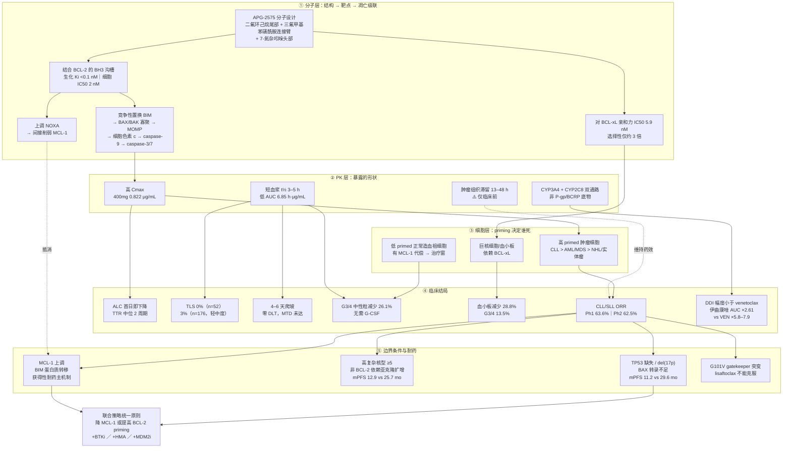
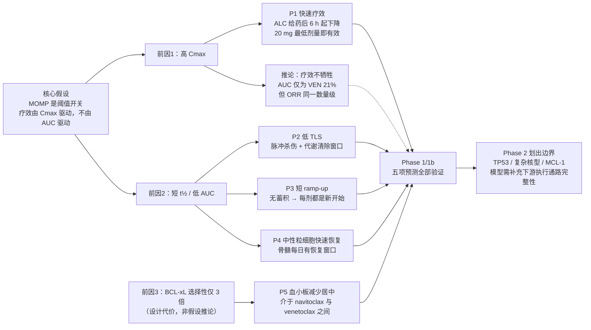

<!-- ai coding: 全文重构——按「分子层→PK层→细胞层→临床验证→边界条件」五层脉络重排，合并重复的 PK 表/短半衰期三重优势/中性粒细胞减少/肿瘤滞留/DDI 段落，统一预测编号为 P1–P5，修正口径矛盾并新增两张 mermaid 关系图 2026/09/02: 20:28 -->


# Lisaftoclax（APG-2575）药理机制

## 0. 一句话结论

Lisaftoclax 的全部药理学特征——高疗效速度、低 TLS、4–6 天快速爬坡、可控的骨髓毒性、中等程度的血小板减少——都可以由**三个前因**推出：

1. **高 Cmax**（足以突破线粒体凋亡阈值）
2. **短血浆半衰期 3–5 h / 低 AUC**（暴露呈脉冲式，给药间期有恢复窗口）
3. **对 BCL-xL 的选择性只有约 3 倍**（不是高选择性药物）

前两条构成一个**「疗效靠 Cmax、安全靠低 AUC」的解耦论证**：不是简单的"短半衰期所以 TLS 低"，而是把疗效变量和毒性变量分别挂在 PK 曲线的两个不同属性上（峰值 vs 面积）。这个论证本身自洽，且 Phase 1/1b 的五项预测全部得到验证。第三条则是这个设计的代价，也是它与 venetoclax、sonrotoclax 的关键分野。

> **阅读提示：不要停在分子层面解释一切。** 分子层只回答"为什么会死"，真正决定临床形态的是 PK 层（暴露形状）和细胞层（priming 差异）。本文按五层递进组织，每一层都指向同一批临床结局。

---

## 1. 全景图：五层结构如何串起来

### 图 A｜Lisaftoclax 药理机制全景



### 图 B｜三个前因 → 五项临床预测的因果扇形

这张图回答的是"为什么四五个看似独立的临床特征其实是同一件事"：



**图 B 的价值在于"一因多果"**：高 Cmax 同时解释 P1 与 P2 的杀伤模式；短半衰期同时解释 P2、P3、P4。四个看似独立的临床特征共享同一个 PK/PD 基础。而 P5 不属于这个因果链——它来自选择性，是独立的第三条前因，也是唯一一个"越验证越说明代价存在"的预测。

---

## 2. 分子层

### 2.1 分子结构与化学系列

APG-2575（lisaftoclax）属于 **N-(苯基磺酰基)苯甲酰胺类**化合物，分子设计包含三个关键片段：

- **二氟环己烷（difluorocyclohexane）尾部**
- **三氟甲基苯基磺酰胺连接臂**
- **7-氮杂吲哚（7-azaindole）头部基团**

化合物最初由密歇根大学在 2018 年专利 WO2018/027097 中首次公开，亚盛医药获得全球权益并推进临床开发。

**与同类药物的结构分野：**

| 药物 | 连接臂 / 关键片段 | P2 口袋结合模式 | 报道亲和力 | 结构带来的差异 |
| :--- | :--- | :--- | :--- | :--- |
| Venetoclax | 哌嗪（piperazine）连接臂 + 氯苯基 P2 基团 | 经典深插 | Ki < 0.01 nM（生化） | 参照物；CYP3A4 + P-gp/BCRP 底物 |
| **Lisaftoclax** | **二氟环己烷尾部** | 改变 P2 口袋结合模式 | IC50 = 2 nM（细胞） | 改变 PK 特征（短 t½）与耐药突变谱 |
| Sonrotoclax | 7-氮杂螺[3.5]壬烷刚性螺环 +<br/>(S)-2-(2-异丙基苯基)吡咯烷 | "浅而广"模式 | KD = 0.046 nM | 避开 G101V 位阻；尾部设计降低自身 CYP 抑制活性 |

> **⚠️ 口径警告：亲和力数字不可跨文献相减。**
> 原始资料中常见"亲和力从 venetoclax 的 Ki < 0.01 nM 降至 lisaftoclax 的 IC50 = 2 nM"这类表述，但 **Ki（生化结合常数）与 IC50（细胞/功能抑制浓度）不是同一口径**，不同实验体系相差 1–2 个数量级是常态。同理，sonrotoclax "KD 比 venetoclax 高 24 倍"只在其自家同一测定体系内成立（该体系测得 venetoclax KD 约 1.1 nM，而非 <0.01 nM）。
> **能安全下的结论只有一条**：在可比的功能性检测中，lisaftoclax 的绝对 BCL-2 亲和力弱于 venetoclax 与 sonrotoclax，但仍处于 nM 级，足以在临床剂量下饱和靶点。

### 2.2 靶点结合：亲和力 vs 选择性的两个维度

评价一个 BH3 模拟物只需要看两个数：

1. **对 BCL-2 的结合力**（BH3 沟槽）→ 决定疗效效率
2. **对 BCL-xL 的亲和力**（即选择性）→ 决定治疗窗

**Lisaftoclax 的读数**：BCL-2 IC50 = 2 nM，BCL-xL IC50 = 5.9 nM，**选择性约 3 倍**。这使它本质上是一个"**BCL-2 偏向性双重抑制剂**"，而不是选择性 BCL-2 抑制剂。

**选择性梯度与治疗窗的历史教训**：血小板和巨核细胞的存活高度依赖 BCL-xL。Navitoclax 因强效 BCL-xL 抑制导致不可接受的血小板减少而终止开发——**"选择性决定治疗窗"是 navitoclax → venetoclax 这条演进线的核心教训**。

但**选择性并非越高越好**：BCL-2 与 BCL-xL 结构高度相似，过度追求选择性可能牺牲亲和力。三代药物构成一条清晰的选择性谱：

| 药物 | BCL-2/BCL-xL 选择性 | 结局 |
| :--- | :--- | :--- |
| Navitoclax | ~1 倍（双重抑制） | G3/4 血小板减少 >50%，终止开发 |
| **Lisaftoclax** | **约 3 倍** | 血小板减少可检测但可控（见 §6.1 P5） |
| Venetoclax | >100 倍 | 血小板减少显著改善 |
| Sonrotoclax | >2000 倍，且 BCL-2 亲和力更强 | 杀伤更剧烈，爬坡需更谨慎 |

### 2.3 凋亡级联：从置换 BIM 到 caspase 执行

两步概括：

1. `lisaftoclax + BCL-2:BIM → lisaftoclax:BCL-2 + 游离 BIM`
2. `游离 BIM → 激活 BAX/BAK → MOMP → 细胞色素 c → caspase → 凋亡`

完整通路（线粒体内源性凋亡的标准程序）：

```
Lisaftoclax 结合 BCL-2 的 BH3 沟槽（Ki <0.1 nM）
        ↓ 竞争性置换被隔离的 BIM
BIM 从细胞质转位至线粒体外膜
        ↓
激活 BAX/BAK 寡聚化 → 在外膜形成孔洞
        ↓
MOMP（线粒体外膜通透化）→ 细胞色素 c 释放
        ↓
细胞色素 c + Apaf-1 → 凋亡小体 → caspase-9
        ↓
效应 caspase-3/7 → 执行凋亡
```

**动力学证据（临床前）**：RS4;11 异种移植模型中，单次口服后 **4 小时**即检测到 cleaved caspase-3 诱导，**24 小时达峰**，伴 PARP-1 切割。这一速度证明高 Cmax 能有效转化为线粒体局部的药物峰值。

### 2.4 NOXA 上调：对 MCL-1 的间接打击

除直接抑制 BCL-2 外，lisaftoclax 还**上调 NOXA**（MCL-1 的天然拮抗剂），形成"**直接抑制 BCL-2 + 间接削弱 MCL-1**"的双重打击。

这一点在机制上直接对冲 §7.3 所述的主要获得性耐药机制（MCL-1 上调），也是理解为何 +HMA 联合有效（HMA 同样经 NOXA 上调促 MCL-1 降解）的分子接口。

---

## 3. 核心假设：Cmax 驱动，而非 AUC 驱动

### 3.1 假设陈述与分子基础

> **假设**：BCL-2 抑制剂的抗肿瘤效应由**峰浓度（Cmax）**驱动，而非**曲线下面积（AUC）**。

**分子基础**：MOMP 是一个**阈值开关事件（threshold switch event）**。BH3 模拟物需在线粒体膜上达到足够的**局部**浓度，竞争性置换足量 BIM 等 BH3-only 蛋白，激活足够数量的 BAX/BAK 形成有效孔洞。**阈值一旦突破，凋亡信号不可逆转地启动，后续药物暴露对已触发凋亡的细胞不产生额外获益**——即所谓 "Hit and Run"。

**关键澄清（单细胞 vs 细胞群体）**：
- 对**单个细胞**，机制是"超过阈值即不可逆死亡"，后续暴露无意义；
- 对**整个肿瘤群体**，机制是"阈值触发 + 每日反复覆盖"——每次 Cmax 脉冲触发一批"全或无"的凋亡事件，累积肿瘤杀伤呈**阶梯式**上升，而不是平滑曲线。

这一区分很重要：它解释了为什么"短暴露"不等于"疗效不足"，同时也解释了为什么仍然需要每日给药而不是单次给药。

### 3.2 支持假设的初步证据

| 证据 | 内容 | 指向 |
| :--- | :--- | :--- |
| 剂量-效应脱钩 | 最低剂量组 20 mg（AUC₀₋₂₄ 仅 0.261 h·μg/mL）即观察到 ALC 下降 | AUC 累积假说下该剂量不应有可测效应 |
| 时间同步 | ALC 反应在首次给药后 **6 小时**即可检测，与 Tmax（4–6 h）高度一致 | 药效峰值与药代峰值同步 |
| BH3 profiling | BAD 肽诱导的细胞色素 c 释放与 ALC 正常化时间**呈负相关** | BCL-2 复合物解离越充分，ALC 恢复越快 |
| BH3 profiling 动态 | BIM 肽诱导的细胞色素 c 释放在 C1D1 给药后 **6 h 出现短暂峰值**，随后下降，至 C1D28 显著降低 | 与 Cmax 出现时间吻合 |
| 跨药对比 | Lisaftoclax AUC 仅为 venetoclax 的约 21%，但 CLL ORR 处于同一数量级（62.5% vs 79%） | 疗效不随 AUC 等比例下降 |

### 3.3 五项可检验预测（统一编号）

以下五项预测在本文中**统一使用 P1–P5 编号**（原资料中"预测1–4"与"P1–P4"两套编号所指不同，已合并）。

| 编号 | 临床特征 | 机制前因 | 推导逻辑 | 预期表现 |
| :--- | :--- | :--- | :--- | :--- |
| **P1** | 快速疗效 | 高 Cmax 突破 MOMP 阈值 | 高 primed CLL 细胞 + 高 Cmax → 快速 BIM 释放 → MOMP | ALC 给药后 6 h 开始下降；最低剂量即有活性 |
| **P2** | 低 TLS 风险 | 短 t½ → 脉冲式暴露 | 脉冲杀伤 + 清除窗口 → 代谢负荷可控 | TLS 发生率 <5% |
| **P3** | 短 ramp-up | 无蓄积（t½ ≪ 24 h） | 每剂都是"新开始" → 可每日递增 | 4–6 天达目标剂量 |
| **P4** | 中性粒细胞快速恢复 | 低 AUC → 骨髓暴露时间有限 | 给药间期恢复窗口内造血再生 → 无需 G-CSF | G3/4 中性粒减少 <30% |
| **P5** | 血小板减少居中 | BCL-xL 选择性仅 3 倍 | 残余 BCL-xL 抑制 → 巨核细胞可检测受损 | 介于 navitoclax 与 venetoclax 之间 |

### 3.4 如何证伪这个假设

Cmax 驱动假设目前是"由临床形态反推的解释框架"，尚未被专门设计的实验直接证明。**要真正定性，需要以下四类实验：**

| 要验证的问题 | 最关键实验 | 判读标准 |
| :--- | :--- | :--- |
| 是否"短脉冲过阈值即可杀" | CLL 原代细胞或 BCL-2 依赖细胞系：2/4/8 小时药物 pulse 后 washout，追踪 24–72 小时凋亡 | 短 pulse 后仍有相近 MOMP、caspase 激活和细胞死亡 → 支持阈值模型 |
| Cmax 还是 AUC | 设计**相同 AUC、不同峰值与给药时长**的方案；再设计**相同 Cmax、不同 AUC**的方案 | 相同 AUC 下"高峰短暴露"优于"低峰长暴露" → 支持 Cmax 驱动 |
| 是否需持续靶点抑制 | washout 后连续测 BCL-2 target engagement、BAX/BAK 激活、MOMP、cleaved caspase-3/7、Annexin V/PI | washout 后细胞恢复 → 反证，属持续暴露驱动 |
| 能否外推到患者 | 将个体 Cmax、AUC、Ctrough、T>有效浓度分别与外周 CLL 细胞下降速度、MRD、骨髓反应、ORR/PFS 做模型比较 | 哪个 PK 指标与疗效相关性最强 |

**反向结论**：若 washout 后细胞恢复、而持续低浓度暴露更有效，则该药实际是**持续暴露 / AUC / T>阈值驱动**，本文整个论证框架需要重建。

---

## 4. PK 层：暴露的形状决定临床形态

### 4.1 关键 PK/PD 参数与其临床映射

| 参数 | 数值 | 药理学意义 | 对应临床预测 |
| :--- | :--- | :--- | :--- |
| BCL-2 Ki | <0.1 nM（细胞 IC50 2 nM） | 高亲和力确保阈值突破效率 | 低剂量即可触发凋亡（P1） |
| 血浆 t½ | **3–5 h** | 快速清除，减少全身累积 | 低 TLS（P2）、短爬坡（P3） |
| 400 mg Cmax | 0.822 μg/mL | 高 Cmax 突破 MOMP 阈值 | 快速 ALC 下降（P1） |
| 400 mg AUC₀₋₂₄ | 6.85 h·μg/mL | 低 AUC 减少骨髓持续毒性 | 快速中性粒细胞恢复（P4） |
| Tmax | 4–6 h | 达峰时间适中，平衡疗效与安全 | 给药方案灵活 |
| 细胞内达平台时间 | 2 h（临床前） | 快速细胞内积累匹配 Cmax 动力学 | Cmax 有效转化为线粒体峰值 |
| 肿瘤组织 t½ | 13–48 h（**仅临床前**） | 肿瘤内持续暴露维持药效 | 疗效不牺牲 |
| Cmax/AUC 比值 | 0.120（400 mg） | 曲线陡升陡降 | vs venetoclax 0.064（曲线扁平） |

**整合解读**：通过高靶点亲和力保证阈值突破的**效率**，通过高 Cmax 保证阈值突破的**速度**，通过短血浆半衰期降低**系统毒性**，同时（若人体成立）通过肿瘤内长滞留维持**药效持续性**。2 小时的细胞内平台期是"Cmax → 线粒体局部峰值"这一转化环节的细胞基础。

### 4.2 Phase 1 全剂量 PK 数据

数据来源：Ailawadhi S, et al. *Clin Cancer Res.* 2023。Tmax 括号内为范围。

| 剂量 (mg) | n | t½ (h) | Tmax (h) | Cmax (μg/mL) | AUC₀₋₂₄ (h·μg/mL) |
| :---: | :---: | :---: | :---: | :---: | :---: |
| 50 | 1 | 2.84 | 3 | 0.039 | 0.261 |
| 100 | 1 | 3.85 | 6 | 0.229 | 1.80 |
| 200 | 2 | 3.84 ± 0.16 | 4 (4–4) | 0.294 ± 0.004 | 2.41 ± 0.37 |
| **400** | **8** | **4.43 ± 0.57** | **6 (4–8)** | **0.822 ± 0.334** | **6.85 ± 2.91** |
| 600 | 7 | 4.68 ± 1.03 | 6 (4–8) | 0.761 ± 0.298 | 7.81 ± 2.84 |
| 800 | 7 | 4.34 ± 0.53 | 4 (4–6) | 0.982 ± 0.384 | 7.25 ± 2.24 |
| 1000 | 6 | 6.10 ± 1.52 | 8 (6–8) | 1.69 ± 1.22 | 18.3 ± 13.1 |
| 1200 | 6 | 6.0 | 6 (3–8) | 1.20 ± 0.48 | 12.3 ± 4.82 |

**三个可下的结论：**

1. **短半衰期是固有属性，不是剂量依赖现象**——t½ 在全剂量范围稳定于 2.84–6.10 h（均值 4–5 h）。
2. **Cmax/AUC 总体呈剂量比例性增加**，提示测试范围内药代基本线性。
3. **高剂量组变异度显著放大**——1000 mg 与 1200 mg 的 Cmax 相对标准差分别为 72% 和 40%，提示超治疗剂量时个体吸收/首过代谢差异被放大。

> **⚠️ 需要注意的非单调性**：1200 mg 的 Cmax（1.20）与 AUC（12.3）**低于** 1000 mg（1.69 / 18.3）。这与"剂量比例性增加"的表述存在张力，更可能反映高剂量吸收饱和或小样本（n=6）变异，而非真实的剂量-暴露倒挂。原资料将其笼统归为"总体剂量比例性"，此处保留原数据但明确标注该矛盾。

### 4.3 与 venetoclax 的定量对比：Cmax 驱动设计的直接体现

| 参数 | Lisaftoclax 400 mg | Venetoclax 400 mg（稳态） | 相对比例 |
| :--- | :--- | :--- | :--- |
| Cmax | 0.822 μg/mL | ~2.1 μg/mL | **39%**（降幅 61%） |
| AUC₀₋₂₄ | 6.85 h·μg/mL | ~32.8 h·μg/mL | **21%**（降幅 79%） |
| t½ | 3–5 h | ~26 h | ~1/6 |
| Cmax/AUC | 0.120 | 0.064 | 曲线陡峭 vs 扁平 |
| 蓄积比 | 几乎无蓄积 | 0.8–1.6 | — |
| CLL ORR（单药） | 62.5%（Ph2, n=77） | 79%（人群风险特征不同） | 同一数量级 |

**核心读数**：**Cmax 的降幅（61%）远小于 AUC 的降幅（79%）**，而疗效处于同一数量级。这是"高 Cmax / 低 AUC"设计意图在人体中被实现的直接证据，也是 Cmax 驱动假说最有力的间接支持。

### 4.4 短半衰期的三重安全性后果

短半衰期（3–5 h vs venetoclax ~26 h）的核心药理学意义在于**限制全身累积暴露**，从而减少持续大规模细胞杀伤带来的系统毒性。具体分为三条：

**① 低 TLS 风险**

TLS 的发生取决于两个变量：**单次给药后的肿瘤细胞杀伤速度**，以及**药物持续暴露导致的累积代谢负荷**。前者 lisaftoclax 并不低（高 Cmax 意味着杀伤快），真正的差异在后者。

- **Lisaftoclax**：即使单次 Cmax 触发大量凋亡，药物在 24 小时内已基本清除，不会造成持续扩大的细胞溶解。下一剂给药前，肾脏有足够时间清除第一波凋亡释放的钾、磷、尿酸。**TLS 发生率 <2%**（Ph1 n=52 为 0%）。
- **Venetoclax**：长半衰期意味着首剂后药物持续存在数天，持续 BCL-2 抑制导致连续细胞溶解，代谢负荷累积。早期开发中因快速递增导致 **TLS 死亡事件**，被迫将起始剂量下调并改为 **5 周每周递增**方案。

**② 中性粒细胞快速恢复**

中性粒细胞减少是 BCL-2 抑制剂的**类效应**：粒细胞前体（promyelocyte、myelocyte，约 myeloblast 至 metamyelocyte 阶段）表达 BCL-2 并依赖其存活，BCL-2 抑制触发前体凋亡，导致成熟中性粒细胞产出减少。

机制差异在于**恢复窗口**：lisaftoclax 每日给药后 Cmax 迅速下降，两次给药之间存在药物浓度低于有效抑制水平的窗口期，骨髓造血干细胞可在此窗口内分化为中性粒前体并正常成熟；venetoclax 的持续暴露不给这个窗口，使计数难以恢复。

| | Lisaftoclax | Venetoclax |
| :--- | :--- | :--- |
| G3/4 中性粒减少 | **26.1%**（6/23 可评估） | 40–50% |
| G-CSF / 剂量调整需求 | 0（无需） | 36–41% 的接受者，约占 G3/4 患者的 75% |
| 感染事件 | 未观察到相关后遗症 | 72% 经历感染 |

**③ 无蓄积**

t½ 远短于 24 h 给药间隔，几乎无蓄积（venetoclax 蓄积比 0.8–1.6，多次给药后暴露显著增加）。这直接降低长期毒性风险与 DDI 严重程度，并提高停药后的可控性。

**④ 由 ①③ 直接推出的临床操作优势：快速爬坡**

爬坡方案：**D1 20 mg → D2 50 → D3 100 → D4 200 → D5 400 mg**，4–6 天达目标剂量（vs venetoclax 5 周每周递增）。

- **药理学基础**："每剂都是新开始"——前日药物已基本清除，不会因蓄积导致不可预测的暴露叠加。
- **爬坡期 TLS 监测**：基线、给药后 6–8 h、24 h 采血。
- **实际结果**：Ph1 52 例 CLL 患者零 TLS；5 名 TLS 高风险患者完成快速爬坡后 ALC 下降 **89–99%** 而无 TLS 证据。
- **卫生经济学延伸**：更短的递增周期减少了住院监测 TLS 的时间与负担。Venetoclax 因 TLS 黑框警告需住院监测，在基层医院和社区医疗中心构成资源瓶颈；在中国 DRG/DIP 支付改革背景下，门诊化给药的报销优势更为突出。

### 4.5 肿瘤滞留：血浆-肿瘤时空分离

**现象**：临床前 RS4;11 荷瘤小鼠模型中，给药后 **2 小时**达肿瘤细胞内平台浓度，肿瘤内滞留 **13–48 小时**，远长于血浆 t½（3–5 h）。

**可能机制**（均未验证）：
- 肿瘤微环境的高蛋白结合率（药物与肿瘤细胞内蛋白形成可逆结合）
- 较低的清除率（肿瘤组织血流灌注与药物代谢酶活性低于血浆）
- 细胞内隔室化（intracellular compartmentalization）导致的药物滞留

**这个特征在论证中的位置**：它是"短血浆暴露为何不牺牲疗效"这一问题的候选答案——即血浆浓度在给药后 12 小时内已降至低位时，肿瘤内浓度仍维持在有效范围，持续抑制 BCL-2。

> **⚠️ 关键限制：该数据完全来自异种移植模型，不能等同于人体组织 PK 结论。** 种属差异使外推高度不确定。若要坐实这一论证环节，需要人体组织 PK 研究（手术样本 / 骨髓活检的药物浓度测定）。**在此之前，"肿瘤滞留维持药效"只能作为假设而非事实引用。**

### 4.6 DDI：多通路代谢 + 非转运体底物

**先厘清两套"清除关卡"**：

- **CYP3A4、CYP2C8** 是**代谢酶**，负责把药物化学分解。
- **P-gp、BCRP** 是**外排转运蛋白**，主要把药物泵回肠腔或排出细胞。
- **"底物"**表示药物会被这套系统处理；**"抑制剂"**表示药物会堵住这套系统。这是两个必须分开的方向。

**Lisaftoclax 的代谢特征**：

- 主要由 **CYP3A4 + CYP2C8 双通路**代谢
- **不是 P-gp / BCRP 底物**
- t½ 约 5 h

**因此，以泊沙康唑（同时抑制 CYP3A4 与 P-gp）为例：**
- P-gp 抑制**基本无直接影响**——lisaftoclax 不走 P-gp；
- CYP3A4 抑制**仍然有影响**；
- CYP2C8 可能提供一条未被堵住的替代通路，故不像单一依赖 CYP3A4 的药物那样容易出现极端暴露升高。

**但绝不能写成"泊沙康唑不影响 APG-2575"。** 健康受试者中，强 CYP3A 抑制剂**伊曲康唑**使 lisaftoclax：
- **Cmax 增至约 1.82 倍**
- **AUC 增至约 2.61 倍**

即 **DDI 相对较小，但绝非没有**。**中国说明书仍建议避免与强效 CYP3A 抑制剂或诱导剂合用。**

**与 venetoclax 对比：**

| | Lisaftoclax | Venetoclax |
| :--- | :--- | :--- |
| 代谢通路 | CYP3A4 + CYP2C8 | 主要 CYP3A4 |
| 转运体底物 | 非 P-gp / BCRP | **是** P-gp、BCRP 底物 |
| 强 CYP3A 抑制剂影响 | 伊曲康唑 AUC **×2.61** | 酮康唑 AUC **+540%（即 ×6.4）**；利托那韦 **+690%（即 ×7.9）** |
| 爬坡期合用限制 | 说明书建议避免 | CLL/SLL 起始及爬坡期**属禁忌** |
| 食物效应 | 远低于 venetoclax | 高脂餐使 Cmax 增 **3–5 倍** |

> **表述精度提示**："增加 690%" ≠ "增加 7.9 倍"。前者的含义是最终暴露为原来的 7.9 倍。原始资料中这两种表达常被混用。
>
> **适应症差异提示**：强 CYP3A 抑制剂在 **CLL/SLL** 起始及爬坡期属禁忌；**AML** 的管理方案不同（常规联用唑类抗真菌药并做剂量调整），不能笼统写成"所有患者爬坡期都禁用"。

**联合方案的实测 DDI：**
- **+ acalabrutinib**：无临床显著 DDI。acalabrutinib 总活性组分（acalabrutinib + 活性代谢物 ACP-5862）暴露变化 **<6%**。
- **+ 利妥昔单抗**：无 DDI。但这不构成"优势"——利妥昔单抗是单克隆抗体，本就不经 CYP 代谢，无 CYP 型 DDI 属预期结果。

**必须保留的三条严谨性限定：**

1. **短半衰期本身不能证明强抑制剂造成的 AUC 增幅一定小。** DDI 幅度主要取决于：CYP3A4 占总清除的比例、CYP2C8 等替代通路的容量、肠道首过效应、抑制剂的强度与持续时间、药物治疗窗。且泊沙康唑等抑制剂持续给药时，抑制不会因底物半衰期短而自动消失。
2. **DDI 的两个方向必须分开**：Sonrotoclax 的尾部结构优化（trans-(1r,4r)-4-(氨甲基)-1-甲基环己烷-1-醇）降低的是它**作为"肇事药"抑制其他药物代谢**的能力，**不等于**它**作为"受害药"不被 CYP3A 抑制剂影响**。
3. **不宜概括为"全面超越 venetoclax 的代谢安全性"。** 现有资料只支持"新一代药物在部分药代特征上有所改进"这一较弱结论。

**可以安全下的表述**：
> Lisaftoclax 的多通路代谢与非 P-gp/BCRP 底物特征，在机制上减少了转运体介导的 DDI，并使强 CYP3A 抑制剂造成的暴露增幅相对较小（×2.6 vs ×5.8–7.9）；短半衰期有助于减少蓄积并提高停药后的可控性。但伊曲康唑仍可使其 AUC 增至约 2.6 倍，现行说明书仍建议避免与强 CYP3A 抑制剂合用。

**现实意义**：血液肿瘤患者常规使用唑类抗真菌药预防和治疗侵袭性真菌感染，这是 venetoclax 临床管理中的真实痛点，也是社区医疗广泛采用 BCL-2 抑制剂的先决条件之一。

---

## 5. 细胞层：BCL-2 priming 决定敏感性梯度与治疗窗

### 5.1 priming 概念

**Priming（线粒体敏化/预备状态）**指细胞线粒体**距离凋亡阈值的接近程度**。高 primed 细胞表达较高水平的促凋亡蛋白（BIM、BID、PUMA），这些蛋白被抗凋亡蛋白隔离，形成"定时炸弹"状态——只需释放隔离即可触发凋亡。

**检测方法**：BH3 profiling 功能性检测，将合成 BH3 肽暴露于分离的线粒体，定量评估 priming 状态。

### 5.2 肿瘤类型的敏感性梯度

这是 lisaftoclax 疗效呈现明确适应症差异的根本原因：

| 肿瘤类型 | Priming 状态 | 依赖谱 | 单药疗效 | 机制解释 |
| :--- | :--- | :--- | :--- | :--- |
| **CLL/SLL** | 最高 | 主要依赖 BCL-2 | ORR 62.5–63.6% | BAD 肽在 0.05 μM 即可诱导 25–50% 线粒体细胞色素 c 释放，而其他 BH3 肽在 5 μM 下诱导效率远低——证明 BCL-2 是 CLL 细胞的主导抗凋亡蛋白 |
| **AML/MDS** | 中等 | BCL-2 与 MCL-1 依赖性**共存** | 单药有限 | 需联合：+AZA 后 ORR 提升至 64%（AZA 通过上调 NOXA 促 MCL-1 降解，增强 BCL-2 依赖性） |
| **NHL 亚型 / 实体瘤** | 低 | 更强的 MCL-1、BCL-xL 代偿 | 单药不敏感 | 释放 BIM 后被代偿性抗凋亡蛋白重新隔离 |

**关键推论**：高 priming 状态**降低了触发 MOMP 所需的暴露阈值**。这正是"为什么短暴露（低 AUC）的 lisaftoclax 在 CLL 中仍能产生显著活性"的细胞层答案——它与 §3 的 Cmax 假设是互补而非重复的解释。

### 5.3 治疗窗的细胞学基础

**正常造血祖细胞的低 priming 状态构成 lisaftoclax 的治疗窗**：它们虽也表达 BCL-2，但 priming 水平低，且有 MCL-1 等替代抗凋亡蛋白的补偿机制。

**短半衰期进一步放大了这个窗口**：短暂的 Cmax 脉冲不足以推动低 primed 的正常细胞越过凋亡阈值，但对高 primed 的癌细胞已足够。这一"**primed 状态差异性**"是 BH3 模拟物类药物安全性的通用基础，不限于 lisaftoclax。

### 5.4 三层因果如何汇聚：两个示例

**示例一｜TLS 风险**
```
分子层：MOMP 阈值突破效率高 → 快速杀伤
   ＋
PK 层：短 t½ → 脉冲式暴露 → 给药间期代谢恢复窗口
   ＝
临床层：4–6 天快速 ramp-up 可行，TLS 0–3%
```

**示例二｜中性粒细胞减少**
```
分子层：BCL-2 在粒细胞前体表达（类效应，无法回避）
   ＋
PK 层：短 t½ → 给药间期恢复窗口
   ＋
细胞层：正常祖细胞低 primed → 短暂暴露不足以触发凋亡
   ＝
临床层：低发生率（26.1%）、快速恢复、无需 G-CSF
```

---

## 6. 临床验证：预测 vs 实测数据

### 6.1 Phase 1/1b：五项预测逐一核对

| 编号 | 机制预测 | Phase 1/1b 实测数据 | 状态 |
| :---: | :--- | :--- | :---: |
| **P1** | 高 Cmax → 快速阈值突破 → 早期 ALC 下降 | 20 mg 最低剂量、给药首日即观察到 ALC 下降；给药后 6 h 起下降；BH3 profiling 显示 C1D1 6 h 细胞色素 c 释放达峰 | ✅ |
| **P2** | 短 t½ → 脉冲式杀伤 → 低 TLS | TLS 发生率 **0%**（n=52）；扩大样本 **3%**（5/176），均为轻中度 | ✅ |
| **P3** | 无蓄积 → 每日递增安全 → 短 ramp-up | 4–6 天安全达目标剂量；44 例递增期患者**零 DLT**；MTD 在最高测试剂量 1200 mg 仍未达到 | ✅ |
| **P4** | 低 AUC → 有限骨髓暴露 → 低中性粒减少 + 快速恢复 | G3/4 中性粒减少 **26.1%**（6/23）；**零 G-CSF 需求**；零感染后遗症 | ✅ |
| **P5** | BCL-xL 3 倍选择性 → 残余血小板抑制 → 介于 VEN 与 NAV 之间 | 任何级别 **28.8%**（15/52），G3/4 **13.5%**（7/52）；Ph1b/2 汇总（n=176）任何级别 **23.4%**，G3/4 **5%**；未导致治疗中断 | ✅ |

数据来源综合：Ailawadhi S, et al. *Clin Cancer Res.* 2023；Cancer Network ASCO 2021；CLL Society 2025。

#### P1 的判别价值：20 mg 最低剂量即有效，区分了两个竞争假说

ALC 动态是 BCL-2 抑制剂 PD 的核心生物标志物。**"20 mg、给药首日即观察到 ALC 下降"这一观察直接区分了两个竞争性假说**：

- **AUC 累积假说**：20 mg 剂量的 AUC₀₋₂₄ 仅 0.261 h·μg/mL，理论上不足以产生可检测的生物学效应 → **被证伪**。
- **Cmax 阈值假说**：即使该剂量的 Cmax 仅 0.039 μg/mL，也足以**部分**触发 BCL-2 依赖的凋亡通路 → **与观察一致**。

这与 MOMP 的全或无（all-or-none）性质一致：一旦游离药物浓度超过释放 BIM / 激活 BAX 所需的阈值，即触发不可逆的 caspase 级联。

#### P4 的三个管理案例：说明"恢复模式"比"发生率"更重要

- 1 例 400 mg 组患者在 C1 出现 G3 中性粒减少，暂停用药 8 天后自行恢复至 1.15×10⁹/L，**无需 G-CSF 或其他干预**即可继续治疗。
- 1 例 1200 mg 组患者经历 G3 中性粒减少但**无需停药或生长因子支持**，计数稳定维持并持续治疗至 C10。

**关键差异不在发生率（26.1% vs 40–50%），而在恢复模式**：lisaftoclax 组在无 G-CSF 支持下快速恢复并稳定维持，且中性粒减少的相关后遗症（发热、感染）未被观察到。

#### P5 的解读：验证成功恰恰说明代价存在

3 倍选择性预测的"中间态"血小板减少发生率被精确观察到——残余的 BCL-xL 抑制活性足以对巨核细胞产生**可检测但可控**的影响，未达到导致治疗中断的严重程度。短半衰期降低了持续 BCL-xL 抑制的时间，部分抵消风险。

> **⚠️ 口径待核**：原始资料中 venetoclax 的血小板减少 36% 一处标为 "G3/4"、另一处标为 "任何级别"，二者不可能同时成立。在核实前，**不应做"lisaftoclax 血小板减少优于 venetoclax"的对比结论**——若 36% 是 venetoclax 的 G3/4 值，则 lisaftoclax 13.5% 确实更低；若 36% 是任何级别，则 lisaftoclax 的 28.8%/23.4% 只是接近而非优于。

#### P3 的历史对照

Venetoclax 的历史经验形成强烈反差：早期开发中在较高起始剂量下发生 **TLS 死亡事件**，被迫将起始剂量下调至 20 mg 并引入 **5 周每周递增**方案。Lisaftoclax 在 8 个剂量队列、44 例递增期患者中零 DLT。

### 6.2 Phase 2 注册研究（APG2575CC201, NCT05147467）

#### 研究人群：BCL-2 抑制剂开发史上最难的 CLL 人群之一

| 参数 | APG2575CC201<br/>(Lisaftoclax) | M14-032<br/>(Venetoclax) | MURANO<br/>(Venetoclax-R) |
| :--- | :--- | :--- | :--- |
| 样本量 | 77 例（72 例可评估） | 91 例 | 389 例 |
| 中位年龄 | 63 岁（37–84） | 67 岁 | 64 岁 |
| 中位既往线数 | 3 线（1–10） | 5 线（1–12） | 1 线 |
| BTKi 耐药比例 | **87%** | 74% | 2.6% |
| BTKi + 化疗双重失败 | **45.5%** | 未报告 | 不适用 |
| del(17p)/TP53 突变 | 39% | 49% del(17p) | 27% del(17p) |
| 复杂核型 | 42.9% | 未报告 | 7.2%（≥5 CNA） |
| IGHV 未突变 | 53.2% | 86% | 68.3% |
| ECOG ≥2 | 31.2% | 未报告 | 未报告 |
| 给药方案 | 600 mg QD，5 天递增 | 400 mg QD，5 周递增 | 400 mg QD，5 周递增 + R |

缩写：CNA 拷贝数异常；R rituximab；QD 每日一次。

**这一人群特征的双重意义**：
- **作为机制验证场景**：45.5% 的双重失败率和 87% 的 BTKi 耐药比例意味着这些患者在 BCR 信号通路抑制和化学免疫治疗两条独立路径后均已进展，理论上仅保留凋亡调控通路（BCL-2 抑制）作为有效靶点。若 BCL-2 抑制确为独立作用通路，此类患者仍应获益——这是一个近乎"纯净"的机制检验。
- **作为亚组分析基础**：高危遗传学的高比例为 TP53/复杂核型亚组分析提供了充足检验效力。

#### 疗效读数

| 指标 | Phase 1（n=22 可评估） | Phase 2（n=77，72 可评估） |
| :--- | :--- | :--- |
| ORR | **63.6%**（14 PR，无 CR） | **62.5%** |
| mPFS | — | **23.89 个月** |
| 30 个月 OS 率 | — | **78%** |
| 淋巴结/脾脏缩小 ≥70% | 42.9%（9/21） | — |
| 中位起效时间（TTR） | **2 个周期**（范围 2–8） | — |

> **口径澄清**：Ph1 的 63.6% 与 Ph2 的 62.5% 是**两个不同研究、不同样本量**的读数，不是同一数字的两种写法。原资料中二者混用，此处已分开标注。

#### TTR 与 ALC 动态：支持"快速凋亡触发"而非"累积暴露"

中位 TTR 为 **2 个周期**（venetoclax 为 2–3 个周期，相当）。机制上，BCL-2 抑制剂通过直接释放 BIM / 激活 BAX/BAK 触发 caspase 级联，细胞在数小时内进入凋亡程序，**无需基因转录或蛋白质合成的时间延迟**。因此疗效显现速度主要取决于肿瘤负荷和药物达到 MOMP 阈值的能力，而非累积暴露时间。

ALC 提供更精细的时间分辨率：
- **56%** 的患者在 4–6 天 ramp-up 结束时 ALC 已恢复正常
- C1 结束时升至 **58%**
- C2 结束时达 **65%**

ALC 在首次给药后 24 小时内的快速下降是肿瘤细胞对 Cmax 的**即时响应**，这一早期 PD 信号预测了后续的影像学缓解。

### 6.3 给药节律：无蓄积特性使间歇给药成为可选项

**R/R AML 数据对照**：

| 方案 | ORR | CR |
| :--- | :--- | :--- |
| **14 天间歇给药**（14 天开 / 14 天关） | **50%** | **37.5%** |
| 28 天持续给药 | 39% | 28% |

**间歇给药优化假说**：持续 BCL-2 抑制可能（a）增加对正常造血干细胞的毒性（中性粒细胞减少），（b）驱动 MCL-1 / BCL-xL 代偿性上调。间歇给药则允许正常造血恢复窗口、减少代偿机制激活、维持肿瘤细胞对 BCL-2 抑制的"成瘾性"。

> 注意：这与 §3 的 Cmax 驱动假设在方向上一致（都主张"持续暴露非必需"），但**证据级别较弱**（小样本、非随机对照），且 (b) 的代偿上调假说未有直接生物标志物证据。

---

## 7. 边界条件与耐药机制

Phase 2 数据揭示了 Cmax 驱动模型的**解释边界**。初始模型假设疗效主要取决于 Cmax 是否突破 MOMP 阈值，但**未充分考虑下游凋亡执行通路的完整性**。

### 7.1 TP53 缺失 / del(17p)：最强负向预测因子

**机制**：p53 是 **BAX 的转录激活因子**。TP53 缺失时 BAX 基线转录降低，即使 BIM/PUMA 被成功释放，也不足以突破 MOMP 阈值。

**关键澄清**：这**不是 BCL-2 靶点失效**，而是**下游凋亡执行通路被削弱**。药物仍在正确地做它该做的事，只是"下游产能不足"。

**数据**：
- Phase 2：mPFS **11.2 vs 29.6 个月**（HR **5.0**, P=.018）
- Phase 1 小样本：3 例 del(17p)/TP53 突变患者中 2 例达 PR，ORR **66.7%**（N=3，仅供参考）

**但并非完全无效**：在 BTKi + 化疗双重失败后仍有约 1 年的 PFS。这初步证实了 BCL-2 抑制剂**绕过 TP53 直接作用于线粒体凋亡通路下游节点**的理论优势——即使 p53 功能缺失，释放的 BIM/PUMA 仍可在一定程度上激活 BAX/BAK，完成**不完全但可测量**的凋亡级联。

**对模型的修正**：Cmax 驱动的 BCL-2 抑制能触发凋亡级联的**启动**，但 TP53 缺失限制该级联的**充分执行**，导致疗效"打折扣"。因此模型需要补充 **TP53 状态作为疗效修饰因子**。临床推论：TP53/del(17p) 患者可能需要更强的联合策略（+BTKi 下调 MCL-1，或 +HMA 上调 NOXA）以补偿 p53 功能缺失，而非单纯依赖单药的 Cmax 脉冲。

### 7.2 复杂核型（CK）：独立预后因子

**数据**：高 CK（≥5 种异常）mPFS **12.9 vs 25.7 个月**（HR **2.7**, P=.001）

**机制**：基因组不稳定性驱动的**克隆异质性**——非 BCL-2 依赖的亚克隆在治疗压力下被选择性扩增。

**与 TP53 的分工**（这是理解两个因子为何独立的关键）：
- **TP53 限制凋亡通量的「深度」**——同一个克隆里，能死掉多少
- **CK 限制靶向治疗的「广度」**——有多少克隆根本不吃这一招

### 7.3 MCL-1 上调：获得性耐药主机制

**标志**：BIM 从 BCL-2 向 MCL-1 的"**蛋白质转移**"——药物把 BIM 从 BCL-2 上赶下来，但 MCL-1 把它接走了。

**上游驱动**：
- RAS/MAPK 通路 → 增强 MCL-1 稳定性
- PI3K-AKT 通路 → 磷酸化稳定化

**这是对所有 BCL-2 抑制剂的类效应意义的耐药机制**，不是 lisaftoclax 特有问题。§2.4 所述的 NOXA 上调是 lisaftoclax 对此的部分内建对冲。

### 7.4 联合用药的统一设计原则

AML/MDS 数据提供了关键验证：**所有成功的联合策略都通过不同的上游机制，汇聚于同一个下游节点**——降低 MCL-1 功能或增强 BCL-2 依赖性。

| 联合方案 | 上游机制 | 报道疗效 |
| :--- | :--- | :--- |
| **+ BTKi**（acalabrutinib） | 抑制 MCL-1 转录 → 增强 BCL-2 依赖性 | ORR 96.6%；venetoclax 经治 CLL 达 86% |
| **+ HMA**（azacitidine） | 上调 NOXA → 促进 MCL-1 降解 | AML+AZA ORR 64%；R/R AML ORR 43.2% |
| **+ MDM2 抑制剂** | p53 激活 → 上调 NOXA 转录 | 临床前克服耐药 |

> **口径待核**：原资料中 "ORR 43.2%" 同时被标注为"AML/MDS 单药疗效"与"R/R AML + HMA 联合"，二者不可能同指。引用前需回溯原始文献确认给药方案。

**统一原则**：
> **联合药物必须能够降低 MCL-1 功能，或增加 BCL-2 priming。**

该原则具有跨适应症的普适性——从 CLL 到 AML 再到 MDS，**MCL-1 是 BCL-2 抑制剂联合策略的共同汇聚节点**。这也是评估任何新联合方案是否合理的第一性检验标准。

### 7.5 G101V gatekeeper 突变：lisaftoclax 的明确短板

**背景**：G101V 是 venetoclax 的经典获得性耐药突变，约 **43.5%** 的 venetoclax 临床进展病例可检出。

| 药物 | 对 G101V 的活性 | 判读 |
| :--- | :--- | :--- |
| Venetoclax | IC50 ~25–29 nM | 已显著减弱 |
| **Lisaftoclax** | 生化 IC50 **~57 nM**（细胞 ~161 nM） | **比 venetoclax 更差** |
| Sonrotoclax | IC50 **0.34 nM** | 真正覆盖 G101V |

**必须纠正的一个常见误读**：Lisaftoclax 在 venetoclax 经治患者中确实观察到活性（AML ORR 31.8%；CLL 联合 acalabrutinib 达 86%），但这**不是**因为它能克服 G101V。真实原因有两条：

1. **耐药机制异质性**——并非所有 venetoclax 进展患者都携带 G101V（约 56% 不携带）；
2. **联合药物的 MCL-1 下调贡献**——86% 这个数字来自联合 acalabrutinib，不是单药活性。

**结论**：lisaftoclax 与 venetoclax 均不能克服 gatekeeper 突变。在"覆盖 venetoclax 耐药"这一维度上，真正有结构性优势的是 sonrotoclax。

---

## 8. 尚未验证的部分（引用时必须标注的缺口）

| # | 缺口 | 现状 | 坐实所需证据 |
| :---: | :--- | :--- | :--- |
| 1 | **Cmax 驱动假设本身** | 由临床形态反推的解释框架，与数据一致但未被直接证明 | §3.4 的四类实验，尤其是"等 AUC / 不等 Cmax"的头对头设计 |
| 2 | **肿瘤组织半衰期** | 13–48 h 完全来自异种移植模型，种属差异使外推不确定 | 人体组织 PK 研究（手术样本 / 骨髓活检浓度测定） |
| 3 | **免疫调节等非经典功能** | 临床前提示 NF-κB 抑制、TAM M2→M1 极化、pDC 杀伤降低 I 型干扰素，或可增强抗 PD-1/PD-L1 联合敏感性 | 人体生物标志物数据；目前不应作为联合免疫治疗的机制依据引用 |
| 4 | **3 倍 BCL-xL 选择性的长期安全性** | 累积性血小板功能影响在数月至数年长期给药场景（固定疗程 CLL、慢性病管理）中**尚未充分表征** | 长期随访的血小板功能学（非仅计数）数据 |
| 5 | **AML 联合场景的血液学毒性叠加** | AML 联合 AZA 时 ≥3 级血小板减少升至 **50–61%**（骨髓毒性叠加），远高于 CLL 单药 | 需区分"药物固有毒性"与"联合方案 + 疾病本身骨髓抑制"的贡献 |
| 6 | **3 倍选择性的可观测替代指标** | 目前只有血小板计数这一粗指标；无法区分"巨核细胞受抑"与"血小板破坏" | 巨核细胞集落形成、血小板寿命、TPO 水平、血小板功能（聚集/活化标志） |

### 内部口径待核清单

引用本文数据前需回溯原始文献核实的三处矛盾：

1. **Venetoclax 血小板减少 36%** 一处标为 G3/4、一处标为任何级别（影响 §6.1 P5 的对比结论）。
2. **ORR 43.2%** 一处标为 AML/MDS 单药、一处标为 R/R AML + HMA 联合（影响 §7.4 的联合增益幅度计算）。
3. **1200 mg 剂量组 PK 倒挂**（Cmax/AUC 低于 1000 mg），与"剂量比例性"表述冲突（见 §4.2）。

另有两处已在正文中统一，此处备注：
- Lisaftoclax 血浆 t½ 原文分别写作 "3–5 h"、"3–6 h"、"约 6 h"，本文统一采用 **3–5 h**（Ph1 全剂量实测范围 2.84–6.10 h）。
- CLL ORR 原文 62.5% 与 63.6% 混用，本文已分别归属 Phase 2 与 Phase 1。

---

## 附录：PK / PD 术语速查

**PK（药代动力学）**——研究**人体如何处理药物**：吸收（进入血液的速度和程度）、分布（药物进入哪些组织）、代谢（主要由哪些肝酶分解）、排泄（经肾脏/胆汁排出）。

| 指标 | 含义 |
| :--- | :--- |
| **Cmax** | 最高血药浓度 |
| **Tmax** | 达到最高浓度所需时间 |
| **AUC** | 总体药物暴露量（浓度-时间曲线下面积） |
| **t½（半衰期）** | 血药浓度下降一半所需时间 |
| **Ctrough** | 谷浓度（下次给药前的最低浓度） |
| **蓄积比** | 多次给药后暴露量相对首剂的倍数 |

**PD（药效动力学）**——研究**药物对人体或疾病产生什么作用**：是否结合并抑制靶点、下游生物标志物是否改变、肿瘤细胞是否死亡、缓解率与肿瘤缩小等疗效。

| 指标 | 含义 |
| :--- | :--- |
| **Emax** | 最大药效 |
| **EC50** | 达到最大药效 50% 时所需浓度 |
| **Ki** | 抑制剂与靶点的结合常数（生化口径，越小越强） |
| **IC50** | 抑制 50% 活性所需浓度（可为生化或细胞口径） |
| **KD** | 解离常数（结合亲和力，越小越强） |

**以 BCL-2 抑制剂为例：**
- **PK**：服用 venetoclax 或 lisaftoclax 后的血药峰值、半衰期、是否受 CYP3A 抑制剂影响。
- **PD**：BCL-2 是否被充分抑制、肿瘤细胞凋亡是否增加、外周血 ALC 或骨髓原始细胞是否下降。

**本文涉及的其他缩写**：ALC 绝对淋巴细胞计数；ANC 绝对中性粒细胞计数；TLS 肿瘤溶解综合征；MOMP 线粒体外膜通透化；DLT 剂量限制性毒性；MTD 最大耐受剂量；ORR 客观缓解率；CR 完全缓解；PR 部分缓解；PFS 无进展生存期；TTR 至缓解时间；G-CSF 粒细胞集落刺激因子；BTKi 布鲁顿酪氨酸激酶抑制剂；HMA 去甲基化药物；CK 复杂核型；CNA 拷贝数异常；DDI 药物-药物相互作用；uIGHV IGHV 未突变。
