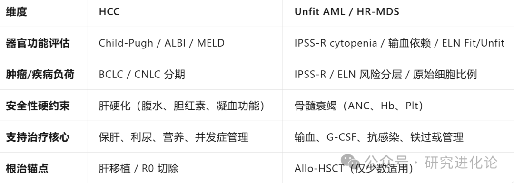
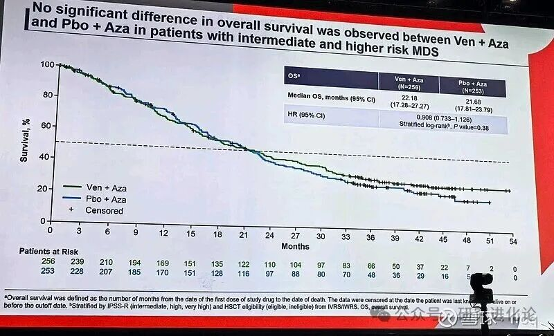

# bcl-2抑制剂与血液瘤

> 2026.07.12

1. bcl-2是线粒体凋亡通路的"总闸"，通过抑制促凋亡蛋白（BAX/BAK）决定细胞生死，癌细胞靠它"锁死"死亡程序，因此靶向 BCL-2 就是给癌细胞重新安装自毁开关。

2. bcl-2靶点很有意思，它是自带毒性的。简单的说就是，在正常造血干细胞还有很多身体重要的细胞都或多或少会依赖于bcl-2存活。那么就导致了，正常用bcl-2抑制剂治疗的时候，自然会导致相关的毒性，也就是bcl-2靶点的on-target在靶毒性，特别是骨髓抑制，现象是中性粒细胞减少、血小板减少、贫血等等，免疫系统被打击了很容易感染。还有一个on-target毒性是肿瘤溶解综合症tls，是短期内大量细胞同步凋亡，钾、磷、尿酸、钙代谢崩溃，这是杀肿瘤细胞太快的结果。

3.bcl-2抑制剂的疗效是由药峰浓度（Cmax）驱动。简单来说就是，一旦bcl-2触发细胞凋亡程序，启动了就停不下来，这个肿瘤细胞就会凋亡。但是bcl-2抑制剂是扣押上游的化学物质bim，也就是说在实际情况中，达到Cmax时，并不能保证把肿瘤细胞都给触发凋亡了，而这个时候就需要能持续占住靶点，也就是在一点时间内不把bim给释放了，不然还没杀到的肿瘤细胞就不慌了。

4.细胞凋亡有三兄弟，bcl-2、bcl-xl、mcl-1，bcl-2遇到压力时，会启动另外两个通路代偿，这个时候仅仅抑制bcl-2就不够了，这就是bcl-2抑制剂很容易耐药的其中一个核心原因。所以前面第3点里，既要能Cmax高峰值，又要能持续一些时间占用住靶点，这样才能更好的杀肿瘤细胞，并且不给机会通过其他通路代偿。

5.前面第2点提到了，你为了杀肿瘤细胞疗效越好，那么你的on-target毒性就会越厉害，疗效与安全性（毒性）是鱼与熊掌不可兼得。这里就会引申出，对于患者的治疗，身体情况就会很重要，也就是说如果你身体状况越好，你就越能扛住毒性，就可以更好的让疗效发挥杀肿瘤细胞，追求疗效第一位，反过来，你的身体状况越差，你就越不能对抗毒性，那么疗效就只能放在第二位了。可以这么说，bcl-2抑制剂在治疗时很像是一场患者身体状况的测试。

6.血液瘤各种疾病发病原因不同，这也造成了治疗范式的不同，对bcl-2抑制剂的要求也就不同，这就造成了bcl-2抑制剂没有绝对意义的best in class，只有具体疾病的best in disease。

7.cll/sll，bcl-2抑制剂是btk的辅助；aml，侵袭性很强，尽可能快速杀伤肿瘤细胞是第一原则，但unfit aml由于患者身体情况差，疗效和安全性都要兼顾；hr-mds，患者骨髓微环境非常差，对安全性要求特别高，那必须在安全性第一原则的前提下去杀伤，否则就会出现疾病没杀死病人，治疗把病人杀死了。

8.维奈克拉ven是bcl-2抑制剂的fic，后来者有上市的亚盛医药2575，百济神州的11417，以及还未上市的诺诚健华248。这几个分子很有意思，都有各自的特点，并且都非常深刻的体现了公司的基因文化。作为fic，ven是比较中性的分子，它的疗效很强但不够强，半衰期也长，靶点持续占用也很长，自然安全性就不行。百济神州的11417，对bcl-2的亲和力非常强，Cmax很强，虽然半衰期很短，但靶点也会持续占用一些时间，即追求更深的疗效，结果就是疗效比ven更强，但安全性比ven还差。诺诚健华的248，针对ven的一些瑕疵进行了分子修改，但没有特别的点，也很符合工程化fast-follow特点，各方面都比ven强一点，但疗效大概率是不如11417的（临床基线不一样，通过对基线、疗效、安全性和机制的理解推断）。

9.亚盛医药的2575，能够快速摄取细胞，能够迅速达到Cmax启动凋亡，但亲和力一般，没有持续的靶点占用，半衰期也很短，是hit and run的完美体现。结果就是，安全性非常好（给骨髓恢复时间，不持续打击），但疗效只能说是良好和ven相当吧。

10.总结下来排序，疗效层面是11417\>248\>ven\>2575，安全性层面是2575\>248\>ven\>11417。这个比较可以得出全球角度结论（国内不讨论）：百济神州11417因为有泽布替尼，所以cll是主战场；亚盛医药2575，hr-mds是主战场，也是唯一符合hr-mds要求的分子，未来unfit aml也可能会是主战场，cll等待btk protac 3288，在此之前1.5线cll提供过渡但不容易；诺诚健华248，相比ven有全方面的优势，但只是80分比70的差距，非常符合me better一点点没有代际差距的情况，在ven巨大的真实世界壁垒前商业化性价比太差太差，仅仅特定的细分情况比如fit unfit aml是不太走得通的，实际上很多疾病都有这种后来者相比fic分子有优势但不代际优势没办法商业化的情况。

11. unfit aml、hr-mds等，只有bcl-2抑制剂是不够的，bcl+aza也不够，未来还需要更多的联用，联用的前提就是安全性，这是门槛，安全性窗口没有的分子是没办法去联用的，一旦进入联用角度，疗效就没这么绝对了，因为其他分子可以补上你的疗效小瑕疵。就像hr-mds，ven折戟了，历史上好几个不同机制的分子也都折戟了，早期临床数据都很好，但就是安全性问题，早期临床可以通过支持治疗通过精细化临床管理来进行，停药、减量都不是问题，但大三期不行。这也是，对于unfit aml、hr-mds这些安全性很重要的适应症，早期临床数据最重要的是减量、停药、不良事件等信息，而不是cr、umrd这些信息；另外需要注意，不良事件比例绝对值很重要，但更重要的是恢复时间，这是减量停药的原因。

仅代表个人观点，作为思考记录。


# 亚盛医药思考系列（1）：HR-MDS

> 研究进化论 · 2026年7月15日 23:04

hr-mds对于亚盛医药而言，可以说是天王山之战了，2575的理论机制在现实中到底能不能成立，就看Glora4的结果了。

一、Bcl-2抑制剂的机制

BCL-2是一种抗凋亡蛋白，在多种血液肿瘤中过度表达，它通过结合并抑制促凋亡蛋白（如BIM、BAK、BAX）来阻止细胞凋亡。

Bcl-2抑制是Cmax（峰浓度）驱动的：

- BCL-2抑制属于"开关式"效应：需要足够高的药物浓度才能饱和占据BCL-2的BH3结合槽，释放促凋亡蛋白（BIM/BAK/BAX）
- 低于阈值的浓度无法有效竞争性置换，肿瘤细胞继续存活
- 浓度-效应关系陡峭：一旦超过阈值，凋亡迅速启动

不过虽然Cmax是关键驱动因素，但维持足够的暴露时间AUC也很重要：

- 占位稳定性：BIM释放后需要足够时间激活下游caspase级联，这个过程不可逆但需要"窗口期"
- BCL-2再合成：肿瘤细胞会持续合成新的BCL-2蛋白，需要药物持续存在来占据新产生的靶点
- BH3-only蛋白竞争：细胞内BIM浓度相对较低，药物解离后BCL-2可能会优先重新结合BIM

用一个简单形象的比喻就是：

- Cmax=用力推开一扇门（释放BIM）
- AUC=抵住门不让它关上（防止BIM被重新扣押）

所以用Cmax和AUC可以评估bcl-2抑制剂的疗效强度，但问题在于Bcl-2不仅仅在肿瘤细胞表达，正常细胞比如造血干细胞HSC也依赖bcl-2，因此治疗的同时自带了在靶毒性（on-target毒性），比如骨髓抑制导致打击正常造血功能，中性粒细胞等减少进而造成感染，比如大量肿瘤细胞同时凋亡可能导致TLS。

也就是说，Cmax和AUC越高，疗效就越强，但毒性也越强。

二、不同bcl-2抑制剂的比较

既然bcl-2抑制剂是疗效与安全性的平衡，那分子的开发哲学就会各有侧重，并且都希望找到平衡的那个“甜蜜点”。在研发开发的时候，亲和力等各种临床前数值都能测试，但药物进入人体后实际效果是个黑箱，也就是pk/pd（包括亲和力、解离速度、半衰期等等）下呈现什么结果是事前无法预判的。

- 维奈克拉V药，Cmax高，半衰期很长，AUC高，给后来的bcl-2抑制剂打了一个样；但TLS和骨髓抑制的风险不小；并且用药之后正常HSC骨髓抑制的恢复速度慢；
- 百济神州11417索托克拉，Cmax非常高，半衰期很短，但AUC并不低，因此疗效比V药强很多；因此毒性不比V药小，用药之后正常HSC的骨髓抑制恢复速度可能也没比V药快哪里去；
- 诺诚健华248，Cmax比V药可能高一点，半衰期也不短，AUC比V药还高，但在安全性下针对次要矛盾做了一些针对性改进，整体形成的毒性看似比V药小一些，但正常HSC的骨髓抑制恢复速度也慢；

实际上，V药、11417和248三个分子本质是一个开发哲学，结果就是疗效强、安全性较弱特别是骨髓抑制恢复时间慢。

- 亚盛医药2575利沙托克拉，Cmax也不错（足够了），半衰期很短，AUC很低，形成了hit and run，安全性突出，骨髓抑制恢复时间快。这是完全不一样的开发哲学。

既然疗效与安全性是一个平衡，安全性是没有绝对的，是需要根据具体适应症/患者具体情况来具体问题具体分析的，是先追求疗效还是先追求安全性是用哪种bcl-2开发哲学先需要思考的。

三、HR-MDS

hr-mds这个疾病的情况是：

- 骨髓衰竭为基础：患者已存在严重血细胞减少，骨髓抑制是致命的，不能雪上加霜
- 原始细胞比例：虽然比AML低，但也需要有效清除恶性克隆，防止向AML转换，也就是疗效也不能抛弃
- 老年脆弱人群：患者中位年龄高，合并症可能多，对安全性要求高，并且对分子代谢通路有要求，防止DDI（2575比V药、11417都很低，因为代谢通路不同，248宣称很低，但尚未明确研究结果）

治疗目标：改善血象、延缓转白、延长生存，安全第一，疗效第二。

历史上很多分子折戟大三期，并且是在早期临床数据很好的情况下，比如CD47靶点的magrolimab，当然V药的verona也是。

需要非常关注的是，两者的早期临床的不错疗效数据都是基于精细化临床管理支持治疗下得到的，但推迟减量的比例的非常高，在大三期模拟真实世界非精英医疗中心的情况下，标准化治疗就出问题了。

引用一下magrolimab的早期安全性问题：

> In cycle 1,median (range) hemoglobin change from baseline to the first post–magrolimab infusion sample was -0.7 g/dL (-3.1 to +2.4 g/dL), and median maximum drop was -1.1 g/dL （-5.6 to +2.0 g/dL) between the first and second magrolimab doses and -0.5 g/dL (-4.9 to +5.4 g/dL) between the
>
> second and third magrolimab doses. A total of 27.2% of patients had a 》2 g/dL drop and 10.9% had a 〉3 g/dL drop from baseline between magrolimab doses 1 and 3.
>
> TEAEs led to magrolimab and azacitidine dose delays in 52.6% and 49.5% (the most common reason for magrolimab and azacitidine dose delays was neutropenia: 14.7% and 12.6%, respectively), and dose reduction in 0% and 17.9%, respectively (most commonly because of neutropenia: 11.6%; Data Supplement). TEAEs led to treatment discontinuation in 10 patients (10.5%; Data Supplement).

单药aza也有减量，2575的安全性优势在hr-mds可以发挥得淋漓尽致，即联合aza减量推迟的比例不会提高很多，很可控，因为骨髓抑制比例低并且恢复的时间快。

V药大三期verona虽然失败，但真实世界也有off-label使用，最新的真实世界数据显示，有较好支持治疗的个性化治疗下，cr率在30%左右，2023 iwg 的crc在50%左右，mos在26个月附近，和早期临床的数据非常一致。在这种情况下，做统计学分析，相比aza单药，tp53wt的hr os非常显著小于0.5，不过tp53突变的hr os在1左右没有获益。

实际上，这个数据给bcl-2+aza这个联合用药在hr-mds给了一个定性，也可以说是相对的天花板了，即可控的安全性下，cr率就在30%左右了，crc率就在50%左右了，而aza单药的cr率在15%左右，crc率在30%左右。即bcl-2靶点在hr-mds这个适应症是没有问题的，cr转化为os也是通畅的。（248作为V药的me better版本，在hr-mds应该也是没戏的，早期10例精挑细选患者，cr率40%、crc率70%，但60天死亡率20%，这也是被v药天花板数据锁死的，牺牲安全性的疗效是没有任何意义的）**（ps：这么说有问题，即使 off-label 精细化管理，Venetoclax 仍然存在减量的可能，影响 bcl-2的药效）**

2575的早期临床的cr和crc率也差不多在这个数值范围，相信安全性突出的情况下，大三期有比较高概率复刻这个数据，即Glora4最终的数据可能cr率30%、crc率50%、mos26-28个月。（还有一个数据，md anderson中心的数据显示，V药在rr mds的mos大概在7-8个月，2575在rr mds的mos大概在11+个月，这也可以提高信心）

不过这个天花板太明显，未来还需要像实体瘤那样，加入新的药物联用，即形成免疫+靶向+表观调控的多药联合，才能进一步提高os。CD47靶点就是免疫，目前在临床中安全性非常突出的免疫疗法还有靶向巨噬细胞clever-1靶点的bexmarilimab，cr率在40%以上。展望未来，bexmab+2575+aza是很有希望进一步在一线提高cr率和os的组合；而对于后线，则需要序贯了，比如bcl-xl protac等了。

这里就要提到亚盛的另外三个管线，mdm2 protac针对tp53wt，bcl-xl protac，而5918可能对于部分tp53突变有效。至于1351，由于也是血液相关毒性，1351+2575在hr-mds不太好说，当然前面说的这三个分子，也一样可能有安全性问题。但不管怎么样，这是亚盛hr-mds的生态战略。


# 亚盛医药思考系列（2）：HR-MDS下的CR与OS关系以及GLORA4分析

> 研究进化论 · 2026年7月17日 10:17

前文思考系列(1)简单的说了一下，HR-MDS适应症下bcl-2抑制剂联合aza这个治疗范式的情况，不同bcl-2抑制剂的开发哲学以及与适应症的匹配度。但在平常思考的时候很自然的会有一些疑问，需要进一步回答：

- 过往这么多分子折戟hr-mds大三期，早期临床的cr率都很不错，cr与os的转换存在障碍吗？
- venetoclax+azacitidine 的早期临床的mos只有26个月左右，真实世界也差不多在这个水平，只比aza单药多几个月？这个治疗范式能算是代际差别吗？
- v药的verona大三期失败了，同为bcl-2抑制剂的2575的大三期glora4，该怎么思考？事先我们应该怎么去分析glora4的成功率？
- 疗效的cr标准，骨髓原始细胞要求是小于5%，但很有意思的是，hr-mds分类里，有很多患者一开始就是骨髓原始细胞小于5%，不治疗也达到cr要求？
- 为什么没有像AML那样很强调umrd阴性？

一、IWG下的HR-MDS的疗效标准

IWG标准经历了几个时代：

| 维度 | IWG 2000 | IWG 2006 | IWG 2023 |
| --- | --- | --- | --- |
| 时代背景 | 化疗时代 | HMA 时代开始 | 新型靶向药时代 |
| 核心问题 | 统一评估标准 | 引入 mCR 适应 HMA 骨髓抑制特点 | 发现 mCR/SD 无 OS 获益，需重新定义"有效" |
| CR 严格度 | 较严（ANC≥1.5，持续8周） | 稍松（ANC≥1.0，持续4周） | 更合理（Hb≥10，原始细胞\<5%） |
| 对血液学恢复的重视 | 隐含在 CR 定义中 | mCR 允许无血液学恢复 | 强制要求血液学恢复（CR-L/CRh 均有最低血象要求） |
| 与 AML 关系 | 独立体系 | 独立体系 | 趋向统一（尤其 MDS/AML 重叠区） |
| ORR 构成 | CR+PR+HI | 混乱（各试验自定义） | 标准化：CR+CRequ+PR+CR-L+CRh+HI |

verona之前大家都用的iwg 2006标准，平常的早期临床也主要是2006标准，这两年慢慢2023标准多了起来。

- CR（2006）：骨髓原始细胞 \<= 5%、血红蛋白Hb \>= 110g/L、中性粒细胞ANC \>= 1.0 x 10^9/L、血小板PLT \>= 100 x 10^9/L
- CR（2023）：骨髓原始细胞 \< 5%、血红蛋白Hb \>= 100g/L、中性粒细胞ANC \>= 1.0 x 10^9/L、血小板PLT \>= 100 x 10^9/L
- CRL（2023）：骨髓完全缓解，但外周血只有1系或者2系计数恢复达标
- CRh（2023）：骨髓完全缓解，中性粒细胞ANC \>= 0.5 x 10^9/L、血小板PLT \>= 50 x 10^9/L
- HI：血液学改善，外周血的血细胞（红细胞、血小板、中性粒细胞）计数有临床意义的提升
- mCR with HI：骨髓完全缓解伴血液学改善
- mCR without HI：骨髓完全缓解不伴血液学改善

对这些指标梳理很重要，也对理解治疗效果的本质很重要：

- HI虽然没有达到骨髓完全缓解，但血液学改善摆脱输血等提高生存质量，可以很好的提高OS；
- mCR虽然骨髓完全缓解，但实际情况下，mCR without HI并没有很好的OS获益，而mCR with HI有实实在在的OS获益，在v药的hr-mds临床里有这两者的区分；
- 2023标准废除了mCR，引入了CRL和CRh，这两者相比mCR with HI虽然更精确，但也有瑕疵：因为CRh只需要满足数值标准，并不代表患者接受治疗之后的血象比治疗前更好，可以治疗后依然达标但血象治疗后更差了，这不是好现象，而mCR with HI虽然没那么精确但明确要求血象比治疗前更好；虽然有真实世界数据证明2023标准的CRh与os强相关，但这些证据大部分来自于HMA时代，也就是aza单药治疗的结果，而aza单药的HI率非常高，aza的os很大一部分来自于血液学改善，所以出现说的坏现象可能性很小，但在bcl-2+aza时代，这种可能性会大大提高，因为bcl-2抑制剂的骨髓抑制更大，也就是说短周期比如1个或者2个周期治疗后的ccr数据不一定有非常强的参考作用（6个周期后的治疗效果不会有这种问题），早期临床有时候数据里就有部分是这种治疗周期后的；
- CR不管是哪个标准，与OS是强相关的，CR的OS显著高于mOS；

在AML里，umrd阴性是比cr更精确的测量方式，并且umrd还会根据测量方式的不同精确性会进一步提高。但HR-MDS里还不容易，因为异质性太强，没有明确的测量目标，非常多种类的突变不仅一开始就有，治疗过程中也会有进展中的新突变。不过，理念上，也可以引用umrd阴性这个说法，和AML一样，就是CR并不代表完全清除肿瘤细胞，也就是CRumrd阳性容易复发，CRumrd阴性复发更难。在hr-mds里，由于患者的情况，疾病的复杂性，umrd阴性的难度很大。

移植依然是治愈的唯一方式，相比AML，hr-mds的移植条件宽松很多，毕竟骨髓原始细胞少很多，进行一些预处理就可以移植，当然移植前条件越好移植后的OS自然也可能越好。所以，bcl-2+aza相比aza单药，作为新的治疗范式，除了提高os之外，也能创造更好的移植条件，当然患者身体情况不允许移植是另外一码事。

二、历史大三期的治疗效果

AZA-001（成功）：

CR 17%、PR 12%、HI 49%，mOS 24.5个月，2年os率50.8%；

“ 阿扎胞苷的主要OS贡献来源于HI血液学改善比如脱离输血依赖等带来的高质量生存。“

还有需要说明的是，aza发挥效果是需要多个周期持续治疗的：

“ 阿扎胞苷的客观缓解可能需要 4–6 个月 才能显现，而且在许多患者中，缓解似乎会随时间推移而加深。首次客观缓解出现在中位 2–3 个周期后（范围 1–16 个周期），约 90% 的首次缓解在 6 个周期后观察到。此外，在首次缓解后继续阿扎胞苷治疗，可使 48% 的患者缓解进一步加深，92% 的缓解者在 12 个周期内达到最佳缓解。从首次缓解到最佳缓解（CR 或 PR）的中位时间为 3–3.5 个周期。”

Verona（失败）：

CR 18%（对照组20.2%）、mCR 57.8%（对照组37.5%）、ORR 76.2%（对照组 57.7%）、HI 49.4%（对照组41.2%）

失败的原因已经很清晰的分析，核心聚焦在：第一安全性问题导致中止治疗、推迟、减量等，aza作为治疗骨架的作用发挥不出来；第二hr-mds的异质性太复杂，基因突变复杂特别是tp53突变的OS很短拉低整体水平，且没什么获益；第三原始骨髓细胞小于5%的患者没有收获OS获益；（第2点和第3点有一些重合，因为原始骨髓细胞小于5%的患者能进入中高危很多都有tp53突变）

1. 原始骨髓细胞小于5%本来就是CR的一个部分标准，对于这部分患者，OS的核心来源就是HI血液学改善，aza单药的核心作用就是这个，自然这部分患者aza的效果是不错的（aza-001里有证据原始骨髓细胞对结果的影响没有异质性），但ven+aza，ven的毒性带来的副作用不仅抵消了aza的正向作用，还可能带来负向作用。这个点说明，bcl-2抑制剂要么安全性特别好保证aza的正向作用发挥，要么有更多的机制可以加强骨髓微环境进一步改善血液（免疫疗法+aza其中一个点就是这个维度）。当然，还有一个角度就是，后续大三期做亚组，直接限定骨髓原始细胞大于5%就行了，这确实是最容易的办法，不过这个方法会自然的剔除很多tp53突变；

2. tp53特别是双等位突变、复杂核型的预后不行（这些患者的OS可能是12个月作用，远远低于整体mos，自然在大三期，这部分就会拖累稀释好的结果，就算tp53 的os hr能够小于1有获益，也会影响整体的os hr），不仅CR更难，因为睡眠的静态癌细胞可能不仅依赖bcl-2，还可能依赖bcl-xl或者mcl-1，而且即使CR之后复发也可能很快，也是因为依赖bcl-xl或者mcl-1的原因，只有bcl-2抑制剂是不够的。这个点说明，bcl-2抑制剂如果仅仅只有bcl-2的效果，对于tp53突变那会束手无策，除非有证据表明分子还有bcl-2抑制之外的效果，比如针对维奈克拉耐药(主要就是bcl-2压力下的bcl-xl和mcl-1代偿）有一定的效果。

3. bcl-2+aza，aza是基础，bcl-2是aza基础上来发挥作用的，无论如何都不能拖累aza的正常疗程，虽然aza本身也有骨髓抑制，也会导致一定比例的推迟减量中止。这个点说明，bcl-2抑制剂的安全性窗口要足够好，骨髓抑制的恢复速度快（不良事件可能会增加，但恢复速度快可以弥补），推迟减量中止的比例提高太多，尽可能保证aza治疗的完整性。而不是像ven一样：

> “ Serious side effects leading to treatment discontinuation occurred in 41.6% of patients in the combination arm and 55.3% of patients in the placebo arm, while dose interruption was noted in 78.8% versus 67.9% of patients and dose reduction of Venclexta or placebo was found in in 12.5% versus 6.9% while azacitidine was 48.6% versus 27.2%.。”

4. 实验组的mCR更高，但mCR里有一部分是mCR without HI，这部分是没有获益的。但这并不是表示mCR完全没有意义，只不过是只有mCR with HI才有意义，这部分的OS不会比CR组差很多。包括ven的早期临床也表明，我们很多时候特别关注CR，但mCR也需要重视特别是如果这个里面mCR with HI占比很高，前面提到iwg 2023标准就是为了改善mCR的缺陷，但也新带来一些瑕疵，但瑕不掩瑜，iwg 2023标准的cCR也有不错的参考作用，而这个cCR率在bcl-2+aza范式下可以达到50%甚至更高的水平，这是相比aza单药带来OS提升的关键。

不过虽然verona失败，但亚组分析还是ok的，也就是bcl-2+aza的治疗范式是没有任何问题的。

PANTHER（失败）：（这是非常有意思的一个hr-mds试验）

这是武田的一个试验，药物是pevonedistat：Pevonedistat是first-in-class的NEDD8活化酶（NAE）抑制剂。NAE负责激活cullin-RING E3泛素连接酶（CRLs），抑制NAE会阻断CRL底物的降解，破坏肿瘤细胞蛋白稳态，导致细胞周期紊乱和凋亡。临床前模型中pevonedistat与AZA有协同抗瘤活性。

CR 24%（对照组aza 32%）、mCR 23%（对照组 20%）、HI 19%（对照组11%）、ORR 43%（对照组 43%）、中位CR持续时间 17.1个月（对照组14.1个月）、OS 21.6个月（对照组 17.5个月，HR 0.785，但是P值 0.092，95% CI（0.593-1.039））、安全性差不太多

1. 对照组aza的CR率非常高，达到了32%，试验论文作者归因为：方案强烈不鼓励在前6个周期因血液学毒性减量或推迟AZA——对照组AZA剂量强度维持在98.4% ；而AZA-001时代按说明书惯例，出现细胞减少就减量/延迟，后续的试验都是沿用这个惯例，verona也是如此，但是这个数据说明了几个问题：

- 还是aza用量的保证，不仅剂量还有周期持续，这对疗效保证很关键；
- CR提高了这么多，mos也只有17.1个月，对于aza单药而言，血液学改善是OS的重要来源，cr+mcr with hi也依然还不够高，没有cr的患者的依然是mos的重要因素。

2. 实验组的CR率不够，不过cr的持续时间更长，事后的分析显示，治疗周期不中断越长，os的获益越大。这说明，如果不能提高CR率，是没办法成为aza的add-on分子的，此外CR的持续时间也很重要。

ENHANCE（失败）

CD47的magrolimab，不多描述了，核心原因类似verona，安全性不够导致减量推迟等，aza的基础没得到保证。

三、GLORA4的启示

前面的分析，可以总结一些事前的分析逻辑点，即hr-mds的大三期（不限制亚组），事前怎么去分析成功概率：

1. 安全性：不良事件尽可能控制，骨髓抑制恢复时间尽可能快，不仅维持aza的用药强度并尽可能让aza用的周期足够长，也能在骨髓原始细胞小于5%的患者里不因为安全性反而损害aza的效果；

2. CR率（深度缓解路径）：CR+mCR with HI要提高，这与OS是强相关的，是整体OS获益的核心来源；CR的持续时间越长越好；

3. TP53突变以及复杂核型： 对于这部分高危患者是否有不同的机制作用，尽可能在这部分患者里也能OS获益；

4. 骨髓微环境作用（广度缓解路径）：在aza的血液学缓解的基础上，进一步加大缓解，通过改善骨髓微环境；

5. DDI：hr-mds患者年龄相对偏大，身体情况不佳，可能需要联合其他用药比如抗真菌药，DDI虽然不能说是绝对重要因素但也是不能忽略的因素。

当然肯定不止这五点，这是前文分析出来的很自然的几点。

亚盛的2575满足哪几点：

1. 较为满足，虽然也有减量推迟，但相比aza单药上升幅度有限；相比之下，venetoclax、magrolimab等上升幅度很大；这是2575分子哲学hit and run的直接结果；

2. 较为满足，相比ven还是弱一点，cr持续时间从早期临床数据看也比ven可能少1个月的样子但也不短，整体和ven算在一个水平维度里；

3. 微弱满足，引用大俊总的话就是：

“从作用机制来看，我们需要明确，绝大多数Bcl-2抑制剂耐药并不是由于新的靶点突变，而是由于Mcl-1以及Bcl-xL表达上调所致。也就是说，真正导致耐药的是下游通路的变化。因此，我们分别用维奈克拉和利沙托克拉处理耐药细胞株，并进行了全谱表达分析。结果发现，两者对下游通路的调控模式并不完全一致。这或许能够解释为什么利沙托克拉联合阿扎胞苷（AZA）在维奈克拉治疗失败的患者中仍然能够发挥作用。”

4. 微弱满足，临床前研究证明：APG-2575 确实具有"微弱的广度作用"——它通过直接结合 NF-κB p65 激活 NLRP3 信号，将 M2 免疫抑制性巨噬细胞重编程为 M1 免疫刺激性表型，同时分泌 CCL5/CXCL10 招募 CD8+ T 细胞；这个机制与 BCL-2 抑制无关，是独立的免疫调节功能；在骨髓微环境中，这可能意味着恶性克隆被免疫清除的同时，正常造血生态位被释放，造血恢复更快。

rr mm不需要t（11：14）阳性的早期临床，以及rr hr-mds 11+个月的os，可能3和4发挥了重要作用。

5. 满足，2575代谢通路不是只有cyp3a4，也不是P-gp或BCRP的底物。

看上去2575这个分子在事前分析很符合hr-mds的需求，不过这都是事前的分析，就像PANTHER试验，二期数据特别好，但三期失败，并没有什么特别原因，很自然的就是二期到三期样本量扩大进一步随机更加真实世界的情况下，就这么失败了。

一方面，通过事前分析增加信心，但另一方面，要对风险要有充分的敬畏特别是基于早期临床数据的小样本偏倚。也可以随便列举大三期几条风险：

1. TP53的比例？原始骨髓细胞小于5%的比例？

2. 早期的30%CR率能否复制？

3. 小样本的安全性在大样本能否复制？

4. 对照组治疗失败后off-study带来的挽救效果影响？

5. 移植比例是否会形成影响？

当然，贝叶斯概率可以持续分析，比如真实世界off-label使用2575很多，虽然也是小样子，但不管如何都是非常好的信号。此外，真实世界ven的数据也持续证明，对于tp53wt，是有很强的OS阳性获益的。


# 亚盛医药思考系列（3）：AML（急性髓系白血病）

> 研究进化论 · 2026年7月20日 18:15

前面两个思考系列说了hr-mds和亚盛的大三期glora4，本文思考系列第三篇，介绍亚盛在aml的布局。AML疾病根源在于骨髓造血干/祖细胞(正常的细胞)，因基因突变干扰了细胞的正常生长和死亡指令，使其转变为可以无限增殖、但无法正常分化为成熟血细胞的“白血病细胞”；这些异常的“坏细胞”在骨髓中大量积聚，挤占了正常血细胞的生存空间，从而引发疾病。追求深度缓解是治疗AML的原则，不仅追求形态学上的“完全缓解”（癌细胞消失），更追求微小残留病（MRD）转阴。所以，作为bcl-2抑制剂的分子特性需要很强的杀伤能力，能够又快又强杀伤癌细胞。

前面提到，相比Ven、11417、248等追求疗效的分子，2575在这一点上稍微有点逊色（这个逊色是从aml的早期临床数据简单推测的结论，但与维奈克拉相比，大概率应该是一个水平维度的，就像国内早期临床PI的结论：疗效良好安全性突出）。不过从未来的角度，2575也非常有希望，亚盛的战略也比较清晰。

一、AML的治疗范式：精准分层

AML的患者根据两个维度来进行划分：

- 患者耐受度：这直接决定了该用什么样的治疗强度，根据年龄、体能、基础疾病等因素来进行划分，分为fit aml（海外通常为60岁以下或体能状态好的年轻患者）和unfit aml（海外通常为75岁以上或不耐受的老年患者），很有意思的是60-75岁是一个模糊地带，医生会根据情况来进行划分，并没有绝对的标准，不过大部分时候如果仅仅是年龄角度的话，很有可能采用fit的方案，或者fit和unfit结合吧。也就是海外可以认为75+/unfit aml，不过国内是采用60+/unfit aml，因为年龄是极其重要的因素，这个差别的结果就是如果国内的临床数据是按照国内标准来入组，那结果是没办法直接与海外的数据进行对标的。
- 生物学特征：通过基因检测等手段，明确AML的具体亚型和基因突变状态（如FLT3、IDH1/2、NPM1、TP53等，然后针对性的选择靶向药。

AML的治疗SoC：

- fit aml诱导缓解治疗阶段：目标是快速清除白血病细胞，使病情达到完全缓解。1. 经典方案：强化疗，“7+3”方案，即阿糖胞苷联合柔红霉素；2. 联合靶向药物：基于基因检测结果，在“7+3”方案基础上联合靶向药；缓解后治疗：达到缓解后，根据预后风险决定后续方案：1. 预后良好：继续多疗程的高剂量阿糖胞苷巩固化疗；2. 预后中等或不良：异基因造血干细胞移植是首选，应尽早评估；

- unfit aml 对于老年或不适合强化疗的患者，治疗转向靶向与低强度化疗的结合。1. 一线SoC：ven + HMA2. 联合靶向药物
- r/r aml没有标准的方案，不过部分具体的突变有具体的靶向药。

二、AML里未被满足的需求

先不考虑基因突变的情况下， 可以发现AML适应症就是一个患者身体素质（包含年龄、基础疾病等）的光谱，身体素质越好，就越能抗住强化疗，随着身体素质变差，就要从强化疗往低强度化疗变化，当然，如果身体素质极差那就只能挽救性的尽可能了。

如果是Bcl-2抑制剂，那可以突破的路有几条：一是在unfit aml里比FIC Venetoclax更好，这个更好可以是疗效更好，也可以是安全性更好毕竟Ven的一个问题就在于毒性太高，真实世界的难度很大；一是在r/r aml去满足维奈克拉失败或者耐药，不过Ven的失败可能是tp53双等位突变这种超级大难题，也可能是Bcl-xl/Mcl-1通路代偿，这两者正常仅仅靠bcl-2抑制剂都不太可能很好的解决，那这条路肯定是成为其他药物的搭档，通过bcl-2+aza+x的方式来解决(当然一线未来也会是这种方式，bcl-2+aza+靶向就是这种方式）。

1. 比Ven的疗效更好方式

维奈克拉的unfit aml大三期VIALE-A的数据，中位年龄76岁，CR率36.7%、CRC 66.4%、umrd阴性 23.4%，OS 14.7个月，且还有安全性问题，对精细化管理支持治疗要求高，如果是年龄更大情况更糟糕的患者，还维奈克拉不耐受没办法用。因此，就像很多靶点一样，成为Ven的me better达到Bic是很自然的改进角度。11417和248都追求更深度的缓解。

11417的早期临床数据基线相对类似，可以与Ven药直接类比。CR率50.6%、CRC 67.1%、mrd阴性35.4%，安全性虽然可控，但停药终止比例并不低，考虑到非大三期，支持治疗情况比大三期会好一些，这个整体疗效数据会比Ven要一些，安全性不好说，但有代际提升的概率不能说高，有可能是一般的me better。

248的早期临床数据漂亮很多，但是国内的临床数据，基线是采用国内的60+/unfit，中位年龄才65岁(有RR患者，TN的患者也一样不到70岁)，没办法和ven对比，特别是安全性，年龄是一个非常重要的因素（就像前面说的， 在海外很可能被划分进fit组）。CR率65.7%、CRC 81.8%、umrd阴性86.7%，数据非常漂亮。

由于没有更多的海外直接对比数据，可以用更多的国内数据来思考unfit aml下，维奈克拉真实世界水平到底如何。

2026 EHA，一项针对中国老年unfit AML患者的III期研究显示，在维奈克拉+阿扎胞苷（VA）两药方案基础上，再联合小剂量阿糖胞苷（LDAC）的三药方案（VAA），能显著提高疗效。（这个方案对应了前面我们说的光谱中间模糊地带，是可以把fit 和 unfit 动态结合的）

这是国内的数据，大概率是60+/unfit，VAA vs VA标准化方案，正好对照组可以作为参照真实世界国内Ven的水平。CR率 71% vs 55.3%、CRC率 77.4% vs 60.6%、umrd阴性率 79.2% vs 45.6%、mOS 未达到（超过20+个月） vs 13.8个月，安全性方面加了强化疗的药，自然需要更好的支持治疗，但本身Ven也需要支持治疗。

这个数据最直观的推论是：11417代际领先ven概率不是很高；248在中间模糊地带有可能代际领先ven（但海外模糊地带不一定用ven而是用强化疗），至于75+/unfit则未知(但考虑疗效与安全性平衡问题，75+本身非常难CR非常难umrd，且对安全性的要求指数级提升，大概率不太可能代际领先，但如果真头对头能赢是大概率的)。这个数据还有一个很关键的推论是，虽然ven有安全性问题但真实世界医生对ven的了解驾驭越来越好，也包括把ven作为骨架分子的各种联用探索，还有ven的专利期不远仿制药快解锁，可能在unfit aml上，想通过疗效取代ven的窗口期急剧缩小且可能性非常低。

2. 比Ven的安全性更好方式

既然疗效希望不大，安全性呢？2575有希望吗？这个答案应该是没有，且不说头对头能不能很好的赢，就算能赢真实世界医生也不太会因为安全性好一些疗效没改善而去换熟悉的soc。

但是前面也提到，光谱右端身体素质状况越来越差，对维奈克拉的耐受度也会不行。既然fit和unfit中间有fit unfit这种模糊地带，那unfit右端也有unfit unfit的极度unfit客群，这个客群就适合2575了，既然不能用ven+aza，那一线soc就是aza了。（综合前面说的，如果我们把光谱分成四段，从左到右的一线soc，可以认为分别是7+3、ven+aza+LDAC、ven+aza、aza）

不过问题也存在，即这个客群是不可能全球范围内通过MRCT方式去拿下的，只能是迂回。就像亚盛的GLORA3，都没有美国在内，当然GLORA3也有很大的意义，即可以看到2575+aza到底如何，也可以在普通医疗中心作为ven的很好替代。

怎么迂回呢？第一条路，通过hr-mds建立口碑，如果GLORA4成功，那2575+aza会成为hr-mds的一线SoC，真正证明2575的机制和安全性是成立的，不是Ven的简单me better，而是不一样的bcl-2抑制剂；unfit aml和hr-mds同属一个疾病光谱，医生很可能是重复的，那很自然就会在unfit aml被使用接受；第二条路，通过在rr aml先通过联用解决未被满足的需求站住脚跟，然后再联用往一线挺进，这是很多其他疾病通用路径。

3. rr aml联合用药

正常情况，不是新靶点的分子或者没有解决靶点突变的差异化(正好bcl-2突变比例不大，意义不大)，走联合用药路线，即使从rr后线开始，也很难有希望，真实世界大家联用都是使用的ven+aza骨架，不会用你的bcl-2+aza骨架。幸好幸好亚盛有自己的分子矩阵，才能走这条路，就像CLL也是一样，如果你没有btk抑制剂太难。

2025 AACR 奥雷巴替尼+利沙托克拉：

药物机制：

- 奥雷巴替尼(1351)：一种多激酶抑制剂，可靶向多种与白血病发生和维奈克拉耐药相关的激酶，如FLT3、cKIT、PDGFR、Src家族激酶、PI3K及FGFR

- 利沙托克拉（2575）：一种新型、高选择性的BCL-2抑制剂

研究发现：

- 协同抗肿瘤效应：在维奈克拉耐药的AML细胞系中，联合用药协同抑制了细胞增殖并诱导了细胞凋亡
- 体内模型验证：在MOLM-13维奈克拉耐药AML异种移植小鼠模型中，联合用药同样协同抑制了肿瘤生长

作用机制：

- 协同下调关键信号通路：Western Blot分析显示，联合用药可协同下调多种促白血病信号通路，包括与维奈克拉耐药密切相关的FLT3、AKT、MCL-1等

研究结论：

- 1351联合APG-2575在临床前AML模型中成功克服了维奈克拉耐药，为这类难治患者提供了新的潜在治疗策略，并支持进一步开展临床研究

1351+2575+aza在rr aml的国内临床去年已经启动了，入组人数多达400人，可能是尽可能覆盖rr aml足够多的亚组，公司应该信心很足。相比glora3，这个临床重要多了，如果能进展到大三期那与glora4一个重要性了。目前没办法多说什么，耐心等待数据。

三、真实世界off-label

2026 EHA 国内四个中心的，2575真实世界疗效与安全性报告，25个AML患者，一线12人二线13人，不过基线很好(疗效不能说明太多问题，只能说良好），中位年龄63岁，低危60%，常见突变没有TP53，不过高危分子(HMR)突变比例43%。整体CRC 72%、umrd阴性率61%，算良好吧。

之所以提到这个报告，是有一个细节可能值得关注和思考，还有普通医疗中心的评价很重要。

1. 报告提到，有5例治疗前CRi或MRD阳性的低危患者，有2例获得更深层次的缓解，提示2575不仅能诱导初始缓解，还能进一步提升缓解质量，帮助患者获得更佳的长期预后。在治疗前，能到CRi或MRD阳性，切换成2575，大概率，要么是骨髓原始细胞杀得差不多了但因为安全性问题无法抗住新的治疗周期(CRi)，要切换更安全性的bcl-2抑制剂但疗效也不能太拉跨，这体现了安全性特征；要么是持续无法MRD阳转阴，那很可能是有残留的非bcl-2依赖白血病细胞，可能是2575能应对Ven耐药的机制发挥作用，当然这里肯定bcl-xl或者mcl-1代偿通路还没有很大比例，不然2575的机制也是不够的。

2. 四个中心里：有一个是中西医结合血液病诊疗中心，临床患者以老年患者为主，普遍合并多种基础疾病，脏器功能储备较差，对化疗及靶向治疗的耐受性要求极高，教授表示直观感受到2575的疗效和安全性平衡较优，DDI低，不需要频繁调整剂量，也不需要复杂的预处理，大大简化治疗流程，血液学毒性可控，通过常规的支持治疗就能管理，患者生活质量得到明显保障；一个是地市级医疗机构，患者多来自周边县域，受经济条件和地域医疗资源限制，无法常规开展基因突变检测，且以高龄、合并多种基础疾病、无法耐受强化疗的患者为主，教授表示临床医生不用等待分子分型结果就可以用2575作为老年unfit aml和hr-mds的优选，无需复杂预处理和密集的住院监测，显著降低医疗成本和患者就医负担。

这两点从贝叶斯概率角度，可以支持我们在思考系列2里提到的hr-mds的glora4成功概率，当然也是Glora3的部分市场定位。


# 亚盛医药思考系列（4）：bcl-2抑制剂2575的“基石”大单品之路

> 研究进化论 · 2026年7月31日 11:30

本文标题写的是2575的大单品之路，但文章内容并不是想表达2575有多么多么的厉害，而是想从一个分子怎么能成为大单品的角度来思考。前几篇系列文章主要是讲2575在髓系白血病的可能性，但没有涉及淋系白血病比如CLL，本文也会提到。

一个分子成为大单品的路径比较清晰，大概就是两种路径。一种就是某个适应症的空间特别大，一种就是多适应症累加，也可以两个叠加。在血液瘤里，泽布替尼就是在CLL里的前者路径，而bcl-2抑制剂的fic维奈克拉是跨血液瘤多适应症的路径，2575作为V药后来者也是这条路。

先把文章的一些核心观点摆出来：

1. “基石”这个词是有语境的。在实体瘤里，基本上可以理解为接近一个六边形战士，其他联合用药分子都离不开你。但在血液瘤里，有一点不同，因为bcl-2靶点的on-target毒性，疗效与安全性是需要平衡的，而血液瘤不同适应症对疗效和对安全性的要求并不一致，这就导致了血液瘤里如果bcl-2抑制剂能够成为基石，不太可能是六边形战士，一定是有缺陷的；而很简单的点，疗效的缺陷是可以靠队友来弥补的，但安全性是没办法的，安全性常识角度联合用药只会叠加。所以要想成为“基石”大单品，2575本身好不好重要又不是最重要的，说重要是如果只是自己好那仅仅是一个还不错的分子，如果要成为大单品重要的点却是在联用的队友好不好。

2. 目前血液瘤的情况，如果在其他药企手上，2575基本就是一个普通分子，最适配的那个血液瘤适应症是OK的；虽然亚盛准备自己推进2575的商业化，但实际上就算想BD，不考虑贱卖的话概率应该也不是很大。相反，隔壁的那个bcl-2抑制剂就是很强烈的为了BD的路径，所以早期临床是选择基线去“不公平”对比维奈克拉，并且只选择性披露好的信息而不披露不好的信息。

3. 2575可能只有在亚盛手上才有充分发挥作用的机会，这是亚盛从第一天开始深耕细胞凋亡的基因形成的，这是与其他biotech本质的差别，因为亚盛有潜在的分子矩阵来弥补2575的疗效缺陷，通过整体去满足未被满足的临床需求；但这个基因层面的差别坏处是导致本身的风险相比其他biotech也要大很多，好处是一旦成功护城河会非常强赔率会大很多，且这个赔率不是销售角度是估值溢价角度。

4. 继续第1点里的常规基石理解，在适配的适应症建立SoC口碑以及在不那么适配的适应症通过分子矩阵建立了安全性口碑之后，不适配的适应症就有了常规基石的可能性，后发先至，农村包围城市，也就是外部管线可能会来主动找你。当然，不管如何，理论逻辑上都不可能成为PD-1那样的基石。

接下来进入正文，在公开信息里，亚盛的2575那张基石PPT里，适应症有很多很多，但如果加上销售空间的限制条件外，其实可以聚焦在髓系的AML、HR-MDS，淋系的CLL/SLL、DLBCL里，就像艾伯维最开始对维奈克拉峰值的预期，实际上如果能够乐观实现的话，峰值达到几十亿美金以上是很有希望的，也就是真正的大单品（当然，饭要一口一口吃，路要一步一步走）。

一、淋系

主要讨论CLL，DLBCL还有点远，而且DLBCL很复杂，R-CHOP方案的提升方案很多，异质性也复杂，很多临床连对照组都对不齐，超级大混战。

CLL这个适应症，百济神州是绝对的龙头老大，有着目前最强的btk抑制剂泽布替尼（疗效几乎封死了一线被代际超越的可能性)，也有着极高疗效的bcl-2抑制剂11417索托克拉以及btk protac 16673护航，形成一个完整的生态机制。其他竞争者目标其实都只能说是能否在百济帝国里，抢一个未覆盖的缝隙或者拼杀一块地盘（特别是16673安全性一般）。考虑这个适应症的整体空间非常大，能做到也能实现非常可观的销售额。

与髓系的安全性相比，在淋系里，bcl-2抑制剂的安全性有很大的差别。TLS、爬坡、DDI是更加关注的安全性风险。这几个方面，索托克拉11417是什么情况：TLS也还不错，爬坡确实很麻烦，DDI不能说好。不过从患者情形考虑，不是都需要考虑这些问题，爬坡麻烦点就麻烦点，DDI的话那合并症多的患者确实没办法，但如果到了年纪合并症多了之后也不一定想采用固定疗程方案，单药btk抑制剂也许也足够了。对于爬坡，与其说是安全性问题，不如说是一个依从性方便不方便的问题，如果疗效足够有优势，那不方便其实可能也不是特别大问题。

umrd阴性导向下，btk+bcl-2的固定疗程大概会越来越被重视，特别是泽布替尼+索托克拉目前的临床数据非常炸裂，大概率这就是未来这个组合的一线soc。

这个组合的机制很有意思，btk把癌细胞从淋巴、骨髓等赶出来到外周血里，然后bcl-2来杀。不同的btk抑制剂在驱赶癌细胞的能力上差别是比较大的。组合之下，btk能力越强，bcl-2所需要的杀伤力就相对没那么严格，反之越弱，要求就越高(很有意思的，伊布替尼+维奈克拉的效果比阿卡替尼+维奈克拉要好，其中一个原因就是因为伊布的这个驱赶能力比阿卡要强)。目前的btk抑制剂，2575的杀伤力很有可能是不够的，被赶出来的hit and run机制是没问题的并且很匹配(不需要爬坡)，但没赶出来的可能就杀不够了。大俊强调3288，就是这个原因，足够强的btk protac下，2575的疗效可能就够了，然后安全性又更好。当然这也都要等数据，在没有之前不宜太过乐观，毕竟要比百济强很多才有意义，不能出现真实世界频频发生的，各方面都比前人好一点，是一个稍微好一点的看上去的me better，但没有代际领先就很难有全球商业化的可能性。

Glora作为1.5线，是很智慧的方案，btk持续单药和btk+bcl-2固定疗效没有绝对的互相替代，那1.5线就会很重要，再考虑btk的仿制药下的潜在支付角度，这个1.5线是值得期待的。至于入组难，可能是过往没有1.5线这个选项，指南里没有就自然不容易。未来值得期待的。这个1.5线方案爬坡应该是很重要的，毕竟习惯了单药加一个药如果太复杂爬坡依从性不好说。但是cll竞争激烈，营销能力问题可能不容易。

罗氏收购完Btk protac之后，cll/sll已经变成了百济神州和罗氏/艾伯维的双雄大战，虽然罗艾落后，但它的btk protac目前看来比16673是更好的。亚盛的潜在3288+2575组合，客观来说只能说是潜在的后起之秀，能否挤进去成为三国之争还待数据确认。

这就对应了文章开头说的，2575虽然能通过1.5线巧妙的去借力所有的btk抑制剂，但你最终还是要依靠自己，在CLL/SLL这个适应里，百济的最强btk抑制剂泽布替尼是不可能主动来找你的。

二、髓系

前面系列文章说了很多了。这里继续补充说一些。

HR-MDS是2575最适配的适应症，是可以直接成为一线SoC的，如果成功未来自动成为这个适应症的骨架分子，没有任何问题。

AML由于维奈克拉是骨架分子，虽然有安全性问题，但它疗效安全性平衡奠定了中枢水平，能提高但又很难代际提高比如隔壁分子，所以一定时间内，都很难被取代。2575只能靠自己的分子矩阵先rr aml建立口碑，再徐徐图之。

这里提一个个人观点，不一定对（公众号所有文章都如此，个人观点，会有很多错误，仅代表个人投资的思考）。宣传口径上，联合用药的分子亚盛提到的都是115、1252这些等。但不认为这些分子能给2575带来很大的意义（1351很重要），因为它们都是过渡分子。

最开始的时候，很容易有一种想法，理论上这些分子存在这么多年，还没什么进展，就算有个进展比如115有成为mdm2-p53 的FIC可能性，但分子本身的瑕疵其实商业化空间不大，助力2575的可能性也不是很多，那为什么亚盛一直还在推进？一直还在管线列表里？有没有浪费宝贵现金流资源的嫌疑？

放在一般fast follow的biotech里，这个结论大概率就是yes，纯纯没意义。但在亚盛这里不是的，因为这些分子是在积累宝贵的细胞凋亡领域的人体黑箱经验，这些也是AI制药从公开数据所没办法获取的(公众号聊AI制药里强调的私域数据)。也正是因为有了这些过渡分子的探索，才有可能有后续的mdm2 protac、bcl-xl protac。4251从wang实验室出来很多很多年了，到目前都还没进入临床，也可以说明问题，实验室很容易，但要能进入临床很难很难，并不是说实验室发文了就能轻松到药企手上IND。艾伯维能做出维奈克拉也不是一蹴而就的，也是在bcl-2/bcl-xl双靶点分子失败的基础上才做出来的，也一样需要积累，失败是成功之母。

所以，亚盛的管线其实数量并不多，也不是沉没成本，一切都是为了以后能够把细胞凋亡领域给深耕好，能拿出最好的成药分子，慢就是快。而这些分子矩阵，就对应了aml、mds里各种耐药机制问题，序贯提高OS建立前线到后线的来源，才能让2575坐上基石位置发挥它的安全性作用。

外部分子可能的潜在助力也不容忽视，比如bexmab、lyt-200、ak117等，免疫疗法的不同靶点，有些安全性特别好bexmab，有些安全性很一般ak117，虽然大家都在联用维奈克拉做早期临床，但安全性是极大隐患，比如ak117如果三期很容易在安全性翻车虽然比magrolimab已经好很多了。实际上，真正有责任心的药企，核心目标都是一致的，不是为了去证明我工程化能力比你强然后去BD去获取利益第一位，都是为了真正去解决患者的未满足的临床需求，一起联合起来，提高OS治疗疾病。


# 亚盛医药思考系列（5）：从off-label真实世界数据到GLORA4的理解

> 研究进化论 · 2026年8月1日 15:15

之前思考系列第二篇通过对机制和过往失败大三期的分析总结定性的说了一些GLORA4的理解，这篇文章从定量角度来思考一下。这篇文章会比较轻松，比较口语化，比较接地气，当聊天一样来讨论，所以可能看着会比较啰嗦。

一、频率学派统计学的瑕疵

在思考学习的过程中，一直有一个念头，相信也是很多人会问的问题：Glora4的成功概率有多高？40%?还是70%？

这个问题背后不仅仅是对大三期实验的信心角度，还有一层就是可以用这个数值去毛估估值，从所谓的概率期望的角度，就是假设有一个基于峰值的估值模型，把成功概率加上去就是合理估值了，这也是所谓的rNPV估值的一部分。

在一段时间里，我也在用这种方式来进行思考并用来决策投资。但慢慢就会发现：从估值倒推回来的概率波动范围是0-1？甚至更夸张的还可能是负数也就是某个管线成为了负资产？

这就表明理论上的方式并不适合真正用来做投资，只能说是一种思考理念。关键的问题并不在于概率数值，而在于这个概率理解方式本身就不太适合。

当我们想要对一件不确定性事件思考可能性的时候，诉诸历史获取经验很自然的，所以就有了频率概率。创新药三期成功率历史整体有多高？这个概率行不行？应该不行，自免代谢的成功率和肿瘤的成功率能混为一谈吗？那血液瘤三期成功率历史整体是多少？这个总行了吧？不好意思，也不行，CLL、MM这些很成熟的疾病和HR-MDS能混为一谈吗？那历史HR-MDS大三期的成功率？这个概率总可以了吧。OK，那假设可以，结果你发现，除了第一个阿扎胞苷的AZA-001的大三期之外，其他靶点的全部失败，快二十年没有成功过了，如果你再考虑刚刚失败的Verona是bcl-2靶点失败，现在这个glora4又是bcl-2靶点，理性角度，你会觉得glora4成功的概率极低极低。这也是很多“理性”的投资者会说：看到verona失败了，肯定会对glora4极其悲观。不是要去否定这种理解，有一定的道理，而是如果都这么简单的思考话，那所有fic、所有尚未成功靶点的大三期，都可以不用投资了，都当买彩票了。

统计空间的颗粒度变化，概率统计结果的意义就变了。对于思考Glora4，这是独一无二的，2575也是独一无二的，它只会发生这一次，它的结果只有0和1，是失败和成功的二元结果，根本不存在所谓的频率概率。

那要怎么衡量不确定性呢？那就要从频率概率切换为贝叶斯概率。

用一个特别简单的例子说一下贝叶斯概率是什么（很熟悉的可以跳过）：扔硬币的时候，我们会自然的通过频率概率认为正反面的概率都是50%，但是如果我们知道，这个硬币连续扔了10次都是正面，那你还会认为正反面概率都是50%吗？肯定不会了吧，你肯定会认为这个硬币做了手脚，正面的概率很大很大，而这个对很大到底有多大的感知会随着前面10这个次数越大而更大，一开始的50%是先验概率，而根据事情发展持续调整的概率就是贝叶斯后验概率。

二、贝叶斯概率的评估

实际上，生活中我们都自发的使用着贝叶斯概率，就像一开始问的GLORA4成功概率是40%还是70%也其实是贝叶斯概率，这怎么理解呢？

数字往往是我们对一个定性事件的描述方式而已，我们说20%并不是觉得真的是20%，而是代表概率很低，说40%代表概率不算高，说70%代表概率还不错，如果说95%那基本代表必然成功了。

当问出glora4成功概率是多少的时候，我们其实是在问很低、不算高、还不错、必然成功这种定性描述是怎么来的?这个背后的逻辑很关键。

1. 如果认为2575和维奈克拉差不多，都是bcl-2靶点差不多的分子，没有什么特别之处，那基于verona的失败，会认为glora4成功概率很低也就20%这样子；

2. 如果认可2575的安全性特别突出，verona失败核心原因是安全性问题，基于这个点，会认为glora4成功率还不错，可能可以达到60%；

3. 如果考虑verona失败原因里亚组情况，比如tp53、原始骨髓细胞小于5%这些问题，gloar4并没有在临床设计上排除这些问题，而2575除了安全性外，疗效不必维奈克拉好，那基于这些点，会认为glora4成功率不算高，可能也就40%了；

4. 如果仔细去思考机制，就像系列文章2里列出来的很多点因素，2575都有希望，那可能会认为glora4成功率很高，可以在80%以上；

说到这里，不管基于自己的认知理解是站哪一种逻辑，都会面临接下来的灵魂拷问：

1. 如果分析机制就能判断成功概率，那创新药临床阶段的“死亡之谷”还会存在吗？难道能进入临床三期的分子，是对机制不熟吗？普通投资者对机制的理解能超过创新药的科研人员吗？投资者也喜欢戏称民科。

2. 能看到的数据都是基于早期临床的，都是小样本，那大三期样本扩大之后，患者的复杂性也会体现出来，也早期临床可能没发现的问题，这个巨大的黑箱根本无法判断？

正常情况下，到这里，其实已经很难再思考下去了，只能等待大三期开盲盒了，就是很容易被投资者戏称为“赌石”的环节了。不过很有意思的，glora4不一样，还可以继续贝叶斯下去。

三、off-label真实世界数据

常规情况下， 未获批适应症是不会在真实世界推广的，超适应症off-label使用也可能只是少部分医生尝试。可2575只获批了CLL的情况下，AML、HR-MDS在指南和众多KOL的力挺下，出现了比较大规模的“系统性”的off-label使用，不仅如此，还在编写案例集，还在发论文，还在全球会议上发表。

本身这种现象就已经能对glora4有很大信心了，但这和gloar4的成功概率并不是直接相关的，因为glora4的终点是OS。所以，我们接下来思考，这些off-label数据和OS有什么关系？能否作为贝叶斯概率的证据呢？

目前简单能够获取到的数据包括：一篇西安交大二附院的论文、2026 EHA的两个数据、公众号持续更新的单个案例。我们就基于这些数据来讨论。(不具体讨论数值细节，数据肯定是OK的)

看到off-label数据第一反应：这么小样本的数据，没什么意义吧，就像早期临床那样？特别是看公众号的案例，会很自然的觉得就是一个所谓的成功个案而已，失败的肯定还有很多。

但如果你再想深一层，就会问一个问题，如果仅仅是这样，那为什么会发论文，为什么会去国际会议发布，为什么会公众号推广？毫无意义吧，就算阴谋论认为亚盛刻意搞的，那也没意义，毕竟这不会影响glora4本身。

再仔细看数据，会发现模式：

1. 西安交大的论文是rr aml和hr-mds，正好有AML refractory to venetoclax数据；

2. eha一篇山东的报告，主要是aml少部分mds，患者群体基线表面看着还不错，但几家医院是区域医疗中心和基层医院，这些医院的支持治疗能力整体属于平均水平之下；

3. eha的另一篇报告，是tn mds和rr mds，tn mds正好tp53为主，rr mds正好骨髓原始细胞小于5%为主；

4. 公众号个案：里面有患者先用维奈克拉失败、骨髓抑制强烈没办法，在2575获批上市后换成2575顺利CR；

5. 公众号个案合体：覆盖全国各地区医院、可能涉及各种突变类型等。

这些模式怎么理解？

1. 医生一般会在什么情况off-label，应该是没有合适的药了吧，未被满足的需求情况下吧：比如rr aml特别是refractory to ven的怎么办？比如hr-mds只能用aza吗？比如rr hr-mds怎么办？比如支持治疗不行的医院没有条件用ven怎么办？比如用了ven+aza失败的hr-mds的咋办？

2. 这些模式，是否正好对应了在机制分析时，比较公认的失败问题合集？比如verona失败的一些原因？

大三期临床，我们可以认为是一场平均主义实验，它成功代表的是患者群体平均下是获益的，能推进到大三期基本上常规意义的患者整体都是ok的，但恰恰在于，有一些特别的亚组可能会击穿这个平均主义的结果导致大三期失败。

这些off-label数据并不是随意发表的，而是因为它们正好代表形成了在真实世界这些未被满足的需求下，这些前人的失败经验下，进行的特殊压力测试，去测试可以击穿平均主义的亚组会怎么样。

从这个角度我们去理解这些off-label数据就是这样的，它们恰好从数据层面支持了我们提到的机制理解：

1. 数据覆盖了全国各地的中心，是很散装的没有特殊的区域性，并且覆盖精英到基层医院，安全性问题得到极大确认；

2. 数据证明对于ven to rr aml，2575可能有不一样的机制作用；

3. 数据证明rr hr-mds，2575可能有比维奈克拉更好的疗效，并且也能证明安全性；

4. tp53和骨髓原始细胞小于5%的亚组，2575可能可以不那么拖后腿。

到这里，我们其实分析的是2575和维奈克拉并不一样，2575在glora4里能否复制早期临床的CR数据，能否复制比较常规情况平均主义下的CR数据，这个数值大概是按照2023 iwg标准的，cr在30%上下，ccr在50%-60%附近(不绝对，仅仅一个说明而已）。由于CR和CCR与OS是强相关的，因此只要能达到这个数据，OS获益是水到渠成的。平常我们说CR不能转化为OS的真正意思其实是：二期临床的CR不能转化为三期临床的OS，因为二期临床的CR没有转换为三期临床的CR，自然就不能转化为三期临床的OS。不要误解了这句话的意思。

整体而言，这就形成了一条贝叶斯概率更新逻辑链：

```
强先验建立（基于BCL-2机制理解 + 亚盛管线战略）        
↓
真实世界证据持续流入（off-label使用、医生反馈、会议摘要、同行评议文献）        
↓
后验概率更新（每次新数据都强化或微调原有信念）
```

到目前为止，这就是对glora4成功概率如何思考的回答。当然并不是说绝对成功的，如果能确定100%成功，那砸锅卖铁上杠杆了。分析到这里，依然有风险，依然可以认为都是小样本数据，依然有不知道的风险，依然有运气成分等等，只能说是基于基本面的理解可以认为成功概率比较高了。而这个风险在投资里怎么应对？那就不是基本面分析的问题了，是投资体系的问题了。


# 亚盛医药思考系列（6）：占据到事件——细胞凋亡平台到底是什么

> 研究进化论 · 2026年8月2日 12:25

事先申明：

1. 本文是一个对于药理学和平台的学习和理解，不一定对，而且属于那种对未来超前甚至一厢情愿的理解；对于投资，属于可想像层面的东西，但创新药投资最重要的是可预期部分，也就是Glora4、Polaris1等临床数据；

2. 促使这个思考的原因，是最近一直在思考AI的爆发式发展，对亚盛有什么影响，AI对于亚盛是辅助加成居多还是破坏毁灭居多，毕竟从深度研究长期投资角度这是非常重要的角度。

开始正文前，先放两个名词，这两个名词是文章的核心：

1. Occupancy-driven占据驱动范式：找口袋，设计分子，优化亲和力等性质，Ki、IC50等指标很重要，也就是通过持续占据靶点来达到目标，核心是药物+靶点的稳态组合；

2. Event-driven事件驱动范式：触发什么事件，在什么情形下，事件会怎么影响细胞，核心是药物+环境的动态组合。

一、bcl-2抑制剂的范式差别

前面的文章反复提到，目前主要的4个bcl-2抑制剂，维奈克拉、索托克拉11417、美索克拉248是同一个开发哲学，利沙托克拉2575是另一个开发哲学，虽然用hit and run，用Cmax、AUC等强行去描述了这个事情，但都比较表面。可能相对本质的说法是：2575是偏向于事件驱动范式，ven和11417是占据驱动范式。

bcl-2抑制剂的疗效并不单纯由“占据”决定，还由“释放BIM”这个事件决定，药效不是来自于持续占据，而是来自触发一个事件(BIM释放——凋亡启动，这个过程还有很多环节就不说了)：

- ven/11417：高亲和力，强占据，持续杀伤坏细胞能力很强，但正常细胞也持续被拖入凋亡事件，因此导致了高on-target毒性
- 2575：亲和力适中，迅速达峰Cmax释放BIM，hit and run跑得快不持续占据，正常细胞有了窗口期恢复，因此导致了低on-target毒性

当然，不持续占据也有疗效缺陷，所以说bcl-2抑制剂是占据驱动到事件驱动的过渡形态，这个过渡形态的另一个说法可能就是疗效与安全性的平衡，往占据驱动偏就会疗效过载安全性差，往事件驱动偏就会疗效相对偏弱但安全性很突出。

二、PROTAC等 新模态

PROTAC是标准的事件驱动范式：靶蛋白结合-E3连接酶招募-泛素化-降解，它不希望自己永远绑定在靶蛋白上。

2020年亚盛从wang实验室获得mdm2 protac时，新闻稿是这么写的：

MDM2是肿瘤抑制因子p53的关键负调节因子，是迄今为止发现的最强的凋亡抑制因子之一，在肿瘤中高表达，对肿瘤的发生和发展起到重要的作用。MDM2抑制剂通过高亲和力结合MDM2蛋白，阻断MDM2-p53相互作用从而恢复p53肿瘤抑制活性。然而MDM2抑制剂还存在一些问题，包括剂量受到血液学及相关毒性的限制等。因此，迫切需要开发靶向MDM2用于肿瘤治疗的新策略。而PROTAC技术是通过泛素-蛋白酶体系统（UPS）诱导靶向蛋白降解的一种全新技术。此技术自问世以来受到来自学术界和工业界的广泛关注。区别于传统的占据驱动（occupancy-driven）的药理学原理，事件驱动(event-driven)的PROTAC技术具有诸多优势，比如具有高活性、高选择性，催化降解作用模式，靶向不可成药靶点等。

2026年有一个标志性的里程碑事件：

Arvinas的ARV-471获FDA批准，成为全球首个获批的PROTAC药物，PROTAC从学术理念进入到了真实世界。在此之前，除了偶然发现的分子胶来那度胺，FDA批准的所有小分子药物基本全部都是占据驱动范式。资本市场、创新药企等对事件驱动逻辑的PROTAC、分子胶、甚至RIPTAC等新模态的追逐，不知道是否能够说这是理性设计事件驱动范式小分子药物的里程碑。

Wang是PROTAC领域的领军人物，而亚盛就像新闻稿说的，多年前也许更早就已经深刻思考事件驱动范式，这个理念根植在亚盛的基因里，也许可能也是这个原因才会有2575吧。

好像ADC替代传统化疗，也算是事件驱动，是大分子的事件驱动范式，传统化疗是浓度暴露范式，从全身暴露无差别杀伤，到靶向递送-内吞-释放毒素-定点杀伤的事件链。当下ADC的爆发式发展，也许就是明天小分子PROTAC等新模态的样子。

三、细胞凋亡平台——事件链的工程化系统

如果我们用传统的范式角度去看待亚盛，结论可能是有一堆管线，好听点是很多凋亡相关靶点的堆砌，有协同作用而已。这个角度下，很自然的就会有2575有什么，不就是安全性好一点，疗效又不行，妥妥的me worse最好也不过me too。

但如果我们用事件驱动范式角度去看待，就会是不一样的景象，我们不用去思考分子本身是什么范式做出来的，我们用这个角度去看待分子在细胞凋亡里扮演什么角色：

- 2575：死亡触发，脉冲事件，Cmax释放BIM，出发MOMP凋亡
- 1351：驱动阻断，持续事件，阻断BCR-ABL，预设细胞应激态
- 3288：空间驱逐，催化事件，降解BTK，将CLL细胞从骨髓赶入外周血
- mdm2 protac：信号恢复，催化事件，降解MDM2，恢复p53
- bcl-xl protac：冗余清除，选择性降解，清除bcl-xl，解决代偿逃逸
- 5918：表观重编程，慢事件，重启分化程序

似乎这些分子和2575都能组成事件协同，一起发挥生态系统作用。但理论归理论，现实归现实，目前明确在推进的临床组合主要是 2575+AZA（GLORA-4）、2575+1351+AZA（RR AML），以及 115+2575的早期探索。

四、AI的能力

如果是占据驱动范式，AI应该可以碾压人类，结构预测、亲和力优化、分子生成，现在英矽智能、晶泰控股还有大量爆发的AI制药公司，都在反复证明这个观点。

但如果是事件驱动范式，目前AI似乎应该还不行，因为事件驱动的核心参数没有数据库。

就像bcl-2抑制剂，如果ai去设计，有可能可以设计出比248还均衡的分子，但bim解离速率、不同细胞类型的MOMP阈值触发差异等，AI没办法知道，AI要设计2575应该不行。

核心的点在于：事件驱动范式需要的数据库是藏在细胞生物学实验和人体临床数据里。之前我们提到不管115也好、1252也好，所有分子都还在推进就是在积累这些宝贵的数据，这些都是宝贵的财富。

也就是说，亚盛的细胞凋亡平台，几十年积累的，就是"这个分子在这个细胞类型中，以什么动力学特征，触发了什么事件"的私域数据库。

总结下来，似乎这样描述亚盛细胞凋亡平台很有意义，也很未来范式。不过还是要说明，这只是个人的理解，可能根本就不对。当下最核心的还是，路一步一步走，饭一口一口吃。无论范式多么宏大，当下最核心的还是 GLORA-4 的数据，因为事件链工程平台的第一次大规模人体验证，必须靠 HR-MDS 的 CR 率和 OS 来盖章。数据出来，范式才有定价权。


# 亚盛医药思考系列（7）：投资亚盛时你在想什么？

> 研究进化论 · 2026年8月4日 22:11

前面写了一系列基本面的文章，经常看到朋友疑问为什么亚盛走势会这么弱，这篇文章来聊一聊这个问题。本文用聊天的方式来说，轻松一点，就当口语化记录，不追求太强的逻辑结构，想到哪里说到哪里。

1. 假如利沙托克拉2575没有三期临床，还处于早期临床，也就是只有奥雷巴替尼1351的Polaris1和Polaris2？你会买亚盛吗？

到目前为止，亚盛真正的涨幅其实只有一次，就是2024年下半年到2025年上半年，武田BD了1351之后那一波，市场开始计价1351的全球价值，当然区间比较大，毕竟1351还未真正成药，武田也没真正BD，可以理解为，1351的全球价值看市场情绪给概率。

2. 除了百济神州以外，现在创新药板块里，热门的标的基本都是有管线BD给了MNC（包括康诺呀newco被MNC收购），这比武田的条款好多了，毕竟人家确定买了，而武田还不确定。这些热门标的的波动实际上，和24年之后的亚盛走势其实是一样的，BD管线的全球价值概率化。

不过也有所区别，比如科伦博泰的默沙东强力推进，自然价值释放成功的概率就大，那估值波动区间就会相对更小。而康方由于summit最后还需要二次BD来释放价值，即使管线很优秀也依然备受质疑，导致波动更大，就算中间持续释放临床数据利好加大成药概率也只是缓冲了一些波动。信达则作为六边形战士是机构喜欢的标的，创新药标配。

3. 在亚盛的投资逻辑里，1351是估值底座的存在，也就是大家都认为1351是好药，临床数据也确实很扎实。但这个底座的瑕疵缺陷很清晰，一是武田一定会行权吗，二是就算行权之后峰值能按照预期的到15-20亿美金吗，这和其他创新药企BD的管线在估值角度其实没有什么差别。

回到第1个问题，如果没有2575的可能性，就一个1351，你会认为亚盛很低估吗？我猜测你肯定不会。因为1351的基本估值上限范围就在那里摆着，就是大家一直说的20-30亿美金这种区间（注意，前提条件是2575还早，那自然1351+2575+AZA/HHT在rr aml的适应症可能拓展、1351+贝林妥单抗在ph+all的去化疗范式升级都不在考虑范围之内，即不存在1351峰值提高的问题）。

结论就是，如果只有1351，跌到现在其实也没啥问题，正常波动而已。

4. 再来考虑2575，2575是不会bd的管线，能自主推进到全球大三期是值得肯定的，但商业化能力肯定是需要考虑的问题。迪哲医药全球大三期成功了之后，az没有bd之前，依然波动很大，因为无法确定商业化行不行。

从大三期成功到商业化并不是一蹴而就的，除了大三期的结果之外，还会涉及很多问题，这是mnc的强项，biotech从零开始说不清风险并不小。

理论上，那些bd的管线，还没到三期临床的，不应该给高概率估值，毕竟临床阶段失败率在那里。但大家愿意相信mnc的能力加成，也愿意相信mnc的眼光。不能说这种理解方式一定是对的，但一定是省心省力的简单方式。

自然而然，如果你自己推进不BD，那很容易打退堂鼓，出现概率为0甚至负资产也没毛病，毕竟biotech现金流是重中之重，甚至可以说不比管线弱，任何不利于现金流行为都可以被投不信任票。

5. 不仅如此，bcl-2抑制剂和2575本身的研究难度非常大。第一cll是竞争格局高度复杂得多适应症，泽布替尼这么好的管线销售费用依然不低，你这入组难度也特别大，离未来形成商业销售还有好多难关要过；第二hr-mds，前面这么多篇文章主要讨论的都是这个glora4的成功率，就算成功了还有成功疗效结果的硬终点os显著度，本身研究难度就不低，也不是什么大适应症不被重视，并且适应症历史情况也还摆在那里；第三竞品虽然有优点，但没有底线的宣传会让理解2575难度加大；等等等等。

那2575作为一个管线的概率波动，又没有外部mnc加持，还群狼环伺，然后还没入组完，数据出来也还要一年，自然就可能很悲观。

6. 用比较通俗的方式来解答波动幅度，可以很简单：亚盛的管线双轮驱动，1351+2575，其实是两个成长股，成长股叠加成长股，第一个成长股也还没完全确定。成长股投资本身就需要忍受剧烈的波动，以及对基本面的深度研究带来的对未来的自信，否则过程中是承受不住波动的。

当然这是纯粹基本面的角度，筹码结构、板块轮动等等其他角度也肯定是因素，但不是我们重点考虑的。对于深度价值投资流派而言，只有基本面是可以把握的，市场情绪并非考虑因素。

7. 多说一点，再讨论glora4成功概率的时候，我们不应该忽略PI。亚盛的很多海外临床都是anderson中心主导的，1351+贝林妥单抗的iit二期还是anderson主动发起的，对于一家小biotech来说，和anderson中心良好的关系只能来自于药物本身，这是一种强烈的背书。Glora4的海外PI Garia教授，也是verona的PI，如果全球选一个人最了解hr-mds和bcl-2抑制剂，那肯定就是Garcia教授了。在verona公布失败前，教授就已经参与了glora4的临床方案，人家对历史的失败经验并不是我们看到的简单信息，况且我们看到的也是他公布的，加上2575早期临床也是anderson中心主导的，他在Verona之后接受成为2575的PI，基本上可以认为他觉得希望并不小。这种隐形的无形资产不容小觑，特别是对中国临床数据质疑的大环境下。

8. 市场并没有想象中的这么“有效”，特别是对未来的估值预期，不能拿A股那一套放在港股。我们可以觉得亚盛特别的好，但就像美股有接近400家生物科技企业，亚盛这种情况的biotech非常非常多，适应症也不大，也不是fic，就算百济神州当年泽布替尼三期也质疑不断；经常进入大家视野的也就是那些被并购的暴涨很多倍的，或者三期结果出来有颠覆性的炸裂管线，在过程中无人理睬也没这么难以接受。

亚盛是优秀的公司，尽量多思考基本面，忽略市场情绪。思考基本面，不仅仅是管线，还有知识迁移，之后如果输出文章可能就从这个角度了。思考其他行业、其他伟大企业的成功范式，思考其他企业的成功模式，是否能进行结构迁移到亚盛身上，提高我们对亚盛的理解深度。世界看上去这么多行业，这么多赛道，表面上毫无关系，但其实很多内在都有抽象的结构性范式关联，如果说基于管线基于生物学机制基于数据的理解，都是系统内的或者可能是市场有效性之内的，那超越企业自身的范式结构迁移就是系统外的，这是阿尔法的根源上的来源。


# 亚盛医药思考系列（8）：再谈Glora4的风险与希望

> 研究进化论 · 2026年8月5日 13:35

之前很多文章聊了GLORA4的希望，内心是非常看好的，但也不代表没有风险，在思考了解并接受了风险之后的希望，才是比较靠谱的希望吧。

如果把glora4总结成常识角度可以这么说：

1. aza是hr-mds的上一代标准治疗方案，很优秀，如果在aza基础上添加一个机制有互补作用的，同时不影响aza本身机制发挥作用的，也不叠加新的毒性风险的bcl-2分子，那理论上这个bcl-2+aza的疗效一定比aza单药更好，这个疗效不仅包括CR率等指标，还包括了CR率提高之后可以让更多患者能更好的接受骨髓移植；

2. 不过疗效一定更好，不代表这个bcl-2分子一定可以大三期成功，因为疗效更好并不等于硬终点OS一定显著。

所以我们之前大量精力学习思考讨论的，其实都是第1点，也就是我们认为第1点隐含的风险可能不大了，但第2点的风险是更关键的风险。就像很多人可能会说，glora4的双终点，2023 iwg 标准的CR率那一关大概率，但硬终点OS不好说，大俊总也坦诚说了这个有一点不确定性。接下来进入正文。

一、过往失败大三期再总结

CD47靶点的magrolimab以及bcl-2靶点的维奈克拉等大三期虽然失败，但有很多数据是值得深思的，之前文章讨论很多，这里再多一些：

1. 流式mrd阴性和CR居然接近重合？

我们知道cll、mm、aml等，都要追求mrd阴性，也就是尽可能把躲起来的癌细胞都给清除了，清除得越干净治愈程度越高。在这些适应症里，mrd测量方式持续迭代，越来越先进，最基础的是流式方法。由于hr-mds的情况太复杂，目前也基本上只有流式能比较好执行，但缺陷也特别明显，就是流式mrd阴性和清除了癌细胞这件事并没有严格划等号。mag的大三期就给出了证据，虽然论文作者认为mrd检测未来很重要，这是肯定的，但至少证据来看流式mrd检测可能一般般。

magrolimab的大三期的数据，实验组和对照组：

- CR率：21.3% vs 23.6%
- MRD阴性率：21.6% vs 22.5%

这组数据表明了，只要cr，基本就是流式mrd阴性了，作者的结论是mrd阴性是os的独立因子，那肯定没问题，cr也明确是os的独立因子。

不过还有一个数据很重要，以治疗后6个月为节点，比较达到mrd阴性和未达到mrd阴性患者的后续os，实验组和对照组：

- MRD阴性：未达到（95% CI，16.8-NE） vs 20.3个月（95% CI，15.5-NE）
- MRD阴性率：13.4个月 vs 15.3个月

这个数据似乎表明，实验组的mrd阴性的深度比对照组的要好一些，只是流式检测还不够精细？

提到这一点的原因在于，虽然hr-mds里尚没有引入mrd理念，还停留在cr，但在事前分析的时候，可以把mrd理念纳入进来，这是没有任何问题的。

2. aza对照组的数据波动

历史各种大三期，aza作为对照组的数据，波动非常大，cr率在PANTHER里达到了32%，magrolimab的ENHANCE里是23.6%，维奈克拉的verona里是20.2%。我们经常说真实世界是15%-20%？毕竟大三期因为有筛选病人，比如很多体质差的、合并症极度复杂的被排除了，这部分人会拉低CR率。

说到这里，肯定会担心，我们经常讨论CR都是用aza的真实世界做参考，那大三期很可能是20%以上啊，那确实会如此，第一层表面看确实是个风险。

但是这里的CR都是用2006标准。我们前面提到的GLORA4的CR和OS转换风险在这里体现得非常明显。虽然上述的CR率从20%到30%+，但OS都是稳定在18-22个月之内，而AZA-001大三期的OS可是24.5个月。如果看aza的表现，也确实可以得出，CR和OS好像相关性不足？

实际上并不是，这就是2006 iwg标准cr的缺陷，因为很多这个标准里没cr的os也不错，就是iwg 2023标准下的ccr。而aza的问题洽洽就在这里，虽然你2006标准的cr波动特别大，但2023标准的ccr可能整体波动不是很大，2006标准的cr+mcr可以一定程度作为参考：PANTHER是52%、VERONA是57%、ENHANCE是49%。这其实就看出来了，aza单药的问题就在这里，即使因为临床患者组的变化导致cr率波动，但整体疗效层面上限太明显，考虑mcr里有很多其实os不行的，那切换到2023iwg口径的ccr可能不会很高，可能就在30-35%左右吧（根据最新真实世界数据，1000+患者的数据，ccr是28%，考虑大三期患者筛选，30%-35%应该差不多），这个比例并不高。

3. 异基因造血干细胞移植（allo-HCT）的比例波动

在ENHANCE大三期里，实验组的移植率只有20.5%，远远小于对照组的35.1%；margrolimab的毒性严重限制了移植比例；

在VERONA大三期里，实验组的移植率17%，对照组只有13%，算是运气比较好吧，不过可能也说明ven的毒性都不会特别拖累移植窗口。

二、IPSS-R和IPSS-M

在入组条件里，verona和glora4是差不多的，都用了ipss-r标准，这个标准是有一些缺陷，这个缺陷直接对应了hr-mds的患者异质性。ipss-m就是为了更加精准分层，就是到底哪些是低危、哪些是中危、哪些是高危。

我们可以通过思考IPSS-M的分类方式，来进一步思考按照IPSS-R标准来入组，会有什么潜在的问题。

hr-mds的患者有很多复杂的基因突变，不同的基因突变预后明显不同，在IPSS-R的标准里，中危intermediate这个组里，是一个大杂烩，分进这个组里的患者不一定是真正的中危，verona失败有一点也提到这个组的比例稍微有一点高。IPSS-M对中危做了很大的改进。

比如有的患者有孤立SF3B1突变但是血象差，进了IPSS-R的intermediate组，但实际上，这类患者的预后特别好，实际是IPSS-M的低风险组。

还有TP53双打击+复杂核型，IPSS-R低估了危险，在IPSS-M直接给这个组纳入最高风险组了。

提到这点是因为，在verona里，tp53、骨髓原始细胞小于5%、intermediate中危组的比例都提到了，但这些现象还需要进一步拆分思考，笼统去思考并不够。

比如tp53突变，如果不是双等位突变有复杂核型的，不一定特别危险，那我们经常看到的早期临床对于tp53突变的疗效，其实信息颗粒度没有这么强，因为你并不知道这种tp53突变的具体情况，有一个指标VAF，代表tp53突变比例，如果VAF小于10%的情况下，其实预后还不错的。

比如骨髓原始细胞小于5%的情况，这个亚组和tp53复杂核型有重合的，因为在IPSS-R评分里，小于5%骨髓原始细胞评分很低，需要血象很差或者复杂核型把分数拉上去才能分数大于3分进入hr-mds，否则就是lr-mds。

比如intermdiate中危组，到底里面有多少是真正的高危，有多少实际上是低危，这个也很关键。

三、GLORA4的风险

之前我们提到大三期是一场平均主义的测试，很多亚组可能会击穿平均主义的疗效。实际上，我们可以更深入的换个角度，glora4的风险就在于hr-mds的异质性患者比例在大三期分布会是什么样子，因为有些类型患者是利好2575的OS结果，有些会拖累2575的OS结果。由于AZA的OS的已经在20个月这种高位了，任何影响最终os hr的患者比例如果多一点都可能造成很大的影响，可能通过分析预期最终os的hr在0.7-0.85的这种大区间，如果运气不好就可能0.8甚至超过0.8，那就不显著了，运气很好可能往0.7去非常显著。决定这个的因素就是各种异质性情况的分布比例了。

比如TP53突变比例，PANTHER是15%左右，VERONA是20%左右，ENHANCE上升到了30%以上，这个波动范围很大，这个比例越大越会稀释OS的统计显著度，毕竟TP53双等位复杂核型突变目前接近无法治疗，OS都很短，1年以内吧。

比如intemediate中危组，如果混入了很多是真正低危患者，这部分aza的疗效已经很好了，os也很长，加上2575也拉长不了多少，那也会稀释OS的统计显著度。

比如原始细胞小于5%的，有多少比例，其中和TP53突变高危重合又有多少，毕竟非tp53突变的这个亚组里的患者，aza的效果也不错，这样可能也会稀释OS的统计显著度。

四、GLORA4的希望

前面提到的各种可能稀释OS显著度的因素，但反过来这个因素里2575除了不拖累之外，也不是不存在优点的。

aza的os效果不错很大比例是因为HI，而不是cCR，2575在这些患者里，提高cCR和安全性，可能可以提高allo-HCT移植比例，这会极大改善OS显著度。注意的是，就像前面提到的流式mrd一样，cr并不代表清除，一样会复发，就是CR的持续时间不够长，对OS的统计度显著度并不够，所以我们考虑的点是放在移植比例上。无论怎么样，2575的安全性不拖累移植，那大概率运气就会变成移植比例更高。

还有一个可能的运气，前面mag的mrd阴性os中点未达到，可能隐含了比流式mrd更深的mrd阴性。对于小于5%的亚组，2575的hit and run机制有没有可能也做到这一点呢？如果是，那这个亚组就不仅仅是不拖累了。

假如最后glora4的OS没有达到很显著，只有0.8的hr这种样子，算失败吗？算也不算，就像国内真实世界off-label一样，OS获益趋势是显著存在的，tp53wt部分的os hr肯定是非常显著的。结果是商业价值会打一点折扣，但肯定不会兵败如山倒。后续依然可以联合免疫疗法，继续发展。这也是投资亚盛的安全垫，不是仅仅只有1351。


# 亚盛医药思考系列（9）：BTK PROTAC 3288的临床数据期待

> 研究进化论 · 2026年8月6日 14:16

寄予厚望的泽布替尼索托克拉组合在umrd上并未战胜OV组合，CLL未来不确定性战火重燃。本文就来聊一下亚盛的BTK PROTAC 3288，未来的路可能宽了一点吧。记录个人学习思考，不一定对。

- 从身位进度的角度，3288远远落后16673和5948，看上去似乎希望渺茫，但为什么依然是亚盛的核心战略？
- 在CLL适应症，2575的疗效问题经常被人诟病，特别是未来固定疗程的umrd阴性硬需求，怎么办？
- 亚盛透露的3288信息很少，官方宣传的“更强的BTK降解能力、更高的选择性、更优越的PK特征”是什么意思？
- Nurix有两个BTK PROTAC，NX-2127同时降解BTK和IKZF1/3，NX-5948只降解BTK，两个分子差异化是什么？

临床前数据横向对比百济、Nurix同类分子，我们化合物的分子选择性更高、靶点活性更强。现阶段我暂时无法给出出血风险的明确结论，但从临床前数据来看，更高靶点选择性大概率是控制这类风险的核心因素。另外，我们计划将这款降解剂与具有同类最优潜力的Bcl-2抑制剂利沙托克拉联用。目前市场上已经有多种BTK抑制剂和在研BTK降解剂，但针对固定疗程治疗的CLL、弥漫大B细胞淋巴瘤（DLBCL）等适应症，BTK降解剂联合更具优势的Bcl-2抑制剂的方案，有望带来显著的临床效果，为患者提供更优的治疗选择。

1. umrd有两层，一是外周血，二是骨髓，2575的event-driven事件驱动模式下，hit and run对骨髓的癌细胞清除作用相对不那么厉害，维奈克拉这类靶点占据驱动模式的更厉害；btk的作用是把骨髓里的cll细胞赶出来到外周血里，这个能力越强，对2575就越友好，反之不行，Glora2的阿卡替尼这个能力稍微有点瑕疵。百济神州的zs组合umrd未战胜ov组合，个人理解靶点占据驱动范式的bcl-2抑制剂已经做到很好很好了，再想提高umrd估计还是需要btk发挥作用，泽布替尼即使是目前最强btk抑制剂也不够(当然，也可能不是谁弱的问题，而是这个组合umrd的上限就在那里了)。
2. btk抑制剂（不管是共价还是非共价）也是靶点占据驱动范式，zs组合基本上应该是bcl-2+btk的双强靶点占据驱动范式的天花板了，当然zs组合也不是失败，因为pfs大概率还是没问题的，安全性也要好一些，未来即使不是全面代际战胜ov组合，也能分庭抗礼。
3. btk protac是事件驱动范式，不是抑制剂的可逆阻断，而是清除蛋白的不可逆降解。当然蛋白消失，不代表功能暂停，还是可以恢复BTK信号，只不过必须从头合成新的BTK蛋白，这是一个需要数小时到数天的生物学过程，而不是简单的药物解离。btk抑制剂可能导致各种各样的靶点突变，C481S、T474I、L528W等，只要不影响protac事件驱动过程中的三元复合物形成，理论上依然可以降解，这就是btk降解能力的第一层意思。降解能力的第二层意思就是驱逐cll细胞，因为抑制剂是可逆的、脉冲式的，在药物浓度波峰时候自然就很强，但波谷时候就不行了，btk信号一恢复驱赶能力就没了；而protac的驱赶是不可逆、事件性的，btk蛋白清除后，在蛋白重新合成之前，持续驱赶环境。也就是，**"更强的BTK降解能力"的真正机制内涵：不是降解百分比从95%提升到99%，而是降解事件本身创造了一段"无法归巢"的生物学空白，让BCL-2抑制剂的杀伤窗口从"脉冲覆盖"走向"持续暴露"，这恰恰就能把2575的事件驱动范式缺陷给弥补成靶点占据驱动疗效程度。****4.  PROTAC是一个三元复合物，靶蛋白-分子-E3连接酶，这里E3连接酶很关键，目前几家的protac都是CRBN。传统小分子btk抑制剂的选择性，是只结合BTK，不结合其他激酶；在protac里不是这个意思，是指CRBN被拉过来后，可能把长得很像btk的其他蛋白也给降解了，形成脱靶off-target降解，这个风险不容小觑。就像采访里的回答：现阶段我暂时无法给出出血风险的明确结论，但从临床前数据来看，更高靶点选择性大概率是控制这类风险的核心因素。这就是更高的选择性可能想要表达的安全性问题。16673临床体现出来的安全性数据，毒性谱看着和选择性相关性不大，都是btk机制的毒性，但发生率比较高，可能也与选择性有关，就像大俊总说的，也许高比例的出血问题不能仅仅说是btk在血小板功能的on-target风险。当初泽布替尼的安全性风险就是通过提高选择性来降低，也是一样的路径。****5. 在提到更优越的pk特征时，翟博强调了一致性。不同患者的E3连接酶（CRBN）可能表达水平不一样，有些高有些低，如果同样的给药剂量，一个患者降解很多比如90%，一个患者降解很少比如只有40%，那就很麻烦，就没办法达到临床可预测性和剂量标准化。传统的PROTAC，很容易出现口服生物利用率低、食物影响大等，这直接会导致AUC不好控制、半衰期差别很大、峰谷波动不可控的问题。可以这么说，更优越的PK特征本质上**是降解效率在宽CRBN表达范围内的可预测性。******6. 罗氏收购nurix的btk protac，nurix有两个protac分子，一个保留了IKZF1/3降解能力的2127，一个没有保留的5948，百济神州的16673明确不保留IKZF降解能力的。IKZF的毒性谱血液学很重要，特别是中性粒细胞减少，这同时也是bcl-2抑制剂的毒性谱。5948和16673的中性粒细胞减少风险都还不错，不到20%，比2127的大于50%好多了。****7.目前16673和5948都披露了单药在后线cll的临床数据，都不错，5948的安全性还很好，从这个角度，才刚进入临床一期的3288，似乎没有希望了，这也是很容易质疑的，核心推进一个落后这么多的分子意义何在，就能更好一些也不可能代际提升，和bcl-2抑制剂走靶点占据驱动范式去挑战维奈克拉类似。但是，亚盛的3288，对手从来不是16673和5948和非共价btk抑制剂这些，3288的对手实际上是zs和ov。因为3288的核心目标是和2575联用的，是可以让2575的安全性能更好发挥的。因为11417和维奈克拉的安全性问题，zs、ov组合等都有安全性、依从性等问题，TLS、骨髓抑制、导入期、爬坡等。btk protac的机制相比btk抑制剂更适合成为固定疗程组合之一。如果3288+2575在umrd、pfs的数据能跟上，在更好的安全性下就能够有一席之地。**
接下来，3288的一期临床数据就是很关键的了(当然一期是单药，不联用，这些数据只能证明'安全基线够不够宽'，不能证明'联用价值'；真正的联用信号要等二期或扩展队列)，比如我们期待的数据：
BTK降解深度与持续时间（PD信号）≥3级中性粒细胞减少、感染、出血发生率（单药安全基线）房颤/高血压信号（传统BTKi标志毒性，PROTAC应消除）DLT/停药率（剂量可推多高）ORR（特别是BTKi耐药突变患者）——单药活性验证MCL/WM/DLBCL等CLL之外的数据——差异化空间
等等。


# 亚盛医药思考系列（10）：1351+2575在rr aml的尝试思考

> 研究进化论 · 2026年8月8日 14:29

前面提到亚盛在aml的策略是先rr aml，临床开展的是1351+2575+HHT/HMA的两个队列，本文尝试多思考一下这个临床的可能性。个人学习，不一定对。

1. Anderson中心的2575海外二期临床，rr to ven aml的22人数据，crc是22.8%，orr是31.8%，严格来说，不能说很好，有友商投资者自然的质疑很可能这个效果是aza带来的，不一定是2575带来的。这个质疑不能说没有道理，在小样本单臂且数据相比历史不能说非常优秀的情况下，药物归因确实不容易。不过PI在结论里明确表达了：Lisaftoclax has shown promise in overcoming venetoclax resistance。看整体RR AML数据，44人组，crc是31.8%，orr是43.2%，也不能说而特别好，所以仅仅依靠2575在rr aml肯定是远远不够的。

2. 在2025 aacr的临床前研究里，1351+2575协同证明了在MOLM-13维奈克拉耐药AML异种移植模型中有效。但是MOLM-13耐药细胞株的耐药核心是FLT3-ITD，也就是这个临床前证明的是FLT3-ITD → STAT5 → MCL-1这个通路联合用药组合可能有效。可问题在于，在FLT3突变这个亚组里，已经有获批药物了，可以说是内卷，如果仅仅只有这个的话，1351+2575组合的价值不能说很高。

这里问题就出来了：

在rr aml的临床信息了，2025年9月，1351+2575+HHT/HMA的两个队列总共也就174人，到2026年4月修改成了398人，那应该是看到了什么积极的信号？特别是结合前面说的，如果仅仅是FLT3突变，那根本不需要这么多人的临床。

尝试思考一下这个问题。

3. rr aml是一个“打地鼠”游戏。多篇真实世界研究的论文表明：

- 多克隆共存：AML并不是单一的肿瘤，而是一开始就可能携带多个不同突变的克隆共存。
- 治疗压力下逃逸：在bcl-2抑制剂施加压力之后，不同克隆平行激活不同的耐药通路，比如FLT3-ITD克隆通过STAT5上调mcl-1（2025 aacr就是针对这条)，RAS/PTPN11突变克隆通过mapk稳定mcl-1，还可以直接扩增bcl-2或直接切换到bcl-xl等依赖；更关键的是，这些独立耐药克隆并不是线性出来的，而是同时冒头的。
- 打一个，另一个立刻填补：bcl-2移植打击主克隆，mcl-1代偿的次克隆就会扩增成主导，你用flt3抑制打击flt3-itd，ras突变克隆又出来。

耐药通路太多了，就和打地鼠一样了，单个靶点精准打击永远打不完。

4. “打地鼠”的启示很直接：

- 有些时候疗效不能直接表明问题，就像前面说的，疗效数据很难直接归因，需要归因的话必须很清晰的知道不同的患者耐药原因，过程中会怎么样。所以我们可以合理猜测，2575二期临床的克服Ven耐药的结论，Kapia博士肯定不是简单的通过疗效数据来下的。
- 联合用药不同机制合体的重要性。就像bcl-2抑制剂一定要联合aza或者hht，在临床前实验里，比如2022年发表的浙大一附院的2575+HHT的研究，很多AML细胞株，单药2575和单药HHT都不行，但一起协同就非常好。
- 散弹枪式的多管齐下联用可能有相比精准靶向的优势。如果能提前精准分层到具体某个突变占主导，那肯定是具体情况具体用，就像tn aml那样，但到了rr aml，可能已经多个逃逸通路都冒头了，不像tn aml那样有绝对的主导核心矛盾了，那多通路广度覆盖就有可能了。1351+2575+HMA/HHT，似乎就可能有这个角度。需要明确的是：在 RR AML 中，耐药通路的分布是高度异质且动态的，目前无法精确量化，组合具体能覆盖多大比例的真实 RR AML 患者，只能通过临床试验来回答。

5. 奥雷巴替尼的散弹枪属性。亚盛官方是这么描述的：

奥雷巴替尼是一款多激酶抑制剂，可靶向作用于AML发病及维奈克拉耐药相关的多种激酶，包括FLT3、cKIT、PDGFR、Src家族激酶、PI3K及FGFR。

很有意思的是，这个描述是在2025 aacr的新闻稿里。这里说的靶点远远不止覆盖FLT3-ITD → STAT5 → MCL-1这个通路，还覆盖了Ven耐药的经典通路RTK-RAS-MAPK-MCL-1的一些环节（这个通路也是2575耐药的经典通路，Anderson 2575 二期 EOT 数据显示耐药后 RTK-RAS-MAPK 通路激活，理论上如果 2575 单药或联合方案耐药，1351 也可能通过覆盖上游 RTK 节点来应对）。虽然这些激酶靶点不如主靶点BCR:ABL1那样强，但也不弱。

1351与Ponatinib类似同属第三代BCRABL抑制剂，都是多激酶抑制剂，Ponatinib也是散弹枪，只是自然的毒性特别大，1351做了改进降低了毒性（一般情况下，降低毒性会牺牲疗效，也就是部分靶点亲和力下降），但是依然存在，特别是血液学毒性，血小板减少/中性粒细胞减少是需要管理的。需要注意的是，安全性叠加的问题是需要关注的：三药联合的血液学毒性（特别是血小板减少/中性粒细胞减少）是否会导致频繁减量或治疗中断，将直接影响实际疗效，但是400人的扩容决策，猜测获益-风险比应该是可接受的，只不过更大样本中的安全性特征仍需验证吧。

Ponatinib的临床前数据对FLT3-ITD有强效抑制，还对另外一个FLT3抑制剂Quizartinib耐药突变FLT3-ITD/F691L仍有活性。在一期AML里（注意是单药）里，7例FLT3-ITD阳性有2例CRi。所以2025 aacr 1351有这个能力感觉也是水到渠成，但也反过来说仅有这个价值并没有很突出。

所以，1351+2575+HHT/AZA这个组合，其实就是覆盖了多条通路：

- 2575是凋亡启动，针对bcl-2靶点，释放BIM；
- HHT是凋亡执行，通过PI3K/AKT/GSK3β通路降解MCL-1（引用2022年2575+HHT临床前的结论，不过在TN中2575+HHT有这个协同，在RR中也是需要验证的，2023 ash有数据，8人RR aml，6人CR/CRi，信号数据比较积极），阻止BIM被重新扣押；
- 1351是上游信号层，通过靶向多条通路的环节，如FLT3、cKIT、PDGFR、Src、PI3K、FGFR等，切断驱动MCL-1的信号；（需要明确，作为打地鼠游戏，仍有很多通路1351一点办法都没有，比如RAS/PTPN11本身突变、STAT3/FOXM1转录驱动、TP53双等位/复杂核型等）
- AZA是表观遗传调控，通过DNA去甲基化，诱导分化（在tn aml里，aza的免疫调节作用对重塑部分骨髓微环境有作用，但rr aml估计意义不大了）。

在过程中上调临床人数，相信应该是看到了相关方面的信号，需要加大入组人数，这样也可以看到整体效果，以及不同情形的患者并且可能可以更好归因吧（需要说明的是，单臂临床归因和人数无关，如果要真正归因必须rct，比如1351+2575+hht vs 2575+ hht；但也要明确，在rr aml这个没有soc的绝境里，归因并不是强烈需要取得，有更好缓解率患者更有希望的组合，都是很好的）。理论机制可以推理，但人体只能用结果说话，静待数据吧。至少这个机制和临床人数的信号，以及亚盛官方奥雷巴替尼的属性，还是可以期待1351+2575在rr aml是是有希望的组合。不过依然还是要声明，这些都是过程中的思考，当下亚盛最关键的依然还是Glora4，一步一个脚印。


# 亚盛医药思考系列（11）：从rr hr-mds数据看Venetoclax和Lisaftoclax的差异化

> 研究进化论 · 2026年8月9日 19:41

本文从rr hr-mds来思考Ven和2575，正好两者都有rr hr-mds的早期临床数据（个人学习思考，不一定对）：

|  | Venetoclax | Lisaftoclax |
| --- | --- | --- |
| CR | 6.8% | 27.3% |
| mCR | 31.8% | 18.2% |
| ORR | 38.6% | 50.0% |
| mTTR(月) | 1.2 | 1.1 |
| mDOR | 8.6 | 5.2 |
| mOS | 12.6 (anderson回顾：8.3) | 11.3 |

1. 第一感觉，2575的CR率高好多，只考虑cr+mcr的话，两者其实差不多，那理论上是不是应该mOS角度，2575要比Ven要长一些，但实际上却是Ven的mOS比2575还高1.3个月，怎么会这样？那是不是代表CR和OS没有这么强的相关性？就像经常质疑的，CR转换成OS的问题在MDS这个适应症里是一个超级大难题。

2. mTTR是有疗效的中位时间，差不多很正常，但mDOR很重要是缓解的持续时间，ven+aza要比2575+aza多了3.4个月，这是什么意思呢，就是虽然2575的cr率比ven高很多，orr也高很多，但缓解持续时间短很多，也就意味着，2575的缓解深度可能应该比ven差一些。

3. 不过，ven+aza的安全性数据很差，30天内死亡人数9%，21%停药，11%减量缩短周期，所有患者都至少发生了不良事件，25%以上非血液学的三级以上不良事件。

实际上这一组对比数据没太大问题，大概率可以这么总结：

- 从整体对患者的疗效角度，看ORR（CR+mCR），两者处于差不多水平；不过由于hit and run机制，2575的药浓度Cmax很快会到Cmin，杀伤的持续能力和深度缓解能力肯定是不及靶点持续占据持续杀伤的Ven的，这就表现出来，mDOR方面Ven比2575要长；(核心就是CR umrd阳性和 CR umrd阴性的差别）
- 疗效反面就是骨髓抑制，对血象的压制，一是Ven的疗效里CR低mCR高，相反2575的CR高mCR低；二是安全性Ven+aza非常差，所有患者都至少发生一次血液学不良事件，9%患者30天内死亡，21%停药，11%减量缩短疗程等；
- 这个mOS怎么来的？Ven+aza可以更好的杀伤癌细胞，但需要非常高强度的支持治疗，在缓解持续时间内维持住血象，而缓解中断后就会快速死亡，mDOR和mOS之间仅仅只有4个月，也就是说Ven用毒性压制癌细胞，用精英化支持治疗换来了质量并不高的OS；反过来2575安全性好，压制癌细胞能力弱，但mDOR和mOS之间差了6个月，这提示 2575 可能在缓解进展后仍通过骨髓微环境友好性维持更长的生存期，我们之前文章也提到过猜测过免疫微环境的微弱作用，当然只是推理；
- 在anderson中心的回顾里，Ven+aza在rr mds正常的mOS差不多是8.3个月，这大概率是比较常规的支持治疗下的mOS，这也说明Ven用毒性换来的持续压制癌细胞失控后会断崖式死亡，但也比常规的rr mds只有4-6个月的mOS更好；
- 2575在无法缓解后，还能拉长OS，有可能有一些骨髓微环境的微弱作用（之前的文章提到过，免疫微环境的微弱机制，但这只是猜测，不是直接证据）；

接下来把视角拉回tn hr-mds，从这个rr hr-mds数据很自然的疑问就是，缓解能力弱的问题怎么办？

4. rr mds是aza失败了，aza是hr-mds的核心基石，它除了对活跃克隆的癌细胞有用，同时通过表观遗传调控对慢周期/休眠克隆的癌细胞也有作用，也就是如果aza失败后，2575的疗效能力偏弱的缺陷会被放大很多，也就是在非持续靶点占据的Cmin时间里，aza压制能力没了，2575很快就会独木难支，相对而言，Ven在这一点就好很多；

5. 但是Ven也不能脱离Aza，ven的问题就是更强疗效更深度缓解带来的好处，在没有精英支持治疗下被毒性导致的aza效益减弱给对冲了，所以verona就失败了，orr提高了，os没提高；

6. 2575也可以带来更强疗效，cr和orr更高，但安全性好不会中断aza，可以让aza持续用量，因为aza可以持续用，那2575的缺陷就不容易被暴露出来；在早期的tn hr-mds里，ven的mdor是12.4个月，2575的mdor是11.1个月，但依然需要注意的是，ven是有支持治疗的，所以我们也可以一定程度认为，在疗效方面两者在t hr-mds差不太多；

7. 既然os来自于疗效和骨髓微环境友好度两个方面，前者差不太多，那后者就是2575更高os的来源了。

最后，这些逻辑推理有局限性：

- 2575 的 RR MDS 数据样本量小（n=22），mDOR 和 mOS 随访均不成熟（NE 上限），数字可能随随访延长而修正；
- mDOR-mOS gap 的"骨髓微环境"解释是猜测，缺乏直接机制证据；
- Anderson 回顾性 8.3 个月与 早期临床的 12.6 个月的差距可能同时受患者选择偏倚和支持治疗强度影响，可能无法完全归因于后者；

不管怎么样，对GLORA4还是有信心的。


# 亚盛医药思考系列（12）：无法摆脱“赌石”不确定性风险，深度研究的意义是什么？

> 研究进化论 · 2026年8月10日 15:39

对于亚盛的研究，得出结论很容易，特别是现在有AI的情况，以前还需要思考很久，现在一瞬间就有了答案：

1351很不错，能提供保护，2575就是那个期权，不过在bcl-2靶点，有维奈克拉在前，2575只是疗效相当安全性更好的分子，而后来者11417和248都是疗效更好的分子，在血液瘤适应症里，cll是百济的天下，aml的话只能是特殊人群，hr-mds有希望争夺一线但概率中等且适应症偏小，至于其他管线还太远期，亚盛的投资就是这么一个1351和2575的双轮驱动结构，适合小仓位博一下hr-mds成功的赔率。

不考虑决策部分，深度研究大量时间，得出来的结论大框架其实也差不多，但是不确定性依然在那里，依然是大三期的临床“赌石”，而深度研究加强的信心说不定还反而是坏事，因为影响决策的仓位，从小仓位到了全仓，没有了敬畏。

所以，标题的那个灵魂拷问就出来了，有什么意义呢？

这个问题可以引申出很重要的思考角度，特别是涉及自己内心的角度。本文来讨论一下，个人的理解，不一定对，可能会涉及方方面面很多角度。（或者可以最简单的回答：深度研究之后和一开始浅浅看看得出来的结论，表面一样，实际上理解层面是完全不一样的；都是看山是山，但经历过看山不是山再回来的看山是山，其实不是一件事。）

一、组织进化能力

可能会奇怪，这个组织进化能力和前面那个有什么关系？从发展的角度，这个问题很关键，特别是公司有机会蝶变的关键时期。组织进化能力是需要结合公司基本面发展阶段而言的，所以需要很深度的研究才能理解某些阶段行为的出发点。

亚盛的组织管理能力经常被诟病，比如大俊爱面子，市场沟通能力差，资本运作能力差。对于科研出身的夫妻档小作坊而言，一体两面：正面就是深耕细胞凋亡通路这个领域，不追热门，不盲目fast follow内卷已经验证的靶点；反面就是容易过度自信，甚至会有些自负，而那些诟病的问题很可能就是这个反面问题的具象化。

我的两个管线都是很好的分子，我们也是第一个做细胞凋亡靶点的虽然AT101失败了，我们的2575相比维奈克拉疗效相当但安全性好很多很多，在这种理解基础上：花大价钱请了履历非常厉害的高管来负责BD，同时也全球化临床推进，两手抓两手都要硬，结果是1351被贱卖出去了，不仅仅是钱的问题，关键是选择权，BD了之后依然要自己支出现金流推进mrct，然后2575在商业世界并没有这么好BD不出去；过程中财务管理提前冗余度不够，现金流经常吃紧，本身分子属性并不是那种很容易得到市场认可的路线股价自然也不容易被看好，那二级市场融资难度也很大很不容易，每次融资都变成额背刺小股东；对自家管线很自信，就不够理解市场的共识为什么如此，在沟通过程中就容易更加强调自己，特别是股价表现好的时候会误以为市场认可自己，更加表现出来沟通能力的差；还有全球mrct难度对于biotech本身就是地狱级挑战，过程各种各样的问题就会出来，包括与监管沟通，包括入组难度，包括与CRO的合作等等，结果就是有可能miss，反而变成了信息披露问题，而外部投行和很多投资者又恰恰喜欢追问这些节点（因为可以用来辅助rNPV估计来进行交易估值锚定），摩擦进一步加深。

其实这种问题对于科研出身的biotech来说，比较正常，不能用成熟企业去要求公司，但是我们也不能去忽视这些问题，而是要从发展的眼光去辩证看待这些问题，也就是组织能力是否在朝着好的方面进化：

1. 最新的高管聘任公告，如果说Jeff并不匹配当初的亚盛biotech小作坊(cml不被重视，2575相比ven并没有想象的那么大优势，如果2575有泽布替尼那样的优势，那估计Jeff又可以发挥很大作用)，新来的两个高管和现在亚盛的核心战略还是很匹配的，比如欧洲区域依然要BD或coco找合作Miyara博士很匹配，比如美国要自己独立商业化Ziegler很匹配（特别是MDS新药imetelstat上市落地那段经历）。

2. 官网放出来的和美国医药分析师的采访，信息密度非常高，全程无废话，聚焦核心战略，差异化也阐述的非常清楚，核心的P1\\P2\\G4等入组节点也说得很清楚，至于G2/G3，不管是不是分析师引导，采访里并没有说太多，虽然也重要但其实当下没这么重要。从信息披露角度，其实该说的都说了。至于更多余的信息，就像很多走BD路线的公司一样，事无巨细，就不绝对了，只能说如果你是rNPV交易型选手（类似看PE投资)，那怎么披露都会觉得不够，如果你是看价值投资（不考虑波动），那公司的信息披露是没有问题的，实际上把年报、半年报、各大会议仔细看了，偶尔耍耍临床信息披露，是很OK的。

3. biotech融资是生命，而融资很多时候和故事有关，或者说管线不够硬也没什么毛病，但有一说一，所谓的硬的管线能有多少呢，康方伊沃西都可以这么大的分歧。当然，亚盛其实犯了致命错误，幸好有武田识货BD了1351，就算贱卖也是人家买了（反过来也说明1351是很硬的分子，只是cml近几年才被人注意到市场空间很大，特别是阿思尼布的销售额持续上涨、terns的BD非常大），续命了。说白了，多管线多适应症全球MRCT并不是biotech能够做的，这其实超出了biotech能力（对过去用好高骛远也不能否定什么，当然也会有被迫赶鸭子上架的成分），最开始其实大俊也想BD，所以找了Jeff。只能说上天眷顾吧，verona失败了，给了亚盛很大的机会，也在那个时候市场来了一次β，给了公司很好的融资机会，那个时段很多创新药企都配股了，没有任何问题，就算上半年强调资金足够也都可以无视，特别是亚盛，维奈克拉给了机会，大三期也开始了，必须要备足子弹。现在看，即使如此，现金流依然紧张，那ATM自然就非常重要。如果从未来角度思考，ATM绝对是需要的，至于什么时候发那要看市场情况和资金支配情况了。至少这一年多来，融资能力有提高的迹象，并且和战略的聚焦匹配很清晰。

4. 还是聚焦，如果说以前的问题是不够聚焦，特别是2575，维奈克拉后面，什么适应怎都想试试。现在很清晰了，从入组来看，现在就是P1\\P2\\G4，后备就是400人的rr aml和180人的3288。CML\\PH+ALL\\CLL\\HR-MDS\\RR AML，就是当下的核心。

总结下来，公司治理能力组织管理能力，如果回头看，全是问题，如果向未来看，并没有这么糟糕，其实我们不怕有问题不怕犯错误，我们怕的是没有进化变好的能力。

二、无形资产

这是一个非常有意思的问题，倒不是说无形资产有多大的价值，而是这是很重要的思考方式。我们说的无形资产不是财务报表里的，不如license in的公司把BD花出去的钱放在无形资产里。我们思考的是经营过程中，建立起来的不在财务报表上的对未来很重要的事情。比如我们说百济神州最强的能力，全球极高效率的MRCT能力，现在再鼎也在努力构建这个能力。

在亚盛的历史，有人诟病的信息披露问题有1351的入组问题，从1351的polaris1到2575的glora到2575的glora4，从监管沟通问题到入组难度问题，再到CRO的合作问题，这些都是需要一步一步过来的，为什么很少有biotech主动走着一条路，有太多不可控问题了，曾经亚盛踩过的坑都是很有价值的无形资产，也是因为曾经的踩过的坑，现在极其重要的GLORA4是不是进展还挺顺利，三大监管同一套方案批准，迅速入组，如果Glora4是第一个三期临床，那指不定会有什么问题。当然，1351的进度偏慢问题会导致武田行权问题的质疑，可能影响现金流，那确实是获得了无形资产也付出了代价。2025年年报沟通会，翟博对于卖方追着问入组进度表现出了很不舒服的一面，强调沟通有多麻烦，特别是欧洲这么多小国家。

1351+贝林妥欧单抗的PH+ALL的二期IIT是anderson中心发起的，GLORA4的PI也是VERONA的PI。记得翟博说过，公司最开始去anderson中心沟通，1351是敲门砖，很看好1351，后面2575的很多临床也跟随，到现在G4的PI和1351的IIT。这么多年，和anderson的关系沉淀成了良好的无形资产。当然，对于MNC们来说，这没什么，碎碎个事，但对于国内的Biotech而言，这不能说是很轻松简单的事。这个事情对商业化也是有好处的，血液瘤这么集中，KOL很关键，有anderson中心的KOL背书，对商业化有一定的加持。

国内的KOL也类似，三个BCL-2抑制剂，虽然都有站台的，但用词等各方面完全不一样。2575的站台密度、off-label案例披露都更多更强，这些不仅证明2575的价值，也能支持一旦获批进入医保，爬坡速度会无比的快，销售难度非常的小。

还有一个更加关键的，管线的沉没成本是成本还是无形资产？很多公司，广撒网，靶点一大堆，每个都fast follow工程化改造，管线之间没有什么关系，对于大创新药企，这是没问题的，也是风险管理的方式。但biotech，这种方式就显得少了点意思。每一个管线的失败，都是付出的过去时。亚盛的区别在于，所有管线都是围绕细胞凋亡的，这个问题前面有一篇文章讲到过，比如115的付出就在为4251铺路，而这些最后会成为辅助2575的资产，没有浪费，而且这些实验研究积累是无法轻易复制的。

总结下来，公司深耕细胞凋亡的历史付出，都在积累起来为了未来发展，当下也汇集到当下G4鲤鱼跃龙门的时刻。

三、安全垫

讨论安全垫也不能免俗，有实的一面和虚的一面。实的一面就是1351的全球化，武田行权。1351的情况不用多说，这个实的一面相对比较夯实。

虚的一面是什么，是隐藏在那个简单的大框架结论里：mds成功概率中等、aml和cll差异化。问题就是，如果mds失败了咋整？

前面有文章也提过，频率的数值概率，在这种时候是没有任何意义的，但可以通过深度研究去思考如果失败是怎么失败的，通过维奈克拉的真实世界数据、2575的off-label数据，去思考各种情形。在这个基础上，再思考双终点的意义，这其实也是G4的一个安全垫。还有AML和CLL，差异化到底是什么意思？

实际上，安全垫更重要的一层，并不是说如果期权失败，下行幅度会多少，浮亏可能有多少。安全垫真正的意义在于过程的应对，也就是通过对各个适应症的学习思考，思考指南是什么样的，思考从患者出发的真正未被满足的需求到底是什么，这样就能有一个从过去到现在到未来全方位的公司视野的图。这个图上，我们看到了过去的问题，看到了过去的无奈，看到了现在是什么样子，也展望了未来会是什么样子，乐观会怎么样，悲观会怎么样。这样在公司的发展过程中，随着管线的进展、临床数据的披露，我们就可以去调整和修正那个全方位视野的图，而不是被动的被一个事件或一个信息或一篇雄文所驱动，然后被股价波动给亢奋或恐惧，从从容容游刃有余。

四、性格

风险永远是投资不可逃避的一个缓解，书本上关于风险的讨论思考角度无穷的多。实际上，风险是非常个性化的词，就像有人无论如何只接受银行理财和定期，有人就是喜欢去澳门，互相观念都说服不了对方，根本就是鸡同鸭讲。

投资里也是一样，其实很多时候，大家在交流讨论，看似在讨论基本面问题，除了对于深度理解不同导致的鸡同鸭讲的分歧外，最大的分歧其实来自于性格；也就是说，我们可能意识不到，性格决定了我们的行为。

能让你舒服睡得着觉的标的和决策，基本就是符合性格，如果不行，那最好不要勉强。而很多时候，我们一直在勉强，这里有一个很重要的点，能力是有边界的，能够找到符合能力边界的标的并不容易，而往往勉强不舒服的地方我们以为是能力边界内但可能不够努力或者信息获取不够不对称导致，其实可能根本不是。更加担心的是，当我们勉强，不舒服的时候，会下意识的去找原因，会去质疑各种和股价走势相反的观点和言论，拿着锤子什么都是钉子，觉得股价跌了就什么乐观的点的都是不对的。

说到这里，好像文章说的内容和标题的问题无关，其实不是，所谓的无法摆脱“赌石”的风险，就是永远无法摆脱未来的不确定性，而投资的过程是深度研究，形成快照容易，但时间沉淀的理解无法压缩，投资的落脚点则是性格。问题的答案要回答的，是我们如何与不确定性共处。

深度研究不能消除不确定性，但它能改变你和不确定性的关系。没有研究，不确定性是恐惧的源泉；有了研究，不确定性是可以被定价、被管理、被 lived with 的。你依然要赌，但你知道自己在赌什么、赌多大、输了能不能承受。

深度研究之后的亚盛还是那个亚盛——1351提供安全垫，2575是期权，G4是赌石。只不过深度研究可以长出根系，根系不影响花开不开，但影响风来的时候，树倒不倒。


# 亚盛医药思考系列（13）：从肝细胞癌HCC看unfit aml/hr-mds

> 研究进化论 · 2026年8月11日 12:15

肝细胞癌HCC和髓系白血病aml/mds是肿瘤里面两个异类，一个实体瘤一个血液瘤，两者高度的结构相似性，治疗理念高度相似，历史也有很强的对比效应。当然，本文仅仅是提供一种思考的理念角度，这样可以更好的理解HR-MDS，也能更好的去理解亚盛的GLORA4，并不是为了去证明GLORA4成功率这种事；而且，理解HCC，就很容易放下对疗效的单一执念，放下资本世界里所谓的best in class执念，真实世界里只有患者真正获益才是核心。

一、

国内这么多创新药公司，HCC很少在视野内出现，不是核心主战场，即使有管线的，也基本都是fast follow同质化严重(也许维立志博024不算吧，或许泽璟的氘代改良也不算)，没有新的范式去突破，可能HCC谈的稍微多点的是一个很少人问津的远大医药，它的核药RDC。

HCC的系统治疗历史，本质上是一部在肝硬化约束下寻找疗效与安全性（肝毒性）平衡的历史，它的根治手段只有移植和切除。

2007-2018年，单靶点抗血管生成（VEGFR/PDGFR/RAF）的TKI时代，核心药物索拉非尼（Sorafenib），面临的问题是，**抗血管治疗的毒性（高血压、出血、肝损伤）限制了剂量和疗效。**

2017-2020年：免疫单药带来了短暂曙光，但由于HCC是典型的冷肿瘤，免疫抑制微环境（VEGF 介导、NASH/肝硬化相关炎症）导致单药 ICI 疗效有限。

2020年至今：进化到免疫+抗血管联合，核心实验IMbrave150（T+A：阿替利珠单抗+贝伐珠单抗，实体瘤里特别熟悉的名字吧，贝伐珠单抗的血管正常化和免疫微环境调控，为阿替利珠单抗的T细胞杀伤创造了理想条件；而免疫激活又可能进一步破坏血管内皮，两者形成正向循环，达到1+1\>2的效果。）奠定一线标准，但是这个一线标准疗效也没有想象的好，ORR仅有30%，mOS在20个月左右，超过一半患者原发耐药，它的毒性困境也特别明显，免疫性肝炎/出血等风险一样有，问题在于HCC 的免疫治疗毒性不是"能不能耐受"的问题，而是"肝功能储备不足时，免疫激活的代价无法承受"的问题，肝硬化背景下的免疫微环境本就处于慢性炎症状态，可能加剧肝损伤。

2020年之后，有各种各样试图“更强”的方案，要么直接失败，要么只是边际改善且毒性代价更高。另外，在索拉菲尼时代，有一个仑伐替尼，疗效相比索拉非尼是非劣，但毒性谱不一样，也一样有安全性问题，但因为毒性谱不一样，所以有些患者可能更适合用它。（泽璟的氘代改良多纳非尼疗效好一点，安全性更好）

在HCC的索拉非尼时代，有很多疗效更好但失败的案例，并且失败模式高度一致(疗效数据就不贴了，仅讨论教训问题)：

1. Linifanib vs Sorafenib（LIGHT试验）

Linifanib 的缩瘤率和控制肿瘤进展能力都显著优于索拉非尼，但毒性（高血压、手足综合征）导致更多减量、中断和停药，药物暴露不足抵消了肿瘤控制优势。

2. Cabozantinib + Atezolizumab vs Sorafenib（COSMIC-312）

G≥3 AE 率 66% vs 48%，SAE 52% vs 41%，治疗相关死亡 6 例 vs 1 例（包括肝衰竭、脑病、多器官功能障碍）。虽然 PFS 显著改善，但 Cabo 的肝毒性叠加 Atezo 的免疫性肝炎，在肝硬化患者中放大了非肿瘤死亡风险。

3. Sunitinib vs Sorafenib（SUN1170）

Sunitinib 的缩瘤能力不差，但肝毒性（22.7–33.3% vs 4.4%）和骨髓抑制在肝硬化患者中致命。

在HCC的T+A时代，临床失败的原因会复杂一些，要么用毒性换OS（虽然不算严格失败，但也不是更好的选择），要么毒性把OS获益都抵消了，还出现了早期小样本很好三期失败的情况。

前面的COSMIC-312可能应该放在T+A时代，它代表了免疫疗法带来的疗效也能被毒性抵消。

二、

HCC 用二十年时间证明了：在器官功能储备受限的疾病中，疗效与毒性是耦合的，而非独立的。这个规律在 HR-MDS 中几乎完全复现。



HCC治疗前有一个BCLC/Child-Pugh临床分层：

Child-Pugh分级，评估肝功能储备，这个分级只涉及肝功能，不涉及肿瘤，用来衡量肝脏受损程度进而评估安全性，比如腹水、胆红素等等指标；

BCLC分期是临床分期系统，评估肿瘤状态包括大小、数量、有无肝外转移等，结合Child-Pugh分级以及ECOG评分，来制定治疗策略。

在AML/MDS里，同样有分层：

AML里的ELN风险分层，基于细胞遗传学等决定治疗路线图，而基于年龄、体能、合并症等也就是Fit/Unfit来评估安全性，决定能承受多大强度的治疗。

HR-MDS里的IPSS-R，基于原始细胞、细胞遗传学、血细胞等来分层，其中反应骨髓储备的血细胞减少程度对应的是安全性的要求。

两个疾病对支持治疗都有很高的要求：

HCC里是保肝利尿、营养支持、疼痛管理、并发症处理等；AML/MDS里是输血支持、抗感染等。

在文献论文里被反复提及的HCC的一个关键概念：竞争性死亡风险competing risk of death——患者可能死于肝衰竭而非肿瘤进展。前面提到的LIGHT试验、COSMIC-312试验都体现了。

在 HR-MDS 中，这一逻辑同样成立：患者可能死于骨髓衰竭导致的感染/出血，而非白血病进展本身。就是经常说的，the treatment might kill u before the disease does。当治疗本身的毒性成为主要死亡原因时，ORR 和 PFS 的改善就失去了意义。这是疗效绝对不是凌驾于安全性成为绝对C位的原因。

三、

理解了 HCC 中'疗效更好但失败'的普遍规律，就能get到维奈克拉unfit aml的大三期成功有多么厉害——它不是'最强'的抗肿瘤药物，但它是第一个在疗效与骨髓毒性之间找到系统性平衡的分子。当然这远非完美，有患者根本没办法耐受带来的骨髓抑制，有患者能耐受但需要高强度支持治疗依赖精英医疗中心等。如果不改变分子哲学，去追求疗效，大概率和索拉非尼时代类似，实际上各类临床数据已经在体现了。

可惜维奈克拉在HR-MDS的失败，没能改写治疗范式，HR-MDS当下依然困在HCC的索拉非尼时代：有标准、有证据、但疗效就是差强人意。不仅仅维奈克拉，多少不同靶点的管线折戟HR-MDS，和HCC时代的失败几乎一模一样（前面我们看到的那些失败问题：减量、中断、停药、非肿瘤风险、骨髓抑制，是不是在HR-MDS都特别熟悉）。

HR-MDS当下的HMA时代，有一个很有意思的总结：“50%-2年墙”，也就是50%左右的ORR，OS不超过2年。

从机制上，是因为HMA虽然对疾病有调节作用，利好血液学，但并不具备根除恶性克隆的能力，而临床过程中的干扰、出血、骨髓衰竭等问题一起，也导致了缓解与OS之间巨大的鸿沟。

allo-HSCT是根治锚点，但患者年龄通常较大、且合并症多，适合立刻移植的人群很有限，因此治疗理念里除了延长OS，还有一个很关键的点，能否创建出更好的移植条件，提高可移植比例。这其实与HCC也有点类似，系统治疗不再只是晚期姑息，而是成为创造手术窗口的桥梁，这是HCC当下和未来核心理念。

四、

AML与HR-MDS是近亲，理论上应该可以平移，Verona也在早期临床展现了很好的结构：ORR/CR改善，生物学逻辑强，且有ubfit aml模板。但患者群体更老、更异质性、骨髓储备更差，所以不能简单的平移，或者可以说，hr-mds类似于unfit aml里的unfit unfit aml，而unfit unfit aml用维奈克拉很可能也是不行的。

为什么亚盛2575的GLORA4值得寄予厚望？值得期待Unfit aml里维奈克拉的VILLE-A时刻？

恰恰就是2575保留了维奈克拉相当的疗效，同时大幅度改善了安全性，让我们前面看到的那些安全性问题词语能够极大的减少。特别是在off-label真实世界里，医生对于unfit aml里安全性的肯定（这恰恰就是维奈克拉的短板）。

当然GLORA4也面临结构性的风险，比如患者异质性、II 期小样本偏倚等。但如果我们接受 HCC 二十年历史给出的教训，就会明白：在器官功能储备受限的疾病中，'让患者完成治疗周期'本身就是最大的临床价值。GLOR4改变hr-mds的治疗哲学值得期待。


# 亚盛医药思考系列（14）：通俗版HR-MDS的OS来源思考和VERONA/GLORA4理解

> 研究进化论 · 2026年8月13日 12:28


之前写了一系列glora4的学习思考文章，或者数据、或者机制，但都不够直观，到底GLORA4的风险是什么，有多大，而且出错概率不小。本文尝试用个人认为比较通俗的说法，描述一下个人的理解，用聊天的方式，虽然啰嗦都接地气一点吧。依然要说明，个人理解，不一定对。

1. HR-MDS这个病，是一个“合并症”，它不仅仅是血液肿瘤，它也是血液学骨髓衰竭，血液肿瘤发展会加速骨髓衰竭。所以可以简单理解，HR-MDS是骨髓衰竭疾病上叠加肿瘤。那么很自然的，要治疗这个疾病，理论上要双管齐下，既要又要：如果你只是想办法去骨髓衰竭对症治疗（支持治疗里的输血、G-CSF等都是，如果思考LR-MDS低危的就是改善血液学了，罗特西普就是这样的药物），那是不够的，肿瘤不处理继续发展会挤占正常造血干细胞并且可能转化为AML，如果你只是想办法去把肿瘤杀了，确实肿瘤带来的血液风险降低了，CR/CCR/ORR就是衡量这个能力的，但本身骨髓衰竭的问题并没有解决，患者也自然会在骨髓衰竭的症状中出风险。

目前甚至可能未来十年，可能都不会出现能同时解决两个问题的药物组合，在药物层面其实就锁死了患者的生命OS天花板。所以只有骨髓移植是唯一方式，因为这是唯一能同时解决两个根源问题的方式，所谓的基础设施不行了，那最简单直接就是把基础设施更换了，当然前提条件也是比较苛刻的。

2. 当下HR-MDS的治疗范式是阿扎胞苷aza单药，aza是非常优秀的药物，它能够同时针对上面说的两个根源，一方面可以调控杀伤肿瘤，另一方面也可以改善血液学。虽然aza的杀伤肿瘤能力相对一般，对应的就是CR/CCR/ORR不够高，ORR50%是天花板，但血液学改善能力不错，HI比例高（不用频繁输血，减少感染频繁住院，更高的生存质量），所以最终OS很不错，能够达到20个月中枢。并且aza也是HR-MDS里核心基石药物，后续的治疗理念都是在aza的基础上做加法add-on，这也很直接的说明了，如果你后续加上来的药物影响了aza的使用，那基本上没戏。

既然有两个根源，后续做加法的药物的主要出发点就分成了两条，一条是肿瘤杀伤深度缓解路线，一条是改善骨髓微环境广度路线，当然并不是说你走广度路线的就没有深度路线，就像aza两个功能都有，只是说主要矛盾和次要矛盾，也就是说后续的add-on药物可能是两手抓的，但可能没有两手都硬。

Bcl-2抑制剂就是典型的深度缓解路线，治疗的理念自然就是尽可能杀肿瘤，把肿瘤对正常造血干细胞的风险给解除带来生存获益。但从机制上，Bcl-2抑制剂是一只脚走路的，它不能解决骨髓衰竭问题，所以它的生存获益天花板特别明显，这个特别明显受限于两个因素：一是HR-MDS的异质性特别复杂，bcl-2抑制剂很难真正清除，因为肿瘤生存逃逸有非常多路径，cr、cr+umrd阳性、cr+umrd4阴性、cr+umrd6阴性等，是清除程度持续上升的指标，目前umrd都还没普及因为突变等太复杂很难测量，也就是即使cr了复发也不会很遥远，而cr+umrd6阴性这种程度本身就很难，二是就算你能很好清除肿瘤，你也摆脱不了骨髓衰竭的生存限制，大部分患者最终依然是死亡于骨髓衰竭相关症状。这说明了，作为bcl-2抑制剂，追求超级强的杀伤力路线在HR-MDS可能是不对的，因为bcl-2带来的OS红利被另一个骨髓衰竭问题给锁死，同时bcl-2抑制剂本身自带的on-target毒性就是骨髓抑制伤害骨髓，就像维奈克拉在verona失败，一句话就是杀伤肿瘤深度缓解带来的生存获益被骨髓抑制以及伤害aza带来的生活减益给抵消了（需要注意：从整体角度看verona的数据，血液学改善率49.4%vs对照组的41.2%，输血独立率55.7%vs对照组33.6%，似乎血液学也改善了，但是输血独立中位持续时间只有183天vs 对照组294天，什么意思呢，就是表面上Ven可以让患者更快脱离输血，但是因为毒性一旦药物中断/减量特别是减量aza，血象快速回落，而aza单药表面看脱离输血慢，但一旦脱离可以持续很长时间，这是aza单药OS的核心来源）。

亚盛的2575路线就是在不损害疗效的基础上降低on-target毒性，很多人喜欢说“虽然安全性更好，但疗效一般”，也没问题，相比11417/248确实疗效一般，但相比维奈克拉差不多是一个水平线吧。这正好就是HR-MDS所需要的特征，248就特别典型，CR/CCR都很好，甚至如果有测量方式的话相信umrd阴性也会很好，但换来的是早期的死亡率(10人队列60天死亡2例)，这都不是维奈克拉那样正负抵消了，这是正负得负了。



借用一下论坛上的图，感谢flcq。

4. 从Verona的OS曲线图来看：

- 0-24个月，曲线几乎重叠：Ven的肿瘤杀伤orr带来的生存红利被骨髓抑制毒性抵消，甚至还是负效应，图上就是Ven+Aza组的曲线还在Pbo+Aza组的下方；
- 24-45个月，曲线分开：抗过了毒性，Ven的肿瘤杀伤红利开始体现，但是这个红利没有想象的明显，在24个月的时候，仍在随访的患者约110 vs 97人，看图目测OS率约43% vs 38%，45个月的时候，仍在随访的患者约22 vs 16人，OS率因删失不能简单用人数估算，但曲线显示Ven组略高。这个差距似乎没有想象的大，也就是曲线分得不算特别开，这可以一定程度上理解为，Ven的ORR带来的获益程度比AZA的ORR带来的获益程度有但不能高估，当然这里可能也有Ven的毒性负面影响在持续发挥作用，如果没有这个负面影响可能效果会好很多；（注意曲线里的密密麻麻的小黑色的竖线，这是患者删失Censoring，跟丢了，在30个月之后集中出现，这些患者被跟丢时还是存活的，但不知道之后什么状态；这是OS曲线里一个很关键的地方，就是删失幻觉，统计学结论是这个OS尾部曲线极度不稳定，对os hr的贡献比例其实比较小）
- 45个月以上：移植患者的获益开始体现，Ven组的移植比例更高，这也是肿瘤杀伤带来的红利（但是Ven组的移植比例只高4%，实验组的中位移植时间是5.6个月，比对照组6.7个月快，这说明bcl-2+aza是有意义的；移植前，Ven组的CR25.6%+mCR60.5%，对照Aza组的CR27.3%+mCR33.3%，ORR高了这么多移植率也就提高一点，当然这和患者体质也有很大原因，另外这也间接支持mCR的瑕疵，只有mCR with Hi才有意义，这也是2023 iwg cCR的意义）；
- OS的HR计算是采用Cox比例风险模型，是采用的时间加权，对应上面的OS曲线图简单来说，就是0-36个月基本上已经决定了结果，36个月之后的贡献占比比较小了，当然大概率bcl-2抑制剂这一段都是受益的，有正面作用的。

5. 基于Verona的OS曲线图，可以来思考GLORA4的可能性，特别是0-36个月，曲线能否分离：

0-12个月：安全性高降低早期死亡率，同时杀伤肿瘤cCR发挥作用；

12-24个月：cCR的生存获益开始显现；

24-36个月：cCR生存获益开始弱化，但移植比例的获益开始显现；

36个月以上：小部分cCR，核心是移植比例差别发挥作用，但贡献很小；

我们前面提到了很多风险，可以把风险点直接对应到这里的曲线上来，也就是风险对曲线是否分离的影响：

0-12个月：安全性要能复现，并且带来的毒性减量不能高（2575并非没有毒性，而是更低更可控），同时tp53高危突变不能太多因为这个亚组不管你CR不CR，OS基本都在6-12个月以内；这也是为什么off-label的信息里要强调基层医疗中心，因为他们没有精英化的支持治疗，如果没有这个安全性他们根本不敢用，这也是维奈克拉在基层很难推广的原因；

12-24个月：cCR的比例要能高很多，这里需要提到，经常我们说CR都是2006 iwg标准，但这个标准瑕疵太明显，漏了mCR with HI，所以有了2023 iwg标准的cCR；如果说CR很容易觉得早期也就30%，大三期回落后怎么和aza组的20%+去比，确实如此，但是如果切换到cCR，早期是69.6%吧（52.2% CR+17.4% CRL），大三期回落也有希望在50-60%之间，aza组估计可能在30-35%，那差距并不小；这里的风险就是原始骨髓细胞小于5%的比例/中危的比例不能太高，不然对照组的数据也会相应高很多；

24-36个月：这里考验的是cCR的深度缓解能力，2575相比维奈克拉，这个能力确实不足，前面文章都提到了，但相比aza肯定不会，只是可能不确定的是这个深度缓解能力的弱势到底会影响多少mOS，不过由于Ven的毒性是持续影响的，2575这一点可以对冲一部分，所以维奈克拉早期那个mOS，2575也是很有希望的，当然安全性能带来mOS更高不过度乐观假设；

36个月以上：极小部分cCR的超级深度缓解能力，还有移植比例，移植比例和0-6个月的早期死亡率和cCR率相关，但是患者大群体里可移植比例本来也不会特别高，虽然我们期待移植比例到时候会高一些，但也不能过度期待。

这些风险点，安全性不用太担心，担心的就是运气问题，tp53/中危比例是否能和真实世界那样不要太偏倚就行了；这些问题在中期CR率分析的时候部分会暴露，届时基本上OS能否显著也能一定程度有数了。
