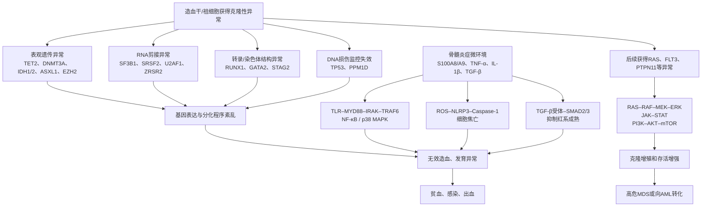
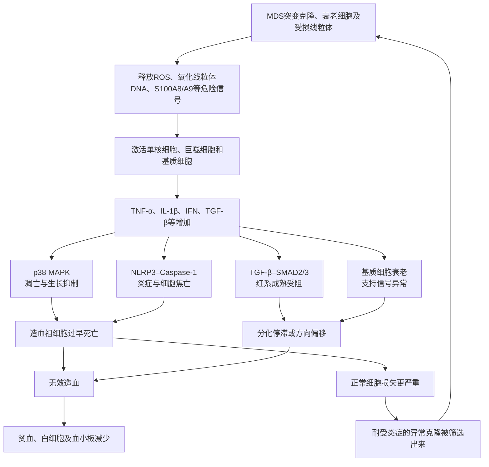
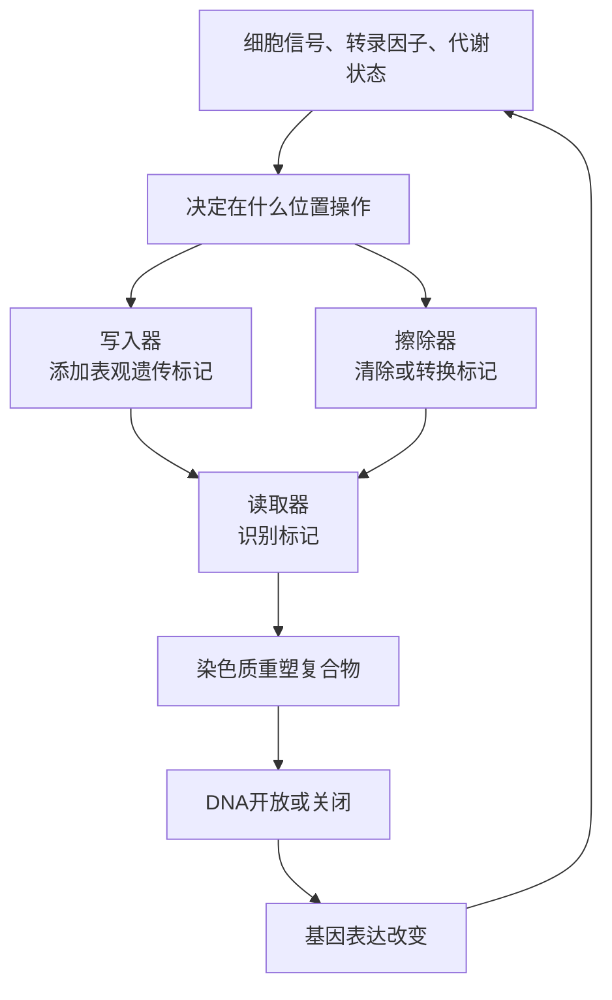

# MDS疾病、分型与分子机制讨论汇总

> 整理日期：2026年8月6日  
> 说明：本文根据本次对话整理，供疾病知识学习和医患沟通参考，不能替代血液科医生结合血常规、骨髓、染色体及基因检测所作的个体化判断。

## 目录

1. [MDS疾病概述](#一mds疾病概述)
2. [MDS有哪些分型](#二mds有哪些分型)
3. [MDS细胞涉及哪些信号和调控通路](#三mds细胞涉及哪些信号和调控通路)
4. [什么是表观遗传](#四什么是表观遗传)
5. [表观遗传、RNA剪接、转录与染色体结构异常的异同](#五表观遗传rna剪接转录与染色体结构异常的异同)
6. [什么是骨髓炎症微环境](#六什么是骨髓炎症微环境)
7. [为什么DNA选择甲基作为重要标记](#七为什么dna选择甲基作为重要标记)
8. [谁在控制表观遗传](#八谁在控制表观遗传)
9. [参考资料](#九参考资料)

---

## 一、MDS疾病概述

### 1. MDS是什么

MDS是“骨髓增生异常综合征”（Myelodysplastic Syndromes）的简称。新版分类也常称“骨髓增生异常肿瘤”或“骨髓增生异常性肿瘤”（Myelodysplastic Neoplasms）。

MDS不是一种单一疾病，而是一组起源于骨髓造血干细胞的克隆性血液肿瘤，严重程度差异很大。

正常骨髓会制造：

- 红细胞：负责运输氧；
- 白细胞：负责抵抗感染；
- 血小板：负责止血。

MDS患者的造血干细胞或祖细胞发生异常。骨髓虽然可能仍在积极制造细胞，但许多细胞发育不成熟、形态和功能异常，并在进入外周血之前或之后过早死亡，这称为**无效造血**。

### 2. 常见表现

不同血细胞减少可产生不同表现：

- **红细胞减少**：贫血、乏力、头晕、心悸、气短、面色苍白；
- **中性粒细胞减少**：容易感染、反复发热；
- **血小板减少**：皮肤瘀点瘀斑、鼻出血、牙龈出血，严重时可能发生内脏出血。

早期MDS也可能没有明显症状，只是在体检血常规中发现一种或多种血细胞持续减少。

MDS属于血液恶性肿瘤，但进展速度差别很大：部分患者可以长期稳定，部分患者则较快进展。并非所有患者都会转化为急性髓系白血病（AML）。

### 3. 为什么会发生MDS

多数患者无法找到唯一明确的病因。相关因素包括：

- 年龄增长；
- 既往接受过化疗或放疗；
- 长期接触苯等有机溶剂；
- 烟草烟雾或较高剂量电离辐射；
- 少数患者存在先天性或家族性造血系统易感基因。

MDS通常不会传染，大多数MDS也不是直接遗传给子女的疾病。

### 4. 如何确诊

仅凭一次血常规不能诊断MDS，通常需要血液科进行综合评估：

1. 多次血常规及外周血涂片，确认一种或多种血细胞持续减少；
2. 排除缺铁、维生素B12或叶酸缺乏、感染、肝肾疾病、药物影响及再生障碍性贫血等原因；
3. 骨髓穿刺和骨髓活检，观察细胞形态、原始细胞比例和骨髓结构；
4. 染色体核型、FISH和基因突变检测；
5. 必要时结合流式细胞术及其他专科检查。

### 5. 严重程度如何判断

医生通常结合IPSS-R或IPSS-M等系统进行危险分层，主要考虑：

- 血红蛋白、中性粒细胞和血小板水平；
- 骨髓原始细胞比例；
- 染色体异常；
- 基因突变；
- 年龄、体能和其他基础疾病。

因此，“都是MDS”并不意味着病情、预后和治疗方法相同。

### 6. 治疗原则

治疗取决于危险分层、症状、输血需求、基因和染色体特征以及患者身体状况。

- **观察随访**：血细胞下降轻且没有明显症状的部分低危患者可暂不治疗；
- **支持治疗**：红细胞或血小板输注、促红细胞生成药物、必要时抗感染治疗；长期反复输血者还需评估铁过载；
- **疾病修饰药物**：根据具体亚型选择去甲基化药物、来那度胺、促进红细胞成熟的药物或免疫抑制治疗等；
- **异基因造血干细胞移植**：目前最有可能实现长期治愈的方法，但风险较高，只适合经过严格评估的部分患者；
- **临床试验**：对于高危、复发或常规治疗效果不佳者具有重要意义。

治疗目标可能包括改善贫血和生活质量、减少输血、预防感染和出血、延缓向白血病进展，或在合适患者中争取治愈。

---

## 二、MDS有哪些分型

目前常用的是WHO 2022（第5版）分类。它把成人MDS分为“特定基因异常定义型”和“形态学定义型”两大类。

### 1. 由特定基因或染色体异常定义

#### 1.1 伴低原始细胞和孤立性5q缺失的MDS（MDS-5q）

- 骨髓原始细胞通常低于5%，外周血低于2%；
- 存在5q缺失；
- 可伴一个其他染色体异常，但不能是-7或del(7q)；
- 常以贫血为主；
- 部分患者对来那度胺较敏感。

#### 1.2 伴低原始细胞和SF3B1突变的MDS（MDS-SF3B1）

- 常伴环形铁粒幼红细胞；
- 一般属于预后相对较好的亚型；
- 在特定条件下，即使未检出SF3B1突变，环形铁粒幼红细胞达到一定比例也可作为替代依据。

#### 1.3 伴TP53双等位基因失活的MDS（MDS-biTP53）

- 两个TP53等位基因均受到影响；
- 可能表现为两个TP53突变，或一个突变加17p/TP53缺失、拷贝中性杂合性缺失等；
- 常伴复杂染色体核型；
- 通常属于风险较高、较易进展且治疗较困难的类型。

### 2. 主要由骨髓形态和原始细胞比例定义

#### 2.1 低原始细胞MDS（MDS-LB）

- 骨髓原始细胞低于5%，外周血低于2%；
- 不符合MDS-5q、MDS-SF3B1或MDS-biTP53的定义；
- 过去常进一步描述为单系或多系发育异常，新版已不强制将其划为不同正式亚型。

#### 2.2 低增生性MDS（MDS-h）

- 骨髓细胞增生明显降低；
- 通常定义为经年龄校正后骨髓细胞量不超过25%；
- 容易与再生障碍性贫血混淆，需要结合骨髓活检、染色体和基因检查鉴别。

#### 2.3 原始细胞增多型MDS-1（MDS-IB1）

- 骨髓原始细胞5%～9%，或外周血2%～4%；
- 向AML进展的风险高于低原始细胞型。

#### 2.4 原始细胞增多型MDS-2（MDS-IB2）

- 骨髓原始细胞10%～19%，或外周血5%～19%，或出现Auer小体；
- 属于较高危亚型；
- 生物学和治疗上已非常接近AML。

#### 2.5 伴骨髓纤维化的MDS（MDS-f）

- 骨髓存在显著网状纤维或胶原纤维增生；
- 通常伴原始细胞增多；
- 骨髓穿刺可能出现“干抽”；
- 需要与原发性骨髓纤维化等骨髓增殖性肿瘤鉴别。

### 3. 旧报告中可能出现的名称

采用WHO 2016或更早FAB分类的报告中，可能看到：

- MDS-SLD：单系发育异常；
- MDS-MLD：多系发育异常；
- MDS-RS：伴环形铁粒幼红细胞；
- MDS-EB-1或RAEB-1：大致对应MDS-IB1；
- MDS-EB-2或RAEB-2：大致对应MDS-IB2；
- MDS-U：未分类型，新版已取消；
- RA、RARS、RCMD：更早期名称，目前通常不再作为正式诊断名称。

### 4. WHO与ICC的差异

ICC 2022将原始细胞为10%～19%的部分病例称为**MDS/AML**，而WHO仍可称为MDS-IB2，因此同一患者在不同医院或不同病理体系中的诊断名称可能不完全一致。

需要特别注意：**MDS分型不等于危险分层。**治疗决策还需结合IPSS-R或IPSS-M评分。

---

## 三、MDS细胞涉及哪些信号和调控通路

MDS并不是由一条固定信号通路驱动，而是多个层面共同失控：

- DNA表观遗传；
- RNA剪接；
- 转录调控；
- 染色体与染色质结构；
- 炎症与先天免疫；
- 细胞分化；
- 细胞增殖、凋亡和焦亡。

### 1. 表观遗传调控通路

常见基因包括：

- **TET2、DNMT3A**：调节DNA甲基化；
- **IDH1/IDH2**：突变后产生异常代谢物2-HG，抑制正常去甲基化和细胞分化；
- **ASXL1、EZH2、BCOR**：调节组蛋白和染色质状态。

这些异常把造血干细胞的“基因开关”调乱，使其获得克隆优势，却不能正常成熟。

### 2. RNA剪接通路

常见基因包括SF3B1、SRSF2、U2AF1和ZRSR2。

突变后会造成大量RNA错误剪接，影响：

- 红细胞成熟和铁代谢；
- 线粒体功能；
- DNA修复；
- 细胞周期与凋亡。

SF3B1突变与环形铁粒幼红细胞密切相关。

### 3. 炎症与先天免疫信号

典型主轴为：

> S100A8/A9或IL-1  
> → TLR/IL-1R  
> → MYD88  
> → IRAK1/4  
> → TRAF6  
> → NF-κB与p38 MAPK

结果包括炎症因子释放、正常造血抑制以及祖细胞异常死亡。

### 4. NLRP3炎症小体与焦亡

典型过程为：

> S100A9/TLR4或ROS  
> → NLRP3炎症小体  
> → Caspase-1  
> → IL-1β、IL-18及Gasdermin D  
> → 细胞焦亡

焦亡会释放更多危险信号，形成“炎症—焦亡—更多炎症”的正反馈，并可能通过Wnt/β-catenin增强异常干细胞的自我更新。

### 5. TGF-β超家族—SMAD2/3通路

典型过程为：

> TGF-β/Activin等配体  
> → 相应受体  
> → SMAD2/3磷酸化  
> → 抑制晚期红细胞成熟

这条通路尤其与贫血和无效红系造血有关。

### 6. 增殖和存活通路

疾病进展时，异常克隆可能进一步获得NRAS、KRAS、PTPN11、CBL、FLT3或KIT等改变，激活：

- RAS–RAF–MEK–ERK；
- PI3K–AKT–mTOR；
- JAK–STAT。

这些通路使细胞从“分化异常、容易死亡”逐渐转变为“持续增殖、逃避死亡”。

### 7. TP53与DNA损伤通路

正常TP53会在DNA严重受损时促使细胞停滞、修复或凋亡。TP53双等位基因失活后：

- DNA损伤细胞仍能存活；
- 染色体不稳定性增加；
- 容易出现复杂核型；
- 治疗耐受和克隆进化能力增强。

可将疾病演变概念化为：

> 早期或部分低危MDS：表观遗传/剪接异常，加上炎症和过度细胞死亡，造成无效造血和血细胞减少。  
> 高危MDS：累积TP53、RUNX1、RAS/FLT3等异常，异常克隆逃避死亡并增强增殖，逐渐接近或转化为AML。

这只是总体模型，并非每位患者都按照相同顺序发展。

---

## 四、什么是表观遗传

表观遗传是指：**不改变DNA“字母顺序”，但改变基因什么时候开启、关闭以及表达多少。**

可以用书本作比喻：

- DNA序列像一本书的正文；
- 基因突变像正文中的字被改了；
- 表观遗传像书签、批注或封条——正文没有改变，但细胞读取哪些内容发生了变化。

### 1. DNA甲基化

在DNA特定位置添加甲基化标记。启动子区域甲基化增加时，相关基因通常更难被读取，相当于把基因“调暗或关闭”。

### 2. 组蛋白修饰

DNA缠绕在组蛋白上，类似线绕在线轴上：

- 缠得松，基因比较容易被读取；
- 缠得紧，基因比较难被读取。

组蛋白乙酰化、甲基化等化学标记会调节这种松紧状态。

### 3. 染色质重塑

重排DNA与组蛋白的位置，使某些基因区域暴露或隐藏。

### 4. 非编码RNA调控

部分不制造蛋白质的RNA可以调节其他基因的表达，并参与表观遗传复合物的定位。

### 5. 为什么同样的DNA能形成不同细胞

红细胞、神经细胞和皮肤细胞基本具有相同的DNA，但开启的基因不同：

- 红细胞开启血红蛋白等相关基因；
- 神经细胞开启神经信号相关基因；
- 暂时不需要的基因则被表观遗传机制关闭。

因此，表观遗传决定了细胞“如何使用DNA”。

### 6. 表观遗传在MDS中的意义

MDS造血干细胞常出现调控表观遗传的基因异常：

- **DNMT3A**：负责添加DNA甲基化标记；
- **TET2**：参与甲基化标记的氧化和清除；
- **IDH1/IDH2**：突变后产生2-HG，间接阻碍正常去甲基化；
- **ASXL1、EZH2**：影响组蛋白和染色质状态。

结果可能是：

> 错误基因被开启，正常造血基因被关闭  
> → 造血细胞不能正常成熟  
> → 发育异常和无效造血  
> → 贫血、白细胞或血小板减少。

例如，TET2基因本身发生DNA突变后，可导致整个细胞的表观遗传标记异常：

- TET2突变是“调控机器坏了”；
- 大量基因甲基化紊乱是“机器损坏造成的结果”。

阿扎胞苷和地西他滨等去甲基化药物并不是修复原始DNA突变，而是通过调整异常甲基化状态，使部分被错误关闭的造血和分化程序重新表达。

---

## 五、表观遗传、RNA剪接、转录与染色体结构异常的异同

先说明术语：这里通常称为**RNA剪接异常（splicing）**。“RNA剪切”更多指RNA被核酸酶直接切开，两者不完全相同。

实际情况不是完全单向的，这些环节会相互影响并形成反馈。

### 1. 核心比较

| 类型 | 通俗比喻 | 发生环节 | MDS常见基因或异常 | 主要后果 |
|---|---|---|---|---|
| 表观遗传异常 | 书本上的书签、封条 | 决定DNA是否容易被读取 | TET2、DNMT3A、IDH1/2、ASXL1、EZH2 | 正常分化基因被错误开启或关闭 |
| 转录异常 | 抄书的人抄错章节或抄多、抄少 | DNA→前体RNA | RUNX1、GATA2、ETV6、CUX1 | 造血基因表达量和表达时机异常 |
| RNA剪接异常 | 剪辑影片时把片段拼错 | 前体RNA→成熟mRNA | SF3B1、SRSF2、U2AF1、ZRSR2 | 产生错误或异常版本的mRNA和蛋白质 |
| 染色体结构异常 | 书页整段缺失、增加或装订错位 | DNA数量、排列和三维折叠 | del(5q)、-7、+8、复杂核型、STAG2等 | 大批基因剂量或空间调控同时改变 |

### 2. 表观遗传异常

表观遗传决定“哪些DNA可以被读取”，但标记本身不改变DNA字母顺序。

需要区分两层：

- TET2、DNMT3A等调控基因发生突变，属于DNA序列改变；
- 由这些突变引起的甲基化和染色质异常，属于表观遗传改变。

### 3. 转录异常

转录是RNA聚合酶以DNA为模板制造前体RNA的过程。

RUNX1、GATA1、GATA2、PU.1等转录因子决定：

- 哪个基因开始转录；
- 什么时候转录；
- 转录多少；
- 细胞向红系、粒系还是巨核细胞方向分化。

表观遗传和转录的区别可简化为：

- 表观遗传决定“书能否打开”；
- 转录因子决定“打开后抄哪一段、抄多少”。

### 4. RNA剪接异常

一个基因刚转录出来的是前体mRNA，其中包含：

- 外显子：通常需要保留；
- 内含子：通常需要删除。

剪接体会去掉内含子，把外显子重新连接。剪接因子突变后可能出现：

- 内含子没有被正确删除；
- 外显子被错误跳过；
- 选择了错误的剪接位点；
- 形成提前终止密码子；
- mRNA被细胞降解；
- 产生结构异常的蛋白质。

区别在于：

- 转录异常是RNA“制造多少、何时制造”不正常；
- 剪接异常是RNA已经制造出来，但“后期剪辑拼装”出错。

### 5. 染色体结构异常

这一概念包括两个尺度。

#### 大尺度染色体异常

- del(5q)：5号染色体长臂一段缺失；
- -7：整条7号染色体缺失；
- del(7q)：7号染色体长臂部分缺失；
- +8：多一条8号染色体；
- 复杂核型：同时存在多种染色体异常；
- 易位、倒位等重新排列。

这种异常可一次性改变许多基因的数量或位置。

#### 三维染色质结构异常

DNA在细胞核中折叠成许多环，使远距离增强子能够接触相应基因的启动子。

STAG2、RAD21、SMC1A和SMC3构成黏连蛋白复合体，参与：

- 染色体三维折叠；
- 增强子—启动子接触；
- 姐妹染色单体黏连；
- DNA修复和转录调控。

因此，STAG2突变虽然可归入染色体结构或黏连蛋白异常，最终表现之一仍是转录异常。

### 6. 它们之间的关系

四者常形成连续因果链：

> 染色体折叠或表观遗传状态改变  
> → 转录因子不能在正确位置工作  
> → 基因转录量异常  
> → RNA又被错误剪接  
> → 正常蛋白减少、异常蛋白增加  
> → 造血细胞不能成熟。

共同点：

- 最终都会改变基因表达和造血细胞分化；
- 多数由后天获得的克隆性异常引起；
- 可以同时存在并相互协同；
- 单独一个突变通常不能解释全部病情。

不同点：

- 表观遗传改变DNA的可读性；
- 转录改变RNA制造的开关和数量；
- RNA剪接改变RNA的拼接版本；
- 染色体结构改变DNA片段数量、排列或三维空间关系。

表观遗传标记理论上相对可逆；但染色体缺失、基因突变等DNA层面的改变不会被去甲基化药物直接修复。

---

## 六、什么是骨髓炎症微环境

骨髓炎症微环境是指：骨髓内部长期存在异常的炎症细胞、细胞因子和支持组织变化，使造血干细胞周围的“生长环境”从正常状态变成带有慢性炎症和抑制造血的状态。

这里的炎症多数是**无菌性炎症**，不等于骨髓感染，也不一定伴随发热或血液炎症指标明显升高。

### 1. 骨髓微环境包括什么

造血细胞生活在“造血生态位”中，包括：

- 间充质基质细胞；
- 血管内皮细胞；
- 成骨细胞和脂肪细胞；
- 单核细胞和巨噬细胞；
- T细胞、NK细胞及髓源抑制性细胞；
- 细胞外基质；
- 细胞因子、生长因子和趋化因子。

正常情况下，这些成分会告诉造血干细胞：

- 什么时候休息；
- 什么时候增殖；
- 向哪类血细胞分化；
- 什么时候进入血液。

MDS中，这套指挥系统发生紊乱。

### 2. 为什么会导致无效造血

无效造血不一定是骨髓完全不制造细胞，而是：

> 骨髓启动了造血，但大量细胞在成熟前死亡或停滞，最终进入外周血的成熟细胞很少。

因此，患者可能出现“骨髓细胞很多，但外周血细胞很少”。

#### 炎症因子让祖细胞过早死亡

TNF-α、IFN-γ、IL-1β和TGF-β等持续存在，可激活p38 MAPK等压力通路，导致：

- 细胞周期停止；
- 红系和粒系集落形成减少；
- 凋亡增加；
- 正常造血细胞对生长因子的反应下降。

#### NLRP3炎症小体造成焦亡

MDS突变细胞、ROS和S100A8/A9等危险信号可激活：

> TLR4/NF-κB  
> → NLRP3炎症小体  
> → Caspase-1  
> → Gasdermin D  
> → 细胞焦亡

焦亡后细胞膜形成小孔、细胞破裂，并释放IL-1β、IL-18和更多危险物质，继而形成“细胞死亡—炎症增强—更多细胞死亡”的正反馈。

#### 红细胞成熟受到抑制

TGF-β超家族配体持续激活SMAD2/3，会抑制晚期红系祖细胞成熟：

- 骨髓中可见较多红系前体；
- 但成熟红细胞产量不足；
- 出现贫血和输血依赖。

### 3. 为什么会出现发育异常

MDS的发育异常主要由异常克隆自身的基因、剪接和表观遗传改变造成，炎症微环境会进一步放大这些异常。

#### 分化指令受到持续干扰

慢性炎症信号长期存在，可能导致：

- 红系成熟受阻；
- 粒细胞核分叶及颗粒形成异常；
- 巨核细胞成熟和血小板生成异常；
- 造血偏向单核或髓系方向；
- 干细胞长期处于压力性增殖状态。

#### 炎症改变基因表达和表观遗传

NF-κB、p38、SMAD等信号进入细胞核后，可改变转录因子活性和染色质状态，进一步影响：

- 细胞周期基因；
- 分化基因；
- 线粒体与铁代谢基因；
- 凋亡及DNA修复基因。

#### 支持造血的“土壤”也会衰老

S100A9可通过TLR4–NLRP3–IL-1β通路使骨髓间充质基质细胞进入衰老状态。衰老基质细胞不能正常支持造血，反而会继续释放炎症因子。

### 4. 为什么炎症会选择出MDS异常克隆

- 正常造血干细胞受到慢性炎症时，容易耗竭、停止增殖或死亡；
- 部分携带TET2、DNMT3A、TP53等异常的克隆，对炎症压力的耐受性相对更强；
- 当正常细胞不断受损时，异常克隆获得相对竞争优势。

炎症不一定直接制造全部MDS突变，但可以像筛子一样逐渐筛选和扩大适应炎症的异常克隆。

### 5. 低危与高危MDS可能不同

概念上：

- 部分低危MDS表现出较强的炎症、凋亡和焦亡，因此以血细胞减少为主；
- 高危MDS中，异常克隆逐渐获得抗凋亡、免疫逃逸和增殖优势，原始细胞增加，更接近AML。

但这不是所有患者都遵循的固定规律。不同基因亚型的炎症状态存在明显差异。

最准确的理解是：

> 基因异常是异常克隆的内因；炎症微环境是与克隆相互作用的外部推动力。二者形成恶性循环，共同导致无效造血和发育异常。

---

## 七、为什么DNA选择甲基作为重要标记

甲基并不是像胶水一样直接挡住RNA聚合酶。它更像DNA表面一个小而稳定的识别标签。读取蛋白识别这个标签后，会招募抑制复合物并改变染色质状态。

需要注意：

- 启动子或增强子区域的CpG甲基化通常抑制转录；
- 基因内部的甲基化不一定抑制，有时反而与活跃转录相关。

### 1. 甲基如何加到DNA上

哺乳动物最常见的是胞嘧啶甲基化：

> 胞嘧啶C + 甲基（—CH₃）  
> → 5-甲基胞嘧啶（5mC）

甲基被加在胞嘧啶的第5号碳原子上，通常发生于CpG位点。甲基供体主要是S-腺苷甲硫氨酸（SAM）。

### 2. 为什么甲基化会影响读取

#### 甲基出现在DNA大沟表面

胞嘧啶第5位甲基：

- 不参与C和G之间的氢键；
- 基本不破坏正常C–G配对；
- 会突出在DNA大沟表面。

DNA仍可正常复制，但多出了能被蛋白质识别的化学标志。

#### 部分转录因子不能正常结合

一些转录因子对DNA表面的形状、电荷和疏水性很敏感。增加甲基后，蛋白质与DNA的接触面发生改变，结合能力可能下降。

并非所有转录因子都会受到抑制：有些不受影响，少数甚至偏好甲基化序列。

#### 甲基招来读取蛋白

MeCP2、MBD1、MBD2等蛋白可识别甲基化CpG，并进一步招募：

- 组蛋白去乙酰化酶；
- 组蛋白甲基转移酶；
- 转录共抑制复合物；
- 染色质重塑蛋白。

结果是DNA与组蛋白结合更紧，RNA聚合酶和转录因子更难进入。

因此过程更接近：

> DNA甲基化  
> → 读取蛋白识别  
> → 招募调控复合物  
> → 组蛋白改变、染色质压紧  
> → 转录下降。

### 3. 为什么是甲基，而不是其他基团

甲基并非唯一可能的标签，但它具有几项适合长期信息存储的性质。

#### 足够小

- 不带电；
- 体积小；
- 不明显干扰C–G碱基配对；
- 通常不会阻止DNA复制。

如果添加很大或强带电的基团，可能明显扭曲双螺旋、妨碍复制，并被当作DNA损伤。

#### 足够容易识别

甲基具有疏水性并突出到DNA大沟中。它对DNA结构影响较小，却能明显改变蛋白质识别表面。

#### 化学性质稳定

甲基与胞嘧啶形成稳定共价键，适合保存较长时间，因此能够形成细胞记忆。

#### 容易由细胞添加

SAM是细胞中普遍存在的甲基供体，DNA甲基转移酶可以高效地把甲基转移到胞嘧啶。

#### 容易在细胞分裂时复制

DNA复制后：

- 旧链保留甲基；
- 新链暂时没有甲基。

这种状态称为半甲基化DNA。UHRF1和DNMT1能识别它，并在新链对应位置补上甲基，使表观遗传信息传给子细胞。

#### 稳定但仍可清除

TET1、TET2和TET3可逐步氧化5mC：

> 5mC → 5hmC → 5fC → 5caC

随后通过DNA修复机制恢复成普通胞嘧啶。因此甲基化既稳定，又可以被专门系统调整或清除。

### 4. 其他化学标记也存在

细胞并不只使用甲基：

- DNA上还有5-羟甲基胞嘧啶、5-甲酰胞嘧啶等；
- 组蛋白上有乙酰化、甲基化、磷酸化和泛素化；
- 某些生物大量使用腺嘌呤甲基化；
- 细菌还利用DNA甲基化区分自身与外来DNA。

更准确地说：

> 甲基不是唯一标签，而是哺乳动物进化中形成的一种小、稳定、可读取、可复制、又可清除的DNA信息标签。

---

## 八、谁在控制表观遗传

表观遗传没有一个单独的“总开关”，而是由一套分工协作的系统控制：

- 写入器；
- 擦除器；
- 读取器；
- 染色质重塑器；
- 定位和导航系统；
- 细胞信号与代谢环境。

### 1. 写入器

#### DNA甲基化写入器

- **DNMT3A、DNMT3B**：建立新的甲基化标记；
- **DNMT1**：在DNA复制后维持和复制既有甲基化图谱。

可理解为：

- DNMT3A/3B负责首次做标记；
- DNMT1负责复印原有标记。

#### 组蛋白标记写入器

- HAT：添加组蛋白乙酰基，通常使染色质更开放；
- EZH2/PRC2：添加H3K27me3等抑制性组蛋白甲基化标记；
- SETD2等：在其他组蛋白位置添加甲基。

### 2. 擦除器

#### DNA去甲基化系统

- TET1、TET2、TET3：逐步氧化5mC；
- TDG和碱基切除修复系统：最终恢复普通胞嘧啶。

TET蛋白不是简单把甲基直接摘掉，而是先将其逐步氧化，再由DNA修复系统完成清除。

#### 组蛋白标记擦除器

- HDAC：去除组蛋白乙酰基，通常使染色质更紧；
- KDM/LSD1：去除特定组蛋白甲基化标记。

### 3. 读取器

标记需要被蛋白理解：

- MeCP2、MBD1、MBD2读取甲基化CpG；
- BRD4等溴结构域蛋白读取组蛋白乙酰化；
- 含特定染色质结构域的蛋白读取组蛋白甲基化标记。

读取器结合后会招募转录激活或抑制复合物。标记本身更像信号，真正执行开放或关闭的是读取器及其伙伴。

### 4. 染色质重塑器

染色质重塑复合物使用ATP提供的能量：

- 移动核小体；
- 移除或更换核小体；
- 暴露启动子和增强子；
- 或把DNA区域重新遮挡。

主要复合物包括：

- SWI/SNF；
- CHD；
- ISWI；
- INO80。

它们像整理书架的人，决定某本书摆在外面还是锁进柜子。

### 5. 谁告诉这些酶去哪里工作

#### 转录因子

造血系统中的RUNX1、GATA1、GATA2、PU.1、CEBPA等转录因子，可识别特定DNA序列，再招募甲基化酶、组蛋白修饰酶或染色质重塑复合物。

#### 非编码RNA

部分长链非编码RNA可像导航RNA一样，把表观遗传复合物带到特定染色体区域。

#### DNA序列和染色体三维结构

- CpG岛本身提供定位信息；
- CTCF和黏连蛋白复合物控制DNA三维折叠；
- 增强子与启动子的空间接触决定调控蛋白能否相遇。

### 6. 细胞外环境与代谢也在控制表观遗传

炎症因子、激素和生长因子通过NF-κB、JAK–STAT、MAPK和TGF-β–SMAD等通路改变转录因子活性，继而影响表观遗传复合物。

表观遗传酶还依赖代谢原料：

- SAM：DNA和组蛋白甲基化的甲基供体；
- 乙酰辅酶A：组蛋白乙酰化原料；
- α-酮戊二酸：TET和部分组蛋白去甲基化酶的辅助因子；
- NAD⁺：影响Sirtuin类去乙酰化酶；
- 氧、铁离子和ROS也会影响相关酶。

### 7. MDS中哪些控制环节失常

- **DNMT3A突变**：甲基化标记写入异常；
- **TET2突变**：5mC氧化和去甲基化过程异常；
- **IDH1/IDH2突变**：产生2-HG，抑制TET2等α-酮戊二酸依赖酶；
- **EZH2突变**：抑制性组蛋白标记异常；
- **ASXL1突变**：扰乱多种染色质和组蛋白调控复合物；
- **STAG2异常**：改变DNA三维折叠，间接改变表观遗传和转录；
- **RUNX1异常**：不能把相应调控复合物正确带到造血基因附近。

因此，MDS中的表观遗传异常可能来自三层问题：

1. 写入器或擦除器本身发生突变；
2. 转录因子把它们带到错误位置；
3. 炎症和代谢环境改变它们的活性。

最简洁的总结是：

> DNA序列提供地址，转录因子负责导航，写入器和擦除器改变标记，读取器解释标记，染色质重塑器执行开放或关闭；代谢和细胞信号控制整套系统的工作状态。

---

## 九、参考资料

### MDS概述、诊断与治疗

1. [NCI：Myelodysplastic Syndromes Treatment—Patient Version](https://www.cancer.gov/types/myeloproliferative/patient/myelodysplastic-treatment-pdq)
2. [NCI：Myelodysplastic Syndromes Treatment—Health Professional Version](https://www.cancer.gov/types/myeloproliferative/hp/myelodysplastic-treatment-pdq)
3. [Leukemia & Lymphoma Society：Myelodysplastic Syndromes](https://www.lls.org/myelodysplastic-syndromes/myelodysplastic-syndromes)
4. [Leukemia & Lymphoma Society：MDS Treatment](https://www.lls.org/myelodysplastic-syndromes/treatment)

### MDS分型

5. [WHO第5版髓系肿瘤分类原文](https://www.nature.com/articles/s41375-022-01613-1)
6. [NCI/NCBI：WHO MDS分类表](https://www.ncbi.nlm.nih.gov/books/NBK602705/table/CDR0000810727__2177/?report=objectonly)
7. [ICC髓系肿瘤与急性白血病分类](https://doi.org/10.1182/blood.2022015850)

### MDS基因、剪接与克隆演化

8. [Frequent pathway mutations of splicing machinery in myelodysplasia](https://www.nature.com/articles/nature10496)
9. [Clinical and biological implications of driver mutations in MDS](https://pubmed.ncbi.nlm.nih.gov/24030381/)
10. [Dynamics of clonal evolution in MDS](https://www.nature.com/articles/ng.3742)
11. [Chronic loss of STAG2 alters chromatin structure and transcription](https://pubmed.ncbi.nlm.nih.gov/32883299/)
12. [Combined cohesin–Runx1 deficiency perturbs chromatin looping](https://pmc.ncbi.nlm.nih.gov/articles/PMC7269820/)

### 炎症微环境与无效造血

13. [p38 MAPK与MDS造血抑制](https://pubmed.ncbi.nlm.nih.gov/16204077/)
14. [p38α MAPK与MDS骨髓炎症正反馈](https://pmc.ncbi.nlm.nih.gov/articles/PMC2735641/)
15. [NLRP3炎症小体驱动MDS表型](https://pmc.ncbi.nlm.nih.gov/articles/PMC5179338/)
16. [S100A9通过NLRP3诱导骨髓基质细胞衰老](https://pubmed.ncbi.nlm.nih.gov/31727865/)
17. [人类克隆造血中突变干细胞的炎症选择优势](https://pmc.ncbi.nlm.nih.gov/articles/PMC11512683/)
18. [低危MDS中的炎症异质性](https://www.nature.com/articles/s41375-023-01949-2)

### 表观遗传与DNA甲基化

19. [NHGRI：Epigenomics Fact Sheet](https://www.genome.gov/about-genomics/fact-sheets/Epigenomics-Fact-Sheet)
20. [MeCP2连接DNA甲基化与组蛋白去乙酰化](https://www.nature.com/articles/30764)
21. [UHRF1识别半甲基化DNA的结构基础](https://www.nature.com/articles/nature07273)
22. [DNMT1维持DNA甲基化的结构基础](https://pubmed.ncbi.nlm.nih.gov/21163962/)

---

## 核心总结

MDS可理解为一个相互联系的系统性过程：

1. 造血干细胞获得基因或染色体异常；
2. 表观遗传、转录和RNA剪接程序发生紊乱；
3. 造血细胞不能正常成熟，并出现形态异常；
4. 骨髓炎症微环境促进凋亡、焦亡和基质衰老；
5. 正常造血被抑制，异常克隆获得竞争优势；
6. 部分克隆继续获得TP53、RAS、FLT3等进展性异常；
7. 疾病可能从低危MDS演变为高危MDS，甚至AML。

因此，MDS既是**异常造血干细胞的克隆性疾病**，也是**基因调控、细胞信号与骨髓微环境相互作用的疾病**。
