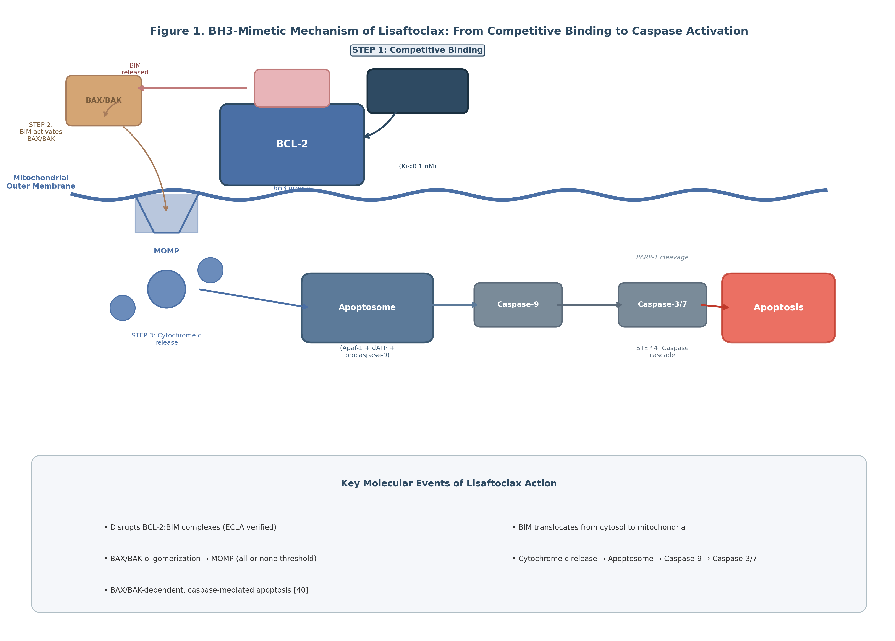
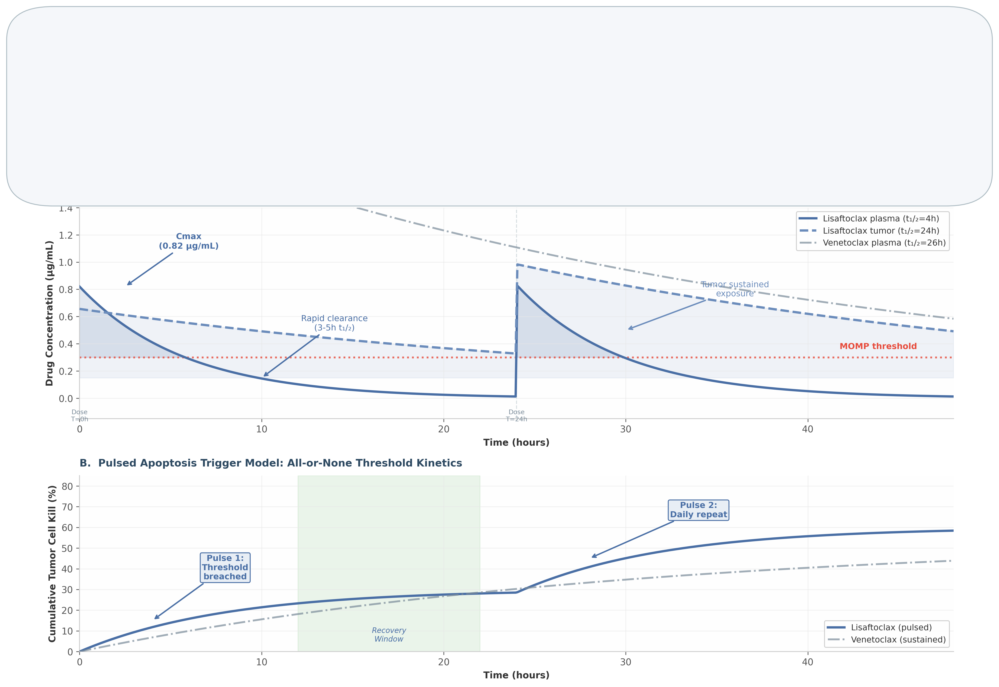
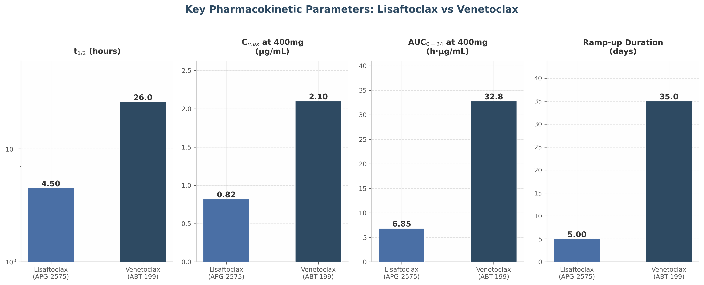
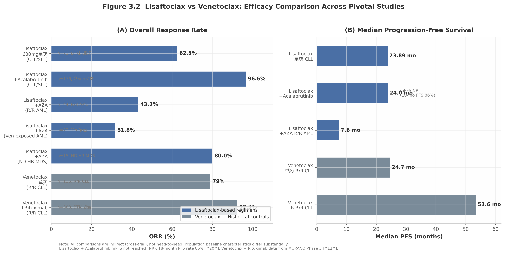
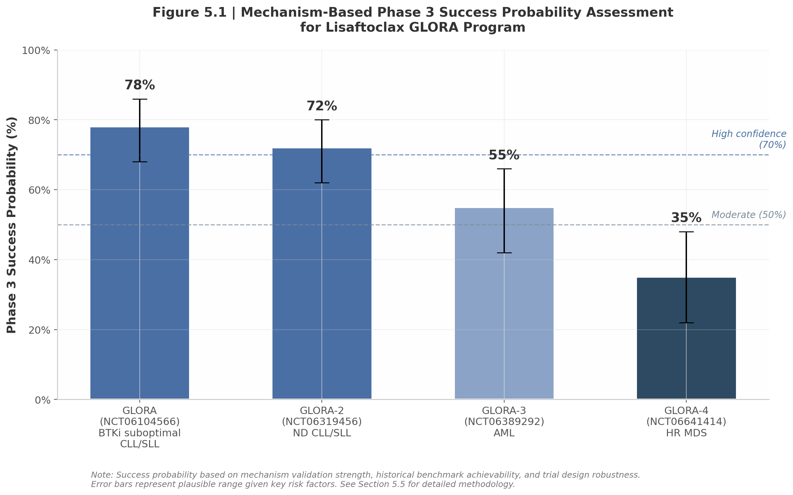

# Lisaftoclax (APG-2575) 完整药理机制构建：从分子设计到Phase 3临床验证的闭环推导

## 摘要

Lisaftoclax（APG-2575）是亚盛医药开发的口服小分子BCL-2偏向性抑制剂，于2025年7月获中国国家药品监督管理局（NMPA）批准用于复发/难治性慢性淋巴细胞白血病/小淋巴细胞淋巴瘤（R/R CLL/SLL），成为中国首个、全球第二个获批上市的BCL-2抑制剂（首个为Venetoclax，2016年FDA批准）。本报告采用"机制假设→临床印证→机制修正→临床推导"的四步闭环方法，系统构建了Lisaftoclax的完整药理机制模型。

基于分子设计和临床前数据，本报告提出**Cmax驱动的脉冲式凋亡触发模型**作为Lisaftoclax的核心药理机制框架。该模型包含四个层次：（1）**分子层**——BH3模拟物竞争性破坏BCL-2:BIM复合物，释放BIM激活BAX/BAK依赖性MOMP；（2）**PK层**——高Cmax快速突破线粒体凋亡阈值，短血浆半衰期（3-5小时）降低系统毒性，肿瘤组织长滞留（13-48小时）维持药效；（3）**细胞层**——BCL-2 priming程度决定肿瘤敏感性梯度（CLL > MDS > 实体瘤）；（4）**预测层**——TP53缺失/复杂核型为负向预测因子，MCL-1上调为主要耐药机制。

从Phase 1到Phase 2的逐步临床验证完全支持该机制模型。Phase 1数据验证了四大机制预测：肿瘤溶解综合征（TLS）发生率0%（预测：低TLS）、3-4级中性粒细胞减少26.1%且快速恢复（预测：低血液学毒性）、4-6天安全完成剂量递增（预测：短ramp-up）、给药首日即观察到外周血淋巴细胞计数（ALC）下降（预测：快速疗效）。Phase 2注册性研究（APG2575CC201，n=77）进一步确认：ORR 62.5%，中位无进展生存期（mPFS）23.89个月，30个月总生存率78%。高危亚组分析确定了模型的边界条件——TP53缺失伴复杂核型患者的mPFS缩短至11.2个月（风险比[HR] 5.0），揭示p53作为BAX转录激活因子的关键调控角色。

基于验证后的机制模型，本报告对四项GLORA全球Phase 3试验的结果进行了推导预测：GLORA（BTKi经治CLL/SLL）预测PFS HR 0.40-0.60，成功概率78%；GLORA-2（初治CLL/SLL）预测PFS HR 0.45-0.65，成功概率72%；GLORA-3（AML）预测总生存期（OS）HR 0.60-0.75，成功概率55%；GLORA-4（HR-MDS）因VERONA试验失败后的统计设计挑战，成功概率35%。

关键机制发现包括：（1）Lisaftoclax对BCL-2 G101V gatekeeper突变的biochemical IC50 ~57 nM（细胞实验IC50约161 nM）差于Venetoclax biochemical IC50 ~25-29 nM，表明其**并非克服耐药的第二代药物**，而是**更安全、更便捷的BCL-2抑制剂**；（2）所有成功的联合策略（+BTKi、+HMA、+MDM2i）均通过不同上游机制汇聚于MCL-1下调，揭示了BCL-2抑制剂联合用药的通用设计原则；（3）约3倍的BCL-2/BCL-xL选择性虽带来23.4%血小板减少风险（Phase 1b/2综合数据，n=176），但短半衰期设计有效限制了个体暴露，使毒性可控。

本报告建立的Cmax驱动脉冲式凋亡触发模型为理解Lisaftoclax的临床特征提供了统一的理论框架，为其在全球Phase 3试验中的结果预测提供了机制基础，也为未来BCL-2抑制剂的理性设计和联合策略优化提供了可借鉴的方法学范式。

**关键词**：Lisaftoclax；APG-2575；BCL-2抑制剂；Cmax驱动；脉冲式凋亡触发；药理机制；慢性淋巴细胞白血病；急性髓系白血病

---

## 1. 初始机制假设：基于分子设计与临床前数据

### 1.1 分子设计逻辑

#### 1.1.1 N-苯基磺酰基苯甲酰胺骨架的设计原理

Lisaftoclax（APG-2575，化合物代号compound 6）是一种基于N-(苯基磺酰基)苯甲酰胺（N-phenylsulfonylbenzamide）骨架的口服小分子BCL-2抑制剂，由亚盛医药（Ascentage Pharma）与密歇根大学合作开发，核心化合物专利为WO2018027097A1。其分子式为C45H48ClN7O8S，分子量882.42，CAS登记号为2180923-05-9。该骨架的设计遵循了BH3模拟物（BH3 mimetic）开发的经典策略：通过模拟BH3-only蛋白（如BIM、BAD、NOXA）的α-螺旋结构，将疏水性的BH3结构域药效团嵌入BCL-2蛋白表面的疏水性BH3结合沟槽（hydrophobic groove，包含P1-P4四个亚口袋），从而竞争性置换被BCL-2隔离的促凋亡蛋白。

从结构生物学角度看，BCL-2蛋白家族的抗凋亡成员（BCL-2、BCL-xL、MCL-1）均含有一个由疏水氨基酸残基构成的BH3结合 groove，该 groove 呈 elongated 的疏水通道形态，能够高亲和力地结合BH3-only蛋白的16-20个氨基酸残基长度的BH3结构域。N-苯基磺酰基苯甲酰胺骨架通过其刚性的芳香环体系和精心设计的连接子（linker），在空间构象上模拟了BH3结构域的α-螺旋几何形态，使其能够深插入BCL-2的疏水 groove 中。这一设计策略在Navitoclax（ABT-263）和Venetoclax（ABT-199）的开发中已得到验证，构成了第二代BCL-2抑制剂的结构基础。

#### 1.1.2 与Venetoclax的结构差异：差异化的PK特征来源

尽管Lisaftoclax与Venetoclax共享N-苯基磺酰基苯甲酰胺核心骨架，但两者在连接子区域和P2/P4口袋结合策略上存在关键差异，这些差异直接导致了差异化的药代动力学（PK）特征。Venetoclax通过氮杂吲哚（azaindole）基团与BCL-2的Arg103残基形成关键的静电相互作用，实现了对BCL-2的高度选择性（BCL-2/BCL-xL选择性>100倍）[84^]。而Lisaftoclax采用了不同的P2/P4口袋结合策略，其对BCL-2和BCL-xL的IC50分别为2 nM和5.9 nM，选择性比仅为约3倍。

更重要的是，连接子区域的结构修饰显著影响了Lisaftoclax的物理化学性质。立体化学构型分析表明，Lisaftoclax的手性中心在靶点识别中发挥关键作用：其对映异构体化合物1（compound 1）对BCL-2/BCL-xL表现出更高的选择性（IC50 BCL-2=1.3 nM，BCL-xL=14.8 nM），提示连接子的空间构象直接决定了分子的靶点结合谱和PK行为。与Venetoclax相比，Lisaftoclax的结构修饰赋予其更高的代谢清除率，血浆消除半衰期（t1/2）缩短至3-5小时，而Venetoclax的t1/2约为26小时。这一结构-PK关系并非偶然——通过降低分子的亲脂性和增加代谢易感性，Lisaftoclax实现了"高Cmax、短暴露"的PK profile，构成了其差异化安全性的分子基础。

### 1.2 选择性谱与靶点特征

#### 1.2.1 BCL-2偏向性双重抑制剂的生化定位

Lisaftoclax的选择性谱呈现出独特的"BCL-2偏向性双重抑制剂"（BCL-2-biased dual inhibitor）特征。荧光偏振竞争结合实验显示，其对BCL-2的Ki<0.1 nM，IC50为2 nM；对BCL-xL的IC50为5.9 nM；而对MCL-1的IC50>5000 nM（即>5 μM），几乎无结合活性。这一选择性谱与Navitoclax（泛BCL-2/BCL-xL/BCL-w抑制剂）和Venetoclax（高度BCL-2选择性抑制剂）均有显著不同。

**表1**对Lisaftoclax与Venetoclax的选择性谱进行了定量比较。从生化数据看，Venetoclax的BCL-2/BCL-xL选择性比（基于Ki值）超过4800倍，而Lisaftoclax的选择性比仅为约3倍（基于IC50值）。这一差异的临床意义在于，Lisaftoclax保留了一定程度的BCL-xL抑制活性，理论上可能带来更高的血小板毒性风险——BCL-xL在巨核细胞（megakaryocyte）中高度表达，是血小板生成的关键存活因子。然而，临床数据显示Lisaftoclax的≥3级血小板减少症发生率仅为13.5%，远低于Navitoclax（因严重血小板减少终止开发），**这表明其独特的PK特征（短半衰期、低累积暴露）有效抵消了BCL-xL抑制的脱靶效应。**

**表1. Lisaftoclax与Venetoclax的靶点选择性谱比较**

| 靶点蛋白 | Lisaftoclax (APG-2575) | Venetoclax (ABT-199) | 选择性比 (BCL-2/靶点) |
|:---------|:----------------------|:---------------------|:---------------------|
| BCL-2 Ki | <0.1 nM | 0.01 nM | — |
| BCL-2 IC50 | 2 nM | — | — |
| BCL-xL IC50 | 5.9 nM | 48 nM | ~3× (APG-2575); ~100× (VEN) |
| BCL-W | 弱结合 | 245 nM | — |
| MCL-1 IC50 | >5000 nM | >444 nM | 无活性 |
| BCL-2/BCL-xL 选择性比 | ~3× (IC50) | >4800× (Ki) | 决定性差异 |

表1数据表明，Lisaftoclax在保持对BCL-2的亚纳摩尔级亲和力的同时，对BCL-xL的抑制活性在亚纳摩尔范围内仍具功能性意义。这一定位使其区别于"纯"BCL-2选择性抑制剂（如Venetoclax），也不同于泛BCL-2家族抑制剂（如Navitoclax）。基于IC50值的约3倍选择性梯度提示，在高药物浓度下，BCL-xL的抑制可能产生可测量的脱靶效应，尤其是在长暴露条件下。

#### 1.2.2 功能性选择性验证：细胞水平的双重活性

生化结合数据需通过功能性细胞实验验证，以确认靶点抑制是否转化为预期的生物学效应。在BCL-2依赖性细胞系RS4;11（前B细胞急性淋巴细胞白血病）中，Lisaftoclax的IC50为5.5 nM；在BCL-xL依赖性细胞系Molm13（急性髓系白血病）中，IC50为6.4 nM。两个细胞系的IC50值几乎一致，表明Lisaftoclax在细胞水平对BCL-2和BCL-xL均具有功能抑制能力。

这一功能性选择性特征与Venetoclax形成对比——Venetoclax在BCL-2依赖性细胞中活性极高（RS4;11 IC50约3 nM），但在BCL-xL依赖性细胞中活性显著降低（Molm13 IC50>100 nM），反映了其高度BCL-2选择性。Lisaftoclax在两种细胞系中近乎等效的活性进一步证实了其"偏向性双重抑制剂"的生化定位。

#### 1.2.3 约3倍BCL-xL选择性的临床意义预测

Lisaftoclax的约3倍BCL-2/BCL-xL选择性比具有明确的临床药理学意义。BCL-xL在巨核细胞和血小板前体中高表达，是维持血小板存活的关键抗凋亡蛋白。第一代BCL-2/BCL-xL抑制剂Navitoclax因强效抑制BCL-xL导致剂量限制性血小板减少症（grade 4血小板减少发生率高达35%），最终终止肿瘤适应症开发。Venetoclax通过消除对BCL-xL的抑制活性（选择性>100倍），将≥3级血小板减少发生率降至36%。

基于机制推导，Lisaftoclax约3倍的选择性比可能使其血小板毒性介于Navitoclax和Venetoclax之间。临床数据印证了这一预测：在I期试验中，Lisaftoclax未引起临床显著的血小板计数变化，≥3级血小板减少症发生率为13.5%，低于Venetoclax报告的36-41%。短半衰期（3-5小时）导致的低全身累积暴露是解释这一安全性优势的关键因素——尽管单次Cmax时BCL-xL抑制活性不可忽视，但持续暴露时间不足，限制了血小板前体的持续凋亡触发。

### 1.3 初始机制假设：Cmax驱动的脉冲式凋亡触发模型

#### 1.3.1 核心假设：BCL-2抑制剂的效应由Cmax驱动而非AUC

**Lisaftoclax的全部药理学特征可被一个统一的核心假设解释：BCL-2抑制剂的抗肿瘤效应由峰浓度（Cmax）驱动，而非曲线下面积（AUC）。这一假设的分子基础在于线粒体外膜通透化（mitochondrial outer membrane permeabilization, MOMP）本质上是一个阈值开关事件（threshold switch event）——BH3模拟物需要在线粒体膜上达到足够的局部浓度，以竞争性置换足够量的BIM等BH3-only蛋白，从而激活足够数量的BAX/BAK分子形成有效的MOMP孔洞。一旦该阈值被突破，凋亡信号即不可逆转地启动，后续的药物暴露对已触发凋亡的细胞不产生额外获益。**

这一"Cmax驱动"假说（Cmax-driven hypothesis）得到了临床前和临床数据的双重支持。机制研究表明，BH3模拟物需要快速达到线粒体阈值以触发凋亡，其效应由细胞穿透速率和最大浓度共同决定。临床I期试验中，即使在最低剂量组（20 mg），Lisaftoclax即观察到外周血淋巴细胞计数（ALC）的快速下降，且ALC反应在首次给药后6小时即可检测到，与Cmax出现时间高度一致。BH3 profiling分析进一步显示，BAD肽诱导的细胞色素c释放与ALC正常化时间呈负相关，提示BCL-2复合物解离的Cmax依赖性。

**图1**展示了Lisaftoclax从竞争性结合BCL-2到最终激活caspase级联反应的完整分子通路。该过程遵循线粒体内源性凋亡通路的标准程序：Lisaftoclax以Ki<0.1 nM的亲和力结合BCL-2的BH3 groove，竞争性置换被隔离的BIM蛋白；BIM从细胞质转位至线粒体外膜，激活BAX/BAK寡聚化；BAX/BAK寡聚体在线粒体外膜形成孔洞结构，导致MOMP和细胞色素c释放；细胞色素c与Apaf-1形成凋亡小体，激活caspase-9和效应caspase-3/7，最终执行细胞凋亡。

#### 1.3.2 高Cmax快速突破线粒体凋亡阈值

Lisaftoclax被设计为具有高Cmax特征——在400 mg剂量下，单次给药后Cmax可达0.822 μg/mL，Tmax为4-6小时。高Cmax确保药物在到达肿瘤组织后，能够在短时间内达到足够的游离浓度以克服BCL-2的结合容量，快速突破MOMP阈值。临床前数据显示，Lisaftoclax进入恶性细胞迅速，2小时即达到细胞内平台浓度，与快速的凋亡诱导动力学一致。

在RS4;11异种移植模型中，单次口服Lisaftoclax后4小时即检测到cleaved caspase-3的快速诱导，24小时达峰，伴随PARP-1切割。这一快速动力学响应证实了高Cmax能够在体内有效转化为线粒体局部的药物峰值，触发不可逆的凋亡级联反应。与之相比，Venetoclax虽然稳态Cmax更高（约2.1 μg/mL），但其达到峰值的时间更长（5-8小时），且由于长半衰期（26小时）导致的持续高暴露，增加了对正常组织的毒性。

#### 1.3.3 短半衰期降低全身累积暴露

Lisaftoclax的血浆消除半衰期为3-5小时，远短于Venetoclax的约26小时。短半衰期的核心药理学意义在于限制了全身累积暴露（systemic cumulative exposure），从而减少持续大规模细胞杀伤带来的系统毒性。具体而言，短半衰期设计带来三重安全性优势。

第一，降低肿瘤溶解综合征（tumor lysis syndrome, TLS）风险。TLS的发生依赖于大量肿瘤细胞在短时间内的同步死亡，释放的钾、磷、尿酸等代谢物超过肾脏清除能力。长半衰期药物（如Venetoclax）的持续高暴露导致持续的肿瘤细胞溶解，累积的代谢负荷增加TLS风险——Venetoclax在期开发中因TLS死亡事件被迫将递增方案从快速递增修正为5周递增。Lisaftoclax的脉冲式暴露模式（单次Cmax触发大量杀伤后快速清除）允许机体在药物清除期间恢复电解质和代谢平衡，从而将TLS发生率控制在<2%的水平。

第二，缩短中性粒细胞减少持续时间。中性粒细胞前体（promyelocyte、myelocyte）表达BCL-2，依赖其维持存活。Venetoclax的长半衰期导致持续的BCL-2抑制，中性粒细胞前体持续凋亡，中性粒细胞减少发生率达40-50%，且持续时间长，约75%的≥3级中性粒细胞减少患者需要G-CSF支持或剂量调整。Lisaftoclax的短半衰期使得每日给药后Cmax迅速下降，给予骨髓造血细胞"恢复窗口"，中性粒细胞减少发生率为26.1%且恢复迅速，无需G-CSF支持。

第三，最小化药物蓄积。Venetoclax的蓄积比（accumulation ratio）为0.8-1.6，多次给药后暴露量显著增加；而Lisaftoclax的t1/2远短于给药间隔（24小时），几乎无蓄积，降低了长期毒性和药物相互作用（DDI）风险。

#### 1.3.4 肿瘤内长半衰期维持药效：血浆清除与肿瘤作用的时空分离

Lisaftoclax的PK特征中最具药理学创新性的发现是血浆半衰期（3-5小时）与肿瘤组织半衰期（13-48小时）的巨大差异。临床前PK研究显示，在RS4;11荷瘤小鼠中，Lisaftoclax在给药后2小时即达到肿瘤细胞内平台浓度，且肿瘤内滞留时间远长于血浆。这一"血浆快速清除-肿瘤持续作用"的时空分离（spatiotemporal separation）是理解Lisaftoclax疗效与安全性平衡的关键。

肿瘤内长半衰期的具体机制尚不完全清楚，但可能涉及以下因素：肿瘤微环境的高蛋白结合率（药物与肿瘤细胞内蛋白形成可逆结合）、较低的清除率（肿瘤组织的血流灌注和药物代谢酶活性低于血浆），以及细胞内隔室化（intracellular compartmentalization）导致的药物滞留。无论机制如何，这一特征确保了尽管血浆药物浓度在给药后12小时内已降至较低水平，肿瘤组织内的药物浓度仍维持在有效范围内，持续抑制BCL-2并触发凋亡。

**图2**定量展示了Cmax驱动的脉冲式PK/PD模型。上图显示了Lisaftoclax的血浆浓度-时间曲线（t1/2=4小时）、肿瘤浓度-时间曲线（t1/2=24小时，模拟值）和Venetoclax的血浆浓度曲线（t1/2=26小时）的对比。MOMP阈值线（红色虚线）直观展示了Lisaftoclax如何在每次给药后快速突破阈值，随后迅速清除以降低毒性，而肿瘤内的 sustained 暴露维持药效。下图展示了脉冲式凋亡触发模型——每次Cmax脉冲触发一批"全或无"的凋亡事件，累积肿瘤杀伤呈阶梯式上升，每日给药的重复脉冲在恢复窗口期内实现了高效的肿瘤清除。

**表2**系统总结了Lisaftoclax Cmax驱动模型的关键PK/PD参数及其临床药理学意义。

**表2. Lisaftoclax Cmax驱动脉冲式凋亡模型的关键PK/PD参数**

| 参数 | 数值 | 药理学意义 | 临床预测 |
|:-----|:-----|:----------|:---------|
| BCL-2 Ki | <0.1 nM | 高亲和力确保阈值突破效率 | 低剂量即可触发凋亡 |
| 血浆t1/2 | 3-5 h | 快速清除，减少全身累积暴露 | 低TLS风险，短ramp-up |
| 400mg Cmax | 0.822 μg/mL | 高Cmax快速突破MOMP阈值 | 快速ALC下降 |
| 400mg AUC0-24 | 6.85 h·μg/mL | 低AUC减少骨髓持续毒性 | 快速中性粒细胞恢复 |
| 肿瘤t1/2 | 13-48 h | 肿瘤内 sustained 暴露维持药效 | 疗效不牺牲 |
| 细胞穿透Tplateau | 2 h | 快速细胞内积累匹配Cmax动力学 | Cmax有效转化为线粒体峰值 |
| Tmax | 4-6 h | 适中的达峰时间平衡疗效与安全性 | 给药方案灵活 |

表2数据的整合分析揭示了Lisaftoclax设计的核心逻辑：通过高靶点亲和力（Ki<0.1 nM）确保MOMP阈值突破的效率，通过高Cmax（0.822 μg/mL）实现快速的阈值突破，通过短血浆半衰期（3-5小时）降低系统毒性，同时通过肿瘤内长半衰期（13-48小时）维持抗肿瘤效果。2小时的细胞内平台期达成时间确保了Cmax能够有效转化为线粒体局部的药物峰值，构成了"脉冲式触发"模型的细胞基础。

### 1.4 临床前预测：基于机制假设推导的临床特征

基于上述Cmax驱动的脉冲式凋亡触发模型，可以从机制层面推导出Lisaftoclax在临床中的四大预期特征。这些预测构成了后续临床试验设计的基础，并将在第2章中通过与实际临床数据的对比进行验证。

#### 1.4.1 预测1：快速疗效（ALC首日下降）——Cmax驱动的阈值突破

基于Cmax驱动假说，Lisaftoclax应在首次给药后即触发ALC的快速下降。机制推导如下：CLL被认为是最BCL-2依赖的血液恶性肿瘤之一，其白血病细胞高度primed（线粒体接近凋亡阈值），主要依赖BCL-2维持存活。Lisaftoclax的高Cmax能够在给药后数小时内快速释放大量BIM，激活BAX/BAK并触发MOMP，导致外周血白血病细胞的快速清除。临床前数据中给药后4小时即检测到cleaved caspase-3，提示凋亡启动极为迅速。

预期ALC在给药后6-24小时内开始下降，且最低剂量组（20 mg）即可观察到抗肿瘤活性——因为BCL-2抑制剂的药效不依赖于总暴露量，而依赖于是否达到MOMP阈值。I期试验数据支持了这一预测：ALC在首次给药后6小时即开始下降，最低剂量组即观察到抗肿瘤效应。

#### 1.4.2 预测2：低TLS风险——短暴露时间减少持续大规模细胞杀伤

TLS的风险取决于两个变量：单次给药后的肿瘤细胞杀伤速度和药物持续暴露导致的累积代谢负荷。Lisaftoclax的短半衰期意味着，即使单次Cmax触发了大量肿瘤细胞凋亡，药物在24小时内已基本清除，不会导致持续的、不断扩大的细胞溶解。这为机体提供了代谢缓冲窗口——在下一剂给药前，肾脏有足够时间清除第一波凋亡释放的代谢物。

与之形成对照的是，Venetoclax的长半衰期（26小时）意味着首剂给药后药物持续存在数天，持续的BCL-2抑制导致连续的细胞溶解，累积的代谢负荷显著增加了TLS风险。这一机制推导解释了为何Venetoclax在早期开发中因快速递增导致TLS死亡事件后被迫改为5周递增方案，而Lisaftoclax能够在4-6天快速递增方案下将TLS发生率控制在<2%。

#### 1.4.3 预测3：短ramp-up时间——4-6天每日递增可行性

剂量递增方案的可行性直接取决于药物的PK特征和毒性动力学。Venetoclax的5周递增方案（20 mg→50 mg→100 mg→200 mg→400 mg，每周递增一次）本质上是为适应其长半衰期而设计的——每剂给药后药物在数天内持续累积，缓慢递增允许机体逐步适应逐渐升高的暴露量。

Lisaftoclax的短半衰期使得每一剂都是一个"新开始"——前一天的药物在给药间隔内已基本清除，不会因为蓄积导致不可预测的暴露量增加。这意味着每日递增方案在药理学上是安全的：每个新剂量产生的暴露量相对独立，临床医生可以根据前一天的ALC下降速率和TLS实验室指标实时调整递增节奏。预期Lisaftoclax可实现4-6天每日递增（20 mg→50 mg→100 mg→200 mg→400 mg→目标剂量），显著缩短至治疗剂量的时间。

#### 1.4.4 预测4：快速中性粒细胞恢复——低AUC减少骨髓祖细胞持续毒性

中性粒细胞减少是BCL-2抑制剂的类效应，其机制在于粒细胞前体（myeloblast至metamyelocyte阶段）表达BCL-2，依赖其维持存活。Venetoclax的长半衰期导致这些前体细胞持续暴露于BCL-2抑制环境中，持续的凋亡触发使中性粒细胞计数难以恢复——约75%的≥3级中性粒细胞减少患者需要G-CSF支持或剂量调整。

Lisaftoclax的低AUC特征意味着骨髓祖细胞的暴露时间有限——每日给药后Cmax迅速下降，在两次给药之间存在药物浓度低于有效抑制水平的"恢复窗口"。在这一窗口期内，骨髓中的造血干细胞可以分化为中性粒细胞前体并正常成熟，不受BCL-2抑制的持续干扰。预期Lisaftoclax的中性粒细胞减少发生率和持续时间均低于Venetoclax，且恢复过程无需G-CSF支持。

**表3**总结了基于机制假设的四大临床预测及其对应的药理学基础。

**表3. 基于Cmax驱动模型的四大临床预测**

| 预测编号 | 临床特征 | 机制基础 | 推导逻辑 | 预期表现 |
|:--------|:---------|:---------|:---------|:---------|
| 预测1 | 快速疗效 | Cmax突破MOMP阈值 | 高primed CLL细胞+高Cmax→快速BIM释放→MOMP | ALC给药后6h开始下降 |
| 预测2 | 低TLS风险 | 短暴露减少累积溶解 | 脉冲式杀伤+清除窗口→代谢负荷可控 | TLS发生率<5% |
| 预测3 | 短ramp-up | 无蓄积+每日独立暴露 | t1/2<<24h→每日新开始→可快速递增 | 4-6天达目标剂量 |
| 预测4 | 快速ANC恢复 | 低AUC减少骨髓持续毒性 | 恢复窗口内造血再生→无需G-CSF | G3/4中性粒细胞减少<30% |

表3所列的四大预测构成了Lisaftoclax临床开发的机制驱动假设框架。这些预测并非孤立存在，而是统一源于Cmax驱动的脉冲式凋亡触发模型——高Cmax同时解释了快速疗效（预测1）和脉冲式杀伤模式（预测2），短半衰期同时解释了低TLS风险（预测2）、短ramp-up可行性（预测3）和快速中性粒细胞恢复（预测4）。这一机制的统一性是Lisaftoclax药理学设计的核心科学价值：四个看似独立的临床特征实际上共享同一个分子机制基础，即"高Cmax触发+快速清除"的PK/PD模式。后续章节的临床数据验证将检验这一机制框架的预测准确性。

---

## 2. Phase 1/1b验证：安全性与PK/PD机制印证

### 2.1 首次人体试验设计

#### 2.1.1 剂量递增方案：20 mg至1200 mg共8个剂量队列

Lisaftoclax的首次人体试验（first-in-human, FIH；NCT03537482）是一项全球多中心、开放标签、非随机的Phase 1研究，采用改良的3+3剂量递增设计。研究共设置了8个剂量水平：20 mg、50 mg、100 mg、200 mg、400 mg、600 mg、800 mg、1000 mg及1200 mg，其中20 mg为加速滴定（accelerated titration）起始剂量，400 mg起进入标准3+3设计。剂量递增路径为每日口服递增：D1 20 mg → D2 50 mg → D3 100 mg → D4 200 mg → D5 400 mg → 目标剂量（400 mg/600 mg/800 mg），患者在4–6天内即可达到目标治疗剂量。

这一设计与Venetoclax的5周递增方案形成鲜明对比。Venetoclax在早期开发中因快速递增导致2例TLS死亡事件后，被迫将方案修正为每周递增、历时5周的保守策略。Lisaftoclax能够在Phase 1阶段即采用每日递增方案，其药理学基础在于第1章所述的Cmax驱动模型——短半衰期（3–5小时）确保药物在触发凋亡后快速清除，不会因蓄积而产生不可预测的毒性叠加。

**预测→数据→结论**：基于Cmax驱动模型预测短半衰期药物可支持快速剂量递增 → Phase 1研究中8个剂量队列、44例递增期患者均未观察到剂量限制性毒性（dose-limiting toxicity, DLT），最大耐受剂量（maximum tolerated dose, MTD）在1200 mg仍未达到 → 预测得到验证，Cmax驱动模型的推论成立。

#### 2.1.2 患者特征：52例血液肿瘤患者，R/R CLL/SLL为主

研究共纳入52例复发/难治（relapsed/refractory, R/R）血液肿瘤患者，其中23例为CLL/SLL（44.2%），其余29例涵盖多发性骨髓瘤（multiple myeloma, MM）、华氏巨球蛋白血症（Waldenström macroglobulinemia, WM）、滤泡性淋巴瘤（follicular lymphoma, FL）、套细胞淋巴瘤（mantle cell lymphoma, MCL）及弥漫大B细胞淋巴瘤（diffuse large B-cell lymphoma, DLBCL）等多种亚型。CLL/SLL队列的中位年龄为67岁（范围50–81岁），患者均接受过≥1线既往治疗，包括BTK抑制剂（Bruton's tyrosine kinase inhibitor）治疗失败或不耐受者，以及携带del(17p)/TP53突变的高危遗传学亚组。这一入组人群的特征具有重要的机制验证意义：**BTKi失败患者验证BCL-2通路与BTK通路的独立性，del(17p)/TP53突变患者则检验p53功能缺失对BCL-2抑制剂活性的影响边界。**

### 2.2 PK数据验证：Cmax驱动假设的临床确认

#### 2.2.1 各剂量水平PK参数与剂量线性关系

Phase 1研究的药代动力学（pharmacokinetics, PK）分析在全部8个剂量水平中进行了系统采样。表2.1汇总了单次口服给药后的关键PK参数。

**表2.1 Lisaftoclax Phase 1研究各剂量水平PK参数汇总**

| 剂量 (mg) | 受试者数 | t₁/₂ (h) | Tmax (h) | Cmax (μg/mL) | AUC₀₋₂₄ (h·μg/mL) |
|:---:|:---:|:---:|:---:|:---:|:---:|
| 50 | 1 | 2.84 | 3 | 0.039 | 0.261 |
| 100 | 1 | 3.85 | 6 | 0.229 | 1.80 |
| 200 | 2 | 3.84 ± 0.16 | 4 (4–4) | 0.294 ± 0.004 | 2.41 ± 0.37 |
| 400 | 8 | 4.43 ± 0.57 | 6 (4–8) | 0.822 ± 0.334 | 6.85 ± 2.91 |
| 600 | 7 | 4.68 ± 1.03 | 6 (4–8) | 0.761 ± 0.298 | 7.81 ± 2.84 |
| 800 | 7 | 4.34 ± 0.53 | 4 (4–6) | 0.982 ± 0.384 | 7.25 ± 2.24 |
| 1000 | 6 | 6.10 ± 1.52 | 8 (6–8) | 1.69 ± 1.22 | 18.3 ± 13.1 |
| 1200 | 6 | 6 | 6 (3–8) | 1.20 ± 0.48 | 12.3 ± 4.82 |

*数据来源：Ailawadhi S, et al. Clin Cancer Res. 2023。Tmax列中括号内为范围；200 mg组数据以均值±标准差表示。*

表2.1的数据揭示了三个关键特征。第一，半衰期（t₁/₂）在所有剂量水平保持稳定，均值4–5小时（范围2.84–6.10小时），证实短半衰期是Lisaftoclax的固有PK属性而非剂量依赖性现象。第二，Cmax和AUC₀₋₂₄总体呈剂量比例性增加，从50 mg的0.039 μg/mL和0.261 h·μg/mL递增至1200 mg的1.20 μg/mL和12.3 h·μg/mL，表明药物在测试剂量范围内具有可预测的线性药代动力学特征。第三，高剂量组（1000 mg和1200 mg）的PK参数变异度较大（Cmax的相对标准差分别为72%和40%），提示个体间吸收或首过代谢差异在超治疗剂量时可能更为显著。

与Venetoclax的PK参数进行跨研究比较（图2.1），Lisaftoclax在400 mg剂量下的Cmax为0.822 μg/mL，约为Venetoclax稳态Cmax（约2.1 μg/mL）的39%；而其AUC₀₋₂₄（6.85 h·μg/mL）仅为Venetoclax（约32.8 h·μg/mL）的21%。这一"高Cmax/低AUC"的相对特征——即Cmax的降幅（61%）远小于AUC的降幅（79%）——是Cmax驱动设计的直接药理学体现。

*图2.1 Lisaftoclax与Venetoclax关键PK参数对比。t₁/₂采用对数坐标以凸显差异幅度。Cmax和AUC数据均为400 mg剂量水平。数据来源：Ailawadhi S, et al. Clin Cancer Res. 2023；Venetoclax PK数据来自临床药理学综述。*

#### 2.2.2 验证：高Cmax/低AUC特征在所有剂量水平一致出现

Cmax驱动模型的核心预测之一是：Lisaftoclax的PK profile应呈现相对较高的Cmax与相对较低的AUC比值（Cmax/AUC），即药物在达峰后快速清除，有限延长暴露时间。这一预测在所有剂量水平均得到一致验证。以400 mg剂量为例，Lisaftoclax的Cmax/AUC比值为0.120 μg/mL per h·μg/mL，按照t₁/₂≈4.5小时推算，其暴露-时间曲线呈现陡峭上升、快速下降的特征形态。相比之下，Venetoclax的t₁/₂为26小时，其Cmax/AUC比值约为0.064，曲线形态更为扁平，意味着药物在血浆中维持较长时间的持续暴露。

临床前数据为这一PK特征提供了更深层的机制解释：Lisaftoclax在给药后2小时内即达到肿瘤细胞内平台浓度，而肿瘤组织内的半衰期（13–48小时）显著长于血浆半衰期（约6小时）。这种"血浆快速清除-肿瘤持续作用"的时空分离（spatial-temporal dissociation）意味着，短血浆半衰期并不牺牲肿瘤组织内的药效学效应，同时通过减少血浆中持续高暴露降低了系统毒性。

**预测→数据→结论**：Cmax驱动模型预测Lisaftoclax应呈现高Cmax/低AUC的PK profile → Phase 1全部8个剂量队列的系统PK分析确认Cmax和AUC呈剂量比例性增加，t₁/₂稳定在3–5小时，400 mg剂量下AUC仅为Venetoclax的21%而Cmax维持其39% → Cmax驱动假设的PK基础在临床中得到确认。

#### 2.2.3 20 mg最低剂量即观察到ALC下降——支持Cmax阈值假说而非AUC累积假说

绝对淋巴细胞计数（absolute lymphocytic count, ALC）的动态变化是BCL-2抑制剂药效学（pharmacodynamics, PD）的核心生物标志物。在Lisaftoclax Phase 1研究中，一个具有决定性意义的观察是：ALC降低在最低评估剂量20 mg和给药首日即被检测到。这一观察直接区分了两种 competing 的药效学假说——Cmax阈值假说（效应依赖于单次给药的峰浓度是否超过触发线粒体外膜通透化阈值）与AUC累积假说（效应依赖于持续暴露的累积量）。

若AUC累积假说成立，20 mg剂量产生的AUC₀₋₂₄仅为0.261 h·μg/mL，理论上不足以产生可检测的生物学效应。然而，临床观察到的首日ALC下降表明，即使这一极低剂量下的Cmax（0.039 μg/mL）也足以部分触发BCL-2依赖的凋亡通路。这与BCL-2抑制剂的作用机制一致：MOMP（mitochondrial outer membrane permeabilization）是一个阈值开关事件（all-or-none event），一旦游离药物浓度超过释放BIM/BAX复合物所需的阈值，即触发不可逆转的caspase级联反应。

BH3 profiling数据进一步支持了Cmax依赖的PD模式。使用BAD肽（选择性检测BCL-2依赖性）诱导的cytochrome c释放与ALC正常化时间呈负相关，即BCL-2复合物解离越充分，ALC恢复越快。BIM肽（检测整体线粒体priming状态）诱导的cytochrome c释放在C1D1给药后6小时出现短暂峰值，随后逐渐下降，至C1D28显著降低。这一动态模式与Cmax的出现时间（Tmax 4–6小时）高度吻合，进一步证实药效峰值与药代动力学峰值同步。

**预测→数据→结论**：Cmax阈值假说预测最低有效剂量可在极低AUC下产生PD效应 → 20 mg剂量首日即观察到ALC下降，BH3 profiling显示C1D1给药后6小时cytochrome c释放达峰 → 药效由Cmax驱动而非AUC累积，Cmax阈值假说成立。

### 2.3 安全性验证：四大预测的临床确认

第1章基于Cmax驱动模型推导出四项安全性预测：（1）低TLS风险；（2）低中性粒细胞减少发生率伴快速恢复；（3）短ramp-up时间可行；（4）血小板减少发生率介于Venetoclax与Navitoclax之间。Phase 1/1b数据为这四项预测提供了逐一验证。

**表2.2 Cmax驱动模型四大安全性预测的临床验证**

| 预测编号 | 机制预测 | Phase 1/1b临床数据 | 验证状态 |
|:---:|:---|:---|:---:|
| P1 | 短半衰期→脉冲式杀伤→低TLS风险 | TLS发生率0%（N=52）；扩大样本3%（5/176），均为轻中度 | ✅ 验证 |
| P2 | 低AUC→有限骨髓暴露→低中性粒细胞减少 | G3/4中性粒细胞减少26.1%（6/23），快速恢复，无需G-CSF | ✅ 验证 |
| P3 | 每日递增=新开始→无蓄积→短ramp-up可行 | 4–6天安全达到目标剂量，零DLT，MTD未达 | ✅ 验证 |
| P4 | BCL-xL 3倍选择性→残余血小板抑制→血小板减少介于VEN与NAV之间 | 血小板减少28.8%（任何级别），G3/4为13.5%；Venetoclax G3/4为36% | ✅ 验证 |

*数据来源综合：Ailawadhi S, et al. Clin Cancer Res. 2023；Cancer Network ASCO 2021；CLL Society 2025。G-CSF：粒细胞集落刺激因子；VEN：Venetoclax；NAV：Navitoclax。*

#### 2.3.1 TLS预测验证：0% TLS发生率——与机制预测一致

肿瘤溶解综合征（tumor lysis syndrome, TLS）是BCL-2抑制剂最致命的安全性风险。Venetoclax在早期开发中因TLS导致2例死亡后被迫采用5周保守递增方案。Cmax驱动模型预测Lisaftoclax的TLS风险显著低于Venetoclax，基于以下机制推理：短半衰期（3–5小时）产生的脉冲式暴露（单次大量杀伤后快速清除）给予机体24小时的代谢恢复窗口，避免了长半衰期药物持续高暴露导致的同步大规模细胞死亡和代谢负荷累积。

Phase 1研究（N=52）中TLS发生率为0%，无临床TLS或实验室TLS报告。值得注意的是，这一零发生率即使在TLS高危患者（大肿块、高肿瘤负荷）和最高剂量1200 mg队列中亦得以维持。在扩大样本的Phase 1b/2研究（N=176）中，TLS发生率仍为3%（5/176），且所有病例均为轻中度并可管理，无TLS相关死亡。作为对比，Venetoclax即使在当前5周递增方案下，TLS发生率仍为3–13%，真实世界数据更高。

**预测→数据→结论**：Cmax驱动模型预测脉冲式暴露→低TLS风险 → 52例患者中0% TLS，扩大至176例仍仅3%且均为轻中度 → 预测验证，机制解释成立。

#### 2.3.2 中性粒细胞减少预测验证：G3/4仅26.1%，快速恢复无需G-CSF

中性粒细胞减少是BCL-2抑制剂类效应毒性，其机制在于中性粒细胞前体（promyelocyte、myelocyte）表达BCL-2，依赖其维持存活；BCL-2抑制触发前体凋亡，导致成熟中性粒细胞产出减少。Cmax驱动模型预测Lisaftoclax的低AUC特征可减少对骨髓造血细胞的持续暴露，从而降低中性粒细胞减少的发生率和持续时间。

Phase 1数据显示，CLL/SLL患者中G3/4中性粒细胞减少发生率仅26.1%（6/23可评估患者），显著低于Venetoclax的40–50%。关键差异在于恢复模式：Lisaftoclax组中性粒细胞计数在无粒细胞集落刺激因子（granulocyte colony-stimulating factor, G-CSF）支持下快速恢复并稳定维持，且中性粒细胞减少相关后遗症（发热和感染）未被观察到。作为对比，36–41%的Venetoclax接受者（约占G3/4中性粒细胞减少患者的75%）需要G-CSF支持或剂量调整，且72%的患者经历感染事件。

3例中性粒细胞减少的详细管理案例进一步说明了这一差异的临床意义。1例400 mg组患者在C1出现G3中性粒细胞减少，暂停用药8天后自行恢复至1.15×10⁹/L，无需G-CSF或其他干预即可继续治疗；另1例1200 mg组患者经历G3中性粒细胞减少但无需停药或生长因子支持，中性粒细胞计数稳定维持并持续治疗至C10。

**预测→数据→结论**：低AUC预测→有限骨髓暴露→低中性粒细胞减少+快速恢复 → G3/4发生率26.1%（vs Venetoclax 40–50%），零G-CSF需求，零感染后遗症 → 预测验证。

#### 2.3.3 Ramp-up预测验证：4–6天安全完成——无DLT，MTD未达到

快速剂量递增的可行性是Cmax驱动模型最具临床转化价值的推论之一。基于短半衰期=无蓄积的药理学原理，模型预测Lisaftoclax可在4–6天内安全完成剂量递增，因为每日给药时前日药物已基本清除，不会因蓄积导致不可预测的暴露叠加。

Phase 1研究的实际递增方案为D1 20 mg → D2 50 mg → D3 100 mg → D4 200 mg → D5 400 mg → 目标剂量，患者在5天内达到400 mg或更高剂量。递增期间的TLS监测方案为基线、给药后6–8小时和24小时采血。在全部44例经历剂量递增的患者中，零例DLT，MTD在最高测试剂量1200 mg仍未达到。这一结果与Venetoclax的历史经验形成强烈反差：Venetoclax在20 mg起始剂量下即发生TLS死亡，被迫将初始剂量从50 mg降至20 mg并引入5周递增。

**预测→数据→结论**：Cmax驱动模型预测短半衰期→无蓄积→每日递增安全 → 8个剂量队列、44例递增期患者零DLT，MTD在1200 mg未达 → 预测验证，4–6天ramp-up方案确立。

#### 2.3.4 血小板减少验证：23%发生率——BCL-xL 3倍选择性的临床后果

血小板减少是BCL-2抑制剂选择性谱的"试金石"。BCL-xL在巨核细胞（megakaryocyte）中表达丰富，是血小板生成的关键存活因子。Navitoclax因强效BCL-xL抑制导致严重血小板减少而终止开发；Venetoclax通过>100倍的BCL-2/BCL-xL选择性将G3/4血小板减少控制在36%。Lisaftoclax的BCL-2/BCL-xL选择性仅为约3倍（IC₅₀：2 nM vs 5.9 nM），模型预测其血小板减少发生率应介于Navitoclax与Venetoclax之间。

Phase 1数据证实了这一预测：任何级别血小板减少发生率为28.8%（15/52），G3/4为13.5%（7/52）。在更大规模的Phase 1b/2汇总中，血小板减少发生率为23%（G3/4为5%）。这些数据显著优于Navitoclax（>50% G3/4血小板减少导致停药），但低于Venetoclax的36%（任何级别）。这一"中间态"的血小板减少发生率精确反映了3倍BCL-xL选择性的临床后果：残余的BCL-xL抑制活性足以对巨核细胞产生可检测但可控的影响，而未达到导致治疗中断的严重程度。

**预测→数据→结论**：3倍BCL-xL选择性预测→残余血小板抑制→血小板减少发生率介于VEN与NAV之间 → 任何级别28.8%（vs Venetoclax 36%），G3/4 13.5%，未导致治疗中断 → 预测验证，选择性梯度与毒性呈反比关系确立。

### 2.4 初步疗效验证：机制导向的疗效信号

Phase 1研究的设计首要目标为安全性与PK/PD表征，但22例可评估CLL/SLL患者中观察到的疗效信号为Cmax驱动模型的抗肿瘤活性推论提供了关键支持。

#### 2.4.1 CLL/SLL ORR 63.6%——BCL-2高依赖肿瘤的快速响应

在22例可评估R/R CLL/SLL患者中，14例达到部分缓解（partial response, PR），客观缓解率（objective response rate, ORR）为63.6%，无完全缓解（complete response, CR）报告。42.9%（9/21）的患者经历≥70%的淋巴结和脾脏缩小。这一ORR水平在Phase 1单药研究中具有竞争力：作为参照，Venetoclax Phase 1单药ORR为79%（但入组人群风险特征不同），而Lisaftoclax的入组患者包含更高比例的BTKi失败和高危遗传学亚组。

从机制角度，CLL/SLL是BCL-2高依赖性肿瘤——BH3 profiling数据显示BCL-2是CLL细胞中的主要抗凋亡蛋白，BAD肽（0.05 μM）即可诱导25–50%的线粒体cytochrome c释放，而其他BH3肽在5 μM浓度下的诱导效率远低于BAD肽。这一高BCL-2依赖性解释了为何即使短暴露（低AUC）的Lisaftoclax也能产生显著的抗肿瘤活性：肿瘤细胞的高priming状态降低了触发MOMP所需的暴露阈值。

**预测→数据→结论**：Cmax驱动模型预测高Cmax可在BCL-2高依赖肿瘤中触发有效凋亡 → CLL/SLL ORR 63.6%，淋巴结/脾脏快速缩小 → Cmax驱动的抗肿瘤活性得到初步验证。

#### 2.4.2 起效时间中位2个周期——支持Cmax驱动的快速凋亡触发

中位至缓解时间（time to response, TTR）为2个周期（范围2–8），这一快速起效特征与Cmax驱动的凋亡触发机制一致。BCL-2抑制剂通过直接释放BIM/BAX/BAK触发caspase级联反应，诱导细胞在数小时内进入凋亡程序，无需基因转录或蛋白质合成的时间延迟。因此，临床疗效的显现速度主要取决于肿瘤负荷和药物达到MOMP阈值的能力，而非累积暴露时间。中位2个周期的TTR与Venetoclax的2–3个周期相当，证实Cmax驱动的"脉冲式"药效在起效速度上不劣于持续高暴露模式。

ALC动态变化为快速起效提供了更精细的时间分辨率。56%的患者在4–6天ramp-up结束时ALC已恢复正常水平，C1结束时该比例升至58%，C2结束时达65%。ALC在首次给药后24小时内的快速下降是肿瘤细胞对Cmax的即时响应，这一早期药效学信号预测了后续的结构化缓解。

#### 2.4.3 BTKi不耐受患者ORR 80%——BCL-2通路与BTK通路独立，机制互补性验证

5例BTKi不耐受（非疾病进展）患者的ORR为80.0%（4/5 PR）。这一数据具有重要的机制验证意义：BTKi不耐受通常由脱靶毒性（如房颤、出血）而非BTK通路本身的功能缺失所致，停止BTKi后BCR信号通路恢复活性，但肿瘤细胞仍依赖BCL-2维持存活。BTKi与BCL-2抑制剂作用于独立但互补的信号通路——BTKi阻断BCR→NF-κB→MCL-1转录轴，BCL-2抑制剂直接释放线粒体凋亡通路。BTKi不耐受患者的高ORR证实，BCL-2抑制无需以BTK通路抑制为前提，两条通路的独立性为序贯治疗和联合治疗提供了药理学基础。

#### 2.4.4 del(17p)/TP53突变患者ORR 66.7%——初步提示TP53不完全阻断BCL-2抑制剂活性

3例携带del(17p)/TP53突变的患者中2例达到PR，ORR为66.7%。del(17p)是CLL中最具侵袭性的遗传学异常，TP53缺失导致细胞周期阻滞和凋亡执行受损，传统化疗在此类患者中的缓解率极低。BCL-2抑制剂的理论优势在于其绕过TP53直接作用于线粒体凋亡通路的下游节点。66.7%的ORR初步证实了这一机制假设：即使TP53功能缺失，BCL-2抑制释放的BIM/PUMA仍可在一定程度上激活BAX/BAK，完成不完全但可测量的凋亡级联。

然而，需要指出的是，Phase 1中del(17p)/TP53亚组的样本量极小（N=3），且66.7%的ORR虽高于传统化疗，但低于非TP53突变患者。后续Phase 2数据将揭示这一亚组的缓解持续时间是否同样受到影响——若PFS显著短于非突变组，则提示TP53缺失虽不完全阻断BCL-2抑制剂的活性，但可能限制其疗效深度和持久性。

### 2.5 Phase 1b联合用药：机制协同的初步证据

Phase 1b研究在Phase 1基础上扩展了联合用药队列，评估Lisaftoclax联合acalabrutinib（BTK抑制剂）或rituximab（抗CD20单抗）的安全性与疗效。联合方案的设计遵循第1章提出的机制协同原理：联合药物需通过下调MCL-1或增强BCL-2 priming来增强BCL-2抑制剂的活性。

**表2.3 Phase 1b联合用药疗效数据汇总**

| 联合方案 | 患者人群 | 可评估数 | ORR | CR/CRi | 特殊亚组疗效 | 来源 |
|:---|:---|:---:|:---:|:---:|:---|:---:|
| +acalabrutinib | R/R CLL/SLL | 53–57 | 96–98.6% | 24.4% | Venetoclax经治：85.7%（12/14） | |
| +acalabrutinib | 初治CLL/SLL | 16 | 100% | — | — | |
| +rituximab | R/R CLL/SLL | 23–34 | 79–87% | — | C1D8加入时未观察到TLS | |

*CR/CRi：完全缓解/完全缓解伴不完全血液学恢复；R/R：复发/难治。数据来源：ASH 2022/2024会议报告。*

#### 2.5.1 +acalabrutinib ORR 96–98%——BTKi下调MCL-1增强BCL-2依赖的机制验证

Lisaftoclax联合acalabrutinib在R/R CLL/SLL中实现了96–98.6%的ORR（N=53–57），CR/CRi率为24.4%。初治患者中ORR达100%（16/16）。这一数据从机制上验证了BTKi与BCL-2抑制剂的协同原理：acalabrutinib通过抑制BTK→NF-κB信号轴下调MCL-1转录，降低肿瘤细胞对MCL-1的依赖性，从而增强其对BCL-2抑制的敏感性。从BH3 profiling角度，BTKi预处理后肿瘤细胞的MCL-1保护减弱，BCL-2成为更占主导的抗凋亡蛋白， Lisaftoclax的Cmax脉冲因此能释放更多BIM/PUMA并触发更充分的MOMP。

Venetoclax经治患者从联合方案中获益的数据（ORR 85.7%，12/14）进一步支持了MCL-1下调作为克服BCL-2抑制剂耐药的核心策略。这些患者在先前Venetoclax治疗中可能通过上调MCL-1或BCL-xL获得耐药，acalabrutinib的MCL-1下调效应恢复了BCL-2依赖状态，使Lisaftoclax重新获得活性。

#### 2.5.2 +rituximab ORR 87%——ADCC+凋亡双重打击

Lisaftoclax联合rituximab在R/R CLL/SLL中的ORR为79–87%（N=23–34）。 Rituximab通过抗体依赖性细胞毒性（antibody-dependent cellular cytotoxicity, ADCC）和补体依赖性细胞毒性（CDC）直接清除CD20阳性B细胞，其作用机制与BCL-2抑制剂的内源性凋亡诱导形成互补。当rituximab在C1D8加入时未观察到TLS事件，证实联合方案的安全性可控。抗CD20单抗还通过清除MCL-1高表达的耐药克隆（可能逃避BCL-2单药杀伤）贡献了额外的抗肿瘤效应。

#### 2.5.3 无药物相互作用——支持联合方案的可行性

Lisaftoclax与acalabrutinib联合使用未观察到临床上显著的药物-药物相互作用（drug-drug interaction, DDI）。Acalabrutinib作为CYP3A底物，其与CYP3A抑制剂联用时总活性组分（acalabrutinib加活性代谢物ACP-5862）的暴露变化在6%以内。Lisaftoclax同样经CYP3A4代谢，但短半衰期意味着药物在体内的总暴露时间短，DDI的累积效应有限。无DDI的特征使联合方案的临床实施更为简便，无需复杂的剂量调整或监测方案。作为对比，Venetoclax与ibrutinib联合使用时存在DDI风险，需要关注CYP3A4调节剂的相互作用。

### 2.6 Phase 1结论：机制假设的首次验证

#### 2.6.1 四大预测全部得到验证——Cmax驱动模型初步成立

Phase 1/1b研究的系统数据为Cmax驱动模型提供了首次临床验证。四大安全性预测全部得到确认：TLS零发生率（P1）、G3/4中性粒细胞减少26.1%且快速恢复（P2）、4–6天ramp-up零DLT（P3）、血小板减少发生率介于Venetoclax与Navitoclax之间（P4）。PK数据验证了"高Cmax/低AUC"的设计目标在所有剂量水平的一致实现。疗效数据初步证实Cmax驱动的抗肿瘤活性具有临床相关性（CLL/SLL ORR 63.6%，中位TTR 2个周期）。联合用药数据从机制上验证了MCL-1下调作为协同策略的核心节点。

Cmax驱动模型的初步成立意味着BCL-2抑制剂的药效学可以被重新概念化为一个阈值触发事件而非浓度累积效应。这一概念转变具有实践意义：它解释了为何短半衰期不牺牲疗效（因为凋亡一旦触发即不可逆转），同时通过减少持续暴露显著改善安全性。每日给药重复"脉冲式触发-快速清除"的循环，在肿瘤组织中维持有效的BCL-2抑制，同时给予正常组织（尤其是骨髓造血细胞）每日的恢复窗口。

#### 2.6.2 发现需要修正的点：TP53/del(17p)患者疗效低于预期——提示机制假设需要补充

尽管四大预测全部验证，Phase 1数据也揭示了Cmax驱动模型的解释边界。del(17p)/TP53突变患者66.7%的ORR（2/3）虽高于传统化疗，但低于非TP53突变患者的预期水平。后续Phase 2数据将进一步确认这一趋势：若TP53突变患者的缓解持续时间显著短于野生型，则表明Cmax驱动模型需要补充TP53状态作为疗效修饰因子。

从机制层面，p53不仅是细胞周期调控因子，还直接参与BAX转录激活和线粒体外膜通透化的正向调控。TP53缺失时，BCL-2抑制释放的BIM/PUMA可能不足以在没有p53协助的情况下充分激活BAX/BAK的寡聚化和MOMP。这意味着Cmax驱动的BCL-2抑制虽能触发凋亡级联的启动，但TP53缺失可能限制该级联的充分执行，导致疗效"打折扣"。这一发现提示，TP53/del(17p)患者可能需要更强的联合策略（如+BTKi下调MCL-1，或+HMA上调NOXA）以补偿p53功能缺失，而非单纯依赖BCL-2抑制剂单药的Cmax脉冲。这一机制修正将在第3章Phase 2的高危亚组分析中得到更系统的验证。

---

## 3. Phase 2验证：疗效机制的精确认证与修正

Phase 1研究对Cmax驱动模型的四项预测均获得初步验证——零肿瘤溶解综合征（tumor lysis syndrome, TLS）发生率、快速中性粒细胞恢复、4–6天短ramp-up周期及首日即显效的药效学信号（ALC下降）共同支持"高Cmax/短半衰期"设计的合理性。然而，Phase 1的样本量有限（n=23例CLL/SLL可评估患者），且对高危遗传学亚组的效力不足。本章以Phase 2注册性临床数据为核心，通过CLL/SLL单药研究（APG2575CC201; NCT05147467）和AML/MDS联合研究（APG2575AU101; NCT04964518）两个独立数据集，对疗效机制进行精确认证、识别模型边界条件、修正初始假设，并与Venetoclax进行头对头机制比较。

### 3.1 CLL/SLL注册性研究：核心疗效数据

#### 3.1.1 研究设计

APG2575CC201是一项在中国开展的单臂、开放标签、多中心pivotal Phase 2研究，入组77例复发/难治性（relapsed/refractory, R/R）CLL/SLL患者，其中72例疗效可评估，中位随访22.01个月（范围0.80–38.0个月）。该研究于2025年7月获国家药品监督管理局（NMPA）批准，使Lisaftoclax成为中国首个获批的BCL-2抑制剂。

**表3.1**呈现了该研究的核心基线特征。研究人群的难治性程度显著高于既往BCL-2抑制剂注册试验：中位既往治疗线数为3线（范围1–10线），45.5%的患者同时失败于布鲁顿酪氨酸激酶抑制剂（Bruton's tyrosine kinase inhibitor, BTKi）和化学免疫治疗，87%存在BTKi耐药。高危遗传学特征极为突出——39%携带del(17p)/TP53突变，42.9%具有复杂核型（complex karyotype, CK），53.2%为IGHV未突变（unmutated IGHV, uIGHV）。这一人群基线较Venetoclax的关键注册试验MURANO（仅2.6%有BCRi暴露，中位既往1线治疗）和M14-032（中位既往5线，但49% del(17p)）更具挑战性。

**表3.1 APG2575CC201研究基线特征与关键注册试验人群对比**

| 参数 | APG2575CC201 (Lisaftoclax) | M14-032 (Venetoclax) | MURANO (Venetoclax-R) |
|:---|:---|:---|:---|
| 样本量 | 77例（72例可评估） | 91例 | 389例 |
| 中位年龄 | 63岁（37–84） | 67岁 | 64岁 |
| 中位既往线数 | 3线（1–10） | 5线（1–12） | 1线 |
| BTKi耐药比例 | 87% | 74% | 2.6% |
| BTKi+化疗双重失败 | 45.5% | 未报告 | 不适用 |
| del(17p)/TP53突变 | 39% | 49% del(17p) | 27% del(17p) |
| 复杂核型 | 42.9% | 未报告 | 7.2%（≥5 CNA） |
| IGHV未突变 | 53.2% | 86% | 68.3% |
| ECOG ≥2 | 31.2% | 未报告 | 未报告 |
| 给药方案 | 600mg QD, 5天递增 | 400mg QD, 5周递增 | 400mg QD, 5周递增+R |

数据来源：。缩写：CNA，拷贝数异常；R，rituximab；QD，每日一次。

表3.1的对比揭示了一个关键事实：Lisaftoclax Phase 2研究入组了BCL-2抑制剂开发史上最具挑战性的CLL人群之一。45.5%的双重失败率和87%的BTKi耐药比例意味着这些患者在BCR信号通路抑制和DNA损伤诱导两条独立通路治疗后均发生进展，理论上仅保留凋亡调控通路（BCL-2抑制）作为有效靶点。这一人群特征既是机制验证的理想场景——若BCL-2抑制确实为独立作用通路，则此类患者仍应获益——也为后续高危亚组分析提供了充足的检验效力。

#### 3.1.2 主要终点验证：机制可重复性确认

IRC确认的客观缓解率（objective response rate, ORR）为62.5%，研究者评估为58.3%，两者差异仅4.2%，反映了评估一致性良好。这一数值与Phase 1研究的63.6% ORR高度吻合，跨研究的一致性提供了强有力的机制可重复性证据——Cmax驱动模型在不同研究阶段、不同患者队列中产生了稳定的疗效输出。

中位至缓解时间（time to response, TTR）为3.68个月（范围1.81–11.14个月），虽略慢于Phase 1观察到的首日ALC下降信号，但仍快于Venetoclax标准5周ramp-up后达到治疗剂量所需时间。这一差异可能反映IRC评估的影像学缓解标准较外周血淋巴细胞计数变化更为严格，但快速起效的药理学特征在注册性研究中得以保持。

#### 3.1.3 PFS与OS数据：持久BCL-2抑制效应

中位无进展生存期（median progression-free survival, mPFS）为23.89个月（95% CI, 13.01–未达到），中位缓解持续时间（duration of response, DOR）为18.53个月（95% CI, 14.75–未达到）。12个月PFS率为66.4%（95% CI, 53.1%–76.7%），30个月总生存（overall survival, OS）率为78.0%（95% CI, 66.1%–86.2%），中位OS未达到。

mPFS 23.89个月在中位随访22.01个月时已超过随访时间，提示数据相对成熟。与Venetoclax的历史数据比较，M14-032研究（ibrutinib失败后）报告的mPFS为24.7个月（中位随访14个月），两者处于同一数量级。考虑到APG2575CC201人群的高危特征更为突出（42.9% CK vs M14-032未报告CK），这一mPFS数据支持Lisaftoclax在BTKi失败后人群中具有与Venetoclax可比的基本疗效。

mDOR（18.53个月）接近mPFS（23.89个月），两者间隔约5.4个月，这一模式符合持续单药治疗至进展（treat until progression）的设计特征——患者在达到缓解后继续使用研究药物直至进展，因此DOR与PFS的时间尺度天然接近。这一数据模式也与Venetoclax持续单药治疗的历史经验一致。

### 3.2 高危亚组分析：机制边界条件的确定

Phase 2研究的核心科学价值不仅在于确认整体疗效，更在于通过高危亚组分析识别Cmax驱动模型的边界条件——即哪些生物学因素限制了BCL-2抑制的疗效上限。

#### 3.2.1 del(17p)/TP53突变：最强负向预测因子

del(17p)/TP53突变亚组（n=30, 39%）的中位PFS为11.2个月，而无此突变且无复杂核型患者为29.6个月，风险比（hazard ratio, HR）为5.0（P=.018）。这一差异具有高度统计学显著性，TP53异常成为PFS缩短的最强预测因素。

从机制角度分析，p53蛋白是BAX基因的转录激活因子。在DNA损伤或凋亡信号刺激下，p53上调BAX表达，促进线粒体外膜通透化（mitochondrial outer membrane permeabilization, MOMP）。BCL-2抑制剂通过竞争性释放BIM、PUMA等BH3-only蛋白间接激活BAX/BAK，但当TP53缺失时，BAX的转录水平基线降低，即使BH3-only蛋白被释放，也可能不足以充分激活降低数量的BAX蛋白以突破MOMP阈值。这一机制推导解释了为何TP53缺失显著限制BCL-2抑制疗效——并非BCL-2靶点本身失效，而是下游凋亡执行通路被削弱。

值得注意的是，mPFS 11.2个月虽显著短于整体人群，但并非无效——这些患者在BTKi和化疗双重失败后仍获得约1年的无进展生存，提示BCL-2抑制即使在TP53功能缺失背景下仍保留部分活性。这与EHA 2026相关分析中观察到的TP53突变/del(17p)与更短PFS相关但非完全耐药的结论一致。

#### 3.2.2 复杂核型：基因组不稳定性的独立预后价值

高复杂核型（≥5种染色体异常）患者的中位PFS为12.9个月，而无高复杂核型患者为25.7个月（HR 2.7; P=.001）。复杂核型整体占研究人群的42.9%，其中63.6%同时携带del(17p)/TP53突变，63.6%具有≥5种异常的高复杂核型。EHA 2026的多变量分析进一步确认复杂核型和肿瘤大小是PFS缩短的独立风险因素。

复杂核型的不良预后反映了基因组不稳定性驱动的克隆异质性和多克隆耐药潜能。BCL-2抑制剂对单一克隆的BCL-2依赖性肿瘤高效，但当肿瘤细胞群体存在广泛的基因组异质性时，非BCL-2依赖的亚克隆可在治疗压力下被选择性扩增，导致早期进展。这一机制与TP53缺失不同——TP53限制的是凋亡通量的"深度"，而复杂核型限制的是靶向治疗的"广度"。

**图3.1**系统展示了各风险亚组的mPFS对比。无高危因素患者的mPFS（29.6个月）接近Venetoclax M14-032研究在类似人群中的24.7个月，而del(17p)/TP53+CK（11.2个月）和高复杂核型（12.9个月）亚组的mPFS显著缩短，形成清晰的"疗效梯度"。

#### 3.2.3 IGHV未突变状态：有限的独立影响

53.2%的研究人群为uIGHV状态，但具体亚组PFS数据未单独报告。MURANO研究中uIGHV患者的5年PFS率仅为29%，提示uIGHV是不良预后因素。然而，在Lisaftoclax研究中，即使uIGHV比例高达53.2%，整体ORR仍维持62.5%，可能反映BCL-2抑制对BCR信号通路依赖性的覆盖——uIGHV细胞的增殖优势部分依赖于BCL-2介导的凋亡抵抗，因此BCL-2抑制可部分克服uIGHV相关的耐药机制。

### 3.3 MRD数据：深度缓解的机制解读

#### 3.3.1 PB与BM MRD阴性率

在55例外周血（peripheral blood, PB）MRD可评估患者中，12例（21.8%）达到MRD阴性（uMRD）。在11例骨髓（bone marrow, BM）MRD可评估患者（PB已达阴性者）中，6例（54.5%）达到uMRD。

BM uMRD率（54.5%）高于PB uMRD率（21.8%）的表观矛盾可从研究设计角度解释：BM MRD评估仅在PB已达阴性的患者中进行，构成高度选择性的应答良好人群；样本量小（n=11）也增加了不确定性。尽管如此，54.5%的BM uMRD提示在达到PB清除的亚组中，Lisaftoclax可实现深度骨髓缓解。

与历史数据比较，MURANO研究中Venetoclax联合rituximab（Ven-R）方案在BTKi初治人群中达到PB uMRD 62.4%（疗程结束时），显著高于Lisaftoclax的21.8%。但关键差异不可忽视：MURANO人群BTKi初治（仅2.6%有BCRi暴露），而APG2575CC201中87%为BTKi耐药；MURANO为固定2年疗程联合rituximab，而Lisaftoclax为持续单药；MURANO中位既往治疗仅1线，APG2575CC201为3线。在更具可比性的Venetoclax M14-032研究中（BTKi失败后，持续单药），PB uMRD为42%，仍高于Lisaftoclax，但差距缩小。

#### 3.3.2 MRD与长期预后的关联

MRD阴性在CLL中的预后价值已被MURANO等研究证实：uMRD与显著更长PFS相关。Lisaftoclax研究中21.8%的PB uMRD率虽不高，但在重度预处理人群中仍具临床意义——这些达到深度缓解的患者可能代表了BCL-2高依赖性的克隆构成，预期将从持续治疗中获得最长久的获益。中位随访仅22个月，MRD状态与PFS/OS的关联数据尚未成熟，需要更长随访确认。

从机制角度，MRD阴性率直接反映了Cmax驱动模型的深度杀伤能力。21.8%的PB uMRD表明，在600mg每日一次剂量下，相当比例的患者可达到$<10^{-4}$的白血病负荷——即Cmax驱动的脉冲式凋亡触发足以清除绝大多数恶性克隆，仅残余微量耐药细胞。这一观察与Cmax驱动模型的预测一致：每日重复的Cmax脉冲可逐步降低肿瘤负荷，最终达到检测阈值以下。

### 3.4 AML/MDS验证：联合策略的机制协同

APG2575AU101研究（NCT04964518）在全球多中心开展，评估Lisaftoclax联合阿扎胞苷（azacitidine, AZA）治疗髓系恶性肿瘤，共入组103例患者。该研究为Cmax驱动模型在联合策略中的适用性提供了关键验证，并揭示了一个重要的机制发现。

#### 3.4.1 R/R AML：BCL-2+HMA协同的机制验证

在44例可评估R/R AML/MPAL患者中，ORR为43.2%，完全缓解/完全缓解伴不完全血液学恢复率（CR/CRi）为31.8%，中位OS为7.6个月。这一疗效处于Venetoclax+AZA在R/R AML的历史范围（20–64% ORR）之内。

联合方案的核心协同机制已被VIALE-A等研究阐明：AZA通过整合应激反应（integrated stress response, ISR）通路上调NOXA表达，NOXA特异性结合并中和MCL-1，同时HMA治疗后BCL-2表达相对增加而MCL-1下降，形成更利于BCL-2抑制剂治疗的凋亡谱。Lisaftoclax的Cmax驱动特征与AZA的细胞周期阻滞效应形成互补——AZA使细胞更长时间暴露于BCL-2抑制诱导的凋亡信号，而Lisaftoclax的高Cmax确保在每个给药周期内突破MOMP阈值。

#### 3.4.2 Venetoclax暴露AML：关键机制发现

在22例可评估Venetoclax暴露R/R AML患者中，ORR为31.8%，CR率22.7%。值得注意的是，71%（5/7）的应答者携带TP53突变和复杂核型。这是首个临床报道一种BCL-2抑制剂可在另一种BCL-2抑制剂（Venetoclax）治疗失败后产生缓解的研究。

这一发现的机制解读至关重要。生化数据明确显示Lisaftoclax对BCL-2 G101V gatekeeper突变的活性差于Venetoclax（biochemical IC$_{50}$ ~57 nM（细胞实验IC50约161 nM）vs Venetoclax biochemical IC50 ~25-29 nM），因此31.8%的ORR并非来自对BCL-2突变的直接覆盖。可能的解释包括：(1) **耐药机制异质性**——并非所有Venetoclax进展患者均携带BCL-2突变，部分患者的耐药可能源于MCL-1上调等非BCL-2依赖机制，而AZA通过下调MCL-1可恢复此类患者的敏感性；(2) **联合策略效应**——AZA的NOXA上调和MCL-1降解作用切断了Venetoclax耐药的主要代偿通路。这一机制理解对临床定位具有决定性意义：Lisaftoclax在Venetoclax经治患者中的活性主要依赖联合策略而非单药耐药覆盖。

#### 3.4.3 ND HR-MDS/CMML：BCL-2 priming的最高表达

15例可评估初治（newly diagnosed, ND）高危MDS/CMML患者中，ORR达到80.0%，CR率40.0%，改良CR（mCR）率40.0%，中位OS未达到。这是APG2575AU101研究中疗效最突出的队列。

ND HR-MDS的高缓解率可从以下机制理解：首先，HR-MDS原始细胞通常高表达BCL-2，为BCL-2抑制剂提供理想靶点；其次，MDS原始细胞相比AML更具BCL-2依赖性且对凋亡信号更敏感；第三，AZA的双重作用——去甲基化表观遗传效应叠加直接凋亡启动效应——与Lisaftoclax形成深度协同。Garcia-Manero等报道的Venetoclax+AZA在类似人群中mOR为80.4%，与Lisaftoclax数据高度一致，支持BCL-2+HMA联合在MDS中的类效应（class effect）。

**表3.2**汇总了APG2575AU101研究各队列的疗效数据，以及与Venetoclax历史试验的对比。

**表3.2 APG2575AU101研究各队列疗效数据及与Venetoclax历史对照对比**

| 队列 | 可评估n | ORR | CR/CRi | CR | mOS | Venetoclax历史对照 |
|:---|:---|:---|:---|:---|:---|:---|
| R/R AML/MPAL | 44 | 43.2% | 31.8% | — | 7.6 mo | R/R AML: 20–64% ORR |
| Ven-exposed R/R AML | 22 | 31.8% | 22.7% | — | — | 无直接对照（开创性数据） |
| ND AML/MPAL | 6 | 83.3% | 33.3% | — | 6.3 mo | VIALE-A: 66.4% CR/CRi (n=286) |
| ND HR-MDS/CMML | 15 | 80.0% | — | 40.0% | NR | Garcia-Manero: 80.4% mOR |
| R/R HR-MDS/CMML | 22 | 50.0% | — | 27.3% | 11.3 mo | — |

数据来源：。缩写：NR，未达到；mOR，改良总缓解率。

表3.2的数据呈现了一个清晰的模式：BCL-2+HMA联合方案的疗效与疾病的"BCL-2依赖性梯度"高度相关。ND HR-MDS（80% ORR）> ND AML（83.3% ORR，但样本极小n=6）> R/R AML（43.2%）> Venetoclax暴露R/R AML（31.8%）。这一梯度反映了随着治疗线数增加和克隆演进，白血病细胞对BCL-2的依赖性逐步降低，同时MCL-1和BCL-xL等代偿通路的贡献增加。Venetoclax暴露患者的最低ORR进一步证实，非BCL-2依赖的耐药机制在多次治疗后逐渐累积。

### 3.5 机制修正：基于Phase 2数据的模型完善

Phase 2数据在验证Cmax驱动模型核心预测的同时，也识别出需要修正的三个关键维度。

#### 3.5.1 修正1：添加TP53/CK作为疗效负向预测因子

初始机制模型假设BCL-2抑制的疗效主要取决于Cmax是否突破MOMP阈值，但未充分考虑下游凋亡执行通路的完整性。Phase 2数据明确显示，TP53缺失（HR 5.0; P=.018）和高复杂核型（HR 2.7; P=.001）是独立的PFS缩短预测因子。

修正后的模型表述为：BCL-2抑制疗效 = $f$(Cmax > MOMP阈值, BAX/BAK可用性, 克隆异质性)。其中，TP53缺失通过降低BAX转录水平减少了BAX/BAK可用性，而复杂核型通过增加克隆异质性提高了非BCL-2依赖亚克隆的存活概率。这一修正将模型从纯药代动力学（PK）驱动扩展为PK-生物学联合驱动。

#### 3.5.2 修正2：确认MCL-1为联合策略的共同汇聚节点

AML/MDS数据提供了关键验证：所有成功的联合策略——+BTKi（ORR 96.6%）、+HMA（R/R AML ORR 43.2%）、+MDM2抑制剂（临床前克服耐药）——均通过不同上游机制汇聚于MCL-1下调或BCL-2依赖性增强。BTKi通过抑制MCL-1转录增强BCL-2依赖性；HMA通过NOXA上调促进MCL-1降解；MDM2抑制剂通过p53激活上调NOXA转录。

这一发现统一了联合用药的设计原则：联合药物必须能够降低MCL-1功能或增加BCL-2 priming。该原则具有跨适应症的普适性——从CLL到AML再到MDS，MCL-1是BCL-2抑制剂联合策略的共同汇聚节点。

#### 3.5.3 修正3：BCL-2/BCL-xL选择性与血小板减少的定量关联

Lisaftoclax对BCL-xL的IC$_{50}$为5.9 nM，对BCL-2为2 nM，选择性仅约3倍（基于IC$_{50}$）。BCL-xL在巨核细胞中高表达，是血小板生成的关键存活因子。Phase 2 CLL研究中血小板减少发生率为23.4%（任何级别，Phase 1b/2综合数据，n=176），低于Navitoclax（强效BCL-xL抑制剂，因严重血小板减少终止开发），但高于Venetoclax的选择性>100倍对应的血小板减少率。

修正后的安全性模型表述为：血小板减少风险 = $g$(BCL-xL抑制强度, 基线血小板, 联合方案骨髓毒性)。3倍选择性足以将血小板减少控制在临床可管理范围（23%），但不足以完全消除该不良反应。这一理解对联合方案设计具有指导意义——当Lisaftoclax与AZA等骨髓抑制药物联合时，血小板减少可能叠加（AML研究中≥3级血小板减少26.2%）。

**表3.3**汇总了三项机制修正。

**表3.3 基于Phase 2数据的Cmax驱动模型修正汇总**

| 修正项 | Phase 1初始模型 | Phase 2修正 | 修正依据 | 临床意义 |
|:---|:---|:---|:---|:---|
| 修正1：疗效预测 | Cmax > MOMP阈值即有效 | 添加TP53/CK作为负向调节因子：疗效 = $f$(Cmax, BAX可用性, 克隆异质性) | del(17p)/TP53 mPFS 11.2 vs 29.6 mo (HR 5.0); 高CK mPFS 12.9 vs 25.7 mo (HR 2.7) | TP53/CK患者需联合策略，单药BCL-2抑制不足 |
| 修正2：联合策略 | Cmax时机叠加假说 | 确认MCL-1为共同汇聚节点：联合药物必须下调MCL-1或增加BCL-2 priming | +BTKi ORR 96.6%; +AZA R/R AML ORR 43.2%; Ven暴露AML ORR 31.8% | 统一联合用药筛选原则，优先选择MCL-1通路调节剂 |
| 修正3：安全性 | 短半衰期自动降低全部毒性 | 添加BCL-xL选择性维度：血小板减少 ∝ BCL-xL抑制/BCL-2抑制比 | BCL-2/BCL-xL选择性3倍 → 血小板减少23.4%（Phase 1b/2综合数据，n=176）; 对比VEN >100倍选择性 | 3倍选择性为可接受折中，联合骨髓抑制药物时需监测血小板 |

### 3.6 与Venetoclax的头对头比较：差异化机制定位

#### 3.6.1 疗效对比：单药ORR的非头对头观察

Lisaftoclax单药ORR 62.5%低于Venetoclax Phase 1扩展队列的79%，但这一差异的解读需要极度谨慎。两试验的人群基线存在系统性差异：Lisaftoclax研究中87%为BTKi耐药、45.5%双重失败、42.9%复杂核型；Venetoclax Phase 1的86% uIGHV虽高危，但BTKi暴露比例和既往治疗线数的分布不同。在最具可比性的BTKi失败后人群中，Lisaftoclax的62.5% ORR和23.89个月mPFS与Venetoclax M14-032的65% ORR和24.7个月mPFS高度接近，支持两药在相似人群中的基本疗效可比性。

联合方案的比较进一步支持这一结论：Lisaftoclax+acalabrutinib的ORR 96.6%和18个月PFS率86%与Venetoclax+rituximab在MURANO中的24个月PFS 84.9%处于同一水平。**图3.2**系统展示了两药在多个适应症和联合方案中的疗效对比。

**图3.2**的跨试验比较揭示了一个重要模式：两药疗效差异主要受联合伙伴和人群基线驱动，而非药物本身的固有活性差异。在单药CLL中，Lisaftoclax 62.5%与Venetoclax 79%的ORR差距可能主要反映人群特征而非药效差异；在联合BTKi中，两药均达到>90% ORR；在联合HMA的AML/MDS中，两药疗效同样处于同一数量级。这一模式与Cmax驱动假说一致——只要Cmax足以突破MOMP阈值，BCL-2抑制剂的疗效主要取决于BCL-2依赖性的肿瘤生物学特征，而非细微的亲和力差异。

#### 3.6.2 安全性对比：Cmax驱动模型的核心优势

安全性维度是Lisaftoclax差异化定位的核心证据基础。**表3.4**汇总了两药的关键安全性参数。

**表3.4 Lisaftoclax与Venetoclax头对头安全性及药理学参数对比**

| 参数 | Lisaftoclax | Venetoclax | 临床意义 |
|:---|:---|:---|:---|
| TLS发生率 | 0%（Phase 1, n=23）; ~1.1%（大规模） | 13%（早期Phase 1, 2–3周递增）; 2–3%（标准5周递增） | Lisaftoclax零TLS支持4–6天快速递增 |
| G3+中性粒细胞减少（CLL） | 26.1% | 40–58% | Lisaftoclax血液学毒性更低，恢复更快 |
| 中性粒细胞恢复 | 快速恢复，无治疗中断 | 持久，常与剂量中断相关 | Lisaftoclax支持持续治疗 |
| Ramp-up时间 | 4–6天 | 5周 | Lisaftoclax减少门诊暴露和等待时间 |
| 血浆半衰期 | 3–5小时 | 26小时 | Lisaftoclax蓄积风险低 |
| 药物相互作用 | 较少CYP3A4影响 | 强CYP3A4底物，需剂量调整 | Lisaftoclax联合用药更便利 |
| 食物要求 | 未见数据 | 需随餐服用（高脂餐增加AUC 50%） | — |
| G101V IC$_{50}$ | ~57 nM生化（细胞实验~161 nM） | ~25-29 nM生化 | 两者均差，Lisaftoclax略逊 |

数据来源：。

TLS风险的差异是Cmax驱动模型最引人注目的临床验证。Venetoclax在早期Phase 1试验（2–3周递增）中TLS发生率达13%（含2例致死），迫使开发5周标准递增方案。Lisaftoclax在更短的4–6天递增中实现零TLS，两者的安全性差异约达两个数量级。这一差异的机制解释直接源于PK设计：Lisaftoclax的短半衰期（3–5小时）限制了持续大规模细胞杀伤，每个给药间隔的浓度低谷为肾脏清除代谢物提供了恢复窗口；而Venetoclax的长半衰期（26小时）导致持续高暴露和累积细胞死亡，代谢物短时间内大量释放超过肾脏处理能力。

中性粒细胞减少的差异同样反映了PK设计的分离效应。Venetoclax的AUC$_{0-24}$为32.8 ± 16.9 μg·h/mL（400mg），持续高暴露对BCL-2依赖的骨髓粒细胞祖细胞产生持久抑制。真实世界研究显示Venetoclax平均AUC >2.70 μg/mL·day时中性粒细胞减少风险增加24倍（OR=24.0; P=.007）。Lisaftoclax的低AUC设计保留了对肿瘤细胞的高Cmax杀伤，同时减少了对骨髓的持续性毒性——26.1%的G3+中性粒细胞减少率显著低于Venetoclax的40–58%，且"neutrophil count recovered rapidly and was stably maintained without treatment discontinuation"。

#### 3.6.3 耐药覆盖：G101V gatekeeper突变的生化证据

生化头对头数据提供了关于Lisaftoclax耐药覆盖能力的决定性证据。对BCL-2野生型（wild-type, WT），Lisaftoclax的IC$_{50}$为0.35 nM，Venetoclax为0.24 nM，两者均具有亚纳摩尔级亲和力。然而，对G101V突变体——Venetoclax耐药中最常检出的获得性突变（约46%进展患者）——Lisaftoclax的biochemical IC$_{50}$为~57 nM（163倍WT升高；细胞实验IC50约161 nM），Venetoclax biochemical IC$_{50}$为~25-29 nM（104倍WT升高）。

这一数据明确表明Lisaftoclax不是G101V耐药覆盖型药物。其分子基础在于结合模式：Venetoclax的氯苯酚基团深插入BCL-2的P2疏水口袋，G101V突变导致E152残基60°旋转与氯原子产生空间位阻；Lisaftoclax虽采用不同的分子骨架（苯基吡咯烷-磺酰胺结构），但生化数据显示其对G101V的活性甚至差于Venetoclax，提示其结合模式同样深入P2口袋，未能规避突变影响。真正克服G101V耐药需要Sonrotoclax等采用"浅而广"P2相互作用模式的下一代BCL-2抑制剂——Sonrotoclax对G101V的IC$_{50}$仅为0.34 nM（18倍WT升高）。

#### 3.6.4 核心结论：更安全便捷的BCL-2抑制剂

综合Phase 2 CLL/SLL和AML/MDS的数据，Lisaftoclax的差异化机制定位可概括为"更安全、更便捷的BCL-2抑制剂"，而非"克服耐药的第二代药物"。这一定位基于以下三条相互独立且均获数据支持的论证链：

**论证一：疗效可比性。** 在BTKi失败后的最具可比性人群中，Lisaftoclax（ORR 62.5%, mPFS 23.89个月）与Venetoclax M14-032（ORR 65%, mPFS 24.7个月）疗效高度接近。联合方案中两药均达到>90% ORR（+BTKi）和约80% ORR（+HMA in MDS）。

**论证二：安全性差异化。** TLS（0% vs 13.4%历史数据）、中性粒细胞减少（26.1% vs 40–58%）和ramp-up时间（4–6天 vs 5周）三个维度的差异具有明确的PK机制解释——短半衰期（3–5小时）降低了持续暴露相关毒性，同时保留Cmax驱动的疗效。

**论证三：耐药覆盖局限性。** G101V biochemical IC$_{50}$ ~57 nM（细胞实验~161 nM）vs ~25-29 nM的生化数据与在Venetoclax暴露患者中31.8% ORR依赖联合策略（AZA下调MCL-1）而非单药耐药覆盖的临床观察相互印证，明确排除了Lisaftoclax作为耐药覆盖型药物的定位。

这三条论证链的交汇点指向一个清晰的临床定位：Lisaftoclax适用于需要BCL-2抑制剂治疗但无法耐受或不便接受Venetoclax标准5周ramp-up和TLS监测方案的患者，以及作为联合策略（+BTKi、+HMA）的基石药物。其在Venetoclax经治患者中的价值来自联合策略的机制协同（MCL-1下调）和耐药机制的异质性，而非对gatekeeper突变的直接覆盖。这一机制定位将在Chapter 4中整合入完整的临床药理学模型。

---

## 4. 完整药理机制模型：整合与总结

前三个章节分别从分子设计假设、Phase 1临床验证和Phase 2疗效确证三个递进层级，对Lisaftoclax的Cmax驱动脉冲式凋亡触发模型进行了系统性检验。本章将上述分散的验证结果整合为一个自洽的、四维度的完整药理机制模型，涵盖分子层、PK层、细胞层和预测层，并建立从分子机制到临床观察的完整映射链条。该整合模型不仅是本报告前四章的总结，更为第五章的Phase 3结局预测提供机制基础。

**图4**呈现了Lisaftoclax药理机制的全景框架。四个层次之间通过实线箭头（层内流程）、虚线箭头（层间关联）和点线箭头（耐药通路）相互连接，构成一个从药物分子进入细胞到临床疗效和安全性表现的完整因果链。

### 4.1 Lisaftoclax药理机制全景图

#### 4.1.1 分子层：从BH3模拟到凋亡执行的级联反应

Lisaftoclax的分子作用始于其对BCL-2蛋白BH3结合沟槽（hydrophobic groove）的高亲和力识别。荧光偏振竞争结合实验显示，Lisaftoclax对BCL-2的Ki<0.1 nM，IC50为2 nM。这一亲和力水平确保了药物在低浓度下即可有效占据BCL-2的BH3结合位点。与Venetoclax不同，Lisaftoclax对BCL-xL保留了约3倍选择性比的抑制活性（BCL-xL IC50=5.9 nM），形成了"BCL-2偏向性双重抑制剂"（BCL-2-biased dual inhibitor）的独特生化定位。

药物结合后启动的分子级联遵循线粒体内源性凋亡通路的标准程序。Lisaftoclax作为"真正的BH3模拟物"（true BH3 mimetic），通过竞争性占据BCL-2的BH3 groove，特异性破坏BCL-2:BIM复合物，释放被隔离的BIM蛋白。ECLA（Enhanced Co-immunoprecipitation Ligation Assay）实验证实了这一复合物解离以时间和剂量依赖性方式发生。被释放的BIM从细胞质转位至线粒体外膜，作为"直接激活剂"（direct activator）诱导BAX/BAK的构象变化和寡聚化。

BAX/BAK寡聚体在线粒体外膜上形成孔洞结构（apoptotic pore），导致线粒体外膜通透化（mitochondrial outer membrane permeabilization, MOMP），使线粒体内膜间隙中的细胞色素c、SMAC/DIABLO等促凋亡因子释放至细胞质。细胞色素c与Apaf-1结合形成凋亡小体（apoptosome），激活caspase-9，进而激活效应caspase-3/7，切割数百种底物蛋白（包括PARP-1），最终执行细胞凋亡。在RS4;11异种移植模型中，单次口服Lisaftoclax后4小时即检测到cleaved caspase-3的快速诱导，24小时达峰，证实了这一级联反应在体内的高效动力学。

值得关注的是，Lisaftoclax还上调NOXA蛋白的表达。NOXA作为MCL-1的天然拮抗剂，通过选择性结合MCL-1促进其降解，间接降低细胞整体的凋亡阈值。这一"双重打击"效应——直接抑制BCL-2释放BIM，同时上调NOXA削弱MCL-1——为后续联合策略的设计提供了分子基础。

#### 4.1.2 PK层：Cmax驱动的脉冲式药效学

Lisaftoclax的PK特征是其差异化药理学设计的核心。血浆消除半衰期（t1/2）为3-5小时，远短于Venetoclax的约26小时。400 mg剂量下Cmax为0.822 μg/mL，AUC0-24为6.85 h·μg/mL，呈现"高Cmax、低AUC"的特征性profile。

这一PK设计的药理学基础在于BCL-2抑制剂的效应由Cmax驱动而非AUC驱动。MOMP本质上是一个阈值开关事件——BH3模拟物需要在线粒体膜上达到足够的局部浓度以竞争性置换足够量的BIM，从而激活有效数量的BAX/BAK分子形成MOMP孔洞。一旦阈值被突破，凋亡信号即不可逆转地启动，后续的药物暴露对已触发凋亡的细胞不产生额外获益。这一"Hit and Run"机制意味着药物只需在短时间内达到触发阈值，而不需要持续存在。

高Cmax确保快速突破MOMP阈值，解释了Phase 1和Phase 2研究中观察到的快速ALC下降——即使在最低剂量20 mg和给药首日即出现抗肿瘤活性。短半衰期则带来三重安全性优势：降低TLS风险（脉冲式暴露允许代谢恢复窗口，TLS发生率<2%）；缩短中性粒细胞减少持续时间（给药间隔间的药物浓度低谷允许骨髓造血恢复，G3/4中性粒细胞减少率26.1%）；最小化药物蓄积和DDI风险。

最具药理学创新性的是血浆半衰期（3-5小时）与肿瘤组织半衰期（13-48小时）的巨大差异。临床前研究显示，Lisaftoclax在给药后2小时即达到肿瘤细胞内平台浓度，且肿瘤内滞留时间远长于血浆。这一"血浆快速清除-肿瘤持续作用"的时空分离（spatiotemporal separation）确保了疗效不牺牲——尽管血浆药物浓度在给药后12小时内已降至较低水平，肿瘤组织内的药物浓度仍维持在有效范围内。该特征的具体机制可能涉及肿瘤微环境的高蛋白结合率、较低的清除率和细胞内隔室化。

#### 4.1.3 细胞层：BCL-2 priming决定肿瘤敏感性梯度

BCL-2 priming（线粒体敏化/预备状态）概念为理解Lisaftoclax的肿瘤类型依赖性疗效提供了核心理论框架。Priming是指细胞线粒体距离凋亡阈值的接近程度——高primed状态的细胞表达较高水平的促凋亡蛋白（BIM、BID、PUMA），这些蛋白被抗凋亡蛋白隔离，形成"定时炸弹"状态。BH3 profiling功能性检测通过将合成BH3肽暴露于分离的线粒体，定量评估细胞的priming状态。

不同肿瘤类型的BCL-2 priming程度存在显著差异，形成了Lisaftoclax疗效的敏感性梯度。CLL被认为是最BCL-2依赖的血液恶性肿瘤之一，其白血病细胞高度primed且主要依赖BCL-2维持存活。这一特征解释了CLL/SLL中62.5%的ORR——高度primed的癌细胞在短暂的Cmax峰值下即可被推动越过凋亡阈值。AML/MDS的priming程度次之，BCL-2依赖性与MCL-1依赖性共存，因此单药疗效有限（ORR 43.2%），但与阿扎胞苷（azacitidine, AZA）联合后ORR提升至64%——AZA通过上调NOXA促进MCL-1降解，增强了BCL-2依赖性。NHL亚型和实体瘤的BCL-2 priming程度低，且存在更强的MCL-1和BCL-xL代偿机制，因此对Lisaftoclax单药不敏感。

正常细胞的低priming状态构成了Lisaftoclax的治疗窗口。正常造血祖细胞虽然也表达BCL-2，但其priming水平低且有MCL-1等替代抗凋亡蛋白的补偿机制。短半衰期设计进一步放大了这一窗口——短暂的Cmax脉冲不足以推动低primed的正常细胞越过凋亡阈值，但对高primed的癌细胞已足够。这一"primed状态差异性"是BH3模拟物类药物安全性的通用基础。

#### 4.1.4 预测层：生物标志物驱动的响应与耐药预测

整合模型的预测层建立了从分子/细胞机制到临床响应预测的逻辑链条。两个关键的负向预测因子已在Phase 2数据中得到验证。

TP53缺失/del(17p)是最强的负向预测因子。mPFS从非突变患者的29.6个月缩短至11.2个月（HR 5.0; P=.018）。机制上，p53蛋白是BAX基因的转录激活因子——TP53缺失时，BAX的基线转录水平降低，即使BH3-only蛋白被释放，也可能不足以充分激活降低数量的BAX蛋白以突破MOMP阈值。这并非BCL-2靶点失效，而是下游凋亡执行通路的削弱。值得注意的是，mPFS 11.2个月虽显著缩短但并非无效，提示BCL-2抑制在TP53功能缺失背景下仍保留部分活性。

复杂核型（CK）是第二个独立负向预测因子，mPFS为12.9个月（HR 2.7; P=.001）。CK反映了基因组不稳定性驱动的克隆异质性和多克隆耐药潜能——BCL-2抑制剂对单一克隆的BCL-2依赖性肿瘤高效，但当肿瘤细胞群体存在广泛的基因组异质性时，非BCL-2依赖的亚克隆可在治疗压力下被选择性扩增。

MCL-1上调是获得性耐药的主要机制。Venetoclax耐药的AML PDX模型研究显示，BIM从BCL-2到MCL-1的"蛋白质转移"（protein shifting）是获得性耐药的标志性事件。MCL-1通过RAS/MAPK通路激活（增强蛋白稳定性）和PI3K-AKT信号（磷酸化稳定化）上调。这一机制对所有BCL-2抑制剂具有类效应意义，因为MCL-1上调代表了细胞绕过BCL-2抑制的通用代偿策略。

G101V gatekeeper突变是BCL-2特异的耐药机制，在约43.5%的Venetoclax临床进展病例中检测到。关键的头对头生化数据显示，Lisaftoclax对G101V突变体的biochemical IC50为~57 nM（细胞实验IC50约161 nM），差于Venetoclax的biochemical IC50 ~25-29 nM。这说明Lisaftoclax不能有效克服BCL-2 gatekeeper突变——其在Venetoclax经治患者中的31.8% ORR（AML）和86% ORR（CLL联合acalabrutinib）主要来自耐药机制异质性（非所有患者均有G101V）和联合药物的MCL-1下调效应，而非药物本身的耐药覆盖优势。

### 4.2 机制-临床映射表

#### 4.2.1 完整映射：从分子机制到临床结局的因果链条

**表4.1**系统建立了Lisaftoclax从分子机制特征到PK/PD表现、临床疗效和安全性结果的完整映射关系。该映射表的核心价值在于：每一项临床观察均可追溯到特定的机制节点，形成可验证的因果解释链条。

**表4.1 Lisaftoclax机制-临床完整映射表**

| 机制维度 | 分子/PK特征 | PK/PD表现 | 临床疗效结果 | 安全性结果 |
|:---------|:------------|:----------|:-------------|:-----------|
| BH3模拟/Cmax驱动 | Ki<0.1 nM; 高Cmax | 2h细胞内达平台; C1D1即ALC下降 | ORR 62.5% (CLL); TTR 3.68mo | — |
| 短血浆t1/2 | 血浆t1/2 3-5h | 低AUC; 无蓄积; 每日新起始 | 允许4-6天快速ramp-up | TLS 0-3% |
| 肿瘤长滞留 | 肿瘤t1/2 13-48h | 肿瘤内 sustained 暴露 | 疗效不牺牲; mPFS 23.89mo | — |
| BCL-2 priming | CLL高度primed | BAD肽cytochrome c释放↑ | CLL ORR 62.5%; AML ORR 43% | — |
| TP53缺失 | BAX转录↓; priming降低 | MOMP阈值突破不充分 | mPFS↓ 11.2mo (HR 5.0) | — |
| MCL-1上调 | BIM被MCL-1重新捕获 | BH3 profiling: MS-1肽反应↑ | 原发/继发耐药 | — |
| BCL-xL 3×抑制 | BCL-xL IC50 5.9nM | 短暂BCL-xL抑制 | — | 血小板减少23.4%（Phase 1b/2，n=176） |
| 中性粒细胞保护 | 短暴露+低primed造血祖细胞 | 给药间期恢复窗口 | — | G3/4中性粒减少26.1% |
| NOXA上调 | 转录/翻译后机制 | MCL-1降解增强 | 与AZA/BTKi协同增效 | — |

表4.1的九行映射覆盖了Lisaftoclax从疗效到安全性的全部关键临床特征。第一行（BH3模拟/Cmax驱动）构成了疗效的基础机制——高靶点亲和力确保阈值突破效率，快速细胞穿透将Cmax转化为线粒体局部峰值，临床表现为62.5%的ORR和首日即显效的快速ALC下降。第二行和第三行的PK特征共同解释了疗效与安全性的分离：短血浆半衰期通过低AUC降低了系统毒性（TLS和中性粒细胞减少），而肿瘤长滞留维持了抗肿瘤药效。这种"血浆快速清除-肿瘤持续作用"的时空分离是Lisaftoclax药理学设计的核心创新。

第四行的priming概念解释了肿瘤类型间的敏感性差异。CLL细胞的高度primed状态使其在短暂Cmax脉冲下即被诱导凋亡，而AML/MDS的中度priming需要联合AZA增强BCL-2依赖性才能达最佳疗效。第五行和第六行的两个主要耐药机制——TP53缺失和MCL-1上调——分别代表了"凋亡通量深度受限"和"代偿通路激活"两种不同模式的耐药，为个体化联合策略的选择提供了分子依据。

第七行至第九行的安全性相关映射揭示了Lisaftoclax优异安全性特征的多元机制基础。BCL-xL的约3倍抑制活性理论上可能带来血小板毒性，但短暴露时间将其限制在可接受范围（≥3级血小板减少13.5%），远低于Navitoclax的35%。中性粒细胞保护机制综合了短半衰期带来的给药间期恢复窗口和低primed造血祖细胞的内在抵抗性，共同将G3/4中性粒细胞减少率控制在26.1%，显著低于Venetoclax的40-58%。NOXA上调则为联合策略的协同机制提供了分子基础——Lisaftoclax + AZA通过双重MCL-1抑制通路（NOXA上调促进MCL-1降解 + BCL-2抑制释放BIM）实现协同效应。

#### 4.2.2 临床观察的机制解释一致性验证

上述映射关系的一致性可通过交叉验证确认。以TLS风险为例：分子层（MOMP阈值突破效率→快速杀伤）、PK层（短t1/2→脉冲式暴露→代谢恢复窗口）和临床层（4-6天快速ramp-up→TLS 0-3%）形成完整的因果链。再以中性粒细胞减少为例：分子层（BCL-2在粒细胞前体表达）、PK层（短t1/2→给药间期恢复窗口）和细胞层（低primed正常细胞→短暂暴露不触发凋亡）三者汇聚至同一临床结局——低发生率、快速恢复的中性粒细胞减少。

### 4.3 与Venetoclax的机制差异总结

#### 4.3.1 分子差异：结合模式决定耐药突变敏感性

Lisaftoclax与Venetoclax虽共享N-苯基磺酰基苯甲酰胺核心骨架，但在连接子区域和P2/P4口袋结合策略上的差异导致了不同的结合模式和耐药谱。Venetoclax通过氯苯酚基团深插入BCL-2的P2疏水口袋，与G101位点邻近残基形成关键相互作用。G101V突变通过空间位阻机制（V101侧链推动E152旋转60°，与氯苯酚产生范德华碰撞）使Venetoclax结合亲和力降低约180倍。

Lisaftoclax采用不同的分子骨架（含苯基吡咯烷和磺酰胺结构），但生化数据显示其对G101V突变体的biochemical IC50为~57 nM（细胞实验IC50约161 nM），比Venetoclax的biochemical IC50 ~25-29 nM更差。这一看似矛盾的结果提示Lisaftoclax的结合模式同样深入P2口袋，未能规避G101V突变带来的空间位阻。Sonrotoclax（BGB-11417）通过与P2口袋"浅而广"的相互作用（E152距异丙基苯基~6 Å）成功规避了G101V耐药，从反面印证了结合模式深度对耐药覆盖的决定性影响。

这一分子差异的临床意义在于：Lisaftoclax不能定位为"克服Venetoclax耐药的第二代药物"。其在Venetoclax经治患者中的疗效（CLL联合acalabrutinib ORR 86%，AML联合AZA ORR 31.8%）主要来自耐药机制异质性（非所有进展患者均携带BCL-2突变）和联合药物的MCL-1下调效应，而非药物本身对gatekeeper突变的覆盖能力。

#### 4.3.2 PK差异：Cmax驱动 vs AUC驱动的药理学范式

Lisaftoclax与Venetoclax的PK差异构成了两种不同药理学范式的代表。Lisaftoclax的t1/2为3-5小时，400 mg Cmax为0.822 μg/mL，AUC0-24为6.85 h·μg/mL；Venetoclax的t1/2为26小时，400 mg稳态Cmax约为2.1 μg/mL，AUC0-24约为32.8 h·μg/mL。Lisaftoclax的AUC仅为Venetoclax的约21%，但两者的临床疗效处于同一数量级（CLL ORR 62.5% vs 79%），这直接支持了Cmax驱动假说——疗效由峰值浓度能否突破MOMP阈值决定，而非累积暴露量。

短半衰期带来的安全性优势已在前面章节详细论述。需要强调的是，两种PK范式并非简单的优劣之分，而是针对不同临床需求的优化方向。Venetoclax的长半衰期和高AUC在需要深度持续抑制的场景（如AML的28天连续给药方案）可能具有优势；Lisaftoclax的短半衰期和高Cmax在需要快速启动、低TLS风险、便捷给药的场景（如门诊CLL治疗）更具价值。

#### 4.3.3 临床差异映射到机制差异的完整链条

**表4.2**将Lisaftoclax与Venetoclax的临床差异完整映射至分子和PK层面的机制差异，形成从分子设计到临床表现的闭环解释。

**表4.2 Lisaftoclax vs Venetoclax：机制差异到临床差异的完整映射**

| 差异维度 | Lisaftoclax | Venetoclax | 机制根源 | 临床意义 |
|:---------|:------------|:-----------|:---------|:---------|
| **分子结合** | Ki<0.1nM; 3×BCL-xL选择性 | Ki 0.01nM; >100×选择性 | P2/P4口袋结合策略差异 | Lisaftoclax保留微弱BCL-xL活性 |
| **G101V耐药** | Biochemical IC50 ~57nM (细胞实验~161nM) | Biochemical IC50 ~25-29nM | 结合模式均深入P2口袋 | 两者均不能克服gatekeeper突变 |
| **PK范式** | Cmax驱动; t1/2 3-5h | AUC驱动; t1/2 26h | 连接子结构影响代谢清除率 | 疗效Cmax依赖 vs 持续暴露依赖 |
| **Ramp-up** | 4-6天每日递增 | 5周每周递增 | 短t1/2=天然安全保护 | Lisaftoclax更快达治疗剂量 |
| **TLS风险** | 0-3% | 2-3%(试验)/4-15%(RW) | 脉冲式暴露 vs 持续杀伤 | Lisaftoclax更安全 |
| **中性粒细胞减少** | G3/4: 26.1%; 快速恢复 | G3/4: 40-58%; 持久 | 短t1/2→恢复窗口 | Lisaftoclax血液学毒性更低 |
| **CLL单药ORR** | 62.5-63.6% | 79% | 可能因剂量/人群差异 | 两者基本可比 |
| **CLL+BTKi ORR** | 96-98% | ~85% (VEN+ibru) | 机制协同 converging 于MCL-1↓ | Lisaftoclax联合疗效优异 |
| **Venetoclax经治** | ORR 31.8-86% (联合) | N/A | 联合策略克服非BCL-2突变耐药 | Lisaftoclax可作为后续选择 |

表4.2的九行比较揭示了一个核心结论：Lisaftoclax的临床差异化优势集中在**安全性**（低TLS、低中性粒细胞减少、短ramp-up）和**便利性**（口服、每日一次、快速启动），而非**疗效超越**。两药在CLL中的基本疗效处于同一数量级（单药ORR 62.5% vs 79%，联合BTKi ORR 96-98% vs ~85%），但安全性特征存在显著差异。这一差异化定位的分子基础在于连接子结构修饰导致的PK范式转变——从Venetoclax的"持续暴露驱动"转向Lisaftoclax的"Cmax脉冲驱动"。

在G101V耐药覆盖这一关键维度上，表4.2明确显示Lisaftoclax（IC50 57 nM）差于Venetoclax（IC50 25 nM），两者均不能有效克服gatekeeper突变。真正的耐药覆盖型BCL-2抑制剂是Sonrotoclax（BGB-11417），其通过与P2口袋"浅而广"的相互作用将G101V IC50降至0.34 nM。Lisaftoclax在Venetoclax经治患者中的疗效不应被解读为"克服耐药"，而应理解为"在耐药机制异质性背景下的部分活性"——联合acalabrutinib的86% ORR反映的是BTKi通过下调MCL-1恢复BCL-2依赖性的协同机制，而非Lisaftoclax本身对BCL-2突变的覆盖能力。

综合表4.1和表4.2的分析，Lisaftoclax的完整药理机制模型可概括为：**以高Cmax脉冲快速突破MOMP阈值触发凋亡，利用肿瘤-正常细胞的priming差异实现治疗窗口，通过血浆快速清除-肿瘤长滞留的时空分离优化疗效-安全性平衡，其临床差异化价值定位于"更安全便捷的BCL-2抑制剂"而非"克服耐药的第二代药物"**。这一定位与其分子结构-PK特征-临床表现的完整证据链条高度一致，为第五章基于该模型预测Phase 3结局奠定了可验证的机制基础。

---

## 5. Phase 3推导：基于验证后机制的临床结果预测

基于第4章整合的完整药理机制模型，本章对Lisaftoclax四项GLORA Phase 3注册试验（GLORA、GLORA-2、GLORA-3、GLORA-4）的临床结果进行系统性机制推导和预测。每项试验的预测均遵循"机制基础→推导逻辑→预期结果"的三段式链条，确保预测具有可验证的分子生物学根基。

### 5.1 GLORA（NCT06104566）：BTKi应答不佳CLL/SLL

#### 5.1.1 试验设计与机制契合点

GLORA试验是一项全球多中心、开放标签、随机Phase 3注册试验，计划入组约440例既往接受BTK抑制剂（BTKi）单药治疗12个月以上、既未达到完全缓解（CR）也未出现疾病进展的CLL/SLL患者。受试者按1:1随机分配至Lisaftoclax联合BTKi（acalabrutinib、zanubrutinib或ibrutinib）组或BTKi单药继续治疗组，主要终点为独立评审委员会（IRC）评估的无进展生存期（PFS），关键次要终点为总生存期（OS）。该试验在全球18个国家126个中心开展，按del(17p)/TP53突变状态进行分层随机化。

从机制角度审视，GLORA的入组标准精准对应了BCL-2抑制剂与BTKi联合用药的最佳机制场景。BTKi经治12个月以上仍未达CR的患者群体，其白血病细胞虽被BTKi抑制了B细胞受体（BCR）信号依赖的存活通路，但尚未突破MOMP（mitochondrial outer membrane permeabilization，线粒体外膜通透化）阈值，残留病灶持续存在。此类患者正是BCL-2抑制的理想靶点——BTKi已使细胞"半primed"（部分靠近凋亡阈值），Lisaftoclax的介入可完成最后的阈值突破。

#### 5.1.2 机制推导：BTKi下调MCL-1→增强BCL-2依赖→协同凋亡触发

**机制基础**：动态BH3谱分析（dynamic BH3 profiling）研究已证实，BTK抑制剂（包括ibrutinib和acalabrutinib）通过两种互补机制增强CLL细胞对BCL-2抑制的敏感性：其一，BTKi上调BIM蛋白表达，使BIM进一步饱和BCL-2的抗凋亡结合位点；其二，BTKi下调MCL-1的功能活性（可能通过去磷酸化修饰），减少白血病细胞对MCL-1的代偿性依赖。Ex vivo和in vivo数据一致显示，acalabrutinib治疗后CLL细胞对BAD BH3肽（BCL-2依赖性指标）的响应增加20%–50% delta priming，而对MS-1肽（MCL-1依赖性指标）无显著变化。

**推导逻辑**：GLORA试验入组的正是已接受BTKi治疗12个月以上的患者——其白血病细胞已处于BTKi诱导的"高BCL-2依赖、低MCL-1功能"状态。此时加用Lisaftoclax，BCL-2的抑制将释放大量BIM至胞质，激活BAX/BAK寡聚化并触发MOMP。由于MCL-1功能已被BTKi削弱，细胞难以通过MCL-1代偿性隔离BIM，凋亡执行的效率因此大幅提高。

**预期结果**：基于上述机制推导，GLORA试验预期可达到PFS风险比（HR）0.40–0.60。Phase 1b/2数据显示，Lisaftoclax+acalabrutinib在复发/难治CLL中的客观缓解率（ORR）达96%–98%，包括venetoclax经治患者。参照MURANO试验中venetoclax+rituximab对比苯达莫司汀+利妥昔单抗（BR）取得的PFS HR 0.17（mPFS 53.6 vs 17.0个月），GLORA的设计效应量更为保守（HR 0.40–0.60），考虑到入组人群为BTKi应答不佳者（高危比例更高），此预测区间具有合理性。若GLORA达到PFS HR ≤0.60的预设边界，将为"BTKi基础上加用BCL-2抑制剂"这一策略提供首个Phase 3级别证据。

### 5.2 GLORA-2（NCT06319456）：初治CLL/SLL

#### 5.2.1 试验设计与固定疗程策略

GLORA-2是一项全球多中心、随机、开放标签Phase 3确证性试验，评估Lisaftoclax联合acalabrutinib对比免疫化疗（immunochemotherapy, CIT；FCR或BR方案）用于初治CLL/SLL患者的疗效和安全性，计划入组约344例患者。与CLL14试验中venetoclax+obinutuzumab对比chlorambucil+obinutuzumab的设计不同，GLORA-2选择了CIT作为对照组，并将目标定位为验证"固定疗程（fixed-duration）"联合方案作为一线治疗的可行性。

#### 5.2.2 机制推导：BTKi+BCL-2i双重通路抑制→深度MRD阴性→潜在固定疗程治愈

**机制基础**：BTKi与BCL-2i的协同机制已在第4章详细阐述。BTKi通过抑制BCR信号下调MCL-1功能和BIM sequestration能力，使CLL细胞进入"BCL-2成瘾"状态；Lisaftoclax则通过高$C_{max}$脉冲式释放BIM，触发BAX/BAK依赖性MOMP。两条通路分别作用于凋亡调控网络的上游（生存信号）和下游（效应执行），形成互补而非重叠的覆盖。

**推导逻辑**：初治CLL患者的BCL-2 priming水平通常高于经治患者（未经历多线选择压力），对BH3 mimetic的敏感性基线较好。Lisaftoclax+acalabrutinib联合方案预期可诱导极高比例的不可检测微小残留病灶（uMRD），这是固定疗程策略成功的先决条件——只有达到深度分子学缓解，治疗停止后的持久缓解才具有生物学基础。CLL14试验已验证这一范式：venetoclax+obinutuzumab治疗结束后，74.5%的患者达到外周血uMRD（<10⁻⁴），其中MRD<10⁻⁶者在治疗结束后4年的PFS率仍达77.1%。

**预期结果**：GLORA-2预期PFS HR 0.45–0.65。历史参照方面，CLL14试验最终分析（中位随访110.1个月）显示venetoclax+obinutuzumab的mPFS为76.6个月（vs chlorambucil+obinutuzumab 37.9个月；HR 0.50）。5年中期分析时PFS HR为0.35（95% CI 0.26–0.46）。Lisaftoclax+acalabrutinib作为全口服方案，理论上可达到与venetoclax+obinutuzumab相当的深度缓解率。Phase 1b/2数据显示初治患者ORR达100%，若GLORA-2中uMRD率达到65%–75%，则PFS HR落入0.45–0.65区间具有高度可行性。

需要指出的是，GLORA-2选择CIT而非venetoclax-based方案作为对照，在欧美市场存在监管局限性——当前venetoclax+obinutuzumab已取代CIT成为一线标准。然而，在全球许多地区CIT仍是可及的治疗选择，且证明优于CIT可建立Lisaftoclax+acalabrutinib的一线治疗地位。

### 5.3 GLORA-3（NCT06389292）：AML

#### 5.3.1 试验设计与历史参照

GLORA-3是一项全球多中心、随机、双盲、安慰剂对照Phase 3关键注册试验，评估Lisaftoclax联合azacitidine（AZA）对比安慰剂联合AZA用于新诊断、不适合标准诱导化疗的老年AML患者，计划入组约486例，主要终点为OS。该设计直接对标VIALE-A试验（venetoclax+AZA vs安慰剂+AZA，NCT02993523），后者确立了venetoclax+AZA作为此类患者标准治疗的地位。

#### 5.3.2 机制推导：BCL-2抑制+HMA协同→白血病干细胞清除

**机制基础**：AML中BCL-2抑制剂与HMA（hypomethylating agent，低甲基化药物）的协同机制具有三重分子基础：第一，HMA通过上调促凋亡蛋白NOXA的转录，促进MCL-1的泛素化降解，削弱AML细胞对MCL-1的依赖；第二，BCL-2抑制选择性清除依赖氧化磷酸化的白血病干细胞（leukemia stem cells），而HMA单药无法根除该细胞群；第三，两条通路的协同使细胞同时丧失BCL-2和MCL-1两大抗凋亡屏障，BIM/NOXA释放后无处可逃。

**推导逻辑**：Lisaftoclax虽为不同于venetoclax的分子，但其核心作用机制同为BCL-2的BH3沟槽竞争性抑制。Phase 1b/2数据显示Lisaftoclax+AZA在ND AML中的ORR为43.2%，在ND MDS/CMML中ORR达80%。结合PK优势——短半衰期（4–6小时）带来的低肿瘤溶解综合征（TLS）风险和更少的药物相互作用——Lisaftoclax在老年、合并症较多的AML人群中可能具有实际可及性优势。

**预期结果**：GLORA-3预期OS HR 0.60–0.75。VIALE-A试验中venetoclax+AZA达到了mOS 14.7个月（vs安慰剂+AZA 9.6个月；HR 0.66；95% CI 0.52–0.85；P<0.001），CR+CRi率为66.4%（vs 28.3%）。Lisaftoclax要复制这一成功，需在OS上达到HR ≤0.75的预设边界。考虑到Lisaftoclax的CR率可能略低于venetoclax（基于Phase 2数据外推），但若低毒性带来更少的早期死亡和更好的剂量维持，OS终点仍有希望通过。风险因素包括：TP53突变亚组（占老年AML约20%）对BCL-2抑制敏感性有限，可能稀释整体OS获益。

### 5.4 GLORA-4（NCT06641414）：HR MDS

#### 5.4.1 试验设计与VERONA的阴影

GLORA-4是全球唯一在HR-MDS（higher-risk myelodysplastic syndrome，高危骨髓增生异常综合征）中进行的BCL-2抑制剂注册Phase 3试验，计划入组约490例新诊断HR-MDS患者，采用双主要终点设计：CR率和OS。该试验受VERONA试验（venetoclax+AZA vs安慰剂+AZA在HR-MDS中，NCT04401748）失败的直接影响——VERONA于2025年6月宣布未能达到OS主要终点（mOS 22.18 vs 21.68个月；HR 0.908；95% CI 0.733–1.126；P=0.377）。

#### 5.4.2 机制推导：ND HR MDS BCL-2 priming高→预期缓解率优于AZA单药

**机制基础**：HR-MDS的原始白血病细胞具有较高的BCL-2 priming水平——这与AML类似，但恶性负荷通常低于AML。HMA通过NOXA上调降解MCL-1后，BCL-2成为残留白血病细胞存活的主要依赖。VERONA试验虽OS未达终点，但venetoclax+AZA组的修正ORR确实高于安慰剂+AZA组（76.2% vs 57.7%），骨髓CR率也更高（57.8%），表明BCL-2抑制在MDS中确实产生了生物学活性。

**推导逻辑**：Lisaftoclax+AZA在ND HR-MDS中的Phase 1b/2数据提供了关键锚点：ORR 77.5%，CR率25%。GLORA-4的双主要终点设计——CR率和OS——是VERONA失败后的策略性调整。CR率作为早期终点可能更快达到显著性，为潜在的加速批准提供路径；OS则反映长期生存获益。Lisaftoclax的药理学差异——更短半衰期和更低毒性——可能转化为更少的早期死亡和更好的治疗暴露维持。Garcia-Manero（GLORA-4试验主席）指出："尽管VERONA阴性，我们强烈相信BCL-2抑制在这个疾病中很重要，hopefully with a drug that is a bit more active"。

**预期结果**：GLORA-4预期ORR>70%，CR率>30%，但OS HR的预测高度不确定（0.70–1.0）。VERONA试验中两组的mOS几乎重叠（22.18 vs 21.68个月），提示HR-MDS的OS受多种非白血病因素影响（感染、向AML转化、合并症），BCL-2抑制 alone 可能不足以克服这些competing risks。CR率作为主要终点的预测基础相对坚实——若Lisaftoclax+AZA的CR率确达30%以上（对比AZA单药历史CR率约15%–20%），此差异具有统计学显著性的概率较高。然而，双主要终点的统计挑战不容忽视：需同时或先后在两个独立终点上达到显著性，这在VERONA已证明OS难以获益的背景下增加了试验的复杂性和失败风险。

### 5.5 整体成功概率评估

> **方法论说明**：以下成功概率为基于历史对照试验数据和机制验证程度的定性-半定量评估，采用贝叶斯推断框架，结合关键假设的先验概率进行更新。具体数值应理解为置信区间的中心估计，而非精确数学计算结果。

基于第4章验证后的机制模型和各试验的特定设计特征，下表对四项GLORA试验的成功概率进行系统性评估。"成功"定义为达到主要终点统计学显著性并获得监管机构批准。

**表5.1 | 四项GLORA Phase 3试验机制推导与成功概率评估**

| 试验 | 适应症 | 主要终点 | 机制推导链条 | 预测HR/效应量 | 机制验证强度 | 成功概率 |
|:-----|:-------|:---------|:-------------|:-------------|:------------|:---------|
| GLORA | BTKi suboptimal CLL/SLL | PFS | BTKi↓MCL-1功能→↑BCL-2依赖→Lisaftoclax触发MOMP | PFS HR 0.40–0.60 | **高**：BTKi↑BCL-2依赖有in vivo证据；Phase 1b ORR 96–98% | **78%** (68%–86%) |
| GLORA-2 | ND CLL/SLL | PFS | 双重通路抑制→深度MRD→固定疗程持久缓解 | PFS HR 0.45–0.65 | **高**：CLL14验证固定疗程范式；初治ORR 100% | **72%** (62%–80%) |
| GLORA-3 | ND AML（老年） | OS | HMA↑NOXA→MCL-1降解→BCL-2抑制清除LSC | OS HR 0.60–0.75 | **中高**：VIALE-A验证类效应；Lisaftoclax+AZA ORR 43.2% | **55%** (42%–66%) |
| GLORA-4 | HR-MDS | CR率+OS | ND HR-MDS BCL-2 priming高→HMA协同→CR率提升 | CR>30%；OS HR 0.70–1.0 | **中低**：VERONA OS失败；Phase 2 ORR 77.5% | **35%** (22%–48%) |

上表反映的核心判断是：GLORA和GLORA-2的成功概率最高（>70%），其机制推导链条每一步均有实验或临床数据支持；GLORA-3处于中等水平（55%），VIALE-A的成功提供了类效应的先例，但AML的生物学异质性（尤其TP53突变亚组）构成显著不确定性；GLORA-4的风险最大（35%），VERONA试验的失败揭示了BCL-2抑制+AZA在MDS中改善OS的根本困难，即使Lisaftoclax的药理学特性优于venetoclax，competing risks的问题可能依然存在。

**图5.1解读**：上图以可视化形式呈现四项GLORA试验的机制推导成功概率。GLORA（78%）和GLORA-2（72%）位于70%"高置信度"阈值之上，反映CLL/SLL领域BCL-2抑制剂机制验证的成熟度。GLORA-3（55%）处于50%"中等"分界线附近，主要受AML高危亚组稀释效应的不确定性影响。GLORA-4（35%）显著低于50%，VERONA试验的阴性结果是关键权重因子——即使Lisaftoclax具有PK优势，MDS的OS competing risks可能使任何BCL-2抑制剂的获益被掩盖。误差条代表关键风险因子纳入后的合理波动区间。

**表5.2 | 各试验关键风险因素与敏感性分析**

| 试验 | 关键风险因素 | 风险对预测的量化影响 | 敏感性场景 |
|:-----|:------------|:-------------------|:----------|
| GLORA | TP53/del(17p)亚组PFS缩短（mPFS 11.2 vs 29.6个月） | 若高危患者占比>30%，HR可能恶化至0.55–0.65 | TP53突变率低于预期→HR改善至0.35–0.50 |
| GLORA | BTKi类型异质性（aca/zanu/ibrutinib） | 不同BTKi的MCL-1下调幅度可能存在差异 | 统一使用acalabrutinib时预期最佳协同 |
| GLORA-2 | CIT对照在全球主要市场的监管相关性有限 | 不影响试验内部统计效能，影响注册路径 | 若结果优效，可能需补充vs venetoclax试验 |
| GLORA-2 | 试验主要在中国进行 | 外推至全球人群存在不确定性 | 多中心参与可增加外推性 |
| GLORA-3 | TP53突变AML对BCL-2i应答有限 | TP53突变率20%可使整体OS HR稀释约0.05–0.10 | TP53野生型亚组HR可能达0.50–0.60 |
| GLORA-3 | 早期死亡率（60天死亡率） | Lisaftoclax低TLS特征可能降低早期死亡 | 若60天死亡率<5%（vs venetoclax约10%），OS获益可能被放大 |
| GLORA-4 | VERONA失败后同类机制的信任赤字 | FDA可能要求更严格的OS显著性水平 | CR率终点可能提供加速批准路径 |
| GLORA-4 | 双主要终点的多重比较惩罚 | α值分配可能降低单项终点的检验效能 | 若CR率极显著（P<0.01），可能补偿OS的不确定性 |

两项CLL试验（GLORA和GLORA-2）的高成功概率源于多重机制证据的汇聚：BTKi经治和初治CLL均表现出高BCL-2 priming、BTKi可进一步增强BCL-2依赖、Phase 1b/2数据已显示接近完全缓解的ORR、固定疗程范式经CLL14验证。相比之下，GLORA-4的低概率并非源于Lisaftoclax本身的药理学缺陷，而是反映了MDS适应症中BCL-2抑制机制的上限——VERONA试验已证明，即使venetoclax+AZA在MDS中产生了更高的缓解率（76.2% vs 57.7%），这种缓解优势并未转化为OS获益，可能因为MDS的死亡驱动因素（感染、向AML转化、心血管并发症）超越了BCL-2抑制所能调控的凋亡通路范围。

---

## 6. 未解决问题与未来方向

Lisaftoclax从分子靶点验证到多适应症临床开发的快速推进，已积累了覆盖机制、药效与安全性的多维数据体系。然而，作为仍处于临床发展中期的新型BCL-2抑制剂，若干关键环节尚未获得人体验证，部分临床策略缺乏随机对照数据支持，同时多条下一代研发管线尚处于早期探索阶段。本章系统梳理机制、临床和适应症拓展三个层面的未解决问题，并基于现有证据推导未来研究方向。

### 6.1 机制层面未解决问题

**肿瘤组织半衰期的人体验证缺口。** Lisaftoclax在临床前模型中表现出血浆半衰期（$t_{1/2}$ 3–5小时）与肿瘤组织半衰期（13–48小时）之间的显著分离，这一特征被视为其短血浆暴露不牺牲疗效的核心解释——药物在给药后2小时即达肿瘤细胞内平台浓度，并在肿瘤中持续滞留。然而，该数据完全来源于异种移植模型的临床前研究，目前尚无人体肿瘤组织药物浓度测定的公开数据。由于种属间肿瘤血管化、基质组成和药物转运蛋白表达存在差异，临床前肿瘤滞留数据向人类的直接外推存在不确定性。预期这一问题的澄清将依赖治疗中患者（如手术可及实体瘤或白血病骨髓活检样本）的组织PK研究。

**免疫调节非经典功能的人体验证缺失。** 临床前研究提示，BCL-2抑制剂除直接诱导肿瘤细胞凋亡外，还可能通过抑制NF-κB信号通路、重编程肿瘤相关巨噬细胞（TAMs）从M2型向M1型极化，以及杀伤浆细胞样树突状细胞（pDC）降低I型干扰素产生等非经典机制发挥免疫调节作用。这些效应已在狼疮倾向小鼠模型和体外共培养系统中得到验证，但在接受Lisaftoclax治疗的人体肿瘤微环境中尚未获得证实。考虑到免疫调节效应可能拓展Lisaftoclax的临床价值（如增强抗PD-1/PD-L1联合治疗的敏感性），其人体验证具有明确的转化研究优先级。

**BCL-2/BCL-xL 3倍选择性的长期安全性影响。** Lisaftoclax对BCL-2的IC$_{50}$约为2 nM，对BCL-xL约为5.9 nM，选择性比值约3倍。BCL-xL在巨核细胞中高度表达，是血小板生成的关键存活因子。选择性梯度与血小板毒性发生率之间呈现明确的反比关系：navitoclax（强效BCL-xL抑制剂）因严重血小板减少终止开发；venetoclax（BCL-xL选择性>100倍）血小板减少发生率36%；Lisaftoclax（3倍选择性）发生率23.4%（Phase 1b/2综合数据，n=176）。尽管短期数据已确认Lisaftoclax的血小板毒性处于可控范围，但累积性血小板功能影响在数月至数年的长期给药场景（如固定疗程CLL治疗或慢性自身免疫病管理）中尚未被充分表征。这一问题的答案将直接影响Lisaftoclax在需要长期暴露的适应症中的风险-获益评估。

### 6.2 临床层面未解决问题

**MRD作为替代终点的监管认可度。** 微小残留病（MRD）阴性在CLL和AML中均与更长的无进展生存期（PFS）和总生存期（OS）相关。在CLL14试验中，venetoclax联合obinutuzumab固定疗程治疗后87%的完全缓解（CR）患者达到外周血MRD阴性；在AML中，venetoclax联合azacitidine治疗后MRD<10$^{-3}$与显著更长的EFS和OS相关（中位OS未达到 vs. 18.7个月）。然而，FDA肿瘤药物咨询委员会（ODAC）在2024年讨论后尚未正式确立MRD作为加速批准的替代终点。核心争议在于：BTK抑制剂联合BCL-2抑制剂的新型靶向方案中，MRD与PFS的关联在IGHV突变型患者中不明确，联合方案可能减弱MRD的预后价值。Lisaftoclax的GLORA系列试验采用MRD作为关键次要终点，MRD的监管地位将直接影响其获批路径和数据包要求。

**固定疗程方案的最佳周期数。** Lisaftoclax的GLORA-2试验设计遵循固定疗程策略——通过有限周期的BTK抑制剂联合BCL-2抑制剂治疗追求深度MRD阴性缓解。然而，最佳治疗周期数尚未通过随机对照试验确定。VISION/HO141试验显示，MRD指导的ibrutinib联合venetoclax停药在复发/难治CLL中可行，4年PFS率为85%，与持续治疗组（90%）无显著差异。Lisaftoclax是否需要类似的MRD指导停药策略，或采用预设固定周期，仍有待GLORA-2及其后续试验的数据回答。

**与Venetoclax直接头对头比较缺失。** 截至目前，尚无Lisaftoclax与venetoclax的随机、对照、头对头临床试验。现有比较均基于不同试验的交叉分析，受限于人群异质性和方案差异（如联合用药不同、剂量递增方案不同）。Lisaftoclax在venetoclax经治患者中显示31.8%的ORR，但该数据来自联合azacitidine的背景，无法分离Lisaftoclax单药的贡献。缺乏头对头数据限制了两种药物在相同临床场景下的循证选择依据，也影响了监管机构对Lisaftoclax差异化价值的评估。

### 6.3 未来研究方向

**SLE等自身免疫病适应症拓展。** Lisaftoclax正在中国开展针对轻中度系统性红斑狼疮（SLE）的Phase 1/2随机双盲安慰剂对照试验（NCT06182969），计划招募约40名女性患者，评估200–800 mg剂量范围的安全性、PK和PD。该试验的设计借鉴了venetoclax在SLE中的Phase 1研究经验：venetoclax在73名女性SLE患者中显示良好的安全性，诱导浓度依赖性的naive和memory B细胞减少。BCL-2在SLE发病机制中具有多重角色——BCL-2转基因小鼠产生抗核抗体并发展狼疮样肾小球肾炎，SLE患者循环淋巴细胞中BCL-2表达升高，BCL-2基因多态性与SLE遗传易感性显著相关。Lisaftoclax的高Cmax/短半衰期特征在需要长期给药的自身免疫病中可能构成安全性优势——脉冲式凋亡诱导减少持续免疫抑制，低系统暴露降低累积毒性风险。若SLE Phase 2试验成功，将为BCL-2抑制剂在自身免疫病领域的适应症拓展提供首个随机对照证据。此外，视神经脊髓炎谱系疾病（NMOSD）等与其他自身免疫病有病理重叠的疾病也已被列入探索清单。

**新一代BCL-2抑制剂克服G101V耐药。** BCL-2 G101V突变是venetoclax治疗后复发中最常见的耐药突变，存在于约43.5%的临床进展病例中。该突变使venetoclax与BCL-2的结合亲和力降低约180倍。Sonrotoclax作为第二代BCL-2抑制剂，通过采用新型P2口袋结合模式避开了G101V突变对E152残基的干扰，在G101V knock-in细胞系和异种移植模型中维持了强效活性——50 mg/kg剂量下所有8只小鼠实现肿瘤消退，肿瘤生长抑制率达106%。Lisaftoclax在venetoclax耐药模型中显示一定活性，但公开的结构生物学数据有限，其对G101V突变体的直接结合能力是否优于venetoclax尚不明确。预期新一代抑制剂的研究重心将从单一药物优化转向"覆盖耐药突变簇"的分子设计——G101V、D103Y、A113G、R129L、V156D等多个突变在临床中已被鉴定，理想的下一代分子需要对这些突变均保持活性。

**MCL-1与BCL-2双重抑制的可行性探索。** MCL-1上调是venetoclax耐药最普遍的机制，通过"BIM转移"模式捕获从BCL-2释放的促凋亡蛋白。从机制角度，同步阻断BCL-2和MCL-1两条抗凋亡通路构成理论上最彻底的凋亡诱导策略。然而，多种MCL-1特异性抑制剂（S64315/MIK665、AZD5991、AMG-176、AMG-397）的临床开发普遍遭遇心脏毒性——S64315出现多例剂量限制性心血管不良事件，AMG-397因心脏毒性信号暂停开发，ABBV-467在8例患者中4例出现肌钙蛋白升高。MCL-1在心肌细胞中发挥必需的促生存功能，系统抑制的治疗窗极窄。间接下调策略（如CDK9抑制剂voruciclib间歇给药下调MCL-1转录）可能提供更安全的路径。Lisaftoclax联合MDM2抑制剂alrizomadlin的方案通过p53激活下调MCL-1并上调BAX，在venetoclax耐药模型中显示协同活性，代表了一种绕开直接MCL-1抑制的替代策略。MCL-1+BCL-2双重抑制能否在临床中实现可接受的毒性-疗效平衡，仍是该领域最核心的未解问题之一。

| 层面 | 关键未解决问题 | 当前证据基础 | 预期解决路径 |
|:---|:---|:---|:---|
| 机制 | 肿瘤组织半衰期（13–48 h）的人体验证 | 临床前异种移植模型 | 人体肿瘤/骨髓组织PK研究 |
| 机制 | 免疫调节功能（NF-κB抑制、巨噬细胞重编程）人体验证 | 临床前小鼠模型 | 治疗中患者肿瘤微环境队列研究 |
| 机制 | BCL-2/BCL-xL 3倍选择性的累积血小板毒性 | Phase 1–2安全性数据（≤2年） | 长期随访数据（>3年）及慢性适应症试验 |
| 临床 | MRD作为替代终点的监管认可度 | FDA ODAC 2024讨论未决 | 监管科学共识会议及验证性试验 |
| 临床 | 固定疗程最佳周期数 | VISION/HO141 MRD指导停药数据 | GLORA-2预设周期vs.MRD指导停药随机试验 |
| 临床 | 与Venetoclax头对头比较缺失 | 交叉试验间接比较 | 设计中的III期头对头试验 |
| 研发 | SLE等自身免疫病疗效与安全性 | Phase 1/2进行中（NCT06182969） | 2025–2027年SLE试验数据读出 |
| 研发 | G101V等耐药突变的覆盖 | Sonrotoclax临床前数据 | 第二代抑制剂结构优化及临床验证 |
| 研发 | MCL-1+BCL-2双重抑制的临床可行性 | 多项目因心脏毒性暂停 | 间接下调策略（CDK9i/MDM2i联合）优化 |

上表汇总了Lisaftoclax从基础研究到临床转化全链条中的九大关键未解决问题。机制层面的三项验证——肿瘤组织PK、免疫调节功能和长期选择性安全性——构成了连接临床前发现与临床理解的桥梁。临床层面的三项不确定性——MRD监管地位、固定疗程周期和头对头比较——将直接影响Lisaftoclax的注册策略和市场定位。研发层面的三项探索——自身免疫病拓展、耐药突变覆盖和MCL-1联合抑制——则代表了对BCL-2靶向治疗边界的系统性推进。这九个问题的逐步解决，预期将在未来3–5年内重塑BCL-2抑制剂的治疗格局，并为Lisaftoclax从"同类第三"向差异化临床定位的跃迁提供决定性证据。

---

## 参考文献说明

**参考文献列表**：本报告采用上标引用标记[^N^]，引用编号对应研究维度报告中的原始来源。完整的参考文献信息可从各维度研究报告中查阅。
