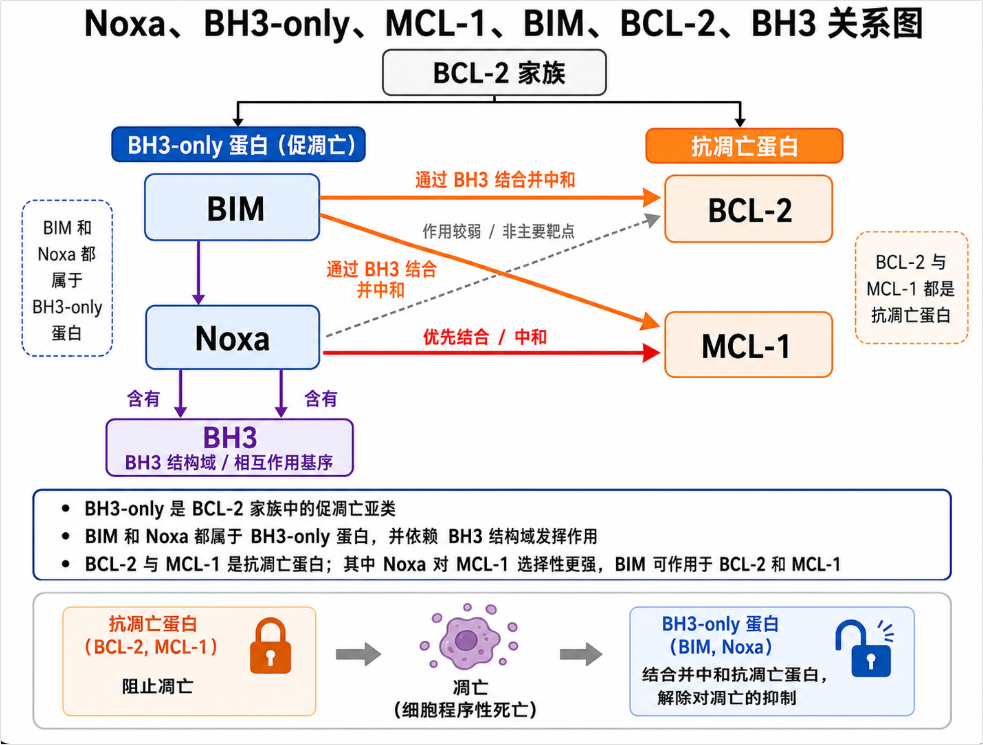
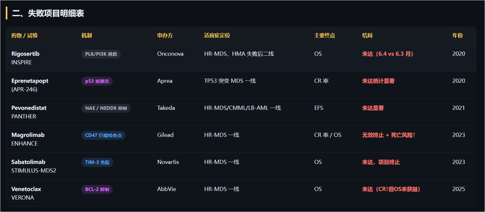

## 排除低危MDS

MDS中的Treg变化比较特别，不同疾病阶段呈现完全相反的模式。

早期/低危MDS是Treg功能不足，自身免疫损害，CXCR4 表达下调Treg 无法正常归巢到骨髓，免疫刹车失灵，自身免疫系统攻击正常造血前体细胞，加重无效造血（低危 MDS 患者常伴有自身免疫表现（10-20% 有系统性自身免疫疾病）），适合采用免疫抑制治疗（ATG、环孢素）

晚期/高危MDS：Treg过度浸润，免疫逃逸。Treg数量大幅增加，CXCR4表达升高，恶性克隆免疫逃逸，此时才需要解除抑制，而不是加强抑制。

AZA可下调Treg


Treg浸润本身会导致自身免疫，免疫细胞攻击正常细胞，导致血细胞减少。

低危 MDS 中 Treg 不足伴随的炎症微环境（TNF-α/IFN-γ 升高），**TNF-α 可以下调 BCL-2 的表达** ，降低正常细胞的凋亡阈值，如果再用BCL-2抑制剂，会更敏感，同样剂量的药物会杀伤更多正常的细胞。

| 细胞类型                  | BCL-2 依赖性             | Venetoclax 影响         |
| :------------------------ | :----------------------- | :---------------------- |
| **正常 HSC**              | 依赖 MCL-1，不依赖 BCL-2 | 相对保留 ✓              |
| **粒细胞前体**            | **依赖 BCL-2**           | 被杀伤 → 中性粒细胞减少 |
| **红系前体**              | **部分依赖 BCL-2**       | 被杀伤 → 贫血加重       |
| **巨核前体**              | **部分依赖 BCL-2**       | 被杀伤 → 血小板减少     |
| **白血病干细胞/原始细胞** | 高表达 BCL-2             | 被杀伤（这是有益的）    |

| 正确方向（免疫抑制治疗） | 错误方向（Venetoclax）        |                                        |
| :----------------------- | :---------------------------- | -------------------------------------- |
| **治疗**                 | ATG / 环孢素                  | Venetoclax                             |
| **作用机制**             | 抑制 CD8+ CTL、恢复 Treg 功能 | 抑制 BCL-2 → 促进凋亡                  |
| **对免疫攻击**           | **减少**对正常前体的免疫攻击  | **不解决**免疫攻击                     |
| **对正常前体**           | 保留（不再被 CTL 杀）         | **额外杀伤**（BCL-2 依赖的前体被凋亡） |
| **有效率**               | 30% 脱离输血（低危 MDS）      | VERONA 中 < 5% blasts 获益不明显       |
| **骨髓抑制**             | 无                            | 3-4 级中性粒细胞减少 76.9%             |

低危MDS以恢复Treg功能为主，恢复Treg后可恢复正常造血。


## 过往MDS临床

$亚盛医药-B(06855)$
GLORA4的临床试验虽然还在入组，而实际上的试验结果，公司都已经看到了。
1.取得CR的患者，无论是持续用药，还是去接受骨髓移植，生存期都非常显著比没有取得CR的患者更长。
2.只要治疗组CR率显著高于对照组，OS做出来也是顺理成章。
3.VERONA不仅仅是OS未取得统计学差异的优效，CR率相比对照组AZA单药也几乎没有差异。
4.联合治疗CR率比单药高很多，在Bcl2过往的临床试验，以及在真实世界应用中，都是如此。
5.VERONA试验失败的根本原因是治疗组AZA减量的比例过大，减了一半多的剂量，造成了疗效不足。
6.GLORA4就看整体AZA减量的比例，就能知道最后的结果了。如果AZA减量比例低，同时就算减量，也是减到50mg而非36mg，那么CR率做出阳性结果就顺理成章了。
7.而前两个周期减量的情况，公司临床团队肯定是随时掌握的，所以在JP Morgan的时候，大俊已经说得非常直白了。


GLORA-4，一线HR-MDS，APG2575靠什么来赢下全球三期？：https://xueqiu.com/1393486978/351692187


- 药理机制
  - Venetoclax、Sonrotoclax、Lisaftoclax
  - 半衰期、BCL-2亲和力、BCL-xL选择性、起效时间（快速细胞进入）、代谢通路
- 疾病特征
  - CLL/SLL、AML、MDS，CLL对BCL-2很敏感，AML会更多依赖MCL-1
- 过往历史
  - Venetoclax、off-label、真实人群
  - 其余MDS药物

药物研究的基本范式：从药理预测临床结果，从临床结果验证、迭代药理机制，只盯着临床的数据，就像无根浮萍，没有锚点，心里就没底。

故本文也是如此，先看药物设计的底层逻辑，再用这个逻辑去验证早期临床反应和数据，再根据结果，看有无增量信息或原来的药物原理假象是否有漏洞，进行增删改，行程新的机理，进行下次临床预测，循环往复进行迭代。


> 构建药理机制，根据已有临床数据印证，根据药理机制推导进行中临床的结果，根据临床结果再次印证药理机制，如果发现对不齐，则重新构建药理机制。从早期临床到1b、到2期、到3期，一步一步构建和验证
>
> 根据这个范式，能否预测维特克拉会在AZA联用时失败，进而预测MDS适应症中的失败？当时的人是否有过这类担忧？还是说大概知道会失败，但还是做了这个**VIALE-A**三期临床


《我的创新药选股策略》一文讲了我自己的创新药选股方式，但还有几点需要补充的，一个是漏了临床入组标准，一个是创新药和其他行业的区别。

药企临床入组标准越符合真实世界患者分布或者入组患者越难治，到了开大三期临床时，暴雷的可能性越低。如果初期临床就筛选患者去做好数据，那我会比较担心这款药。分析一家药企，最重要的是看它药好不好。一方面是药理机制和同类产品的差异，对比其优劣；另一方面是过往临床数据分析。由于人体机制的复杂，很多时候也是用临床反推药理，最后还是要落到临床上看，所以我会比较在乎药企临床的选择。

创新药和其他行业有个很明显的区别，药的好坏有**标准客观且信息详实**：一款药能延长20%的患者2年寿命还是5年，都有客观的临床数据做支撑。很多投资的错误是投资者主观臆断出来的，倘若可以在推断中提高客观信息的比例，推断的结论会更真实

普通人和机构基本没有信息差距，药物临床数据都是公开的，竞品信息也容易获得，搞内幕交易的除外，更多的还是认知差距。


# 药理机制


1. APG-2575最显著的特征是短半衰期（t1/2 3-6小时）配合高Cmax/低AUC的PK曲线
2. 低CYP3A4/P-gp依赖性


### 分子设计


lisaftoclax与venetoclax在P2口袋结合区域存在结构差异。Venetoclax的氯苯基深插入P2口袋底部，正是这一区域受G101V突变的"knock-on"效应影响最为显著。APG-2575采用二氟环己烷（difluorocyclohexane）尾部结构替代venetoclax的氯苯基，P2口袋结合模式更为浅表。理论上，这种差异化的结合模式可能降低G101V突变对亲和力的影响，但目前尚无公开的APG-2575与G101V突变BCL-2的晶体结构或表面等离子体共振（surface plasmon resonance, SPR）数据直接验证这一假设。相比之下，sonrotoclax（BGB-11417）的P2口袋浅结合策略已通过1.80 Å高分辨率晶体结构获得完整验证。APG-2575在单药克服BCL-2突变方面的能力目前仍属推测性，需更多结构生物学数据支撑。


#### 综述

Lisaftoclax 以**高 Cmax、短血浆半衰期和短 ramp-up**换取更便捷、潜在更可控的 BCL-2 抑制方案

核心模型为：药物快速达到足以跨越线粒体凋亡阈值的峰浓度，释放 BIM 并激活 BAX/BAK，触发不可逆的 MOMP；随后短血浆暴露限制正常组织持续受药，肿瘤组织滞留则可能维持疗效。该模型可解释早期 ALC 下降、0% TLS、4–6 天 ramp-up 及相对可控的血液学毒性。

现有数据支持其在 CLL/SLL 中的活性和联合治疗潜力，但 TP53 缺失/突变、复杂核型及 MCL-1 上调仍是关键疗效边界。

#### 1、靶点与凋亡通路

*对BCL-xL的抑制*

Lisaftoclax 是 BH3 模拟物，通过占据 BCL-2 的 BH3 结合槽，置换被隔离的促凋亡蛋白（主要为 BIM），继而激活 BAX/BAK、诱发线粒体外膜通透化（MOMP），启动 caspase 级联反应并执行凋亡。

其生化特征为 BCL-2 偏向、但仍保留 BCL-xL 抑制活性：BCL-2 IC50 约 2 nM，BCL-xL IC50 约 5.9 nM，MCL-1 IC50 >5,000 nM。因此，它更接近“BCL-2 偏向性双重抑制剂”，而非 venetoclax 式的高度 BCL-2 选择性抑制剂。细胞实验中，其对 BCL-2 与 BCL-xL 依赖细胞均有功能性活性。

2、Cmax脉冲式凋亡模型

快速达到有效细胞内浓度，触发肿瘤细胞凋亡

本报告的统一假设是：BCL-2 抑制的关键不是持续累积暴露，而是短时间内跨越凋亡阈值的峰浓度。MOMP 属于阈值型、不可逆事件；一旦足量 BIM 被释放并形成 BAX/BAK 孔道，后续维持高浓度的边际收益可能有限。

> 高Cmax，低AUC，没有持续压制，BIM为什么不被其他BCL-2拦截

肿瘤组织滞留（约 13–48 小时）大于血液滞留，血浆半衰期约 3–5 小时(venetoclax 约 26 小时)

肿瘤滞留数据目前主要来自临床前模型


#### 3、安全性

BCL-xL 在巨核细胞和血小板生存中重要。Lisaftoclax 约 3 倍的 BCL-2/BCL-xL 选择性提示存在血小板减少风险；但其短半衰期可能降低持续 BCL-xL 抑制，从而部分抵消这一风险。现有早期综合数据中，≥3 级血小板减少约 13.5%，仍需长期暴露数据确认。

对于 venetoclax 常见的 BCL-2 G101V 耐药突变，Lisaftoclax 的生化 IC50 约 57 nM、细胞 IC50 约 61 nM，活性并不显示其具有明确的耐药覆盖优势。因此，其主要竞争价值在安全性、给药便利性和联合方案，而非 G101V 克服能力。MCL-1 上调仍是最重要的旁路耐药机制。


细胞内进入更快、血液中停留更短、半衰期更快

至于 **P2 口袋**，可以把 BCL‑2 的疏水沟槽想成几格凹槽，P1、P2、P3、P4 是其中的不同“卡位”。Venetoclax 的一部分基团会较深地插入 P2；而 Sonrotoclax 的相应基团停在 P2 入口附近，位置更靠近 α4 螺旋，并形成额外的疏水、π–π 和水桥氢键相互作用。

APG‑2575 的卖点偏“PK 与细胞摄取”；Sonrotoclax 的卖点偏“P2 口袋新姿势与 G101V 耐药覆盖”


APG-2575（lisaftoclax）与venetoclax在P2口袋结合区域存在结构差异。Venetoclax的氯苯基深插入P2口袋底部，正是这一区域受G101V突变的"knock-on"效应影响最为显著。APG-2575采用二氟环己烷（difluorocyclohexane）尾部结构替代venetoclax的氯苯基，P2口袋结合模式更为浅表。理论上，这种差异化的结合模式可能降低G101V突变对亲和力的影响，但目前尚无公开的APG-2575与G101V突变BCL-2的晶体结构或表面等离子体共振（surface plasmon resonance, SPR）数据直接验证这一假设。相比之下，sonrotoclax（BGB-11417）的P2口袋浅结合策略已通过1.80 Å高分辨率晶体结构获得完整验证。APG-2575在单药克服BCL-2突变方面的能力目前仍属推测性，需更多结构生物学数据支撑。

Sonrotoclax（BGB-11417）是当前二代BCL-2抑制剂中抗耐药证据最充分的竞争者。其分子设计的核心创新在于采用7-氮杂螺[3.5]壬烷连接臂和(S)-2-(2-异丙基苯基)吡咯烷基团，形成"浅而广"的P2口袋结合模式——异丙基苯基位于P2口袋入口处，与F112形成edge-to-face π-π相互作用、与M115形成硫-π相互作用，而不深入P2口袋底部，从而完全规避G101V突变引起的空间位阻。功能验证显示，sonrotoclax在G101V异种移植模型中50 mg/kg诱导106%肿瘤生长抑制（tumor growth inhibition, TGI）并持续至第46天，而venetoclax同剂量仅61% TGI。对D103Y突变的亲和力高125倍于venetoclax，对A113G、V156D和R129L突变的亲和力亦高35-83倍。

**表2. APG-2575 vs Sonrotoclax抗耐药能力对比**

| 对比维度                   | APG-2575 (Lisaftoclax)             | Sonrotoclax (BGB-11417)                    | 战略含义                         |
| :------------------------- | :--------------------------------- | :----------------------------------------- | :------------------------------- |
| **P2口袋结合模式**         | 二氟环己烷，浅表结合（推测）       | 异丙基苯基吡咯烷，"浅而广"（晶体结构证实） | Sonrotoclax有结构生物学确证优势  |
| **G101V单药克服**          | 临床前联合数据支持，单药数据有限   | 强效克服，G101V模型TGI 106%                | Sonrotoclax单药抗突变能力更强    |
| **D103Y单药克服**          | 联合APG-115可克服                  | 亲和力高125倍于venetoclax                  | Sonrotoclax对D103Y同样有效       |
| **其他突变覆盖**           | 联合策略覆盖                       | A113G/V156D/R129L均有效                    | Sonrotoclax突变覆盖更广          |
| **联合策略丰富度**         | MDM2i+BTKi+FLT3i+HMA，内部管线齐全 | 主要聚焦+BTKi（泽布替尼）                  | APG-2575联合矩阵更丰富           |
| **venetoclax难治临床数据** | ORR 31.8%（ASCO 2025, n=22可评估） | 尚无公开数据                               | APG-2575有先发临床证据           |
| **PK特征支持**             | 短半衰期(3-6h)，快速爬坡(5天)      | 半衰期~4h，零TLS事件                       | 两者均优于venetoclax             |
| **p53通路协同**            | APG-115（MDM2i，内部管线）         | 外部合作/联合化疗                          | APG-2575+p53轴协同有内部整合优势 |


#### Cmax

**APG‑2575 的直接凋亡机制是靶点占领**——药物在细胞内结合 BCL‑2、破坏 BCL‑2:BIM 复合物，继而启动 BAX/BAK、线粒体外膜通透化和 caspase 凋亡；**较高的 Cmax 是帮助它在短时间内达到足够靶点占领的一种 PK 设计特征**。 

```
高 Cmax → 更快/更高的细胞内游离药物浓度 → BCL‑2 占领超过凋亡阈值 → BIM 释放 → BAX/BAK → 凋亡111111111111
```

但中间两个限定很重要：

- 不是总血药浓度 Cmax 本身“按下死亡按钮”，而是**肿瘤细胞内的游离药物浓度与 BCL‑2 占领率**；
- 是否进入凋亡还取决于肿瘤对 BCL‑2 的依赖、BIM 储量、MCL‑1/BCL‑XL 的替代保护，以及暴露持续时间，不能只看 Cmax。

APG‑2575 确实被设计为“**高 Cmax、短半衰期、低累积**”：临床中约 3–5 小时半衰期，且没有明显多次给药累积。这个特征的策略含义是“快速有效打击 + 缩短全身暴露窗口”，而不是已经证明存在一个普适的、仅由 Cmax 决定的凋亡开关。


#### 耐药

Sonrotoclax和Lisaftoclax耐药能力区别（尤其是处理各种突变）？=> 分子结构差异

耐药的代价、分子设计与安全性、DDI


1、BCL-2靶点突变：G101V、D103Y、F104C

2、MCL-1上调：NF-κB驱动的代偿性表达，覆盖面远超BCL-2基因突变，MCL-1取代被抑制的BCL-2接管BH3-only蛋白的隔离功能

3、BAX/BIM通路缺陷：效应器层面的凋亡阻断；PUMA（p53 upregulated modulator of apoptosis）的表观遗传沉默

4、 微环境耐药：CD40信号与骨髓基质保护

**表1. Venetoclax获得性耐药机制分类**

| 耐药类别   | 具体机制         | 关键分子事件            | 出现频率             | 可逆性           | 疾病背景 |
| :--------- | :--------------- | :---------------------- | :------------------- | :--------------- | :------- |
| 靶点突变   | BCL-2 G101V      | P2口袋亲和力↓180倍      | ~46% (CLL进展)       | 不可逆           | CLL为主  |
| 靶点突变   | BCL-2 D103Y      | P4口袋直接破坏          | ~3%                  | 不可逆           | CLL      |
| 靶点突变   | BCL-2 F104C/L    | P2口袋亲和力↓14-1,389倍 | 低频                 | 不可逆           | CLL      |
| 代偿上调   | NF-κB→MCL-1转录  | c-REL结合MCL1启动子     | ~100% (持续治疗复发) | 大部分可逆       | CLL/AML  |
| 基因扩增   | MCL-1(1q21)扩增  | MCL-1表达稳定上调       | ~5%                  | 不可逆           | CLL      |
| 效应器突变 | BAX功能缺失      | 错义/移码/剪接突变      | ~17% (AML复发)       | 不可逆           | AML      |
| 表观遗传   | PUMA启动子甲基化 | CpG岛甲基化→PUMA沉默    | ~20%                 | 可逆(去甲基化药) | AML      |
| 代谢重编程 | OXPHOS依赖增加   | 脂肪酸氧化驱动OXPHOS    | ~35%                 | 部分可逆         | CLL/AML  |
| 微环境     | CD40/NF-κB信号   | BCL-XL/MCL-1上调        | ~30%                 | 可逆(离开微环境) | CLL      |


### 核心逻辑：不是"打开"，是"释放"

Venetoclax 做的事可以概括为一句话：

> **抢占 BCL-2 的疏水沟槽，把被扣押的促凋亡蛋白挤出牢房。**

---

### 第一步：理解癌细胞里的"人质劫持"局面

在癌细胞（尤其是 CLL）中：

```
正常情况下 BCL-2 的沟槽里关着谁？
                          BIM
                           │
    ┌──────────────────────┐│
    │       BCL-2          ▼│
    │  ┌──────────────────┐ │
    │  │ 疏水沟槽（锁孔）  │ │
    │  │  BIM BH3 插在里面 │ │  ← 被扣押，无法行动
    │  └──────────────────┘ │
    └──────────────────────┘
              │
              ▼
        BIM 动弹不得
              │
              ▼
    无法激活 BAX/BAK → 无法打孔 → 细胞不死
```

BCL-2 高度过表达 → 大量 BIM 被扣押在沟槽里 → 凋亡通路被"刹车踩死"。

---

### 第二步：Venetoclax 登场 — "假钥匙"竞争

Venetoclax 是一个 **BH3 模拟物（BH3 mimetic）**——它长得像 BIM 的 BH3 结构域。

```
Venetoclax 的 BH3 模拟结构 vs 天然 BIM BH3：

BIM BH3 核心序列：   ...h₁-s-X-X-h₂-X-X-h₃-s-D-X-h₄...
                        │          │          │
                       疏水残基    必为Leu    疏水残基
                       
Venetoclax：设计成比天然 BIM 对沟槽的亲和力更高
```

**竞争替换过程：**

```
     ┌──────────────────────┐
     │       BCL-2          │
     │  ┌──────────────┐    │     Venetoclax（更高亲和力）
     │  │ 疏水沟槽      │◄───│──────────────────────────────
     │  │ BIM 占着 🔒   │    │     "让开，我比它贴得更紧"
     │  └──────────────┘    │
     └──────────────────────┘
              │
              ▼
     BIM 被挤出沟槽 → 释放！
```

---

### 第三步：释放后的连锁反应

被释放的 BIM 恢复自由身后：

```
BIM（自由） ──激活──► BAX/BAK ──构象变化──► 寡聚化
                                                  │
                                                  ▼
                                          在线粒体外膜打孔
                                                  │
                                                  ▼
                                    细胞色素 c 漏出到胞浆
                                                  │
                                                  ▼
                              Caspase-9 → Caspase-3/7 级联
                                                  │
                                                  ▼
                                            细胞凋亡 💀
```

---

### 一个精准的类比

| 场景              | 对应         |
| ----------------- | ------------ |
| BCL-2 的疏水沟槽  | 手铐         |
| BIM（促凋亡蛋白） | 被铐住的警察 |
| Venetoclax        | 万能钥匙     |

> **BCL-2 用手铐铐住了警察 BIM，癌细胞因此无法被"执法"。Venetoclax 这把钥匙插进去，手铐开了，警察 BIM 被放出来 → 叫上 BAX/BAK 特警队 → 在线粒体膜上破门 → 癌细胞伏法。**

---

### 关键细节：为什么 Venetoclax 能做到"更高亲和力"？

回顾上一轮讨论的**四个疏水口袋 P1-P4**：

```
BCL-2 疏水沟槽内部结构（剖面）：

  ╔════╗ ╔════╗ ╔════╗ ╔════╗
  ║ P1 ║ ║ P2 ║ ║ P3 ║ ║ P4 ║   ← 四个疏水口袋
  ╚════╝ ╚════╝ ╚════╝ ╚════╝
    ▲      ▲      ▲      ▲
    │      │      │      │
    ▼      ▼      ▼      ▼
  BIM 天然 BH3：P1+P2+P3 主要结合，亲和力中等
  Venetoclax：  P2+P4 精准锁定，亲和力 sub-nM 级（约 1000 倍于天然）
```

Venetoclax 通过 **基于结构的理性设计（NMR 片段筛选 + 药物化学优化）**，精确匹配了 BCL-2 沟槽的 P2 和 P4 口袋，实现了远超天然 BIM BH3 的结合力。这就是它能"挤掉"BIM 的物理化学基础。

---

### 一句话总结

> **Venetoclax 不是直接"打开"促凋亡蛋白，而是作为一把比原装钥匙更契合锁孔的假钥匙，插入 BCL-2 的疏水沟槽（BH1-BH3 形成），把被扣押的天然促凋亡蛋白 BIM 挤出去。释放后的 BIM 激活 BAX/BAK 在线粒体膜上打孔，启动凋亡级联，癌细胞死亡。**


BCL-2家族同时存在抗凋亡蛋白和促凋亡蛋白，谁的声音大，谁决定命运，本身是一个**动态竞争系统**。促凋亡蛋白如：BIM、BAX、BAK、Noxa、PUMA，致力于线粒体外膜通透化。抗凋亡蛋白如：BCL-2、MCL-1，致力于阻止线粒体损伤。BIM可以结合MCL-1和BCL-2两个靶点，Noxa更偏向MCL-1。


| 蛋白类别       | 代表成员 | BH结构域 | 主要功能                            | 血液肿瘤表达特征                              |
| :------------- | :------- | :------- | :---------------------------------- | :-------------------------------------------- |
| 抗凋亡蛋白     | BCL-2    | BH1-BH4  | 隔离BH3-only蛋白和BAX/BAK，抑制MOMP | t(14;18)易位导致过表达；CLL/AML均高表达       |
|                | BCL-XL   | BH1-BH4  | 功能冗余替代BCL-2                   | 淋巴结微环境中CD40信号上调                    |
|                | MCL-1    | BH1-BH4  | 半衰期~30 min，快速响应生存信号     | Venetoclax治疗后NF-κB驱动上调，为主要代偿机制 |
| 促凋亡效应蛋白 | BAX      | BH1-BH3  | MOMP执行者，线粒体外膜孔道形成      | 功能缺失突变见于17% venetoclax复发AML         |
|                | BAK      | BH1-BH3  | 与BAX功能冗余                       | 受BCL-XL和MCL-1双重调控                       |
| BH3-only蛋白   | BIM      | BH3-only | 强效凋亡激活剂                      | 被BCL-2隔离，表达水平影响venetoclax敏感性     |
|                | PUMA     | BH3-only | p53下游效应分子                     | 启动子甲基化介导venetoclax耐药                |
|                | NOXA     | BH3-only | 选择性结合MCL-1                     | MDM2抑制剂可上调NOXA                          |

> BH3-only 蛋白是一类促凋亡的 BCL‑2 家族蛋白。它们共同特点是：通常只保留一个关键的 **BH3 结构域**，没有完整的 BCL‑2 蛋白折叠；这个 BH3 片段在需要时形成 α 螺旋，插入 BCL‑2、BCL‑XL、MCL‑1 等抗凋亡蛋白的疏水沟槽。
>
> 常见成员包括：BIM、BID、PUMA、NOXA、BAD、BIK、BMF、HRK。
>
> 作用可以简单理解为“把细胞的死亡开关推向开启”：
>
> **解除刹车**：BAD、NOXA 等占据 BCL‑2 类蛋白的疏水沟槽，让其不能再抑制 BAX/BAK。
>
> **直接点火**：BIM、截短 BID（tBID）、PUMA 等还可直接促进 BAX/BAK 激活。
>
> **执行结果**：BAX/BAK 在线粒体外膜聚集并形成孔道，释放细胞色素 c，随后启动 caspase 级联反应，使细胞发生内源性凋亡


冗余、高可用：当BCL-2被药物抑制时，MCL-1和BCL-XL可快速接管其功能，这是venetoclax获得性耐药的主要分子基础。MCL-1因其极短的蛋白半衰期成为最动态的代偿节点——单细胞多组学分析显示所有venetoclax复发CLL患者均存在NF-κB驱动的MCL-1上调

BH3-only蛋白的表达水平直接决定肿瘤细胞对BCL-2抑制剂的敏感性，PUMA的表观遗传沉默可使细胞获得耐药而不依赖BCL-2基因突变


BH3-only蛋白是细胞应激的分子传感器，不同成员会接收不同应激通路的信号，并把这些信号转换为对 BCL‑2 凋亡网络的调控。如：

**PUMA、NOXA**：常由 DNA 损伤后的 p53 诱导表达。

**BIM**：可在生长因子撤除、PI3K–AKT 信号降低或内质网应激时增加/被激活。

**BAD**：受存活信号相关的磷酸化调控。

**BID**：可被死亡受体通路中的 caspase‑8 切割为活性的 tBID。

它们本质上是一个“压力输入 → 线粒体凋亡输出”的转换层：轻度或短暂应激时，抗凋亡蛋白仍能压住信号；当应激足够强或持续足够久，BH3-only 蛋白累积并占据 BCL‑2 的沟槽，最终释放/激活 BAX 和 BAK，让受损细胞有序退出

> https://www.nature.com/articles/cdd2017186


CLL常依赖BCL-2 → Venetoclax有效，多发性骨髓瘤常依赖MCL-1 → MCL-1抑制剂成为重要方向，一些淋巴瘤同时依赖BCL-2/MCL-1 → 需要组合策略

> 线粒体：平时负责给细胞供能（产生ATP），受到损伤时会释放死亡信号，让细胞自毁
>
> 正常情况下，线粒体内部细胞色素C被锁住，细胞正常存活，但如果细胞决定死亡，则会释放Cytochrome c，激活Caspase，导致细胞凋亡
>
> 线粒体外膜可以理解成一道门，打开则Cyt C出来
>
> 外膜 |  Cyt C | 线粒体


Lisaftoclax半衰期约 **3-5小时**，论文强调其“血浆停留时间有限、系统暴露较低”。BCL-2抑制剂杀细胞很快，如果药物持续高暴露时间长，理论上更容易造成持续、集中性的肿瘤细胞裂解。Lisaftoclax更像是高峰值触发凋亡、但不长时间滞留。

BCL-2 失控的是细胞把“不要凋亡”的信号开得太强，导致本该死亡的异常血液细胞继续存活；不同疾病里，BCL-2 被抬高的原因不同。2575作为BCL-2抑制剂（BH3模拟剂），通过结合抗凋亡蛋白抑制其活性和功能，从而促进细胞凋亡。

短半衰期+双通路代谢带来良好的安全性和适用性，无DDI，少TLS。

```
Lisaftoclax
    ↓
竞争性结合 BCL-2 蛋白 BH3 疏水槽
    ↓
置换 BCL-2:BIM 复合物 → 释放 BIM 蛋白
    ↓
释放 BAX/BAK 促凋亡蛋白
    ↓
线粒体外膜通透化 (MOMP)
    ↓
细胞色素 c 释放 → Caspase-9 → Caspase-3/7 级联激活
    ↓
PARP 切割 → 凋亡执行


化学式：
1、lisaftoclax + BCL-2:BIM  →  lisaftoclax:BCL-2 + 游离 BIM 
2、游离 BIM → 激活 BAX/BAK → 线粒体外膜通透化（MOMP） → 细胞色素 c / caspase → 凋亡

部分释义：
BIM：负责“发出死亡命令、解除刹车”，不直接制造线粒体孔洞，主要作用是调节其他BCL-2家族成员
BAX/BAK：负责“执行死亡动作、打穿线粒体膜”
MOMP（mitochondrial outer membrane permeabilization，线粒体外膜通透化）
MOMP通常被认为是线粒体凋亡不可逆的关键步骤


细胞受到严重压力
        ↓
   BH3-only蛋白激活
        ↓
 ┌─────────────┐
 │             │
BIM/Noxa      （其他BH3-only）
 │
 │ 抑制BCL-2/MCL-1
 ↓
释放BAX/BAK
 ↓
BAX/BAK在线粒体外膜打孔
 ↓
Cytochrome c释放
 ↓
Caspase激活
 ↓
细胞凋亡
```

| 类型         | 代表蛋白        | 作用                     |
| ------------ | --------------- | ------------------------ |
| 抗凋亡蛋白   | BCL-2、MCL-1    | 关闭死亡开关             |
| BH3-only蛋白 | BIM、Noxa、PUMA | 解除刹车/发出信号        |
| 执行蛋白     | BAX、BAK        | 打开线粒体，释放死亡因子 |

BIM和Noxa都是BH3-only，但有所区别

BIM比较晚能，既可以中和MCL-1，也能中和BCL-2，触发BAX/BAK。Noxa更偏向MCL-1。


为什么Lisaftoclax实验中出现了Noxa上调，但Venetoclax没有？

核心原因通常不是BCL-2本身，而是**药物触发的应激反馈不同**。Lisaftoclax可能诱导更强的应激反应，细胞受到药物压力后，会通过转录程序补偿。Venetoclax主要是用自身的BH3置换BIM

```
BCL-2被抑制
      ↓
细胞感受到死亡压力
      ↓
激活p53、FOXO、ATF4等应激通路
      ↓
Noxa转录增加
      ↓
MCL-1下降
      ↓
增强凋亡

部分释义：p53、FOXO、ATF4等应激通路导致转录增加：

p53 → Noxa典型路径：
DNA损伤 / 强烈细胞压力 -> p53稳定化 ->  p53进入细胞核 -> 结合PMAIP1(Noxa)启动子 -> Noxa↑
P53的任务是检查细胞是否值得继续存活。如果损伤严重，p53会启动PUMA、Noxa、Bax促凋亡基因

ATF4 → Noxa（这是细胞压力过大时的“自毁程序”。）
ATF4主要响应：
内质网压力
氨基酸缺乏
蛋白折叠压力

蛋白压力
 ↓
PERK-eIF2α通路
 ↓
ATF4↑
 ↓
Noxa↑
 ↓
促进凋亡

FOXO → Noxa
FOXO感知：
氧化压力
营养状态
能量状态

氧化应激
 ↓
FOXO进入核
 ↓
Noxa↑
 ↓
线粒体凋亡增加

Noxa不是普通的凋亡蛋白，它是细胞感受到“活不下去”时，被各种压力传感器叫出来的执行辅助因子。
```


BCL-2耐药：

```
正常情况：
Venetoclax占据BCL-2
↓
BIM释放
↓
BIM激活BAX/BAK
↓
凋亡


耐药情况1：
MCL-1 ↑↑
↓
MCL-1抓住BIM
↓
BIM无法激活BAX/BAK
↓
不凋亡


耐药情况2：BIM不足
BCL-2抑制
↓
没有足够BIM释放
↓
BAX/BAK无法启动
↓
耐药


其他耐药：BAX/BAK坏了、其他抗凋亡蛋白补位（BCL-2家族还有BCL-xL、BCL-W，也可以MCL-1 + BCL-xL继续压制BAX/BAK）
```


Lisaftoclax机制反映到临床数据会有什么表现？在具体的适应症如CLL/SLL、AML、MDS中，有何不同？

1. 更高缓解率（ORR、CR）、更深缓解（MRD阴性）

2. 对高MCL-1患者更有效

3. 对Venetoclax耐药患者仍有效

4. 更少出现治疗早期失败

5. 对TP53突变CLL

   p53无法激活—> PUMA/Noxa下降，如果Lisaftoclax本身能诱导Noxa（非完全依赖p53），理论上可能改善。

6. 因为AML和CLL完全不同。AML细胞两种依赖（BCL-2、MCL-1）都有，尤其是干细胞样AML和复发AML更容易依赖MCL-1。若Lisaftoclax增加Noxa，则理论上会有更多的AML细胞进入凋亡，且延长缓解时间（PFS、RFS）。在Venetoclax失败患者中，通常MCL-1补偿+BCL-xL补偿，可能仍有效

7. MDS比AML复杂，MDS本身细胞处于半死亡状态，很多异常克隆，增殖不强，但逃逸凋亡。若Lisaftoclax上调Noxa，则可能导致更深的CR、更低的残留病灶

重点注意Venetoclax耐药患者和MCL-1高表达患者，临床指标主要是减少残留细胞逃逸方向，可以看DoR、PFS、OS


绕过MCL-1

- BCL-xL升高

  BAX/BAK缺陷

  TP53异常

  线粒体代谢改变


细胞凋亡当浓度达到一定值时，会变得不可逆。这种BIM结合的数量，一方面和药的结合力相关，一方面和药物浓度相关。


真正要测“是否容易被推过阈值”，研究者通常看 BH3 profiling、BCL-2:BIM 共沉淀/置换、BAX/BAK 激活、线粒体膜电位或 cytochrome c 释放，以及单细胞 Annexin V/caspase 阳性比例。


[快了鼠鼠——从BCL-2到亚盛医药的APG2575](https://xueqiu.com/2693678800/330594845)

利托沙克拉（lisaftoclax，APG-2575）的核心药理是：**选择性解除肿瘤细胞依赖的 BCL-2“刹车”，恢复线粒体凋亡。**

机制链可以理解为：

抑制 BCL-2 → 释放/增强 BIM 等促凋亡信号 → 激活 BAX/BAK → 线粒体外膜通透化（MOMP）→ 细胞色素c释放 → caspase-3/7 激活 → PARP切割与细胞凋亡


**破坏 BCL-2:BIM 复合物**

BCL-2 原本会“扣住”促凋亡蛋白 BIM，使肿瘤细胞逃避免死。利托沙克拉作为 BH3 模拟剂占据 BCL-2 的结合槽，解离 BCL-2:BIM 复合物 → 释放促凋亡蛋白BIM。这是最直接、最确定的主机制。

**BIM 增加并转位到线粒体**

药物处理后，BIM 蛋白增加，且更多 BIM 从胞浆进入线粒体；这会推动 BAX/BAK 聚集、在线粒体膜上打孔。其原因可能是 BCL-2 对 BIM 的“封存”被解除，并伴随细胞应激后的促凋亡信号增强。

不过要注意：论文证明了这一现象与凋亡增强相关，**并未完全证明 APG-2575 是如何直接令 BIM 表达升高的**。

**Noxa 增加**

Noxa 是另一种 BH3-only 促凋亡蛋白，尤其可中和抗凋亡蛋白 MCL-1。它增加后，相当于减少了肿瘤细胞借 MCL-1“绕开”BCL-2 抑制的机会，因此可协同放大凋亡。其上调更可能是药物暴露后的细胞应激/凋亡程序的一部分，而非利托沙克拉已被证实直接靶向 Noxa。

**MOMP、细胞色素 c 释放、caspase-3/7 上升**

这是线粒体凋亡通路被真正推过“不可逆阈值”的结果。细胞色素 c 外泄后会启动 caspase 级联反应，最终拆解细胞内蛋白和 DNA 修复系统，使细胞进入程序性死亡。

**氧耗（OCR）、储备呼吸与 ATP 下降**

更合理的解读是：线粒体膜受损和凋亡启动后，线粒体功能随之崩解，因而呼吸和 ATP 生成降低。它们主要是凋亡过程的伴随/下游表现，不能简单理解成该药首先是“线粒体呼吸链抑制剂”。

| 机制                         | 2575 vs Venetoclax                                         |
| :--------------------------- | :--------------------------------------------------------- |
| **细胞摄取速度**             | 更快，RPMI8226细胞内浓度高1.44-1.61倍；KMS-11高1.46-1.92倍 |
| **细胞色素c释放**            | 更强                                                       |
| **caspase-3/7活化**          | 骨髓瘤和WMG中显著更高                                      |
| **凋亡诱导率**               | 骨髓瘤 72.92% vs 37.04%；WMG 60.20% vs 50.00%              |
| **MOMP（线粒体外膜通透化）** | 更显著增加                                                 |
| **BIM蛋白水平**              | 2小时内快速显著增加，6小时后下降                           |
| **Noxa蛋白水平**             | 1-6小时内显著升高（**Venetoclax对此无显著影响**）          |
| **BIM线粒体转位**            | 线粒体中BIM积累更多                                        |

与Venetoclax相比，2575有两个关键结构改造：

-  二甲基基团	-> 环丁基环
- 四氢-2H-吡喃基团 -> 1,4-二氧六环

这两个位置的修饰是2575所有差异化药理效应的**根本物质基础**。构效关系研究表明这两个位置可以改造且不影响对BCL-2的高亲和力结合，这赋予了2575独特的理化性质。

结构改造最直接的结果是**更快的细胞摄取速率**。2575进入肿瘤细胞后约2小时胞内浓度即达平台期，且在各时间点都高于Venetoclax。**这是下游一系列增强效应的第一推动力**——更多的药物分子更快地到达线粒体靶点，意味着：更高效地解离BCL-2:BIM复合物；更快达到触发凋亡所需的线粒体阈值浓度；

2575不仅进入细胞更快，其**解离BCL-2:BIM复合物的效率也可能更强**，释放出更多的游离BIM。

这是2575与Venetoclax最显著的分子层面差异之一。Noxa是BH3-only促凋亡蛋白，能**选择性中和MCL-1**（另一种抗凋亡蛋白）。2575上调Noxa意味着即使在MCL-1有一定表达的情况下，也能通过Noxa来"解除"MCL-1的保护作用，这可能是2575在耐药模型中表现更优的原因之一。


# 疾病特征

慢性淋巴细胞白血病（CLL）中，BCL-2过表达是最强的抗凋亡驱动因素，BCL-2高表达导致BIM被隔离，使得CLL成为BCL-2抑制剂最敏感的适应症。各BCL-2抑制剂也在CLL适应症中展示出最好的治疗效果。

急性髓系白血病（AML），AML的异质性显著高于CLL，单核细胞分化亚型（CD14+/CD64+）依赖MCL-1而非BCL-2，导致对Venetoclax耐药。

骨髓增生异常综合征（MDS）中，高危患者原始细胞BCL-2过表达，但TP53突变和复杂核型等不良遗传削弱了BCL-2抑制的普遍有效性。

不同适应症对BCL-2抑制剂敏感性梯度为：CLL>AML>MDS


## Noxa上调

> Lisaftoclax 抑制 BCL‑2 → BIM 被释放并转向线粒体 → 线粒体受压/凋亡信号增强 → NOXA 增加 → 抑制 MCL‑1 → 更彻底地启动 BAX/BAK 凋亡

BIM–BAX/BAK 通路启动后，线粒体功能下降、膜电位受损、ATP 生成降低；这不是外界的化疗/缺氧本身，而是药物触发的**细胞内线粒体应激**。在一些肿瘤细胞中，这会通过应激相关转录和蛋白稳定性调控，使 NOXA 增多。  

但要注意：**“Lisaftoclax 为什么一定会上调 NOXA”的精确上游通路，在该研究中并未被完整证明。** 因此最严谨的表述是“观察到与凋亡和线粒体压力相关的 NOXA 增加”，而不是已证明 “Lisaftoclax 直接诱导某一个特定转录因子，从而产生 NOXA”。

**3. NOXA 增加为何会让杀伤更强？**

NOXA 主要是 **MCL‑1 的拮抗者**。当 Lisaftoclax 把 BCL‑2 这道“生存防线”解除后，NOXA 再去抑制 MCL‑1，相当于继续拆除另一道防线；BIM、BAX/BAK 就更容易推动细胞凋亡。MCL‑1 保护常是 BCL‑2 抑制剂耐药的重要来源，因此 NOXA 增加在机制上可放大药效。


从基因表达层面，到SLL/CLL、AML、MDS的BCL-2失控的原理

> CLL/SLL：不肯死
>
> AML：幼稚细胞疯狂扩增 + 不分化
>
> **MDS：造血工厂质量失控，做了很多废品**

**BCL-2 失控的本质，是细胞把“不要凋亡”的信号开得太强，导致本该死亡的异常血液细胞继续存活；不同疾病里，BCL-2 被抬高的原因不同。**

从基因表达层面看，正常路径是：BCL2 基因 DNA→ 转录成 BCL2 mRNA→ 翻译成 BCL-2 蛋白→ BCL-2 在线粒体外膜上抑制凋亡


如果调控失衡：

BCL2 mRNA 增多、或 BCL2 mRNA 不再被 miRNA 压制、或 BCL-2 蛋白更稳定、或细胞更依赖 BCL-2

→ BCL-2 抗凋亡能力增强 → 肿瘤细胞不容易死


CLL/SLL 里，BCL-2 失控主要是“刹车丢了 + 生存信号增强”。

del(13q14)

→ miR-15a / miR-16-1 减少

→ 对 BCL2 mRNA 的抑制减弱

→ BCL-2 蛋白升高

→ CLL/SLL 细胞不容易凋亡

再加上：BCR 信号、淋巴结微环境、CD40L、BAFF、IL-4 →  给 CLL/SLL 细胞持续生存信号


所以 CLL/SLL 的特点是：**细胞不一定疯狂增殖，但特别“不肯死”。**


**AML**

AML 里，BCL-2 失控更像是“白血病干/祖细胞把 BCL-2 当成保命系统”。

AML 细胞，尤其是白血病干细胞，常常高度依赖线粒体抗凋亡机制：

AML 白血病干细胞 → 氧化磷酸化依赖较强 → 线粒体凋亡阈值被 BCL-2 抬高 → 细胞更难被清除


很多 AML 并不是因为 `BCL2` 基因易位，而是因为：分化阻滞、转录程序异常、FLT3 / RAS / IDH / NPM1 等突变背景、骨髓微环境生存信号

共同把细胞推向：BCL-2、MCL-1、BCL-XL 等抗凋亡蛋白依赖

所以 AML 里说 BCL-2，重点常是：**白血病细胞对 BCL-2 有功能依赖**，这就是 venetoclax 在 AML 中有效的基础。


**MDS**

MDS 比较复杂，因为它有阶段差异。

低危/早期 MDS 常见特点是：

无效造血
→ 造血细胞容易凋亡
→ 血细胞生成不足


但到了高危 MDS，或向 AML 转化时，情况会变成：

异常克隆获得生存优势

→ 抗凋亡机制增强

→ BCL-2 / MCL-1 等上调或依赖增强

→ 异常造血克隆更容易存活和扩增


所以 MDS 的逻辑是：早期：细胞死得太多，导致无效造血；高危/进展期：异常克隆越来越会逃避死亡


CLL/SLL 的 BCL-2 失控主要来自 miR-15a/16-1 缺失和微环境生存信号；AML 的 BCL-2 失控主要表现为白血病干/祖细胞对线粒体抗凋亡机制的依赖；MDS 则从早期无效造血的高凋亡状态，逐渐演变为高危克隆依赖 BCL-2/MCL-1 等抗凋亡通路而逃避死亡。


肿瘤细胞有两种途径被杀死，他杀和自杀。前者依赖激活免疫系统，代表药物为PD-1系列，后者依赖打开细胞凋亡，代表药物为VEN。

本文主要分析亚盛APG-2575，一种靶向BCL-2的小分子抑制剂。


https://www.mdpi.com/2072-6694/15/20/4957





| 项目           | 内容                                                         |
| -------------- | ------------------------------------------------------------ |
| 通用名         | 利沙托克拉(Lisaftoclax)                                      |
| 研发代号       | APG-2575                                                     |
| 靶点           | Bcl-2                                                        |
| 给药方式       | 口服,每日一次;起始4–6天每日快速爬坡至目标剂量                |
| 机制           | 让不会凋亡的癌细胞重新学会自杀                               |
| 权益方         | 亚盛医药，截止2026.7.9，暂无海外授权                         |
| 中国获批       | 2025 年 7 月 10 日                                           |
| 获批适应症     | 既往≥1 线系统治疗(含 BTKi)的成人 R/R CLL/SLL（中国）         |
| 进行中三期临床 | GLORA/GLORA-2/GLORA-3/GLORA-4                                |
| 临床主要适应症 | CLL/SLL、AML、MSD                                            |
| 进度           | 中国刚上市（2025 年中）、放量早期，全球后期临床、多适应症并行出海早期 |

在介绍2575之前，我们先对血液瘤分类有个大体的认知。肿瘤分为实体瘤和血液瘤，血液瘤下面又分为几个大类，分别是淋巴瘤、浆细胞肿瘤、白血病。

| 子类               | 占比 | 核心细分                                         |
| ------------------ | ---- | ------------------------------------------------ |
| 淋巴瘤             | ~51% | 霍奇金淋巴瘤（HL）、非霍奇金淋巴瘤（NHL，占90%） |
| 白血病             | ~36% | ALL、AML、CLL、CML                               |
| 浆细胞肿瘤         | ~13% | 多发性脊髓瘤（MM）                               |
| 其他（MDS、MPN等） | —    | 骨髓增生异常综合征、骨髓增殖性肿瘤               |


## CLL/SLL

APG-2575（lisaftoclax）与venetoclax在P2口袋结合区域存在结构差异。Venetoclax的氯苯基深插入P2口袋底部，正是这一区域受G101V突变的"knock-on"效应影响最为显著。APG-2575采用二氟环己烷（difluorocyclohexane）尾部结构替代venetoclax的氯苯基，P2口袋结合模式更为浅表。理论上，这种差异化的结合模式可能降低G101V突变对亲和力的影响，但目前尚无公开的APG-2575与G101V突变BCL-2的晶体结构或表面等离子体共振（surface plasmon resonance, SPR）数据直接验证这一假设。相比之下，sonrotoclax（BGB-11417）的P2口袋浅结合策略已通过1.80 Å高分辨率晶体结构获得完整验证。APG-2575在单药克服BCL-2突变方面的能力目前仍属推测性，需更多结构生物学数据支撑。

## AML


## MSD


### VEN+AZA在MDS失败的原因以及对2575+AZA的启示

MDS病症下患者贫血、中性粒细胞低、血小板低、正常造血储备差。

> AZA（阿扎胞苷）会抑制骨髓，是因为它在攻击异常造血细胞时，也会误伤正在快速分裂的正常造血祖细胞。
>
> AZA 上调促凋亡蛋白（BIM、NOXA）
>
> - **传统化疗**：杀死快速分裂的细胞（正常和恶性一起杀）→ 骨髓抑制
> - **AZA（标准剂量）**：重新编程异常细胞的表观遗传状态 → 诱导分化 + 恢复正常造血 → 血细胞计数回升
>
> 在标准剂量（75 mg/m²）下，AZA 对骨髓的影响是**双向且时序分离**的：
>
> **早期（前 1-2 个周期）**：细胞减少往往**暂时加重**——这不是表观遗传效应，而是 AZA 对增殖期造血祖细胞的轻度直接毒性。
>
> **后期（3-6 个周期后）**：随着 DNMT 耗竭和去甲基化累积——
>
> - 沉默的促分化基因重新表达
> - 异常克隆被抑制
> - **正常造血逐渐恢复**（三系血细胞回升）
> - 输血依赖减少——49% 患者获得血液学改善
>
> 
>
> 可以把骨髓想成“血细胞工厂”：
>
> 1. AZA是一种“假胞苷”，结构类似正常的核酸原料。
> 2. 细胞分裂、制造DNA和RNA时，会把AZA掺进去。
> 3. AZA一方面抑制DNA甲基化，帮助部分异常基因恢复表达；另一方面也会干扰DNA、RNA及蛋白质合成。
> 4. 骨髓造血祖细胞需要不断分裂，因而对这种干扰特别敏感。
> 5. 正常血细胞的生产暂时下降，于是出现中性粒细胞减少、血小板减少和贫血。
>
> MDS患者本身的造血功能已经很差，所以这种现象更加明显。治疗最初几个周期中，AZA既在清除异常克隆，又尚未让正常造血恢复，因此血象可能先下降、之后才改善。
>
> 一句话概括：AZA通过干扰异常细胞的DNA和RNA发挥作用，但正常造血细胞也需要快速合成DNA和RNA，因此会被同时抑制。

AZA的作用是表观遗传调节 + 温和细胞毒，降低异常甲基化，改善异常造血克隆、改善分化、延缓疾病进展、改善血象、骨髓抑制明显。由此产生的结果是血液学改善 HI、输血依赖减少、AML 转化延后、OS 延长、治疗期间骨髓抑制、感染、血小板低/中性粒低常见。AZA不擅长大幅度清除癌变细胞。临床数据上就是CR弱，OS行。

| 指标          | AZA          | 低剂量阿糖胞苷 / 强化化疗 |
| ------------- | ------------ | ------------------------- |
| 中位 OS       | **24.5个月** | **15.0个月**              |
| 2年生存率     | **约50.8%**  | **约26.2%**               |
| CR            | **约17%**    | 约8%                      |
| CR + PR       | **约29%**    | 约12%                     |
| 血液学改善 HI | **约49%**    | 约29%                     |


AZA+VEN：缓解更深，但毒性和治疗中断可能更重，最终毒副作用大于OS获益。

**为什么 AML 里 VEN+AZA 可以成功，MDS 里却可能不行**？

AML 里疾病负荷高、进展快：不强力杀白血病细胞，患者很快进展/死亡，所以 VEN 带来的杀伤增益很大，足以超过毒性成本。

MDS 病程相对慢一些，主要问题是无效造血和血细胞低，患者需要长期维持造血功能。这时如果联用药物让血象更差，OS 就容易被抵消。

AML：房子着火，强力灭火剂值得用，哪怕有副作用

MDS：房子线路老化，不能用太猛的灭火剂把电路也冲坏

AZA 单药在 MDS 中靠较温和、可持续的表观遗传调节延缓病程；VEN+AZA 虽然可能更强地清除异常克隆、提高缓解率，但在骨髓储备很差的 MDS 患者中会加重骨髓抑制、感染和治疗中断，导致缓解率提升不一定转化为 OS 获益。


# 过往案例

# 更高危 MDS（HR-MDS）三期临床失败地图

2020–2025 · 一线/HMA 失败后大空间的"新药坟场"风险水位盘点

数据核实日期：2026-07-14 ｜ 来源：Blood《The conundrum of drug development in HR-MDS》、各申办方公告、ClinicalTrials.gov





## 失败归因：为什么 HR-MDS 是"三期坟场"

- **疾病异质性极高**：HR-MDS 是一组分子背景迥异的疾病集合，"一个联合方案打天下"难以在所有亚型都胜出，整体 ITT 人群往往被稀释。
- **对照组太强**：单药 AZA 本身是难以撼动的标准治疗，"AZA + X"要在它之上再挤出 OS 获益，门槛极高。
- **CR 率 ≠ 生存获益**：多个项目（VERONA、magrolimab）能提高缓解率，却无法转化为 OS——提示 IWG 2006 疗效标准可能高估/低估真实获益。
- **早期信号误导**：均在 I/II 期显示"惊艳"数据（magrolimab ORR 91%、APR-246 CR 50%），三期一放大就回归现实——小样本单臂的过度乐观是系统性陷阱。
- **老年+高危人群脆弱**：叠加新机制常带来额外毒性/感染，抵消疗效增益（magrolimab 死亡风险升高即典型）。


## 对照组：同期在"低危 MDS"却接连成功

- **Luspatercept**（Reblozyl，MEDALIST/COMMANDS）— 低危 MDS 贫血，✅ 获批并成为一线新标准。
- **Imetelstat**（Rytelo，IMerge）— 低危 MDS 输血依赖，✅ 2024 获批，首个端粒酶抑制剂。
- **CC-486 口服阿扎胞苷**（Onureg，QUAZAR）— AML 维持治疗，✅ 获批。
- ➟ **关键启示**：钱和人才没有变，变的是**适应症选择**——同一批 KOL 在低危/维持领域捷报频传，在 HR-MDS 一线却全军覆没。风险不在团队，在"赛道"。

BCL-2（B-cell lymphoma 2）靶点的药物开发史是肿瘤靶向治疗领域最富教育意义的篇章之一。从2000年代初ABT-737的概念验证到2016年venetoclax（维奈克拉，ABT-199）成为首个获批的BCL-2抑制剂，这一过程凝聚了超过20年的结构生物学、药物化学和临床研究积累。在此期间，至少10个BCL-2靶向药物在临床试验中遭遇失败，每一次失败都为后续分子的设计提供了关键指导。对于APG-2575（lisaftoclax）而言，系统理解这一历史不仅有助于评估其技术路线的合理性，更能帮助预判其在GLORA系列试验中可能面临的陷阱。

### 3.1 Navitoclax（ABT-263）的失败教训

#### 3.1.1 剂量限制性血小板减少的生化根源：BCL-XL脱靶抑制导致循环血小板凋亡

Navitoclax（ABT-263）是AbbVie基于ABT-737优化的口服BCL-2家族抑制剂，对BCL-2、BCL-XL和BCL-W均具有亚纳摩尔级别的亲和力（BCL-xL Ki ≤ 0.5 nM，BCL-2 Ki ≤ 1 nM，BCL-w Ki ≤ 1 nM）。在Phase I临床试验中，navitoclax在CLL和SCLC（small cell lung cancer，小细胞肺癌）患者中展现出明确的抗肿瘤活性，但所有患者均出现血小板减少，且该毒性呈剂量依赖性，在给药后24–72小时内血小板计数降至最低点，与动物模型中BCL-XL抑制的动力学完全平行 。

这一毒性的生化根源在于BCL-XL在血小板中高度表达，是维持循环血小板存活的关键抗凋亡蛋白。Mason等人2007年在Cell上发表的研究首次证实，BCL-XL通过抑制BAK/BAX介导的线粒体外膜通透化（MOMP，mitochondrial outer membrane permeabilization）来维持血小板寿命 。当navitoclax以有效抗肿瘤剂量给药时，对BCL-XL的同步抑制触发了血小板的程序性凋亡，导致治疗窗口极度狭窄——有效剂量与产生严重血小板减少的剂量高度重叠。间歇给药策略虽可部分恢复血小板计数，但肿瘤暴露时间不足，无法解决根本矛盾。

Navitoclax的肿瘤适应症开发最终因此终止，但其在衰老细胞清除（senolytic）领域的 repurposing 获得了新生。研究人员开发了Nav-Gal（半乳糖偶联前药），利用衰老细胞高表达β-半乳糖苷酶（SA-β-gal）的特性实现选择性释放，在保持senolytic活性的同时显著降低血小板毒性 。

#### 3.1.2 对后续药物设计的启示：选择性>效力，BCL-2/BCL-XL选择性是成药的前提

Navitoclax的失败为BCL-2靶点药物设计留下了最核心的教训：**选择性优于绝对效力**。AbbVie的研究团队通过反向工程navitoclax的结构，系统移除或替换关键结合元件，并引入氮杂吲哚（azaindole）作为P4口袋的新结合基团，最终获得了venetoclax（ABT-199）——一种对BCL-2具有极高亲和力（Ki < 0.01 nM）而对BCL-XL亲和力低约5,000倍（Ki = 48 nM）的高度选择性抑制剂 。这一结构优化的结果是venetoclax在体外和体内均显著减少对血小板的损伤，同时具备强大的抗白血病活性。

APG-2575的设计同样遵循了这一原则。临床前数据显示，APG-2575对BCL-XL的选择性窗口超过1,000倍（venetoclax约325倍），在临床试验中未观察到显著的剂量限制性血小板减少 。这验证了Navitoclax教训的普适性——在BCL-2家族抑制剂的设计中，规避BCL-XL是成药的第一道门槛。

### 3.2 Venetoclax的成功路径

Venetoclax于2016年4月获FDA加速批准，成为首个上市的BCL-2抑制剂，至今已在CLL、SLL、AML等适应症中建立了标准治疗地位，2024年全球销售额约26亿美元 。其成功建立在三大支柱性III期试验之上——CLL14、MURANO和VIALE-A——并辅以6次FDA突破性疗法认定（Breakthrough Therapy Designation, BTD）。

**表1 Venetoclax关键III期试验汇总**

| 试验    | 适应症                 | 设计             | 样本量 | 主要终点   | 试验组结果                                  | 对照组结果                    | HR (95% CI)                               |
| :------ | :--------------------- | :--------------- | :----- | :--------- | :------------------------------------------ | :---------------------------- | :---------------------------------------- |
| CLL14   | 一线CLL（伴合并症）    | 开放标签、随机   | 432    | 研究者PFS  | 中位PFS 76.2月；6年PFS率 53%；PB uMRD 76%   | 中位PFS 36.4月；PB uMRD 35%   | PFS 0.31–0.40                             |
| MURANO  | R/R CLL                | 开放标签、随机   | 389    | IRC评估PFS | 中位PFS 54.7月；7年OS率 69.6%；EOT uMRD 62% | 中位PFS 17.0月；7年OS率 51.0% | PFS 0.23 (0.18–0.29)；OS 0.53 (0.37–0.74) |
| VIALE-A | 一线AML（≥75岁/unfit） | 双盲、安慰剂对照 | 431    | OS         | 中位OS 14.7月；CR/CRi 66.4%                 | 中位OS 9.6月；CR/CRi 28.3%    | OS 0.66 (0.52–0.85)                       |

CLL14试验是venetoclax成功的基石。该试验纳入432例初治CLL伴合并症患者，随机接受12个周期的venetoclax+obinutuzumab（VenG）或chlorambucil+obinutuzumab（CO）。6年随访数据显示，VenG组PFS率为53%，而CO组仅为约27% 。治疗结束后3个月，VenG组外周血不可测微小残留病（uMRD，undetectable minimal residual disease）率达76%，骨髓uMRD率为57%，均为CO组的两倍以上 。更重要的是，达到uMRD的患者4年PFS约90%，证明了固定疗程策略下深度缓解可转化为持久临床获益 。

MURANO试验验证了venetoclax在复发/难治性（R/R，relapsed/refractory）CLL中的价值。389例接受过1–3线治疗的患者随机接受venetoclax+rituximab（VenR，venetoclax持续2年）或bendamustine+rituximab（BR）。7年最终分析显示，VenR组中位PFS为54.7个月（BR组17.0个月），7年OS率为69.6%（BR组51.0%），PFS风险比（HR，hazard ratio）为0.23（95% CI 0.18–0.29）。EOT时达到uMRD的患者从EOT起中位PFS为52.5个月，而有MRD患者仅18.0个月 ，再次确认MRD作为长期预后替代终点的可靠性。再治疗亚研究也证明venetoclax复发后再治疗的ORR为72%，中位第二次PFS约23个月 。

VIALE-A试验将venetoclax的成功从淋巴系扩展至髓系。431例新诊断AML（中位年龄76岁）随机接受azacitidine+venetoclax或azacitidine+安慰剂。联合组中位OS达14.7个月，对照组仅9.6个月（HR 0.66，95% CI 0.52–0.85；P<0.001），CR/CRi率为66.4% vs 28.3% 。该试验奠定了venetoclax+HMA（hypomethylating agent，低甲基化药物）在unfit AML中的标准治疗地位。值得注意的是，疗效在不同分子亚组间差异显著：正常核型和IDH突变患者获益最大，而TP53突变患者几乎无OS获益 ，提示BCL-2抑制剂的疗效高度依赖于疾病生物学。

#### 3.2.4 FDA审批路径：加速批准→全面批准的完整路径

Venetoclax的FDA审批路径为后续BCL-2抑制剂提供了清晰的监管蓝图。2016年4月，基于Phase II单臂试验中del(17p) R/R CLL患者79.4%的ORR，venetoclax获加速批准 。2018年6月，MURANO数据支持全面批准R/R CLL/SLL 。2019年5月，CLL14数据支持一线CLL/SLL批准 。在AML中，venetoclax先基于Ib期数据于2018年11月获加速批准，后由VIALE-A确证性数据于2020年10月转为全面批准 。

这一路径的核心特征是"从高风险未满足需求人群切入→加速批准→确证性III期→全面批准→适应症扩展"。Venetoclax共获得6次BTD ，涵盖CLL、AML等多个适应症，体现了FDA对该类药物的高度重视。对于APG-2575而言，2025年7月NMPA批准R/R CLL/SLL适应症是国际化的第一步，后续GLORA系列试验的数据成熟将决定其能否复制venetoclax的监管路径。

### 3.3 Venetoclax的挫折

Venetoclax的成功并非没有边界。在其适应症扩展过程中，至少三次重大挫折为APG-2575的开发敲响了警钟。

#### 3.3.1 VIALE-C试验失败：venetoclax+LDAC vs placebo+LDAC未改善OS

VIALE-C试验比较venetoclax+LDAC（低剂量阿糖胞苷）与安慰剂+LDAC在unfit AML中的疗效。在主要分析时，联合组中位OS为7.2个月，对照组4.1个月，HR 0.75（95% CI 0.52–1.07），P=0.11，未达到统计学显著性 。虽然延长6个月随访后OS差异达到显著（8.4 vs 4.1个月，HR 0.70，P=0.04），但主要终点失败的教训明确：**LDAC作为骨架方案过于薄弱**，单药中位OS仅4.1个月，反映了该人群极差的预后。约60%的患者在研究时随访≤6个月，统计效力不足。这一失败直接指导了APG-2575 GLORA-3试验选择AZA而非LDAC作为骨架方案。

#### 3.3.2 VERONA试验失败：venetoclax+AZA in HR-MDS主要终点OS未达统计学显著改善

VERONA试验是venetoclax从AML向MDS（myelodysplastic syndromes，骨髓增生异常综合征）扩展的关键尝试，也是APG-2575 GLORA-4试验最直接的参照。509例初治高危MDS患者随机接受venetoclax+AZA或安慰剂+AZA，主要终点OS的HR为0.908（95% CI 0.733–1.126），P=0.3772，中位OS几乎相同（22.18 vs 21.68个月）。

VERONA的失败根因是多层次的。第一，入组患者异质性过高：仅27%有原始细胞增多（≥5%），而Phase 1b中90%患者有原始细胞增多且ORR达80.4% 。BCL-2依赖性主要与白血病原始细胞相关，低原始细胞患者对BCL-2抑制剂敏感度有限。第二，TP53突变亚组（约25%患者）HR为1.064，venetoclax在此亚组中不仅无效甚至可能有害 。第三，骨髓抑制驱动的治疗中断：约50%患者需要venetoclax减量，约90%需要剂量中断，≥3级治疗期间不良事件（TEAE）发生率达94% 。毒性"抵消"了疗效优势——venetoclax组因不良事件停药比例更高（20% vs 15%），尽管疾病进展比例更低（29.8% vs 44.7%）。亚组分析显示<75岁患者（HR 0.835）和原始细胞≥5%患者（HR 0.858）可能有获益趋势，但未达到统计学显著 。

#### 3.3.3 BELLINI试验警示：venetoclax+bortezomib in MM中感染相关死亡抵消PFS获益

BELLINI试验评估venetoclax+bortezomib+地塞米松 vs 安慰剂+硼替佐米+地塞米松在R/R MM（multiple myeloma，多发性骨髓瘤）中的疗效。结果呈现矛盾画面：PFS显著获益（23.4 vs 11.4个月，HR 0.58，P=0.00026），但OS倾向安慰剂组（HR 1.19，P=0.39）。根本原因在于venetoclax组出现了过多的感染相关死亡（12例 vs 1例），4例（2%）治疗相关死亡均发生在venetoclax组 。t(11;14)阳性亚组是唯一真正获益的人群（PFS HR 0.17，OS HR 0.59），表明在MM中BCL-2高表达是疗效的前提条件。CANOVA试验在t(11;14)阳性RRMM中比较venetoclax+地塞米松 vs 泊马度胺+地塞米松，同样因7例 vs 0例致死性感染而未能达到PFS主要终点（HR 0.823，P=0.24）。

#### 3.3.4 失败模式分类表：安全性失败/有效性失败/竞争淘汰三类模式的特征与根因

**表2 BCL-2靶点开发失败案例分类对比**

| 药物/试验     | 失败类型              | 根因层级          | 核心根因                                                     | 可逆性                       | 对APG-2575的启示                        |
| :------------ | :-------------------- | :---------------- | :----------------------------------------------------------- | :--------------------------- | :-------------------------------------- |
| Navitoclax    | 安全性失败（D-LT）    | 分子设计          | BCL-XL脱靶抑制→机制性血小板凋亡；有效剂量与毒性剂量重叠      | 不可逆（设计缺陷）           | 高BCL-2/BCL-XL选择性是成药前提          |
| VIALE-C       | 有效性失败（OS未达）  | 试验设计+骨架方案 | LDAC骨架太弱（单药OS 4.1月）；随访不足（60%患者≤6月）        | 部分可逆（更长随访后达显著） | GLORA-3选择AZA骨架（VIALE-A模式已验证） |
| VERONA        | 有效性失败（OS未达）  | 适应症生物学      | MDS异质性+低原始细胞比例；TP53突变耐药；过度骨髓抑制致治疗中断 | 可能可逆（亚组获益信号）     | 短半衰期设计可能降低骨髓抑制；精准入组  |
| BELLINI       | 安全性失败（OS受损）  | 患者选择          | 非t(11;14)MM患者感染相关死亡抵消PFS获益                      | 可逆（t(11;14)亚组获益）     | MM开发需限定t(11;14)或BCL-2高表达       |
| CANOVA        | 有效性失败（PFS未达） | 试验设计+安全性   | 开标签设计+信息性删失；致死性感染7例 vs 0例                  | 可能可逆                     | 双盲设计+感染监控                       |
| S55746/BCL201 | 竞争淘汰              | 疗效不足？        | 两项Phase I完成六年未公布结果                                | 不可逆                       | 差异化定位避免"me-too"                  |
| APG-1252      | 安全性失败            | 分子设计          | BCL-2/BCL-XL双重抑制剂面临Navitoclax同类血小板毒性           | 不可逆                       | 再次验证BCL-XL规避的必要性              |
| 固体瘤整体    | 系统性失败            | 生物学差异        | MCL-1上调代偿；BCL-2非主要依赖；治疗窗口不足                 | 不可逆                       | 聚焦血液肿瘤，谨慎拓展实体瘤            |

上表揭示了BCL-2靶点开发失败的三种基本模式。**安全性失败**（Navitoclax、BELLINI、APG-1252）的共同特征是额外毒性抵消或超过疗效获益。Navitoclax的血小板毒性和BELLINI的感染相关死亡虽然机制不同，但本质都是治疗窗不足——药物在靶点上的作用延伸到了不应影响的生理系统。**有效性失败**（VIALE-C、VERONA、CANOVA）的特征是药物具有生物学活性（CR率、ORR均提高），但活性未能转化为OS或PFS的统计学显著改善。VIALE-C的问题在于骨架方案太弱和统计设计保守，VERONA在于MDS的生物学复杂性超出预期，CANOVA在于开标签设计和感染事件。**竞争淘汰**（S55746）则反映了在没有明确差异化的情况下，后来者难以在已建立标准治疗的市场中立足。

对APG-2575的战略启示是清晰的：在分子层面，高BCL-2/BCL-XL选择性已使其规避了Navitoclax和APG-1252的陷阱；在试验设计层面，GLORA-3选择AZA骨架是对VIALE-C教训的直接回应，GLORA-4的双主要终点（CR rate + OS）是对VERONA单一OS终点失败的策略性调整；在患者选择层面，GLORA系列应充分考虑分子亚组的分层，特别是在TP53突变和原始细胞比例等关键变量上。BCL-2靶点的历史表明，成功不是单一分子的胜利，而是对每一次失败进行系统性学习的结果。


Navitoclax（ABT-263），对BCL-2和BCL-xL的亲和性都很高，导致同步抑制触发了血小板的程序性凋亡，导致治疗窗口极度狭窄——有效剂量与产生严重血小板减少的剂量高度重叠。间歇给药策略虽可部分恢复血小板计数，但肿瘤暴露时间不足，无法解决根本矛盾。

Navitoclax的失败为BCL-2靶点药物设计留下了最核心的教训：**选择性优于绝对效力**。venetoclax（ABT-199）——一种对BCL-2具有极高亲和力（Ki < 0.01 nM）而对BCL-XL亲和力低约5,000倍（Ki = 48 nM）的高度选择性抑制剂 。

**表1 Venetoclax关键III期试验汇总**

| 试验    | 适应症                 | 设计             | 样本量 | 主要终点   | 试验组结果                                  | 对照组结果                    | HR (95% CI)                               |
| :------ | :--------------------- | :--------------- | :----- | :--------- | :------------------------------------------ | :---------------------------- | :---------------------------------------- |
| CLL14   | 一线CLL（伴合并症）    | 开放标签、随机   | 432    | 研究者PFS  | 中位PFS 76.2月；6年PFS率 53%；PB uMRD 76%   | 中位PFS 36.4月；PB uMRD 35%   | PFS 0.31–0.40                             |
| MURANO  | R/R CLL                | 开放标签、随机   | 389    | IRC评估PFS | 中位PFS 54.7月；7年OS率 69.6%；EOT uMRD 62% | 中位PFS 17.0月；7年OS率 51.0% | PFS 0.23 (0.18–0.29)；OS 0.53 (0.37–0.74) |
| VIALE-A | 一线AML（≥75岁/unfit） | 双盲、安慰剂对照 | 431    | OS         | 中位OS 14.7月；CR/CRi 66.4%                 | 中位OS 9.6月；CR/CRi 28.3%    | OS 0.66 (0.52–0.85)                       |

CLL14试验是venetoclax成功的基石。该试验纳入432例初治CLL伴合并症患者，随机接受12个周期的venetoclax+obinutuzumab（VenG）或chlorambucil+obinutuzumab（CO）。6年随访数据显示，VenG组PFS率为53%，而CO组仅为约27% 。治疗结束后3个月，VenG组外周血不可测微小残留病（uMRD，undetectable minimal residual disease）率达76%，骨髓uMRD率为57%，均为CO组的两倍以上 。更重要的是，达到uMRD的患者4年PFS约90%，证明了固定疗程策略下深度缓解可转化为持久临床获益 。

MURANO试验验证了venetoclax在复发/难治性（R/R，relapsed/refractory）CLL中的价值。389例接受过1–3线治疗的患者随机接受venetoclax+rituximab（VenR，venetoclax持续2年）或bendamustine+rituximab（BR）。7年最终分析显示，VenR组中位PFS为54.7个月（BR组17.0个月），7年OS率为69.6%（BR组51.0%），PFS风险比（HR，hazard ratio）为0.23（95% CI 0.18–0.29）。EOT时达到uMRD的患者从EOT起中位PFS为52.5个月，而有MRD患者仅18.0个月 ，再次确认MRD作为长期预后替代终点的可靠性。再治疗亚研究也证明venetoclax复发后再治疗的ORR为72%，中位第二次PFS约23个月 。

VIALE-A试验将venetoclax的成功从淋巴系扩展至髓系。431例新诊断AML（中位年龄76岁）随机接受azacitidine+venetoclax或azacitidine+安慰剂。联合组中位OS达14.7个月，对照组仅9.6个月（HR 0.66，95% CI 0.52–0.85；P<0.001），CR/CRi率为66.4% vs 28.3% 。该试验奠定了venetoclax+HMA（hypomethylating agent，低甲基化药物）在unfit AML中的标准治疗地位。值得注意的是，疗效在不同分子亚组间差异显著：正常核型和IDH突变患者获益最大，而TP53突变患者几乎无OS获益 ，提示BCL-2抑制剂的疗效高度依赖于疾病生物学。


### Venetoclax的挫折

Venetoclax的成功并非没有边界。在其适应症扩展过程中，至少三次重大挫折为APG-2575的开发敲响了警钟。


VIALE-C试验失败：venetoclax+LDAC vs placebo+LDAC未改善OS

VIALE-C试验比较venetoclax+LDAC（低剂量阿糖胞苷）与安慰剂+LDAC在unfit AML中的疗效。在主要分析时，联合组中位OS为7.2个月，对照组4.1个月，HR 0.75（95% CI 0.52–1.07），P=0.11，未达到统计学显著性 。虽然延长6个月随访后OS差异达到显著（8.4 vs 4.1个月，HR 0.70，P=0.04），但主要终点失败的教训明确：**LDAC作为骨架方案过于薄弱**，单药中位OS仅4.1个月，反映了该人群极差的预后。约60%的患者在研究时随访≤6个月，统计效力不足。这一失败直接指导了APG-2575 GLORA-3试验选择AZA而非LDAC作为骨架方案。

#### 3.3.2 VERONA试验失败：venetoclax+AZA in HR-MDS主要终点OS未达统计学显著改善

VERONA试验是venetoclax从AML向MDS扩展的关键尝试，也是APG-2575 GLORA-4试验最直接的参照。509例初治高危MDS患者随机接受venetoclax+AZA或安慰剂+AZA，主要终点OS的HR为0.908（95% CI 0.733–1.126），P=0.3772，中位OS几乎相同（22.18 vs 21.68个月）。

VERONA的失败根因是多层次的。第一，入组患者异质性过高：仅27%有原始细胞增多（≥5%），而Phase 1b中90%患者有原始细胞增多且ORR达80.4% 。BCL-2依赖性主要与白血病原始细胞相关，低原始细胞患者对BCL-2抑制剂敏感度有限。第二，TP53突变亚组（约25%患者）HR为1.064，venetoclax在此亚组中不仅无效甚至可能有害 。第三，骨髓抑制驱动的治疗中断：约50%患者需要venetoclax减量，约90%需要剂量中断，≥3级治疗期间不良事件（TEAE）发生率达94% 。毒性"抵消"了疗效优势——venetoclax组因不良事件停药比例更高（20% vs 15%），尽管疾病进展比例更低（29.8% vs 44.7%）。亚组分析显示<75岁患者（HR 0.835）和原始细胞≥5%患者（HR 0.858）可能有获益趋势，但未达到统计学显著 。

#### 3.3.3 BELLINI试验警示：venetoclax+bortezomib in MM中感染相关死亡抵消PFS获益

BELLINI试验评估venetoclax+bortezomib+地塞米松 vs 安慰剂+硼替佐米+地塞米松在R/R MM（multiple myeloma，多发性骨髓瘤）中的疗效。结果呈现矛盾画面：PFS显著获益（23.4 vs 11.4个月，HR 0.58，P=0.00026），但OS倾向安慰剂组（HR 1.19，P=0.39）。根本原因在于venetoclax组出现了过多的感染相关死亡（12例 vs 1例），4例（2%）治疗相关死亡均发生在venetoclax组 。t(11;14)阳性亚组是唯一真正获益的人群（PFS HR 0.17，OS HR 0.59），表明在MM中BCL-2高表达是疗效的前提条件。CANOVA试验在t(11;14)阳性RRMM中比较venetoclax+地塞米松 vs 泊马度胺+地塞米松，同样因7例 vs 0例致死性感染而未能达到PFS主要终点（HR 0.823，P=0.24）。


> 为什么VIALE-A成功了，而VIALE-C失败了?
>
> VIALE‑C 更准确地说是：**在预设的主要分析时点，未达到 OS（总生存期）统计学显著性**；不是“Venetoclax + LDAC 完全无效”。
>
> | 试验                    | 方案                                       | 主要 OS 结果                            | 结论                                                         |
> | ----------------------- | ------------------------------------------ | --------------------------------------- | ------------------------------------------------------------ |
> | VIALE‑A                 | Venetoclax + 阿扎胞苷 vs 阿扎胞苷          | 14.7 vs 9.6 个月；HR 0.66；`P<0.001`    | 明确成功                                                     |
> | VIALE‑C 主分析          | Venetoclax + 低剂量阿糖胞苷（LDAC）vs LDAC | 7.2 vs 4.1 个月；HR 0.75；`P=0.11`      | 未达预设显著性                                               |
> | VIALE‑C 额外 6 个月随访 | 同上                                       | 8.4 vs 4.1 个月；HR 0.70；名义 `P=0.04` | 提示获益，但属于事后/非预设确认性分析，不能“补救”原主终点失败 |
>
> VIALE‑A 的生存获益由原始 III 期研究明确证实。 [VIALE‑A，NEJM](https://www.nejm.org/doi/full/10.1056/NEJMoa2012971)
> VIALE‑C 在主分析时约 60% 患者入组后不足 6 个月，成熟度不足是其结果不稳定的重要背景；追加随访后才出现更明显的生存曲线分离。 [VIALE‑C 随访报告](https://pmc.ncbi.nlm.nih.gov/articles/PMC8486817/)
>
> 为什么会不同？最合理的解释是多个因素叠加，而不是单一原因。
>
> 1. **治疗骨架不同，阿扎胞苷本身通常比 LDAC 更有活性**
>
> 在不能接受强化化疗的新诊断 AML 中，LDAC 对照组的中位 OS 只有 4.1 个月，而 VIALE‑A 中阿扎胞苷对照组为 9.6 个月。这反映了两者基础治疗强度不同，也说明 VIALE‑C 的患者/治疗背景整体更困难。  
>
> 阿扎胞苷除了直接抑制异常髓系细胞外，还是低甲基化药，能改变白血病细胞的转录和凋亡依赖状态；这在生物学上可能与 Venetoclax 形成更持续的协同。**但 VIALE‑A 与 VIALE‑C 不是头对头试验，不能仅靠跨试验 OS 证明“阿扎胞苷一定比 LDAC 协同更强”。**
>
> 1. **VIALE‑C 纳入了既往接受过 HMA 的患者**
>
> VIALE‑C 中约 **20%** 患者既往使用过低甲基化药；VIALE‑A 没有这类既往 HMA 暴露。既往 HMA 治疗、尤其疗效不佳的患者通常代表疾病更难治，也可能削弱以低强度治疗为基础的组合效果。 [两项研究差异的综述分析](https://ascopubs.org/doi/10.1200/JCO.21.00080)
>
> 1. **VIALE‑C 样本更小、主分析更早，统计把握度不足**
>
> VIALE‑A 随机了 431 人；VIALE‑C 为 211 人。VIALE‑C 的主分析发生得更早、事件数和随访都较少，因此虽看到 HR 0.75 的死亡风险下降趋势，但 95% CI 跨过 1，未能排除随机波动。
>
> 1. **LDAC 组合也有活性，但疗效“幅度/稳定性”较弱**
>
> VIALE‑C 后续 OS 从 7.2 更新到 8.4 个月，说明早期截点低估了获益；但其绝对生存仍低于 VIALE‑A 的 14.7 个月。最谨慎的结论是：**Venetoclax 的药效并未消失，但在 LDAC 骨架、更复杂/部分既往 HMA 暴露的人群和较早分析的共同条件下，证据强度不足以复制 VIALE‑A 那种确定的 III 期成功。**
>
> 一句话总结：
>
> `VIALE‑A = 更成熟随访 + 更大样本 + 阿扎胞苷骨架 + 治疗初始人群 → 明确 OS 获益。`
> `VIALE‑C = LDAC 骨架 + 20% 既往 HMA 暴露 + 样本较小且早期分析不成熟 → 有获益趋势，但主终点未过统计门槛。`

**表2 BCL-2靶点开发失败案例分类对比**

| 药物/试验     | 失败类型              | 根因层级          | 核心根因                                                     | 可逆性                       | 对APG-2575的启示                        |
| :------------ | :-------------------- | :---------------- | :----------------------------------------------------------- | :--------------------------- | :-------------------------------------- |
| Navitoclax    | 安全性失败（D-LT）    | 分子设计          | BCL-XL脱靶抑制→机制性血小板凋亡；有效剂量与毒性剂量重叠      | 不可逆（设计缺陷）           | 高BCL-2/BCL-XL选择性是成药前提          |
| VIALE-C       | 有效性失败（OS未达）  | 试验设计+骨架方案 | LDAC骨架太弱（单药OS 4.1月）；随访不足（60%患者≤6月）        | 部分可逆（更长随访后达显著） | GLORA-3选择AZA骨架（VIALE-A模式已验证） |
| VERONA        | 有效性失败（OS未达）  | 适应症生物学      | MDS异质性+低原始细胞比例；TP53突变耐药；过度骨髓抑制致治疗中断 | 可能可逆（亚组获益信号）     | 短半衰期设计可能降低骨髓抑制；精准入组  |
| BELLINI       | 安全性失败（OS受损）  | 患者选择          | 非t(11;14)MM患者感染相关死亡抵消PFS获益                      | 可逆（t(11;14)亚组获益）     | MM开发需限定t(11;14)或BCL-2高表达       |
| CANOVA        | 有效性失败（PFS未达） | 试验设计+安全性   | 开标签设计+信息性删失；致死性感染7例 vs 0例                  | 可能可逆                     | 双盲设计+感染监控                       |
| S55746/BCL201 | 竞争淘汰              | 疗效不足？        | 两项Phase I完成六年未公布结果                                | 不可逆                       | 差异化定位避免"me-too"                  |
| APG-1252      | 安全性失败            | 分子设计          | BCL-2/BCL-XL双重抑制剂面临Navitoclax同类血小板毒性           | 不可逆                       | 再次验证BCL-XL规避的必要性              |
| 固体瘤整体    | 系统性失败            | 生物学差异        | MCL-1上调代偿；BCL-2非主要依赖；治疗窗口不足                 | 不可逆                       | 聚焦血液肿瘤，谨慎拓展实体瘤            |


# Venetoclax

1、高选择性，对BCL-xL结合力弱，导致血小板减少安全性上好。CLL患者中≥3级血小板减少发生率仅为0-11%，显著低于venetoclax的15-24%

2、克服G101V获得性耐药突变，该突变在30-50%的venetoclax进展患者中出现 


## AZA临床数据


AZA-001（pivotal Phase III，Fenaux 2007 / Silverman 2011二次分析，n=179）

| 定义         | 包含           | 数值               |
| :----------- | :------------- | :----------------- |
| CR only      | 完全缓解       | **17%**            |
| CR + PR      | 加部分缓解     | **~29%**           |
| CR + PR + HI | 再加血液学改善 | **~51%**（91/179） |


Brunner et al., *Blood Advances* 2022（meta-analysis，n=1908，最系统）

| 定义                             | AZA     | DAC  |
| :------------------------------- | :------ | :--- |
| 骨髓ORR（CR+PR+mCR，**不含HI**） | **21%** | 29%  |
| HI（单独）                       | **38%** | 15%  |


# AZA+VEN


患者治疗前：异常原始细胞15%+正常造血20%

AZA+VEN：异常原始细胞2%+正常造血5%

AZA单药：异常原始细胞5%+正常造血30%


### off-label数据

ven+aza在off-label真实世界中的治疗MDS的mOS是多少

如果问的是**较高危MDS，而不是已经转化为AML**，真实世界数据没有一个统一的mOS。比较合理的概括是：

> **混合人群总体mOS约16–20个月；初治患者约20–26个月；既往HMA失败患者约11–13个月。**

代表性数据如下：

| 真实世界队列                    | 人群                             | mOS                   |
| ------------------------------- | -------------------------------- | --------------------- |
| Ball等，44例                    | 初治和经治MDS混合，部分接受移植  | **19.5个月**          |
| 同一队列                        | 既往HMA失败                      | **11.4个月**          |
| 中国45例队列                    | 91%为高危/极高危，初治与经治混合 | **499天，约16.4个月** |
| 美国多中心/单中心队列摘要，89例 | 一线HMA+Ven                      | **26.2个月**          |
| 同一研究                        | R/R、既往接受HMA                 | **13.2个月**          |

来源：[Ball等，Blood Advances真实世界研究](https://pmc.ncbi.nlm.nih.gov/articles/PMC7362378/)、[中国高危MDS真实世界研究](https://pmc.ncbi.nlm.nih.gov/articles/PMC11078685/)、[美国真实世界队列摘要](https://www.sciencedirect.com/science/article/pii/S0006497124045907)。

需要注意三个问题：

- **移植会明显拉长OS**：早期真实世界队列中不少应答者随后接受异基因移植，所以19.5个月不能全部归因于Ven+aza。
- **既往是否使用过aza最关键**：未经HMA治疗的一线患者明显优于aza失败后再加Ven。
- **TP53突变获益较弱**：近期真实世界比较中，TP53突变MDS接受HMA+Ven的mOS约**13.7个月**，并没有优于HMA单药的16.4个月；这是非随机回顾性比较，但至少说明高缓解率未必转化为OS改善。[TP53真实世界研究](https://haematologica.org/article/view/13087)

作为参照，前瞻性Ⅰb期初治高危MDS的Ven+aza mOS为**26.0个月**，但这不是普通真实世界队列，而且患者经过筛选。[前瞻性Ⅰb期研究](https://pubmed.ncbi.nlm.nih.gov/39652823/)

因此，如果要给模型放一个数字，我会这样取：

- **一线高危MDS：mOS基准约24–26个月**
- **真实世界混合人群：约17–20个月**
- **既往aza/HMA失败：约11–13个月**
- **TP53突变：大约10–14个月，且Ven的生存增益尚不确定**

这也意味着不能拿AML VIALE‑A的14.7个月直接当作MDS的BCL‑2“天花板”：MDS患者病程更早、疾病负荷更低，而且部分患者能够桥接移植，因此一线MDS的mOS完全可能超过两年。


## aza or ven

mds中，bcl-2+aza，如果有一个因为毒性药减量，那么减哪个好，我的意思是，哪个对mds更重要

这是一个非常实际的临床决策问题，直接关系到剂量管理策略。让我搜索相关循证证据。
答案很明确：**先减 venetoclax，维持 AZA 剂量**。但这背后有一个非常讽刺的发现——VERONA 试验的方案恰好做了相反的选择。让我逐层解释。


一、为什么 AZA 对 MDS 更重要

基于我们之前整条讨论链的逻辑：

| 维度       |                   AZA                   |                  Venetoclax                   |
| ---------- | :-------------------------------------: | :-------------------------------------------: |
| 主要通路   |          通路 A（HI）+ 部分 B           |                 通路 B（mCR）                 |
| OS 获益    | 唯一在 III 期证实的 MDS 单药（AZA-001） |              VERONA 未达 OS 终点              |
| OS 驱动力  |  HI 49% >> CR 17%，HI 降低死亡风险 93%  |              mCR ↑但不传导到 OS               |
| HI 贡献    |         HI 率 49%（通路 A 强）          | HI 率仅 49.4% vs 对照 41.2%（P=0.07，未显著） |
| 对正常 HSC |                相对保留                 |                 骨髓抑制更强                  |

> **一句话**：AZA 是 MDS 的 OS 驱动药物，通过 HI（通路 A）改善生存；Venetoclax 主要提升 mCR（通路 B），但 mCR 在 MDS 中不改善 OS。所以减 AZA 等于削弱了 OS 获益的根基。

---

## 二、VERONA 做了相反的选择——但那是被双盲设计"绑架"的

这是最关键的发现。ASH 官方对 VERONA PI Dr. Jacqueline Garcia 的采访原文：

> **"The protocol prioritized reduction of the azacitidine backbone before venetoclax/placebo, which was necessary as the trial was double-blind."**

翻译：方案优先减 AZA 后再调 Venetoclax/安慰剂——**这是"必须的"，因为试验是双盲的。**

原因很简单：双盲试验中，研究者不知道患者分在 Ven+Aza 还是 Pbo+Aza 组。如果毒性出现时要调整"venetoclax/安慰剂"的剂量，就等于暴露了分组信息（只有 Ven 组才有 venetoclax 可调）。所以方案被迫选择先减"公开标签"的 AZA——**这是试验设计的妥协，不是经过生物学考量的临床策略。**

VERONA 实际执行的结果证实了这一点：

- AZA 减量率：Ven+Aza 组 **48.6%** vs Pbo+Aza 组 27.2%（**几乎翻倍**）
- Ven 减量率：仅 12.5% vs 6.9%

> VERONA 等于在"减掉 OS 驱动药物"的同时"维持毒性药物全量"——**双重受损**。这可能恰恰是 OS 阴性的一个未被讨论的原因。

---

## 三、Venetoclax 才是毒性的主要来源

毒性管理首先要"减对药"。数据清楚显示 Venetoclax 是骨髓抑制的主因：

| 毒性指标             | Ven+Aza | Pbo+Aza |   倍数   |
| -------------------- | :-----: | :-----: | :------: |
| 3-4 级中性粒细胞减少 |  76.9%  |  58.9%  |   1.3×   |
| 3-4 级血小板减少     |  63.5%  |  52.0%  |   1.2×   |
| 剂量中断             |  78.8%  |  67.9%  |    —     |
| 因细胞减少导致的延迟 |  17.4%  |  3.4%   | **5.1×** |

Daver 教授的原话：

> "One of the on-target adverse effects that is seen with venetoclax is **prolonged myelosuppression**, especially for neutrophil recovery but also for platelet recovery."

日本 PK 研究进一步证实：**Venetoclax 血药浓度过高（AUC₀₋₂₄↑）是持续 ≥28 天 3 级中性粒细胞缺乏的独立预测因子**（OR=54.3, P=0.007）。Venetoclax 暴露过度→骨髓抑制延长→感染风险升高→NRM 升高。

> **减 AZA 根本不减轻 Venetoclax 的毒性**。毒性在 Ven 那里，你却去减 AZA——等于头痛医脚。

---

## 四、减 Venetoclax 不损害疗效的证据

这是关键——Venetoclax 可以减量甚至停药，疗效不掉：

### 证据 1：SE1 vs SE2 头对头比较（M15-531 Phase Ib）

| 策略 | 操作                                     | CR/mCR 率 |
| ---- | ---------------------------------------- | :-------: |
| SE1  | 研究者选择减 AZA 或 Ven                  |  **86%**  |
| SE2  | 先减 AZA（→50→36mg/m²），再减 Ven（→7d） |  **86%**  |

两种策略疗效**完全相同**。虽然 SE2 没有直接测"先减 Ven"的策略，但它证明 Ven 减到 7 天时疗效不降——Ven 的剂量弹性很大。

### 证据 2：中国真实世界——半量 Ven 维持疗效

浙大附一研究：Ven 200mg/day（标准剂量的一半）+ AZA 标准剂量治疗 AML：

- **100% CR/CRi**，中位 OS >24.6 个月
- 3 级血小板减少仅 21.4%（vs 标准剂量 24-89.5%）
- **NCCN 2025 指南已正式推荐：在细胞减少持续时采用半量 Ven 策略，同时维持 AZA 剂量，不影响疗效**

### 证据 3：法国研究——Ven 停药后复发风险不增加

法国单中心研究（n=19）：57.9% 的患者在 2 个周期后因毒性停用 Venetoclax，转为 AZA 单药：

- 停 Ven 组 DOR = 9.0 个月 vs 继续 Ven 组 = 3.7 个月（P=0.09，无显著差异）
- **"early venetoclax discontinuation did not increase the relapse risk"**

### 证据 4：苏大附一真实世界

30 例 HR-MDS 中 7 例 Ven 减至 50-100mg/day：

- CR/mCR 仍达 24/30（80%）
- 中位 OS 29.3 个月
- CR/mCR 组 OS 显著优于未缓解组（NR vs 5.9 月, P=0.002）

---

## 五、为什么减 Ven 有效——骨髓评估指导下的精准调整

Daver 教授描述的临床实践流程解释了为什么减 Ven 有效：

1. **第 1 周期末做骨髓评估**（day 21-28）
2. 如果骨髓已清除原始细胞（形态学缓解），但血象仍低 → **不是白血病导致的血象低，而是 Ven 的骨髓抑制**
3. 此时**停 Ven 1-2 周**，等血象恢复后再开下一周期
4. 后续周期 Ven 从 28 天缩短至 14-21 天
5. **大部分患者的缓解持续维持**

> 这个流程的核心逻辑是：**Ven 的作用是"打掉原始细胞"，一旦打掉了就不需要全量维持**；而 AZA 的作用是"持续重编程基因表达、维持分化、改善造血"，需要持续的周期给药才能维持 HI——所以 AZA 的剂量强度更重要。

---

## 六、总结：正确策略

| 原则                   | 操作                                                |
| ---------------------- | --------------------------------------------------- |
| 毒性出现时**先减 Ven** | 缩短天数（14→10→7d）或减量（400→200mg）             |
| **维持 AZA 剂量强度**  | 75mg/m² × 7d 全量，尽量不减                         |
| 第 1 周期末做骨髓评估  | 骨髓清了→停 Ven 等恢复；没清→继续                   |
| 持续监测 HI            | HI 比缓解率更能预测 OS                              |
| 桥接移植者例外         | 如果目标是快速细胞减灭桥接移植，可短期维持 Ven 全量 |

**一句话总结**：在 MDS 中，**AZA 比 Venetoclax 更重要**——AZA 是唯一证实改善 OS 的药物（通过 HI/通路 A），而 Venetoclax 的毒性是 NRM 的主要来源、其 mCR 提升又不传导到 OS。VERONA 试验因双盲设计被迫"先减 AZA 后减 Ven"的做法，恰恰可能削弱了 OS 获益的根基。临床实践中应**先减 Venetoclax、维持 AZA 剂量强度**，这在多项真实世界研究和 NCCN 2025 指南中已得到支持——Ven 减量后疗效不降，而 AZA 全量维持才能保留 OS 获益。
已更新工作日志。

## 总结

**毒性减药时，应先减 Venetoclax，维持 AZA 剂量。** 理由有三层：

**1. AZA 对 MDS 更重要（生物学层面）**

- AZA 是唯一在 III 期试验中证实改善 OS 的 MDS 单药，其获益主要通过 HI（通路 A）驱动——HI 率 49% 远超 CR 率 17%，仅达 HI 的患者死亡风险仍降低 93%
- Venetoclax 主要提升 mCR（通路 B），但 mCR 在 MDS 中不传导到 OS

**2. Venetoclax 才是毒性主因（药理学层面）**

- 3-4 级中性粒细胞减少 76.9% vs 58.9%，因细胞减少导致的延迟高达 17.4% vs 3.4%（5.1 倍）
- 日本 PK 研究证实 Ven 暴露过高是持续 ≥28 天 3 级粒缺的独立预测因子（OR=54.3）
- 减 AZA 根本不减轻 Ven 的毒性——等于头痛医脚

**3. 减 Ven 不损害疗效（临床证据层面）**

- M15-531 头对头比较：两种减药策略 CR/mCR 均为 86%
- 中国半量 Ven（200mg）100% CR/CRi，中位 OS >24.6 月；NCCN 2025 已正式推荐
- 法国研究：停 Ven 后缓解持续时间不缩短
- Ven 的作用是"打掉原始细胞"，打掉后不需要全量维持；AZA 的作用是"持续重编程、维持分化、改善造血"，需要持续给药

**最讽刺的发现**：VERONA 试验因双盲设计被迫"先减 AZA"（ASH 官方采访 Garcia 原话："necessary as the trial was double-blind"），导致 AZA 减量率翻倍（48.6% vs 27.2%）而 Ven 仅 12.5%——**减掉了 OS 驱动药物、保留了毒性药物全量**，这可能恰恰是 OS 阴性的一个未被充分讨论的原因。临床实践中不应照搬 VERONA 的减药策略，而应反过来——先减 Ven、维持 AZA。

<svg viewBox="0 0 680 760" width="100%" xmlns="http://www.w3.org/2000/svg" role="img">  <title>Venetoclax与阿扎胞苷联合治疗MDS时的剂量调整策略对比</title>  <desc>对比两种减药策略：先减AZA（VERONA试验方案）vs 先减Venetoclax（生物学优选方案），展示各自的临床后果。</desc>  <defs>    <marker id="arrow" viewBox="0 0 10 10" refX="8" refY="5" markerWidth="6" markerHeight="6" orient="auto-start-reverse">      <path d="M2 1L8 5L2 9" fill="none" stroke="context-stroke" stroke-width="1.5" stroke-linecap="round" stroke-linejoin="round"/>    </marker>  </defs>  <rect x="20" y="10" width="320" height="720" rx="12" fill="#FCEBEB" stroke="#F09595" stroke-width="0.5"/>  <rect x="350" y="10" width="310" height="720" rx="12" fill="#E1F5EE" stroke="#5DCAA5" stroke-width="0.5"/>  <text x="180" y="38" text-anchor="middle" font-size="14" font-weight="500" fill="#791F1F">策略A：先减AZA</text>  <text x="180" y="56" text-anchor="middle" font-size="12" fill="#A32D2D">VERONA试验方案</text>  <text x="505" y="38" text-anchor="middle" font-size="14" font-weight="500" fill="#04342C">策略B：先减Venetoclax</text>  <text x="505" y="56" text-anchor="middle" font-size="12" fill="#0F6E56">生物学与循证优选</text>  <rect x="40" y="72" width="280" height="72" rx="8" fill="#F7C1C1" stroke="#E24B4A" stroke-width="0.5"/>  <text x="180" y="92" text-anchor="middle" font-size="13" font-weight="500" fill="#501313">减AZA剂量/天数</text>  <text x="180" y="110" text-anchor="middle" font-size="12" fill="#791F1F">VERONA中48.6%患者减量</text>  <text x="180" y="128" text-anchor="middle" font-size="12" fill="#791F1F">（对照组仅27.2%）</text>  <rect x="370" y="72" width="270" height="72" rx="8" fill="#9FE1CB" stroke="#1D9E75" stroke-width="0.5"/>  <text x="505" y="92" text-anchor="middle" font-size="13" font-weight="500" fill="#04342C">减Ven剂量/缩短天数</text>  <text x="505" y="110" text-anchor="middle" font-size="12" fill="#085041">400mg→200mg, 14d→10→7d</text>  <text x="505" y="128" text-anchor="middle" font-size="12" fill="#085041">VERONA中仅12.5%患者减量</text>  <path d="M180 148 L180 165" stroke="#E24B4A" stroke-width="1.5" marker-end="url(#arrow)"/>  <path d="M505 148 L505 165" stroke="#1D9E75" stroke-width="1.5" marker-end="url(#arrow)"/>  <rect x="40" y="170" width="280" height="88" rx="8" fill="#FAECE7" stroke="#F0997B" stroke-width="0.5"/>  <text x="180" y="190" text-anchor="middle" font-size="13" font-weight="500" fill="#4A1B0C">丢失OS驱动药物</text>  <text x="180" y="208" text-anchor="middle" font-size="12" fill="#712B13">AZA是唯一证实改善OS的</text>  <text x="180" y="224" text-anchor="middle" font-size="12" fill="#712B13">MDS单药(AZA-001)</text>  <text x="180" y="240" text-anchor="middle" font-size="12" fill="#712B13">HI 49%→通路A→OS获益</text>  <rect x="370" y="170" width="270" height="88" rx="8" fill="#EAF3DE" stroke="#97C459" stroke-width="0.5"/>  <text x="505" y="190" text-anchor="middle" font-size="13" font-weight="500" fill="#173404">保留OS驱动药物</text>  <text x="505" y="208" text-anchor="middle" font-size="12" fill="#27500A">维持AZA全量→保留通路A</text>  <text x="505" y="224" text-anchor="middle" font-size="12" fill="#27500A">→保留HI→保留OS获益</text>  <text x="505" y="240" text-anchor="middle" font-size="12" fill="#27500A">NCCN 2025推荐维持AZA剂量</text>  <path d="M180 262 L180 279" stroke="#E24B4A" stroke-width="1.5" marker-end="url(#arrow)"/>  <path d="M505 262 L505 279" stroke="#1D9E75" stroke-width="1.5" marker-end="url(#arrow)"/>  <rect x="40" y="284" width="280" height="88" rx="8" fill="#FAECE7" stroke="#F0997B" stroke-width="0.5"/>  <text x="180" y="304" text-anchor="middle" font-size="13" font-weight="500" fill="#4A1B0C">毒性源头未解决</text>  <text x="180" y="322" text-anchor="middle" font-size="12" fill="#712B13">Ven是骨髓抑制主因</text>  <text x="180" y="338" text-anchor="middle" font-size="12" fill="#712B13">G3-4中性粒缺77.3%</text>  <text x="180" y="354" text-anchor="middle" font-size="12" fill="#712B13">减AZA不减轻Ven毒性</text>  <rect x="370" y="284" width="270" height="88" rx="8" fill="#EAF3DE" stroke="#97C459" stroke-width="0.5"/>  <text x="505" y="304" text-anchor="middle" font-size="13" font-weight="500" fill="#173404">直接解决毒性源头</text>  <text x="505" y="322" text-anchor="middle" font-size="12" fill="#27500A">减Ven→减轻骨髓抑制</text>  <text x="505" y="338" text-anchor="middle" font-size="12" fill="#27500A">→减少感染/出血NRM</text>  <text x="505" y="354" text-anchor="middle" font-size="12" fill="#27500A">→保留AZA剂量强度</text>  <path d="M180 376 L180 393" stroke="#E24B4A" stroke-width="1.5" marker-end="url(#arrow)"/>  <path d="M505 376 L505 393" stroke="#1D9E75" stroke-width="1.5" marker-end="url(#arrow)"/>  <rect x="40" y="398" width="280" height="100" rx="8" fill="#FCEBEB" stroke="#E24B4A" stroke-width="0.5"/>  <text x="180" y="418" text-anchor="middle" font-size="13" font-weight="500" fill="#501313">疗效未获补偿</text>  <text x="180" y="436" text-anchor="middle" font-size="12" fill="#791F1F">Ven保留全量但</text>  <text x="180" y="452" text-anchor="middle" font-size="12" fill="#791F1F">CR率无提升(18% vs 20.2%)</text>  <text x="180" y="468" text-anchor="middle" font-size="12" fill="#791F1F">mCR↑但mCR不改善OS</text>  <text x="180" y="484" text-anchor="middle" font-size="12" fill="#791F1F">→毒性抵消了获益</text>  <rect x="370" y="398" width="270" height="100" rx="8" fill="#E1F5EE" stroke="#1D9E75" stroke-width="0.5"/>  <text x="505" y="418" text-anchor="middle" font-size="13" font-weight="500" fill="#04342C">疗效可维持</text>  <text x="505" y="436" text-anchor="middle" font-size="12" fill="#085041">Ven减量后疗效不降</text>  <text x="505" y="452" text-anchor="middle" font-size="12" fill="#085041">CR/mCR均86%(SE1=SE2)</text>  <text x="505" y="468" text-anchor="middle" font-size="12" fill="#085041">半量Ven仍100% CR/CRi(中国)</text>  <text x="505" y="484" text-anchor="middle" font-size="12" fill="#085041">停Ven后复发风险不增(法国)</text>  <path d="M180 502 L180 519" stroke="#E24B4A" stroke-width="1.5" marker-end="url(#arrow)"/>  <path d="M505 502 L505 519" stroke="#1D9E75" stroke-width="1.5" marker-end="url(#arrow)"/>  <rect x="40" y="524" width="280" height="68" rx="8" fill="#F7C1C1" stroke="#E24B4A" stroke-width="0.5"/>  <text x="180" y="548" text-anchor="middle" font-size="14" font-weight="500" fill="#501313">VERONA结果</text>  <text x="180" y="568" text-anchor="middle" font-size="13" fill="#791F1F">OS: 22.2月 vs 21.7月</text>  <text x="180" y="584" text-anchor="middle" font-size="13" fill="#791F1F">HR 0.908, P=0.38 阴性</text>  <rect x="370" y="524" width="270" height="68" rx="8" fill="#9FE1CB" stroke="#1D9E75" stroke-width="0.5"/>  <text x="505" y="548" text-anchor="middle" font-size="14" font-weight="500" fill="#04342C">预期获益</text>  <text x="505" y="568" text-anchor="middle" font-size="13" fill="#085041">保留OS驱动+降低NRM</text>  <text x="505" y="584" text-anchor="middle" font-size="13" fill="#085041">可能释放OS获益信号</text>  <path d="M180 596 L180 613" stroke="#E24B4A" stroke-width="1.5" marker-end="url(#arrow)"/>  <path d="M505 596 L505 613" stroke="#1D9E75" stroke-width="1.5" marker-end="url(#arrow)"/>  <rect x="50" y="618" width="260" height="52" rx="8" fill="#501313" stroke="none"/>  <text x="180" y="640" text-anchor="middle" font-size="13" font-weight="500" fill="#FCEBEB">减OS驱动药 + 保留毒性药</text>  <text x="180" y="658" text-anchor="middle" font-size="12" fill="#F7C1C1">双重受损，OS获益被抵消</text>  <rect x="380" y="618" width="250" height="52" rx="8" fill="#04342C" stroke="none"/>  <text x="505" y="640" text-anchor="middle" font-size="13" font-weight="500" fill="#E1F5EE">保留OS驱动药 + 减毒性药</text>  <text x="505" y="658" text-anchor="middle" font-size="12" fill="#9FE1CB">双重获益，最大化OS潜力</text>  <rect x="40" y="690" width="280" height="28" rx="6" fill="none" stroke="#E24B4A" stroke-width="0.5" stroke-dasharray="3,3"/>  <text x="180" y="708" text-anchor="middle" font-size="11" fill="#A32D2D">注：VERONA因双盲设计被迫先减AZA</text>  <rect x="370" y="690" width="270" height="28" rx="6" fill="none" stroke="#1D9E75" stroke-width="0.5" stroke-dasharray="3,3"/>  <text x="505" y="708" text-anchor="middle" font-size="11" fill="#0F6E56">注：临床实践中应先减Ven维持AZA</text></svg>

# Only Venetoclax or AZA

Venetoclax没做单药在MDS上的适应症


2009年，AZA单药三期临床AZA-001 mOS 24.5个月

2025年，VEN+AZA 三期临床VERONA mOS 22.2个月，对照组AZA单药21.7个月


# Venetoclax

快速清场的杀伤力且停留在血液内时间很长，导致骨髓造血能力一直被抑制，影响血象改善，导致毒性盖过收益。


## 为什么tp53特别是双等位突变、复杂核型的MDS患者在临床中难以缓解


机制 1：凋亡通路彻底失活——化疗和靶向药共同的命门

p53 是细胞凋亡的"总开关"。几乎所有化疗药物的杀癌机制最终都要经过 p53 → BAX/PMAIP1 → 线粒体 → caspase 这条凋亡通路：

**双等位 TP53 失活后，这条通路从头到尾断裂了：**

- p53 不存在 → BAX 不被上调
- p53 不存在 → PMAIP1（NOXA）不被上调
- BAX 表达本身就降低（TP53 缺失直接导致 BAX 转录减少）
- 线粒体孔无法形成 → 细胞色素 C 不释放 → caspase 不激活

> **结果**：DNA 损伤信号到达了，但"死刑执行器"（BAX/BAK）无人启动。癌细胞"收到了死刑判决书但没有刽子手来执行"。

CRISPR 全基因组筛选（Cancer Discov 2019）直接证实：TP53、BAX、PMAIP1 三个基因的敲除**都导致 venetoclax 耐药**——它们正是 p53 凋亡通路的核心节点。

### 机制 2：基因组不稳定 → 复杂核型 → 多重耐药同时涌现

p53 的另一个核心功能是维持基因组稳定性——它在 DNA 损伤时暂停细胞周期（G1/S 检查点），给修复系统时间修复 DNA。如果修复不了，才启动凋亡。

**双等位 TP53 失活后，两道防线全部丧失：**

1. **G1/S 检查点消失** → 带有 DNA 损伤的细胞不停复制 → 突变不断累积
2. **凋亡清除消失** → 严重基因组损伤的细胞不被淘汰 → 染色体异常代代传递

这导致一个灾难性后果——**染色质碎裂（chromothripsis）**：

> 一次性大规模染色体断裂 → 随机重新拼接 → 一步形成数十个染色体异常

数据显示，**35% 的 TP53 突变 MDS/AML 发生染色质碎裂**，最常累及 5 号、17 号、21 号染色体。这不是渐进式的基因突变积累，而是"染色体地震"——一次事件就产生大量异常。

复杂核型（≥3 个无关染色体异常）因此形成，通常包括：

- **5 号染色体缺失（-5/del5q）**：丢失 RPS14、APC、CTNNA1 等抑癌基因
- **7 号染色体缺失（-7/del7q）**：丢失 EZH2、CUTL1 等
- **17 号染色体缺失（-17/del17p）**：TP53 本身丢失（正反馈恶性循环）
- **复杂单体性核型（monosomal karyotype）**

这些染色体异常各自携带不同的耐药基因缺失，**多重耐药机制同时涌现**——不是对一个药耐药，而是对几乎所有药都耐药。

### 机制 3：白血病干细胞对 HMA 固有耐药——TP53 克隆"清不掉"

Fred Hutchinson 癌症中心的前瞻性研究（PMC5451346）提供了最直接的分子证据。他们对移植后复发、接受 AZA 治疗的 MDS/AML 患者进行了连续骨髓采样和突变追踪：

| 患者         | TP53 突变 VAF 变化         | 临床反应 |
| :----------- | :------------------------- | :------- |
| AZA 应答者   | 突变克隆**消失**（VAF→0）  | 有效     |
| AZA 无应答者 | TP53 突变 VAF **几乎不变** | 无效     |

> 原文结论："Mutations in TP53 remained unchanged over the course of treatment, suggesting that clones with TP53 mutations were refractory to azacitidine."

**这意味着 AZA 治疗后即使骨髓原始细胞降到 < 5%（形态学 mCR），TP53 突变克隆仍然原封不动地潜伏着——这是"假性缓解"。** 形态学上看不到原始细胞了，但 TP53 驱动的白血病干细胞一个都没少。

这也解释了为什么 TP53 突变 MDS 的缓解极其短暂——所谓的"缓解"从一开始就不是真正的清除，只是暂时压低了原始细胞计数。

### 机制 4：Venetoclax 逃逸——初始有效但快速失效

Venetoclax 通过抑制 BCL-2 → 释放 BAX/BAK → 线粒体凋亡。这条路看起来不依赖 p53，应该对 TP53 突变有效。但实际情况远更复杂。

**TP53 缺失通过两条机制导致 venetoclax 逃逸：**

**4a. BAX/BAK 激活阈值升高**

p53 直接调控 BAX 的转录。TP53 双等位缺失 → BAX 基础表达降低 → **触发线粒体凋亡所需的 BAX/BAK 寡聚化阈值升高**。

Venetoclax 能暂时抑制 BCL-2、释放少量 BAX，但量不够 → 线粒体膜孔打不开 → 凋亡不触发。初期可能因为残余 BAX 量够用而有效，但随着 TP53 突变克隆获得竞争优势，耐药克隆逐渐主导 → **逃逸**。

**4b. 代谢重编程——OXPHOS 依赖转换**

TP53 突变 AML 细胞表现出**氧化磷酸化（OXPHOS）增强**和白血病干细胞群富集。BCL-2 抑制主要靶向依赖糖酵解的原始细胞，而 TP53 突变的 LSC 依赖 OXPHOS 生存 → venetoclax 打不到它们。

此外，TP53 突变细胞还通过**上调一碳代谢**抵抗阿糖胞苷诱导的死亡，提供更强的抗氧化能力和活性氧管理。

**临床数据直接验证：**

| 指标              | multi-hit TP53 | single-hit TP53 | 野生型  |
| :---------------- | :------------- | :-------------- | :------ |
| Ven+HMA 的 CR/CRi | **38%**        | 63%             | 67%     |
| RFS（无复发生存） | **7.9 月**     | —               | 19.3 月 |
| OS                | **5.9 月**     | —               | 16.6 月 |

### 机制 5：免疫微环境逃逸——"免疫特权"表型

TP53 突变不仅改变了癌细胞本身，还重塑了整个骨髓免疫微环境（PMC7731792）：

| 免疫变化             | 机制                             | 后果                    |
| :------------------- | :------------------------------- | :---------------------- |
| **HSC 表面 PD-L1 ↑** | p53缺失→miR-34a↓→MYC↑→PD-L1转录↑ | 癌细胞"隐身"于T细胞     |
| **细胞毒性T细胞 ↓**  | OX40+ CD8+ T 细胞减少            | 抗肿瘤免疫第一线削弱    |
| **辅助性T细胞 ↓**    | Th 细胞减少                      | 免疫协调能力下降        |
| **NK 细胞 ↓**        | ICOS+ 和 4-1BB+ NK 细胞减少      | 先天免疫监视削弱        |
| **Treg ↑**           | ICOShigh/PD-1- Treg 扩张         | 免疫抑制增强            |
| **MDSC ↑**           | 髓系来源抑制细胞扩张             | 释放颗粒酶B杀伤红系前体 |

> 原文结论："The microenvironment of TP53 mutant MDS and sAML has an **immune-privileged, evasive phenotype**."

这个免疫逃逸表型有两个严重后果：

1. **削弱 GVL 效应** → 移植后复发率极高（即使异基因造血干细胞移植也难以控制）
2. **为免疫治疗提供靶点** → 抗 PD-L1 等免疫检查点抑制剂正在 TP53 突变 MDS 中探索

### 机制 6：治疗压力下克隆清扫——越治越选出来 TP53

这是最"阴险"的机制——**治疗本身在正向选择 TP53 突变克隆**。

因为 TP53 突变细胞具有凋亡抗性和基因组不稳定带来的高适应性，任何治疗压力（化疗、HMA、venetoclax）都会**优先杀死敏感克隆，留下 TP53 突变克隆**。

临床证据：

- 来那度胺治疗 del(5q) MDS 时，TP53 突变克隆被选择出来并快速进展为 AML
- HMA 治疗中 TP53 VAF 的动态变化比基线 TP53 状态更能预测预后
- Jaiswal 等的 CHIP 研究显示：携带 TP53 突变的克隆造血个体，在接受化疗后发展 t-MN 的风险增加 **10 倍**——化疗直接"激活"了潜伏的 TP53 克隆

> **治疗像一个筛子**：敏感的克隆被筛掉了，TP53 突变这个最危险的克隆反而被"筛"到了最上面。越治，TP53 克隆占比越高，疾病越难治。


以上 6 大机制叠加后，形成了对现有三大治疗手段的全面耐药：

| 治疗手段       | 耐药机制                                              | 临床数据                        |
| :------------- | :---------------------------------------------------- | :------------------------------ |
| **HMA**        | 机制3（克隆不清除）+ 机制1（凋亡失效）                | CR 10-25%，OS 8-12 月           |
| **Venetoclax** | 机制4（BAX阈值↑+OXPHOS逃逸）+ 机制1                   | multi-hit CR/CRi 38%，OS 5.9 月 |
| **异基因移植** | 机制5（GVL削弱）+ 机制3（LSC残留）+ 机制6（克隆清扫） | 3 年 OS 23%，复发率 >50%        |

> 移植虽然是唯一可能治愈的手段，但只有 7-18% 的 TP53 突变 MDS 患者能走到移植这一步——因为前两重困境导致绝大多数患者根本无法达到移植所需的缓解深度。

<svg viewBox="0 0 680 720" width="100%" role="img" font-size="11px">
    <rect width="100%" height="100%" fill="#f2f2f2" />
    <title>TP53双等位突变与复杂核型MDS多维耐药机制</title>
    <desc>展示TP53 multi-hit与复杂核型导致MDS治疗难治的6大机制：凋亡通路失活、基因组不稳定、白血病干细胞耐药、venetoclax逃逸、免疫逃逸、克隆清扫</desc>
    <defs>
        <marker id="arrow" viewBox="0 0 10 10" refX="8" refY="5" markerWidth="6" markerHeight="6"
            orient="auto-start-reverse">
            <path d="M2 1L8 5L2 9" fill="#fff" stroke="context-stroke" stroke-width="1.5" stroke-linecap="round"
                stroke-linejoin="round" />
        </marker>
    </defs>
    <text x="340" y="28" text-anchor="middle">TP53 multi-hit + 复杂核型 MDS：6大耐药机制</text> <text class="ts"
        x="340" y="46" text-anchor="middle">中位 OS 仅 8.7 月（mono-allelic: 30 月；野生型: 42 月）</text>
    <line x1="40" y1="58" x2="640" y2="58" stroke="#000" stroke-width="0.5" /> <text x="40"
        y="76">核心突变事件</text>
    <g>
        <rect x="40" y="84" width="270" height="52" rx="8" /> <text x="50" y="103"
            fill="#fff">等位基因1: 错义突变</text> <text x="50" y="121" fill="#fff">DNA结合域(R175/R248/R273) →
            p53错误折叠</text>
    </g> <text x="130" y="152" text-anchor="middle">+</text>
    <g>
        <rect x="40" y="158" width="270" height="52" rx="8" /> <text x="50" y="177"
            fill="#fff">等位基因2: 17p缺失 / cnLOH</text> <text x="50" y="195" fill="#fff">杂合性缺失 →
            野生型p53完全丧失</text>
    </g>
    <path d="M175 215 L175 235" stroke="#E24B4A" stroke-width="1.5" fill="#fff" marker-end="url(#arrow)" />
    <g>
        <rect x="40" y="240" width="270" height="44" rx="8" /> <text x="175" y="258"
            text-anchor="middle" fill="#fff" dominant-baseline="central">双等位TP53失活 → p53功能归零</text> <text class="ts"
            x="175" y="274" text-anchor="middle" fill="#fff" dominant-baseline="central">"基因组守护者"彻底丧失</text>
    </g>
    <line x1="320" y1="262" x2="370" y2="262" stroke="#EF9F27" stroke-width="1.5" fill="#fff"
        marker-end="url(#arrow)" /> <text x="345" y="256" text-anchor="middle" fill="#fff">触发</text> <text
        x="345" y="272" text-anchor="middle" fill="#fff">6大机制</text>
    <g>
        <rect x="375" y="84" width="265" height="52" rx="8" /> <text x="385" y="103"
            fill="#fff">机制1: 凋亡通路彻底失活</text> <text x="385" y="121" fill="#fff">p53→BAX/PMAIP1轴断裂 →
            化疗无法触发凋亡</text>
    </g>
    <g>
        <rect x="375" y="144" width="265" height="52" rx="8" /> <text x="385" y="163"
            fill="#fff">机制2: 基因组不稳定→复杂核型</text> <text x="385" y="181"
            fill="#fff">染色质碎裂(35%)→5/7/17号染色体缺失→多药耐药</text>
    </g>
    <g>
        <rect x="375" y="204" width="265" height="52" rx="8" /> <text x="385" y="223"
            fill="#fff">机制3: LSC对HMA固有耐药</text> <text x="385" y="241" fill="#fff">TP53 VAF治疗中不变 →
            克隆无法清除</text>
    </g>
    <g>
        <rect x="375" y="264" width="265" height="52" rx="8" /> <text x="385" y="283"
            fill="#fff">机制4: Venetoclax逃逸</text> <text x="385" y="301"
            fill="#fff">BAX/BAK激活阈值↑→初始有效但快速逃逸</text>
    </g>
    <g>
        <rect x="375" y="324" width="265" height="52" rx="8" /> <text x="385" y="343"
            fill="#fff">机制5: 免疫微环境逃逸</text> <text x="385" y="361" fill="#fff">PD-L1↑ + Treg↑ + NK/T细胞↓
            → 免疫特权</text>
    </g>
    <g>
        <rect x="375" y="384" width="265" height="52" rx="8" /> <text x="385" y="403"
            fill="#fff">机制6: 治疗压力下克隆清扫</text> <text x="385" y="421" fill="#fff">TP53克隆被正向选择 →
            取代其他克隆</text>
    </g>
    <line x1="40" y1="460" x2="640" y2="460" stroke="#000" stroke-width="0.5" /> <text x="40"
        y="478">临床结局：三重困境</text>
    <g>
        <rect x="40" y="488" width="190" height="100" rx="8" /> <text x="50" y="508"
            fill="#fff">HMA疗效极差</text> <text x="50" y="526" fill="#fff">CR率 10-25%</text> <text class="ts"
            x="50" y="544" fill="#fff">VAF>40%: OS 4-7月</text> <text x="50" y="562"
            fill="#fff">TP53克隆不被清除</text> <text x="50" y="580" fill="#fff">→ 假性缓解</text>
    </g>
    <g>
        <rect x="245" y="488" width="190" height="100" rx="8" /> <text x="255" y="508"
            fill="#fff">Venetoclax逃逸</text> <text x="255" y="526" fill="#fff">multi-hit
            CR/CRi仅38%</text> <text x="255" y="544" fill="#fff">(vs single-hit 63%)</text> <text class="ts"
            x="255" y="562" fill="#fff">RFS 7.9月(vs wt 19.3月)</text> <text x="255" y="580" fill="#fff">OS
            5.9月(vs wt 16.6月)</text>
    </g>
    <g>
        <rect x="450" y="488" width="190" height="100" rx="8" /> <text x="460" y="508"
            fill="#fff">移植后仍高复发</text> <text x="460" y="526" fill="#fff">3年OS仅23%</text> <text class="ts"
            x="460" y="544" fill="#fff">(vs 非TP53 40-50%)</text> <text x="460" y="562"
            fill="#fff">复发率>50%</text> <text x="460" y="580" fill="#fff">GVL效应被削弱</text>
    </g>
    <line x1="40" y1="608" x2="640" y2="608" stroke="#000" stroke-width="0.5" /> <text x="40"
        y="626">关键数据对比（n=3324, Bernard et al.）</text>
    <g>
        <rect x="40" y="636" width="185" height="68" rx="8" fill="#000" stroke="#639922" stroke-width="0.5" /> <text
            x="50" y="656" fill="#fff">TP53 野生型</text> <text x="50" y="674" fill="#fff">中位OS: 3.5年
            (42月)</text> <text x="50" y="692" fill="#fff">AML转化率: 低</text>
    </g>
    <g>
        <rect x="240" y="636" width="185" height="68" rx="8" fill="#000" stroke="#EF9F27" stroke-width="0.5" /> <text
            x="250" y="656" fill="#fff">TP53 单等位</text> <text x="250" y="674" fill="#fff">中位OS:
            2.5年 (30月)</text> <text x="250" y="692" fill="#fff">≈ 野生型预后</text>
    </g>
    <g>
        <rect x="440" y="636" width="200" height="68" rx="8" /> <text x="450" y="656"
            fill="#fff">TP53 multi-hit</text> <text x="450" y="674" fill="#fff">中位OS: 8.7月</text> <text
            x="450" y="692" fill="#fff">AML转化率高 + 化疗CR仅10%</text>
    </g>
</svg>


