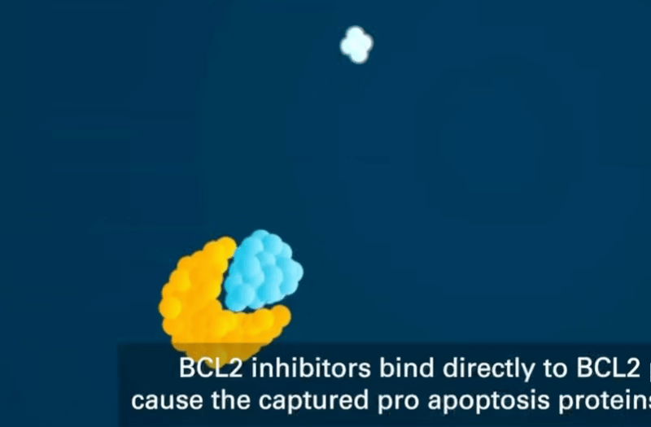

每个重仓的股票我都会写篇文章，但亚盛不算是重仓，买到现在仓位在13%左右，未来也不会再加了。或许亚盛会涨到重仓，这是我买过的远期赔率最高的标的了，先提前写点吧。

康方现在的仓位也到25%了，但由于ak112的鳞癌队列确定性比较大，基本能过，后续有时间就写，没时间就算了。

亚盛的APG-2575（利沙托克拉，Lisaftoclax）在MDS适应症上（GLOAR-4 全球Ⅲ期临床）比较不确定，这段时间打算仔细研究一下。大致会有3～5篇，年底能写完就行，内容是：BCL-2和MDS（本篇）、Lisaftoclax分子设计、从药理机制和过往临床看GLORA-4。

我写起来有点困难，可能时间会拉的很长，也是仅作学习笔记。我不是很喜欢写这种科普文章，没太大价值，这篇就当是留个痕，毕竟现在亚盛也算是低位。所有的研究完再写会很晚，万一发出的时候已经涨起来了就很无聊。

如果对亚盛感兴趣，可以看看下面这几篇，我大概率也不会比他写的更好了。

> HR-MDS
>
> 加菲如意，公众号：研究进化论[亚盛医药思考系列（1）：HR-MDS](https://mp.weixin.qq.com/s/ZazMxnrPIMrenIEDgnRbqA)

> CR、OS与GLORA4
>
> 加菲如意，公众号：研究进化论[亚盛医药思考系列（2）：HR-MDS下的CR与OS关系以及GLORA4分析](https://mp.weixin.qq.com/s/xXizjLfaJxnBkob_-L5ALg)

> AML
>
> 加菲如意，公众号：研究进化论[亚盛医药思考系列（3）：AML（急性髓系白血病）](https://mp.weixin.qq.com/s/_jQZXDzGCndyLzvk_C1pzw)


以下是本篇正文

---


=======
LastUpdate: 2026-07-20 22:27:03
---

>>>>>>> e4865371a01b1219dccc2ac1ee74ede969c3fc2e

在讲BCL-2和MDS这类内容前，我们先对血液有个大致的框架。

各种血细胞最初的来源都是**造血干细胞**，造血干细胞分化为**髓系祖细胞**和**淋巴系祖细胞**。

髓系祖细胞继续分化出红细胞、粒系（中性粒细胞）、巨噬细胞、巨核细胞（血小板是其胞质碎片），这部分主要负责**先天免疫和供氧**。淋巴系祖细胞继续分化出B细胞、T细胞、NK细胞。这部分主要负责**适应性免疫**。

正常的造血过程：造血干细胞 → 增殖 → 分化成熟 → 红细胞、白细胞、血小板

MDS是1、造血干细胞异常 → 产生不了正常成熟血细胞（无效造血）。2、异常克隆细胞逃避调控 → 在骨髓里扩张

（1）的结果：

- 红细胞生成失败 → 贫血（Hb下降）
- 中性粒细胞生成失败 → 感染（ANC下降）
- 血小板生成失败 → 出血（PLT下降）

（2）的结果是异常造血细胞克隆，挤压正常造血细胞，这也是为什么后期的MDS会向AML转化（sAML和AML不一样）


# BCL-2

先来看一下BCL-2抑制剂（BCL-2 inhibitor，BCL-2i）生效过程（流程图+动画），这个后续会解释。

```
BCL-2 抑制剂进入细胞
    ↓
高亲和力结合 BCL-2 的 BH3 沟槽
    ↓
竞争性地把 BIM 从 BCL-2:BIM 复合物中置换出来
    ↓
游离 BIM 转位至线粒体外膜，激活 BAX/BAK
    ↓
多个BAX/BAK结合成蛋白复合体（寡聚化），给线粒体打孔 → 线粒体外膜通透化MOMP（之后不可逆）
    ↓
位于线粒体内外膜之间的细胞色素c被释放，进入细胞质
 	↓
细胞色素c + Apaf-1 → 组装成凋亡小体
	↓
7个被激活的 Apaf-1 彼此组装 → 形成环状（轮状）的凋亡小体
	↓
caspase-9 → caspase-3/7 级联激活（caspase是执行凋亡的蛋白酶，能切割其他蛋白质）
    ↓
细胞凋亡执行
```


<video src="./img/bcl2acceptprogress.mp4"/>

细胞凋亡分为外源性通路和内源性通路，就是外部杀死和内部自杀，BCL-2 家族主要调控的是内源性通路。

正常细胞在检测到自己该死时，会启动内部的自杀程序。BCL-2是一种抗凋亡蛋白，它通过“锁住”促凋亡信号（BIM），让细胞逃脱内部自杀系统，一直存活。当细胞异常高表达BCL-2时，就会一直不死，不断累积，形成肿瘤。

这一机制在血液肿瘤中尤其突出。慢性淋巴细胞白血病/小淋巴细胞淋巴瘤（CLL/SLL）的肿瘤细胞通常高度依赖 BCL-2过表达，来抑制线粒体凋亡途径；急性髓系白血病（AML）和骨髓增生异常综合征（MDS）中则常同时存在 BCL-2、MCL-1、BCL-xL 等多条抗凋亡通路。多发性骨髓瘤中带有 t(11;14) 的一部分患者，也可能表现出更强的 BCL-2 依赖。


### 0. BCL-2基因

BCL-2 过表达是染色体t(14;18)易位导致的，18号染色体上的BCL2基因被易位到14号的免疫球蛋白重链基因座（IgH）附近，IgH（增长因子）是B细胞中用来驱动抗体重链的大量表达。易位后，这些IgH转而驱动BCL2基因，使其转录持续升高，因而造成BCL-2蛋白过表达。

> PS: BCL2指 DNA 上的 BCL2 基因，BCL-2指该基因编码的蛋白质名称，即BCL-2 蛋白


### 1. BCL-2家族（蛋白）

> BCL-2只是BCL-2家族的一员。

| 家族成员      | 代表蛋白                  | 功能                               |
| :------------ | :------------------------ | :--------------------------------- |
| 抗凋亡蛋白    | BCL-2、BCL-xL、MCL-1      | 扣押促凋亡蛋白，维持线粒体外膜完整 |
| 促凋亡蛋白    | BAX、BAK                  | 在线粒体外膜打孔，触发 MOMP        |
| BH3-only 蛋白 | BIM、BID、BAD、PUMA、NOXA | 感知细胞应激，释放/激活 BAX/BAK    |

BCL-2家族可分为**促凋亡蛋白**和**抗凋亡蛋白**，它们共享一个特征性的BH结构域，BH结构与是BCL-2家族蛋白中的氨基酸序列，其决定了BCL-2家族成员之间如何结合，以控制线粒体凋亡，主要有BH1、BH2、BH3、BH4。抗凋亡蛋白有BH1〰️4，促凋亡蛋白有BH1〰️3，BH3-only只有BH3。

```
完整 BCL-2 蛋白
├─ BH4：帮助维持抗凋亡作用
├─ BH3：参与构成结合沟槽
├─ BH2：参与构成结合沟槽
├─ BH1：参与构成结合沟槽
├─ ....
```


**抗凋亡 BCL-2 蛋白**表面有一个由其 BH1、BH2、BH3 等区域共同形成的BH3 结合沟槽，用来结合（“锁住”） BH3-only 蛋白的 BH3 α 螺旋。可以把 BH3-only 蛋白理解为“死亡指令的传递者”。BH3-only蛋白被锁住后，就无法向下游释放信号，细胞就无法产生内源性凋亡，肿瘤细胞就可以一直存活。

> BH3结合沟槽的命名方式是按结合的对象命名，非组成的对象命名


BCL-2抑制剂（也称BH3模拟物）做的是模拟BH3-only蛋白上的关键 α 螺旋，占据抗凋亡蛋白表面的BH3结合沟槽，竞争性的置换被BCL-2锁住的BIM，以Lisaftoclax为例：


```
lisaftoclax + BCL-2:BIM  →  lisaftoclax:BCL-2 + 游离BIM 
```




BCL-2抑制剂不仅会进入肿瘤细胞，也会进入正常表达 BCL-2 的细胞，只是因为某些肿瘤细胞对 BCL-2 的生存依赖特别强，抑制了之后，肿瘤细胞更容易凋亡。正常细胞（主要是正常B细胞、成熟中性粒细胞）也会受影响。


### 3. 置换之后

游离 BIM （动图中蓝色物质）转位至线粒体外膜，激活 BAX/BAK，当足够多的 BAX/BAK 被激活并在膜上形成孔道后，细胞色素 c 进入胞质，与 Apaf-1 形成凋亡小体，继而激活 caspase-9 和 caspase-3/7。这个过程通常具有阈值特征：越过阈值后，凋亡会进入难以逆转的执行阶段。

```
BCL-2 抑制剂进入细胞
    ↓
高亲和力结合 BCL-2 的 BH3 沟槽
    ↓
竞争性地把 BIM 从 BCL-2:BIM 复合物中置换出来
    ↓
游离 BIM 转位至线粒体外膜，激活 BAX/BAK
    ↓
多个BAX/BAK结合成蛋白复合体（寡聚化），给线粒体打孔 → 线粒体外膜通透化MOMP（之后不可逆）
    ↓
位于线粒体内外膜之间的细胞色素c被释放，进入细胞质
 	↓
细胞色素c + Apaf-1 → 组装成凋亡小体
	↓
7个被激活的 Apaf-1 彼此组装 → 形成环状（轮状）的凋亡小体
	↓
caspase-9 → caspase-3/7 级联激活（caspase是执行凋亡的蛋白酶，能切割其他蛋白质）
    ↓
细胞凋亡执行
```

真正的临界事件叫作线粒体外膜通透化（MOMP），在这之前，仍有变数。比如：

1、游离的BIM仍有可能被MCL-1、BCL-xL扣押

2、BAX 或 BAK 基因缺失、失活突变或表达很低

这个阈值特性，解释了为什么 BCL-2 抑制剂的效应与峰浓度（Cmax）密切相关：药物需要在短时间内释放足够量的 BIM，激活足够多的 BAX/BAK，才能跨越凋亡阈值。


### 4. 耐药和联用

CLL/SLL对BCL-2抑制线粒体凋亡通路这一路径高度依赖，而AML、MDS可借助MCL-1和BCL-xL，继续拦截游离的BIM，单药敏感性通常较低，联用多通路抑制更能深度缓解。故几个适应症理论上BCL-2i的药效是CLL/SLL > AML > MDS。


**耐药**

BCL-2抑制剂也并非永久有效，也可能遇到**结合点位突变**（G101V）、**MCL-1/BCL-xL代偿**、**TP53 异常**，以及更复杂的**基因组改变**都有可能导致BCL-2耐药。

**BCL-2 突变**：如 **G101V、F104L** 等 gatekeeper 突变，改变 BH3 沟槽结构，降低药物结合亲和力

**MCL-1 上调**：BCL-2 被抑制后，细胞可通过上调 MCL-1 代偿性维持存活。AML 尤其容易通过这条通路逃逸。

**TP53 缺失/突变**：p53 是 BAX 的转录激活因子，TP53 异常会削弱凋亡下游执行


**联用**

1、BTKi + BCL-2i

在 CLL/SLL 中，BTK 抑制剂和 BCL-2 抑制剂是两条互补的路线。BTKi切断 B 细胞受体（BCR）信号，阻止细胞接收“活下去”的外部指令，BCL-2 i解除细胞内部的“不死机制”，直接触发凋亡。

两者联合，相当于“断粮 + 按死刑按钮”，实现更深的缓解、更短的固定疗程，并可能达到微小残留病灶（MRD）阴性。

目前临床上的主要联合方案包括：Venetoclax + 伊布替尼/阿可替尼、Lisaftoclax + 阿可替尼（GLORA 系列）、Sonrotoclax + 泽布替尼（CELESTIAL 系列）。

在髓系肿瘤中，BCL-2i常与去甲基化药物（阿扎胞苷AZA）联合，前者促凋亡，后者恢复分化能力。


2、BCL-2 + MDM2–p53 等

多凋亡靶点联用会放大毒性，可能出现毒性盖过生存获益的情况，目前相关临床大多都在早期，所以像BCL-2抑制剂的设计思路，从最开始的追求疗效，到联用时代的追求安全。

这也是亚盛凋亡靶点联用最大的场景（ps：亚盛拥有全球唯一覆盖Bcl-2、IAP、MDM2-p53三条细胞凋亡通路的临床产品管线），不过我的投资可能等不到这一天了。


# MDS

> '分化障碍 & 异常克隆扩增'（同一个异常造血干细胞克隆造成的两类表现）

骨髓增生异常综合征，英文简称MDS。MDS是造血干细胞发生了克隆异常，进而导致的髓系祖细胞**异常克隆扩增**和**分化障碍**。突变细胞不断克隆扩增，占据了骨髓，却造不出合格的血细胞。主要的症状表现有贫血、淤血、免疫降低反复感染发热。

正常骨髓中，造血干细胞会分化成红细胞会增值分化成红细胞、白细胞（主要是中性粒细胞）和巨核细胞（血小板是其胞质碎片）。

其中红细胞负责运输氧气，缺少会造成贫血、乏力、面色苍白、心悸、气短。中性粒细胞负责人体免疫，缺少会造成易感染。血小板负责止血，缺少会造成易出血。

<svg viewBox="0 0 680 380" width="100%" role="img">
    <rect width="100%" height="100%" fill="#f2f2f2" />
    <title>血细胞家族与骨髓起源关系图</title>
    <desc>展示骨髓造血干细胞分化为红细胞、白细胞(含中性粒细胞)和血小板的过程，以及对应的临床检测指标</desc>
    <defs>
        <marker id="arrow" viewBox="0 0 10 10" refX="8" refY="5" markerWidth="6" markerHeight="6"
            orient="auto-start-reverse">
            <path d="M2 1L8 5L2 9" fill="none" stroke="context-stroke" stroke-width="1.5" stroke-linecap="round"
                stroke-linejoin="round" />
        </marker>
    </defs> <text x="340" y="26" text-anchor="middle" font-size="14" font-weight="500"
        fill="#2C2C2A">血液细胞的起源与对应检测指标</text>
    <g>
        <rect x="230" y="44" width="220" height="52" rx="8" fill="#EEEDFE" stroke="#534AB7" stroke-width="0.5" /> <text
            x="340" y="66" text-anchor="middle" font-size="13" font-weight="500" fill="#3C3489">骨髓造血干细胞</text> <text
            x="340" y="84" text-anchor="middle" font-size="11" fill="#7F77DD">所有血细胞的"种子"——骨髓中</text>
    </g>
    <line x1="280" y1="96" x2="140" y2="130" stroke="#5F5E5A" stroke-width="0.5" marker-end="url(#arrow)" />
    <line x1="340" y1="96" x2="340" y2="130" stroke="#5F5E5A" stroke-width="0.5" marker-end="url(#arrow)" />
    <line x1="400" y1="96" x2="540" y2="130" stroke="#5F5E5A" stroke-width="0.5" marker-end="url(#arrow)" />
    <g>
        <rect x="40" y="130" width="200" height="68" rx="8" fill="#FCEBEB" stroke="#A32D2D" stroke-width="0.5" /> <text
            x="140" y="152" text-anchor="middle" font-size="13" font-weight="500" fill="#791F1F">红细胞系</text> <text
            x="140" y="170" text-anchor="middle" font-size="11" fill="#E24B4A">红细胞 (RBC)</text> <text x="140" y="186"
            text-anchor="middle" font-size="10" fill="#E24B4A">携氧、运输CO₂</text>
    </g>
    <g>
        <rect x="240" y="130" width="200" height="68" rx="8" fill="#E6F1FB" stroke="#185FA5" stroke-width="0.5" /> <text
            x="340" y="152" text-anchor="middle" font-size="13" font-weight="500" fill="#0C447C">白细胞系</text> <text
            x="340" y="170" text-anchor="middle" font-size="11" fill="#378ADD">白细胞 (WBC)</text> <text x="340" y="186"
            text-anchor="middle" font-size="10" fill="#378ADD">免疫防御、抗感染</text>
    </g>
    <g>
        <rect x="440" y="130" width="200" height="68" rx="8" fill="#FAEEDA" stroke="#854F0B" stroke-width="0.5" /> <text
            x="540" y="152" text-anchor="middle" font-size="13" font-weight="500" fill="#633806">巨核细胞系</text> <text
            x="540" y="170" text-anchor="middle" font-size="11" fill="#EF9F27">血小板 (PLT)</text> <text x="540" y="186"
            text-anchor="middle" font-size="10" fill="#EF9F27">止血、凝血</text>
    </g>
    <line x1="340" y1="198" x2="340" y2="218" stroke="#5F5E5A" stroke-width="0.5" marker-end="url(#arrow)" />
    <g>
        <rect x="250" y="218" width="180" height="44" rx="8" fill="#B5D4F4" stroke="#185FA5" stroke-width="0.5" /> <text
            x="340" y="238" text-anchor="middle" font-size="12" font-weight="500" fill="#0C447C">中性粒细胞</text> <text
            x="340" y="254" text-anchor="middle" font-size="10" fill="#378ADD">白细胞中数量最多的一种</text>
    </g>
    <line x1="280" y1="240" x2="250" y2="240" stroke="#5F5E5A" stroke-width="0.5" marker-end="url(#arrow)"
        stroke-dasharray="3,2" /> <text x="340" y="288" text-anchor="middle" font-size="13" font-weight="500"
        fill="#2C2C2A">对应的临床检测指标</text>
    <line x1="140" y1="198" x2="140" y2="300" stroke="#5F5E5A" stroke-width="0.5" stroke-dasharray="3,2" />
    <line x1="340" y1="262" x2="340" y2="300" stroke="#5F5E5A" stroke-width="0.5" stroke-dasharray="3,2" />
    <line x1="540" y1="198" x2="540" y2="300" stroke="#5F5E5A" stroke-width="0.5" stroke-dasharray="3,2" />
    <g>
        <rect x="40" y="300" width="200" height="58" rx="8" fill="#FBEAF0" stroke="#993556" stroke-width="0.5" /> <text
            x="140" y="322" text-anchor="middle" font-size="12" font-weight="500" fill="#72243E">血红蛋白 Hb</text> <text
            x="140" y="340" text-anchor="middle" font-size="11" fill="#D4537E">红细胞携氧能力的核心指标</text> <text x="140" y="354"
            text-anchor="middle" font-size="10" fill="#D4537E">↓ = 贫血、缺氧</text>
    </g>
    <g>
        <rect x="240" y="300" width="200" height="58" rx="8" fill="#E1F5EE" stroke="#0F6E56" stroke-width="0.5" /> <text
            x="340" y="322" text-anchor="middle" font-size="12" font-weight="500" fill="#085041">中性粒细胞计数 ANC</text>
        <text x="340" y="340" text-anchor="middle" font-size="11" fill="#1D9E75">抗感染能力的核心指标</text> <text x="340" y="354"
            text-anchor="middle" font-size="10" fill="#1D9E75">↓ = 易感染、发热风险</text>
    </g>
    <g>
        <rect x="440" y="300" width="200" height="58" rx="8" fill="#FAEEDA" stroke="#854F0B" stroke-width="0.5" /> <text
            x="540" y="322" text-anchor="middle" font-size="12" font-weight="500" fill="#633806">血小板计数 PLT</text> <text
            x="540" y="340" text-anchor="middle" font-size="11" fill="#EF9F27">止血凝血能力的核心指标</text> <text x="540" y="354"
            text-anchor="middle" font-size="10" fill="#EF9F27">↓ = 出血风险</text>
    </g>
</svg>

检测血液中这三类细胞数量的指标分别是：血红蛋白 Hb（Hb >= 110，运氧能力正常）、绝对中性粒细胞计数ANC（ANC ≥ 1.0，感染抵抗力基本正常）、血小板计数PLT（PLT ≥ 100，止血功能基本正常）

<svg viewBox="0 0 680 576" width="100%" role="img">
    <rect width="100%" height="100%" fill="#f2f2f2" />
    <title>MDS一个克隆两张面孔悖论与疾病谱演变图</title>
    <desc>展示MDS不是两条独立通路而是同一克隆在干细胞层面扩增、前体层面凋亡的悖论，以及疾病谱中凋亡向增殖的演变</desc>
    <defs>
        <marker id="arrow" viewBox="0 0 10 10" refX="8" refY="5" markerWidth="6" markerHeight="6"
            orient="auto-start-reverse">
            <path d="M2 1L8 5L2 9" fill="none" stroke="context-stroke" stroke-width="1.5" stroke-linecap="round"
                stroke-linejoin="round" />
        </marker>
    </defs>
    <text x="340" y="28" text-anchor="middle" font-size="14" font-weight="500" fill="#2C2C2A">MDS的核心悖论：一个克隆，两张面孔</text>
    <rect x="230" y="48" width="220" height="56" rx="10" fill="#EEEDFE" stroke="#534AB7" stroke-width="0.5" />
    <text x="340" y="68" text-anchor="middle" dominant-baseline="central" font-size="13" font-weight="500"
        fill="#3C3489">MDS突变克隆（同一个细胞）</text>
    <text x="340" y="88" text-anchor="middle" dominant-baseline="central" font-size="11" fill="#534AB7">携带 TET2 / DNMT3A
        / SF3B1 等驱动突变</text>
    <path d="M 280 104 Q 235 128 180 150" fill="none" stroke="#185FA5" stroke-width="1.5" marker-end="url(#arrow)" />
    <rect x="50" y="140" width="245" height="86" rx="8" fill="#E6F1FB" stroke="#185FA5" stroke-width="0.5" />
    <text x="172" y="160" text-anchor="middle" dominant-baseline="central" font-size="13" font-weight="500"
        fill="#0C447C">干细胞层面 · 获得功能</text>
    <text x="172" y="178" text-anchor="middle" dominant-baseline="central" font-size="11" fill="#185FA5">自我更新增强 →
        克隆扩增</text>
    <text x="172" y="194" text-anchor="middle" dominant-baseline="central" font-size="11" fill="#185FA5">→ 排挤正常HSC →
        骨髓高增生</text>
    <text x="172" y="214" text-anchor="middle" dominant-baseline="central" font-size="12" font-weight="500"
        fill="#0C447C">"骨髓是满的"</text>
    <path d="M 400 104 Q 445 128 500 150" fill="none" stroke="#993C1D" stroke-width="1.5" marker-end="url(#arrow)" />
    <rect x="385" y="140" width="245" height="86" rx="8" fill="#FAECE7" stroke="#993C1D" stroke-width="0.5" />
    <text x="507" y="160" text-anchor="middle" dominant-baseline="central" font-size="13" font-weight="500"
        fill="#712B13">前体细胞层面 · 丧失功能</text>
    <text x="507" y="178" text-anchor="middle" dominant-baseline="central" font-size="11" fill="#993C1D">分化阻滞 →
        线粒体/炎症/核糖体缺陷</text>
    <text x="507" y="194" text-anchor="middle" dominant-baseline="central" font-size="11" fill="#993C1D">→ 前体细胞过度凋亡 →
        无效造血</text>
    <text x="507" y="214" text-anchor="middle" dominant-baseline="central" font-size="12" font-weight="500"
        fill="#712B13">"外周血是空的"</text>
    <rect x="120" y="248" width="440" height="40" rx="8" fill="#F1EFE8" stroke="#888780" stroke-width="0.5" />
    <text x="340" y="264" text-anchor="middle" dominant-baseline="central" font-size="12"
        fill="#444441">悖论：同一克隆同时"扩增"和"凋亡" → 骨髓满但血象空</text>
    <text x="340" y="278" text-anchor="middle" dominant-baseline="central" font-size="11" fill="#5F5E5A">stem cell:
        gain-of-function = precursor: loss-of-function</text>
    <rect x="40" y="305" width="600" height="68" rx="8" fill="#E1F5EE" stroke="#0F6E56" stroke-width="0.5" />
    <text x="340" y="323" text-anchor="middle" dominant-baseline="central" font-size="12" font-weight="500"
        fill="#085041">关键修正：这不是"两条独立通路"</text>
    <text x="340" y="340" text-anchor="middle" dominant-baseline="central" font-size="11"
        fill="#0F6E56">是同一个克隆在干细胞层面"赢了"（扩增）、在前体层面"输了"（凋亡）——两面同源</text>
    <text x="340" y="356" text-anchor="middle" dominant-baseline="central" font-size="11" fill="#0F6E56">"通路A vs
        通路B"是药理学评价工具，帮助理解为何HI和mCR可独立实现，但不是生物学现实</text>
    <line x1="40" y1="392" x2="640" y2="392" stroke="#B4B2A9" stroke-width="0.5" stroke-dasharray="4 3" />
    <text x="340" y="414" text-anchor="middle" font-size="13" font-weight="500" fill="#2C2C2A">疾病谱演变：凋亡与增殖的平衡偏移</text>
    <rect x="48" y="432" width="135" height="36" rx="4" fill="#E6F1FB" stroke="#85B7EB" stroke-width="0.5" />
    <text x="115" y="450" text-anchor="middle" dominant-baseline="central" font-size="12" fill="#0C447C">CHIP</text>
    <rect x="191" y="432" width="135" height="36" rx="4" fill="#EEEDFE" stroke="#AFA9EC" stroke-width="0.5" />
    <text x="258" y="450" text-anchor="middle" dominant-baseline="central" font-size="12" fill="#3C3489">低危MDS</text>
    <rect x="334" y="432" width="135" height="36" rx="4" fill="#FAECE7" stroke="#F0997B" stroke-width="0.5" />
    <text x="401" y="450" text-anchor="middle" dominant-baseline="central" font-size="12" fill="#712B13">高危MDS</text>
    <rect x="477" y="432" width="135" height="36" rx="4" fill="#FCEBEB" stroke="#E24B4A" stroke-width="0.5" />
    <text x="544" y="450" text-anchor="middle" dominant-baseline="central" font-size="12" fill="#501313">sAML</text>
    <text x="48" y="486" text-anchor="start" font-size="11" font-weight="500" fill="#185FA5">凋亡主导</text>
    <rect x="48" y="492" width="135" height="9" rx="2" fill="#378ADD" opacity="0.85" />
    <rect x="191" y="492" width="135" height="7" rx="2" fill="#7F77DD" opacity="0.55" />
    <rect x="334" y="492" width="135" height="4" rx="2" fill="#D85A30" opacity="0.3" />
    <rect x="477" y="492" width="135" height="2" rx="2" fill="#E24B4A" opacity="0.15" />
    <rect x="48" y="508" width="135" height="2" rx="2" fill="#378ADD" opacity="0.15" />
    <rect x="191" y="508" width="135" height="4" rx="2" fill="#7F77DD" opacity="0.3" />
    <rect x="334" y="508" width="135" height="7" rx="2" fill="#D85A30" opacity="0.55" />
    <rect x="477" y="508" width="135" height="9" rx="2" fill="#E24B4A" opacity="0.85" />
    <text x="48" y="530" text-anchor="start" font-size="11" font-weight="500" fill="#993C1D">增殖主导</text>
    <text x="340" y="558" text-anchor="middle" font-size="11" fill="#5F5E5A">MDS→AML转化的本质：凋亡主导 →
        增殖主导——不是"两条路"，是同一条路的此消彼长</text>
</svg>


| 维度         | 通路 A（无效造血）       | 通路 B（克隆增殖）       |
| :----------- | :----------------------- | :----------------------- |
| 核心病理     | 前体细胞凋亡/分化阻滞    | 原始细胞不受控增殖       |
| 分子驱动     | TGF-β/炎症/核糖体缺陷    | TP53/FLT3/表观遗传突变   |
| 临床表现     | 贫血/感染/出血           | 原始细胞比例↑ → AML 转化 |
| 检测指标     | Hb/ANC/PLT（外周血）     | 骨髓原始细胞 %           |
| 对应疗效终点 | **HI**                   | **mCR**                  |
| 致死路径     | 感染/出血/输血依赖并发症 | 白血病转化               |
| 药物靶点     | GDF11/IL-1β/端粒酶/TNF   | DNA甲基化/BCL-2/FLT3     |


| 修复通路 A（HI） | 修复通路 B（mCR）           |                                           |
| :--------------- | :-------------------------- | ----------------------------------------- |
| **直接后果**     | 血象恢复：Hb↑/ANC↑/PLT↑     | 原始细胞 < 5%                             |
| **感染风险**     | ↓ ANC 恢复 → 抗感染能力恢复 | 不变（如果 ANC 没恢复）                   |
| **出血风险**     | ↓ PLT 恢复 → 止血功能恢复   | 不变（如果 PLT 没恢复）                   |
| **输血依赖**     | ↓ 脱离输血 → 铁过载改善     | 不变（如果 Hb 没恢复）                    |
| **死亡驱动**     | ↓ 直接降低致死性并发症      | 间接（推迟 AML 转化，但不改善当前并发症） |


<svg viewBox="0 0 680 520" width="100%" role="img">
    <rect width="100%" height="100%" fill="#f2f2f2" />
    <title>骨髓原始细胞比例的临床意义与5%阈值由来</title>
    <desc>解释正常骨髓原始细胞范围、5%阈值的来源、不同比例对应的临床诊断</desc>
    <defs>
        <marker id="arrow4" viewBox="0 0 10 10" refX="8" refY="5" markerWidth="6" markerHeight="6"
            orient="auto-start-reverse">
            <path d="M2 1L8 5L2 9" fill="none" stroke="context-stroke" stroke-width="1.5" stroke-linecap="round"
                stroke-linejoin="round" />
        </marker>
    </defs> <text x="340" y="26" text-anchor="middle" font-size="14" font-weight="500"
        fill="#2C2C2A">骨髓原始细胞比例：从正常到白血病</text> <text x="340" y="44" text-anchor="middle" font-size="12"
        fill="#888780">同一条轴上，不同比例对应不同临床判断</text>
    <line x1="80" y1="100" x2="600" y2="100" stroke="#B4B2A9" stroke-width="2" />
    <line x1="80" y1="90" x2="80" y2="110" stroke="#B4B2A9" stroke-width="2" />
    <line x1="600" y1="90" x2="600" y2="110" stroke="#B4B2A9" stroke-width="2" />
    <rect x="80" y="80" width="170" height="40" rx="4" fill="#E1F5EE" stroke="#0F6E56" stroke-width="0.5" /> <text
        x="165" y="98" text-anchor="middle" font-size="12" font-weight="500" fill="#085041">正常范围</text> <text x="165"
        y="113" text-anchor="middle" font-size="11" fill="#1D9E75">0% – 5%</text>
    <rect x="250" y="80" width="90" height="40" rx="4" fill="#FAEEDA" stroke="#854F0B" stroke-width="0.5" /> <text
        x="295" y="98" text-anchor="middle" font-size="12" font-weight="500" fill="#633806">MDS</text> <text x="295"
        y="113" text-anchor="middle" font-size="11" fill="#EF9F27">5% – 19%</text>
    <rect x="340" y="80" width="260" height="40" rx="4" fill="#FCEBEB" stroke="#A32D2D" stroke-width="0.5" /> <text
        x="470" y="98" text-anchor="middle" font-size="12" font-weight="500" fill="#791F1F">AML（急性髓系白血病）</text> <text
        x="470" y="113" text-anchor="middle" font-size="11" fill="#E24B4A">≥ 20%</text>
    <line x1="250" y1="76" x2="250" y2="130" stroke="#5F5E5A" stroke-width="0.5" stroke-dasharray="3,2" />
    <line x1="340" y1="76" x2="340" y2="130" stroke="#5F5E5A" stroke-width="0.5" stroke-dasharray="3,2" /> <text x="250"
        y="142" text-anchor="middle" font-size="10" fill="#5F5E5A">5% 分界</text> <text x="340" y="142"
        text-anchor="middle" font-size="10" fill="#5F5E5A">20% 分界</text> <text x="340" y="166" text-anchor="middle"
        font-size="13" font-weight="500" fill="#2C2C2A">5% 这个数字怎么来的？</text>
    <g>
        <rect x="40" y="178" width="300" height="80" rx="8" fill="#E6F1FB" stroke="#185FA5" stroke-width="0.5" /><text
            x="56" y="200" font-size="12" font-weight="500" fill="#0C447C">正常骨髓的生理基线</text><text x="56" y="218"
            font-size="11" fill="#378ADD">造血干细胞持续分裂分化</text><text x="56" y="234" font-size="11"
            fill="#378ADD">正常时幼稚细胞占比极低</text><text x="56" y="250" font-size="11" fill="#378ADD">大样本统计：正常人 bl 多在
            1%–3%</text><text x="56" y="252" font-size="11" fill="#378ADD"> </text>
    </g>
    <g>
        <rect x="350" y="178" width="290" height="80" rx="8" fill="#FAEEDA" stroke="#854F0B" stroke-width="0.5" /><text
            x="366" y="200" font-size="12" font-weight="500" fill="#633806">流行病学拐点</text><text x="366" y="218"
            font-size="11" fill="#EF9F27">bl &gt; 5% 后，恶变风险陡升</text><text x="366" y="234" font-size="11"
            fill="#EF9F27">向白血病转化的概率显著增加</text><text x="366" y="250" font-size="11" fill="#EF9F27">5% 是统计学上的最佳分界点</text>
    </g> <text x="340" y="280" text-anchor="middle" font-size="13" font-weight="500" fill="#2C2C2A">是越小越好吗？</text>
    <g>
        <rect x="40" y="292" width="290" height="100" rx="8" fill="#E1F5EE" stroke="#0F6E56" stroke-width="0.5" /><text
            x="56" y="314" font-size="12" font-weight="500" fill="#085041">是的，越低越好</text><text x="56" y="332"
            font-size="11" fill="#1D9E75">0% 当然最好 = 完全没有异常幼稚细胞</text><text x="56" y="348" font-size="11"
            fill="#1D9E75">残留越少 → 复发风险越低</text><text x="56" y="364" font-size="11"
            fill="#1D9E75">MRD（微小残留病）阴性预后更好</text><text x="56" y="380" font-size="11" fill="#1D9E75">长期生存率越高</text>
    </g>
    <g>
        <rect x="350" y="292" width="290" height="100" rx="8" fill="#FBEAF0" stroke="#993556" stroke-width="0.5" /><text
            x="366" y="314" font-size="12" font-weight="500" fill="#72243E">但有重要细节</text><text x="366" y="332"
            font-size="11" fill="#D4537E">正常骨髓也不会是 0%</text><text x="366" y="348" font-size="11"
            fill="#D4537E">造血需要少量原始细胞维持再生</text><text x="366" y="364" font-size="11" fill="#D4537E">完全为 0
            反而说明骨髓衰竭</text><text x="366" y="380" font-size="11" fill="#D4537E">→ 再生障碍性贫血等</text>
    </g>
    <g>
        <rect x="40" y="404" width="600" height="104" rx="8" fill="#F1EFE8" stroke="#B4B2A9" stroke-width="0.5" /><text
            x="60" y="426" font-size="12" font-weight="500" fill="#2C2C2A">疗效标准中的 &lt; 5% 含义</text><text x="60" y="446"
            font-size="11" fill="#444441">mCR 要求 bl &lt; 5%，不是追求 0%，而是"回到正常范围"</text><text x="60" y="462" font-size="11"
            fill="#444441">= 把白血病从"异常增殖"拉回到"正常生理水平"</text><text x="60" y="478" font-size="11" fill="#444441">=
            骨髓恢复到健康人应有的造血秩序</text><text x="60" y="494" font-size="11" fill="#888780">更深层次：即使 bl &lt; 5%，若存在高危基因突变(如
            FLT3-ITD)，仍不算真正安全</text>
    </g>
</svg>

MDS的患病并非是一成不变的，早期分化障碍为主，后期异常克隆扩增为主。正常人体的骨髓原始细胞（Blasts）小于5%，MDS后期肿瘤细胞恶性扩增超过20%，疾病就会进展为sAML（继发性AML），也有写做AML的，但MDS进展成的AML和原发性AML治疗难度完全不同，前者生物学更耐药、缓解率更低、复发更快、预后更差。

分化障碍造成的贫血、免疫低、出血及并发症，往往是患者的主要死因，比如免疫力下降导致肺炎。


<<<<<<< HEAD
## 疗效评估

<svg viewBox="0 0 680 420" width="100%" role="img">
    <rect width="100%" height="100%" fill="#f2f2f2"/>
    <title>临床疗效评估两大维度</title>
    <desc>展示骨髓维度(原始细胞)和外周血维度(三大指标)如何组合形成疗效评价标准</desc>
    <defs>
        <marker id="arrow2" viewBox="0 0 10 10" refX="8" refY="5" markerWidth="6" markerHeight="6"
            orient="auto-start-reverse">
            <path d="M2 1L8 5L2 9" fill="none" stroke="context-stroke" stroke-width="1.5" stroke-linecap="round"
                stroke-linejoin="round" />
        </marker>
    </defs> <text x="340" y="26" text-anchor="middle" font-size="14" font-weight="500" fill="#2C2C2A">疗效评估 = 骨髓维度 +
        外周血维度</text> <text x="340" y="44" text-anchor="middle" font-size="12" fill="#888780">两个维度独立评估，组合后形成不同缓解等级</text>
    <line x1="340" y1="56" x2="340" y2="76" stroke="#5F5E5A" stroke-width="0.5" />
    <line x1="140" y1="76" x2="540" y2="76" stroke="#5F5E5A" stroke-width="0.5" />
    <line x1="140" y1="76" x2="140" y2="96" stroke="#5F5E5A" stroke-width="0.5" marker-end="url(#arrow2)" />
    <line x1="540" y1="76" x2="540" y2="96" stroke="#5F5E5A" stroke-width="0.5" marker-end="url(#arrow2)" />
    <g>
        <rect x="40" y="96" width="280" height="100" rx="8" fill="#EEEDFE" stroke="#534AB7" stroke-width="0.5" />
        <text x="180" y="120" text-anchor="middle" font-size="13" font-weight="500" fill="#3C3489">维度一：骨髓</text>
        <text x="180" y="140" text-anchor="middle" font-size="12" fill="#534AB7">核心指标：骨髓原始细胞比例</text> <text x="180"
            y="158" text-anchor="middle" font-size="11" fill="#7F77DD">需做骨髓穿刺(骨穿)</text> <text x="180" y="176"
            text-anchor="middle" font-size="11" fill="#7F77DD">评估"白血病负荷是否下降"</text> <text x="180" y="190"
            text-anchor="middle" font-size="10" fill="#AFA9EC">blasts &lt; 5% = 骨髓完全缓解(mCR)</text>
    </g>
    <g>
        <rect x="360" y="96" width="280" height="100" rx="8" fill="#E6F1FB" stroke="#185FA5" stroke-width="0.5" />
        <text x="500" y="120" text-anchor="middle" font-size="13" font-weight="500" fill="#0C447C">维度二：外周血</text>
        <text x="500" y="140" text-anchor="middle" font-size="12" fill="#185FA5">核心指标：ANC + PLT (+ Hb)</text> <text
            x="500" y="158" text-anchor="middle" font-size="11" fill="#378ADD">抽血化验即可(血常规)</text> <text x="500" y="176"
            text-anchor="middle" font-size="11" fill="#378ADD">评估"造血功能是否恢复"</text> <text x="500" y="190"
            text-anchor="middle" font-size="10" fill="#85B7EB">改善幅度达阈值 = 血液学改善(HI)</text>
    </g> <text x="340" y="222" text-anchor="middle" font-size="13" font-weight="500" fill="#2C2C2A">两维度组合 →
        疗效等级</text>
    <line x1="180" y1="196" x2="180" y2="232" stroke="#5F5E5A" stroke-width="0.5" stroke-dasharray="3,2" />
    <line x1="500" y1="196" x2="500" y2="232" stroke="#5F5E5A" stroke-width="0.5" stroke-dasharray="3,2" />
    <g>
        <rect x="40" y="232" width="150" height="52" rx="8" fill="#E1F5EE" stroke="#0F6E56" stroke-width="0.5" />
        <text x="115" y="252" text-anchor="middle" font-size="12" font-weight="500" fill="#085041">CR</text> <text
            x="115" y="268" text-anchor="middle" font-size="10" fill="#5DCAA5">骨髓✓ + 血象完全✓</text> <text x="115" y="280"
            text-anchor="middle" font-size="10" fill="#5DCAA5">ANC≥1.0, PLT≥100</text>
    </g>
    <g>
        <rect x="200" y="232" width="150" height="52" rx="8" fill="#EAF3DE" stroke="#3B6D11" stroke-width="0.5" />
        <text x="275" y="252" text-anchor="middle" font-size="12" font-weight="500" fill="#27500A">CRh</text> <text
            x="275" y="268" text-anchor="middle" font-size="10" fill="#97C459">骨髓✓ + 血象部分✓</text> <text x="275" y="280"
            text-anchor="middle" font-size="10" fill="#97C459">ANC≥0.5, PLT≥50</text>
    </g>
    <g>
        <rect x="360" y="232" width="150" height="52" rx="8" fill="#FAEEDA" stroke="#854F0B" stroke-width="0.5" />
        <text x="435" y="252" text-anchor="middle" font-size="12" font-weight="500" fill="#633806">CRi</text> <text
            x="435" y="268" text-anchor="middle" font-size="10" fill="#EF9F27">骨髓✓ + 血象未恢复</text> <text x="435" y="280"
            text-anchor="middle" font-size="10" fill="#EF9F27">ANC&lt;1.0 或 PLT&lt;100</text>
    </g>
    <g>
        <rect x="520" y="232" width="120" height="52" rx="8" fill="#FCEBEB" stroke="#A32D2D" stroke-width="0.5" />
        <text x="580" y="252" text-anchor="middle" font-size="12" font-weight="500" fill="#791F1F">mCR</text> <text
            x="580" y="268" text-anchor="middle" font-size="10" fill="#E24B4A">骨髓✓</text> <text x="580" y="280"
            text-anchor="middle" font-size="10" fill="#E24B4A">不评估血象</text>
    </g>
    <g>
        <rect x="40" y="306" width="600" height="100" rx="8" fill="#F1EFE8" stroke="#B4B2A9" stroke-width="0.5" />
        <text x="60" y="328" font-size="12" font-weight="500" fill="#2C2C2A">术语对应关系</text> <text x="60" y="348"
            font-size="11" fill="#444441">血象 / 外周血计数 / 外周血血细胞 = 同一概念</text> <text x="60" y="364" font-size="11"
            fill="#888780"> → 指血液中红细胞、白细胞、血小板的数量和状态（血常规即可获得）</text> <text x="60" y="384" font-size="11"
            fill="#444441">血液学改善 (HI) = 外周血指标的好转</text> <text x="60" y="400" font-size="11" fill="#888780"> →
            分红系(Hb↑)、粒系(ANC↑)、巨核系(PLT↑)三类，有各自改善阈值</text>
    </g>
</svg>


MDS=异常造血干细胞的增殖+分化障碍，用药和检测病情也从这两方面入手。

## 缓解层级
=======
MDS=异常造血干细胞的增殖+分化障碍，用药和检测病情也从这两方面入手。


## 检测和临床指标预测OS
>>>>>>> e4865371a01b1219dccc2ac1ee74ede969c3fc2e

先说检测两个检测维度，一个是看原始骨髓比例是否缩小到5%以下（Blasts<5%），一个是看血象，即红细胞、白细胞和血小板的数量和状态（Hb↑、ANC↑、PLT↑），即血液改善（Hematologic Improvement，HI）的状态。临床常见组合：

- CR：骨髓✓ + 血液完全改善（HI）✓ （ANC≥1.0, PLT≥100）
- CRh：骨髓✓ + 血液部分改善（ANC≥0.5, PLT≥50）
- CRi：骨髓✓ + 血液状态未恢复（ANC < 1.0 或 PLT < 100）
- mCR：骨髓✓ + 不评估血液是否改善


## 预测指标

一份来自Komrokji et al. 2021 — MDS Clinical Research Consortium 验证研究（n=597 + 验证队列 n=539）给出了各指标与OS之间的相关性。

<svg viewBox="0 0 680 460" width="100%" role="img">
    <rect width="100%" height="100%" fill="#f2f2f2" />
    <title>MDS各疗效终点与中位OS的关系</title>
    <desc>基于Komrokji 2021 MDS Clinical Research Consortium数据，展示CR、mCR with HI、HI、mCR without HI、SD、PD对应的中位OS</desc>
    <defs>
        <marker id="arrow5" viewBox="0 0 10 10" refX="8" refY="5" markerWidth="6" markerHeight="6"
            orient="auto-start-reverse">
            <path d="M2 1L8 5L2 9" fill="none" stroke="context-stroke" stroke-width="1.5" stroke-linecap="round"
                stroke-linejoin="round" />
        </marker>
    </defs> <text x="340" y="24" text-anchor="middle" font-size="14" font-weight="500" fill="#2C2C2A">MDS 各疗效终点与中位 OS
        的关系</text> <text x="340" y="42" text-anchor="middle" font-size="11" fill="#888780">数据来源：Komrokji et al. 2021,
        MDS Clinical Research Consortium, n=597 高危 MDS</text> <text x="50" y="72" font-size="11" fill="#888780">中位
        OS（月）</text> <text x="630" y="72" text-anchor="end" font-size="11" fill="#888780">数值越大 = 生存越长</text>
    <line x1="160" y1="80" x2="160" y2="420" stroke="#D3D1C7" stroke-width="0.5" /> <text x="160" y="432"
        text-anchor="middle" font-size="10" fill="#888780">0</text>
    <line x1="240" y1="80" x2="240" y2="420" stroke="#D3D1C7" stroke-width="0.5" /> <text x="240" y="432"
        text-anchor="middle" font-size="10" fill="#888780">5</text>
    <line x1="320" y1="80" x2="320" y2="420" stroke="#D3D1C7" stroke-width="0.5" /> <text x="320" y="432"
        text-anchor="middle" font-size="10" fill="#888780">10</text>
    <line x1="400" y1="80" x2="400" y2="420" stroke="#D3D1C7" stroke-width="0.5" /> <text x="400" y="432"
        text-anchor="middle" font-size="10" fill="#888780">15</text>
    <line x1="480" y1="80" x2="480" y2="420" stroke="#D3D1C7" stroke-width="0.5" /> <text x="480" y="432"
        text-anchor="middle" font-size="10" fill="#888780">20</text>
    <line x1="560" y1="80" x2="560" y2="420" stroke="#D3D1C7" stroke-width="0.5" /> <text x="560" y="432"
        text-anchor="middle" font-size="10" fill="#888780">25</text>
    <g>
        <rect x="160" y="96" width="368" height="32" rx="4" fill="#E1F5EE" stroke="#0F6E56" stroke-width="0.5" /> <text
            x="170" y="117" font-size="12" font-weight="500" fill="#085041">CR 完全缓解</text> <text x="540" y="117"
            text-anchor="end" font-size="12" font-weight="500" fill="#085041">23.3 月</text>
    </g>
    <g>
        <rect x="160" y="136" width="336" height="32" rx="4" fill="#EAF3DE" stroke="#3B6D11" stroke-width="0.5" /> <text
            x="170" y="157" font-size="12" font-weight="500" fill="#27500A">CRh（伴部分血液学恢复）</text> <text x="508" y="157"
            text-anchor="end" font-size="12" font-weight="500" fill="#27500A">21.0 月</text>
    </g>
    <g>
        <rect x="160" y="176" width="272" height="32" rx="4" fill="#FAEEDA" stroke="#854F0B" stroke-width="0.5" /> <text
            x="170" y="197" font-size="12" font-weight="500" fill="#633806">HI 血液学改善</text> <text x="444" y="197"
            text-anchor="end" font-size="12" font-weight="500" fill="#633806">17.0 月</text>
    </g>
    <g>
        <rect x="160" y="216" width="275" height="32" rx="4" fill="#E6F1FB" stroke="#185FA5" stroke-width="0.5" /> <text
            x="170" y="237" font-size="12" font-weight="500" fill="#0C447C">mCR with HI（骨髓缓解+血象改善）</text> <text x="447"
            y="237" text-anchor="end" font-size="12" font-weight="500" fill="#0C447C">17.2 月</text>
    </g>
    <g>
        <rect x="160" y="256" width="208" height="32" rx="4" fill="#F1EFE8" stroke="#5F5E5A" stroke-width="0.5" /> <text
            x="170" y="277" font-size="12" fill="#444441">SD 稳定病情</text> <text x="380" y="277" text-anchor="end"
            font-size="12" fill="#444441">13.0 月</text>
    </g>
    <g>
        <rect x="160" y="296" width="160" height="32" rx="4" fill="#FAECE7" stroke="#993C1D" stroke-width="0.5" /> <text
            x="170" y="317" font-size="12" font-weight="500" fill="#4A1B0C">mCR without HI（仅骨髓缓解）</text> <text x="382"
            y="317" text-anchor="end" font-size="12" font-weight="500" fill="#4A1B0C">10.0 月</text>
    </g>
    <g>
        <rect x="160" y="336" width="112" height="32" rx="4" fill="#FCEBEB" stroke="#A32D2D" stroke-width="0.5" /> <text
            x="170" y="357" font-size="12" font-weight="500" fill="#791F1F">PD 疾病进展</text> <text x="284" y="357"
            text-anchor="end" font-size="12" font-weight="500" fill="#791F1F">7.0 月</text>
    </g>
    <line x1="100" y1="392" x2="600" y2="392" stroke="#5F5E5A" stroke-width="0.5" stroke-dasharray="3,2" />
</svg>

HI是更强的预测因子，仅仅是缓解肿瘤（mCR）带来的OS获益很少。这也很好理解，大部分患者致死往往是因为血液（红细胞、白细胞和血小板）恶化导致，血液的功能恢复了，生存期自然就延长了。在对比mCR without HI的10个月和mCR with HI的17.2个月也能得到印证。故后续在看GLORA-4临床时，HI是比mCR更有效的观察指标。


<<<<<<< HEAD
> 为什么HI比mCR更能改善OS？

抑制造血干细胞分化，mCR↑ 和 改善HI，哪个好？

mCR压到5%，可能是正常造血干细胞和异常造血干细胞一起干掉，未必会增加正常造血能力。MDS患者死亡往往是因为严重感染（中性粒细胞低）、出血（血小板低）、血红蛋白低。

出现HI通常意味着以下至少一项成立：

- 正常残余干细胞恢复生产；
- 异常克隆的无效造血有所改善；
- 骨髓微环境仍有恢复能力；
- 治疗没有把正常祖细胞一起长期压制；
- 患者具有更好的骨髓储备

清楚异常细胞后，正常细胞也可能不那么容易恢复，正常细胞的恢复需要满足：

- 仍有足够的正常造血干细胞；
- 骨髓微环境未被严重破坏；
- 药物没有持续抑制正常祖细胞；
- 异常上游克隆得到真正控制；
- 感染、炎症和纤维化没有持续压制造血；
- 有足够时间让干细胞重新生成成熟血细胞。

| 疗效状态  | 含义                           | 与OS关系                       |
| --------- | ------------------------------ | ------------------------------ |
| mCR、无HI | 原始细胞下降，但造血没恢复     | 较弱                           |
| HI、无mCR | 血象改善，但异常克隆仍较明显   | 有临床价值，但疾病控制可能不深 |
| mCR＋HI   | 疾病负荷下降，同时功能恢复     | 更有意义                       |
| CR或CRh   | 原始细胞低，并有较充分血象恢复 | 通常与更好生存最相关           |

并不是HI在生物学上一定比清除异常干细胞重要。而是现行mCR指标**没有证明异常干细胞真的被清除**，只证明原始细胞比例下降。最有价值的结果是：**异常克隆真正减少＋正常有效造血恢复＋这种状态足够持久。**


## 用药

再说用药，主要是两类，一个恢复造血干细胞的分化能力，另一个是促进肿瘤细胞凋亡。前者用去甲基化药物，如阿扎胞苷（AZA），后者用BCL-2抑制剂，如维奈克拉（Ven），亚盛的Lisaftoclax也属于这一类。需要注意的是，MDS的治疗应当以AZA为骨架，而非BCL-2抑制剂，正如前文所述，血象的改善远比肿瘤的缩小重要。

**MDS很难成药**，近30年只有7款药物获批，高危MDS领域自去甲基化药物（HMA）之后几乎没有突破性新疗法获批。

主要有三原因，一是**疾病异质性高**，不像CLL/SLL有明确的BCL-2靶点，MDS多路突变共存，缺乏单一靶点；二是**患者普遍高龄**，骨髓本来就很差，且常伴心血管、肾功能和感染等问题；三是**药效冲突**，既要恢复造血，又要清除恶性克隆，两者存在冲突。MDS患者本来就有贫血、中性粒细胞减少和血小板减少。许多抗肿瘤药进一步抑制骨髓，肿瘤的细胞少了，但正常的造血干细胞也少了，造血功能减弱，就进一步加剧了上述症状。缓解率也没有转为生存获益（mCR≠OS）。

本文仅简单介绍MDS，后续临床及用药放到GLORA-4相关文章详述。


## AZA作用机制

<svg viewBox="0 0 680 720" width="100%" role="img" font-size="11px">
    <rect width="100%" height="100%" fill="#f2f2f2" />
    <title>Azacitidine dual-pathway mechanism and clinical response mapping</title>
    <desc>Diagram showing how azacitidine acts on both Pathway A (effective hematopoiesis restoration) and Pathway B
        (blast clearance) at clinical doses, with AZA-001 trial response rates overlaid.</desc>
    <defs>
        <marker id="arrow" viewBox="0 0 10 10" refX="8" refY="5" markerWidth="6" markerHeight="6"
            orient="auto-start-reverse">
            <path d="M2 1L8 5L2 9" fill="none" stroke="context-stroke" stroke-width="1.5" stroke-linecap="round"
                stroke-linejoin="round" />
        </marker>
    </defs>
    <rect x="0" y="0" width="680" height="720" fill="transparent" /> <text  x="340" y="28"
        text-anchor="middle">AZA 作用机制：剂量决定通路</text> <text  x="340" y="46"
        text-anchor="middle">标准临床剂量下，通路 A 效应远超通路 B</text>
    <line x1="40" y1="58" x2="640" y2="58" stroke="#D3D1C7" stroke-width="0.5" /> <text  x="50"
        y="80">给药剂量</text>
    <rect x="50" y="88" width="250" height="40" rx="8" fill="#F1EFE8" stroke="#B4B2A9" stroke-width="0.5" /> <text
         x="175" y="106" text-anchor="middle" dominant-baseline="central">高剂量 (150-400 mg/m²)</text> <text
         x="175" y="120" text-anchor="middle" dominant-baseline="central">1960s-1980s 早期研究</text>
    <rect x="380" y="88" width="250" height="40" rx="8" fill="#E1F5EE" stroke="#1D9E75" stroke-width="0.5" /> <text
         x="505" y="106" text-anchor="middle" dominant-baseline="central" fill="#085041">标准临床剂量 (75 mg/m² ×
        7d)</text> <text  x="505" y="120" text-anchor="middle" dominant-baseline="central" fill="#0F6E56">FDA
        批准方案 · 现行标准</text>
    <line x1="175" y1="128" x2="175" y2="160" stroke="#888780" stroke-width="0.5" marker-end="url(#arrow)" />
    <line x1="505" y1="128" x2="505" y2="160" stroke="#1D9E75" stroke-width="0.5" marker-end="url(#arrow)" /> <text
         x="50" y="152">主要机制</text>
    <rect x="50" y="160" width="250" height="56" rx="8" fill="#FAECE7" stroke="#D85A30" stroke-width="0.5" /> <text
         x="175" y="180" text-anchor="middle" dominant-baseline="central" fill="#712B13">直接细胞毒性</text> <text
         x="175" y="198" text-anchor="middle" dominant-baseline="central" fill="#993C1D">RNA + DNA 损伤 →
        广泛凋亡</text>
    <rect x="380" y="160" width="250" height="56" rx="8" fill="#E6F1FB" stroke="#378ADD" stroke-width="0.5" /> <text
         x="505" y="180" text-anchor="middle" dominant-baseline="central" fill="#0C447C">表观遗传重编程 (主)</text>
    <text  x="505" y="198" text-anchor="middle" dominant-baseline="central" fill="#185FA5">DNMT1 捕获降解 →
        去甲基化</text>
    <line x1="175" y1="216" x2="175" y2="250" stroke="#888780" stroke-width="0.5" marker-end="url(#arrow)" />
    <line x1="505" y1="216" x2="505" y2="250" stroke="#378ADD" stroke-width="0.5" marker-end="url(#arrow)" /> <text
         x="50" y="242">作用通路</text>
    <rect x="50" y="250" width="250" height="56" rx="8" fill="#FAECE7" stroke="#D85A30" stroke-width="0.5" /> <text
         x="175" y="270" text-anchor="middle" dominant-baseline="central" fill="#712B13">通路 B (克隆清除)</text>
    <text  x="175" y="288" text-anchor="middle" dominant-baseline="central" fill="#993C1D">无差别杀伤增殖期细胞</text>
    <rect x="380" y="250" width="250" height="56" rx="8" fill="#E1F5EE" stroke="#1D9E75" stroke-width="0.5" /> <text
         x="505" y="266" text-anchor="middle" dominant-baseline="central" fill="#085041">通路 A + 通路 B +
        免疫调节</text> <text  x="505" y="282" text-anchor="middle" dominant-baseline="central"
        fill="#0F6E56">沉默基因再表达 → 分化恢复</text> <text  x="505" y="296" text-anchor="middle"
        dominant-baseline="central" fill="#0F6E56">CTA 上调 → T 细胞识别增强</text>
    <line x1="175" y1="306" x2="175" y2="340" stroke="#888780" stroke-width="0.5" marker-end="url(#arrow)" />
    <line x1="505" y1="306" x2="505" y2="340" stroke="#1D9E75" stroke-width="0.5" marker-end="url(#arrow)" /> <text
         x="50" y="332">临床疗效</text>
    <rect x="50" y="340" width="250" height="80" rx="8" fill="#FAECE7" stroke="#D85A30" stroke-width="0.5" /> <text
         x="175" y="358" text-anchor="middle" dominant-baseline="central" fill="#993C1D">高剂量试验（已弃用）</text>
    <text  x="175" y="378" text-anchor="middle" dominant-baseline="central" fill="#712B13">CR
        较高，但毒性死亡极高</text> <text  x="175" y="398" text-anchor="middle" dominant-baseline="central"
        fill="#993C1D">OS 无获益 → 退出临床</text>
    <rect x="380" y="340" width="250" height="80" rx="8" fill="#E6F1FB" stroke="#378ADD" stroke-width="0.5" /> <text
         x="505" y="356" text-anchor="middle" dominant-baseline="central" fill="#0C447C">AZA-001 试验
        (n=179)</text> <text  x="505" y="372" text-anchor="middle" dominant-baseline="central"
        fill="#185FA5">OS 24.5 月 vs 15.0 月 (CCR)</text> <text  x="505" y="388" text-anchor="middle"
        dominant-baseline="central" fill="#185FA5">首个延长 OS 的 MDS 药物</text> <text  x="505" y="404"
        text-anchor="middle" dominant-baseline="central" fill="#185FA5">List 2008 · Fenaux 2009</text>
    <line x1="505" y1="420" x2="505" y2="450" stroke="#378ADD" stroke-width="0.5" marker-end="url(#arrow)" /> <text
         x="50" y="442">疗效拆解</text>
    <rect x="50" y="455" width="580" height="130" rx="12" fill="#F1EFE8" stroke="#B4B2A9" stroke-width="0.5" /> <text
         x="70" y="476" fill="#2C2C2A">AZA-001 各疗效终点拆解</text> <text  x="70" y="491">HI 远超 CR →
        临床获益主要来自通路 A</text>
    <rect x="70" y="500" width="100" height="68" rx="6" fill="#E1F5EE" stroke="#1D9E75" stroke-width="0.5" /> <text
         x="120" y="518" text-anchor="middle" dominant-baseline="central" fill="#0F6E56">HI (血液学改善)</text>
    <text  x="120" y="542" text-anchor="middle" dominant-baseline="central" fill="#085041">49%</text> <text
         x="120" y="560" text-anchor="middle" dominant-baseline="central" fill="#0F6E56">通路 A</text>
    <rect x="190" y="500" width="100" height="68" rx="6" fill="#E6F1FB" stroke="#378ADD" stroke-width="0.5" /> <text
         x="240" y="518" text-anchor="middle" dominant-baseline="central" fill="#185FA5">PR (部分缓解)</text>
    <text  x="240" y="542" text-anchor="middle" dominant-baseline="central" fill="#0C447C">12%</text> <text
         x="240" y="560" text-anchor="middle" dominant-baseline="central" fill="#185FA5">A+B 混合</text>
    <rect x="310" y="500" width="100" height="68" rx="6" fill="#FAECE7" stroke="#D85A30" stroke-width="0.5" /> <text
         x="360" y="518" text-anchor="middle" dominant-baseline="central" fill="#993C1D">CR (完全缓解)</text>
    <text  x="360" y="542" text-anchor="middle" dominant-baseline="central" fill="#712B13">17%</text> <text
         x="360" y="560" text-anchor="middle" dominant-baseline="central" fill="#993C1D">通路 B</text>
    <rect x="430" y="500" width="100" height="68" rx="6" fill="#F1EFE8" stroke="#888780" stroke-width="0.5" /> <text
         x="480" y="518" text-anchor="middle" dominant-baseline="central" fill="#5F5E5A">SD (稳定)</text> <text
         x="480" y="542" text-anchor="middle" dominant-baseline="central" fill="#444441">49%</text> <text
         x="480" y="560" text-anchor="middle" dominant-baseline="central" fill="#5F5E5A">含获益</text> <text
         x="570" y="520" dominant-baseline="central" fill="#5F5E5A">总有效率</text> <text  x="570"
        y="542" text-anchor="middle" dominant-baseline="central" fill="#2C2C2A">51%</text> <text  x="570"
        y="560" text-anchor="middle" dominant-baseline="central" fill="#5F5E5A">CR+PR+HI</text>
    <line x1="340" y1="595" x2="340" y2="620" stroke="#B4B2A9" stroke-width="0.5" />
    <rect x="50" y="625" width="580" height="80" rx="12" fill="#EEEDFE" stroke="#534AB7" stroke-width="0.5" /> <text
         x="70" y="646" fill="#3C3489">关键发现：HI 是 AZA 延长 OS 的主要驱动</text> <text  x="70" y="664"
        fill="#3C3489">AZA-001 多因素分析（PMC3696610）：</text> <text  x="70" y="680" fill="#3C3489">以 HI 为最佳疗效的患者（未达
        CR/PR），死亡风险仍降低 93%（vs CCR）</text> <text  x="70" y="696" fill="#3C3489">"CR is sufficient but not
        necessary to prolong OS" — List 2008</text>
</svg>


作用：改变异常细胞的生物学状态

生效过程：

1. 只有进入细胞周期的细胞才会被AZA影响
   1. 阿扎胞苷必须被细胞摄取并掺入RNA或DNA
   2. DNA去甲基化尤其依赖细胞进入S期、复制DNA
2. 去甲基化不是一个瞬间完成的
   1. 阿扎胞苷使DNMT失活，减少新生DNA上的甲基化标记，随后才会逐步改变一批与分化、细胞周期、凋亡和肿瘤抑制有关的基因表达
   2. 从DNA甲基化改变，到蛋白表达改变，再到细胞分化和骨髓结构改善，中间存在明显时间差
   3. 临床研究中，部分基因的去甲基化改变是在治疗3–5个周期后才与血液学缓解对应
3. 每个周期的去甲基化效应可能部分回退，需要持续修正
4. 骨髓改善后，外周血指标还需要时间才能体现
   1. 阿扎胞苷也会损伤正在增殖的正常造血祖细胞，前1–2个周期可能出现血细胞下降、输血需求增加，看起来像病情没有改善
   2. 随着异常造血逐渐受控、有效造血恢复，净效果才转为血细胞上升，所以早期血细胞下降并不必然代表无效
5. 早期骨髓抑制会暂时掩盖药效
6. 首次缓解以后继续加深，是因为首次缓解只是“刚刚越过标准线”

这个过程需要一定的时间，主要为：

第一个周期，异常细胞开始受影响，但已成熟血细胞寿命还没结束。

第二、三周期，异常克隆持续受压力，更多细胞进入分化/死亡；开始出现血象改善

第四、六周期，骨髓生态逐渐改变，正常造血开始恢复


# 结尾

上述提到的机制/原理，在后续的讨论中很多会用到，比如：

1、药物在短时间内激活足够的BAX/BAK触发MOMP，本身是个阈值事件，或许是Lisaftoclax可能依赖Cmax的原因，而依靠Cmax的杀伤方式，就不需要单次持续压制BCL-2，毒性会远小于AUC

2、Cmax机制还可以支持药物半衰期短的设计，这样药物在血液中停留时间短，对代谢的影响较少，更容易和其他药物联用

3、安全性+无DDI可成为某些领域的基石药物，这带来的销售空间是巨大的

4、MDS中以AZA为骨架，Venetoclax的Ⅲ期临床（ven+aza vs aza）中出现了减量，最后以失败告终，主要是Venetoclax毒性太强，而MDS患者本身骨髓就很脆弱，双重抑制带来的毒性改过了OS获益。所以选择一个低毒性无DDI，不影响AZA用量的药物显得尤为重要

------


若MDS临床做出显著获益，亚盛可以给到至少700亿HKD市值，当前135亿HKD。

尽管APG-2575是近20年来在MDS领域最有可能成药的BCL-2抑制剂，但其临床依然面临着诸多的不确定性

=======
## 用药

再说用药，主要是两类，一个恢复造血干细胞的分化能力，另一个是促进肿瘤细胞凋亡。前者用去甲基化药物，如阿扎胞苷（AZA），后者用BCL-2抑制剂，如维奈克拉（Ven），亚盛的利沙托克拉（APG-2575，Lisaftoclax）也属于这一类。需要注意的是，MDS的治疗应当以AZA为骨架，而非BCL-2抑制剂，正如前文所述，血象的改善远比肿瘤的缩小重要。本文仅简单介绍MDS，后续临床及用药放到GLORA-4相关文章详述。
>>>>>>> e4865371a01b1219dccc2ac1ee74ede969c3fc2e
