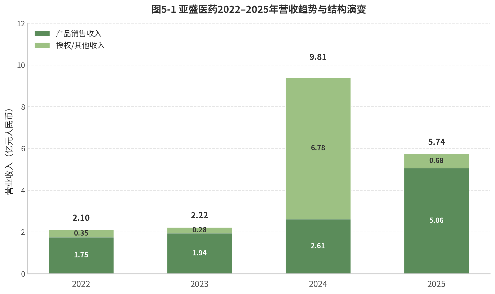
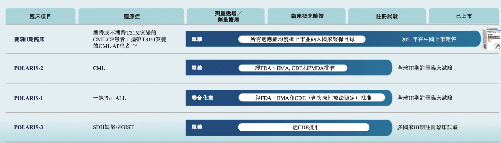
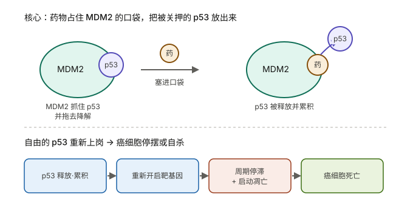

核心管线：

1. 利沙托克拉（APG-2575）
2. 奥雷巴替尼（APG-1351）


核心问题：

1、武田何时行权，大概率要Polaris-2数据读出。虽然 Polaris-2 的正式 III 期数据还没出来，但亚盛在 **2026 ASCO 年会上公布了耐立克二线治疗 CML-CP 的临床数据**，24 周 CCyR 率高达 **91.3%**，并做了口头报告，反响积极。这可以看作是 Polaris-2 的风向标。Polaris-2 正式 III 期数据预计 **2027 年上半年** 读出（入组 2026 年完成 + 6 个月随访）

2、Lisaftoclax 的 GLORA-4 临床，针对 MDS 适应症，CR 数据预计 2027 年 6 月左右读出，OS 可能要等到 2029 年。2025 年 8 月完成入组，Venetoclax 是 27+


亚盛医药（Ascentage Pharma）是一家专注于细胞凋亡通路的全球化创新药企，2025年1月成为首家"先港股、后美股"双重上市的中国生物科技公司，并于2026年6月正式移除港股"B"标记，标志其从研发型Biotech向商业化Biopharma的转型获得市场认可。公司由杨大俊、王少萌、郭明三位海归科学家于2009年创立，拥有全球唯一覆盖Bcl-2、IAP、MDM2-p53三条细胞凋亡通路的临床产品管线，累计478项全球授权专利（342项海外）。

亚盛医药的竞争定位不能仅从单一产品维度理解。公司是全球唯一一家同时拥有Bcl-2、IAP、MDM2-p53三条细胞凋亡通路临床产品的创新药企，这一独特定位的战略价值在于联合用药的"内部协同"潜力[^44]。APG-2575（Bcl-2）联合APG-115（MDM2-p53）在儿童实体瘤中已展现ORR 30%、DCR 80%的数据，且该组合入选ASCO 2026口头报告[^45]。艾伯维仅有Venetoclax（Bcl-2），百济仅有Sonrotoclax（Bcl-2），均缺乏MDM2-p53和IAP资产——这是竞争对手无法复制的组合。

然而，这一平台优势在短期内难以转化为商业收入。APG-115和APG-1387距离商业化尚有数年。

**双核心产品驱动增长**：耐立克®（奥雷巴替尼）是中国首个且唯一获批的第三代BCR-ABL抑制剂，2025年中国销售4.35亿元（同比+81%），所有适应症已纳入国家医保目录；利生妥®（利沙托克拉/APG-2575）是中国首个获批的国产原创Bcl-2选择性抑制剂，2025年7月获批上市后5个月实现销售7,058万元。九项全球注册III期临床试验同步推进，其中四项已获FDA/EMA批准。

**财务与估值**：2025年营收5.74亿元（同比-41.5%，因2024年一次性BD收入退坡），净亏损12.43亿元，但产品销售收入同比增长90%，现金储备约24.7亿元可支撑至2027年底。多家投行给予买入评级，近90天目标均价83.1港元，较当前股价（约34.8港元）存在138%潜在上行空间。

**核心风险与机遇**：武田制药13亿美元全球合作（未行权）创造了独特的估值不对称性——行权时点与帕纳替尼专利悬崖（2027年）直接挂钩；**利生妥的4-6天快速剂量递增不仅是安全性优势，更可能重构Bcl-2抑制剂的可及性经济学；但公司在BTK+Bcl-2联合疗法时代缺乏自有BTK产品，构成结构性战略短板。**

---

# 1. 公司概况与发展历程

根据2018年8月签署的一致行动确认契据，杨大俊、郭明、王少萌及首席医学官翟一帆通过各自特殊目的公司（SPV）形成一致行动人，合计持有约17.42%股权（超额配售后）[^7]。这一股权结构在公司经历多轮稀释后仍保持相对集中，为战略决策的连贯性提供了治理保障。值得注意的是，三位创始人的学术背景均集中于化学与肿瘤学交叉领域，而非传统的商业或金融背景，这在一定程度上解释了亚盛医药在商业化早期阶段的相对谨慎风格——公司直至2019年港股上市才正式启动大规模资本化运作，距成立已有十年。

### 1.1.2 自主PPI靶向药物设计平台：全球唯一的细胞凋亡全通路覆盖

亚盛医药的核心技术竞争力建立在自主构建的蛋白-蛋白相互作用（Protein-Protein Interaction, PPI）靶向药物设计平台之上。PPI靶点曾长期被视为"不可成药"领域，全球唯一获批的PPI靶点抗肿瘤药物是艾伯维的Venetoclax（维奈克拉），（百济神州索托克拉也是PPI白蛋成药） 其销售峰值预计超过50亿美元[^8]。亚盛医药是全球唯一一家同时针对**Bcl-2、IAP（凋亡抑制蛋白）和MDM2-p53**三条关键细胞凋亡通路均有临床开发阶段品种的企业[^8]。**这一"全通路覆盖"定位并非简单的管线多样化策略，而是具有明确的联合用药协同逻辑：APG-2575（Bcl-2抑制剂）与APG-115（MDM2-p53抑制剂）的联合方案已在儿童实体瘤中展现出客观缓解率（ORR）30%、疾病控制率（DCR）80%的初步数据，而竞争对手如艾伯维（仅拥有Bcl-2）和百济神州（仅拥有Bcl-2）均缺乏MDM2-p53和IAP资产，无法复制这一内部组合**[^9]。

从科学机理看，**Bcl-2通路调控线粒体外膜通透性，IAP家族蛋白（如cIAP1/2、XIAP）通过抑制Caspase活性阻断凋亡执行，MDM2-p53通路则通过泛素化降解p53肿瘤抑制蛋白维持细胞存活。三条通路在功能上相互独立但在肿瘤微环境中协同作用，同时抑制多条通路可产生协同抗肿瘤效应**。

### 1.1.3 专利布局：478项全球授权专利构建竞争护城河

截至2025年6月30日，亚盛医药在全球范围内累计拥有478项授权专利，其中342项在海外授权，覆盖中国、美国、欧洲、日本等主要医药市场[^10]。这一专利规模在中国创新药企业中处于第一梯队。核心化合物专利的到期年份从2031年至2037年不等，为公司在关键市场的独占性销售提供了至少5至10年的法律保障[^10]。以耐立克（奥雷巴替尼，Olverembatinib）为例，其核心化合物专利在中国到期时间为2035年，在美国为2036年，这意味着即便在2030年代初期面临仿制药竞争，公司仍有足够时间通过适应症扩展和联合用药方案延长产品生命周期。从商业策略角度看，这一专利梯队的深度使得亚盛在对外授权谈判中拥有更强的议价能力——武田制药2024年6月签署耐立克独家选择权协议时，专利到期时间表是评估交易价值的关键参数之一。

| 里程碑           | 时间           | 事件                                                 | 累计融资/估值                            | 关键意义                                                     |
| :--------------- | :------------- | :--------------------------------------------------- | :--------------------------------------- | :----------------------------------------------------------- |
| 亚生医药成立     | 2003年         | 杨大俊、王少萌、郭明在美国创立Ascenta Therapeutics   | 首轮融资500万美元                        | 细胞凋亡通路药物研发的起点                                   |
| 亚生医药关闭     | 2008年         | 金融危机冲击，AT-101临床II期数据不及预期             | 累计融资约9,000万美元                    | 两项原创新靶点药物以近7亿美元授权给赛诺菲和瑞士德彪[^2]      |
| 天使轮融资       | 2010年2月      | 三生制药投资300万美元                                | 约300万美元                              | 中国创新药领域早期罕见投资，占发行后股本约40%                |
| A轮融资          | 2015年8月      | 元禾原点、元明资本领投                               | 9,600万元人民币                          | 中国创新药投资热潮兴起，亚盛获得机构背书                     |
| B轮融资          | 2016年12月     | 国投创新（先进制造产业投资基金）领投                 | 5亿元人民币                              | 国家级产业基金入场，标志公司进入"国家队"视野                 |
| C轮融资          | 2018年7月      | 元明方圆基金领投                                     | 约10亿元人民币                           | 为港股IPO奠定资本基础                                        |
| 港股IPO          | 2019年10月28日 | 港交所主板上市，代码06855.HK                         | 募资净额约3.12亿港元                     | 成为港股生物科技板块改革后首个"原创小分子新药"企业；获超额认购约751倍[^11] |
| 信达生物战略合作 | 2021年7月      | 耐立克中国共同开发及商业化；信达认购5,000万美元      | 战略投资5,000万美元                      | 引入中国头部Biotech商业化能力                                |
| 武田战略入股     | 2024年6月      | 武田以7,500万美元认购新股，成为第二大股东（约7.73%） | 7,500万美元股权 + 1亿美元选择权付款      | 跨国大型药企首次战略投资中国18A企业，标志全球认可            |
| 纳斯达克IPO      | 2025年1月24日  | 纳斯达克挂牌上市，代码AAPG                           | 募资净额约1.26亿美元（约9.67亿元人民币） | 首家"先港股、后美股"双重上市的中国Biotech；2025年美股首家生物医药IPO[^12] |
| 港股"摘B"        | 2026年6月1日   | 正式移除港股股票代码"B"标记                          | 市值约149.6亿港元                        | 满足港交所收益测试（市值≥40亿港元+收益≥5亿港元），商业化能力获正式验证[^1] |


亚盛医药的融资历程清晰呈现了中国创新药产业从资本寒冬到热潮再到理性回归的完整周期。2010年天使轮融资时，三生制药以300万美元获得约40%股权，当时中国创新药投资环境远未成熟，这一估值在今天看来极为低廉，但反映了早期创新药企面临的资金困境。2015年至2018年的A、B、C三轮融资恰逢中国创新药投资热潮，累计融资超过15亿元人民币，为公司推进多个候选药物进入临床提供了资金支撑。值得注意的是，2019年港股IPO的募资净额仅约3.12亿港元，发行比例仅约5.88%，是港股生物科技板块改革以来发行规模最小的B类股（18A）[^11]。这一"微型IPO"策略使得创始团队和早期投资者未被过度稀释，同时也意味着公司上市后仍需持续依赖后续配售和战略合作补充资金。事实印证了这一点：2019年上市后至2025年，亚盛通过四次配售、武田股权投资和纳斯达克IPO累计融资超过50亿港元，资本运作频率远高于同期上市的其他18A企业。

## 1.2 融资与上市历程

### 1.2.1 从亚生医药到亚盛医药：穿越周期的创业韧性

亚盛医药的故事并非始于2009年，而是可以追溯至2003年亚生医药的创立。亚生医药由杨大俊团队基于乔治城大学发现的AT-101（Bcl-2抑制剂）在美国成立，2005年在上海张江设立中国研发中心，2007年被Fierce Biotech评为"15家最具成长性生物技术公司"之一，累计融资约9,000万美元[^2]。然而，2008年全球金融危机彻底改变了这一 trajectory。在金融危机冲击下，亚生医药的两项原创新靶点抗肿瘤药物——MDM2-p53靶点药物以3.98亿美元授权给赛诺菲，另一项授权给瑞士德彪，合计近7亿美元——虽然创造了当时华尔街的轰动，但公司本身因AT-101临床II期数据不及预期而被迫停止运营[^2]。

这一经历对创始团队产生了深远影响。杨大俊、王少萌、郭明三人选择自掏腰包将上海研发中心接手下来，于2009年在此基础上重新成立亚盛医药[^2]。这一决策的本质是在资源极度匮乏的条件下保留了一个"火种"——一个拥有化合物库、研发经验和化学合成能力的团队。2009年至2015年的六年期间，亚盛医药几乎处于"静默"状态，直到2015年A轮融资才重新获得机构资本关注。这一长达六年的"资本真空期"在中国创新药创业史上极为罕见，它既考验了创始团队的财务承受能力，也筛选出了真正愿意陪伴长期主义的投资者。三生制药作为天使轮投资人，在后续多轮融资中持续支持，其董事长娄竞与杨大俊的私人信任关系在这一过程中发挥了关键作用[^2]。

### 1.2.2 双重上市：从港股18A到纳斯达克的战略升级

2019年10月28日，亚盛医药在香港联交所主板挂牌上市，股票代码06855.HK，成为港股生物科技板块改革以来首个"原创小分子新药"企业[^11]。IPO获超额认购约751倍，成为2019年港股"超购王"，基石投资者为中国生物制药（1177.HK），认购约1.56亿港元，占发行规模约38%[^11]。然而，发行规模仅约3.92至4.16亿港元，预期市值66.67至70.82亿港元，是港股18A板块历史上发行规模最小的IPO之一[^11]。这一"小而美"的上市策略使得公司成功进入公开市场，但并未一次性解决长期资金需求，后续通过多次配售和BD交易持续补充弹药。

2025年1月24日，亚盛医药在美国纳斯达克证券交易所正式挂牌上市，股票代码"AAPG"，发行732.5万股ADS，发行价17.25美元/ADS，募资净额约1.26亿美元（约9.67亿元人民币）[^12]。亚盛医药由此成为首家"先港股、后美股"双重上市的中国生物科技公司，也是2025年美股第一家上市的生物医药企业[^12]。这一定位具有重要的战略意义：港股上市为公司提供了人民币计价的融资平台和亚洲机构投资者的覆盖，而纳斯达克上市则打开了美元融资通道、提升了全球品牌知名度，并为潜在的武田行权后全球商业化提供了资本运作平台。2025年2月，超额配股权交割完成，额外发行94万股ADS，筹集约1,613万美元，总股本从约3.45亿股增加至约3.48亿股[^13]。

### 1.2.3 武田战略入股：跨国药企验证与选择权结构

2024年6月，武田制药以7,500万美元认购亚盛医药新发行的港股股票，成为亚盛医药第二大股东，持股比例约7.73%（后因增发稀释至约6.51%）[^14]。同时，双方就耐立克（奥雷巴替尼）签署总额最高约13亿美元的独家选择权协议，其中1亿美元选择权付款已到账，武田有权获得耐立克在全球（除中国外）的独家开发和商业化权利，亚盛保留中国权益及全球一定比例的销售分成[^14]。这一交易是截至当时中国小分子抗肿瘤药物史上最大的BD交易，其结构并非直接收购，而是"股权投资+选择权"的组合，为双方保留了战略灵活性：武田可以在观察耐立克的海外临床数据后决定是否行使选择权，而亚盛则通过股权绑定将武田利益与公司长期价值对齐。从武田角度看，这一投资与其自有产品帕纳替尼（Ponatinib）的专利悬崖（2027年到期）直接相关——奥雷巴替尼作为第三代BCR-ABL抑制剂，具有更低的动脉闭塞事件发生率（约7% vs 帕纳替尼的31%），是帕纳替尼专利到期后的潜在替代产品[^15]。因此，武田的持股不仅是财务投资，更是一个具有"时间窗口期权"特征的战略布局。

## 1.3 公司治理与战略定位

### 1.3.1 董事会与科学顾问网络：学术治理的优劣势

亚盛医药董事会由9名董事组成，包括1名执行董事（杨大俊）、2名非执行董事（王少萌、Simon Dazhong Lu）和6名独立非执行董事（任伟、叶常青、David Sidransky、Marina Bozilenko、Debra Yu、Marc Lippman）[^16]。9名董事中6人拥有博士学位，学术密度在中国上市药企中位居前列。这一结构的优势在于科学决策的专业性——面对复杂的临床开发策略和靶点选择，董事会能够基于科学证据而非单纯的商业逻辑做出判断。然而，潜在的风险在于学术治理可能过于保守，在需要快速商业化扩张或激进资本运作时缺乏足够的商业决策经验。

公司临床顾问委员会（Clinical Advisory Board, CAB）由ASCO前首席执行官Allen S. Lichter博士担任主席，成员包括肺癌研究领域权威Paul A. Bunn Jr.博士、肿瘤免疫学专家Jedd Wolchok博士、密西根大学Arul Chinnaiyan博士、MD Anderson癌症中心Hagop Kantarjian博士等国际顶级肿瘤学专家[^17]。这一科学顾问网络的价值不仅在于为临床开发提供指导意见，更在于为亚盛的候选药物在全球学术界的背书和KOL（关键意见领袖）网络建设。Kantarjian博士在慢性髓性白血病（CML）领域的权威地位对耐立克的全球推广尤为重要，而Wolchok博士在肿瘤免疫学领域的影响力则为APG-115与免疫检查点抑制剂的联合用药提供了学术基础。

### 1.3.2 "摘B"里程碑：商业化验证与估值重估的分水岭

2026年6月1日，亚盛医药正式从港股股票代码中移除"B"标记，成为又一家成功"摘B"的18A生物科技公司[^1]。根据港交所上市规则第8.05(3)条，公司需满足市值不低于40亿港元且最近一个财政年度收益不低于5亿港元的测试。截至2026年5月，亚盛医药市值约149.6亿港元，远超40亿港元门槛；2025年度收入达5.74亿元人民币（约6.2亿港元），高于5亿港元要求[^1]。"摘B"的技术意义在于亚盛医药此后可纳入更多港股通指数和被动基金，扩大机构投资者覆盖范围；而象征意义更为深远——它标志着港交所正式认可亚盛医药已从"研发驱动、尚未盈利"的Biotech转型为"具备可持续商业化能力"的Biopharma。

从战略定位看，亚盛医药自成立之初即坚持"全球创新"（in China for global）定位，拒绝仿制药捷径，专注于细胞凋亡通路中PPI的小分子靶向药物[^18]。这一战略定力在2010年代初期中国创新药环境不成熟、资金极度困难的时期经历了严峻考验。然而，正是这种长期主义使得亚盛在2021年（耐立克获批）和2025年（利生妥获批）迎来商业化收获期。2024年，公司实现收入9.81亿元人民币，同比增长342%，首次实现半年度盈利（上半年净利润1.63亿元），其中耐立克销售收入2.41亿元，武田1亿美元选择权付款贡献显著[^19]。2025年营收回落至5.74亿元，但产品收入占比从2024年的30.9%上升至87.0%，收入结构从"BD脉冲驱动"转向"产品销售驱动"，标志着财务结构的正常化[^19]。

亚盛医药的全球化战略正在从"License-Out"向"自主出海"演进。耐立克通过武田合作以授权模式出海，但利生妥由亚盛自主推进全球临床，在美国Rockville设立总部、与MD Anderson癌症中心建立长期合作、聘请Elias Jabbour博士担任全球临床PI[^20]。九项注册性III期临床试验中，四项已获得FDA和EMA批准[^20]。若利生妥能在美国成功上市，亚盛将成为中国少数拥有自主海外商业化能力的Biopharma。这一"双轨并行"的国际化路径，反映了中国创新药企从依赖跨国药企到自建全球能力的战略升级，而亚盛医药正处于这一转型的最前沿。

---


---

## 4. 商业化能力与竞争格局

### 4.1 商业化能力评估

#### 4.1.1 团队规模：从精兵简政到双引擎扩张

亚盛医药商业化团队经历了极具戏剧性的扩张轨迹。2024年，在行业普遍收缩的背景下，公司主动将商业化团队精简14%至90余人，却实现了准入医院数量同比增长86%的运营效率提升——耐立克®销售收入在团队收缩的情况下仍增长52%至2.41亿元[^1]。随着利生妥®于2025年7月获批上市，商业化战略迅速转向"双引擎驱动"的规模化扩张。截至2025年底，团队规模扩张至270人，接近300人，且80%的成员具备血液肿瘤领域相关背景[^3]。

从人员结构看，这一扩张速度在中国创新药企业中处于领先水平。根据管理层指引，公司计划2026年将商业化团队扩充至400人，这一规模将超过百济神州当前国内血液肿瘤团队人数[^4]。团队负责人司志超博士曾主导伊布替尼和奥布替尼在中国的成功上市，具备丰富的BTK抑制剂商业化经验[^5]。从90人到400人的两年扩张计划，意味着亚盛正在从"Biotech式"的精益销售模式向"Biopharma式"的全覆盖模式转型。这一转型的必要性源于血液肿瘤市场的集中度特征——中国80%的血液肿瘤患者集中于头部300家医院，但利生妥®所覆盖的CLL/SLL患者群体较CML更为分散，需要更广泛的医院渗透[^6]。

#### 4.1.2 销售网络：耐立克与利生妥的双轨覆盖

截至2025年12月31日，耐立克®在全国准入的医院和DTP药房共达到825家，较2024年底的734家增长12.4%；其中准入医院数量由260家增至355家，同比增长约36.5%[^7]。这一增长是在2024年已高基数基础上的持续渗透——2024年底准入医院数量较2023年底已增长86%[^8]。值得关注的是，耐立克®的销售网络扩张与医保准入节奏高度同步：2023年1月首次纳入医保后，销售盒数同比增长259%，准入医院数量同比增长567%[^9]；2025年1月所有已获批适应症全部纳入医保后，患者可及性进一步提升，管理层预计新增患者将达4至5倍[^10]。

利生妥®展现了更为迅猛的准入速度。作为2025年7月获批的中国首个国产原创Bcl-2抑制剂，利生妥®在上市后五个月内即实现全国DTP药房和准入医院328家，覆盖医院超过1,300家[^11]。首批处方于7月25日在30多个城市的40余家医院快速落地[^12]。这一速度部分得益于亚盛与国药控股、上药控股、华润天津等医药流通龙头企业签署的全国性分销合作协议[^13]，以及公司在37个省级或地市将利生妥®纳入惠民保、百万医疗等特殊药品目录的准入努力[^14]。两款产品合计覆盖全国超1,500家医院及800间药房，形成了血液肿瘤领域的协同渠道网络[^15]。

#### 4.1.3 销售费用效率：高增长投入与结构优化并行

2025年，亚盛医药销售和分销开支达3.54亿元，同比增长80.4%[^16]。这一增幅主要源于利生妥®上市首年的商业化启动费用和耐立克®适应症扩展后的推广投入。从费用率角度看，2025年销售费用率高达61.7%[^17]，在创新药企中处于较高水平。然而，需要结构性分析这一数字：2024年销售费用1.96亿元几乎与2023年持平（+0.3%），而2025年的激增是"第二产品上市"的必然投入——参照百济神州、信达生物等企业的历史轨迹，第二产品上市首年的销售费用率通常会出现阶段性跳升，随后随着收入规模扩大而逐年下降[^18]。

从人效指标观察，亚盛医药的运营效率正在改善。2024年商业化团队人效由2023年的164万元提升至241万元，增幅47%，仅次于百济神州[^19]。2025年上半年销售费用1.38亿元，同比增长53.7%，而同期耐立克®销售收入增长93%至2.17亿元，费用增速显著低于收入增速，表明耐立克®的销售费用率已呈下降趋势[^20]。这一结构性改善是公司从"高投入低产出"的第四象限向可持续盈利路径迁移的关键信号。


## 预期观察指标

投资者在2026–2027年应重点跟踪以下四个指标，其兑现顺序将决定亚盛估值的演进路径。

第一，2026年下半年利生妥®国家医保谈判结果。若成功纳入，参照历史经验，创新药纳入医保后的次年销售增速通常在100%–200%，2027年利生妥®销售有望从年化1.7亿元跃升至4–5亿元[^1][^15]。谈判失败的后果则是销售爬坡显著放缓，基层市场渗透受阻。

第二，GLORA-4（HR-MDS一线）入组进度与中期数据。该试验是全球首个针对HR-MDS一线治疗的Bcl-2抑制剂注册研究，若入组进度符合预期且中期数据积极，将为2027年NDA提交和全球获批奠定核心证据基础[^3][^24]。

第三，武田行权信号。先行指标包括：武田是否实质参与POLARIS-2的临床方案设计或患者入组；武田季度财报中对帕纳替尼专利悬崖的指引措辞；以及仿制药ANDA申报动态[^4][^7]。若武田在2026年下半年开始承担部分海外临床费用，可能预示行权决策正在临近。

第四，三项NDA（POLARIS-1、POLARIS-2、GLORA-4）的提交节奏。2027年同步提交三项NDA是管理层明确指引，若任一试验因数据锁库延迟或监管沟通问题导致提交时点后移，将直接影响海外商业化时间表和BD谈判筹码[^2][^24]。

综合评估，亚盛医药正处于从"研发型Biotech"向"全球化Biopharma"转型的关键窗口期。短期风险（竞争加剧、地缘政治、现金消耗）与长期价值（双产品全球化、武田期权、平台稀缺性）之间的博弈，将在2026–2027年集中决出胜负。当前股价已处于悲观情景底部，对于能够承受创新药高波动性的长期投资者而言，风险收益比具有结构性吸引力。

## 5.1 财务表现分析

### 5.1.1 2022–2025年营收趋势：从BD脉冲到产品驱动

亚盛医药2022–2025年的营业收入呈现一条典型的创新药企商业化曲线：低基数起步、BD授权脉冲放大、随后回落至产品驱动。2022年总收益2.10亿元，为耐立克®上市首个完整年度，产品销售收入1.75亿元[^1]。2023年营收2.22亿元，同比仅增5.9%，增长乏力的核心在于耐立克®彼时仅覆盖一二代TKI耐药CML-CP一个适应症，且尚未纳入国家医保目录，市场渗透受限[^2]。2024年营收骤增至9.81亿元，同比增幅达342%，但这一脉冲并非源于产品放量，而是来自武田1亿美元选择权付款所确认的6.78亿元知识产权收入，占当年营收69.1%[^3]。2025年营收回落至5.74亿元，同比下降41.5%，但产品销售收入同比增长90%，达到5.06亿元，占营收比重升至87.0%[^1]。这一"总量回调、结构改善"的特征，标志着亚盛医药的收入基础正从BD依赖型向产品驱动型切换。

从耐立克®单品的销售轨迹可以更清晰地观察商业化爬坡的加速度。2022年全年约1.82亿元，2023年约2.18亿元，2024年2.41亿元（+52%），2025年4.35亿元（+81%）[^3][^1]。2025年增速跃升的关键在于，耐立克®全部获批适应症自2025年1月起纳入国家医保目录，全国准入医院和DTP药房达825家，较2024年底增长12.4%[^1]。利生妥®（APG-2575）于2025年7月获批，上市五个月即实现销售收入7,058万元，年化约1.7亿元，超出多数券商对其上市首年的预期[^1]。双产品引擎的初步成型，使2025年产品收入的内生增速达到90%，远高于2024年的37%（2.61亿元 vs 1.94亿元），表明商业化能力正在跨越从0到1的临界点。



上图直观呈现了2024年BD收入脉冲对营收结构的扭曲效应。2024年产品销售收入仅2.61亿元，占比26.6%，而武田选择权付款高达6.78亿元；2025年授权收入退坡后，产品销售收入5.06亿元成为绝对支柱。若剔除BD收入的非经常性扰动，2022–2025年产品收入的复合年增长率（CAGR）约为43%，这一增速在国产创新药单品中处于中上水平，但距离支撑公司整体盈利仍有显著差距。

### 5.1.2 亏损结构分析：2025年亏12.43亿元的真实原因

2025年亚盛医药净亏损12.43亿元，较2024年的4.06亿元扩大206%，表面看是财务恶化，实则是结构正常化。2024年的"减亏"并非经营效率改善的结果，而是武田6.78亿元一次性BD收入直接冲抵了运营亏损。若剔除该非经常性收入，2024年真实运营亏损约为10.8亿元，与2025年的12.43亿元处于同一量级[^3][^1]。换言之，2024–2025年的亏损扩大并非经营基本面恶化，而是收入确认的会计波动。

进一步拆解亏损构成，2025年研发费用11.37亿元（+20.1%）、销售费用3.54亿元（+80.4%）、行政费用2.46亿元（+31.6%），三项费用合计17.37亿元，较2024年的13.30亿元增加30.6%[^1]。费用增长的核心驱动力有三：其一，九项注册III期临床在全球范围内同步推进，其中四项已获FDA/EMA许可，临床烧钱强度显著高于2024年；其二，利生妥®上市首年需自建商业化团队，亚盛从信达合作的"轻资产"模式切换为自营推广，销售费用率从2024年的20.0%飙升至61.7%；其三，美股上市后的合规成本、团队扩张及收购广州顺健产生的或有对价公允价值损失0.74亿元，推高了其他开支[^1][^11]。

从效率指标看，2025年"产品收入/研发费用"比值为0.45（5.06/11.37），较2024年的0.28（2.61/9.47）显著改善。这意味着每单位研发投入所支撑的产品收入正在提升，虽然绝对水平仍远低于1，但趋势向好。参照百济神州、诺诚健华的历史路径，该比值突破1.0通常对应商业化拐点的到来，亚盛目前仍处于追赶期[^12]。

### 5.1.3 费用端：研发投入、销售费用与行政费用

下表汇总了2022–2025年亚盛医药三大费用科目的演变。研发费用的持续攀升是创新药企的常态，但销售费用的激增反映了商业模式的切换——从依赖信达合作的轻推广模式，转向自建团队的重投入模式。

| 费用项目              | 2022年 | 2023年 | 2024年 | 2025年 | 2024→2025变动 |
| :-------------------- | -----: | -----: | -----: | -----: | :------------ |
| 研发费用（亿元）      |   7.43 |   7.07 |   9.47 |  11.37 | +20.1%        |
| 销售费用（亿元）      |   1.57 |   1.95 |   1.96 |   3.54 | +80.4%        |
| 行政/管理费用（亿元） |   1.71 |   1.81 |   1.87 |   2.46 | +31.6%        |
| 费用合计（亿元）      |  10.71 |  10.83 |  13.30 |  17.37 | +30.6%        |
| 研发费用率            |   354% |   318% |    96% |   198% | —             |
| 销售费用率            |    75% |    88% |    20% |    62% | —             |

*数据来源：亚盛医药2022–2025年年报及业绩公告[^1][^2][^3]*

研发费用11.37亿元是2025年最大的现金消耗项，其投向具有高度结构化特征：全球注册III期临床占据最大份额，尤其是POLARIS-2（CML-CP一线）、GLORA-2（CLL/SLL一线）、GLORA-4（HR-MDS一线）等关键试验的海外入组费用显著高于国内。销售费用3.54亿元中，利生妥®上市首年的医学推广、学术会议、团队组建占据主要部分。亚盛商业化团队从2024年的约200人扩充至2025年的约300人，计划2026年进一步扩充至400人，这一节奏与利生妥®的医保谈判和医院准入时间表直接挂钩[^1][^11]。

参照可比公司的历史经验，销售费用率在创新药上市首年通常达到50%–80%，随后逐年下降。百济神州泽布替尼上市初期销售费用率亦曾超过60%，但2025年已降至27.7%[^9]。诺诚健华奥布替尼2020年上市首年销售费用率约为70%，2025年已降至24.4%[^10]。据此推断，若利生妥®2026年纳入医保并实现医院放量，亚盛销售费用率有望在2027年回落至40%以下。

### 5.1.4 现金流与资金状况：经营现金流-11.74亿，现金储备24.7亿元

2025年经营活动现金流净额为-11.74亿元，投资活动现金流净额为-10.00亿元，筹资活动现金流净额为+25.40亿元[^1]。经营现金流与净亏损（12.43亿元）基本匹配，表明利润表与现金流量表之间的非现金差异较小，盈利质量尚可。投资现金流出主要用于全球临床投入和产业化基地建设，2025年亚盛全球产业基地通过欧盟QP审计，为后续海外商业化奠定了GMP基础[^13]。

截至2025年末，现金及银行存款约24.70亿元，较2024年末的12.61亿元接近翻倍。现金增长的两大来源分别为2025年1月美股IPO净收益约9.67亿元人民币（1.264亿美元）和2025年7月港股配售净收益约13.7亿元人民币（14.93亿港元）[^9][^10]。剔除两次融资后，经营层面年度现金消耗约11.74亿元。管理层明确指引，现有资金"足以支撑公司在2027年年底前的运营开支及资本支出需求"[^14]。

从资产负债表视角看，2025年末总资产39.64亿元，总负债19.80亿元，资产负债率约49.9%，净借贷已降至零[^1]。这一指标较2023年末的97.2%实现显著改善，主要得益于美股IPO和配售所带来的股东权益增厚。2025年两次融资使总股本从3.152亿股增至3.733亿股，稀释约18.4%[^11]。若未来维持当前费用水平且无新增融资，runway约为1.1–1.3年；但考虑利生妥销售爬坡、潜在BD收入及费用优化，实际runway可延至2027年底。


## 7.2 跨维度战略洞察


#### 7.2.3 细胞凋亡"全通路覆盖"的平台价值：APG-115+APG-2575联合疗法竞争对手无法复制

亚盛是全球唯一同时拥有Bcl-2、IAP、MDM2-p53三条细胞凋亡通路临床产品的公司。APG-115（MDM2-p53抑制剂）联合APG-2575在儿童实体瘤中已展现ORR 30%、DCR 80%的数据，并于ASCO 2026获口头报告[^19]。这一组合的战略价值在于竞争对手无法复制：艾伯维仅有Venetoclax（Bcl-2），百济仅有Sonrotoclax（Bcl-2），均缺乏MDM2-p53和IAP资产[^19][^20]。肿瘤联合治疗的长期趋势是"内部协同优于外部合作"——百济通过"泽布替尼+Sonrotoclax"建立了BTK+Bcl-2闭环，亚盛则通过"Bcl-2+MDM2-p53+IAP"建立了细胞凋亡领域的内部闭环。若未来2–3年内读出APG-115+APG-2575联合治疗实体瘤的注册性数据，亚盛的平台价值将被市场重新定价[^19]。


| 适应症                                      | 对应药物            | 大致位置                             |
| ------------------------------------------- | ------------------- | ------------------------------------ |
| CML 慢性髓性白血病                          | 奥雷巴替尼          | 已上市，是亚盛第一个商业化核心产品   |
| CLL/SLL 慢性淋巴细胞白血病/小淋巴细胞淋巴瘤 | 利沙托克拉          | 已在中国获批，是第二个商业化核心产品 |
| AML 急性髓系白血病                          | 利沙托克拉、APG-115 | 注册/临床阶段                        |
| MDS 骨髓增生异常综合征                      | 利沙托克拉、APG-115 | 注册/临床阶段                        |
| Ph+ ALL 费城染色体阳性急淋                  | 奥雷巴替尼          | 注册 III 期方向                      |
| MM 多发性骨髓瘤                             | 利沙托克拉          | 临床探索                             |

### 3.1.1 APG-115（Alrizomadlin）：MDM2-p53抑制剂的全球领先地位

APG-115是亚盛自主研发的口服、高选择性MDM2-p53蛋白-蛋白相互作用（PPI）抑制剂，通过阻断MDM2与p53的结合恢复野生型p53的肿瘤抑制活性。临床前研究显示，APG-115对MDM2的结合亲和力（Ki < 1 nM）显著优于早期MDM2抑制剂，且具备独特的免疫调节功能——可通过增加T细胞MDM2表达产生IFN-γ信号，与PD-1抑制剂形成协同效应[^1]。

从监管认定维度，APG-115是中国药企获得FDA孤儿药资格（ODD）数量最多的单一品种，累计获得6项ODD（胃癌、AML、软组织肉瘤、视网膜母细胞瘤、IIB-IV期黑色素瘤、神经母细胞瘤）、2项儿童罕见病资格（RPD）及1项快速通道资格（FTD，复发/难治转移性黑色素瘤）[^2]。这一监管资格矩阵为未来的上市审批和定价提供了结构性优势。

在关键临床数据方面，APG-115展现了三个差异化适应症方向。在腺样囊性癌（ACC）中，2026年3月发表于*Nature Communications*的Phase I研究显示，25例TP53野生型ACC患者的ORR为20.0%，DCR高达96.0%，中位PFS达9.7个月，mDOR为16.1个月[^3]。在缺乏有效系统治疗的罕见唾液腺肿瘤中，96%的疾病控制率具有显著临床意义。在免疫治疗耐药黑色素瘤中，APG-115联合pembrolizumab的Phase II研究（n=32）显示ORR为24.1%，构成FDA授予FTD的数据基础[^4]。在2026年ASCO快速口头报告中，APG-115联合利生妥在17例儿童复发/难治实体瘤患者中实现ORR 30%、DCR 80%，未观察到剂量限制性毒性或治疗相关死亡[^5]。

从竞争格局看，APG-115在全球MDM2-p53抑制剂赛道中处于前三位置。Roche的Idasanutlin曾率先进入Phase III但因毒性终止；Novartis的Siremadlin、Daiichi Sankyo的Milademetan和Kartos/Amgen的Navtemadlin均处于Phase II。APG-115的差异化优势在于极高的MDM2结合亲和力和免疫联合策略，同时被CDE纳入"星光计划"，在儿童实体瘤领域先发优势明显[^1][^5]。

### 3.1.2 APG-2449（FAK/ALK/ROS1三联抑制剂）：实体瘤管线中最接近商业化的资产

APG-2449是亚盛自主研发的口服第三代ALK-ROS1 TKI和FAK抑制剂，具有三重靶点抑制能力。其对FAK、ALK和ROS1的Kd分别为5.4 nM、1.6 nM和0.81 nM，且能够有效抑制最关键的ALK耐药突变G1202R（IC50 = 9.2 nM）[^6]。CSF/游离血浆比值为0.65–1.66，具有良好的血脑屏障穿透性。

APG-2449的Phase I研究结果于2025年10月发表于*cClinicalMedicine*（Lancet子刊），入组144例患者，RP2D为1200 mg每日一次。安全性数据显示，最常见的≥3级TRAE为ALT升高（3.5%）和QT延长（3.5%），无治疗相关死亡；与lorlatinib相比，CNS毒性（认知/情绪障碍）罕见，而lorlatinib组35–42%的患者出现CNS不良事件[^7]。

在疗效数据方面，ALK阳性TKI初治患者的ORR为78.6%，24个月PFS率为64.3%；二代ALK-TKI耐药患者的ORR为45.5%，中位PFS为13.6个月；ROS1阳性TKI初治患者的ORR为75.0%。颅内疗效尤为突出：RP2D剂量下颅内ORR为75.0%（9/12），ALK+ TKI初治伴脑转移患者的颅内ORR达100%（2/2）[^7]。这些数据表明，APG-2449在二代ALK-TKI耐药人群和CNS转移患者中具有显著优于lorlatinib的潜在优势——lorlatinib在二代耐药人群中的ORR为32.1%，颅内ORR为38.7%。

APG-2449于2024年10月获CDE批准开展两项注册Phase III临床试验，分别针对二代ALK-TKI耐药或不耐受的NSCLC患者，以及ALK阳性晚期/局部晚期NSCLC初治患者[^8]。此外，APG-2449还在开展联合PLD治疗铂耐药复发性卵巢癌的Phase Ib/II研究（NCT06687070）。

### 3.1.3 APG-1252（Pelcitoclax）：Bcl-2/Bcl-xL双靶点抑制剂的前药设计突破

APG-1252是新型Bcl-2/Bcl-xL双靶点抑制剂，其核心创新在于前药设计：APG-1252在肿瘤组织中转化为活性代谢物APG-1252-M1，肿瘤组织转化率是血浆的16倍（22% vs 1.3%），从而显著提高治疗指数、降低血小板毒性——这恰是早期navitoclax因血小板减少症而终止开发的核心原因[^9]。

在临床数据方面，APG-1252联合奥希替尼在EGFR-TKI初治NSCLC患者中展现了显著的协同效应。2023年ESMO中国多中心Ib期数据显示，26例EGFR-TKI初治患者的ORR为80.8%（21/26 PR），16例TP53+EGFR共突变患者中ORR升至87.5%（14/16 PR）[^10]。TP53共突变是EGFR突变NSCLC预后不良的重要生物标志物，APG-1252在这一难治人群中的高应答率具有重要的临床转化价值。在SCLC领域，APG-1252联合紫杉醇的Phase Ib/II研究正在进行中，2021年7月亚盛与NCI达成CRADA合作推进实体瘤开发[^9]。APG-1252还获得了FDA孤儿药资格认定（SCLC）[^11]。

### 3.1.4 APG-3288：中国首个自主研发BTK PROTAC降解剂的临床启动

APG-3288是亚盛基于其专有PROTAC技术平台开发的首个候选药物，通过诱导BTK蛋白、PROTAC分子和Cereblon E3泛素连接酶形成三元复合物，经蛋白酶体途径降解BTK蛋白。与传统BTK抑制剂占据活性位点的抑制机制不同，PROTAC降解剂可完全清除BTK蛋白，并能够降解包括C481S在内的多种耐药突变体[^12]。

APG-3288于2026年1月获FDA IND批准、2026年2月获CDE IND批准，标志着中国首个自主研发BTK PROTAC降解剂正式进入临床阶段[^12][^13]。全球多中心Phase I研究已启动，目标人群为复发/难治B细胞恶性肿瘤。临床前研究显示，APG-3288展现了优于在研竞品（Nurix的NX-2127/NX-5948、百济神州的BGB-16673）的降解效力、选择性和PK特性[^12]。从战略价值看，APG-3288不仅填补了亚盛在BTK赛道的空白，更与奥雷巴替尼和利生妥形成血液瘤管线的内部协同。APG-3288距离商业化至少还需5–7年，但其技术平台的验证将为后续PROTAC管线开发奠定基础。

### 3.1.5 APG-5918（EED抑制剂）与APG-1387（IAP抑制剂）：前沿技术平台的长期布局

APG-5918是亚盛自主研发的口服、高效、选择性EED抑制剂，对EED的IC50为1.2 nM，从Novartis的MAK638通过构象限制方法优化衍生而来。EED是PRC2的核心亚基，通过变构抑制EED可同时阻断EZH2和EZH1的甲基转移酶活性，克服EZH2抑制剂耐药。APG-5918于2022年6月获FDA IND批准、2022年11月获CDE IND批准，是中国首个进入临床的EED抑制剂[^14][^15]。临床前数据显示，APG-5918在KARPAS-422（EZH2突变DLBCL）模型中实现完全肿瘤消退，并在SCLC、多发性骨髓瘤、T细胞淋巴瘤、前列腺癌等模型中展现了广泛的协同潜力[^14]。

APG-1387（dasminapant）是亚盛自主研发的新型双价IAP拮抗剂，其独特设计在于模拟内源性SMAC蛋白的二聚体形式，同时结合XIAP的两个不同结构域，区别于其他仅作用于cIAP1/2单体的IAP抑制剂。在晚期胰腺癌中，APG-1387联合AG方案的Phase I研究显示，15例可评估患者中3例达到PR，安全性可控[^16]。在乙肝领域，APG-1387具有全球开创性意义——它是全球首个进入临床的IAP拮抗剂用于CHB治疗。临床前数据（EASL ILC 2020）显示，在三种HBV携带小鼠模型中，APG-1387治疗4–20周导致血清中HBsAg、HBeAg、HBV DNA完全清除，且停药后无复发；机制涉及通过诱导凋亡和免疫调节双重机制增强肝内HBV特异性T细胞应答[^17]。Phase II研究（NCT04568265）正在评估APG-1387联合恩替卡韦的CHB功能性治愈策略。

| 管线资产 | 核心靶点/机制        |  临床阶段  | 关键适应症             | 核心临床数据                                                 | 监管资格/差异化定位                                          |
| :------- | :------------------- | :--------: | :--------------------- | :----------------------------------------------------------- | :----------------------------------------------------------- |
| APG-115  | MDM2-p53 PPI         |  Phase II  | 黑色素瘤/ACC/儿童肉瘤  | 联合帕博利珠单抗ORR 24.1%（黑色素瘤）；ACC ORR 20.0%/DCR 96.0%；联合APG-2575儿童实体瘤ORR 30%/DCR 80% | 6项FDA ODD + 2项RPD + 1项FTD；中国首个临床MDM2抑制剂；星光计划纳入 |
| APG-2449 | FAK/ALK/ROS1         | Phase III  | ALK+ NSCLC（2L/1L）    | 2L ALK+ ORR 45.5%/mPFS 13.6个月；颅内ORR 75.0%；1L ALK+ ORR 78.6% | 2项CDE注册III期；优于lorlatinib的CNS安全性；FAK抑制克服旁路耐药 |
| APG-1252 | Bcl-2/Bcl-xL（前药） | Phase I/II | EGFR-TKI耐药NSCLC/SCLC | 联合奥希替尼ORR 80.8%（初治）；TP53+EGFR共突变ORR 87.5%      | FDA ODD（SCLC）；NCI CRADA合作；前药设计降低血小板毒性       |
| APG-3288 | BTK PROTAC降解       |  Phase I   | R/R B细胞恶性肿瘤      | 临床前：优于NX-2127/BGB-16673的降解效力与选择性              | FDA+CDE双IND；中国首个自主研发BTK降解剂；克服C481S等耐药突变 |
| APG-5918 | EED抑制剂            |  Phase I   | 实体瘤/NHL/贫血        | 临床前：KARPAS-422完全肿瘤消退；IC50 = 1.2 nM                | FDA+CDE双IND；中国首个临床EED抑制剂；PRC2全面抑制            |
| APG-1387 | 双价IAP拮抗剂        | Phase I/II | 胰腺癌/CHB             | 联合AG化疗3/15例PR（胰腺癌）；HBV小鼠模型HBsAg完全清除且停药无复发 | 全球首个IAP用于CHB临床；双价设计区别于单体IAP抑制剂          |

上表汇总了亚盛六个非核心临床阶段资产的关键定位。公司在管线上形成了明显的层次结构：APG-2449处于注册III期，是最接近商业化的实体瘤资产；APG-115处于Phase II，以孤儿药资格矩阵和免疫联合策略构建了罕见肿瘤领域的竞争壁垒；APG-1252和APG-1387处于Phase I/II，分别在TKI耐药NSCLC和乙肝功能性治愈领域展现了差异化机制；APG-3288和APG-5918处于Phase I早期，代表了PROTAC和表观遗传调控两大前沿平台的布局。六个资产的全球专利覆盖至2033–2039/40年，截至2024年底公司已拥有541项全球授权专利（海外379项），为管线的长期独占性提供了结构性保障[^18]


# 第二部分：Olverembatinib (奥雷巴替尼/耐立克®) 临床数据

## 一、药物基本信息

| 项目                  | 内容                                                  |
| :-------------------- | :---------------------------------------------------- |
| 通用名                | 奥雷巴替尼 (Olverembatinib)                           |
| 研发代号              | HQP1351                                               |
| 商品名                | 耐立克®                                               |
| 靶点                  | 第三代BCR-ABL1抑制剂 (覆盖T315I等多突变)              |
| 次要靶点              | KIT, FLT3, FGFR1, PDGFRα                              |
| 对T315I IC50          | 0.68 nM                                               |
| 对野生型BCR-ABL1 IC50 | 0.34 nM                                               |
| 给药方案              | 40 mg隔日一次 (QOD)口服                               |
| 中国获批              | 2021年11月 (附条件批准)；2023年11月 (新增适应症)      |
| 获批适应症            | T315I突变CML-CP/AP；对一/二代TKI耐药或不耐受CML-CP    |
| 中国销售              | 2025年 4.35亿元 (+81% YoY)                            |
| 武田合作              | 13亿美元选择权协议（预付1亿+股权7500万+里程碑约12亿） |

---

## 二、CML 临床数据

### 2.1 中国关键I/II期 — T315I耐药 CML

**入组**：T315I突变CML-CP/AP患者

| 终点                      | CML-CP (3年随访) | CML-AP (3年随访) |
| :------------------------ | :--------------: | :--------------: |
| 完全血液学缓解 (CHR)      |    **~100%**     |     **~73%**     |
| 主要细胞遗传学反应 (MCyR) |   **~79–80%**    |   **~40–52%**    |
| 完全细胞遗传学反应 (CCyR) |   **~69–71%**    |   **~40–52%**    |
| 主要分子学反应 (MMR)      |   **~56–59%**    |   **~40–48%**    |
| MR4.0                     |   **~44–51%**    |   **~37–39%**    |
| MR4.5                     |   **~39–51%**    |   **~32–34%**    |
| 3年PFS                    |     **~92%**     |   **~50–60%**    |
| 3年OS                     |   **~94–95%**    |   **~69–70%**    |

---

### 2.2 中国关键II期 (HQP1351CC203 / NCT04126681)

**设计**：随机对照 (2:1)，奥雷巴替尼 vs 最佳可用疗法(BAT)
**入组**：144例CML-CP (96例奥雷巴替尼, 48例BAT)
**随访**：4年 (截至2025.01.13)

| 终点         |  奥雷巴替尼   |   BAT    | 统计       |
| :----------- | :-----------: | :------: | :--------- |
| 中位EFS      | **21.22个月** | 2.86个月 | P < 0.0001 |
| CCyR         |    **38%**    |   19%    | —          |
| MMR          |    **30%**    |    8%    | —          |
| 血管闭塞事件 |    **7%**     |    —     | —          |

---

### 2.3 中国I/II期长期随访 — 5年数据 (n=127 CML-CP)

| 终点     |  数据   |
| :------- | :-----: |
| MCyR     | **80%** |
| CCyR     | **75%** |
| MMR      | **56%** |
| 4年PFS率 | **86%** |

---

### 2.4 二线CML-CP (ASH 2025, n=47，无T315I)

| 终点                   |   数据    |
| :--------------------- | :-------: |
| CCyR                   | **71.8%** |
| MMR                    | **43.6%** |
| 一线二代TKI失败者 CCyR | **76.7%** |
| 一线二代TKI失败者 MMR  | **43.3%** |
| 21周期MMR率            |  **60%**  |

---

### 2.5 2026 ASCO 二线CML-CP更新 (n=42可评估)

| 终点       |   数据    |
| :--------- | :-------: |
| 24周CCyR率 | **91.3%** |
| 24周MMR率  | **60.9%** |

---

### 2.6 全球Phase 1b (NCT04260022 / JAMA Oncology)

**入组**：76例重度预处理CML/Ph+ ALL (≥2个TKI失败，含帕纳替尼/asciminib失败)

**既往治疗史**：15% 2种TKI, 30% 3种, 51% ≥4种；53%帕纳替尼史；28%阿思尼布史

| 终点                | 数据      |
| :------------------ | :-------- |
| CP-CML CCyR         | **57%**   |
| CP-CML MMR          | **42%**   |
| 帕纳替尼失败者 CCyR | **58%**   |
| 帕纳替尼失败者 MMR  | **37%**   |
| 阿思尼布失败者 CCyR | **37.5%** |
| 阿思尼布失败者 MMR  | **30.0%** |
| 24个月PFS率         | **75%**   |
| 24个月OS率          | **98%**   |

---

### 2.7 安全性（全CML人群）

| AE类别                 |  任意级  |   ≥3级    |
| :--------------------- | :------: | :-------: |
| 血小板减少             |   ~76%   |   ~51%    |
| 贫血                   |   ~55%   |   ~23%    |
| 白细胞减少             |   ~34%   |   ~21%    |
| 皮肤色素沉着           |   ~84%   |     —     |
| 高甘油三酯             |   ~58%   |    ~7%    |
| 蛋白尿                 |   ~51%   |    ~4%    |
| 血管闭塞事件（4年）    | **~7%**  |     —     |
| 全球Phase 1b中血管事件 | **2.5%** | 均为1-2级 |

---

## 三、Ph+ ALL 临床数据

### 3.1 联合方案 — 新诊断Ph+ ALL

| 方案                                     |  n   | 关键结果                                                     |
| :--------------------------------------- | :--: | :----------------------------------------------------------- |
| 奥雷巴替尼+venetoclax+减低强度化疗       |  79  | 3个月CMR **62.0%**；1年OS **93.1%**；1年EFS **89.1%**；**0例诱导期死亡** |
| 奥雷巴替尼+低强度化疗 (POLARIS-1 Part A) |  53  | CR/CRi **94.4%**；MRD阴性CR **63.0–64.2%**；最佳MRD阴性CR **>60%** |

### 3.2 2026 ASCO联合贝林妥欧单抗

| 终点                | 数据           |
| :------------------ | :------------- |
| MRD阳性且未达CR患者 | 4/5例达CR      |
| MRD阴性             | 2/5例达MRD阴性 |

### 3.3 2026 EHA POLARIS-1更新

| 终点                          | 数据      |
| :---------------------------- | :-------- |
| CR/CRi                        | **94.4%** |
| MRD阴性CR                     | **63.0%** |
| IKZF1plus高危亚组分子学缓解率 | **90%**   |

---

## 四、SDH缺陷型GIST（实体瘤）

| 终点                | 数据             |
| :------------------ | :--------------- |
| 可评估患者          | 26例             |
| ORR (PR)            | **23.1% (6/26)** |
| SD>4周期 (CBR)      | **>90%**         |
| 中位PFS             | **25.7个月**     |
| 副神经节瘤(n=6) CBR | **80%**          |

---

## 五、奥雷巴替尼 vs 竞品核心数据对比

| 指标          |      奥雷巴替尼       | 帕纳替尼(Ponatinib) | 阿思尼布(Asciminib) |
| :------------ | :-------------------: | :-----------------: | :-----------------: |
| CML-CP MMR率  |       **56.1%**       |        43.5%        |        37.6%        |
| CML-CP MCyR率 |        **81%**        |        77.8%        |         55%         |
| T315I覆盖     |           ✓           |          ✓          |   ✓ (需更高剂量)    |
| 复合突变覆盖  | **优于帕纳替尼≥10倍** |      部分耐药       | 对特定复合突变有效  |
| 动脉闭塞事件  |       **~5–7%**       |        ~31%         |         ~2%         |
| 给药方案      |     40mg隔日一次      |      45mg每日       |    80mg每日两次     |

---

# 第三部分：其他管线临床数据

## 一、APG-115 (Alrizomadlin) — MDM2-p53抑制剂

| 适应症/联合方案                       |   阶段   |  n   | 关键数据                                                     |
| :------------------------------------ | :------: | :--: | :----------------------------------------------------------- |
| 腺样囊性癌(ACC，TP53野生型)           | Phase I  |  25  | ORR **20.0%**, DCR **96.0%**, mPFS **9.7个月**, mDOR **16.1个月** |
| 免疫治疗耐药黑色素瘤 (+pembrolizumab) | Phase II |  32  | ORR **24.1%** (FDA FTD依据)                                  |
| 儿童R/R实体瘤 (+Lisaftoclax)          |    —     |  17  | ORR **30%**, DCR **80%**, 无DLT/治疗相关死亡                 |

**监管认定**：6项FDA孤儿药资格 + 2项儿童罕见病资格 + 1项快速通道资格(黑色素瘤)

---

## 二、APG-2449 — FAK/ALK/ROS1三联抑制剂

| 靶点                |  Kd值   |
| :------------------ | :-----: |
| FAK                 | 5.4 nM  |
| ALK                 | 1.6 nM  |
| ROS1                | 0.81 nM |
| ALK G1202R突变 IC50 | 9.2 nM  |

### Phase I 数据 (n=144, RP2D=1200mg QD)

| 人群            |  n   |    ORR    | 其他                               |
| :-------------- | :--: | :-------: | :--------------------------------- |
| ALK+ TKI初治    |  —   | **78.6%** | 24个月PFS率 **64.3%**              |
| 二代ALK-TKI耐药 |  —   | **45.5%** | mPFS **13.6个月**                  |
| ROS1+ TKI初治   |  —   | **75.0%** | —                                  |
| 颅内 (RP2D剂量) |  12  | **75.0%** | ALK+初治伴脑转移: 颅内ORR **100%** |

**安全性**：≥3级TRAE主要为ALT升高(3.5%)和QT延长(3.5%)，无治疗相关死亡；CNS毒性罕见（vs lorlatinib 35-42%）

---

## 三、APG-1252 (Pelcitoclax) — Bcl-2/Bcl-xL双靶点前药

| 适应症/联合方案               |   阶段   |  n   | 关键数据                 |
| :---------------------------- | :------: | :--: | :----------------------- |
| EGFR-TKI初治NSCLC (+奥希替尼) | Phase Ib |  26  | ORR **80.8%** (21/26 PR) |
| TP53+EGFR共突变 (+奥希替尼)   | Phase Ib |  16  | ORR **87.5%**            |

**核心特征**：前药设计 — 肿瘤组织转化率是血浆的16倍 (22% vs 1.3%)，降低血小板毒性

---

## 四、APG-3288 — BTK PROTAC降解剂

| 项目       | 内容                                                        |
| :--------- | :---------------------------------------------------------- |
| 阶段       | Phase I (2026年1月FDA IND, 2月CDE IND)                      |
| 适应症     | R/R B细胞恶性肿瘤                                           |
| 临床前定位 | 降解效力、选择性、PK优于在研竞品(NX-2127/NX-5948/BGB-16673) |

---

## 五、APG-5918 — EED抑制剂

| 项目       | 内容                                      |
| :--------- | :---------------------------------------- |
| EED IC50   | 1.2 nM                                    |
| 阶段       | Phase I (全球首个临床EED抑制剂)           |
| 临床前亮点 | KARPAS-422模型(EZH2突变DLBCL)完全肿瘤消退 |

---

## 六、APG-1387 (Dasminapant) — 双价IAP拮抗剂

| 适应症/联合方案      |  阶段   |      n      | 关键数据                                |
| :------------------- | :-----: | :---------: | :-------------------------------------- |
| 晚期胰腺癌 (+AG方案) | Phase I |     15      | 3例PR (安全性可控)                      |
| 慢性乙肝(CHB)        | 临床前  | 3种小鼠模型 | HBsAg/HBeAg/HBV DNA完全清除，停药无复发 |


### 2.1 耐立克®（奥雷巴替尼）：中国首个第三代BCR-ABL抑制剂

#### 2.1.1 药物机制：基于帕纳替尼结构优化的T315I突变精准打击

慢性髓性白血病（CML）的病理基础在于9号染色体ABL1基因与22号染色体BCR基因易位融合形成的BCR-ABL1融合蛋白，该蛋白持续激活驱动白血病细胞异常增殖，占所有成人白血病病例约15%[^1]。T315I突变是BCR-ABL1激酶域第315位苏氨酸被异亮氨酸取代的"门控"（gatekeeper）突变，通过空间位阻效应阻碍一代和二代酪氨酸激酶抑制剂（TKI）与ATP结合口袋的结合，导致约2%-20%的伊马替尼治疗患者及约5%的二代TKI前线治疗患者出现耐药[^2]。

奥雷巴替尼（HQP1351）是在帕纳替尼（Ponatinib）基础上通过结构优化得到的第三代BCR-ABL1抑制剂。X射线晶体学分析显示，帕纳替尼通过咪唑并哒嗪结构中的碳-碳三键连接与BCR-ABL1中T315I突变体的 bulky isoleucine 残基形成疏水性接触，从而规避空间位阻[^3]。奥雷巴替尼在此基础上进一步优化咪唑并哒嗪结构，对野生型及T315I、E255K、G250E、Q252H、H396P等多种突变型Abl1均具有抑制作用，其中对T315I突变的IC50为0.68 nM，对野生型BCR-ABL1的IC50为0.34 nM[^4]。

与帕纳替尼相比，奥雷巴替尼的核心优势体现在三个层面：一是双构象结合能力，能够紧密结合BCR-ABL1激酶的活性与非活性构象，包括T315I突变体；二是广谱突变覆盖，对"近乎全部"BCR-ABL1单激酶域突变及含T315I的复合突变均有效；三是多靶点抑制特性，除BCR-ABL1外，对KIT、PDGFR、FGFR、b-RAF、DDR1、FLT3等多种激酶也具有抑制作用[^5]。尤为关键的是，体外数据显示奥雷巴替尼对复合突变的抑制作用比帕纳替尼强至少10倍，IC50值显著更低[^6]。这一数据为其在重度预处理患者中的临床价值奠定了分子基础。

#### 2.1.2 临床数据：长期随访验证疗效与安全性双重优势

奥雷巴替尼的临床数据体系涵盖中国注册研究、全球Phase 1b研究及最新二线治疗探索，形成了从经治到早期线治疗的完整证据链。

在中国注册II期临床试验（HQP1351CC203；NCT04126681）中，144例CML-CP患者按2:1比例随机分入奥雷巴替尼治疗组（96例）和最佳可用疗法（BAT）对照组（48例）。截至2025年1月13日的4年随访数据显示，奥雷巴替尼治疗组的中位无事件生存期（EFS）达到21.2个月，显著优于BAT组的2.9个月（P < 0.0001）；完全细胞遗传学反应率（CCyR）为38% vs 19%，主要分子学反应率（MMR）为30% vs 8%[^7]。在更为早期的中国I/II期研究中，127例CML-CP患者接受奥雷巴替尼治疗，5年随访更新显示MCyR 80%、CCyR 75%、MMR 56%、4年无进展生存率（PFS）86%[^8]。

全球Phase 1b研究（HQP1351CU101；NCT04260022）纳入了76例重度预处理患者，其中15%接受过2种TKI、30%接受过3种、51%接受过≥4种TKI，53%有帕纳替尼治疗史，28%有阿思尼布（Asciminib）治疗史。在这一极端难治人群中，CML-CP患者的CCyR率为57%，MMR率为43%；帕纳替尼耐药患者的CCyR和MMR率分别为53.6%和40.0%，阿思尼布耐药患者分别为37.5%和30.0%，24个月PFS率和OS率分别为75%和98%[^9]。这些数据表明，即使在其他三代TKI失败后，奥雷巴替尼仍具有显著治疗价值。

安全性方面，奥雷巴替尼与帕纳替尼形成了鲜明对比。帕纳替尼在PACE试验5年随访中动脉和静脉闭塞事件累积发生率高达31%，且EPIC试验（一线CML）因动脉闭塞事件风险提前终止[^10]。相比之下，奥雷巴替尼在注册II期4年随访中血管闭塞事件发生率为7%[^7]，全球Phase 1b研究中仅2.5%为治疗相关且均为1-2级[^9]。这一安全性差异不仅是统计学意义上的，更具有深刻的临床转化价值——它意味着奥雷巴替尼在需要长期用药的CML患者中，可能避免帕纳替尼所伴随的心血管毒性负担。

在2025年ASH年会上，亚盛医药公布了奥雷巴替尼二线治疗CML-CP的最新数据。47例无T315I突变、对一线TKI耐药/不耐受的CML-CP患者中，CCyR率达71.8%，MMR率达43.6%；二代TKI一线治疗失败患者的CCyR率更高达76.7%，且随着治疗时间延长反应持续加深，21周期时MMR率达60%[^11]。这一数据为奥雷巴替尼从末线向二线乃至一线治疗的适应症拓展提供了关键支撑。

下表对第三代BCR-ABL抑制剂进行了系统性对比：

| 对比维度      | 奥雷巴替尼（Olverembatinib） | 帕纳替尼（Ponatinib）           | 阿思尼布（Asciminib） |
| :------------ | :--------------------------- | :------------------------------ | :-------------------- |
| 研发公司      | 亚盛医药                     | Ariad/Incyte                    | 诺华                  |
| 获批状态      | 中国获批（2021）             | FDA获批（2012）                 | FDA获批（2021）       |
| T315I突变覆盖 | 有效（IC50=0.68 nM）[^4]     | 有效                            | 有效                  |
| 复合突变活性  | 优于帕纳替尼≥10倍[^6]        | 部分复合突变耐药                | 对特定复合突变有效    |
| 动脉闭塞事件  | 约7%（4年随访）[^7]          | 约31%（5年PACE试验）[^10]       | 约6-8%                |
| 给药方案      | 40 mg隔日一次                | 45 mg每日一次（优化后15-30 mg） | 80 mg每日两次         |
| 全球合作      | 武田13亿美元选择权[^12]      | Incyte自有                      | 诺华自有              |

上述对比揭示了一个关键竞争格局：奥雷巴替尼在安全性上显著优于帕纳替尼，在复合突变覆盖上优于阿思尼布，而其唯一尚未补齐的短板是海外监管审批——这正是POLARIS系列全球注册III期试验的战略意义所在。

#### 2.1.3 全球注册III期：POLARIS系列构筑全球获批路径

亚盛医药正在同步推进三项全球注册III期临床研究，覆盖Ph+ ALL、经治CML-CP和SDH缺陷型GIST三大适应症，其中两项已获FDA和EMA批准。

POLARIS-1（NCT06051409）针对新诊断Ph+ ALL患者，评估奥雷巴替尼联合低强度化疗对比伊马替尼联合化疗的疗效，主要终点为MRD阴性率。该研究于2025年3月获CDE突破性疗法认定（BTD），2025年12月获FDA和EMA批准开展全球注册III期研究。ASH 2025披露的数据显示，奥雷巴替尼联合低强度化疗在3个周期结束时MRD阴性率和分子MRD阴性完全缓解（CR）率均达到约65%[^13]。Ph+ ALL全球年发病率约1.5-2例/10万，若奥雷巴替尼获批一线治疗，将填补该领域未满足的临床需求。

POLARIS-2（NCT06423911）针对经治CML-CP患者，分为A部分（随机对照：无T315I突变患者接受奥雷巴替尼或博舒替尼，主要终点24周MMR率）和B部分（单臂：T315I突变患者接受奥雷巴替尼）。该研究于2024年2月获FDA批准，预计2026年完成入组并向FDA提交NDA[^14]。作为奥雷巴替尼首个有望提交FDA上市申请的研究，POLARIS-2的入组进度和数据读出时间将是判断海外获批节奏的关键风向标。

POLARIS-3（NCT06640361）针对SDH缺陷型GIST患者，该亚型约占所有GIST的5%-7.5%，主要影响儿童、青少年和年轻成人，缺乏标准治疗方案。前期Phase 1b数据显示，在26例可评估患者中ORR为23.1%，临床获益率（CBR）84.6%，中位PFS达25.7个月[^15]。奥雷巴替尼通过抑制脂质摄取和CD36表达阻断SDH缺陷型肿瘤细胞的能量来源，同时抑制VEGFR、IGF1R、FGFR和SRC等信号通路，这一机制使其在罕见瘤种中展现出独特潜力。

#### 2.1.4 武田全球合作：13亿美元交易结构的战略价值

2024年6月，亚盛医药与武田制药达成独家选择权协议，授予武田在全球范围内（除中国大陆、港澳台及俄罗斯外）开发及商业化耐立克的独家选择权。该交易总对价约13亿美元，结构包括：1亿美元选择权付款（已于2024年7月到账）、7,500万美元股权投资（认购7.73%股权，武田成为第二大股东）、最高约12亿美元的选择权行使费及里程碑付款，以及年度净销售额12%-19%的分级销售分成[^12]。这是国产小分子肿瘤药物出海中BD总金额最大的交易[^16]。

该交易结构的独特之处在于其"战略期权"属性。武田作为全球血液肿瘤领域的重要参与者，同时拥有帕纳替尼这一竞品，其选择投资奥雷巴替尼而非力推自有产品，从侧面验证了后者的best-in-class潜力。帕纳替尼专利将于2027年到期，武田面临专利悬崖压力，而奥雷巴替尼的安全性优势使其成为潜在的替代选择。在武田行权前，亚盛医药继续全权负责所有临床开发，这意味着公司保留了管线推进的自主权。武田行权时点与帕纳替尼专利到期节奏直接挂钩，投资者应密切关注2026-2027年的专利诉讼进展和仿制药ANDA申报动态，这些因素将决定亚盛海外收入可能出现"脉冲式"跳跃的时间窗口。


中国首个获批的第三代 BCR-ABL1 抑制剂（针对 T315I 突变）。

已获批适应症：T315I 突变的慢性髓性白血病慢性期（CML-CP）、加速期（CML-AP），以及对一/二代 TKI 耐药或不耐受的 CML-CP，均已纳入国家医保（NRDL）。

拓展中：全球注册 III 期试验 POLARIS-2（二线 CML，已获 FDA 许可），以及新诊断 Ph+ 急性淋巴细胞白血病（ALL）、SDH 缺失型胃肠间质瘤（GIST）的全球 III 期。

2024 年 6 月 14 日：武田与亚盛医药签署/宣布达成奥雷巴替尼的全球独家选择权协议。市场普遍的预期窗口是 **2026 年（POLARIS-2 数据读出后）到 2027 年**之间——乐观情形下 2026 年下半年随数据落地即行权，谨慎情形下推迟到 2027 年、等监管层面更明朗后再行权。



奥雷巴替尼（耐立克®）已在中国获批上市，对应的中国关键临床已读出；目前出海主力是 POLARIS 系列 3 项全球注册 III 期。汇总如下：

| 项目           | 适应症/人群                                 | 方案 vs 对照                                           | 主要终点                 | 开始时间                            | 主要终点数据读出（预估）                                     | 状态/监管                      |
| -------------- | ------------------------------------------- | ------------------------------------------------------ | ------------------------ | ----------------------------------- | ------------------------------------------------------------ | ------------------------------ |
| 中国关键 II 期 | T315I 突变 CML-CP / CML-AP                  | 奥雷巴替尼单药                                         | MCyR/MMR 等缓解率        | 2016–2018                           | 已读出                                                       | 支撑 2021 年中国获批，已进医保 |
| 中国关键研究   | 对≥2 种二代 TKI 失败的 CML-CP（不限 T315I） | 奥雷巴替尼单药                                         | MMR 等                   | 2022                                | 已读出                                                       | 支撑 2024 年新增适应症进医保   |
| POLARIS-1      | 初治 Ph+ ALL                                | 奥雷巴替尼 + 低强度化疗 vs 研究者选择 TKI + 化疗       | 诱导 3 周期内 MRD 阴性率 | 2023-08-31（实际）                  | 主要完成约 2027-12（预估）；Part A 数据已于 2025 ASH 国际首发（最佳 MRD 阴性 CR >60%） | FDA/EMA 已批；进行中           |
| POLARIS-2      | 经治 CP-CML（≥2 种 TKI）                    | Part A：vs 博舒替尼（非 T315I）；Part B：单臂（T315I） | 24 周 MMR 率             | 2024-02-05（实际）                  | 主要完成约 2025-12，研究完成约 2026-02（预估）→ 读出预计 2026 | FDA 已批；进行中               |
| POLARIS-3      | 既往治疗失败的 SDH 缺失型 GIST              | 奥雷巴替尼单药（单臂、开放）                           | ORR（客观缓解率，预计）  | 2024 下半年启动（CDE 2024-05 批准） | 公开登记日期不全，按单臂设计与入组节奏，读出预计 2027–2028   | 进行中                         |

几点说明：

- 奥雷巴替尼与利沙托克拉的关键差别：奥雷巴替尼的核心适应症（T315I CML、TKI 耐药 CML-CP）在中国已是获批+进医保的成熟产品，POLARIS 系列主要是为出海+拓展新适应症（一线 Ph+ ALL、GIST）做注册。
- POLARIS-2 是进度最快、最关键的出海催化剂：直接头对头博舒替尼，主要完成时间最早（2025 年底/2026 初），是近期最值得关注的数据读出。


亚盛医药的凋亡管线本质上就是一类**蛋白-蛋白相互作用界面抑制剂**，专业叫法是 **BH3 模拟物（BH3 mimetic）**。

核心逻辑是这样的。细胞要不要"自杀"（凋亡），由一组蛋白互相拔河决定。抗凋亡蛋白 **BCL-2** 表面有一条凹槽（叫 BH3 结合槽），它用这条槽去**抓住**促凋亡蛋白 **BIM**，把 BIM 死死按住，凋亡就被"刹住"——癌细胞因此赖着不死。这条凹槽，就是上一题说的那种"蛋白相互作用界面"。

亚盛的 lisaftoclax（APG-2575，BCL-2 抑制剂，已在中国附条件获批治疗复发难治 CLL）做的事，就是设计一个小分子去**模仿 BIM 那段插进凹槽的螺旋**，抢先插进 BCL-2 的凹槽，把真正的 BIM 顶出来。BIM 一旦自由，就去激活 BAX/BAK，在线粒体上打孔，触发凋亡。它们的另几条管线（pelcitoclax 双靶 BCL-2/BCL-xL、alrizomadlin 打 MDM2–p53 界面、IAP 拮抗剂等）都是同一思路——占住一个蛋白-蛋白界面。

亚盛的凋亡药不是去"加工"小分子的酶口袋药，而是典型的**蛋白-蛋白界面药**——用一个小分子假扮成 BIM，去抢占 BCL-2 表面那条本来用来抓 BIM 的凹槽，从而"松开刹车"、让癌细胞启动自杀程序。这也正是 PPI 成药很难、亚盛却做成了的价值所在。


先说差异：BCL-2 那条线是"**松开刹车**"（放出杀手 BIM）；MDM2–p53 这条线是"**唤醒卫兵**"。

p53 被称为"基因组的守护者"——细胞一旦 DNA 出问题，它就下令让细胞停止分裂或干脆自杀。但很多癌细胞里 p53 本身是好的，只是被另一个蛋白 **MDM2** 死死抓住：MDM2 用它表面的一个口袋咬住 p53，既挡住 p53 干活，又把它"拖去销毁（降解）"。这个 MDM2 咬 p53 的口袋，又是一处蛋白-蛋白相互作用界面。

亚盛的 alrizomadlin（APG-115，MDM2 抑制剂）就是设计小分子塞进 MDM2 的这个口袋，把 p53 放出来。p53 一旦自由就会累积、重新上岗，开启下游基因，让癌细胞要么停摆、要么凋亡。



把两条线放在一起记就清楚了：BCL-2 抑制剂是"**踢走被抓的杀手**"（放出 BIM 直接动手），MDM2 抑制剂是"**放出被关的卫兵**"（放出 p53 去指挥）。机制方向相反，但用药思路一模一样——都是用小分子去**占住一处蛋白-蛋白相互作用界面**，这正是亚盛凋亡平台的统一打法。

一个前提值得记住：MDM2 这条线只对 **p53 还是野生型（没坏）** 的肿瘤有效，因为药物是去"解放"p53，而不是"修好"它；如果 p53 本身已经突变失活，这招就不灵了。


**临床证据**

| 试验/数据                                | 人群与设计                                                   | 关键结果                                                     |
| ---------------------------------------- | ------------------------------------------------------------ | ------------------------------------------------------------ |
| 中国 phase 1/2，NCT03883087/NCT03883100  | TKI 耐药 CML-CP/AP，多数 T315I；推荐剂量 40 mg 隔日一次      | CML-CP 3 年累积 MCyR 79%、CCyR 69%、MMR 56%；CML-AP 3 年累积 MCyR/CCyR 47.4%、MMR 44.7% |
| HQP1351CC203，NCT04126681                | CML-CP，对一/二代 TKI 耐药或不耐受；随机对照 BAT，n=144      | 达到主要终点 EFS，支撑 2023 年中国新适应症获批               |
| 全球 phase 1b，NCT04260022/JAMA Oncology | CML 或 Ph+ ALL，经 ≥2 个 TKI 后失败，含普纳替尼/asciminib 失败 | CP-CML 可评估患者 CCyR 61%、MMR 42%；既往普纳替尼失败者 CCyR 58%、MMR 37%；推荐 III 期剂量为非 T315I 患者 30 mg 隔日一次 |
| POLARIS-2，NCT06423911                   | 全球注册 III 期，CML-CP，奥雷巴替尼 vs bosutinib/对照，n≈285 | 正在招募；主要终点 MMR                                       |
| POLARIS-1，NCT06051409                   | 新诊断 Ph+ ALL，奥雷巴替尼+化疗 vs 研究者选择 TKI+化疗，n≈350 | 正在招募；2026 EHA 更新显示 Part 1 中诱导后 CR/CRi 94.4%、MRD 阴性 CR 63.0% |
| POLARIS-3，NCT06640361                   | SDH 缺陷 GIST，注册 III 期，单臂，n≈40                       | 正在招募；早期 phase 1b 中 SDH 缺陷 GIST ORR 23.1%、CBR 84.6%、mPFS 25.7 月 |


|      |      |
| ---- | ---- |
|      |      |
|      |      |
|      |      |
|      |      |
|      |      |
|      |      |
|      |      |
|      |      |

### 2.2 已获批与在研适应症一览

| 适应症                                     | 状态                         | 关键时点               |
| ------------------------------------------ | ---------------------------- | ---------------------- |
| T315I 突变的 CP/AP 期 CML(对任何 TKI 耐药) | 中国已获批                   | 2021.11 附条件批准     |
| 对一代/二代 TKI 耐药或不耐受的 CP-CML      | 中国已获批                   | 2023.11                |
| CP-CML 一线/二线(全球)                     | 全球 III 期 POLARIS-2 进行中 | FDA 2024.2、EMA 已放行 |
| 一线 Ph+ ALL(全球)                         | 全球注册 III 期              | FDA + EMA 2025.12 放行 |
| Ph+ ALL(R/R、联合化疗/venetoclax)          | 多项 II 期/研究者发起        | 持续读出               |
| SDH 缺陷型 GIST、副神经节瘤                | 探索性 II 期                 | 学术披露               |
| AML、子宫内膜癌、肾细胞癌等                | 临床前/早期探索              | —                      |


---

## 三、疾病与机制(重点章节)

### 3.1 疾病史:慢性髓性白血病(CML)与 T315I 这道关口

#### 3.1.1 CML 是什么

慢性髓性白血病是一种起源于骨髓造血干细胞的血液肿瘤。它的根源是一次"基因接错线":9 号与 22 号染色体相互易位,形成所谓的费城染色体(Ph),把 BCR 基因和 ABL1 基因拼在一起,产生 BCR-ABL1 融合基因。这个融合基因编码出一个"永远开着的"酪氨酸激酶,持续向细胞发出"不停增殖"的信号,导致骨髓里白细胞失控扩增。CML 分慢性期(CP)、加速期(AP)、急变期(BP),不治疗会逐步进展、最终急变而致命。

> 小白版:正常细胞有一套"该长就长、该停就停"的开关。CML 患者的造血干细胞里,两根本不该接到一起的电线(BCR 和 ABL1)短路焊死了,开关被死死按在"一直生产"上,白细胞像失控的流水线一样越堆越多。

CML 是 CML 一类"被靶向药改写命运"的典范疾病:在伊马替尼出现前它是致死性疾病,如今多数慢性期患者通过口服药即可获得接近常人的预期寿命。未满足需求集中在耐药、尤其是 T315I 突变人群——这恰是奥雷巴替尼的战场。

#### 3.1.2 治疗史:一部"靶向接力赛"

CML 是人类把"无差别化疗"升级为"精准靶向"的第一个里程碑病种。其治疗范式的代际接力如下:

| 代际             | 代表药物                                     | 上市年份    | 解决了什么                             | 暴露了什么新问题                            |
| ---------------- | -------------------------------------------- | ----------- | -------------------------------------- | ------------------------------------------- |
| 化疗/干扰素时代  | 白消安、羟基脲、IFN-α                        | 1950s–1990s | 控制白细胞、延缓进展                   | 不能根治,生存期有限,毒性大                  |
| 一代 TKI         | 伊马替尼(格列卫)                             | 2001        | 首个靶向 BCR-ABL,把 CML 变成可控慢病   | 部分患者耐药(激酶区点突变)                  |
| 二代 TKI         | 达沙替尼、尼洛替尼、博舒替尼、(中国)氟马替尼 | 2006–       | 克服多数伊马替尼耐药突变、起效更深更快 | 几乎全部败给 T315I"看门人"突变              |
| 三代 TKI         | 普纳替尼(ponatinib)、奥雷巴替尼              | 2012 / 2021 | 首次攻克 T315I;广谱覆盖突变            | 心血管/动脉闭塞毒性(尤其 ponatinib)         |
| STAMP 变构抑制剂 | asciminib(Scemblix)                          | 2021        | 全新结合位点、安全性更好,亦覆盖 T315I  | 单药对高度耐药/T315I 深度反应弱于 ponatinib |

这条接力链的核心逻辑是:每一代药都在补上一代的短板。伊马替尼把 CML 从绝症变成慢病,二代药解决了大部分耐药,但所有 ATP 竞争性一二代药都卡在 T315I 上——这个突变把激酶口袋的"门"换了把锁,药物钥匙插不进去。

#### 3.1.3 T315I:为什么它是"最难啃的骨头"

T315I 是 BCR-ABL 激酶区第 315 位的苏氨酸(T)被异亮氨酸(I)取代。这个位点是 TKI 结合的"看门人(gatekeeper)",突变后既改变了药物结合口袋的形状、又去掉了一个关键的氢键,导致伊马替尼及全部二代 TKI 集体失效。

文献显示,T315I 约占获得性耐药突变的 15–20%;在一代 TKI 耐药患者中约 12%、在二代 TKI 耐药患者中升至约 27–34%。携带 T315I 的患者预后差、易进展为加速/急变期——在三代药出现前,这类患者基本"无药可用",只能寄望于异基因造血干细胞移植。

#### 3.1.4 前人"武器谱"与局限

| 药物/疗法            | 上市年份 | 机制                         | 当时疗效                                                     | 局限/为何不够好                                        |
| -------------------- | -------- | ---------------------------- | ------------------------------------------------------------ | ------------------------------------------------------ |
| 伊马替尼             | 2001     | 一代 ATP 竞争性 BCR-ABL 抑制 | 把 CML 10 年生存率推到 80%+                                  | 对 T315I 及部分突变无效                                |
| 达沙替尼/尼洛替尼    | 2006–07  | 二代,更强更广谱              | 更深更快的分子学反应                                         | 对 T315I 无效                                          |
| 氟马替尼(中国)       | 2019     | 二代(国产)                   | 一线优于伊马替尼                                             | 同样对 T315I 无效                                      |
| 普纳替尼(ponatinib)  | 2012     | 三代,覆盖 T315I              | T315I 人群 MCyR ~70%、12 个月 MMR ~40%;Ph+ALL 联合化疗 CR 80–90% | 动脉闭塞/心血管毒性严重,曾一度被 FDA 暂停              |
| Asciminib(Scemblix)  | 2021     | STAMP 变构(肉豆蔻酰口袋)     | 安全性优、亦覆盖 T315I                                       | 单药对 T315I/高度耐药深度反应弱于 ponatinib,需更高剂量 |
| 异基因造血干细胞移植 | —        | 替换造血系统                 | 唯一根治手段                                                 | 高风险、供者依赖、并发症多                             |

这正是奥雷巴替尼的机会窗口:在 T315I 这个人群里,既要像 ponatinib 一样有效,又最好规避 ponatinib 那样致命的心血管毒性——这就是它在疾病史中要写下的一笔。

#### 3.1.5 奥雷巴替尼在历史中的位置

奥雷巴替尼接的是"三代 TKI"这一棒,定位是中国本土的 T315I 解决方案,并力图成为全球范围内 ponatinib 之外的另一个/更优选择。它属于渐进式但临床价值很高的改良(me-better,局部 best-in-class 叙事):机制路线(ATP 竞争性、覆盖 T315I)已被 ponatinib 验证,所以它不是 first-in-class 的范式突破;但它在一个"几乎无药可用"的中国市场是首发且唯一,且在安全性管理与给药便利(隔日口服)上讲出了差异化。

用 A3 的失败教训反向拷问:ponatinib 的最大软肋是动脉闭塞事件(AOE),奥雷巴替尼能否真正规避而非"踩同一个雷",是其 best-in-class 叙事成立与否的试金石——它确有心血管/血液学不良事件(见第四章),需在全球头对头/大样本数据中证明安全边际。

> 一句话收口:在 CML 治疗史上,奥雷巴替尼想做的是"中国版、并力争更安全的 T315I 终结者";如果全球 III 期成功,它将是 ponatinib 之外少数能在全球范围解决 T315I 耐药的口服药。

#### 3.1.6 Ph+ ALL:第二战场

费城染色体阳性急性淋巴细胞白血病(Ph+ ALL)与 CML 共享 BCR-ABL 病根,但它是急性、凶险得多的白血病。TKI 联合化疗显著改善了预后,但 T315I 等耐药突变导致的复发仍是死结。奥雷巴替尼联合化疗/venetoclax 在新诊断及 R/R Ph+ ALL 中显示出高缓解率(详见第四章),这是其全球注册的第二条主线。

### 3.2 药物机制

#### 3.2.1 Modality 与靶点

奥雷巴替尼是口服小分子、第三代 ATP 竞争性 BCR-ABL1 抑制剂。它对野生型及包括 T315I 在内的多种 BCR-ABL1 突变型都有强效抑制活性,并对复合突变(compound mutation,目前几乎无药可用)显示活性。除 BCR-ABL 外,它还抑制 KIT、FLT3、FGFR1、PDGFRα 等激酶——这为其在 GIST(KIT 驱动)等实体瘤的拓展提供了机制基础。

#### 3.2.2 作用机制(MoA)与药代

奥雷巴替尼结合于 BCR-ABL 激酶的 ATP 口袋,阻断融合蛋白的酪氨酸激酶活性,从而关闭下游 STAT5、AKT、ERK 等"增殖/存活"信号通路,诱导白血病细胞凋亡。其分子设计能容纳 T315I 突变导致的口袋形状改变,因而钥匙仍能插进"换了锁的门"。给药上采用隔日一次(40 mg QOD)口服,口服生物利用度良好、半衰期合适,临床显示无明显种族药代差异。

#### 3.2.3 机制层面的差异化

- vs ponatinib(同为三代 ATP 竞争性):同属覆盖 T315I 的广谱抑制剂;奥雷巴替尼主打隔日给药与可管理的安全性,意在规避 ponatinib 标志性的动脉闭塞毒性,但这需大样本/头对头证据坐实。
- vs asciminib(STAMP 变构):asciminib 结合肉豆蔻酰口袋(全新位点)、安全性占优,但单药对 T315I/高度耐药的深度反应不及 ATP 竞争性三代药;奥雷巴替尼在最难治人群可能更有效。
- 定性:fast-follow / me-better(机制已验证,执行与差异化是关键),而非全新机制——成功概率假设应据此校准。

#### 3.2.4 "小白版"通俗解释(必含)

> CML 的病根,是细胞里一个"卡死在开机状态"的开关(BCR-ABL 激酶),逼着白细胞没完没了地生产。一二代靶向药本是关掉这个开关的"钥匙",但 T315I 突变相当于给开关换了把锁,旧钥匙插不进去了。奥雷巴替尼是专门为这把新锁配的钥匙——它能插进去、把开关重新关掉,坏细胞失去"一直生产"的指令后就会自我凋亡。它每两天吃一片,目标是既像普纳替尼一样能开这把难开的锁,又尽量不像普纳替尼那样误伤血管。

---

## 四、临床数据

### 4.1 核心注册临床总览

奥雷巴替尼的中国注册基于在 T315I 耐药 CML 中开展的 I 期(NCT03883100 等)与两项关键 II 期(NCT03883087 / NCT03883100),以及随后的二线 CP-CML、Ph+ ALL 研究。海外则有非中国人群 I 期(证明无种族药代差异)与正在推进的全球注册 III 期。

| 适应症/人群                 | 期别                    | 设计         | 关键终点              | 状态                 |
| --------------------------- | ----------------------- | ------------ | --------------------- | -------------------- |
| T315I 耐药 CP/AP-CML        | I/II 期(关键注册)       | 单臂、多中心 | MCyR/CCyR/MMR、PFS/OS | 已支持中国获批       |
| 二线 CP-CML(无 T315I)       | II 期(ChiCTR2200061655) | 单臂、多中心 | CCyR/MMR              | 进行中,支持前线拓展  |
| CP-CML(一/二线)             | III 期 POLARIS-2        | 全球随机对照 | 分子学反应            | FDA/EMA 已放行       |
| 一线 Ph+ ALL                | III 期(全球注册)        | 随机对照     | —                     | FDA/EMA 2025.12 放行 |
| R/R Ph+ ALL、新诊断 Ph+ ALL | II 期/研究者发起        | 单臂/联合    | CR/CMR/EFS/OS         | 多项读出             |
| SDH 缺陷型 GIST/副神经节瘤  | II 期探索               | 单臂         | ORR/CBR/PFS           | 学术披露             |

### 4.2 关键疗效数据

T315I 耐药 CP-CML(核心人群,3 年随访,40 mg 有效剂量组):

| 指标                     | CP-CML  | AP-CML  |
| ------------------------ | ------- | ------- |
| 完全血液学缓解(CHR)      | ~100%   | ~73%    |
| 主要细胞遗传学反应(MCyR) | ~79–80% | ~40–52% |
| 完全细胞遗传学反应(CCyR) | ~69–71% | ~40–52% |
| 主要分子学反应(MMR)      | ~56–59% | ~40–48% |
| MR4.0                    | ~44–51% | ~37–39% |
| MR4.5                    | ~39–51% | ~32–34% |
| 3 年 PFS                 | ~92%    | ~50–60% |
| 3 年 OS                  | ~94–95% | ~69–70% |

> 解读:在一个曾经"几乎无药可用、易快速进展"的 T315I 人群中,CP 期能让约六成患者达到 MMR、九成以上无进展,是有临床意义的疗效。AP 期反应明显更弱,提示越早线、越浅疾病负担,获益越大——这正是亚盛把它向二线/一线前移的逻辑依据。

二线 CP-CML(无 T315I,ASH 2025,47 例): CCyR 71.8%、MMR 43.6%;其中一线二代 TKI 失败者 CCyR 76.7%、MMR 43.3%,且反应随用药时间加深——支持其作为更早治疗线的潜力。

Ph+ ALL(联合方案,代表性数据):

- 奥雷巴替尼 + venetoclax + 减低强度化疗一线治疗新诊断 Ph+ ALL(79 例):3 个月 CMR 达 62.0%,中位随访 12 个月时 1 年 OS / EFS 为 93.1% / 89.1%,且无诱导期死亡——在不依赖强化疗/免疫治疗下取得,对不耐受强治疗者意义大。
- 多项 R/R Ph+ ALL 联合研究(VP、blinatumomab 等)显示高 CR/CMR 率;对 ponatinib/asciminib 耐药者亦观察到反应。

SDH 缺陷型 GIST(26 例,目前几乎无标准靶向药): 最佳反应 PR 6/26、SD>4 周期 18 例,临床获益率(CBR)>90%,中位 PFS 25.7 个月;副神经节瘤 6 例 CBR 80%。这是一个小众但"零竞争"的差异化拓展方向。

### 4.3 安全性与耐受性

奥雷巴替尼的不良事件谱呈典型三代 TKI 特征,需重点管理:

| 类别     | 常见(任意级)                                    | ≥3 级关注点                                 |
| -------- | ----------------------------------------------- | ------------------------------------------- |
| 血液学   | 血小板减少 ~76%、贫血 ~55%、白细胞减少 ~34%     | 血小板减少 ~51%、贫血 ~23%、白细胞减少 ~21% |
| 非血液学 | 皮肤色素沉着 ~84%、高甘油三酯 ~58%、蛋白尿 ~51% | 高甘油三酯 ~7%、蛋白尿 ~4%                  |
| 心血管   | 高血压、心律失常等                              | 个案急性心梗、冠心病、脑梗、充血性心衰      |

血小板减少是最突出的剂量限制性毒性;皮肤色素沉着虽普遍但多为非重度。心血管事件是三代 TKI 的"达摩克利斯之剑":文献中报告了个别急性心梗、冠心病、脑梗、心衰等严重事件。研究者认为多数心血管事件可通过间歇停药缓解,且总体频率低于 ponatinib——但这一"更安全"的论断仍需全球大样本/头对头数据确证,是其差异化叙事最关键的待验证点。患者报告结局(QLQ-C30)显示治疗期间总体健康、躯体与情绪功能改善,支持长期耐受性。

### 4.4 数据可信度评估

- 优势:核心人群随访已达 3 年以上、终点为公认硬指标(分子学反应、PFS/OS);非中国人群 I 期证明无种族药代差异,为出海铺路。
- 局限:中国注册数据以单臂研究为主(T315I 人群伦理上难设对照),缺乏头对头随机证据;二线/前线数据样本量仍小(数十例)、为单臂;实体瘤数据为探索性早期。
- 这意味着:疗效的"绝对水平"可信,但"优于 ponatinib/asciminib"的相对结论目前主要靠间接比较——POLARIS-2 等全球随机 III 期是把这些叙事坐实的关键。

### 4.5 催化剂时间表

| 时间      | 事件                                       | 意义                         |
| --------- | ------------------------------------------ | ---------------------------- |
| 2026 全年 | ASCO/ASH 持续披露(CML-LBP、Ph+ ALL 联合等) | 维持学术能见度、支撑前线拓展 |
| 2026–2027 | 武田是否行使全球独家许可选择权             | 海外价值重估的最大单一事件   |
| 2026–2028 | POLARIS-2 等全球 III 期数据读出            | 决定全球获批与"出海"成败     |
| 持续      | 中国二线/一线 CP-CML 注册推进              | 打开国内更大治疗线人群       |

### 4.6 获批概率判断

中国已上市适应症无获批风险,放量是核心变量。全球注册成败的关键在于:① 武田行权与执行;② 全球 III 期能否复现中国疗效并证明可接受的安全边际。鉴于机制路线已被 ponatinib 验证(科学风险低),主要是执行与竞争风险——中性看,海外至少有相当概率在 T315I/后线获批,而能否打入二线/一线大市场则不确定性更高。

---

## 五、竞争格局

### 5.1 竞争梯队

CML/T315I 与 Ph+ ALL 赛道的主要玩家:

| 药物                       | 机制/代际       | T315I 覆盖     | 关键定位                           | 进度/区域              |
| -------------------------- | --------------- | -------------- | ---------------------------------- | ---------------------- |
| 奥雷巴替尼                 | 三代 ATP 竞争性 | 是             | 中国首发唯一 T315I;隔日口服        | 中国已上市,全球 III 期 |
| 普纳替尼(Iclusig,武田)     | 三代 ATP 竞争性 | 是             | 全球 T315I 标准选择,疗效强         | 全球已上市             |
| Asciminib(Scemblix,诺华)   | STAMP 变构      | 是(需更高剂量) | 安全性占优,主打耐药/后线及前线拓展 | 全球已上市,放量快      |
| 氟马替尼(豪森)             | 二代(国产)      | 否             | 中国一线                           | 中国已上市             |
| 达沙替尼/尼洛替尼/博舒替尼 | 二代            | 否             | 一/二线主力                        | 全球已上市(多已仿制)   |
| TGRX-678 等国产三代        | 三代            | 是             | 中国在研追赶者                     | 临床期                 |

有意思的张力:奥雷巴替尼的海外"接盘方"武田,恰是其最直接的全球竞品 ponatinib(Iclusig)的拥有者。武田取得选择权后,理论上可在全球用奥雷巴替尼承接/延续 ponatinib 的 T315I 市场,完成产品线接力——这既是其出海最强背书,也意味着两者在武田内部存在定位协调问题。

### 5.2 上市次序 vs 疗效优势

在中国,奥雷巴替尼是 T315I 适应症的先发且唯一,先发优势 + 医保独占带来稳固基本盘。在全球,它是后来者:ponatinib、asciminib 早已占据 T315I/后线心智,asciminib 凭安全性正快速放量。因此奥雷巴替尼海外要赢,靠的不是"上市次序",而是要用全球 III 期证明"疗效不输 ponatinib、安全性更好"的差异化,或借武田的全球商业化能力。

### 5.3 赛道拥挤度

CML/T315I 属于有明确差异化的红海:总盘子不大(罕见耐药人群),但已有 ponatinib、asciminib 两个强势全球玩家。这决定了奥雷巴替尼海外峰值的天花板不会无限高,差异化定位与适应症/治疗线前移是打开空间的关键。

### 5.4 差异化与护城河

- 护城河:中国 T315I 先发独占 + 医保 + 武田全球背书;隔日口服的便利性;复合突变活性;KIT/FLT3 等多激酶带来的实体瘤拓展期权。
- 软肋:机制非首创、海外面对两强夹击;"更安全"尚待头对头确证;核心人群偏小众。

### 5.5 同类失败史与启示

| 案例                            | 问题                                                    | 启示                                                        |
| ------------------------------- | ------------------------------------------------------- | ----------------------------------------------------------- |
| Ponatinib 早期                  | 动脉闭塞毒性致 FDA 一度暂停销售、加黑框警告并改剂量策略 | 心血管安全性是三代 TKI 的生死线——奥雷巴替尼必须证明安全边际 |
| Bosutinib 一线(BELA)            | 主要终点未达                                            | 前线市场已被强效二代占据,前移须拿出过硬随机数据             |
| Asciminib 在深度耐药/T315I 单药 | 反应弱于 ATP 竞争性三代药、需更高剂量                   | 机制各有短板,留给奥雷巴替尼在最难治人群的空间               |

### 5.6 专利与生命周期管理

作为 2021 年才上市的新分子,奥雷巴替尼专利周期较长,近期无专利悬崖压力。生命周期管理路径清晰:适应症扩展(Ph+ ALL、GIST 等)+ 治疗线前移(末线→二线→一线)+ 地域扩张(借武田出海)+ 联合疗法(venetoclax 等)。

---

## 六、市场与商业

### 6.1 患病人数漏斗

| 层级                      | 估算                                       | 说明                                         |
| ------------------------- | ------------------------------------------ | -------------------------------------------- |
| 中国 CML 年发病率         | ~0.39–0.55/10 万                           | 中国患者中位发病 45–50 岁,较西方(~67 岁)年轻 |
| 中国 CML 现患人数         | >10 万                                     | 因生存期长而持续累积                         |
| 一/二线 TKI 耐药或不耐受  | 数万                                       | 奥雷巴替尼二线适应症对应人群                 |
| 携带 T315I 突变           | 占耐药突变约 15–20%(二代耐药者升至 27–34%) | 奥雷巴替尼首发核心人群,人数有限但刚需        |
| Ph+ ALL / SDH 缺陷型 GIST | 额外小众增量                               | 拓展适应症                                   |

关键张力:核心 T315I 人群"刚需但小众",决定了仅靠这个人群天花板有限;真正打开 TAM 要靠向二线/一线前移(对应数万耐药/不耐受患者)与海外市场。

### 6.2 市场规模(TAM)

- 中国:T315I/末线为数亿元级别小池;若成功前移至二线 CP-CML,可及人群放大数倍,叠加医保可及性,国内 TAM 有望升至十亿元级别。
- 全球:CML 全球市场规模庞大(以 imatinib/dasatinib/nilotinib/ponatinib/asciminib 计),但 T315I/后线只是其中一块;奥雷巴替尼海外 TAM 取决于能否从后线打入二线/一线。

### 6.3 定价与支付环境

- 中国:已全面纳入国家医保(2023 年起,2025 年起覆盖全部获批适应症),以"以价换量"提升可及性。医保谈判降价是常态,价格端承压、靠放量驱动收入。
- 海外:若武田主导商业化,定价将对标 ponatinib/asciminib 等高价孤儿药/专科肿瘤药体系,单价远高于中国——这是海外价值弹性的来源。

### 6.4 销售情况与峰值情景

事实:2025 上半年耐立克销售额同比 +93% 至人民币 2.17 亿元,增长主要由医保覆盖扩大驱动;卖方机构对公司 2025–2027 年总收入的预测区间较大(且含一次性 IP 收益扰动)。

销售峰值情景(判断性,含假设,非投资建议):

| 情景 | 关键假设                                       | 中国年峰值(量级) | 海外                    |
| ---- | ---------------------------------------------- | ---------------- | ----------------------- |
| 乐观 | 成功前移二线/一线;武田行权并把它推向全球二线   | 国内十亿元级     | 武田主导,峰值数亿美元级 |
| 中性 | 稳守 T315I + 部分二线;武田行权但聚焦后线/T315I | 国内数亿至十亿元 | 后线为主,峰值中等       |
| 悲观 | 局限 T315I 末线;武田弃权或全球 III 期不及预期  | 国内数亿元       | 海外故事基本落空        |

### 6.5 商业化挑战

国内核心人群小众、医保降价压制单价、需靠诊断渗透(T315I 检测普及)与治疗线前移做大;海外则完全依赖武田的行权决定与执行力,亚盛对海外节奏掌控力弱。

---

## 七、结论与风险提示

### 7.1 综合判断

奥雷巴替尼是一款临床价值确凿、商业前景两段式的资产:在中国,它是 T315I 耐药 CML 的先发独占、近乎刚需的成熟品种,凭医保全覆盖进入稳定放量期,构成确定性较高的基本盘;在全球,它是中国创新药出海的标杆资产——武田的选择权交易(预付 1 亿美元 IP/选择权付款 + 7,500 万美元股权 + 最高约 12 亿美元里程碑)给了它最强背书,POLARIS-2 等全球 III 期与一线 Ph+ ALL 注册临床是把这个故事坐实的关键。一句话收口:国内看放量与前移、海外看武田与 III 期——价值弹性在后者,确定性在前者。

### 7.2 核心催化剂

武田行权决定(海外重估最大单一事件)> 全球 III 期数据读出与多区域申报 > 中国二线/一线注册推进 > 持续的适应症/联合数据披露。

### 7.3 风险清单(按致命度排序)

1. 武田弃权/推迟行权 —— 海外价值故事大幅缩水。
2. 全球 III 期失败或获批延迟 —— 出海与前移逻辑双双受挫。
3. 安全性信号(心血管/血液学) —— 三代 TKI 通病,"更安全"叙事若被头对头数据证伪则护城河塌陷。
4. 海外竞争(asciminib 心智 + ponatinib 同门) —— 差异化不足则难抢份额。
5. 中国医保降价 + 核心人群窄 —— 压制国内峰值。

### 7.4 空头视角(证伪条件)

若你想看空这款药,核心论点是:它机制非首创(踩在 ponatinib 验证过的路线上),核心 T315I 人群小众,海外完全寄希望于武田;一旦武田弃权、或全球 III 期未能证明对 asciminib/ponatinib 的差异化,它就退化为"一个只在中国卖的、受医保价格压制的小众单品"。反向的多头反驳则是:中国基本盘已被医保锁定、在放量;武田已用真金白银(含股权)投票;前线拓展数据持续向好。两种情形的分水岭,就是武田行权 + 全球 III 期结果这两个节点。

### 7.5 免责声明

本报告基于截至 2026 年 6 月的公开信息与特定假设撰写,其中销售峰值、获批概率等为判断性内容并含主观假设,可能随数据更新而变化。本报告不构成任何投资建议或医疗/用药建议,具体投资与诊疗决策请咨询专业人士。


## 亚盛催化剂

3288亚盛今年最大的估值变量，因为PK数据是成药性第一关，今年读出中美一期PK+安全+初步疗效，决定BIC潜力与估值重估，与Bcl-2形成BTK降解+Bcl-2抑制组合，覆盖全淋系血液瘤+耐药，即可构建十年级护城河！临床前的降解效率，强效、快速、持续降解+C481S、T474I等耐药突变BTK，抑制率≈100%，优于同类PROTAC，临床前就已敢看BIC潜力的优秀数据。只是估值现在还没半点反应！不识货的多啊！高选择性，脱靶风险低，口服利用度高，半衰期适中，组织分布广，包括血、脾、淋巴结。代谢CYP450依赖低，药物相互作用风险小，适合联合用．无论是Bcl-2、单抗等都可联用。一期pk看暴露量与剂量线性、半衰期、口服生物利用度、组织分布。如PK达标则3288BIC潜力坐实，估值理应看50%左右提升！PK是成药性门票，今年一期读出即定调，决定未来几年管线价值，特别是组合价值，3288+2575=淋系血液瘤全垒打，全球竞争力对标艾伯维！及百济！


## QA：

1、靶向降解剂是什么？分子胶是什么？


## 比如都是抑制BCL-2靶点的药，Cmax还是Auc，是根据BCL-2靶点一开始就定好的，还是说不同的药可以不一样

不是由 **BCL-2 靶点本身一开始就决定** 的。即使都抑制 BCL-2，不同药物也可能表现出不同的 Cmax/AUC 依赖性；甚至同一个药在单药、联合治疗、不同肿瘤负荷下，最有解释力的暴露指标也可能不同。

决定因素是“药物 + 靶点 + 肿瘤细胞状态”的组合：

- **结合动力学**：药物和 BCL-2 结合得多快、解离得多慢。若高峰时迅速达到并跨越凋亡阈值，而且药物离开后效应还持续，Cmax 可能更重要。
- **细胞内暴露**：血药 Cmax 高，不代表在线粒体内的有效浓度一定高；不同分子进入肿瘤细胞、在线粒体富集和被外排的程度不同。
- **作用是否可逆、效应是否有滞后**：BCL-2 被抑制后，如果细胞已经启动不可逆凋亡程序，短期高暴露可能留下持续效应；但若细胞尚未跨过凋亡阈值，持续压制 BCL-2 的时间和总暴露可能更重要。
- **肿瘤的“凋亡准备度”**：BCL-2 依赖程度、BCL-XL/MCL-1 等替代抗凋亡蛋白、TP53 状态及联合药物造成的细胞应激，都会改变暴露–反应关系。
- **方案与安全边界**：爬坡、给药频率、食物和 CYP3A 相互作用会改变浓度曲线；为了避免 TLS 或血液学毒性，临床最终方案未必选择理论上杀伤最强的峰值。

因此，BCL-2 靶点只提供一个机制假设：药物需要把细胞推过“凋亡阈值”。但达到阈值更依赖峰浓度、累计暴露还是持续覆盖，必须由每个分子的 PK/PD 和临床暴露–反应研究证明。

以你前面问的两种药为例：

- **Venetoclax**：CLL 的公开暴露–疗效分析主要采用由累计 AUC 得到的平均浓度，400 mg 后总体缓解率趋于平台；因此更偏总体/持续暴露的描述。
- **Lisaftoclax（APG-2575）**：目前公开资料尚未建立可验证的 Cmax 或 AUC 疗效靶值，不能因同为 BCL-2 抑制剂就照搬 venetoclax 的结论。

一句话：**靶点决定“要抑制什么”；药物分子和给药方案决定“峰值、总暴露还是持续时间，哪个更能把抑制变成临床疗效”。**


## **抗凋亡蛋白**包括BCL-2、BCL-XL、BCL-W、MCL-1和BFL-1/A1，含有BH1-BH4四个同源结构域，通过BH1-BH3结构域形成的疏水结合沟槽（hydrophobic groove）隔离促凋亡蛋白，维持线粒体外膜完整性 

## 简单理解：细胞里的"刹车装置"

这段话描述的是细胞凋亡（程序性死亡）调控网络中的**抗凋亡方**。我用人话拆开讲：

### 1. 核心角色

BCL-2 家族的**抗凋亡蛋白**有5位成员：

| 蛋白         | 别名/特点                     |
| ------------ | ----------------------------- |
| **BCL-2**    | 原型成员，淋巴瘤中最早发现的  |
| **BCL-XL**   | BCL-2的"长版"，抗凋亡活性更强 |
| **BCL-W**    | 主要在精母细胞和神经元中表达  |
| **MCL-1**    | 半衰期最短，周转快，响应快速  |
| **BFL-1/A1** | 主要在造血细胞中表达          |

这些蛋白的共同任务是——**阻止细胞自杀**。

### 2. 结构基础：BH1-BH4 四个结构域

> 什么是结构域？
>
> ## 结构域（Domain）— 蛋白质的"功能模块"
>
> 简单类比：
>
> > 一台手机由**电池、屏幕、摄像头、芯片**等模块组成，每个模块有独立功能，又可以协同工作。**结构域就是蛋白质的"功能模块"。**
>
> ---
>
> ### 精确定义
>
> **结构域**是蛋白质多肽链中一段能够**独立折叠**成稳定三维结构的区域，通常具有特定的**生化功能**（结合、催化、信号传递等）。它是蛋白质结构和功能的基本单位。
>
> ### 三个关键特征
>
> | 特征         | 含义                                                    |
> | ------------ | ------------------------------------------------------- |
> | **独立折叠** | 即使把这段序列切下来，它也能自行折叠成正确的三维形状    |
> | **结构稳定** | 通常由 50-350 个氨基酸组成，形成紧密的球状折叠核心      |
> | **功能明确** | 每个结构域承担特定任务——结合DNA、催化反应、蛋白质互作等 |
>
> ---
>
> ### 回到你之前的例子：BCL-2 的 BH 结构域
>
> ```
> BCL-2 蛋白 ≈ 一台完整的手机
> 
> BH1 结构域 ≈ 屏幕   ──┐
> BH2 结构域 ≈ 电池   ──┼── 三者共同折叠形成"疏水沟槽"
> BH3 结构域 ≈ 芯片   ──┘   （功能：扣押促凋亡蛋白）
> BH4 结构域 ≈ 摄像头 ────  额外功能模块
> ```
>
> **BH 域不是同一段序列的四个名字，而是四条不同的多肽片段**，各自独立折叠后，再组装在一起形成最终的三维结构。BH1 负责一边，BH2 负责另一边，BH3 折叠嵌在中间——三者拼出的那个"口袋"就是**疏水结合沟槽**。
>
> > BH4 是抗凋亡蛋白独有的"VIP通行证"，促凋亡蛋白没有它，所以 BH4 的存在本身就标志着"我是保护者，不是杀手"。
>
> ---
>
> ### 为什么结构域这个概念重要
>
> 1. **进化可复用性**：同一个结构域可以出现在完全不同的蛋白质中（比如"SH2 结构域"出现在数百种信号蛋白中），就像同一个摄像头模块被装在不同品牌手机上
> 2. **药物靶向的颗粒度**：现代药物设计常精确到某个结构域，而不是整个蛋白——比如此前讨论的 **Venetoclax** 就是精准靶向 BCL-2 的 BH3 结合沟槽
> 3. **功能预测**：发现一个新蛋白，只要认出它含有什么结构域，就能大致猜到它是干什么的

所有BCL-2家族蛋白都含有**BH（BCL-2 Homology）结构域**，共4种：**BH1、BH2、BH3、BH4**。

> 抗凋亡蛋白的"特权"是——它们**四个全有**（BH1-BH4），而促凋亡蛋白中，效应蛋白（如BAX、BAK）通常缺BH4，而"BH3-only"蛋白则只有一个BH3。

### 3. 关键机制：疏水结合沟槽（Hydrophobic Groove）

这是这段话最核心的概念：

> **BH1、BH2、BH3 三个结构域折叠后形成一个疏水的"口袋"——就像一个锁孔。**

这个沟槽的运作逻辑：

```
抗凋亡蛋白 = 一把锁（沟槽）
促凋亡蛋白的 BH3 结构域 = 钥匙

钥匙插进锁孔 → 促凋亡蛋白被"扣押" → 无法执行凋亡 → 细胞活下来
```

具体来说：

- 促凋亡效应蛋白 **BAX/BAK** 的 BH3 结构域插入这个沟槽 → **被隔离**
- 促凋亡 BH3-only 蛋白（如 BIM、BID）的 BH3 结构域也插入这个沟槽 → **被中和**
- 结果是：没人能在线粒体外膜上打孔，**线粒体外膜保持完整** → 细胞色素c出不来 → 凋亡程序无法启动

### 4. 一句话总结

> **抗凋亡蛋白利用 BH1-BH3 形成的疏水沟槽作为"分子陷阱"，把促凋亡蛋白抓住并扣押，确保线粒体膜完好，细胞不自杀。**

这也是 **Venetoclax（BCL-2抑制剂）** 的设计逻辑——用药物分子模拟 BH3 结构域，抢占沟槽，把促凋亡蛋白释放出来，让癌细胞重新走向凋亡。在 CLL、AML 等血液肿瘤中已是标准疗法。

https://www.bcl2.co/


## BCL-2示意图

几个比较好的图示来源，我去帮你查看一下具体内容：有，而且非常丰富。以下是几个优质来源：

---

## 推荐查看的示意图资源

### 🥇 推荐一：bcl2.co → 最佳一站式图解

**网址**：https://www.bcl2.co/pathway

这个网站由 Walter and Eliza Hall 研究所维护，是该领域的权威资源，包含 **6 张高清结构图**：

| 图号 | 内容                                                         |
| ---- | ------------------------------------------------------------ |
| 图1  | 三类 BCL-2 家族蛋白（抗凋亡/BAX-BAK/BH3-only）的 BH 结构域线性排列对比 |
| 图2  | BH3 结构域序列的保守模式 + BH3-only 对各抗凋亡蛋白的选择性结合 |
| 图3  | **BCL-XL 晶体结构（PDB: 1PQ0）**— 9 个 α-螺旋的球状折叠 + 与 BIM BH3 肽段结合的复合物结构（PDB: 1PQ1），**表面模型清晰展示疏水沟槽** |
| 图4  | BAX/BAK 的构象变化与二聚体结构                               |
| 图5  | 人源凋亡体（APAF-1 七聚体）冷冻电镜结构                      |
| 图6  | BH3 模拟药物（ABT-737）与 BCL-XL 复合物 — 药物如何占据沟槽   |

### 🥈 推荐二：Nature 综述（2025 年最新）

**网址**：https://www.nature.com/articles/s41392-025-02176-0

2025 年 3 月发表的 Signal Transduction and Targeted Therapy 综述，包含：

- **图 1a**：BCL-2 蛋白 BH 结构域 + α1-α9 螺旋排列概览图
- **图 1b**：家族内相互作用模式（抗凋亡蛋白如何抑制 BAX/BAK）
- 颜色标注清晰，适合用于 PPT 或报告引用

### 🥉 推荐三：ResearchGate 经典结构域对比图

**网址**：https://www.researchgate.net/figure/Schematic-diagram-of-the-Bcl-2-protein-family-Bcl-2-proteins-are-divided-into-three_fig2_230685218

这张是最经典的 **"教科书级"示意图**，用彩色方块直观展示：

```
抗凋亡蛋白（BCL-2, BCL-XL, BCL-W, MCL-1, BFL-1）：
  ┌──────┬──────┬──────┬──────┬─────┐
  │ BH4  │ BH3  │ BH1  │ BH2  │ TM  │  ← 四个 BH 域全有
  └──────┴──────┴──────┴──────┴─────┘

BAX/BAK 效应蛋白：
  ┌──────┬──────┬──────┬─────┐
  │ BH3  │ BH1  │ BH2  │ TM  │  ← 缺 BH4
  └──────┴──────┴──────┴─────┘

BH3-only 蛋白（BIM, BID, BAD 等）：
  ┌──────┐
  │ BH3  │  ← 只有一个 BH3
  └──────┘
```

---

### 🔬 如果你想看真正的三维结构

可以在 **PDB 数据库**（https://www.rcsb.org）直接检索以下编号查看交互式 3D 模型：

| PDB 编号 | 结构内容                                                     |
| -------- | ------------------------------------------------------------ |
| **1PQ0** | BCL-XL 单体 — 看到完整的 α-螺旋束 + 疏水沟槽                 |
| **1PQ1** | BCL-XL + BIM BH3 肽段复合物 — 看到 BH3 "钥匙"插入沟槽"锁孔"  |
| **2YXJ** | BCL-XL + ABT-737（药物）复合物 — 看到药物如何模拟 BH3 占据沟槽 |
| **1F16** | BAX 非激活态 NMR 结构                                        |

PDB 页面自带 **3D 分子查看器**（Mol*），可以直接在浏览器里旋转、缩放，比静态图更直观。

---

**总结**：如果要一张图讲清楚 BH1-BH4 和三类蛋白的关系 → 看 ResearchGate 那张；如果要深入理解三维结构和疏水沟槽 → 看 bcl2.co 的图 3；如果要最新最权威 → 看 Nature 2025 综述


# 索托克拉、Venetoclax、Lisaftoclax分子设计

三者都是选择性 **BCL‑2 BH3 模拟物**：占据 BCL‑2 的疏水沟槽，解除其对 BIM 等促凋亡蛋白的“扣留”。差别在于，它们对同一沟槽的“卡位方式”和分子暴露曲线不同。

| 药物                        | 主要设计重点                         | 分子设计差异                                                 | 带来的已知特性                                               |
| --------------------------- | ------------------------------------ | ------------------------------------------------------------ | ------------------------------------------------------------ |
| **Venetoclax**              | 第一代成功的 BCL‑2 选择性 BH3 模拟物 | 以较深插入 **P2 口袋**的氯苯基为关键锚点                     | 高 BCL‑2 选择性、成熟的临床疗效；但 BCL2 **G101V** 可造成 P2 区域空间冲突，引发获得性耐药；半衰期约 26 h。 |
| **Lisaftoclax / APG‑2575**  | 调整**细胞摄取和 PK**                | 保留与 Venetoclax 相近的总体骨架，但将其二甲基环己烯尾部改为螺环/环丁基化结构，并有其他极性片段调整 | 细胞内浓度更高、血浆停留更短：半衰期约 3–5 h、累积较少；可支持较短的剂量递增。并非以 G101V/P2 突变覆盖为主要设计卖点。 |
| **Sonrotoclax / BGB‑11417** | 解决 **P2 口袋与 G101V 耐药**        | 用 `(S)-2-(2-异丙基苯基)吡咯烷` 等模块，让配体在 P2 **浅而宽地结合**，而非像 Venetoclax 一样深插 | 与野生型 BCL‑2 结合更强，并维持对 **G101V** 的活性；额外疏水、π–π 和水桥相互作用也有助于高选择性。 |

最重要的设计逻辑如下。

### 1. Venetoclax：深插 P2，造就高亲和力，也留下耐药“软肋”

Venetoclax 的氯苯基深入 BCL‑2 的 P2 疏水口袋，因此能很牢地抑制 BCL‑2。它相较早期双抑制剂 Navitoclax 更偏向 BCL‑2、避开 BCL‑XL，这正是减少血小板毒性的关键设计进步。

但当肿瘤出现 **BCL2 G101V** 突变时，体积更大的 Val101 会改变 P2 口袋底部附近的空间构型，造成 Venetoclax 深插的氯苯基发生位阻冲突，因此亲和力可显著下降。其终末半衰期约 26 小时。 [FDA 说明书](https://www.accessdata.fda.gov/drugsatfda_docs/label/2016/208573s000lbl.pdf)

### 2. Lisaftoclax：不是“重写 P2”，而是重塑暴露曲线

Lisaftoclax 与 Venetoclax 属于相近的设计路线，但对尾部/取代基进行了调整。一个常被提到的改动是：以环丁基化的螺环尾部替代 Venetoclax 的二甲基特征，使整体化学性质、代谢稳定性和细胞通透性改变。

目标不是让药物在 P2 口袋采用全新姿势，而是做到：

```
更快进入肿瘤细胞 → 短时间获得足够的 BCL‑2 靶点占领 → 更快清除、较少系统累积
```

临床和临床前资料提示它有较高峰浓度、较短血浆停留和较少累积；其细胞内摄取也高于 Venetoclax。这里的“可能降低长期全身暴露负担、便于缩短递增给药”是 PK 设计假说与早期临床观察，不等同于已被随机头对头试验证实的全面安全性或疗效优越。 [Lisaftoclax 一期 PK/PD 研究](https://pmc.ncbi.nlm.nih.gov/articles/10330157/)

### 3. Sonrotoclax：改变 P2 的站位，避开 G101V 的空间冲突

Sonrotoclax 的关键创新是 **P2 口袋的新结合模式**。它并不深插 P2 底部，而是在入口形成“浅而宽”的结合：

- 异丙基苯基与 Phe112 形成有利的 π–π 相互作用；
- 诱导出额外的小疏水亚口袋；
- 形成 Venetoclax 中没有的水桥氢键；
- 因而避开 G101V 导致的深口袋位阻问题。

所以 Sonrotoclax 的分子设计直接面向“Venetoclax 长期治疗后出现 BCL2 G101V 耐药”这一缺口。在体外和动物模型中，它对野生型及 G101V BCL‑2 都表现出更强活性；不过这种结构优势能在每类患者、每一种耐药背景中转化为多大临床优势，仍需以头对头临床结果判断。 [Sonrotoclax 原始结构与突变研究](https://pmc.ncbi.nlm.nih.gov/articles/PMC11076911/)

一句话概括：

- **Venetoclax**：证明 BCL‑2 可被精准药物化的成熟基准；
- **Lisaftoclax**：重点优化“药物怎样进出人体和细胞”；
- **Sonrotoclax**：重点优化“药物怎样占据 P2，并绕开 G101V 耐药”。


# Guillermo Garcia‑Manero 过往负责过的所有三期临床，成功率是多少


我已经把能查的都查了。先说一个**关键前提**，否则成功率会被严重误读：

- ClinicalTrials.gov 的姓名检索（`query.term`）只返回到他在 MD Anderson 牵头的试验（40 条，其中仅 5 条三期），**完全漏掉了他作为全球 PI/Study Chair 的那些工业界三期**（rigosertib、magrolimab、VERONA 等根本不在检索结果里）。这是检索口径限制，不是他没有这些试验。
- "负责过"有歧义：是**全球 PI / Study Chair**（真正对试验设计+执行负责），还是**分中心研究者 / 作者 / steering**？这两者成功率天差地别。下面分开算。

---

## A 组：他作为全球 PI / Study Chair 的三期（已完成的）

| 试验                                       | 适应症                   | 角色                | 结局                                        |
| ------------------------------------------ | ------------------------ | ------------------- | ------------------------------------------- |
| Rigosertib **INSPIRE** (NCT02562443)       | 更高危 MDS（HMA 失败后） | 全球 PI             | ❌ 未达 OS 主要终点（2020）                  |
| Rigosertib **ONTIME**                      | 低危 MDS del(5q)         | 项目 Study Chair    | ❌ 未达主要终点                              |
| Magrolimab **ENHANCE** (NCT04313881)       | 更高危 MDS               | 全球 PI（MDS 项目） | ❌ 因无效提前终止（2023）                    |
| Pracinostat + AZA（AML）(NCT03151408)      | 老年 AML                 | Study Chair         | ❌ 因无效终止                                |
| Vorinostat + 化疗（年轻 AML）(NCT01802333) | 新诊断 AML               | PI（NCI 试验）      | ⚠️ 完成， vorinostat 加成未见获益（近 null） |

**已完成 5 项，成功 0 项 → 严格口径成功率 ≈ 0%。**
（进行中：Lisaftoclax+AZA 更高危 MDS / GLORA-4、Elritercept×2）

⚠️ 这个 0% **不能简单解读为"他不行"**——这 5 项几乎全在**更高危 MDS / AML 一线或 HMA 失败后**这个"三期坟场"适应症里。近年来该领域全球失败的项目一抓一把（rigosertib、magrolimab、VERONA、pracinostat 全折了），是**疾病空间本身极难**，不是个人能力问题。

---

## B 组：他作为核心研究者 / 作者 / steering 参与的重大三期

| 试验                                    | 适应症               | 他的角色                          | 结局                           |
| --------------------------------------- | -------------------- | --------------------------------- | ------------------------------ |
| Imetelstat **IMerge** (NCT02598661)     | 低危 MDS（输血依赖） | 核心研究者（全球 PI 为 Komrokji） | ✅ 达主要终点，2024 获批 Rytelo |
| Luspatercept **MEDALIST / COMMANDS**    | 低危 MDS 贫血        | 核心研究者 / 作者                 | ✅ 阳性，获批 Reblozyl          |
| CC-486（口服 AZA）**QUAZAR AML-001**    | AML 维持             | Steering                          | ✅ 阳性，获批 Onureg            |
| ASTX727（cedazuridine/地西他滨）        | MDS/AML              | 研究者                            | ✅ 获批                         |
| Venetoclax+AZA **VERONA** (NCT04401748) | 更高危 MDS           | 研究者 / 作者                     | ❌ 无 OS 获益                   |

**广义口径（A+B 已完成合计）：胜 4（imetelstat、luspatercept、CC-486、ASTX727）/ 负 6 = 约 40% 成功率。**

---

## 结论与对你（KOL 尽调）的含义

- **若按"全球 PI/Study Chair"严格算**：已完成三期成功率 **≈0%（0/5）**，但全部集中在更高危 MDS/AML 这个史上最难的血液瘤空间，属于"领域系统性失败"而非个人标签。
- **若按"他参与并塑造的重大三期"广义算**：成功率 **≈40%（4/10 完成项）**，且有 4 个真实获批产品（Rytelo、Reblozyl、Onureg、ASTX727），说明他作为**思想领袖 / 转化研究桥梁**的价值很高。
- **尽调建议**：不要把他当成"新药机制全球 PI 的稳手"——在更高危 MDS 大胆机制上他的全球 PI 项目清一色折戟；但他是对**低危 MDS 贫血、HMA 类、维持治疗**最有权威感召力的 KOL 之一，适合 advisory / 低危 MDS 项目 / 研究者发起试验合作。


# 2575数据读出可能的时间

mOS已经读出，但OS尚未读出：两组都已有超过50%的患者死亡，可以估算mOS；但尚未达到方案规定的死亡事件数，不能做最终OS检验。

事件读出的先后顺序：**CR/mCR等缓解终点 → EFS/LFS等事件终点 → OS正式分析；mOS何时出现取决于死亡速度，不是固定排在OS之前。**


Venetoclax的MDS三期临床死亡事件数是多少，从入组到达到死亡事件数用了多久？

VERONA三期主分析时共有**336例死亡事件**：

- Ven+Aza组：167例死亡
- 安慰剂+Aza组：169例死亡
- 合计：336例，占主分析509例患者的约66.0%

首例入组：2020年9月10日 → 数据截止：2025年4月10日，约4年7个月，55个月

完成入组：最迟已于2022年12月公开确认 → 数据截止：2025年4月10日，约2年4个月，约28个月

VERONA约用27个月完成入组，完成入组后又随访约28个月，累计336例死亡后完成OS主分析；从首例入组到数据截止共约55个月。

AbbVie到2025年6月16日才正式宣布失败，比2025年4月10日数据截止晚约两个月，这是锁库、清理数据和统计分析所需时间，不是继续等待死亡事件。


假设取AZA单药OS为22个月，总人数66%的死亡算作设定的死亡事件数，假设2575组的CR为30%，预计从完成入组到数据读出需要多久？

先给结论：在“AZA组mOS=22个月、1:1随机、累计66%死亡触发分析”的假设下，**GLORA‑4从完成入组到OS数据截止，大概率约23–29个月；再加锁库和统计，顶线结果约25–32个月。**

但**2575组CR=30%不能直接推算OS**。还必须假设CR改善能转化成多大的死亡风险下降（HR）。

假设入组历时约24个月且速度相对均匀：

| 2575+Aza的OS假设  | 对应mOS  | 完成入组后达到66%死亡 |
| ----------------- | -------- | --------------------- |
| 无OS获益，HR=1.00 | 22.0个月 | 约23个月              |
| HR=0.90           | 24.4个月 | 约25个月              |
| HR=0.80           | 27.5个月 | 约27个月              |
| HR=0.75           | 29.3个月 | 约28–29个月           |

然后通常还需要约2–3个月完成死亡核实、数据库清理、锁库和统计，因此：

> **较现实的顶线读出时间：完成入组后约2.1–2.7年。**

为什么不是34个月？如果所有患者都在“完成入组那一天”才开始计时，AZA mOS 22个月时达到66%死亡确实需要约34个月。但真实试验是滚动入组：完成入组时，早期患者已经随访了1–2年，并且已经产生大量死亡事件，所以后续等待时间会缩短。

CR=30%的影响：

- 如果AZA对照组CR约17%–20%，30%属于明确CR提升；
- 但VERONA已经证明，缓解加深不一定传导到OS；
- 如果2575提高CR但不能降低死亡风险，按HR≈1估算，完成入组后约23个月即可达到事件数；
- 如果真正产生HR 0.75–0.80的OS获益，由于患者活得更久，反而需要约27–29个月才能积累到66%死亡。

所以存在一个看似反直觉的规律：

> **药物OS效果越好，达到预设死亡事件数通常越慢。**

综合判断，若GLORA‑4按计划完成约490例入组，最合理的基准模型是：**CR数据可能在完成入组后6–12个月成熟；最终OS数据约在完成入组后25–32个月公布。**

