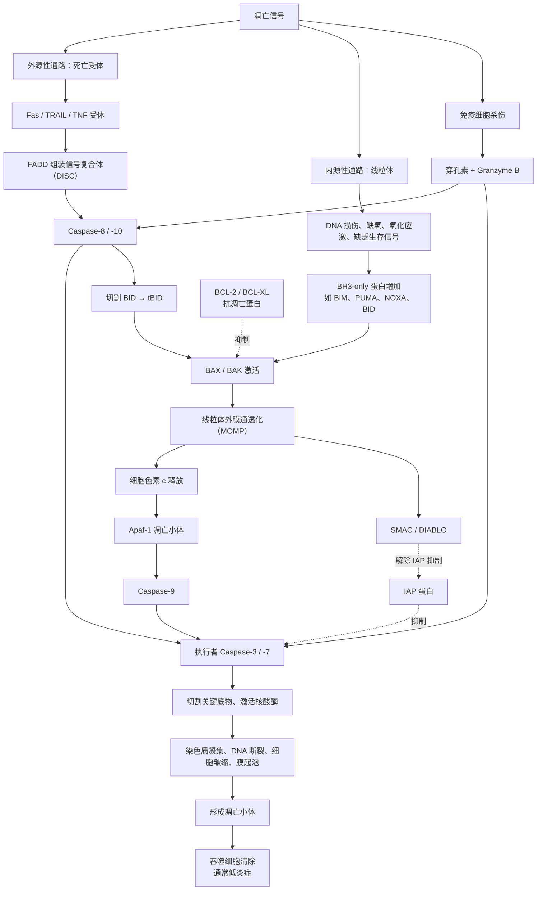

核心问题：

1、武田何时行权，大概率要Polaris-2数据读出。虽然 Polaris-2 的正式 III 期数据还没出来，但亚盛在 **2026 ASCO 年会上公布了耐立克二线治疗 CML-CP 的临床数据**，24 周 CCyR 率高达 **91.3%**，并做了口头报告，反响积极。这可以看作是 Polaris-2 的风向标。Polaris-2 正式 III 期数据预计 **2027 年上半年** 读出（入组 2026 年完成 + 6 个月随访）

# 亚盛医药（Ascentage Pharma）深度研究报告

亚盛医药（Ascentage Pharma）是一家专注于细胞凋亡通路的全球化创新药企，2025年1月成为首家"先港股、后美股"双重上市的中国生物科技公司，并于2026年6月正式移除港股"B"标记，标志其从研发型Biotech向商业化Biopharma的转型获得市场认可。公司由杨大俊、王少萌、郭明三位海归科学家于2009年创立，拥有全球唯一覆盖Bcl-2、IAP、MDM2-p53三条细胞凋亡通路的临床产品管线，累计478项全球授权专利（342项海外）。

亚盛医药的竞争定位不能仅从单一产品维度理解。公司是全球唯一一家同时拥有Bcl-2、IAP、MDM2-p53三条细胞凋亡通路临床产品的创新药企，这一独特定位的战略价值在于联合用药的"内部协同"潜力[^44]。APG-2575（Bcl-2）联合APG-115（MDM2-p53）在儿童实体瘤中已展现ORR 30%、DCR 80%的数据，且该组合入选ASCO 2026口头报告[^45]。艾伯维仅有Venetoclax（Bcl-2），百济仅有Sonrotoclax（Bcl-2），均缺乏MDM2-p53和IAP资产——这是竞争对手无法复制的组合。

然而，这一平台优势在短期内难以转化为商业收入。APG-115和APG-1387距离商业化尚有数年。

**双核心产品驱动增长**：耐立克®（奥雷巴替尼）是中国首个且唯一获批的第三代BCR-ABL抑制剂，2025年中国销售4.35亿元（同比+81%），所有适应症已纳入国家医保目录；利生妥®（利沙托克拉/APG-2575）是中国首个获批的国产原创Bcl-2选择性抑制剂，2025年7月获批上市后5个月实现销售7,058万元。九项全球注册III期临床试验同步推进，其中四项已获FDA/EMA批准。

**财务与估值**：2025年营收5.74亿元（同比-41.5%，因2024年一次性BD收入退坡），净亏损12.43亿元，但产品销售收入同比增长90%，现金储备约24.7亿元可支撑至2027年底。多家投行给予买入评级，近90天目标均价83.1港元，较当前股价（约34.8港元）存在138%潜在上行空间。

**核心风险与机遇**：武田制药13亿美元全球合作（未行权）创造了独特的估值不对称性——行权时点与帕纳替尼专利悬崖（2027年）直接挂钩；**利生妥的4-6天快速剂量递增不仅是安全性优势，更可能重构Bcl-2抑制剂的可及性经济学；但公司在BTK+Bcl-2联合疗法时代缺乏自有BTK产品，构成结构性战略短板。**

---

# 1. 公司概况与发展历程

根据2018年8月签署的一致行动确认契据，杨大俊、郭明、王少萌及首席医学官翟一帆通过各自特殊目的公司（SPV）形成一致行动人，合计持有约17.42%股权（超额配售后）[^7]。这一股权结构在公司经历多轮稀释后仍保持相对集中，为战略决策的连贯性提供了治理保障。值得注意的是，三位创始人的学术背景均集中于化学与肿瘤学交叉领域，而非传统的商业或金融背景，这在一定程度上解释了亚盛医药在商业化早期阶段的相对谨慎风格——公司直至2019年港股上市才正式启动大规模资本化运作，距成立已有十年。

### 1.1.2 自主PPI靶向药物设计平台：全球唯一的细胞凋亡全通路覆盖

亚盛医药的核心技术竞争力建立在自主构建的蛋白-蛋白相互作用（Protein-Protein Interaction, PPI）靶向药物设计平台之上。PPI靶点曾长期被视为"不可成药"领域，全球唯一获批的PPI靶点抗肿瘤药物是艾伯维的Venetoclax（维奈克拉），（百济神州索托克拉也是PPI白蛋成药） 其销售峰值预计超过50亿美元[^8]。亚盛医药是全球唯一一家同时针对**Bcl-2、IAP（凋亡抑制蛋白）和MDM2-p53**三条关键细胞凋亡通路均有临床开发阶段品种的企业[^8]。**这一"全通路覆盖"定位并非简单的管线多样化策略，而是具有明确的联合用药协同逻辑：APG-2575（Bcl-2抑制剂）与APG-115（MDM2-p53抑制剂）的联合方案已在儿童实体瘤中展现出客观缓解率（ORR）30%、疾病控制率（DCR）80%的初步数据，而竞争对手如艾伯维（仅拥有Bcl-2）和百济神州（仅拥有Bcl-2）均缺乏MDM2-p53和IAP资产，无法复制这一内部组合**[^9]。

从科学机理看，**Bcl-2通路调控线粒体外膜通透性，IAP家族蛋白（如cIAP1/2、XIAP）通过抑制Caspase活性阻断凋亡执行，MDM2-p53通路则通过泛素化降解p53肿瘤抑制蛋白维持细胞存活。三条通路在功能上相互独立但在肿瘤微环境中协同作用，同时抑制多条通路可产生协同抗肿瘤效应**。

### 1.1.3 专利布局：478项全球授权专利构建竞争护城河

截至2025年6月30日，亚盛医药在全球范围内累计拥有478项授权专利，其中342项在海外授权，覆盖中国、美国、欧洲、日本等主要医药市场[^10]。这一专利规模在中国创新药企业中处于第一梯队。核心化合物专利的到期年份从2031年至2037年不等，为公司在关键市场的独占性销售提供了至少5至10年的法律保障[^10]。以耐立克（奥雷巴替尼，Olverembatinib）为例，其核心化合物专利在中国到期时间为2035年，在美国为2036年，这意味着即便在2030年代初期面临仿制药竞争，公司仍有足够时间通过适应症扩展和联合用药方案延长产品生命周期。从商业策略角度看，这一专利梯队的深度使得亚盛在对外授权谈判中拥有更强的议价能力——武田制药2024年6月签署耐立克独家选择权协议时，专利到期时间表是评估交易价值的关键参数之一。

| 里程碑           | 时间           | 事件                                                 | 累计融资/估值                            | 关键意义                                                     |
| :--------------- | :------------- | :--------------------------------------------------- | :--------------------------------------- | :----------------------------------------------------------- |
| 亚生医药成立     | 2003年         | 杨大俊、王少萌、郭明在美国创立Ascenta Therapeutics   | 首轮融资500万美元                        | 细胞凋亡通路药物研发的起点                                   |
| 亚生医药关闭     | 2008年         | 金融危机冲击，AT-101临床II期数据不及预期             | 累计融资约9,000万美元                    | 两项原创新靶点药物以近7亿美元授权给赛诺菲和瑞士德彪[^2]      |
| 天使轮融资       | 2010年2月      | 三生制药投资300万美元                                | 约300万美元                              | 中国创新药领域早期罕见投资，占发行后股本约40%                |
| A轮融资          | 2015年8月      | 元禾原点、元明资本领投                               | 9,600万元人民币                          | 中国创新药投资热潮兴起，亚盛获得机构背书                     |
| B轮融资          | 2016年12月     | 国投创新（先进制造产业投资基金）领投                 | 5亿元人民币                              | 国家级产业基金入场，标志公司进入"国家队"视野                 |
| C轮融资          | 2018年7月      | 元明方圆基金领投                                     | 约10亿元人民币                           | 为港股IPO奠定资本基础                                        |
| 港股IPO          | 2019年10月28日 | 港交所主板上市，代码06855.HK                         | 募资净额约3.12亿港元                     | 成为港股生物科技板块改革后首个"原创小分子新药"企业；获超额认购约751倍[^11] |
| 信达生物战略合作 | 2021年7月      | 耐立克中国共同开发及商业化；信达认购5,000万美元      | 战略投资5,000万美元                      | 引入中国头部Biotech商业化能力                                |
| 武田战略入股     | 2024年6月      | 武田以7,500万美元认购新股，成为第二大股东（约7.73%） | 7,500万美元股权 + 1亿美元选择权付款      | 跨国大型药企首次战略投资中国18A企业，标志全球认可            |
| 纳斯达克IPO      | 2025年1月24日  | 纳斯达克挂牌上市，代码AAPG                           | 募资净额约1.26亿美元（约9.67亿元人民币） | 首家"先港股、后美股"双重上市的中国Biotech；2025年美股首家生物医药IPO[^12] |
| 港股"摘B"        | 2026年6月1日   | 正式移除港股股票代码"B"标记                          | 市值约149.6亿港元                        | 满足港交所收益测试（市值≥40亿港元+收益≥5亿港元），商业化能力获正式验证[^1] |

亚盛医药的融资历程清晰呈现了中国创新药产业从资本寒冬到热潮再到理性回归的完整周期。2010年天使轮融资时，三生制药以300万美元获得约40%股权，当时中国创新药投资环境远未成熟，这一估值在今天看来极为低廉，但反映了早期创新药企面临的资金困境。2015年至2018年的A、B、C三轮融资恰逢中国创新药投资热潮，累计融资超过15亿元人民币，为公司推进多个候选药物进入临床提供了资金支撑。值得注意的是，2019年港股IPO的募资净额仅约3.12亿港元，发行比例仅约5.88%，是港股生物科技板块改革以来发行规模最小的B类股（18A）[^11]。这一"微型IPO"策略使得创始团队和早期投资者未被过度稀释，同时也意味着公司上市后仍需持续依赖后续配售和战略合作补充资金。事实印证了这一点：2019年上市后至2025年，亚盛通过四次配售、武田股权投资和纳斯达克IPO累计融资超过50亿港元，资本运作频率远高于同期上市的其他18A企业。

## 1.2 融资与上市历程

### 1.2.1 从亚生医药到亚盛医药：穿越周期的创业韧性

亚盛医药的故事并非始于2009年，而是可以追溯至2003年亚生医药的创立。亚生医药由杨大俊团队基于乔治城大学发现的AT-101（Bcl-2抑制剂）在美国成立，2005年在上海张江设立中国研发中心，2007年被Fierce Biotech评为"15家最具成长性生物技术公司"之一，累计融资约9,000万美元[^2]。然而，2008年全球金融危机彻底改变了这一 trajectory。在金融危机冲击下，亚生医药的两项原创新靶点抗肿瘤药物——MDM2-p53靶点药物以3.98亿美元授权给赛诺菲，另一项授权给瑞士德彪，合计近7亿美元——虽然创造了当时华尔街的轰动，但公司本身因AT-101临床II期数据不及预期而被迫停止运营[^2]。

这一经历对创始团队产生了深远影响。杨大俊、王少萌、郭明三人选择自掏腰包将上海研发中心接手下来，于2009年在此基础上重新成立亚盛医药[^2]。这一决策的本质是在资源极度匮乏的条件下保留了一个"火种"——一个拥有化合物库、研发经验和化学合成能力的团队。2009年至2015年的六年期间，亚盛医药几乎处于"静默"状态，直到2015年A轮融资才重新获得机构资本关注。这一长达六年的"资本真空期"在中国创新药创业史上极为罕见，它既考验了创始团队的财务承受能力，也筛选出了真正愿意陪伴长期主义的投资者。三生制药作为天使轮投资人，在后续多轮融资中持续支持，其董事长娄竞与杨大俊的私人信任关系在这一过程中发挥了关键作用[^2]。

### 1.2.2 双重上市：从港股18A到纳斯达克的战略升级

2019年10月28日，亚盛医药在香港联交所主板挂牌上市，股票代码06855.HK，成为港股生物科技板块改革以来首个"原创小分子新药"企业[^11]。IPO获超额认购约751倍，成为2019年港股"超购王"，基石投资者为中国生物制药（1177.HK），认购约1.56亿港元，占发行规模约38%[^11]。然而，发行规模仅约3.92至4.16亿港元，预期市值66.67至70.82亿港元，是港股18A板块历史上发行规模最小的IPO之一[^11]。这一"小而美"的上市策略使得公司成功进入公开市场，但并未一次性解决长期资金需求，后续通过多次配售和BD交易持续补充弹药。

2025年1月24日，亚盛医药在美国纳斯达克证券交易所正式挂牌上市，股票代码"AAPG"，发行732.5万股ADS，发行价17.25美元/ADS，募资净额约1.26亿美元（约9.67亿元人民币）[^12]。亚盛医药由此成为首家"先港股、后美股"双重上市的中国生物科技公司，也是2025年美股第一家上市的生物医药企业[^12]。这一定位具有重要的战略意义：港股上市为公司提供了人民币计价的融资平台和亚洲机构投资者的覆盖，而纳斯达克上市则打开了美元融资通道、提升了全球品牌知名度，并为潜在的武田行权后全球商业化提供了资本运作平台。2025年2月，超额配股权交割完成，额外发行94万股ADS，筹集约1,613万美元，总股本从约3.45亿股增加至约3.48亿股[^13]。

### 1.2.3 武田战略入股：跨国药企验证与选择权结构

2024年6月，武田制药以7,500万美元认购亚盛医药新发行的港股股票，成为亚盛医药第二大股东，持股比例约7.73%（后因增发稀释至约6.51%）[^14]。同时，双方就耐立克（奥雷巴替尼）签署总额最高约13亿美元的独家选择权协议，其中1亿美元选择权付款已到账，武田有权获得耐立克在全球（除中国外）的独家开发和商业化权利，亚盛保留中国权益及全球一定比例的销售分成[^14]。这一交易是截至当时中国小分子抗肿瘤药物史上最大的BD交易，其结构并非直接收购，而是"股权投资+选择权"的组合，为双方保留了战略灵活性：武田可以在观察耐立克的海外临床数据后决定是否行使选择权，而亚盛则通过股权绑定将武田利益与公司长期价值对齐。从武田角度看，这一投资与其自有产品帕纳替尼（Ponatinib）的专利悬崖（2027年到期）直接相关——奥雷巴替尼作为第三代BCR-ABL抑制剂，具有更低的动脉闭塞事件发生率（约7% vs 帕纳替尼的31%），是帕纳替尼专利到期后的潜在替代产品[^15]。因此，武田的持股不仅是财务投资，更是一个具有"时间窗口期权"特征的战略布局。

## 1.3 公司治理与战略定位

### 1.3.1 董事会与科学顾问网络：学术治理的优劣势

亚盛医药董事会由9名董事组成，包括1名执行董事（杨大俊）、2名非执行董事（王少萌、Simon Dazhong Lu）和6名独立非执行董事（任伟、叶常青、David Sidransky、Marina Bozilenko、Debra Yu、Marc Lippman）[^16]。9名董事中6人拥有博士学位，学术密度在中国上市药企中位居前列。这一结构的优势在于科学决策的专业性——面对复杂的临床开发策略和靶点选择，董事会能够基于科学证据而非单纯的商业逻辑做出判断。然而，潜在的风险在于学术治理可能过于保守，在需要快速商业化扩张或激进资本运作时缺乏足够的商业决策经验。

公司临床顾问委员会（Clinical Advisory Board, CAB）由ASCO前首席执行官Allen S. Lichter博士担任主席，成员包括肺癌研究领域权威Paul A. Bunn Jr.博士、肿瘤免疫学专家Jedd Wolchok博士、密西根大学Arul Chinnaiyan博士、MD Anderson癌症中心Hagop Kantarjian博士等国际顶级肿瘤学专家[^17]。这一科学顾问网络的价值不仅在于为临床开发提供指导意见，更在于为亚盛的候选药物在全球学术界的背书和KOL（关键意见领袖）网络建设。Kantarjian博士在慢性髓性白血病（CML）领域的权威地位对耐立克的全球推广尤为重要，而Wolchok博士在肿瘤免疫学领域的影响力则为APG-115与免疫检查点抑制剂的联合用药提供了学术基础。

### 1.3.2 "摘B"里程碑：商业化验证与估值重估的分水岭

2026年6月1日，亚盛医药正式从港股股票代码中移除"B"标记，成为又一家成功"摘B"的18A生物科技公司[^1]。根据港交所上市规则第8.05(3)条，公司需满足市值不低于40亿港元且最近一个财政年度收益不低于5亿港元的测试。截至2026年5月，亚盛医药市值约149.6亿港元，远超40亿港元门槛；2025年度收入达5.74亿元人民币（约6.2亿港元），高于5亿港元要求[^1]。"摘B"的技术意义在于亚盛医药此后可纳入更多港股通指数和被动基金，扩大机构投资者覆盖范围；而象征意义更为深远——它标志着港交所正式认可亚盛医药已从"研发驱动、尚未盈利"的Biotech转型为"具备可持续商业化能力"的Biopharma。

从战略定位看，亚盛医药自成立之初即坚持"全球创新"（in China for global）定位，拒绝仿制药捷径，专注于细胞凋亡通路中PPI的小分子靶向药物[^18]。这一战略定力在2010年代初期中国创新药环境不成熟、资金极度困难的时期经历了严峻考验。然而，正是这种长期主义使得亚盛在2021年（耐立克获批）和2025年（利生妥获批）迎来商业化收获期。2024年，公司实现收入9.81亿元人民币，同比增长342%，首次实现半年度盈利（上半年净利润1.63亿元），其中耐立克销售收入2.41亿元，武田1亿美元选择权付款贡献显著[^19]。2025年营收回落至5.74亿元，但产品收入占比从2024年的30.9%上升至87.0%，收入结构从"BD脉冲驱动"转向"产品销售驱动"，标志着财务结构的正常化[^19]。

亚盛医药的全球化战略正在从"License-Out"向"自主出海"演进。耐立克通过武田合作以授权模式出海，但利生妥由亚盛自主推进全球临床，在美国Rockville设立总部、与MD Anderson癌症中心建立长期合作、聘请Elias Jabbour博士担任全球临床PI[^20]。九项注册性III期临床试验中，四项已获得FDA和EMA批准[^20]。若利生妥能在美国成功上市，亚盛将成为中国少数拥有自主海外商业化能力的Biopharma。这一"双轨并行"的国际化路径，反映了中国创新药企从依赖跨国药企到自建全球能力的战略升级，而亚盛医药正处于这一转型的最前沿。

---

---

## 4. 商业化能力与竞争格局

### 4.1 商业化能力评估

#### 4.1.1 团队规模：从精兵简政到双引擎扩张

亚盛医药商业化团队经历了极具戏剧性的扩张轨迹。2024年，在行业普遍收缩的背景下，公司主动将商业化团队精简14%至90余人，却实现了准入医院数量同比增长86%的运营效率提升——耐立克®销售收入在团队收缩的情况下仍增长52%至2.41亿元[^1]。随着利生妥®于2025年7月获批上市，商业化战略迅速转向"双引擎驱动"的规模化扩张。截至2025年底，团队规模扩张至270人，接近300人，且80%的成员具备血液肿瘤领域相关背景[^3]。

从人员结构看，这一扩张速度在中国创新药企业中处于领先水平。根据管理层指引，公司计划2026年将商业化团队扩充至400人，这一规模将超过百济神州当前国内血液肿瘤团队人数[^4]。团队负责人司志超博士曾主导伊布替尼和奥布替尼在中国的成功上市，具备丰富的BTK抑制剂商业化经验[^5]。从90人到400人的两年扩张计划，意味着亚盛正在从"Biotech式"的精益销售模式向"Biopharma式"的全覆盖模式转型。这一转型的必要性源于血液肿瘤市场的集中度特征——中国80%的血液肿瘤患者集中于头部300家医院，但利生妥®所覆盖的CLL/SLL患者群体较CML更为分散，需要更广泛的医院渗透[^6]。

#### 4.1.2 销售网络：耐立克与利生妥的双轨覆盖

截至2025年12月31日，耐立克®在全国准入的医院和DTP药房共达到825家，较2024年底的734家增长12.4%；其中准入医院数量由260家增至355家，同比增长约36.5%[^7]。这一增长是在2024年已高基数基础上的持续渗透——2024年底准入医院数量较2023年底已增长86%[^8]。值得关注的是，耐立克®的销售网络扩张与医保准入节奏高度同步：2023年1月首次纳入医保后，销售盒数同比增长259%，准入医院数量同比增长567%[^9]；2025年1月所有已获批适应症全部纳入医保后，患者可及性进一步提升，管理层预计新增患者将达4至5倍[^10]。

利生妥®展现了更为迅猛的准入速度。作为2025年7月获批的中国首个国产原创Bcl-2抑制剂，利生妥®在上市后五个月内即实现全国DTP药房和准入医院328家，覆盖医院超过1,300家[^11]。首批处方于7月25日在30多个城市的40余家医院快速落地[^12]。这一速度部分得益于亚盛与国药控股、上药控股、华润天津等医药流通龙头企业签署的全国性分销合作协议[^13]，以及公司在37个省级或地市将利生妥®纳入惠民保、百万医疗等特殊药品目录的准入努力[^14]。两款产品合计覆盖全国超1,500家医院及800间药房，形成了血液肿瘤领域的协同渠道网络[^15]。

#### 4.1.3 销售费用效率：高增长投入与结构优化并行

2025年，亚盛医药销售和分销开支达3.54亿元，同比增长80.4%[^16]。这一增幅主要源于利生妥®上市首年的商业化启动费用和耐立克®适应症扩展后的推广投入。从费用率角度看，2025年销售费用率高达61.7%[^17]，在创新药企中处于较高水平。然而，需要结构性分析这一数字：2024年销售费用1.96亿元几乎与2023年持平（+0.3%），而2025年的激增是"第二产品上市"的必然投入——参照百济神州、信达生物等企业的历史轨迹，第二产品上市首年的销售费用率通常会出现阶段性跳升，随后随着收入规模扩大而逐年下降[^18]。

从人效指标观察，亚盛医药的运营效率正在改善。2024年商业化团队人效由2023年的164万元提升至241万元，增幅47%，仅次于百济神州[^19]。2025年上半年销售费用1.38亿元，同比增长53.7%，而同期耐立克®销售收入增长93%至2.17亿元，费用增速显著低于收入增速，表明耐立克®的销售费用率已呈下降趋势[^20]。这一结构性改善是公司从"高投入低产出"的第四象限向可持续盈利路径迁移的关键信号。

## 预期观察指标

投资者在2026–2027年应重点跟踪以下四个指标，其兑现顺序将决定亚盛估值的演进路径。

第一，2026年下半年利生妥®国家医保谈判结果。若成功纳入，参照历史经验，创新药纳入医保后的次年销售增速通常在100%–200%，2027年利生妥®销售有望从年化1.7亿元跃升至4–5亿元[^1][^15]。谈判失败的后果则是销售爬坡显著放缓，基层市场渗透受阻。

第二，GLORA-4（HR-MDS一线）入组进度与中期数据。该试验是全球首个针对HR-MDS一线治疗的Bcl-2抑制剂注册研究，若入组进度符合预期且中期数据积极，将为2027年NDA提交和全球获批奠定核心证据基础[^3][^24]。

第三，武田行权信号。先行指标包括：武田是否实质参与POLARIS-2的临床方案设计或患者入组；武田季度财报中对帕纳替尼专利悬崖的指引措辞；以及仿制药ANDA申报动态[^4][^7]。若武田在2026年下半年开始承担部分海外临床费用，可能预示行权决策正在临近。

第四，三项NDA（POLARIS-1、POLARIS-2、GLORA-4）的提交节奏。2027年同步提交三项NDA是管理层明确指引，若任一试验因数据锁库延迟或监管沟通问题导致提交时点后移，将直接影响海外商业化时间表和BD谈判筹码[^2][^24]。

综合评估，亚盛医药正处于从"研发型Biotech"向"全球化Biopharma"转型的关键窗口期。短期风险（竞争加剧、地缘政治、现金消耗）与长期价值（双产品全球化、武田期权、平台稀缺性）之间的博弈，将在2026–2027年集中决出胜负。当前股价已处于悲观情景底部，对于能够承受创新药高波动性的长期投资者而言，风险收益比具有结构性吸引力。

## 5.1 财务表现分析

### 5.1.1 2022–2025年营收趋势：从BD脉冲到产品驱动

亚盛医药2022–2025年的营业收入呈现一条典型的创新药企商业化曲线：低基数起步、BD授权脉冲放大、随后回落至产品驱动。2022年总收益2.10亿元，为耐立克®上市首个完整年度，产品销售收入1.75亿元[^1]。2023年营收2.22亿元，同比仅增5.9%，增长乏力的核心在于耐立克®彼时仅覆盖一二代TKI耐药CML-CP一个适应症，且尚未纳入国家医保目录，市场渗透受限[^2]。2024年营收骤增至9.81亿元，同比增幅达342%，但这一脉冲并非源于产品放量，而是来自武田1亿美元选择权付款所确认的6.78亿元知识产权收入，占当年营收69.1%[^3]。2025年营收回落至5.74亿元，同比下降41.5%，但产品销售收入同比增长90%，达到5.06亿元，占营收比重升至87.0%[^1]。这一"总量回调、结构改善"的特征，标志着亚盛医药的收入基础正从BD依赖型向产品驱动型切换。

从耐立克®单品的销售轨迹可以更清晰地观察商业化爬坡的加速度。2022年全年约1.82亿元，2023年约2.18亿元，2024年2.41亿元（+52%），2025年4.35亿元（+81%）[^3][^1]。2025年增速跃升的关键在于，耐立克®全部获批适应症自2025年1月起纳入国家医保目录，全国准入医院和DTP药房达825家，较2024年底增长12.4%[^1]。利生妥®（APG-2575）于2025年7月获批，上市五个月即实现销售收入7,058万元，年化约1.7亿元，超出多数券商对其上市首年的预期[^1]。双产品引擎的初步成型，使2025年产品收入的内生增速达到90%，远高于2024年的37%（2.61亿元 vs 1.94亿元），表明商业化能力正在跨越从0到1的临界点。

上图直观呈现了2024年BD收入脉冲对营收结构的扭曲效应。2024年产品销售收入仅2.61亿元，占比26.6%，而武田选择权付款高达6.78亿元；2025年授权收入退坡后，产品销售收入5.06亿元成为绝对支柱。若剔除BD收入的非经常性扰动，2022–2025年产品收入的复合年增长率（CAGR）约为43%，这一增速在国产创新药单品中处于中上水平，但距离支撑公司整体盈利仍有显著差距。

### 5.1.2 亏损结构分析：2025年亏12.43亿元的真实原因

2025年亚盛医药净亏损12.43亿元，较2024年的4.06亿元扩大206%，表面看是财务恶化，实则是结构正常化。2024年的"减亏"并非经营效率改善的结果，而是武田6.78亿元一次性BD收入直接冲抵了运营亏损。若剔除该非经常性收入，2024年真实运营亏损约为10.8亿元，与2025年的12.43亿元处于同一量级[^3][^1]。换言之，2024–2025年的亏损扩大并非经营基本面恶化，而是收入确认的会计波动。

进一步拆解亏损构成，2025年研发费用11.37亿元（+20.1%）、销售费用3.54亿元（+80.4%）、行政费用2.46亿元（+31.6%），三项费用合计17.37亿元，较2024年的13.30亿元增加30.6%[^1]。费用增长的核心驱动力有三：其一，九项注册III期临床在全球范围内同步推进，其中四项已获FDA/EMA许可，临床烧钱强度显著高于2024年；其二，利生妥®上市首年需自建商业化团队，亚盛从信达合作的"轻资产"模式切换为自营推广，销售费用率从2024年的20.0%飙升至61.7%；其三，美股上市后的合规成本、团队扩张及收购广州顺健产生的或有对价公允价值损失0.74亿元，推高了其他开支[^1][^11]。

从效率指标看，2025年"产品收入/研发费用"比值为0.45（5.06/11.37），较2024年的0.28（2.61/9.47）显著改善。这意味着每单位研发投入所支撑的产品收入正在提升，虽然绝对水平仍远低于1，但趋势向好。参照百济神州、诺诚健华的历史路径，该比值突破1.0通常对应商业化拐点的到来，亚盛目前仍处于追赶期[^12]。

### 5.1.3 费用端：研发投入、销售费用与行政费用

下表汇总了2022–2025年亚盛医药三大费用科目的演变。研发费用的持续攀升是创新药企的常态，但销售费用的激增反映了商业模式的切换——从依赖信达合作的轻推广模式，转向自建团队的重投入模式。

| 费用项目              | 2022年 | 2023年 | 2024年 | 2025年 | 2024→2025变动 |
| :-------------------- | -----: | -----: | -----: | -----: | :------------ |
| 研发费用（亿元）      |   7.43 |   7.07 |   9.47 |  11.37 | +20.1%        |
| 销售费用（亿元）      |   1.57 |   1.95 |   1.96 |   3.54 | +80.4%        |
| 行政/管理费用（亿元） |   1.71 |   1.81 |   1.87 |   2.46 | +31.6%        |
| 费用合计（亿元）      |  10.71 |  10.83 |  13.30 |  17.37 | +30.6%        |
| 研发费用率            |   354% |   318% |    96% |   198% | —             |
| 销售费用率            |    75% |    88% |    20% |    62% | —             |

*数据来源：亚盛医药2022–2025年年报及业绩公告[^1][^2][^3]*

研发费用11.37亿元是2025年最大的现金消耗项，其投向具有高度结构化特征：全球注册III期临床占据最大份额，尤其是POLARIS-2（CML-CP一线）、GLORA-2（CLL/SLL一线）、GLORA-4（HR-MDS一线）等关键试验的海外入组费用显著高于国内。销售费用3.54亿元中，利生妥®上市首年的医学推广、学术会议、团队组建占据主要部分。亚盛商业化团队从2024年的约200人扩充至2025年的约300人，计划2026年进一步扩充至400人，这一节奏与利生妥®的医保谈判和医院准入时间表直接挂钩[^1][^11]。

参照可比公司的历史经验，销售费用率在创新药上市首年通常达到50%–80%，随后逐年下降。百济神州泽布替尼上市初期销售费用率亦曾超过60%，但2025年已降至27.7%[^9]。诺诚健华奥布替尼2020年上市首年销售费用率约为70%，2025年已降至24.4%[^10]。据此推断，若利生妥®2026年纳入医保并实现医院放量，亚盛销售费用率有望在2027年回落至40%以下。

### 5.1.4 现金流与资金状况：经营现金流-11.74亿，现金储备24.7亿元

2025年经营活动现金流净额为-11.74亿元，投资活动现金流净额为-10.00亿元，筹资活动现金流净额为+25.40亿元[^1]。经营现金流与净亏损（12.43亿元）基本匹配，表明利润表与现金流量表之间的非现金差异较小，盈利质量尚可。投资现金流出主要用于全球临床投入和产业化基地建设，2025年亚盛全球产业基地通过欧盟QP审计，为后续海外商业化奠定了GMP基础[^13]。

截至2025年末，现金及银行存款约24.70亿元，较2024年末的12.61亿元接近翻倍。现金增长的两大来源分别为2025年1月美股IPO净收益约9.67亿元人民币（1.264亿美元）和2025年7月港股配售净收益约13.7亿元人民币（14.93亿港元）[^9][^10]。剔除两次融资后，经营层面年度现金消耗约11.74亿元。管理层明确指引，现有资金"足以支撑公司在2027年年底前的运营开支及资本支出需求"[^14]。

从资产负债表视角看，2025年末总资产39.64亿元，总负债19.80亿元，资产负债率约49.9%，净借贷已降至零[^1]。这一指标较2023年末的97.2%实现显著改善，主要得益于美股IPO和配售所带来的股东权益增厚。2025年两次融资使总股本从3.152亿股增至3.733亿股，稀释约18.4%[^11]。若未来维持当前费用水平且无新增融资，runway约为1.1–1.3年；但考虑利生妥销售爬坡、潜在BD收入及费用优化，实际runway可延至2027年底。

## 7.2 跨维度战略洞察

#### 7.2.3 细胞凋亡"全通路覆盖"的平台价值：APG-115+APG-2575联合疗法竞争对手无法复制

亚盛是全球唯一同时拥有Bcl-2、IAP、MDM2-p53三条细胞凋亡通路临床产品的公司。APG-115（MDM2-p53抑制剂）联合APG-2575在儿童实体瘤中已展现ORR 30%、DCR 80%的数据，并于ASCO 2026获口头报告[^19]。这一组合的战略价值在于竞争对手无法复制：艾伯维仅有Venetoclax（Bcl-2），百济仅有Sonrotoclax（Bcl-2），均缺乏MDM2-p53和IAP资产[^19][^20]。肿瘤联合治疗的长期趋势是"内部协同优于外部合作"——百济通过"泽布替尼+Sonrotoclax"建立了BTK+Bcl-2闭环，亚盛则通过"Bcl-2+MDM2-p53+IAP"建立了细胞凋亡领域的内部闭环。若未来2–3年内读出APG-115+APG-2575联合治疗实体瘤的注册性数据，亚盛的平台价值将被市场重新定价[^19]。

## 参考文献

[^1]: 美通社. 亚盛医药获香港联交所批准移除B标记. 2026-05-28. https://www.prnasia.com/story/534785-1.shtml

[^2]: 药时代DrugTimes. 亚盛医药的故事：从亚生到亚盛. 2019-10-28. https://www.drugtimes.cn/2019/10/28/a2b9477914/

[^3]: 中山大学中山医学院. 校友动态：杨大俊. 2025-03-04. https://zssom.sysu.edu.cn/article/11161

[^4]: 亚盛医药官网. 高管团队与董事会. 2025. https://www.ascentage.cn/company/leadership-team/

[^5]: 亚盛医药IR. 董事会成员：王少萌. 2025. https://ir.ascentage.com/board-member/shaomeng-wang

[^6]: 东吴证券. 亚盛医药深度研报. 2021-01-21. https://pdf.dfcfw.com/pdf/H3_AP202101211453017058_1.pdf

[^7]: SEC. 亚盛医药F-1招股书：一致行动协议. 2025-01. https://www.sec.gov/Archives/edgar/data/2023311/000110465924132177/tm2415654d13_ex10-1.htm

[^9]: 亚盛医药. ASCO 2026口头报告：APG-115联合APG-2575儿童实体瘤数据. 2026. https://ascentage.com/

[^10]: 亚盛医药. 2024年ESG报告/中期业绩报告. 2025-04-16. https://www1.hkexnews.hk/listedco/listconews/sehk/2025/0416/2025041601768_c.pdf

[^11]: 36氪. 亚盛医药港股IPO获超额认购751倍. 2019-10-27. https://m.36kr.com/p/1724585852929

[^12]: 36氪. 亚盛医药纳斯达克上市：首家先港股后美股双重上市的中国Biotech. 2025-01-26. https://36kr.com/p/3138193266793217

[^13]: 新浪财经. 亚盛医药超额配股权交割完成. 2025-02-14. https://finance.sina.com.cn/stock/relnews/us/2025-02-14/doc-inekmcmn7631136.shtml

[^14]: 武田制药. 与亚盛医药选择权协议公告. 2024-06-17. https://www.takeda.com.cn/zh-cn/newsroom/2024/announcing-ascentage-agreemen/

[^15]: 医药魔方. 13亿美元授权出海：亚盛医药与武田合作分析. 2024-06-21. https://bydrug.pharmcube.com/news/detail/fc1d868dca26d3da87896531a563316e

[^16]: 亚盛医药IR. 董事会构成. 2025. https://ir.ascentage.com/governance/board-of-directors

[^17]: 亚盛医药. 临床顾问委员会成立. 2018-01-03. https://www.ascentage.cn/news-detail/亚盛医药宣布成立临床顾问委员会/

[^19]: 亚盛医药. 2024年业绩公告：迈入全球创新新阶段. 2025-03-27. https://www.ascentage.cn/news-detail/亚盛医药公布2024年业绩：迈入全球创新新阶段/

[^20]: 亚盛医药. 全球合作与临床管线. 2025. https://www.ascentage.cn/partnering/

[^1]: Medscape Chronic Myeloid Leukemia Overview. https://emedicine.medscape.com/article/199425-overview

[^2]: Olverembatinib for the treatment of chronic myeloid leukemia in chronic phase. AOB, 2024-07-06. https://aob.amegroups.org/article/view/9513/html

[^3]: ClinicalTrials.gov PACE Trial Protocol. https://cdn.clinicaltrials.gov/large-docs/26/NCT03589326/Prot_000.pdf

[^4]: BenchChem Olverembatinib Comprehensive Target Profile. 2025. https://www.benchchem.com/pdf/Olverembatinib_HQP1351_A_Comprehensive_Target_Profile.pdf

[^5]: CML Advocates Network - Olverembatinib Presentation. https://www.cmladvocates.net/wp-content/uploads/2025/06/SAT10_Med-1_1_D-Milojkovic_-New-Drugs-and-Emerging-Therapies-for-CML-D-Milojkovic-1.pdf

[^6]: Olverembatinib in chronic myeloid leukemia—review of historical development. JAMA Oncology, 2025. https://pmc.ncbi.nlm.nih.gov/articles/PMC12532375/

[^7]: 亚盛医药2025 ASH新闻稿：耐立克注册II期研究4年随访数据. 2025-12-09. https://www.ascentage.cn/news-detail/3299-2/

[^8]: Ascentage Corporate Presentation. 2026. https://ir.ascentage.com/system/files-encrypted/nasdaq_kms/assets/2026/02/10/4-25-44/Ascentage%20Corporate%20Presentation_EN_v0204.pdf

[^9]: Jabbour E, et al. Olverembatinib After Failure of Tyrosine Kinase Inhibitors, Including Ponatinib or Asciminib. JAMA Oncol. 2025;11(1):28-35. https://jamanetwork.com/journals/jamaoncology/fullarticle/2826668

[^10]: Ponatinib and other CML Tyrosine Kinase Inhibitors in Cardiovascular Disease. PMC, 2020-07-01. https://pmc.ncbi.nlm.nih.gov/articles/PMC7555546/

[^11]: ASH 2025 Olverembatinib Second-Line CML-CP Data. Ascentage Pharma, 2025-12-08. https://www.ascentage.com/ash-2025-updated-data-for-ascentage-pharma-s-olverembatinib-in-second-line-cml-cp-showing-encouraging-potential-for-early-line-treatment/

[^12]: Takeda Signs Option Agreement with Ascentage Pharma. Takeda Press Release, 2024-06-14. https://www.takeda.com/newsroom/newsreleases/2024/takeda-signs-option-agreement-with-ascentage-pharma-to-enter-into-exclusive-global-license-for-olverembatinib/

[^13]: FDA and EMA Clear Phase 3 POLARIS-1 Trial in Newly Diagnosed Ph+ ALL. Cancer Network, 2025-12-05. https://www.cancernetwork.com/view/fda-and-ema-clear-phase-3-polaris-1-trial-in-newly-diagnosed-ph-all

[^14]: 亚盛医药公告 / 浦银国际研报. 2025-04-16. https://www1.hkexnews.hk/listedco/listconews/sehk/2025/0416/2025041601730_c.pdf

[^15]: Qiu HB, et al. Olverembatinib in advanced SDH-deficient GIST. Signal Transduct Target Ther. 2025. https://pubmed.ncbi.nlm.nih.gov/41184234/

[^16]: 东方财富研报. 2024-10-10. https://pdf.dfcfw.com/pdf/H3_AP202410111640265909_1.pdf

[^17]: 香港交易所公告：利生妥获NMPA批准. 2025-07-10. https://www1.hkexnews.hk/listedco/listconews/sehk/2025/0710/2025071000428_c.pdf

[^18]: Clinical Cancer Research: Lisaftoclax (APG-2575) Is a Novel BCL-2 Inhibitor. 2022-12-15. https://aacrjournals.org/clincancerres/article/28/24/5455/711449/

[^19]: Ailawadhi S et al. Novel BCL-2 Inhibitor Lisaftoclax in Relapsed or Refractory CLL. Journal of Clinical Oncology / PMC, 2023. https://pmc.ncbi.nlm.nih.gov/articles/PMC10330157/

[^20]: ASH 2022: APG-2575 daily dose ramp-up in 4-6 days. Ascentage Pharma, 2022-12-14. https://ascentage.com/live-from-ash-2022-ascentage-pharma-presents-latest-data/

[^21]: 亚盛医药2025 ASH年会公告 / 2026 CSCO指南. 2025-11-04 / 2026-04-27. https://www.ascentage.cn/news-detail/2025-ash/

[^22]: Blood 2024: Lisaftoclax Demonstrates Activity and Safety Combined with Acalabrutinib. 2024;144(Supplement 1):4614. https://ashpublications.org/blood/article/144/Supplement%201/4614/529920/

[^23]: Ascentage Pharma. ASH 2025: Lisaftoclax in Venetoclax-Exposed Myeloid Malignancies. 2025-12-08. https://www.sec.gov/Archives/edgar/data/2023311/000121390025118963/

[^24]: ASH 2024 Oral Report: Lisaftoclax in R/R MM. Ascentage Pharma, 2024-12-10. http://ascentage.com/live-from-ash-2024-oral-report/

[^25]: PRNewswire: Ascentage Pharma Received FDA Clearance for Phase III Trial in CLL/SLL. 2023-08-06. https://www.prnewswire.com/news-releases/ascentage-pharma-received-clearance-from-us-fda/

[^26]: Ascentage Pharma: Global Registrational Phase III Study in Treatment-Naive CLL/SLL. 2023-10-13. https://www.ascentage.com/global-registrational-phase-iii-study-of-bcl-2-inhibitor-lisaftoclax/

[^27]: SEC: Ascentage Pharma Press Release dated March 25, 2026. https://www.sec.gov/Archives/edgar/data/2023311/000121390026034372/

[^28]: Ascentage Pharma: GLORA-4 Cleared by FDA and EMA. 2025-08-17. http://www.ascentage.com/ascentage-pharma-announces-global-registrational-phase-iii-study-of-lisaftoclax-for-first-line-treatment-of-patients-with-higher-risk-mds/

[^29]: OncLive: GLORA-4 Set to Evaluate Lisaftoclax Plus Azacytidine in Higher-Risk MDS. 2026-01-27. https://www.onclive.com/view/glora-4-set-to-evaluate-lisaftoclax-plus-azacytidine-in-higher-risk-mds/

[^30]: DelveInsight: Game-Changing BCL-2 Inhibitors. 2024-08-05. https://www.globenewswire.com/news-release/2024/08/05/2924536/

[^31]: Venetoclax EMA Assessment Report. https://www.ema.europa.eu/en/documents/assessment-report/venclyxto-epar-public-assessment-report_en.pdf

[^32]: PMC: Double Strike in CLL--BTKi and BCL2i Combinations. 2025-03-24. https://pmc.ncbi.nlm.nih.gov/articles/PMC11989886/

[^33]: DataHorizzon Research: Chronic Myeloid Leukemia Treatment Drugs Market. 2026-05-20. https://datahorizzonresearch.com/chronic-myeloid-leukemia-treatment-drugs-market-7556

[^34]: 诺华财报：阿思尼布2025年前三季度销售数据. 2025.

[^35]: 亚盛医药公布2025年业绩. 美通社, 2026-03-26. https://www.prnasia.com/story/526791-1.shtml

[^36]: 东吴证券研报：亚盛医药-B，细胞凋亡赛道领军者. 2025-01-27. https://aigc.idigital.com.cn/djyanbao/【东吴证券】亚盛医药-B（06855）：细胞凋亡赛道领军者，加速迈向全球化-2025-01-27.pdf

[^37]: Barchart: BCL-2 Inhibitors Market Projected to Reach USD 16 Billion by 2036. 2026-06-24. https://www.barchart.com/story/news/2633572/

[^39]: 东吴证券研报：APG-2575更多III期注册临床稳步推进中. 2025-07-11.

[^40]: 亚盛医药公布2025年业绩. PRNewswire, 2026-03-26. https://hk.prnasia.com/story/526790-2.shtml

[^41]: 国泰海通研报 / 券商一致预期汇总. 2026.

[^42]: Pharmaphorum: FDA starts priority review of BeOne's Venclexta rival. 2025-11-27. https://pharmaphorum.com/news/fda-starts-priority-review-beones-venclexta-rival

[^1]: Zhang X et al., "A first-in-human phase I study of a novel MDM2/p53 inhibitor alrizomadlin in advanced solid tumors." *PubMed/PMC*. 2024. https://pmc.ncbi.nlm.nih.gov/articles/PMC11452328/

[^2]: Pharmacy Times / OncLive / FDA ODD Database. "FDA Grants Orphan Drug Designation to Alrizomadlin for Stage IIB-IV Melanoma." 2021-07-23. https://www.pharmacytimes.com/view/fda-grants-orphan-drug-designation-to-alrizomadlin-for-stage-iib-iv-melanoma

[^3]: *Nature Communications*, "MDM2 Inhibition with Alrizomadlin in TP53 wild-type salivary gland cancers." 2026-03-19. https://www.nature.com/articles/s41467-026-70653-3

[^4]: Cancer Network. "Alrizomadlin Granted FDA Fast Track Designation for Relapsed/Refractory Unresectable or Metastatic Melanoma." 2021-09-23. https://www.cancernetwork.com/view/alrizomadlin-granted-fda-fast-track-designation-for-relapsed-refractory-unresectable-or-metastatic-melanoma

[^5]: Ascentage Pharma / GlobeNewswire. "Presents Its First Dataset on MDM2-p53 Inhibitor Alrizomadlin in Pediatric Solid Tumors at ASCO 2026." 2026-05-31. https://ascentage.com/ascentage-pharma-presents-its-first-dataset-on-mdm2-p53-inhibitor-alrizomadlin-apg-115-in-pediatric-solid-tumors-at-asco-2026/

[^6]: Fang DD et al., "Discovery of APG-2449 preclinical study." *BMC Cancer*. 2022. https://link.springer.com/content/pdf/10.1186/s12885-022-09799-4.pdf

[^7]: Ma Y et al., "Safety and efficacy of APG-2449 in ALK+ and ROS1+ NSCLC." *cClinicalMedicine* (Lancet). 2025-10. https://pmc.ncbi.nlm.nih.gov/articles/PMC12554205/

[^8]: Ascentage Pharma Investor Relations / 2024 Annual Report. 2024. https://ir.ascentage.com/static-files/2f624c92-9484-4276-b644-8042346b0de8

[^9]: Ascentage Pharma. "Ascentage Pharma Establishes CRADA with NCI for Clinical Development of Pelcitoclax." 2021-07-19. https://ascentage.com/ascentage-pharma-establishes-cooperative-rd-agreement-crada-with-the-national-cancer-institute-for-clinical-development-of-ascentage-pharmas-drug-compound-pelcitoclax/

[^10]: Ascentage Pharma / ESMO 2023 Press Release. "Oral Report Featuring Latest Data of Pelcitoclax Combined with Osimertinib." 2023-10-23. https://www.ascentage.com/live-from-esmo-2023-oral-report-featuring-latest-data-of-pelcitoclax-apg-1252-combined-with-osimertinib-demonstrates-potential-as-a-new-treatment-option-for-tp53-and-egfr-mutant-nsclc/

[^11]: Ascentage Pharma. "FDA ODD for SCLC." 2020-10.

[^12]: GlobeNewswire. "Ascentage Pharma Announces IND Clearance by FDA for BTK Degrader APG-3288." 2026-01-07. https://www.globenewswire.com/news-release/2026/01/07/3214213/0/en/ascentage-pharma-announces-ind-clearance-by-the-u-s-food-and-drug-administration-for-btk-degrader-apg-3288.html

[^13]: Ascentage Pharma. "APG-3288 IND Clearance by CDE." 2026-02-05. https://www.ascentage.com/ascentage-pharma-announces-ind-clearance-by-the-china-cde-for-btk-degrader-apg-3288/

[^14]: Bao Q et al., PMC11416859 / *Journal of Medicinal Chemistry*. 2024. https://pmc.ncbi.nlm.nih.gov/articles/PMC11416859/

[^15]: PRNewswire. "Ascentage Pharma Announces IND Clearance by FDA for APG-5918." 2022-06-29. https://www.prnewswire.com/news-releases/ascentage-pharma-announces-ind-clearance-by-the-us-fda-for-first-in-human-study-of-novel-eed-inhibitor-apg-5918-301578436.html

[^16]: Shi S et al., "A phase 1 trial of APG-1387 with nab-paclitaxel and gemcitabine in refractory metastatic pancreatic cancer." *iScience* (Cell Press). 2025-09-19. https://www.sciencedirect.com/science/article/pii/S2666379125004379

[^17]: Ascentage Pharma. "EASL ILC 2020 APG-1387 Preclinical Results." 2020-08-27. https://www.ascentage.com/ascentage-pharma-releases-preclinical-results-of-iap-antagonist-apg-1387-in-an-oral-presentations-at-easl-ilc-2020/

[^18]: Ascentage Pharma 2024 Annual Report (HKEX Filing). 2025-03-27. https://www1.hkexnews.hk/listedco/listconews/sehk/2025/0327/2025032701351.pdf

[^19]: Ascentage Pharma. "Nine registrational Phase III clinical trials globally, four cleared by FDA and EMA." https://www.ascentage.cn/company/about-us/

[^20]: Targeted Oncology. "Global Phase 3 Trial of Lisaftoclax Cleared for Higher-Risk MDS." 2025-08-18. https://www.targetedonc.com/view/global-phase-3-trial-of-lisaftoclax-cleared-for-higher-risk-mds

[^21]: Ascentage Pharma. "ASH 2025 | POLARIS-1 Phase III First Dataset." 2025-12-08. https://ascentage.com/ash-2025-ascentage-pharma-presents-first-dataset-from-phase-iii-polaris-1-study-of-olverembatinib-in-newly-diagnosed-ph-all-shows-a-best-mrd-negativity-cr-rate-exceeding-60/

[^22]: 亚盛医药. "【2025 ASH】亚盛医药耐立克多项研究入选." 2025-11-04. https://www.ascentage.cn/news-detail/【2025-ash】亚盛医药耐立克多项研究入选/

[^23]: 雪球. "亚盛欧洲临床大盘点." 2026-05-18. https://xueqiu.com/3551559740/389569301

[^24]: 富途资讯. "亞盛醫藥，跨越戰火的長期主義堅守｜遇見翟一帆." 2026-04-10. https://news.futunn.com/hk/post/71305400

[^25]: Ascentage Pharma / GlobeNewswire. "Ascentage Pharma to Present Data from Multiple Trials at ASCO 2026." 2026-04-21. https://www.ascentage.com/ascentage-pharma-to-present-data-from-multiple-trials-including-three-rapid-oral-presentations-at-asco-2026new/

[^26]: BioSpace / GlobeNewswire. "Ascentage Pharma Releases Latest Clinical Data from Multiple Trials at ASCO 2026." 2026-05-22. https://www.biospace.com/press-releases/ascentage-pharma-releases-latest-clinical-data-from-multiple-trials-at-asco-2026

[^27]: 国元国际. "亚盛医药-B(06855.HK)：核心品种临床数据优秀，全球注册临床快速推进." 2026-06-18. https://www.fxbaogao.com/detail/5485172

[^28]: 国元国际. 同[^27].

[^29]: 亚盛医药2024年半年报. 2024-08-22. https://ascentage.com/ascentage-pharma-announces-2024-interim-results/

[^30]: SEC. "亚盛医药2025年半年报." 2025-08-20. https://www.sec.gov/Archives/edgar/data/2023311/000121390025079435/ea025414101ex99-2_ascentage.htm

[^31]: 亚盛医药深度研究 — 跨维度洞察提取 (Phase 6). 2026-07-06. C:\Users\Administrator\Documents\kimi\workspace\research\ascentage_insight.md

[^1]: 医药魔方. 诺诚健华人均309万，创新药"销冠"2024年集体升级. 2025-05-29. https://www.pharmcube.com/newsLibrary/detail?id=9a3509797db8b77ff5b698580b97f67

[^2]: 亚盛医药2025年中期报告. 2025-09-19. https://stockn.xueqiu.com/06855/20250919535764.pdf

[^3]: 东方财富. 亚盛医药2025年业绩. 2026-03-26. https://wap.eastmoney.com/a/202603263685700715.html

[^4]: 雪球. $亚盛医药-B(06855)$. 2025-10-31. https://xueqiu.com/1393486978/359264333

[^5]: 亚盛医药官网. 管理层团队. 2024-11-19. https://ir.ascentage.com/zh-hans/governance/management-team

[^6]: 浦银国际. 亚盛医药（6855.HK/AAPG.US）研究报告. 2025-04-02. https://pdf.dfcfw.com/pdf/H3_AP202504031650716792_1.pdf

[^8]: 亚盛医药官网. 2024年业绩公告. 2025-03-27. https://www.ascentage.cn/news-detail/亚盛医药公布2024年业绩：迈入全球创新新阶段

[^9]: 亚盛医药官网. 2023年业绩公告. 2024-03-27. https://www.ascentage.cn/news-detail/亚盛医药2023年业绩：商业化能力持续增强

[^10]: 雪球. 亚盛医药2024年年报简评. 2025-04-02. https://xueqiu.com/5152081633/329953650

[^12]: ByDrug. 首款国产Bcl-2抑制剂"首方"快速落地. 2025-07-28. https://bydrug.pharmcube.com/news/detail/d4ab1c7ee629f9365d670fb605694c42

[^13]: 亚盛医药官网. 亚盛医药与多家医药流通龙头企业达成合作. 2025-07-22. https://www.ascentage.cn/news-detail/亚盛医药与多家医药流通龙头企业达成合作

[^14]: 医药导报. 亚盛医药质变：双引擎，新起点. 2026-03-28. https://www.phirda.com/artilce_42075.html?module=trackingCodeGenerator

[^17]: 经济观察网. 亚盛医药高投入承压. 2026-06-29. http://www.eeo.com.cn/2026/0629/933836.shtml

[^18]: 基于百济神州、信达生物历史财报数据综合判断。

[^20]: 亚盛医药官网. 2025年上半年业绩公告. 2025-08-21. https://www.ascentage.cn/news-detail/亚盛医药公布2025年上半年业绩

[^24]: Grand View Research. Ponatinib Market Outlook. 2025-2026. https://www.grandviewresearch.com/market-trends/ponatinib-market-outlook-competitive-landscape-strategic-opportunities

[^25]: 诺华官网. Scemblix continued to show superior efficacy. 2026-01-06. https://www.novartis.com/news/media-releases/scemblix-continued-show-superior-efficacy

[^27]: 基于武田财报及行业分析综合估算。

[^28]: 智慧芽. 诺华2025年Q3财报. 2025-10-29. https://www.zhihuiya.com/news/info_11664.html

[^31]: 基于亚盛医药管理层指引及券商研报综合预测。

[^32]: 基于Grand View Research专利分析及行业判断。

[^33]: 艾伯维2025年财报. 2026-02-04. https://news.abbvie.com/2026-02-04-AbbVie-Reports-Full-Year-and-Fourth-Quarter-2025-Financial-Results

[^35]: 平安证券. BTK抑制剂问世开启靶向治疗. 2024-10-09. https://pdf.dfcfw.com/pdf/H3_AP202410141640289891_1.pdf

[^36]: PubMed. 亚盛医药2025年ASH数据. 2025-12-12. https://pubmed.ncbi.nlm.nih.gov/41109219/

[^38]: 百济神州公告. 2026-01-07. http://www.news.cn/digital/20260107/ec74e4dc9f8b436da7ac7b8eae03a023/c.html

[^39]: 诺诚健华2025年Q3业绩路演. 2025-11-20. https://www.innocarepharma.com/uploads/2025-11-20/InnoCare-2025-Q3-Results-NDR_CN.pdf

[^41]: 动脉网. 2026-03-06. https://bydrug.pharmcube.com/news/detail/aedd0d501bc052d47b524e4e717c0ec6

[^42]: 药融云. 2023-10-13. https://www.pharnexcloud.com/zixun/sx_7123

[^43]: 亚盛医药公告. 2024-11-13. https://www.tonacea.com/HUIYI_1/504.html

[^44]: 亚盛医药公告. 2021-06-03. https://sta.wuxiapptec.com/cn/wuxi-sta-forms-strategic-partnership-with-ascentage-pharma/

[^45]: 基于ASCO 2026口头报告数据及亚盛医药公告综合。

[^47]: 百济神州2025年年度报告. 2026-04-13. https://pdf.dfcfw.com/pdf/H2_AN202604141821199220_1.pdf; 信达生物2025年度期中业绩报告. 2025-08. https://investor.innoventbio.com/media/1324/

[^2]: 东吴证券《亚盛医药2023年年报点评》。2023年营收2.22亿元，研发7.07亿元，亏损9.26亿元。2024-05-24. https://pdf.dfcfw.com/pdf/H3_AP202405241634525429_1.pdf

[^3]: 亚盛医药2024年业绩公告。2024年收入9.81亿元，知识产权收入6.78亿元（武田选择权），耐立克销售2.41亿元。2025-03-26. https://www.ascentage.cn/news-detail/亚盛医药公布2024年业绩/

[^4]: 浦银国际，《亚盛医药（6855.HK/AAPG.US）：国际化持续推进，未来可期》，2025-04-02；2025-08-25上调目标价至105港元（WACC 9.4%，永续增长率3%）。https://www.fxbaogao.com/detail/4760627

[^5]: 国泰海通证券，《亚盛医药（06855）首次覆盖报告：双擎全球化 创新商业双突破》，2026-06-01。目标价59.09港元，2026E/2027E/2028E营收10.15/24.08/20.53亿元。https://news.futunn.com/post/73911325/ascentage-pharma-6855-hk-initiation-report-dual-engine-globalization-breakthroughs

[^7]: 中金公司研报，2026-03-29。2026E/2027E/2028E营收10.76/21.21/26.21亿元，归母净利润-10.76/-2.22/+0.49亿元。https://pdf.dfcfw.com/pdf/H3_AP202603291820841449_1.pdf

[^8]: Yahoo Finance，《亚盛医药（6855.HK）分析师一致预期》，2026-07-06。2026E/2027E营收8.61/14.8亿元，近90天目标均价83.1港元。https://hk.finance.yahoo.com/quote/6855.HK/analysis/

[^9]: 百济神州2025年年度报告。营收382.25亿元，净利润14.61亿元，研发费用155.08亿元，泽布替尼全球销售280.67亿元。2026-04-15. https://money.finance.sina.com.cn/corp/view/vCB_AllBulletinDetail.php?stockid=688235&id=12090714

[^10]: 诺诚健华2025年年度报告。营收23.75亿元，净利润6.42亿元，研发费用9.52亿元，奥布替尼销售14.10亿元。2026-03-26. https://www.innocarepharma.com/uploads/2026-03-26/2025-Annual-Report-CN-A.pdf

[^11]: 界面新闻《财说｜接连跨境融资，亚盛医药何时能盈利？》。2025-07-31. https://m.jiemian.com/article/13058892.html

[^13]: 亚盛医药2023年中期业绩公告（PhIRDA）。2023年4月全球产业基地通过欧盟QP审计。https://www.phirda.com/artilce_32485.html

[^14]: 亚盛医药2025年中期业绩公告（ByDrug医药魔方）。2025-08-21. https://bydrug.pharmcube.com/news/detail/705b7c41d22510899ad457f7dabc584c

[^1]: 亚盛医药官方公告. "Ascentage Pharma Signs Option Agreement with Takeda." 2024-06-14. https://ascentage.com/ascentage-pharma-signs-option-agreement-with-takeda/

[^2]: HKEX公告. ASCENTAGE PHARMA 2025年中期报告. 2025-08-21. https://www1.hkexnews.hk/listedco/listconews/sehk/2025/0821/2025082100017.pdf

[^4]: 中国银河证券. "亚盛医药公司深度报告：双核心产品商业化放量." 2026-04-13. https://www.fxbaogao.com/detail/5352931

[^5]: 亚盛医药公告 / 2025年中期报告. 动脉闭塞事件数据来自临床试验4年随访.

[^8]: 诺华财报. 阿思尼布2025年前三季度全球销售8.94亿美元，增速84%.

[^9]: 招商证券（CMBI）. "Ascentage Pharma (6855 HK) Collaboration with AstraZeneca." 2020-06-22. https://www.cmbi.com.hk/article/4434.html

[^10]: 瞪羚社. "顶级Biotech挑战血液瘤霸主王座." 2023-10-17. http://mp.weixin.qq.com/s?__biz=Mzk0NjM4ODM2MA==&mid=2247487421

[^13]: 医药魔方ByDrug. "亚盛医药与信达生物达成2.45亿美元战略合作." 2021-07-14. https://bydrug.pharmcube.com/news/detail/220455872a5dc37009aa46cde0333f2d

[^14]: 美通社/PR Newswire. "获得基于PROTAC技术的MDM2蛋白降解剂的独家许可." 2020-11-30. https://cnmobile.prnasia.com/story/300622-1.shtml

[^15]: 亚盛医药. "APG-3288 IND获美国FDA许可." 2026-01-07. https://www.ascentage.cn/news-detail/亚盛医药btk降解剂apg-3288的新药临床申请ind获美国fda许可/

[^16]: 新浪财经. "第一家！港股18A到纳斯达克，亚盛医药完成两地上市." 2025-01-25. https://finance.sina.com.cn/roll/2025-01-25/doc-inehewqs6024333.shtml

[^17]: 亚盛医药2025年业绩公告. 2026-03-26. https://www.ascentage.cn/news-detail/亚盛医药公布2025年业绩双引擎驱动高速发展/

[^18]: HKEX公告（F-1注册文件）. 2025-01-24. https://www1.hkexnews.hk/listedco/listconews/sehk/2025/0124/2025012400185.pdf

[^19]: 亚盛医药2025年中期业绩公告. 2025-08-21. https://www.prnasia.com/story/500464-1.shtml

[^22]: 东吴证券. "亚盛医药-B：细胞凋亡赛道领军者，加速迈向全球化." 2025-01-27. https://aigc.idigital.com.cn/djyanbao/

[^24]: 亚盛医药公告 / 百济神州公司公告. Sonrotoclax 2026年1月中国获批.

[^2]: 亚盛医药公告/ClinicalTrials.gov。九项注册III期临床，四项获FDA/EMA批准；2027年同步提交POLARIS-1、POLARIS-2、GLORA-4三项NDA。2026-07-06.

[^4]: 新浪财经。拆解国产小分子BD第一案：武田13亿美元合作结构，帕纳替尼专利2027年到期，武田面临专利悬崖。2024-06-20. https://k.sina.com.cn/article_7544892391_1c1b5ebe700101eohg.html

[^5]: Venclexta官方处方信息（HCP）/亚盛医药公告。Venclexta TLS黑框警告；APG-2575最高剂量1200mg未观察到DLT，无TLS报告。2024-07-16. https://www.venclextahcp.com/; https://www.ascentage.cn/news-detail/再次搭档阿斯利康！亚盛医药抢抓Bcl-2抑制剂一线治疗先机

[^6]: 诺华财报。阿思尼布（Asciminib/Scemblix）2025年前三季度全球销售8.94亿美元，同比增速84%；2024年10月获FDA加速批准新诊断Ph+ CML一线。2025-10-29.

[^8]: 百济神州公司公告/医药魔方。Sonrotoclax（BGB-11417）2026年1月中国获批，联合泽布替尼内部闭环。2026-01-15. https://www.pharmcube.com/newsLibrary/detail?id=e35b541335740636fd29adafeafb5f10

[^9]: 诺诚健华官方公告/智慧芽。ICP-248（Mesutoclax）联合奥布替尼注册III期获批；ASH 2025数据：MCL ORR 87.5%，CRR 46.9%。2025-02-17; 2025-12-10. https://finance.sina.com.cn/stock/relnews/cn/2025-02-17/doc-inekvaiz6674808.shtml; https://synapse.zhihuiya.com/blog/诺诚健华创新BCL2抑制剂重磅临床数据震撼亮相ASH年会

[^13]: 新京报/亚盛医药年报。2025年1月美股IPO募资1.26亿美元，7月配售募资14.93亿港元；总股本从3.152亿增至3.733亿股。2025-08-01; 2026-03-26. https://m.bjnews.com.cn/detail/1754010289168295.html; https://www.prnasia.com/story/526791-1.shtml

[^14]: 财新网/国家医保局。2024年医保谈判平均降幅63%，创新药成功率超90%，可替代性强药品竞价激烈。2024-11-29; 2025-11-07. https://www.caixin.com/2024-11-29/102262530.html; https://www.nhsa.gov.cn/art/2025/11/7/art_14_18559.html

[^15]: 中国医疗保险/行业分析。医保DRG/DIP改革下门诊用药成本效益优于住院；利生妥2026年计划参与医保谈判。2025-12-10. https://www.ciie.org/zbh/cn/2024/medium-item3/20251210/55271.html

[^16]: 贸企通/中国贸促会。《生物安全法案》纳入《2026财年国防授权法案》签署生效，中美生物医药合作进入强监管新阶段。2026-05-27. https://www.eccpit.com/news/Y21zcG86MjI4MzM

[^17]: ChinaMedGlobal。美国众议院FY2027拨款法案拟禁止FDA接受"覆盖国家"临床数据用于IND申请；FDA肿瘤卓越中心前主任Pazdur强调对中国临床数据采取强硬立场。2026-05-18. https://chinamedglobal.com/blog/fda-house-chinese-clinical-data-ban-ind-impact-guide

[^18]: 医药魔方。密歇根州两党议员推出《2026生物技术投资国家安全法案》，将许可协议、股权投资纳入CFIUS强制审查，点名辉瑞和BMS与中企合作。2026-07-01. https://www.pharmcube.com/newsLibrary/detail?id=278c3daac0817cb378357404cfe354ea

[^19]: 亚盛医药ASCO 2026数据/公告。APG-115联合APG-2575儿童实体瘤ORR 30%、DCR 80%，ASCO 2026口头报告；全球唯一三条细胞凋亡通路（Bcl-2、IAP、MDM2-p53）临床全覆盖。2026-06.

[^20]: 行业分析。百济神州、艾伯维、诺诚健华管线对比：仅亚盛拥有Bcl-2+MDM2-p53+IAP全通路组合。2026-07-06.