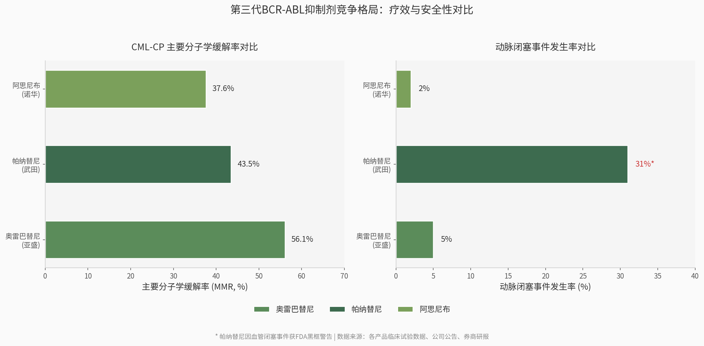

最核心的两个问题：

1. Lisaftoclax的MDS能不能成？
2. Sonrotoclax的AML/MDS能不能成？


利沙托克拉(Lisaftoclax / APG-2575)研究报告

> **一句话定位**:全球第二个、中国第一个上市的 Bcl-2 抑制剂——挑战艾伯维 venetoclax 近 26 亿美元年销大单品的"中国挑战者",最大卖点是用"每日快速爬坡、几乎不发生肿瘤溶解综合征"解决了同类老大最痛的安全性与用药负担问题。
> **靶点·modality**:Bcl-2(抗凋亡蛋白)·口服小分子选择性抑制剂 
>
> **持有方**:亚盛医药(6855.HK / NASDAQ: AAPG),全球权益自持 
>
> **报告日期**:2026 年 6 月 15 日


## 利沙托克拉 / Lisaftoclax（APG-2575）

中国首个递交 NDA 的国产 Bcl-2 选择性抑制剂，通过恢复癌细胞凋亡发挥作用。

已在中国获批：用于既往接受过至少一种系统治疗（含 BTK 抑制剂）的成人慢性淋巴细胞白血病/小淋巴细胞淋巴瘤（CLL/SLL）。
2025 年首次进入 CSCO 淋巴瘤指南推荐；正在全球开展与 BTK 抑制剂联用的 III 期，拓展更多血液瘤及实体瘤适应症。

两者联用在 AML、T-ALL 临床前模型中显示出显著协同效应。此外管线还包括 MDM2-p53 抑制剂 APG-115（alrizomadlin）等早期资产，但商业化与核心价值目前主要集中在上述两款。


已补充时间列。注意带"预估"的为 ClinicalTrials.gov 登记的预计完成时间，临床试验常会顺延，实际读出可能晚于登记值。

| 项目    | 适应症/人群                        | 方案 vs 对照                          | 主要终点                 | 开始时间                                            | 主要终点数据读出（预估）                                     | 状态/监管        |
| ------- | ---------------------------------- | ------------------------------------- | ------------------------ | --------------------------------------------------- | ------------------------------------------------------------ | ---------------- |
| GLORA   | 既往经治 CLL/SLL（约 440 例，1:1） | 利沙托克拉 + BTKi vs BTKi 单药        | PFS（无进展生存）        | 2023-10-23（实际）                                  | 登记主要完成约 2025 年末；考虑 PFS 终点与入组节奏，实际读出更可能在 2026–2027 | FDA 已批；进行中 |
| GLORA-2 | 初治 CLL/SLL                       | 利沙托克拉 + 阿可替尼 vs 免疫化疗     | PFS                      | 2024-04-07（实际）                                  | 约 2027 年 8 月（预估）                                      | 进行中           |
| GLORA-3 | 新诊断、老年/不适合强化疗 AML      | 利沙托克拉 + 阿扎胞苷 vs 安慰剂 + AZA | OS / CR 类终点           | 2024-06-11（实际）                                  | 约 2028 年 5 月（预估）                                      | 进行中           |
| GLORA-4 | 新诊断中高危 MDS（HR-MDS）         | 利沙托克拉 + 阿扎胞苷 vs 安慰剂 + AZA | 主要疗效终点（如 CR/OS） | 2025 年下半年启动（FDA/EMA 2025-08 获批、CDE 已批） | 约 2029 年（登记预计完成 2029-12）                           | 进行中           |

补充说明：

- GLORA（无后缀）是进度最快、最关键的一项，主要终点为 PFS；登记的主要完成时间偏早，但鉴于是事件驱动（PFS）终点，业内普遍预期实际数据读出落在 2026–2027 年。
- GLORA-2 在 ClinicalTrials.gov 上对应"利沙托克拉+阿可替尼 vs 免疫化疗"的初治 CLL/SLL 研究（NCT06319456）。
- GLORA-3 / GLORA-4 都是与阿扎胞苷联用、安慰剂对照的双盲设计，分别打 AML 和 HR-MDS 一线，读出最晚（2028–2029）。


两款都已在中国上市，但所处阶段差别很大。

奥雷巴替尼（耐立克®）——已成熟商业化

- 上市：2021 年获 NMPA 批准，是中国首个三代 BCR-ABL 抑制剂。
- 销售：已有可观且高速增长的真实销售。2025 年上半年销售收入约 人民币 2.17 亿元，同比增长 93%；全国准入的 DTP 药房+医院达 782 家（同比+17%），准入医院 201→295 家。
- 医保：已纳入国家医保（NRDL）。自 2025 年 1 月起所有已获批适应症全部进医保，覆盖 T315I 突变的 CML 慢性期/加速期，以及对一/二代 TKI 耐药或不耐受的 CML-CP。这也是销售大涨的主要驱动力。

利沙托克拉（利生妥®）——刚上市、放量初期

- 上市：2025 年 7 月 10 日获 NMPA 附条件批准，是中国首个、全球第二个上市的 Bcl-2 抑制剂。适应症为既往接受过至少一种系统治疗（含 BTK 抑制剂）的成人 CLL/SLL。
- 销售：刚获批不久（距今约一年），处于商业化最早期，目前公开披露的销售贡献还很小，尚未形成规模化收入。
- 医保：目前还未纳入国家医保。由于 2025 年 7 月才获批，赶不上当年医保谈判节点，后续要看能否在新一轮国家医保谈判中纳入——这将是它放量的关键催化剂。

一句话：奥雷巴替尼是已进医保、销售高速增长的"现金牛"；利沙托克拉是刚上市、尚未进医保、还在放量起步阶段的"第二增长曲线"，进医保前销售规模有限。


### 4.2 BCR-ABL抑制剂竞争格局

#### 4.2.1 三代TKI对比：疗效优势与商业化挑战

BCR-ABL酪氨酸激酶抑制剂（TKI）赛道已演化为三代药物的竞争格局。第一代伊马替尼（诺华）开创了CML靶向治疗时代，第二代达沙替尼、尼洛替尼和博舒替尼解决了多数伊马替尼耐药问题，但T315I突变仍构成治疗盲区。第三代TKI中，帕纳替尼（武田，2012年美国上市）率先攻克T315I耐药，但伴随严重的血管闭塞事件风险；阿思尼布（诺华，2021年美国上市）作为STAMP变构抑制剂另辟蹊径，不依赖ATP结合位点；奥雷巴替尼（亚盛，2021年中国上市）则在疗效与安全性之间取得了独特平衡。



从疗效数据对比（非头对头）来看，奥雷巴替尼在CML慢性期（CML-CP）的主要分子学缓解率（MMR）达56.1%，显著高于帕纳替尼的43.5%和阿思尼布的37.6%；主要细胞遗传学缓解率（MCyR）为81%，同样优于帕纳替尼（77.8%）和阿思尼布（55%）[^21]。在帕纳替尼或阿思尼布耐药的患者中，奥雷巴替尼仍展现出临床获益，这一定位使其在三代TKI治疗序列中占据了"末线保底"的独特位置[^22]。

| 指标               | 奥雷巴替尼（亚盛）      | 帕纳替尼（武田）         | 阿思尼布（诺华）                  |
| :----------------- | :---------------------- | :----------------------- | :-------------------------------- |
| CML-CP MMR率       | 56.1% [^21]             | 43.5% [^21]              | 37.6% [^21]                       |
| CML-CP MCyR率      | 81% [^21]               | 77.8% [^21]              | 55% [^21]                         |
| 动脉闭塞事件发生率 | 约5% [^23]              | 约31%（黑框警告）[^24]   | 约2% [^25]                        |
| 给药方案           | 每2天一次               | 每日一次                 | 每日两次                          |
| 全球商业化状态     | 中国上市，海外NDA准备中 | 全球上市，专利2027年到期 | 全球上市，一线适应症已获批        |
| 2024/2025年销售额  | 4.35亿元（中国）[^26]   | 约5-6亿美元（全球）[^27] | 8.94亿美元（2025年前三季度）[^28] |

上述对比揭示了奥雷巴替尼在疗效数据上的"Best-in-Class"潜力，但商业化规模与全球竞争对手存在量级差距。帕纳替尼虽因安全性黑框警告限制了临床应用，但其全球销售峰值曾接近4亿美元，且已建立近13年的医生用药习惯和品牌认知[^27]。奥雷巴替尼在中国市场的4.35亿元销售额仅相当于帕纳替尼全球销售额的约10%。亚盛与武田的13亿美元独家选择权协议为海外商业化提供了潜在通道，但武田尚未行使选择权，海外放量仍存不确定性[^29]。

#### 4.2.2 阿思尼布的威胁：一线适应症与爆发式增长

阿思尼布（Asciminib，Scemblix®）构成了亚盛在BCR-ABL赛道最具紧迫性的竞争威胁。2024年，阿思尼布获FDA批准一线CML适应症，成为首个可用于初治患者的STAMP抑制剂，直接将竞争前线从后线耐药推进到一线治疗[^30]。2025年前三季度，阿思尼布全球销售额已达8.94亿美元，同比增长84%；诺华管理层预测其销售峰值将达20亿美元[^28]。

阿思尼布的竞争优势在于其一线适应症的先发地位和独特的变构机制——与ATP竞争性抑制剂不存在交叉耐药，这意味着在一线治疗失败后，患者仍可能序贯使用奥雷巴替尼。然而，阿思尼布的一线获批也"教育"了市场接受三代TKI作为CML标准治疗的观念，为奥雷巴替尼未来进入一线提供了临床路径参考。亚盛的POLARIS-1和POLARIS-2两项全球注册III期研究分别针对奥雷巴替尼一线和二线CML治疗，若数据积极，有望在2027年前后同步提交FDA和EMA的NDA申请[^31]。武田是否行使选择权，与帕纳替尼专利2027年到期的时间窗口密切相关——若帕纳替尼仿制药提前进入，武田可能加速行权以无缝衔接替代产品[^32]。

## Other


### 4.3 Bcl-2抑制剂竞争格局

#### 4.3.1 全球Bcl-2抑制剂对比：四款产品竞争白热化

Bcl-2抑制剂通过靶向抗凋亡蛋白恢复肿瘤细胞凋亡，是血液肿瘤治疗的重大 breakthrough。目前全球仅有三款Bcl-2抑制剂获批上市，但第四款（百济神州Sonrotoclax）已于2026年1月在中国获批，竞争格局正在快速重塑。

| 产品                               | 公司        | 获批时间/状态     | 已获批适应症         | 2024/2025年销售额          | 剂量递增方案 | 联合BTKi预治疗 |
| :--------------------------------- | :---------- | :---------------- | :------------------- | :------------------------- | :----------- | :------------- |
| 维奈克拉（Venetoclax）             | 艾伯维/罗氏 | 2016年（美国）    | CLL/SLL、AML         | 27.92亿美元（2025年）[^33] | 5周          | 4-8周          |
| 利沙托克拉（Lisaftoclax/APG-2575） | 亚盛医药    | 2025年（中国）    | R/R CLL/SLL（中国）  | 7,058万元（5个月）[^34]    | **5天**      | **无需**       |
| 索托克拉（Sonrotoclax/BGB-11417）  | 百济神州    | 2026年1月（中国） | R/R CLL/SLL、R/R MCL | 刚上市                     | 5周          | 8-12周         |

维奈克拉凭借近10年的先发优势，2025年全球销售额达27.92亿美元，是Bcl-2抑制剂市场的绝对霸主[^33]。然而，其5周剂量递增方案要求患者住院监测肿瘤溶解综合征（TLS），在欧美医疗体系中构成高昂成本，在中国基层医院则是资源瓶颈。维奈克拉单药因不良事件导致的停药率达9%，联合利妥昔单抗时停药率升至16%[^35]，其TLS黑框警告进一步限制了在老年患者和合并症患者中的使用。

利沙托克拉的差异化优势在于5天快速剂量递增和无需BTK抑制剂预治疗。在R/R CLL/SLL患者中，利沙托克拉单药ORR为67.4%，联合利妥昔单抗为84.6%，联合阿可替尼高达97.7%[^36]。这一递增速度不仅是便利性差异，更重构了Bcl-2抑制剂的可及性经济学——若实现真正的门诊化给药，目标患者人群将显著扩大至维奈克拉当前未覆盖的基层医院。在AML/MDS等老年患者为主的适应症中，减少住院时间具有直接的临床价值[^37]。

百济神州索托克拉于2026年1月在中国获批R/R CLL/SLL和R/R MCL两项适应症，其R/R CLL/SLL的ORR为80.5%，CR/CRi率为26.8%，uMRD率可达77.9%[^38]。索托克拉的临床定位是"泽布替尼的协同增效器"——百济通过内部闭环的BTK+Bcl-2组合，可在一线CLL/SLL治疗中提供"一站式"解决方案。诺诚健华ICP-248联合奥布替尼在一线CLL/SLL中展现ORR 100%、CRR 57.1%的亮眼数据，但样本量较小，尚处II期阶段[^39]。

#### 4.3.2 BTK+Bcl-2联合疗法竞争：三足鼎立与"借船出海"

CLL/SLL治疗正从持续单药治疗向固定疗程联合疗法转变，BTK+Bcl-2联合疗法已成为无化疗方案的核心。2024年ESMO指南已将维奈克拉联合伊布替尼列为一线治疗选择之一[^40]，2026年2月阿可替尼联合维奈克拉固定疗程方案获FDA批准，成为首个全口服、固定时长CLL/SLL治疗方案[^41]。

| 企业     | BTK抑制剂             | Bcl-2抑制剂               | 联合疗法进展                                          | 战略定位               |
| :------- | :-------------------- | :------------------------ | :---------------------------------------------------- | :--------------------- |
| 艾伯维   | 伊布替尼（Imbruvica） | 维奈克拉（Venclexta）     | 已获FDA/EMA批准（一线CLL/SLL）                        | 先发优势，全球品牌效应 |
| 百济神州 | 泽布替尼（Brukinsa）  | 索托克拉（Sonrotoclax）   | 头对头III期 vs 维奈克拉+奥妥珠单抗（CELESTIAL-TNCLL） | 内部闭环，"大BTK战略"  |
| 亚盛医药 | **无自有BTK**         | 利沙托克拉（Lisaftoclax） | **与阿斯利康阿可替尼联合**（GLORA-2/GLORA）           | 外部合作，差异化适应症 |

四大竞争方中，三家拥有内部闭环的BTK+Bcl-2组合，唯独亚盛缺乏自有BTK产品。这一结构性短板意味着亚盛无法掌控联合疗法的定价、推广节奏和患者流量入口。在GLORA-2研究中，亚盛选择利沙托克拉联合阿可替尼对比免疫化疗治疗初治CLL/SLL；


### 2.2 利生妥®（APG-2575）：全球第二款Bcl-2抑制剂

#### 2.2.1 药物机制：Bcl-2选择性抑制与快速剂量递增的协同设计

Bcl-2（B-cell lymphoma 2）是一种凋亡抑制因子，在多种恶性血液肿瘤特别是CLL/SLL中过度表达，是肿瘤细胞逃避凋亡的关键机制。然而，Bcl-2作为药物靶点极具挑战性，主要原因在于其作用机制基于蛋白-蛋白相互作用（PPI），靶点结合界面较大，且Bcl-2蛋白位于线粒体双膜结构，药物需要穿透细胞膜后再穿透线粒体膜才能发挥作用[^17]。

利生妥®（Lisaftoclax，APG-2575）通过选择性阻断抗凋亡蛋白Bcl-2（低BCL-XL亲和力），恢复肿瘤细胞的正常凋亡过程。其关键分子特征包括：对BCL-2的Ki < 0.1 nmol/L，具有极高的结合亲和力；通过破坏BCL-2:BIM复合物释放促凋亡蛋白BIM，触发BAX/BAK依赖性、caspase介导的凋亡；进入细胞后2小时达到平台期，显著下调线粒体呼吸功能和ATP产生[^18]。与第一代Bcl-2/Bcl-xL双靶点抑制剂Navitoclax因严重血小板毒性而终止开发不同，APG-2575作为BCL-2选择性抑制剂，对Bcl-xL的选择性远低于Bcl-2，3级及以上血小板减少症发生率仅为13.5%，无因血液学毒性导致的治疗中断[^19]。*Cmax峰值杀死肿瘤细胞，半衰期4h比较快，且双通路代谢毒副反应小，可以和BTK？联用。*

APG-2575最具商业转化价值的差异化特征在于其药代动力学设计。该药物的半衰期约3-5小时，远短于Venetoclax的26小时，导致高Cmax但相对较低的全身暴露[^18]。这一独特的PK特征使得APG-2575可以采用每日梯度剂量递增方案，仅需4-6天即可达到目标剂量，而Venetoclax需要5周的每周递增方案[^20]。更短的剂量递增周期不仅减少了患者住院监测肿瘤溶解综合征（TLS）的时间和负担，还可能降低医疗系统的直接成本——在中国DRG/DIP支付改革背景下，门诊化给药的医保报销优势尤为突出。在已发表的研究中，APG-2575未发生临床TLS事件[^19]，而Venetoclax因TLS黑框警告需要住院监测，这在基层医院和社区医疗中心构成了资源瓶颈。

2575走CYP3A4 + CYP2C8 双代谢，且不走 P-gp/BCRP，泊沙康唑强效 CYP3A4 抑制剂，还抑制 P-gp（P-糖蛋白）。

**为什么维特克拉不能改变一下它的代谢通路？**

#### 2.2.2 关键临床数据：联合疗法展现best-in-class潜力

利生妥®的临床数据体系由单药治疗和联合疗法两条主线构成，其中联合阿卡替尼的方案在CLL/SLL领域展现出令人瞩目的疗效信号。

单药治疗方面，利生妥®的NMPA批准基于注册II期临床研究APG2575CC201的结果。在既往接受BTK抑制剂和/或免疫化疗失败的R/R CLL/SLL患者中，单药ORR为62.5%，中位PFS达23.89个月，研究中未报告任何TLS病例[^21]。在Phase 1研究中，R/R CLL/SLL患者的ORR为63.6%，中位至缓解时间为2个周期，快速起效特征显著[^19]。

联合疗法方面，亚盛医药与阿斯利康合作开展的全球Phase 1b/2研究（NCT04215809）评估了APG-2575联合阿卡替尼的疗效。在R/R CLL/SLL患者中，ORR高达98%（56/57），600 mg QD被确定为联合治疗的推荐Phase 2剂量（RP2D）[^22]。在初治CLL/SLL患者中，ORR达100%（16/16），18个月PFS率为86%[^22]。尤为重要的是，在Venetoclax经治患者中，联合方案的ORR为85.7%（12/14），其中Venetoclax进展后未用BTKi的患者ORR为100%（8/8）[^22]。这一数据提示APG-2575具有克服Venetoclax耐药的潜力，而Venetoclax耐药已成为临床实践中日益突出的未满足需求。在安全性方面，仅5例（2.8%）发生TLS，均为轻中度且可管理，未观察到药物-药物相互作用或新的安全性信号[^22]。

在髓系肿瘤领域，APG-2575联合阿扎胞苷（AZA）治疗新诊断高危MDS/CMML患者的ORR达80.0%，CR率40.0%；在Venetoclax经治髓系肿瘤患者中，ORR为31.8%，103例患者中未发生剂量限制性毒性，无TLS[^23]。在多发性骨髓瘤领域，APG-2575联合泊马度胺+地塞米松（Pd）的ORR为63.9%，中位PFS 9.7个月，为全口服方案[^24]。

#### 2.2.3 全球注册III期：GLORA系列四项同步推进

亚盛医药正在开展四项全球注册III期临床研究（GLORA系列），覆盖CLL/SLL、AML和MDS适应症，形成了Bcl-2抑制剂领域最广泛的临床布局之一。

下表汇总了GLORA系列及POLARIS系列的全球注册III期临床布局：

| 研究名称  | 产品       | 适应症          | 设计                            | 监管状态               | 关键进展                        |
| :-------- | :--------- | :-------------- | :------------------------------ | :--------------------- | :------------------------------ |
| POLARIS-1 | 奥雷巴替尼 | 新诊断Ph+ ALL   | 联合低强度化疗 vs 伊马替尼+化疗 | FDA/EMA/CDE已批准[^13] | MRD阴性CR率约65%                |
| POLARIS-2 | 奥雷巴替尼 | 经治CML-CP      | 奥雷巴替尼 vs 博舒替尼          | FDA已批准[^14]         | 预计2026年提交NDA               |
| POLARIS-3 | 奥雷巴替尼 | SDH缺陷型GIST   | 单臂/随机                       | CDE已批准[^15]         | 中位PFS 25.7个月                |
| GLORA     | APG-2575   | BTKi经治CLL/SLL | +BTKi vs 标准治疗               | FDA已许可[^25]         | 全球首个FDA许可的APG-2575 III期 |
| GLORA-2   | APG-2575   | 初治CLL/SLL     | +阿卡替尼 vs FCR                | CDE已批准[^26]         | 与阿斯利康合作                  |
| GLORA-3   | APG-2575   | 新诊断AML       | +AZA vs 安慰剂+AZA              | CDE已批准[^27]         | 针对老年/体弱患者               |
| GLORA-4   | APG-2575   | 新诊断中高危MDS | +AZA vs 安慰剂+AZA              | FDA/EMA/CDE已批准[^28] | 全球首个MDS领域Bcl-2 III期      |

上述布局的战略意义在于：POLARIS-2和GLORA系列分别代表了亚盛两款核心产品的全球注册路径，而GLORA-4作为全球首个在MDS领域开展的Bcl-2抑制剂注册III期研究，若成功将有望成为HR-MDS一线治疗的新标准。Venetoclax在MDS的VERONA研究中表现不佳，引发了业界对Bcl-2抑制剂在MDS中价值的质疑；APG-2575凭借更短半衰期、更少药物相互作用和可能更优的安全性特征，正在挑战这一认知[^29]。MDS领域全球年发病率约4-5例/10万，且以老年患者为主，APG-2575的门诊化给药优势在这一人群中具有直接的临床价值。

#### 2.2.4 与Venetoclax对比：安全性、便利性与耐药克服的三重优势

Venetoclax（Venclexta）作为首个获批的Bcl-2抑制剂，2023年全球销售额约22-26亿美元，预计销售峰值超60亿美元[^30]。APG-2575作为后发竞争者，其差异化定位建立在三个维度之上：

| 对比维度                | APG-2575（Lisaftoclax） | Venetoclax                         |
| :---------------------- | :---------------------- | :--------------------------------- |
| Bcl-2结合亲和力         | Ki < 0.1 nM [^18]       | Ki < 0.01 nM                       |
| 半衰期                  | 3-5小时 [^18]           | 26小时 [^18]                       |
| 剂量递增周期            | 4-6天（每日递增）[^20]  | 5周（每周递增）[^20]               |
| 临床TLS事件             | 未发生（Phase 1）[^19]  | 发生率较高，需住院监测[^31]        |
| 3级血小板减少           | 13.5% [^19]             | 15%（单药）/约20%（联合）[^31]     |
| 3级中性粒细胞减少       | 21.2% [^19]             | 40%（单药）[^31]                   |
| 药物相互作用            | 未观察到DDI [^22]       | 与CYP3A4/P-gp抑制剂有显著DDI [^31] |
| R/R CLL/SLL联合BTKi ORR | 98%（+阿卡替尼）[^22]   | 92.8%（AMPLIFY：+阿卡替尼）[^32]   |
| Venetoclax经治患者ORR   | 85.7%（+阿卡替尼）[^22] | N/A                                |
| 初治CLL/SLL ORR         | 100%（+阿卡替尼）[^22]  | 92.7%（AVO方案）[^32]              |

从上述对比可以看出，APG-2575在疗效上与Venetoclax相当或略优——在联合BTKi治疗R/R CLL/SLL中ORR 98% vs 92.8%，在初治患者中ORR 100% vs 92.7%。但其真正的结构性优势在于安全性与给药便利性。4-6天 vs 5周的剂量递增差异在表面上仅是便利性差异，实则重构了Bcl-2抑制剂的可及性经济学：Venetoclax的5周递增要求患者住院监测TLS，在欧美医疗体系中是高昂成本，在中国基层医院是资源瓶颈；APG-2575的门诊化给药潜力可能打开Venetoclax无法覆盖的中低端市场，同时降低联合疗法的启动门槛。此外，APG-2575在Venetoclax经治患者中仍显示85.7%的ORR，这一定位使其可能成为Venetoclax治疗失败后的标准二线选择，而Venetoclax耐药患者群体正在随前序治疗渗透率提升而持续扩大。


---

## Codex版

**利沙托克拉研究摘要**

截至 2026-06-15，利沙托克拉（lisaftoclax，APG-2575，商品名利生妥）是亚盛医药自主研发的口服选择性 BCL-2 抑制剂。它已在中国获批上市，用于既往至少接受过一种系统治疗且包含 BTK 抑制剂的成人 CLL/SLL 患者，是亚盛继奥雷巴替尼后的第二个商业化新药。

**核心判断**

利沙托克拉的价值点不是“全新靶点”，而是试图在 venetoclax 已验证的 BCL-2 赛道里，用更快爬坡、较可控 TLS 风险、BTKi 后失败人群和中国首个 BCL-2 抑制剂身份建立位置。它在中国 CLL/SLL 已完成从研发到商业化的闭环；真正决定上限的是 4 项全球 III 期能否把它推向一线 CLL/SLL、BTKi 后 CLL/SLL、老年/不适合强诱导 AML 和高危 MDS。

| 维度         | 状态                                                         |
| ------------ | ------------------------------------------------------------ |
| 靶点/机制    | 选择性抑制 BCL-2，解除肿瘤细胞抗凋亡机制                     |
| 剂型         | 口服片剂，采用快速递增剂量策略，文献称 5 日爬坡、第 6 日达目标剂量 |
| 中国获批     | 2025-07-10，NMPA 附条件批准                                  |
| 已获批适应症 | 经治成人 CLL/SLL，既往治疗至少包含 BTK 抑制剂                |
| 海外状态     | 美国尚未获批；多项全球注册 III 期进行中                      |
| 商业化       | 2025 年 7 月底开始中国销售；2025 年 8-12 月销售约 7,060 万人民币/1,010 万美元 |
| 医保         | 截至我查到的公开资料，尚未确认进入中国 NRDL；公司称正推进医保准入 |

**关键临床证据**

| 研究                       | 人群/设计                                                    | 结果摘要                                                     |
| -------------------------- | ------------------------------------------------------------ | ------------------------------------------------------------ |
| NCT05147467 / APG2575CC201 | 中国注册 II 期，单药，R/R CLL/SLL，主要终点 ORR              | 77 例入组，72 例可评估；IRC 确认 ORR 62.5%，mPFS 23.89 个月；外周血 MRD 阴性 21.8%；未见 TLS 或治疗相关死亡 |
| NCT03913949                | 中国 phase 1，R/R CLL/SLL 和 NHL                             | CLL/SLL ORR 71.4%、CR 28.6%；未达 MTD，未观察到 TLS          |
| NCT04215809                | phase 1b/2，单药或联合 rituximab/acalabrutinib               | ORR：单药 67.4%，联合 rituximab 84.6%，联合 acalabrutinib 97.7%；176 例中 TLS 2.8%，无治疗相关停药或死亡 |
| NCT06104566 / GLORA        | 全球 III 期，经治 CLL/SLL，lisaftoclax+BTKi vs BTKi          | 招募中，约 400 例，主要终点 PFS                              |
| NCT06319456 / GLORA-2      | 初治 CLL/SLL，lisaftoclax+acalabrutinib vs 免疫化疗          | 招募中，约 344 例，主要终点 PFS                              |
| NCT06389292 / GLORA-3      | 初治老年或不适合强诱导 AML，lisaftoclax+azacitidine vs placebo+azacitidine | 招募中，约 486 例，主要终点 OS                               |
| NCT06641414 / GLORA-4      | 初治高危 MDS，lisaftoclax+azacitidine vs placebo+azacitidine | 招募中，约 490 例，主要终点 OS；公司称 FDA/EMA/CDE 均已放行  |

**底线**

利沙托克拉是亚盛从“单产品奥雷巴替尼”走向“双商业化产品+多注册 III 期平台”的关键资产。短期看，中国 CLL/SLL 放量和医保准入是商业催化；中期看 GLORA/GLORA-2 决定 CLL/SLL 全球竞争力；长期看 GLORA-3/4 若在 AML/MDS 做出 OS 优势，价值弹性会明显提高。当前证据支持“有潜力的国产第二代 BCL-2 抑制剂”，但还不足以证明全球 best-in-class。


## 二、药物概览

### 2.1 身份卡片

| 项目        | 内容                                                         |
| ----------- | ------------------------------------------------------------ |
| 通用名      | 利沙托克拉(Lisaftoclax)                                      |
| 研发代号    | APG-2575                                                     |
| 商品名      | (中国已获批,商品名以官方为准)                                |
| 靶点        | Bcl-2(B 细胞淋巴瘤-2,抗凋亡蛋白),高选择性                    |
| Modality    | 口服小分子选择性 Bcl-2 抑制剂(BH3 模拟物)                    |
| 给药方式    | 口服,每日一次;起始 **4–6 天每日快速爬坡**至目标剂量(临床用至 400/600/800 mg) |
| 持有/权益方 | 亚盛医药(全球权益自持,截至报告日未就该品种签订重大海外授权)  |
| 中国获批    | **2025 年 7 月 10 日**(附条件批准)                           |
| 获批适应症  | 既往≥1 线系统治疗(含 BTKi)的成人 R/R CLL/SLL                 |
| 全球地位    | 全球第 2 个、中国第 1 个上市的 Bcl-2 抑制剂                  |

### 2.2 已获批与在研适应症一览

| 适应症                      | 状态                               | 关键时点/数据                   |
| --------------------------- | ---------------------------------- | ------------------------------- |
| R/R CLL/SLL(经治,含 BTKi)   | **中国已获批**                     | 2025.7 附条件批准               |
| R/R CLL/SLL(全球)           | 全球注册 III 期 GLORA(NCT06104566) | FDA 已放行                      |
| 一线 CLL/SLL(全球)          | 全球注册 III 期 GLORA-2            | 进行中                          |
| 高危 MDS 一线(联合阿扎胞苷) | 全球注册 III 期 GLORA-4            | FDA + EMA 放行(2025.8);ORR ~75% |
| AML(联合去甲基化/化疗)      | 早期/II 期                         | 探索中                          |
| 多发性骨髓瘤(尤其 t(11;14)) | 早期探索                           | Bcl-2 依赖亚群                  |
| Ph+ ALL(联合奥雷巴替尼)     | 研究者发起/早期                    | 联合数据见奥雷巴替尼报告        |

> 说明:亚盛披露利沙托克拉处于 **4 项全球注册 III 期**(GLORA 系列)中,覆盖 CLL/SLL(一线、经治)与高危 MDS 等。

### 2.3 研发历程关键时间点

- **2021**:首次人体研究(FIH)数据在 ASCO 披露(R/R CLL 及其他血液瘤)。
- **2023–2024**:中国 R/R CLL/SLL 关键 II 期(APG2575CC201)推进;FDA 放行全球 III 期;多项联合数据在 ASH 披露。
- **2024.12 / 2025.6**:高危 MDS 联合阿扎胞苷数据在 ASH 2024、ASCO 2025 披露(ORR ~75%)。
- **2025.7.10**:中国 NMPA 附条件批准 R/R CLL/SLL,成为中国首个 Bcl-2 抑制剂。
- **2025.8**:GLORA-4(高危 MDS)获 FDA + EMA 放行。
- **2025.12(ASH 2025)**:关键注册研究数据口头报告(ORR 62.5%、mPFS 23.89 个月、无 TLS)。

**当前阶段定位**:中国**刚上市**(2025 年中)、处于放量初期;同时是**全球后期临床、多适应症并进**的核心出海资产。

---

## 三、疾病与机制(重点章节)

### 3.1 疾病史:慢性淋巴细胞白血病(CLL/SLL)

#### 3.1.1 CLL/SLL 是什么

CLL(慢性淋巴细胞白血病)是成熟 B 淋巴细胞的惰性(慢性)肿瘤;当肿瘤主要位于淋巴结而非血液时称 SLL(小淋巴细胞淋巴瘤)——两者本质是同一种病的不同表现。它的根源不在于细胞"长得太快",而在于细胞"**该死的时候不死**":恶性 B 细胞高表达抗凋亡蛋白(尤其 Bcl-2),逃避了正常的程序性死亡(凋亡),于是在血液、骨髓和淋巴结里不断累积。CLL 多见于老年人(诊断中位年龄约 70 岁),病程长,部分患者可长期带病生存,但携带 del(17p)/TP53 突变等高危因素者预后差、易耐药。

> **小白版**:健康的免疫细胞像有"保质期",到点就会自我销毁、被身体回收。CLL 患者的一类 B 细胞偷偷给自己装了个"永不过期"的开关(Bcl-2 蛋白),逃过了自毁程序,于是越积越多,挤占骨髓、堆在淋巴结里。问题不是它们长得快,而是它们"赖着不走"。

#### 3.1.2 治疗史:从"无差别化疗"到"让癌细胞重新学会自杀"

CLL 是过去二十年靶向治疗革命最彻底的病种之一,治疗范式经历了清晰的代际接力:

| 代际                            | 代表方案                               | 时期        | 解决了什么                                   | 暴露了什么新问题                      |
| ------------------------------- | -------------------------------------- | ----------- | -------------------------------------------- | ------------------------------------- |
| 化疗时代                        | 苯丁酸氮芥、氟达拉滨                   | 1990s       | 控制肿瘤负荷                                 | 不能治愈、毒性大、老年人难耐受        |
| 化学免疫治疗(CIT)               | FCR(氟达拉滨+环磷酰胺+利妥昔单抗)      | 2000s–2010s | 显著延长 PFS,部分治愈                        | 对 del(17p)/TP53 无效、毒性大         |
| 共价 BTK 抑制剂                 | 伊布替尼、acalabrutinib、泽布替尼      | 2014–       | 口服、对高危亦有效,改写一线                  | 需持续服药、C481S 突变耐药、房颤/出血 |
| **Bcl-2 抑制剂**                | **venetoclax(2016)、利沙托克拉(2025)** | 2016–       | **靶向凋亡、深度缓解(uMRD)、可固定疗程停药** | venetoclax 有 TLS 风险、爬坡复杂      |
| 非共价 BTKi / 双靶联合 / 新机制 | pirtobrutinib、BTK 降解剂等            | 2023–       | 攻克 BTKi 耐药                               | 长期数据待积累                        |

这条接力链的关键转折是:**BTK 抑制剂解决了"信号通路依赖",Bcl-2 抑制剂解决了"凋亡逃逸"**——两条路径互补,如今 CLL 治疗的核心矛盾,是"BTKi 与 BCL-2i 双重耐药/经治后无药可用"的人群。利沙托克拉的获批适应症(经治、含 BTKi 失败)正卡在这个痛点上。


共价 BTKi 是怎么"锁死"BTK的?

> BTK 是那个"蛋白质靶点"，BTKi 是专门用来"关掉它"的药。就像锁（BTK）和钥匙堵头（BTKi）的关系——只不过这把锁在细胞内部，堵头是吃药送进去的小分子。

分子上伸出一个丙烯酰胺弹头（warhead），像一把带倒钩的锁扣，跟 BTK 蛋白上第481位的一个半胱氨酸残基（Cys481） 形成不可逆的共价键（硫醚键）。

```
BTK蛋白: ...–Cys⁴⁸¹–SH  +  药物–CH=CH₂
                ↓ 共价结合（不可逆）
       ...–Cys⁴⁸¹–S–CH₂–药物  ← 永久"焊死"，BTK失活
```


耐药的核心问题：Cys481这个点如果被改掉了

```
C481S 突变（半胱氨酸→丝氨酸）
正常BTK:  ...Cys⁴⁸¹–SH  ← 有巯基(–SH)，共价药物能挂上去 ✅
突变BTK:  ...Ser⁴⁸¹–OH  ← 只有羟基(–OH)，共价弹头挂不上去了 ❌
```

C481S 是共价BTKi耐药中最经典、最常见、最具临床意义的突变，在BTK抑制剂治疗后的复发CLL患者中出现率大约可到 30%~40%甚至更高（取决于治疗时长、检测深度等）。


*BTK和BCL-2的区别*：一个掐信号，一个按死刑按钮

|                  | 二代共价 BTKi（泽布替尼/阿可替尼）               | BCL-2 抑制剂（维奈克拉/Venetoclax）                        |
| :--------------- | :----------------------------------------------- | :--------------------------------------------------------- |
| 它打断的是什么？ | B细胞的"生长/存活信号线"（BCR→BTK→下游）         | 癌细胞的"不死机制"（凋亡刹车 BCL-2）                       |
| 比喻             | 把敌人的通讯电台砸了——收不到"活下去、分裂"的指令 | 把敌人的防爆安全罩卸了——细胞终于能走正常的自杀程序（凋亡） |

BTKi — 阻断 BCR 信号通路

```
B细胞受体(BCR) 被触发
    → BTK 被磷酸化激活（Cys481位点）
        → 下游 PLCγ2 → Ca²⁺↑ → NF-κB / MAPK / PI3K
            → 癌细胞: 增殖↑ 存活↑ 黏附在淋巴结微环境里
```

BCL-2 抑制剂 — 释放 线粒体凋亡通路

```
正常情况（癌细胞搞鬼）:
    BCL-2（抗凋亡蛋白）绑住了 BAX/BAK（促凋亡蛋白）
    → 线粒体膜不破 → 细胞"该死但不死"

维奈克拉来了:
    → 高选择性 occupying BCL-2 的 BH3-binding groove
        → BAX/BAK 被释放出来
            → 线粒体外膜穿孔（MOMP）
                → 细胞色素c释放 → Caspase-3/7激活
                    → 细胞凋亡💀
```

维奈克拉是 BH3 模拟物（BH3-mimetic）——它长得像天然促凋亡蛋白的"钓钩区"，抢走 BCL-2 上的座位，把促凋亡蛋白放出来，直接触发细胞自杀，所以它杀得又快又猛——也是为什么起始剂量必须 5周 ramp-up（20→50→100→200→400mg），不然大量肿瘤细胞同时崩溃释放钾/尿酸/磷 → 肿瘤溶解综合征（TLS）。

| 战场                                                         | 谁主攻            | 为什么                                                       |
| :----------------------------------------------------------- | :---------------- | :----------------------------------------------------------- |
| 淋巴结 / 骨髓微环境（癌细胞躲在基质细胞旁边，被滋养信号护着） | BTKi 更擅长       | BTKi 切断 BCR 信号 + 破坏黏附分子 → 把细胞赶出庇护所         |
| 外周血 / 循环中的静止癌细胞                                  | Venetoclax 更擅长 | 这些细胞一旦离开微环境，变得高度依赖 BCL-2 存活——维奈克拉一击必杀 |

```
CLL细胞存活靠两条腿走路：

  (1) 外部信号腿：  BCR → BTK → 发出"活下去"信号
  (2) 内部不死腿：  BCL-2 压住凋亡 → "我不准你死"

  二代共价 BTKi  ──砍──→  (1)信号腿断了    → 细胞断粮、被赶出巢穴
  BCL-2抑制剂    ──砍──→  (2)不死腿破了    → 细胞执行自杀程序

  两条腿一起砍（联合）→ 最深缓解、最短疗程、uMRD
```


#### 3.1.3 前人"武器谱"与局限

| 药物/方案              | 出现年份 | 机制                   | 当时疗效                                         | 局限/为何不够好                             |
| ---------------------- | -------- | ---------------------- | ------------------------------------------------ | ------------------------------------------- |
| FCR 化学免疫           | 2008     | 化疗+CD20 单抗         | 一线 PFS 显著延长                                | del(17p)/TP53 无效、老年难耐受              |
| 伊布替尼               | 2014     | 一代共价 BTKi          | 改写一线,口服                                    | 持续服药、房颤/出血、C481S 耐药             |
| 泽布替尼/acalabrutinib | 2017–19  | 二代共价 BTKi          | 更优安全性                                       | 仍有共价 BTKi 耐药问题                      |
| venetoclax             | 2016     | Bcl-2 抑制剂(BH3 模拟) | uMRD 率高、可固定疗程;2024 全球销售 ~25.8 亿美元 | TLS 风险→5 周缓慢爬坡、需密集监测、给药复杂 |
| pirtobrutinib          | 2023     | 非共价 BTKi            | 攻克 C481S 耐药                                  | 新机制,长期数据待积累                       |
| 异基因移植             | —        | 替换免疫系统           | 少数可治愈                                       | 高风险、老年不适用                          |

### AML

```
CLL 的生存依赖                      AML 的生存依赖

     BCL-2                            BCL-2  │ MCL-1  │ BCL-xL
       │                                ██     │  ████   │  ██
   ████████                            ~40%    │  ~35%   │  ~25%
       │
   近乎唯一通路                        多条平行通路
```


### 3.2 药物机制

#### 3.2.1 Modality 与靶点

利沙托克拉是**口服小分子、高选择性 Bcl-2 抑制剂**,属于 BH3 模拟物(BH3-mimetic)。靶点 Bcl-2 是抗凋亡的 Bcl-2 蛋白家族成员,在 CLL、部分 AML、t(11;14) 多发性骨髓瘤等肿瘤中高表达,是癌细胞"逃避凋亡"的关键开关。

#### 3.2.2 作用机制(MoA)与药代

正常情况下,促凋亡蛋白(如 BIM、BAX/BAK)会触发线粒体外膜通透化、释放细胞色素 c、激活 caspase 级联,使细胞凋亡。癌细胞通过过表达 Bcl-2 "扣押"这些促凋亡蛋白,逃避死亡。利沙托克拉**高亲和力结合 Bcl-2**,把被扣押的促凋亡蛋白"释放"出来,重新启动凋亡程序,使癌细胞自杀。

**关键药代差异**:利沙托克拉**半衰期短**,因而可采用**每日给药、4–6 天快速爬坡**至目标剂量;而 venetoclax 因 TLS 风险需按周递增、长达 5 周。短半衰期意味着血药浓度可控、肿瘤细胞被"分批、可控地"清除,从而**降低一次性大量细胞裂解导致 TLS 的风险**。

#### 3.2.3 机制层面的差异化(vs venetoclax 全面对标)

| 维度          | 利沙托克拉(APG-2575)                | venetoclax(Venclexta)              |
| ------------- | ----------------------------------- | ---------------------------------- |
| 靶点/机制     | 选择性 Bcl-2 抑制(BH3 模拟)         | 选择性 Bcl-2 抑制(BH3 模拟)        |
| 半衰期        | 短                                  | 较长                               |
| 爬坡方案      | **每日快速爬坡,4–6 天**             | **每周递增,约 5 周**               |
| TLS 风险      | 迄今临床**未观察到 TLS**            | 有 TLS(含致死/需透析)风险,黑框提示 |
| 给药/监测负担 | 更低,利于门诊/基层                  | 高,需密集监测、住院/补液           |
| 上市次序      | 全球第 2、中国第 1                  | 全球第 1,2016 上市,已成熟          |
| 商业体量      | 刚上市                              | 2024 全球净销售 ~25.8 亿美元       |
| 头对头证据    | **暂无 vs venetoclax 优效随机数据** | 拥有大量随机 III 期证据            |

差异化定性:**真差异在"用药友好度与 TLS 安全性"**,这对老年、肾功能受损、基层用药场景尤其有价值;但**疗效层面尚无证据证明优于 venetoclax**,best-in-class 能否成立要看 GLORA 系列与未来可能的头对头。


---

## 四、临床数据

### 4.1 核心注册临床总览

| 研究/人群                       | 期别   | 设计                                    | 关键终点         | 状态                 |
| ------------------------------- | ------ | --------------------------------------- | ---------------- | -------------------- |
| APG2575CC201(中国注册)          | II 期  | 单臂,R/R CLL/SLL(BTKi 难治)             | ORR              | **已支持中国获批**   |
| FIH(APG-2575 首次人体)          | I 期   | 剂量爬坡,R/R CLL 等                     | 安全/PK/初步疗效 | 已读出               |
| 联合 acalabrutinib / 利妥昔单抗 | Ib/II  | 加速爬坡+联合                           | ORR/安全         | ASH 披露             |
| GLORA(全球)                     | III 期 | 经治 R/R CLL/SLL                        | —                | FDA 放行,进行中      |
| GLORA-2(全球)                   | III 期 | 一线 CLL/SLL                            | —                | 进行中               |
| GLORA-4(全球)                   | III 期 | 高危 MDS 一线 + 阿扎胞苷,双盲安慰剂对照 | —                | FDA+EMA 放行(2025.8) |

### 4.2 关键疗效数据

**关键注册 II 期(APG2575CC201,77 例,R/R CLL/SLL,BTKi 难治,近半数复杂核型):**

| 指标                     | 数值           |
| ------------------------ | -------------- |
| 客观缓解率(ORR,主要终点) | **62.5%**      |
| 中位无进展生存(mPFS)     | **23.89 个月** |
| 中位缓解持续时间(DoR)    | 未达到         |
| 肿瘤溶解综合征(TLS)      | **0(无)**      |

**联合/经 venetoclax 治疗人群(早期数据):**

- 在**既往使用过 venetoclax**的患者中,单药 ORR 达 **85.7%(12/14)**;其中"用过 venetoclax 但 BTKi 初治"者 ORR 100%,"venetoclax + BTKi 双经治"者 ORR 66.7%——提示对 venetoclax 经治仍有效。
- 采用**加速爬坡**后联合 acalabrutinib 或利妥昔单抗,显示活性与可接受安全性。

**高危 MDS(GLORA-4 支持性数据,联合阿扎胞苷):** ORR 约 **75%**,显著高于单用去甲基化药物(HMA),安全性良好(严重血液学毒性与中性粒细胞减少相关感染发生率低)。这是利沙托克拉走向 venetoclax 尚未拿下的大适应症(高危 MDS)的关键依据。

### 4.3 安全性与耐受性

利沙托克拉迄今安全性谱的核心亮点是**未观察到 TLS**(即便采用每日快速爬坡),血液学毒性发生率低且可管理,非血液学毒性多为 1–2 级。这与 venetoclax 必须 5 周缓慢爬坡、密集监测、警惕致死性 TLS 形成鲜明对比,是其临床与商业差异化的支点。需要强调:① 当前安全性结论主要来自样本有限的早中期与单臂研究;② 在一线、高肿瘤负荷(大淋巴结、高白细胞)人群中,TLS 风险仍需在 GLORA 大样本中持续监测确认。

### 4.4 数据可信度评估

- **优势**:注册研究终点明确(ORR)、在最难治人群达成;"零 TLS"在多项研究中一致;非中国/全球 III 期同步推进有助消除人群代表性质疑。
- **局限**:中国注册为**单臂 II 期**(无对照),样本数十例;"更安全/不输 venetoclax"目前**缺乏头对头随机证据**;MDS/AML/MM 多为早期或支持性数据;长期 PFS/OS 与停药后持久性待成熟。
- 结论:疗效"绝对水平"可信、差异化机制可信,但**相对优效仍待 GLORA 系列随机数据**坐实。

### 4.5 催化剂时间表

| 时间      | 事件                          | 意义                                   |
| --------- | ----------------------------- | -------------------------------------- |
| 2026–2028 | GLORA 系列全球 III 期数据读出 | **决定全球获批与对标 venetoclax 成败** |

### 4.6 获批概率判断

中国已上市无获批风险。全球注册成败取决于:

① GLORA 系列能否复现疗效并在大样本中维持"低 TLS、易用"优势;

② 一线/高危 MDS 等更大适应症能否达到主要终点

---

## 五、竞争格局

罗氏：NX5948+维奈克拉
百济：BGB16673/泽布替尼+索托克拉
亚盛：APG3288+Lisaftoclax

### 5.1 竞争梯队

| 药物                                         | 公司                 | 机制          | 阶段/区域                                                 | 定位                                    |
| -------------------------------------------- | -------------------- | ------------- | --------------------------------------------------------- | --------------------------------------- |
| **利沙托克拉(APG-2575)**                     | 亚盛医药             | 选择性 Bcl-2i | 中国已上市(R/R CLL/SLL),4 项全球 III 期                   | 第 2 个 Bcl-2i,主打每日爬坡/低 TLS      |
| venetoclax(Venclexta/Venclyxto)              | 艾伯维 / 罗氏        | 选择性 Bcl-2i | 全球已上市(CLL、AML),2024 ~25.8 亿美元                    | 赛道老大、标准疗法                      |
| 百济神州：sonrotoclax(BGB-11417)             | 百济神州             | 第二代 Bcl-2i | 2026.1 中国附条件批 CLL/SLL+MCL；2026.5 FDA加速批 R/R MCL | 最强追赶者,克服 G101V 耐药,联合泽布替尼 |
| 共价 BTKi(泽布替尼、acalabrutinib、伊布替尼) | 百济/阿斯利康/艾伯维 | BTK 抑制      | 全球已上市                                                | CLL 一线主力(可与 Bcl-2i 联合或竞争)    |
| 非共价 BTKi(pirtobrutinib)                   | 礼来                 | 非共价 BTK    | 全球已上市                                                | 攻克 BTKi 耐药                          |
| 奥布替尼等国产 BTKi                          | 诺诚健华等           | BTK 抑制      | 中国已上市/拓展一线                                       | 中国 CLL 竞争                           |


### 5.3 赛道拥挤度

Bcl-2 抑制剂赛道是**有明确差异化的红海**:venetoclax 已验证数十亿美元商业价值,但 TLS/爬坡痛点为后来者留了门缝;然而门缝里挤进的不止利沙托克拉,还有 sonrotoclax 等。CLL 一线还要与强势 BTKi 竞争/联合。因此差异化定位与适应症拓展(MDS/AML/MM)是打开空间的关键。


### 5.5 同类失败史与启示

| 案例                                         | 问题                                          | 启示                                                         |
| -------------------------------------------- | --------------------------------------------- | ------------------------------------------------------------ |
| 早期 Bcl-2/Bcl-xL 抑制剂(navitoclax/ABT-263) | 抑制 Bcl-xL 导致严重血小板减少,无法做到选择性 | **高选择性 Bcl-2(避开 Bcl-xL)是成药关键**——利沙托克拉与 venetoclax 均走选择性路线 |
| venetoclax 早期 TLS 致死事件                 | 起效猛、需 5 周爬坡与密集监测                 | 安全性/给药便利是后来者最大的差异化机会,也是利沙托克拉的卖点 |
| 部分 BCL2 G101V 等耐药突变                   | venetoclax 长期使用后耐药                     | 第二代(如 sonrotoclax)主打克服耐药——利沙托克拉需关注自身在耐药人群的表现 |

### 5.6 专利与生命周期管理

作为 2025 年才上市的新分子,专利周期长,近期无悬崖压力。生命周期路径清晰:**适应症横向扩张(CLL/SLL→高危 MDS→AML→MM)+ 治疗线前移(经治→一线)+ 联合疗法(BTKi、阿扎胞苷、奥雷巴替尼)+ 地域扩张(全球 III 期/潜在 BD)**。

---

## 六、市场与商业


CLL 没有一个公认的、单一口径的"份额饼图"。份额会因三件事大幅变化——**按地区**(美国 vs 欧洲)、**按治疗线**(一线 vs 复发难治)、以及**按口径**(用药患者数 vs 销售额)。所以下面给的是区间和方向，而不是精确的某一个百分比。

**整体格局：靶向药已基本取代化疗**

最确定的一点是：BTK 抑制剂 + BCL-2 抑制剂两条路线合计已经占据 CLL 治疗的绝大部分（按患者数估计 **85–95%+**）。各国最新指南(2023–2025)已把化学免疫治疗(CIT)列为"仅极少数例外情况"使用。

**BTK 抑制剂——目前的主导路线**

按用药患者数，BTKi 是最大的一类，但占比因地区差异极大：

- 美国一线市场极度偏向 BTKi。一项 Medicare 真实世界数据中，约 **89%** 患者用 BTKi、仅约 **11%** 用 维奈克拉+奥妥珠单抗(Ven-O)。
- 欧洲则相反，固定疗程的 Ven-O 更受青睐(见下)。

代表药：伊布替尼(一代，份额下滑中)、阿可替尼(Calquence)、泽布替尼(Brukinsa)。按销售额，BTKi 这一类 2024 年明显大于 BCL-2：阿可替尼约 25 亿美元、泽布替尼全适应症约 26 亿美元、伊布替尼约 26 亿(但快速下滑)。

**BCL-2 抑制剂(维奈克拉为主)——快速增长的第二极**

维奈克拉(Venclexta/Venetoclax)是目前唯一上市的 BCL-2 抑制剂，主打"固定疗程、可停药"的差异化，与奥妥珠单抗或 BTKi 联用。

- 美国一线占比相对小(约 **10–15%**)，但在复发难治和欧洲市场占比高得多。
- 法国真实世界数据里：Ven-O 反而是最常用方案(**51.1%**)，BTKi 单类 26.2%，维奈克拉+伊布替尼 16%。
- 全球销售额 2023 年约 22 亿美元(含 CLL 和 AML)，增速约 14%。

**其余技术路线——已被边缘化或仍很小**

化学免疫治疗(CIT，如 FCR/BR + 利妥昔单抗)：曾是标准方案，现已萎缩到**个位数百分比(约 <5–10%)且持续下降**，仅用于年轻、IGHV 突变、无 TP53 异常的特定人群。

PI3K 抑制剂(idelalisib、duvelisib)：因毒性问题基本退出一线/二线，现占比**可忽略(约 1–2% 以下)**。

抗 CD20 单抗(利妥昔单抗、奥妥珠单抗)：主要作为**联合"骨架"**存在，而非独立路线，已计入上面的 CIT 或 Ven-O 方案中。

新兴路线(份额尚小但增长快)：非共价 BTKi 匹妥布替尼(pirtobrutinib，用于 BTKi 经治者，缓解率约 81.6%)；新一代 BCL-2 如 sonrotoclax(与泽布替尼联用应答率约 97%，国内厂商百济在推)；CAR-T(liso-cel 已获批 CLL)与双抗——目前都集中在后线，整体占比仍很低。

**一句话概括(粗略口径)**

如果硬要给一个全球加权的近似：BTK 抑制剂约 **55–75%**、BCL-2(维奈克拉)约 **15–35%**、化疗/CIT **<10%**、PI3Ki 及其他(CAR-T、双抗等)合计 **<5%**——其中美国更偏 BTKi 高端区间，欧洲 BCL-2 占比明显更高。


### 6.1 患病人数漏斗

| 层级                               | 美国                                      | 中国                         |
| ---------------------------------- | ----------------------------------------- | ---------------------------- |
| CLL 年新发                         | ~20,700 例(2024)                          | 约千例/年(罕见)              |
| CLL 现患                           | ~215,000 例                               | 数万人(为欧美约 1/10)        |
| 年龄标化发病率                     | ~4.6/10 万                                | 约为欧美 1/10,中位年龄 65–70 |
| 经治/BTKi 失败(利沙托克拉首发人群) | 相当规模、持续累积                        | 相对有限                     |
| 高危 MDS / AML / MM 等扩展         | 显著增量(尤其 MDS/AML 在中美均为较大病种) | 较大增量                     |


## 近期关注

临床上，市场最关注 **POLARIS-2（最近、头对头、决定出海）** 和 **POLARIS-1（Ph+ ALL 拓展）** 这两项奥雷巴替尼出海研究，其次是利沙托克拉的 **GLORA / GLORA-4**;而非临床层面，**利沙托克拉进医保**和**武田行权**是与之并列的两大催化剂。

**第一梯队（近期、决定出海，关注度最高）**

POLARIS-2（奥雷巴替尼，二线 CP-CML，头对头博舒替尼）是当下最核心的看点。它是奥雷巴替尼出海最关键的一仗——直接和已上市的标准药头对头，登记主要完成时间最早（约 2025 年底/2026 初），是近期最可能率先读出的注册数据。一旦阳性，意味着奥雷巴替尼有望从"中国三代 TKI"升级为"全球早线 CML 用药"，直接打开海外市场和武田行权的可能性，所以市场盯得最紧。

POLARIS-1（奥雷巴替尼，初治 Ph+ ALL，联合化疗）紧随其后。Part A 已在 2025 ASH 国际首发，最佳 MRD 阴性 CR 率超 60%，数据亮眼;市场关注它的完整主要终点（预计 2027 读出）以及 2026 年欧美同步入组的推进——这是把奥雷巴替尼从 CML 拓到 ALL 的关键。

**第二梯队（决定第二增长曲线）**

利沙托克拉的 GLORA 系列，尤其是：

- GLORA（既往经治 CLL/SLL，"BTK+Bcl-2"联合 vs BTK 单药）——进度最快、验证联合方案价值的核心研究；
- GLORA-4（一线高危 MDS）——这个适应症近 20 年无新药获批，公司明确表示 2026 年会发布关键数据，市场期待它填补空白。

**非临床但同样高关注的两个事件**

利沙托克拉能否在 2026 年国家医保谈判中纳入医保——这是它能否放量、兑现"第二个十亿美元分子"的关键催化剂，权重不亚于临床读出。

武田是否对奥雷巴替尼行使全球授权选择权——这与 POLARIS-2/1 的数据强相关，是市场对"出海变现"最大的悬念。


## Q&A

### 为什么Lisaftoclax可以每日一次，而Sonrotoclax是每周一次？


半衰期+BCL-2亲和力


Sonrotoclax 的对靶点的亲和力较 Venetoclax 增强了 10 倍以上，Lisaftoclax相对Venetoclax有所降低，这直接决定了每次给药后肿瘤杀伤的剧烈程度

> 王三斌教授 2025.07 解读（"Sonrotoclax 的对靶点的亲和力较 Venetoclax 增强了 10 倍以上……其 Cmax 可能远超治疗窗上限，进而增加安全性风险"）；ASCO 2022 Lisaftoclax I 期数据
> 

效力（potency）决定凋亡同步性，凋亡同步性决定 TLS 风险

Venetoclax需要按周爬坡是因为半衰期慢，药物在体内积蓄。而Sonrotoclax需要爬坡是因为药效太强，肿瘤崩解剧烈，需要更多时间让身体清楚代谢废物，防止TLS

| 药理学参数         | **索托克拉**  | **Lisaftoclax** |
| :----------------- | :------------ | :-------------- |
| BCL-2 IC₅₀         | **0.014 nM**  | **~2 nM**       |
| 相对维奈克拉       | **强 ~14 倍** | 相近或略低      |
| SPR Kᴅ（解离常数） | 0.046 nM      | Ki < 0.1 nM     |
| BCL-xL 选择性      | ~2000x        | >500x           |
| 半衰期             | ~4-6 h        | ~4-6 h          |

> 来源：J. Med. Chem. 2024（索托克拉原始论文）；Clin. Cancer Res. 2022（Lisaftoclax 临床前研究，PMID: 36048524）
> 关键数字：索托克拉对 BCL-2 的抑制强度是 Lisaftoclax 的 约 140 倍（0.014 vs 2 nM）。两者对 BCL-xL 的选择性都很好，半衰期都短——所以安全性的差异，几乎完全来自 BCL-2 亲和力这个单一变量。


```
BCL-2抑制剂结合BCL-2
    ↓
BIM等促凋亡蛋白被释放
    ↓
BAX/BAK 寡聚化 → 线粒体外膜通透化（MOMP）
    ↓
细胞色素c释放 → Caspase级联激活
    ↓
细胞崩解 → 释放钾、磷酸盐、尿酸、核酸入血
    ↓
超出肾脏清除能力 = TLS
```


关键是，多少细胞同时走完这个链条。

```
索托克拉 320 mg 给药后
BCL-2 占有率
    ████████████████████  ~99%+（几乎瞬间饱和）
    大量BIM同时释放
    
Lisaftoclax 600 mg 给药后
BCL-2 占有率
    ████████████░░░░░░  ~70-80%（不完全饱和，有梯度）

凋亡群体分布：

每个CLL细胞抵抗凋亡所需的BCL-2占用比例不同：

细胞A: 需要抑制 95% 的 BCL-2 才凋亡  ← "顽固"细胞
细胞B: 需要抑制 80%                      ← 中等
细胞C: 需要抑制 50%                      ← "脆弱"细胞
细胞D: 需要抑制 30%                      ← 极脆弱
```

- **索托克拉**（IC₅₀ = 0.014 nM）：在目标剂量 320 mg 下，BCL-2 占有率接近 100%。所有细胞——从最顽固到最脆弱——**同时跨越凋亡阈值**，形成一次集中爆发的死亡浪潮。这就像一座大坝瞬间崩溃，下游瞬间被洪水淹没。
- **Lisaftoclax**（IC₅₀ = 2 nM）：在 600 mg 下，BCL-2 占有率更温和。只有最脆弱的细胞先死，中等敏感的随后，顽固的再晚一些——细胞是**分批、有序地**被清除，凋亡在时间轴上被"摊薄"。这就像大坝缓慢放水，下游有充分时间应对。


```
                    索托克拉                    Lisaftoclax
                       │                           │
  BCL-2 亲和力  ───→  极强 (0.014 nM)           中等 (~2 nM)
                       │                           │
  靶点占有率    ───→  近乎饱和 (~99%)           不完全饱和 (~70-80%)
                       │                           │
  凋亡同步性    ───→  高度同步                   异步、渐进
                       │                           │
  死亡峰值      ───→  尖锐（大量细胞同时崩解）    平缓（分批崩解）
                       │                           │
  代谢物释放    ───→  瞬时超量（K⁺, PO₄³⁻, UA）  可控释放
                       │                           │
  肾脏清除      ───→  超出能力 → TLS            在能力范围内 → 安全
                       │                           │
  爬坡策略      ───→  每3-4天一步（让身体喘息）  每天一步（身体能跟上）
```


### 为什么不把Sonrotoclax剂量降到类似Lisaftoclax结合BCL-2的水平？

**如果把索托克拉的剂量降到仅维持 60% BCL-2 占有率，它就失去了存在的理由。**

索托克拉之所以被研发出来，就是为了回答一个明确的问题：

> "维奈克拉效力不够 → 不能做 DLBCL、耐药突变出现（G101V）、缓解不够深（CR 率有限）。能不能做一个更猛的？"

研发团队给出的答案是：把 BCL-2 抑制力提升 **14 倍**。这个 14 倍的提升不是意外，是**立项时锁定的设计目标**（百济汪来在专访中明确说过"这不是偶然改良，而是设计之初就锁定的目标"）。

剂量下降，三个核心优势就全部消失了：

1、**克服 G101V 等维奈克拉耐药突变**（IC₅₀ 7.7 nM vs 维奈克拉 170 nM）

2、**在 DLBCL 等"BCL-2 不纯依赖"肿瘤中有效**（维奈克拉在这些适应症效果有限）

3、**更深缓解 → 追求 uMRD / 固定疗程停药**

BCL-2 驱动的凋亡存在一个**阈值效应**：只有当一个细胞中绝大多数 BCL-2 蛋白被占据时，BIM 才能充分释放并触发 MOMP。60% 和 95% 的占有率，在单个细胞层面是"不死"和"死"的差别。索托克拉 320 mg 之所以能驱动更高的 CR 率和 uMRD，恰恰是因为它跨过了那个阈值。


### 假设Sonrotoclax 降到60%BCL-2凋亡的剂量，可以实现每日爬坡吗？

如果索托克拉的剂量被调到"BCL-2 占有率峰值仅 60%" 的水平，单次给药的杀伤面会显著收窄，TLS 风险理论上可以压到允许每日递进的水平。在这个意义上，你的假设在药理学逻辑上是成立的。


索托克拉的优势同时也是它的诅咒：亲和力极高 → 浓度-效应曲线非常陡峭。在低浓度区间，小幅度的浓度波动就会导致 BCL-2 占有率从 40% 跳到 80%。

这意味着什么？索托克拉的药代动力学波动（Cmax → Cmin，半衰期仅 4-6 小时）会在每天给药后产生一个短暂的"高占有率尖峰"


**陡峭曲线 + 短半衰期 = 每次给药后都有短暂的高占有率"杀伤脉冲"。** 即使平均占有率被压到 60%，Cmax 时刻仍可能短暂跨越某些敏感细胞的凋亡阈值。每日爬坡时，这些脉冲会叠加在一个不断升高的剂量基础上，TLS 风险的控制会比 Lisaftoclax 困难得多。

| 低剂量索托克拉（假设60%占有率） | Lisaftoclax（600 mg）      |                |
| :------------------------------ | :------------------------- | -------------- |
| 平均 BCL-2 占有率               | ~60%                       | ~70-80%        |
| 浓度-效应曲线形状               | **极陡**                   | 平缓           |
| Cmax 时的瞬时占有率             | 可能短暂冲高到 80%+        | 与 Cmin 差距小 |
| 每日递增时"杀伤增量"            | 难以精确控制（陡峭）       | 可控且可预测   |
| 临床可操作性                    | 差——剂量微调会导致效应剧变 | 好             |


### 如果真像你说的，剂量降下来，就和Lisaftoclax一样，那么为什么早期爬坡的时候，不能像Lisaftoclax按每天爬坡，也要像Venetoclax按每周爬坡


## Sonrotoclax为什么不做AML/MDS？

1. AML中不仅有BCL-2，还有MCL-1、BCL-xL
2. VIALE-A门槛太高
3. MDS 的 BCL-2 依赖度比 AML 还低
4. 
