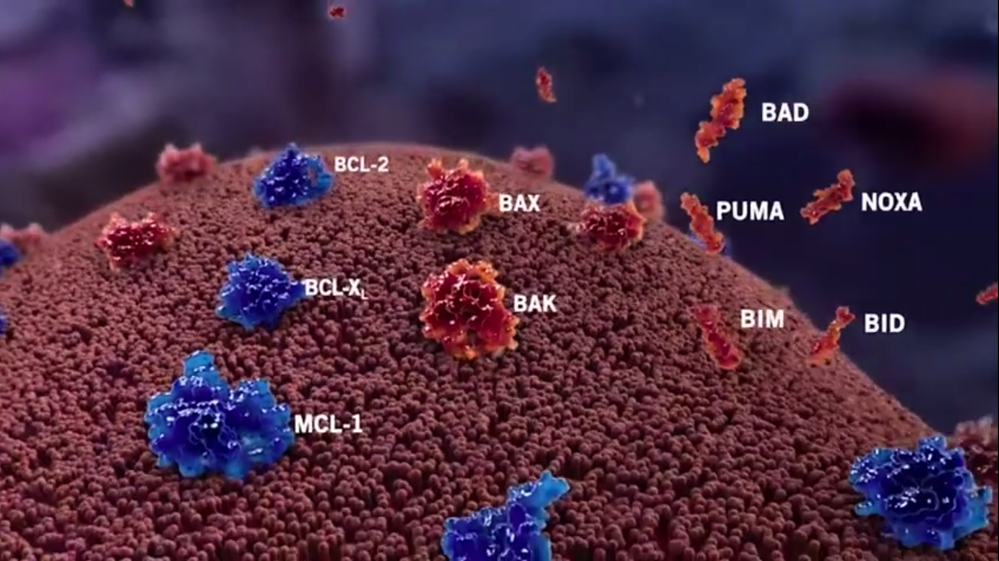

## 框架

<svg viewBox="0 0 680 460" width="100%" role="img">
    <rect width="100%" height="100%" fill="#f2f2f2" />
    <title>血细胞家族与骨髓起源关系图</title>
    <desc>展示骨髓造血干细胞分化为红细胞、白细胞(含中性粒细胞)和血小板的过程，以及对应的临床检测指标</desc>
    <defs>
        <marker id="arrow" viewBox="0 0 10 10" refX="8" refY="5" markerWidth="6" markerHeight="6"
            orient="auto-start-reverse">
            <path d="M2 1L8 5L2 9" fill="none" stroke="context-stroke" stroke-width="1.5" stroke-linecap="round"
                stroke-linejoin="round" />
        </marker>
    </defs> <text x="340" y="26" text-anchor="middle" font-size="14" font-weight="500"
        fill="#2C2C2A">血液细胞的起源与对应检测指标</text>
    <g>
        <rect x="230" y="44" width="220" height="52" rx="8" fill="#EEEDFE" stroke="#534AB7" stroke-width="0.5" /> <text
            x="340" y="66" text-anchor="middle" font-size="13" font-weight="500" fill="#3C3489">骨髓造血干细胞</text> <text
            x="340" y="84" text-anchor="middle" font-size="11" fill="#7F77DD">所有血细胞的"种子"——骨髓中</text>
    </g>
    <line x1="280" y1="96" x2="140" y2="130" stroke="#5F5E5A" stroke-width="0.5" marker-end="url(#arrow)" />
    <line x1="340" y1="96" x2="340" y2="130" stroke="#5F5E5A" stroke-width="0.5" marker-end="url(#arrow)" />
    <line x1="400" y1="96" x2="540" y2="130" stroke="#5F5E5A" stroke-width="0.5" marker-end="url(#arrow)" />
    <g>
        <rect x="40" y="130" width="200" height="68" rx="8" fill="#FCEBEB" stroke="#A32D2D" stroke-width="0.5" /> <text
            x="140" y="152" text-anchor="middle" font-size="13" font-weight="500" fill="#791F1F">红细胞系</text> <text
            x="140" y="170" text-anchor="middle" font-size="11" fill="#E24B4A">红细胞 (RBC)</text> <text x="140" y="186"
            text-anchor="middle" font-size="10" fill="#E24B4A">携氧、运输CO₂</text>
    </g>
    <g>
        <rect x="240" y="130" width="200" height="68" rx="8" fill="#E6F1FB" stroke="#185FA5" stroke-width="0.5" /> <text
            x="340" y="152" text-anchor="middle" font-size="13" font-weight="500" fill="#0C447C">白细胞系</text> <text
            x="340" y="170" text-anchor="middle" font-size="11" fill="#378ADD">白细胞 (WBC)</text> <text x="340" y="186"
            text-anchor="middle" font-size="10" fill="#378ADD">免疫防御、抗感染</text>
    </g>
    <g>
        <rect x="440" y="130" width="200" height="68" rx="8" fill="#FAEEDA" stroke="#854F0B" stroke-width="0.5" /> <text
            x="540" y="152" text-anchor="middle" font-size="13" font-weight="500" fill="#633806">巨核细胞系</text> <text
            x="540" y="170" text-anchor="middle" font-size="11" fill="#EF9F27">血小板 (PLT)</text> <text x="540" y="186"
            text-anchor="middle" font-size="10" fill="#EF9F27">止血、凝血</text>
    </g>
    <line x1="340" y1="198" x2="340" y2="218" stroke="#5F5E5A" stroke-width="0.5" marker-end="url(#arrow)" />
    <g>
        <rect x="250" y="218" width="180" height="44" rx="8" fill="#B5D4F4" stroke="#185FA5" stroke-width="0.5" /> <text
            x="340" y="238" text-anchor="middle" font-size="12" font-weight="500" fill="#0C447C">中性粒细胞</text> <text
            x="340" y="254" text-anchor="middle" font-size="10" fill="#378ADD">白细胞中数量最多的一种</text>
    </g>
    <line x1="280" y1="240" x2="250" y2="240" stroke="#5F5E5A" stroke-width="0.5" marker-end="url(#arrow)"
        stroke-dasharray="3,2" /> <text x="340" y="288" text-anchor="middle" font-size="13" font-weight="500"
        fill="#2C2C2A">对应的临床检测指标</text>
    <line x1="140" y1="198" x2="140" y2="300" stroke="#5F5E5A" stroke-width="0.5" stroke-dasharray="3,2" />
    <line x1="340" y1="262" x2="340" y2="300" stroke="#5F5E5A" stroke-width="0.5" stroke-dasharray="3,2" />
    <line x1="540" y1="198" x2="540" y2="300" stroke="#5F5E5A" stroke-width="0.5" stroke-dasharray="3,2" />
    <g>
        <rect x="40" y="300" width="200" height="58" rx="8" fill="#FBEAF0" stroke="#993556" stroke-width="0.5" /> <text
            x="140" y="322" text-anchor="middle" font-size="12" font-weight="500" fill="#72243E">血红蛋白 Hb</text> <text
            x="140" y="340" text-anchor="middle" font-size="11" fill="#D4537E">红细胞携氧能力的核心指标</text> <text x="140" y="354"
            text-anchor="middle" font-size="10" fill="#D4537E">↓ = 贫血、缺氧</text>
    </g>
    <g>
        <rect x="240" y="300" width="200" height="58" rx="8" fill="#E1F5EE" stroke="#0F6E56" stroke-width="0.5" /> <text
            x="340" y="322" text-anchor="middle" font-size="12" font-weight="500" fill="#085041">中性粒细胞计数 ANC</text>
        <text x="340" y="340" text-anchor="middle" font-size="11" fill="#1D9E75">抗感染能力的核心指标</text> <text x="340" y="354"
            text-anchor="middle" font-size="10" fill="#1D9E75">↓ = 易感染、发热风险</text>
    </g>
    <g>
        <rect x="440" y="300" width="200" height="58" rx="8" fill="#FAEEDA" stroke="#854F0B" stroke-width="0.5" /> <text
            x="540" y="322" text-anchor="middle" font-size="12" font-weight="500" fill="#633806">血小板计数 PLT</text> <text
            x="540" y="340" text-anchor="middle" font-size="11" fill="#EF9F27">止血凝血能力的核心指标</text> <text x="540" y="354"
            text-anchor="middle" font-size="10" fill="#EF9F27">↓ = 出血风险</text>
    </g>
    <g>
        <rect x="40" y="378" width="600" height="70" rx="8" fill="#F1EFE8" stroke="#B4B2A9" stroke-width="0.5" /> <text
            x="60" y="400" font-size="12" font-weight="500" fill="#2C2C2A">骨髓原始细胞 (Blasts)</text> <text x="60" y="418"
            font-size="11" fill="#444441">造血干细胞分化过程中，尚未成熟的"半成品"细胞。正常 &lt; 5%。</text> <text x="60" y="434" font-size="11"
            fill="#444441">↑↑ = 白血病/MDS 的核心标志，原始细胞大量增殖挤占正常造血空间</text>
    </g>
</svg>

## 基础概念

人体血液中的细胞分三大类，都起源于**骨髓**中的造血干细胞：

### 红细胞（RBC）

- **是什么**：血液中数量最多的细胞，内含血红蛋白
- **作用**：携带氧气从肺到全身，再把 CO₂ 运回肺排出
- **指标**：**血红蛋白 Hb**（不是直接数红细胞数量，而是测它里面"运氧蛋白"的浓度）
- **Hb 说明什么**：Hb ↓ → 贫血 → 乏力、面色苍白、心悸、气短

### 2. 白细胞（WBC）

- **是什么**：免疫系统的"军队"，分多种亚型（中性粒细胞、淋巴细胞、单核细胞等）
- **作用**：抵御细菌、病毒等病原体
- **中性粒细胞**：白细胞中数量最多、最关键的"主力部队"，是急性细菌感染的第一道防线
- **指标**：**ANC（绝对中性粒细胞计数）** = 白细胞总数 × 中性粒细胞比例
- **ANC 说明什么**：
  - ANC ≥ 1.0 → 感染抵抗力基本正常
  - ANC < 1.0 → 粒细胞减少症
  - ANC < 0.5 → 粒细胞缺乏症，**极易发生严重感染**
  - ANC < 0.2 → 极重度缺乏，**致命性感染风险极高**

### 3. 血小板（PLT）

- **是什么**：由骨髓巨核细胞产生的细胞碎片（严格说不是完整细胞）
- **作用**：止血和凝血——血管破裂时迅速聚集封堵缺口
- **指标**：**PLT（血小板计数）**
- **PLT 说明什么**：
  - PLT ≥ 100 → 止血功能基本正常
  - PLT 50–100 → 有轻度出血风险
  - PLT 20–50 → 有明显出血风险
  - PLT < 20 → 自发性出血风险高（可能脑出血）

骨髓是骨头内部的"造血工厂"，所有血细胞都在这里制造，骨髓 → 造血干细胞 → 逐步分化成熟 → 释放到外周血

### 4. 骨髓原始细胞（Blasts）

- **是什么**：造血过程中"尚未成熟"的幼稚细胞，是红细胞、白细胞、血小板的**前体**
- **正常情况**：骨髓中 bl ≤ 5%（它们会继续成熟，不会停滞）
- **异常情况**：blasts 大量增殖且无法成熟 → 挤占骨髓空间 → 正常红细胞、白细胞、血小板生产受阻
- **临床意义**：
  - bl 5%–19% → MDS（骨髓增生异常综合征）
  - bl ≥ 20% → AML（急性髓系白血病）
  - bl 是**白血病负荷**最核心的标志

原始细胞 = 造血过程中最幼稚、尚未分化的"半成品"细胞，包括：

- **髓系原始细胞**（myeloblasts）—— 最常说的
- **淋巴系原始细胞**（lymphoblasts）—— ALL 语境下

| 细胞类型                     | 是否计入分母 | 说明                     |
| :--------------------------- | :----------- | :----------------------- |
| 原始细胞 blasts              | ✓            | 分子也是它               |
| 早幼粒/中幼粒/晚幼粒         | ✓            | 成熟中的粒细胞           |
| 分叶核/杆状核粒细胞          | ✓            | 成熟粒细胞               |
| **有核红细胞**（红系前体）   | ✓            | 关键！它们有核，要算进去 |
| 淋巴细胞                     | ✓            |                          |
| 单核细胞                     | ✓            |                          |
| 巨核细胞                     | ✓            | 数量少但算               |
| **成熟红细胞（外周血那种）** | ✗            | 没有细胞核，不算         |
| 血小板                       | ✗            | 细胞碎片，不算           |

骨髓维度回答"病源清除没有"，外周血维度回答"正常造血功能恢复没有"

## 治愈标准

### 疗效评估

<svg viewBox="0 0 680 420" width="100%" role="img">
    <rect width="100%" height="100%" fill="#f2f2f2"/>
    <title>临床疗效评估两大维度</title>
    <desc>展示骨髓维度(原始细胞)和外周血维度(三大指标)如何组合形成疗效评价标准</desc>
    <defs>
        <marker id="arrow2" viewBox="0 0 10 10" refX="8" refY="5" markerWidth="6" markerHeight="6"
            orient="auto-start-reverse">
            <path d="M2 1L8 5L2 9" fill="none" stroke="context-stroke" stroke-width="1.5" stroke-linecap="round"
                stroke-linejoin="round" />
        </marker>
    </defs> <text x="340" y="26" text-anchor="middle" font-size="14" font-weight="500" fill="#2C2C2A">疗效评估 = 骨髓维度 +
        外周血维度</text> <text x="340" y="44" text-anchor="middle" font-size="12" fill="#888780">两个维度独立评估，组合后形成不同缓解等级</text>
    <line x1="340" y1="56" x2="340" y2="76" stroke="#5F5E5A" stroke-width="0.5" />
    <line x1="140" y1="76" x2="540" y2="76" stroke="#5F5E5A" stroke-width="0.5" />
    <line x1="140" y1="76" x2="140" y2="96" stroke="#5F5E5A" stroke-width="0.5" marker-end="url(#arrow2)" />
    <line x1="540" y1="76" x2="540" y2="96" stroke="#5F5E5A" stroke-width="0.5" marker-end="url(#arrow2)" />
    <g>
        <rect x="40" y="96" width="280" height="100" rx="8" fill="#EEEDFE" stroke="#534AB7" stroke-width="0.5" />
        <text x="180" y="120" text-anchor="middle" font-size="13" font-weight="500" fill="#3C3489">维度一：骨髓</text>
        <text x="180" y="140" text-anchor="middle" font-size="12" fill="#534AB7">核心指标：骨髓原始细胞比例</text> <text x="180"
            y="158" text-anchor="middle" font-size="11" fill="#7F77DD">需做骨髓穿刺(骨穿)</text> <text x="180" y="176"
            text-anchor="middle" font-size="11" fill="#7F77DD">评估"白血病负荷是否下降"</text> <text x="180" y="190"
            text-anchor="middle" font-size="10" fill="#AFA9EC">blasts &lt; 5% = 骨髓完全缓解(mCR)</text>
    </g>
    <g>
        <rect x="360" y="96" width="280" height="100" rx="8" fill="#E6F1FB" stroke="#185FA5" stroke-width="0.5" />
        <text x="500" y="120" text-anchor="middle" font-size="13" font-weight="500" fill="#0C447C">维度二：外周血</text>
        <text x="500" y="140" text-anchor="middle" font-size="12" fill="#185FA5">核心指标：ANC + PLT (+ Hb)</text> <text
            x="500" y="158" text-anchor="middle" font-size="11" fill="#378ADD">抽血化验即可(血常规)</text> <text x="500" y="176"
            text-anchor="middle" font-size="11" fill="#378ADD">评估"造血功能是否恢复"</text> <text x="500" y="190"
            text-anchor="middle" font-size="10" fill="#85B7EB">改善幅度达阈值 = 血液学改善(HI)</text>
    </g> <text x="340" y="222" text-anchor="middle" font-size="13" font-weight="500" fill="#2C2C2A">两维度组合 →
        疗效等级</text>
    <line x1="180" y1="196" x2="180" y2="232" stroke="#5F5E5A" stroke-width="0.5" stroke-dasharray="3,2" />
    <line x1="500" y1="196" x2="500" y2="232" stroke="#5F5E5A" stroke-width="0.5" stroke-dasharray="3,2" />
    <g>
        <rect x="40" y="232" width="150" height="52" rx="8" fill="#E1F5EE" stroke="#0F6E56" stroke-width="0.5" />
        <text x="115" y="252" text-anchor="middle" font-size="12" font-weight="500" fill="#085041">CR</text> <text
            x="115" y="268" text-anchor="middle" font-size="10" fill="#5DCAA5">骨髓✓ + 血象完全✓</text> <text x="115" y="280"
            text-anchor="middle" font-size="10" fill="#5DCAA5">ANC≥1.0, PLT≥100</text>
    </g>
    <g>
        <rect x="200" y="232" width="150" height="52" rx="8" fill="#EAF3DE" stroke="#3B6D11" stroke-width="0.5" />
        <text x="275" y="252" text-anchor="middle" font-size="12" font-weight="500" fill="#27500A">CRh</text> <text
            x="275" y="268" text-anchor="middle" font-size="10" fill="#97C459">骨髓✓ + 血象部分✓</text> <text x="275" y="280"
            text-anchor="middle" font-size="10" fill="#97C459">ANC≥0.5, PLT≥50</text>
    </g>
    <g>
        <rect x="360" y="232" width="150" height="52" rx="8" fill="#FAEEDA" stroke="#854F0B" stroke-width="0.5" />
        <text x="435" y="252" text-anchor="middle" font-size="12" font-weight="500" fill="#633806">CRi</text> <text
            x="435" y="268" text-anchor="middle" font-size="10" fill="#EF9F27">骨髓✓ + 血象未恢复</text> <text x="435" y="280"
            text-anchor="middle" font-size="10" fill="#EF9F27">ANC&lt;1.0 或 PLT&lt;100</text>
    </g>
    <g>
        <rect x="520" y="232" width="120" height="52" rx="8" fill="#FCEBEB" stroke="#A32D2D" stroke-width="0.5" />
        <text x="580" y="252" text-anchor="middle" font-size="12" font-weight="500" fill="#791F1F">mCR</text> <text
            x="580" y="268" text-anchor="middle" font-size="10" fill="#E24B4A">骨髓✓</text> <text x="580" y="280"
            text-anchor="middle" font-size="10" fill="#E24B4A">不评估血象</text>
    </g>
    <g>
        <rect x="40" y="306" width="600" height="100" rx="8" fill="#F1EFE8" stroke="#B4B2A9" stroke-width="0.5" />
        <text x="60" y="328" font-size="12" font-weight="500" fill="#2C2C2A">术语对应关系</text> <text x="60" y="348"
            font-size="11" fill="#444441">血象 / 外周血计数 / 外周血血细胞 = 同一概念</text> <text x="60" y="364" font-size="11"
            fill="#888780"> → 指血液中红细胞、白细胞、血小板的数量和状态（血常规即可获得）</text> <text x="60" y="384" font-size="11"
            fill="#444441">血液学改善 (HI) = 外周血指标的好转</text> <text x="60" y="400" font-size="11" fill="#888780"> →
            分红系(Hb↑)、粒系(ANC↑)、巨核系(PLT↑)三类，有各自改善阈值</text>
    </g>
</svg>

### 缓解层级

<svg viewBox="0 0 680 520" width="100%" role="img" fill="white"> 
    <rect width="100%" height="100%" fill="#f2f2f2"/>
    <title>血液学肿瘤缓解标准层级对比</title>
    <desc>展示 CR、CRh、CRi、mCR with HI、mCR without HI 之间的关系，以及 HI 的独立含义</desc>
    <defs>
        <marker id="arrow" viewBox="0 0 10 10" refX="8" refY="5" markerWidth="6" markerHeight="6"
            orient="auto-start-reverse">
            <path d="M2 1L8 5L2 9" fill="none" stroke="context-stroke" stroke-width="1.5" stroke-linecap="round"
                stroke-linejoin="round" />
        </marker>
    </defs> <text x="340" y="28" text-anchor="middle" font-size="14" font-weight="500"
        fill="#2C2C2A">缓解标准层级（由高到低）</text> <text x="340" y="46" text-anchor="middle" font-size="12"
        fill="#888780">骨髓原始细胞均 &lt; 5%，差异在血液学恢复程度</text>
    <g>
        <rect x="40" y="66" width="290" height="58" rx="8" fill="#E1F5EE" stroke="#0F6E56" stroke-width="0.5" /> <text
            x="185" y="88" text-anchor="middle" font-size="13" font-weight="500" fill="#085041">CR 完全缓解</text> <text
            x="185" y="106" text-anchor="middle" font-size="12" fill="#085041">骨髓原始细胞 &lt; 5% 且 ANC ≥ 1.0 且 PLT ≥ 100</text> <text
            x="185" y="118" text-anchor="middle" font-size="11" fill="#5DCAA5">（最高标准）</text>
    </g>
    <g>
        <rect x="350" y="66" width="290" height="58" rx="8" fill="#EAF3DE" stroke="#3B6D11" stroke-width="0.5" /> <text
            x="495" y="88" text-anchor="middle" font-size="13" font-weight="500" fill="#27500A">CRh 伴部分血液学恢复的 CR</text>
        <text x="495" y="106" text-anchor="middle" font-size="12" fill="#27500A">ANC ≥ 0.5 且 PLT ≥ 50</text> <text
            x="495" y="118" text-anchor="middle" font-size="11" fill="#97C459">（阈值低于 CR）</text>
    </g>
    <line x1="330" y1="95" x2="350" y2="95" stroke="#5F5E5A" stroke-width="1" marker-end="url(#arrow)"
        stroke-dasharray="3,2" />
    <g>
        <rect x="40" y="150" width="290" height="58" rx="8" fill="#FAEEDA" stroke="#854F0B" stroke-width="0.5" /> <text
            x="185" y="172" text-anchor="middle" font-size="13" font-weight="500" fill="#633806">CRi 伴不完全血液学恢复的
            CR</text> <text x="185" y="190" text-anchor="middle" font-size="12" fill="#633806">ANC &lt; 1.0 或 PLT &lt;
            100</text> <text x="185" y="202" text-anchor="middle" font-size="11" fill="#EF9F27">（血象未完全恢复）</text>
    </g>
    <g>
        <rect x="350" y="150" width="290" height="58" rx="8" fill="#FCEBEB" stroke="#A32D2D" stroke-width="0.5" /> <text
            x="495" y="172" text-anchor="middle" font-size="13" font-weight="500" fill="#791F1F">mCR 骨髓完全缓解</text> <text
            x="495" y="190" text-anchor="middle" font-size="12" fill="#791F1F">仅骨髓 blasts &lt; 5%</text> <text x="495"
            y="202" text-anchor="middle" font-size="11" fill="#E24B4A">（不要求血象恢复）</text>
    </g>
    <line x1="330" y1="179" x2="350" y2="179" stroke="#5F5E5A" stroke-width="1" marker-end="url(#arrow)"
        stroke-dasharray="3,2" />
    <line x1="185" y1="124" x2="185" y2="150" stroke="#5F5E5A" stroke-width="1" marker-end="url(#arrow)"
        stroke-dasharray="3,2" />
    <line x1="495" y1="124" x2="495" y2="150" stroke="#5F5E5A" stroke-width="1" marker-end="url(#arrow)"
        stroke-dasharray="3,2" />
    <line x="340" y1="115" x2="345" y2="170" stroke="#888780" stroke-width="0.5" stroke-dasharray="2,3" /> <text x="355"
        y="138" font-size="10" fill="#888780">阈值递降</text>
    <line x1="495" y1="208" x2="495" y2="228" stroke="#5F5E5A" stroke-width="1" marker-end="url(#arrow)"
        stroke-dasharray="3,2" />
    <g>
        <rect x="200" y="228" width="440" height="80" rx="8" fill="#F1EFE8" stroke="#5F5E5A" stroke-width="0.5" /> <text
            x="420" y="250" text-anchor="middle" font-size="13" font-weight="500" fill="#2C2C2A">亚型</text>
        <rect x="220" y="262" width="180" height="38" rx="6" fill="#E1F5EE" stroke="#0F6E56" stroke-width="0.5" /> <text
            x="300" y="280" text-anchor="middle" font-size="12" font-weight="500" fill="#085041">mCR with HI</text>
        <text x="300" y="292" text-anchor="middle" font-size="10" fill="#5DCAA5">骨髓缓解 + 血象改善</text>
        <rect x="445" y="262" width="180" height="38" rx="6" fill="#FAECE7" stroke="#993C1D" stroke-width="0.5" /> <text
            x="530" y="280" text-anchor="middle" font-size="12" font-weight="500" fill="#4A1B0C">mCR without HI</text>
        <text x="530" y="292" text-anchor="middle" font-size="10" fill="#F0997B">仅骨髓缓解，血象无改善</text>
    </g>
    <g>
        <rect x="40" y="228" width="145" height="80" rx="8" fill="#E6F1FB" stroke="#185FA5" stroke-width="0.5" /> <text
            x="112" y="252" text-anchor="middle" font-size="13" font-weight="500" fill="#0C447C">HI</text> <text x="112"
            y="270" text-anchor="middle" font-size="12" fill="#0C447C">血液学改善</text> <text x="112" y="286"
            text-anchor="middle" font-size="11" fill="#378ADD">独立于骨髓评估</text> <text x="112" y="300" text-anchor="middle"
            font-size="10" fill="#378ADD">红/粒/血小板改善</text>
    </g>
    <line x1="200" y1="268" x2="220" y2="268" stroke="#5F5E5A" stroke-width="1" marker-end="url(#arrow)"
        stroke-dasharray="3,2" />
    <line x1="185" y1="208" x2="112" y2="228" stroke="#5F5E5A" stroke-width="0.5" stroke-dasharray="2,3" />
    <g>
        <rect x="40" y="338" width="600" height="170" rx="10" fill="#F1EFE8" stroke="#B4B2A9" stroke-width="0.5" />
        <text x="60" y="360" font-size="13" font-weight="500" fill="#2C2C2A">关键阈值速查</text> <text x="60" y="384"
            font-size="12" fill="#444441">ANC = 中性粒细胞绝对值 (×10⁹/L)</text> <text x="60" y="404" font-size="12"
            fill="#444441">PLT = 血小板计数 (×10⁹/L)</text> <text x="60" y="424" font-size="12" fill="#444441">BM blasts =
            骨髓原始细胞百分比</text>
        <line x1="60" y1="438" x2="620" y2="438" stroke="#D3D1C7" stroke-width="0.5" /> <text x="60" y="458"
            font-size="12" font-weight="500" fill="#0F6E56">CR:</text> <text x="95" y="458" font-size="12"
            fill="#444441">blasts&lt;5%, ANC≥1.0, PLT≥100</text> <text x="60" y="476" font-size="12" font-weight="500"
            fill="#3B6D11">CRh:</text> <text x="95" y="476" font-size="12" fill="#444441">blasts&lt;5%, ANC≥0.5,
            PLT≥50</text> <text x="60" y="494" font-size="12" font-weight="500" fill="#854F0B">CRi:</text> <text x="95"
            y="494" font-size="12" fill="#444441">blasts&lt;5%, ANC&lt;1.0 或 PLT&lt;100</text>
    </g>
</svg>
**CRL** ，Complete Remission with Limited count recovery（完全缓解伴有限血细胞计数恢复），IWG 2023 MDS 疗效标准（Zeidan et al., *Blood* 2023）中新增的响应类别。

| 类别             | 缩写                | 骨髓原始细胞 | 外周血恢复                                     | 相当于旧版              |
| :--------------- | :------------------ | :----------- | :--------------------------------------------- | :---------------------- |
| **完全缓解**     | **CR**              | ≤5%          | 中性粒≥1.0×10⁹/L，血小板≥100×10⁹/L，Hgb≥100g/L | 旧版 CR                 |
| **CR伴有限恢复** | **CRL**             | ≤5%          | 中性粒≥0.5×10⁹/L，血小板≥50×10⁹/L              | 介于旧版 CR 和 mCR 之间 |
| **CR伴部分恢复** | **CRh**（部分语境） | ≤5%          | 中性粒≥0.5×10⁹/L，血小板≥50×10⁹/L              | —                       |

### MDS 各疗效终点与中位 OS 的关系

1、来自：Komrokji et al. 2021 — MDS Clinical Research Consortium 验证研究（n=597 + 验证队列 n=539）

<svg viewBox="0 0 680 560" width="100%" role="img">
    <rect width="100%" height="100%" fill="#f2f2f2" />
    <title>MDS各疗效终点与中位OS的关系</title>
    <desc>基于Komrokji 2021 MDS Clinical Research Consortium数据，展示CR、mCR with HI、HI、mCR without HI、SD、PD对应的中位OS</desc>
    <defs>
        <marker id="arrow5" viewBox="0 0 10 10" refX="8" refY="5" markerWidth="6" markerHeight="6"
            orient="auto-start-reverse">
            <path d="M2 1L8 5L2 9" fill="none" stroke="context-stroke" stroke-width="1.5" stroke-linecap="round"
                stroke-linejoin="round" />
        </marker>
    </defs> <text x="340" y="24" text-anchor="middle" font-size="14" font-weight="500" fill="#2C2C2A">MDS 各疗效终点与中位 OS
        的关系</text> <text x="340" y="42" text-anchor="middle" font-size="11" fill="#888780">数据来源：Komrokji et al. 2021,
        MDS Clinical Research Consortium, n=597 高危 MDS</text> <text x="50" y="72" font-size="11" fill="#888780">中位
        OS（月）</text> <text x="630" y="72" text-anchor="end" font-size="11" fill="#888780">数值越大 = 生存越长</text>
    <line x1="160" y1="80" x2="160" y2="420" stroke="#D3D1C7" stroke-width="0.5" /> <text x="160" y="432"
        text-anchor="middle" font-size="10" fill="#888780">0</text>
    <line x1="240" y1="80" x2="240" y2="420" stroke="#D3D1C7" stroke-width="0.5" /> <text x="240" y="432"
        text-anchor="middle" font-size="10" fill="#888780">5</text>
    <line x1="320" y1="80" x2="320" y2="420" stroke="#D3D1C7" stroke-width="0.5" /> <text x="320" y="432"
        text-anchor="middle" font-size="10" fill="#888780">10</text>
    <line x1="400" y1="80" x2="400" y2="420" stroke="#D3D1C7" stroke-width="0.5" /> <text x="400" y="432"
        text-anchor="middle" font-size="10" fill="#888780">15</text>
    <line x1="480" y1="80" x2="480" y2="420" stroke="#D3D1C7" stroke-width="0.5" /> <text x="480" y="432"
        text-anchor="middle" font-size="10" fill="#888780">20</text>
    <line x1="560" y1="80" x2="560" y2="420" stroke="#D3D1C7" stroke-width="0.5" /> <text x="560" y="432"
        text-anchor="middle" font-size="10" fill="#888780">25</text>
    <g>
        <rect x="160" y="96" width="368" height="32" rx="4" fill="#E1F5EE" stroke="#0F6E56" stroke-width="0.5" /> <text
            x="170" y="117" font-size="12" font-weight="500" fill="#085041">CR 完全缓解</text> <text x="540" y="117"
            text-anchor="end" font-size="12" font-weight="500" fill="#085041">23.3 月</text>
    </g>
    <g>
        <rect x="160" y="136" width="336" height="32" rx="4" fill="#EAF3DE" stroke="#3B6D11" stroke-width="0.5" /> <text
            x="170" y="157" font-size="12" font-weight="500" fill="#27500A">CRh（伴部分血液学恢复）</text> <text x="508" y="157"
            text-anchor="end" font-size="12" font-weight="500" fill="#27500A">21.0 月</text>
    </g>
    <g>
        <rect x="160" y="176" width="272" height="32" rx="4" fill="#FAEEDA" stroke="#854F0B" stroke-width="0.5" /> <text
            x="170" y="197" font-size="12" font-weight="500" fill="#633806">HI 血液学改善</text> <text x="444" y="197"
            text-anchor="end" font-size="12" font-weight="500" fill="#633806">17.0 月</text>
    </g>
    <g>
        <rect x="160" y="216" width="275" height="32" rx="4" fill="#E6F1FB" stroke="#185FA5" stroke-width="0.5" /> <text
            x="170" y="237" font-size="12" font-weight="500" fill="#0C447C">mCR with HI（骨髓缓解+血象改善）</text> <text x="447"
            y="237" text-anchor="end" font-size="12" font-weight="500" fill="#0C447C">17.2 月</text>
    </g>
    <g>
        <rect x="160" y="256" width="208" height="32" rx="4" fill="#F1EFE8" stroke="#5F5E5A" stroke-width="0.5" /> <text
            x="170" y="277" font-size="12" fill="#444441">SD 稳定病情</text> <text x="380" y="277" text-anchor="end"
            font-size="12" fill="#444441">13.0 月</text>
    </g>
    <g>
        <rect x="160" y="296" width="160" height="32" rx="4" fill="#FAECE7" stroke="#993C1D" stroke-width="0.5" /> <text
            x="170" y="317" font-size="12" font-weight="500" fill="#4A1B0C">mCR without HI（仅骨髓缓解）</text> <text x="332"
            y="317" text-anchor="end" font-size="12" font-weight="500" fill="#4A1B0C">10.0 月</text>
    </g>
    <g>
        <rect x="160" y="336" width="112" height="32" rx="4" fill="#FCEBEB" stroke="#A32D2D" stroke-width="0.5" /> <text
            x="170" y="357" font-size="12" font-weight="500" fill="#791F1F">PD 疾病进展</text> <text x="284" y="357"
            text-anchor="end" font-size="12" font-weight="500" fill="#791F1F">7.0 月</text>
    </g>
    <line x1="100" y1="392" x2="600" y2="392" stroke="#5F5E5A" stroke-width="0.5" stroke-dasharray="3,2" />
    <g>
        <rect x="40" y="408" width="600" height="140" rx="8" fill="#F1EFE8" stroke="#B4B2A9" stroke-width="0.5" /> <text
            x="60" y="430" font-size="12" font-weight="500" fill="#2C2C2A">核心发现</text> <text x="60" y="450"
            font-size="11" font-weight="500" fill="#0F6E56">HI 是更强的 OS 预测因子</text> <text x="60" y="466" font-size="11"
            fill="#444441">Meta分析：HI or better 与 OS 的相关性最高（R²=0.70），优于 CR（R²=0.58）</text> <text x="60" y="486"
            font-size="11" font-weight="500" fill="#993C1D">mCR without HI 的 OS 接近 SD/PD</text> <text x="60" y="502"
            font-size="11" fill="#444441">单纯骨髓缓解但血象不改善 → 生存获益有限（10 mo vs PD 7 mo）</text> <text x="60" y="522"
            font-size="11" font-weight="500" fill="#0C447C">mCR with HI 的 OS 接近 CR</text> <text x="60" y="538"
            font-size="11" fill="#444441">骨髓缓解 + 血象改善 → 生存显著延长（17 mo），远优于 mCR without HI</text>
    </g>
</svg>
研究的核心结论：

> "mCR alone **without HI**, SD, and PD outcomes were **inferior** to CR, PR, mCR+HI, and HI."
>
> "Any response associated with **restoration of effective hematopoiesis** is associated with better outcome."

| 维度         | mCR without HI           | HI / mCR with HI   |
| :----------- | :----------------------- | :----------------- |
| 骨髓层面     | 缓解 ✓                   | 缓解或未缓解       |
| 外周血层面   | 未改善 ✗                 | 改善 ✓             |
| OS 获益      | 有限（≈10 月）           | 显著（≈17 月）     |
| 临床症状     | 仍依赖输血/易感染/易出血 | 症状减轻           |
| 作为试验终点 | 单独使用价值有限         | 更有价值的替代终点 |

