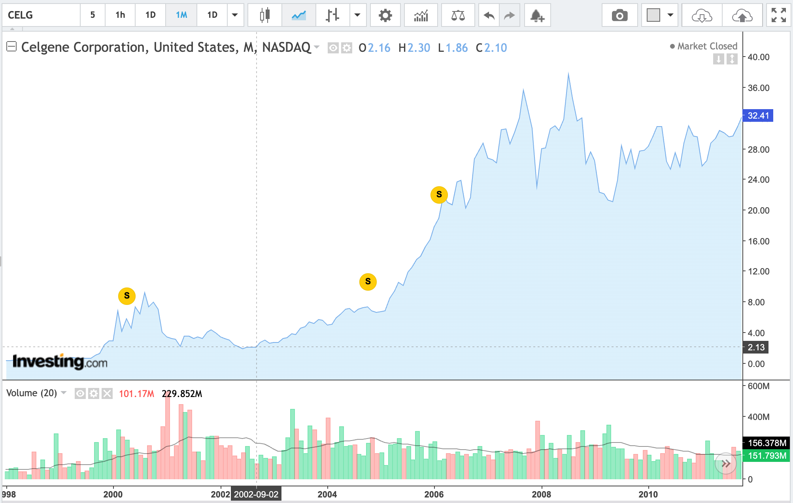
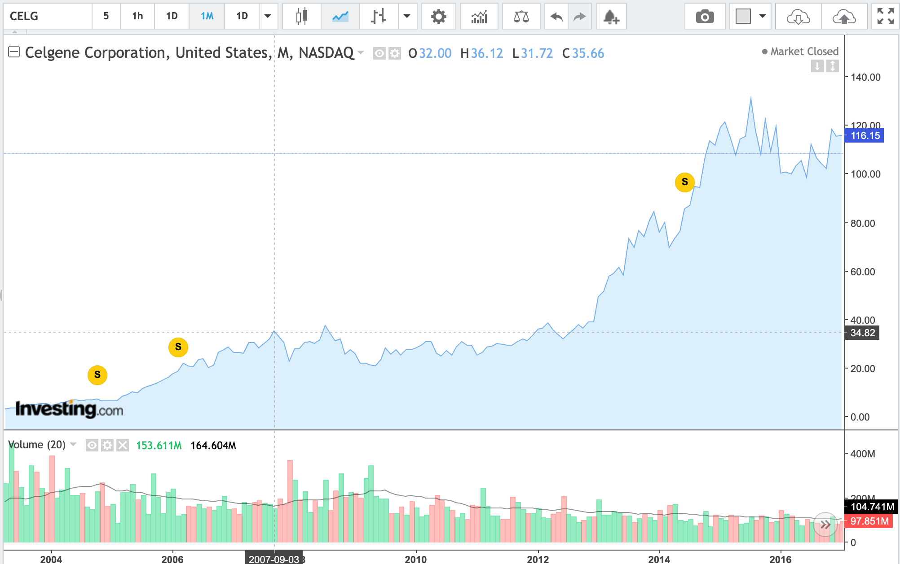
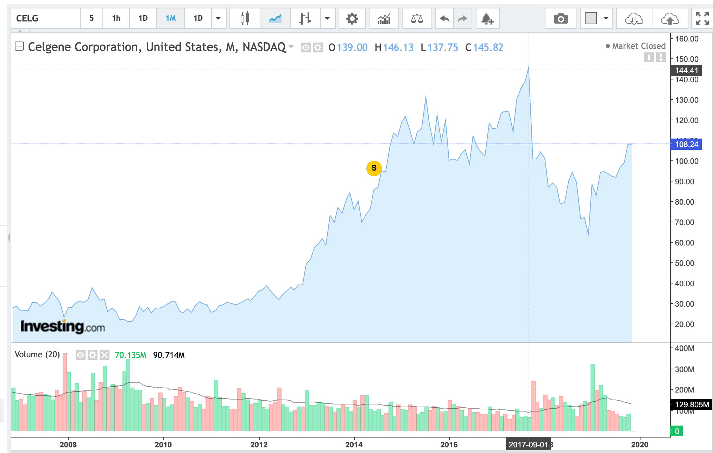

# Revlimid 2002～2017复盘

> Revlimid在2005年底获批，销售主要从2006年开始。
>
> 金融危机：2007.12 ～ 2008.12

| X 年 | 时间区间       | 点位区间    | 总收益  | 年化收益 | 历年营收 | 历年利润 | 来那度胺占比 |
| ---- | -------------- | ----------- | ------- | -------- | -------- | -------- | ------------ |
| 5   | 2002/9~2007/9  | 2.2~35.4    | 15 倍   | **74.31%** | 1.36/2.71/3.78/5.37/8.99/14.06 | -0.9/0.26/0.53/0.64/2.26 | -/-/-/-/35.7%/55% |
| 5   | 2007/9～2012/9 | 35.4～35.4  | 0       | 0        | 14.06/22.55/26.9/36.2/48.2/55 | 2.26/-15/7.8/8.8/13/14.5 | 55%/59%/63%/68%/66% |
| 5 | 2012/9～2017/9 | 35.4～144.4 | 3.08 倍 | 32.5% | 55/64.94/76.7/92.5/112.3/130 | 14.5/20/16/20/29.4 | 66%/68%/66%/65%/62.7%/62%/63% |

> 2008 年亏损是由于：收购Pharmion约17.4亿美元一次性费用；与Vidaza相关的4.25亿美元特许权付款

整体来看，来那度胺给新基提供的市值大约是 4 倍左右的峰值销售 PS，其原因有两点：

1、新基产品线单一，高度依赖来那度胺

2、爬坡慢，从获批到百亿销售，花了 14 年，市场一直在交易专利悬崖

时间线

2005年12月27日：首次获批，用于伴5q缺失的低危/中低危MDS输血依赖性贫血。

2006年6月29日：联合地塞米松，用于至少接受过一次治疗的多发性骨髓瘤。真正打开商业空间。

2013年6月5日：获批用于经过至少两线治疗、其中包括硼替佐米的复发/进展套细胞淋巴瘤。

2015年2月18日：扩展至新诊断多发性骨髓瘤。最重要的销售放量节点，从后线进入一线。

2017年2月22日：获批用于自体造血干细胞移植后的MM维持治疗。显著延长用药时间，使其成为基石药物。

2019年5月28日：联合利妥昔单抗，用于既往治疗过的滤泡性淋巴瘤和边缘区淋巴瘤。

	
	
	

金融危机时的表现：

| 指标                    | 2007年 | 2008年     | 2009年 | 2007—2009累计 |
| ----------------------- | ------ | ---------- | ------ | ------------- |
| 新基Celgene             | -19.7% | **+19.6%** | +0.7%  | 约-3%         |
| 纳斯达克生物科技指数NBI | +4.6%  | **-12.6%** | +15.6% | 约+6%         |
| 标普500                 | +3.5%  | **-38.5%** | +23.5% | 约-21%        |

| 年份 | 新基营收 | GAAP净利润 | 来那度胺销售 | 销售占比 | 新基年末市值 | 来那度胺对应市值（估） | 来那度胺对应PS |
| ---- | -------- | ---------- | ------------ | -------- | ------------ | ---------------------- | -------------- |
| 2002 | 1.36     | -0.90      | —            | —        | 16           | 4.0                    |                |
| 2003 | 2.71     | 0.26       | —            | —        | 36           | 10.8                   |                |
| 2004 | 3.78     | 0.53       | —            | —        | 44           | 17.6                   |                |
| 2005 | 5.37     | 0.64       | —            | —        | 110          | 66.0                   |                |
| 2006 | 8.99     | 0.69       | 3.21         | 35.7%    | 217          | 151.9                  | 47.4×          |
| 2007 | 14.06    | 2.26       | 7.74         | 55.0%    | 185          | 138.8                  | 17.9×          |
| 2008 | 22.55    | -15.34     | 13.25        | 58.8%    | 253          | 177.1                  | 13.4×          |
| 2009 | 26.90    | 7.77       | 17.06        | 63.4%    | 256          | 179.2                  | 10.5×          |
| 2010 | 36.20    | 8.81       | 24.66        | 68.1%    | 275          | 192.5                  | 7.8×           |
| 2011 | 48.42    | 13.18      | 32.08        | 66.3%    | 297          | 213.8                  | 6.7×           |
| 2012 | 55.07    | 14.56      | 37.67        | 68.4%    | 329          | 236.9                  | 6.3×           |
| 2013 | 64.94    | 14.50      | 42.80        | 65.9%    | 686          | 466.5                  | 10.9×          |
| 2014 | 76.70    | 20.00      | 49.80        | 64.9%    | 896          | 582.4                  | 11.7×          |
| 2015 | 92.56    | 16.02      | 58.01        | 62.7%    | 936          | 580.3                  | 10.0×          |
| 2016 | 112.29   | 19.99      | 69.74        | 62.1%    | 901          | 585.7                  | 8.4×           |
| 2017 | 130.03   | 29.40      | 81.87        | 63.0%    | 785          | 510.3                  | 6.2×           |

PS：

> 市值采用年末股权市值；来那度胺对应市值是价值归因模型估算，并非公司披露数据
>
> 来那度胺对应市值＝新基年末市值 × 来那度胺价值归因比例
>
> 对应PS＝来那度胺对应市值 ÷ 当年销售额

# 百亿美元药物分类

1、慢复利、多适应症型

代表：Humira、Revlimid、Stelara、Eliquis。

特点是：

- 首个适应症不一定很大；
- 后续不断扩大适应症、线次和治疗时长；
- 通常需要10年以上才能见顶；
- 销售峰值相对持久，累计销售额特别高。

2. 快速平台扩张型

代表：Keytruda、Dupixent、Biktarvy、Darzalex。

特点是：

- 初始疗效优势非常明确；
- 快速进入标准治疗或替代原有方案；
- 多项关键临床试验并行推进；
- 通常4–9年突破100亿美元。

3. 需求集中释放型

代表：Harvoni、新冠疫苗。

特点是：

- 极大的存量患者或突发需求；
- 1–2年即可达到峰值；
- 但销售下降也可能很快；
- 峰值销售很高，不代表累计现金流一定最高。

# 峰值销售爬坡时间

来那度胺从获批到峰值所需年数 与 其他百亿美元药物的对比

| 药物         | 首次获批 | 首次突破100亿美元 | 大致用时 | 类型                     |
| ------------ | -------- | ----------------- | -------- | ------------------------ |
| Harvoni      | 2014     | 2015              | 1年      | 丙肝治愈型，需求集中释放 |
| Mounjaro     | 2022     | 2024              | 2年      | 超大代谢市场             |
| Biktarvy     | 2018     | 2022              | 4年      | HIV固定复方替代          |
| Keytruda     | 2014     | 2019              | 5年      | 泛癌种快速扩张           |
| Skyrizi      | 2019     | 2024              | 5年      | 多免疫适应症             |
| Trikafta     | 2019     | 2024              | 5年      | 高渗透率罕见病           |
| Dupixent     | 2017     | 2023              | 6年      | Ⅱ型炎症平台              |
| Ozempic      | 2017     | 2023              | 6年      | 糖尿病与减重需求         |
| Lipitor      | 1996     | 2004              | 8年      | 超大慢病市场             |
| Eliquis      | 2012     | 2021              | 9年      | 广泛慢病、长期用药       |
| Darzalex     | 2015     | 2024              | 9年      | 多发性骨髓瘤基石药       |
| Humira       | 2002     | 2013              | 约11年   | 多免疫适应症             |
| Stelara      | 2009     | 2023              | 14年     | 免疫适应症逐步扩张       |
| **Revlimid** | **2005** | **2019**          | **14年** | **血液瘤多线次基石药**   |

这个样本首次达到100亿美元的中位时间约为 **6年**。因此来那度胺的14年大约是中位数的两倍，属于最慢的一档。

为什么达峰很慢：

它不是一上市就面对百亿美元市场，而是逐层打开市场：

2005年：首先获批的del(5q) MDS患者群很小；

2006年：进入既往治疗过的多发性骨髓瘤；

随后逐步全球化；

2015年：进入新诊断多发性骨髓瘤，患者基数显著扩大；

2017年：获批移植后维持治疗，治疗时长大幅增加；

2019年：进入滤泡性及边缘区淋巴瘤；

2021年：在仿制药进入前达到峰值。

来那度胺的增长公式不是单纯增加新患者，而是：

> 患者数增加 × 治疗线次前移 × 单个患者用药时间延长 × 全球渗透率提高 × 持续提价。

