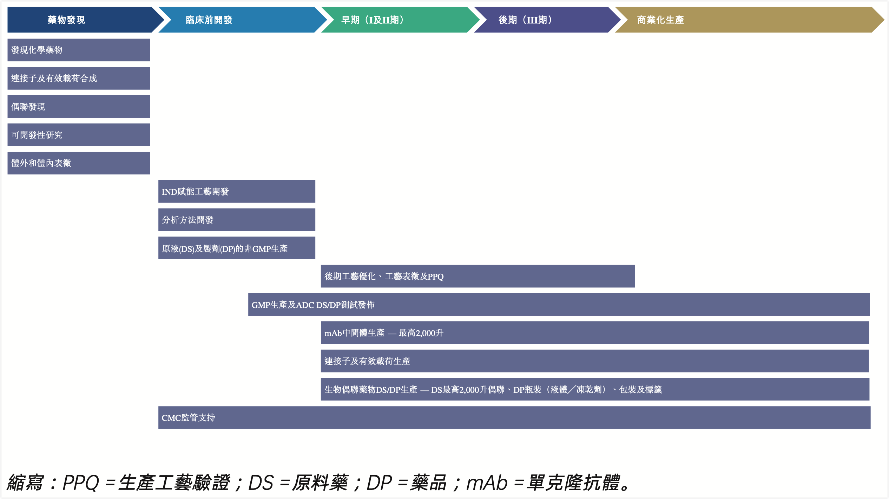

项目类型

| 开发阶段 | 一般时长  | 2024 项目数目 | 2024 项目类型               | 2025 项目数目 | 2025 项目类型               |
| -------- | --------- | ------------- | --------------------------- | ------------- | --------------------------- |
| 发现     | 不适用¹   | 681⁴          | ADC（513）及 XDC（168）     | 1,039⁴        | ADC（773）及 XDC（266）     |
| 临床前   | 1 至 2 年 | 102           | ADC（97）及 XDC（5）        | 124           | ADC（110）及 XDC（14）      |
| 临床     | 多年²     | 92            | ADC（80）及 XDC（12）       | 128           | ADC（116）及 XDC（12）      |
| **合计** | —         | **875**       | **ADC（690）及 XDC（185）** | **1,291**     | **ADC（999）及 XDC（292）** |

增速计算

| 项目类型 | 2024 年 | 2025 年 | 增加数量 | 增速      |
| -------- | ------- | ------- | -------- | --------- |
| ADC      | 690     | 999     | 309      | **44.8%** |
| XDC      | 185     | 292     | 107      | **57.8%** |

其中，XDC 项目增速比 ADC 高约 **13.0 个百分点**。


# WuXiDAR x™、X-Lin C、 WuXiTecan-1及WuXiTecan-2

| 技术            | 所处环节         | 一句话理解                                         |
| --------------- | ---------------- | -------------------------------------------------- |
| **WuXiDARx™**   | 偶联工艺         | 决定药物接在抗体哪里、每个抗体接几个药物           |
| **X-LinC™**     | 连接头/Connector | 让药物在血液循环中更牢固地连接在抗体上             |
| **WuXiTecan-1** | 连接子—载荷      | 新型拓扑异构酶Ⅰ抑制剂载荷方案                      |
| **WuXiTecan-2** | 连接子—载荷      | Exatecan＋亲水连接子，重点改善高DAR及双载荷ADC性能 |

可以把一款ADC简化成：

```
抗体 — 连接头 — 可裂解连接子 — 细胞毒载荷
  ↑        ↑                    ↑
WuXiDARx  X-LinC       WuXiTecan-1/-2
控制偶联   提高稳定性       决定杀伤机制
```

但这只是功能示意，并不代表四项技术必须同时使用。药明合联公开的 WuXiTecan-1/-2 原型资料中，连接头仍标注为马来酰亚胺（maleimide）。

## 1. WuXiDARx™：控制DAR和产品均一性的偶联平台

DAR 是 Drug-to-Antibody Ratio，即平均每个抗体连接多少个载荷。传统随机半胱氨酸偶联容易形成 DAR0、DAR2、DAR4、DAR6、DAR8 等多种组分的混合物，可能影响：

- 药效和毒性的一致性
- 血液中的药代动力学
- 聚集倾向和稳定性
- 分析、工艺放大及质量控制难度

WuXiDARx 以抗体的**链间半胱氨酸/二硫键位点**为基础，通过偶联和富集工艺收窄DAR分布。主要特点包括：

- 可直接使用天然 IgG1，一般不需要对抗体进行蛋白工程改造；
- 可选择不同目标DAR；
- 可兼容多种常用连接子—载荷；
- 相比复杂的工程化定点偶联，CMC和规模化制造过程较为简化；
- 可用于普通ADC，也可扩展至双载荷ADC、双抗ADC、AOC和APC等。

根据药明合联2026年4月更新的资料，平台目前覆盖 **DAR1、DAR2、DAR4和DAR6**；官方披露已应用于8个进入临床阶段的ADC、10个CMC项目，并实现超过2公斤的批次规模。需要注意，较早的公司资料主要披露DAR2、DAR4和DAR6，这是平台迭代造成的口径变化。[药明合联 WuXiDARx 官方技术资料](https://wuxixdc.com/empowering-development-of-next-generation-adcs-xdcs-through-advanced-wuxidarx-conjugation-technologies/)

它的核心价值可以概括为：

> 用较为成熟的抗体链间半胱氨酸位点，获得接近定点偶联的DAR控制，同时尽量降低抗体改造和规模化生产的复杂度。

不过，“已有8个ADC进入临床”表示这些分子使用了该平台，并不等于平台已经通过临床试验证明能改善患者疗效或安全性。

## 2. X-LinC™：替代传统马来酰亚胺的稳定连接头

传统ADC常通过“马来酰亚胺—巯基”反应，把连接子—载荷连接到抗体半胱氨酸上。其问题是形成的连接键可能发生**逆迈克尔加成（retro-Michael reaction）**：

```
ADC在血液中循环
        ↓
连接键发生逆反应
        ↓
载荷提前从抗体脱落
        ↓
有效暴露下降＋正常组织非靶向毒性风险上升
```

X-LinC 是药明合联开发的**线性巯基反应连接头**，主要卖点是：

- 对抗体巯基具有较高反应活性；
- 偶联效率较高；
- 血浆稳定性优于传统马来酰亚胺连接方式；
- 与 WuXiDARx 偶联平台兼容。

因此，X-LinC主要解决的是“**连接是否牢固**”，而不是“载荷杀伤力有多强”。公司希望借此降低载荷在循环中过早脱落，从而扩大ADC的治疗窗口。[药明合联 X-LinC 官方介绍](https://wuxixdc.com/x-linc/)

截至目前，其优势主要来自公司的体外及动物研究；临床层面的稳定性、安全性和疗效优势仍待进一步验证。

## 3. WuXiTecan-1：新型TOP1抑制剂载荷方案

WuXiTecan-1 是一套完整的**连接子—载荷（linker-payload）技术**。公开结构框架为：

| 组成部分     | WuXiTecan-1                    |
| ------------ | ------------------------------ |
| 载荷         | 新型拓扑异构酶Ⅰ抑制剂（TOP1i） |
| 可裂解连接子 | GGFG四肽连接子                 |
| 释放方式     | 进入细胞溶酶体后由肽酶裂解     |
| 抗体连接头   | 马来酰亚胺                     |
| 主要目标     | 在DXd级别药效基础上改善耐受性  |

工作机制大致是：

1. ADC与肿瘤细胞表面抗原结合；
2. ADC被内吞进入溶酶体；
3. 溶酶体肽酶切开GGFG连接子；
4. TOP1抑制剂载荷释放；
5. 干扰DNA复制并杀伤肿瘤细胞。

药明合联披露的前临床结果包括：

- 游离载荷活性与DXd相当；
- 在CDX模型中，WuXiTecan-1 ADC的抗肿瘤效果与DS-8201（德曲妥珠单抗）对照相当；
- 小鼠急性毒性研究中耐受性优于DS-8201对照；
- 食蟹猴预毒理研究中，`55 mg/kg、每3周一次、共3次`表现出较好耐受性。

这些结果来自公司前临床研究，不能直接推导为人体临床优于DXd。药明合联目前仅将其公开描述为“新型TOP1i载荷”，没有完整公开其化学结构，因此也不宜直接把WuXiTecan-1称为Exatecan载荷。[药明合联技术平台手册（PDF）](https://wuxixdc.com/wp-content/uploads/WuXi-XDC_Technology-Platform-1.pdf)

## 4. WuXiTecan-2：针对高DAR和双载荷ADC优化的亲水型Exatecan方案

WuXiTecan-2采用的是：

| 组成部分   | WuXiTecan-2                         |
| ---------- | ----------------------------------- |
| 载荷       | Exatecan，拓扑异构酶Ⅰ抑制剂         |
| 连接子     | 新型亲水连接子                      |
| 释放方式   | 溶酶体肽酶裂解                      |
| 抗体连接头 | 公开原型采用马来酰亚胺              |
| 主要目标   | 改善亲水性、血浆稳定性和高DAR适用性 |

Exatecan的优势是细胞毒活性较强，但相关连接子—载荷可能具有较高疏水性。随着DAR升高，疏水问题可能进一步放大，导致：

- ADC聚集；
- 清除速度加快；
- 药代动力学变差；
- 非特异性摄取和毒性增加；
- 双载荷ADC的开发难度上升。

WuXiTecan-2通过加入亲水连接子，对Exatecan的疏水性进行补偿，因此尤其适合：

- DAR8等高DAR ADC；
- 双载荷ADC；
- 双抗ADC；
- 需要同时兼顾高载荷量和可开发性的项目。

公司2026年公开的前临床资料显示：

- 在啮齿类动物和食蟹猴中表现出较好的PK特征，载荷脱落较少；
- DAR8 ADC在食蟹猴研究最高测试剂量 `45 mg/kg、每3周一次、共3次`下可耐受；
- 在公司动物模型中，药效优于DXd类对照，与其他临床开发中的Exatecan连接子—载荷相当；
- 在双载荷ADC中表现出更持久的抗肿瘤活性；
- 公司也提示，双载荷方案仍可通过进一步优化连接子来改善安全性。[WuXiTecan-2官方科学海报](https://wuxixdc.com/wuxitecan-2-a-hydrophilic-exatecan-linker-payload-for-dual-payload-adc-discovery/)

商业化方面，药明合联在2026年2月将 WuXiTecan-2 针对若干特定靶点的全球独家许可授予 Earendil Labs，潜在总交易金额约8.85亿美元，另含销售分级特许权使用费。这说明它已开始从内部服务工具转向可独立授权的技术资产，但交易金额主要由未来里程碑构成，不能等同于已经实现的收入或临床验证。[药明合联与Earendil Labs合作公告](https://wuxixdc.com/wuxi-xdc-enters-strategic-collaboration-with-earendil-labs-on-wuxitecan-2-payload-linker-technology-platform/)

## 四项技术的核心区别

| 比较维度         | WuXiDARx                  | X-LinC                 | WuXiTecan-1           | WuXiTecan-2                       |
| ---------------- | ------------------------- | ---------------------- | --------------------- | --------------------------------- |
| 技术类别         | 偶联平台                  | 连接头                 | 连接子—载荷           | 连接子—载荷                       |
| 主要解决问题     | DAR分布和均一性           | 循环中脱载荷           | TOP1i药效与耐受性平衡 | Exatecan疏水性、高DAR及双载荷开发 |
| 是否决定杀伤机制 | 否                        | 否                     | 是，TOP1抑制          | 是，TOP1抑制                      |
| 主要差异化       | 无需改造天然IgG1、DAR灵活 | 比传统马来酰亚胺更稳定 | 新型TOP1i＋GGFG       | Exatecan＋亲水连接子              |
| 当前验证程度     | 已用于多个临床阶段分子    | 以体外和前临床数据为主 | 前临床                | 前临床，已达成对外授权            |

从战略角度看，药明合联正在从单纯提供ADC研发生产服务，进一步向“**CRDMO服务＋自主偶联技术＋自主连接子/载荷IP**”延伸。其中，WuXiDARx更接近成熟的工艺平台；X-LinC强化连接稳定性；WuXiTecan-1/-2则让公司进入价值更高、但临床风险也更高的载荷技术领域。