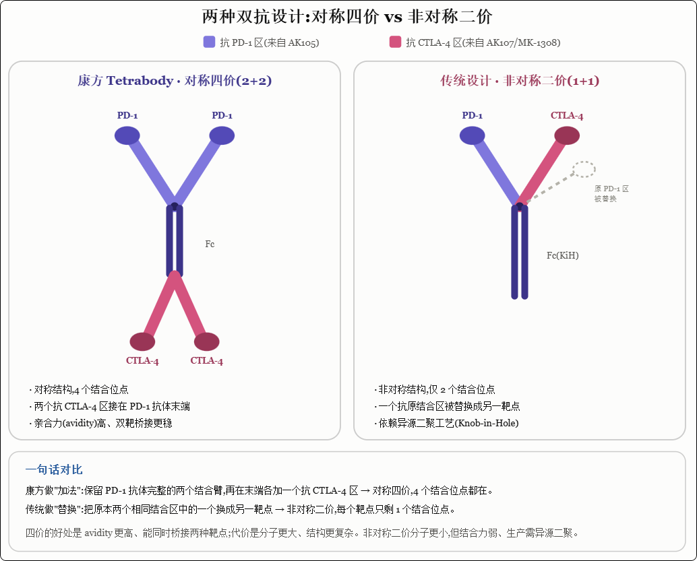
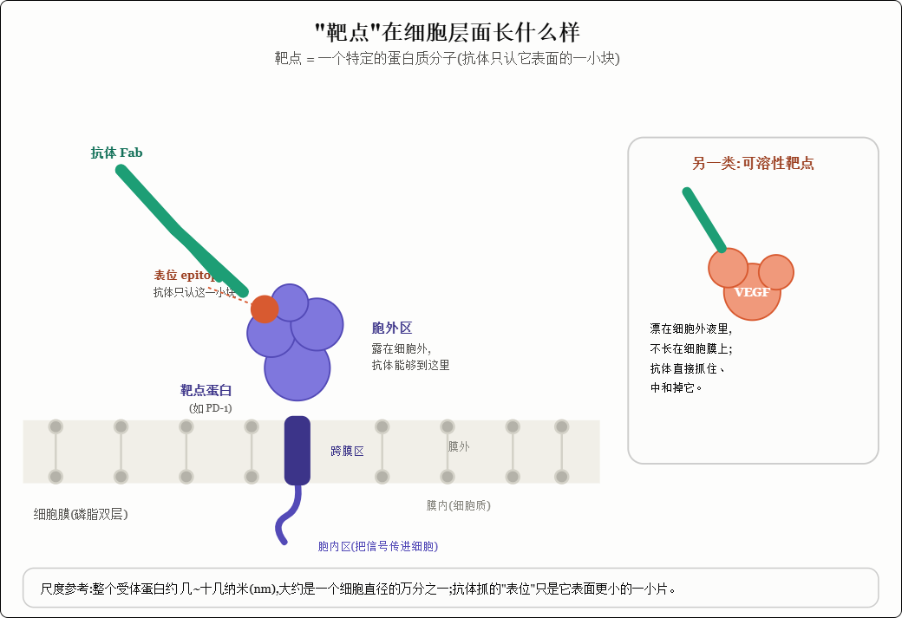

多看看 biotech 案例就知道了，没人会等营收到了峰值再买的，除非是营收超预期，都是在临床数据关键节点前后上桌，直接把预期的一大半打满的。


## PD-1和PD-L1的区别

> **PD-1抗体**和**PD-L1抗体**的目标都是打断同一条免疫检查点轴——**PD-1 ↔ PD-L1**——但它们从**不同端点**去剪断这根线，而这条线的两端并不对称，导致阻断范围、脱靶后果和临床特征都有实质差异。

```
活化T细胞表面：          肿瘤细胞 / APC / 微环境细胞表面：
     PD-1  ←───────────────  PD-L1（B7-H1，CD274）
                              │
                              └── 也可以结合 CD80（B7-1）on T cells → 抑制
     
PD-1 还能结合：            PD-L2（B7-DC，PDCD1LG2）——主要在DC上
     PD-L2 → PD-1 也抑制T细胞
```

| **分子**           | **主要表达位置**                               | **谁的结合伙伴**                      |
| :----------------- | :--------------------------------------------- | :------------------------------------ |
| **PD-1（CD279）**  | 活化的 CD4⁺/CD8⁺ T细胞、NK、部分B细胞          | PD-L1 **+** PD-L2                     |
| **PD-L1（CD274）** | 肿瘤细胞、DC、巨噬细胞、内皮细胞、部分正常组织 | PD-1（主）+ **CD80**（反向/侧向信号） |
| **PD-L2**          | 主要 DCs（炎症诱导），少数肿瘤细胞             | **只**结合 PD-1（不结合CD80）         |

**把PD-1这个"刹车踏板"整个盖住**，不管配体是L1还是L2，信号都进不来，理论上更彻底的免疫"解锁"

阻断的是 PD-L1这个配体 → 只切断：PD-L1 → PD-1，PD-L2 → PD-1   ← 这条路仍然通着，同时也可能影响 PD-L1的"逆向信号"


PD-L1的"逆向信号"

PD-L1不仅是"发给T细胞的抑制信号"，它自己被结合后也会在**肿瘤细胞/APC内部**触发信号传导（通过胞内尾部的磷酸化/转录调控），影响：肿瘤细胞自身的**糖酵解、增殖、耐药性**、巨噬细胞/DC的**细胞因子分泌谱**

抗PD-L1抗体去结合PD-L1时，**本身可能作为激动剂或拮抗剂影响肿瘤细胞内部的信号状态**——这与抗PD-1（作用在T细胞端、不影响肿瘤细胞自身PD-L1的信号功能）是根本不同的作用模式。


PD-L1"更精准"是理论，现实中没那么干净

|                                 | **抗PD-1**                         | **抗PD-L1**                                                  |
| :------------------------------ | :--------------------------------- | :----------------------------------------------------------- |
| **甲状腺功能障碍**（甲减/甲亢） | **更常见**（~8-10%甚至更高）       | 相对低一些                                                   |
| **肺炎**                        | 略高趋势                           | 略低趋势（尤其Durvaluma在胸部放疗背景下的pneumonitis需要单独看） |
| **结肠炎**                      | Nivo更明显（联合Ipilimumab时暴增） | 总体偏低                                                     |
| **总体≥3级 irAE**               | 大致 10-15%范围                    | 大致 8-12%范围                                               |

**为什么PD-L1理论上更安全？**

- PD-1还参与**外周免疫耐受**的维持（胸腺选择后的Treg功能、组织驻留免疫细胞稳态）
- 完全封死PD-1（含PD-L2通路）→ 更容易打破"不该打破"的自免耐受 → 更多内分泌器官受累
- PD-L1抗体**不碰PD-L2→PD-1**，保留了部分生理刹车

**但现实是**：差异存在，但**远不如"PD-1抗体 vs CTLA-4抗体"那种量级大**，临床上不会因为"想少点肺炎"就机械选PD-L1——疗效和给药便利性往往更决定选择。


Biomarker困境：为什么"测PD-L1表达"两边都不完美

| **问题**                | **说明**                                                     |
| :---------------------- | :----------------------------------------------------------- |
| **空间异质性**          | 一张切片里的PD-L1% 不能代表整个肿瘤的异质表达                |
| **时间动态**            | 治疗后PD-L1可以上调（IFN-γ反馈）或丢失                       |
| **判读标准分裂**        | 22C3（Pembro的伴诊）、28-8（Nivo）、SP142（Atezo）、SP263——不同克隆/算法，cut-off不同，**不能直接互换** |
| **PD-L1阴性也能有效应** | 尤其是抗PD-1——因为有PD-L2通路、肿瘤新抗原负荷、TME免疫细胞上PD-L1等因素交叉影响 |


速查表：

| **维度**                       | **靶向 PD-1**（Nivo / Pembro / Cemiplimab…） | **靶向 PD-L1**（Atezo / Duru / Avelumab）                    |
| :----------------------------- | :------------------------------------------- | :----------------------------------------------------------- |
| 阻断目标位置                   | T细胞表面的**受体**                          | 肿瘤细胞/APC表面的**配体**                                   |
| 切断的通路                     | **PD-L1→PD-1 + PD-L2→PD-1**（全断）          | **只断PD-L1→PD-1**，PD-L2→PD-1残留                           |
| 对肿瘤细胞PD-L1 reverse signal | 无直接影响                                   | 可能干扰（激动/拮抗效应不确定）                              |
| 典型给药                       | 每2周/每4周（Pembro Q6W也有）                | Atezo Q2W或Q3W固定剂量；Duru Q2W或Q4W                        |
| 甲状腺 irAE                    | 略多                                         | 略少                                                         |
| 保留PD-L2通路                  | ❌                                            | ✅（理论优势：更"生理性"的免疫刹车保留）                      |
| 临床地位                       | **主导市场**（K药/O药奠定标准）              | 有明确niche（UC二线Avelumab、ES-SCLC+化疗Atezo、Ⅲ期NSCLC放化疗后Durvalumab巩固） |

##  T细胞耗竭

耗竭按字面意思理解，不应该是T细胞没力气了吗，免疫检查点抑制剂看起来则是让细胞蒙上的眼睛重新睁开的作用，是耗竭翻译有问题吗？

答案是：**不是中文翻译的问题，是"exhaustion"这个词在英文原文里本来就起得不够准**。免疫学家自己也吐槽过这个命名。我帮你把"耗竭"到底是什么状态讲清楚。

字面看，exhaustion / 耗竭让人以为是"T细胞把力气/燃料用光了，瘫了"。但真实的耗竭**不是资源耗尽，而是一种被主动维持的"功能抑制状态"**。

打个比方：耗竭的T细胞不是一辆"没油的车"，而是一辆"油还在、但被人一直踩着刹车、还锁了挡"的车。它不动，不是因为没动力，是因为被一套抑制信号（PD-1、LAG-3、TIM-3 这些检查点）持续按住了。这是一个被基因程序精细调控的分化状态，不是简单的"累趴下"。

**那为什么还叫"耗竭"**：因为这种状态确实**伴随真实的功能衰退**——耗竭的T细胞分泌细胞因子变少、增殖能力下降、代谢也出问题。从"干活能力变差"这个表象看，确实像"累了"，所以早期科学家就借用了exhaustion这个词。但后来发现本质是"被抑制"而非"被耗尽"，名字却沿用下来了。

**所以你"蒙眼睛重新睁开"的理解，其实更接近真相**

免疫检查点抑制剂的作用，准确说是**松开刹车 / 解除抑制信号**，让被按住的T细胞重新动起来。你说的"重新睁眼"抓住了核心——它不是给细胞"充电加油"，而是"解除封印"。这正是为什么这类药叫"检查点抑制剂"（抑制的是那个刹车），而不叫"T细胞兴奋剂"。

耗竭其实分层次：

浅度耗竭（前体/祖细胞样耗竭）——刹车松开后能"满血复活"，这是检查点抑制剂主要救回来的那群细胞。 深度耗竭（终末耗竭）——这群细胞被压制太久，已经发生了不可逆的表观遗传改变，**就算松了刹车也救不太回来了**，这时候就真有点"力气用光、回不去了"的意思。

所以你的两种直觉各对一半：检查点抑制剂主要是"松刹车/睁眼"（对浅度耗竭有效），但"没力气了"也确实存在（深度耗竭就是这种，且松刹车也无力回天）。这也正是当前免疫治疗的一大难题——怎么对付那些"松了刹车也救不回来"的终末耗竭T细胞。

**一句话总结**

"耗竭"是个起得不太准的历史名字（英文原文就不准，不是中译问题）；它的本质是"被抑制信号按住的功能失调状态"，不是字面的"能量耗尽"；检查点抑制剂干的就是"松刹车让细胞睁眼"，你的理解是对的——只不过对那些被压制太久的细胞，确实已经"睁不开眼"了。


## 靶点记忆与分类


**框架一：按"免疫循环"七步走（最本质）**

肿瘤免疫有个经典模型叫"肿瘤-免疫循环"，免疫系统杀肿瘤要走完一圈：①肿瘤抗原释放 → ②抗原被提呈 → ③T细胞被激活 → ④T细胞跑到肿瘤 → ⑤浸润进肿瘤 → ⑥识别肿瘤 → ⑦杀死肿瘤。每一步都可能被卡住，每个卡点就对应一类靶点。你看到一个新靶点，就问自己"它管的是哪一步"，自然记住。

**框架二：按"刹车 vs 油门"分两大类（最实用）**

这是临床上最主流的分法：

抑制性靶点（松刹车，抗体去阻断它）——PD-1/PD-L1、CTLA-4、LAG-3、TIM-3、TIGIT、VISTA。这些是T细胞身上的"别开枪"信号，药物把它们堵住，T细胞就重新开火。你上一条问的耗竭marker全在这一类。

激动性靶点（踩油门，抗体去激活它）——CD28、4-1BB(CD137)、OX40、GITR、CD40。这些是"加油干"信号，药物去激活它们，让T细胞更猛。

**框架三：按"作用的细胞类型"分（补充维度）**

T细胞通路（上面大部分）、NK细胞通路（如NKG2A、KIR）、巨噬细胞通路（如CD47-SIRPα"别吃我"信号）、代谢通路（如你提到的CD73-腺苷轴，属于肿瘤微环境的免疫抑制代谢）。


## 具体靶点种类成药

这几个靶点成药治疗的癌症种类是一样的吗？

虽然CTLA-4、PD-1、PD-L1机制相近（都是松刹车），但每个药获批的癌种是**靠各自的临床试验一个一个"打"出来的**，不是机制对了就自动通用。所以适应症既重叠又有差异：

重叠的部分——黑色素瘤、非小细胞肺癌、肾癌、肝癌等"热肿瘤"，PD-1、PD-L1、CTLA-4类药基本都有涉足。

 差异的部分——比如CTLA-4的伊匹木单抗主要靠和PD-1联用（单用毒性大、适应症窄）；

PD-1的K药适应症极广（几十个），而同为PD-1的其他药可能只批了几个癌种；PD-L1类药在某些癌种（如膀胱癌、小细胞肺癌）布局更多。

 所以"靶点相似"不等于"适应症相同"，每个药能治什么，取决于它做了哪些试验、哪些读出了阳性结果。


## PD-1/PD-L1阳性 / >=50%

你说的应该是 **PD-L1 ≥ 50%**（PD-L1 是肿瘤那端的配体，别和PD-1混了）。这个"50%"是个**评分阈值**——指做病理检测时，肿瘤里有多少比例的细胞表面带PD-1的配体PD-L1。我讲清楚这个数字怎么来的、为什么要分这个线。

**这个百分比是怎么测出来的**

医生取一块肿瘤组织切片，用免疫组化（IHC）染色，把表达PD-L1的细胞染出来，然后在显微镜下数：**有多少比例的肿瘤细胞被染上了（膜上有PD-L1）**。这个比例就叫 **TPS（Tumor Proportion Score，肿瘤细胞阳性比例评分）**。

PD-L1 ≥ 50% = 肿瘤里至少一半的肿瘤细胞表面挂着PD-L1。 

1% ≤ PD-L1 < 50% = 表达不少，但没到一半。 

PD-L1 < 1% = 基本算阴性。


**为什么偏偏切在50%这条线**

因为临床试验数据发现，**PD-L1表达越高，用Anti-PD-1药物的获益越大**，而50%是一个有显著意义的分水岭


不同癌种、不同药，用的评分体系还不一样：肺癌常用TPS（只数肿瘤细胞），有些癌种用CPS（Combined Positive Score，把肿瘤细胞+周围免疫细胞一起数），阈值也不同（比如CPS≥1、≥10）。所以看到"PD-L1≥50%"要留意它说的是哪种评分、哪个癌种。


## 目前哪些癌症还没有药可用，或者用药效果很差

**一、整体预后最差、药物效果普遍很差的癌症**

这几个是公认的"硬骨头"，五年生存率长期很低：

胰腺癌——最典型的难治癌，五年生存率只有约12%，晚期（IV期）更是低到3%左右。发现时多已转移，对化疗、靶向、免疫几乎都不敏感。

 胶质母细胞瘤（GBM，恶性脑瘤）——五年生存率不到10%，多数病人确诊后存活不到两年。肿瘤弥漫性侵入正常脑组织、突变极快，标准治疗（手术+放疗+替莫唑胺）几十年没大突破。

肝癌、晚期肺癌、卵巢癌、三阴性乳腺癌——也都属于预后差、缺乏长期有效药物的类别。


**二、专门对免疫治疗（PD-1那一类）几乎无效的癌症——"冷肿瘤"**

最典型的三个冷肿瘤：

胰腺癌——被公认为"最难啃的冷肿瘤"，周围裹着致密的纤维基质，T细胞连肿瘤都接近不了，免疫抑制微环境极强。
 胶质母细胞瘤（脑瘤）——大脑本身是"免疫特权区"，加上强免疫抑制环境，T细胞极难发挥。
 前列腺癌（去势抵抗期）——也是典型冷肿瘤，目前是各种新型免疫疗法重点攻关的对象。

相比之下，**黑色素瘤、肺癌、肾癌、部分MSI-H肠癌**这些是"热肿瘤"——本身T细胞浸润多，所以PD-1抗体效果好。这也再次印证了我们前面的结论：有没有PD-1阳性的T细胞在场，比单看肿瘤PD-L1更能决定疗效。

**三、业界正在怎么攻这些难治癌（2025-2026的方向）**

核心思路就是**"把冷肿瘤变热"**——既然没兵，就想办法把T细胞引进来或硬塞进去，然后再松刹车：

溶瘤病毒——用病毒感染肿瘤、制造"炎症",把免疫细胞招募过来（如pelareorep等在试把冷肿瘤转热）。
 T细胞衔接器双抗（TCE）——就是我们第三轮聊的双抗，一手抓T细胞一手抓肿瘤，硬把T细胞拽到肿瘤上，不依赖肿瘤自己招募。前列腺癌是目前这类药最活跃的战场。
 TIL疗法（过继性细胞治疗)——直接把大量T细胞回输进体内，有研究显示反复多次TIL输注能在胶质母细胞瘤里取得缓解。
 联合疗法——免疫药+化疗/放疗/抗血管生成药等组合，先破坏肿瘤的免疫抑制屏障。


三阴性乳腺癌（TNBC）——**有，且进展最快**。依沃西联合方案一线治疗TNBC已进入III期（HARMONi-BC1/AK112-308），并第四次拿到突破性疗法认定（BTD）。此外还有下一代HER3 ADC（AK138D1）联合依沃西治疗晚期乳腺癌的Ib/II期。

胰腺癌——**有，双线布局**。依沃西联合方案一线治疗胰腺癌的III期（HARMONi-GI2/AK112-310）正在推进；卡度尼利方案治疗局部晚期胰腺癌的II期（COMPASSION-26）在2026年AACR上报告了有前景的生存获益。康方还启动过胰腺癌个性化mRNA疫苗的临床研究。


## 人源化IgG4单克隆抗体

这是描述抗体药物"身份"的一串技术参数，正好就是K药（帕博利珠单抗）这类PD-1抗体的标准描述。它由三个词拼成，每个词说明抗体的一个属性。我逐个拆开。

**单克隆抗体（monoclonal antibody）——说"纯度/来源"**

"克隆"指来自同一个母细胞、一模一样的复制品。单克隆抗体就是**由单一细胞系生产、结构完全相同、只认一个特定靶点**的抗体。和它相对的是"多克隆抗体"（一堆不同抗体的混合物，认很多位点）。做药必须用单克隆——这样每一支药分子都一样、精准只打一个靶点（比如只抓PD-1），质量可控。前面说的"单抗"就是它的简称。

**人源化（humanized）——说"它有多像人"**

抗体药最早是用**小鼠**做出来的（鼠源抗体）。但把鼠源抗体打进人体，人的免疫系统会把它当外来异物攻击，引起过敏、药效被中和。为解决这个问题，工程上不断"把鼠的成分换成人的"，形成一个由"鼠"到"人"的谱系：

鼠源（全鼠，-omab）→ 嵌合（约65%人源，-ximab）→ **人源化（约90-95%人源，只保留鼠的关键识别区，-zumab）** → 全人源（100%人，-umab）。

"人源化"就是倒数第二档：**绝大部分是人的序列，只在直接抓靶点的那一小段保留鼠源**。好处是既保住了精准识别能力，又把免疫排斥降到很低。K药的英文名 pembrolizu**mab** 里的"-zumab"就标明它是人源化抗体。

**IgG4——说"它是哪个亚型、脾气如何"**

抗体（免疫球蛋白Ig）按结构分G/A/M/E/D几大类，其中IgG又分IgG1、IgG2、IgG3、IgG4四个亚型。选哪个亚型很关键，因为它决定抗体除了"抓靶点"之外**还会不会顺手杀死被它结合的细胞**：

IgG1——效应功能强，能召唤免疫系统去**杀死**它结合上的细胞（ADCC/CDC作用）。 IgG4——效应功能很弱，基本**只结合、不杀伤**。

PD-1抗体为什么特意选IgG4？因为它结合的是**T细胞**（我们前面说过，PD-1阳性的是T细胞，不是肿瘤）。药的目的是"松刹车救活T细胞"，**绝不能反过来把这些T细胞杀掉**。所以必须选效应功能弱的IgG4，只盖住PD-1、不伤害T细胞。这是个非常精心的设计选择。

**把三个词合起来**

"人源化IgG4单克隆抗体" = 一个由单一细胞系生产、只认一个靶点（单克隆）、绝大部分序列是人的、免疫排斥很低（人源化）、且只结合不杀伤目标细胞（IgG4）的抗体药物。这套组合正是为PD-1抑制剂量身定制的——精准、安全、不误伤T细胞。

**一句话总结**

它就是K药那类PD-1抗体的标准身份：单克隆=纯净只打一个靶；人源化=像人、不易被排斥；IgG4=温和、只盖刹车不杀T细胞。三个属性合在一起，保证药物既精准又不会伤到它本想拯救的T细胞。

[免疫漫游指南](./免疫漫游指南.html)


回复[@儿子他爹](https://xueqiu.com/n/儿子他爹): 这种都是 yy 的，等结果出来就知道了，康方早就定位出海，和某些同行怎么可能一个层次再一个就是有些人比较崇洋媚外，觉得国内临床数据水分大，殊不知国外 MNC 一样的，隐瞒副作用之类的事件比比皆是，后面这种人就只是单纯的外国的月亮比较圆而已我是相信康方生物的，数据出来自见分晓//[@儿子他爹](https://xueqiu.com/n/儿子他爹):回复[@TfR1lyxxx快乐鼠鼠](https://xueqiu.com/n/TfR1lyxxx快乐鼠鼠):有人说国内的数据可信度不高，请问有没有数据驳斥这样的观点？其他药企在国内和国际临床试验上数据差异大吗？


## 为什么说肿瘤微环境会阻碍T细胞，肿瘤附近的血管不也是通路吗，T细胞是在血液里流通吗

**1. T 细胞确实在血里巡逻,但要"下车"才能进组织**

T 细胞在血流里循环,要进入组织得经过"贴壁—滚动—穿过血管壁"这一套流程,依赖血管内皮上的黏附分子(如 ICAM-1、选择素)和趋化因子的"指路信号"。正常炎症时这套信号会上调,把 T 细胞招募进去。

**2. 肿瘤血管是"坏血管",反而挡住 T 细胞**

肿瘤在 VEGF 等因子驱动下长出来的血管是畸形的:走向混乱、渗漏、压力高、内皮排列不整齐。后果是:

- VEGF 会**下调内皮上的黏附分子**,T 细胞贴不住、穿不过去(这叫"内皮屏障/anergy")。
- 血管渗漏导致组织间压升高,血流灌注差,药物和细胞都难均匀进入。
- 肿瘤还会建立"内皮死亡屏障"(FasL 等),专门让效应 T 细胞死亡、却放行调节性 T 细胞(Treg)。

所以"血管通到肿瘤旁边"不等于 T 细胞能顺利进去——这正是抗 VEGF/血管正常化能增强免疫治疗的理论基础,也是 PD-1×VEGF 双抗设计的逻辑:一边松开 PD-1 刹车,一边修血管让 T 细胞进得来。

**3. 就算进去了,TME 还会继续"压制"T 细胞**

进入肿瘤的 T 细胞还要面对一套抑制环境:

- **免疫检查点**:肿瘤高表达 PD-L1,结合 T 细胞上的 PD-1,把 T 细胞"踩刹车"使其耗竭(exhaustion)。
- **代谢饥饿与缺氧**:肿瘤抢夺葡萄糖、谷氨酰胺,产生乳酸、腺苷,低 pH、低氧都让 T 细胞失能。
- **抑制性细胞**:Treg、髓系来源抑制细胞(MDSC)、M2 巨噬细胞分泌 TGF-β、IL-10 等压制 T 细胞。

**一句话总结**:T 细胞在血里是流通的,但肿瘤通过"异常血管挡门 + 进去后耗竭/饿死/被压制"这两道关卡来逃避免疫。这也是为什么单纯抗 VEGF(改善通路)、单纯抗 PD-1(松刹车)各有局限,而把两者合一会有协同效应。


## 抗体为何常为双Fab



单臂抗体确实存在(比如雷珠单抗 ranibizumab、certolizumab 就是只有一个 Fab 的片段药物)。但天然抗体几乎都是两个臂,这是进化挑出来的设计,主要有三个原因:

**1. 亲合力(avidity):两只手抓得比一只手牢得多**

单个 Fab 和抗原的结合强度叫亲和力(affinity),往往不算强,容易解离。但有两个臂时,即使一只手松开,另一只手还抓着,松开的那只马上又能重新结合——这种"二价协同"让整体结合强度呈指数级放大,可以比单臂强成百上千倍。这就是前面聊双抗时说的 avidity。面对表面抗原密集的病原体或细胞,两个臂的意义尤其大。

**2. 交联/凝集:能把目标"串起来"**

两个臂可以同时抓住两个不同的抗原分子或两个病原体,把它们交联、聚成一团(凝集反应),也能形成免疫复合物。这能直接中和病原体、阻止其活动,并便于被清除。单臂抗体只能"贴住"一个目标,做不到这种桥接。

**3. 激活下游免疫功能往往需要"成簇"**

很多效应功能依赖抗体在靶点表面聚集成簇:补体的 C1q 必须同时结合多个抗体 Fc 才能启动 CDC;效应细胞上的 FcγR 也要被多个 Fc 交联才会触发 ADCC/吞噬。两个臂带来的交联能促成这种 Fc 聚集,单个孤立的抗体很难拉响这些"警报"。

**那为什么有时反而要单臂?**

正因为两个臂会交联、会激活下游反应,某些场景下我们故意只要一个臂——比如眼内抗 VEGF 的雷珠单抗,做成单 Fab 是为了分子更小、穿透视网膜更好,同时**避免交联导致的炎症和免疫激活**。所以"几个臂"是按用途来设计的:天然免疫要强结合+能交联,所以选两臂(IgM 甚至十个臂);而当你只想安静地中和一个靶点、不想惹动免疫时,单臂更合适。

一句话:两个臂主要是为了"抓得更牢 + 能把目标串起来 + 拉响免疫警报";不需要这些时,一个臂也完全可以。


## 天然人体抗体Fc有效原因

是的,人体内天然的 IgG 大多是 Fc 有效的——尤其是 IgG1 和 IgG3,ADCC、CDC、调理吞噬这些功能都很强(IgG2、IgG4 较弱)。你的担心很对,但关键在于:**天然抗体不会针对你自己的 T 细胞**。

**为什么 T 细胞不会被自家抗体干掉:免疫耐受**

抗体是 B 细胞产生来对付外来抗原(病毒、细菌、感染/癌变的细胞)的。在 B 细胞发育过程中,凡是会识别"自身正常组织"的 B 细胞克隆,会被中枢和外周耐受机制删除或失能。所以正常情况下你体内不会大量产生"抗自身 T 细胞表面分子(如 PD-1)"的抗体。

换句话说,天然抗体虽然 Fc 有效,但它的 Fab 端瞄准的是病原体或异常细胞——这些正是你**希望**通过 ADCC/吞噬清除掉的目标。Fc 有效在这里是好事,而不是误伤自己。

**那"误伤自身细胞"会不会发生?会——那就是自身免疫病**

当耐受机制出问题、真的产生了针对自身细胞的抗体时,Fc 效应功能就会反过来攻击自己。比如自身免疫性溶血性贫血、免疫性血小板减少,就是抗自身红细胞/血小板的抗体通过 ADCC 和吞噬把它们清除掉。所以你设想的"自家细胞被 NK 干掉"机制是真实存在的,身体靠的是**耐受**这道闸门来防止它发生,而不是靠关掉 Fc。

**为什么治疗性 PD-1/CTLA-4 抗体反而要担心这个**

这正是问题所在:免疫检查点药物是我们**人为**地造出一个"针对自身 T 细胞受体(PD-1、CTLA-4)"的抗体——这是天然免疫系统因为耐受而绝不会做的事。如果这种药保留了完整的 Fc 效应功能,它结合到 T 细胞上后,Fc 就可能招来 NK/巨噬,把这些我们想激活的 T 细胞通过 ADCC 误杀。天然抗体不会遇到这个矛盾(因为不打自身),但人造的抗 T 细胞抗体会,所以才需要前面说的 Fc-null 设计。

**一个补充的细微之处**

不是任何 Fc 有效抗体一结合就立刻触发大规模杀伤——ADCC/CDC 通常需要抗体在靶细胞表面**聚集成簇**、把多个 Fc 拉到一起才被拉响。单个、分散结合的抗体触发的效应有限。这也是为什么靶点密度、抗体浓度、是否交联都会影响实际杀伤强度。

另外值得一提:CTLA-4 抗体领域有个有意思的争议——伊匹木单抗的部分疗效可能恰恰来自 Fc 介导的、对肿瘤内 Treg(一种抑制性 T 细胞)的 ADCC 清除。所以"要不要 Fc 效应"并不是绝对的,取决于你想保护还是想清除被结合的那群细胞。


## 靶点

什么是靶点，如果在细胞具体物理层面，是什么意思，什么样子的

靶点(target)就是**药物精确作用的那一个具体分子**。在抗体药物里,靶点几乎都是一种**蛋白质**——要么是镶在细胞膜上、探出细胞表面的受体蛋白(像 PD-1、CTLA-4、HER2),要么是漂在细胞外液里的可溶性蛋白(像 VEGF)。

物理层面上,蛋白质是一长串氨基酸折叠成的、有特定三维形状的"小疙瘩",大小约几到十几纳米。膜受体类靶点像插在细胞表面的一根"天线/门锁":一部分露在细胞外(胞外区,抗体能够到的地方)、一段穿过细胞膜、还有一小截伸进细胞内传递信号。抗体并不是结合整个靶点,而是只认准它表面上一小块特定区域,这块叫**表位(epitope)**——就像钥匙只对应锁芯里那几个齿。下图把这个"长什么样"画出来了:



简单说,"靶点"在物理层面就是**一个具体的蛋白质分子**:膜受体类的像插在细胞表面的天线,分胞外、跨膜、胞内三段;可溶性的像 VEGF 则直接漂在细胞外液里。抗体并不抱住整个靶点,而是只咬住它表面一小块特定形状的区域(表位),靠的是形状和电荷的精确互补——这也是为什么一种抗体只对一个靶点、甚至靶点上某一小块有效。


为什么抗体能认识表位，是形状契合吗？

是的,形状契合是核心,但更准确的说法是**"形状 + 化学性质"的双重互补**——光形状对得上还不够。

**1. 形状互补(几何上的锁与钥匙)**

抗体顶端有几段可变的环状结构(叫 CDR,互补决定区),它们折叠出一个特定的三维凹凸面,叫**互补位(paratope)**。这个面和表位的凹凸正好镶嵌——你凸我凹、你凹我凸,贴合得严丝合缝。贴得越紧,两者原子靠得越近。

**2. 化学互补(贴合后还要"对味")**

紧贴只是前提,真正把两者"粘住"的是接触面上一大批**弱的非共价作用力**同时发生:

- **氢键**:特定位置的供体和受体要对齐;
- **静电/离子作用**:你这里带正电,我那里就得带负电;
- **范德华力**:只有形状贴得够近才会有,所以它本身就要求形状吻合;
- **疏水作用**:把水分子从接触面挤出去,疏水的部分凑在一起。

每一个力都很弱,单独都不足以结合,但几十上百个力**叠加**起来就形成了又强又专一的结合。

**3. 专一性从何而来:必须"同时全对"**

正因为结合靠的是许多作用力同时满足,所以只要形状稍微不对、或某个位置的电荷/极性不匹配,就会一下子损失掉一大批接触点,结合力急剧下降。这就是为什么一种抗体往往只认一个表位——差一点都不行。

**4. 不是完全僵硬的:诱导契合**

实际结合时,抗体和表位还会各自微调构象去迁就对方(叫"诱导契合"),不完全是死板的硬锁硬钥。

**5. 为什么总能找到合适的抗体**

身体通过基因片段的随机重组(V(D)J 重排),能造出上百亿种不同形状的 CDR。面对任何一个外来表位,几乎总有那么一款抗体的形状和化学性质恰好对得上,再经过免疫反应中的"亲和力成熟"进一步优化贴合度。

一句话:**靠的是形状先贴合、再靠一大堆弱化学键同时匹配来锁定**;形状是门槛,化学互补是真正把它们粘牢、并决定"只认这一个"的关键。


## 人体免疫

**芳斯塔芙**：https://www.bilibili.com/festival/NobelPrize2025?bvid=BV1pXxYzjEZD

Kurzgesagt：免疫系统是如何工作的：https://www.bilibili.com/video/BV1c8411Y765


## 细胞凋亡通路有很多条，癌细胞是堵死其中一条就可以避免凋亡，还是需要堵死所有通路才能避免凋亡

不是“堵死所有通路”才行，也不是“堵死一条就永远安全”。更准确是：

**癌细胞只要堵住它当前最依赖的关键死亡节点，就可能暂时避免凋亡；但因为凋亡网络有冗余和交叉，长期生存通常需要同时削弱多条死亡压力。**

可以这样理解：

**1. 凋亡不是很多条完全独立的路**
常说有两大主线：

- **内源性/线粒体通路**：BCL-2、BAX/BAK、细胞色素c、caspase-9
- **外源性/死亡受体通路**：Fas、TRAIL、TNF、caspase-8

但它们最后会汇合到 **caspase级联反应**。而且外源性通路也能通过BID连接到线粒体通路，所以不是彼此隔离的独立水管。

**2. 堵住“瓶颈节点”往往很有效**
比如很多CLL细胞特别依赖BCL-2压住线粒体凋亡。
这时只要BCL-2足够强，癌细胞就能把BIM、BAX/BAK这些促凋亡信号压住，哪怕上游有很多应激信号，细胞也不容易死。

这叫 **oncogene addiction / survival dependency**，也就是癌细胞对某个生存机制形成依赖。

**3. 但如果压力太多，一条防线不一定够**
癌细胞还可能同时做很多事：

- 上调BCL-2、MCL-1、BCL-XL等抗凋亡蛋白；
- 下调BAX/BAK或让其失活；
- 突变TP53，减少损伤后的凋亡信号；
- 增强DNA修复、抗氧化、代谢适应；
- 抑制死亡受体通路；
- 改变免疫微环境，减少外部杀伤信号。

所以成熟肿瘤往往不是只堵一条路，而是形成一个“多层逃生系统”。
