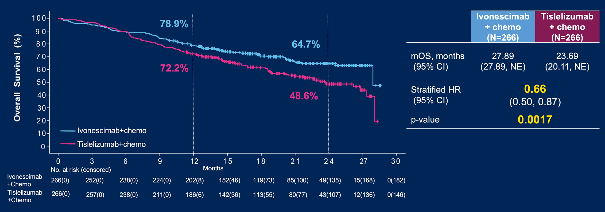

**AK112三期临床数据汇总**

- Session: `ses_f9afb6bf5ffeuBE7gPS4X0wP5W`
- Directory: `/Users/zendu/Documents/Invest/医药/康方`
- Created: 2026-09-03 10:06:33
- Updated: 2026-09-03 11:04:28

---

## 给我截止到目前，康方生物的 ak112 在国内外开的三期临床的数据，包括入组人群标准、整体数据、亚组数据、安全毒性数据等

### AK112（依沃西单抗 / Ivonescimab / SMT112）III 期临床全览
**数据截止：2026-09-03**

全局盘点：目前公开的依沃西 III 期研究共 **16 项**（Summit 全球 5 项 + 合作组织全球 1 项 + 康方中国 10 项），另有 ECOG-ACRIN 的 II/III 期胆道癌研究待启动。**已读出（有正式数据或顶线）的共 6 项**：HARMONi-A、HARMONi-2、HARMONi-6、HARMONi（全球）、HARMONi-GI1（胆道癌，仅顶线）、HARMONi-3（鳞癌队列早期期中，未达门槛、未公布数据）。

---

#### 一、已读出且有完整数据的四项肺癌 III 期

##### 1. HARMONi-A（AK112-301，NCT05184712）— 中国，EGFR-TKI 耐药非鳞 NSCLC

**入组人群标准**
- 18–75 岁；ECOG PS 0–1；预期生存 ≥3 个月
- 组织/细胞学确诊局晚（IIIB/IIIC）或转移（IV）**非鳞** NSCLC，不可手术、不可根治性放化疗
- 入组前确认存在 **EGFR 活化突变**
- **既往接受 EGFR-TKI 治疗且失败（未限定 TKI 代际）** — 实际入组中三代 TKI 占 86.3% vs 85.1%
- ≥1 个可测量的非脑部病灶（RECIST v1.1）
- 关键排除：含小细胞成分或以鳞癌为主；其他有获批药物的驱动基因突变；**既往任何肿瘤免疫治疗**；除 EGFR-TKI 外的系统抗肿瘤治疗；**肿瘤包绕重要血管、明显坏死/空腔、侵犯周围重要器官血管**；有症状 CNS 转移；2 年内需系统治疗的活动性自身免疫病；6 个月内胃肠穿孔/瘘；既往胸部放疗；需频繁引流的浆膜腔积液；IBD
- 分层因子：是否用过三代 EGFR-TKI；有无脑转移

**方案**：依沃西 20 mg/kg（n=161）或安慰剂（n=161）+ 培美曲塞 500 mg/m² + 卡铂 AUC 5，Q3W × 4 周期 → 维持（依沃西+培美 / 安慰剂+培美）。55 家中国中心，2022/1/25–2022/11/2 入组 322 例。

**基线**：中位年龄 59.6 vs 59.4 岁；女性 52.2% vs 50.9%；脑转移 21.7% vs 23.0%。

**整体数据**

| 终点 | 依沃西+化疗 | 安慰剂+化疗 | HR / p |
|---|---|---|---|
| mPFS（IRRC，中位随访 7.89 月） | 7.06 月 (5.85–8.74) | 4.80 月 (4.21–5.55) | HR 0.46 (0.34–0.62), p<0.001 |
| ORR | 50.6% (42.6–58.6) | 35.4% (28.0–43.3) | Δ15.6%, p=0.006 |
| mOS（最终分析，cutoff 2025/4/12，中位随访 **32.5 月**） | **16.8 月** | **14.1 月** | **HR 0.74 (0.58–0.95), p=0.02** |
| 30 个月 OS 率 | 29.1% (22.1–36.4) | 18.4% (12.8–24.8) | — |

> 发表：PFS → JAMA 2024;332(7):561-570；最终 OS → SITC 2025 LBA（Xiuning Le 报告）+ JAMA 2026。这是**唯一一次预设的正式 OS 分析**（2024/5 那次是 NMPA 要求的描述性分析）。

**亚组数据**
- PFS：三代 TKI 进展 HR 0.48 (0.35–0.66)；脑转移 HR 0.40 (0.22–0.73)；19del HR 0.48 (0.32–0.73)；T790M 阳性 HR 0.22 (0.09–0.54)
- OS：脑转移 HR 0.61 / 无脑转移 HR 0.77；19del HR 0.83 / L858R HR 0.60

**安全毒性**
- 期中分析：G≥3 TEAE 61.5% vs 49.1%（最常见为化疗相关）；G≥3 irAE 6.2% vs 2.5%；**G≥3 VEGF 相关 AE 仅 3.1% vs 2.5%**
- 最终分析（随访 32.5 月）：G≥3 TEAE 67.1% vs 54.7%；无新安全信号，常见 TRAE 两组无显著差异

**监管**：2024/5 NMPA 批准（首个适应症）；2024/11 纳入医保（2025/1/1 生效）。

---

##### 2. HARMONi-2（AK112-303，NCT05499390）— 中国，一线 PD-L1+ NSCLC，单药头对头 K 药

**入组人群标准**
- ≥18 岁（**无年龄上限**）；ECOG PS 0–1；预期生存 ≥3 月
- 组织/细胞学确诊 NSCLC，AJCC **IIIB/C 或 IV** 期
- **无 EGFR 敏感突变、无 ALK 易位**
- **肿瘤组织 PD-L1 阳性（TPS ≥1%）**，需提供 FFPE 组织
- 局晚/转移期**无任何既往系统抗肿瘤治疗**
- 可测量病灶（RECIST 1.1）；器官功能达标
- 关键排除：任何小细胞成分；2 年内免疫缺陷诊断或系统激素治疗；30 天内大手术；**已知活动性 CNS 转移**；2 年内需系统治疗的活动性自身免疫病；活动性 HBV/HCV；12 个月内心梗/不稳定心绞痛/心衰
- 分层因子：组织学、临床分期、PD-L1 表达

**方案**：依沃西 20 mg/kg（n=198）vs 帕博利珠单抗 200 mg（n=200），Q3W **单药**。55 家中国医院，2022/11/9–2023/8/26，筛选 879 例入组 398 例（45%）。样本量设计：约 388 例、264 个 PFS 事件，90% power 检测 HR 0.67；PFS 期中在 185 个（70%）事件时进行。

**整体数据（PFS 期中，中位随访 8.67 月）**

| 终点 | 依沃西 | 帕博利珠 | HR / p |
|---|---|---|---|
| mPFS（IRRC） | **11.14 月** (7.33–NE) | **5.82 月** (5.03–8.21) | 分层 HR **0.51** (0.38–0.69), 单侧 p<0.0001 |
| 9 个月 PFS 率 | 56% (47–64) | 40% (32–48) | — |
| ORR | 50.0% (43–57) | 38.5–39% (32–46) | — |
| DCR | 89.9–90% (85–94) | 70.5–71% (64–77) | — |
| 中位 TTR | 1.5 月 | 2.5 月 | — |

**OS 进展（关键）**
- 2025/4：NMPA 审评要求的**描述性期中 OS** → HR **0.777**，数据成熟度仅 39%，名义 α 0.0001，未达统计学显著
- **2026/9/2（一天前）**：康方公告 IDMC 评估的**预设期中 OS 分析达到关键次要终点**，依沃西相比帕博利珠**统计学显著且临床有意义**。**具体数值（mOS、HR、CI、p）尚未披露**，将在后续学术会议 + 同行评议期刊公布。

**亚组数据（PFS）**

| 亚组 | mPFS 依沃西 vs 帕博 | HR |
|---|---|---|
| PD-L1 TPS ≥50% | 11.1 vs 8.2 月 | 0.48 (0.29–0.79)｜WCLC 口径 0.46 (0.28–0.75) |
| PD-L1 TPS 1–49% | 8.0 vs 5.4 月 | 0.54 (0.37–0.79) |
| 鳞癌 | 9.7 vs 5.8 月 | 0.50 (0.33–0.76)｜WCLC 口径 0.48 (0.31–0.74) |
| 非鳞癌 | 11.1 vs 6.7 月 | 0.55 (0.36–0.84)｜WCLC 口径 0.54 (0.36–0.82) |
| 肝转移 | 7.1 vs 2.7 月 | 0.47 (0.23–0.98) |
| 脑转移 | 8.0 vs 5.0 月 | 0.55 (0.28–1.05) |

> 注意方向：H2 中**高表达（≥50%）HR 略优于低表达**，与后来 HARMONi-6 里"PD-L1 阴性获益更大"的方向相反 —— 单药场景与联合化疗场景中 VEGF 臂的作用机制不同。

**安全毒性**

| 项目 | 依沃西 | 帕博利珠 |
|---|---|---|
| 任何级别 TRAE | 90% | 82% |
| G≥3 TRAE | **29%**（最常见高血压 5%） | 16%（最常见高血糖 1%） |
| 严重 TRAE | 21% | 16% |
| G≥3 irAE | 7% (14/197) | 8% (16/199) |
| 因 TRAE 停药 | 2% | 3% |
| 蛋白尿（任何级别） | **32%** | 10% |
| AST 升高 / ALT 升高 | 20% / 15% | 16% / 12% |
| 高胆固醇 | 16% | 10% |
| 死亡 | 1 例（疾病进展） | 2 例（原因不明、呼吸衰竭） |

研究者结论：**鳞癌亚组中 G≥3 TRAE 两组相当**（对"抗 VEGF 不能用于鳞癌"的第一次正面回应）。

**发表/监管**：Lancet 2025;405(10481):839-849；WCLC 2024 总统研讨会首发。2025/4 NMPA 批准第二个适应症（一线 PD-L1+ NSCLC 单药）。

---

##### 3. HARMONi-6（AK112-306，NCT05840016）— 中国，一线鳞状 NSCLC，头对头替雷利珠+化疗

**入组人群标准**
- 18–75 岁；ECOG PS 0–1；预期生存 ≥3 月
- **组织学确诊鳞状 NSCLC**；IIIB/C 或 IV 期不可切
- 局晚/转移期无既往系统抗肿瘤治疗；可测量病灶；器官功能达标
- 关键排除：非鳞组织学；**EGFR 敏感突变或 ALK 易位**；已知 ROS1 重排、MET ex14 跳跃、RET 融合；活动性 CNS 转移；2 年内需系统治疗的自身免疫病；活动性 HBV/HCV；12 个月内心梗等
- **⚠️ 关键点：并未排除中央型、空腔、大血管包绕、咯血史** —— 这是该研究最重要的设计特征
- 分层因子：分期（IIIB/IIIC vs IV）、PD-L1 TPS（≥1% vs <1%）

**方案**：依沃西 20 mg/kg 或替雷利珠 200 mg + 紫杉醇 175 mg/m² + 卡铂 AUC 5，Q3W × 4 → 单药维持至 24 个月。50 家中国中心，2023/8/17–2025/1/21，筛 761 例入组 532 例（266/266）。

**基线（真实世界高危富集）**
- 男性 93%（494 例），中位年龄 64 岁（IQR 59–69），IV 期 92.3%
- **中央型 63.2%**（66.9% vs 59.4%）；**肿瘤空腔 8.8%**（9.0% vs 8.6%）；**大血管包绕 17.5%**（18.4% vs 16.5%）；**咯血史 约 31%**（32.3% vs 29.7%）
- PD-L1 TPS <1% 各组 39%（105/105）

**整体数据**

| 终点 | 依沃西+化疗 | 替雷利珠+化疗 | HR / p |
|---|---|---|---|
| **mPFS**（IRRC，cutoff 2025/2/28，中位随访 10.28 月，221 事件，边界单侧 P=0.0094） | **11.14 月** (9.9–NE) | **6.90 月** (5.8–8.6) | 分层 HR **0.60** (0.46–0.78), p<0.0001 |
| PFS（研究者评估） | — | — | HR 0.64 (0.50–0.84) |
| 9 / 12 月 PFS 率 | 62% / 48% | 43% / 35% | — |
| ORR | 75.6–75.9% | 66.5% | p=0.008 |
| 中位 DoR | 11.2 月 | 8.4 月 | p=0.0219 |
| **mOS**（期中，cutoff 2026/2/27，中位随访 21.4 月，204 死亡，边界单侧 P=0.0049） | **27.89 月** (27.89–NE) | **23.69 月** (20.11–NE) | **HR 0.66** (0.50–0.87), 单侧 p=0.0017 |
| 死亡事件 | 84 (32%) | 120 (45%) | — |
| 12 / 24 月 OS 率 | 78.9% / **64.7%** | 72.2% / **48.6%** | — |

> OS 期中原计划在约 225 个事件时触发，**为满足监管期限提前在 204 个事件时触发**。
> 发表：PFS → Lancet 2025;406(10515):2078-2088（ESMO 2025 总统研讨会）；OS → Lancet 2026（2026/5/31 在线）+ ASCO 2026 全体大会 LBA4（本届唯一入选全会的中国研究）。

**亚组数据**

PFS 亚组：

| 亚组 | mPFS 依沃西 vs 替雷利珠 | HR |
|---|---|---|
| **PD-L1 TPS <1%** | 9.9 vs 5.7 月 | **0.55** (0.37–0.82) |
| PD-L1 TPS ≥1% | 12.6 vs 8.6 月 | 0.66 (0.46–0.95) |
| PD-L1 TPS 1–49% | 12.6 vs 6.9 月 | 0.63 (0.41–0.98) |
| PD-L1 TPS ≥50% | 12.6 vs 9.7 月 | 0.71 (0.37–1.33) |
| 肝转移 / 无肝转移 | — | 0.53 / 0.64 |
| ≥3 个基线转移灶 / <3 个 | — | 0.46 / 0.64 |
| 年龄 ≥65 岁 | — | 存在基线不平衡（靶病灶大小、脑转移），**校正协变量后 HR 0.69** |

OS 亚组：

| 亚组 | mOS 依沃西 vs 替雷利珠 | HR |
|---|---|---|
| **PD-L1 TPS <1%** | **NE vs 18.6 月** | **0.64** (0.43–0.96) |
| PD-L1 TPS ≥1% | **NE vs 27.3 月** | 0.68 (0.46–0.99) |

> 关键读法：对照臂被 PD-L1 强烈分层（≥1% ~27 月 vs <1% ~18.6 月），而依沃西臂两档 mOS 均未达到 —— **VEGF 臂在"冷肿瘤"上补齐了 PD-1 单抗的短板**。

**安全毒性（两个时点口径）**

| 项目 | PFS 分析时（依沃西 vs 替雷利珠） | OS 分析时（依沃西 vs 替雷利珠） |
|---|---|---|
| 任何级别 TRAE | — | 99.2% vs 99.2% |
| G≥3 TRAE | 63.9–64% vs 54.3% | **69.2% vs 58.9%**（184/266 vs 156/265） |
| 治疗相关 SAE | 32.3% vs 30.2% | 41.4% vs 34.3% |
| 因 TRAE 停药 | 3% vs 4% | 5.3% vs 4.5% |
| TRAE 致死 | 8 (3%) vs 10 (4%) | 10 (3.8%) vs 11 (4.2%) |
| G≥3 irAE | 9.0% vs 10.2% | irAE 总体 14% vs 14% |
| **G≥3 出血** | **1.9%（5 例）vs 0.8%（2 例）** | **2.6%（7 例）vs 0.8%（2 例）** |
| VEGF 相关 AE（任何级别） | — | **约 60% vs 26%**；G≥3 **12% vs 3%** |
| 蛋白尿 | — | 任何级别 **42.5% vs 12.8%**；G≥3 6.8% vs 0% |
| G≥3 中性粒细胞降低 / 白细胞降低 / 贫血 | — | 32% vs 26% / 11% vs 9% / 7% vs 5% |

**出血信号的细节（最值得盯）**：PFS 分析时 5 例 G≥3 出血中，**4 例有咯血史、大血管包绕或中央型病灶**。ESMO 讨论嘉宾 Myung Ju Ahn 的评价：在约 30% 有咯血史的高危富集人群里，G≥3 出血率"低到令人意外"，但"不能完全忽视出血风险"，真实世界应用需对中央型/空腔患者多学科警惕。ASCO 讨论嘉宾 Julie Brahmer 追加了两条限制：**结果目前仅来自中国患者**；**试验排除了 >75 岁人群**。

**监管**：2026/8 NMPA 批准第三个适应症（一线鳞状 NSCLC）。首个在随机双盲 III 期中对"PD-1 单抗+化疗"实现 PFS 与 OS 双阳的方案。

---

##### 4. HARMONi（全球，AK112-301(HARMONi)，NCT06396065）— EGFRm 三代 TKI 进展后非鳞 NSCLC

**入组人群标准**
- ≥18 岁；**中国段 ≤75 岁，北美/欧洲段无年龄上限**；ECOG PS 0–1；预期生存 ≥3 月
- 组织/细胞学确诊局晚（IIIB/IIIC）或转移（IV）**非鳞** NSCLC，不可完全切除、不能接受根治性同步/序贯放化疗
- EGFR 活化突变（18 外显子点突变、19 外显子缺失、20 外显子点突变、21 外显子点突变）
- **EGFR-TKI 治疗失败，满足任一：**
  - **三代 EGFR-TKI（奥希替尼、阿美替尼、伏美替尼）进展 — 北美/欧洲患者仅限此路径**
  - 一/二代 EGFR-TKI 进展且进展后确认 **T790M 阴性 — 仅限中国患者**
- **任何 PD-L1 表达**均可；≥1 个可测量非脑病灶
- 关键排除：小细胞成分或以鳞癌为主；**既往任何免疫检查点抑制剂**（抗 PD-1/L1、CTLA-4、LAG-3）；既往系统化疗、抗血管治疗，或晚期阶段超过 1 线抗肿瘤治疗（EGFR 抑制剂除外）；**筛选期影像显示肿瘤包绕重要血管，或肺实质内病灶明显坏死和/或空腔**；肿瘤侵犯心脏/心包、气管、食管、主动脉、上腔静脉，或有食管气管瘘/食管胸膜瘘风险；有症状 CNS 转移
- 分层因子：地理区域、脑转移（有/无）

**方案**：依沃西 20 mg/kg（n=219）或安慰剂（n=219）+ 卡铂 AUC 5 + 培美曲塞 500 mg/m² Q3W × 4 → 维持。**114 家中心，横跨亚洲、欧洲、北美**。FPI 2022/1；亚洲 LPI 2022/11；北美+欧洲 LPI 2024/10。

**基线（依沃西 vs 安慰剂）**

| 特征 | 依沃西+化疗 (219) | 安慰剂+化疗 (219) |
|---|---|---|
| 中位年龄（范围） | 62 (32–84) | 60 (36–84) |
| ≥65 岁 | 83 (37.9%) | 88 (40.2%) |
| 女性 | 130 (59.4%) | 127 (58.0%) |
| **北美+欧洲 / 亚洲** | **83 (37.9%) / 136 (62.1%)** | 82 (37.4%) / 137 (62.6%) |
| 亚裔 / 白人 | 153 (69.9%) / 51 (23.3%) | 153 (69.9%) / 54 (24.7%) |
| ECOG 1 | 162 (74.0%) | 157 (71.7%) |
| 从不吸烟 | 143 (65.3%) | 155 (70.8%) |
| IV 期 | 215 (98.2%) | 214 (97.7%) |
| **脑转移** | 54 (24.7%) | 54 (24.7%) |
| 肝转移 | 32 (14.6%) | 23 (10.5%) |
| 用过三代 TKI | **219 (100%)** | 218 (99.5%) |
| 也用过一/二代 TKI | 95 (43.4%) | 92 (42.0%) |
| 19del / L858R / 其他 | 59.8% / 33.8% / 6.8% | 53.9% / 41.1% / 5.0% |

**整体数据（双主要终点 PFS + OS）**

| 终点 | 依沃西+化疗 | 安慰剂+化疗 | HR / p |
|---|---|---|---|
| **mPFS**（IRRC，主分析 N=345，中位随访 22.3 月） | **6.8 月** (5.7–7.1) | **4.4 月** (4.1–5.5) | **HR 0.52** (0.41–0.66), p<0.0001 |
| 6 / 12 月 PFS 率 | 54.0% / 25.4% | 34.7% / 8.3% | — |
| PFS（研究者评估） | — | — | HR 0.58 (0.45–0.73) |
| PFS 长期随访（全 438 例，中位随访 29.7 月） | — | — | HR 0.57 (0.46–0.71) |
| ORR（IRRC） | 44.7% | 34.2% | — |
| **mOS 主分析**（2025/4，中位随访 29.7 月） | **16.8 月** | **14.0 月** | **HR 0.79 (0.62–1.01), p=0.057**（需 p≤0.0448）→ **未达统计学显著** |

**OS 三次数据切点的演进（核心争议点）**

| 数据切点 | ITT HR | 西方亚组 HR (n=83/82) | 西方中位随访 |
|---|---|---|---|
| 2025/4（主分析） | 0.79 (0.62–1.01), p=0.057 | **0.98** | 9.2 月 |
| 2025/9 | 0.78 (0.62–0.98), 名义 p=0.0332 | **0.84**（西方 mOS 17.0 vs 14.0；北美 NR vs 14.0，HR 0.70） | 13.7 月 |
| 2026/6 | **0.76** | **0.76** | 23.2 月 |

> 亚洲患者在 2025/4 主分析时即已锁定，中位随访 32.7 月。主分析时西方患者中位随访（9.2 月）**短于中位 OS 本身**，这是主分析 OS 未达显著的关键结构性原因。随访补齐后西方与亚洲的 OS 获益幅度趋于一致（0.76 vs 0.76），且与中国 HARMONi-A 的 0.74 高度吻合。

**亚组数据（PFS）**
- **脑转移 HR 0.34 (0.20–0.57)**；无脑转移 HR 0.59 (0.45–0.77)；颅内 PFS 亦改善
- 长期随访：北美+欧洲 HR 0.67 (0.45–1.00, n=165)；亚洲 HR 0.55 (0.43–0.71, n=273)
- PD-L1（仅北美/欧洲患者强制检测，n=160）：**PD-L1 ≥1% HR 0.55 (0.33–0.91, n=106)；PD-L1 <1% HR 0.62 (0.32–1.18, n=54)** —— PD-L1 阳性/阴性获益相当
- 其余预设亚组（年龄、性别、吸烟史、ECOG、19del/L858R/T790M、肝转移）均一致favor 依沃西

**安全毒性**

| 项目 | 依沃西+化疗 | 安慰剂+化疗 |
|---|---|---|
| 任何级别 TRAE | 95.0% | 93.1% |
| G≥3 TRAE | **50.0%** | 42.2% |
| 严重 TRAE | **28.0%** | 15.1% |
| 因 TRAE 停药 | 7.3% | 5.0% |
| TRAE 致死 | 1.8% | 2.3% |
| 贫血（任何/G≥3） | 49.1% / 10.1% | 56.4% / 12.4% |
| 白细胞降低 | 45.0% / 12.8% | 44.0% / 11.0% |
| 中性粒细胞降低 | 42.7% / 19.3% | 42.2% / 16.5% |
| 血小板降低 | 32.6% / 12.4% | 28.0% / 6.4% |
| **G≥3 irAE** | 9.6% | 6.0% |
| **G≥3 VEGF 相关 TRAE** | **7.3%** | 3.2% |
| — 蛋白尿（任何/G≥3） | 13.8% / 0.9% | — |
| — 高血压（任何/G≥3） | 13.3% / 3.7% | — |
| — 出血（任何/G≥3） | 10.6% / 0.9% | — |
| **治疗相关 G3–5 出血** | **<1%** | — |
| irAE 明细（任何/G≥3） | 甲减 8.3%/0.5%、甲亢 4.1%、ALT升 2.8%/0.9%、AST升 3.2% | — |

**发表/监管**：WCLC 2025 总统研讨会（Goldman 报告）；**Lancet Oncology 2026;27:1094-1109（2026/8/25 发表）**。BLA 2025Q4 递交，2026/1 FDA 受理，**PDUFA 2026/11/14**。更新 OS 数据将于 **WCLC 2026（2026/9/15，OA14 session）** 报告。

**HARMONi 与 HARMONi-A 的关系（易混淆点）**
核心差异只在 **TKI 代际**：HARMONi-A 允许一/二代 TKI 进展入组（86% 实际用过三代），HARMONi 的北美/欧洲段严格限"三代 TKI 进展"。HARMONi 把 HARMONi-A 中三代 TKI 进展的中国患者并入（约占 HARMONi 总 438 例的 62%），再补 38%（165 例）欧美新患者构成全球多中心。因此 NMPA 批文写"EGFR-TKI 治疗后进展"，递交 FDA 的写"第三代 EGFR-TKI 治疗后进展"。**"HARMONi-A 三代亚组 HR 0.48" 与 "HARMONi 整体 HR 0.52" 不能直接横比**——人群、基线年份、随访不同。

---

#### 二、已顶线但未公布数据

##### 5. HARMONi-GI1（AK112-309，NCT06591520）— 中国，一线晚期胆道癌
- 设计：依沃西 + 吉西他滨/顺铂 **vs 度伐利尤单抗（PD-L1）+ 吉西他滨/顺铂**（TOPAZ-1 全球金标准）；不可切局晚或转移 BTC；ECOG 0–1；N=**682（实际）**，四重盲；2024/10/20 启动，2025/9 完成入组；**主要终点 OS**
- **2026/8/25 顶线**：IDMC 评估的预设期中分析**达到主要终点 OS，统计学显著且临床有意义**；同时**达到全部关键次要终点 PFS 与 ORR**。**具体数值全部未披露。**
- 意义：全球首个在 BTC 中头对头战胜"PD-L1 单抗+化疗"标准方案的 III 期；依沃西在**消化道肿瘤**的首个 III 期阳性
- 支撑该研究的 II 期数据：ORR 63.6%、DCR 100%、mPFS 8.5 月、mOS 16.8 月；已获 CDE 突破性疗法认定

##### 6. HARMONi-3（SMT112-3003，NCT05899608）— 全球，一线转移性 NSCLC，头对头 K 药+化疗

**这是目前最关键的未读出研究，也是唯一一次"分析未达门槛"的事件。**

**入组人群标准**
- ≥18 岁；ECOG PS 0–1；预期生存 ≥3 月
- **转移性（IV 期）** NSCLC，鳞或非鳞
- **随机前必须有 PD-L1 TPS/TC 检测记录，但不限表达水平**
- 转移期无既往系统治疗；≥1 个可测量非脑病灶
- 关键排除：小细胞成分；**已知有一线获批疗法的可靶向变异（EGFR、ALK、ROS1、BRAF V600E）—— 非鳞患者随机前必须有驱动基因检测结果**；**肿瘤侵犯/包绕重要器官（心包、心脏、气管、食管、中央支气管）或大血管（主动脉、中心静脉）且显著增加出血风险**
- 分层因子（6 个）：性别、年龄（<65 / ≥65）、地区（**东亚 / 世界其他地区**）、基线肝或脑转移有无、转移病灶出现前 >6 个月的既往 PD-(L)1 治疗（有/无）、PD-L1 TPS（≥1% / <1%）

**方案**：依沃西 20 mg/kg 或帕博利珠 200 mg Q3W + 含铂双药（鳞：紫杉醇或白蛋白紫杉醇 + 卡铂；非鳞：培美曲塞 + 卡铂）× 最多 4 周期 → 维持（鳞：单药；非鳞：+ 培美）至 24 个月。
**规模**：鳞癌队列 N=600、非鳞队列 N=1000，共约 **1600 例**（早期 TPS 登记为 1080），**两个组织学队列独立效力、独立分析**。亚洲、欧洲、北美，>15 国。
**双主要终点**：OS + PFS（研究者评估 RECIST v1.1）。次要：ORR、DCR、DoR、安全性、PK、免疫原性。

**进展与那次"未达门槛"**
- 2026/2：Summit 修改 SAP，为鳞癌队列**新增**一次 2026Q2 的 PFS 期中分析，目的是争取比最终分析更早与 FDA 沟通/递交；由于分配的 α 极少，**该次期中的显著性门槛显著高于最终分析**
- 2026Q2：该早期期中 PFS 分析由 iDMC 独家审阅，**未达到该次分析的统计学门槛**；iDMC 建议**按计划继续**，**无安全性问题**，**维持双盲**。Summit 美股当日盘前一度跌超 25%
- 性质澄清：这不等于试验失败，也不等于趋势转负——外界不知道具体统计设计细节，且未解盲
- 后续时间表（2026/7/23 Q2 财报确认）：**两个队列入组均已完成**；鳞癌队列**最终 PFS 事件数预计 2026H2 达到**，届时同步做一次**早期 OS 期中**；**独立于 PFS 的 OS 期中预计 2027H1**；**非鳞队列 PFS 事件预计 2027H1 达到**
- 登记表主要完成日 2028/12/31，研究完成 2029/12/31

---

#### 三、已启动、无数据读出的 III 期（设计要点）

##### 全球（Summit / 合作组织）

| 研究 | 编号 | 人群与对照 | N | 主要终点 | 状态/时点 |
|---|---|---|---|---|---|
| **HARMONi-7** | SMT112-3007 / NCT06767514 | 一线 IV 期 NSCLC，**PD-L1 高表达 TPS>50%（22C3）**；**依沃西单药 vs 帕博单药** | 780 | **OS + PFS** 双主要 | 2025/2/27 启动，主要完成 2028/4 |
| **HARMONi-GI3** | SMT112-3005 / NCT07228832 | 一线转移性 CRC（MSS/pMMR）；依沃西+FOLFOX **vs 贝伐+FOLFOX** | 600 | PFS (IRRC) | 2025/11/18 启动，主要完成 2028/5 |
| **HARMONi-GU1** | — | 一线局晚/转移尿路上皮癌；依沃西+**EV（enfortumab vedotin）vs 帕博+EV**（EV-302 全球标准） | ~800（II/III） | PFS + OS（III 部分） | 2026/8 宣布，站点激活 2026Q4；II 部分先定 RP3D |
| **ILLUMINE** | GORTEC 2024-04 / NCT07264075 | 一线 PD-L1+ R/M HNSCC；**三臂**：依沃西单药 / 依沃西+莱法利单抗（AK117, CD47）/ 帕博单药 | 780 | **OS** | 2026/5/5 启动（首例 2026Q2），主要完成 2030/5；欧洲多国+中国 |
| ECOG-ACRIN | NCT07765433 | 晚期 BTC；依沃西+吉西他滨/顺铂 vs SOC 化免 | 336（II/III） | — | 预计 2027/1 启动 |

**HARMONi-7 入组标准细节**：≥18 岁；ECOG 0–1；IV 期；鳞或非鳞；TPS>50%；可测量非脑病灶；转移期无系统治疗。排除：小细胞；已知可靶向变异（非鳞需驱动基因检测结果）；**有症状 CNS 转移、CNS 病灶 ≥1.5 cm、随机前 7 天内 CNS 放疗、首周期内可能需 CNS 放疗、脑膜病**；3 年内其他恶性肿瘤；活动性自身免疫或肺部疾病；**≥2 级既存周围神经病**；4 周内严重感染/大手术；需系统激素的非感染性肺炎史或现有 ILD。

**ILLUMINE 的支撑 II 期数据（ESMO 2024）**：依沃西+莱法利单抗 ORR 60%（20 例），中位 PFS 7.1 月（中位随访 4.1 月），OS 未成熟；截止时无患者因 TRAE 永久停药。

> 注：中国的 AK117-302 是**两臂**（依沃西+AK117 vs 帕博），全球 ILLUMINE 是**三臂**（加了依沃西单药臂）—— 后者能拆清 AK117 的贡献，前者不能。这是"中国先行、全球确认"的分阶段设计，而非设计缺陷。

##### 中国（康方，共 10 项 III 期，其中 3 项已读出、1 项已顶线）

| 研究 | 编号 | 人群与对照 | N | 主要终点 | 时点 |
|---|---|---|---|---|---|
| **HARMONi-8A** | AK112-305 / NCT06928389 | **PD-(L)1 治疗后进展**的局晚/转移 NSCLC；依沃西 **vs 安慰剂 + 多西他赛** | 536 | **OS** | 2025/7/8 首例给药；主要完成 2027/5 |
| **HARMONi-BC1** | AK112-308 / NCT06767527 | 一线不可切局晚/转移 **TNBC**；依沃西 or 安慰剂 + 白蛋白紫杉醇 | 416 | **PFS (IRRC) + OS** | 2025/2/7 启动；主要完成 2026/12；**2025/11 获 CDE 突破性疗法（第 4 个 BTD）** |
| 胰腺癌 | AK112-310 / NCT06953999 | 一线转移性胰腺癌；**三臂**：依沃西+化疗 / 依沃西+AK117+化疗 / 安慰剂+化疗（白蛋白紫杉醇+吉西他滨） | 999 | OS | 2025/6/11 启动；主要完成 2027/5 |
| 局限期 SCLC | AK112-311 / NCT07010263 | **同步化放疗后未进展的局限期 SCLC 巩固治疗**；依沃西 vs 安慰剂 | 560 | **PFS (BICR) + OS** | 2025/6/13 启动；主要完成 2028/12 |
| CRC（中国） | AK112-312 / NCT06951503 | 一线转移性 CRC；依沃西+**FOLFOXIRI** vs **贝伐+化疗**（诱导后 5-FU/LV+依沃西维持） | 560 | PFS (BICR) | 2025/5/27 启动；主要完成 2027/1 |
| HNSCC（中国） | AK117-302 / NCT06601335 | 一线 **PD-L1+（CPS≥1）R/M HNSCC**；依沃西+AK117 **vs 帕博+安慰剂** | 510 | **OS** | 2024/10/30 启动；主要完成 2027/1 |

---

#### 四、横向对读：几条值得记住的结构性事实

**1. 五个已读出的 III 期全部阳性，其中三个拿到了 OS 统计学显著**
- HARMONi-A：OS HR 0.74（vs 单纯化疗）
- HARMONi-6：OS HR 0.66（vs **PD-1 单抗 + 同一套化疗**）
- HARMONi-2：OS 期中达标（2026/9/2，数值待公布，vs **帕博单药**）
- HARMONi-GI1：OS 达标（vs **度伐利尤 + 化疗**，数值待公布）
- HARMONi（全球）：PFS 显著（HR 0.52），OS 主分析 HR 0.79 p=0.057 未达门槛，随访补齐后 ITT/西方均为 0.76

**2. OS/PFS 获益比的差别揭示机制**
- 对**不含免疫的化疗**（HARMONi-A）：PFS HR 0.46 → OS HR 0.74。瘤缩得快、PFS delta 大，但换成生存的转化率打了折
- 对**已含 PD-1 的化疗**（HARMONi-6）：PFS HR 0.60（成熟后回到 0.72 口径）→ **OS HR 0.66 优于 PFS**。化疗的共同影响减弱后差别仍在，且 mOS delta（27.9 vs 23.7 = 4.2 月）与 PFS delta（4.24 月）等量，24 月 OS 率差 16.1 个百分点
- 这个多出来的好处只能来自 VEGF 臂及其与 PD-1、化疗的配合

**3. PD-L1 方向在单药与联合场景相反**
- HARMONi-2（单药）：TPS≥50% HR 0.48 略优于 1–49% 的 0.54
- HARMONi-6（联合化疗）：TPS<1% HR 0.55 优于 ≥1% 的 0.66；OS 层面 0.64 vs 0.68
- HARMONi（全球）：PD-L1 ≥1% 0.55 与 <1% 0.62 基本相当

**4. 剂量在所有 III 期中都是 20 mg/kg Q3W**（无一例外）

**5. 安全性的三条恒定规律**
- **VEGF 类毒性显著增加但以低级别为主**：蛋白尿是最高频信号（H2 单药 32% vs 帕博 10%；H6 联合 42.5% vs 12.8%），G≥3 蛋白尿 0–6.8%
- **G≥3 TRAE 相比对照普遍高 8–12 个百分点**（H2 29% vs 16%；H6 69% vs 59%；HARMONi 50% vs 42%），但**因 AE 停药率和 TRAE 致死率与对照相当**
- **鳞癌出血是唯一需要真正盯的信号，但幅度远低于贝伐历史**：H6 在 63% 中央型、31% 咯血史、17.5% 大血管包绕的高危富集人群里，G≥3 出血 1.9%→2.6%（对照 0.8%）；全球 HARMONi 中治疗相关 G3–5 出血 <1%。H6 的 5 例 G≥3 出血中 4 例有咯血史/大血管包绕/中央型

**6. 三条待验证的外部效度问题**
- 除 HARMONi 一项外，**所有 OS 阳性数据均来自纯中国人群**；HARMONi 的西方 OS HR 从 0.98→0.84→0.76 的演进是"随访不足"而非"人群差异"的最好证据，但仍需 HARMONi-3/7 独立确认
- **>75 岁人群在 HARMONi-A / HARMONi-2（无上限）/ HARMONi-6 / HARMONi 中国段均被排除或几无代表**；HARMONi 欧美段与 HARMONi-3/7 无年龄上限
- **HARMONi-3 是唯一直接对标 K 药+化疗的全人群试验**（不分 PD-L1、鳞与非鳞均做），也是决定依沃西能否在西方替代 K 药+化疗的那一仗。它至今唯一一次分析（2026Q2 鳞癌早期期中 PFS）未达门槛

---

**数据来源**：JAMA 2024;332(7):561-570（HARMONi-A PFS）；JAMA 2026（HARMONi-A 最终 OS）；SITC 2025 LBA；Lancet 2025;405(10481):839-849（HARMONi-2）；Lancet 2025;406(10515):2078-2088（HARMONi-6 PFS）；Lancet 2026, doi:10.1016/S0140-6736(26)00966-9（HARMONi-6 OS）；ASCO 2026 Abstract LBA4；Lancet Oncology 2026;27:1094-1109（HARMONi）；WCLC 2024/2025 演示文稿；ESMO 2025 Annals of Oncology LBA4；ClinicalTrials.gov（各 NCT 原始入排标准）；Summit Therapeutics 8-K/新闻稿（2025/4/25、2025/9/7、2026/2/23、2026/7/22、2026/7/23、2026/8/5、2026/8/25）；康方新闻稿（2025/10/19、2025/11/03、2025/11/07、2026/8/25、2026/8/28、2026/9/2）。

**两项数据将在两周内更新**：HARMONi 更新 OS 详情（WCLC 2026，2026/9/15，OA14 session）；HARMONi-2 期中 OS 具体数值（会议+期刊，时间待定）。

---

## HARMONI 的数据如何演进的，西方 OS HR 从 0.98 到 0.76，这和入组顺序是否有关？

### HARMONi 的 OS 数据演进：入组顺序确实是主导解释，但这个结论有三层折扣

#### 一、先把结构讲清楚：这不是一个试验，是两个队列拼起来的

HARMONi 的亚洲队列和西方队列在**时间上完全不重叠**：

| | 入组窗口 | n | 来源 |
|---|---|---|---|
| **亚洲队列** | **2022/1 – 2022/11** | 273（136/137） | 康方 2024/5 明确披露：**"HARMONi 拟纳入 HARMONi-A 中所有既往接受过三代 TKI 的患者，约 276 例，占 HARMONi-A 的 85%"** —— 即 HARMONi-A 三代亚组的再分析 |
| **西方队列（北美+欧洲）** | **约 2023 – 2024/10** | 165（83/82） | Summit 2023 年新开的 74 家中心、6 个国家 |

HARMONi 官方标注的 FPI Jan 2022 / LPI Asia Nov 2022，与 HARMONi-A 的入组期（2022/1/25–2022/11/2）**完全一致**。亚洲 LPI 结束时，西方还没开始入组。两个队列的中位入组时点相差约 **18–24 个月**。

而分析触发是**事件驱动**的：PFS 主分析在约 231 个事件、OS 终期分析在约 261 个事件。

这两件事叠在一起，结果是**结构性的、设计时就可预见的**：当总事件数攒够时，事件几乎全部来自 2022 年入组的亚洲队列，而西方队列还没提供多少信息。

#### 二、三次数据切点的完整账

| 数据切点 | 亚洲随访 | 西方随访 | ITT HR | 西方亚组 HR | 统计性质 |
|---|---|---|---|---|---|
| **2025/4（主分析）** | 32.7 月 → **此后永久锁定** | **9.2 月** | 0.79 (0.62–1.01), **p=0.057**（需 ≤0.0448） | **0.98** | 唯一分配了 α 的正式 OS 分析 → **失败** |
| 2025/9 | 32.7 月（未更新） | 13.7 月 | 0.78 (0.62–0.98), **名义** p=0.0332 | **0.84**（北美单独 0.70；西方 mOS 17.0 vs 14.0） | 名义/描述性；两臂中位 OS 与主分析相同 |
| 2026/6 | 32.7 月（未更新） | 23.2 月 | **0.76**（CI 未公开） | **0.76**（CI 未公开） | 名义/描述性；已提交 FDA |

---

#### 三、机制拆解：入组顺序解释了什么

##### A. 随访窗口截断（主导机制）

主分析时西方队列**中位随访 9.2 个月 < 两臂中位 OS（14.0–17.0 个月）**。这在技术上意味着西方亚组连中位 OS 都还没走到，HR 只反映了前 9 个月的死亡分布。

为什么"只看前 9 个月"会系统性地把 HR 推向 1？因为依沃西+化疗的 OS 曲线是**晚分离型**。最好的旁证来自 HARMONi-6 的分段瞬时 HR：**早期约 0.73 → 后期约 0.50**，公布的 0.66 是整个随访期的加权平均。同类曲线形状下，把随访截断在 9 个月，你测到的正是最不利的那一段。

所以西方 HR 从 0.98 走到 0.76，**主要不是"疗效变好了"，而是"曲线的后半段终于进入了观察窗"**。这个部分我认为是站得住的。

##### B. 但精度问题可能比 A 更根本 —— 而且它反驳"演进"这个说法本身

西方 n=83/82，主分析时事件数极少。**0.98 这个点估计的 95% CI 大致横跨 0.5–1.8，它和 0.76 在统计上根本不可区分。**

一个很硬的诊断性证据：2025/9 那个切点，西方整体 HR 0.84，但**北美单独 HR 0.70**。如果 0.84 是"真值"，那欧洲必须差到约 0.95–1.0。同一时点、同一批人，地理上再切一刀就能得到 0.70 到 ~1.0 的跨度 —— 这是**小样本抖动的典型指纹，不是生物学信号**。

因此更准确的表述不是"HR 从 0.98 改善到 0.76"，而是"**一个原本无信息量的点估计，随事件累积变得可解释了**"。把 0.98→0.84→0.76 读成一条趋势线，本身就是过度解读 —— 只不过这次过度解读的方向对公司有利，所以没人反对。

**关键缺失信息**：0.76 的 **95% CI 至今没有公开**。Summit 明确写了"including median OS, confidence intervals for hazard ratios, etc., are intended to be presented at an upcoming medical conference"。CI 上界是否 <1，目前不知道。在此之前，"西方与亚洲一致"只是点估计层面的说法。

##### C. 入组顺序还带来一个真实混杂，方向对试验不利

亚洲队列 2022 年入组，西方队列 2023–2024/10 入组。这两年正好是**奥希替尼进展后西方治疗格局剧变期**：MARIPOSA-2（amivantamab+化疗）2023/10 读出、2024/9 获 FDA 批准；HERTHENA-Lung、Dato-DXd 等 ADC 试验大量招募。

两个后果：
- **对照臂后线变强 → 应把西方 OS HR 推向 1。** 西方 HR 最终仍收敛到 0.76，是在这个逆风下取得的。这一点反过来支持机制 A 在做实事。
- **人群选择偏移，方向不明。** 能进新药试验的患者被抽走，留在 HARMONi 的西方患者是被筛过的。**随机化保护组内比较（西方内部 0.76 是内部有效的），但不保护跨地区可比性。** 所以"西方 0.76 ≈ 亚洲 0.76 ⇒ 地区/种族无差异"这个推论比它听起来的弱得多。

##### D. 一个必须点明的分析结构问题

**亚洲数据在 2025/4 就锁定了，此后三次分析全部没有更新。** 因此 ITT HR 的 0.79→0.78→0.76 的移动，**在算术上完全由西方增量驱动**。

这意味着：公司稿件里"ITT 0.76，西方亚组也是 0.76"这两个数字并列呈现，读起来像交叉验证，**实际上是同一个事实的两种表述，不是两个独立证据**。

另外，2025/9 和 2026/6 的分析都是主分析之后、**无 α 分配的名义分析**（p=0.0332 明确标注为 nominal）。主分析 p=0.057 vs 门槛 0.0448 这个失败是**终局性的**，后续分析在统计推断上救不回来，只能作为 FDA 的辅助/描述性材料。

---

#### 四、一条反向证据，不能漏掉

**PFS 上西方是真的偏弱，而且这个方向与 OS 矛盾。**

- 西方 PFS HR **0.67** (0.45–1.00, n=165) vs 亚洲 **0.55** (0.43–0.71, n=273)
- 把西方全部纳入后，整体 PFS HR 从主分析的 **0.52**（N=345）变成 **0.57**（N=438）—— **加西方数据稀释了 PFS**

现在的图景是：**西方 PFS 明显弱于亚洲（0.67 vs 0.55），但西方 OS 与 ITT 持平（0.76 vs 0.76）**。

通常 PFS 效应 ≥ OS 效应（后线会摊薄获益）。这里反过来了。可能的解释：(i) 西方存在非 PFS 中介的后进展期获益；(ii) 仍然是噪声；(iii) 西方影像评估节奏/删失模式不同。**用公开数据无法判定，这是 WCLC 2026 应该回答的问题。**

顺带一个数字：PFS 主分析（N=345）时，西方在分析集中只有 36+36=72 例、总共 18 个事件（6 vs 12）。当时"西方 PFS 获益一致"这个说法建立在 18 个事件上。

---

#### 五、结论，以及不能顺着推的那一步

**答"是否与入组顺序有关"：是，而且入组顺序是主导解释。** 准确的因果链是：

> 借用 HARMONi-A 的 276 例成熟中国患者（省 2 年时间、省 276 例样本）→ 两队列入组差 ~2 年 → 事件驱动分析在亚洲队列成熟时触发 → 西方随访仅 9.2 月，短于其自身中位 OS → 在晚分离的 OS 曲线上被截断在最不利段 → 早期西方 HR 偏向 1

这是一个**设计时就可预见的代价**。公平的批评是：Summit 本应把 OS 分析触发条件绑定在"西方队列最短随访时长"上，而不是纯总事件数。

**但不能顺着推出"HARMONi 的 OS 本来是阳性的，只是随访不够"。** 因为：在亚洲队列已随访 32.7 个月的情况下，**ITT 主分析仍然只有 0.79 / p=0.057**；而中国 HARMONi-A 在 32.5 个月随访、322 例（还含 14% 一二代 TKI）下拿到 **0.74 / p=0.02**。两个数字差别很小。

更可能的真实情况是：**这个适应症的 OS 效应量本身就落在 0.74–0.79 这个区间，用 438 例 / 261 个事件的设计去打 p≤0.0448，本来就是边缘的。** 西方随访不足只是让主分析恰好落在门槛外侧几个百分点。把失败全部归因于"随访不够"，等于把一个"效应量本身偏小 + 样本量偏紧"的问题，换算成了一个"运气不好"的问题。

**对 HARMONi-3 的外推要打折。** HARMONi 的教训是"跨区域拼接队列 + 事件驱动"会系统性让早期分析显得弱。HARMONi-3 鳞癌队列 2026Q2 那次"未达门槛"有一部分同类结构（入组从 2023/10 跨到 2026 上半年），但 HARMONi-3 是**单一队列全球同期入组、不是拼两个队列**，且门槛高本身有明确的 α 分配解释。所以类比只能部分成立，不能拿"HARMONi 后来补回来了"直接推"HARMONi-3 也会补回来"。

---

#### 六、WCLC 2026（2026/9/15，OA14 session）该盯的六件事

按信息价值排序：

1. **西方亚组 0.76 的 95% CI** —— 上界是否 <1。这是唯一能把"点估计一致"升级为"有统计证据"的东西
2. **分段（piecewise / 时变）HR** —— 如果机制 A 成立，西方队列 0–9 月的 HR 应接近 1，9 月之后应 <0.7。这是对"截断解释"最直接的证伪/证实
3. **西方队列的 KM 曲线 + landmark OS 率**（12/18/24 月），而不是只给一个 HR
4. **后线治疗表按地区拆分** —— 西方对照臂有多少比例拿到了 amivantamab+化疗 / ADC。这决定机制 C 的量级
5. **西方队列 2026/6 的中位 OS 绝对值**（2025/9 时是 17.0 vs 14.0，最新值未公开）
6. **亚洲队列若解冻更新**，能否复现 0.74–0.76

若第 1 项的 CI 上界跨过 1、且第 2 项看不到明显的时变结构，那就说明"演进"主要是精度问题（机制 B），而不是随访截断（机制 A）—— 那 PDUFA（2026/11/14）前的叙事会明显变薄。

---

## 。随机化保护组内比较（西方内部 0.76 是内部有效的），但不保护跨地区可比性。 所以"西方 0.76 ≈ 亚洲 0.76 ⇒ 地区/种族无差异"这个推论比它听起来的弱得多。 为什么说比听起来弱的多

### 为什么"西方 0.76 ≈ 亚洲 0.76 ⇒ 地区无差异"这个推论很弱

先把这句话的逻辑结构摊开：

> 观察：HR_西方 ≈ 0.76，HR_亚洲 ≈ 0.76
> 推论：药在西方人身上效果和亚洲人一样 → 中国数据可外推 → HARMONi-3/7 在西方人群里也会成立

问题出在从观察到推论的每一步。按杀伤力排序：

---

#### 一、最致命的一条：这个"一致"几乎不可证伪

检测**交互作用**（region × treatment）所需的样本量，大约是检测同等量级**主效应**的 **4 倍**。HARMONi 的 438 例 / 约 261 个事件，是**勉强够打主效应**的规模（而且主效应还打输了，p=0.057）。用它去检验地区交互，功效大概只有 20–30%。

后果是：**无论真相如何，你观察到的结果大概率都是"各亚组一致"。** 这个研究没有能力区分"西方 HR = 0.76"和"西方 HR = 1.0"。

一个不能拒绝备择假设的检验，对原假设的支持力度是很弱的。"没看到差异"和"证明了没有差异"是两件事——而后者才是外推所需要的。

##### 把这条量化

用标准近似 SE(log HR) ≈ 2/√事件数（1:1 分配）：

先验证方法可靠性——ITT：261 个事件、HR 0.79 → 算出 95% CI 为 **0.62–1.00**，与公开值 **0.62–1.01 完全吻合**。方法可用。

那么西方亚组（我的估算，非公司数据）：

| 数据切点 | 西方随访 | 估计事件数 | 公布 HR | **推算 95% CI** |
|---|---|---|---|---|
| 2025/4 | 9.2 月 | ~50 | 0.98 | **约 0.56–1.71** |
| 2025/9 | 13.7 月 | ~75 | 0.84 | **约 0.53–1.32** |
| 2026/6 | 23.2 月 | ~110–125 | 0.76 | **约 0.53–1.09** |

**注意最后一行：0.76 的置信区间很可能仍然跨过 1。**

这就直接解释了为什么 Summit 公布了 0.76 这个点估计，却明确写着"CI 将在后续医学会议公布"。上一轮我把"西方 0.76 的 95% CI"列为 WCLC 2026 第一优先观察项 —— 这就是原因。**如果上界确实 >1，那"consistent"这个词在统计上是空的，只是点估计层面的巧合。**

---

#### 二、随机化的作用边界：内部有效 ≠ 跨组可比

- **随机化给了你什么**：西方 165 例内部，依沃西臂 vs 安慰剂臂可交换。HR_西方 = 0.76 是**那 165 个人**里的一个内部有效的因果估计。亚洲 273 例同理。
- **随机化没给你什么**：**没人被随机分配到"西方"或"亚洲"。** 这两个队列是两批非随机组装的人群 —— 不同日历时间、不同中心、不同标准治疗环境、不同转诊路径。

所以"HR_西方 vs HR_亚洲"这个比较，是**两个内部有效估计之间的观察性比较**。它的证据等级远低于随机化比较。这是整件事的地基问题。

---

#### 三、"西方"这个标签装的不是白人 —— 只有不到 2/3

从基线表能算出来（每臂：NA&EU 83/82，白人 51/54，亚裔 153/153，亚洲地区 136/137）：

| 西方队列（n=165）构成 | 人数 | 占比 |
|---|---|---|
| 白人 | ~105 | **~64%** |
| **亚裔** | **~33** | **~20%** |
| 其他种族 | ~27 | ~16% |

（亚裔总数 306 > 亚洲地区总数 273，差值 33 例是在北美/欧洲中心入组的亚裔患者）

所以"西方 HR 0.76"**不等于"白人 HR 0.76"**。它是一个地理标签，里面有 1/5 是亚裔。如果真要检验"种族/遗传背景是否影响疗效"这个问题，需要的是**按种族分层的 HR**——那个数从未公布过，而且白人 n≈105，事件数更少，CI 会宽到毫无用处（推算约 0.48–1.20 量级）。

**地理 ≠ 种族。这个推论在概念层面就换了变量。**

---

#### 四、HR 不是人群不变量（非可坍缩性）

风险比是**非可坍缩的**：在存在效应异质性时，一个人群的边际 HR 取决于该人群的**亚型构成比例**，而不是各亚型 HR 的简单加权。

这意味着两个方向都可能出错：
- 药的生物学效应完全相同，但两个队列的构成不同（吸烟史、19del/L858R 比例、脑转移比例、基线肿瘤负荷、后线可及性），**边际 HR 仍然会不同**
- 反过来，**两个 HR 相等也不代表生物学相同** —— 可能是不同的效应异质性结构恰好积分出同一个数

HARMONi 两队列的构成本来就有差异：亚洲队列来自 2022 年的中国 HARMONi-A（从不吸烟比例高、19del 占优）；西方队列的 PD-L1 状态**只对 NA/EU 患者强制检测（n=160）**——两个队列连"测了什么"都不一样。

---

#### 五、这个对比同时混杂了至少五个因素，可能互相抵消

"西方 vs 亚洲"这一刀，一次性把下面所有东西都切开了：

| 混杂因素 | 对西方 HR 的预期方向 |
|---|---|
| 种族 / 遗传 / EGFR 生物学 / TMB | 未知 |
| **日历时间与竞争标准治疗**（2022 vs 2023–2024，amivantamab+化疗、ADC 试验大量招募） | **推向 1**（对照臂后线更强） |
| **随访时长**（32.7 月 vs 9.2→23.2 月） | 早期**推向 1** |
| 中心类型（中国高通量中心 vs 74 家分散西方中心） | 未知 |
| TKI 代际路径（中国允许一/二代+T790M阴性；NA/EU 仅三代） | 基线显示两组三代 TKI 均~100%，**基本被中和** |

因为这些因素**一起动**，"西方 0.76 = 亚洲 0.76"是**净效应的巧合**，不是每个分项都为零的证据。完全可能是某个真实的 −20% 地区劣势，被另一个 +20% 的因素抵消掉了。

这就是"混杂因素相互抵消"问题：一个合成量相等，不能反推它的各个分量都相等。

---

#### 六、被比较的"亚洲 0.76"这个数，本身没有单独披露过

Summit 2026/7/22 的原文措辞是：

> "results of western patients are **now consistent in terms of the magnitude of OS benefit with those patients enrolled in Asia**"

—— 断言了一致，但**没给亚洲队列的 OS HR 数值**。在我检索到的全部公开材料（三次新闻稿、8-K、WCLC 2025 演示、Lancet Oncology 论文摘要）里，**亚洲队列单独的 OS HR 从未公布过具体数字**。

所以这个"一致"是：**一个已披露的西方数（0.76，无 CI）** 对比 **一个未披露的亚洲数**，中介是 ITT 的 0.76。

而且要记住上一轮的结论：亚洲数据 2025/4 就冻结了，此后 ITT 的 0.79→0.78→0.76 **完全由西方增量驱动**。所以"ITT 0.76，西方也 0.76"这两个数字并列呈现，读起来像交叉验证，**实际是同一个事实的两种表述**。

---

#### 七、反例：在精度更高的终点上，地区差异是**存在**的

这是对"地区无差异"最直接的反驳。

PFS 的事件数远多于 OS，估计精度高得多。而 PFS 的地区拆分是：

| | HR | 95% CI | n |
|---|---|---|---|
| **西方（NA & EU）** | **0.67** | **0.45–1.00** | 165 |
| **亚洲** | **0.55** | 0.43–0.71 | 273 |

西方 CI 上界正好压在 1.00。而且把西方全部纳入后，整体 PFS HR 从主分析的 0.52（N=345）稀释到 **0.57**（N=438）。

**如果按精度给证据加权，你会得出和公司叙事相反的结论**：更可靠的那个终点显示西方偏弱，不太可靠的那个终点显示收敛。

至少不能一边承认 PFS 上西方 0.67 vs 亚洲 0.55，一边宣称"地区无差异"。

---

#### 八、退一万步：即使成立，也回答不了 HARMONi-3/7 的问题

最后一层，也是投资上最要紧的一层。

即使"西方与亚洲 HR 真的相同"完全成立，它回答的问题是：

> **对同一个对照（安慰剂+化疗）**，药在两个地区的相对优势是否相同？

而 HARMONi-3 / HARMONi-7 问的是：

> 对**一个完全不同、且强得多的对照（K药+化疗 / K药单药）**，药在西方人群里还有没有优势？

后者需要的是**两个效应之差**的可外推性，而**分母那一项本身就有强烈的地区依赖**：
- 西方 PD-1 在一线 NSCLC 的表现有充分基准（KEYNOTE-189/407），而且是硬基准
- 中国试验里 PD-1 对照臂有时会低于西方基准值（HARMONi-6 的替雷利珠 mPFS 6.9 月 vs KEYNOTE-407 帕博 8.0 月，就是一个现成的例子）

所以：**对弱对照的地区一致性，几乎不能传递到对强对照的地区一致性上。** 这是两个不同的可外推性命题。

---

#### 结论：这句话该怎么改才准确

| 公司/市场的说法 | 数据实际支持的说法 |
|---|---|
| 西方与亚洲疗效一致，中国数据可外推 | 在一个**功效不足以检验地区交互**的研究里，西方亚组的 OS 点估计**随随访延长向亚洲收敛**；该点估计的 CI **未公开且很可能跨 1**；同一研究中**精度更高的 PFS 终点上西方仍偏弱**（0.67 vs 0.55）；"西方"队列**仅约 64% 为白人**；两队列的比较**同时混杂了日历时间、随访时长、中心类型**，无法归因 |

**什么才算强证据？** 按证据强度排序：

1. **HARMONi-3 / HARMONi-7 的读出** —— 全球同期入组、单一队列、西方占多数。这是唯一真正的检验，无替代品
2. **暴露—效应（PK/PD）跨种族可比性** —— 若血药浓度、VEGF 抑制深度、PD-1 占位在种族间可比，机制层面的外推比一个功效不足的 HR 比较**强得多**。这是公司**本可以但没有**主打的论证，也是我认为最值得去找的材料
3. **对照臂绝对结果与西方历史基准的比较** —— 西方安慰剂+化疗臂的 mOS 14.0 月是否符合西方真实世界预期？如果符合，说明西方人群预后典型、不是被筛过的；这条比 HR 比较更能排除选择偏倚
4. **按种族（而非地理）分层的 HR + CI**，以及预设的交互检验 p 值
5. 西方队列的分段 HR 与 landmark OS 率

第 2 和第 3 条是**现有数据里就可能存在、但没被公开强调**的证据。它们比反复展示一个 CI 未知的亚组点估计有价值得多。这个取舍本身，也是一条信息。

---

## 单论 PD-1 和 VEGF 两个靶点，看过往其他公司的全球临床，这两个靶点在不同种族人群中，获益差异大吗

### PD-1 与 VEGF 的种族差异：证据比直觉干净，但方向和多数人想的不一样

我核对了这两个靶点历史上所有可用的地区/种族对照证据。结论要先做一个区分，否则整件事会被讲反。

---

#### 一、核心区分：预后性差异很大，预测性差异测不出来

| | 亚洲 vs 非亚洲 | 证据强度 |
|---|---|---|
| **绝对结果**（中位 OS、中位 PFS、ORR、AE 绝对发生率） | **差异大且高度稳健** | 强 |
| **相对治疗效应**（HR、交互作用） | **差异小，正式交互检验几乎全部不显著** | 中—强 |

最干净的证明来自 Yaskolko 等 2025（Cancers，21 项 ICI 试验的 meta）：
- **治疗效应比（RHR，白人 vs 亚裔）= 0.95（0.73–1.24），p=0.72** → 治疗效应无差异
- **死亡比值比（白人 vs 亚裔）：试验组 1.76（1.00–3.09）p=0.0496；两臂合计 2.35（1.42–3.88）p<0.001** → 亚裔**无论在哪个臂都活得更久**

这就是标准结论（Ou 等 JTO 2009 的经典命题）：**亚裔在 NSCLC 中是独立于吸烟状态的良好预后因素**。这是一个预后现象，不是药效现象。

**一个数字把这件事钉死：**

| 1L 鳞癌 III 期 | 对照臂方案 | 对照臂 mPFS | 对照臂 mOS | 对照臂进展后生存(PPS) |
|---|---|---|---|---|
| KEYNOTE-407（全球） | 帕博+化疗 | **8.0 月** | **17.1 月** | ~9.1 月 |
| HARMONi-6（中国） | 替雷利珠+化疗 | **6.9 月** | **23.7 月** | **~16.8 月** |

同为 PD-1+含铂双药的一线鳞癌对照臂：**PFS 中国还略差，OS 却高 6.6 个月，进展后生存接近 2 倍。**

这一条比任何 HR 比较都更能说明问题：**中国试验的绝对生存数字系统性偏高，而且高在"进展之后"，两个臂都一样高。**

---

#### 二、PD-(L)1：四个大型 meta 的交互检验，全部不显著

| 研究 | 规模 | OS（亚洲 vs 非亚洲） | PFS | P 交互 |
|---|---|---|---|---|
| **Peng 2020**（TLCR，7 RCT，EGFR-WT 晚期 NSCLC） | 5,465 | 0.74 (0.65–0.85) vs 0.78 (0.72–0.85) | 0.56 (0.40–0.79) vs 0.69 (0.56–0.85) | **OS 0.55；PFS 0.33** |
| **Girard 2025**（SLR/meta，31 研究） | 10,233 | 1L：**0.70 (0.64–0.76) vs 0.71 (0.65–0.77)** | 1L：0.53 (0.47–0.59) vs 0.58 (0.53–0.64) | 差异微小 |
| **Normanno 等**（贝叶斯 meta，22 RCT，按**种族**而非地理） | — | 白人 0.80 (0.74–0.87)；亚裔 0.81 (0.69–0.96) | 白人 0.68；亚裔 0.63 | 结论：相似 |
| **Yao 2024**（Cancer Medicine，21 RCT） | 9,826 | **PD-1 单抗：EA 0.68 vs nEA 0.73，p=0.22（NS）** | EA 0.54 vs nEA 0.61，p=0.47（NS） | 差异集中在化疗+ICI 组合（OS p=0.002） |

Peng 2020 唯一捞到的显著项是"1L PFS：EA 0.42 vs nEA 0.60，p=0.02"，但同一批试验的 OS 无差异，作者自己写：**"far more likely that this statistical significance is due to chance"**。

**但有一个例外，而且恰好落在康方最关键的两个试验上：**

**Girard 2025 在 PD-L1 ≥50% 分层里发现明确差距：**
- OS：**亚洲 0.50 (0.39–0.64) vs 非亚洲 0.64 (0.55–0.76)**
- PFS：**亚洲 0.38 (0.32–0.44) vs 非亚洲 0.46 (0.37–0.56)**

这是全部文献里唯一一个在大型 meta 中重复出现、且方向一致的亚洲优势分层 —— **而这正是 HARMONi-2（TPS≥1%，含≥50%）与 HARMONi-7（TPS>50%）的人群。**

侧证：KEYNOTE-407 全球数据里 TPS≥50% 的 OS HR 是 **0.79 (0.52–1.21)**，甚至差于 TPS 1–49% 的 0.59。西方高表达人群里 PD-1 的边际收益并不像中国数据显示的那么大。

---

#### 三、VEGF：横比试验会骗人，做成 meta 后差异就没了

##### 单看跨试验横比，会得出"中国人对抗 VEGF 反应强得多"

| 试验 | 人群 | PFS HR | OS HR |
|---|---|---|---|
| **E4599**（美国，贝伐+卡铂紫杉） | 白人为主 | 0.66 | 0.79 |
| JO19907（日本） | 日本 | 0.61 (0.42–0.89) | — |
| AVAiL 东亚亚组 | 东亚 | 0.60 (0.32–1.13) | — |
| **BEYOND**（中国，同一方案） | 中国 | **0.40 (0.29–0.54)** | **0.68 (0.50–0.93)** |

看着像一个漂亮的梯度：美国 0.66 → 日本 0.61 → 东亚 0.60 → 中国 0.40。

##### 但把同一批试验做成 within-trial meta，差异消失

**Chen 等 2015（Medicine，贝伐 NSCLC 全部 RCT，4,308 例）：**
> "Combining bevacizumab with different chemotherapy regimens resulted in **similar objective response rates, overall survival, and progression-free survival** in Asian and non-Asian populations."

BEYOND 自己的 EGFR 突变亚组 PFS HR 0.27 vs 野生型 0.33 —— 而 BEYOND 的女性和不吸烟者比例明显高于西方（论文原文承认"typical for an East Asian population"）。**BEYOND 的 0.40 更像是 EGFR/不吸烟富集人群的结果，而不是"中国人"的结果。**

##### 而在胃癌里，方向完全反过来 —— 东亚的 OS 转化归零

| 研究 | PFS HR | OS HR |
|---|---|---|
| **RAINBOW 全球**（雷莫芦+紫杉，2L 胃癌） | — | **0.807**（阳性） |
| **RAINBOW 东亚亚组**（n=223） | 0.628 (0.473–0.834) p=0.001 | **0.986 (0.727–1.337) p=0.929** |
| **RAINBOW-Asia**（中国为主的桥接研究，n=440） | 0.765 (0.613–0.955) p=0.0184 | **0.963 (0.771–1.203) p=0.7426** |

**两个独立数据集，东亚患者从抗 VEGF 拿到了 PFS 获益，OS 获益完全归零。** 机制上最可能的解释就是第一节那个 PPS 数字：东亚进展后可及治疗更多、生存更长，把 PFS 获益稀释掉了。

**REVEL 东亚亚组**（2L NSCLC，n=89）：OS HR 0.762（0.444–1.307）、PFS 0.658（0.408–1.060），点估计好于全球 0.86 但 CI 巨大 —— 又是一个小亚组噪声样本。

**净结论：抗 VEGF 的种族效应差异没有一致方向。** 肺癌横比像"亚洲更好"，meta 后是"相同"，胃癌是"亚洲 OS 更差"。

---

#### 四、安全性：方向和几乎所有人的直觉相反

这是本轮最反直觉、也最有操作价值的一段。

**Chen 2015 贝伐 meta（4,308 例，亚洲 vs 非亚洲）：**

| 3 级以上 AE | 方向 | RR / p |
|---|---|---|
| **严重出血** | **非亚裔更高** | RR 2.17 (1.14–4.15), **p=0.02** |
| **血栓栓塞** | **非亚裔更高** | RR 3.65 (1.89–7.04), **p<0.0001** |
| **严重蛋白尿** | **亚裔更高** | RR 0.43 (0.28–0.66), **p<0.0001** |
| 严重高血压 | 无差异 | p=0.71 |
| **咯血** | **无差异** | RR 1.28 (0.42–3.96), p=0.66 |

**Yen 2018 雷莫芦 meta（6 项 III 期，4,996 例，802 例东亚）：**
- 绝对发生率东亚更高：中性粒细胞降低 42.1% vs 25.5%；蛋白尿 3.9% vs 0.6%
- **但"RR 之比"显示东亚与非东亚无显著差异** —— 即药物**归因**的增量风险相同，绝对率差异来自基线和化疗，不是药×种族交互

对依沃西的两条直接含义：

1. **HARMONi-6 的低出血率可能低估西方风险。** H6 在 63% 中央型、31% 咯血史的高危中国人群里只有 2.6% G≥3 出血，被广泛解读为"依沃西在鳞癌里安全"。但贝伐 meta 提示**严重出血在非亚裔人群里 RR 高 2.17 倍**。所以 HARMONi-3 鳞癌队列的出血率有可能高于 H6，**这是一个被普遍忽略、且方向对试验不利的风险**。

2. **蛋白尿在西方会更轻，而不是更重。** H6 的蛋白尿任何级别 42.5%、G≥3 6.8% 看着扎眼，但按贝伐 meta 的方向，西方人群的严重蛋白尿反而应更低。

---

#### 五、最干净的教科书案例：KEYNOTE-240 vs KEYNOTE-394

同一个药、同一个瘤种、同一线、几乎同一设计，一个全球（含亚洲）、一个纯亚洲：

| | KEYNOTE-240（全球） | KEYNOTE-394（亚洲） |
|---|---|---|
| mOS | 13.9 vs 10.6 月 | 14.6 vs 13.0 月 |
| **OS HR** | **0.781 (0.611–0.998)** | **0.79 (0.63–0.99)** |
| p / 门槛 | p=0.0238 / 需 ≤0.0174 → **失败** | p=0.0180 / 需 ≤0.019307 → **成功** |
| PFS HR | 0.718–0.775 | 0.74 (0.60–0.92) |

**HR 几乎一模一样，一个失败一个成功，差别完全在 α 分配。** 领域的回顾性判词是：

> "the differences of the positivity of the KEYNOTE-240 and KEYNOTE-394 studies seems **more related to differences of [statistics] than differences of efficacy**."

而且注意：**KEYNOTE-240 的亚洲亚组当时显示 45% 死亡风险下降（mOS 13.8 vs 8.3 月），远好于全局 22%** —— 后来 IPD 汇总 meta 得出 OS HR 0.79 且"consistent across geographic region"。**那个亮眼的亚洲亚组，是小亚组噪声，不是真实的种族优势。**

**这几乎就是 HARMONi（全球，0.79 / p=0.057，需 ≤0.0448）vs HARMONi-A（中国，0.74 / p=0.02）的逐字翻版。**

---

#### 六、剂量与 PK：一个对依沃西有利，一个对 AK112-305 不利

**有利的：依沃西是 20 mg/kg 按体重给药。**
固定剂量药（帕博 200 mg）对 60 kg 亚洲患者是 3.3 mg/kg、对 85 kg 西方患者是 2.4 mg/kg，暴露差约 40%。这对 PD-1 无所谓（受体占位早已饱和），但**对暴露敏感的靶点会制造真实的地区差异**。而依沃西的 VEGF 臂恰恰是不饱和、剂量敏感的（10 vs 20 mg/kg 的倒 U 形）。按体重给药**消除了这一个地区差异来源**。贝伐（15 mg/kg）、雷莫芦（8 mg/kg）同理 —— 这也是为什么 BEYOND vs E4599 的差异不能用暴露解释，只能用人群/实施解释。

**不利的：AK112-305 / HARMONi-8A（依沃西 + 多西他赛）。**
REVEL 因东亚患者中性粒细胞毒性过高，**被迫把多西他赛起始剂量从 75 降到 60 mg/m²**（75 mg/m² 时东亚发热性中性粒细胞减少 43.8% vs 12.1%）。多西他赛在亚洲人体内清除更慢，这是有 PK 依据的真实种族差异。AK112-305 是中国试验 —— **它的安全性数据几乎肯定不能直接外推到西方，效力也会被化疗骨架剂量差异混杂。** 这条以前没被讨论过。

---

#### 七、修正我上一轮的一个说法

上一轮我写过"base rate 指向中国 HR 偏乐观"。**基于今天核对的数据，这个说法需要拆开修正：**

| 我上轮的说法 | 修正后 |
|---|---|
| base rate 指向中国 HR 偏乐观 | **HR 层面：base rate 其实是"可外推"** —— PD-(L)1 四个大型 meta 的交互检验全部不显著；抗 VEGF 做成 within-trial meta 后也无差异。**绝对数值层面：确实系统性偏乐观，而且是两个臂一起偏高。** |

这个修正**反过来支持**了 HARMONi 的西方 OS HR 0.76 ≈ 亚洲 ≈ HARMONi-A 0.74 —— 在 base rate 上这是**完全正常、甚至是预期**的结果。（上一轮列的统计学缺陷仍然全部成立：CI 未知、功效不足、亚洲数被冻结。但"生物学上不该一致"这个担忧，文献不支持。）

同时，HARMONi 的西方 PFS 0.67 vs 亚洲 0.55 这个差距，量级和方向都与文献里唯一反复出现的信号（1L PFS 的地区差异 > OS 的地区差异）吻合。**PFS 的地区差异比 OS 更常见 —— 这本身就是个值得记住的规律**，而作者们普遍倾向归因为影像评估节奏与偶然。

---

#### 八、逐个试验的外推风险重新评级

| 试验 | 主要外推风险 | 评级 | 理由 |
|---|---|---|---|
| **HARMONi（全球）** | 已含 38% 西方患者，风险已实测 | **低** | 西方 OS HR 0.76 与 base rate 一致；剩余问题是精度不是生物学 |
| **HARMONi-3 非鳞** | 对照换成 K药+化疗（分母问题） | **中** | 种族层面无预期差异；但绝对数值会全面下移 |
| **HARMONi-3 鳞癌** | ① 对照更强 ② **出血风险可能更高** | **中—高** | KEYNOTE-407 帕博臂 mOS 17.1 vs H6 替雷利珠臂 23.7 —— 分母抬高 6.6 个月；且严重出血在非亚裔 RR 2.17 |
| **HARMONi-7（PD-L1 高表达）** | **PD-L1 ≥50% 是文献里唯一有稳健亚洲优势的分层** | **高** | Girard 2025：OS 亚洲 0.50 vs 非亚洲 0.64；KEYNOTE-407 TPS≥50% OS HR 仅 0.79。H2 的 0.51 在西方高表达人群里最难复制 |
| **AK112-305（+多西他赛，中国）** | **化疗骨架剂量的种族差异** | 数据不可外推 | REVEL 需把多西他赛 75→60 mg/m²；该试验安全性/效力均无法直接读到西方 |

**一个非显然的正面推论：**
第一节算出的 PPS 差异（中国对照臂 ~16.8 月 vs 西方 ~9.1 月）意味着**西方人群的进展后生存短得多**。PPS 越短，PFS 获益被稀释成 OS 的损耗越小 → **在 HARMONi-3 里，OS HR 会更紧地跟随 PFS HR。**

这既是好消息也是坏消息：如果 HARMONi-3 鳞癌的 PFS HR 落在 0.75–0.80（弱于 H6 的 0.60），OS 大概会落在同一档，而**不会像 H6 那样出现"OS 优于 PFS"的惊喜** —— H6 那个惊喜恰恰需要一个长 PPS 的环境才能显现。

**最该盯的因此不是"西方人对 PD-1/VEGF 反应差不差"（文献说：差不多），而是三件具体的事：**
1. HARMONi-3 鳞癌的**对照臂绝对表现**是否回到 KEYNOTE-407 水平（分母）
2. HARMONi-3 鳞癌的**G≥3 出血率**是否高于 H6 的 2.6%（贝伐 meta 预测会）
3. HARMONi-7 在 **PD-L1 ≥50% 西方人群**里能否复制 H2 的 0.51 —— 这是唯一有文献 base rate 明确预警的战场

---

## 替雷利珠有全球实验吗，临床数据和中国比差别大吗

### 有，而且替雷利珠恰好是这个问题上证据最完整的对照物

替雷利珠（Tevimbra，BeOne/百济）有 **5 项真正的全球 III 期**，其中三项报告了非亚洲亚组的独立数据。这比几乎任何其他中国 PD-1 都干净，因此可以直接用来回答"HARMONi-6 的对照臂是不是中国特产"。

---

#### 一、全球试验清单

| 研究 | 瘤种/线数 | 范围 | 非亚洲比例 | ITT 结果 | **非亚洲/西方亚组** |
|---|---|---|---|---|---|
| **RATIONALE-306** | 1L 食管鳞癌，+化疗 vs 安慰剂+化疗 | **162 中心 / 16 国家**，649 例 | **25.1%**（欧洲/大洋洲/北美 163 例）；亚裔 75%、白人 24% | OS 17.2 vs 10.6 月，**HR 0.66** (0.54–0.80)；PFS HR 0.62；ORR 63.5% vs 42.4%；3 年 HR 0.71 | **OS 16.3 vs 9.0 月，HR 0.66 (0.45–0.96)；PFS 7.7 vs 5.5，HR 0.59；ORR 61.4% vs 41.3%** |
| **RATIONALE-305** | 1L HER2− 胃/GEJ，+化疗 | **146 中心**（亚/欧/北美），997 例 | 亚裔 75.0%（中 51.9%/韩 13.0%/日 10.1%）、白人 22.4% | ITT OS 15.0 vs 12.9，**HR 0.80** (0.70–0.92)；TAP≥5% HR 0.71；3 年 HR 0.79 | 原文："effective in all subgroups, **including Asia versus Europe or North America**" |
| **RATIONALE-302** | 2L 食管鳞癌，单药 vs 化疗 | **11 国家/地区**，512 例 | 21.1%（欧+北美 108 例）；亚裔 79.7% | OS 8.6 vs 6.3，**HR 0.70** (0.57–0.85)；TAP≥10% HR 0.54 | 原文："benefit observed across subgroups of **region, race**, and PD-L1" |
| **AdvanTIG-302** | **1L NSCLC，PD-L1 TC≥50%**，三臂含替雷利珠单药与**帕博单药** | **200 中心 / 20 国家**，662 例，**按地区（亚洲 vs 非亚洲）分层** | — | oci+替雷利珠 vs 帕博 OS **HR 0.97**（0.76–1.23）→ 无效终止 | 见下文第四节（本轮最关键） |
| RATIONALE-301 | 1L 肝癌，单药 vs 索拉非尼 | 全球 | — | 非劣效达标 | — |
| **RATIONALE-307** | **1L 鳞状 NSCLC，+化疗 vs 化疗** | **仅中国**，360 例，**开放标签**，允许交叉 | **0%** | 见下文第三节 | 无 |

**注意一个关键错配**：替雷利珠在食管、胃、肝都做了全球试验，唯独**它在 1L 鳞状 NSCLC 的注册依据 RATIONALE-307 是纯中国、开放标签的** —— 而这恰恰是 HARMONi-6 借用它做对照的那个适应症。

---

#### 二、结论一：相对效应（HR）在全球与亚洲之间几乎完全一致

RATIONALE-306 是我见过最干净的单一试验证据：

| | ITT（649 例） | 非亚洲亚组（163 例） |
|---|---|---|
| OS HR | **0.66** | **0.66** |
| PFS HR | 0.62 | 0.59 |
| ORR | 63.5% vs 42.4% | 61.4% vs 41.3% |

**三个指标全部对齐。** 加上 RATIONALE-302（region + race 亚组一致）和 RATIONALE-305（Asia vs Europe/NA 一致），替雷利珠这个分子在三个不同瘤种的全球试验里，没有任何一次出现地区效应差异。

这与上一轮四个大型 meta 的结论（p-interaction 全部不显著）完全吻合，而且是**同一分子、试验内部**的证据，比跨试验横比强一个量级。

---

#### 三、结论二：绝对值确实下移，但两个臂一起下移

RATIONALE-306 非亚洲 vs ITT：

| | 试验臂 mOS | 对照臂 mOS | **绝对 delta** |
|---|---|---|---|
| ITT | 17.2 月 | 10.6 月 | 6.6 月 |
| **非亚洲** | 16.3 月（−0.9） | **9.0 月（−1.6）** | **7.3 月** |

**两个臂都下移，对照臂下移更多，所以非亚洲的绝对获益反而略大。**

这是上一轮那个框架（"HR 可外推、绝对值不可外推"）的直接验证。而且注意方向：绝对值下移**不一定**意味着 delta 缩小 —— 取决于哪个臂降得多。这一点我上一轮说得不够精确。

---

#### 四、结论三：HARMONi-6 的对照臂完全对得上替雷利珠自己的中国数据 —— 但那套数据的 OS 从未做出显著

**同一方案（替雷利珠 200mg + 紫杉醇 175 + 卡铂 AUC5），同一适应症（1L 晚期鳞状 NSCLC）：**

| | mPFS | mOS |
|---|---|---|
| RATIONALE-307 arm A（中国，n=120，**开放标签**） | 7.6–7.7 月 | 22.8 月（终期）→ **26.1 月**（4 年） |
| **HARMONi-6 对照臂（中国，n=266，双盲）** | **6.90 月** | **23.69 月** |
| KEYNOTE-407 帕博+化疗（全球，n=278） | 8.0 月 | **17.1 月** |

**三条读法：**

**1. H6 对照臂的 mOS 23.7 不是异常值。** 替雷利珠+PC 在中国鳞癌里可重复地做出 23–26 个月。上一轮算出的 PPS 差异（中国对照臂 ~16.8 月 vs 西方 ~9.1 月）由此在**同一分子内部**得到确认 —— 这是真实的人群差异，不是 H6 的运气。

**2. "H6 用了弱对照"在 PFS 上只勉强站得住。** 6.90 vs 7.6–7.7，差 0.7 个月。但 H6 是双盲、且入组了明显更高危的人群（63% 中央型、17.5% 大血管包绕、31% 咯血史），而 RATIONALE-307 是**开放标签**（会系统性抬高试验臂 PFS）。这 0.7 个月基本被解释掉了。

**3. 最值得注意的一条：替雷利珠+化疗在 1L 鳞癌的 OS，在它自己的注册试验里从未做出统计学显著。**
- 终期分析：arm A vs C **HR 0.68 (0.46–1.01)**；arm B vs C 0.75 (0.50–1.12) —— **都跨 1**
- 4 年随访：arm A 0.67 (0.49–0.92) 才勉强过线
- 原因：**对照臂 64% 拿到后续 anti-PD-(L)1，59% 在研究内交叉**；交叉调整后对照 mOS 从 19.4 掉到 16.0，HR 变成 0.53/0.65

**监管非对称值得记一笔：EMA 接受了这个纯中国、开放标签、OS 未达显著的试验作为 1L 鳞癌批准依据，FDA 没有。**

**一个可以算但要打折的间接推论：**
若替雷利珠+化疗 vs 单纯化疗 OS HR ≈ 0.67，依沃西+化疗 vs 替雷利珠+化疗 OS HR = 0.66，则依沃西+化疗 vs 单纯化疗间接 ≈ **0.44**（对比 KEYNOTE-407 帕博+化疗 vs 化疗的 0.71）。这个数若成立极为惊人 —— 但它是跨试验间接比较，且 0.67 那一项本身被 59% 交叉污染。**只能当上限提示，不能当结论。**

---

#### 五、结论四：AdvanTIG-302 给出了一个全球帕博单药基准 —— 这是本轮对 HARMONi-7 最有价值的发现

AdvanTIG-302 三臂设计（5:5:2）里，**Arm B 就是帕博利珠单药，Arm C 是替雷利珠单药**，全球 20 国、PD-L1 TC≥50%、1L NSCLC、按地区分层：

| 全球 1L NSCLC，PD-L1 高表达，PD-1 单药 | mPFS | mOS | ORR |
|---|---|---|---|
| **AdvanTIG-302 帕博臂**（20 国，TC≥50%，n=287） | **10.5 月** (8.4–12.6) | **29.4 月** (25.8–35.0) | 48.8% |
| KEYNOTE-024 帕博（全球，TPS≥50%） | ~10.3 月 | ~26.3 月 | ~45% |
| AdvanTIG-302 替雷利珠单药臂（n=88） | 16.6 月 (8.9–26.3) | 27.7 月 | 55.7% |
| **HARMONi-2 帕博臂，TPS≥50% 亚组**（中国） | **8.2 月** | — | — |
| **HARMONi-2 依沃西臂，TPS≥50% 亚组**（中国） | **11.1 月** | — | — |

**核心观察：依沃西在中国 TPS≥50% 亚组的 mPFS 11.1 个月，和帕博利珠自己在全球高表达人群里的 10.3–10.5 个月，基本是同一水平。**

也就是说，**HARMONi-2 那个 TPS≥50% 的 HR 0.48，在绝对值上主要来自帕博臂只跑出 8.2 个月（低于其全球基准 10.3–10.5），而不是依沃西跑出了超常数字。**

这和上一轮两条独立证据方向完全一致：
- Girard 2025 meta：PD-L1 ≥50% 的 OS HR，**亚洲 0.50 vs 非亚洲 0.64**
- KEYNOTE-407：TPS≥50% 的 OS HR 仅 **0.79**（还差于 TPS 1–49% 的 0.59）

**三条独立证据指向同一件事：PD-L1 高表达是 PD-1 单抗在西方表现最好、因而"超越空间"最小的分层。** 上一轮我把 HARMONi-7 评为"高风险"，本轮找到了具体的数字依据，而且比之前硬得多。

**必须加的 caveat**（这是跨试验比较，不能当直接对比）：
- PD-L1 平台不同 —— HARMONi-2/HARMONi-7 用 **22C3 TPS**，AdvanTIG-302 用 **SP263 TC**，两者不等价
- HARMONi-2 的 TPS≥50% 亚组样本小，HR 的 CI 本身就是 0.29–0.79，很宽
- 替雷利珠单药臂 n=88、PFS CI 8.9–26.3，作者明确写 "Arm B vs C should be interpreted cautiously"，不能用来论证"替雷利珠 > 帕博"
- AdvanTIG-302 的帕博臂 mPFS 10.5 已明显高于 KEYNOTE-024 时代的真实世界表现，可能有入组质量提升的时代效应

---

#### 六、一句话总结

**替雷利珠的全球数据证明了两件事，而这两件事对依沃西一好一坏：**

| | 对依沃西的含义 |
|---|---|
| **好消息**：替雷利珠的 HR 在非亚洲亚组完全保住（306：0.66 = 0.66），且三个瘤种一致 | HARMONi-6 的对照臂**不是一个"只在中国才这么强"的对照** —— 它是一个 HR 层面全球可复制的 PD-1。所以 H6 的 OS HR 0.66 不能被"对照太弱"轻易打掉 |
| **坏消息一**：替雷利珠+化疗在 1L 鳞癌的 OS 从未在自己的试验里做出显著，且那是纯中国、开放标签、59% 交叉的试验 | HARMONi-6 的对照臂在"OS 是否真的优于单纯化疗"这一层上，本身证据不硬；H6 的绝对生存数字（27.9/23.7 月）建立在一个 PPS 极长的中国环境里，西方不会复制 |
| **坏消息二**：AdvanTIG-302 显示全球帕博单药在 PD-L1 高表达能做到 mPFS 10.5 / mOS 29.4 | **HARMONi-2 的 11.1 个月在这个基准前不再突出。HARMONi-7 是三条独立证据都在预警的那一仗** |

**该盯的两个具体节点：**
1. **HARMONi-7 首个读出**：依沃西单药在西方 PD-L1 高表达里能否明确超过 mPFS 10.5 / mOS 29.4 这个量级。这不是"能否复制 HR 0.51"的问题，是"能否超过帕博自己的全球基准"的问题
2. **HARMONi-3 鳞癌最终 PFS（2026H2）**：对照臂（K药+化疗）的绝对表现是否回到 KEYNOTE-407 的 8.0 月 / 17.1 月量级。若回到，则 H6 那个 4.2 个月的 OS delta 大概率会压缩

---

## 你之前说的 HARMONI 的 OS 降到 0.76 不能推导出欧美获益和亚洲一致，是指这个 0.76 只是一种统计上的结果，而非真实的临床吗

### 不是。这是两个不同的问题，我上一轮批评的是第二个

你的问法把两件事合成了一件：「0.76 是统计上的，还是真实临床的」。这个二分本身不成立 —— 因为 **0.76 在临床上是真实的，但它在推论上是无力的。**这两句话不矛盾。

让我把被混在一起的三个问题拆开。

---

#### 一、三个问题，答案完全不同

##### 问题 1：西方那 165 个人身上，依沃西真的延长了生存吗？

**答：是真实的。0.76 在这里不是统计假象。**

- 地区是分层因子，**西方队列内部是随机化的**。试验臂 vs 安慰剂臂在西方患者中可交换
- 观察到的是真实的死亡事件：试验臂死得少、对照臂死得多。这是硬事件（死亡），不是替代终点，不是评估者判断，不可能被"统计操作"造出来
- 2025/9 那个切点给了绝对数：**西方 mOS 17.0 vs 14.0 个月，北美中位未达 vs 14.0（HR 0.70）**

所以如果有人说"西方患者其实没获益，0.76 是算出来的"，这个说法是错的。

**而且顺带回答一个更根本的混淆：统计不显著 ≠ 结果不真实。**

主分析 p=0.057 vs 门槛 0.0448 的失败，含义是"在预设的错误率控制下我们不能宣称"，**不是**"没有获益"。前面讨论过的 KEYNOTE-240 vs KEYNOTE-394 就是标准教材：HR 0.781 vs 0.79 几乎一样，一个"失败"一个"成功"，而领域的回顾性判词是差别在 α 分配、不在疗效 —— 也就是说，**那个"失败"试验里的 0.78 被公认为真实临床获益。**

##### 问题 2：这个效应到底有多大？

**答：这里 0.76 就不可靠了 —— 但"不可靠"的意思是"定位模糊"，不是"是假的"。**

我推算西方队列约 110–125 个死亡事件，对应 **95% CI 约 0.53–1.09**。含义是：真值可能是 0.53（获益很大），也可能是 1.09（无获益甚至略差）。

**注意这里的措辞很重要**：不是"0.76 可能是假的"，而是"0.76 恰好落在这个位置，有很大的偶然成分"。它是对真值的一次带噪声的测量。方向可信，刻度不可信。

一个自证的例子：同一时点（2025/9）西方整体 0.84，**北美单独 0.70**。要让这两个数同时成立，欧洲必须差到约 0.95–1.0。**同一批人、再切一刀，就能得到 0.70 到 1.0 的跨度** —— 这就是刻度不可信的直接演示。

##### 问题 3：西方的效应和亚洲的效应一样吗？

**答：这里 0.76 几乎不提供信息。这才是我上一轮批评的地方。**

要回答"一样吗"，需要检验**地区 × 治疗的交互作用**，而这需要约 4 倍于检验主效应的事件数。HARMONi 是勉强够打主效应的规模（还打输了）。它对交互作用的功效大概 20–30%。

**功效不足的检验里"看不出差异"，是几乎必然的观测结果，不管真相如何。** 所以"两个数字都是 0.76"这件事，既容许"真的一致"，也容许"其实差很多"。它对前者的支持力度很弱。

**这才是"比听起来弱得多"的意思 —— 弱的不是 0.76 这个观测，是"⇒ 地区无差异"这一步推论。**

---

#### 二、如果你想知道"真实临床获益"，HR 是最差的证据形式

这是一个方法论要点：**HR 同时受随访长度和事件数影响，是这批数据里最脆弱的量。**更接近"真实临床"的量受影响小得多：

| 证据形式 | 受随访截断影响 | HARMONi 西方/全体的数值 | 可信度 |
|---|---|---|---|
| **ORR** | **几乎不受**（即时读数） | 全人群 44.7% vs 34.2% | 高（但**未按地区公开拆分**） |
| **绝对中位生存差** | 中（需随访到中位） | 西方 17.0 vs 14.0 = **3.0 个月** | 中 |
| **PFS HR** | 低（事件多、发生早） | 西方 **0.67 (0.45–1.00)**；亚洲 0.55 | 中—高 |
| **脑转移亚组 PFS** | 低（效应大） | **HR 0.34 (0.20–0.57)** | 中（大效应在小样本里也更稳） |
| **OS HR** | **高** | 0.98 → 0.84 → 0.76 | **低** |

值得注意：**在事件更多、更可靠的 PFS 上，西方（0.67）确实弱于亚洲（0.55），CI 上界还压在 1.00。** 如果按精度给证据加权，你不会得出"地区完全一致"的结论。这比 OS 上那个收敛更值得当真。

---

#### 三、一个可以做的分解：后期增量事件隐含 HR ≈ 0.6–0.65

你的问题其实指向一个更好的问法：**0.98→0.76 是"曲线晚分离"的真实机制，还是纯粹的噪声收敛？**

这两者可以部分区分。Cox 模型的 log-HR 近似按事件数加权，所以可以反推增量事件隐含的效应：

- 2025/4：约 50 个西方事件，log(0.98) ≈ −0.02
- 2026/6：约 110–120 个西方事件，log(0.76) ≈ −0.274
- 则 **2025/4 之后新增的约 60–70 个事件，隐含 HR ≈ 0.62–0.65**（在我试过的各种事件数假设下都落在 0.60–0.65）

**这个结果对两种解释是有区分力的：**

| 解释 | 预测 | 与上式一致？ |
|---|---|---|
| **(a) 曲线晚分离 + 早期截断** | 后期事件的 HR 应明显 <0.76 | ✅ 约 0.63 |
| **(b) 纯噪声收敛** | 后期事件的 HR 应在 0.76 附近随机 | ❌ |

所以**倾向于 (a)，即"真实机制"而不是"统计假象"** —— 这一点支持你直觉里的那个方向。

**但必须打的折扣**（不能把这个当成分析结论）：
- 事件数是我的估算，Summit 没公开
- log-HR 按事件数线性加权只是近似；Cox 的风险集是重叠的，事件无法干净地切成"前 50 个"和"后 70 个"
- 连续数据切点是**嵌套**的，高度相关，"单调改善"远不如三次独立观测那么令人意外
- 这个分解**只能替代不了分段（piecewise）HR**，那才是正规做法

这正是我上一轮把「分段 HR」列为 WCLC 2026 第二优先观察项的原因 —— 它能把上面这个粗糙推算做实或者推翻。

---

#### 四、所以 0.76 到底是什么

一句话：**一个方向可信、刻度模糊、且无法承担跨地区推论的观测值。**

| 命题 | 判断 |
|---|---|
| "0.76 是统计假象，西方患者没真获益" | ❌ 错。随机化保护了这个比较，事件是真实死亡 |
| "西方患者获得了约 24% 的死亡风险下降" | ⚠️ 过度精确。真值区间大致 0.53–1.09 |
| "后期随访显示的效应确实比早期强，机制上像晚分离" | ✅ 粗算支持（增量 HR ≈ 0.63），待分段 HR 确认 |
| "西方 = 亚洲 ⇒ 地区/种族无差异 ⇒ 可外推" | ❌ 这一步是我批评的地方。功效不足使这个检验几乎无法证伪 |
| "所以外推不成立" | ❌ 也不能这么说 —— 上一轮核对的四个大型 meta（PD-(L)1 交互检验 p=0.55/0.33/0.72，RHR 0.95）**独立支持**外推。只是这个支持来自文献 base rate，不是来自 HARMONi 自己的西方亚组 |

**关键的认识转换是这一条：**

> **"依沃西在西方有效"这个判断，靠的不是 HARMONi 西方亚组那个 0.76 —— 它太弱，撑不起来。真正撑起这个判断的是：① PD-(L)1/VEGF 两个靶点在文献层面的地区可外推性证据（上一轮核对的四个 meta + RATIONALE-306 非亚洲 0.66=ITT 0.66）；② 依沃西按体重给药消除了暴露差异；③ HARMONi 西方队列在 PFS、ORR、脑转移这些更抗截断的终点上也是同向的。**

0.76 是这条论证里最弱的一环，却被当成了最重要的一环来宣传。这才是我要指出的问题 —— **不是数字假，而是它被赋予了它承担不了的推论重量。**
