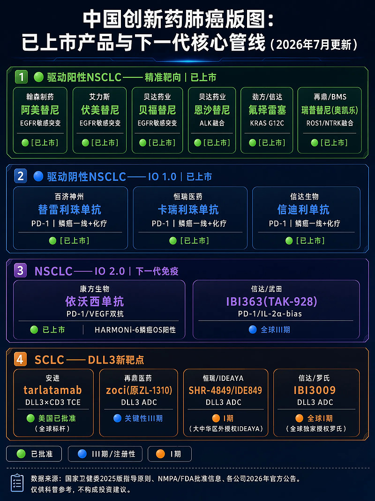
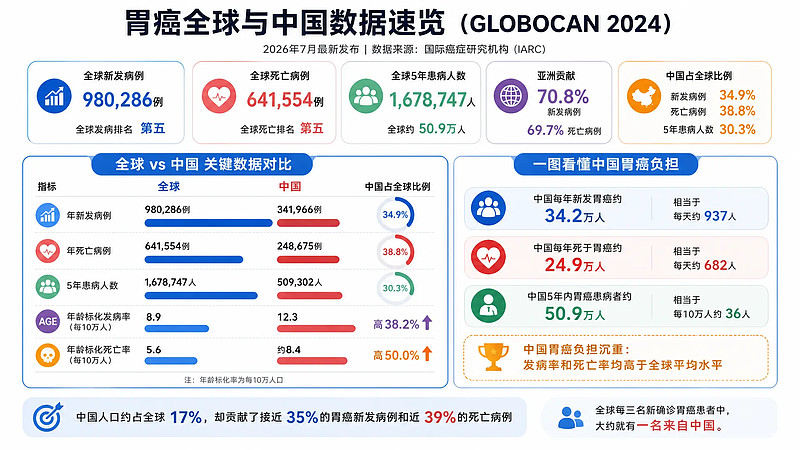

# 康方生物：真正在为未满足的临床需求做药

https://xueqiu.com/1449994841/396263032


康方最近从高点回撤了快50%。我持有康方接近3年，最近在90附近又加了一半仓位。是因为这两个月公司层面实际发生的事情和股价走势完全脱节：HARMONi-6在 ASCO 2026 Plenary 报了 OS HR 0.66并同步发表《柳叶刀》，EHA 上莱法利单抗 AML 数据9个月 OS 率翻倍，2025全年新药销售收入30.33亿元同比增长51%，三个一线大适应症新进医保且价格稳定。纯粹是行业 beta 把它砸下来了。
当然，我今天要说的不是股价的事，而是另外一个我最近的思考。
我投资创新药有几年了。中国创新药确实在蓬勃发展，但你要我打包票哪一家能长期伟大，我判断不了。但我认为康方是极少数“能看见未来”的公司。
创新药行业有句话叫“未满足的临床需求”（unmet medical need），几乎每家公司的 PPT 里都会写。但真正把这句话当成做药逻辑、而不是融资话术的企业，极少。大多数公司的实际行为是：什么靶点热就做什么，PD-1火了一窝蜂上 PD-1，GLP-1火了一窝蜂上 GLP-1，最后卷成红海、价格战、颗粒无收。
康方不太一样。它的核心管线几乎都指向同一类命题——现有标准治疗在这里明确失败了，患者在这里确实没有选择，然后用双特异性抗体的协同机制去解决单靶点药物在结构上解决不了的问题。这种做药逻辑意味着什么？意味着一旦数据成了，它面对的不是价格战，而是空白市场里的定价权。而现在，它的数据确实在一个接一个地成。
严格来说康方不只是一家“双抗公司”。它的技术平台覆盖 ADC、三抗、TCE 双抗、siRNA/[mRNA](https://xueqiu.com/S/MRNA?from=status_stock_match)、细胞治疗，但它最锋利的那把刀、最有辨识度的武器，确实是双抗。本文聚焦于此。
**依沃西：在 K 药留下的三个缺口中突围**
肺癌免疫治疗这十年，基本就是 K 药的天下。[默沙东](https://xueqiu.com/S/MRK?from=status_stock_match)靠这一个药2025年全球卖了超过300亿美元。但 K 药的成功有清晰的边界条件，至少有三个方向上留下了明显的缺口。
第一个缺口：EGFR 耐药后，免疫治疗几乎无效。
亚洲肺腺癌里40-50%携带 EGFR 突变，一线用奥希替尼，中位18个月左右耐药。耐药之后怎么办？在依沃西出现之前，全球标准只有含铂双药化疗（培美曲塞+铂类），中位 PFS 只有4-5个月，OS 约12-14个月。PD-1单药对这类患者基本无效——EGFR 突变型肿瘤是典型的“冷肿瘤”，肿瘤内部缺乏免疫细胞浸润，你把免疫刹车松了也没人去杀伤癌细胞。部分中国指南曾推荐“免疫+抗血管+化疗”四药方案（信迪利单抗+贝伐珠单抗+化疗），PFS 约7.2个月，但方案复杂、毒性叠加、费用高。
依沃西是全球唯一同时靶向 PD-1和 VEGF 的双特异性抗体。VEGF 臂让肿瘤血管正常化，把免疫细胞重新“送进去”；PD-1臂再解除免疫抑制。两个靶点形成正反馈——先把兵送进城，再给兵松绑。
HARMONi-A 研究（322例）：PFS 7.1个月 vs 化疗4.8个月，HR 0.46；OS 16.8个月 vs 14.1个月，HR 0.74。这是全球首个在 EGFR 耐药后证明免疫治疗能延长总生存的 III 期研究。2024年5月，依沃西凭借这一数据在中国获批上市，同年11月纳入国家医保目录，已获中国所有权威指南最高级别推荐——在中国，EGFR 耐药后的标准治疗已经从单纯化疗升级为依沃西+化疗。
这个缺口有多难填？就在昨天（6月22日），[辉瑞](https://xueqiu.com/S/PFE?from=status_stock_match)公布了 sigvotatug vedotin（一款整合素β6靶向 ADC）在经治非鳞 NSCLC 的 III 期 SigVie-002结果——703例患者，入组人群包含 EGFR-TKI 耐药，总体人群 OS 未达主要终点，连多西他赛都没打赢。这里不是说 ADC 和双抗有什么可比性——两者机制完全不同，没有直接对比的意义。但它们面对的是同一个临床场景：EGFR 耐药后的非鳞 NSCLC。辉瑞的失败说明的是这个场景本身的难度——不是换个新靶点、新机制就能解决的。全球顶级药企、全新机制、大样本 III 期，依然折戟。这反过来凸显了依沃西 PFS HR 0.46和 OS 获益的稀缺性：到2026年6月为止，它仍然是全球唯一在 EGFR 耐药后拿到 III 期阳性 OS 数据的免疫治疗方案。
但全球层面，这个缺口仍然敞开。全球验证性研究 HARMONi（438例，38%来自北美和欧洲）在 PFS 上完全复制了中国数据（HR 0.52，进展风险降低48%），OS 趋势一致（HR 0.79）但在主要分析时尚未达统计学显著——中位随访时间还不够长，西方患者的 OS 数据仍在成熟中。FDA 已受理上市申请，PDUFA 日期2026年11月14日。一个双抗替代了两个药（PD-1+贝伐珠单抗）的功能，联合化疗方案更简洁、毒性更可控。如果获批，依沃西将成为全球 EGFR 耐药后的新标准——这是中国创新药第一次在一个大适应症上定义全球治疗标准。
**第二个缺口：K 药“最强”的人群里，疗效天花板其实很低。**
这里需要解释一下逻辑。PD-L1高表达患者确实是 K 药最擅长的人群，也是它获批单药治疗的核心适应症。但“最擅长”不等于“够好”。K 药单药在这个人群的中位 PFS 只有5-6个月——一半人半年内肿瘤就进展了，5年 OS 率约30%，大多数患者最终还是会进展并转入二线化疗。这不是“管不了”，而是天花板明显偏低，存在巨大的提升空间。
HARMONi-2研究（398例），依沃西单药头对头 K 药：PFS 11.14个月 vs 5.82个月，HR 0.51。不是在 K 药失败的地方捡漏，是在它最擅长的战场上把疗效天花板翻了一倍。2025年4月中国获批，同年12月纳入医保——在中国，PD-L1阳性肺癌的一线标准已经从 K 药变成了依沃西。
全球层面，验证性研究 HARMONi-7（800例，依沃西单药头对头 K 药单药，PD-L1高表达）正在推进中。如果复制这一结果，依沃西有可能直接替代 K 药成为全球 PD-L1高表达肺癌的新一线标准。这是动默沙东300亿美元蛋糕里最大的一块。
**第三个缺口：肺鳞癌患者被排除在抗血管治疗之外。**
贝伐珠单抗能显著增强免疫治疗效果，但鳞癌患者用了会致命性肺出血——早期临床试验中鳞癌亚组的严重出血发生率高达31%，被明确禁用。鳞癌占肺癌的30%，这些患者长期享受不到抗血管治疗的增效红利。目前的标准方案是 PD-1+化疗（替雷利珠单抗或帕博利珠单抗+紫杉醇+铂类），中位 OS 约20-24个月，比非鳞癌患者能用的“免疫+抗血管+化疗”方案天然低一档。
HARMONi-6研究（532例，已在 ASCO 2026 Plenary Session 报告，同步发表于《柳叶刀》）：依沃西+化疗 vs 替雷利珠单抗+化疗，中位 OS 27.9个月 vs 23.7个月，HR 0.66，死亡风险降低34%。依沃西的 VEGF 臂是抗体片段而非传统贝伐珠单抗分子，安全性特征不同，鳞癌患者第一次安全地获得了抗血管+免疫的联合选择。该适应症上市申请已于2025年7月获 CDE 受理，目前处于审评阶段，2026 CSCO 指南已提前给予 II 级推荐。一个被排除在外十几年的群体，终于等到了方案。
三个缺口，三项大型 III 期阳性数据。背后的逻辑高度一致：精准识别单靶点药物的结构性盲区，用双靶点协同去填补。
**卡度尼利：给被免疫治疗“放弃”的那一半人找到出路**
免疫治疗时代有个被广泛忽视的事实：大约一半实体瘤患者因为 PD-L1低表达或阴性，系统性地被排除在免疫治疗的获益之外。
先看胃癌。CheckMate-649里 CPS\<5的患者（占胃癌50-60%），O 药+化疗 OS HR 0.94，统计学上零获益。KEYNOTE-859里同类患者 K 药+化疗 OS HR 0.85，同样不显著。FDA 后来直接修订了 K 药胃癌适应症，限定 CPS≥1——监管机构官方承认：现有 PD-1/PD-L1单抗对这一半胃癌患者没用。在卡度尼利获批之前，这些患者只能靠单纯化疗（氟尿嘧啶+奥沙利铂或顺铂），中位 OS 约11-12个月。全球范围内，这个困境至今没有改变。
宫颈癌更极端。KEYNOTE-158里 PD-L1阴性宫颈癌患者用 K 药，ORR 是0%——不是效果有限，是完全无效。在卡度尼利获批之前，这些患者一线只有铂类化疗±贝伐珠单抗（GOG-240方案），中位 OS 约16-17个月，K 药仅限 CPS≥1的患者，PD-L1阴性者被完全排除在免疫治疗之外。
卡度尼利是全球首个获批的 PD-1/CTLA-4双特异性抗体。关键在于 CTLA-4这个靶点的作用机制不依赖 PD-L1表达——它在免疫反应更上游发挥作用，能激活初始 T 细胞、扩增免疫细胞多样性，对 PD-L1阴性的冷肿瘤尤其有效。
COMPASSION-15研究（610例胃癌）：全人群 OS HR 0.61,CPS\<5人群 OS HR 0.76。对比 K 药和 O 药在同一人群的0.85和0.95，差距一目了然——卡度尼利是唯一在 PD-L1低表达胃癌中证明生存获益的免疫药物。2024年9月，卡度尼利获批胃癌一线适应症，2026年1月1日起纳入医保执行报销。占胃癌一半以上的 CPS\<5患者，在中国已经从“化疗续命、中位活一年”变为“有免疫治疗可用、死亡风险降低24%”。
宫颈癌方面，COMPASSION-03里 PD-L1\<1的患者 ORR 仍达16.7%（K 药0%）。COMPASSION-16（445例一线宫颈癌）全人群 PFS HR 0.62，OS HR 0.64，不限 PD-L1状态。2025年5月，卡度尼利获批宫颈癌一线，同年纳入医保。PD-L1阴性患者从“免疫治疗零选择”变为“有缓解可能”——这不是边际改善，是从零到有。卡度尼利是目前中国唯一获批用于宫颈癌一线治疗且纳入医保的免疫药物。
卡度尼利还在布局一个全球完全空白的方向：IO 耐药后的肝细胞癌（COMPASSION-36）。随着免疫治疗成为肝癌一线标准（阿替利珠单抗+贝伐珠单抗，或度伐利尤单抗+tremelimumab），耐药后的患者群体在爆发式增长。这些患者目前二线只有索拉非尼、仑伐替尼等小分子 TKI，中位 PFS 约3-4个月，OS 约8-10个月，全球没有任何获批的 IO 耐药后治疗方案。如果卡度尼利在这个方向成功，将是 first-in-class。
全球化方面，卡度尼利正在加速推进。2025年12月，FDA 批准启动 COMPASSION-37（AK104-311），这是一项全球多中心 III 期研究，头对头对比卡度尼利+化疗 vs 化疗±O 药（nivolumab），用于 HER2阴性晚期胃癌一线治疗。这是卡度尼利的第二项国际注册性研究（第一项是 IO 耐药肝癌的 COMPASSION-36），目前处于全球入组阶段。此外，2025年8月 COMPASSION-33（围手术期可切除胃癌 III 期）已完成首例患者入组。也就是说，卡度尼利目前在消化道肿瘤领域同时推进3项 III 期——胃癌晚期一线（全球头对头 O 药）、IO 耐药肝癌（国际注册）、胃癌围手术期（降期+辅助）。全球 III 期数据读出预计在2028-2029年。
竞品方面，AstraZeneca 的 volrustomig 和 [MacroGenics](https://xueqiu.com/S/MGNX?from=status_stock_match) 的 lorigerlimab 同为 PD-1/CTLA-4双抗，但前者无任何 III 期阳性数据（预计2027-2028年读出），后者仅完成41例 II 期且在2026年初因致命性不良事件（心肌炎、中性粒细胞减少致死）被 FDA 部分临床搁置——虽已解除，但安全性阴影仍在。卡度尼利的领先不是简单的时间差，是数据成熟度的代际差距——3个适应症获批并纳入医保，商业化已全面铺开。
**AK139：80%的 COPD 患者还在等一个答案**
昨天（6月22日）一条大新闻：AbbVie 宣布109亿美元收购 [Apogee Therapeutics](https://xueqiu.com/S/APGE?from=status_stock_match)。Apogee 的核心管线之一 APG273，是一个 IL-13/TSLP 组合抗体，开发方向正是哮喘和 COPD。一家还在临床前/I 期的公司，仅凭“双通路阻断呼吸炎症”这个方向就值109亿美元——这对 AK139意味着什么？
先说背景。COPD，全球第三大死因，近5亿患者，中国约1亿。2024年度普利尤单抗（Dupixent）成为首个获批的 COPD 生物制剂，呼吸领域里程碑。
但获批条件看仔细：仅限嗜酸性粒细胞≥300的“2型炎症”表型。这个人群只占 COPD 患者的约20%。
剩下80%怎么办？目前的标准维持治疗是三联吸入剂（ICS/LAMA/LABA），如果仍然频繁急性加重，没有任何生物制剂可用——只能反复住院、全身激素冲击。每次急性加重都会导致肺功能不可逆下降，每次住院死亡率约10%。全球药企都在为这80%寻找出路，但结果不太理想：
Roche 的 astegolimab（靶向 ST2）：III 期 ARNASA 研究未达主要终点，急性加重仅降低14.5%
赛诺菲/[再生元](https://xueqiu.com/S/REGN?from=status_stock_match)的 itepekimab（靶向 IL-33）：两项 III 期一项达标一项没达，结果不一致
AstraZeneca 的 tozorakimab（靶向 IL-33）：目前表现最好，3项 III 期（OBERON、TITANIA、MIRANDA）全部达到主要终点，预计2026-2027年提交上市申请
这里有个清晰的规律：COPD 的炎症网络高度冗余，单一通路阻断反复碰壁。阻断 ST2不够，阻断 IL-33好一些但不稳定，阻断 IL-4R 只对2型有效。原因很直观——你按下一条通路，另一条代偿性上调，按下葫芦浮起瓢。
这背后有明确的生物学基础。COPD 的气道炎症不是单一通路驱动的线性过程，而是多条信号通路交织的网络。IL-33/ST2通路是上游“警报信号”——气道上皮受损时释放 IL-33，激活 ILC2和 Th2细胞，触发下游炎症级联。IL-4/IL-13通路是下游“执行通路”——驱动嗜酸性粒细胞募集、黏液高分泌、气道重塑。关键在于：这两条通路之间存在正反馈环路。IL-33激活 ILC2后产生大量 IL-4/IL-13，而 IL-4/IL-13又能上调气道上皮 ST2的表达，使其对 IL-33更敏感。你只阻断 IL-33/ST2（如 tozorakimab），下游 IL-4/IL-13仍可通过其他途径（如过敏原直接激活 Th2）维持炎症；你只阻断 IL-4Rα（如 Dupixent），上游 IL-33仍能通过 ST2激活中性粒细胞和肥大细胞驱动非2型炎症。只有同时切断上游警报和下游执行，才能打破这个正反馈环路。2023年发表在 Journal of Translational Medicine 上的综述明确指出：“与单独阻断相比，联合阻断 IL-25、IL-33和 TSLP 能进一步抑制气道重塑和炎症”——多通路阻断的学术共识已经形成，缺的只是临床验证。
AK139同时靶向 IL-4Rα和 ST2，是全球唯一进入临床的双通路阻断策略。同时切断 IL-4/IL-13通路（2型炎症核心驱动）和 IL-33/ST2通路（炎症级联的上游预警信号），让两条通路无法互相代偿。临床前数据显示，在抑制炎症因子释放和组织炎症浸润方面显著优于任一单靶点抗体。I 期安全性优异，爬坡至1200mg 无严重不良反应。2026年2月，7项 II 期同步启动，覆盖 COPD、重度哮喘、特应性皮炎。
如果 AK139成功，意味着生物制剂对 COPD 的覆盖面从20%扩大到接近全人群——80%目前只能靠吸入剂和激素冲击勉强维持的患者，将第一次有精准靶向治疗可用。

但说实话，AK139目前只在 II 期，比 tozorakimab 落后4-5年。具体展开说：tozorakimab 的 COPD III 期（OBERON）2021年底注册、2022年初入组首例患者，2026年3月已经三项 III 期全部达标，预计2026-2027年提交上市申请，最快2027-2028年获批。AK139呢？2025年2月 IND 获批，2026年2月7项 II 期同步启动，即便一切顺利，II 期数据读出最快2027年底，III 期入组2028年，数据读出2030年——获批可能要到2031年。这就是“落后4-5年”的具体含义。
那 AK139还有什么用？这个问题需要回到机制层面来回答。Tozorakimab 阻断的是 IL-33一条通路，虽然三项 III 期都达标了，但有一个关键事实：它的 III 期数据至今未公布具体的急性加重降低幅度。作为参照，同靶点的 itepekimab（赛诺菲/[再生元](https://xueqiu.com/S/REGN?from=status_stock_match)，靶向 IL-33）两项 III 期一项达标一项没达，结果不一致；Roche 的 astegolimab（靶向 ST2）III 期仅降低14.5%急性加重，临床意义有限。单通路阻断在 COPD 中的疗效天花板可能是真实存在的——COPD 的炎症网络高度冗余，按下一条通路，另一条代偿性上调。
AK139的差异化恰恰在这里：它同时阻断 IL-4Rα（切断 IL-4/IL-13的2型炎症核心驱动）和 ST2（切断 IL-33的上游预警信号），让两条通路无法互相代偿。如果 tozorakimab 获批后的真实世界疗效证明单通路阻断的天花板确实有限（比如急性加重仅降低20-30%，远不如 Dupixent 在2型 COPD 中降低34%的效果），那双通路阻断就有明确的临床升级空间。更重要的是，AK139覆盖7个适应症（COPD、重度哮喘、特应性皮炎、慢性自发性荨麻疹、过敏性鼻炎、慢性鼻窦炎伴鼻息肉、结节性痒疹），其中哮喘和特应性皮炎的市场已经被 Dupixent 验证（2025年全球销售超过140亿美元），AK139如果在这些适应症上证明双通路优于单通路，商业价值不亚于 COPD。
所以 AK139的投资逻辑不是“跟 tozorakimab 抢同一个市场”，而是“如果单通路天花板被证实，双通路就是下一代升级方案”。它赌的是疗效差异化，不是时间竞赛。当然，这个“如果”目前还没有人类数据支撑——II 期数据是唯一的验证窗口。
**莱法利单抗：在百亿美元废墟上找到正确的路**
CD47这个靶点的故事，是创新药行业最昂贵的教训之一。
CD47是肿瘤细胞表面的“别吃我”信号——阻断它，理论上能让巨噬细胞重新识别和消灭肿瘤。Gilead 花49亿美元收购 magrolimab，AbbVie 花约20亿美元授权 lemzoparlimab。结果全面溃败。Magrolimab 2024年因 III 期显示获益不足且死亡率增加而终止，lemzoparlimab 被 AbbVie 退回。整个赛道超过100亿美元打了水漂。
失败的核心原因有两个：一是 CD47也高表达于正常红细胞，传统抗 CD47抗体会引发严重贫血，这是靶点的“原罪”；二是在血液肿瘤中，疗效不足以克服毒性。
莱法利单抗的策略完全不同。通过筛选特定结合表位实现“无血凝集”设计——能结合肿瘤细胞 CD47但不引起红细胞凝集，从根本上绕过了贫血问题。这一设计上的突破让莱法利单抗同时具备了在实体瘤和血液瘤中开发的可能性——前者是 CD47赛道全军覆没后的无人区，后者是 magrolimab 失败后留下的巨大空白。
在实体瘤方向，莱法利单抗联合依沃西形成“先天免疫（巨噬细胞吞噬）+适应性免疫（T 细胞杀伤）+血管正常化”的三重协同，是全球唯一在实体瘤中推进 III 期的 CD47靶向药物。两项 III 期正在入组：头颈鳞癌（依沃西+莱法利单抗 vs K 药，一线 PD-L1阳性）和胰腺癌。
在血液瘤方向，莱法利单抗走了一条与 magrolimab 完全不同的路：不是简单的 CD47+化疗，而是 CD47+维奈克拉+阿扎胞苷的三药联合——维奈克拉诱导肿瘤细胞凋亡暴露“吃我”信号，莱法利单抗同时解除“别吃我”信号，形成“促凋亡+促吞噬”的双重协同。2025年9月获 FDA 孤儿药认定（适应症为急性髓系白血病）。2026年6月 EHA 年会公布的 AML 随机双盲 II 期数据显示，莱法利单抗联合阿扎胞苷+维奈克拉的 ORR 达80%（对照组66.7%），中位 OS 未达到 vs 对照组8.3个月（HR 0.46），9个月 OS 率78.7% vs 43.1%，中位缓解持续时间（DOR）10.4个月 vs 对照组5.6个月——在这个极难治的人群中，生存获益信号非常明确。Magrolimab 失败的核心是“贫血毒性+疗效不足”，莱法利单抗用“无血凝集设计+更优联合方案”同时解决了这两个问题。
头颈鳞癌目前的一线标准是 K 药+化疗（KEYNOTE-048方案），中位 OS 约13个月。如果莱法利单抗+依沃西成功击败 K 药，不仅证明三重协同优于单纯 PD-1，也将为 CD47靶点正名。胰腺癌更是出了名的“癌王”——免疫治疗几乎全军覆没，五年生存率不到10%，任何突破都是巨大的临床价值。
风险同样明确：CD47赛道的系统性失败可能反映靶点本身的生物学局限，而不仅仅是分子设计问题。莱法利单抗需要在 III 期中证明 CD47阻断叠加依沃西确实优于依沃西单药——否则增量价值难以确立。
**更远的布局：阿尔茨海默病与化疗神经损伤**
AK152瞄准阿尔茨海默病——而且它确实是一款双特异性抗体，完全符合康方的核心技术路线。它同时靶向 Aβ（淀粉样蛋白）和血脑屏障高表达的转铁蛋白受体（TfR），通过 TfR 介导的转胞吞作用把抗体“摆渡”进脑内。这是双抗在 CNS 领域的全新应用——不是两个治疗靶点的协同，而是“治疗靶点+递送靶点”的协同，用双抗的结构优势解决单抗在脑内浓度不足的根本性问题。
当前已获批的抗 Aβ单抗（lecanemab、donanemab）面临一个根本性矛盾：血脑屏障穿透率仅约0.1%，需要极高剂量才能在脑内达到有效浓度，由此导致20-40%的患者出现脑水肿或微出血（ARIA）。Lecanemab 每两周静脉输注10mg/kg，能延缓认知衰退约27%，但 ARIA-E 发生率约12.6%，需要频繁 MRI 监测，美国年费约2.6万美元。Donanemab 的 ARIA-E 发生率更高达24%。患者面临的核心困境是：有效但高毒、高剂量、高监测负担。
Roche 的 trontinemab 是这个方向的先行者，同样采用 TfR 介导的脑穿透双抗设计（Roche 称之为“BrainShuttle”技术）。它的临床进度明显领先：Phase 1b/2a（Brainshuttle AD 研究）自2020年启动，已入组285例患者；2024年 CTAD 大会报告3.6mg/kg 剂量组28周内淀粉样斑块清除率达92%（从基线119 cL 降至13 cL），ARIA-E 发生率低于5%——仅需传统单抗约1/3的剂量就实现了更彻底的斑块清除和更低的毒性。2025年4月 Roche 宣布基于现有数据启动 III 期（TRONTIER 1&2），2025年9月首例患者入组。
AK152呢？2025年11月才获得中国 NMPA 的 IND 批准，目前刚进入 I 期爬坡。从临床阶段看，trontinemab 已经在 III 期入组，AK152 还在 I 期——差距确实是实打实的5-6年。
那 AK152还有什么意义？坦率说，如果 trontinemab 顺利获批（预计2028-2029年），AK152大概率不会成为 first-in-class。但这个赛道的特殊性在于：阿尔茨海默病全球患者超过5500万，市场规模预计2030年超过300亿美元，而脑穿透双抗目前全球只有 Roche 一家在 III 期。一个数百亿美元的市场不可能只容纳一款药物——就像 PD-1赛道不只有 K 药。AK152的价值在于：第一，康方在双抗工程化方面的积累可能带来差异化的分子设计（AK152不仅结合斑块，还选择性靶向毒性更强的可溶性 Aβ寡聚体）；第二，中国有全球最大的阿尔茨海默病患者群体（约1000万），即便全球市场被 Roche 先占，中国市场本身就足够大；第三，这是一个长期期权，不需要现在就给估值，但它验证了康方的双抗技术平台可以从肿瘤延伸到 CNS。
第三点值得展开说。为什么“平台延伸到 CNS”对一家公司的长期价值有意义？因为 CNS 药物开发的核心瓶颈不是靶点发现，而是递送——99%的大分子药物无法穿越血脑屏障。TfR 介导的脑穿透技术本质上是一个“通用递送平台”：一旦你掌握了让抗体高效进入大脑的工程化能力，理论上可以把任何靶向 CNS 靶点的抗体“搭载”进去。AK152如果在 I/II 期证明了康方的 TfR 双抗设计能有效穿透血脑屏障并在脑内达到治疗浓度，那这个平台能力就不仅仅适用于 Aβ——帕金森病（α-突触核蛋白）、渐冻症（SOD1）、甚至脑肿瘤，都可能成为后续管线。Roche 之所以把 BrainShuttle 定位为平台而非单品，正是这个逻辑。对康方而言，AK152的成败决定的不只是一个 AD 管线的价值，而是公司是否拥有了进入 CNS 这个万亿级治疗领域的“入场券”。
AK135针对化疗诱导周围神经病变（CIPN）——约30-40%化疗患者会出现手脚麻木、疼痛等神经损伤，严重影响生活质量甚至导致化疗被迫中断。这个适应症特殊在哪？全球没有任何获批药物。临床上只能用度洛西汀（一种抗抑郁药）做症状缓解，效果有限，且不能逆转神经损伤。很多患者因为神经毒性被迫减量或停止化疗，间接影响抗癌疗效。AK135靶向 IL-1RAP，目前 I 期/II 期筹备阶段。如果成功，将是全球首个针对 CIPN 的获批药物——又是一个字面意义上的“从零到有”。
把康方的管线摊开来看，模式高度一致：每一条核心管线都对应一个可以用竞品数据验证的“未满足的临床需求”——K 药在 EGFR 耐药后无效，K 药在 PD-L1高表达人群疗效天花板太低，鳞癌患者被排除在抗血管治疗之外，K 药和 O 药在 PD-L1低表达胃癌中无获益，Dupixent 只覆盖20%的 COPD 患者，CD47赛道全军覆没后实体瘤无人推进 III 期，CIPN 全球无药可用。
而每一条管线的解决方案，都不是简单模仿或微调，而是通过双抗的协同机制去解决单靶点在结构上无法解决的问题。这种做药逻辑的投资含义很直接：当一款药解决的是真实存在的临床空白，它面对的不是拥挤的红海竞争，而是空白市场里的定价权。医生会主动处方，因为患者确实没有其他选择。
当然，这套逻辑不是没有代价。全球化是当前最大的不确定性——HARMONi-3中期 PFS 未达显著性是事实，中国数据能否外推到全球是所有中国创新药出海面临的结构性挑战，HARMONi-3最终数据2026下半年公布之前谁也没法下定论。AK139和 AK152分别落后竞品4-5年和5-6年，即便机制更优也可能面临已被重塑的市场格局。莱法利单抗的 CD47增量价值、AK139的双通路协同优势，目前都还停留在“机制合理+临床前验证”阶段，III 期数据是唯一的裁判。PD-1/VEGF 双抗赛道上[辉瑞](https://xueqiu.com/S/PFE?from=status_stock_match)和 [BioNTech](https://xueqiu.com/S/BNTX?from=status_stock_match)/BMS 的 III 期2028-2029年读出，依沃西领先3-4年的窗口不是永恒的。
这些我都想过。但我最终还是选择在80-90块加仓，原因很简单：康方的收益来源不是“我也有一个 PD-1”或“我也在做 CD47”，而是“我在解决一个别人解决不了的问题”。如果数据持续成功，它面对的不是价格战，而是蓝海中的定价权。即便不考虑海外，仅国内已获批适应症的放量（30亿收入、51%增速、三个一线大适应症刚进医保），当前的市值也谈不上高估。海外是期权，不是前提。
2026下半年到2027年是关键验证窗口。HARMONi-3最终 PFS 和中期 OS 将决定全球化叙事的成败，AK139的 II 期数据将验证双通路是否真的优于单通路，莱法利单抗头颈鳞癌 III 期的初步信号也会在这个窗口内出现。到那时候，“为未满足的临床需求做药”这句话，是真金白银还是一句空话，数据会给出答案。[$康方生物(09926)$](https://xueqiu.com/S/09926) [$Summit Therapeutics(SMMT)$](https://xueqiu.com/S/SMMT)


# 康方生物：真正在为未满足的临床需求做药（续）

https://xueqiu.com/1449994841/396489478

上一篇《[康方生物](https://xueqiu.com/S/09926?from=status_stock_match)：真正在为未满足的临床需求做药》发出后，收到不少有深度的反馈。这些反馈让我在产生了新的思考。所以我续写了一篇，把之前没有谈到的有些东西再补充一下。

但在进入具体管线之前，我想先建立一个分析框架——这篇文章里讨论的管线分布在完全不同的临床阶段，它们的证据分量天然不同。如果不做这个区分，很容易把一个 Phase Ib 的早期信号和一个 III 期注册性研究的阳性结果放在同一个天平上比较，这在投资决策上是危险的。

注册性临床（Phase III 或注册性 Phase II）——如 HARMONi-6（III 期，OS 阳性）、HARMONi-2（III 期，PFS 阳性，已获批）、COMPASSION-28（III 期，入组中）——这些研究的设计、样本量和终点选择都经过了监管机构的沟通和认可。阳性结果可以直接支持上市申请，数据可靠性最高。虽然仍有失败概率（肿瘤 III 期成功率约40-50%），但至少“游戏规则”是明确的：主要终点是什么、统计假设是什么、样本量是否够，这些都是可验证的。

随机对照 II 期——如 AK117-206（AML，60例，随机双盲）——提供了随机化带来的偏倚控制，但样本量有限，终点通常是 ORR/PFS 而非 OS，统计效力不足以得出确定性结论。这类研究可以产生“强烈信号”，但本质上是决策依据——要不要推进 III 期——而非定论。II 期到 III 期的转化失败率约50-60%。

早期探索性临床（Phase I/II、1a/1b）——如 AK130 胆道癌 Phase Ib、AK146D1 Phase Ia、AK138D1 Phase Ib/II——样本量小（通常20-50例），多为单臂，主要目标是探索安全性和初步疗效信号。这个阶段的数据波动极大，ORR 在不同队列之间可能出现10-20个百分点的差异，从 Phase Ib 到 III 期的失败率超过70%。

临床前/IND 阶段——如 AK150（刚获批 IND）、AK159、AK163——没有任何人体数据，全凭机制推演和临床前模型。在所有阶段中不确定性最高，在这个阶段给管线赋予估值权重是极不审慎的。

带着这个框架再去看康方的管线，很多问题会变得清晰。下面逐一展开。

一、莱法利单抗 AML 数据：生存获益信号明确，但证据链确实不完整

上篇我写到 EHA 2026 的 AML 随机双盲 II 期数据时，只呈现了有利的一面：ORR 80% vs 66.7%，中位 OS 未达到 vs 8.3个月（HR 0.46），9个月 OS 率78.7% vs 43.1%。有评论指出我回避了不利数据，这个这个确实成立。

完整的数据图景是这样的：

莱法利单抗组的复合完全缓解率（CRc）为56.7%，对照组为53.3%，仅差约一个患者。MRD 阴性率46.7% vs 36.7%，差距约三个患者。这些数字放在一起，有一个值得追问的问题：莱法利单抗组在深度缓解（CRc）上并没有显著优于对照组，那9个月 OS 率翻倍的生存获益从何而来？

我的理解是这样的。首先看缓解持续时间（DOR）：莱法利单抗组达到 CRc 的患者中位 DOR 为10.4个月，对照组仅5.6个月。也就是说，虽然两组达到深度缓解的比例差不多，但莱法利单抗组的缓解持续得更久。CD47阻断可能不是让更多人缓解，而是让已经缓解的人不容易复发——巨噬细胞持续清除残留白血病细胞，维持了缓解状态。其次看无事件生存期（EFS）：HR 0.46（95% CI 0.22-0.94），9个月 EFS 率53.2% vs 14.1%——这个差距比 OS 还大，说明莱法利单抗组的患者不仅活得更久，而且复发/进展的时间也显著延后。

但必须诚实面对的是：OS 的 HR 0.46，95%置信区间为0.20-1.06，跨过了1。这意味着从严格的统计学标准看，OS 差异尚未达到显著性。EHA 2026（6月发布）更新的最新数据显示：莱法利单抗组中位 EFS 为9.1个月（vs 对照组6.9个月），6个月 EFS 率67.8%（vs 55.5%），中位随访莱法利单抗组10个月、对照组8.8个月。这些数字和初版数据方向一致，但核心问题不变：这是一个60例患者的 II 期研究，中位随访才10个月，统计效力本身就有限。研究者在 EHA 报告中也明确说“supports further clinical development”——这是一个需要更大样本、更长随访来确认的信号，不是定论。

按照开篇的框架，AK117-206属于随机对照 II 期——比单臂 II 期可靠（有随机化控制偏倚），但远不如 III 期注册性研究可靠（样本量小、OS 尚未达到统计学显著）。它相当于一辆车在 II 期弯道上开得不错，但离 III 期的“终点线”还有相当距离。CD47赛道的历史教训——[吉利](https://xueqiu.com/S/00175?from=status_stock_match)德 magrolimab 三项 III 期（ENHANCE、ENHANCE-2、ENHANCE-3）全部失败——也提醒我们，II 期数据再好，也不能替代 III 期的验证。

所以上篇的表述确实有选择性偏差。更准确的说法应该是：莱法利单抗在 AML 中展现了持久缓解和生存获益的趋势，EFS 达到统计学显著（HR 0.46, CI 0.22-0.94），OS 趋势强烈但尚未达到统计学显著，CRc 和 MRD 阴性率的增量有限，获益主要体现在缓解持续时间（DOR 10.4个月 vs 5.6个月）和生存曲线的后期分离。这个数据足以支持继续开发，但离“生存获益信号非常明确”这个表述，还差一步。

AK117在 AML 方向的价值是真实的——它解决了 magrolimab 的贫血问题（两组贫血发生率46.7% vs 50.0%，无差异），在 VEN+AZA 基础上展现了增量信号，且已获 FDA 孤儿药认定。但它目前还是一个“需要 III 期确认”的故事，我上篇的表述显得有些乐观了。

二、头颈鳞癌：两臂设计的局限性与 ILLUMINE 三臂设计的回应

评论中还有一个问题：AK117-302（头颈鳞癌 III 期）是依沃西+莱法利单抗 vs K 药的两臂设计。如果最终赢了 K 药，你怎么知道疗效是依沃西的功劳还是莱法利单抗的功劳？没有依沃西单药臂作为对照，这个贡献拆不清楚。

这个这个问题完全合理。在 FDA 的监管逻辑里，如果你要证明一个联合方案中每个组分都有贡献，最干净的设计是析因设计或至少包含单药臂。两臂设计（联合 vs 标准）只能证明“联合方案整体优于标准”，无法证明“每个组分都不可或缺”。这确实可能成为 FDA 审评时的质疑点。

但这里有一个关键信息我上篇没有提到：康方已经启动了全球 III 期 ILLUMINE 研究，采用的正是三臂设计。

ILLUMINE 是由法国 GORTEC（头颈肿瘤协作组）主导、在 Summit 授权区域开展的全球多中心 III 期研究，设计为三臂：

A 臂：依沃西单药

B 臂：依沃西+莱法利单抗

C 臂：K 药单药（对照）

适应症同样是一线 PD-L1阳性复发/转移性头颈鳞癌，计划2026年 Q2首例患者入组。

这个设计精准回应了上述质疑。A 臂 vs C 臂可以单独验证依沃西是否优于 K 药；B 臂 vs A 臂可以验证莱法利单抗在依沃西基础上的增量贡献；B 臂 vs C 臂验证联合方案的整体优势。三个比较同时回答三个问题，FDA 审评时的“贡献拆分”问题被彻底解决。

所以实际情况是：AK117-302（中国两臂）和 ILLUMINE（全球三臂）是互补的平行布局。中国研究先跑，如果阳性可以支持国内注册；全球研究用更严谨的设计回答 FDA 的问题。这不是设计缺陷，而是“中国先行、全球确认”的分阶段策略——用中国数据争取时间窗口，用全球数据争取监管认可。

当然，风险也很明确：ILLUMINE 刚启动，首例患者预计2026年 Q2入组，数据读出最快也要2028-2029年。在此之前，AK117-302如果先读出阳性结果，确实会面临贡献拆不清的质疑。但至少从试验设计的前瞻性来看，康方和 Summit 显然已经预判到了这个问题。

三、被遗漏的管线（一）：AK130——在 TIGIT 赛道废墟上的差异化突围

上篇完全没有提到 AK130，这是一个明显的遗漏。AK130是全球唯一进入注册性临床开发的 TIGIT/TGF-β双功能抗体融合蛋白，瞄准的是“冷肿瘤”这个免疫治疗最难啃的骨头。

先说背景。TIGIT 赛道曾经是免疫治疗的“下一个 PD-1”，吸引了罗氏（tiragolumab）、[默沙东](https://xueqiu.com/S/MRK?from=status_stock_match)（vibostolimab）、BMS（BMS-986207）等巨头重金押注。结果全面溃败：罗氏的 SKYSCRAPER-01（肺癌 III 期）2022年失败，SKYSCRAPER-02（小细胞肺癌）2023年失败；默沙东的 KeyVibe 系列多项 III 期未达终点。整个赛道的逻辑被质疑：单纯阻断 TIGIT 是否足以解除免疫抑制？

AK130的设计思路完全不同。它不是一个单纯的 TIGIT 抗体，而是将抗 TIGIT 单抗与人 TGF-β受体 II 的胞外域融合——同时阻断 TIGIT-CD155相互作用（解除 T 细胞和 NK 细胞的功能抑制）和 TGF-β信号（逆转肿瘤微环境的免疫抑制、减少调节性 T 细胞的免疫逃逸活性）。这是一个“解除免疫刹车+逆转免疫抑制微环境”的双重策略，针对的正是 TIGIT 单药失败的核心原因：肿瘤微环境中 TGF-β介导的免疫抑制让单纯解除 TIGIT 刹车变得无效——你松了刹车，但发动机本身被 TGF-β“熄火”了。

2025年9月，AK130联合依沃西治疗晚期胰腺癌的注册性 II 期研究（AK130-202）完成首例患者给药。胰腺癌是出了名的“癌王”——免疫治疗几乎全军覆没，五年生存率不到10%。选择胰腺癌作为注册性研究的适应症，本身就说明了康方对 AK130+依沃西联合方案的信心。

更值得关注的是2026年 ASCO 年会上公布的 AK130联合依沃西治疗晚期胆道癌的 Phase 1b 数据。23例患者入组，在45mg/kg 剂量组的15例可评估患者中（其中绝大多数是 PD-(L)1抑制剂+化疗经治后进展的患者），ORR 达到20%，DCR 73.3%，87.5%的 SD 患者出现肿瘤缩小。对于这个经治人群来说，20%的 ORR 已经是有意义的信号——胆道癌二线 FOLFOX 化疗的 ORR 通常只有5-10%。

这里必须区分两个完全不同证据层级的研究。 AK130-202（胰腺癌注册性 II 期）是注册性临床——虽然叫“II 期”而非“III 期”，但它是经过监管沟通、以支持上市申请为目标设计的，数据可靠性介于传统 II 期和 III 期之间。而 ASCO 上的胆道癌 Phase 1b 数据属于早期探索性临床——23例患者、单臂、主要终点是安全性和初步疗效信号。按开篇的框架，从 Phase Ib 到 III 期成功的概率不足30%。20%的 ORR 是一个值得继续开发的信号，但绝对不能直接外推为“这个药在胆道癌中有效”——样本太小，且是单臂研究，无法排除患者选择偏倚和中心效应。

AK130的战略定位非常清晰：它联合依沃西，形成“PD-1阻断+VEGF 抑制+TIGIT 阻断+TGF-β中和”的四通路联合攻击，专门针对传统免疫治疗无效的冷肿瘤（胰腺癌、胆道癌、IO 耐药实体瘤）。这是康方“IO2.0 + IO2.0”联合策略的核心体现——不是简单地把两个药叠在一起，而是从机制层面设计互补的通路覆盖。

风险同样明确：TIGIT 赛道的系统性失败可能反映的不仅是“单药不够”的问题，也可能是 TIGIT 靶点本身在实体瘤中的生物学贡献有限。AK130的双功能设计是否能克服这个根本性质疑，目前胆道癌只有 Phase 1b 的小样本信号，胰腺癌注册性 II 期的结果才是第一个真正有说服力的验证窗口——而那个数据还没有出来。

四、被遗漏的管线（二）：COMPASSION-28——PD-L1阴性肺癌的攻坚

上篇在讨论卡度尼利时，聚焦于胃癌和宫颈癌的 PD-L1低表达/阴性人群获益，但完全没有提到一个同样重要的方向：PD-L1阴性肺癌。

这是一个被严重低估的临床空白。驱动基因阴性的晚期 NSCLC 中，约20-30%的患者 PD-L1表达为阴性（TPS\<1%）。这些患者目前的标准治疗是 PD-1/PD-L1抑制剂+化疗，但获益有限——KEYNOTE-189中 PD-L1 TPS\<1%亚组的 OS HR 为0.59，看起来不错，但中位 OS 也就12-13个月左右，远不如 PD-L1高表达人群的20个月以上。更关键的是，这些患者用 PD-1单药几乎无效，联合化疗的获益也在缩水。

COMPASSION-28是卡度尼利联合化疗对比替雷利珠联合化疗，一线治疗 PD-L1表达阴性的局部晚期或转移性 NSCLC 的 III 期研究，目前正在入组中。

逻辑和胃癌一样：PD-L1阴性意味着 PD-1/PD-L1通路不是主要的免疫逃逸机制，单纯阻断 PD-1获益有限。卡度尼利的 CTLA-4臂在更上游发挥作用——激活初始 T 细胞、扩增 T 细胞库的多样性——这个机制不依赖 PD-L1表达。如果 COMPASSION-15在胃癌 CPS\<5人群中的成功（OS HR 0.76）能在肺癌 PD-L1阴性人群中复制，那卡度尼利将在肺癌领域开辟出一个全新的适应症空间——不是和依沃西竞争 PD-L1阳性人群，而是覆盖依沃西触及不到的 PD-L1阴性人群。

这意味着康方在肺癌一线的布局实际上是互补的全覆盖：PD-L1高表达用依沃西单药（HARMONi-2/HARMONi-7），全人群用依沃西+化疗（HARMONi-3/HARMONi-6），PD-L1阴性用卡度尼利+化疗（COMPASSION-28）。三条管线覆盖了肺癌一线治疗的全部 PD-L1分层，没有死角。

五、被遗漏的管线（三）：HARMONi-8A——IO 耐药肺癌的无人区

如果说 PD-L1阴性是“一线治疗的盲区”，那 IO 耐药就是“二线之后的荒漠”。

现实是这样的：免疫治疗成为肺癌一线标准后，60-70%的患者在初始治疗一年内出现疾病进展。这些“IO 耐药”患者的二线选择极其有限——多西他赛是国内外指南推荐的标准，但中位 PFS 只有3-4个月，ORR 不到10%。过去几年，多项探索 IO 耐药肺癌的 III 期研究全部失败，包括 PD-1再挑战和多个 ADC 药物。全球范围内，IO 耐药后 NSCLC 目前没有任何获批的标准方案。

HARMONi-8A（AK112-305）是依沃西联合多西他赛治疗 IO 耐药 NSCLC 的 III 期注册研究，2025年7月完成首例患者给药，目前正在入组中。

为什么依沃西在这个场景有机会？IO 耐药的核心机制之一是肿瘤通过上调 VEGF 重塑免疫抑制微环境——VEGF 不仅促进血管新生，还直接抑制 T 细胞功能、促进免疫抑制性细胞（MDSC、Treg）的募集。PD-1耐药后单纯再用 PD-1无效，但如果同时阻断 VEGF 介导的免疫抑制，有可能“重新激活”已经耗竭的免疫应答。依沃西的 PD-1/VEGF 双靶点设计，恰好对应了 IO 耐药的核心逃逸机制。

2025年9月 WCLC 上，卡度尼利联合普络西单抗（VEGFR2）在 IO 耐药肺癌中的 II 期数据以口头报告形式发表，展现了“大幅延长患者生存期”的信号。这说明“IO 双抗+抗血管”策略在 IO 耐药场景中的逻辑是成立的。HARMONi-8A 用的是依沃西（本身就是 PD-1+VEGF）联合化疗，机制上更加直接。

如果 HARMONi-8A 成功，依沃西将覆盖肺癌从一线到 IO 耐药后的全线治疗——一线 PD-L1阳性单药、一线全人群联合化疗、EGFR 耐药后联合化疗、IO 耐药后联合化疗。一个药覆盖四个治疗线，这在肿瘤免疫治疗史上几乎没有先例。

六、联合疗法矩阵：从“单品逻辑”到“平台逻辑”

把上面这些管线摊开来看，一个更大的图景浮现了。康方不是在做一堆独立的管线，而是在构建一个联合疗法矩阵。

矩阵的核心是两个已商业化的“基石药物”：依沃西（PD-1/VEGF）和卡度尼利（PD-1/CTLA-4）。围绕这两个基石，不同的“武器”被组合进来：

依沃西 + 莱法利单抗（CD47）→ 头颈鳞癌、胰腺癌（先天免疫+适应性免疫+抗血管）

依沃西 + AK130（TIGIT/TGF-β）→ 胰腺癌、胆道癌（四通路联合攻击冷肿瘤）

依沃西 + 化疗 → 肺癌全线（一线到 IO 耐药）

卡度尼利 + 化疗 → PD-L1阴性肺癌、胃癌全人群

卡度尼利 + 仑伐替尼 → IO 耐药肝癌

卡度尼利 + 普络西单抗 → IO 耐药肺癌

依沃西 + B7H3 ADC → 多种实体瘤（2026年中启动）

依沃西 + RAS(ON)i → RAS 突变实体瘤（2026 Q1首例给药）

这个矩阵的投资含义是什么？

第一，风险分散。任何单一管线的失败不会动摇整个体系。AK130在胰腺癌失败了？依沃西+莱法利单抗还在头颈鳞癌推进。HARMONi-8A 没达标？COMPASSION-28还在 PD-L1阴性肺癌攻坚。矩阵结构天然对冲了单管线风险。

第二，边际成本递减。依沃西和卡度尼利已经完成了从研发到商业化的全链条建设——生产工艺、供应链、销售团队、医院准入、医保覆盖。每新增一个联合方案，边际成本主要是临床试验费用，而不是从零搭建整个商业化体系。这和那些只有一条管线、一旦失败就归零的 biotech 公司完全不同。

第三，数据复用和协同验证。依沃西在肺癌中积累的安全性数据、药代动力学数据、生物标志物数据，可以直接用于指导其在头颈鳞癌、胆道癌、结直肠癌中的开发。每一项新研究都不是从零开始，而是站在前面所有研究的肩膀上。

第四，也是最重要的——平台价值的非线性增长。当矩阵中的多个节点同时产生阳性数据时，市场对公司的估值逻辑会从“单品 DCF”切换到“平台溢价”。目前市场还在用单品逻辑给康方定价（依沃西值多少、卡度尼利值多少），但如果2026-2027年 HARMONi-3最终数据、COMPASSION-28中期信号、AK130注册性 II 期数据、HARMONi-8A 入组进展同时推进顺利，估值体系可能会发生质变。

七、AK150三抗与“二代产品”逻辑

最后补充一个上篇完全没有涉及的前沿管线：AK150。

AK150是全球首款三重靶向髓系免疫检查点抗体，同时靶向 CSF1R、ILT2和 ILT4。它的设计逻辑是从“髓系免疫”这个维度重塑肿瘤微环境——阻断 ILT2/ILT4解除 T 细胞和 NK 细胞的活化抑制，抑制 CSF1R 清除肿瘤相关巨噬细胞并逆转其极化，实现“解除免疫抑制+清除抑制性细胞+激活抗肿瘤免疫”的三维调控。2026年3月 IND 获批进入临床。

临床阶段：临床前/IND 阶段，刚跨入 Phase I 门槛。 按开篇的框架，这是证据层级最低的一类——没有任何人体数据，全凭机制推演和临床前模型。在所有的在研管线中，AK150的不确定性最高。三抗的设计非常精巧，但“精巧”不等于“能成药”——多靶点的协同效果在人体中是否成立、CSF1R+ILT2+ILT4的三重阻断是否会带来意外的免疫相关毒性，目前全部未知。在这个阶段，AK150应该被视为一个“概念验证”，而非一个“管线资产”。不宜给予任何估值权重。

AK150代表了康方技术平台的又一次跨越：从双抗到三抗。如果说依沃西和卡度尼利是“IO 2.0”的代表，那 AK150就是“IO 3.0”的探索——不再局限于 T 细胞免疫检查点，而是深入到髓系免疫的调控层面。这和 AK130（TIGIT/TGF-β）、AK132（Claudin18.2/CD47）一起，构成了康方在“冷肿瘤转热”方向的完整武器库。但需要明确的是，这个武器库里的大多数武器目前还停留在图纸阶段。

有评论提到“康方的二代产品临床数据都做得不错，所以 AK135、AK139都值得期待”。这个逻辑有一定道理但需要谨慎。“二代产品”的成功率确实高于 first-in-class——因为你已经知道了一代产品的失败原因，可以针对性地优化。AK139相对于 Dupixent（单靶点 IL-4Rα）的双通路设计、AK135相对于度洛西汀（非靶向对症治疗）的精准靶向设计，都是在前人经验基础上的迭代。但“二代”不等于“必然成功”——TIGIT 赛道的 tiragolumab 也是“二代免疫检查点”，照样全面失败。关键还是要看具体的临床数据。

八、依沃西结直肠癌：不亚于肺癌的下一个战场

上一篇几乎没有提到依沃西在结直肠癌（CRC）的布局，这个遗漏必须补上——因为 CRC 的市场规模和对免疫治疗的“顽固抵抗”，让这个适应症的潜力不亚于肺癌。

结直肠癌是全球第三大常见恶性肿瘤，年新发病例约190万。其中约95%是 MSS/pMMR 型——也就是说，95%的晚期结直肠癌患者对现有免疫治疗（PD-1/PD-L1抑制剂）基本无效。这和肺癌、胃癌的情况完全不一样：肺癌中 PD-L1高表达人群用 K 药好歹能获益，胃癌中 PD-L1阳性人群用 O 药也能获益。但 MSS/pMMR 型 CRC 是一个“全民免疫治疗无效”的适应症——KEYNOTE-177中 MSS 患者用 K 药基本无响应，目前一线标准仍是贝伐珠单抗+FOLFOX/FOLFIRI 化疗，中位 OS 约30个月。

康方在这个方向上的数据相当扎实。2024年 ESMO 上公布的 II 期数据显示，依沃西联合 FOLFOXIRI 治疗一线 MSS/pMMR 型 mCRC 的 ORR 达81.8%，DCR 100%，中位随访9个月时中位 PFS 尚未达到，9个月 PFS 率81.4%，且不论 KRAS/BRAF 突变状态均有获益。2026年 ASCO 年会上，Summit 公布了全球多中心 II 期扩展队列数据（依沃西联合 FOLFOX），全人群 ORR 70.8%，DCR 100.0%，各剂量组应答一致。

两个 II 期、两个不同化疗骨架（FOLFOXIRI 和 FOLFOX）、中美两套患者人群，都给出了高 ORR 和高 DCR——这在 MSS 型 CRC 中是极其罕见的信号。作为对比，贝伐珠单抗+FOLFOX 一线治疗 mCRC 的 ORR 通常在45-55%之间，DCR 约85-90%。依沃西联合化疗的 ORR 高出20-30个百分点，DCR 达到100%。

但按开篇框架，这些仍然属于 II 期数据，不是注册性研究的结果。 两个 II 期都是单臂设计，ORR 高达70-80%是一个强烈的正向信号，但单臂 II 期的 ORR 在 III 期随机对照中“回撤”10-20个百分点的案例在肿瘤药物开发史中并不少见。真正的考验是两项正在进行的 III 期。

III 期的布局也很快。HARMONi-GI6（AK112-312）是康方在中国开展的注册性 III 期，一线 mCRC，2025年7月首例患者入组。HARMONi-GI3 是 Summit 在全球（除中国和澳大利亚）开展的注册性 III 期，依沃西+FOLFOX 头对头贝伐珠单抗+FOLFOX，2025年 Q4启动入组。两项 III 期同时推进，中国和全球双线并行。III 期阳性数据——而非当前的 II 期 ORR——才是依沃西能否在 CRC 获批上市的决定性依据。

从投资角度看，CRC 为依沃西提供了一个不亚于肺癌的增量空间。贝伐珠单抗（含原研及生物类似药）2025年全球市场规模约100亿美元，其中相当大比例来自 CRC 适应症。如果依沃西（本身就包含 VEGF 阻断功能）能替代贝伐珠单抗+PD-1的组合方案（目前 CRC 还没有获批的 PD-1联合方案用于 MSS 人群），那这将是依沃西在肺癌之外的第二个“重磅炸弹”级适应症。再加上 HARMONi-GI1（胆道癌 III 期，入组已完成，纳入突破性疗法），依沃西在消化道肿瘤的布局正在从“肺癌单适应症故事”变成“跨瘤种平台故事”——这一点市场目前定价极不充分。但同样需要清醒的是，III 期数据读出之前，CRC 仍然是一个“强烈信号+机制合理”的阶段，不是“已经验证”的阶段。

九、AK139竞争格局修正：双抗赛道不只有 IL-33单抗

上篇在讨论 AK139时，主要将其竞争对手定位为 tozorakimab（IL-33单抗），这个框架不够完整。有评论指出，AK139真正的对手可能不是 IL-33单抗，而是一批同样基于“双通路阻断”逻辑的 TSLP 双抗——这些管线进度和 AK139差不多，但靶点组合不同。

具体来看这条赛道上的玩家：

Sanofi 的 lunsekimig（SAR444336）：TSLP/IL-13 纳米抗体双抗，Phase IIb 哮喘数据已于2026年4月读出（AIRCULES 研究达到主要终点），但 COPD 方向 Phase II 未达到终点。进度上仍领先 AK139约1-2年。Sanofi 在呼吸领域有 Dupixent 的商业化基础，一旦数据阳性，商业化落地速度会极快。

Innovent 的 IBI3002: TSLP/IL-4Rα双抗，Phase I 阶段。

Aclaris 的 ATI-052: TSLP/IL-4R 双抗，2025年4月 IND 获批，Phase Ia/Ib 阶段。

Apogee/Paragon 的 APG333+APG777：TSLP 单抗+IL-13单抗的组合策略（不是双抗，但逻辑相同）。Apogee 刚被 AbbVie 以109亿美元收购，正是以这个方向为核心管线。

这些玩家和 AK139的共同逻辑是一致的——COPD 和哮喘的炎症网络需要多通路同时阻断，单通路不够。但具体的靶点组合不同：大多数选择了 TSLP（上游警报素）+IL-13或 IL-4Rα（下游2型炎症执行通路），而 AK139选择的是 IL-4Rα（下游执行）+ST2（另一条上游警报素 IL-33的受体）。

哪种组合更优？目前没有任何头对头数据可以回答这个问题。从生物学角度看，TSLP 和 IL-33都是上皮来源的警报素，在 COPD 和哮喘的炎症级联中都有重要作用，但相对贡献可能因疾病亚型、患者人群而异。TSLP 在过敏原驱动的2型炎症中作用更明确（Tezspire 已获批用于重症哮喘），IL-33在病毒或污染物驱动的非2型炎症中可能更重要。AK139的 IL-4Rα/ST2组合在非2型 COPD 中的理论优势在于——它保留了 IL-4Rα对2型炎症的完全阻断（和 Dupixent 一样强），同时通过 ST2覆盖了 IL-33驱动的非2型炎症。

但说到底，这是机制推演，临床数据才是裁判。需要注意一个关键的临床阶段信息：AK139于2026年2月获得 NMPA 批准，同步启动了覆盖 COPD、哮喘、特应性皮炎、慢性自发性荨麻疹等7个适应症的 II 期研究。 按照开篇的框架，AK139目前全部处于早期探索性临床（Phase II 刚启动）——没有随机对照数据，没有剂量优化数据，也没有任何疗效数据公开。从 Phase II 启动到 III 期阳性数据的转化失败率超过70%。AK139如果能在其中任何一个大适应症上证明双通路优于单通路（Dupixent 或 tozorakimab），差异化就能成立。但目前这个判断完全基于机制推演，没有一个数据点可以支撑。目前 AK139在“IL-4Rα/ST2”这个靶点组合上仍然是全球唯一进入临床的，这是先发优势——但不等于没有对手，只是对手选择了不同的双通路组合。在估值层面，AK139在 II 期数据读出前不应被赋予任何实质性权重。

对投资者而言，这意味着：不要把 AK139的竞争格局简化成“AK139 vs tozorakimab”，而要意识到这是一个“多条双通路阻断策略同时竞技”的赛道。AK139的 II 期数据不仅要证明自己有效，还要在疗效绝对值上和 Sanofi 的 TSLP/IL-13、Apogee 的 TSLP+IL-13组合等形成可对比的优势——即便没有头对头研究，市场也会做跨试验比较。这个维度的竞争烈度，上篇没有充分展开。

十、ADC 2.0 与 Dual-Lock TCE：下一代武器已经上膛

有提到“可以再写写双抗 ADC”——这一点上篇确实完全没涉及。康方的 ADC 2.0平台和 TCE 平台虽然还在早期，但它们和现有的 IO 双抗之间的联合潜力，才是康方“下一代护城河”的真正所在。

先看双抗 ADC。康方目前已经公开的有三条：

AK146D1（Trop2/Nectin4 双抗 ADC）：2025年7月首例患者入组 Phase Ia，是康方首个进入临床的双抗 ADC。Trop2和 Nectin4在多种实体瘤中高表达、正常组织中低表达，是 ADC 的理想靶点。已上市的单靶点 Trop2 ADC（如 Trodelvy）和 Nectin4 ADC（如 Padcev）验证了这两个靶点的成药性，但单靶点 ADC 面临一个结构性问题——肿瘤异质性导致的靶点表达不均，部分肿瘤细胞低表达或不表达单一靶点，从而逃逸。双抗 ADC 同时靶向两个抗原，理论上可以扩大覆盖范围、克服单靶点耐药。临床前数据显示 AK146D1在 Trop2或 Nectin4表达的肿瘤中均展现出强效抗肿瘤活性。临床阶段标注：Phase Ia，属于早期探索性临床——剂量爬坡和安全性的初步探索阶段，距离疗效验证还有很长的路。

AK138D1（HER3 ADC）：【2026年6月15日更新】康方宣布 AK138D1联合依沃西治疗晚期乳腺癌的 Phase Ib/II 研究（AK138D1-202）已完成首例患者入组。HER3在 EGFR-TKI 耐药 NSCLC、乳腺癌等多种肿瘤中高表达，是 ADC 领域的热门靶点之一。第一三共的 patritumab deruxtecan（HER3 ADC）已经在 EGFR 耐药 NSCLC 中申报上市，验证了这个方向的可行性。康方的 HER3 ADC 如果能在疗效或安全性上形成差异化——比如与依沃西联用在 EGFR 耐药后 NSCLC 中形成“双抗+ADC”的协同——就能在已经验证的赛道上找到自己的位置。但临床阶段标注：AK138D1目前处于 Phase Ib/II，属于早期探索性临床，“首例入组”意味着数据读出至少需要1-2年，目前没有任何疗效数据。

AK157D1（可能为 EGFR/B7-H3 ADC）：路演材料中在 ADC 管线列表中提到了“B7H3 ADC”和“依沃西+B7H3 ADC 联合，临床将于2026年中启动”。B7H3是一个在多种实体瘤中高表达的免疫检查点分子，也是 ADC 的潜力靶点。如果 AK157D1确实是 EGFR/B7-H3 双抗 ADC（读者推测，尚未有官方确认），那它将同时覆盖 NSCLC 的核心驱动靶点和泛癌种免疫靶点。临床阶段标注：目前尚未进入临床，属于临床前/IND 阶段，不确定性最高。

这三条 ADC 管线的战略意义不在于它们单独能值多少钱——目前都太早期——而在于它们和依沃西/卡度尼利的联合潜力。最近的路演材料里有两句话值得细读：“与卡度尼利、依沃西联用”，“IO2.0+ADC2.0 联合疗法布局”。康方的构想很清晰：IO 双抗负责“解除免疫抑制+重塑微环境”，双抗 ADC 负责“精准杀伤+抗原递呈”，两者联用形成“免疫激活+精准打击”的闭环。这和第一三共的 Enhertu+免疫治疗、[吉利](https://xueqiu.com/S/00175?from=status_stock_match)德的 Trodelvy+K 药的联合策略逻辑一致，但康方的优势在于 IO 端是自己的药、ADC 端也是自己的药——组合的 IP 和定价权都在自己手里。

再看 Dual-Lock TCE。这个技术平台，核心管线包括 AK159（CD20×CD3） 和 AK163（可能为 TAA×CD3 或 TAA×TAA×CD3）。Dual-Lock 的设计目标是解决传统 TCE（T 细胞衔接器）的 CRS（细胞因子释放综合征）毒性问题——通过双锁设计让 TCE 在肿瘤微环境中优先激活，减少系统性 T 细胞活化导致的毒性。这是技术层面的差异化，但目前还在临床前/早期阶段，离数据读出还很远。临床阶段标注：全部处于临床前/IND 阶段，没有任何人体数据，不确定性最高。

综合来看，康方在 ADC 2.0和 TCE 上的布局有一个共同的临床阶段特征：全部处于早期探索性或临床前阶段——AK146D1（Phase Ia）、AK138D1（Phase Ib/II 刚入组首例）、AK157D1（未入临床）、AK159/AK163（临床前）。按开篇框架，这个阶段的管线从机制验证到 III 期成功的概率极低，不应被赋予任何估值。它们的存在强化的是“平台型公司的技术纵深”这个叙事，而不是“现有管线能贡献多少增量收入”这个估值逻辑。如果 IO 2.0成功，ADC 2.0就是升级弹药；如果 ADC 2.0成功，联用的价值比单用翻倍。但“如果”这个词前面，是目前所有 ADC/TCE 管线都还没有任何疗效数据的现实。

写在最后

如果说上篇的核心论点是“康方在为未满足的临床需求做药”，那这篇补充想说的是三件事。

第一，康方不仅在做药，而且在构建一个系统性解决未满足需求的平台——单个管线的成败有不确定性，但平台的价值在于即便某个节点失败，整个体系仍然在多个方向上同时推进。

第二，做投资区分“早期信号”和“已验证结果”是基本功。依沃西在肺癌中的 III 期数据（HARMONi-2、HARMONi-6）是经过大型随机对照验证的“已验证结果”——这些数据可以直接支撑上市审批和估值判断。AK117 AML 的 II 期、AK130胆道癌的 Phase Ib、AK139的 II 期刚启动、ADC/TCE 管线还处于早期——这些是“早期信号”，提供了方向和潜力，但不能直接用于估值。把它们混在一起讨论，会让投资决策失去锚点。

第三，有评论说得好：“先进不等于能赚钱，更不等于能长期站住。医疗这个行业最朴素，最后还是看医生愿不愿意用、患者有没有获益、支付方能不能接受。”康方值得跟踪的地方，不是技术平台看起来多先进，而是它盯着现有标准治疗的缺口去做药——这个逻辑如果跑通，商业竞争就不完全是价格战，而是重新定义治疗路径。当然，临床、审批、放量、海外合作，每一步都有变量，股价回撤不自动等于便宜，创新药更适合用产业长周期去看，而不是用短期情绪给答案。

2026下半年到2027年仍然是关键验证窗口。HARMONi-3最终数据（III 期，注册性）、HARMONi-6长期 OS（III 期，成熟数据）、AK130注册性 II 期结果、AK139 II 期数据（早期探索性，首个疗效信号）、COMPASSION-28中期信号（III 期）、HARMONi-GI3/GI6 CRC III 期入组进展——这些数据将逐一揭晓。作为投资者，我能做的就是在数据出来之前，尽可能完整地理解这家公司在做什么、为什么这么做、每条管线处于什么阶段、证据有多可靠。上篇有遗漏和偏差，这篇试图修正。如果还有遗漏，欢迎继续指出。[$康方生物(09926)$](https://xueqiu.com/S/09926) [$Summit Therapeutics(SMMT)$](https://xueqiu.com/S/SMMT)


# 中国创新药的肺癌战场地图

https://xueqiu.com/1449994841/398701044


之前的文章也说了，我在6月份，大概在80~90港币之间，将我的[康方生物](https://xueqiu.com/S/09926?from=status_stock_match)仓位直接翻了一倍。所以我现在的仓位大头在康方生物，这点我不打算藏着。

把一家公司研究到很深，是我的优势——AK112的每一个临床试验、每一个数据节点，我都能给你掰开了讲。

但这两年我越来越警惕一件事：研究得越深，越容易掉进一个陷阱。你会不自觉地开始用这家公司的视角去看整个行业，把“我最熟悉的故事”错认成“这个赛道最好的故事”。这不是粗心，而是一种结构性的盲区——**你对一个东西了解得越透，它在你脑子里占的权重就越大，那些你还没来得及深挖的公司，就自动被降成了背景板。**仓位越重，这个陷阱越危险。

所以从这篇开始，我给自己换了个活法：不光往深了挖，也要往宽了看。看到康方出一条新数据，不再只想“这对康方意味着什么”，而是把同一个靶点、同一条赛道上的其他中国公司也过一遍，问一句“换一家来做，会不会做得更好”。

这篇文章，就是这个笨功夫攒下来的东西——它首先是写给我自己的一份地图，帮我从一家公司的视角里跳出来，看看整个战场到底长什么样。然后才顺手分享给你。说实话，这篇文章也不是什么完美结论，它更像是我的思考过程本身——边学边写，边写边修正，有些地方想明白了，有些地方还在琢磨。以后的文章大概率也会是这个思路：不追求一锤定音，但追求每一次都比上一次看得更宽一点。

但在展开这张地图之前，我想先让你看清楚一件事：这张地图所覆盖的那片战场，到底有多大、竞争有多残酷。

2024年春天，全球肿瘤学界最权威的期刊之一《CA: A Cancer Journal for Clinicians》公布了一件事：肺癌反超乳腺癌，重新夺回了全球第一大癌症的位置。

这条新闻在医学圈子里被讨论了很久，但在投资圈几乎没激起什么水花，大概是因为大家都下意识觉得，肺癌很常见这件事，我们早就知道了。

我想先请你看一个更狠的数字：2022年，全世界因为肺癌去世的人，占到全部癌症死亡人数的18.7%，这个比例，比排名第二的结直肠癌（9.3%）和排名第三的肝癌（7.8%）加起来还要高。也就是说，这不是第一和第二之间的小幅领先，而是肺癌一个病种，吃掉了另外两大癌种加起来的份额，还有富余。而这场仗，中国从来不是旁观者：东亚，尤其是中国，是全球肺腺癌负担最集中的地区之一。

这里说明一句：*这组数据出自 IARC 的 GLOBOCAN 2022数据库，2024年4月发表于 CA 期刊。我专门去找过有没有更新的版本——截至我写这篇文章的时候，IARC 还没有发布 GLOBOCAN 2024，WHO 官网更新的癌症事实页只有总体死亡数估计，没有按癌种拆分的详细百分比。所以目前能拿到的最权威的细分数据，仍然是这版2022年的。如果各位看到有更新的来源，麻烦在评论区给我留个链接，非常感谢。*

如果你关注中国创新药，看到这两个数字，心里应该咯噔一下。这不是某一家公司选择的战场，而是几乎所有你叫得出名字的国产创新药公司，迟早都要正面强攻的一块地方——地球上体量最大、竞争最惨烈、也最考验真功夫的一个战场。而在这个战场上，真正能走远的公司，往往不是跟在别人后面做 me-too 的那批，而是那些能精准找到“病人等着救命、却没有好药可用”的缺口，然后把全部资源砸进去的人。

但问题来了。这个战场到底长什么样？哪些缺口已经被填上了，哪些还在等人来填？

我发现一个挺有意思的现象。很多认真做创新药研究的朋友，AK112、ZL-1310、SHR-4849、IBI351这些代号张口就来，却常常说不清楚一个更基础的问题：肺腺癌和肺鳞癌到底有什么区别？为什么有的肺癌病人靠一颗药能稳稳控制好几年，有的却几个月就要换方案？

说实话，这事儿我自己以前也心虚。每次看到一篇临床数据快讯，HR、PFS、OS 这些字母都认识，但它们组合在一起到底意味着什么——这条数据是巩固了谁的护城河，还是撬动了谁的位置——我其实看不太透。更准确地说，我能看懂数字，但看不懂数字背后的那个病、那群病人、那个治疗缺口。而我要拿真金白银去下注的，恰恰就是这些我看不太透的东西。

这种感觉很不安。创新药不是消费品，看不对就是真亏钱——不是亏在股价波动上，是亏在你根本不知道自己在赌什么。所以这篇我想做的事情很简单：把肺腺癌、肺鳞癌、小细胞肺癌这三张战场地图一张一张画清楚，让你以后看到任何一条肺癌新药的数据，不再是对着数字猜，而是知道它落在地图上的哪一格、值多少钱。我自己花了几十个小时把这些东西学了一遍，写完之后确实踏实了不少。如果你也有过类似的安不下来的感觉，希望这篇能帮你往前走一步。

搭好这张地图之后，你会发现，从 EGFR 到 KRAS，从 PD-1到 DLL3，几乎每一个你正在跟踪的中国创新药公司，都能在这张地图里找到自己的坐标——这是我认为这篇文章对投资人最有用的部分，也是我愿意花几十个小时把它写扎实的理由。

#### **先拆掉一个误解：肺癌根本不是一种病**

大多数人对癌症的想象，是一个统一的敌人：细胞不受控制地疯长，然后我们用药去杀死它。

但如果你真的走进一间胸外科或者肿瘤内科的诊室，会发现医生脑子里从来没有肺癌这个笼统的概念。他们看到一个病人，会在几秒钟内连续问自己好几个问题：**是什么病理类型？到了第几期？有没有驱动基因？PD-L1表达怎么样？有没有脑转移、出血风险高不高？**

这五个问题的答案排列组合起来，才是真正决定接下来怎么办。换句话说，肺癌这个词信息量几乎为零，它更像血液病或者感染性疾病这种大类概念，而不是一个具体诊断。

最上层的分类其实很简单。大概80%-85%的肺癌属于非小细胞肺癌（NSCLC），这是靶向治疗和免疫治疗真正的主战场；剩下大约15%是小细胞肺癌（SCLC），生长极快、转移极早，是完全不同的一套打法。中国国家卫健委的肺癌诊疗指南，也是按照这两大类来搭建整个治疗框架的。

而在 NSCLC 内部，又主要分成腺癌、鳞癌两大主力兵种。国际癌症研究机构（IARC）对2022年全球近248万例新发肺癌做过详细的组织学分析：男性患者中，腺癌约占45.6%，鳞癌约29.4%，小细胞癌约11.5%；女性患者中，腺癌的比例更是高达59.7%，鳞癌只有17.1%。

你现在已经能看出一件很重要的事：男性和女性的肺癌，压根不是同一张疾病谱。这不是巧合，背后藏着两套完全不同的发病逻辑，也直接决定了两套完全不同的新药战场。我们一个一个讲。

#### **那个从不抽烟、却在体检时查出肺结节的女人**

先说腺癌。

这类患者身上，有一个让人直觉上觉得不太合理的现象：越来越多确诊肺腺癌的人，尤其是女性，根本不抽烟。IARC 的数据显示，腺癌在年轻世代、尤其是女性群体中的负担正在上升，而东亚正是全球腺癌负担最突出的区域之一，环境颗粒物污染带来的影响，在中国尤其明显。

临床上有一类非常典型的画像：**45岁上下的女性，不吸烟，体检做了个胸部 CT，报告上多了一行磨玻璃结节，随访一段时间后确诊肺腺癌，一查分子分型，EGFR 突变。**这样的病人，肿瘤科医生几乎每周都能遇到好几个。

这里我想稍微停一下，因为这可能是让很多人恍然大悟的一件事：肺腺癌，是驱动基因时代的核心战场。这话听着有点抽象，往下看你就明白了。

过去，医生面对肿瘤的逻辑很朴素，发现坏细胞，杀掉。但从大概二十年前开始，人们发现很多肺腺癌背后其实藏着一个明确的总开关：EGFR、ALK、ROS1、RET、MET、BRAF、HER2、NTRK、KRAS……这些基因一旦发生特定突变或者融合，就像给细胞的生长按钮焊死在开的那一档，肿瘤因此持续生长。

于是治疗逻辑彻底变了：不再是笼统地杀肿瘤，而是先问一句，这台发动机烧的是什么燃料？找到发动机，直接把它炸掉，这就是靶向治疗最朴素、也最有效的哲学。

接下来这张图建议你存下来。以后看到任何一篇肺腺癌新药的报道，第一反应应该是把它放进这张图里，而不是直接去看 HR 多少。我把每个靶点背后站着的中国公司也标了进去——你会发现，你手里那几只创新药股票，可能早就在这张图里各自占了一个坑。

**先说句实话：这张图是我用 AI 辅助生成的。我知道很多人一看到“AI 生成”四个字就本能地不信任，说实话我一开始也信不过。所以我的做法是——AI 负责画，我负责查。图上每一个靶点名称、每一个异常类型的写法、每一格对应的公司和药物，我都拿着国家卫健委2025版指导原则和各家公司的官方材料逐一核对过，发现错误就改，改完再核。中间确实纠出过好几个硬伤，比如把一个卵巢癌的药串到了肺癌靶点上、把两个完全不同机制的分子并成了一个——这些都被我砍掉了。你们看到的这版，是我觉得经得起追问的版本。如果你发现哪里还有问题，欢迎在评论区指出来，我核实后马上改。**


这张图最重要的不是记住每一格，而是记住它传递的态度：**同样是晚期肺腺癌，EGFR 阳性、ALK 阳性、KRAS G12C、无驱动基因高 PD-L1……这几种病人，一线治疗可能完全是不同的世界。**晚期肺腺癌该用什么药，这问题本身就问错了，正确的问题永远是：这个人的分子分型是什么。

你可能注意到了，这张图里每一格写的不是笼统的基因名，而是“EGFR 敏感突变”“ALK 重排/融合”“HER2/ERBB2激活突变”这样的写法。这不是咬文嚼字，**而是我自己学到这一步时被纠正过的一个关键认知：同一个基因的不同异常类型，对应的是完全不同的治疗世界。**EGFR 敏感突变（19del/L858R）和 EGFR exon20插入，虽然都叫 EGFR，药物却几乎没有交集；ALK 和 ROS1 看的是融合/重排，不是点突变；HER2 在肺癌里要区分激活突变、扩增和蛋白过表达，三者不能混为一谈；KRAS 只有 G12C 这个特定位点才有对应的靶向药。记住这一点，以后你看到任何一条基因检测报告或者新药新闻，第一反应不该是“这个基因有异常”，而是追问一句：到底是什么类型的异常？**这个追问本身，就是[精准医疗](https://xueqiu.com/S/SH501005?from=status_stock_match)最核心的思维方式。**

这里也顺便说一句题外话。如果你留意国内医药股，会发现三代 EGFR-TKI 这个赛道，本身就够写一篇独立的文章了。翰森的阿美替尼、[艾力斯](https://xueqiu.com/S/SH688578?from=status_stock_match)的伏美替尼、贝达的贝福替尼，三家公司几乎同时盯上了同一批病人——但两年打下来，差距已经彻底拉开了。2025年阿美替尼卖了大约55亿，登顶中国创新药销售额榜首；伏美替尼紧随其后，全年营收突破51亿；贝福替尼呢？翻遍贝达的2025年年报，它的销售额连主营业务收入10%的披露门槛都没够到——按财报倒推，全年大概也就3亿出头。更值得注意的一个变化是：曾经不可撼动的奥希替尼，在国内市场已经被阿美替尼反超了——而且阿美替尼2025年还拿到了英国和欧盟的上市批文，成为首个出海的中国原研三代 EGFR-TKI。也就是说，这个赛道已经不是“国产追赶进口”的故事了，而是“国产之间互相卷、然后一起往外打”。截至2024年底，国内已获批的三代 EGFR-TKI 就有6款，5款国产，后面还有利厄替尼等新进入者在排队。

贝福替尼为什么掉队？其实原因挺典型的，值得每一个做创新药投资的人记住。第一，它进场太晚了——2023年5月才获批，而奥希替尼2017年就在中国上市了，阿美替尼2020年、伏美替尼2021年也都已经抢占了医院和医生的习惯。等贝福替尼进医保开始放量的时候，前三家已经把蛋糕分完了，留给第四款同类药的空间本来就小。第二，贝福替尼不是贝达自主研发的——它从[益方生物](https://xueqiu.com/S/SH688382?from=status_stock_match) license-in 过来，贝达只拿了大中华区的商业化权利。这种模式下，公司对产品的投入意愿和资源调配，和自家亲儿子往往不一样。更微妙的是，贝达甚至连协议里约定的1.8亿里程碑款都拖着没付给益方生物，逾期超过两年——这本身就说明贝达自己的资金链有多紧。第三，贝达的核心收入至今还压在2011年上市的一代药凯美纳身上，从一代到三代的产品迭代节奏明显慢了半拍。所以你看，“晚入场 + 非自研 + 公司整体资金紧张”，三件事叠加在一起，贝福替尼就从一个“有潜力的三代 EGFR-TKI”变成了一个“跑不动的后来者”。这不是药不好，是商业化的 timing 和资源没跟上。

而且这还只是经典敏感突变（19del/L858R）的故事——EGFR exon20插入突变是另一个独立的治疗世界，舒沃替尼、埃万妥单抗等药物正在开辟完全不同的战线。也就是说，光一个 EGFR，内部就已经分化成了好几条彼此独立的赛道。这也是为什么，EGFR 一旦真正耐药，谁能第一个杀出来接住这批病人，成了一个比拼谁能更快讲出新故事的问题——这正是下一段要讲的。

#### 靶向药也会叛变：耐药，以及一颗新药诞生的真正原因

EGFR 突变的肺腺癌病人，前半程往往过得很幸福：口服靶向药，副作用可控，肿瘤控制得又稳又久。

但几乎所有靶向药，早晚都会遇到同一个敌人，耐药。

这里有个反直觉的地方：肿瘤从来不是一群完全相同的细胞。哪怕一开始99%以上的癌细胞都靠 EGFR 这条通路活着，只要有极小一撮细胞找到了绕开的办法，换一条通路、改变自己的结构，它们就会在药物的筛选压力下被留下来，逐渐取代原来的细胞群。这不是某一次治疗失败，而是一场持续的进化战争：你出一代药，肿瘤筛出耐药的克隆；你再出下一代药，它继续进化。

问题是，一旦 EGFR 耐药，过去可用的武器一下子变得很有限，很大程度上要退回铂类联合培美曲塞这样的传统化疗，而单纯的 PD-1抑制剂在 EGFR 驱动阳性的肺癌里，效果一直不理想。**这就是一个典型的未满足临床需求——病人真实存在、数量庞大、现有方案不够好，谁能第一个拿出更优解，谁就拿到了一张真正有壁垒的入场券。**

这恰恰是康方 AK112（依沃西单抗）这类 PD-1/VEGF 双特异性抗体最初被设计出来要解决的问题。它不是又做了一个 me-too 的 PD-1，而是同时干预免疫抑制信号和 VEGF 相关的肿瘤微环境，试图打开这块过去免疫治疗一直啃不动的硬骨头。目前国家卫健委2025版指导原则（2026年1月发布），已经把依沃西单抗联合培美曲塞、卡铂，用于 EGFR 突变、EGFR-TKI 治疗进展后的非鳞 NSCLC 这条方案写了进去；2026年4月发布的 CSCO 非小细胞肺癌诊疗指南更进一步，把依沃西单抗（限 PD-L1 TPS≥1%）上调为驱动基因阴性一线治疗的 I 级推荐。两份权威指南都把依沃西写进了一线框架，这正是 HARMONi 系列研究瞄准的具体战场：腺癌、EGFR 阳性、TKI 耐药之后。

理解了这条链路，你再看 HARMONi 的数据，就不再只是一个孤立的 HR 和 OS，而是知道它落在整个疾病自然史的哪一段、要替代的是谁、解决的是哪一群人真正等不到药的困境。

#### 被精准医疗晾在一边的战场：鳞癌，才是免疫治疗真正的主场

腺癌的故事主线是找发动机、炸发动机。但肺癌还有另一半战场，故事主线几乎是反过来的。

鳞癌的典型画像很不一样：**男性居多，年纪偏大，长期吸烟史，常合并慢阻肺，肿瘤位置也更容易长在靠近大血管和气道的中央区域。**而这类患者最大的困境是，把 EGFR、ALK、ROS1、RET 挨个查一遍，往往一个都查不到。没有清晰的发动机可炸，鳞癌因此长期依赖两件老武器：化疗，以及后来加入的 PD-1。

正因为鳞癌驱动靶点稀缺，免疫治疗在这里的地位反而比腺癌更加核心。这是一个某种程度上被[精准医疗](https://xueqiu.com/S/SH501005?from=status_stock_match)晾在一边、却又是免疫治疗真正主场的战场。但即便有了 PD-1，鳞癌病人的生存天花板依然不够高——这里面同样藏着巨大的未满足需求，谁能把免疫治疗的疗效再往上推一个台阶，谁就能在这个战场上站稳脚跟。

也正因为如此，鳞癌这个战场上，国产 PD-1 早就打出了自己的名堂——替雷利珠单抗、卡瑞利珠单抗、信迪利单抗，这几个名字不用我多介绍了。重点是，它们已经把“PD-1联合化疗治鳞癌”这件事做成了标准答案，也把这条赛道的天花板定在了那里。

这也是为什么康方的 H6研究格外值得琢磨。它问的不是新药比化疗好不好这种早就被回答过的问题，而是一个更狠的问题：一款 PD-1/VEGF 双抗联合化疗，能不能正面击败已经足够成熟的 PD-1联合化疗方案？这不是新王挑战旧秩序，而是新王直接约战当朝的王。

2026年 ASCO 大会公布的 HARMONi-6三期 OS 数据，大家应该都看过了：依沃西联合化疗，头对头赢了替雷利珠单抗联合化疗，一线鳞癌，总生存显著获益。值得一提的是，H6选的对照药就是替雷利珠单抗——能在头对头研究里赢一个已经证明过自己的对手，含金量比打赢一个二线产品要高得多。

这里还藏着一层容易被忽略的深意。VEGF 相关药物本身有出血和高血压相关的顾虑，而鳞癌恰恰是肺出血风险相对更高的一类肿瘤，中央型生长，靠近大血管和气道。如果 AK112真的能把 VEGF 这条机制安全地带进鳞癌这个历史上对出血格外敏感的战场，这件事的意义就不只是疗效更强，而是过去一直很难被广泛利用的一条生物学通路，可能被重新打开了。这也是为什么真正懂行的投资人看 H6，看的从来不只是那个0.66的 HR，而是这背后那道被撬开的门。

#### 肺癌里的闪电战：小细胞肺癌，与一件全新的武器

如果腺癌和鳞癌是两场持久的阵地战，小细胞肺癌（SCLC）就是一场彻头彻尾的闪电战。

它的特点可以浓缩成四句话：长得极快，转移极早，对化疗极度敏感，但极容易复发。这四句话背后是一种非常磨人的临床体验，病人第一次化疗后，肿瘤往往缩小得非常漂亮，家属和病人都很振奋，但有经验的肿瘤医生反而不会因此特别乐观，因为他们清楚，SCLC 真正的敌人从来不是第一次能不能缩瘤，而是多久之后会卷土重来。这背后是极强的肿瘤异质性和进化能力。

治疗上，局限期以同步放化疗为核心，只有极早期、非常局限的病例才可能考虑手术；广泛期则以铂类联合依托泊苷加 PD-L1抑制剂（如 atezolizumab、durvalumab）为基础框架。

这两年 SCLC 领域最重要的新突破，来自一个叫 DLL3的靶点。SCLC 细胞表面经常高表达 DLL3，正常组织里却很少见。于是有人设计出一种叫 tarlatamab 的双特异性 T 细胞连接器（BiTE），简单说，它一只手抓住 T 细胞表面的 CD3，另一只手抓住癌细胞表面的 DLL3，把两者硬生生绑在一起，等于直接告诉免疫系统：敌人就在这里，动手。三期研究显示，tarlatamab 在铂类化疗后进展的 SCLC 患者中改善了总生存，FDA 已在2025年11月将其转为传统批准。

国内选手也没有缺席这场闪电战，而且给的不是同一个答案。再鼎的 zoci（原 ZL-1310，宜联生物原研），瞄准的也是 DLL3，走的却是 ADC 路线。ADC 的逻辑和 tarlatamab 那种 BiTE 不一样——BiTE 是把免疫细胞拉过来当场动手，ADC 更像一颗制导炸弹：抗体负责找到表达 DLL3 的癌细胞，上面挂着的毒性载荷负责把它炸掉，不依赖免疫系统是否还打得动。这在 SCLC 后线患者身上可能特别有意义，因为这批人经过多轮化疗和免疫治疗后，免疫系统本身往往已经很疲惫了。2025年更新的数据里，二线重度经治人群（九成用过 IO、一成甚至用过其他 DLL3 药物）ORR 达到68%——这是在别的办法都不好使之后打出来的数字。FDA 给了快速通道，再鼎目前正在推全球关键性三期。

这里有一个值得琢磨的问题：为什么中国三家全选了 ADC，而没有一家跟着 tarlatamab 做 TCE？我理解至少有两个原因。第一，TCE 这条路 Amgen 已经跑通了，从机制到给药管理到注册路径，后来者很难做出差异化，而 ADC 是一条全新的技术路线，有做出“first-in-class”的空间。第二，TCE 有一个绕不开的临床痛点——细胞因子释放综合征（CRS）和神经毒性（ICANS），这东西会让很多基层医院不敢用；ADC 的给药管理和安全性预期更接近传统化疗，对医院端更友好。当然，ADC 也有自己的风险，比如脱靶毒性和有效载荷的 bystander 效应，这些都要在后面的临床里慢慢回答。但至少从“为什么选这条路”来看，中国公司的选择是有逻辑的，不是盲目跟风。

这条赛道远不止再鼎一家在下注。[恒瑞](https://xueqiu.com/S/SH600276?from=status_stock_match)的 SHR-4849 早期 ORR 约73%，海外权益已经卖给了 IDEAYA；[信达](https://xueqiu.com/S/01801?from=status_stock_match)的 IBI3009 授权给了罗氏。三家公司走了三条不太一样的路：恒瑞和信达都选择把海外权益卖给跨国药企，落袋为安；再鼎则选择自己攥着全球开发权一路往前冲。这背后其实是完全不同的资本效率和风险偏好，对投资人来说，也是判断一家创新药公司到底想做一个 licensing 的卖方，还是想做一个真正的全球玩家，一个挺直接的信号。老实说，这三条路谁更聪明，我自己也还在持续观察，现在下结论还为时过早。

如果说 NSCLC 正在进入 IO 2.0时代，那 SCLC 正在开启属于自己的、群雄并起的新药时代，这是几条完全不同的创新路径，但底层逻辑其实相通：想尽一切办法，让免疫系统重新看见敌人，或者干脆造一把更精准的手术刀，把它直接 punch 出来。而这些公司之所以能在这条赛道上跑出来，归根结底还是因为它们瞄准的是一个真实存在的巨大缺口——SCLC 复发后几乎无药可用，这个未满足需求太过刚性，以至于无论是 BiTE 还是 ADC，只要能拿出像样的数据，就能迅速获得监管的快速通道和市场的高度关注。

讲到这里，腺癌、鳞癌、小细胞肺癌三个战场你都已经走过一遍了。但如果只停在这一层，还不足以支撑真正的投资判断。因为真正决定一款新药值多少钱的，不是它属于哪个战场，而是它在那个战场的哪个具体位置上、解决了什么具体问题。

#### 真正决定一款新药值多少钱的，是这四个维度的排列组合

现代肺癌真正的分类逻辑，其实是一张四维坐标：病理类型、分期、驱动基因、免疫表型，通常用 PD-L1表达来衡量。这四个维度互相独立，又互相制约，任何一款新药的价值，都要放进这四个坐标里才能读懂。

举个例子：同样是一位65岁男性的晚期肺癌患者，光知道肺腺癌、四期还远远不够。如果他 EGFR、ALK 都是阴性，NGS 也没查到明确的可靶向驱动，同时 PD-L1高表达，那免疫单药可能进入讨论；但如果他同时肿瘤负荷很大、伴有肝转移、症状很重，医生大概率不敢慢慢等免疫起效，而是会选择更快起效的化疗联合免疫方案。

这里有一个原则你可以直接记下来：驱动基因的决策优先级，通常高于 PD-L1。哪怕一个 EGFR 阳性的病人 PD-L1表达高达90%，也不能简单套用 PD-L1高就先上 PD-1这种思路，因为 EGFR 更像是肿瘤这台发动机的结构本身，而 PD-L1更像是战场上一份不完美的情报，二者的确定性完全不是一个量级。

所以，以后你看到任何一条肺癌新药的临床数据，与其第一反应去看 HR 或者 PFS 的数字，不如先花十秒钟把这四个维度问清楚：这是哪种病理？到了第几期？有没有可靶向的驱动基因？免疫表型如何？这个临床试验究竟想在疾病自然史的哪个节点替代谁、解决谁一直没被满足的需求？

想清楚这几个问题之后，HR 是0.66还是0.7，你才真正明白它值多少钱。

#### 把镜头拉近我最熟的战场：康方到底在下一盘什么棋

这张地图搭好之后，我想把镜头拉近，回到我持仓最重的那家公司——[康方生物](https://xueqiu.com/S/09926?from=status_stock_match)。不是因为它是这张地图上唯一值得看的公司（前面几段你已经看到，再鼎握着 ROS1 和 DLL3两张牌，[信达](https://xueqiu.com/S/01801?from=status_stock_match)握着 KRAS G12C 和 IBI3009，[恒瑞](https://xueqiu.com/S/SH600276?from=status_stock_match)握着卡瑞利珠单抗和 SHR-4849，百济握着替雷利珠单抗），而是因为它是我花时间最多、能讲得最细的一个案例。

有了前面这张地图，再回头看[康方生物](https://xueqiu.com/S/09926?from=status_stock_match)的临床管线，会发现一件很不一样的事情，它并不是在无序地堆管线，而是始终围绕同一个中心点在打组合拳，这个中心点就是 AK112本身。

你如果没跟过康方，这几个代号可能看着头晕。其实把它们和前面讲过的战场一对应，逻辑就很清楚了。H2问的是全 NSCLC 的问题：在无驱动基因、PD-L1阳性的一线患者里，AK112单药能不能挑战 K 药单药——这是 IO 2.0对 IO 1.0单药的正面替代。H6就是我们前面鳞癌段讲的那个：一线晚期鳞癌，AK112联合化疗头对头赢了替雷利珠联合化疗。H3则是把 H6在中国验证过的优势，放到更多种族的全球注册环境里再跑一次——这也是为什么整个市场都死死盯着 H3。HARMONi 攻的是前面耐药段讲的那个缺口：EGFR 耐药之后的非鳞 NSCLC。再往后，AK146D1（双抗 ADC）联合 AK112，本质上是在押注 ADC 精准杀伤加上 PD-1/VEGF 重塑微环境这样一个双2.0组合的可能性——这条线方向值得留意。

这些临床背后的商业化进展，关注康方的人应该都很熟了：50亿美元授权 Summit、头对头打赢 K 药、中国获批上市、进医保、2025年新药收入破30亿——这条路径已经被市场反复定价过，我不再展开。真正值得盯的下一个节点是2026年11月14日，Summit 向 FDA 递交的依沃西联合化疗上市申请的 PDUFA 日期；以及今年 ASCO 全体大会上 HARMONi-6的 OS 数据正式亮相——这是本届唯一入选的中国研究。

这篇文章如果只讲到这里，就不是一篇真诚的科普，而是一篇软文了。

2026年5月，H3中期分析的事情大家都经历过了——鳞癌队列 PFS 没过预设的中期门槛，股价跌了一波，市场情绪一度很差。IDMC 建议继续推进，最终 PFS 和中期 OS 预计下半年公布。

市场上很多人看到这条消息，第一反应是“中国数据出海不灵了”。我不太认同这个简单化的结论。

首先，中期分析没达到预设阈值，和最终结果阴性，是两件完全不同的事。中期分析的统计门槛本来就比最终分析更严格，这是 alpha 分配的基本逻辑。其次，一个药的生物学机制不会因为病人换了肤色就失效——PD-1/VEGF 双重干预肿瘤微环境的底层逻辑，在中国人群和全球人群里没有理由出现本质差异。真正可能带来差异的，是对照组的强度（全球研究对照组往往用的是当地最强的标准方案，而不是中国研究里选定的那一个特定对照药）、入组人群的异质性、以及不同医疗体系下的伴随治疗和后续治疗差异。

换句话说，如果 H3最终数据真的不如中国数据那么漂亮，更可能的解释不是“中国数据注了水”，而是全球环境下对照组本身更强、竞争更激烈。这恰恰说明一件事：全球注册研究的价值，不在于“验证中国数据是否真实”，而在于回答一个更高标准的问题——在全球最强的标准治疗面前，你的药还能不能赢？

IDMC 建议继续推进而不是提前终止，本身就是一个信号：数据没有差到需要放弃的程度。最终的 PFS 和 OS 结果，才是真正的答案。在那之前，我选择保持耐心，而不是跟着市场情绪做结论。

但我也得诚实面对另一种可能：如果 H3 最终数据真的不够漂亮，意味着什么？我的判断是，冲击主要在估值层面，而不是在基本面层面。依沃西的中国基本盘——H6 拿到的鳞癌一线 OS 阳性、HARMONi 攻的 EGFR 耐药后线、已经进医保的放量节奏——这些都是独立于 H3 的。H3 本质上是 Summit 负责的全球注册研究，它的成败影响的是依沃西能否进入欧美市场、以及 Summit 那笔 50 亿美元交易的后续兑付节奏，而不是中国已经跑通的那几条线。换句话说，H3 如果赢了，是向上的期权兑现；如果输了，中国故事不会被推翻，但全球叙事要重新讲。这就是为什么我愿意拿着仓位等数据，而不是在恐慌中割掉。当然，这是基于我自己的仓位结构和风险承受能力做的判断，不是给任何人的建议。

#### 康方不是一个人在战斗

写到这里，我得老实交代一句：如果这篇文章只字不提别人家的进展，那我自己就成了开头说的那个反面教材——只盯着自己重仓的公司看财报。

如果你只盯着康方一家公司，很容易产生一种错觉，好像 PD-1/VEGF 双抗这条路，是它一个人在孤独地探索。

事实并非如此。PD-1 四小龙的故事不用我再讲了，但你可能没注意到的是，就在这几家公司还在打磨 PD-1单抗的时候，全球药企的目光已经转向了下一代——能不能找到一个搭档靶点，做出比原研 PD-1更强的组合？VEGF 正是被押中的那个搭档之一，而康方，是国内最早把 PD-1/VEGF 双抗推上临床、跑通商业化闭环的公司。

竞争远没有停下来。[默沙东](https://xueqiu.com/S/MRK?from=status_stock_match)从礼新引进了 PD-1/VEGF 双抗，三生的 SSGJ-707 卖给[辉瑞](https://xueqiu.com/S/PFE?from=status_stock_match)刷新了首付款纪录——这些大家都看到了。[恒瑞](https://xueqiu.com/S/SH600276?from=status_stock_match)有 SHR-1701，[信达](https://xueqiu.com/S/01801?from=status_stock_match)押的是机制更进一步的 IBI363（PD-1/IL-2），君实的 JS207、荣昌的 RC148 也都排着队。跨国药企愿意用这种金额来买入场券，本身就是对这条路径最直接的背书。

这意味着什么？意味着 PD-1/VEGF 这条路径的商业价值，已经被整个行业、也被跨国药企用真金白银反复确认过。也意味着，康方今天领先的位置，从来不是一劳永逸的护城河，而是一场需要靠一场接一场临床数据持续捍卫的战争。

那你可能会问：既然这么多人在做，康方的护城河到底在哪？我的理解是，它目前的领先不是“做了别人没做的事”——PD-1/VEGF 这个概念并不新——而是“把别人还在纸上的事，跑成了三期阳性数据”。H6 的 OS 阳性、H2 打赢 K 药、进医保放量，这三件事加在一起构成的是一套已经跑通的临床-注册-商业化闭环。后来者要追，不是做出一个同类分子就够了，而是要把这套闭环重新跑一遍，而康方在这段时间里可以继续往前推 H3、推 AK146D1 联合 AK112、推新适应症。这就是先发优势的真正含义：不是你第一个做，而是你第一个拿到数据、第一个进医保、第一个让医生习惯开你的药。但这道护城河的宽度，取决于后来者的临床数据能不能追上来——如果某家公司的分子在头对头里打出了更好的 HR，那先发优势就会被侵蚀。所以康方真正的风险不在“有没有人跟”，而在“跟的人会不会跑出更好的数据”。

**以后你看到任何一家公司宣布自己的 PD-1/VEGF 或者类似双抗管线，都可以套用今天学到的这张地图去追问：**它瞄准的是哪种病理、哪一线、对比的是谁、解决的是哪个具体的未满足需求，这几个问题问清楚了，你就能大致判断出，这究竟是一个真正的差异化机会，还是又一次拥挤的 me-too 竞赛。说到底，创新药公司能走多远，最终取决于它是在跟风做一个已经被解决的问题，还是在啃一块别人啃不动的硬骨头——后者才是真正的护城河。

把前面讲过的所有靶点、所有公司拼在一起，其实就是下面这张图。和前面那张驱动基因地图一样，这张也是 AI 辅助生成、我逐格核过的——每个公司的权益归属、每个药物的临床阶段、每条技术路线的分类，都对着官方材料查过。这次我特意做了两件事：一是把已上市药物和还在临床阶段的管线用颜色区分开来，二是把 IO 2.0单独拎出来作为一层——因为依沃西和 IBI363虽然机制不同，但它们回答的是同一个战略问题：PD-1之后，下一代免疫治疗是什么？



这张图里有几个地方值得多说两句。第一层精准靶向那条线上，翰森、[艾力斯](https://xueqiu.com/S/SH688578?from=status_stock_match)、贝达三家公司挤在 EGFR 经典敏感突变这一个战场上厮杀，说明这门生意早就从蓝海变成了红海——2026年4月刚发布的 CSCO 非小细胞肺癌诊疗指南，已经把阿美替尼术后辅助治疗列为 I 级推荐，进一步巩固了翰森的领先位置；而国家卫健委2025版指导原则里，EGFR 领域也已经不止这三家，瑞齐替尼、佐利替尼等后来者也在排队进场。再鼎的瑞普替尼（奥凯乐）覆盖 ROS1 和 NTRK 融合两个适应症，CSCO 2026指南也把瑞普替尼列为 NTRK 融合的 I 级推荐，其中 NTRK 是跨瘤种靶点，不局限于肺癌。[信达](https://xueqiu.com/S/01801?from=status_stock_match)的氟泽雷塞严格来说是与[劲方医药](https://xueqiu.com/S/02595?from=status_stock_match)合作开发的产品，信达拥有大中华区权益，而且 CSCO 2026指南已经把戈来雷塞（艾力斯/[加科思](https://xueqiu.com/S/01167?from=status_stock_match)）也列为 KRAS G12C 的 I 级推荐，这个赛道已经进入多药竞争。

第三层 IO 2.0是我认为最值得关注的一层。康方的依沃西（PD-1/VEGF 双抗）已经上市并且在鳞癌头对头研究中拿到了 OS 阳性结果；而[信达](https://xueqiu.com/S/01801?from=status_stock_match)与武田合作的 IBI363（PD-1/IL-2α偏向性双功能分子）走的是完全不同的机制路线，目前已经推进到全球三期。这两款药虽然机制不同，但战略意义相似——都在回答“PD-1 单抗之后，下一代 IO 是什么”这个问题。如果你关注免疫治疗的未来，这一层比 IO 1.0那三家的竞争更值得花时间研究。

第四层 SCLC 这条线最有意思。tarlatamab 作为 DLL3×CD3 T 细胞连接器已经拿到 FDA 传统批准，证明了 DLL3 这个靶点能打；而中国三家公司走的全是 ADC 路线——再鼎的 zoci 已经进入关键性三期，[恒瑞](https://xueqiu.com/S/SH600276?from=status_stock_match)和信达还在一期。三家公司的策略也完全不同：恒瑞和信达都选择尽早把海外权益卖给跨国药企换取确定的现金，再鼎却选择自己攥着全球开发权一路往前冲。这背后是三种完全不同的公司性格，也是三种不同的投资叙事。而且一定要注意：一期资产和已上市药物的风险完全不在一个量级，千万不能因为它们出现在同一张图里就等量齐观。

#### **写在最后：数字之外，还有具体的人**

写到这里，我想请你先放下 HR、PFS、OS 这些缩写，回到文章开头：全球每年因肺癌离世的人数超过180万，中国是这场负担里分量最重的地区之一。这些数字背后，是具体的家庭，是那位不抽烟却查出肺结节的45岁女性，是那位在诊室里悄悄松了一口气又不敢太乐观的 SCLC 病人家属，是无数个正在等待下一个临床数据读出、盼着多活几年的普通人。

不管你是冲着[康方生物](https://xueqiu.com/S/09926?from=status_stock_match)来的，还是冲着再鼎、[信达](https://xueqiu.com/S/01801?from=status_stock_match)、[恒瑞](https://xueqiu.com/S/SH600276?from=status_stock_match)、[百济神州](https://xueqiu.com/S/06160?from=status_stock_match)、[艾力斯](https://xueqiu.com/S/SH688578?from=status_stock_match)、贝达这些名字来的，我希望你带走的不只是几个新药代号或者几条临床数据，而是一套真正属于自己的判断框架：下次再看到任何一篇关于肺癌新药的报道，你会先问病理、问分期、问驱动基因、问免疫表型，再去看那个 HR 到底值多少钱。你也会记得，全球注册研究的挑战不在于中国数据“不可信”，而在于全球环境下对照组更强、变量更多——但一个药的生物学机制如果是真的，它终究会在更大的人群里证明自己。

说句心里话，我对中国创新药这个行业是真心看好的。这几年从三代 EGFR-TKI 到 PD-1，从 ADC 到 PD-1/VEGF 双抗，我眼看着这些曾经只敢做仿制、做跟随的中国公司，一个接一个把自己的分子卖上跨国药企的谈判桌，甚至开始反过来定义全球标准。而这些真正走出来的公司，有一个共同点：它们不是在已经拥挤的赛道上做第十一个 me-too，而是在某个病人真正等不到药的地方，第一个交出了答案。

写这篇文章之前，我以为自己对肺癌这个赛道已经算了解得差不多了——毕竟 AK112 的每条数据我都跟过。真正动笔之后才发现，了解一家的管线和看懂整个战场完全是两回事。把再鼎、[信达](https://xueqiu.com/S/01801?from=status_stock_match)、[恒瑞](https://xueqiu.com/S/SH600276?from=status_stock_match)、百济、[艾力斯](https://xueqiu.com/S/SH688578?from=status_stock_match)、贝达这些名字一家一家摊开来看的时候，我才意识到自己之前有多少认知是被“我最熟的那家公司”框住的。有些东西我本来以为自己想明白了，写的时候才发现逻辑还差着一截；有些地方我以为不重要，画进地图里才看出来才是关键节点。这篇文章不是一份完美答案，它更像我的一次自我纠偏——从一家公司的视角里跳出来，试着用整个疾病地图的坐标去看谁真正站在有价值的位置上。以后大概率还会继续写下去，不一定每次都对，但每次都争取比上一次看得宽一点。

**说一个可能有点大的话。**中国创新药真正起步，满打满算也就不到十年。这十年里，从[恒瑞](https://xueqiu.com/S/SH600276?from=status_stock_match)的阿帕替尼到百济的泽布替尼，从康方的依沃西到再鼎的 zoci，中国公司的分子一步步从国内走到全球，但真正能看懂这些分子背后临床逻辑的投资人，不管是在公募还是私募，说实话都非常少。很多人对创新药的理解还停留在“听路演、记靶点、看 HR”的层面——**能讲清楚 EGFR 耐药之后为什么 PD-1 不管用的人，屈指可数。**这不是他们的错，这个领域确实门槛太高了，医学和投资两个专业在这里交叉，谁也不可能一上来就什么都懂。但这也意味着一件事：现在愿意花时间把这些底层逻辑一个一个啃下来的人，不管你是机构还是个人，你正在做的事情本身就走在前面。**中国创新药未来十年一定会更猛地走向世界，而真正能跟上这波浪潮的投资人群体，现在才刚刚开始形成。**你今天花在搞懂“EGFR 敏感突变和 exon20 插入为什么是两个世界”上的时间，看起来只是一个小知识点，但它积累起来，就是你和其他人之间真正的认知差。

我自己的体会是，学到这里之后，看世界的方式确实变了。以前看到一篇肺癌新药的新闻，只能看懂“某某公司某某药某期临床达到主要终点”这一层；现在会下意识地问：这是哪种病理类型？哪一线？对照的是谁？解决的是哪个未满足需求？这一连串问题问下来，同一条新闻在我眼里的信息密度完全不一样了。再往远了想一步——如果你身边有人拿到一张写着肺部结节的体检报告，或者家里老人确诊肺癌正在纠结治疗方案，你现在掌握的这些知识，已经足以帮他们在最慌乱的时候问对几个关键问题。投资赚钱是一种能力，能帮到身边的人是另一种。这两件事在创新药这个领域，最终是合一的。

以后大概率还会继续写下去，不一定每次都对，但每次都争取比上一次看得宽一点。

***最后必须说清楚一句：这是一篇科普文章，不是投资建议。创新药投资最本质的不确定性，从来没有因为一家公司讲了一个好故事就消失过。数据会说话，但也需要时间才能把话说完，保持敬畏，独立判断。***

而在投资之外，如果这篇文章恰好也能帮到正在为家人的体检报告揪心的你，那大概是它更重要的价值。

[$康方生物(09926)$](https://xueqiu.com/S/09926) [$Summit Therapeutics(SMMT)$](https://xueqiu.com/S/SMMT) [$再鼎医药(09688)$](https://xueqiu.com/S/09688)


# 重新理解胃癌（上）：为什么一种癌症正在被拆成许多种疾病

https://xueqiu.com/1449994841/401392913


上一篇万字长文写肺癌的时候，我说过一句话：不光往深了挖，也要往宽了看。肺癌那张地图画完之后，我确实踏实了不少——至少再看到一条肺癌新药数据，能知道它落在地图上的哪一格。但踏实了没两天，一个新的想法就冒出来了：胃癌。

2024年，全球每90秒就有一名患者死于胃癌。中国贡献了其中近四成。

这个数字足够大，大到很多投资人看一眼就会在心里默算市场空间。

同时，2026年上半年，胃癌赛道密集发生了一连串事件：[科济药业](https://xueqiu.com/S/02171?from=status_stock_match)的 CLDN18.2 CAR-T（satri-cel）在美国获批，成为实体瘤 CAR-T 的历史性突破；[和黄医药](https://xueqiu.com/S/00013?from=status_stock_match)的沙沃替尼拿下中国 MET 扩增胃癌适应症；[复宏汉霖](https://xueqiu.com/S/02696?from=status_stock_match)的斯鲁利单抗成为全球首个获批胃癌围手术期免疫治疗的 PD-1；[康方生物](https://xueqiu.com/S/09926?from=status_stock_match)的卡度尼利 7 月刚刚在美国 MSKCC 启动了围手术期Ⅱ期临床，同时 COMPASSION-37 全球头对头Ⅲ期也在推进中。再加上[信达生物](https://xueqiu.com/S/01801?from=status_stock_match)的 CLDN18.2 ADC、[荣昌生物](https://xueqiu.com/S/09995?from=status_stock_match)的维迪西妥单抗、[恒瑞](https://xueqiu.com/S/SH600276?from=status_stock_match)的卡瑞利珠单抗围手术期组合——中国创新药公司在胃癌这个赛道上的布局密度，可能是除了肺癌之外最高的。

这些公司分别在做什么靶点、什么阶段、什么人群，它们之间是竞争关系还是互补关系，谁的数据真正有含金量、谁只是在追逐一个热门标签——我发现自己回答不了。和当初画肺癌地图之前的感觉一样：能看懂数字，但看不懂数字背后的那个病、那群病人、那个治疗缺口。

所以我又花了数十个小时，把胃癌从头学了一遍。学完之后最大的感受是：胃癌和肺癌有一个根本性的不同——**你越深入了解它，就越会发现最初吸引你的那个“大数字”离真实的商业图景有多远。**同样一个 HR 0.61，在胃癌的不同语境下含金量可以天差地别；同样一个 ORR 30%，放在不同的患者群体中意义完全不同。不把底层逻辑弄清楚，就没办法判断一个新药究竟解决了什么问题，也没办法判断一组看上去不错的临床结果能不能转化为真实的商业价值。

这篇文章分上下两篇。**上篇建立认知框架——胃癌是怎样一种疾病，它的生物学特征如何决定了药物开发的天花板和陷阱。下篇逐一拆解 MSI-H、HER2、PD-L1、CLDN18.2、FGFR2b、MET 六条分子路径上的公司、数据和判断方法。和肺癌那篇一样，这首先是写给我自己的一份地图，然后顺手分享给你。**

先从疾病本身开始。

#### 胃癌为什么值得长期关注

2026年7月，国际癌症研究机构发布了最新的 GLOBOCAN 2024 估算。2024年全球新发胃癌 980,286 例，死亡 641,554 例。发病排名第五，死亡也排名第五。亚洲贡献了全球 70.8% 的新发病例和 69.7% 的死亡。



中国的负担更突出。2024年中国估算新发胃癌 341,966 例，死亡 248,675 例。占中国全部癌症新发的 6.6%，发病排第六；占癌症死亡的 9.6%，排第四。5年患病人数约 50.9 万。

中国人口约占全球 17%，却贡献了接近 35% 的新发和近 39% 的死亡。每三名新确诊胃癌患者中，大约有一名来自中国。

说明一下数据口径。GLOBOCAN 2024 是对 2024 年癌症负担的估算，发布时间是 2026 年 7 月。癌症登记要经历医院上报、病理核验、死亡信息匹配、去重和质控，不可能实时统计。中国数据采用经过质控的地区性登记资料，结合全国人口结构推算。341,966 例不是逐一数出来的，但它是目前最权威、最适合做国际比较的数据。

34.2 万名新发患者。这个数字看起来意味着一个庞大的药物市场。

但你试着从这个数字出发往下算就会发现问题。一部分属于早期，内镜或手术可以治愈，根本不需要创新药。一部分患者年龄太大或身体太差，无法接受积极治疗。然后，不同靶点只覆盖其中一部分人。再往下，随着治疗线次后移，能继续接受药物治疗的人数不断减少。胃癌在这一点上和肺癌、结直肠癌有本质区别——肿瘤直接影响进食和营养吸收，患者的身体状态恶化速度快得多。一名晚期胃癌患者从确诊到无法耐受任何治疗，这个窗口期可能只有肺癌的一半。

34 万经过早期筛除、体能筛除、靶点筛除、线次衰减、身体状态衰减五层过滤之后，真正能接受某一款特定创新药的患者人数，可能只剩最初数字的一个零头。这个漏斗的陡峭程度，是胃癌区别于大多数癌种的第一个特征。后面会看到它如何影响每一个靶点的商业空间。

地域分布也特殊。东亚承担了全球超过七成的疾病负担，中日韩都是高发区。中国人口基数大、晚期患者多，既是治疗需求最大的市场，也是全球胃癌临床研究绕不开的地区。

和肺癌比一下就清楚了。肺癌已经形成 EGFR、ALK、ROS1、RET、MET、KRAS G12C 等相对清晰的驱动基因体系，找到强驱动突变后，肿瘤往往对靶向药产生很高的缓解率。胃癌也有 HER2、FGFR2 等驱动信号，但更常见的情况是同一个肿瘤内部存在多种细胞群，不同部位表达不一致，原发灶和转移灶也可能不同。药物有效，却很难形成肺癌靶向药那种压倒性的疗效。

佐贝妥昔单抗证明了 CLDN18.2 可以成为有效靶点，但两项Ⅲ期带来的中位 OS 改善大约两到三个月；HER2 靶向可以显著改善生存，但部分患者治疗后很快出现 HER2 表达下降；PD-1 联合化疗能延长生存，但获益高度集中在 PD-L1 表达较高的人群。

胃癌创新药投资的核心难度，就从这里产生。要理解这种难度从何而来，得先回到胃癌本身的生物学。

#### 胃癌是怎样形成的

大多数胃癌属于胃腺癌，占全部胃部恶性肿瘤的 90% 到 95%。本文讨论的胃癌，主要指胃腺癌以及临床研究中经常与其共同入组的胃食管结合部腺癌。

胃腺癌按 Lauren 分类分为肠型、弥漫型和混合型。比例因队列而异，大致是：肠型 45%-55%，弥漫型 30%-40%，混合型或不确定型 10%-20%。中国部分队列中弥漫型比例可以超过一半，跟患者年龄、地区和诊断时期有关。

肠型胃癌通常形成腺管样结构，跟幽门螺杆菌感染、萎缩和肠化生关系密切，HER2 扩增也更常见。它的发展路径相对漫长：幽门螺杆菌造成慢性胃炎，炎症长期存在后形成胃黏膜萎缩，然后肠上皮化生、异型增生，最终发展为癌。整个过程通常十几年甚至几十年。这解释了为什么日韩通过广泛胃镜筛查能发现更多早期胃癌——肠型有一条可以被截断的发展链条。

弥漫型走的是另一条路。肿瘤细胞失去彼此黏附的能力，不会形成边界清楚的肿块，而是沿胃壁弥漫浸润。影像上肿瘤块可能不大，实际浸润范围却已经很广。部分患者形成"皮革胃"——整个胃壁增厚僵硬，失去伸缩能力。部分年轻患者存在 CDH1 基因异常，CDH1 编码 E-cadherin，正常情况下帮助上皮细胞彼此连接。这套黏附结构一旦受损，癌细胞就容易脱离原有组织，以散在方式向胃壁和腹腔扩散。

这里有个容易混淆的地方。你有时会看到一家公司的管线描述中同时提到"弥漫型胃癌""低黏附性癌“和”印戒细胞癌"，仿佛这是三个独立的适应症方向。但印戒细胞癌描述的是细胞形态——细胞内充满黏液，核被挤到一侧，像一枚戒指。在 WHO 体系中它属于低黏附性癌的一种，在 Lauren 体系中多数归入弥漫型。说白了，弥漫型是生长方式，低黏附性癌是组织学类别，印戒细胞是细胞形态，三者大量重叠。把这三个人群的患者数量相加来估算市场空间，其实是在用不同分类体系对同一批患者反复计数。

弥漫型胃癌的临床困难很突出：容易腹膜转移和腹水，部分患者对化疗敏感性较低，HER2 阳性比例通常不高。但 CLDN18.2 在部分弥漫型胃癌中表达较为常见。CLDN18.2 赛道的热度跟弥漫型胃癌的临床困境直接相关——不是因为这个靶点本身有多“性感”，而是因为这群患者此前几乎没有好的选择。

#### 腹膜转移：藏在临床数据背后的变量

胃癌的转移方式包括淋巴结转移、肝转移、肺转移、骨转移和腹膜转移。其中腹膜转移对临床试验结果和药物商业价值的影响，远大于多数人在读数据时意识到的。

胃壁外层紧邻腹腔。肿瘤穿透胃壁后，癌细胞脱落进入腹腔，附着在腹膜、大网膜、肠系膜或卵巢表面，形成大量细小结节。这些病灶血供差，静脉药物进入的浓度可能不足；结节细小分散，CT 很难准确测量；患者容易出现腹水、肠梗阻和进食困难；肿瘤负荷虽高，却未必形成 RECIST 标准可测量的靶病灶；身体状态下降很快，后线治疗机会有限。

理解了这些，再回头看临床数据时就会注意到一个问题。

假设两家公司都在做 CLDN18.2 ADC。一家Ⅱ期研究入组了大量腹膜转移患者，ORR 报出 25%；另一家以肝肺转移为主，ORR 报出 40%。单看数字，后者遥遥领先。但腹膜转移患者的病灶本身就难测量、难缩小，药物到达效率也低——这类患者的 ORR 天然偏低，跟药物本身的质量未必有关。如果前者的患者群体更接近真实世界晚期胃癌的构成，它的 25% 反而可能比后者的 40% 更能预测上市后的真实表现。

坦白说，我见过太多研报在比较两家胃癌公司时，直接把两项单臂研究的 ORR 放在一起，然后得出“A 公司数据更好”的结论。这种比较如果不看患者构成，几乎必然是错的。对于 CLDN18.2 CAR-T、腹腔给药、T 细胞衔接器和新型 ADC，能否控制腹膜病灶，可能比单纯提高可测量病灶 ORR 更有临床意义。

这个变量会贯穿下篇对每一条分子路径的讨论。每当看到一组胃癌临床数据，第一个要问的问题不是"ORR 是多少"，而是"这些患者是谁"。

#### 早期、局部晚期和转移性胃癌：三种不同的商业逻辑

胃癌的治疗取决于分期，三个阶段的治疗目标、药物选择和商业逻辑完全不同。

非常早期的胃癌，局限于黏膜或浅表黏膜下层、淋巴结转移风险很低的，可以通过内镜黏膜下剥离术完整切除。对于可手术切除的局部进展期胃癌，治疗重点是减少术后复发。东亚和欧美长期形成了不同的习惯：日韩和中国较多采用 D2 淋巴结清扫加术后辅助化疗；欧美逐渐形成了围手术期化疗体系，FLOT 成为重要方案。

两种路径背后是同一个问题：肉眼可见的肿瘤切掉了，但患者体内可能已经有微小转移灶。手术解决局部，药物负责清除残余。

近两年，免疫治疗在围手术期取得了突破性进展。MATTERHORN 是一项全球Ⅲ期试验，在围手术期 FLOT 基础上加入度伐利尤单抗。2023 年 ESMO 首次报告严格 pCR 率（19% vs 7%），2025 年 ASCO 同步发表于 NEJM 的数据显示 EFS 达到主要终点（2年 EFS 率 67.4% vs 58.5%），2025 年 ESMO 最终分析确认总生存也有统计学显著改善（HR 0.78, P=.021），且获益不依赖 PD-L1 表达。讨论者引用数据指出，从 MAGIC 时代手术加化疗的 24 个月 OS 率约 41%，到度伐利尤单抗加 FLOT 的 75.5%，围手术期治疗在近二十年间的进步是巨大的。

MATTERHORN 的意义超出一项试验本身——它是全球首个在可切除胃癌中同时证明 EFS 和 OS 获益的免疫治疗Ⅲ期研究。

但我想强调一个很多人没有仔细想过的事实：可切除胃癌的患者数量远大于晚期转移性胃癌。中国每年 34 万新发病例中，相当一部分确诊时仍有手术机会。围手术期是治愈性治疗，患者和支付方对治愈的支付意愿跟晚期姑息性治疗完全不同。如果围手术期免疫成为全球标准治疗的一部分，这个市场覆盖的人群规模和商业价值，可能超过整个晚期创新药市场的总和。我们平时讨论胃癌创新药时，注意力几乎全部集中在晚期的靶向和免疫治疗上，但真正的大市场可能在手术室旁边。

中国原创药物在 2026 年也完成了一次重要突破。6 月，[复宏汉霖](https://xueqiu.com/S/02696?from=status_stock_match)的斯鲁利单抗在中国获批，用于 PD-L1 CPS≥5 的可切除局部进展期胃癌/胃食管结合部腺癌围手术期治疗。ASTRUM-006 纳入 588 名患者，试验组接受术前斯鲁利单抗联合 SOX、根治性手术、术后斯鲁利单抗单药；对照组接受术前 SOX、手术、术后继续 SOX。试验达到 EFS 主要终点，pCR 提高到 21.6%，R0 切除率 96.7%，同时减少了术后化疗毒性——3级以上治疗相关不良事件 46.6%，对照组 58.5%。

这套方案常被描述为"术后无化疗"。准确地说，患者术前仍然接受 SOX 化疗，只是术后阶段用免疫单药替代了继续化疗。对于胃癌术后患者来说这不是一个小事——手术切掉了部分或全部胃，营养问题比大多数癌种术后都严重，能不能少受一轮化疗的折磨，是一个非常真实的临床需求。

2026年7月14日，[康方生物](https://xueqiu.com/S/09926?from=status_stock_match)宣布与美国纪念斯隆-凯特琳癌症中心（MSKCC）合作，在美国启动卡度尼利联合方案用于可切除 HER2 阴性胃癌/胃食管结合部腺癌围手术期治疗的Ⅱ期临床，由 Yelena Janjigian 博士主导，目前已在美国积极入组。这项研究的逻辑值得注意：即使 MATTERHORN 把免疫治疗引入了围手术期，pCR 率仍然只有约 19%，近三分之一患者两年内复发或死亡。传统的 PD-1 加 CTLA-4 双免联合（两个单抗叠加）毒性重叠严重，早期死亡率增加，获益有限。卡度尼利作为 PD-1/CTLA-4 双特异性抗体，试图在保持双靶点协同的同时降低联合毒性——这是双抗相对于两个单抗联合的结构性优势。康方的意图很清楚：用这项Ⅱ期积累数据，为未来启动国际多中心Ⅲ期注册试验铺路。从晚期向围手术期拓展，从中国向美国拓展，两个方向同时推进。

[恒瑞医药](https://xueqiu.com/S/SH600276?from=status_stock_match)还在 DRAGON IV 研究中探索卡瑞利珠单抗、阿帕替尼与化疗的围手术期组合，同时处理免疫抑制和肿瘤血管信号。能否在提高病理缓解的同时转化为稳定的 EFS 和 OS，还需要Ⅲ期结果验证。

围手术期免疫治疗仍然需要回答几个问题：哪些患者确实需要加免疫？MSI-H 患者是否应该跳过化疗直接免疫单药？弥漫型胃癌能否获得同样幅度的改善？这些问题最终都会回到分子分型。

至于无法手术切除、复发或已经远处转移的胃癌，治疗目标完全不同。此时大多数患者很难治愈，临床需要尽可能延长生存、控制症状，同时保留后续治疗机会。目前胃癌创新药的大部分讨论热度，集中在这一阶段。

#### 胃癌的两套分类体系

胃癌研究中经常出现两套分类。第一套是 Lauren 病理分型：肠型、弥漫型、混合型。比较直观，帮助判断肿瘤的生长方式、转移倾向和部分治疗反应。

第二套来自 TCGA 分子分型，分四类：EB 病毒相关型、微卫星不稳定型、染色体不稳定型、基因组稳定型。EB 病毒相关型往往免疫特征强，部分 PD-L1 表达高；微卫星不稳定型突变负荷大，对免疫治疗敏感；染色体不稳定型容易出现 HER2、EGFR、MET、FGFR2 等受体酪氨酸激酶扩增；基因组稳定型跟弥漫型、细胞黏附异常和 RHOA 通路异常关系密切。

TCGA 分型在生物学上有价值，但临床医生不会凭"染色体不稳定型“或”基因组稳定型"直接开药。真正进入日常用药决策的，是几项可以通过病理、免疫组化或分子检测获得的指标：HER2、PD-L1、MSI/MMR、CLDN18.2，以及正在接近成熟的 FGFR2b。

确诊晚期胃腺癌后，更合理的做法是同步完成这些检测，而非排成固定顺序。原因很简单：这些指标可以重叠。一名患者可能同时 HER2 阳性和 PD-L1 阳性，可能同时 CLDN18.2 阳性和 PD-L1 CPS 较高，少数患者甚至同时存在多个靶点。

这种重叠带来一个做市场测算时很容易踩进去的坑。你会看到不同公司的管线介绍分别写着"CLDN18.2 覆盖约 30%""HER2 覆盖约 15-20%""PD-L1 CPS≥5 覆盖约 40%"。加在一起，似乎 85-90% 的患者都有了对应的治疗选择。但这些人群之间存在大量交集。一名 CLDN18.2 阳性患者，同时也可能是 PD-L1 CPS≥5 的获益人群。两家公司各自声称覆盖"30%的胃癌患者"，不意味着合计覆盖了 60%——它们可能在争夺同一批人。靶点重叠使得市场计算远比把百分比相加复杂，也使得联合治疗的竞争格局比单药时代更难预测。

#### 为什么胃癌的疗效天花板和肺癌不同

理解了上面这些背景，可以回到一个经常出现在研报和路演中的隐含假设：既然肺癌靶向药能做到 70-80% 的 ORR，胃癌靶向药为什么只有 30-50%？是不是药做得不够好？

如果带着这个假设去筛选胃癌管线，会系统性地错过真正有价值的产品。胃癌本身存在四个结构性困难，它们共同决定了这种疾病的疗效天花板和肺癌处在不同的坐标系里。

第一，瘤内异质性。同一个患者的肿瘤内部可能同时存在 HER2 高表达、低表达和阴性细胞，CLDN18.2 和 FGFR2b 也可能呈斑片状分布。药物杀死敏感细胞后，不表达靶点的细胞逐渐成为优势克隆。肺癌 EGFR 靶向药耐药时，通常是靶点本身发生明确的二次突变——T790M、C797S——可以针对新突变再开发下一代药物。胃癌不一样。耐药不是靶点变了，而是整个肿瘤细胞群发生了重新选择，表达靶点的那群细胞被杀光了，剩下的根本不表达。所以胃癌靶向药的缓解持续时间往往短于肺癌，耐药后的策略也更复杂。

第二，时间异质性。治疗后肿瘤的分子特征会改变。初诊时 HER2 阳性，不代表曲妥珠单抗治疗进展后仍然阳性；原发灶 CLDN18.2 阳性，也不保证所有转移灶持续表达。胃癌的精准治疗需要动态检测，不能用一张初诊病理报告指导之后所有治疗决策。这对伴随诊断和液体活检提出了真实需求，也意味着一款药物的长期疗效可能比初始缓解率更难预测。

第三，腹膜转移。前面已经详细讨论过。腹膜转移灶小、散、血供不足，影像难以准确测量，药物从血液进入腹膜结节和腹水的效率可能较低。对于 CLDN18.2 CAR-T、腹腔给药、双抗和新型 ADC，能否控制腹膜转移可能成为区分产品价值的关键——但这种价值未必体现在 ORR 数字上。

第四，患者身体状态下降快。晚期胃癌直接影响进食和营养吸收，患者可能伴随消瘦、贫血、低白蛋白、腹水和梗阻。这导致胃癌后线治疗有一个残酷的现实：理论上的患者人数，不等于有能力接受治疗的人数。如果一款药需要复杂预处理、长时间住院或强烈骨髓抑制，真正能接受治疗的患者可能远少于流行病学统计。评估商业空间时，必须把患者到达某一治疗线次的比例算进去——而这个比例在胃癌中的衰减速度，比肺癌和结直肠癌都快得多。

四个困难叠加，产生了一个重要推论：**胃癌创新药的估值逻辑应该和肺癌不同。一个 HR 0.61 在胃癌全人群中的含金量，可能远高于一个 HR 0.61 在经过严格筛选的小靶点人群中的含金量。一个 ORR 30% 在三线腹膜转移患者中的临床意义，可能远大于一个 ORR 50% 在二线肝转移患者中的表现。数字本身不说明问题，数字背后的患者构成和临床场景才说明问题。**

胃癌药物的价值体现在：它是否解决了一个真实的、此前无法解决的问题；获益人群是否可以通过伴随诊断精确筛选；疗效是否在特定亚组中足够强，而非在全人群中平淡。

#### 中国胃癌的特殊位置

进入具体靶点讨论之前，还有一个背景要交代：中国胃癌市场在全球竞争中的特殊位置。

中国胃癌患者中弥漫型和混合型的比例可能高于日韩。这跟筛查覆盖率有关——日韩通过广泛胃镜筛查发现了更多早期肠型胃癌，中国由于筛查普及率较低，确诊时晚期和弥漫型比例更高。弥漫型对化疗和 HER2 靶向的敏感性较低，但可能对 CLDN18.2 药物和免疫治疗有特殊需求。

中国胃癌患者的幽门螺杆菌感染率仍然较高，高盐和腌制[食品](https://xueqiu.com/S/CSIH30192?from=status_stock_match)的饮食习惯也是重要危险因素。这些流行病学特征意味着中国胃癌的发病模式短期内不会快速下降。

从临床研究角度看，中国患者多、临床中心网络完整、入组速度快，是全球胃癌Ⅲ期试验不可或缺的参与者。但中国患者的基线特征（体重、既往治疗、合并症）可能与欧美患者存在差异，这也是 FDA 越来越关注全球多中心数据、而非仅接受中国单一区域研究结果的原因。

这个背景直接影响了多家中国公司的全球化策略。举一个具体的例子。[康方生物](https://xueqiu.com/S/09926?from=status_stock_match)的卡度尼利在 COMPASSION-15 中展示了全人群 OS HR 0.61，这个数字在胃癌一线治疗中非常亮眼。但 COMPASSION-15 在中国和部分亚洲国家入组，对照组是化疗——而非目前全球标准的 PD-1 联合化疗。在中国这个设计没问题，研究启动时 PD-1 联合化疗尚未成为中国的标准治疗。但要拿 FDA 批准，需要 COMPASSION-37 这样的全球头对头研究，对照组设为纳武利尤单抗联合化疗。

这不是孤立案例。中国胃癌创新药走向全球时反复面对的是同一个结构性问题：中国的临床研究环境允许以化疗为对照组快速完成试验并获得中国批准，但这套数据到了 FDA 面前，需要重新证明你比当前全球标准更好。中国获批和全球商业化成功之间，隔着一道对照组设计的鸿沟。

#### 接下来的问题

到这里，我们知道了胃癌不是一种病，知道了腹膜转移如何扭曲临床数据，知道了为什么不能拿肺癌的尺子量胃癌，也知道了围手术期和晚期是两个完全不同的商业故事。

但真正有意思的问题还没有展开。

卡度尼利在全人群中的 HR 0.61，超过了纳武利尤单抗在其最优势人群中的表现——但它的对照组不含 PD-1。当 COMPASSION-37 把对照组换成纳武利尤单抗联合化疗之后，这个优势还能剩下多少？satri-cel 的 ORR 只有 30%，放在任何一个靶向药的语境里都不算高，为什么它仍然是 2026 年最重要的胃癌获批之一？FGFR2b 的Ⅲ期数据在初始分析中 HR 0.61，看起来和卡度尼利一样漂亮，为什么更长随访后讨论者说"可能不具临床意义"——同样的 0.61，含金量可以天差地别？

这些问题没办法用一个简单的“数据好不好”来回答。每一条分子路径都有自己的逻辑，也都有自己的陷阱。下篇逐一拆解。[$康方生物(09926)$](https://xueqiu.com/S/09926) [$科济药业-B(02171)$](https://xueqiu.com/S/02171) [$和黄医药(00013)$](https://xueqiu.com/S/00013)


```
title: "重新理解胃癌（中）：谁在主导今天，谁可能赢得未来"
author: "ApexStride"
date: "2026-07-22T00:25:04.000Z"
source: "https://xueqiu.com/1449994841/401510697"
```


# 重新理解胃癌（中）：谁在主导今天，谁可能赢得未来

上篇我花了很长篇幅讲一件事：胃癌不是一种病，而是一组分子特征完全不同的疾病。瘤内异质性、腹膜转移、时间异质性、患者状态掉得快——这些因素叠在一起，决定了胃癌创新药的疗效天花板天然低于肺癌，估值逻辑也不应该照搬。

有了这个前提，下篇：把胃癌目前六条能真正影响用药决策的分子路径——MSI-H、HER2、PD-L1/免疫治疗、CLDN18.2、FGFR2b、MET——逐条拆开看。每条路径上都有已经获批的药、即将读出的关键数据，也都有各自的坑。

由于字数太多，这个下篇又拆成了两篇发布，大家多点几下小手。

#### 六条分子路径：谁已站稳，谁仍在验证

#### MSI-H：免疫敏感型人群，商业空间有限

MSI-H 通常源于 DNA 错配修复系统功能缺失，也就是 dMMR。可以这样理解：人体细胞每次复制 DNA 都会产生一些“抄写错误”，正常情况下有一组专门的蛋白质（MLH1、MSH2、MSH6、PMS2）负责校对和修正。如果这套校对系统坏了，错误就会大量积累，肿瘤细胞因此变得面目全非——它表面会出现许多正常人体内从未有过的异常蛋白（新抗原）。对免疫系统来说，这些异常蛋白就像醒目的标记，让肿瘤细胞更容易被发现和攻击。

这解释了一个重要的临床差异。大多数胃癌患者用 PD-1药物时，得联合化疗，疗效很大程度上取决于肿瘤的 PD-L1表达水平（一个衡量肿瘤微环境免疫活跃程度的指标）。但 MSI-H 胃癌不同——它对免疫治疗的敏感性根植于肿瘤自身大量突变这一更底层的生物学特征，PD-L1高低的预测作用反而减弱了。正因如此，无论是局部晚期还是转移性胃癌，MSI 或 MMR 检测都应该尽早做——它可能直接改变治疗策略。

晚期胃癌中的 MSI-H 比例并不高，常见估计约为5%左右。患者数量有限，但疗效差异很大。在多项研究和亚组分析中，MSI-H 患者接受 PD-1治疗后可以获得明显高于一般胃癌人群的缓解率和长期生存。

这里要避免一个过度简化的结论：查出 MSI-H，不等于患者就可以自己停掉化疗、只做免疫。在转移性疾病中，免疫单药或双免疫方案有较强的理论和临床依据；在可切除胃癌中，去化疗的围手术期免疫方案也出现了很吸引人的数据。但很多方案仍处于临床研究阶段，患者的分期、肿瘤负荷、症状和手术计划都会影响选择。

从药物开发角度看，MSI-H 胃癌有一个硬伤：人群太小，PD-1药物又已经高度成熟。后来者即使做出很高的 ORR，也未必有足够大的商业空间。这一人群中，新药需要证明的可能是更高的治愈概率、更短的治疗周期、更低的复发率，或者能不能让部分可切除患者避免化疗和大范围手术。MSI-H 是胃癌中疗效最确定的亚组，却不是商业空间最大的方向。

这也解释了为什么 MSI-H 胃癌不存在像 HER2 或 CLDN18.2 那样多家公司竞争布局的“管线赛道”。MSI-H 患者获得治疗，主要不是通过胃癌专用药，而是通过 PD-1的 MSI-H/dMMR 泛实体瘤适应症——不限癌种，只看分子标志物。中国已有[百济神州](https://xueqiu.com/S/06160?from=status_stock_match)的替雷利珠单抗、[乐普生物](https://xueqiu.com/S/02157?from=status_stock_match)的普特利单抗获批用于 MSI-H/dMMR 经治实体瘤（包括胃癌）；[恒瑞](https://xueqiu.com/S/SH600276?from=status_stock_match)的卡瑞利珠单抗和信达的信迪利单抗则通过一线胃癌适应症覆盖这部分患者。单独面向 MSI-H 胃癌开发新分子的商业吸引力很弱——更常见的路径是做泛 MSI-H 实体瘤，或开发全人群胃癌免疫治疗方案，而 MSI-H 只是其中获益最确定的亚组。

治疗策略的升级才是真正的前沿。[复宏汉霖](https://xueqiu.com/S/02696?from=status_stock_match)的斯鲁利单抗在2026年6月获批胃癌围手术期适应症（联合化疗用于 CPS≥5可切除胃癌），成为全球唯一获批胃癌围手术期治疗的 PD-1——MSI-H 可切除胃癌正是围手术期免疫治疗获益最大的亚组。更激进的方向是：MSI-H 胃癌能不能只用免疫、完全去掉化疗？NEONIPIGA 研究用纳武利尤单抗联合伊匹木单抗新辅助治疗 dMMR 胃食管癌，报告了59%的病理完全缓解率。CheckMate 649中 MSI-H 亚组接受纳武利尤单抗联合化疗后中位 OS 达38.7个月（对照组12.3个月），信号极强；纳武利尤单抗联合伊匹木单抗组在样本很小的 MSI-H 亚组中也显示出较高活性，但在总体研究人群中未改善 OS，所以并没有成为标准方案。再远一步，类似 dMMR 直肠癌用 dostarlimab 实现临床完全缓解从而避免手术的路径，MSI-H 胃癌能不能通过免疫治疗实现器官保留、让部分患者免于胃切除？这还在早期探索阶段，但如果成立，对这一小群患者来说是完全不同的结局。

所以，MSI-H 胃癌的投资逻辑围绕一个问题：谁能率先证明去化疗或器官保留。靠的是精准的临床设计和足够长的随访，全新分子反而不是关键变量。

#### HER2：第一个被验证的大靶点

HER2是胃癌精准治疗最早取得成功的靶点。HER2属于 ERBB 受体家族，扩增或过表达后肿瘤细胞可以持续激活下游增殖和存活信号。大约10%至20%的晚期胃癌或胃食管结合部腺癌存在 HER2阳性，但比例会受到肿瘤部位、病理类型和检测标准影响。

罗氏（Roche）的曲妥珠单抗（商品名赫赛汀）打开了 HER2阳性胃癌治疗的大门。这里需要区分一个容易混淆的概念：曲妥珠单抗和 PD-1一样都是抗体药物，但它们做的事情完全不同。PD-1类药物（帕博利珠单抗、纳武利尤单抗等）是免疫治疗——它不直接杀肿瘤，而是解除肿瘤对免疫系统的抑制，让患者自己的 T 细胞重新识别和攻击癌细胞。曲妥珠单抗是靶向治疗——它直接结合肿瘤细胞表面的 HER2蛋白，阻断肿瘤的增殖信号，相当于掐断肿瘤的“生长开关”。两者的区别可以简单理解为：免疫药管的是免疫系统，靶向药管的是肿瘤本身。后面提到的佐贝妥昔单抗（CLDN18.2抗体）、贝玛妥珠单抗（FGFR2b 抗体）也都属于靶向药，不是免疫药。这款药1998年在美国获批用于乳腺癌，2010年 ToGA 研究证明它在胃癌中同样有效后获批胃癌适应症，2002年进入中国。此后十余年，一线治疗的基础都是曲妥珠单抗联合含铂和氟尿嘧啶类化疗。

曲妥珠单抗全球销售峰值超过70亿瑞士法郎。近年来原研药被生物类似药冲击得厉害——中国已有[复宏汉霖](https://xueqiu.com/S/02696?from=status_stock_match)、博锐生物、正大天晴、[安科生物](https://xueqiu.com/S/SZ300009?from=status_stock_match)、齐鲁制药五家国产类似药上市，罗氏原研市场份额降到约60%。2023年中国医院终端曲妥珠单抗（含所有厂家）销售额超过78亿元人民币，但这个数字包含乳腺癌和胃癌两个适应症，胃癌用量占比没法从公开数据中单独拆出来。对投资人来说，曲妥珠单抗本身的商业故事已经进入成熟期，真正的价值增量来自在它基础上叠加新药。

[默沙东](https://xueqiu.com/S/MRK?from=status_stock_match)（MSD/Merck）的帕博利珠单抗就是这样一层叠加。KEYNOTE-811研究在曲妥珠单抗联合化疗的基础上加入帕博利珠单抗。最终分析（2024年 ESMO）中，PD-L1 CPS≥1的人群中位总生存期为20.1个月对15.7个月（HR 0.79）。FDA 据此给了正式批准，但把适应症限定在 PD-L1 CPS≥1——也就是说不是所有 HER2阳性胃癌患者都能从加入 PD-1中获益，PD-L1表达仍然是一个筛选因子。

这一结果体现了 HER2阳性胃癌的两个特点。HER2是一条肿瘤生长信号，阻断 HER2可以直接抑制肿瘤；曲妥珠单抗还能通过 ADCC 调动免疫系统。HER2靶向、免疫治疗和化疗由此可能产生协同。KEYNOTE-811的获益主要由 CPS≥1人群驱动，说明 PD-L1表达仍能帮助筛选更可能从这套联合方案中获益的患者；但 CPS 只是临床预测指标，不能简单等同于协同机制成立的生物学前提。

胃癌中的 HER2表达经常不均匀。同一块肿瘤里，有些区域 HER2很高，有些区域可能是阴性的。经过曲妥珠单抗治疗后，部分肿瘤还会丢失 HER2表达。这解释了两件事：胃癌 HER2治疗的疗效经常低于 HER2阳性乳腺癌；治疗进展后重新取样很有价值，因为患者最初的 HER2结果未必能代表当前肿瘤。

习惯分析肺癌或乳腺癌的人容易在这里犯一个错误：看到“HER2阳性胃癌占10-20%”，就用全球每年100万新发胃癌去乘，得出一个看起来很大的市场。但胃癌的异质性会逐层缩减这个数字。首先，HER2阳性在肠型胃癌中比例较高，弥漫型很少——而弥漫型占中国胃癌相当比例。其次，HER2表达的瘤内不均一意味着一部分“阳性”患者对 HER2靶向药反应有限。再次，胃癌患者状态下降快，从一线进入二线的比例远低于肺癌——二线 HER2药物的实际可及人群比理论计算小得多。在肺癌中，一个覆盖20%人群的靶向药可以期待很大的商业规模；在胃癌中，同样的比例经过异质性、患者流失和检测率的层层过滤后，实际市场可能只有理论值的一半甚至更少。

第一三共（Daiichi Sankyo）与[阿斯利康](https://xueqiu.com/S/AZN?from=status_stock_match)（AstraZeneca）联合开发的德曲妥珠单抗（T-DXd，商品名 Enhertu）解决了一部分异质性问题。Enhertu 是当前全球增长最快的 ADC 之一，2025财年全球产品销售额达6984亿日元（约49.8亿美元）。它由 HER2抗体、连接子和拓扑异构酶Ⅰ抑制剂载荷组成。药物跟 HER2结合后被肿瘤细胞内吞，释放高强度细胞毒载荷。载荷还可能扩散到附近 HER2表达较低的肿瘤细胞，产生旁观者效应。所以 T-DXd 对 HER2表达不完全均一的胃癌更有优势。DESTINY-Gastric 系列研究已经推动 T-DXd 从后线向二线推进，Nature Reviews Clinical Oncology 在2025年将其视为 HER2阳性胃癌二线治疗的重要进展。

对投资人来说，HER2胃癌还有空间，但竞争已经很激烈了。后来者要解决的难题包括：能不能覆盖 HER2低表达；能不能减少间质性肺病；能不能在 T-DXd 治疗后继续有效；能不能通过双表位抗体、双抗 ADC 或更强旁观者效应覆盖异质性肿瘤；能不能进入围手术期并提高真正的治愈率。单纯做出一个"也能打 HER2"的药，价值已经有限了。

中国公司在 HER2胃癌领域形成了多条技术路线。

[荣昌生物](https://xueqiu.com/S/09995?from=status_stock_match)的维迪西妥单抗（RC48）是中国首个自主研发获批的胃癌 ADC。它由 HER2抗体、可裂解连接子和 MMAE 载荷组成，2021年在中国获批用于既往至少接受过两种系统化疗的 HER2过表达晚期胃癌或胃食管结合部腺癌，2022年纳入医保，2023年被 CSCO 前移为Ⅰ级推荐。维迪西妥单抗2025年国内销售额约8.3亿元（含胃癌、尿路上皮癌、乳腺癌等5个已获批适应症），其中尿路上皮癌贡献约70%收入，胃癌适应症的单独贡献估计在1.5-2亿元量级——这个数字本身就说明了一个问题：即使是中国首款获批的胃癌 ADC，在医保覆盖、CSCO Ⅰ级推荐的条件下，后线胃癌的实际商业体量仍然有限。2025年医保续约降价幅度控制在10%左右，好于市场预期，但 T-DXd 已于同年进入中国医保，一旦其胃癌适应症在2026年谈判中纳入，维迪西妥单抗的后线市场份额将面临直接冲击。但商业化存量不是重点，一线推进才是：RCTS Ⅱ期研究于2026年6月27日在 JCO 全文发表，“维迪西妥单抗+替雷利珠单抗+口服替吉奥”三联方案一线治疗 HER2中高表达胃癌，ORR 达89.5%、中位 PFS 13.8个月、中位 OS 31.9个月，且全程免静脉化疗。这是全球首个“ADC+PD-1+口服化疗”一线胃癌方案登上顶级期刊。在此基础上，公司正在推进一项Ⅱ/Ⅲ期研究（NCT05980481），进一步探索维迪西妥单抗联合特瑞普利单抗和曲妥珠单抗（去化疗方案）对比维迪西妥单抗联合特瑞普利单抗和化疗，用于一线 HER2表达胃癌——如果去化疗方案在随机对照中被验证，将直接挑战当前“曲妥珠单抗+化疗+PD-1”的一线标准。

康宁杰瑞的安尼妥单抗（KN026）是一款双表位 HER2抗体，可以同时结合 HER2两个不同表位，增强受体聚集、下调和免疫效应。2026年5月28日在中国获批与化疗联合，用于既往至少接受过一种含曲妥珠单抗方案的 HER2阳性晚期胃癌或胃食管结合部癌——获批刚不到两个月，尚无公开销售数据。支撑获批的Ⅱ/Ⅲ期 KC-WISE 研究（2025 ESMO）显示：安尼妥单抗联合化疗二线后治疗 HER2高表达胃癌，ORR 55.8%、中位 PFS 7.1个月、中位 OS 19.6个月，PFS 和 OS 均显著优于安慰剂联合化疗。2026年7月15日，KN026又获 NMPA 突破性疗法认定用于一线 HER2阳性乳腺癌（Ⅲ期 KN026-003达到 PFS 主要终点，优于曲妥珠单抗+帕妥珠单抗+多西他赛标准方案），安尼妥单抗正在从胃癌后线向乳腺癌一线扩展，平台价值正在被验证。回到胃癌，它所回答的问题是：曲妥珠单抗治疗以后，继续用更强的 HER2抗体阻断，能否重新建立疗效。如果未来要进入胃癌一线，安尼妥单抗还需要面对曲妥珠单抗、帕博利珠单抗、化疗以及 ADC 构成的复杂标准。

[复宏汉霖](https://xueqiu.com/S/02696?from=status_stock_match)的 HLX22结合 HER2胞外结构域Ⅳ，表位与曲妥珠单抗不同，因此两种抗体可以同时结合 HER2。公司研究显示这种组合可以增加 HER2受体内化。HLX22目前仍处于临床阶段，尚未上市。Ⅱ期数据显示 HLX22联合曲妥珠单抗和化疗一线治疗 HER2阳性胃癌 ORR 高达87.1%。目前 HLX22正在全球Ⅲ期研究中（随机双盲安慰剂对照），与曲妥珠单抗和化疗联合，头对头比较现有一线标准，研究覆盖中国、美国、日本、澳大利亚等地区。2026年7月8日，FDA 授予 HLX22胃癌孤儿药资格，提供临床试验税收抵免、申请费减免和获批后7年市场独占期等激励。它的临床验证标准很清楚：如果只是提高 ORR，商业价值仍然有限；PFS 需要产生稳定差异；最终应当看到 OS 获益；增加一个抗体以后，安全性和用药成本要能够被疗效覆盖。

HER2胃癌已经是一个竞争白热化的领域。后来者得回答具体问题：覆盖 HER2低表达、解决异质性、克服曲妥珠单抗耐药、降低 T-DXd 相关肺毒性，或者在围手术期提高治愈率。只有一个"HER2靶点"标签，远远不够了。

从全球竞争格局看，T-DXd 是 HER2胃癌二线当之无愧的领跑者——全球销售额已近50亿美元，覆盖乳腺癌、胃癌、肺癌多个适应症，正在向一线推进。中国公司中，维迪西妥单抗是唯一已获批且进入医保的胃癌 HER2 ADC，但其一线Ⅲ期（RC48-C040）刚刚首例入组，距离数据读出还有数年。安尼妥单抗（KN026）刚获批胃癌二线后治疗不到两个月，商业化刚起步，一线胃癌尚需额外研究。HLX22正在全球Ⅲ期中，FDA 已授予孤儿药资格，但作为“加法”策略（在曲妥珠单抗基础上再加一个抗体），最终需要 OS 获益来证明价值。总体而言，T-DXd 在疗效数据和全球注册进度上领先，中国公司的差异化机会在于“去化疗”方案和更低毒性——但这些假设都还需要Ⅲ期验证。

#### PD-L1与免疫治疗：标准已经确立，边界正在被重新划定

PD-L1是胃癌一线治疗中使用最广泛的免疫相关指标。胃癌通常采用 CPS 评分：PD-L1染色阳性的肿瘤细胞、淋巴细胞和巨噬细胞数量相加，除以存活肿瘤细胞数量，再乘以100。因此，CPS 并不只看癌细胞，也把肿瘤微环境中的免疫细胞计入其中。

CheckMate 649确立了[百时美施贵宝](https://xueqiu.com/S/BMY?from=status_stock_match)（BMS）的纳武利尤单抗（商品名 Opdivo，2025年全球销售额100亿美元）联合化疗在 HER2阴性晚期胃癌中的地位。五年随访数据已于2026年2月发表在 Annals of Oncology。在 CPS≥5人群中，中位 OS 为14.4个月对11.1个月（HR 0.71）。这是全球首个报告 PD-1联合化疗一线治疗胃癌五年随访的Ⅲ期研究，结论是获益持续存在，没有新的安全性信号。

把这个数字放在跨癌种背景下看：肺癌中 PD-1联合化疗一线的 HR 通常在0.49-0.63之间（KEYNOTE-189、KEYNOTE-407），胃癌中 CheckMate 649全人群的 HR 是0.80，筛到 CPS≥5也只有0.71。同样是免疫联合化疗，胃癌的获益幅度系统性地弱于肺癌。原因不难理解：弥漫型占比高、肿瘤微环境更具免疫抑制性、腹膜转移灶对免疫细胞有物理屏障。所以不能简单把肺癌免疫治疗的渗透率和市场规模逻辑平移到胃癌——胃癌中真正从免疫治疗获得显著生存延长的患者比例，天然就低于肺癌。

但一个重要的监管变化改变了格局：FDA 已经把 PD-1胃癌一线适应症限定为 PD-L1表达≥1。纳武利尤单抗和帕博利珠单抗都改了标签。也就是说在美国市场，PD-L1阴性的胃癌患者不再属于 PD-1联合化疗的获批人群。

这个变化直接影响了[康方生物](https://xueqiu.com/S/09926?from=status_stock_match)（Akeso）卡度尼利单抗的投资逻辑。

卡度尼利同时结合 PD-1和 CTLA-4，希望在解除 PD-1抑制的同时加强 T 细胞启动。COMPASSION-15（公司内部编号 AK104-302，注册号 NCT05008783）是卡度尼利一线胃癌的注册性Ⅲ期：在中国入组610名患者，采用随机双盲设计，对照组为化疗加安慰剂，且不限 PD-L1状态入组。卡度尼利联合化疗于2024年9月基于中期分析获得中国批准。2025年10月 ESMO 公布最终分析（中位随访33.9个月）：ITT 人群中位 OS 为13.9个月对11.1个月（HR 0.61）；CPS≥5人群 HR 为0.49；CPS\<5人群 HR 为0.76（P=.019）。生存获益贯穿 CPS≥5和 CPS\<5人群——这在胃癌免疫治疗中并不多见，多数 PD-1单抗的获益集中在较高 CPS 人群。

回到 COMPASSION-15的数据，有几个层面值得拆开看。

ITT 人群 HR 0.61是一个很强的信号。但跨试验比较必须极其谨慎。CheckMate 649在 CPS≥5人群的 HR 为0.71——表面上看，卡度尼利在全人群中的 HR 比纳武利尤单抗在其最优势人群中还好。但这两个数字来自不同试验、不同设计（COMPASSION-15是双盲，CheckMate 649是开放标签）、不同入组人群（中国为主 vs 全球多中心）、不同化疗方案（XELOX vs FOLFOX/XELOX）、不同随访成熟度。跨试验的 HR 数值对比在方法学上不成立——它只能提示方向，不能得出"A 优于 B"的结论。真正能回答这个问题的，只有 COMPASSION-37的头对头数据。

在这个前提下，COMPASSION-15的数据还是有几个点值得注意。CPS\<5人群的 HR 0.76（P=.019）说明双免疫确实把获益边界往外推了。在 FDA 已经把纳武利尤单抗和帕博利珠单抗联合化疗的一线胃癌适应症限制在 PD-L1 CPS≥1人群的背景下，卡度尼利在低表达人群中保持统计学显著的生存获益，这是真实的临床差异化。COMPASSION-15中 CPS\<5和 CPS\<1的患者分别占 ITT 人群的49.8%和23%——CPS\<5不是一个边缘亚组。

但硬币另一面是：COMPASSION-15的对照组是化疗加安慰剂，不是化疗加 PD-1。全球标准已经是 PD-1联合化疗了，这项研究没法直接回答"卡度尼利是不是比纳武利尤单抗好“。

这就是 COMPASSION-37的意义所在。2025年12月 FDA 批准启动这项全球Ⅲ期，头对头比较卡度尼利联合 CAPOX 与化疗联合或不联合纳武利尤单抗。截至2026年7月，试验还没开始入组。如果最终结果显示卡度尼利在全人群中优于纳武利尤单抗，尤其在 CPS\<5人群中拉开差距，它就是全球胃癌一线新标准。如果优势只出现在高 CPS 患者，或者总人群 HR 接近1，卡度尼利的全球价值就大打折扣。

这个试验最早可能2028-2029年读出。在那之前，卡度尼利在胃癌领域的投资判断，本质上就是在押注双免疫机制能不能在全球头对头中胜出。

与此同时，[康方生物](https://xueqiu.com/S/09926?from=status_stock_match)正在把卡度尼利推向围手术期——胃癌中真正有治愈机会的治疗窗口。2026年7月14日，公司宣布跟纪念斯隆-凯特琳癌症中心（MSKCC）合作，由全球胃癌领域顶级专家 Yelena Janjigian 博士主持，在美国启动一项Ⅱ期临床研究，评估卡度尼利联合方案用于局部晚期可切除 HER2阴性胃癌或胃食管结合部腺癌的围手术期治疗，目前已在美国入组。公告明确说了，这项Ⅱ期将为未来启动国际多中心Ⅲ期提供数据支持。当前围手术期标准方案（PD-1联合 FLOT 化疗）的 pCR 率只有约19%，近三分之一患者在两年内复发或死亡，而双抗 PD-1/CTLA-4联合方案曾因毒性叠加和早期死亡率增加而受限。卡度尼利作为双特异性抗体，理论上能在单分子内实现 PD-1和 CTLA-4的协同阻断，同时避免两种单抗联合带来的叠加毒性——如果这个假设在围手术期得到验证，临床价值远超晚期延长几个月生存。Janjigian 主持这项研究，至少说明卡度尼利的双免疫机制已经引起了国际顶级研究团队的兴趣；但这属于临床开发信号，不能替代疗效数据。

[恒瑞医药](https://xueqiu.com/S/SH600276?from=status_stock_match)的瑞拉芙普α（SHR-1701）提供了另一条路线。它是 PD-L1抗体与 TGF-β受体结构融合形成的双功能药物。TGF-β会促进免疫抑制、基质形成和肿瘤侵袭，瑞拉芙普α试图在阻断 PD-L1的同时，在肿瘤局部限制 TGF-β信号。Ⅲ期 RELIGHT 研究中，瑞拉芙普α联合化疗将中位 OS 提高到15.8个月，对照组为11.2个月，死亡风险比为0.66。2026年1月，该方案在中国获批用于 PD-L1 CPS≥1晚期胃癌一线治疗。

瑞拉芙普α还有两个问题没解决：疗效到底是不是来自 TGF-β阻断带来的真实增量；在其他 PD-1联合化疗已经铺开的环境里，它能不能建立足够清晰的差异化。

中国胃癌免疫治疗已经不是在复制 PD-1单抗了。卡度尼利试图扩大低 PD-L1获益，瑞拉芙普α处理 TGF-β免疫抑制，斯鲁利单抗把免疫治疗推向有治愈机会的围手术期人群。三条路线回答的是不同的临床问题，也代表了中国创新药在胃癌免疫领域的差异化布局。

从支付角度看，免疫治疗是胃癌六条路径中医保覆盖最成熟的方向。信迪利单抗、卡瑞利珠单抗、替雷利珠单抗等 PD-1单抗的胃癌适应症已经进了国家医保，卡度尼利的一线胃癌适应症也在2025年医保谈判中成功纳入；纳武利尤单抗则已申报调整胃癌等适应症的医保支付范围。瑞拉芙普α于2026年1月获批，支付进展还得等当年医保目录调整结果。对于一线胃癌免疫治疗，支付门槛已经明显降低了，真正的竞争更多转向疗效差异化和全球数据验证。这跟 CLDN18.2 CAR-T（99万元全自费）和 MET 靶向药（胃癌适应症还没入保）形成鲜明对比：同样是胃癌创新药，不同路径的支付成熟度差异巨大，直接影响放量节奏和商业模型。

#### CLDN18.2：胃癌最有代表性的新靶点

CLDN18.2的生物学跟 HER2不一样。HER2能主动驱动肿瘤生长，CLDN18.2更多是一种组织谱系相关蛋白。它属于紧密连接蛋白，正常情况下夹在胃黏膜上皮细胞之间，外部药物不容易碰到。胃黏膜恶变以后，细胞极性和组织结构被破坏，CLDN18.2暴露在肿瘤细胞表面，于是成了药物可以识别的靶标。

这类靶点不一定参与肿瘤生长，但可以当肿瘤细胞的"地址“用。安斯泰来（Astellas）的佐贝妥昔单抗（商品名 Vyloy，2024年获 FDA 批准，全球首款获批的 CLDN18.2靶向药物）证明了这条思路走得通。在 SPOTLIGHT 研究中，佐贝妥昔单抗联合 mFOLFOX6将中位无进展生存期由8.67个月延长至10.61个月。在 GLOW 研究中，佐贝妥昔单抗联合 CAPOX 将中位总生存期由12.16个月延长至14.39个月。

疗效幅度不算大，但它验证了一件事：一个不驱动肿瘤生长、主要靠组织选择性表达的表面抗原，也能当实体瘤的有效靶点。这条路一旦走通，ADC、双特异性抗体、T 细胞衔接器和 CAR-T 就都有了入口。

佐贝妥昔单抗主要依靠 ADCC 和 CDC 等免疫效应杀伤肿瘤细胞，对 CLDN18.2表达强度和阳性细胞比例要求较高。SPOTLIGHT 和 GLOW 采用的阳性标准是至少75%的肿瘤细胞呈中到强膜染色。这个门槛直接影响商业市场。我们经常看到“约30%至40%的胃癌表达 CLDN18.2”，但真正能够满足某个药物伴随诊断标准的患者比例，可能明显低于所有表达患者的比例。

对于 CLDN18.2药物，投资人不能只问阳性率，还要问三个问题：采用什么抗体检测？要求多高的染色强度？要求多少比例的肿瘤细胞阳性？不同标准对应的可治疗市场可能相差很大。

这是胃癌靶点和肺癌靶点的一个根本差异。肺癌中的 EGFR 突变或 ALK 融合是驱动基因事件——一旦检测到，几乎可以直接等于"这个患者适合靶向治疗"，检测阳性率和可治疗人群之间折损很小。但 CLDN18.2不是驱动突变，它是一个表达量连续分布的表面蛋白，"阳性"的定义取决于人为设定的阈值。同一个患者，用75%阳性细胞的标准可能是阴性，用50%的标准可能就变成阳性了。这意味着 CLDN18.2的"市场规模"随检测标准浮动——分析师模型里那个看起来确定的患者基数，其实建立在一个可以被重新定义的门槛上。

CLDN18.2还存在瘤内异质性。一项针对晚期胃癌的研究发现，在存在 CLDN18.2表达的病例中，不同取样区域之间经常出现表达差异。如果活检只取到很小一块组织，可能出现假阴性；如果原发灶阳性而转移灶表达下降，治疗效果也会受影响。

ADC 想做的事情是降低对高表达的依赖。CLDN18.2 ADC 进入肿瘤细胞后释放载荷，旁观者效应可能杀伤周围表达较低的癌细胞，理论上能覆盖比佐贝妥昔单抗更广的人群。但问题是胃本身就有 CLDN18.2表达，药物也可能伤到正常胃黏膜。恶心、呕吐、食欲下降——这些胃肠道毒性是 CLDN18.2药物开发中甩不掉的问题。

中国公司在 CLDN18.2 ADC 领域形成了密集布局。

[信达生物](https://xueqiu.com/S/01801?from=status_stock_match)的 IBI343（arcotatug tavatecan）是进展最快的中国 CLDN18.2 ADC 之一。2026年6月，公司宣布国际Ⅲ期研究达到主要终点，上市申请已获中国监管机构受理，目标人群是后线晚期胃癌。ADC 路线希望依靠细胞毒载荷和旁观者效应，覆盖 CLDN18.2表达比例低于裸抗标准、或者表达较为异质的患者。它的临床价值要看：在何种染色阈值下仍然有效；低表达患者的疗效是否稳定；载荷相关骨髓抑制和胃肠道毒性；与其他 CLDN18.2 ADC 相比缓解持续时间是否更长；一线联合免疫和化疗能否产生额外生存获益。IBI343也代表中国原创资产走向全球开发的一条路径——[信达](https://xueqiu.com/S/01801?from=status_stock_match)已将海外权益授予武田，胃癌将检验中国 ADC 能否从早期数据走向全球注册。

礼新医药的 LM-302采用 CLDN18.2抗体与 MMAE 类载荷构成。2026年2月，后线胃癌注册性Ⅲ期研究完成入组。公司还在推进 LM-302与 PD-1联合的一线方案。LM-302需要证明两件事：后线随机研究能否带来具有临床意义的生存改善；在一线加入 ADC、PD-1和化疗后，增量疗效是否足以覆盖骨髓抑制、神经毒性和胃肠道不良反应。

[创胜集团](https://xueqiu.com/S/06628?from=status_stock_match)的 osemitamab（TST001）是经过糖基工程优化的 CLDN18.2裸抗，设计目标是增强 ADCC，并降低对极高表达阈值的依赖。公司已经推进全球Ⅲ期，探索 osemitamab 联合纳武利尤单抗和化疗用于 HER2阴性一线胃癌。它与佐贝妥昔单抗之间的比较重点包括：更低表达阈值下是否仍然有效；胃肠道毒性是否改善；三联方案是否真正增加 OS；低 PD-L1患者能否获得更大增量。

CMG901由[康诺亚](https://xueqiu.com/S/02162?from=status_stock_match)和乐普生物相关团队开发，采用 CLDN18.2抗体、可裂解连接子和 MMAE 载荷。2023年，[阿斯利康](https://xueqiu.com/S/AZN?from=status_stock_match)获得其全球独家开发和商业化权利，交易包括6300万美元首付款、最高约11亿美元里程碑付款和分级销售提成。该药后来更名为 AZD0901，并已进入全球Ⅲ期开发。这是中国胃癌创新药对外授权中很有代表性的案例——全球药企购买的并非一个已经完成商业验证的产品，而是一种对 CLDN18.2异质性和治疗窗口的工程化解决方案。最终价值仍要由全球Ⅲ期决定。

CLDN18.2赛道的竞争格局可以用“靶点经济学"来理解。裸抗、ADC、CAR-T、T 细胞衔接器同时瞄准一个靶点，最终谁拿到多少市场，取决于四个变量怎么组合：表达阈值决定可治疗人群大小，治疗线次决定患者到达率，给药复杂度决定可及性，支付能力决定渗透率。佐贝妥昔单抗要求高表达但给药简单；ADC 可能覆盖更低表达但毒性管理成本上去了；CAR-T 可能缓解最深但受限于生产周期和价格。同一个靶点上的不同技术路线，最终服务的很可能是不同患者群体、不同临床场景。

在 CLDN18.2 ADC 这一细分赛道内，三家公司的进度形成了清晰的梯队。IBI343（[信达](https://xueqiu.com/S/01801?from=status_stock_match)/武田）进展最快：2026年6月宣布国际Ⅲ期（G-HOPE-001）达到主要终点，中国上市申请已获受理，有望成为全球首个获批的 CLDN18.2 ADC。它采用拓扑异构酶Ⅰ抑制剂（exatecan）作为载荷，Ⅰ期数据显示，在至少40%的肿瘤细胞呈中强度 CLDN18.2膜染色的胃癌患者中，ORR 约32.6%。这说明 IBI343有望把覆盖范围从裸抗常用的75%阈值向下扩展，但现有数据还不足以证明它在1%-39%的低表达人群中同样有效。AZD0901（[康诺亚](https://xueqiu.com/S/02162?from=status_stock_match)/[阿斯利康](https://xueqiu.com/S/AZN?from=status_stock_match)）紧随其后：全球Ⅲ期 CLARITY-Gastric 01正在积极招募，采用 MMAE 载荷，并同步验证伴随诊断；其最终可覆盖人群仍取决于预设阈值和分层结果。如果 AZD0901能在更低表达人群中证明疗效，它将覆盖比 IBI343更大的患者基数。LM-302（礼新/BMS）排在第三：后线Ⅲ期2026年2月完成入组，同样采用 MMAE 载荷，但尚未报告关键数据。三者的差异化最终取决于：载荷选择（拓扑异构酶Ⅰ vs MMAE）带来的毒性谱和旁观者效应差异；表达阈值要求的高低；以及谁能率先拿到一线联合方案的数据。从时间窗口看，IBI343占据了明确的先发优势。

#### satri-cel：实体瘤 CAR-T 的第一次监管突破

CAR-T 把 CLDN18.2这条路径推得更远。

2026年6月22日，中国 NMPA 批准[科济药业](https://xueqiu.com/S/02171?from=status_stock_match)（CARsgen）开发的 satricabtagene autoleucel（satri-cel），一款 CLDN18.2靶向 CAR-T 疗法，用于既往至少接受过二线系统治疗失败的 CLDN18.2阳性、HER2阴性晚期胃癌或胃食管结合部腺癌。它成为全球首款获批用于实体瘤的 CAR-T 疗法。

这个批准的意义超出胃癌本身。血液肿瘤中的 CAR-T 面对的是漂浮在血液和骨髓中的肿瘤细胞，实体瘤 CAR-T 得钻进致密肿瘤组织，还要对付缺氧、免疫抑制、抗原异质性和 T 细胞耗竭。satri-cel 获批说明这些障碍不是不可逾越的。

但当前的疗效数据并不华丽。支撑获批的 CT041-ST-01是一项随机对照Ⅱ期研究，发表在 The Lancet（2025年）。satri-cel 组的中位 PFS 为3.25个月，对照组（医生选择的治疗）为1.77个月。在可测量病灶的患者中，ORR 为30%，疾病控制率为70%。

中位 PFS 3.25个月、ORR 30%——这些数字说明实体瘤 CAR-T 还在早期阶段。它显著优于三线化疗，但远没达到血液肿瘤 CAR-T 那种70-90%完全缓解率的水平。为什么它仍然是2026年最重要的胃癌获批之一？因为它回答的问题是"实体瘤 CAR-T 能不能做"，答案是能。这个平台验证的价值，远大于当前的商业规模。

胃癌，尤其是腹膜转移胃癌，为 CLDN18.2 CAR-T 提供了一个相对合适的突破口。部分患者肿瘤负荷集中在腹腔，CLDN18.2表达较高，同时传统后线治疗效果很差。即使 CAR-T 暂时无法覆盖所有实体瘤，只要能在这个特定场景形成稳定疗效，平台验证价值就已经很高。

satri-cel 目前还获得了 FDA 的再生医学先进疗法（RMAT）资格和孤儿药资格，EMA 授予了孤儿药和 PRIME 资格。这些资格为后续全球注册提供了加速通道。

后续的关键指标是：缓解持续时间和总生存期随随访延长能不能成熟起来；真实世界中的生产成功率和从采血到回输的周转时间；治疗相关死亡和细胞因子释放综合征的发生率；还有抗原丢失后的耐药模式。

实体瘤 CAR-T 能不能从末线走向二线甚至一线，取决于它能不能把复杂、昂贵的治疗流程转化为足够长的生存获益。目前的数据验证了可行性，但离改变治疗标准还差得远。对投资人来说，satri-cel 的价值更多在于平台验证和先发优势，不在当前的商业规模。

satri-cel 的定价是99万元人民币/人份。这个价格在中国已获批的 CAR-T 产品中算偏低的（血液瘤 CAR-T 定价在99万至129万之间），但对晚期胃癌患者家庭来说仍然是极高门槛。目前 satri-cel 没进医保，也不在任何省级惠民保的报销范围内，患者得全额自费。机构测算，国内年符合适应症的晚期胃癌患者约3万人，中性乐观渗透率仅6.7%左右，企业预估产品4至5年有望冲击20亿元销售峰值——但这个预估建立在商保覆盖和创新支付方案落地的前提上。

血液瘤 CAR-T 的商业逻辑是：患者从诊断到接受治疗的路径清晰，生产完成后回输就行，治疗后相当比例的患者能获得长期缓解甚至治愈，单次治疗定价因此可以很高。胃癌 CAR-T 面对的现实完全不一样。三线以后的胃癌患者体力状态掉得快，从采血、生产到回输的数周等待期内，相当一部分患者可能已经恶化到没法接受治疗了。就算成功回输，中位 PFS 3.25个月意味着多数患者几个月内再次进展。这不是一个可以简单用"CLDN18.2阳性胃癌患者数×CAR-T 单价"来估算的市场——从理论上符合条件的患者到最终完成治疗并获益的患者之间，存在多重漏斗。用血液瘤 CAR-T 的商业模型来估值胃癌 CAR-T，几乎必然高估。

#### FGFR2b：生物学有吸引力，临床验证遇挫

FGFR2是一种受体酪氨酸激酶。FGFR2扩增或 FGFR2b 蛋白过表达后，可以激活 MAPK、PI3K-AKT 等下游信号，促进肿瘤细胞增殖和存活。它在机制上比 CLDN18.2更接近传统驱动靶点。

[安进](https://xueqiu.com/S/AMGN?from=status_stock_match)（Amgen，通过2021年以19亿美元收购 Five Prime [Therapeutics](https://xueqiu.com/S/TXAC?from=status_stock_match) 获得）的贝玛妥珠单抗是一款针对 FGFR2b 的单克隆抗体。FORTITUDE-101是其全球Ⅲ期研究，结果在2025年 ESMO 作为 Presidential Symposium 的 LBA 报告。数据呈现出一种罕见的矛盾：

在预设的主要分析中（中位随访11.8个月），FGFR2b≥10%人群的中位 OS 为17.9个月对12.5个月（HR 0.61，P=.005）。这是一个非常强的早期信号——HR 0.61意味着死亡风险降低39%。

但在更长随访的描述性分析中，疗效明显衰减：中位 OS 变为14.5个月对13.2个月，HR 升至0.82（95% CI 0.62-1.08），差异已无统计学显著性。ESMO 的官方报道使用了“attenuation of the treatment effect”的措辞，讨论者 Janjigian 直接指出这一结果“可能不具临床意义”。

这种衰减可能有几种解释。FGFR2b 表达可能在治疗过程中下降，导致后期耐药；对照组患者进展后可能接受了有效的后续治疗（包括免疫治疗）；样本量有限（FGFR2b≥10%人群约324例）导致后期事件数少、曲线不稳定。

这种"早期有效、后期衰减"的模式在肺癌靶向治疗中很少见。EGFR 突变型肺癌对 TKI 的依赖是刚性的——肿瘤几乎完全靠这一条信号通路活着，阻断后缓解深且持久，直到出现特定的耐药突变。但胃癌中的 FGFR2b 可能不具备这种"唯一驱动"地位。胃癌的基因组更混乱，同一个肿瘤内可能同时有多条活跃的增殖信号，FGFR2b 只是其中之一。堵住一条通路，肿瘤可以从其他信号绕道生长。这是胃癌靶向治疗的一个结构性困难：就算找到了一个看起来很强的靶点，它在胃癌中的"驱动纯度"也往往低于同一靶点在其他癌种中的表现。

更关键的问题是：FORTITUDE-101的对照组是化疗，不含 PD-1。现在一线标准已经是 PD-1联合化疗了，贝玛妥珠单抗联合化疗打赢单纯化疗，并不能直接说明它在真实临床中的位置。

FORTITUDE-102曾试图回答这个问题——它探索的是 mFOLFOX6加纳武利尤单抗再加贝玛妥珠单抗的三联方案。结果2025年11月[安进](https://xueqiu.com/S/AMGN?from=status_stock_match)在第三季度财报电话会上宣布，FORTITUDE-102因"疗效不足"被数据监测委员会建议终止。这意味着贝玛妥珠单抗在免疫治疗时代的定位基本失败了——它既没法在含 PD-1的标准方案基础上提供额外获益，FORTITUDE-101中观察到的 OS 衰减也没被三联方案修复。

FGFR2b 的可治疗人群大小也直接影响商业判断。FORTITUDE-101采用的标准是 IHC 2+/3+≥10%肿瘤细胞染色，Janjigian 估计这大约对应16%的胃癌。这是一个不大不小的市场——比 MSI-H 大，但比 CLDN18.2或 PD-L1高表达人群小。

眼部毒性是贝玛妥珠单抗的特殊问题。视力下降、角膜上皮缺损、点状角膜炎在 FORTITUDE-101中比较常见，≥3级角膜不良事件的中位发生时间是24周，中位恢复时间17周，恢复率70%。不是致命毒性，但会影响患者生活质量和用药依从性。

从投资角度看，FGFR2b 的前景已经明显恶化。FORTITUDE-101的 OS 衰减加上 FORTITUDE-102的终止，意味着贝玛妥珠单抗作为裸抗在一线胃癌中的路径基本走不通。FGFR2b 靶点本身的生物学仍然有吸引力，但后续开发可能得转向 ADC 或其他技术路线，继续靠单纯的受体阻断已经不行了。

中国公司也开始试 FGFR2b ADC 路线。[百济神州](https://xueqiu.com/S/06160?from=status_stock_match)的 BG-C137想降低单纯受体阻断带来的正常组织毒性，同时靠载荷杀伤和旁观者效应处理表达异质性，目前还在早期临床阶段。如果设计成立，我们应该看到 FGFR2b 中高表达患者出现明确缓解、角膜毒性低于强 FGFR 通路阻断、异质性较高的肿瘤仍然有反应。这是一个值得跟踪的工程假设，还没被临床证明。

回看整个 FGFR2b 赛道的全球格局：[安进](https://xueqiu.com/S/AMGN?from=status_stock_match)的贝玛妥珠单抗是唯一进入Ⅲ期的裸抗，但 FORTITUDE-102的终止意味着它在免疫治疗时代的一线定位已经失败了，剩余价值主要在 FORTITUDE-101的单独化疗联合场景中——而这个场景在中国几乎不存在（中国一线标准已经包含 PD-1）。ADC 路线还在早期，全球范围内没有任何 FGFR2b ADC 进入Ⅲ期。也就是说 FGFR2b 是六条分子路径中进展最慢、确定性最低的一条：靶点生物学有吸引力，但临床验证反复受挫，后续开发得换技术路线从头来过。对比 CLDN18.2（裸抗已获批、ADC 即将获批、CAR-T 已获批）和 HER2（多款药物已上市、一线竞争白热化），FGFR2b 至少落后两到三年。

#### MET 扩增：人群很小，但精准治疗路径已经打开

MET 是一种受体酪氨酸激酶。MET 基因扩增以后，肿瘤细胞可能持续依赖 MET-HGF 信号，激活 PI3K-AKT、RAS-MAPK 等下游通路。胃癌中的 MET 扩增比例不高，不同研究由于检测方法和扩增阈值不同，结果从低个位数到接近10%都有报道。真正达到高水平、具有明确驱动意义的 MET 扩增患者，通常只占很小一部分。

但这一小群患者可能对选择性 MET 抑制剂高度敏感。

2026年7月2日，[和黄医药](https://xueqiu.com/S/00013?from=status_stock_match)与[阿斯利康](https://xueqiu.com/S/AZN?from=status_stock_match)合作开发的沙沃替尼在中国获得附条件批准，用于既往接受过至少两线系统治疗的 MET 扩增局部晚期或转移性胃癌或胃食管结合部腺癌。这是中国首款获批用于 MET 扩增胃癌的选择性 MET 抑制剂。

这项批准改变了胃癌检测地图。过去 MET 扩增更多是临床试验筛选用的，现在它已经能直接决定中国患者有没有一款获批药物可用。沙沃替尼后续需要回答的问题不少：什么扩增阈值最能筛出高获益患者；FISH、NGS 和血液 ctDNA 结果能不能互相替代；低水平扩增算不算真正驱动；单药缓解能持续多久；耐药是来自 MET 二次突变还是其他受体信号旁路；能不能从后线进入二线或一线；跟免疫治疗、化疗联合能不能扩大市场。

MET 胃癌患者很少，但高度精准治疗的可能性很大。这类市场未必大，但伴随诊断清晰、疗效集中的药物，商业转化效率可能比覆盖面广而疗效平淡的方案高得多。沙沃替尼的肺癌适应症（MET 外显子14跳跃突变 NSCLC）自2023年起已纳入国家医保，患者月自付降至2000-4000元，但胃癌适应症2026年7月刚获附条件批准，还没进医保。按照医保谈判节奏，最快要到2026年底的年度目录调整才有机会纳入。在那之前，胃癌患者用沙沃替尼得全额自费或靠商保——对于一个本就人群极小的适应症，支付可及性直接决定早期放量速度。[$康方生物(09926)$](https://xueqiu.com/S/09926) [$科济药业-B(02171)$](https://xueqiu.com/S/02171)


```
title: "重新理解胃癌（下）：谁在主导今天，谁可能赢得未来"
author: "ApexStride"
date: "2026-07-22T00:25:28.000Z"
source: "https://xueqiu.com/1449994841/401510735"
```


# 重新理解胃癌（下）：谁在主导今天，谁可能赢得未来

#### 靶点之外：后线治疗与未满足需求

#### 抗血管生成：胃癌后线治疗留下的一堂投资课

肿瘤生长需要血管供应。VEGF 和 VEGFR 信号促进新生血管形成，抑制这一通路可以减少肿瘤血供，并在一定程度上改善免疫微环境。

[恒瑞医药](https://xueqiu.com/S/SH600276?from=status_stock_match)的阿帕替尼是一款 VEGFR2小分子抑制剂。它通过Ⅲ期研究证明，在多线治疗失败的晚期胃癌中可以改善 PFS 和 OS，并在中国获得批准。阿帕替尼代表中国创新药早期的一条典型路径：从治疗选择极少的后线人群切入，用相对有限的生存改善完成临床验证，获批后再探索与 PD-1、化疗和围手术期治疗联合。

[和黄医药](https://xueqiu.com/S/00013?from=status_stock_match)的呋喹替尼则提供了另一种结果。FRUTIGA 研究中，呋喹替尼联合紫杉醇改善了 PFS，却没有达到 OS 统计学显著。公司后来撤回了中国胃癌补充上市申请。

这项研究很适合拿来理解 PFS 和 OS 的差别。PFS 说明药物延缓了疾病进展，但 OS 还会受到后续治疗、交叉用药、患者身体状态和地区医疗可及性的影响。中国胃癌患者后续治疗选择越来越多以后，单纯改善 PFS 却改善不了 OS 的方案，监管价值和商业空间都会缩水。临床研究达到一个终点，不代表药物一定能形成产品价值——这是胃癌投资中一个很重要的认知：终点达到≠商业成功。

#### 二线和后线：被低估的战场

一线治疗进展后，胃癌患者进入二线。目前全球二线标准主要是紫杉类化疗（紫杉醇或多西他赛）加或不加[礼来](https://xueqiu.com/S/LLY?from=status_stock_match)（Eli Lilly）的雷莫西尤单抗（商品名 Cyramza，抗 VEGFR2抗体，2024年全球销售额约9.7亿美元）。这个标准已经存在多年，中位 OS 大约在6-8个月。

HER2阳性患者在二线有 T-DXd 这个选择，疗效明显优于化疗。但 HER2阴性、一线免疫联合化疗进展后的患者，二线选择仍然有限。这正是多个新药试图挤进来的空间。

CLDN18.2阳性患者在后线可以接受 satri-cel（如果在中国）。但既不表达 CLDN18.2也不具有 FGFR2b 高表达或 MET 扩增的 HER2阴性患者，二线以后基本没什么好选择。

这个缺口就是投资机会。能在二线 PD-1经治人群中证明疗效的药物——不管是新靶点 ADC、双特异性 T 细胞衔接器、还是新型免疫组合——都有可能拿到较快的注册路径和较高的临床接受度。

三线及以后，患者数量急剧下降——相当一部分患者在二线治疗期间或之后身体已经扛不住了。这就是胃癌后线市场的残酷现实：理论上的可及患者和实际能接受治疗的患者之间，落差巨大。

线次衰减只是第一道漏斗。就算患者还有体力接受治疗，能不能及时做完正确的分子检测，又决定了他有没有机会走进某条精准治疗路径。药物地图画得再完整，患者没被识别出来，纸面上的适用人群也不会变成真实市场。

#### 从药物到市场：三道必须穿过的关口

#### 中国胃癌的检测现实：患者能否被找到

一项覆盖中国27个省份53家医院、纳入22万例胃癌患者的全国性真实世界研究（2025年发表于 Journal of Hematology & Oncology）提供了迄今最完整的分子特征图谱：HER2阳性率11.47%，PD-L1综合阳性率38.86%，dMMR/MSI-H 占7.94%，EBV 阳性10.31%，按至少40%的肿瘤细胞呈中到强膜染色定义的 CLDN18.2阳性率为54.39%。这个口径不能直接套用到采用75%阈值的佐贝妥昔单抗适用人群。

这些数字的前提是患者做了检测。HER2和 MSI/MMR 检测在中国大型肿瘤中心已经接近常规，PD-L1 CPS 评分也随着一线免疫治疗普及快速铺开。它们的共同特点是：检测标准比较成熟，临床结果能直接影响用药，医保覆盖又进一步推高了医院和患者的检测意愿。

CLDN18.2处于另一个阶段。2024版 CSCO 指南把它的检测从Ⅲ级推荐升到Ⅱ级，2025版进一步升为Ⅰ级推荐；佐贝妥昔单抗获批和多款 ADC、CAR-T 推进，也在反向推动检测需求。《胃癌 Claudin18.2临床检测专家共识（2025版）》已经开始统一抗体、平台和判读方法，但不同平台的一致性、基层医院的病理能力和质控水平还有差距。对这类表达量连续分布的靶点来说，检测要回答的问题远比"有或没有"复杂——它决定患者落在哪个表达区间、能不能满足某款药物的入组或用药阈值。

FGFR2b 和 MET 扩增的检测体系处于更早阶段。FGFR2b 的 IHC 检测还没有获批的伴随诊断试剂盒，临床试验用的方法也没完全统一；MET 扩增可以通过 FISH、NGS 和血液 ctDNA 检测，但不同方法对扩增水平的定义和阈值不一样。沙沃替尼获批以后，MET 检测有了明确的用药出口，但从一个后线小人群适应症反推到所有胃癌患者初诊时普遍检测，还需要时间。

比检测覆盖率更容易被忽略的是检测时机。胃癌有明显的时间异质性：初诊时 HER2阳性，不代表曲妥珠单抗治疗进展后还是阳性；原发灶的 CLDN18.2结果，也不一定代表后来的转移灶。如果一款二线或三线药物仍然依赖初诊时的一张病理报告，理论上的适用人群就可能被高估了。多部位取样、进展后重新活检和液体活检的价值，都来自这个问题。

所以，检测是胃癌创新药从理论市场走向真实销售的第一道漏斗。一款药的实际可及人群，不只取决于靶点阳性率，还取决于多少患者做了检测、检测结果稳不稳定、检测发生在哪个治疗阶段，还有对应医院有没有合格的病理能力。HER2、PD-L1和 MSI/MMR 的市场估算相对靠谱；CLDN18.2正在快速追赶；FGFR2b 和 MET 短期内的真实可治疗人数，大概率低于纸面计算。

#### 从临床数据到商业价值：判断胃癌新药的五个问题

看完一组胃癌新药数据，先问自己五个问题。这五个问题对应一条完整的转化链：患者能不能被找到，药物是不是解决了真实问题，临床终点能不能验证机制，研究设计能不能支持结论，最后有多少患者能真正用上药。

第一个问题是：患者是谁？靶点阳性率只是起点，不是市场规模。“30%患者表达 CLDN18.2”不等于30%的胃癌患者都适合某款 CLDN18.2药物，检测抗体、染色强度、阳性细胞比例、HER2状态和治疗线次都会继续缩小人群。单臂研究中的患者构成同样重要：亚洲患者比例、既往治疗、腹膜转移、弥漫型、靶点表达强度和 ECOG 状态都会影响结果。satri-cel 的 ORR 30%不能脱离三线以后、ECOG 0-1这一入组背景来理解。

第二个问题是：药物究竟解决什么问题？针对 HER2的药物，需要分清它处理的是高表达、低表达、瘤内异质性还是 T-DXd 耐药；针对 CLDN18.2的药物，要看它能否覆盖低表达、控制腹膜病灶并克服抗原不均一；免疫药要回答能否帮助 PD-L1低表达、弥漫型、免疫冷肿瘤或既往 PD-1治疗失败患者；FGFR2b 药物则必须证明伴随诊断能够筛出真正依赖这条信号的患者，而不是只找到一群蛋白表达阳性者。

第三个问题是：什么数据才真正符合机制预期？依靠 ADCC 和 CDC 的 CLDN18.2裸抗，合理预期是中等幅度降低进展和死亡风险，而不是产生类似高效 ADC 或 CAR-T 的极高 ORR；具有旁观者效应的 ADC，应该在表达较低或异质性更强的患者中仍然看到活性，同时付出相应的载荷毒性；主张扩大低 PD-L1获益的 PD-1/CTLA-4双抗，差异应该出现在 CPS\<5甚至 CPS\<1人群；实体瘤 CAR-T 除了 ORR，还要看腹膜病灶控制、DOR、细胞扩增、生产成功率以及从采血到回输的完成率。免疫治疗也不能只看中位 OS，CheckMate 649五年随访中的长期生存差异，可能比中位数变化更能说明价值。

第四个问题是：研究设计能否支持结论？对照组是不是研究开展时和数据读出时的现行标准，亚组是否预设，样本量和随访是否成熟，后续治疗是否平衡，这些条件决定了一个阳性结果的含金量。COMPASSION-15和 FORTITUDE-101都报告过 HR 0.61，但前者入组全人群、后者只入组 FGFR2b≥10%患者，研究设计、随访时间和生物学问题都不同。两个数字看起来一样，不代表药物价值一样。跨试验比较可以提出假设，不能代替头对头证据。

第五个问题是：临床结果能否转化为真实销售？胃癌发病人数很大，但患者从一线进入二线、三线时不断流失，后线还要经过体力状态、检测、治疗中心覆盖和支付能力的筛选。自体 CAR-T 还要面对采血、生产周期、冷链、住院和价格门槛。一个药物即使机制成立、临床达到终点，也可能因为患者到达率太低、流程太复杂或无法支付而难以形成规模。胃癌投资最容易犯的错误，就是把靶点阳性人数直接乘以药价，中间所有漏斗都当作不存在。

这五个问题最终指向同一个判断：数据是不是符合药物原本宣称的机制，研究是不是在正确患者和正确对照中验证了它，这种临床价值能不能穿过检测、线次和支付的漏斗。三层都成立，一次临床成功才可能变成能扩展的平台和可持续的产品价值。

#### 接下来验证什么：商业化、注册与全球标准

未来几年的胃癌催化剂不应该简单按年份排列。已经获批的、等待获批的、挑战全球标准的，是三种完全不同的投资阶段，对应的估值方法也不一样。

第一层是商业化验证。satri-cel、沙沃替尼、斯鲁利单抗和安尼妥单抗已经拿到中国批准，接下来看的不再是获批概率，而是产品能不能进入真实临床。对应到上市公司：satri-cel 背后是[科济药业](https://xueqiu.com/S/02171?from=status_stock_match)，需要证明晚期胃癌患者能够完成采血、生产和回输，DOR 和 OS 足以覆盖99万元价格与复杂流程；沙沃替尼对应[和黄医药](https://xueqiu.com/S/00013?from=status_stock_match)，需要观察 MET 扩增检测能否普及，以及胃癌适应症何时进入支付体系；斯鲁利单抗对应[复宏汉霖](https://xueqiu.com/S/02696?from=status_stock_match)，要看围手术期方案在真实世界中的治疗完成率和医生接受度；安尼妥单抗对应康宁杰瑞，要在 T-DXd 等药物竞争下找到稳定的二线后位置。这个阶段最重要的指标是检测量、患者到达率、医保与商保覆盖、治疗中心数量和销售爬坡，而不是再次重复注册研究中的 ORR。

第二层是注册验证。IBI343对应[信达生物](https://xueqiu.com/S/01801?from=status_stock_match)，中国审评和全球开发将检验 CLDN18.2 ADC 能不能成为后线标准；AZD0901对应[康诺亚](https://xueqiu.com/S/02162?from=status_stock_match)，LM-302对应礼新医药（未上市），要证明各自在表达阈值、载荷毒性和缓解持续时间上的差异；维迪西妥单抗对应[荣昌生物](https://xueqiu.com/S/09995?from=status_stock_match)，向一线推进，要回答 ADC 能不能在现有"靶向＋免疫＋化疗"体系中取代一部分药物，而不只是继续做加法。这个阶段要关注的是随机对照结果、标签覆盖的表达区间、伴随诊断标准和最终获批线次。

第三层是全球标准验证。COMPASSION-37最重要，对应[康方生物](https://xueqiu.com/S/09926?from=status_stock_match)，因为它要直接回答卡度尼利能不能超过现有 PD-1联合化疗底座，尤其能不能在 CPS\<5人群中建立稳定优势——如果胜出，康方在全球胃癌免疫治疗的地位将从中国区域玩家跃升为全球标准制定者；如果失败，其胃癌估值逻辑将回落到中国市场的存量份额。围手术期免疫的方向已经由度伐利尤单抗 MATTERHORN 等研究证明，接下来的问题不再是"能不能做"，而是哪些患者真正需要加免疫、弥漫型和不同 PD-L1亚组是不是同样获益，还有能不能减少术后治疗。ADC 与免疫的组合则需要把高 ORR 转化为更长的 DOR、PFS 和 OS，最终才有资格重写一线标准——这条路线上[信达生物](https://xueqiu.com/S/01801?from=status_stock_match)的"IBI343＋信迪利单抗"组合和[荣昌生物](https://xueqiu.com/S/09995?from=status_stock_match)的"维迪西妥单抗＋PD-1"组合都在押注。

这三层验证对应三套投资逻辑：已经获批的产品看放量效率和支付；注册阶段的产品看临床成功概率、标签范围和竞争位置；挑战全球标准的产品看能不能对着最强现行方案取得优势。把三者混在同一张"催化剂时间表"里，很容易用同一种估值方法处理完全不同的风险。真正要跟踪的是哪一项结果会让我们修改对患者规模、疗效上限或全球竞争地位的判断——某一年有多少场会议，反而没那么重要。

#### 我对胃癌治疗的整体理解

写完前面这些，回到最初的问题：现在到底是谁在主导胃癌治疗？

说实话，答案没有那些新靶点听起来那么性感。真正覆盖患者最多、决定一线格局的，还是化疗底座上的免疫治疗。HER2阴性晚期胃癌靠 PD-1联合化疗撑着，HER2阳性患者在曲妥珠单抗和化疗上面再加 PD-1；二线以后，T-DXd、雷莫西尤单抗按人群接力。佐贝妥昔单抗、satri-cel、沙沃替尼和一批 ADC 确实把地图画得更细了，但没有任何一个新靶点能取代这套底座——至少现在还不能。

为什么化疗到今天还甩不掉？原因很简单：胃癌里几乎找不到一个所有癌细胞都离不开的靶点。HER2、CLDN18.2、FGFR2b、MET，都可能只存在于一部分细胞里，原发灶和转移灶可能不一样，治疗一段时间以后表达还会掉、克隆还会换。化疗不精准，但它能同时打多个快速增殖的细胞群；免疫治疗也不盯着某一个表面抗原，而是试图恢复对多个肿瘤克隆的系统性识别。两者搭在一起，恰好对应了胃癌高度异质的现实。所以当前真正的竞争发生在这个底座之上——谁能进一步清除残余克隆，把短期缩瘤变成长期活着。

具体到药，纳武利尤单抗是当前 HER2阴性晚期胃癌全球最成熟的免疫锚点。五年随访、全球指南、大量真实世界使用共同把它钉成了标准。后来者光是战胜化疗已经不够了，得回答一个更难的问题：你能不能超过纳武利尤单抗联合化疗？前面分析过的卡度尼利正在尝试，但 COMPASSION-37没读出之前，它还是挑战者。

如果问未来的主力是什么，我的判断是：一套分层后的复合治疗体系，而非某一款药或某一个靶点。用动态分子检测识别患者，用围手术期免疫争取治愈，用 ADC 处理晚期肿瘤的空间异质性，再根据治疗后的分子变化重新选药。胃癌治疗的关键词是"分层、组合和前移"。

这里面，围手术期免疫可能是影响患者数量最大的一步棋。晚期面对的是已经充分进化的肿瘤生态，围手术期面对的是种群规模最小、耐药克隆最少、患者状态最好的时刻。前者延长生存，后者才接近治愈。MATTERHORN 和斯鲁利单抗的进展都在指向同一件事——胃癌未来最大的主战场可能在手术室旁边。

晚期治疗里，ADC 可能是最对胃癌胃口的技术方向。前面讲过，胃癌的靶点几乎都存在表达异质性，ADC 恰好能容忍这种不完美——它把表面抗原当递送入口，靠载荷和旁观者效应覆盖周围低表达的细胞。T-DXd、IBI343、AZD0901、LM-302、维迪西妥单抗分别在不同靶点和载荷上验证这条路线。

但 ADC 也不会单独解决胃癌的问题。它能把肿瘤负荷打下来，但未必能清除所有靶点阴性的克隆；免疫治疗能提供更广泛的系统性识别，但经常缺一个足够强的起始信号。两者搭在一起的逻辑是：ADC 杀肿瘤、释放抗原，免疫系统借此识别更多克隆，PD-1阻断再维持 T 细胞的活性。这个闭环有机会跨越单一靶点的限制。但真正要验证的是缓解能不能持续、腹膜转移能不能控住、PFS 能不能变成 OS，还有毒性叠加以后患者还能不能把疗程走完——ORR 再高十几个点本身说明不了太多。

CLDN18.2会成为重要路径，但很难像 EGFR 之于肺癌那样独自统治胃癌。前面已经分析过，它是递送地址而非驱动引擎，表达阈值、瘤内异质性和支付能力会让裸抗、ADC、CAR-T 长期共存于不同患者群体。HER2、MET、MSI-H 也一样：它们会持续拆分胃癌，不会把胃癌重新统一到某一款药下面。

所以从公司角度看，未来的优势取决于能不能同时占住几个关键位置：围手术期、晚期 ADC、精准亚组靶向、全球Ⅲ期。按这个框架看，[阿斯利康](https://xueqiu.com/S/AZN?from=status_stock_match)目前的组合最完整。中国公司里，康方和信达各自押注了不同方向——但前者要等全球头对头结果，后者要跨过Ⅲ期、注册和商业化，潜力不能提前写成胜局。

回头再看前面六条路径，胃癌治疗真正的进步在于逐渐建立一套更接近疾病本质的治疗秩序：HER2给了第一条成熟靶向路径，MSI-H 找到免疫高度敏感的那群人，PD-L1帮着估计免疫获益的大小，CLDN18.2打开了组织谱系抗原的药物递送可能，MET 扩增筛出少数可能有强驱动依赖的患者，FGFR2b 则提醒我们——漂亮的早期信号不一定能穿越长期随访和现有标准。每多一个指标，所谓"普通胃癌"就再缩小一点。

前面那五个问题最终归结为一个判断：一款药到底是在化疗旁边多加了一个选择，还是有能力重新定义治疗底座？

胃癌很难出现一款药解决所有患者的故事。值得找的药物和公司，是那些能跨越异质性、把治疗前移到肿瘤生态还没完全复杂化的阶段、最终让一部分患者获得不同结局的。胃癌的赢家，是最先学会管理这个不断变化的肿瘤生态系统的人——占了多少靶点，远没有这件事重要。[$康方生物(09926)$](https://xueqiu.com/S/09926) [$科济药业-B(02171)$](https://xueqiu.com/S/02171)
