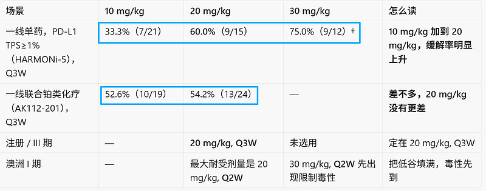
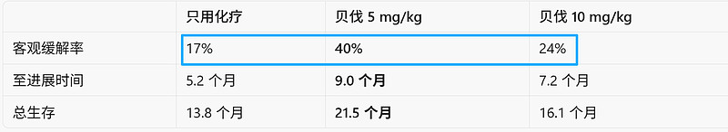
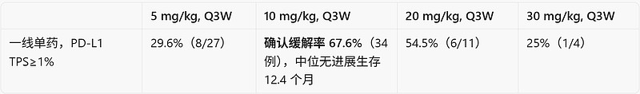
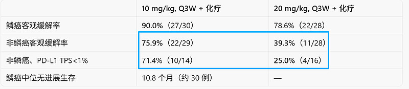
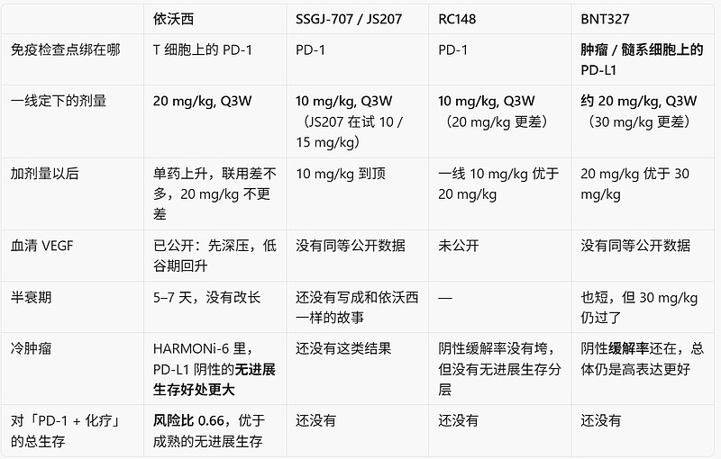

# 依沃西的 VEGF 指纹是后来发现的，不是设计的

**前言：依沃西2014年立项时，要做的是一只四价、能协同结合、Fc 静默、往肿瘤微环境富集的 PD-1/VEGF 双抗。今天大家拿来认这只药的几件事——半衰期短、血清 VEGF 打下去又回升、单药 10 mg/kg 不够、联用 20 mg/kg 疗效不往下掉、鳞癌里对已经有 PD-1 的化疗还能改善总生存——并不是 2014 年写进设计目标的。是分子结构先长成这样，再用人体现一场场试出来的。**

**后面四款（SSGJ-707、RC148、JS207、BNT327）大多按“VEGF 抓得更紧、覆盖更满”来做，和依沃西对不上。在vegf的药理学方面，和依沃西分道扬镳。**

**本文不预测药物的临床结果，只是在已有数据上，将vegf按照剂量反应方向分类，不同试验之间只看趋势，不当头对头。**

**从初步分析的结果可以看出，依沃西是一类，而其它的4种在vegf的设计上更趋于一类。**

#### 一、当初设计了什么，人体试验后来测出了什么

当初写进分子的，公开材料里，工程目标一直是这几条（SITC 2023、*iScience* 2025、官网）：

**结构**：VEGF 单抗做主体，两边各接一只识别 PD-1 的 scFv，四价、左右对称。

**协同结合**：有 VEGF 时，分子对 PD-1 的结合看起来更强（后来对外说大约 18 倍）；分子还能和 VEGF 二聚体连成一串。

**Fc**：只做了 L234A/L235A（LALA），关掉 ADCC/ADCP，避免杀伤带 PD-1 的 T 细胞。没有做延长半衰期的 YTE 突变。

**分布**：肿瘤里 PD-1 和 VEGF 都高，希望药更多留在瘤内，减轻全身抗 VEGF 毒性，尤其是鳞癌咯血。

**抗血管怎么讲**：官网长期写的是“抑制血管生成，饿死肿瘤”。这是传统的“把血管掐死“，不是后来常说的“把血管修到刚好能送药“。

***2014 年能写进立项书的，就是把已经验证过的两条路焊在一只分子上，希望增效、减毒。半衰期要短、给药后 VEGF 会回升、存在一个合适的剂量窗口，这些当时都不是设计指标。***

#### 人体后来测出来的

**药代：** 打一针，半衰期大约 5.0–7.3 天，多次给药稳定后大约 10 天。3–30 mg/kg 大致按剂量成比例。蓄积不多（比值 1.1–1.7）。按 Q3W 给药，到下一针前，血里的药已经掉掉一大截。半衰期短，是因为 scFv 本身不够稳，再加上药和 VEGF 结成复合物后被清得更快，不是公司故意把 Fc 做成短效。

**药效有两条线，形状不一样。**

**PD-1**：外周占位第一天大约 90%，整个给药周期维持在 80% 以上。3 mg/kg 以上就饱和，再加剂量也加不上——这是一条平台。

**血清游离 VEGF**：第一天下降 80%–96%，第 8 天开始回升，下一针前大约还在基线的 −30% 到 −50%。每一针都是先压下去、再弹回来。时间上和血药浓度相反；压下去的深度，在 3–30 mg/kg 之间并不随剂量再加深。论文自己拿这段回升，对比贝伐那种“整个周期都按住”。

**依沃西剂量和疗效表**

† 30 mg/kg, Q3W 这组例数少、随访短，没有进入 III 期。

按 Q3W 来看：10 mg/kg 还不够，20 mg/kg 接近够用；改成 Q2W 把低谷填满，则毒性先出现。设计要的是协同结合和瘤内富集。后来认出来的特点是：**暴露时间短、周期内 VEGF 会松一松、20 mg/kg 联用不会更差、再加剂量收益变小。**前面写在专利里，后面是做完人体试验才认的。

**做成药以后的表现：** 对不含免疫治疗的化疗（HARMONi-A）：3 个月无进展生存率 94.7% 对 69.7%，客观缓解率高 15 个百分点，无进展生存风险比 0.46，最终总生存风险比 0.74——瘤缩得明显，换成活得更久的不多。对已经含 PD-1 的化疗（HARMONi-6）：成熟无进展生存 12.48 个月对 8.31 个月，风险比 0.72；总生存风险比 0.66，比无进展生存还站得住。PD-L1 阴性的无进展生存风险比 0.55，阳性 0.66。冷肿瘤上多出来的好处更大；化疗影响减弱以后，死亡风险的差别还在。III 期用的都是 **20 mg/kg, Q3W**。

#### 二、贝伐早就说明：剂量不是越大越好，曲线是倒U形。

抗 VEGF 不是压得越深越好。血管有一个合适的工作区间：剂量太低，血管仍然漏，药和免疫细胞进不去；剂量合适，血流改善，化疗和淋巴细胞送得进去；剂量过高，血管被剪得太狠，组织缺氧，药反而送不进去，疗效往回掉。中间高、两边低，所以叫倒 U 形。

最清楚的一页是 Kabbinavar 2003 年发表在 *JCO* 上的一线肠癌试验：同一套 5-氟尿嘧啶 + 亚叶酸，随机加贝伐 5 mg/kg 或 10 mg/kg。

剂量翻倍，缓解、进展、生存一起变差。5 mg/kg 在合适区间里，10 mg/kg 已经过了。后来肠癌批准的是 5 mg/kg，不是因为 10 mg/kg 给不起，是因为 10 mg/kg 已经证明更差。贝伐半衰期大约 20 天，按 Q2W 给药时血药低谷仍高，整个周期都压着 VEGF，所以它的常用剂量很容易落在曲线顶部，或者已经偏右。

依沃西 **20 mg/kg, Q3W** 没有出现“剂量越高疗效越差”，并不是这根曲线不存在。它的半衰期短，下一针前血里的药掉了很多，持续过深的那一段被低谷截掉了。所以在同样的毫克数里，依沃西画不出上表那种“5 mg/kg 比 10 mg/kg 好”。SSGJ-707、RC148、BNT327 对 VEGF 抓得更紧，或者占位更满，才在 10–30 mg/kg 这几档里重新出现“加量以后疗效下降”。贝伐是对照尺，后面这些双抗，要比的是各自落在这根曲线的哪一边，不是谁和 VEGF 结合得更紧。

三、这些特点是怎么一步步看出来的

#### 2020：人体试验，先看到血药和 VEGF 一起起伏

澳洲 I 期 2019 年 10 月开始入组（Frentzas 等，*JITC* 2024），国内 I 期同期推进。到 2020–2021 年能确定的是：半衰期就是几天；游离 VEGF 24 小时内下降 80%–95%，部分剂量组能看到回升；PD-1 占位已经饱和；最大耐受剂量落在 **20 mg/kg, Q2W**，并没有把暴露加到贝伐那种程度。**30 mg/kg, Q2W** 先碰到限制毒性。

康方看完数据以后，选择 **20 mg/kg, Q3W，不改成 Q2W，也不加延长半衰期的突变**。判断是：这个给药节奏疗效站得住，不必把药代“修”成普通抗体那样盖满 21 天。**当时业内默认仍是：抗体应当把一个周期盖满。血药和 VEGF 一起起伏，当时多半被看成“覆盖不够”，还没有被看成合适的工作方式。**贝伐那张倒 U 形曲线已经在文献里，但还没有人把它和这只双抗的低谷对上。

#### 2022：授权交易买下的，是这只没有被改长半衰期的药

2022 年 12 月，Summit 首付款 5 亿美元。当时还没有 HARMONi-2，也没有 HARMONi-A 的 III 期结果。桌上有的是 I 期、一部分 II 期缓解率、药代、VEGF 曲线，以及卡度尼利已经在国内做成药。

Duggan 团队愿意给“不改药代”定价。他们看到的是：**20 mg/kg, Q3W** 仍然有活性，全身抗 VEGF 没有把患者压垮，鳞癌方向的出血也没有把路堵死。5 亿美元买的是这只具体分子，不是“再去找一只半衰期更长的同类”。后来市场上大多数跟随者，走的仍是“覆盖更满”。2022 年不必已经想清楚 2026 年才能看清的剂量分界。这笔交易的特别之处，是和当时“抗体应当盖满全周期”的通行标准对着做。

#### 2024：HARMONi-A 和 HARMONi-2 把“瘤缩得快”和“单药能超过帕博”摊开

HARMONi-A（EGFR 靶向药耐药后，依沃西 **20 mg/kg, Q3W** 加化疗，对比单用化疗）：中位无进展生存 7.1 个月对 4.8 个月，风险比 0.46；3 / 6 / 9 个月无进展生存率是 94.7% / 55.4% / 37.9%，对照是 69.7% / 33.1% / 18.3%；客观缓解率 50.6% 对 35.4%。对照在前 3 个月掉大约 30 个百分点，试验组只掉大约 5 个百分点，之后再补跌。这是抗 VEGF 把铂类送进去、挡住前两次影像学进展的典型样子：瘤缩得快。最终总生存 16.8 个月对 14.1 个月，风险比 0.74。体积上的好处，换成活得更久，大约打了 1.6 折。

HARMONi-2（依沃西 **20 mg/kg, Q3W** 单药，对比帕博利珠单抗，PD-L1 TPS≥1%）：无进展生存 11.1 个月对 5.8 个月，风险比 0.51。同类药能赢过帕博，当时容易被读成“更好的 PD-1”。PD-L1 1%–49% 的风险比是 0.54，≥50% 是 0.48，点估计略偏向高表达更好，不是后来 HARMONi-6 那种低表达更好。VEGF 这一臂在单药里起的作用，和联合化疗时不是同一回事。

到这一年，公开材料已经够用：半衰期短、VEGF 会回升、III 期定在 20 mg/kg, Q3W、对化疗早期进展挡得住、对帕博的无进展生存风险比是 0.51。[默沙东](https://xueqiu.com/S/MRK?from=status_stock_match)看到这些资料后，发现依沃西的vegf指纹非常不同于传统的贝伐，于是在 2024 年 11 月买下 LM-299（VEGF 单抗主体，C 端接识别 PD-1 的单域抗体，当时在中国做 I 期），买的是这个靶点组合的位置，不是依沃西这种起伏的药代。评判标准仍是：覆盖够不够满。

#### 2026：HARMONi-6 证明 20 mg/kg, Q3W 相对 PD-1 仍有额外好处；其他药的剂量结果也齐了

HARMONi-6（依沃西 **20 mg/kg, Q3W** 加化疗）期中无进展生存风险比 0.60（11.14 个月对 6.90 个月），说明书上的成熟分析是 **12.48 个月对 8.31 个月，风险比 0.72**；总生存风险比 **0.66**。对照已经是替雷利珠单抗加同一套铂类。多出来的好处，只可能来自 VEGF 这一臂，以及它和 PD-1、化疗的配合。PD-L1 阴性的无进展生存风险比 0.55，阳性 0.66；总生存两档几乎一样（0.64 / 0.68）。成熟无进展生存从 0.60 回到 0.72，总生存仍然优于无进展生存：化疗的共同影响减弱以后，差别还在。

同一年，对照药的剂量结果也齐了。SSGJ-707 单药高峰在 10 mg/kg，III 期也定在 **10 mg/kg, Q3W**；RC148 一线含铂方案里 **10 mg/kg 优于 20 mg/kg**，PD-L1 阴性非鳞癌 20 mg/kg 的客观缓解率只有 25.0%。

依沃西按 Q3W 给药时，倒 U 形曲线偏右、疗效变差的那一段被低谷截掉了；结合更强的几只，在同样的毫克数里把这一段画了出来，形状回到 Kabbinavar 那张表，只是高峰从贝伐的 5 mg/kg，挪到了这些双抗的 10 mg/kg。

[辉瑞](https://xueqiu.com/S/PFE?from=status_stock_match) 2025 年 5 月买下 SSGJ-707 时，HARMONi-2 已经发表，HARMONi-6 只有“期中阳性”的标题。当时看到的差别是 10 mg/kg 对 20 mg/kg、亲和力更高，于是读成 SSGJ-707 更强。2026 年 8 月的电话会，仍用“亲和力高 30–60 倍”来比较依沃西。数字早就公开，比较的轴没有换。真正把“更强”改写成“过了合适区间”的，是 RC148 加量以后疗效下降。

“脉冲给药、先压后松”被当成机制对外讲，是 HARMONi-6 总生存结果出来之后。实际看清的顺序是：**分子结构先这样 → 人体看到血药和 VEGF 起伏 → 决定不改长半衰期 → HARMONi-A 看出瘤缩得快 → HARMONi-2 看出单药能赢帕博 → HARMONi-6 看出对已有 PD-1 仍有额外好处、总生存站得住 → 其他药加量后疗效下降**，才认出依沃西并不是已经做到曲线右侧，而是停在左侧到顶部、右侧被低谷截掉。

#### 四、四款后续药物各自的特点

不同试验之间只看趋势。客观缓解率高，不等于综合疗效最好。下列剂量，凡未另写给药间隔的，均为 Q3W。

#### SSGJ-707：10 mg/kg 就到顶，再加没有更好

三生 SSGJ-707（[辉瑞](https://xueqiu.com/S/PFE?from=status_stock_match)代号 PF-08634404）。IgG4、CLF2 平台、四价。公开材料称：有 VEGF 时，对 PD-1 的结合大约增强 100 倍；对可溶 VEGF 的亲和也高几十倍。辉瑞对外说，对可溶 VEGF-A 的亲和比依沃西、贝伐高 30–60 倍。

联合铂类时，在 5 / 10 / 20 mg/kg 里选定 **10 mg/kg, Q3W**。与 VEGF 相关的不良事件 62.7%（3 级及以上 18.1%），SITC 2025 报告过咯血死亡。[辉瑞](https://xueqiu.com/S/PFE?from=status_stock_match)后续试验对标 HARMONi-2。特点是：VEGF 压得深，高峰在 10 mg/kg，不敢上 20 mg/kg。机制上和依沃西差一倍剂量，加量以后的方向也相反。倒 U 形的顶部，提前到了 10 mg/kg。

#### RC148：一线最需要把药送进去时，20 mg/kg 打穿疗效

[荣昌生物](https://xueqiu.com/S/09995?from=status_stock_match) RC148（艾伯维代号 ABBV-1480）。VEGF 一端是纳米抗体，PD-1 一端仍是 IgG，Fc 静默。一线联合含铂化疗的随机比较里，鳞癌和非鳞癌都是 **10 mg/kg 优于 20 mg/kg**（均为 Q3W）。

单药扩展队列报的是 20 mg/kg, Q3W，客观缓解率大约 62%；二线联合多西他赛时，20 mg/kg 优于 10 mg/kg。

可以看成两件事的最适剂量不一样：把化疗送进去，要 10 mg/kg；把瘤体打小，20 mg/kg 还能用。一线铂类最依赖血流，20 mg/kg 把路拆了；单药和较弱的化疗主要靠把瘤打小，20 mg/kg 仍能看出效果。20 mg/kg 不如 10 mg/kg，只说明 10 mg/kg 已经接近这只药的上限，不能直接等于“比依沃西的 20 mg/kg 差”。关键 III 期 C301 的设计对标 HARMONi-6，剂量是 **10 mg/kg, Q3W**。多出来的好处，更像 HARMONi-A：缓解率高、无进展生存好处出得早、总生存可能打些折扣。整条生存曲线不会长成 HARMONi-A 那样，因为对照不是单用化疗。

形状上，RC148 的一线结果就是 Kabbinavar 那张表的肺癌版：同一套化疗，剂量翻倍，缓解率往下掉。

#### JS207：10 mg/kg 已经够，数据最少

[君实生物](https://xueqiu.com/S/SH688180?from=status_stock_match) JS207。骨架来自特瑞普利单抗，对 VEGF 的亲和和贝伐相当。一线 PD-L1 阳性单药：10 mg/kg, Q3W 缓解率 56.3%，15 mg/kg, Q3W 缓解率 60.0%。安全性摸到 20 mg/kg，联合用药在摸 10 mg/kg 和 15 mg/kg。10 mg/kg 已经打出 56%，不是依沃西那种“10 mg/kg 明显没打满”。10 mg/kg 和 15 mg/kg 差不多，目前更像 SSGJ-707 这一边，但还没有 RC148 那种 20 mg/kg 疗效下降，可以把话说死。仍在 II 期。真正能比的，是以后敢不敢定在 20 mg/kg, Q3W，以及 JS207 联合 JS212（EGFR/HER3 抗体偶联药物）。目前只能说：跟得快，最佳剂量还没交卷，已经不像依沃西那样 10 mg/kg 不够。

#### BNT327：先绑 PD-L1，20 mg/kg 接近顶部，30 mg/kg 过了

[BioNTech](https://xueqiu.com/S/BNTX?from=status_stock_match) / 普米斯 BNT327（通用名 pumitamig，原代号 PM8002）。主体是抗 VEGF-A 的整抗，Fc 上再接两只识别 PD-L1 的纳米抗体。结合顺序和依沃西相反：先停在 PD-L1 上，再清 VEGF。人体半衰期 4.2–8.9 天，曲线形状也像先高后低。小细胞肺癌联合化疗的确认缓解率：**20 mg/kg 85.0%，30 mg/kg 66.7%**（均为 Q3W）。III 期定的是固定剂量 1500 mg, Q3W（大约相当于 20 mg/kg, Q3W）。半衰期短，并没有挡住 30 mg/kg 疗效下降。

按 PD-L1 冷热看：一线非小细胞肺癌确认缓解率，TPS<1% 为 47.6%（21 例），1%–49% 为 77.8%，≥50% 为 100%——表达越高越好。EGFR 靶向药耐药后，PD-L1 阴性缓解率 35.7%，几乎贴着 HARMONi-A 化疗组的 35.4%。冷肿瘤上仍有缓解，但还没有“PD-L1 阴性对已经含 PD-1 的化疗、无进展生存更好”这种证据。特点是：先绑肿瘤上的 PD-L1，高峰偏热，30 mg/kg 过了。[复宏汉霖](https://xueqiu.com/S/02696?from=status_stock_match) HLX37 是同一类结构、更晚的跟随者。

BNT327 说明一件事：半衰期短，单独不够。它也短，30 mg/kg 照样疗效下降。倒 U 形偏右、疗效变差的那一段，靠占位更深也能画出来，不一定非要贝伐那种大约 20 天的半衰期。

#### 五、依沃西和它们的差别在哪里

差的不是“有没有 PD-1 或 PD-L1，再加上 VEGF”，而是 **VEGF 这一臂按 Q3W 给药时，落在倒 U 形曲线的哪一边**。

四款里面，没有一款同时具备：单药 10 mg/kg 不够、联用 20 mg/kg 不更差、低谷期 VEGF 回升、对已经含 PD-1 的化疗总生存还能更好。半衰期短，单独不够——BNT327 也短，30 mg/kg 照样下降。亲和力更高，单独也不够——这正是容易看反的那条轴。

依沃西的不同，可以收成四句：

**两件事的合适剂量没有分开。**改善血流、把化疗送进去，加到 20 mg/kg 路还在；把瘤打小，单药从 10 mg/kg 加到 20 mg/kg 仍在上升。RC148 已经分开了：一线送药要 10 mg/kg，打小瘤体可以到 20 mg/kg。贝伐在肠癌里也分开过：5 mg/kg 两方面都照顾到，10 mg/kg 连缓解都掉。

**按注册剂量 20 mg/kg, Q3W，看不到“加量以后疗效变差”。**不是这根曲线消失了，是低谷把持续过深截掉了。澳洲 I 期里，**30 mg/kg, Q2W** 先碰到限制毒性，说明把低谷填满，毒性会先到。SSGJ-707、RC148、BNT327 在同样的毫克数、Q3W 里把疗效下降的那一段画了出来，形状回到 Kabbinavar 那张表。

**不依赖肿瘤表面的 PD-L1 才能站住。**冷肿瘤里，VEGF 把微环境修好，好处仍在。BNT327 先停在 PD-L1 上，缓解率随 PD-L1 升高而升高。

**这些特点是做完试验才认出来的。**设计里没有写“脉冲给药”。不做延长半衰期，是 2020 年看完药代曲线以后的决定；认出“这就是合适的工作方式”，要等到 2024 年看到瘤缩得快、2026 年看到总生存，以及其他药加量后疗效下降。后续分子 2023 年申报临床时，图纸已经按“覆盖更满”定下来了。剂量还能改，VEGF 这一臂结合力有多强，改不了。

后来的人可以按已经看清的结果，重新设计下一只分子。不能把依沃西后来才认清的特点，写成 2014 年就算准的设计目标。贝伐 2003 年就把“剂量不是越大越好”写进了 *JCO*。依沃西的贡献不是发明这根曲线，而是用较短的暴露把自己留在曲线左侧到顶部，再用 III 期证明：停在这一侧，**按** **20 mg/kg, Q3W，**对已经含 PD-1 的化疗，总生存仍然更好。

**结束语：PD-1/VEGF 类双抗分子，主要的差异在VEGF臂上。在VEGF的药理和药代上，依沃西是一类，其它4款分子是另一类。[康方生物](https://xueqiu.com/S/09926?from=status_stock_match)的依沃西率先完成了III期试验，期待其它的也有了三期试验结果后，就可以更深入进行比较**

## 评价

**结论：这是一篇很有启发性的“机制假说文章”，但还不是足以证明依沃西具有独特药理优势的证据论文。**  
我会给它：资料整理 **8/10**，假说价值 **8/10**，因果论证 **5/10**，用于投资决策 **4/10**。

**写得好的地方**

- 抓住了真正重要的问题：抗 VEGF 并非越强越好，存在“血管正常化窗口”，最佳生物剂量不一定等于最大剂量。
- 依沃西的基础数据引用大体准确：单次半衰期约 5–7.3 天、PD-1 占位维持较高、游离 VEGF 给药后下降再回升。[Ⅰ期研究](https://jitc.bmj.com/content/12/4/e008037)
- HARMONi-2、HARMONi-A、HARMONi-6 的主要疗效数字基本可靠。尤其 HARMONi-6 的 OS HR 0.66，是强而且真正随机对照的临床证据。[HARMONi-6](https://www.thelancet.com/journals/lancet/article/PIIS0140-6736(26)00966-9/abstract)
- 它正确提醒投资者：不能把“亲和力更高”“VEGF 抑制更深”直接等同于临床疗效更好。

**核心问题**

1. **“短半衰期导致更优疗效”尚未得到证明。**  
   目前只能确认依沃西半衰期较短、VEGF 会回升，以及临床结果不错；三者同时存在，不等于前两者造成了后者。需要随机比较不同暴露方案，或者暴露-疗效分析才能建立因果关系。

2. **“血清 VEGF 回升”不等于“肿瘤血管恢复到最佳状态”。**  
   血清游离 VEGF 是外周药效标志物，不是肿瘤组织中的 VEGF、灌注、缺氧或免疫细胞浸润。文章把外周指标直接解释成“先压后松、恢复送药”，中间缺了一整层组织药理证据。

3. **半衰期计算存在内部不一致。**  
   正文承认多次给药后的半衰期约 10 天，但评论中的曲线按约 6 天计算，得出 Q3W 谷浓度约为峰值的 11%。如果按 10 天估算，21 天后约剩 23%，结论没有图中那么极端；真实 PK 也不能简单按单室指数衰减处理。

4. **HARMONi-6 不能证明“额外好处只可能来自 VEGF 臂”。**  
   试验比较的是“整个依沃西分子”与替雷利珠单抗，并没有单独控制 PD-1 结合性质、协同结合、空间构型和暴露。试验能证明方案更优，不能拆分出是哪一部分造成的。

5. **用早期小样本 ORR 证明倒 U 形，证据偏弱。**  
   贝伐珠单抗 2003 年研究只有 104 人，5 mg/kg 的确优于 10 mg/kg，但高剂量仍优于对照；这提示非单调剂量效应，却不足以成为所有 PD-(L)1/VEGF 双抗的统一标尺。[原始研究](https://pubmed.ncbi.nlm.nih.gov/12506171/)  
   BNT327 的 20/30 mg/kg 组样本也很小，而且报道者明确提醒不要过度解读；其 ORR 在高剂量下降，但中位 PFS 并未同步下降，不能简单断言“30 mg/kg 已经过量”。

6. **不同分子的 mg/kg 不能直接横比。**  
   分子量、价态、亲和力测定方法、靶点锚定顺序、组织分布和靶点介导清除均不同。依沃西 20 mg/kg 与 RC148、SSGJ-707、BNT327 的 20 mg/kg，不代表相同的 VEGF 生物学暴露。

7. **“后来发现而非设计”是合理推测，不是可验证事实。**  
   公开资料可以证明早期设计强调四价、协同结合和 Fc 静默，却不能证明研发团队当年没有考虑 PK 或剂量窗口。对 Summit、默沙东为何交易的心理推演，也属于叙事而非证据。

**我的判断**
文章最有价值的结论应收窄为：

> 依沃西可能因为特定的分子结构、亲和力、靶向协同和 Q3W 暴露节奏，形成了有利的 VEGF 抑制窗口；这个假说与现有 PK/PD 和临床结果相容，但尚未被直接验证。

而不是：

> 已经证明依沃西独属一类，其他四款属于另一类，且后者因 VEGF 抓得过紧而疗效下降。

因此，这篇文章值得当作**研究线索和差异化框架**阅读，不宜当作已经证实的机制，更不足以单独支持康方生物的估值或买卖决定。真正的验证要看竞品随机三期、标准化 PK/PD、肿瘤灌注或缺氧标志物，以及正式的剂量-暴露-疗效分析。

---

