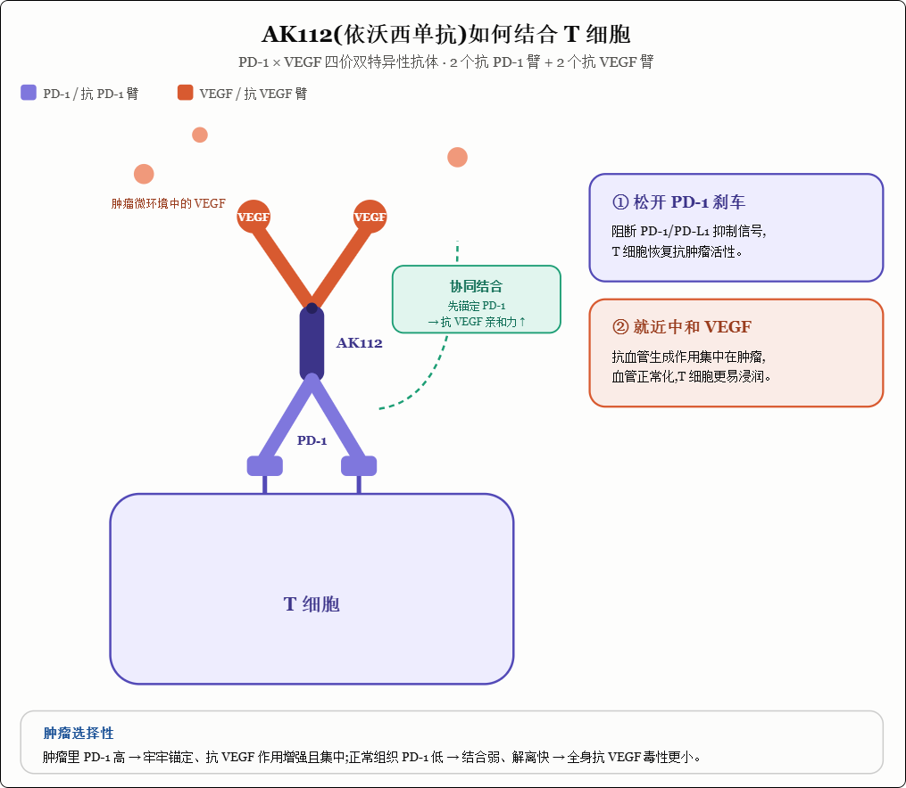

# 依沃西单抗(AK112 / Ivonescimab / 依达方®)研究报告

> 一句话定位:全球首个、也是迄今唯一在头对头 III 期试验中击败"药王"K 药(帕博利珠单抗)的肿瘤免疫新药——一款 PD-1×VEGF 双特异性抗体,正试图取代 PD-(L)1 单抗成为下一代肺癌免疫治疗的"骨架药物"。
>
> 靶点/路线:PD-1 × VEGF 四价双特异性抗体(IgG1-scFv) | 持有方:康方生物(9926.HK,中国及大部分地区);Summit Therapeutics(美/加/欧/日) | 报告日期:2026-06-15

---

## 一、摘要(Executive Summary)

依沃西单抗(研发代号 AK112,商品名"依达方",Summit 代号 SMT112)是康方生物自主研发的 PD-1×VEGF 双特异性抗体。它把肿瘤免疫治疗的两大支柱——免疫检查点抑制(PD-1)与抗血管生成(VEGF)——合并到一个分子里,并通过"肿瘤微环境条件性增强结合"的巧妙设计,试图同时实现"更强的疗效"和"可控的毒性"。

它在肿瘤治疗史中的位置是革命性的:2024 年,HARMONi-2 研究成为人类历史上第一个在头对头 III 期试验中让单药疗效显著超越帕博利珠单抗(Keytruda)的药物(中位无进展生存 11.1 vs 5.8 个月,HR 0.51)。Keytruda 是 2024 年全球销售额 295 亿美元的"药王",其在 PD-L1 阳性非小细胞肺癌一线的地位被一款中国双抗正面撼动,这是中国创新药出海的标志性事件。

主要风险:① 全球 HARMONi 研究最终 OS 未在整体人群跨过统计学显著线(HR 0.79,p=0.057),给 FDA 审评和西方医生信服度留下问号;② 抗 VEGF 固有的出血/高血压/蛋白尿毒性,在更大人群、更长用药下的长期安全性仍需观察;③ BioNTech/BMS 的 BNT327 等同机制竞品来势汹汹;④ Summit 是"单一资产"公司,依沃西成败几乎决定其全部价值,集中度风险高。

---

## 三、疾病与机制(重点章节)

### 3.1 疾病史:非小细胞肺癌(NSCLC)

#### 这个病是什么

肺癌是全球发病和死亡人数最多的癌症,每年新发约 240 万例,其中约 85% 是非小细胞肺癌(NSCLC)。多数患者确诊时已是晚期(局部晚期或转移),无法手术根治,五年生存率很低。NSCLC 又按病理分为非鳞癌(腺癌为主,约占 NSCLC 七成)和鳞癌(约三成),并按是否携带 EGFR、ALK 等"驱动基因突变"进一步分型——这决定了用靶向药还是免疫/化疗。

> 小白版:肺里的正常细胞本该听从身体的"生长—停止"指令,但癌细胞的指令系统坏了,疯长成团、还会跑到别的器官(转移)。麻烦在于,等大多数人察觉症状去检查,癌细胞往往已经"离家出走"扩散开了,这时候开刀也切不干净,只能靠药物全身围剿。

#### 人类与肺癌斗争的历史——治疗范式的四次接力

晚期 NSCLC 的治疗史,是一部"一代代补上一代短板"的编年史:

| 时代 | 主导疗法 | 代表 | 解决了什么 | 留下了什么问题 |
|---|---|---|---|---|
| ~1990s–2000s | 化疗 | 含铂双药 | 第一次让晚期患者延长生存 | 无差别杀伤、毒性大、中位生存仅约 1 年、很快耐药 |
| 2003 起 | 靶向治疗 | 吉非替尼、奥希替尼(EGFR-TKI) | 对 EGFR 突变者"精准打击",口服、高缓解率 | 只对有特定突变的人有效;几乎都会耐药复发 |
| 2015 起 | 免疫治疗(IO) | 帕博利珠单抗(K 药)、纳武利尤单抗 | 激活自身免疫"军队",部分患者长期生存甚至临床治愈 | 仅约 20–40% 患者有效;PD-L1 低表达、EGFR 耐药后疗效有限 |
| 2024 起 | PD-1×VEGF 双抗 | 依沃西单抗 | 免疫+抗血管"二合一",头对头超越 K 药 | OS 金标准、长期安全性、海外验证仍待确认 |

#### 前人的"武器谱"——历史疗法及其局限

| 药物/疗法 | 出现年份 | 机制 | 代表性疗效 | 主要局限 |
|---|---|---|---|---|
| 含铂双药化疗 | 1990s | 细胞毒、无差别杀伤 | 中位 OS ~10–12 个月 | 毒性大、缓解短暂、普遍耐药 |
| 贝伐珠单抗(抗 VEGF) | 2006 | 阻断肿瘤血管生成 | 联合化疗小幅延长 PFS/OS | 单用无效;鳞癌因致命性出血风险被禁用 |
| EGFR-TKI(奥希替尼等) | 2003/2018 | 抑制 EGFR 驱动突变 | 突变者 mPFS 可达 18+ 个月 | 仅突变人群;终将耐药,耐药后选择有限 |
| 帕博利珠单抗(K 药) | 2015 | PD-1 单抗,解除免疫刹车 | PD-L1 高表达一线 mPFS ~7–10 个月 | 应答率有限;PD-L1 低/阴性、EGFR 耐药者获益小 |

注意第二行贝伐珠单抗在鳞癌中因出血被禁用——这是抗 VEGF 药物历史上最著名的"雷"。它后文会反复出现,因为依沃西恰恰要在鳞癌里证明自己"踩不到这个雷"。

#### 依沃西在这部历史中的位置

依沃西接的是免疫治疗这一棒之后的下一棒。它针对的痛点非常明确:PD-1 单抗(如 K 药)只对一部分病人有效,疗效有天花板。依沃西的思路是——既然抗血管生成(VEGF)能够"重塑"肿瘤微环境、让免疫细胞更容易进入肿瘤,那就把"抗 VEGF"和"抗 PD-1"焊在一个分子上,让两条通路协同增效。

这是一次潜在的范式级突破而非渐进改良:它不是"更好的 PD-1 单抗",而是开创了"PD-(L)1×VEGF 双抗"这一全新品类,并用头对头数据证明了品类的优越性。

### 3.2 药物机制

#### 技术路线与靶点

依沃西是一款四价(tetravalent)双特异性抗体,采用 IgG1-scFv 结构,一个分子上同时带有 2 个抗 PD-1 结合臂和 2 个抗 VEGF 结合臂。它同时命中两个靶点:

- PD-1:免疫检查点。肿瘤会通过 PD-1/PD-L1 通路给 T 细胞"踩刹车",让免疫军队不攻击癌细胞。阻断 PD-1 = 松开刹车,让 T 细胞重新杀敌。
- VEGF:血管内皮生长因子。肿瘤靠它疯狂长出杂乱的新血管来供养自己,同时这些异常血管还会营造"免疫抑制"的微环境。阻断 VEGF = 既切断肿瘤补给,又把微环境"正常化",让免疫治疗更好起效。

#### 机制差异化——为什么是"1+1>2"

依沃西最精妙的设计是"协同性/条件性增强结合"(cooperative binding):当分子上的 VEGF 臂结合了 VEGF 之后,会让 PD-1 臂的结合能力(亲和力/亲合力)进一步增强。而 VEGF 在肿瘤组织里浓度很高、在正常组织里很低,这意味着依沃西在肿瘤里"火力全开",在外周正常组织里相对"收着劲"。理论上这带来两个好处:① 在肿瘤局部疗效更强;② 在全身的免疫相关毒性更可控。这正是它能在头对头试验里"既比 K 药更有效、安全性又相当"的机制基础。

它是不折不扣的 first-in-class(全新机制、开创品类),科学风险已被 III 期数据大幅化解,目前更多是"执行与验证"风险。

> 小白版:癌细胞干了两件坏事——一是给免疫军队"踩刹车"(让你不敢打它),二是偷偷给自己修一堆补给公路(长血管)抢营养、还把周围搞得乱七八糟让援军进不来。过去的 K 药只会松刹车,贝伐珠单抗只会炸公路,各干各的。依沃西是"一个士兵两杆枪",一手松刹车、一手炸公路同时干。更聪明的是,它装了"敌占区识别"功能:只有闻到肿瘤特有的信号(VEGF)时火力才全开,在自己人的地盘上就收着点,所以打得狠、误伤还少。

---

## 四、临床数据

依沃西的临床版图以一系列 "HARMONi" 命名的研究为核心。下表是关键试验总览,随后逐一解读。

### 4.1 关键临床试验总览

| 试验      | 地区 | 人群/线数                 | 设计与对照                 | 样本量             | 主要终点    | 状态                           | 临床启动时间                   | 主要数据读出时间                                             |
| --------- | ---- | ------------------------- | -------------------------- | ------------------ | ----------- | ------------------------------ | ------------------------------ | ------------------------------------------------------------ |
| HARMONi-2 | 中国 | 1L,PD-L1阳性,EGFR/ALK阴性 | 单药头对头 vs 帕博利珠单抗 | 398                | PFS         | 阳性,已获批                    | 2022年9月(入组2022/11–2023/08) | 2024/09 WCLC总统研讨会(PFS主分析)                            |
| HARMONi-A | 中国 | EGFR-TKI耐药后,非鳞       | +化疗 vs 化疗              | ~322               | PFS(后续OS) | 阳性,已获批                    | 2022/01                        | PFS:2024/06 ASCO、2024/08 JAMA；OS终期:2025/11 SITC(HR0.74)  |
| HARMONi   | 全球 | 2L+ EGFRm,非鳞            | +化疗 vs 化疗(安慰剂)      | 438                | PFS/OS      | PFS阳性;OS整体未达显著;FDA在审 | 2023/05(首例给药)              | 顶线:2025/05；完整:2025/11(PFS阳性,OS整体未显著,西方人群趋势向好) |
| HARMONi-6 | 中国 | 1L鳞状                    | +化疗 vs 替雷利珠单抗+化疗 | 532                | PFS(后续OS) | 阳性,已获批                    | 2023/08                        | PFS:2025/04顶线、2025/09 ESMO(&Lancet,HR0.60)；OS:2026/05 ASCO全会(HR0.66) |
| HARMONi-3 | 全球 | 1L鳞/非鳞                 | +化疗 vs 帕博利珠单抗+化疗 | 600(鳞)+1000(非鳞) | PFS/OS      | 进行中,2026–27读出             | 2024年初(首例给药)             | 鳞状PFS中期2026/05未达显著；鳞状PFS预计2026下半年、非鳞2027上半年 |
| HARMONi-7 | 全球 | 1L,PD-L1高表达(≥50%)      | 单药 vs 帕博利珠单抗       | ~780               | PFS/OS      | 进行中                         | 2025年初(首例给药)             | 预计2027年及以后                                             |

HARMONi-3 这次的"中期未达显著"市场反应很大（Summit 美股当日盘前一度跌超 25%），但它的性质和"试验失败"完全不是一回事，得拆开看。

**这是个什么试验**

HARMONi-3 是依沃西目前最关键的全球注册性 Ph3：依沃西+化疗 头对头 vs **K药(帕博利珠单抗)+化疗**，一线转移性 NSCLC。注意对照是默沙东的 Keytruda，不是中国 HARMONi-6 里的替雷利珠——这是它对欧美市场定价权的"决胜局"。Summit 中途两次改方案：先把鳞状和非鳞状拆成两个独立队列；又在 2026年2月新增了一个针对鳞状队列、放在 Q2 的 PFS 中期分析。

**到底发生了什么**

2026年4月30日/5月1日，Summit 披露这个**新增的鳞状中期 PFS 分析未达统计学显著**。但关键细节是：

这是一次"加塞"的中期看一眼，alpha 花得极少（花旗估计只花了约 0.001），所以它的显著性门槛被设得**远高于**原定的最终 PFS 分析——换句话说，绝大部分统计学"额度"都保留给了下半年的最终分析。独立数据监查委员会(IDMC)的建议是**按计划继续、维持双盲**，既没有因无效而叫停，也没说要改。所以这不是 futility(无效)失败，而是"这次门槛太高、没跨过去"。

**为什么市场还是吓到了**

预期管理崩了。Akeso 在中国跑的 HARMONi-2(单药 PFS 胜 K药 ~49%)和 HARMONi-6(联化疗 PFS 胜替雷利珠 ~40%)都是在中期就漂亮达标，投资者默认全球试验也会轻松过关，结果第一次正式数据点就"没读出来"，黑箱里发生了什么谁也不知道，分析师只能猜。

分析师给的两种解释，决定了这事是良性还是警讯：

一是**良性版**——实际累积的 PFS 事件数低于预期(随访/事件累积偏慢)，叠加几乎没花 alpha，所以纯粹是"门槛过高 + 事件不够"，疗效本身可能没问题。花旗倾向这一解读，认为大部分 alpha 保留到最终，最终仍大概率成功。

二是**警讯版**——疗效本身偏弱。Leerink 的基准情形推测：鳞状 PFS 的效应量可能比 HARMONi-6 低约 10 个百分点，但强调"不确定性很大"，核心是外界根本不知道 Summit 的统计设计细节。

**真正的隐忧：China-to-global 的疗效"打折"**

这次事件把市场最担心的主题摆上台面——同一个药从中国人群试验搬到全球人群(且对照换成更强的 K药)，疗效会不会缩水。Leerink 直言，如果从中国到全球出现明显"degradation"，这个联用方案的竞争力就会下降。

**接下来看什么**

鳞状队列**最终 PFS（2026下半年）**现在成了该适应症最核心的催化剂；非鳞状 PFS 在 2027上半年；中期 OS 也在 2026下半年。另外，正因为 HARMONi-3 这次失手，紧随其后的 **HARMONi-6 OS（ASCO 2026 全会，已读出 HR=0.66 阳性）\**的重要性被进一步放大——它一定程度上对冲了市场对依沃西全球前景的担忧。监管层面，这次中期本来是想给 FDA 提前沟通/递交开个口子，未达显著意味着鳞状这条线\**没法走"提前提交"的捷径**，得等最终数据。

一句话总结：不是失败，是一次门槛设得极高的中期没跨过，统计学上仍留有余地；但它戳破了"依沃西全球必胜"的乐观预期，把赌注全压到了 2026 下半年的最终 PFS 上。

> 什么叫花alpha，alpha不能看很多次吗

### 4.2 旗舰数据:HARMONi-2——头对头击败 K 药

这是依沃西封神之战,也是整个 PD-1×VEGF 赛道的引爆点。在中国 398 例 PD-L1 阳性、EGFR/ALK 阴性的初治晚期 NSCLC 患者中,依沃西单药对阵帕博利珠单抗单药:

- 中位 PFS:11.1 个月 vs 5.8 个月,HR 0.51(95%CI 0.38–0.69,p<0.0001)——疾病进展风险近乎腰斩。
- 在鳞癌、非鳞癌、PD-L1 高/低表达各亚组中均观察到一致获益。
- 安全性与 K 药相当:≥3 级免疫相关不良事件 7.1% vs 8.0%;治疗相关严重不良事件 20.8% vs 16.1%。鳞癌患者中未见出血风险升高。

这是人类历史上第一个在头对头 III 期中让疗效显著超越帕博利珠单抗的药物,结果同步发表于《柳叶刀》。它的意义不只是一个数据,而是证明了"PD-1×VEGF 双抗 > PD-1 单抗"这一品类假设。

> ⚠️ 审慎看待:HARMONi-2 是纯中国人群、以 PFS 为主要终点的研究。PFS 是替代终点,最硬的金标准 OS(总生存)数据更晚才成熟;且单一种族人群的结果能否外推到全球,正是 HARMONi-3/7 要回答的问题。

### 4.3 其他关键读出

HARMONi-A(中国,EGFR-TKI 耐药):联合化疗对比单纯化疗,PFS 显著获益,最终分析 OS HR 0.74(降低 26% 死亡风险),于 SITC 2025 公布,2026 年 1 月写入说明书。这是依沃西第一个明确的 OS 获益,补上了"只有 PFS、没有 OS"的短板。

HARMONi-6(中国,一线鳞癌):这是又一场头对头——对手换成另一款国产 PD-1 单抗替雷利珠单抗(均联合化疗)。中位 PFS 11.14 vs 6.90 个月,HR 0.60(p<0.0001);OS HR 0.66(降低 34% 死亡风险)。意义重大:① 在 PD-1 单抗联合化疗这一强对照下仍显著优效;② 在历来因出血风险而排斥抗 VEGF 的鳞癌中安全可控——直接正面回应了贝伐珠单抗的历史"雷区"。代价是 ≥3 级治疗相关不良事件略高(63.9% vs 54.3%),VEGF 相关 AE 更多但多为 1–2 级。

HARMONi(全球,2L+ EGFRm):这是依沃西第一个全球多中心 III 期,也是最受争议的一个。438 例患者(38% 来自北美/欧洲),联合化疗 vs 化疗:PFS 达到阳性;但最终 OS 为 16.8 vs 14.0 个月,HR 0.79(p=0.057),未跨过整体人群统计学显著线;西方患者亚组经更长随访呈改善趋势(HR 0.78,名义 p=0.0332)。ORR 44.7% vs 34.2%,颅内 PFS 亦改善。FDA 已于 2026 年 1 月受理该适应症 BLA。这个"差一点"的 OS 是全篇最大的问号(见风险)。

### 4.4 安全性小结

总体可控,与同类 IO 相当,但带有抗 VEGF 的特征性毒性(高血压、蛋白尿、出血倾向),在联合化疗方案中 ≥3 级不良事件约 50–64%。关键利好是:在鳞癌中未观察到贝伐珠单抗式的致命出血信号放大——这是它能进入鳞癌这一大市场的前提。长期、大规模、跨种族的安全性仍需全球 III 期持续确认。

### 4.5 催化剂:未来数据读出时间表

| 时间窗 | 事件 | 重要性 |
|---|---|---|
| 2026 下半年 | HARMONi-3 鳞癌队列(vs K 药+化疗)读出 | ★★★ 全球一线、对标 K 药,决定海外天花板 |
| 2026-11-14 | FDA PDUFA:2L EGFRm 适应症审评决定日 | ★★★ 美国首个获批与否 |
| 2027 上半年 | HARMONi-3 非鳞队列 PFS 事件到位 | ★★★ 最大适应症人群的全球验证 |
| 待定 | HARMONi-7 全球 PD-L1 高表达一线单药数据 | ★★ 验证 HARMONi-2 能否全球复制 |
| 持续 | 各中国适应症 OS 终数据、新适应症拓展 | ★★ 巩固中国放量 |

### 4.6 获批概率判断

- 中国:核心 NSCLC 适应症已获批,无审批风险,焦点转向放量与适应症扩展。
- 美国 2L EGFRm:已进入 FDA 审评(申报阶段,经验成功概率约 85–90%),但因全球 OS 未达整体显著,审评存在不确定性,实际概率应下调至中性偏谨慎。
- 全球一线(HARMONi-3/7):仍处 III 期,肿瘤适应症经验成功概率约 50–65%;鉴于机制已被中国数据强力验证("快速跟进"自己),可给略高于均值的假设,但 OS 能否在全球人群转化仍是关键变量。

### HARMONi-6

### HAROMONi-3 Vs K药

有效,而且K药(帕博利珠单抗)正是鳞状NSCLC一线治疗的标准方案之一,关键证据是 **KEYNOTE-407**。

**KEYNOTE-407(一线晚期鳞癌,K药+化疗 vs 化疗)**

- 中位OS **17.1 vs 11.6 个月**,死亡风险下降约36%(HR≈0.64);
- 中位PFS 8.0 vs 5.1 个月;
- 关键点:**不论PD-L1表达高低都获益**(PD-L1阴性人群也有OS改善)。

这奠定了"**K药+紫杉醇(或白蛋白紫杉醇)+卡铂**"作为驱动基因阴性鳞癌一线标准治疗的地位。此外:

- **KEYNOTE-024 / 042**(单药一线):高PD-L1(TPS≥50%或≥1%)人群同样纳入了部分鳞癌患者并获益;
- **KEYNOTE-010**(二线单药):PD-L1阳性经治NSCLC(含鳞癌)优于多西他赛。

**放到AK112的语境里看**:正因为K药在鳞癌已是高门槛对照,鳞癌相关的依沃西III期才显得有分量——不过要注意,中国的 **HARMONi-6** 头对头对照的是**替雷利珠单抗+化疗**(另一个PD-1),并不是K药;真正与"K药+化疗"在鳞癌正面较量的是全球 **HARMONi-3** 的鳞癌队列,而它的**期中PFS未达统计阈值**,终期PFS要等2026下半年——这也是市场对依沃西在鳞癌出海能否赢过K药仍存疑的原因。

### 上市时间

HARMONi

FDA 已经受理了 Summit Therapeutics 提交的 BLA(生物制品许可申请),适应症是**联合化疗用于经三代 EGFR-TKI 治疗后进展的 EGFR 突变非鳞 NSCLC**(基于全球 III 期 HARMONi 研究)。FDA 给出的 **PDUFA 目标审批日期是 2026 年 11 月 14 日**。PDUFA 日期只是"目标日",FDA 仍可能延期、要求补充资料或召开 ODAC 专家委员会会议,所以"顺利的话 11 月"是最理想的情形,不是确定结果。

HARMONi-3

鳞癌队列:终期 PFS 数据预计 **2026 下半年** 读出;

非鳞队列:入组预计 2026 年中/下半年完成,PFS 数据要等到 **2027 上半年**。

**推算上市时间**

如果鳞癌队列 2026 下半年数据阳性,Summit 才会着手提交 BLA,FDA 标准审评周期约 10–12 个月。所以:

- **鳞癌适应症**:乐观情形下 2026 底/2027 初递交 → **最快 2027 年底、更现实是 2028 年在美获批上市**;
- **非鳞适应症**:数据要等到 2027 上半年,递交和审批顺延 → **大概率 2028 年或之后**。

### 历次临床讲解

下面按临床分组整理。时间点按我刚核对的公开资料，截至 **2026年6月16日**。AK112 即 **依沃西单抗 ivonescimab，PD-1/VEGF 双抗**。

**总览**
AK112目前最扎实的数据集中在肺癌，尤其是 NSCLC。证据层级从强到弱大致是：

1. **EGFR-TKI 治疗后 EGFR突变非鳞 NSCLC**：HARMONi-A，已在 JAMA 发表，是中国获批基础。
2. **一线 PD-L1阳性、驱动基因阴性 NSCLC 单药对照帕博利珠单抗**：HARMONi-2，Lancet 发表，PFS 明显胜出，但 OS 仍需成熟。
3. **一线晚期鳞状 NSCLC 联合化疗对照替雷利珠单抗联合化疗**：HARMONi-6，Lancet 发表 PFS，并在 2026 年更新 OS 阳性。
4. **SCLC、HCC、TNBC、胰腺癌、胆道癌、CRC 等**：多数仍是早期或注册中，除 ES-SCLC 小样本 1b 数据外，公开成熟数据有限。

**1. EGFR-TKI 后 EGFR突变非鳞 NSCLC**
代表试验：**HARMONi-A，NCT05184712**
人群：EGFR突变、晚期/转移性非鳞 NSCLC，既往 EGFR-TKI 后进展，特别包括三代 EGFR-TKI 后患者。
方案：AK112 + 培美曲塞 + 卡铂，随后 AK112 + 培美曲塞维持；对照为安慰剂 + 同样化疗。

已公布核心数据：

| 指标                 | AK112+化疗 | 化疗对照 | 结论                    |
| -------------------- | ---------- | -------- | ----------------------- |
| 样本量               | 161        | 161      | 双盲、随机 3 期         |
| mPFS                 | 7.1个月    | 4.8个月  | HR 0.46，P<0.001        |
| ORR                  | 50.6%      | 35.4%    | 差值 15.6%，P=0.006     |
| 三代 EGFR-TKI 后亚组 | HR 0.48    |          | 仍有 PFS 获益           |
| 脑转移亚组           | HR 0.40    |          | 对 CNS 风险人群较有意义 |
| OS                   | 数据未成熟 |          | 截止时死亡事件 21.4%    |
| ≥3级 TEAE            | 61.5%      | 49.1%    | 多数为化疗相关          |
| ≥3级免疫相关 AE      | 6.2%       | 2.5%     | 可控但需关注            |
| ≥3级 VEGF相关 AE     | 3.1%       | 2.5%     | 未见明显失控信号        |

专家/资深评论要点：

- 这是 AK112 最早形成注册价值的分组，因为 EGFR-TKI 后标准治疗长期不理想，单纯免疫治疗在 EGFR突变人群通常较弱，双抗把 PD-1 和 VEGF 放在同一分子上，有较强机制合理性。
- JAMA 发表后又刊登了两篇读者来信和作者回复，说明学界关注点主要在：OS 还不成熟、化疗对照是否足够代表全球标准、亚组可信度、以及 VEGF/免疫双重毒性长期随访。
- 我自己的判断：这组的价值是“明确填补 EGFR-TKI 后化疗升级需求”，但全球说服力取决于 OS、海外/多区域复现，以及与 amivantamab、HER3/TROP2 ADC 等后线策略的横向竞争。

未来可能公布：

| 未来数据                                                     | 预计意义                                     |
| ------------------------------------------------------------ | -------------------------------------------- |
| HARMONi-A 更成熟 OS，ClinicalTrials.gov 显示完成时间 2026年9月 | 决定中国适应症长期竞争力，也影响海外审评口径 |
| NCT06396065，EGFR-TKI 后非鳞 NSCLC，420例，PFS+OS 双主要/关键终点，预计完成 2026年12月 | 可视为更大规模确认性数据                     |
| 脑膜转移/脑转移相关小研究，如 NCT06766591、NCT06809517       | 若阳性，可强化 CNS 差异化，但证据层级较低    |

来源：[JAMA HARMONi-A](https://pubmed.ncbi.nlm.nih.gov/38820549/)，[NCT05184712](https://clinicaltrials.gov/study/NCT05184712)，[NCT06396065](https://clinicaltrials.gov/study/NCT06396065)

**2. 一线 PD-L1阳性、驱动阴性 NSCLC：单药对照 Keytruda**
代表试验：**HARMONi-2，NCT05499390**
人群：PD-L1阳性，EGFR/ALK阴性，晚期 NSCLC。
方案：AK112 单药 vs 帕博利珠单抗单药。

已公布核心数据：

| 指标            | AK112    | 帕博利珠单抗 | 结论                   |
| --------------- | -------- | ------------ | ---------------------- |
| 样本量          | 198      | 200          | 中国 55家中心          |
| mPFS            | 11.1个月 | 5.8个月      | HR 0.51，单侧 P<0.0001 |
| PD-L1 TPS 1-49% | HR 0.54  |              | 中低 PD-L1 也获益      |
| PD-L1 TPS ≥50%  | HR 0.48  |              | 高表达人群同样获益     |
| ≥3级 TRAE       | 29%      | 16%          | AK112更高              |
| ≥3级免疫相关 AE | 7%       | 8%           | 两组相近               |
| OS              | 未成熟   |              | 仍是最大悬念           |

专家/资深评论要点：

- 这组数据当时引发最大关注，因为它是少见的“头对头胜过帕博利珠单抗”的 3 期结果。Investor’s Business Daily 引述 Leerink 接触的专家称这像是突破了既有治疗平台期；同时也引用 Merck 研发高管 Eliav Barr 的谨慎意见：历史上不少 IO+抗血管生成组合能拉开 PFS，但未必转化为 OS，且 VEGF 抑制相关毒性会随时间累积。
- 临床上真正要分两层看：TPS ≥50% 单药对单药，最直接挑战 Keytruda；TPS 1-49% 在欧美一线常用免疫+化疗，AK112单药胜 Keytruda 单药不等同于胜过 Keytruda+化疗。
- 因为 HARMONi-2 是中国单一区域试验，海外监管和指南采纳大概率会要求多区域或 OS 支撑。

未来可能公布：

| 未来数据                                                     | 预计意义                                                |
| ------------------------------------------------------------ | ------------------------------------------------------- |
| HARMONi-2 final OS，注册完成时间 2026年12月31日              | 若 OS 阳性，将显著提高单药替代 Keytruda 的可信度        |
| HARMONi-7，NCT06767514，780例，高 PD-L1，一线 AK112 vs Keytruda，预计主要完成 2028年4月 | 全球/多区域验证 Keytruda 单药替代逻辑                   |
| HARMONi-3，NCT05899608，1600例，AK112+化疗 vs Keytruda+化疗，预计主要完成 2028年12月31日 | 这是全球商业化最关键试验之一，直接挑战一线免疫+化疗标准 |

来源：[Lancet HARMONi-2](https://pubmed.ncbi.nlm.nih.gov/40057343/)，[NCT05499390](https://clinicaltrials.gov/study/NCT05499390)，[NCT06767514](https://clinicaltrials.gov/study/NCT06767514)，[NCT05899608](https://clinicaltrials.gov/study/NCT05899608)，[IBD 专家/市场评论](https://www.investors.com/news/technology/summit-therapeutics-private-placement/)

**3. 一线晚期鳞状 NSCLC：AK112+化疗 vs PD-1+化疗**
代表试验：**HARMONi-6，NCT05840016**
人群：未经系统治疗的不可切除 IIIB/IIIC 或 IV 期鳞状 NSCLC。
方案：AK112 + 紫杉醇 + 卡铂，随后 AK112维持；对照为替雷利珠单抗 + 紫杉醇 + 卡铂，随后替雷利珠单抗维持。

PFS 数据：

| 指标            | AK112+化疗 | 替雷利珠单抗+化疗 |
| --------------- | ---------- | ----------------- |
| 样本量          | 266        | 266               |
| mPFS            | 11.1个月   | 6.9个月           |
| PFS HR          | 0.60       | P<0.0001          |
| ≥3级 TRAE       | 64%        | 54%               |
| ≥3级免疫相关 AE | 9%         | 10%               |
| ≥3级出血        | 2%         | 1%                |

2026年 OS 中期分析：

| 指标      | AK112+化疗 | 替雷利珠单抗+化疗 |
| --------- | ---------- | ----------------- |
| 中位随访  | 21.4个月   |                   |
| 死亡事件  | 84例       | 120例             |
| mOS       | 27.9个月   | 23.7个月          |
| OS HR     | 0.66       | 单侧 P=0.0017     |
| ≥3级 TRAE | 69%        | 59%               |
| ≥3级出血  | 3%         | 1%                |

专家/资深评论要点：

- 这是 AK112 证据链中非常关键的一步，因为不仅 PFS 阳性，OS 中期也达到统计学和临床意义。相比 HARMONi-2，HARMONi-6 的对照是“PD-1+化疗”而不是 PD-1 单药，临床说服力更强。
- Lancet 同期评论由 Tina Cascone 和 Giannis Mountzios 发表，标题即聚焦“能否提高鳞癌生存标杆”。Cancer Discovery 的新闻评论也指出：数据支持 OS 获益，但试验完全在中国开展，能否外推到其他国家患者仍是问题。
- 需要注意：入组人群 93% 为男性，且对照为替雷利珠单抗而非全球最常用的 pembrolizumab 方案；VEGF 相关出血在鳞癌中天然敏感，虽绝对发生率不高，但海外医生会很仔细看安全性。

未来可能公布：

| 未来数据                                             | 预计意义                     |
| ---------------------------------------------------- | ---------------------------- |
| HARMONi-6 final OS，试验预计完成 2026年12月31日      | 决定中国一线鳞癌标准治疗地位 |
| 海外/多区域鳞癌和全 NSCLC 一线数据，主要看 HARMONi-3 | 解决中国单区域外推问题       |
| 真实世界出血、蛋白尿、高血压、免疫毒性数据           | 对鳞癌使用边界很重要         |

来源：[Lancet HARMONi-6 PFS](https://pubmed.ncbi.nlm.nih.gov/41125109/)，[Lancet HARMONi-6 OS](https://pubmed.ncbi.nlm.nih.gov/42218899/)，[Lancet 评论](https://pubmed.ncbi.nlm.nih.gov/42218898/)，[Cancer Discovery 新闻评论](https://pubmed.ncbi.nlm.nih.gov/42240226/)，[NCT05840016](https://clinicaltrials.gov/study/NCT05840016)

**4. NSCLC 早期剂量探索/单药数据**
代表试验：**HARMONi-5，NCT04900363**
人群：晚期或转移性、免疫治疗初治 NSCLC，一线或二线。
方案：AK112 单药不同剂量。

核心数据：

| 指标                       | 结果           |
| -------------------------- | -------------- |
| 样本量                     | 108例          |
| ORR                        | 39.8%          |
| DCR                        | 86.1%          |
| PD-L1 TPS <1% ORR          | 14.7%          |
| PD-L1 TPS ≥1% ORR          | 51.4%          |
| PD-L1 TPS ≥50% ORR         | 57.1%          |
| 一线 PD-L1阳性不同剂量 ORR | 33.3% 至 75.0% |
| ≥3级 TRAE                  | 22.2%          |
| 停药 TRAE                  | 0.9%           |
| TRAE死亡                   | 2.8%，均为鳞癌 |

专家/解读：

- 这组不是注册性数据，但解释了为什么公司敢做 HARMONi-2：PD-L1 越高，单药反应越明显。
- 同时，早期数据中鳞癌患者出现治疗相关死亡，提示后续鳞癌大样本必须严密观察出血和免疫/VEGF叠加毒性。

未来数据：

| 未来数据                                                     | 意义                                                 |
| ------------------------------------------------------------ | ---------------------------------------------------- |
| NCT04736823，AK112+化疗 NSCLC，265例，预计主要完成 2026年7月 | 可能补充一线联合化疗在不同组织学/PD-L1层级的基础数据 |
| HARMONi-3、HARMONi-7                                         | 真正决定海外一线 NSCLC 商业价值                      |

来源：[JTO HARMONi-5](https://pubmed.ncbi.nlm.nih.gov/37879536/)，[NCT04900363](https://clinicaltrials.gov/study/NCT04900363)，[NCT04736823](https://clinicaltrials.gov/study/NCT04736823)

**5. 广泛期 SCLC**
代表已公布试验：**NCT05116007，1b 期**
人群：一线广泛期小细胞肺癌。
方案：AK112 + 依托泊苷 + 卡铂，随后 AK112维持。

已公布数据：

| 指标              | 结果                                               |
| ----------------- | -------------------------------------------------- |
| 样本量            | 35例                                               |
| 中位随访          | 13.3个月                                           |
| ORR               | 80.0%                                              |
| DCR               | 91.4%                                              |
| 3/10/20 mg/kg ORR | 66.7% / 90.9% / 76.2%                              |
| ≥3级 TRAE         | 60.0%                                              |
| 常见≥3级毒性      | 中性粒细胞减少 22.9%，白细胞减少 14.3%，贫血 14.3% |
| TRAE死亡          | 5.7%                                               |
| 免疫相关 AE       | 40.0%，多数 1-2级                                  |

专家/解读：

- ORR 很高，但小细胞肺癌一线本来对化疗敏感，单看 ORR 不足以证明优于 atezolizumab/durvalumab + EP 标准。
- 关键要看 PFS、OS、维持阶段持续性，以及是否能改善 SCLC 免疫治疗长期平台期。
- 2026年有综述专门讨论“免疫+抗血管生成双抗在 ES-SCLC 的定位”，说明学界兴趣在升温，但目前仍是探索阶段。

未来数据：

| 试验                      | 分组                                      | 预计读出/完成          | 意义                     |
| ------------------------- | ----------------------------------------- | ---------------------- | ------------------------ |
| NCT07245446               | 一线 ES-SCLC，AK112相关 2期，180例        | 2027年12月             | 看能否从 ORR 走向 PFS/OS |
| NCT07057791               | 一线 ES-SCLC，铂/依托泊苷+AK112，60例     | 2027年12月             | 小样本验证               |
| NCT07010263               | 局限期 SCLC 放化疗后 AK112巩固，3期 560例 | 2028年12月31日主要完成 | 若阳性，适应症价值大     |
| NCT06478043 / NCT06820762 | 二线 ES-SCLC，脂质体伊立替康+AK112        | 2025-2026起陆续        | 探索后线小细胞           |

来源：[JTO ES-SCLC 1b](https://pubmed.ncbi.nlm.nih.gov/39490738/)，[NCT05116007](https://clinicaltrials.gov/study/NCT05116007)，[NCT07245446](https://clinicaltrials.gov/study/NCT07245446)，[NCT07010263](https://clinicaltrials.gov/study/NCT07010263)

**6. 晚期实体瘤剂量爬坡/机制验证**
代表试验：**NCT04597541**
人群：晚期实体瘤，AK112 单药剂量递增。

核心数据：

| 指标       | 结果                                                         |
| ---------- | ------------------------------------------------------------ |
| 样本量     | 59例                                                         |
| 剂量       | 3/5/10/20/30 mg/kg Q2W；10/20 mg/kg Q3W                      |
| DLT        | 1例，10 mg/kg Q2W 队列                                       |
| MTD        | 未达到                                                       |
| TRAE       | 89.8%                                                        |
| ≥3级 TRAE  | 23.7%                                                        |
| 严重 TRAE  | 11.9%                                                        |
| TRAE死亡   | 无                                                           |
| 常见 TRAE  | 蛋白尿 33.9%，AST升高 27.1%，白细胞减少 22.0%，ALT升高 20.3%，贫血 20.3% |
| 半衰期     | 5.0-7.3天                                                    |
| PD-1占有率 | 治疗期间维持 >80%                                            |
| VEGF       | 给药后快速下降                                               |

解读：

- 这组数据主要证明 AK112 的可给药性、PK/PD 和双靶点药效，而不是证明某个瘤种疗效。
- 安全谱符合 PD-1 + VEGF 双机制预期：蛋白尿、肝酶、血液学毒性、免疫相关毒性都需要长期跟踪。

来源：[Cancer Medicine 1期实体瘤](https://pubmed.ncbi.nlm.nih.gov/40114411/)，[NCT04597541](https://clinicaltrials.gov/study/NCT04597541)

**7. 非肺癌：目前主要看未来读出**
目前公开成熟疗效数据不多，但注册试验已经铺得很广。重点如下：

| 分组                     | 代表试验                              | 设计                                                       | 预计关键时间          | 看点                                         |
| ------------------------ | ------------------------------------- | ---------------------------------------------------------- | --------------------- | -------------------------------------------- |
| 胆道癌一线               | NCT06591520                           | AK112+吉西他滨/顺铂 vs durvalumab+吉西他滨/顺铂，3期 682例 | 2026年10月主要完成    | 直接挑战 TOPAZ-1 类标准                      |
| TNBC一线                 | NCT06767527                           | AK112+nab-紫杉醇 vs 安慰剂+nab-紫杉醇，3期 416例           | 2026年12月主要完成    | 若 PFS/OS 阳性，可打开乳腺癌市场             |
| 胰腺癌一线               | NCT06953999                           | AK112+化疗±AK117 vs 安慰剂+化疗，3期 999例                 | 2027年5月主要完成     | 高风险高回报，胰腺癌免疫难度大               |
| 转移性 CRC一线           | NCT07228832                           | AK112+FOLFOX vs 贝伐珠单抗+FOLFOX，3期 600例               | 2028年5月31日主要完成 | 若胜出，说明 PD-1/VEGF 双抗能替代单纯抗 VEGF |
| HCC                      | NCT05432492、NCT06530251              | 2期及 1/2期                                                | 2025-2028             | 需看 ORR、PFS、肝毒性和出血                  |
| RCC                      | NCT06472895、NCT07488572、NCT06940518 | 2期为主                                                    | 2025-2028             | VEGF 机制合理，但已有 IO/TKI 强标准          |
| ESCC/HNSCC/胃癌/宫颈癌等 | 多项 2期                              | 新辅助或后线探索                                           | 2026后                | 多数需等小样本信号                           |

**我对 AK112 数据包的判断**
AK112 的核心不是“又一个 PD-1”，而是把 **免疫检查点抑制和抗血管生成** 做成同一双抗分子。现有数据最强的地方有三点：HARMONi-A 在 EGFR-TKI 后人群明确延长 PFS；HARMONi-2 头对头压过 Keytruda 单药的 PFS；HARMONi-6 已经在鳞癌一线看到 OS 获益。

但最关键的未决问题也很清楚：**HARMONi-2 的 OS 是否能成熟阳性，海外多区域试验是否复现，中国单区域数据能否外推，以及 VEGF相关毒性在更长随访和更广人群中是否可控。**
未来 12-30 个月，最值得盯的是 HARMONi-A/6 的 OS 更新、胆道癌和 TNBC 3期早期读出，以及 HARMONi-3/HARMONi-7 的全球进展。

---

## 五、竞争格局

### 5.1 竞争梯队

| 竞品 | 公司 | 靶点/机制 | 阶段 | 关键数据/定位 | 相对依沃西的位置 |
|---|---|---|---|---|---|
| 帕博利珠单抗(K 药) | 默沙东 | PD-1 单抗 | 全球标准疗法 | 2024 全球销售 295 亿美元 | 被依沃西头对头击败,是要取代的"在位者" |
| 替雷利珠单抗 | 百济神州 | PD-1 单抗 | 已上市 | HARMONi-6 中被击败 | 国产 PD-1,同被超越 |
| BNT327 / PM8002 | BioNTech(原普米斯)/ BMS | PD-L1×VEGF 双抗 | 多个全球 III 期 | 2025-06 BMS 合作,潜在总额超百亿美元;布局 SCLC、NSCLC、乳腺癌等 | 头号同机制竞品,资本与适应症广度强 |
| 其他双抗(AI-081、JS207、CR-001 等) | 多家(含恒瑞、君实等) | PD-(L)1×VEGF | 早中期 | 快速跟进者众多 | 第二梯队,验证赛道拥挤度 |
| 标准化疗-IO 联合 | 多家 | 化疗+PD-1 | 已上市 | 现行一线骨架 | 非同类竞争,是被替代对象 |

> K药美国核心化合物专利与2028年到期

### 5.2 上市次序 vs 疗效优势——两者兼得

依沃西在 PD-1×VEGF 双抗赛道里既是先发、又是更优:它是全球首个该机制进入 III 期并获批的药,占住了"first-in-class"心智;同时以头对头数据建立了"best-in-class"证据。这是最强的竞争位置。它的真正威胁不来自"同机制谁先上市",而来自 BNT327 这种资本和适应症广度可能反超的后来者,以及它自己能否把中国数据复制到全球。

### 5.3 赛道拥挤度

PD-(L)1×VEGF 双抗已是 2025 年全球肿瘤免疫最拥挤、最热门的赛道之一,正是依沃西的成功"带火"了整个品类(BMS×BioNTech 的百亿美元合作即是直接反应)。结论:这是一片有强差异化的红海——赛道很挤,但依沃西凭"首个+唯一头对头胜出+已上市放量"占据了显著领先身位。差异化能否长期守住,取决于后续全球数据和适应症卡位速度。

### 5.4 差异化与护城河

- 临床证据护城河:唯一头对头击败 K 药的资产,这一叙事短期内无人可复制。
- 适应症广度:横跨非鳞、鳞癌、EGFR 耐药、一线、PD-L1 全表达谱,具备成为"IO 骨架"的潜力,可像 K 药一样向几十个适应症扩展。
- 先发的真实世界证据与医保卡位(中国):已进入医保、已在放量,医生用药习惯正在建立。
- 资本与全球化:Summit(美/加/欧/日)+ 康方(中国及其他)双轮驱动,海外由资金充裕的伙伴推进。
- 潜在软肋:全球确证数据尚未完全兑现,护城河的"全球段"还在施工。

### 5.5 同类失败史(precedent failures)——它要避开的雷

| 前车之鉴 | 机制 | 教训 | 对依沃西的启示 |
|---|---|---|---|
| 贝伐珠单抗禁用于鳞癌 | 抗 VEGF 单用 | 鳞癌中致命性肺出血 | 依沃西在 HARMONi-6 鳞癌中未见出血信号放大,初步规避 |
| 大量 PD-1 单抗"me-too"上市即价格战 | PD-1 单抗 | 同质化导致内卷降价 | 依沃西靠机制差异化跳出 PD-1 单抗红海 |
| 替代终点(PFS/ORR)未转化为 OS 的肿瘤药 | 多种 | FDA 重视 OS 金标准 | HARMONi 全球 OS 仅 p=0.057,这正是依沃西当前最需要解决的失败模式 |

最关键的证伪条件一句话:依沃西要在全球真正成功,必须把"PFS 优效"转化为"OS 优效"——历史上无数肿瘤药正是死在"PFS 漂亮、OS 不达标"这一步。 中国 HARMONi-A/6 已显示 OS 获益,但全球 HARMONi 尚未在整体人群跨线,HARMONi-3 是决定性一战。

### 5.6 专利与生命周期

作为 2024 年起陆续上市的新生物药,依沃西距专利悬崖尚远(生物药还面临生物类似药壁垒高、侵蚀慢的特点),现金收获窗口长。生命周期管理空间巨大:适应症横向扩展(更多瘤种,如肝癌、结直肠、乳腺、头颈等已在探索)、联合策略、以及作为下一代联用骨架的潜力,都可能持续延长其价值曲线。

---

## 六、市场与商业

### 6.1 患者漏斗与市场锚

NSCLC 是肿瘤里最大的单一战场之一。全球每年新发肺癌约 240 万例,其中约 85%(~210 万)为 NSCLC;中国每年新发肺癌约 87 万例(2022),居所有癌症之首。晚期 NSCLC 患者数量庞大,且依沃西可覆盖的细分(一线 PD-L1 全表达、鳞/非鳞、EGFR 耐药)几乎是 NSCLC 的"主干人群",而非小众亚群——这是它估值天花板高的根本原因。

最有力的市场锚定物是 Keytruda:2024 年全球销售额 295 亿美元,其中肺癌约占一半。依沃西的核心逻辑就是"在 K 药最大的肺癌基本盘里把它替换下来"。这意味着其潜在市场以数十亿美元计。

| 漏斗层级(示意,需以权威流行病学复核) | 全球(年) | 中国(年) |
|---|---|---|
| 新发肺癌 | ~240 万 | ~87 万 |
| 其中 NSCLC(~85%) | ~210 万 | ~74 万 |
| 晚期/转移、需系统治疗 | 多数 | 多数 |
| 依沃西可及主干人群(一线 PD-L1+/鳞/非鳞、EGFR 耐药等) | 庞大主干,非小众 | 庞大主干 |

### 6.2 定价与支付

- 中国:经国家医保谈判,价格约每年 16 万元人民币(约 2.2 万美元),2026 年起新适应症医保生效。典型的"以价换量"——单价不高,但医保覆盖打开了巨大放量空间。
- 美国/欧洲/日本(Summit 负责):尚未上市,预期将按西方创新生物药定价,单价数倍于中国(美国 IO 年治疗费用通常十余万美元)。美欧市场是潜在利润的主要来源,也是估值弹性最大的部分。

### 6.3 商业化进展与销售峰值

已兑现的中国放量:康方生物 2025 年中报商业化收入 14.01 亿元人民币,同比 +49%,由依沃西与卡度尼利两大双抗驱动;依沃西在医保放量与适应症扩展下进入快速上量期。这是"事实",证明商业化已落地、不是纸上故事。

销售峰值(judgment,含关键假设)——分中国与海外两段,海外需乘获批概率做风险调整:

| 情景 | 关键假设 | 全球峰值销售(示意) |
|---|---|---|
| 乐观 | HARMONi-3/7 全球 OS 优效、FDA 获批、成为一线 IO 骨架、广泛适应症扩展 | 百亿美元级(对标 K 药基本盘的相当份额) |
| 中性 | 中国稳健放量 + 美欧获批但份额温和、与 BNT327 分食 | 数十亿美元级 |
| 悲观 | 全球 OS 反复不达标、FDA 受阻、海外仅边缘获批、竞品分流 | 主要为中国市场,十亿美元上下 |

> 以上峰值为基于公开信息与情景假设的判断,非精确预测,且海外部分应乘以获批概率折算。达峰预计在上市后 5–8 年,取决于全球获批节奏与适应症扩展速度。

### 6.4 商业化挑战

- 权益分割:中国及多数地区由康方自营,美/加/欧/日由 Summit 负责——估值要分区计算,不能笼统当成一家全球独占。Summit 是单一资产公司,执行与融资能力直接影响海外兑现。
- 医生教育:全新机制(双抗)替代用了十年的 PD-1 单抗,需要时间改变处方习惯,放量曲线前期可能偏缓。
- 安全性监测:抗 VEGF 毒性要求更精细的患者管理(血压、蛋白尿、出血监测),对基层推广是摩擦点。
- 竞争分流:BNT327 等若在某些瘤种抢先,会切走部分增量。

---

## 七、结论与风险提示

综合判断:依沃西单抗是中国创新药迄今最具全球意义的资产之一——它不是"又一个 PD-1",而是开创并验证了"PD-1×VEGF 双抗"这一全新品类,并以唯一头对头击败 K 药的硬数据,站上了肺癌免疫治疗下一代骨架的竞争位。其投资/商业逻辑可以一句话收口:中国市场的价值已在确定性兑现,真正的弹性在于全球 III 期能否把"PFS 优效"转化为"OS 优效"并拿下美欧市场。 这是一个高赔率、高不确定性的故事。

核心催化剂时间表:HARMONi-3 鳞癌队列(2026 下半年)→ FDA PDUFA(2026-11-14)→ HARMONi-3 非鳞队列(2027 上半年)→ HARMONi-7。未来 12–18 个月是价值重估的密集窗口。

风险清单(按致命程度排序)

1. 全球 OS 转化风险(最致命):HARMONi 全球研究最终 OS 未在整体人群达统计学显著(HR 0.79,p=0.057)。若 HARMONi-3 在全球人群重蹈"PFS 好、OS 不达标",整个海外叙事将动摇——这是历史上肺癌药最经典的失败模式。
2. FDA 审评风险:首个美国适应症(2L EGFRm)审评结果未定,2026-11-14 是关键日。
3. 竞争风险:BNT327(BioNTech/BMS,资本与适应症广度强)及众多快速跟进者可能在部分瘤种分流。
4. 长期安全性:抗 VEGF 相关毒性在更大人群、更长用药下的累积风险仍需观察。
5. 商业化与权益分割风险:海外依赖单一资产公司 Summit;中国"以价换量"下利润率受医保价格约束。

免责声明:本报告基于截至 2026 年 6 月的公开信息与特定假设撰写,医药数据时效性强、可能快速变化;销售峰值与获批概率为情景化判断而非精确预测。本报告不构成投资建议或医疗建议,最终决策请结合最新一手数据与专业意见自行作出。

---

## 附录:主要数据来源与时点

- 康方生物官网新闻与公告(akesobio.com),2024–2026
- Summit Therapeutics 新闻稿与临床试验页(smmttx.com),2025–2026
- HARMONi-2 主要分析:《柳叶刀》(The Lancet)2024;WCLC 2024 报告
- HARMONi-6:ESMO 2025 + 《柳叶刀》2025;OncLive/ASCO Post 报道
- HARMONi-A 最终 OS:SITC 2025(OS HR 0.74);NMPA 说明书更新 2026-01-07
- HARMONi 全球研究 OS(HR 0.79,p=0.057;西方亚组 HR 0.78):Summit/Akeso 2025 披露,FiercePharma 报道
- FDA BLA 受理与 PDUFA(2026-11-14):Targeted Oncology / OncoDaily 2026-01
- Summit×Akeso 授权交易(首付 5 亿、总额 50 亿美元):PRNewswire / FierceBiotech 2022-12
- 竞争格局(BNT327/BMS 合作):BioNTech 6-K、PharmExec、BioPharma Dive 2025-06
- 流行病学:GLOBOCAN 2022 / WHO IARC;NSCLC 占比文献
- Keytruda 2024 销售 295 亿美元:默沙东 2024 年报
- 康方 2025 中报商业化收入 14.01 亿元(+49%):医药魔方 ByDrug
- 中国医保价格(约 16 万/年):生物谷等行业报道
