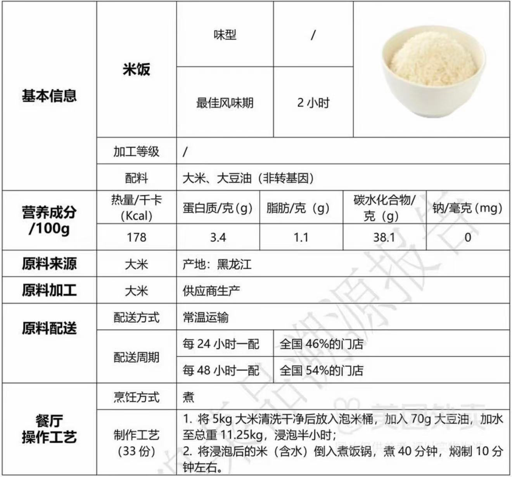

28岁70kg成男年轻，爬22层楼梯，消耗热量约为`50-70千卡`

一杯大杯少糖伯牙绝弦≈300大卡，差不多要**爬6趟22楼**才能抵消

一碗米饭约230大卡，178Kcal/100g

提高基础代谢：

1. **增肌(最根本)**——肌肉是耗能组织,肌肉越多,你躺着也烧得越多。力量训练(深蹲、硬拉、卧推、划船这类多关节大动作)是提高基础代谢最有效的途径
2. **吃够蛋白质**——增肌的原料,而且蛋白质本身消化耗能高(食物热效应约20–30%,远高于碳水和脂肪)。每公斤体重每天约1.2–1.6克,70公斤大概90–110克。
3. **别过度节食**——这是很多人代谢"变慢"的真正原因。吃得太少、长期大缺口,身体会下调代谢、还会掉肌肉,越减越难减。减脂要温和缺口、保证蛋白和力量训练,才能保住代谢。
4. **保证睡眠**——长期睡不好会打乱激素、增加食欲、不利增肌,间接拉低代谢。睡够7–8小时很重要。
5. **多动(NEAT)**——日常的走路、站立、做家务这些"非运动消耗"加起来很可观,占每天总消耗不小的比例。多站多走,比单次猛练更容易长期累积。

爬楼梯不伤膝盖的方式：脚掌撑地，大腿发力，主要靠蹬。

