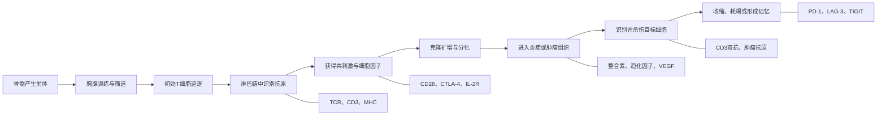
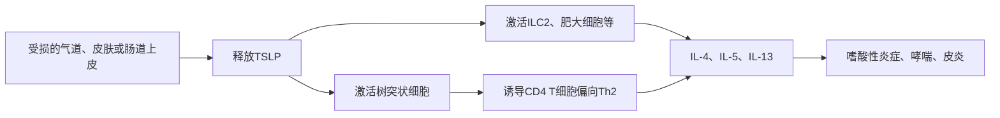

## T 细胞生命过程的靶点


先建立一条主线：T细胞并不是在血液里遇到肿瘤后直接开杀，而是经历“生产—训练—识别—授权—扩增—迁移—杀伤—刹车—记忆”。

````

````

## 第一阶段：T细胞从哪里来

造血干细胞在骨髓中产生淋巴细胞前体，随后进入胸腺，发育成T细胞。

胸腺中的核心任务不是扩军，而是“质量检查”：

1. 能否识别人体的MHC分子？
2. 是否会过度攻击自身？
3. 最终成为CD4还是CD8 T细胞？

关键分子包括：

| 分子            | 所在位置            | 作用                            |
| --------------- | ------------------- | ------------------------------- |
| **Notch-1**     | T细胞前体           | 决定前体向T细胞方向发育         |
| **IL-7R/CD127** | 发育中的T细胞       | 提供存活和增殖信号              |
| **TCR**         | T细胞表面           | 每个T细胞独特的抗原识别器       |
| **CD3**         | 与TCR共同存在于膜上 | 把TCR识别结果传入细胞内部       |
| **CD4/CD8**     | T细胞表面           | 决定辅助型或杀伤型T细胞身份     |
| **AIRE**        | 胸腺上皮细胞        | 帮助清除强烈识别自身抗原的T细胞 |

这一阶段通常不适合作为肿瘤治疗靶点，因为过度干预会破坏整个T细胞系统。

## 第二阶段：T细胞在体内巡逻

成熟但尚未遇到抗原的T细胞称为初始T细胞。它们不断在血液、淋巴液和淋巴结之间循环。

主要空间导航分子是：

- **CD62L**：帮助T细胞进入淋巴结。
- **CCR7**：感知CCL19、CCL21，引导T细胞前往淋巴结的T细胞区域。
- **S1P1**：帮助T细胞离开淋巴结，重新进入血液。

这说明T细胞治疗不仅取决于“能不能杀”，还取决于“能不能到达正确位置”。

例如芬戈莫德通过调节S1P1，把淋巴细胞困在淋巴结中，用于多发性硬化。它不是抗体，但展示了迁移环节也可以成为药物靶点。

## 第三阶段：树突状细胞呈递抗原

肿瘤、病毒或细菌产生的蛋白被树突状细胞吞噬并加工成短肽，然后展示给T细胞。

### CD8 T细胞识别

```
肿瘤抗原肽 + MHC-I → TCR/CD3 + CD8
```

几乎所有有核细胞都有MHC-I，因此CD8 T细胞可以直接识别被感染细胞或肿瘤细胞。

### CD4 T细胞识别

```
抗原肽 + MHC-II → TCR/CD3 + CD4
```

MHC-II主要存在于树突状细胞、巨噬细胞和B细胞等专业抗原呈递细胞上。

这一阶段的核心结构：

| 一侧       | 另一侧 | 意义                       |
| ---------- | ------ | -------------------------- |
| 抗原肽-MHC | TCR    | 判断目标是谁               |
| MHC-I      | CD8    | 辅助杀伤型T细胞识别        |
| MHC-II     | CD4    | 辅助辅助型T细胞识别        |
| TCR        | CD3    | CD3负责把识别信号传入T细胞 |

### 为什么CD3很重要

CD3本身不识别肿瘤，却是所有常规T细胞的信号接口。

CD3双特异性抗体一端结合T细胞上的CD3，另一端结合肿瘤抗原：

```
T细胞—CD3 ← 双抗 → CD19/BCMA等—肿瘤细胞
```

它相当于绕过正常抗原呈递，强行把T细胞拉到肿瘤细胞旁边。

代表药物：

- CD19×CD3：贝林妥欧单抗
- BCMA×CD3：特立妥单抗
- GPRC5D×CD3：塔奎妥单抗

主要风险是细胞因子释放综合征、神经毒性和感染。

## 第四阶段：T细胞激活需要三类信号

仅仅让TCR看到抗原通常不够。完整激活需要三个信号。

### 信号一：确认敌人

```
抗原肽-MHC → TCR/CD3
```

它决定T细胞攻击谁。

如果肿瘤丢失抗原、MHC-I或β2微球蛋白，即使PD-1已经被阻断，T细胞仍可能看不见肿瘤。

### 信号二：是否批准开火

最重要的正向信号是：

```
CD80/CD86 → CD28
```

- **CD80/CD86**：主要位于抗原呈递细胞。
- **CD28**：位于T细胞。
- 结合后表示抗原处在真正需要免疫反应的环境中。

与它竞争的是CTLA-4：

```
CD80/CD86 → CTLA-4 → 抑制T细胞激活
```

CTLA-4对CD80/CD86的亲和力更高，相当于抢走CD28的授权信号。

相关治疗：

- **伊匹木单抗**阻断CTLA-4：增强抗肿瘤免疫。
- **阿巴西普**是CTLA-4融合蛋白：反过来吸收CD80/CD86，抑制自身免疫。

这是一组非常好的正反例：同一生物轴既可以踩油门，也可以踩刹车。

其他共刺激靶点包括：

- **4-1BB/CD137**
- **OX40/CD134**
- **CD27**
- **ICOS**

这些激动型抗体希望进一步增强T细胞，但容易遇到全身免疫激活、肝毒性或治疗窗口狭窄的问题。

### 信号三：告诉T细胞变成什么兵种

周围的细胞因子决定T细胞的功能方向：

| 环境信号           | 主要分化方向 | 主要功能                   |
| ------------------ | ------------ | -------------------------- |
| IL-12、IFN-γ       | Th1          | 激活巨噬细胞，支持细胞免疫 |
| IL-4               | Th2          | 驱动过敏及寄生虫免疫       |
| IL-6、TGF-β、IL-23 | Th17         | 黏膜防御及炎症             |
| TGF-β、IL-2        | Treg         | 抑制免疫，维持免疫耐受     |
| IL-2、IL-12、IL-15 | CD8效应细胞  | 增殖并增强杀伤能力         |

## TSLP在这里处于什么位置

TSLP不属于T细胞的直接识别系统，而是位于第三信号的更上游：

````

````

所以TSLP更像“现场发出的炎症警报”，而不是T细胞上的开关。抗TSLP药物特泽利尤单抗在T细胞启动之前就截断上游信号。

## 第五阶段：克隆扩增和兵种分化

T细胞获得三类信号后，会大量复制。IL-2是这一阶段最重要的生长因子之一。

```
T细胞释放IL-2 → IL-2结合IL-2R → T细胞克隆扩增
```

IL-2受体包含：

- **CD25/IL-2Rα**
- CD122/IL-2Rβ
- 公共γ链/CD132

CD25在活化T细胞和调节性T细胞上表达较高。

相关药物：

| 靶点      | 药物               | 效果                                |
| --------- | ------------------ | ----------------------------------- |
| CD25      | 巴利昔单抗         | 抑制T细胞扩增，用于器官移植排斥预防 |
| IL-2R信号 | 他克莫司等间接抑制 | 抑制T细胞激活和IL-2产生             |
| IL-2通路  | 阿地白介素等       | 高剂量可增强抗肿瘤免疫，但毒性较大  |

此后T细胞主要分为：

- **CD8杀伤性T细胞**：直接杀伤感染或肿瘤细胞。
- **Th1细胞**：支持细胞免疫。
- **Th2细胞**：驱动过敏反应。
- **Th17细胞**：参与黏膜防御和自身免疫。
- **Treg细胞**：抑制免疫反应。
- **记忆T细胞**：长期保存对抗原的识别能力。

IL-4Rα、IL-5、IL-17、IL-23等抗体，实际上是在调节这些T细胞亚群及其下游炎症，而不是简单地“消灭所有T细胞”。

## 第六阶段：T细胞进入病灶

激活的T细胞必须离开血液、穿过血管壁，才能进入肿瘤或炎症组织。

大致过程：

```
趋化因子导航 → 黏附血管内皮 → 穿过血管壁 → 在组织中移动
```

关键分子包括：

| 功能             | T细胞一侧         | 血管或组织一侧   |
| ---------------- | ----------------- | ---------------- |
| 滚动和初步黏附   | CD62L、选择素配体 | 选择素           |
| 牢固黏附         | LFA-1             | ICAM-1           |
| 进入部分炎症组织 | VLA-4/α4β1        | VCAM-1           |
| 进入肠道         | α4β7              | MAdCAM-1         |
| 趋化导航         | CXCR3、CCR5等     | CXCL9/10、CCL5等 |

代表性药物：

- **维得利珠单抗**阻断α4β7，使淋巴细胞较难进入肠道，用于炎症性肠病。
- **那他珠单抗**阻断α4整合素，减少免疫细胞进入中枢神经系统和肠道，但存在PML风险。

### VEGF也在这一阶段影响T细胞

VEGF不仅制造肿瘤血管，还会造成：

- 血管结构异常；
- T细胞难以黏附和穿过血管；
- 树突状细胞成熟受抑；
- 免疫抑制细胞增加。

因此抗VEGF可以在一定程度上“整理道路”，使T细胞更容易进入肿瘤。这就是抗VEGF与PD-1/PD-L1联用的生物学逻辑之一。

## 第七阶段：T细胞杀伤目标

CD8 T细胞与目标细胞形成免疫突触后，主要有两套杀伤方式。

### 颗粒释放

```
穿孔素在目标细胞膜上打孔
→ 颗粒酶进入细胞
→ 启动细胞凋亡
```

关键分子：

- **Perforin/穿孔素**
- **Granzyme B/颗粒酶B**

### 死亡受体

```
T细胞FasL → 目标细胞Fas/CD95 → 细胞凋亡
```

T细胞还会释放：

- **IFN-γ**：增强抗原呈递和免疫反应。
- **TNF-α**：促进炎症和部分细胞死亡。
- **IL-2**：支持T细胞扩增。

CD4 T细胞则通过CD40L与抗原呈递细胞上的CD40结合，增强树突状细胞和B细胞功能，为CD8 T细胞提供帮助。

## 第八阶段：为什么T细胞会被“踩刹车”

免疫系统必须避免无限攻击，因此激活后会逐渐表达抑制受体：

| T细胞靶点  | 主要结合对象 | 功能定位                      |
| ---------- | ------------ | ----------------------------- |
| **PD-1**   | PD-L1、PD-L2 | 在组织和肿瘤现场抑制效应T细胞 |
| **CTLA-4** | CD80、CD86   | 主要限制淋巴结中的早期激活    |
| **LAG-3**  | MHC-II等     | 与慢性刺激和T细胞耗竭相关     |
| **TIGIT**  | CD155、CD112 | 抑制T细胞和NK细胞             |
| **TIM-3**  | Galectin-9等 | 与耗竭和免疫调节相关          |
| **VISTA**  | 多种潜在配体 | 调节髓系细胞和T细胞免疫       |

三个重要区别：

- **CTLA-4**主要管“是否允许T细胞最初启动”。
- **PD-1**主要管“到了病灶后是否继续攻击”。
- **LAG-3、TIGIT、TIM-3**更像慢性刺激下形成的补偿性刹车。

因此，PD-1与LAG-3联合的逻辑不是两个药重复作用，而是同时解除两套不同但重叠的抑制系统。

## 第九阶段：收缩、记忆或耗竭

病原清除后，大部分效应T细胞死亡，避免免疫反应无限持续；少数形成记忆细胞。

主要生存信号：

- **IL-7/IL-7R**：维持初始和记忆T细胞。
- **IL-15**：维持记忆CD8 T细胞和NK细胞。
- **BCL-2**：提供细胞内抗凋亡信号。

如果抗原长期存在，例如慢性感染或肿瘤，T细胞可能进入耗竭状态：

```
持续TCR刺激
→ PD-1、LAG-3、TIGIT等持续升高
→ 增殖能力下降
→ IL-2、IFN-γ等减少
→ 杀伤功能逐渐衰退
```

检查点抑制剂可以恢复部分功能，但不能保证把深度耗竭的T细胞完全恢复成健康状态。

## 把常见靶点放回整条链

| 靶点                    | 所处环节               | 本质作用                  |
| ----------------------- | ---------------------- | ------------------------- |
| **TSLP**                | 上皮报警、抗原呈递之前 | 决定是否启动Ⅱ型炎症环境   |
| **MHC–TCR/CD3**         | 抗原识别               | 决定T细胞攻击谁           |
| **CD28–CD80/86**        | 初始激活               | 提供开火许可              |
| **CTLA-4**              | 初始激活               | 抢占许可，限制T细胞启动   |
| **IL-2/CD25**           | 克隆扩增               | 决定T细胞能否大量增殖     |
| **α4β7、VLA-4、LFA-1**  | 组织迁移               | 决定T细胞能去哪里         |
| **VEGF**                | 肿瘤血管与微环境       | 决定T细胞能否进入肿瘤     |
| **肿瘤抗原×CD3**        | 接近和杀伤             | 强行连接T细胞与肿瘤细胞   |
| **PD-1/PD-L1**          | 病灶中的效应阶段       | 控制T细胞是否继续攻击     |
| **LAG-3、TIGIT、TIM-3** | 慢性刺激和耗竭         | 提供补偿性抑制            |
| **IL-7、IL-15**         | 记忆维持               | 决定部分T细胞能否长期生存 |

最核心的认知可以压缩成五个问题：

> T细胞看不看得见？
> 有没有获得开火许可？
> 能不能扩增成军队？
> 能不能进入病灶？
> 到达以后是否又被踩住刹车？

PD-1只解决最后一个问题。它并不能解决抗原消失、MHC缺失、T细胞数量不足、无法进入肿瘤或肿瘤缺乏免疫原性等其他环节。


# T 细胞的刹车与油门

**LAG-3、CTLA-4、PD-1本身都不是激活T细胞，而是抑制T细胞的“刹车”。**

> 药物阻断这些刹车，才会间接增强T细胞活性。

三者最大的区别是：**主要在哪个阶段踩刹车，以及踩的是哪一套信号。**

| 靶点       | 主要阶段           | 主要位置              | 抑制机制                        | 阻断后的效果               |
| ---------- | ------------------ | --------------------- | ------------------------------- | -------------------------- |
| **CTLA-4** | T细胞初次启动      | 以淋巴结为主          | 抢走CD28所需的CD80/CD86         | 让更多T细胞获得启动资格    |
| **PD-1**   | T细胞执行攻击      | 肿瘤及炎症组织为主    | 抑制TCR和CD28下游信号           | 恢复已有抗肿瘤T细胞的杀伤  |
| **LAG-3**  | 长期刺激、逐渐耗竭 | 肿瘤内耗竭T细胞较常见 | 抑制TCR信号、增殖及细胞因子释放 | 进一步解除深层或补偿性抑制 |

这些位置是“主要作用场景”，不是绝对边界。


## CTLA-4

初始T细胞在淋巴结中遇到树突状细胞时，需要两种信号：

```
信号一：抗原肽-MHC → TCR
信号二：CD80/CD86 → CD28
```

第二个信号相当于“开火许可”。

CTLA-4与CD28争夺同一组配体CD80/CD86，而且结合能力更强：

```
树突状细胞 CD80/CD86
          ↓
    CD28：允许启动
    CTLA-4：阻止启动
```

CTLA-4还可从抗原呈递细胞表面移走CD80/CD86。调节性T细胞通常持续表达CTLA-4，借此压制周围免疫反应。

阻断CTLA-4的结果：

- 更多初始T细胞获得激活；
- 抗肿瘤T细胞种类可能增加；
- Treg的免疫抑制可能被削弱；
- 但全身免疫耐受也更容易被破坏。

因此抗CTLA-4更像：

> 扩大征兵范围，让原本不能参战的T细胞也加入战斗。

代表药物是伊匹木单抗。其免疫性结肠炎、肝炎和垂体炎等副作用通常比单用PD-1抑制剂更突出。


## PD-1


控制已经参战的T细胞是否继续开火

T细胞被激活并进入肿瘤后，肿瘤细胞和免疫细胞可以表达PD-L1。

```
T细胞PD-1 ←→ 肿瘤或免疫细胞PD-L1
                  ↓
          降低TCR和CD28信号
```

PD-1被激活后，会招募SHP等细胞内磷酸酶，削弱TCR和CD28信号，使T细胞：

- 减少增殖；
- 减少IL-2、IFN-γ等细胞因子；
- 降低杀伤能力；
- 逐渐进入功能低下状态。

阻断PD-1的结果：

- 主要恢复已经识别肿瘤的T细胞；
- 不一定产生全新的抗肿瘤T细胞；
- 如果肿瘤中根本没有T细胞，疗效通常有限。

因此抗PD-1更像：

> 让已经抵达战场、已经瞄准敌人的士兵重新开火。

代表药物包括帕博利珠单抗、纳武利尤单抗。

## LAG-3

限制长期作战、深度疲劳的T细胞

LAG-3通常出现在：

- 长期受到抗原刺激的T细胞；
- 耗竭T细胞；
- 部分调节性T细胞；
- 部分NK细胞。

它可以与MHC-II等配体结合，抑制TCR信号、细胞增殖和细胞因子产生。它和PD-1经常共同出现在同一个耗竭T细胞上。

```
持续肿瘤抗原刺激
       ↓
PD-1升高＋LAG-3升高
       ↓
T细胞进入更深的功能抑制
```

只阻断PD-1后，LAG-3可能继续限制T细胞功能，因此LAG-3药物通常与PD-1药物联合。

所以抗LAG-3更像：

> 主刹车松开后，再解除长期作战形成的第二套限制。

代表方案是瑞拉利单抗联合纳武利尤单抗，主要用于晚期黑色素瘤。LAG-3单药作用一般比较弱。


```
淋巴结：是否允许T细胞启动？
          CTLA-4

            ↓ 激活、扩增

血液和组织：能否进入肿瘤？
       VEGF、整合素、趋化因子

            ↓ 到达肿瘤

肿瘤现场：还能不能继续攻击？
           PD-1

            ↓ 长期刺激

深度耗竭：解除PD-1后为什么仍然受抑？
     LAG-3、TIGIT、TIM-3
```

CTLA-4管“能不能入伍”，PD-1管“到了战场能不能开火”，LAG-3管“长期作战后是否陷入更深耗竭”。

## 4-1BB

**4-1BB是T细胞的“油门”或共刺激受体**，而PD-1、CTLA-4、LAG-3是“刹车”

4-1BB又称：

- **CD137**
- **TNFRSF9**

T细胞先通过TCR识别抗原并被初步激活，随后表面才会明显增加4-1BB。

```
TCR识别抗原
    ↓
T细胞初步激活
    ↓
4-1BB表达升高
    ↓
4-1BB与4-1BBL结合
    ↓
增强增殖、存活、细胞因子释放和杀伤能力
```

4-1BBL主要表达在树突状细胞、巨噬细胞和B细胞等抗原呈递细胞上。

4-1BB信号通过TRAF1/TRAF2、NF-κB和MAPK等通路，使T细胞：

- 更不容易凋亡；
- 增殖能力增强；
- 释放更多IFN-γ等细胞因子；
- 提高CD8 T细胞杀伤能力；
- 更容易形成长期记忆；
- 在代谢压力较大的肿瘤环境中维持功能。

它也能增强NK细胞活性。


为什么4-1BB药物还没有像PD-1一样成功

核心问题是**疗效和安全性的平衡**。

早期全身性4-1BB激动抗体主要遇到两个方向的问题：

- **激动太强**：尿路单抗（urelumab）出现明显肝毒性。
- **激动较弱**：乌托米单抗（utomilumab）安全性较好，但单药疗效有限。

所以现在的研发重点是让4-1BB只在肿瘤附近被激活，例如：

```
一端结合肿瘤抗原或PD-L1
          ＋
一端激活4-1BB
          ↓
尽量只在肿瘤局部踩油门
```

这类肿瘤条件性双抗希望减少全身免疫激活和肝毒性。


# T 细胞的死亡

1. 胸腺筛选：不合格者死亡 
2. 缺少生存信号：线粒体凋亡
3. 反复激活：Fas介导的死亡
4. 被其他免疫细胞杀死
5. 抗体药物主动清除T细胞
6. 炎症性死亡


```
胸腺发育
  ↓ 大量不合格T细胞死亡
初始T细胞
  ↓ 缺少生存信号会死亡
遇到抗原后大量扩增
  ↓ 抗原消失
大部分效应T细胞死亡
  ↓
少部分成为记忆T细胞
```

T细胞需要外界不断告诉它“你还有必要活着”。

主要生存信号包括：

- 初始T细胞：**IL-7—IL-7R/CD127**
- 记忆CD8 T细胞：**IL-7和IL-15**
- 活化T细胞：抗原刺激、共刺激、IL-2等

信号消失后，细胞内发生：

```
IL-7、IL-15等减少
        ↓
BCL-2等抗凋亡蛋白减少
        ↓
BIM、BAX、BAK占优势
        ↓
线粒体膜形成孔洞
        ↓
细胞色素C释放
        ↓
Caspase-9 → Caspase-3
        ↓
细胞被有序拆解
```

这称为**内源性或线粒体凋亡**。

抗原清除后，大部分效应T细胞正是通过这种机制死亡，称为免疫反应的“收缩期”。


T细胞被反复、强烈刺激后，会增加死亡受体Fas的表达。

```
一个细胞的FasL
        ↓
另一个T细胞的Fas/CD95
        ↓
FADD
        ↓
Caspase-8
        ↓
Caspase-3
        ↓
凋亡
```

这称为：

- 外源性凋亡；
- 死亡受体通路；
- 激活诱导性细胞死亡，AICD。

它的意义是防止T细胞在感染结束后继续无限增殖和攻击正常组织。

如果Fas通路发生遗传缺陷，不能正常清除活化淋巴细胞，就可能出现自身免疫性淋巴增殖综合征（ALPS）。


T细胞也可能被NK细胞或其他细胞毒性T细胞清除。

主要方式是：

```
穿孔素在T细胞膜上打孔
        ↓
颗粒酶进入T细胞
        ↓
激活Caspase和线粒体通路
        ↓
凋亡
```

这种情况可发生于：

- T细胞被病毒感染；
- T细胞异常激活；
- 免疫系统清除失控或受损的T细胞。


某些抗体结合T细胞表面蛋白后，会招募NK细胞、巨噬细胞或补体来杀死T细胞。

| 靶点          | 代表药物         | 结果                          |
| ------------- | ---------------- | ----------------------------- |
| **CD52**      | 阿仑单抗         | 大量清除T、B淋巴细胞          |
| **CD3**       | 部分抗CD3抗体    | 调节、重新分布或清除部分T细胞 |
| 多种T细胞抗原 | 抗胸腺细胞球蛋白 | 广泛清除T细胞                 |

主要清除机制包括：

- ADCC：NK细胞识别抗体尾部并杀伤T细胞；
- ADCP：巨噬细胞吞噬被抗体标记的T细胞；
- CDC：抗体激活补体，在细胞膜上形成攻击孔。

这会带来感染和病毒再激活风险。


少数特殊情况下，T细胞可能发生细胞膜破裂型死亡。

| 方式       | 核心分子                       | 特点                         |
| ---------- | ------------------------------ | ---------------------------- |
| 焦亡       | 炎症小体、Caspase-1、Gasdermin | 细胞膜形成孔洞，释放炎症物质 |
| 坏死性凋亡 | RIPK1、RIPK3、MLKL             | 细胞肿胀、破裂，引起炎症     |
| 普通坏死   | 严重缺氧、毒性、物理损伤       | 非有序性细胞破裂             |

例如，部分HIV感染相关的CD4 T细胞损失涉及焦亡，而不仅是病毒直接杀死细胞。

| 靶点              | 对T细胞生存的影响                                            |
| ----------------- | ------------------------------------------------------------ |
| **PD-1**          | 降低激活和增殖，长期可形成耗竭；同时也可能防止T细胞因过度刺激而迅速死亡 |
| **LAG-3**         | 限制增殖和效应功能，常与PD-1共同维持耗竭状态                 |
| **CTLA-4**        | 限制早期激活，减少进入强烈扩增阶段的T细胞                    |
| **4-1BB**         | 提供生存信号，增强BCL-xL等抗凋亡机制，促进记忆和持续性       |
| **IL-7R、IL-15R** | 给初始及记忆T细胞提供基础生存信号                            |
| **Fas/CD95**      | 直接启动死亡程序                                             |