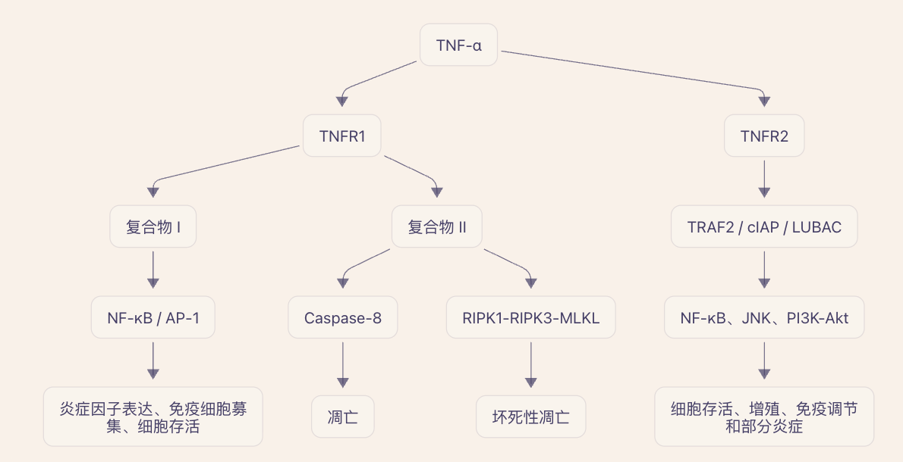

# 为什么会有炎症

组织中的哨兵（巨噬、树突状）细胞通过模式识别受体发现 PAMP（细菌病毒成分）、DAMP（受损细胞释放的 ATP、DNA 等）、免疫复合物、已经存在的炎症因子，知道“这里可能感染了”

危险感受器把信号传入细胞，激活核心转录因子：NF‑κB、AP‑1、IRF3/IRF7。这些转录因子进入细胞核，打开 TNF、IL1B、IL6 和趋化因子等基因。

因此，NF‑κB 和 AP‑1 可以理解为炎症基因的“总开关”。

## 

炎症主要完成四件事：

1. 发现危险
   免疫细胞通过模式识别受体识别两类信号：
   - PAMP：细菌、病毒等病原体的特征；
   - DAMP：受伤或死亡细胞释放的危险信号。
2. 发出警报
   巨噬细胞等释放 TNF‑α、IL‑1β、IL‑6和趋化因子。
3. 调集资源
   血管扩张并增加通透性，使中性粒细胞、单核细胞、补体和抗体进入病灶。
4. 清除与修复
   免疫细胞杀灭病原体、吞噬坏死组织，随后生长因子推动血管和组织修复。

假设皮肤被细菌刺破，如果没有炎症：

- 血液里的免疫细胞不知道哪里发生了感染；
- 抗体和补体难以进入组织；
- 细菌可能快速扩散；
- 死亡细胞无法及时清除；
- 组织修复也难以启动。

### 红、肿、热、痛是怎么来的？

- 红、热：血管扩张，局部血流增加；
- 肿：血管通透性增加，液体和蛋白进入组织；
- 痛：前列腺素、缓激肽等刺激痛觉神经；

# 为什么存在多条炎症通路

只用一两条通路不行吗？

不太行。因为人体面对的危险种类、发生位置和所需反应完全不同。一两条通路既无法准确识别所有威胁，也很容易被病原体“一招破解”。

1. 不同通路识别的危险不同

可以把免疫系统理解为城市应急系统：

- 火警处理火灾；
- 警察处理暴力事件；
- 医疗系统处理伤员；
- 防洪系统处理洪水。

都叫“应急”，但不能只装一个总开关。

2. 不同病原体需要不同武器

- 细胞外细菌：中性粒细胞、补体、IL‑1、TNF较重要；
- 病毒：I型干扰素和杀伤性T细胞更重要；
- 寄生虫：IL‑4、IL‑5、IL‑13、嗜酸性粒细胞更重要；
- 真菌：IL‑17和中性粒细胞反应更重要；
- 组织损伤：清除死亡细胞之后还必须启动修复。

如果所有危险都只调用同一种反应，可能既清不掉病原体，又造成不必要的组织损伤。

3. 不同组织能承受的炎症程度不同

皮肤可以发生明显红肿、渗出；大脑和眼睛却不能承受同样程度的肿胀。

因此，不同组织使用不同的：

- 危险感受器；
- 炎症因子组合；
- 免疫细胞；
- 抑制和修复机制。

这使炎症能够因地制宜。

4. 炎症有时间顺序

早期报警
TNF、IL-1、趋化因子
      ↓
招募和杀伤
补体、中性粒细胞、IFN、IL-17
      ↓
限制损伤
IL-10、TGF-β、调节性T细胞
      ↓
炎症消退和组织修复

同一条通路难以同时完成“增强攻击”和“停止攻击”这两个相反任务。

5. 多条通路提供组合编码

免疫系统不是简单用“有/无炎症”表达信息，而是通过炎症因子的组合描述危险：

- TNF + IL‑1：强烈组织炎症；
- IFN‑α/β：病毒感染；
- IL‑12 + IFN‑γ：细胞内病原体；
- IL‑4 + IL‑5 + IL‑13：寄生虫或过敏；
- IL‑23 + IL‑17：屏障组织和真菌防御。

这类似于用多个字母组合成不同单词。只有一两个信号，信息量太少。

6. 代价就是可能出现自身免疫疾病

多通路系统虽然灵活、可靠，但也更复杂，任何环节失控都可能导致：

- 信号过强；
- 信号长期无法关闭；
- 错把自身组织当作危险；
- 一条通路被阻断后，另一条产生代偿。

这也是为什么自免药物经常出现：

> 起初有效 → 其他通路补偿 → 疗效下降或部分患者无效。

所以人体保留许多炎症通路，并不是设计冗余，而是用复杂性换取识别能力、组织适配性和生存可靠性。对药物研发而言，理想目标不是关闭全部炎症，而是找出某种疾病真正依赖的“主导通路”，把病理性炎症压下去，同时尽量保留正常抗感染和修复能力。

# 炎症因子

“炎症因子”通常指炎症过程中细胞释放的信号分子，相当于免疫系统的“通信语言”。

多数经典炎症因子是蛋白质或糖蛋白，例如：

- TNF‑α
- IL‑1β、IL‑6、IL‑17
- IFN‑γ
- 趋化因子 CXCL8、CCL2

炎症因子作用是协调免疫反应，主要包括：

1. 发出危险警报：感染或组织损伤后，巨噬细胞释放 TNF‑α、IL‑1β 等，通知周围组织“这里出问题了”
2. 招募免疫细胞：趋化因子形成浓度梯度，引导中性粒细胞、单核细胞和淋巴细胞进入病灶
3. 改造血管：TNF‑α使血管内皮表达黏附分子，并增加血管通透性，让免疫细胞更容易离开血液进入组织
4. 产生全身反应：IL‑1、IL‑6、TNF‑α可引起发热、肝脏合成 CRP、疲劳和食欲下降
5. 调节组织修复或细胞死亡
6. 调节 T 细胞

但仅靠炎症因子一般不能真正启动初始 T 细胞。完整激活通常需要三个信号：

- 抗原呈递：TCR 识别抗原–MHC；
- 共刺激：例如 CD28–CD80/CD86；
- 细胞因子：决定 T 细胞扩增及分化方向。

## TNF‑α

TNF‑α不是凭空出现的。它通常由以下信号诱导：

- TLR识别细菌或病毒；
- DAMP提示组织损伤；
- TCR识别抗原；
- 免疫复合物激活巨噬细胞；
- IL‑1、IFN‑γ等其他细胞因子刺激。

这些信号激活 NF‑κB、AP‑1，促使巨噬细胞、T细胞等合成 TNF‑α。

TNF-α 是多种炎症反应的“上游放大器”，且靶点位于细胞外，药理上容易干预。

在类风湿关节炎、强直性脊柱炎、银屑病、炎症性肠病等疾病中，巨噬细胞、T 细胞等持续产生 TNF-α。它结合 TNFR1/TNFR2 后，可激活 NF-κB、MAPK 等通路，从而：

- 诱导 IL-1、IL-6、GM-CSF 等炎症因子；
- 上调内皮黏附分子，使免疫细胞不断进入组织；
- 激活巨噬细胞、成纤维细胞和破骨细胞；
- 促进基质金属蛋白酶产生，导致软骨、骨或肠黏膜损伤；
- 加强局部炎症细胞的存活和正反馈。

因此，TNF-α 不是单一炎症信号，而是能维持和放大慢性炎症状态的枢纽。

许多自免疾病虽由多种因素驱动，但部分患者的病灶形成了 TNF 主导的炎症回路。阻断 TNF 后，多个下游炎症过程会一起下降，产生明显临床疗效。

这也是抗 TNF 药物能够同时覆盖多个适应证的原因，例如：

- 类风湿关节炎；
- 强直性脊柱炎和其他脊柱关节炎；
- 银屑病和银屑病关节炎；
- 克罗恩病、溃疡性结肠炎；
- 化脓性汗腺炎；
- 葡萄膜炎等。

TNF-α 是分泌型或膜结合型细胞因子，抗体或可溶性受体可以直接与其结合，无需进入细胞。这带来几个成药优势：

- 靶向结合容易做到高亲和力和高选择性；
- 药效可以通过游离 TNF、CRP、疾病活动度等进行评估；
- 单抗和 Fc 融合蛋白半衰期较长，适合慢性病给药；
- 可通过不同分子形式调节对可溶性 TNF、膜 TNF 及 Fc 效应功能的影响。

典型药物包括英夫利西单抗、阿达木单抗、戈利木单抗、赛妥珠单抗和依那西普。

TNF 存在治疗窗口，许多基础生理功能仍能由其他细胞因子和免疫通路补偿

TNF 是“炎症枢纽”，但不是所有疾病都由它主导。例如在多发性硬化中，阻断 TNF 可能使病情恶化；在系统性红斑狼疮中，疗效和安全性也较复杂。不同疾病中的 TNFR1/TNFR2、可溶性 TNF/膜 TNF以及免疫调节功能并不相同。

在若干自免疾病中，它同时具备病理位置关键、细胞外可及、阻断后下游影响广、成人可耐受以及人体疗效可重复验证这五个条件。

# 炎症疾病与自免

正常的炎症：启动 → 清除威胁 → 关闭 → 修复

自身免疫疾病中的炎症：

​	免疫系统攻击自身组织
​        ↓
​	组织受损并释放危险信号
​        ↓
​	TNF、IL-1、IL-6等增加
​        ↓
​	更多免疫细胞被招募和激活
​        ↓
​	造成更多组织损伤
​        ↺
