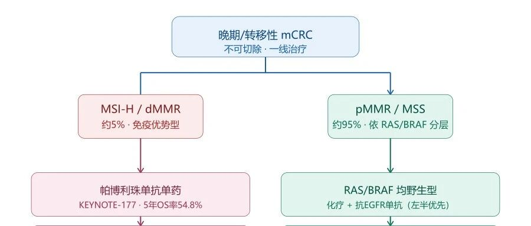
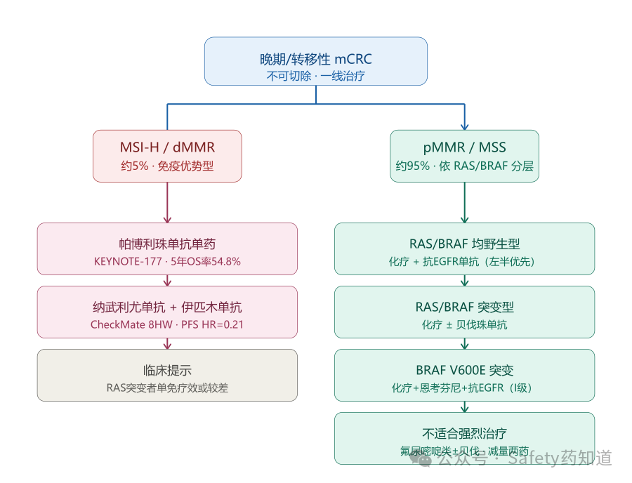
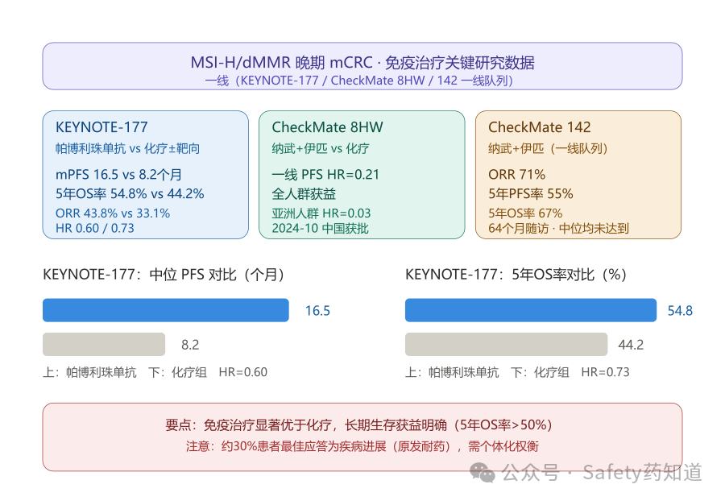
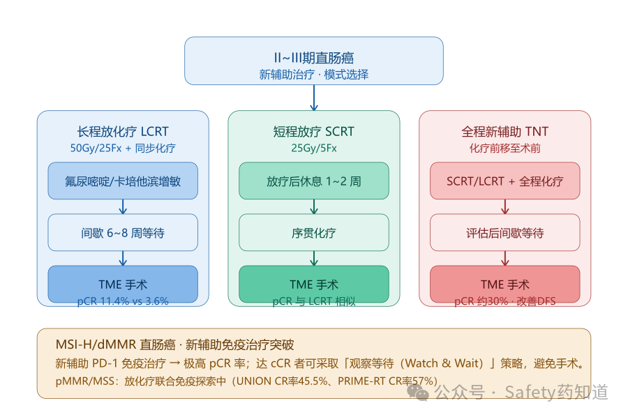
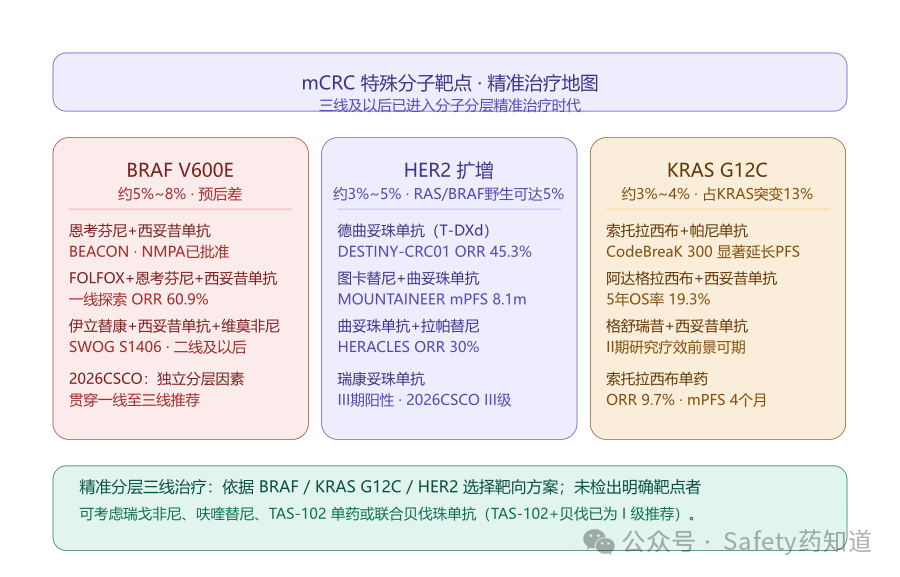
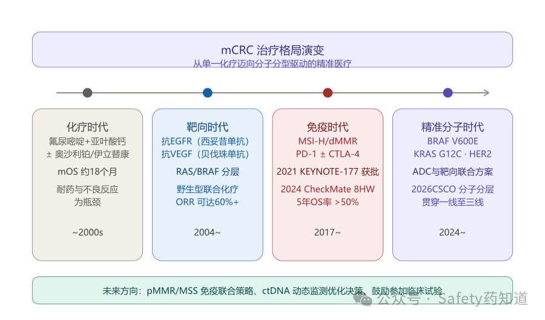

Link：https://mp.weixin.qq.com/s/IqTq_cTBW8fem2Llo9x0Fg

Author：Safety药知道

其他：

转移性结直肠癌-2026 ESMO 临床实践指南：https://mp.weixin.qq.com/s/ARqFkTXO9yKnjcpWDJNR4w

# 结直肠癌（CRC）解析

> Safety药知道 · Aug 21, 2026, 2:51 PM

## 一、流行病学

### 全球概况

结直肠癌是消化系统最常见的恶性肿瘤之一。据国际癌症研究机构（IARC）数据，2022 年全球结直肠癌新发病例约 192.6 万例，死亡病例约 90.4 万例，分别位居全球恶性肿瘤发病第 3 位和死亡第 2 位，占全部恶性肿瘤发病和死亡的 9.6% 和 9.3%。男性标化发病率（22.0/10 万）和死亡率（9.9/10 万）约为女性的 1.5 倍。2022 年中国、美国、欧洲和日本分别约有 51.7 万、15.3 万、53.8 万和 14.6 万新增病例。结直肠癌发病率与经济发展水平呈正相关，高/极高 HDI 地区发病率是中/低 HDI 地区的 3～4 倍。

### 美国数据

结直肠癌是美国第四大最常见癌症，也是癌症死亡的第二大原因。2025 年美国预计将新增 46,950 例直肠癌新发病例，约 52,900 人死于直肠癌和结肠癌。发病率和死亡率在数十年间持续下降，目前比峰值死亡率下降了\>50%，这被认为是癌症预防、筛查和更好治疗方式的结果。值得注意的是，65 岁以下人群发病率有所增加，50 岁以下人群发病率每年增加 2%，到 2030 年 20 至 34 岁患者结肠癌和直肠癌的发病率将分别增加 90.0% 和 124.2%。

### 中国数据

中国结直肠癌的发病率和死亡率近年来呈持续上升趋势。2015 年中国结直肠癌新发病例 38.8 万，在恶性肿瘤中占比排名第 3 位，死亡病例数 18.7 万。最新癌症流行病学数据显示，结直肠癌新增病例 55.5 万例，死亡人数 28.6 万例，发病率和死亡率分别排在所有恶性肿瘤中的第 2 位和第 5 位。发病率在城市远高于农村，多数患者发现时已属于中晚期。大约 25% 的患者在诊断时已出现远处转移，其中 20% 存在肝转移，多达 8% 同时存在腹膜转移。

### 肝转移的严峻挑战

肝脏是结直肠癌血行转移最主要的靶器官。约 15%～25% 的患者在确诊时已出现肝转移，另有 15%～25% 在根治术后发生肝转移，其中 80%～90% 的肝转移灶无法进行根治性切除。未经治疗的肝转移患者中位生存期仅 6.9 个月，5 年生存率\<5%；而肝转移灶能完全切除的患者中位生存期为 35 个月，5 年生存率可达 30%～57%。

## 二、治疗总则与 MDT 模式

结直肠癌治疗强调多学科团队（MDT）诊疗模式。对于早期患者，手术切除是首选治疗方式。对于晚期或转移性患者，以含氟尿嘧啶和亚叶酸钙为基础、联合奥沙利铂或伊立替康的全身化疗为主，可使中位生存时间延长至 18 个月，但多数患者最终产生耐药和严重不良反应。

近年来，精准医疗理念深入发展，针对细胞受体、关键基因和调控分子为靶点的靶向治疗能为约一半的患者带来生存获益。2025 版中国国家卫健委《中国结直肠癌诊疗规范》强调，应结合 MMR/MSI 状态进行分层治疗，dMMR/MSI-H 患者推荐免疫检查点抑制剂，pMMR/MSS 患者则依据 RAS/BRAF 状态选择化疗联合靶向治疗。

## 三、一线治疗（晚期/转移性）

*图1 晚期/转移性结直肠癌一线治疗分子分层决策流程（基于 MMR/MSI 与 RAS/BRAF 状态）*

### 3.1 MSI-H/dMMR 患者一线

免疫治疗已成为 MSI-H/dMMR 晚期结直肠癌一线治疗的标准方案。

**帕博利珠单抗：**基于 KEYNOTE-177 研究，2021 年 6 月获批中国适应证，适用于单药治疗 KRAS、NRAS 和 BRAF 均为野生型不可切除或转移性 MSI-H/dMMR 结直肠癌患者的一线治疗。研究显示，帕博利珠单抗组 ORR 为 43.8%，中位 PFS 为 16.5 个月，而化疗组分别为 33.1% 和 8.2 个月（HR=0.60）；最终分析显示中位 OS 为 77.5 个月 vs 36.7 个月（HR=0.73），5 年 OS 率 54.8% vs 44.2%。需注意，帕博利珠单抗组约 30% 患者最佳应答为疾病进展（原发耐药），而化疗组为 12%。

**纳武利尤单抗+伊匹木单抗：**基于 CheckMate 8HW 研究，2024 年 10 月获批中国适应证，用于不可切除或转移性 MSI-H/dMMR 结直肠癌的一线治疗。CheckMate 8HW 显示双免疫联合方案对比化疗显著改善 PFS（HR=0.21），全人群获益，亚洲人群 HR=0.03。CheckMate 142 研究 64 个月随访数据进一步证实，一线治疗 ORR 达 71%，5 年 PFS 率达 55%，总 OS 率达 67%，中位 PFS 和 OS 均未达到。

**注意事项：**CSCO 指南专家委员会基于 KEYNOTE-177 研究的 OS 亚组分析认为，对于 RAS 突变的 dMMR/MSI-H 患者，一线使用帕博利珠单抗单药疗效可能比 RAS 野生型患者差。

### 3.2 pMMR/MSS 或 MSI-L 患者一线

根据 RAS/BRAF 突变状态和患者体力状况分层治疗。

**RAS/BRAF 均野生型（左半优先推荐抗 EGFR 方案）**

- 推荐 FOLFOX/CAPEOX/FOLFIRI 联合抗 EGFR 单抗（西妥昔单抗/西妥昔单抗 β）。西妥昔单抗联合化疗一线 ORR 可达 60% 以上。
- 也可选择 FOLFOX/CAPEOX/FOLFIRI 联合贝伐珠单抗。
- NCCN 指南指出 FOLFOX 和 CAPEOX 在转移性疾病一线治疗中可互换使用，PFS 相似（8.0 vs 8.5 个月）。
- 2026 CSCO 指南将"西妥昔单抗""西妥昔单抗 β"统一修改为"抗 EGFR 单抗"类别称谓。

**RAS 或 BRAF 突变型**

- 推荐 FOLFOX/CAPEOX/FOLFIRI ± 贝伐珠单抗。
- FOLFOXIRI（三药方案）± 贝伐珠单抗适用于体力状况好（ECOG 0~1 分，≤70 岁）的患者，追求更高肿瘤退缩率。
- 2026 CSCO 指南新增：对于 BRAF V600E 突变适合强烈治疗的患者，I 级推荐 FOLFOX+恩考芬尼+抗 EGFR 单抗。

**不适合强烈治疗的患者**

- 推荐氟尿嘧啶类单药 ± 贝伐珠单抗，或减量的两药化疗 ± 贝伐珠单抗。

## 四、二线治疗

### 4.1 MSI-H/dMMR（一线未使用免疫检查点抑制剂）

优先推荐：恩沃利单抗、斯鲁利单抗、替雷利珠单抗、普特利单抗、帕博利珠单抗、纳武利尤单抗（均为 2A 类）。纳武利尤单抗+伊匹木单抗（2A 类）。

### 4.2 pMMR/MSS 或 MSI-L

根据一线方案选择交叉策略：

- 一线使用奥沙利铂者，二线换用 FOLFIRI ± 靶向药物（贝伐珠单抗或抗 EGFR 单抗，RAS 野生型）。
- 一线使用伊立替康者，二线换用 FOLFOX/CAPEOX ± 靶向药物。
- 伊立替康+卡培他滨方案：基于 AXEPT 研究，在亚洲人群二线治疗中疗效不劣于 FOLFIRI，可根据患者耐受性选择。
- BRAF V600E 突变（既往未接受 BRAF 抑制剂和抗 EGFR 单抗）：I 级推荐恩考芬尼+抗 EGFR 单抗或 FOLFOX+恩考芬尼+抗 EGFR 单抗。
- 贝伐珠单抗可跨线使用，即一线含贝伐珠单抗方案进展后，二线可继续联合贝伐珠单抗。

## 五、三线治疗

### 5.1 无明确可干预靶点的 pMMR/MSS 患者

CSCO 指南将以下三类单药列为Ⅰ级推荐：

| 药物                        | 获批时间             | 关键研究                        | 疗效特点                                                     | 主要不良反应                                       |
| --------------------------- | -------------------- | ------------------------------- | ------------------------------------------------------------ | -------------------------------------------------- |
| 瑞戈非尼                    | 2017 年 3 月（NMPA） | CORRECT（全球）、CONCUR（亚洲） | 以疾病稳定为主，ORR 较低；亚洲人群生存获益更优；第一周期可剂量滴定（80mg/d→120mg/d→160mg/d） | 手足皮肤反应、疲乏、腹泻、高血压（多发于治疗初期） |
| 呋喹替尼                    | 2018 年 9 月（NMPA） | FRESCO                          | 小分子抗血管生成 TKI，适用于既往接受过氟尿嘧啶类、奥沙利铂和伊立替康化疗的患者 | 不良反应整体可控                                   |
| 曲氟尿苷替匹嘧啶（TAS-102） | 2019 年 8 月（NMPA） | RECOURSE（全球）、TERRA（亚洲） | 口服细胞毒性复方，可延缓体能状态恶化                         | 血液学毒性、胃肠道反应                             |

单药治疗的共性局限：mPFS 总体较短，多数研究报道未超过 4 个月；ORR 有限，主要体现为疾病控制而非肿瘤缩小。

**TAS-102+贝伐珠单抗联合方案：**全球随机对照Ⅲ期研究显示，TAS-102 联合贝伐珠单抗对比单药可显著延长 OS 和 PFS，已更新为Ⅰ级推荐。

### 5.2 存在明确分子特征的三线治疗

根据 2026 CSCO 指南及最新进展，三线治疗已进入精准分层阶段。

**BRAF V600E 突变（RAS 野生型）**

- 优选：BRAF 抑制剂+EGFR 单抗（恩考芬尼+西妥昔单抗），基于 BEACON 研究和国内 NAUTICAL 研究，NMPA 已批准。对于瘤负荷重者，可考虑加用 MEK 抑制剂（有延长 OS 趋势）。
- SWOG S1406 研究支持伊立替康+西妥昔单抗+维莫非尼用于二线及以后治疗。

**KRAS G12C 突变**

- CodeBreaK 300 研究：索托拉西布+帕尼单抗对比研究者选择方案，显著延长 PFS。
- 另一 II 期研究显示格舒瑞昔+西妥昔单抗有前景的疗效。
- 索托拉西布单药 ORR 为 9.7%，DCR 为 73.8%，mPFS 为 4 个月。

**HER2 扩增/过表达**

- 德曲妥珠单抗（DS-8201）：DESTINY-CRC01 研究显示，在 HER2 高表达（IHC 3+或 IHC 2+/ISH+）患者中 ORR 达 45.3%。
- 瑞康妥珠单抗：SHR-A1811-I-102 研究显示有前景疗效，III 期研究（NCT06199973）已获阳性结果（RAS/BRAF 野生型），2026 CSCO 指南新增 III 级推荐。
- 曲妥珠单抗+帕妥珠单抗或曲妥珠单抗+拉帕替尼：指南推荐用于 HER2 扩增的三线治疗。
- 图卡替尼+曲妥珠单抗（MOUNTAINEER 研究）：mPFS 8.1 个月，mOS 23.9 个月。

## 六、免疫治疗深度解析

### 6.1 MSI-H/dMMR 晚期一线

| 研究                      | 方案                            | ORR            | mPFS                      | mOS                       | 关键数据                  |
| ------------------------- | ------------------------------- | -------------- | ------------------------- | ------------------------- | ------------------------- |
| KEYNOTE-177               | 帕博利珠单抗 vs 化疗±靶向       | 43.8% vs 33.1% | 16.5m vs 8.2m（HR=0.60）  | 77.5m vs 36.7m（HR=0.73） | 5 年 OS 率 54.8% vs 44.2% |
| CheckMate 8HW             | 纳武利尤单抗+伊匹木单抗 vs 化疗 | —              | HR=0.21（一线）           | —                         | 亚洲人群 HR=0.03          |
| CheckMate 142（一线队列） | 纳武利尤单抗+伊匹木单抗         | 71%            | 未达到（5 年 PFS 率 55%） | 未达到（5 年 OS 率 67%）  | 64 个月随访               |

*图2 MSI-H/dMMR 晚期 mCRC 免疫治疗关键研究数据对比（KEYNOTE-177 / CheckMate 8HW / CheckMate 142）*

### 6.2 MSI-H/dMMR 后线治疗

- **KEYNOTE-164：**帕博利珠单抗后线治疗，队列 A（≥2 线）ORR 32.8%，队列 B（≥1 线）ORR 34.9%，DOR≥36 个月比例为 89.2% 和 95.5%。
- **CheckMate 142（二线及以上联合队列）：**纳武利尤单抗+伊匹木单抗（n=119），ORR 65%，48 个月 PFS 率 54%，OS 率 71%，中位 PFS 和 OS 均未达到。
- **国产 PD-1 抑制剂**（恩沃利单抗、斯鲁利单抗、替雷利珠单抗、普特利单抗）基于泛瘤种 II 期研究已获批 dMMR/MSI-H 实体瘤后线适应证。

### 6.3 pMMR/MSS 免疫治疗探索

pMMR/MSS 型结直肠癌对免疫检查点抑制剂单药治疗基本不敏感。目前探索方向包括：

- PD-1 抑制剂±CTLA-4 抑制剂（携带 POLE/POLD1 致病突变患者，3 类证据）。
- 放化疗联合免疫治疗在直肠癌新辅助治疗中展现协同效应（详见放化疗章节）。
- 瑞戈非尼/呋喹替尼联合免疫治疗正在探索中。

## 七、放化疗与围手术期治疗

*图3 II~III 期直肠癌新辅助治疗路径（LCRT / SCRT / TNT 三种模式对比）*

### 7.1 直肠癌新辅助放化疗

**标准模式：**对于 II~III 期直肠癌，推荐新辅助放化疗联合全直肠系膜切除术（TME）。

**长程放化疗（LCRT）：**50Gy/25Fx，同期氟尿嘧啶或卡培他滨增敏。同步放化疗相比单纯放疗可提高 pCR 率（11.4% vs 3.6%），降低局部复发率（8.1% vs 16.5%），但 3/4 级毒性更高（14.6% vs 2.7%）。

**短程放疗（SCRT）：**25Gy/5Fx，序贯化疗可取得与 LCRT 相似的 pCR 率。

### 7.2 全程新辅助治疗（TNT）

TNT 模式将辅助化疗前移至术前，可提高 pCR 率至约 30%，延长 DFS。

- **RAPIDO 研究（III 期）：**SCRT→化疗→TME vs 标准治疗，3 年疾病相关治疗失败率 23.7% vs 30.4%（HR=0.75），TNT 组 pCR 率 28%。
- **PRODIGE 23 研究：**FOLFIRINOX 联合放化疗新辅助 vs 标准放化疗，3 年 DFS 76% vs 69%（HR=0.69），严重不良事件 11% vs 23%。

### 7.3 新辅助免疫治疗的突破

**MSI-H/dMMR 直肠癌：**新辅助免疫治疗展现出极高 pCR 率，cCR 患者可采取"观察等待（Watch & Wait）"策略，避免手术。

**pMMR/MSS 直肠癌：**放化疗联合免疫治疗的探索取得重要进展：

- UNION 研究（II 期）：SCRT 序贯 CAPOX+信迪利单抗 vs SCRT 序贯 CAPOX，CR 率 45.5% vs 25.0%。
- PRIME-RT 研究：SCRT+FOLFOX+度伐利尤单抗 vs LCRT+FOLFOX+度伐利尤单抗，CR 率 57% vs 48%。
- 华中科技大学同济医学院附属协和医院研究：SCRT 序贯 CAPOX+卡瑞利珠单抗，pCR 率 48%（pMMR/MSS 型患者 46%），肛门保留率 89%。
- TORCH 研究：SCRT 联合化疗免疫的 iTNT 模式，取得了优异近期疗效。

### 7.4 辅助化疗

| 分期                                             | 推荐方案                        | 备注                               |
| ------------------------------------------------ | ------------------------------- | ---------------------------------- |
| I 期                                             | 不推荐辅助治疗                  | —                                  |
| II 期无高危因素                                  | 随访观察或单药氟尿嘧啶类        | —                                  |
| II 期有高危因素（T4、分化差且 pMMR、脉管侵犯等） | CapeOx、FOLFOX 或单药，3~6 个月 | dMMR/MSI-H 不推荐辅助化疗          |
| III 期                                           | CapeOx 或 FOLFOX，3~6 个月      | 低危（T1~3N1）可考虑 3 个月 CapeOx |

IDEA 研究：3 个月 vs 6 个月辅助化疗，OS 差异仅 0.4%（5 年 OS 82.4% vs 82.8%），但毒性显著降低，尤其 CAPEOX 方案 3 个月非劣效于 6 个月（低危亚组）。

## 八、特殊分子靶点的精准治疗

*图4 转移性结直肠癌三大特殊分子靶点精准治疗地图（BRAF V600E / HER2 扩增 / KRAS G12C）*

### 8.1 BRAF V600E 突变（约 5%~8% mCRC）

预后差，传统化疗疗效有限。

- **BEACON 研究：**恩考芬尼+西妥昔单抗±比美替尼，NMPA 已批准用于既往接受过全身治疗的 BRAF V600E 突变型 mCRC。
- **一线探索：**FOLFOX+恩考芬尼+西妥昔单抗，ORR 达 60.9%。
- 2026 CSCO 指南已将 BRAF V600E 突变作为独立分层因素，贯穿一线至三线治疗推荐。

### 8.2 HER2 扩增（约 3%~5% mCRC，RAS/BRAF 野生型中可达 5%）

HER2 扩增预后差，与抗 EGFR 治疗耐药相关。

- **德曲妥珠单抗（T-DXd）：**DESTINY-CRC01 研究，HER2 高表达 ORR 45.3%。
- **瑞康妥珠单抗：**SHR-A1811-I-102 研究显示有前景疗效，III 期阳性结果（RAS/BRAF 野生型），2026 CSCO 指南新增 III 级推荐。
- **图卡替尼+曲妥珠单抗（MOUNTAINEER）：**mPFS 8.1 个月，mOS 23.9 个月。
- **曲妥珠单抗+拉帕替尼（HERACLES）：**ORR 30%，DCR 59%。

### 8.3 KRAS G12C 突变（约 3%~4% mCRC，占 KRAS 突变中约 13%）

曾经的"不可成药"靶点已取得突破：

- **索托拉西布+帕尼单抗（CodeBreaK 300）：**对比研究者选择方案显著延长 PFS。
- **阿达格拉西布+西妥昔单抗：**5 年 OS 率 19.3%，显著优于传统三线治疗。
- **格舒瑞昔+西妥昔单抗：**II 期研究显示有前景疗效。

## 九、临床试验入排标准总结

基于知识库中安美木单抗 IIa 期临床试验及其他相关临床试验的入排标准，典型的晚期结直肠癌临床试验入排标准如下。

### 入选标准（典型）

- **知情同意：**自愿签署书面知情同意书。
- **年龄：**18~75 岁（含界值），性别不限。
- **诊断：**经组织或细胞病理学确诊的结肠或直肠腺癌。
- **疾病阶段：**
- **基因状态：**肿瘤组织 RAS（KRAS、NRAS）基因野生型，且未发现 BRAF V600E 突变（针对抗 EGFR 单抗试验）。
- **可测量病灶：**经 CT 或 MRI 证实至少存在一个符合 RECIST 1.1 标准的可测量病灶（非放射治疗野）。
- **体力状况：**ECOG 0 或 1 分。
- **预期生存：**≥12 周。
- **骨髓功能：**HGB≥90g/L，ANC≥1.5×10⁹/L，PLT≥75~90×10⁹/L。
- **肝肾功能：**TBIL≤1.5×ULN，AST/ALT≤2.5×ULN（肝转移者≤5×ULN），Cr≤1.5×ULN。
- **避孕：**具有生育能力者须接受有效医学避孕措施（至末次给药后 4 个月或 90 天）。

### 排除标准（典型）

- **既往抗 EGFR 治疗：**既往曾接受抗 EGFR 单抗类药物治疗（如西妥昔单抗、尼妥珠单抗、帕尼单抗等）。
- **近期抗肿瘤治疗：**入组前 4 周内曾接受系统抗肿瘤治疗（化疗、靶向、免疫、放疗、大手术等）。
- **脑转移：**已知的脑和/或软脑膜转移。
- **严重皮肤疾病：**需治疗的严重皮肤疾病。
- **肠梗阻/炎症性肠病：**急性或亚急性肠梗阻，或存在炎症性肠病（克罗恩病、溃疡性结肠炎）病史。
- **过敏史：**已知对试验药物任何成分存在超敏反应。
- **其他恶性肿瘤：**5 年内有其他恶性肿瘤史（已充分治疗的皮肤基底细胞癌或宫颈原位癌除外）。
- **严重感染：**存在严重临床感染（\>2 级 NCI-CTCAE）或未控制的活动性感染。
- **自身免疫性疾病：**需要免疫抑制剂治疗的自身免疫性疾病（KEYNOTE-177 等免疫治疗试验）。
- **疫苗：**入组前 4 周内曾接种活疫苗或减毒疫苗。

## 十、总结与展望

*图5 mCRC 治疗格局演变时间线：从化疗时代到精准分子时代*

### 治疗格局演变

结直肠癌的治疗已从单一的化疗时代迈入基于分子分型的精准医疗时代：

- **MSI-H/dMMR：**免疫治疗（PD-1 单抗±CTLA-4 单抗）已成为一线标准，长期生存数据令人瞩目（5 年 OS 率\>50%）。
- **RAS/BRAF 野生型：**化疗联合抗 EGFR 单抗或贝伐珠单抗仍是一线基石，ORR 可达 60% 以上。
- **BRAF V600E 突变：**BRAF 抑制剂+EGFR 单抗的靶向联合方案确立了从二线到一线的治疗地位。
- **KRAS G12C 突变：**KRAS G12C 抑制剂联合抗 EGFR 治疗已突破"不可成药"困境。
- **HER2 扩增：**ADC 药物（德曲妥珠单抗、瑞康妥珠单抗）和双靶方案为后线提供新选择。
- **三线标准治疗：**瑞戈非尼、呋喹替尼、TAS-102 单药或联合方案为经治患者提供生存获益。
- **直肠癌新辅助治疗：**TNT 模式、免疫联合放化疗的探索正在不断刷新 pCR 率纪录。

### 未满足的临床需求

- pMMR/MSS 型免疫治疗疗效有限，需要更多联合策略突破。
- 后线治疗 mPFS 仍短（多\<4 个月），耐药机制尚待阐明。
- ctDNA 动态监测等新型生物标志物有望优化治疗决策。
- 鼓励患者参加与其病情相符的临床试验，以获取更多治疗机会。

**注：**以上内容基于知识库现有资料整理，涵盖 2024~2026 年 CSCO 指南、NCCN 指南、中国卫健委诊疗规范及相关重磅临床研究（KEYNOTE-177、CheckMate 142/8HW、BEACON、CodeBreaK 300、DESTINY-CRC01 等）的核心数据。鉴于肿瘤治疗进展迅速，具体临床决策应结合患者个体情况、最新指南及药物可及性综合判断。