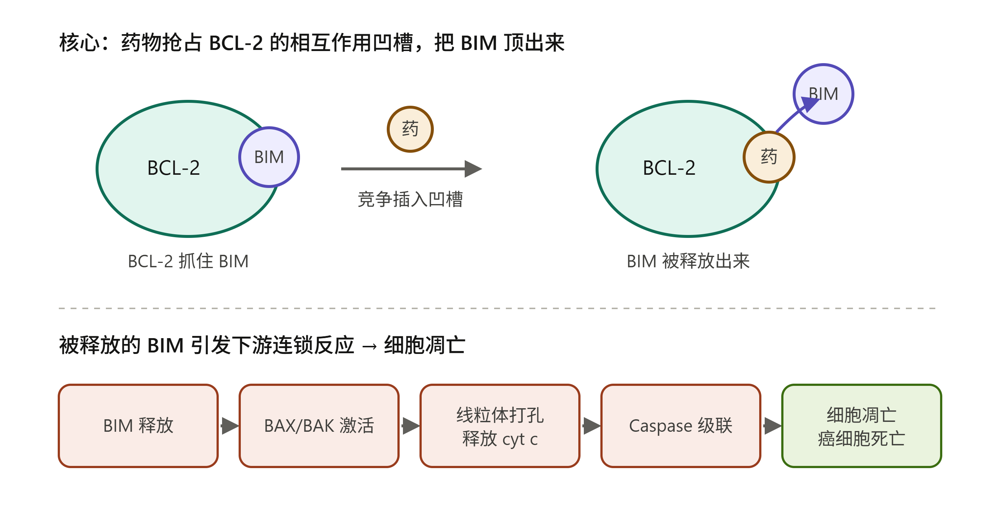

## 奥雷巴替尼 / Olverembatinib（耐立克®，HQP1351）


奥雷巴替尼（BCR-ABL）

差异化优势： 第一，广谱覆盖 T315I 及几乎所有复合突变（as­c­i­m­i­n­ib 做不到）；第二，血管毒性显著低于 po­n­a­t­i­n­ib（AS­CO 2026专家评论已明确认可这一点）；第三，在 Ph+ ALL 方向有独家的全球 III 期数据（as­c­i­m­i­n­ib 和 po­n­a­t­i­n­ib 都没有）。


利托沙克拉（APG-2575，BCL-2）：

GL­O­RA 系列四项全球 III 期尚未读出。Bcl-2抑制剂的临床开发历史上有过多次 II 期成功、III 期失败的案例。如果 GL­O­RA 任何一项失败，对公司估值的打击将是实质性的。

差异化：

5天爬坡；克服维奈克拉耐药；MDS方向布局；


中国首个获批的第三代 BCR-ABL1 抑制剂（针对 T315I 突变）。

已获批适应症：T315I 突变的慢性髓性白血病慢性期（CML-CP）、加速期（CML-AP），以及对一/二代 TKI 耐药或不耐受的 CML-CP，均已纳入国家医保（NRDL）。

拓展中：全球注册 III 期试验 POLARIS-2（二线 CML，已获 FDA 许可），以及新诊断 Ph+ 急性淋巴细胞白血病（ALL）、SDH 缺失型胃肠间质瘤（GIST）的全球 III 期。

2024 年 6 月 14 日：武田与亚盛医药签署/宣布达成奥雷巴替尼的全球独家选择权协议。市场普遍的预期窗口是 **2026 年（POLARIS-2 数据读出后）到 2027 年**之间——乐观情形下 2026 年下半年随数据落地即行权，谨慎情形下推迟到 2027 年、等监管层面更明朗后再行权。


奥雷巴替尼（耐立克®）已在中国获批上市，对应的中国关键临床已读出；目前出海主力是 POLARIS 系列 3 项全球注册 III 期。汇总如下：

| 项目                         | 适应症/人群                                 | 方案 vs 对照                                           | 主要终点                 | 开始时间                            | 主要终点数据读出（预估）                                     | 状态/监管                          |
| ---------------------------- | ------------------------------------------- | ------------------------------------------------------ | ------------------------ | ----------------------------------- | ------------------------------------------------------------ | ---------------------------------- |
| 中国关键 II 期               | T315I 突变 CML-CP / CML-AP                  | 奥雷巴替尼单药                                         | MCyR/MMR 等缓解率        | 2016–2018                           | 已读出                                                       | 支撑 2021 年中国获批，已进医保 |
| 中国关键研究                 | 对≥2 种二代 TKI 失败的 CML-CP（不限 T315I） | 奥雷巴替尼单药                                         | MMR 等                   | 2022                                | 已读出                                                       | 支撑 2024 年新增适应症进医保   |
| POLARIS-1 | 初治 Ph+ ALL                                | 奥雷巴替尼 + 低强度化疗 vs 研究者选择 TKI + 化疗       | 诱导 3 周期内 MRD 阴性率 | 2023-08-31（实际）                  | 主要完成约 2027-12（预估）；Part A 数据已于 2025 ASH 国际首发（最佳 MRD 阴性 CR >60%） | FDA/EMA 已批；进行中               |
| POLARIS-2 | 经治 CP-CML（≥2 种 TKI）                    | Part A：vs 博舒替尼（非 T315I）；Part B：单臂（T315I） | 24 周 MMR 率             | 2024-02-05（实际）                  | 主要完成约 2025-12，研究完成约 2026-02（预估）→ 读出预计 2026 | FDA 已批；进行中                   |
| POLARIS-3 | 既往治疗失败的 SDH 缺失型 GIST              | 奥雷巴替尼单药（单臂、开放）                           | ORR（客观缓解率，预计）  | 2024 下半年启动（CDE 2024-05 批准） | 公开登记日期不全，按单臂设计与入组节奏，读出预计 2027–2028 | 进行中                             |

几点说明：

- 奥雷巴替尼与利沙托克拉的关键差别：奥雷巴替尼的核心适应症（T315I CML、TKI 耐药 CML-CP）在中国已是获批+进医保的成熟产品，POLARIS 系列主要是为出海+拓展新适应症（一线 Ph+ ALL、GIST）做注册。
- POLARIS-2 是进度最快、最关键的出海催化剂：直接头对头博舒替尼，主要完成时间最早（2025 年底/2026 初），是近期最值得关注的数据读出。


亚盛医药的凋亡管线本质上就是一类**蛋白-蛋白相互作用界面抑制剂**，专业叫法是 **BH3 模拟物（BH3 mimetic）**。

核心逻辑是这样的。细胞要不要"自杀"（凋亡），由一组蛋白互相拔河决定。抗凋亡蛋白 **BCL-2** 表面有一条凹槽（叫 BH3 结合槽），它用这条槽去**抓住**促凋亡蛋白 **BIM**，把 BIM 死死按住，凋亡就被"刹住"——癌细胞因此赖着不死。这条凹槽，就是上一题说的那种"蛋白相互作用界面"。

亚盛的 lisaftoclax（APG-2575，BCL-2 抑制剂，已在中国附条件获批治疗复发难治 CLL）做的事，就是设计一个小分子去**模仿 BIM 那段插进凹槽的螺旋**，抢先插进 BCL-2 的凹槽，把真正的 BIM 顶出来。BIM 一旦自由，就去激活 BAX/BAK，在线粒体上打孔，触发凋亡。它们的另几条管线（pelcitoclax 双靶 BCL-2/BCL-xL、alrizomadlin 打 MDM2–p53 界面、IAP 拮抗剂等）都是同一思路——占住一个蛋白-蛋白界面。

亚盛的凋亡药不是去"加工"小分子的酶口袋药，而是典型的**蛋白-蛋白界面药**——用一个小分子假扮成 BIM，去抢占 BCL-2 表面那条本来用来抓 BIM 的凹槽，从而"松开刹车"、让癌细胞启动自杀程序。这也正是 PPI 成药很难、亚盛却做成了的价值所在。




先说差异：BCL-2 那条线是"**松开刹车**"（放出杀手 BIM）；MDM2–p53 这条线是"**唤醒卫兵**"。

p53 被称为"基因组的守护者"——细胞一旦 DNA 出问题，它就下令让细胞停止分裂或干脆自杀。但很多癌细胞里 p53 本身是好的，只是被另一个蛋白 **MDM2** 死死抓住：MDM2 用它表面的一个口袋咬住 p53，既挡住 p53 干活，又把它"拖去销毁（降解）"。这个 MDM2 咬 p53 的口袋，又是一处蛋白-蛋白相互作用界面。

亚盛的 alrizomadlin（APG-115，MDM2 抑制剂）就是设计小分子塞进 MDM2 的这个口袋，把 p53 放出来。p53 一旦自由就会累积、重新上岗，开启下游基因，让癌细胞要么停摆、要么凋亡。


把两条线放在一起记就清楚了：BCL-2 抑制剂是"**踢走被抓的杀手**"（放出 BIM 直接动手），MDM2 抑制剂是"**放出被关的卫兵**"（放出 p53 去指挥）。机制方向相反，但用药思路一模一样——都是用小分子去**占住一处蛋白-蛋白相互作用界面**，这正是亚盛凋亡平台的统一打法。

一个前提值得记住：MDM2 这条线只对 **p53 还是野生型（没坏）** 的肿瘤有效，因为药物是去"解放"p53，而不是"修好"它；如果 p53 本身已经突变失活，这招就不灵了。


# 奥雷巴替尼(Olverembatinib / 耐立克®)研究报告

> 一句话定位:中国首个、全球第二个第三代 BCR-ABL 抑制剂——为"无药可治"的 T315I 耐药慢粒患者补上了最后一块拼图,如今正借武田(Takeda)之手向全球前线市场发起冲击。
> 靶点·modality:BCR-ABL1(含 T315I)·口服小分子第三代 TKI | 持有方:亚盛医药(6855.HK / NASDAQ: AAPG),中国以外权益已授予武田期权 | 报告日期:2026 年 6 月 15 日

---
## Codex版本

**奥雷巴替尼速览**

截至 2026-06-15，亚盛医药的奥雷巴替尼（olverembatinib，HQP1351，商品名耐立克）已经不是单纯“中国 T315I CML 小适应症药”，而是在往全球注册和多适应症扩张走。它是口服第三代 BCR-ABL1 TKI，核心差异点是覆盖 T315I 及多种 BCR-ABL1 耐药突变，并试图在普纳替尼血管毒性和 asciminib 耐药之后找到位置。

**已获批与商业状态**

| 地区/状态  | 适应症                                                       |
| ---------- | ------------------------------------------------------------ |
| 中国已获批 | 成人 TKI 耐药 CML-CP 或 CML-AP 且 T315I 突变；成人 CML-CP 对一/二代 TKI 耐药或不耐受 |
| 中国医保   | T315I 适应症进 2022 NRDL；新适应症进 2024 NRDL，2025-01-01 生效 |
| 美国/欧洲  | 尚未获批；POLARIS-2、POLARIS-1、POLARIS-3 等注册 III 期推进中 |
| 商业化     | 中国由亚盛与信达共同商业化；2025 年奥雷巴替尼销售额约 4.353 亿人民币，同比 +81% |
| 海外权益   | 2024 年与武田签署独家选择权协议；武田支付 1 亿美元期权费，若行权可获大中华区以外权益，潜在里程碑约 12 亿美元 |

**临床证据**

| 试验/数据                                | 人群与设计                                                   | 关键结果                                                     |
| ---------------------------------------- | ------------------------------------------------------------ | ------------------------------------------------------------ |
| 中国 phase 1/2，NCT03883087/NCT03883100  | TKI 耐药 CML-CP/AP，多数 T315I；推荐剂量 40 mg 隔日一次      | CML-CP 3 年累积 MCyR 79%、CCyR 69%、MMR 56%；CML-AP 3 年累积 MCyR/CCyR 47.4%、MMR 44.7% |
| HQP1351CC203，NCT04126681                | CML-CP，对一/二代 TKI 耐药或不耐受；随机对照 BAT，n=144      | 达到主要终点 EFS，支撑 2023 年中国新适应症获批               |
| 全球 phase 1b，NCT04260022/JAMA Oncology | CML 或 Ph+ ALL，经 ≥2 个 TKI 后失败，含普纳替尼/asciminib 失败 | CP-CML 可评估患者 CCyR 61%、MMR 42%；既往普纳替尼失败者 CCyR 58%、MMR 37%；推荐 III 期剂量为非 T315I 患者 30 mg 隔日一次 |
| POLARIS-2，NCT06423911                   | 全球注册 III 期，CML-CP，奥雷巴替尼 vs bosutinib/对照，n≈285 | 正在招募；主要终点 MMR                                       |
| POLARIS-1，NCT06051409                   | 新诊断 Ph+ ALL，奥雷巴替尼+化疗 vs 研究者选择 TKI+化疗，n≈350 | 正在招募；2026 EHA 更新显示 Part 1 中诱导后 CR/CRi 94.4%、MRD 阴性 CR 63.0% |
| POLARIS-3，NCT06640361                   | SDH 缺陷 GIST，注册 III 期，单臂，n≈40                       | 正在招募；早期 phase 1b 中 SDH 缺陷 GIST ORR 23.1%、CBR 84.6%、mPFS 25.7 月 |

**安全性判断**

主要风险仍是 TKI 类常见的骨髓抑制、肌酸激酶升高、肝酶异常、血脂/代谢异常等。全球 phase 1b 中 40% 患者有 ≥3 级治疗相关 AE，常见包括 CPK 升高和血小板减少，但未见治疗相关死亡；公司和论文都强调动脉闭塞事件较少，这正是相对普纳替尼的潜在卖点。不过，是否真的有更低心血管风险，需要更长随访和 III 期头对头/大样本验证。

**竞争格局**

奥雷巴替尼最直接面对的是普纳替尼和 asciminib。普纳替尼是强效 pan-BCR-ABL 抑制剂、覆盖 T315I，但血管闭塞/心血管安全性长期限制使用。Asciminib 是 STAMP 变构抑制剂，美国 2021 年获批用于 ≥2 线 Ph+ CML-CP 及 T315I，2024 年又获 FDA 加速批准用于新诊断 CML-CP；其机制不同、早线推进很快。奥雷巴替尼的机会在于：T315I/复合突变、多线失败、普纳替尼或 asciminib 后失败，以及中国医保覆盖后的可及性。

**我的底线看法**

奥雷巴替尼已经证明了“中国 CML 耐药市场”里的临床与商业可行性，2025 年销售放量说明医保扩容有效。真正决定上限的是三件事：POLARIS-2 能否支撑欧美 CML 注册，POLARIS-1 能否在 Ph+ ALL 做出足够深的 MRD 阴性优势，以及 SDH 缺陷 GIST 的罕见瘤种数据能否从小样本信号变成注册成功。最大风险是全球竞争已很强，尤其 asciminib 早线化；另一个风险是安全性优势目前仍主要来自非头对头证据。

---

## 一、摘要(Executive Summary)

奥雷巴替尼(研发代号 HQP1351 / GZD824,商品名"耐立克")是亚盛医药自主研发的第三代 BCR-ABL 酪氨酸激酶抑制剂(TKI),2021 年 11 月在中国获批,成为中国首个、全球继 ponatinib 之后第二个能够攻克 T315I"看门人"突变的口服 CML 药物。它接的是 CML 治疗史上最后一棒:伊马替尼(一代)开创了靶向治疗、二代药(尼洛替尼/达沙替尼等)解决了多数耐药突变,但所有一二代药都败在 T315I 这道关口前,而奥雷巴替尼正是为攻克这道关口而生。

核心看点(5 条):

1. 临床刚需明确、数据扎实:在 T315I 耐药慢粒慢性期(CP-CML)患者中,3 年主要分子学反应率(MMR)约 56–59%、PFS 约 92%、OS 约 94–95%,在一个曾经"几乎无药可用"的人群中给出了可治愈级别的疾病控制。
2. 全球化背书最强:2024 年 6 月与武田签订独家选择权协议,武田预付 1 亿美元(知识产权/选择权付款)+ 7,500 万美元股权投资,后续里程碑最高约 12 亿美元——这是中国创新药"出海"中分量最重的交易之一。
3. 国内放量正当时:2025 年起所有获批适应症全部纳入国家医保(NRDL),2025 上半年耐立克销售额同比增长 93% 至人民币 2.17 亿元。
4. 适应症与治疗线前移空间大:正从"末线 T315I"向二线乃至一线 CP-CML 拓展,并延伸至 Ph+ ALL(费城染色体阳性急性淋巴细胞白血病)、SDH 缺陷型 GIST(胃肠间质瘤)等。
5. 全球注册临床推进:CP-CML 全球 III 期(POLARIS-2)已获 FDA(2024.2)与 EMA 放行;一线 Ph+ ALL 全球注册 III 期于 2025 年 12 月获 FDA 与 EMA 双双放行。

关键催化剂(未来 6–24 个月): 武田是否行权(将整体重估海外价值);POLARIS-2 等全球 III 期数据读出与中美欧上市申报进展;二线/一线 CP-CML 中国注册推进;ASCO/ASH 持续披露的联合用药与新适应症数据。

主要风险(按致命度): ① 武田弃权或推迟行权,海外故事大打折扣;② 全球前线市场被 asciminib(Scemblix)抢占心智、奥雷巴替尼差异化不足;③ 心血管/血液学安全性信号(三代 TKI 通病);④ 中国医保降价与窄适应症压制峰值;⑤ 全球 III 期失败或获批延迟。

前景判断(中性情景): 奥雷巴替尼在 T315I/末线这一核心人群属于"best-available、近乎刚需"的资产,中国市场凭医保放量可稳定成长为数亿至十亿元级单品;真正的价值弹性在海外——若武田行权并把它推到全球二线乃至一线 CP-CML,峰值有望迈向数亿美元级别。但这条增量曲线高度依赖武田的执行与全球 III 期结果,确定性不及国内基本盘。本报告不构成投资或医疗建议。

---

## 二、药物概览

### 2.1 身份卡片

| 项目        | 内容                                                         |
| ----------- | ------------------------------------------------------------ |
| 通用名      | 奥雷巴替尼(Olverembatinib)                                   |
| 研发代号    | HQP1351、GZD824                                              |
| 商品名      | 耐立克®(中国)                                                |
| 靶点        | BCR-ABL1(野生型及含 T315I 在内的多种突变型);兼抑 KIT、FLT3、FGFR1、PDGFRα |
| Modality    | 口服小分子,第三代 BCR-ABL TKI                                |
| 给药方式    | 口服,40 mg,隔日一次(QOD),随餐服用,整片吞服                   |
| 持有/权益方 | 亚盛医药(原研,保留中国大陆、港澳台及俄罗斯权益);中国以外全球权益已授予武田选择权 |
| 中国获批    | 2021.11(首发);2023.11(扩适应症)                              |

### 2.2 已获批与在研适应症一览

| 适应症                                     | 状态                         | 关键时点               |
| ------------------------------------------ | ---------------------------- | ---------------------- |
| T315I 突变的 CP/AP 期 CML(对任何 TKI 耐药) | 中国已获批                   | 2021.11 附条件批准     |
| 对一代/二代 TKI 耐药或不耐受的 CP-CML      | 中国已获批                   | 2023.11                |
| CP-CML 一线/二线(全球)                     | 全球 III 期 POLARIS-2 进行中 | FDA 2024.2、EMA 已放行 |
| 一线 Ph+ ALL(全球)                         | 全球注册 III 期              | FDA + EMA 2025.12 放行 |
| Ph+ ALL(R/R、联合化疗/venetoclax)          | 多项 II 期/研究者发起        | 持续读出               |
| SDH 缺陷型 GIST、副神经节瘤                | 探索性 II 期                 | 学术披露               |
| AML、子宫内膜癌、肾细胞癌等                | 临床前/早期探索              | —                      |

### 2.3 研发历程关键时间点

- 早期:中山大学/暨南大学团队合成 GZD824,亚盛医药引入开发为 HQP1351。
- 2021.11:中国 NMPA 附条件批准首个适应症(T315I 耐药 CML-CP/AP)。
- 2023.01:纳入 2022 版国家医保目录(限 T315I)。
- 2023.11:中国获批第二个适应症(耐药/不耐受一二代 TKI 的 CP-CML)。
- 2024.02:CP-CML 全球注册 III 期获 FDA 放行(首个全球注册临床)。
- 2024.06:与武田签订独家选择权协议;武田 7,500 万美元股权投资 + 1 亿美元 IP/选择权付款。
- 2025.01:全部获批适应症纳入国家医保。
- 2025.12:一线 Ph+ ALL 全球注册 III 期获 FDA 与 EMA 放行。
- 2026.05:ASCO 2026 披露 CML-LBP 与 Ph+ BCP-ALL 数据。

当前阶段定位:中国已上市、正放量的成熟品种;同时是全球后期临床、临近多区域注册的出海资产——两条曲线并行。

---

## 三、疾病与机制(重点章节)

### 3.1 疾病史:慢性髓性白血病(CML)与 T315I 这道关口

#### 3.1.1 CML 是什么

慢性髓性白血病是一种起源于骨髓造血干细胞的血液肿瘤。它的根源是一次"基因接错线":9 号与 22 号染色体相互易位,形成所谓的费城染色体(Ph),把 BCR 基因和 ABL1 基因拼在一起,产生 BCR-ABL1 融合基因。这个融合基因编码出一个"永远开着的"酪氨酸激酶,持续向细胞发出"不停增殖"的信号,导致骨髓里白细胞失控扩增。CML 分慢性期(CP)、加速期(AP)、急变期(BP),不治疗会逐步进展、最终急变而致命。

> 小白版:正常细胞有一套"该长就长、该停就停"的开关。CML 患者的造血干细胞里,两根本不该接到一起的电线(BCR 和 ABL1)短路焊死了,开关被死死按在"一直生产"上,白细胞像失控的流水线一样越堆越多。

CML 是 CML 一类"被靶向药改写命运"的典范疾病:在伊马替尼出现前它是致死性疾病,如今多数慢性期患者通过口服药即可获得接近常人的预期寿命。未满足需求集中在耐药、尤其是 T315I 突变人群——这恰是奥雷巴替尼的战场。

#### 3.1.2 治疗史:一部"靶向接力赛"

CML 是人类把"无差别化疗"升级为"精准靶向"的第一个里程碑病种。其治疗范式的代际接力如下:

| 代际             | 代表药物                                     | 上市年份    | 解决了什么                             | 暴露了什么新问题                            |
| ---------------- | -------------------------------------------- | ----------- | -------------------------------------- | ------------------------------------------- |
| 化疗/干扰素时代  | 白消安、羟基脲、IFN-α                        | 1950s–1990s | 控制白细胞、延缓进展                   | 不能根治,生存期有限,毒性大                  |
| 一代 TKI         | 伊马替尼(格列卫)                             | 2001        | 首个靶向 BCR-ABL,把 CML 变成可控慢病   | 部分患者耐药(激酶区点突变)                  |
| 二代 TKI         | 达沙替尼、尼洛替尼、博舒替尼、(中国)氟马替尼 | 2006–       | 克服多数伊马替尼耐药突变、起效更深更快 | 几乎全部败给 T315I"看门人"突变              |
| 三代 TKI         | 普纳替尼(ponatinib)、奥雷巴替尼              | 2012 / 2021 | 首次攻克 T315I;广谱覆盖突变            | 心血管/动脉闭塞毒性(尤其 ponatinib)         |
| STAMP 变构抑制剂 | asciminib(Scemblix)                          | 2021        | 全新结合位点、安全性更好,亦覆盖 T315I  | 单药对高度耐药/T315I 深度反应弱于 ponatinib |

这条接力链的核心逻辑是:每一代药都在补上一代的短板。伊马替尼把 CML 从绝症变成慢病,二代药解决了大部分耐药,但所有 ATP 竞争性一二代药都卡在 T315I 上——这个突变把激酶口袋的"门"换了把锁,药物钥匙插不进去。

#### 3.1.3 T315I:为什么它是"最难啃的骨头"

T315I 是 BCR-ABL 激酶区第 315 位的苏氨酸(T)被异亮氨酸(I)取代。这个位点是 TKI 结合的"看门人(gatekeeper)",突变后既改变了药物结合口袋的形状、又去掉了一个关键的氢键,导致伊马替尼及全部二代 TKI 集体失效。

文献显示,T315I 约占获得性耐药突变的 15–20%;在一代 TKI 耐药患者中约 12%、在二代 TKI 耐药患者中升至约 27–34%。携带 T315I 的患者预后差、易进展为加速/急变期——在三代药出现前,这类患者基本"无药可用",只能寄望于异基因造血干细胞移植。

#### 3.1.4 前人"武器谱"与局限

| 药物/疗法            | 上市年份 | 机制                         | 当时疗效                                                     | 局限/为何不够好                                        |
| -------------------- | -------- | ---------------------------- | ------------------------------------------------------------ | ------------------------------------------------------ |
| 伊马替尼             | 2001     | 一代 ATP 竞争性 BCR-ABL 抑制 | 把 CML 10 年生存率推到 80%+                                  | 对 T315I 及部分突变无效                                |
| 达沙替尼/尼洛替尼    | 2006–07  | 二代,更强更广谱              | 更深更快的分子学反应                                         | 对 T315I 无效                                          |
| 氟马替尼(中国)       | 2019     | 二代(国产)                   | 一线优于伊马替尼                                             | 同样对 T315I 无效                                      |
| 普纳替尼(ponatinib)  | 2012     | 三代,覆盖 T315I              | T315I 人群 MCyR ~70%、12 个月 MMR ~40%;Ph+ALL 联合化疗 CR 80–90% | 动脉闭塞/心血管毒性严重,曾一度被 FDA 暂停              |
| Asciminib(Scemblix)  | 2021     | STAMP 变构(肉豆蔻酰口袋)     | 安全性优、亦覆盖 T315I                                       | 单药对 T315I/高度耐药深度反应弱于 ponatinib,需更高剂量 |
| 异基因造血干细胞移植 | —        | 替换造血系统                 | 唯一根治手段                                                 | 高风险、供者依赖、并发症多                             |

这正是奥雷巴替尼的机会窗口:在 T315I 这个人群里,既要像 ponatinib 一样有效,又最好规避 ponatinib 那样致命的心血管毒性——这就是它在疾病史中要写下的一笔。

#### 3.1.5 奥雷巴替尼在历史中的位置

奥雷巴替尼接的是"三代 TKI"这一棒,定位是中国本土的 T315I 解决方案,并力图成为全球范围内 ponatinib 之外的另一个/更优选择。它属于渐进式但临床价值很高的改良(me-better,局部 best-in-class 叙事):机制路线(ATP 竞争性、覆盖 T315I)已被 ponatinib 验证,所以它不是 first-in-class 的范式突破;但它在一个"几乎无药可用"的中国市场是首发且唯一,且在安全性管理与给药便利(隔日口服)上讲出了差异化。

用 A3 的失败教训反向拷问:ponatinib 的最大软肋是动脉闭塞事件(AOE),奥雷巴替尼能否真正规避而非"踩同一个雷",是其 best-in-class 叙事成立与否的试金石——它确有心血管/血液学不良事件(见第四章),需在全球头对头/大样本数据中证明安全边际。

> 一句话收口:在 CML 治疗史上,奥雷巴替尼想做的是"中国版、并力争更安全的 T315I 终结者";如果全球 III 期成功,它将是 ponatinib 之外少数能在全球范围解决 T315I 耐药的口服药。

#### 3.1.6 Ph+ ALL:第二战场

费城染色体阳性急性淋巴细胞白血病(Ph+ ALL)与 CML 共享 BCR-ABL 病根,但它是急性、凶险得多的白血病。TKI 联合化疗显著改善了预后,但 T315I 等耐药突变导致的复发仍是死结。奥雷巴替尼联合化疗/venetoclax 在新诊断及 R/R Ph+ ALL 中显示出高缓解率(详见第四章),这是其全球注册的第二条主线。

### 3.2 药物机制

#### 3.2.1 Modality 与靶点

奥雷巴替尼是口服小分子、第三代 ATP 竞争性 BCR-ABL1 抑制剂。它对野生型及包括 T315I 在内的多种 BCR-ABL1 突变型都有强效抑制活性,并对复合突变(compound mutation,目前几乎无药可用)显示活性。除 BCR-ABL 外,它还抑制 KIT、FLT3、FGFR1、PDGFRα 等激酶——这为其在 GIST(KIT 驱动)等实体瘤的拓展提供了机制基础。

#### 3.2.2 作用机制(MoA)与药代

奥雷巴替尼结合于 BCR-ABL 激酶的 ATP 口袋,阻断融合蛋白的酪氨酸激酶活性,从而关闭下游 STAT5、AKT、ERK 等"增殖/存活"信号通路,诱导白血病细胞凋亡。其分子设计能容纳 T315I 突变导致的口袋形状改变,因而钥匙仍能插进"换了锁的门"。给药上采用隔日一次(40 mg QOD)口服,口服生物利用度良好、半衰期合适,临床显示无明显种族药代差异。

#### 3.2.3 机制层面的差异化

- vs ponatinib(同为三代 ATP 竞争性):同属覆盖 T315I 的广谱抑制剂;奥雷巴替尼主打隔日给药与可管理的安全性,意在规避 ponatinib 标志性的动脉闭塞毒性,但这需大样本/头对头证据坐实。
- vs asciminib(STAMP 变构):asciminib 结合肉豆蔻酰口袋(全新位点)、安全性占优,但单药对 T315I/高度耐药的深度反应不及 ATP 竞争性三代药;奥雷巴替尼在最难治人群可能更有效。
- 定性:fast-follow / me-better(机制已验证,执行与差异化是关键),而非全新机制——成功概率假设应据此校准。

#### 3.2.4 "小白版"通俗解释(必含)

> CML 的病根,是细胞里一个"卡死在开机状态"的开关(BCR-ABL 激酶),逼着白细胞没完没了地生产。一二代靶向药本是关掉这个开关的"钥匙",但 T315I 突变相当于给开关换了把锁,旧钥匙插不进去了。奥雷巴替尼是专门为这把新锁配的钥匙——它能插进去、把开关重新关掉,坏细胞失去"一直生产"的指令后就会自我凋亡。它每两天吃一片,目标是既像普纳替尼一样能开这把难开的锁,又尽量不像普纳替尼那样误伤血管。

---

## 四、临床数据

### 4.1 核心注册临床总览

奥雷巴替尼的中国注册基于在 T315I 耐药 CML 中开展的 I 期(NCT03883100 等)与两项关键 II 期(NCT03883087 / NCT03883100),以及随后的二线 CP-CML、Ph+ ALL 研究。海外则有非中国人群 I 期(证明无种族药代差异)与正在推进的全球注册 III 期。

| 适应症/人群                 | 期别                    | 设计         | 关键终点              | 状态                 |
| --------------------------- | ----------------------- | ------------ | --------------------- | -------------------- |
| T315I 耐药 CP/AP-CML        | I/II 期(关键注册)       | 单臂、多中心 | MCyR/CCyR/MMR、PFS/OS | 已支持中国获批       |
| 二线 CP-CML(无 T315I)       | II 期(ChiCTR2200061655) | 单臂、多中心 | CCyR/MMR              | 进行中,支持前线拓展  |
| CP-CML(一/二线)             | III 期 POLARIS-2        | 全球随机对照 | 分子学反应            | FDA/EMA 已放行       |
| 一线 Ph+ ALL                | III 期(全球注册)        | 随机对照     | —                     | FDA/EMA 2025.12 放行 |
| R/R Ph+ ALL、新诊断 Ph+ ALL | II 期/研究者发起        | 单臂/联合    | CR/CMR/EFS/OS         | 多项读出             |
| SDH 缺陷型 GIST/副神经节瘤  | II 期探索               | 单臂         | ORR/CBR/PFS           | 学术披露             |

### 4.2 关键疗效数据

T315I 耐药 CP-CML(核心人群,3 年随访,40 mg 有效剂量组):

| 指标                     | CP-CML  | AP-CML  |
| ------------------------ | ------- | ------- |
| 完全血液学缓解(CHR)      | ~100%   | ~73%    |
| 主要细胞遗传学反应(MCyR) | ~79–80% | ~40–52% |
| 完全细胞遗传学反应(CCyR) | ~69–71% | ~40–52% |
| 主要分子学反应(MMR)      | ~56–59% | ~40–48% |
| MR4.0                    | ~44–51% | ~37–39% |
| MR4.5                    | ~39–51% | ~32–34% |
| 3 年 PFS                 | ~92%    | ~50–60% |
| 3 年 OS                  | ~94–95% | ~69–70% |

> 解读:在一个曾经"几乎无药可用、易快速进展"的 T315I 人群中,CP 期能让约六成患者达到 MMR、九成以上无进展,是有临床意义的疗效。AP 期反应明显更弱,提示越早线、越浅疾病负担,获益越大——这正是亚盛把它向二线/一线前移的逻辑依据。

二线 CP-CML(无 T315I,ASH 2025,47 例): CCyR 71.8%、MMR 43.6%;其中一线二代 TKI 失败者 CCyR 76.7%、MMR 43.3%,且反应随用药时间加深——支持其作为更早治疗线的潜力。

Ph+ ALL(联合方案,代表性数据):

- 奥雷巴替尼 + venetoclax + 减低强度化疗一线治疗新诊断 Ph+ ALL(79 例):3 个月 CMR 达 62.0%,中位随访 12 个月时 1 年 OS / EFS 为 93.1% / 89.1%,且无诱导期死亡——在不依赖强化疗/免疫治疗下取得,对不耐受强治疗者意义大。
- 多项 R/R Ph+ ALL 联合研究(VP、blinatumomab 等)显示高 CR/CMR 率;对 ponatinib/asciminib 耐药者亦观察到反应。

SDH 缺陷型 GIST(26 例,目前几乎无标准靶向药): 最佳反应 PR 6/26、SD>4 周期 18 例,临床获益率(CBR)>90%,中位 PFS 25.7 个月;副神经节瘤 6 例 CBR 80%。这是一个小众但"零竞争"的差异化拓展方向。

### 4.3 安全性与耐受性

奥雷巴替尼的不良事件谱呈典型三代 TKI 特征,需重点管理:

| 类别     | 常见(任意级)                                    | ≥3 级关注点                                 |
| -------- | ----------------------------------------------- | ------------------------------------------- |
| 血液学   | 血小板减少 ~76%、贫血 ~55%、白细胞减少 ~34%     | 血小板减少 ~51%、贫血 ~23%、白细胞减少 ~21% |
| 非血液学 | 皮肤色素沉着 ~84%、高甘油三酯 ~58%、蛋白尿 ~51% | 高甘油三酯 ~7%、蛋白尿 ~4%                  |
| 心血管   | 高血压、心律失常等                              | 个案急性心梗、冠心病、脑梗、充血性心衰      |

血小板减少是最突出的剂量限制性毒性;皮肤色素沉着虽普遍但多为非重度。心血管事件是三代 TKI 的"达摩克利斯之剑":文献中报告了个别急性心梗、冠心病、脑梗、心衰等严重事件。研究者认为多数心血管事件可通过间歇停药缓解,且总体频率低于 ponatinib——但这一"更安全"的论断仍需全球大样本/头对头数据确证,是其差异化叙事最关键的待验证点。患者报告结局(QLQ-C30)显示治疗期间总体健康、躯体与情绪功能改善,支持长期耐受性。

### 4.4 数据可信度评估

- 优势:核心人群随访已达 3 年以上、终点为公认硬指标(分子学反应、PFS/OS);非中国人群 I 期证明无种族药代差异,为出海铺路。
- 局限:中国注册数据以单臂研究为主(T315I 人群伦理上难设对照),缺乏头对头随机证据;二线/前线数据样本量仍小(数十例)、为单臂;实体瘤数据为探索性早期。
- 这意味着:疗效的"绝对水平"可信,但"优于 ponatinib/asciminib"的相对结论目前主要靠间接比较——POLARIS-2 等全球随机 III 期是把这些叙事坐实的关键。

### 4.5 催化剂时间表

| 时间      | 事件                                       | 意义                         |
| --------- | ------------------------------------------ | ---------------------------- |
| 2026 全年 | ASCO/ASH 持续披露(CML-LBP、Ph+ ALL 联合等) | 维持学术能见度、支撑前线拓展 |
| 2026–2027 | 武田是否行使全球独家许可选择权             | 海外价值重估的最大单一事件   |
| 2026–2028 | POLARIS-2 等全球 III 期数据读出            | 决定全球获批与"出海"成败     |
| 持续      | 中国二线/一线 CP-CML 注册推进              | 打开国内更大治疗线人群       |

### 4.6 获批概率判断

中国已上市适应症无获批风险,放量是核心变量。全球注册成败的关键在于:① 武田行权与执行;② 全球 III 期能否复现中国疗效并证明可接受的安全边际。鉴于机制路线已被 ponatinib 验证(科学风险低),主要是执行与竞争风险——中性看,海外至少有相当概率在 T315I/后线获批,而能否打入二线/一线大市场则不确定性更高。

---

## 五、竞争格局

### 5.1 竞争梯队

CML/T315I 与 Ph+ ALL 赛道的主要玩家:

| 药物                       | 机制/代际       | T315I 覆盖     | 关键定位                           | 进度/区域              |
| -------------------------- | --------------- | -------------- | ---------------------------------- | ---------------------- |
| 奥雷巴替尼                 | 三代 ATP 竞争性 | 是             | 中国首发唯一 T315I;隔日口服        | 中国已上市,全球 III 期 |
| 普纳替尼(Iclusig,武田)     | 三代 ATP 竞争性 | 是             | 全球 T315I 标准选择,疗效强         | 全球已上市             |
| Asciminib(Scemblix,诺华)   | STAMP 变构      | 是(需更高剂量) | 安全性占优,主打耐药/后线及前线拓展 | 全球已上市,放量快      |
| 氟马替尼(豪森)             | 二代(国产)      | 否             | 中国一线                           | 中国已上市             |
| 达沙替尼/尼洛替尼/博舒替尼 | 二代            | 否             | 一/二线主力                        | 全球已上市(多已仿制)   |
| TGRX-678 等国产三代        | 三代            | 是             | 中国在研追赶者                     | 临床期                 |

有意思的张力:奥雷巴替尼的海外"接盘方"武田,恰是其最直接的全球竞品 ponatinib(Iclusig)的拥有者。武田取得选择权后,理论上可在全球用奥雷巴替尼承接/延续 ponatinib 的 T315I 市场,完成产品线接力——这既是其出海最强背书,也意味着两者在武田内部存在定位协调问题。

### 5.2 上市次序 vs 疗效优势

在中国,奥雷巴替尼是 T315I 适应症的先发且唯一,先发优势 + 医保独占带来稳固基本盘。在全球,它是后来者:ponatinib、asciminib 早已占据 T315I/后线心智,asciminib 凭安全性正快速放量。因此奥雷巴替尼海外要赢,靠的不是"上市次序",而是要用全球 III 期证明"疗效不输 ponatinib、安全性更好"的差异化,或借武田的全球商业化能力。

### 5.3 赛道拥挤度

CML/T315I 属于有明确差异化的红海:总盘子不大(罕见耐药人群),但已有 ponatinib、asciminib 两个强势全球玩家。这决定了奥雷巴替尼海外峰值的天花板不会无限高,差异化定位与适应症/治疗线前移是打开空间的关键。

### 5.4 差异化与护城河

- 护城河:中国 T315I 先发独占 + 医保 + 武田全球背书;隔日口服的便利性;复合突变活性;KIT/FLT3 等多激酶带来的实体瘤拓展期权。
- 软肋:机制非首创、海外面对两强夹击;"更安全"尚待头对头确证;核心人群偏小众。

### 5.5 同类失败史与启示

| 案例                            | 问题                                                    | 启示                                                        |
| ------------------------------- | ------------------------------------------------------- | ----------------------------------------------------------- |
| Ponatinib 早期                  | 动脉闭塞毒性致 FDA 一度暂停销售、加黑框警告并改剂量策略 | 心血管安全性是三代 TKI 的生死线——奥雷巴替尼必须证明安全边际 |
| Bosutinib 一线(BELA)            | 主要终点未达                                            | 前线市场已被强效二代占据,前移须拿出过硬随机数据             |
| Asciminib 在深度耐药/T315I 单药 | 反应弱于 ATP 竞争性三代药、需更高剂量                   | 机制各有短板,留给奥雷巴替尼在最难治人群的空间               |

### 5.6 专利与生命周期管理

作为 2021 年才上市的新分子,奥雷巴替尼专利周期较长,近期无专利悬崖压力。生命周期管理路径清晰:适应症扩展(Ph+ ALL、GIST 等)+ 治疗线前移(末线→二线→一线)+ 地域扩张(借武田出海)+ 联合疗法(venetoclax 等)。

---

## 六、市场与商业

### 6.1 患病人数漏斗

| 层级                      | 估算                                       | 说明                                         |
| ------------------------- | ------------------------------------------ | -------------------------------------------- |
| 中国 CML 年发病率         | ~0.39–0.55/10 万                           | 中国患者中位发病 45–50 岁,较西方(~67 岁)年轻 |
| 中国 CML 现患人数         | >10 万                                     | 因生存期长而持续累积                         |
| 一/二线 TKI 耐药或不耐受  | 数万                                       | 奥雷巴替尼二线适应症对应人群                 |
| 携带 T315I 突变           | 占耐药突变约 15–20%(二代耐药者升至 27–34%) | 奥雷巴替尼首发核心人群,人数有限但刚需        |
| Ph+ ALL / SDH 缺陷型 GIST | 额外小众增量                               | 拓展适应症                                   |

关键张力:核心 T315I 人群"刚需但小众",决定了仅靠这个人群天花板有限;真正打开 TAM 要靠向二线/一线前移(对应数万耐药/不耐受患者)与海外市场。

### 6.2 市场规模(TAM)

- 中国:T315I/末线为数亿元级别小池;若成功前移至二线 CP-CML,可及人群放大数倍,叠加医保可及性,国内 TAM 有望升至十亿元级别。
- 全球:CML 全球市场规模庞大(以 imatinib/dasatinib/nilotinib/ponatinib/asciminib 计),但 T315I/后线只是其中一块;奥雷巴替尼海外 TAM 取决于能否从后线打入二线/一线。

### 6.3 定价与支付环境

- 中国:已全面纳入国家医保(2023 年起,2025 年起覆盖全部获批适应症),以"以价换量"提升可及性。医保谈判降价是常态,价格端承压、靠放量驱动收入。
- 海外:若武田主导商业化,定价将对标 ponatinib/asciminib 等高价孤儿药/专科肿瘤药体系,单价远高于中国——这是海外价值弹性的来源。

### 6.4 销售情况与峰值情景

事实:2025 上半年耐立克销售额同比 +93% 至人民币 2.17 亿元,增长主要由医保覆盖扩大驱动;卖方机构对公司 2025–2027 年总收入的预测区间较大(且含一次性 IP 收益扰动)。

销售峰值情景(判断性,含假设,非投资建议):

| 情景 | 关键假设                                       | 中国年峰值(量级) | 海外                    |
| ---- | ---------------------------------------------- | ---------------- | ----------------------- |
| 乐观 | 成功前移二线/一线;武田行权并把它推向全球二线   | 国内十亿元级     | 武田主导,峰值数亿美元级 |
| 中性 | 稳守 T315I + 部分二线;武田行权但聚焦后线/T315I | 国内数亿至十亿元 | 后线为主,峰值中等       |
| 悲观 | 局限 T315I 末线;武田弃权或全球 III 期不及预期  | 国内数亿元       | 海外故事基本落空        |

### 6.5 商业化挑战

国内核心人群小众、医保降价压制单价、需靠诊断渗透(T315I 检测普及)与治疗线前移做大;海外则完全依赖武田的行权决定与执行力,亚盛对海外节奏掌控力弱。

---

## 七、结论与风险提示

### 7.1 综合判断

奥雷巴替尼是一款临床价值确凿、商业前景两段式的资产:在中国,它是 T315I 耐药 CML 的先发独占、近乎刚需的成熟品种,凭医保全覆盖进入稳定放量期,构成确定性较高的基本盘;在全球,它是中国创新药出海的标杆资产——武田的选择权交易(预付 1 亿美元 IP/选择权付款 + 7,500 万美元股权 + 最高约 12 亿美元里程碑)给了它最强背书,POLARIS-2 等全球 III 期与一线 Ph+ ALL 注册临床是把这个故事坐实的关键。一句话收口:国内看放量与前移、海外看武田与 III 期——价值弹性在后者,确定性在前者。

### 7.2 核心催化剂

武田行权决定(海外重估最大单一事件)> 全球 III 期数据读出与多区域申报 > 中国二线/一线注册推进 > 持续的适应症/联合数据披露。

### 7.3 风险清单(按致命度排序)

1. 武田弃权/推迟行权 —— 海外价值故事大幅缩水。
2. 全球 III 期失败或获批延迟 —— 出海与前移逻辑双双受挫。
3. 安全性信号(心血管/血液学) —— 三代 TKI 通病,"更安全"叙事若被头对头数据证伪则护城河塌陷。
4. 海外竞争(asciminib 心智 + ponatinib 同门) —— 差异化不足则难抢份额。
5. 中国医保降价 + 核心人群窄 —— 压制国内峰值。

### 7.4 空头视角(证伪条件)

若你想看空这款药,核心论点是:它机制非首创(踩在 ponatinib 验证过的路线上),核心 T315I 人群小众,海外完全寄希望于武田;一旦武田弃权、或全球 III 期未能证明对 asciminib/ponatinib 的差异化,它就退化为"一个只在中国卖的、受医保价格压制的小众单品"。反向的多头反驳则是:中国基本盘已被医保锁定、在放量;武田已用真金白银(含股权)投票;前线拓展数据持续向好。两种情形的分水岭,就是武田行权 + 全球 III 期结果这两个节点。

### 7.5 免责声明

本报告基于截至 2026 年 6 月的公开信息与特定假设撰写,其中销售峰值、获批概率等为判断性内容并含主观假设,可能随数据更新而变化。本报告不构成任何投资建议或医疗/用药建议,具体投资与诊疗决策请咨询专业人士。


## 利沙托克拉 / Lisaftoclax（APG-2575）

中国首个递交 NDA 的国产 Bcl-2 选择性抑制剂，通过恢复癌细胞凋亡发挥作用。

已在中国获批：用于既往接受过至少一种系统治疗（含 BTK 抑制剂）的成人慢性淋巴细胞白血病/小淋巴细胞淋巴瘤（CLL/SLL）。
2025 年首次进入 CSCO 淋巴瘤指南推荐；正在全球开展与 BTK 抑制剂联用的 III 期，拓展更多血液瘤及实体瘤适应症。

两者联用在 AML、T-ALL 临床前模型中显示出显著协同效应。此外管线还包括 MDM2-p53 抑制剂 APG-115（alrizomadlin）等早期资产，但商业化与核心价值目前主要集中在上述两款。


已补充时间列。注意带"预估"的为 ClinicalTrials.gov 登记的预计完成时间，临床试验常会顺延，实际读出可能晚于登记值。

| 项目    | 适应症/人群                        | 方案 vs 对照                          | 主要终点                 | 开始时间                                            | 主要终点数据读出（预估）                                     | 状态/监管        |
| ------- | ---------------------------------- | ------------------------------------- | ------------------------ | --------------------------------------------------- | ------------------------------------------------------------ | ---------------- |
| GLORA   | 既往经治 CLL/SLL（约 440 例，1:1） | 利沙托克拉 + BTKi vs BTKi 单药        | PFS（无进展生存）        | 2023-10-23（实际）                                  | 登记主要完成约 2025 年末；考虑 PFS 终点与入组节奏，实际读出更可能在 2026–2027 | FDA 已批；进行中 |
| GLORA-2 | 初治 CLL/SLL                       | 利沙托克拉 + 阿可替尼 vs 免疫化疗     | PFS                      | 2024-04-07（实际）                                  | 约 2027 年 8 月（预估）                                  | 进行中           |
| GLORA-3 | 新诊断、老年/不适合强化疗 AML      | 利沙托克拉 + 阿扎胞苷 vs 安慰剂 + AZA | OS / CR 类终点           | 2024-06-11（实际）                                  | 约 2028 年 5 月（预估）                                  | 进行中           |
| GLORA-4 | 新诊断中高危 MDS（HR-MDS）         | 利沙托克拉 + 阿扎胞苷 vs 安慰剂 + AZA | 主要疗效终点（如 CR/OS） | 2025 年下半年启动（FDA/EMA 2025-08 获批、CDE 已批） | 约 2029 年（登记预计完成 2029-12）                       | 进行中           |

补充说明：

- GLORA（无后缀）是进度最快、最关键的一项，主要终点为 PFS；登记的主要完成时间偏早，但鉴于是事件驱动（PFS）终点，业内普遍预期实际数据读出落在 2026–2027 年。
- GLORA-2 在 ClinicalTrials.gov 上对应"利沙托克拉+阿可替尼 vs 免疫化疗"的初治 CLL/SLL 研究（NCT06319456）。
- GLORA-3 / GLORA-4 都是与阿扎胞苷联用、安慰剂对照的双盲设计，分别打 AML 和 HR-MDS 一线，读出最晚（2028–2029）。


两款都已在中国上市，但所处阶段差别很大。

奥雷巴替尼（耐立克®）——已成熟商业化
- 上市：2021 年获 NMPA 批准，是中国首个三代 BCR-ABL 抑制剂。
- 销售：已有可观且高速增长的真实销售。2025 年上半年销售收入约 人民币 2.17 亿元，同比增长 93%；全国准入的 DTP 药房+医院达 782 家（同比+17%），准入医院 201→295 家。
- 医保：已纳入国家医保（NRDL）。自 2025 年 1 月起所有已获批适应症全部进医保，覆盖 T315I 突变的 CML 慢性期/加速期，以及对一/二代 TKI 耐药或不耐受的 CML-CP。这也是销售大涨的主要驱动力。

利沙托克拉（利生妥®）——刚上市、放量初期
- 上市：2025 年 7 月 10 日获 NMPA 附条件批准，是中国首个、全球第二个上市的 Bcl-2 抑制剂。适应症为既往接受过至少一种系统治疗（含 BTK 抑制剂）的成人 CLL/SLL。
- 销售：刚获批不久（距今约一年），处于商业化最早期，目前公开披露的销售贡献还很小，尚未形成规模化收入。
- 医保：目前还未纳入国家医保。由于 2025 年 7 月才获批，赶不上当年医保谈判节点，后续要看能否在新一轮国家医保谈判中纳入——这将是它放量的关键催化剂。

一句话：奥雷巴替尼是已进医保、销售高速增长的"现金牛"；利沙托克拉是刚上市、尚未进医保、还在放量起步阶段的"第二增长曲线"，进医保前销售规模有限。


# 利沙托克拉(Lisaftoclax / APG-2575)研究报告

> **一句话定位**:全球第二个、中国第一个上市的 Bcl-2 抑制剂——挑战艾伯维 venetoclax 近 26 亿美元年销大单品的"中国挑战者",最大卖点是用"每日快速爬坡、几乎不发生肿瘤溶解综合征"解决了同类老大最痛的安全性与用药负担问题。
> **靶点·modality**:Bcl-2(抗凋亡蛋白)·口服小分子选择性抑制剂 
>
> **持有方**:亚盛医药(6855.HK / NASDAQ: AAPG),全球权益自持 
>
> **报告日期**:2026 年 6 月 15 日

---

## Codex版

**利沙托克拉研究摘要**

截至 2026-06-15，利沙托克拉（lisaftoclax，APG-2575，商品名利生妥）是亚盛医药自主研发的口服选择性 BCL-2 抑制剂。它已在中国获批上市，用于既往至少接受过一种系统治疗且包含 BTK 抑制剂的成人 CLL/SLL 患者，是亚盛继奥雷巴替尼后的第二个商业化新药。

**核心判断**

利沙托克拉的价值点不是“全新靶点”，而是试图在 venetoclax 已验证的 BCL-2 赛道里，用更快爬坡、较可控 TLS 风险、BTKi 后失败人群和中国首个 BCL-2 抑制剂身份建立位置。它在中国 CLL/SLL 已完成从研发到商业化的闭环；真正决定上限的是 4 项全球 III 期能否把它推向一线 CLL/SLL、BTKi 后 CLL/SLL、老年/不适合强诱导 AML 和高危 MDS。

| 维度         | 状态                                                         |
| ------------ | ------------------------------------------------------------ |
| 靶点/机制    | 选择性抑制 BCL-2，解除肿瘤细胞抗凋亡机制                     |
| 剂型         | 口服片剂，采用快速递增剂量策略，文献称 5 日爬坡、第 6 日达目标剂量 |
| 中国获批     | 2025-07-10，NMPA 附条件批准                                  |
| 已获批适应症 | 经治成人 CLL/SLL，既往治疗至少包含 BTK 抑制剂                |
| 海外状态     | 美国尚未获批；多项全球注册 III 期进行中                      |
| 商业化       | 2025 年 7 月底开始中国销售；2025 年 8-12 月销售约 7,060 万人民币/1,010 万美元 |
| 医保         | 截至我查到的公开资料，尚未确认进入中国 NRDL；公司称正推进医保准入 |

**关键临床证据**

| 研究                       | 人群/设计                                                    | 结果摘要                                                     |
| -------------------------- | ------------------------------------------------------------ | ------------------------------------------------------------ |
| NCT05147467 / APG2575CC201 | 中国注册 II 期，单药，R/R CLL/SLL，主要终点 ORR              | 77 例入组，72 例可评估；IRC 确认 ORR 62.5%，mPFS 23.89 个月；外周血 MRD 阴性 21.8%；未见 TLS 或治疗相关死亡 |
| NCT03913949                | 中国 phase 1，R/R CLL/SLL 和 NHL                             | CLL/SLL ORR 71.4%、CR 28.6%；未达 MTD，未观察到 TLS          |
| NCT04215809                | phase 1b/2，单药或联合 rituximab/acalabrutinib               | ORR：单药 67.4%，联合 rituximab 84.6%，联合 acalabrutinib 97.7%；176 例中 TLS 2.8%，无治疗相关停药或死亡 |
| NCT06104566 / GLORA        | 全球 III 期，经治 CLL/SLL，lisaftoclax+BTKi vs BTKi          | 招募中，约 400 例，主要终点 PFS                              |
| NCT06319456 / GLORA-2      | 初治 CLL/SLL，lisaftoclax+acalabrutinib vs 免疫化疗          | 招募中，约 344 例，主要终点 PFS                              |
| NCT06389292 / GLORA-3      | 初治老年或不适合强诱导 AML，lisaftoclax+azacitidine vs placebo+azacitidine | 招募中，约 486 例，主要终点 OS                               |
| NCT06641414 / GLORA-4      | 初治高危 MDS，lisaftoclax+azacitidine vs placebo+azacitidine | 招募中，约 490 例，主要终点 OS；公司称 FDA/EMA/CDE 均已放行  |

**安全性看法**

利沙托克拉最想打的差异化标签是“更方便、更低 TLS 管理负担”。注册 II 期和早期中国 phase 1 中未报告 TLS，这是强信号；但 2025 年 Med 发表的 176 例 CLL 组合研究中仍有 5 例 TLS，所以不能把它理解为“无 TLS 风险”。主要 ≥3 级毒性仍是血液学毒性：中性粒细胞减少、血小板减少、贫血等。

**竞争格局**

最大对手是 AbbVie/Roche 的 venetoclax。**Venetoclax** 已在 CLL/SLL 和 AML 建立全球标准地位，2025 年全球销售约 27.92 亿美元，且 2026 年 2 月 FDA 又批准 acalabrutinib+venetoclax 用于 CLL/SLL，强化了一线固定疗程口服组合壁垒。另一个新竞争者是 BeOne/百济系 **sonrotoclax**，2026 年 5 月已获 FDA 加速批准用于 R/R MCL，并在 CLL 等领域推进。

利沙托克拉的机会主要在中国本土商业化、BTKi 后 CLL/SLL、固定疗程组合，以及 AML/MDS 扩张。风险是：CLL/SLL 中国患者基数低于欧美，venetoclax 证据和医生熟悉度很强，sonrotoclax 也在快速追赶；如果 III 期不能显示明确疗效或安全/便利性优势，海外商业上限会受限。

**底线**

利沙托克拉是亚盛从“单产品奥雷巴替尼”走向“双商业化产品+多注册 III 期平台”的关键资产。短期看，中国 CLL/SLL 放量和医保准入是商业催化；中期看 GLORA/GLORA-2 决定 CLL/SLL 全球竞争力；长期看 GLORA-3/4 若在 AML/MDS 做出 OS 优势，价值弹性会明显提高。当前证据支持“有潜力的国产第二代 BCL-2 抑制剂”，但还不足以证明全球 best-in-class。


---

## 一、摘要(Executive Summary)

利沙托克拉(研发代号 APG-2575)是亚盛医药自主研发的口服选择性 **Bcl-2 抑制剂**,2025 年 7 月 10 日获中国 NMPA 附条件批准,用于既往接受过至少一种系统治疗(含 BTK 抑制剂)的成人 CLL/SLL(慢性淋巴细胞白血病/小淋巴细胞淋巴瘤)患者。它是**全球继 venetoclax(维奈克拉)之后第二个获批的 Bcl-2 抑制剂、也是中国首个**。

在 CLL 治疗史上,Bcl-2 抑制剂的意义是把"让癌细胞重新学会自杀(凋亡)"做成了一个可口服、可达到深度缓解甚至无可测量残留病(uMRD)、有望"固定疗程后停药"的疗法。venetoclax 开创了这条路,但留下两个痛点:**致命性肿瘤溶解综合征(TLS)风险**要求长达 5 周的缓慢爬坡剂量,以及随之而来的复杂用药管理。利沙托克拉的核心差异化正在于此——半衰期短、可**4–6 天每日快速爬坡**,且在迄今临床中**未观察到 TLS**。

**核心看点(5 条):**

1. **解决同类老大的核心痛点**:每日快速爬坡 + 迄今"零 TLS",显著降低用药负担与安全风险,是清晰的 me-better 差异化。
2. **疗效在最难治人群站得住**:关键注册 II 期(APG2575CC201,77 例 BTKi 难治 R/R CLL/SLL)ORR 62.5%、中位 PFS 23.89 个月、无 TLS;在 venetoclax 经治人群单药 ORR 也达 85.7%(12/14)。
3. **全球化布局罕见地激进**:4 项全球注册 III 期(GLORA 系列),其中一线 CLL/SLL(GLORA-2)、高危 MDS(GLORA-4,联合阿扎胞苷)已获 FDA + EMA 放行——是全球唯一在高危 MDS 开展注册 III 期的 Bcl-2 抑制剂。
4. **适应症与联合潜力宽**:CLL/SLL 之外延伸至高危 MDS、AML、多发性骨髓瘤、Ph+ ALL(与自家奥雷巴替尼联用)等,Bcl-2 是血液瘤"平台型"靶点。
5. **对标的是一个大市场**:venetoclax 2024 年全球净销售约 25.8 亿美元——利沙托克拉对标的是一个已被验证的数十亿美元级赛道。

**关键催化剂(未来 6–24 个月):** GLORA 系列全球 III 期数据读出与中美欧申报;中国医保准入与放量;潜在海外 BD/授权交易;新适应症(MDS/AML/MM)数据与注册推进。

**主要风险(按致命度):** ① 全球 III 期需正面对标 venetoclax 与 BeiGene 的 sonrotoclax,差异化能否转化为份额存疑;② CLL 在中国是小病种,国内 TAM 有限,价值高度依赖出海;③ 尚无 venetoclax 那样的头对头优效证据,"更安全"目前主要靠单臂/间接比较;④ 全球商业化尚需合作伙伴或自建能力;⑤ 安全性长期数据与停药后持久性待验证。

**前景判断(中性情景):** 利沙托克拉的机制与差异化都很扎实,是亚盛在奥雷巴替尼之外的"第二增长引擎"和最具全球弹性的资产。但与奥雷巴替尼不同,它面对的是一个**已有强势在位者(venetoclax)、且有同样激进的中国同行(sonrotoclax)在抢跑**的全球大市场——能不能赢,取决于 GLORA 系列能否拿出过硬的随机数据、以及全球商业化路径(自建 or BD)。**国内是小池快进,海外是大池硬仗。本报告不构成投资或医疗建议。**

---

## 二、药物概览

### 2.1 身份卡片

| 项目        | 内容                                                         |
| ----------- | ------------------------------------------------------------ |
| 通用名      | 利沙托克拉(Lisaftoclax)                                      |
| 研发代号    | APG-2575                                                     |
| 商品名      | (中国已获批,商品名以官方为准)                                |
| 靶点        | Bcl-2(B 细胞淋巴瘤-2,抗凋亡蛋白),高选择性                    |
| Modality    | 口服小分子选择性 Bcl-2 抑制剂(BH3 模拟物)                    |
| 给药方式    | 口服,每日一次;起始 **4–6 天每日快速爬坡**至目标剂量(临床用至 400/600/800 mg) |
| 持有/权益方 | 亚盛医药(全球权益自持,截至报告日未就该品种签订重大海外授权)  |
| 中国获批    | **2025 年 7 月 10 日**(附条件批准)                           |
| 获批适应症  | 既往≥1 线系统治疗(含 BTKi)的成人 R/R CLL/SLL                 |
| 全球地位    | 全球第 2 个、中国第 1 个上市的 Bcl-2 抑制剂                  |

### 2.2 已获批与在研适应症一览

| 适应症                      | 状态                               | 关键时点/数据                   |
| --------------------------- | ---------------------------------- | ------------------------------- |
| R/R CLL/SLL(经治,含 BTKi)   | **中国已获批**                     | 2025.7 附条件批准               |
| R/R CLL/SLL(全球)           | 全球注册 III 期 GLORA(NCT06104566) | FDA 已放行                      |
| 一线 CLL/SLL(全球)          | 全球注册 III 期 GLORA-2            | 进行中                          |
| 高危 MDS 一线(联合阿扎胞苷) | 全球注册 III 期 GLORA-4            | FDA + EMA 放行(2025.8);ORR ~75% |
| AML(联合去甲基化/化疗)      | 早期/II 期                         | 探索中                          |
| 多发性骨髓瘤(尤其 t(11;14)) | 早期探索                           | Bcl-2 依赖亚群                  |
| Ph+ ALL(联合奥雷巴替尼)     | 研究者发起/早期                    | 联合数据见奥雷巴替尼报告        |

> 说明:亚盛披露利沙托克拉处于 **4 项全球注册 III 期**(GLORA 系列)中,覆盖 CLL/SLL(一线、经治)与高危 MDS 等。

### 2.3 研发历程关键时间点

- **2021**:首次人体研究(FIH)数据在 ASCO 披露(R/R CLL 及其他血液瘤)。
- **2023–2024**:中国 R/R CLL/SLL 关键 II 期(APG2575CC201)推进;FDA 放行全球 III 期;多项联合数据在 ASH 披露。
- **2024.12 / 2025.6**:高危 MDS 联合阿扎胞苷数据在 ASH 2024、ASCO 2025 披露(ORR ~75%)。
- **2025.7.10**:中国 NMPA 附条件批准 R/R CLL/SLL,成为中国首个 Bcl-2 抑制剂。
- **2025.8**:GLORA-4(高危 MDS)获 FDA + EMA 放行。
- **2025.12(ASH 2025)**:关键注册研究数据口头报告(ORR 62.5%、mPFS 23.89 个月、无 TLS)。

**当前阶段定位**:中国**刚上市**(2025 年中)、处于放量初期;同时是**全球后期临床、多适应症并进**的核心出海资产。

---

## 三、疾病与机制(重点章节)

### 3.1 疾病史:慢性淋巴细胞白血病(CLL/SLL)

#### 3.1.1 CLL/SLL 是什么

CLL(慢性淋巴细胞白血病)是成熟 B 淋巴细胞的惰性(慢性)肿瘤;当肿瘤主要位于淋巴结而非血液时称 SLL(小淋巴细胞淋巴瘤)——两者本质是同一种病的不同表现。它的根源不在于细胞"长得太快",而在于细胞"**该死的时候不死**":恶性 B 细胞高表达抗凋亡蛋白(尤其 Bcl-2),逃避了正常的程序性死亡(凋亡),于是在血液、骨髓和淋巴结里不断累积。CLL 多见于老年人(诊断中位年龄约 70 岁),病程长,部分患者可长期带病生存,但携带 del(17p)/TP53 突变等高危因素者预后差、易耐药。

> **小白版**:健康的免疫细胞像有"保质期",到点就会自我销毁、被身体回收。CLL 患者的一类 B 细胞偷偷给自己装了个"永不过期"的开关(Bcl-2 蛋白),逃过了自毁程序,于是越积越多,挤占骨髓、堆在淋巴结里。问题不是它们长得快,而是它们"赖着不走"。

#### 3.1.2 治疗史:从"无差别化疗"到"让癌细胞重新学会自杀"

CLL 是过去二十年靶向治疗革命最彻底的病种之一,治疗范式经历了清晰的代际接力:

| 代际                            | 代表方案                               | 时期        | 解决了什么                                   | 暴露了什么新问题                      |
| ------------------------------- | -------------------------------------- | ----------- | -------------------------------------------- | ------------------------------------- |
| 化疗时代                        | 苯丁酸氮芥、氟达拉滨                   | 1990s       | 控制肿瘤负荷                                 | 不能治愈、毒性大、老年人难耐受        |
| 化学免疫治疗(CIT)               | FCR(氟达拉滨+环磷酰胺+利妥昔单抗)      | 2000s–2010s | 显著延长 PFS,部分治愈                        | 对 del(17p)/TP53 无效、毒性大         |
| 共价 BTK 抑制剂                 | 伊布替尼、acalabrutinib、泽布替尼      | 2014–       | 口服、对高危亦有效,改写一线                  | 需持续服药、C481S 突变耐药、房颤/出血 |
| **Bcl-2 抑制剂**                | **venetoclax(2016)、利沙托克拉(2025)** | 2016–       | **靶向凋亡、深度缓解(uMRD)、可固定疗程停药** | venetoclax 有 TLS 风险、爬坡复杂      |
| 非共价 BTKi / 双靶联合 / 新机制 | pirtobrutinib、BTK 降解剂等            | 2023–       | 攻克 BTKi 耐药                               | 长期数据待积累                        |

这条接力链的关键转折是:**BTK 抑制剂解决了"信号通路依赖",Bcl-2 抑制剂解决了"凋亡逃逸"**——两条路径互补,如今 CLL 治疗的核心矛盾,是"BTKi 与 BCL-2i 双重耐药/经治后无药可用"的人群。利沙托克拉的获批适应症(经治、含 BTKi 失败)正卡在这个痛点上。


共价 BTKi 是怎么"锁死"BTK的?

> BTK 是那个"蛋白质靶点"，BTKi 是专门用来"关掉它"的药。就像锁（BTK）和钥匙堵头（BTKi）的关系——只不过这把锁在细胞内部，堵头是吃药送进去的小分子。

分子上伸出一个丙烯酰胺弹头（warhead），像一把带倒钩的锁扣，跟 BTK 蛋白上第481位的一个半胱氨酸残基（Cys481） 形成不可逆的共价键（硫醚键）。

```
BTK蛋白: ...–Cys⁴⁸¹–SH  +  药物–CH=CH₂
                ↓ 共价结合（不可逆）
       ...–Cys⁴⁸¹–S–CH₂–药物  ← 永久"焊死"，BTK失活
```


耐药的核心问题：Cys481这个点如果被改掉了

```
C481S 突变（半胱氨酸→丝氨酸）
正常BTK:  ...Cys⁴⁸¹–SH  ← 有巯基(–SH)，共价药物能挂上去 ✅
突变BTK:  ...Ser⁴⁸¹–OH  ← 只有羟基(–OH)，共价弹头挂不上去了 ❌
```

C481S 是共价BTKi耐药中最经典、最常见、最具临床意义的突变，在BTK抑制剂治疗后的复发CLL患者中出现率大约可到 30%~40%甚至更高（取决于治疗时长、检测深度等）。


*BTK和BCL-2的区别*：一个掐信号，一个按死刑按钮

|                  | 二代共价 BTKi（泽布替尼/阿可替尼）               | BCL-2 抑制剂（维奈克拉/Venetoclax）                        |
| :--------------- | :----------------------------------------------- | :--------------------------------------------------------- |
| 它打断的是什么？ | B细胞的"生长/存活信号线"（BCR→BTK→下游）         | 癌细胞的"不死机制"（凋亡刹车 BCL-2）                       |
| 比喻             | 把敌人的通讯电台砸了——收不到"活下去、分裂"的指令 | 把敌人的防爆安全罩卸了——细胞终于能走正常的自杀程序（凋亡） |

BTKi — 阻断 BCR 信号通路

```
B细胞受体(BCR) 被触发
    → BTK 被磷酸化激活（Cys481位点）
        → 下游 PLCγ2 → Ca²⁺↑ → NF-κB / MAPK / PI3K
            → 癌细胞: 增殖↑ 存活↑ 黏附在淋巴结微环境里
```

BCL-2 抑制剂 — 释放 线粒体凋亡通路

```
正常情况（癌细胞搞鬼）:
    BCL-2（抗凋亡蛋白）绑住了 BAX/BAK（促凋亡蛋白）
    → 线粒体膜不破 → 细胞"该死但不死"

维奈克拉来了:
    → 高选择性 occupying BCL-2 的 BH3-binding groove
        → BAX/BAK 被释放出来
            → 线粒体外膜穿孔（MOMP）
                → 细胞色素c释放 → Caspase-3/7激活
                    → 细胞凋亡💀
```

维奈克拉是 BH3 模拟物（BH3-mimetic）——它长得像天然促凋亡蛋白的"钓钩区"，抢走 BCL-2 上的座位，把促凋亡蛋白放出来，直接触发细胞自杀，所以它杀得又快又猛——也是为什么起始剂量必须 5周 ramp-up（20→50→100→200→400mg），不然大量肿瘤细胞同时崩溃释放钾/尿酸/磷 → 肿瘤溶解综合征（TLS）。

| 战场                                                         | 谁主攻            | 为什么                                                       |
| :----------------------------------------------------------- | :---------------- | :----------------------------------------------------------- |
| 淋巴结 / 骨髓微环境（癌细胞躲在基质细胞旁边，被滋养信号护着） | BTKi 更擅长       | BTKi 切断 BCR 信号 + 破坏黏附分子 → 把细胞赶出庇护所         |
| 外周血 / 循环中的静止癌细胞                                  | Venetoclax 更擅长 | 这些细胞一旦离开微环境，变得高度依赖 BCL-2 存活——维奈克拉一击必杀 |

```
CLL细胞存活靠两条腿走路：

  (1) 外部信号腿：  BCR → BTK → 发出"活下去"信号
  (2) 内部不死腿：  BCL-2 压住凋亡 → "我不准你死"

  二代共价 BTKi  ──砍──→  (1)信号腿断了    → 细胞断粮、被赶出巢穴
  BCL-2抑制剂    ──砍──→  (2)不死腿破了    → 细胞执行自杀程序

  两条腿一起砍（联合）→ 最深缓解、最短疗程、uMRD
```


#### 3.1.3 前人"武器谱"与局限

| 药物/方案              | 出现年份 | 机制                   | 当时疗效                                         | 局限/为何不够好                             |
| ---------------------- | -------- | ---------------------- | ------------------------------------------------ | ------------------------------------------- |
| FCR 化学免疫           | 2008     | 化疗+CD20 单抗         | 一线 PFS 显著延长                                | del(17p)/TP53 无效、老年难耐受              |
| 伊布替尼               | 2014     | 一代共价 BTKi          | 改写一线,口服                                    | 持续服药、房颤/出血、C481S 耐药             |
| 泽布替尼/acalabrutinib | 2017–19  | 二代共价 BTKi          | 更优安全性                                       | 仍有共价 BTKi 耐药问题                      |
| venetoclax             | 2016     | Bcl-2 抑制剂(BH3 模拟) | uMRD 率高、可固定疗程;2024 全球销售 ~25.8 亿美元 | TLS 风险→5 周缓慢爬坡、需密集监测、给药复杂 |
| pirtobrutinib          | 2023     | 非共价 BTKi            | 攻克 C481S 耐药                                  | 新机制,长期数据待积累                       |
| 异基因移植             | —        | 替换免疫系统           | 少数可治愈                                       | 高风险、老年不适用                          |

这正是利沙托克拉的机会窗口:在一个 venetoclax 已证明"凋亡靶向有效、可深度缓解"的赛道里,用更友好的给药方式和更低的 TLS 风险做差异化,并切入 BTKi 经治/难治这个增长最快的人群。

#### 3.1.4 利沙托克拉在历史中的位置

利沙托克拉接的是 Bcl-2 抑制剂这一棒的"第二棒"。它不是 first-in-class(venetoclax 已验证靶点与范式),而是典型的 best-in-class 叙事的 me-better/fast-follow:机制路线已被证明,执行与差异化(安全性、给药便利、联合)是胜负手。

用前人失败教训反向拷问:venetoclax 最大的临床负担是 TLS 与 5 周爬坡——利沙托克拉是否真规避了这个"雷"?迄今数据显示它**每日快速爬坡且未见 TLS**,这看起来是真差异化而非包装;但需注意:① "零 TLS"来自样本有限的早中期研究,大规模一线/高肿瘤负荷人群中仍需验证;② 真正的金标准是**头对头随机对照**,目前尚缺。

> **一句话收口**:在 CLL 治疗史上,利沙托克拉想做的是"**更好用、更安全的 venetoclax**";如果 GLORA 系列成功,它将是全球第二个、且在用药便利与安全性上可能更优的 Bcl-2 抑制剂。

### 3.2 药物机制

#### 3.2.1 Modality 与靶点

利沙托克拉是**口服小分子、高选择性 Bcl-2 抑制剂**,属于 BH3 模拟物(BH3-mimetic)。靶点 Bcl-2 是抗凋亡的 Bcl-2 蛋白家族成员,在 CLL、部分 AML、t(11;14) 多发性骨髓瘤等肿瘤中高表达,是癌细胞"逃避凋亡"的关键开关。

#### 3.2.2 作用机制(MoA)与药代

正常情况下,促凋亡蛋白(如 BIM、BAX/BAK)会触发线粒体外膜通透化、释放细胞色素 c、激活 caspase 级联,使细胞凋亡。癌细胞通过过表达 Bcl-2 "扣押"这些促凋亡蛋白,逃避死亡。利沙托克拉**高亲和力结合 Bcl-2**,把被扣押的促凋亡蛋白"释放"出来,重新启动凋亡程序,使癌细胞自杀。

**关键药代差异**:利沙托克拉**半衰期短**,因而可采用**每日给药、4–6 天快速爬坡**至目标剂量;而 venetoclax 因 TLS 风险需按周递增、长达 5 周。短半衰期意味着血药浓度可控、肿瘤细胞被"分批、可控地"清除,从而**降低一次性大量细胞裂解导致 TLS 的风险**。

#### 3.2.3 机制层面的差异化(vs venetoclax 全面对标)

| 维度          | 利沙托克拉(APG-2575)                | venetoclax(Venclexta)              |
| ------------- | ----------------------------------- | ---------------------------------- |
| 靶点/机制     | 选择性 Bcl-2 抑制(BH3 模拟)         | 选择性 Bcl-2 抑制(BH3 模拟)        |
| 半衰期        | 短                                  | 较长                               |
| 爬坡方案      | **每日快速爬坡,4–6 天**             | **每周递增,约 5 周**               |
| TLS 风险      | 迄今临床**未观察到 TLS**            | 有 TLS(含致死/需透析)风险,黑框提示 |
| 给药/监测负担 | 更低,利于门诊/基层                  | 高,需密集监测、住院/补液           |
| 上市次序      | 全球第 2、中国第 1                  | 全球第 1,2016 上市,已成熟          |
| 商业体量      | 刚上市                              | 2024 全球净销售 ~25.8 亿美元       |
| 头对头证据    | **暂无 vs venetoclax 优效随机数据** | 拥有大量随机 III 期证据            |

差异化定性:**真差异在"用药友好度与 TLS 安全性"**,这对老年、肾功能受损、基层用药场景尤其有价值;但**疗效层面尚无证据证明优于 venetoclax**,best-in-class 能否成立要看 GLORA 系列与未来可能的头对头。

#### 3.2.4 "小白版"通俗解释(必含)

> CLL 的病根,是一类 B 细胞给自己装了个"永不过期"开关(Bcl-2 蛋白),逃过了"到点自毁"的程序,于是赖着不走、越堆越多。利沙托克拉是一把能拔掉这个开关的"小钥匙"——它把被开关扣住的"自毁按钮"重新释放出来,逼这些坏细胞按正常程序自杀。它和已有的同类药 venetoclax 干的是同一件事,但有个重要好处:venetoclax 起效太猛,坏细胞一次死太多会让身体"中毒"(肿瘤溶解综合征),所以得花 5 周慢慢加量;利沙托克拉因为在体内待的时间短、清除得更平稳,可以几天内就快速加到有效剂量,而且目前还没出现过这种"中毒"。说白了:**同样能让坏细胞自杀,但更温和、更省事、更安全**。

---

## 四、临床数据

### 4.1 核心注册临床总览

| 研究/人群                       | 期别   | 设计                                    | 关键终点         | 状态                 |
| ------------------------------- | ------ | --------------------------------------- | ---------------- | -------------------- |
| APG2575CC201(中国注册)          | II 期  | 单臂,R/R CLL/SLL(BTKi 难治)             | ORR              | **已支持中国获批**   |
| FIH(APG-2575 首次人体)          | I 期   | 剂量爬坡,R/R CLL 等                     | 安全/PK/初步疗效 | 已读出               |
| 联合 acalabrutinib / 利妥昔单抗 | Ib/II  | 加速爬坡+联合                           | ORR/安全         | ASH 披露             |
| GLORA(全球)                     | III 期 | 经治 R/R CLL/SLL                        | —                | FDA 放行,进行中      |
| GLORA-2(全球)                   | III 期 | 一线 CLL/SLL                            | —                | 进行中               |
| GLORA-4(全球)                   | III 期 | 高危 MDS 一线 + 阿扎胞苷,双盲安慰剂对照 | —                | FDA+EMA 放行(2025.8) |

### 4.2 关键疗效数据

**关键注册 II 期(APG2575CC201,77 例,R/R CLL/SLL,BTKi 难治,近半数复杂核型):**

| 指标                     | 数值           |
| ------------------------ | -------------- |
| 客观缓解率(ORR,主要终点) | **62.5%**      |
| 中位无进展生存(mPFS)     | **23.89 个月** |
| 中位缓解持续时间(DoR)    | 未达到         |
| 肿瘤溶解综合征(TLS)      | **0(无)**      |

> 解读:这是一个**极难治**的人群——BTKi 难治、近半复杂核型,既往靶向治疗已失败。在这种背景下,单药 ORR 62.5%、mPFS 近 24 个月,是有临床意义的结果,且"零 TLS"印证了机制设计的安全性优势。

**联合/经 venetoclax 治疗人群(早期数据):**

- 在**既往使用过 venetoclax**的患者中,单药 ORR 达 **85.7%(12/14)**;其中"用过 venetoclax 但 BTKi 初治"者 ORR 100%,"venetoclax + BTKi 双经治"者 ORR 66.7%——提示对 venetoclax 经治仍有效。
- 采用**加速爬坡**后联合 acalabrutinib 或利妥昔单抗,显示活性与可接受安全性。

**高危 MDS(GLORA-4 支持性数据,联合阿扎胞苷):** ORR 约 **75%**,显著高于单用去甲基化药物(HMA),安全性良好(严重血液学毒性与中性粒细胞减少相关感染发生率低)。这是利沙托克拉走向 venetoclax 尚未拿下的大适应症(高危 MDS)的关键依据。

### 4.3 安全性与耐受性

利沙托克拉迄今安全性谱的核心亮点是**未观察到 TLS**(即便采用每日快速爬坡),血液学毒性发生率低且可管理,非血液学毒性多为 1–2 级。这与 venetoclax 必须 5 周缓慢爬坡、密集监测、警惕致死性 TLS 形成鲜明对比,是其临床与商业差异化的支点。需要强调:① 当前安全性结论主要来自样本有限的早中期与单臂研究;② 在一线、高肿瘤负荷(大淋巴结、高白细胞)人群中,TLS 风险仍需在 GLORA 大样本中持续监测确认。

### 4.4 数据可信度评估

- **优势**:注册研究终点明确(ORR)、在最难治人群达成;"零 TLS"在多项研究中一致;非中国/全球 III 期同步推进有助消除人群代表性质疑。
- **局限**:中国注册为**单臂 II 期**(无对照),样本数十例;"更安全/不输 venetoclax"目前**缺乏头对头随机证据**;MDS/AML/MM 多为早期或支持性数据;长期 PFS/OS 与停药后持久性待成熟。
- 结论:疗效"绝对水平"可信、差异化机制可信,但**相对优效仍待 GLORA 系列随机数据**坐实。

### 4.5 催化剂时间表

| 时间      | 事件                             | 意义                                   |
| --------- | -------------------------------- | -------------------------------------- |
| 2026 全年 | ASCO/ASH 持续披露(联合、MDS/AML) | 维持学术能见度,支撑前线与新适应症      |
| 2026–2028 | GLORA 系列全球 III 期数据读出    | **决定全球获批与对标 venetoclax 成败** |
| 2025–2026 | 中国医保准入与放量               | 国内基本盘兑现                         |
| 持续      | 潜在海外 BD/授权                 | 海外商业化路径与价值重估               |

### 4.6 获批概率判断

中国已上市无获批风险。全球注册成败取决于:① GLORA 系列能否复现疗效并在大样本中维持"低 TLS、易用"优势;② 一线/高危 MDS 等更大适应症能否达到主要终点。鉴于靶点与范式已被 venetoclax 验证(科学风险低),主要是**执行风险与竞争风险**——中性看,海外有相当概率在 CLL/SLL 与高危 MDS 获批,但能否从 venetoclax/sonrotoclax 手中抢到实质份额不确定性更高。

---

## 五、竞争格局

罗氏：NX5948+维奈克拉
百济：BGB16673/泽布替尼+索托克拉
亚盛：APG3288+Lisaftoclax

### 5.1 竞争梯队

| 药物                                         | 公司                 | 机制          | 阶段/区域                                                 | 定位                                    |
| -------------------------------------------- | -------------------- | ------------- | --------------------------------------------------------- | --------------------------------------- |
| **利沙托克拉(APG-2575)**                     | 亚盛医药             | 选择性 Bcl-2i | 中国已上市(R/R CLL/SLL),4 项全球 III 期                   | 第 2 个 Bcl-2i,主打每日爬坡/低 TLS      |
| venetoclax(Venclexta/Venclyxto)              | 艾伯维 / 罗氏        | 选择性 Bcl-2i | 全球已上市(CLL、AML),2024 ~25.8 亿美元                    | 赛道老大、标准疗法                      |
| 百济神州：sonrotoclax(BGB-11417)             | 百济神州             | 第二代 Bcl-2i | 2026.1 中国附条件批 CLL/SLL+MCL；2026.5 FDA加速批 R/R MCL | 最强追赶者,克服 G101V 耐药,联合泽布替尼 |
| 共价 BTKi(泽布替尼、acalabrutinib、伊布替尼) | 百济/阿斯利康/艾伯维 | BTK 抑制      | 全球已上市                                                | CLL 一线主力(可与 Bcl-2i 联合或竞争)    |
| 非共价 BTKi(pirtobrutinib)                   | 礼来                 | 非共价 BTK    | 全球已上市                                                | 攻克 BTKi 耐药                          |
| 奥布替尼等国产 BTKi                          | 诺诚健华等           | BTK 抑制      | 中国已上市/拓展一线                                       | 中国 CLL 竞争                           |

### 5.2 上市次序 vs 疗效优势

- **中国**:利沙托克拉是 Bcl-2i 的先发者(2025.7 首个上市),但 sonrotoclax 紧随其后(中国已获优先审评),先发窗口不长。
- **全球**:利沙托克拉是**后来者**,正面对手是地位稳固的 venetoclax 与同样激进出海的 sonrotoclax。它要赢,靠的不是次序,而是**用药便利/安全性差异化 + 全球 III 期随机证据 + 新适应症(高危 MDS)抢身位**。

### 5.3 赛道拥挤度

Bcl-2 抑制剂赛道是**有明确差异化的红海**:venetoclax 已验证数十亿美元商业价值,但 TLS/爬坡痛点为后来者留了门缝;然而门缝里挤进的不止利沙托克拉,还有 sonrotoclax 等。CLL 一线还要与强势 BTKi 竞争/联合。因此差异化定位与适应症拓展(MDS/AML/MM)是打开空间的关键。

### 5.4 差异化与护城河

- **护城河**:中国先发上市 + 每日爬坡/低 TLS 的真实临床便利 + 4 项全球 III 期的先期布局(尤其全球唯一在高危 MDS 做注册 III 期的 Bcl-2i)+ 与自家奥雷巴替尼等的联合管线协同。
- **软肋**:机制非首创;缺头对头优效;CLL 中国是小病种;sonrotoclax 在全球进度与"克服耐药突变"叙事上构成强竞争;全球商业化能力/伙伴尚待落定。

### 5.5 同类失败史与启示

| 案例                                         | 问题                                          | 启示                                                         |
| -------------------------------------------- | --------------------------------------------- | ------------------------------------------------------------ |
| 早期 Bcl-2/Bcl-xL 抑制剂(navitoclax/ABT-263) | 抑制 Bcl-xL 导致严重血小板减少,无法做到选择性 | **高选择性 Bcl-2(避开 Bcl-xL)是成药关键**——利沙托克拉与 venetoclax 均走选择性路线 |
| venetoclax 早期 TLS 致死事件                 | 起效猛、需 5 周爬坡与密集监测                 | 安全性/给药便利是后来者最大的差异化机会,也是利沙托克拉的卖点 |
| 部分 BCL2 G101V 等耐药突变                   | venetoclax 长期使用后耐药                     | 第二代(如 sonrotoclax)主打克服耐药——利沙托克拉需关注自身在耐药人群的表现 |

### 5.6 专利与生命周期管理

作为 2025 年才上市的新分子,专利周期长,近期无悬崖压力。生命周期路径清晰:**适应症横向扩张(CLL/SLL→高危 MDS→AML→MM)+ 治疗线前移(经治→一线)+ 联合疗法(BTKi、阿扎胞苷、奥雷巴替尼)+ 地域扩张(全球 III 期/潜在 BD)**。

---

## 六、市场与商业


CLL 没有一个公认的、单一口径的"份额饼图"。份额会因三件事大幅变化——**按地区**(美国 vs 欧洲)、**按治疗线**(一线 vs 复发难治)、以及**按口径**(用药患者数 vs 销售额)。所以下面给的是区间和方向，而不是精确的某一个百分比。

**整体格局：靶向药已基本取代化疗**

最确定的一点是：BTK 抑制剂 + BCL-2 抑制剂两条路线合计已经占据 CLL 治疗的绝大部分（按患者数估计 **85–95%+**）。各国最新指南(2023–2025)已把化学免疫治疗(CIT)列为"仅极少数例外情况"使用。

**BTK 抑制剂——目前的主导路线**

按用药患者数，BTKi 是最大的一类，但占比因地区差异极大：

- 美国一线市场极度偏向 BTKi。一项 Medicare 真实世界数据中，约 **89%** 患者用 BTKi、仅约 **11%** 用 维奈克拉+奥妥珠单抗(Ven-O)。
- 欧洲则相反，固定疗程的 Ven-O 更受青睐(见下)。

代表药：伊布替尼(一代，份额下滑中)、阿可替尼(Calquence)、泽布替尼(Brukinsa)。按销售额，BTKi 这一类 2024 年明显大于 BCL-2：阿可替尼约 25 亿美元、泽布替尼全适应症约 26 亿美元、伊布替尼约 26 亿(但快速下滑)。

**BCL-2 抑制剂(维奈克拉为主)——快速增长的第二极**

维奈克拉(Venclexta/Venetoclax)是目前唯一上市的 BCL-2 抑制剂，主打"固定疗程、可停药"的差异化，与奥妥珠单抗或 BTKi 联用。

- 美国一线占比相对小(约 **10–15%**)，但在复发难治和欧洲市场占比高得多。
- 法国真实世界数据里：Ven-O 反而是最常用方案(**51.1%**)，BTKi 单类 26.2%，维奈克拉+伊布替尼 16%。
- 全球销售额 2023 年约 22 亿美元(含 CLL 和 AML)，增速约 14%。

**其余技术路线——已被边缘化或仍很小**

化学免疫治疗(CIT，如 FCR/BR + 利妥昔单抗)：曾是标准方案，现已萎缩到**个位数百分比(约 <5–10%)且持续下降**，仅用于年轻、IGHV 突变、无 TP53 异常的特定人群。

PI3K 抑制剂(idelalisib、duvelisib)：因毒性问题基本退出一线/二线，现占比**可忽略(约 1–2% 以下)**。

抗 CD20 单抗(利妥昔单抗、奥妥珠单抗)：主要作为**联合"骨架"**存在，而非独立路线，已计入上面的 CIT 或 Ven-O 方案中。

新兴路线(份额尚小但增长快)：非共价 BTKi 匹妥布替尼(pirtobrutinib，用于 BTKi 经治者，缓解率约 81.6%)；新一代 BCL-2 如 sonrotoclax(与泽布替尼联用应答率约 97%，国内厂商百济在推)；CAR-T(liso-cel 已获批 CLL)与双抗——目前都集中在后线，整体占比仍很低。

**一句话概括(粗略口径)**

如果硬要给一个全球加权的近似：BTK 抑制剂约 **55–75%**、BCL-2(维奈克拉)约 **15–35%**、化疗/CIT **<10%**、PI3Ki 及其他(CAR-T、双抗等)合计 **<5%**——其中美国更偏 BTKi 高端区间，欧洲 BCL-2 占比明显更高。


### 6.1 患病人数漏斗

| 层级                               | 美国                                      | 中国                         |
| ---------------------------------- | ----------------------------------------- | ---------------------------- |
| CLL 年新发                         | ~20,700 例(2024)                          | 约千例/年(罕见)              |
| CLL 现患                           | ~215,000 例                               | 数万人(为欧美约 1/10)        |
| 年龄标化发病率                     | ~4.6/10 万                                | 约为欧美 1/10,中位年龄 65–70 |
| 经治/BTKi 失败(利沙托克拉首发人群) | 相当规模、持续累积                        | 相对有限                     |
| 高危 MDS / AML / MM 等扩展         | 显著增量(尤其 MDS/AML 在中美均为较大病种) | 较大增量                     |

**关键张力**:**CLL 在中国是小病种**(发病率约欧美 1/10),这意味着仅靠中国 CLL/SLL,利沙托克拉的国内峰值天花板有限;**真正的大池在海外 CLL(venetoclax 25.8 亿美元市场)与跨病种扩展(高危 MDS、AML、MM)**。这与"CML 在中国并不算小、奥雷巴替尼国内基本盘更扎实"形成对比——利沙托克拉的价值更依赖出海与适应症扩展。

### 6.2 市场规模(TAM)与估值含义

- **对标锚**:venetoclax 2024 年全球净销售 ~**25.8 亿美元**(CLL + AML),是利沙托克拉对标的赛道天花板量级;第三方预测 venetoclax 市场仍在增长。
- **中国**:CLL/SLL 小病种,国内 CLL 适应症为数亿元级小池;高危 MDS、AML 等扩展可显著放大国内 TAM。
- **全球**:若 GLORA 系列成功且能抢到 venetoclax/sonrotoclax 之外的份额,叠加高危 MDS(全球唯一注册 III 期 Bcl-2i)等差异化适应症,海外是其估值弹性的主要来源——但高度依赖随机数据与商业化路径。

### 6.3 定价与支付环境

- **中国**:刚上市,后续大概率争取进入国家医保以换取放量,价格端将随医保谈判承压。
- **海外**:CLL/MDS 等专科肿瘤药定价体系成熟、单价高,是价值弹性来源;但需自建商业化或寻求 BD 合作伙伴落地。

### 6.4 销售峰值情景(判断性,含假设,非投资建议)

| 情景 | 关键假设                                                     | 量级判断                                    |
| ---- | ------------------------------------------------------------ | ------------------------------------------- |
| 乐观 | GLORA 系列成功并打入一线/高危 MDS;达成有力海外 BD 或自建;全球放量 | 全球峰值数亿至超十亿美元级,成为亚盛核心品种 |
| 中性 | 中国 CLL + 高危 MDS 等逐步获批;海外部分适应症获批但份额受 venetoclax/sonrotoclax 压制 | 中国数亿元级 + 海外中等贡献                 |
| 悲观 | 局限中国经治 CLL 小池;全球 III 期不及预期或差异化未转化为份额 | 主要为国内小品种,海外故事落空               |

### 6.5 商业化挑战

中国 CLL 病种小、需靠适应症扩展(MDS/AML)做大;面对 venetoclax 既有处方习惯与 sonrotoclax 的同台竞争,需要医生教育与真实世界证据来兑现"低 TLS、易用"的价值;海外缺乏类似奥雷巴替尼-武田那样的现成商业化伙伴,自建或 BD 路径仍待落定。

---

## 七、结论与风险提示

### 7.1 综合判断

利沙托克拉是一款**机制清晰、差异化扎实、全球弹性大但确定性低于奥雷巴替尼**的资产。它在 CLL 治疗史上的角色,是"**更好用、更安全的 venetoclax**"——用每日快速爬坡与迄今"零 TLS"解决了同类老大的核心用药痛点,并在 BTKi 难治这一增长人群拿出了有意义的疗效(ORR 62.5%、mPFS 23.89 个月)。它是中国首个、全球第二个 Bcl-2 抑制剂,且以罕见的 4 项全球注册 III 期(含全球唯一高危 MDS 注册 III 期)展现出强烈的全球化与适应症扩展企图心。

但与奥雷巴替尼"国内基本盘扎实、海外靠武田背书"不同,利沙托克拉**国内是小病种(CLL 在中国罕见)、海外是大池硬仗**(正面对标 25.8 亿美元的 venetoclax,且有 sonrotoclax 抢跑)。一句话收口:**价值在海外与适应症扩展,胜负手是 GLORA 系列随机数据与全球商业化路径**。

### 7.2 核心催化剂

GLORA 系列全球 III 期数据读出与申报(最大单一变量)> 高危 MDS/AML 等新适应症推进 > 中国医保准入与放量 > 潜在海外 BD/授权交易。

### 7.3 风险清单(按致命度排序)

1. **全球 III 期失败 / 差异化未转化为份额** —— 面对 venetoclax 与 sonrotoclax,"更安全易用"若不能换来处方,海外逻辑受挫。
2. **国内病种小、TAM 受限** —— CLL 在中国罕见,价值高度依赖出海与扩适应症。
3. **缺头对头优效证据** —— "不输/优于 venetoclax"目前靠单臂与间接比较,可被随机数据证伪。
4. **全球商业化路径未定** —— 无现成海外伙伴,自建成本高、BD 不确定。
5. **安全性长期数据与停药持久性** —— 高肿瘤负荷一线人群 TLS 风险、长期 PFS/OS 待验证。

### 7.4 空头视角(证伪条件)

看空的核心论点:利沙托克拉**机制非首创**(踩在 venetoclax 验证过的路上)、**国内是小病种**、**海外面对一个 25.8 亿美元的在位老大加一个同样激进的中国同行(sonrotoclax)**,且**缺乏头对头优效与现成的全球商业化伙伴**。一旦 GLORA 系列未能证明对 venetoclax 的实质优势、或高危 MDS 等扩展不及预期,它就可能退化为"一个在中国治小病种、靠便利性讲故事的 me-too"。多头反驳:差异化(低 TLS/每日爬坡)是真实临床价值、对标市场大、全球布局领先、且有跨病种(MDS/AML/MM)与联合管线协同的多张期权。分水岭在 **GLORA 系列读出 + 海外商业化落地**这两个节点。

### 7.5 免责声明

本报告基于截至 2026 年 6 月的公开信息与特定假设撰写,销售峰值、获批概率等为判断性内容并含主观假设,可能随数据更新而变化。**本报告不构成任何投资建议或医疗/用药建议**,具体投资与诊疗决策请咨询专业人士。


## 近期关注

临床上，市场最关注 **POLARIS-2（最近、头对头、决定出海）** 和 **POLARIS-1（Ph+ ALL 拓展）** 这两项奥雷巴替尼出海研究，其次是利沙托克拉的 **GLORA / GLORA-4**;而非临床层面，**利沙托克拉进医保**和**武田行权**是与之并列的两大催化剂。

**第一梯队（近期、决定出海，关注度最高）**

POLARIS-2（奥雷巴替尼，二线 CP-CML，头对头博舒替尼）是当下最核心的看点。它是奥雷巴替尼出海最关键的一仗——直接和已上市的标准药头对头，登记主要完成时间最早（约 2025 年底/2026 初），是近期最可能率先读出的注册数据。一旦阳性，意味着奥雷巴替尼有望从"中国三代 TKI"升级为"全球早线 CML 用药"，直接打开海外市场和武田行权的可能性，所以市场盯得最紧。

POLARIS-1（奥雷巴替尼，初治 Ph+ ALL，联合化疗）紧随其后。Part A 已在 2025 ASH 国际首发，最佳 MRD 阴性 CR 率超 60%，数据亮眼;市场关注它的完整主要终点（预计 2027 读出）以及 2026 年欧美同步入组的推进——这是把奥雷巴替尼从 CML 拓到 ALL 的关键。

**第二梯队（决定第二增长曲线）**

利沙托克拉的 GLORA 系列，尤其是：

- GLORA（既往经治 CLL/SLL，"BTK+Bcl-2"联合 vs BTK 单药）——进度最快、验证联合方案价值的核心研究；
- GLORA-4（一线高危 MDS）——这个适应症近 20 年无新药获批，公司明确表示 2026 年会发布关键数据，市场期待它填补空白。

**非临床但同样高关注的两个事件**

利沙托克拉能否在 2026 年国家医保谈判中纳入医保——这是它能否放量、兑现"第二个十亿美元分子"的关键催化剂，权重不亚于临床读出。

武田是否对奥雷巴替尼行使全球授权选择权——这与 POLARIS-2/1 的数据强相关，是市场对"出海变现"最大的悬念。


