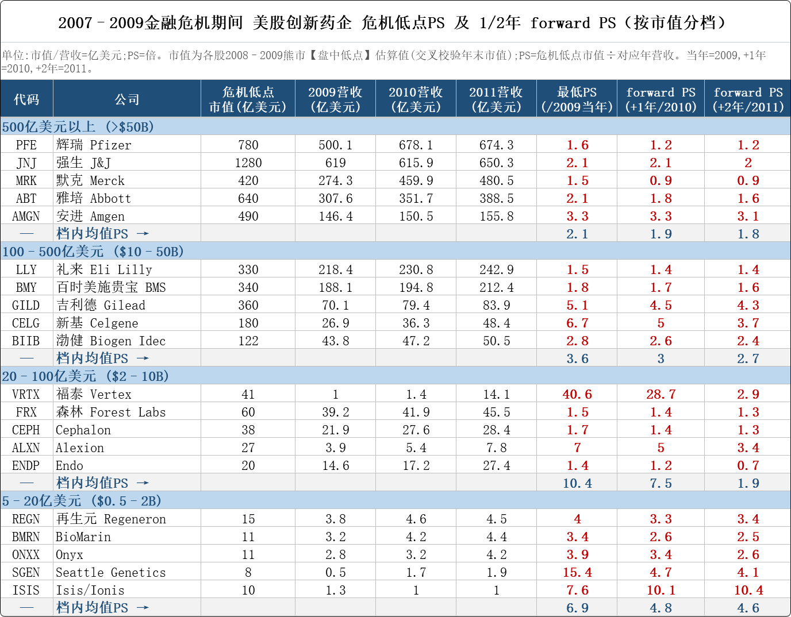
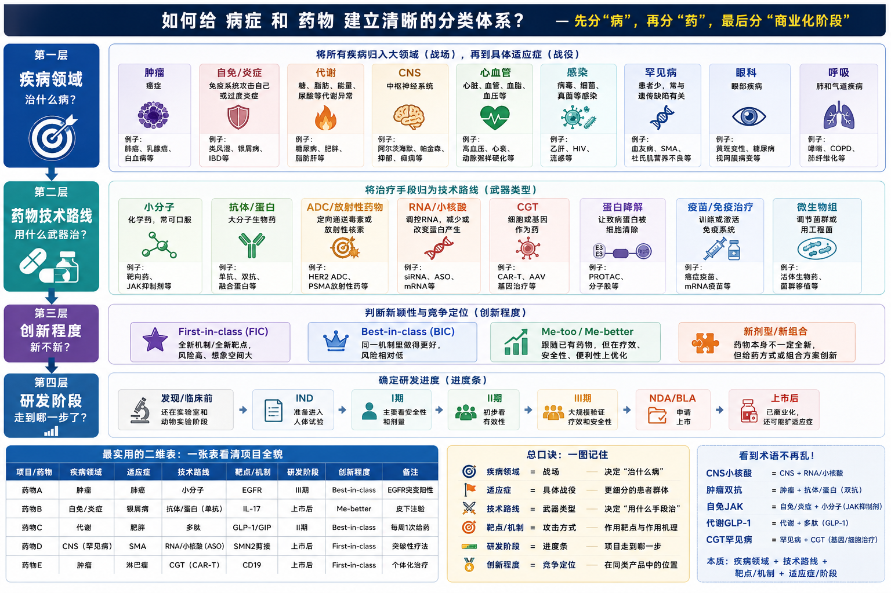

[医药三剑客：赌狗的等待](../主题/医药三剑客_赌狗的等待.md)




# 疾病空间

按 2030 年全球药物市场规模排序的 Top 20 疾病（癌症已细分到具体瘤种）：

| 排名 | 疾病（癌症细分到瘤种） | 2030 全球药物市场规模（代表性区间） |
|---|---|---|
| 1 | 糖尿病 | ~1300–1350 亿美元 |
| 2 | 哮喘 & COPD（呼吸，合计） | ~1000–1550 亿美元（口径偏高，谨慎看） |
| 3 | 肥胖 / 减重（GLP-1 类） | ~950–1500 亿美元（代表 ~1100 亿） |
| 4 | **肺癌**（NSCLC 为主） | ~500–880 亿美元（代表 ~600 亿） |
| 5 | 乳腺癌 | ~520–640 亿美元 |
| 6 | HIV | ~420–450 亿美元 |
| 7 | 类风湿关节炎 | ~410 亿美元 |
| 8 | 多发性骨髓瘤 | ~300–355 亿美元 |
| 9 | 银屑病 | ~300 亿美元 |
| 10 | 特应性皮炎（湿疹） | ~290–300 亿美元 |
| 11 | 多发性硬化 | ~290 亿美元 |
| 12 | 前列腺癌 | ~220–320 亿美元 |
| 13 | 炎症性肠病（UC+克罗恩） | ~265 亿美元 |
| 14 | MASH/NASH（脂肪肝炎） | ~200–250 亿美元（高增速） |
| 15 | 白血病 | ~200–250 亿美元 |
| 16 | 年龄相关黄斑变性（含湿性 AMD） | ~180–250 亿美元 |
| 17 | 结直肠癌 | ~170 亿美元 |
| 18 | 非霍奇金淋巴瘤 | ~130–170 亿美元 |
| 19 | 黑色素瘤 | ~110–140 亿美元 |
| 20 | 阿尔茨海默病 | ~80–150 亿美元（增速最快，DMT CAGR ~68%） |
|  | ... |  |
|  | 胃癌 | 57–112 亿美元，中国高发 |

几点解读：

肿瘤整体是最大的治疗领域，2030 年全口径预计超 3700 亿美元（Evaluate），但拆到单一瘤种后，没有任何一种癌症能单独排到糖尿病/肥胖之上——这正是把癌症细分后的结果。增速最猛的是肥胖（GLP-1）、MASH 和阿尔茨海默病这三块，它们 2020 年前几乎可忽略。糖尿病+肥胖如果按 incretin（GLP-1）合并口径，J.P. Morgan 预计 2030 年达约 2000 亿美元，会是单一最大板块。

需要提醒：这类二级市场报告的绝对值普遍偏乐观，建议把上表当作"相对排序和量级"参考，而非精确预测。

想让我把它做成一份带数据来源、CAGR 和高/低情景的 Excel 或可视化报告吗？那样每个数字都能标注具体出处方便核对。


# 内卷程度

结论：**ADC 最卷，其次双抗，CAR-T 整体第三；但如果只看“临床试验数/获批产品数”的失败压力，CAR-T 也很卷。**

| 赛道      |                                                     公开数据 | 内卷判断                            |
| --------- | -----------------------------------------------------------: | ----------------------------------- |
| **ADC**   | 2025 年全球 **>400 个 ADC 在研**，其中 **>200 个进临床**；另有报告称 **>1300 个活跃 ADC 临床试验、>100 个抗原靶点** | **最卷**                            |
| **双抗**  | 实体瘤双抗分析识别到 **681 个注册临床试验、183 个双抗分子**，且 2020 后翻倍；PD-1×CTLA-4 单一组合就有 **216 个试验，占 31.7%** | **第二卷**                          |
| **CAR-T** | ClinicalTrials.gov 统计到 2024 年 4 月有 **1580 个 CAR-T 试验**；但 FDA 到 2025 年主要商业化 CD19/BCMA 自体 CAR-T 仍是少数产品 | **试验很多，但产业化没 ADC 那么卷** |

**为什么我判 ADC 最卷？**

ADC 的“项目密度 + 同质化 + 商业可交易性”最高。公开资料显示，ADC 全球在研项目超过 400 个、临床项目超过 200 个，且大量集中在早期；同时活跃临床试验超过 1300 个，靶点超过 100 个，但真正最热的还是 HER2、TROP2、FRα、Nectin-4、HER3、B7-H3 等一批靶点。也就是说，数量大，方向又高度重叠。中国公司还占全球 ADC 活跃项目约 40-45%，进一步加剧了竞争密度。([p05.org](https://www.p05.org/magic-bullets-reloaded-the-global-rise-of-antibody-drug-conjugates/)) ([molecular-cancer.biomedcentral.com](https://molecular-cancer.biomedcentral.com/articles/10.1186/s12943-025-02489-2))

**双抗也很卷，但更集中在几个“爆款机制”上。**

双抗不是不卷，而是卷得更偏机制组合。实体瘤双抗里，PD-1×CTLA-4、PD-1×VEGF、EGFR×MET 这些组合已经出现明显扎堆；其中 PD-1×CTLA-4 组合有 216 个试验，占 31.7%。另外多发性骨髓瘤里已有 4 个获批双抗，疗效区间相近、缺少头对头和清晰排序，竞争非常直接。([ascopubs.org](https://ascopubs.org/doi/10.1200/JCO.2025.43.16_suppl.e14505?utm_source=openai)) ([cancerresearch.org](https://www.cancerresearch.org/cancer-immunotherapy-report-2026))

**CAR-T 是“研发拥挤”，但不是最典型的产业内卷。**

CAR-T 试验数很大，2025 年综述统计到 1580 个注册试验，而且 CD19 相关产品/研究占比很高；但 CAR-T 的制造、医院准入、质控、回输流程、成本都很重，单次治疗成本可超过 50 万美元，且只有约 35% 的启动试验能推进到 Phase 2 以后。这个门槛反而限制了大量企业像 ADC 那样快速复制、快速 BD、快速撞靶点。([frontiersin.org](https://www.frontiersin.org/articles/10.3389/fimmu.2025.1583116))

所以一句话排序：

**产业内卷程度：ADC > 双抗 > CAR-T**  
**研发试验拥挤/失败压力：CAR-T ≈ ADC > 双抗**  
**同质化最明显：ADC，尤其 HER2/TROP2/B7-H3/CLDN18.2/Nectin-4 这些方向。**


先说结论:**"卷"要分两层看**。论临床试验的绝对数量和同质化,CAR-T 最卷,但属于"低水平重复内卷";论资本、靶点、BD 三重扎堆、当下最激烈的,是 ADC,属于"高水平内卷"。双抗居中偏上,但子赛道(PD-1/VEGF)极卷。

核心数据对比:

| 维度                | CAR-T                                      | 双抗                        | ADC                                     |
| ------------------- | ------------------------------------------ | --------------------------- | --------------------------------------- |
| 全球临床阶段在研    | ~1580 项临床试验(截至2024.4)               | ~17 款标杆产品              | ~200–230 个分子,554 项临床试验          |
| 靶点集中度          | 极高:CD19 占中国试验 >40%,加 BCMA 几乎垄断 | 中:PD-1/VEGF 等少数组合扎堆 | 高:HER2/TROP2/EGFR/CLDN18.2 四靶点 >50% |
| 中国占全球比例      | 临床试验数全球第一                         | 在研管线约占全球 **50%**    | 在研管线约占全球 **半壁江山**           |
| 已获批产品          | 全球 12 款                                 | ~十余款                     | 全球 17 款                              |
| BD/资本热度(2025H1) | 较冷                                       | >114 亿美元                 | **172.7 亿美元,出海金额第一**           |

**为什么说 CAR-T "卷而不富"**:1580 项试验里绝大多数是中国的研究者发起试验(IIT),高度扎堆 CD19/BCMA 血液瘤,自体疗法成本极高、实体瘤几乎全军覆没。试验数最多,但能真正商业化变现的极少——是典型的"低水平同质化内卷"。

**为什么说 ADC 是"最卷且最热"**:200+ 分子挤在 50 多个靶点上,但四大靶点占了一半,HER2、TROP2 赛道已经饱和到监管抬高"best standard of care"门槛。关键是它同时叠加了资本和 BD 的疯狂——2025 上半年 ADC+双抗占中国创新药 BD 总额近 60%,ADC 单项就 172.7 亿美元一骑绝尘。**人挤、钱也挤,所以最卷。**

**双抗**:管线占全球一半,整体不如 ADC 拥挤,但 PD-1/VEGF 这个子赛道已是"五虎将"贴身肉搏(光这一个组合就 15 个产品、8 个在临床),加上三生 60 亿美元卖给辉瑞的示范,正在快速追平 ADC 的卷度。

一句话:**比试验数量,CAR-T 第一(但低质);比"资本+靶点+商业化"的综合内卷强度,ADC 第一。**

# 技术路线

1. **小分子药**
   传统但仍是主力路线，适合口服、细胞内靶点、酶/受体/通道等。
   方向包括激酶抑制剂、GPCR药物、表观遗传调控、共价药物、分子胶、PROTAC等。
2. **抗体和重组蛋白**
   包括单抗、双抗、多抗、融合蛋白、酶替代疗法等。
   优点是靶向性强，常用于肿瘤、自免、炎症、罕见病。
3. **ADC/放射性偶联药物**
   ADC是“抗体 + 连接子 + 毒素”，把药物精准送到肿瘤细胞。
   放射性配体药物则是“靶向分子 + 放射性核素”，用于诊断或治疗。
4. **细胞治疗**
   典型是CAR-T、TCR-T、TIL、NK细胞疗法、干细胞/再生医学。
   优势是疗效潜力高，难点是制造、成本、安全性和实体瘤突破。
5. **基因治疗/基因编辑**
   包括AAV、慢病毒、非病毒载体、CRISPR、碱基编辑、prime editing等。
   适合单基因病、罕见病，也在向肿瘤、心血管、眼科、神经疾病扩展。
6. **RNA药物**
   包括mRNA疫苗/治疗、siRNA、ASO、miRNA、saRNA、RNA编辑等。
   关键壁垒是递送系统、稳定性、免疫反应和组织选择性。
7. **疫苗和免疫疗法**
   包括预防性疫苗、治疗性癌症疫苗、mRNA疫苗、个性化新抗原疫苗、免疫检查点组合疗法。
8. **微生物组/活体生物药**
   通过菌群、工程菌或其代谢产物调节疾病，主要探索方向包括肠炎、代谢病、肿瘤免疫辅助治疗。
9. **新递送系统**
   LNP、脂质体、聚合物纳米颗粒、外泌体、局部递送、脑靶向递送等。
   很多RNA、基因编辑、蛋白药的成败都取决于递送。


# 全景图




# 中国药企

在过去的十年中，由于各种原因，我国创新药所开发的适应症和技术主要为肿瘤领域的部分靶点和技术，比如PD-1以及ADC药物，这种情况就导致了很多创新药企并没有自己独特的创新性，而是完全同质化的内卷。而在未来的十年，我认为更多的机会集中在一些更加的创新的领域上，比如CNS领域以及小核酸领域，也包括CGT领域，尤其是在现在的818号令政策支持下，还有蛋白降解药物，如PROTAC或者是分子胶等。其实上一代药企也已经在上述领域开始布局，如百济神州开始大量布局蛋白降解药物，康方生物布局CNS领域，石药布局小核酸等，大量的中国创新药企，也已开始布局新技术新领域

2026-03-17

```
有太多人问我康方生物h6这个数据的预期了，我之前就发过在这里再重新再说一遍，我觉得 hr小于0.8就已经很好了。首先我认为海内外数据的一致性不会差，即使有一部分人认为杜根的能力，尤其是临床能力可能没有那么强，我认为海外的鳞癌的数据甚至有可能会比国内的好，这一点也足以弥补了。而且我认为杜根的临床能力其实也没有很差，我觉得不会有太大的区别，同时海外鳞癌的样本量更大，我认为只要国内的os的hr小于0.8，就已经足够支撑杜根所需要的一系列操作了。
当然肯定是越低越好了，只不过小于0.8，我觉得对康方生物来说也足够了，没必要预期那么高，完全没有意义
```
```
这种观点是非常错误的。实际上os的hr在0.8左右，而商业化非常成功的药物有很多，就先不说k药的单药的，近几年像是泽布替尼也是在0.8左右，包括奥希替尼也是。小于0.8，我觉得对康方生物来说也足够了。

这就是最基本的常识，像这种500人以上的大临床的sap一定是以0.8为界设置了最终的分析，甚至还会更宽泛一点。在这种情况下，这种sap一定是只要最后的hr小于0.8就可以显著的至于泽布替尼这里提到它只是为了证明hr为0.8左右，也可以取得很好的商业化结果，与是否慢病化和是否显著没有任何关系。

希替尼并非只有一个0.8左右的hr的临床，而且如果你真的明白我说的是什么意思，就应该知道在整个etfrtki药物的研发过程当中， os的hr不要说显著了，能小于0.8的都是很少的，但是并不影响一个又一个成功的药物走向商业化，并且在商业化中取得成功
```
