**前言**

**[康方生物](https://xueqiu.com/S/09926?from=status_stock_match)AK112-303试验公布了首次中期分析的结果，PDL1表达阳性的NSCLC的一线治疗头对头挑战K药，显著延长了PFS，而且无论PDL1表达，无论肺鳞癌还是肺腺癌、无论有无脑转移、有无肝转移，PFS疗效都取得了强阳性结果。**之后summit涨了三倍，但康方甚至还没有收复之前EGFR-TKI经治NSCLC数据发布后的失地。

**大家的关注点都在于AK112的PFS的阳性结果能否转化为OS获益？**包括2023年药王K药所在[默沙东](https://xueqiu.com/S/MRK?from=status_stock_match)的首席医学官Eliav Barr也对此进行了评论：“（**默沙东）在肺癌治疗中研究VEGF抑制剂已有大量数据积累，K药也在许多叠加VEGF抑制剂的研究中显示出积极的PFS结果。然而，要想在总生存期（OS）方面取得突破，仍面临比较大的挑战”，“患者、监管机构、付款人等更关注总生存期（OS）**，所以，我们拭目以待。这可能是一件有趣的事情。”
客观的说，如果AK112仅仅是PFS取得阳性结果，OS更差，那么这个药基本上就废了；如果PFS阳性结果，OS非劣或者有改善趋势但没有统计学上的显著优势，那么112国内能成药，但海外难度很大；如果最终PFS和OS双阳性结果，那么将有望在很多适应症上取代PD1成为免疫用药的基础，那将有望成为国际性的大药！

所以，可乐组合为什么会持续失败？AK112究竟OS头对头PD1能不能获得有统计学意义的显著延长？我们对此尝试进行分析，而且从[默沙东](https://xueqiu.com/S/MRK?from=status_stock_match)基本失败的可乐组合开始去寻找答案。

**一、可乐组合接连失利，尤其在肺癌领域全部失败**

VEGF核心是抗血管生成，抑制肿瘤生长，同时也可能具有调节肿瘤微环境并激活免疫系统的功效，PD1关闭肿瘤细胞伪装，激活免疫系统攻击癌细胞，理论上两者具有联合用药优势，相当于不同军种联合作战，从而获得1+1>2的效果。这是可乐组合开了那么多三期的理论基础，也是AK112的理论基础。

所以，以K药联合仑伐替尼来挑战K药，[默沙东](https://xueqiu.com/S/MRK?from=status_stock_match)开了十几个三期临床，包括肺癌、肝癌、肾癌、头颈鳞癌、结直肠癌等等；但理想很丰满，现实很骨感，LEAP-001、LEAP-002、LEAP-003、LEAP-006、LEAP-007、LEAP-008、LEAP-010、LEAP-011、LEAP-017研究皆失利，仅成功了VEGF强反应的子宫内膜癌和肾癌两个适应症。而且这些研究大多数ORR和PFS都能获益，但OS获益并不明显，甚至不少适应症患者的中位生存期还缩短了！

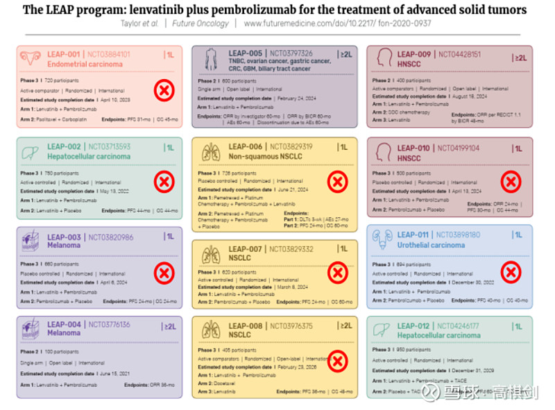

比如在肺癌领域，LEAP007，1线PDL1表达阳性NSCLC（这个适应症与康方AK112-303目标人群一致），可乐组合VSK药单药，ORR由27.7%提升至40.5%，PFS由4.2个月提升至6.6个月，但OS反而由16.4个月下降至14.1个月，HR值高达1.1。

以下是LEAP007的详细数据：

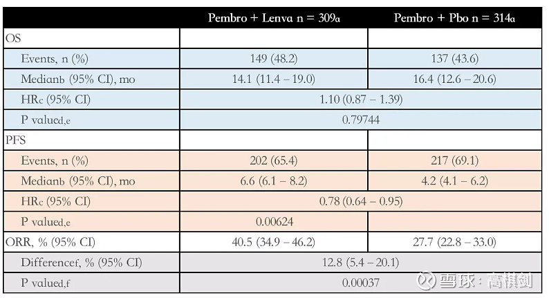

LEAP-006研究旨在评价可乐组合+化疗与K药+化疗（标准疗法）在一线治疗转移性非鳞状非小细胞肺癌患者中的疗效与安全性。结果显示，该研究也没有达到OS和PFS双主要终点。

LEAP-008研究的目的是评估在PD-(L)1+化疗治疗后进展的转移性非小细胞肺癌患者中，Keytruda+仑伐替尼+化疗与化疗（标准疗法）的疗效和安全性。结果显示，该研究还是没有达到OS和PFS双主要终点。

可乐组合的失败是靶免结合的药理出现了问题还是有别的原因呢？是否也意味着AK112将同样步入可乐组合的后尘，ORR和PFS的提升无法转换成OS的提升？

**二、可乐组合接连失败的原因猜想与分析**

**我们尝试阅读了大量文献或报导，学界给出的可乐组合失败的解释有三种**：**一是毒性解释**，也就可乐组合联合用药的高毒性抵消了仑伐替尼带来的临床获益；**二是淋巴管抑制的解释**，仑伐替尼是多靶点激酶抑制剂，除了抑制血管生成也抑制淋巴管生成，阻碍了免疫细胞对肿瘤的浸透，从而反而抑制了PD1发挥作用；**三是反跳解释**，也就是VEGF靶点在前期抑制了血管生成，在后面会导致肿瘤细胞释放更多的VEGF，从而后期加速肿瘤的生长，所以PFS有优势但OS反而劣势。

我们尝试分析这三个假说的逻辑，之后我们将分析康方AK112与可乐组合在这三种逻辑之下的异同。

**2.1 毒性解释**

仑伐替尼是多靶点激酶抑制剂，可以多通路抑制血管生成，但是其毒副作用也非常明显，尤其是与K药联合后，双药的毒性叠加，使得副作用大幅增加，患者耐受度也明显下降。

**LEAP007试验中，K药+仑伐，发生3-5级治疗相关不良事件（AE）的比例远远高于K药单药——（57.9% vs 24.4%）**，两组5级治疗相关AE的发生率分别为5.2%和1.9%！

另外包括罗氏的IMpower150试验（ABCP组：PDL1+贝伐珠+化疗；ACP组：PDL1+化疗。BCP组，贝伐珠+化疗），AE导致的相关停药率，ACP组14.5%，BCP组26.4%，而ABCP组则高达41.2%，高毒性也导致最后的OS反而大打折扣，这也是罗氏后面并没有继续开展其PDL1联合贝伐珠单抗再联合化疗的临床试验。

所以，这个解释我们认为大概率是成立的，在大多数临床试验中，PFS和OS受益程度往往正相关，但如果毒副作用大幅增加，则可能导致PFS受益不能转化为OS受益，**可乐组合很可能就是因为加上仑伐后导致的高副作用抵消了其带来的疗效获益。**

因此如果有一个药可以保留K药+仑伐的疗效，同时大幅减少VEGF带来的副作用，那么就很可能能够将PFS带来的延长持续到OS中去，从而能够在PFS和OS双终点上PK过K药，这可能就是AK112最大的价值所在，我们将在后面进一步分析。

**2.1 淋巴管抑制解释**

仑伐替尼是多靶点激酶受体抑制剂，可以同时抑制VEGFR-1、VEGFR-2、VEGFR-3，VEGFR-1和VEGFR-2的主要作用是抑制血管生成，而VEGFR-3的主要作用则是抑制淋巴管的生成。

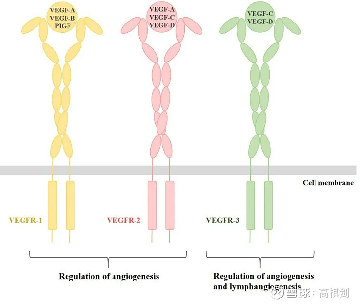

VEGFR-3作为酪氨酸激酶受体之一，主要在淋巴管内皮细胞中表达，刺激内皮细胞增殖，从而在淋巴管生成中起关键作用, 而**淋巴管在机体的免疫反应中扮演关键角色，输送且加速T细胞的活化与浸润。但仑伐替尼抑制了VEGFR-3，则抑制了淋巴管的生成，从而间接抑制了T细胞运输至肿瘤细胞，以及T细胞在肿瘤部位的活化与浸润，从而阻碍PD1发挥作用。**这可能也是导致仑伐替尼联合帕博利珠单抗的“可乐”组合治疗方案未能达到预期效果的原因。

而同样是靶免结合，在一线晚期肝癌的临床试验中，罗氏的阿替利珠单抗（PD-L1）+贝伐珠（VEGF-A）、[信达生物](https://xueqiu.com/S/01801?from=status_stock_match)的信迪利（PD1）+贝伐珠，以及[恒瑞医药](https://xueqiu.com/S/SH600276?from=status_stock_match)卡瑞利珠单抗（PD1）+阿帕替尼（VEGFR-2）都能取得成功（而且是PFS和OS双重成功），而LEAP002的K药（PD1）+仑伐替尼（含VEGFR-3的多靶点受体抑制剂）却在PFS和OS双终点都没有达到显著性优势，**仑伐替尼导致的淋巴管抑制我们认为在一定程度上可能也是可乐组合失败的重要原因**。

**2.3 VEGF反跳的解释**

这也是部分学者的观点，VEGF靶点在前期抑制了血管生成，在后面会导致肿瘤细胞释放更多的VEGF，从而后期加速肿瘤的生长。但是，如果真的会出现反跳的话，那么贝伐珠单抗就没有成药的基础，因为如果会出现反跳，那么贝伐珠单抗在延长PFS时应该会导致OS缩短。

我们找到了罗氏对这个问题的回答：

他们认为抗血管生成不会产生耐药，只是会有逃逸（耐药 = 治疗靶点发生突变，以至疾病在治疗过程中仍为活动性；逃逸 = 肿瘤激活替代途径，该途径产生与被抑制途径相同的效应），也就是肿瘤对VEGF抑制可保持持续的敏感性，当然，肿瘤也会通过另外的信号通路产生新的血管生成通路而继续过度表达，如FGF，TGF-贝塔等等，最终导致肿瘤重新进展。

事实上，罗氏发现当抗血管生成类药物停用后，肿瘤血管虽然将重新恢复，但不会超过基线

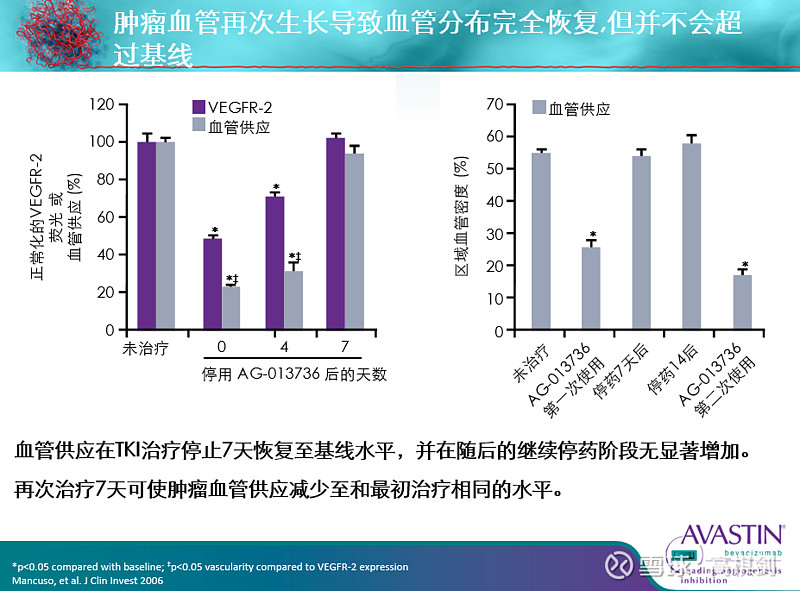

甚至在肿瘤进展后，继续使用贝伐珠还能够持续延长患者的生存期：

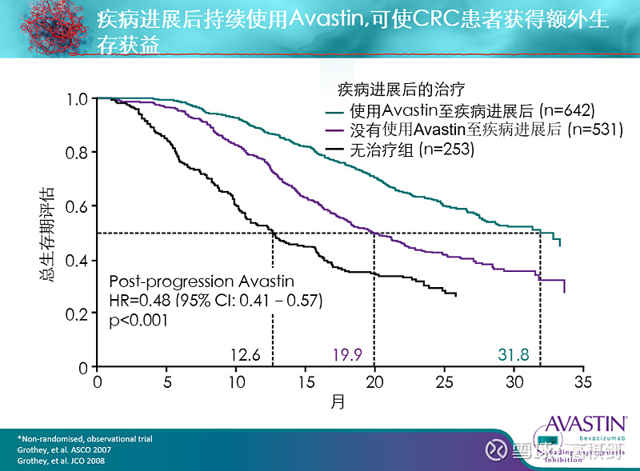

由此可见，VEGF的反跳大概率是不存在的，事实上贝伐珠单抗带来的PFS延长能够转化为OS延长，只是由于靶点的特性，VEGF带来的OS延长与其PFS延长幅度基本相当，这一点是远远不如PD1的，PD1带来的PFS改善很多时候会导致更长时间的OS改善。

以下是贝伐珠单抗的临床试验数据：

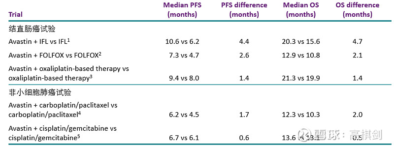

综合这些分析来看，VEGF靶点用药后会导致反跳大概率是不成立的，所以也大概率不是可乐组合失败的原因。

**2.4 结论**

通过上述的分析，**可乐组合临床失败应该主要有两个原因：一是仑伐替尼不是一个干净的抗血管生成抑制剂，其在抑制血管生成的同时抑制了淋巴管生成，从而损害了PD1发挥的免疫治疗作用；二是在没有疗效加成的同时，却带来了更大的毒副叠加效应，疗效1+1<2、毒副作用1+1>2，因此也就变成了一个失败组合**！

**三、AK112几个三期临床试验的PFS与OS展望**

**3.1 AK112的原理**

AK112虽然从药理上和可乐组合类似，都是PD1+抗血管生成，但**AK112将PD1和VEGF组成双抗连接到一个分子上，除了两个靶点分别的作用，还能起到一个靶向富集的作用**。肿瘤微环境中往往VEGF高表达同时PD1有表达，通过PD1连接VEGF，PD1端除了起到免疫激活的作用，预计还能使VEGF端富集于肿瘤微环境中，使得VEGF靶向性地聚集在肿瘤微环境中发挥阻止肿瘤血管生成的作用，一方面可以通过在肿瘤的富集加强VEGF对于肿瘤的疗效，另一方面可以减少VEGF在正常组织中的浓度，从而大幅减少其脱靶效应。反过来AK112的VEGF端也有可能使得PD1连接的T细胞更加富集于肿瘤微环境中，增加免疫反应的效果。**这也是AK112设计的巧妙之处，从药理上来说将有希望增加疗效的同时大幅减少VEGF的副作用，真正实现了低毒高效**。

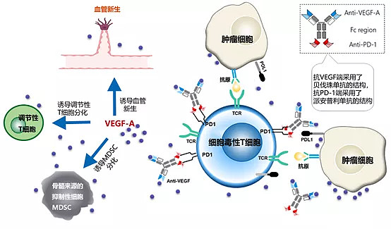

**公司的研究也表明在VEGF存在下，AK112与PD-1的结合亲和力在增加了18倍。在PD-1存在下，VGEF的结合亲和力增加了四倍。**

不仅如此，**由于AK112在VEGF端连接的是很干净的VEGF-A，比较纯粹地只抑制血管生成，不会影响淋巴管的生成**，不会限制T细胞运输至肿瘤细胞，以及T细胞在肿瘤部位的活化与浸润，**因此同样可以避免仑伐替尼对PD1免疫作用的抑制，不会导致PFS无法转化成OS。**

**3.2 AK112可以大幅减少靶免双药联合的毒副作用**

AK112首先可以大幅克服贝伐珠单抗带来的毒性，可以看到在实体瘤中，对比贝伐珠单抗，出血副作用从40%下降至7.6%，高血压从31%下降到8.2%，血栓从16.3%下降到1.2%，而蛋白尿从20%下降到7.3%

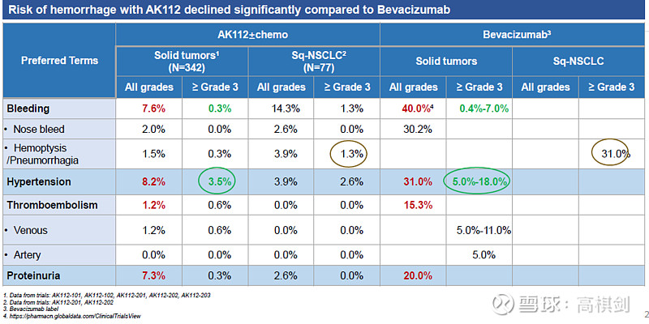

在AK112-301试验中，我们也可以非常清楚的看到，3级以上VEGF相关的TREA仅有3.1%。甚至于免疫相关的3级以上TREA也只有6.2%，**可见通过组成双抗，大幅提升了药物在肿瘤微环境中的富集度，减少了在外周血和正常组织中的存在，从而大幅降低其在正常组织中的毒性效应**

在AK112单药治疗NSCLC的二期临床中，三级以上TREA仅有10.6%，甚至低于PD1单抗的毒副作用。

可见**康方AK112能够大幅降低可乐组合的毒副作用**，AK112单药NSCLC的二期临床以及LEAP007三级以上的TREA对比为10.6%VS57.9%。可见**AK112克服了可乐组合最大的缺点，也就是PD1叠加VEGF的毒副作用，避免了可乐组合巨大的毒副作用对患者生存期的影响，从而有希望将PFS优势转化为OS优势**。

**3.3 AK112 在疗效上也能实现1+1>2，预计也会好于PD1序贯VEGF**

富集效应不仅可以带来安全性优势，同时可以带来疗效的协同优势。

虽然我们也认为三期临床数据预计会比二期临床数据会有所下降（大多数时候都是如此，毕竟二期临床是单中心或者少数几个中心进行的，对患者的治疗和照顾医生可能会更加尽心尽力一些，但到了三期临床，50-100个中心，不可能所有中心都能如此尽心尽力，患者基线控制也不是那么容易，因此三期数据会有所下降非常正常）。但是，我们认为2期数据还是会比较具有代表性，尤其是患者入组数量比较多的情况下。

以1线鳞状NSCLC为例，非头对头对比keynote407,无论PFS还是DOR都是非常显著的提升，**尤其值得关注的是DOR，K药+化疗是7.1个月，而AK112+化疗是12.8个月，疗效近乎提升一倍，这个数据是很难通过患者选择来操控的，考虑到ORR高达67%，这么高的ORR叠加这么长的DOR预计将很容易转化成mOS优势！**

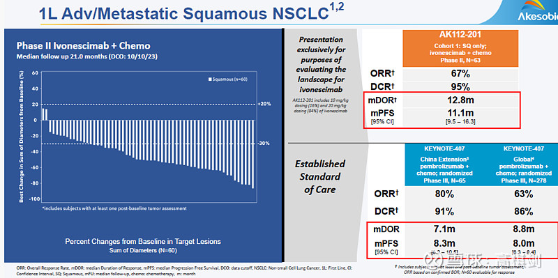

我们也的确可以看到AK112-201试验的OS优势非常明显，24个月的OS率高达64.8%，而且从曲线上看，拖尾效应也非常明显

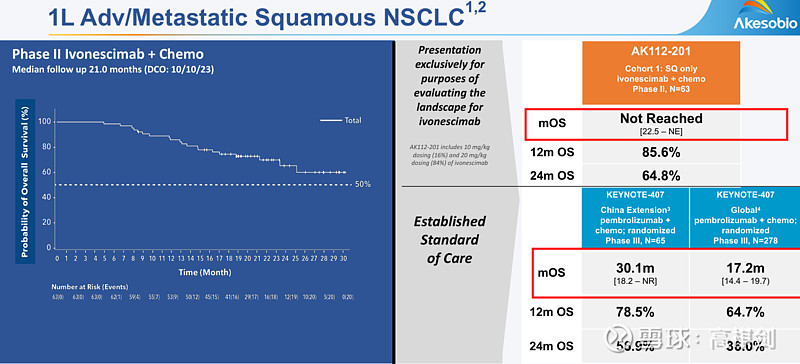

**3.3 为什么EGFR-TKI经治只是小试牛刀**

对于PFS数据的详细分析可以阅读我们之前在雪球上写的文章（链接如下），结论是康方AK112+化疗的数据显著好于[信达生物](https://xueqiu.com/S/01801?from=status_stock_match)PD1+贝伐珠+化疗。

[AK112-301分析](https://xueqiu.com/2404842082/291299892)

这里我们要写的是更新后的OS分析。

比较多的投资者担心的一个问题就是在301试验中，PFS的HR值0.46，但后面的OS的HR值仅为0.8，数据并不那么惊艳。

但是，就像我们之前写过PD1对于EGFR经治的NSCLC是基本无效的，这与EGFR野生型NSCLC标准一线疗法都使用PD1形成了鲜明的对比，也有学者对此进行过分析，出现这种差异的主要原因是经过一二线治疗后，其实患者基线已经非常差，肿瘤微环境中免疫细胞很少了，这也是国内外专家一致认为免疫疗法能早用尽量早用的原因（但EGFR突变NSCLC一线联用PD1单抗会导致非常大的肺毒性，所以在EGFR和ALK突变NSCLC中一线都是先靶向治疗），由于后线治疗时肿瘤微环境中免疫细胞不足，导致即使PD1激活肿瘤免疫系统，也没有足够的T细胞去杀伤，因此导致PD1在这个适应症中疗效不明显。

**AK112在EGFR-TKI经治NSCLC中，虽然我们倾向于认为虽然PD1预计也有一定加成作用，但其疗效更多地是VEGF靶点带来的，由于经治后患者肿瘤微环境中免疫细胞的缺乏，使得112的PD1及VEGF双靶点带来的富集效应并没有得到充分的发挥，这也是公司说AK112-301试验只是AK112小试牛刀的原因所在！**

而且，我们认为随着事件数的增多，我们认为AK112-301试验OS的HR还会下降，我们可以看到在17个月左右时，两根生存曲线正好处于有所缩窄的时候，但后面曲线的分开程度在扩大，很明显地表明AK112的拖尾效应非常好。这也显示出一旦AK112有疗效，其疗效的持久性很不错，与AK112-201试验的拖尾效应类似

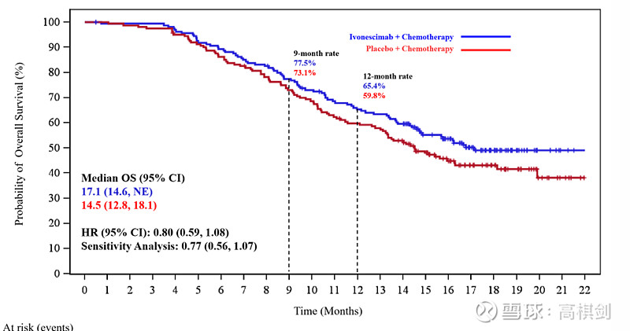

**3.4 怎么看AK112的几个三期临床试验的成功概率**

**301试验**（EGFR-TKI经治非鳞NSCLC），这个临床试验国内已经取得成功，海外临床我们预计也将取得成功，毕竟相对于化疗，AK112的优势还是非常明显的，即使海外PFS和OS双终点，因为是海外桥接中国试验，预计样本量将足够大，OS的HR0.8左右足够获得成功（[强生](https://xueqiu.com/S/JNJ?from=status_stock_match)EGFR/cmet双抗，ami-chemo 组对比 chemo 组 HR也仅为0.77）。最终我们认为海外临床试验成功概率70%。

**303试验**（单药头对头K药的1线PDL1阳性NSCLC），已经公布了PFS强阳性结果，根据我们上述分析，预计OS也很有希望获得阳性结果，虽然可能OS的HR会比PFS更低些。国内成功概率100%，海外成功概率80%。

**302试验**（1线鳞状NSCLC，AK112+化疗VSK药+化疗），由于贝伐珠单抗无法用于肺鳞癌，VEGF连序贯治疗都做不到，而且现在鳞状NSCLC后线也只有多西他赛，所以我们认为这个试验的OS获胜的概率还要超过303试验，我们倾向于认为成功概率药超过90%。

**四、总结**

AK112是PD1和VEGF双抗，肯定有这两个靶点相关的缺点，比如PD1免疫应答率问题，VEGF的旁路逃逸问题等，但是通过把两个靶点组成双抗，可以大幅提升在肿瘤微环境中的富集程度，提升疗效的同时大幅减少对正常组织的毒性。**我们认为AK112的价值有三个层面：**

**首先是针对PD1有效但VEGF不耐受的适应症**，比如鳞状NSCLC，这类适应症是AK112把握性最大的适应症，普通VEGF不耐受意味着VEGF药物不仅不能用于联合治疗，连序贯用药都不能，AK112能够实现多一个低毒性的VEGF靶点的用药，PFS和OS双优势预计将很容易实现。

**其次是PD1和VEGF都可以使用的适应症**，AK112需要证明组成双抗，优于两者联合用药，且优于两者序贯用药，比如1线非鳞状NSCLC，比如肝癌等等，预计富集效应带来的高效低毒将有望让患者获得PFS和OS的双重优势，比如在EGFRwt 肺腺癌的二期临床试验中，其PFS高达13.7个月，远远超过impower150的8.3个月以及Keynote189的8.8个月，虽然预计三期临床数据可能会有一定的缩水，但还是非常明显地证明了AK112双抗对比双药联合带来的疗效加成。这一类的适应症是最多的，大多数可乐组合所开的适应症都是这一类，可见范围之广！

**最后是PD1效果不佳，但VEGF有效的适应症**，如EGFR-TKI经治NSCLC，如微卫星稳定结直肠癌等，如果对比安慰剂或者联合化疗对比安慰剂联合化疗，预计PFS强阳性，而OS弱阳性。如果头对头VEGF，优效性需要进一步验证，期待微卫星稳定的结直肠癌二期临床试验结果。

由于海外NSCLC是大适应症，先不论其他，只要对PD1有效但VEGF不耐受的1线鳞状NSCLC取得PFS和OS的双终点，那么海外市场峰值预计将超过50亿美元，有这个适应症就够了；

进一步，如果还能够进一步证明组成双抗在疗效上比联合用药及序贯用药有统计学上的显著优势，那么将有望全面取代PD1的市场空间；

更进一步，如果在PD1无效而VEGF有效的适应症上证明比VEGF更好，那么其市场空间将超过PD1！当然，**这三个层次难度也是逐步增加的，且看后线临床数据吧**

