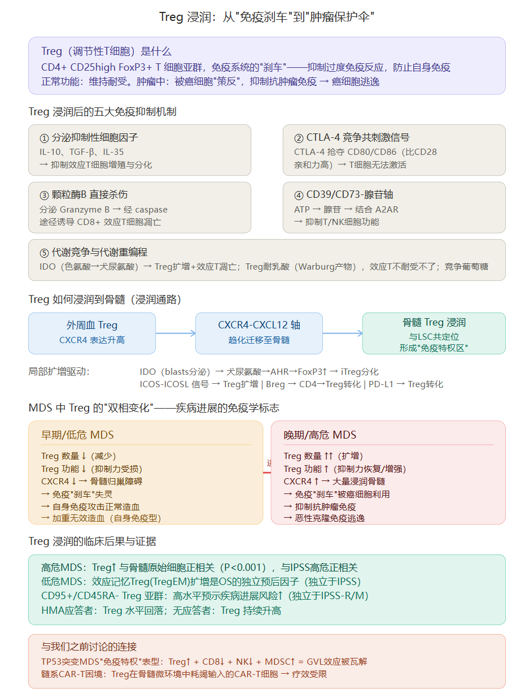
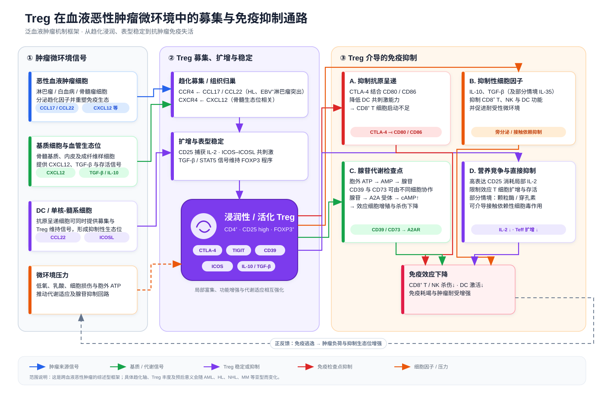

## 一、Treg 是什么

**Treg（调节性T细胞，Regulatory T cell）** 是 CD4+ T 细胞中的一个特殊亚群，表型为 **CD4+ CD25high FoxP3+**。FoxP3 是 Treg 的"主控基因"——它决定了 Treg 的发育和抑制功能，FoxP3 基因突变的人会得严重的自身免疫病（IPEX 综合征）。

Treg 的正常生理功能是**免疫系统的"刹车"**：防止免疫系统过度反应，维持自身耐受，避免自身免疫疾病。可以说，没有 Treg，你的免疫系统会攻击自己的身体。

> 但在肿瘤中，这个"刹车"被癌细胞"策反"了——Treg 抑制的不是自身免疫，而是**抗肿瘤免疫**，变成了癌细胞的"保护伞"。

---

## 二、"浸润"是什么意思

**浸润（infiltration）** = Treg 从外周血**迁移进入组织（肿瘤微环境/骨髓）并在局部聚集**的过程。

在血液肿瘤中，"Treg 浸润"特指 Treg 从外周血迁移到骨髓，在骨髓中聚集并与白血病干细胞（LSC）共定位，形成局部的**免疫抑制微环境**。

### 浸润的两步机制

**第一步：招募——Treg 被"叫进"骨髓**

- AML/MDS 患者的 Treg 表面 **CXCR4 表达升高**（是健康人的数倍）
- 骨髓基质细胞分泌的 **CXCL12（SDF-1α）** 是 CXCR4 的配体
- CXCR4-CXCL12 轴就像一个"导航信标"，把 Treg 从外周血"吸引"到骨髓
- 另一条轴：**CCL22/CCR4** 也参与 Treg 的骨髓招募

**第二步：局部扩增——Treg 在骨髓被"制造"出来**

不是所有浸润的 Treg 都是从外周迁移来的，相当一部分是**在骨髓中原位诱导产生**的：

| 诱导机制            | 过程                                                         |
| ------------------- | ------------------------------------------------------------ |
| **IDO 通路**        | AML 原始细胞表达 IDO → 色氨酸→犬尿氨酸 → 色氨酸耗竭导致效应 T 细胞停滞 + 犬尿氨酸结合 AHR → FoxP3 表达 → CD4+ T 细胞**转化为 Treg** |
| **ICOS-ICOSL 信号** | AML 细胞表达 ICOSL → 与 Treg 表面的 ICOS 结合 → Treg 扩增且维持抑制功能 |
| **PD-L1 通路**      | AML 细胞表面 PD-L1 → 与 CD4+ T 细胞的 PD-1 结合 → 促进向 Treg 转化 |
| **Breg 转化**       | 调节性 B 细胞分泌 IL-10/IL-35/TGF-β → 将 CD4+CD25- T 细胞转化为 Treg |

> 所以"浸润"不只是"跑进来"，还包括"就地制造"——骨髓微环境本身就在把正常的 CD4+ T 细胞变成 Treg。

---

## 三、Treg 浸润后的五大免疫抑制机制

Treg 到了骨髓之后，通过五种方式压制抗肿瘤免疫：

### ① 分泌抑制性细胞因子
- **IL-10、TGF-β、IL-35** 三大"镇暴因子"
- 直接抑制效应 T 细胞（CD8+ CTL）的增殖、分化和细胞因子（如 IFN-γ）的产生
- IL-35 还是 Treg 自己分泌的，形成正反馈

### ② CTLA-4 竞争共刺激信号
- Treg 表面高表达 **CTLA-4**，它与 CD80/CD86 的亲和力**远高于** T 细胞上的 CD28
- CTLA-4 "抢走"抗原呈递细胞（DC）上的 CD80/CD86 → 效应 T 细胞得不到共刺激信号 → 无法激活
- CTLA-4 还通过**转内吞**（trans-endocytosis）把 DC 表面的 B7 分子"吃掉"，进一步削弱 DC 的抗原呈递能力

### ③ 颗粒酶B 直接杀伤效应T细胞
- Treg 可以分泌 **Granzyme B** → 经 caspase 途径**直接诱导 CD8+ 效应 T 细胞凋亡**
- 这是 Treg 最"暴力"的机制——不只是"压制"，而是直接"杀掉"抗肿瘤的 T 细胞

### ④ CD39/CD73-腺苷轴
- Treg 表面表达 CD39 和 CD73 → 将肿瘤微环境中高浓度的 ATP 逐步降解为**腺苷**
- 腺苷结合效应 T/NK 细胞表面的 **A2A 受体** → 抑制其细胞毒功能
- AML 细胞也表达 CD39/CD73，与 Treg 形成"协同腺苷工厂"

### ⑤ 代谢竞争与代谢重编程
这是近年来最重要、也最"阴险"的机制：

- **IDO**：AML 原始细胞分泌的 IDO 把色氨酸耗竭 → 效应 T 细胞因色氨酸缺乏而停滞（T 细胞增殖需要色氨酸），同时犬尿氨酸促进 Treg 分化
- **乳酸耐受**：肿瘤细胞通过 Warburg 效应产生大量乳酸 → 效应 T 细胞在酸性环境中功能受损 → **但 Treg 代谢适应了乳酸，甚至利用乳酸作为燃料增强抑制活性**——这就是"代谢不对称"
- **葡萄糖竞争**：在营养匮乏的肿瘤微环境中，Treg 在葡萄糖竞争上**胜过**效应 T 细胞

> 一句话：Treg 不仅"压制"免疫，还在代谢层面"饿死"效应 T 细胞——在同一个微环境中，效应 T 细胞活不下去，而 Treg 越活越强。

---

## 四、MDS 中 Treg 的"双相变化"——这是最关键的发现

MDS 中 Treg 的动态变化非常独特——**不是简单的"多就好"或"少就坏"，而是在疾病不同阶段呈现完全相反的模式**：

### 早期/低危 MDS：Treg 功能不足 → 自身免疫损害

- Treg **数量减少**、**功能受损**（抑制力下降）
- **CXCR4 表达下调** → Treg 无法正常归巢到骨髓
- 结果：免疫"刹车"失灵 → 自身免疫反应攻击正常造血前体细胞 → **加重无效造血**
- 这解释了为什么低危 MDS 患者常伴有自身免疫表现（10-20% 有系统性自身免疫疾病），以及为什么免疫抑制治疗（ATG、环孢素）在低危 MDS 有效——**因为低危 MDS 的本质是"免疫过度攻击"，Treg 不足是原因之一**

### 晚期/高危 MDS：Treg 过度浸润 → 免疫逃逸

- Treg **数量大幅增加**、**功能恢复且增强**
- **CXCR4 表达升高** → Treg 大量归巢到骨髓
- Treg 与白血病干细胞（LSC）**共定位**，形成"免疫特权区"——LSC 被 Treg 包围保护起来
- 结果：免疫"刹车"被恶性克隆利用 → 抑制抗肿瘤免疫 → **恶性克隆免疫逃逸**
- 此时再给免疫抑制治疗反而有害——**因为高危 MDS 的本质变成了"免疫逃逸"，需要的是解除抑制，而不是加强抑制**

### 关键的动态证据

- 治疗应答者：Treg 水平**回落**
- 治疗无应答者：Treg 持续**升高**
- 低危 → 高危转化过程中：Treg 从减少变为扩增
- 化疗后肿瘤负荷降低：Treg 也随之降低

> 这个"双相变化"揭示了 MDS 免疫微环境的动态本质——**早期是"免疫过度攻击正常造血"，晚期是"免疫被肿瘤利用导致逃逸"，Treg 在这两个阶段扮演了完全相反的角色。**

---

## 五、哪些 Treg 亚群更重要

近年研究发现，不是所有 Treg 都一样——**特定亚群**才是真正的"坏人"：

| 亚群                       | 特征                                                   | 临床意义                                           |
| -------------------------- | ------------------------------------------------------ | -------------------------------------------------- |
| **TregEM（效应记忆Treg）** | 在低危 MDS 中扩增，抑制力最强                          | OS 的**独立预后因子**（独立于 IPSS）               |
| **CD95+/CD45RA- Treg**     | 高度活化的 Treg 亚群                                   | 高水平预示疾病进展风险↑（独立于 IPSS-R 和 IPSS-M） |
| **TNFR2+ Treg**            | 抑制力最强的 Treg 亚型                                 | 在骨髓中富集 → 免疫逃逸；清除后可恢复抗白血病免疫  |
| **ST2+ Treg**              | IL-33 受体阳性，具有**细胞毒性**——能直接杀 CD8+ T 细胞 | 在恶性骨髓中随疾病进展而增多；抗 ST2 抗体可阻断    |
| **PD-1+ Treg**             | 高频 PD-1+ Treg 预示更差 OS 和 DFS                     |                                                    |

> 这也解释了为什么"总 Treg 数量"有时不能预测预后——真正有意义的是特定高抑制力亚群的密度。

---

## 六、与我们之前讨论的连接

### 与 TP53 突变 MDS"免疫特权"表型的关系

我们之前讨论 TP53 突变 MDS 时提到它具有"immune-privileged, evasive phenotype"——Treg 浸润正是这个表型的核心组成部分：

| 免疫变化               | 效应                                  |
| ---------------------- | ------------------------------------- |
| Treg ↑↑                | 抑制抗肿瘤免疫                        |
| CD8+ 细胞毒性 T 细胞 ↓ | 第一道防线削弱                        |
| NK 细胞 ↓              | 先天免疫监视削弱                      |
| MDSC ↑                 | 释放颗粒酶B杀伤红系前体 + 抑制 T 细胞 |
| PD-L1 ↑（HSC表面）     | T 细胞"隐身"                          |

> Treg + MDSC + PD-L1 = 三重免疫抑制网络 → GVL（移植物抗白血病）效应被瓦解 → 即使做了异基因移植，TP53 突变患者的复发率仍然极高。

### 与髓系 CAR-T 困境的关系

我们之前讨论过髓系 CAR-T 在骨髓微环境中面临挑战——Treg 浸润正是原因之一。输入的 CAR-T 细胞进入骨髓后，会遭遇 Treg 的五大抑制机制（细胞因子压制、CTLA-4 竞争、颗粒酶B杀伤、腺苷抑制、代谢竞争）→ CAR-T 细胞快速耗竭 → 疗效受限。

### 与 AZA 免疫调节机制的关系

之前讨论 AZA 时提到它能下调 Treg——现在可以理解为什么这对 MDS 有意义：高危 MDS 中 Treg 过度浸润抑制了抗肿瘤免疫，AZA 通过去甲基化降低 Treg 的数量和功能 → 部分恢复抗白血病免疫 → 这也是 AZA 在通路 A（改善造血）之外的一条辅助抗癌机制。

---

**一句话总结**：Treg 浸润是指调节性 T 细胞（CD4+CD25highFoxP3+）从外周血迁移到骨髓并在局部聚集的过程，它们通过分泌抑制性细胞因子（IL-10/TGF-β/IL-35）、CTLA-4 竞争共刺激信号、颗粒酶B直接杀伤效应T细胞、CD39/CD73-腺苷轴抑制T/NK功能、以及代谢竞争这五大机制，压制抗肿瘤免疫。在 MDS 中，Treg 呈现独特的**双相变化**——早期低危时 Treg 不足导致自身免疫加重无效造血，晚期高危时 Treg 过度浸润并被恶性克隆利用导致免疫逃逸——这正是为什么低危 MDS 用免疫抑制治疗有效，而高危 MDS 反而需要解除免疫抑制的根本原因。
已更新工作日志。

## 总结

**Treg 浸润**是指调节性 T 细胞（CD4+CD25highFoxP3+）从外周血迁移进入骨髓并在局部聚集的过程。Treg 本是免疫系统的"刹车"——正常时防止自身免疫，但在肿瘤中被恶性克隆"策反"，变成抑制抗肿瘤免疫的"保护伞"。

**浸润分两步**：①招募（CXCR4-CXCL12 轴将 Treg 从外周血"叫进"骨髓）②局部扩增（AML 原始细胞分泌 IDO → 犬尿氨酸 → AHR → FoxP3 → CD4+ T 细胞就地转化为 Treg；ICOS-ICOSL、PD-L1、Breg 也参与转化）。

**五大抑制机制**：分泌 IL-10/TGF-β/IL-35 压制效应 T 细胞；CTLA-4 抢夺共刺激信号；Granzyme B 直接杀死 CD8+ T 细胞；CD39/CD73 产生腺苷抑制 T/NK；代谢竞争（Treg 耐乳酸、竞争葡萄糖，在肿瘤微环境中"饿死"效应 T 细胞）。

**MDS 中最关键的发现是"双相变化"**——早期低危 MDS 时 Treg **不足**（数量↓、功能↓、归巢障碍），导致自身免疫攻击正常造血、加重无效造血，这就是为什么低危 MDS 用免疫抑制治疗（ATG/环孢素）有效；晚期高危 MDS 时 Treg **过度浸润**（数量↑↑、功能↑、大量归巢骨髓、与白血病干细胞共定位形成"免疫特权区"），抑制抗肿瘤免疫导致恶性克隆免疫逃逸，这就是为什么高危 MDS 反而需要**解除**免疫抑制。

这和我们之前讨论的 TP53 突变 MDS"免疫特权"表型直接相关——Treg↑ + CD8↓ + NK↓ + MDSC↑ + PD-L1↑ = GVL 效应被全面瓦解，也是髓系 CAR-T 在骨髓微环境中疗效受限的原因之一。