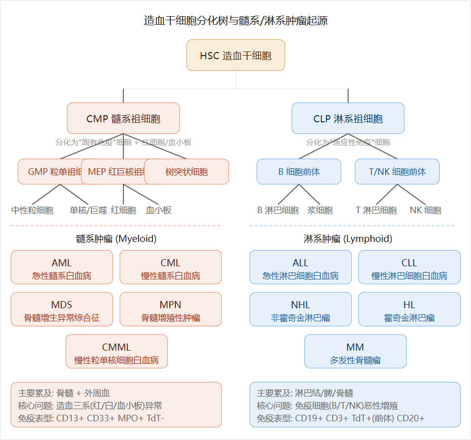

# 髓系和淋系

**髓系管"造血工厂和固有免疫"，淋系管"适应性免疫"。** 下面逐一展开。

---

## 一、本质区别：起源祖细胞不同

所有血细胞都起源于骨髓中的造血干细胞（HSC），HSC 分化为两个主要祖细胞：

|          | 髓系祖细胞 CMP                                    | 淋系祖细胞 CLP                                        |
| -------- | ------------------------------------------------- | ----------------------------------------------------- |
| 分化方向 | 粒细胞、单核/巨噬细胞、红细胞、血小板、树突状细胞 | B 细胞、T 细胞、NK 细胞                               |
| 免疫归属 | **固有免疫**（快速、非特异性）                    | **适应性免疫**（精准、有记忆）                        |
| 成熟场所 | 都在骨髓中成熟                                    | B 细胞在骨髓、T 细胞在胸腺成熟，然后迁移到淋巴结/脾脏 |

**髓系肿瘤就是 CMP 及其后代的恶性变，淋系肿瘤就是 CLP 及其后代的恶性变。** 这就是最根本的区别——它们来自同一棵树的两个不同分支。

---

## 二、六大维度详解

### 1. 累及器官不同

- **髓系肿瘤**：主要在**骨髓和外周血**中"搞事"。骨髓被异常细胞占据 → 正常的红细胞、白细胞、血小板造不出来 → 全血细胞减少。临床表现以贫血、出血、感染为主。
- **淋系肿瘤**：主要在**淋巴结、脾脏、结外淋巴组织**中形成肿块。表现为无痛性淋巴结肿大、B 症状（发热、盗汗、体重下降）。也可以累及骨髓和外周血（尤其是白血病形式），还特有 CNS/睾丸浸润（ALL）。

### 2. 免疫表型完全不同（诊断的关键）

流式细胞术通过 CD 分子标记来区分两大系统——这是临床诊断的"身份证"：

|              | 髓系标记                              | 淋系标记                                              |
| ------------ | ------------------------------------- | ----------------------------------------------------- |
| 核心标志     | **CD13+ CD33+ CD117+ MPO+**           | B 系: **CD19+ CD20+ CD22+**; T 系: **CD3+ CD7+ CD5+** |
| 前体细胞标志 | **TdT 阴性**                          | **TdT 阳性**（前体淋巴细胞特有）                      |
| 特殊         | Auer 小体（AML 髓系特异性形态学标志） | 表面免疫球蛋白（成熟 B 细胞）                         |

> **临床上遇到一个"原始细胞不明"的急性白血病，第一件事就是做流式细胞术看 CD 标记——CD13/CD33/MPO 阳性就是髓系，CD19/CD3/TdT 阳性就是淋系。** 这决定了完全不同的治疗方案。

### 3. 高频基因异常不同

| 髓系常见                        | 淋系常见                           |
| ------------------------------- | ---------------------------------- |
| FLT3-ITD、NPM1、CEBPA、RUNX1    | BCR-ABL1（Ph 染色体）、ETV6-RUNX1  |
| TP53（复杂核型 MDS/AML）        | KMT2A 重排、MYC/BCL2（NHL）        |
| IDH1/2 突变                     | NOTCH1、SF3B1（CLL）               |
| 染色体: t(8;21), inv(16), -5/-7 | 染色体: t(9;22), t(14;18), t(8;14) |

这些基因异常不仅是诊断标志，也直接决定了靶向药的选择。

### 4. 治疗策略完全不同

|      | 髓系                                       | 淋系                                          |
| ---- | ------------------------------------------ | --------------------------------------------- |
| 急性 | AML: 7+3（Ara-C + 蒽环类）+ HMA（AZA/Ven） | ALL: VDLP 方案 + 鞘内注射（防 CNS）           |
| 慢性 | CML: TKI（伊马替尼等）; MDS: AZA           | CLL: BTK 抑制剂 + Ven; NHL: R-CHOP            |
| 特殊 | APL: ATRA + ATO（可治愈）                  | HL: ABVD; MM: VRd/DRd                         |
| 靶向 | FLT3/IDH 抑制剂、BCL-2 抑制剂              | CAR-T（CD19/BCMA）、抗 CD20 单抗、BTK 抑制剂  |
| 免疫 | 相对少（骨髓微环境复杂）                   | 非常丰富（抗 PD-1、双抗、CAR-T 都起源于淋系） |

> **淋系肿瘤的免疫治疗远比髓系丰富**——因为 B/T 细胞表面有大量可靶向的分化抗原（CD19、CD20、CD22、BCMA 等），而髓系细胞的表面抗原特异性较差（CD33/CD123 也表达在正常造血细胞上，容易误伤）。CAR-T 疗法的突破几乎全部发生在淋系（CD19 CAR-T 治 B-ALL、BCMA CAR-T 治 MM）。

### 5. 免疫微环境不同

- **髓系肿瘤**：骨髓 niche 驱动。炎症因子（TNF-α、IFN-γ）导致无效造血；骨髓基质细胞与白血病干细胞形成"保护性微环境"，导致耐药。免疫逃逸机制以 Treg 扩张和 MDSC 增多为特征。
- **淋系肿瘤**：淋巴结微环境驱动。生发中心反应异常是很多 B 细胞淋巴瘤的起源。PD-L1 表达和 Treg 浸润是免疫逃逸的主要机制——这也是为什么抗 PD-1/PD-L1 在霍奇金淋巴瘤和某些 NHL 中有效。

### 6. 预后差异

| 疾病                              | 5 年生存率 | 备注                     |
| --------------------------------- | :--------: | ------------------------ |
| AML（急性髓系白血病）             |   30-40%   | 年轻患者，老年 <20%      |
| CML（慢性髓系白血病）             |    >85%    | TKI 时代革命性改善       |
| MDS（骨髓增生异常综合征）         |   30-60%   | 危险度分层差异大         |
| ALL（儿童）（急性淋巴细胞白血病） |    >90%    | 儿童肿瘤中治愈率最高之一 |
| ALL（成人）                       |    ~40%    | 明显低于儿童             |
| CLL（慢性淋巴细胞白血病）         |    83%     | 中位生存 >10 年          |
| HL（霍奇金淋巴瘤）                |    >80%    | 治愈率最高的血液肿瘤     |
| NHL（非霍奇金淋巴瘤）             |   60-70%   | R-CHOP 时代              |
| ↳ (DLBCL) 弥漫大B细胞淋巴瘤       |            | NHL中最常见亚型          |
| MM（多发性骨髓瘤）                |   50-60%   | 新药时代显著延长         |

## 三、为什么会有"边界模糊"的情况

有些情况两大系统不完全泾渭分明：

1. **混合表型急性白血病（MPAL）**：同一原始细胞同时表达髓系和淋系标记——这反映了肿瘤发生时分化方向还没有完全确定，或恶性转化发生在非常早期的多能祖细胞阶段。

2. **髓系/淋系都可以累及骨髓**：比如 CLL 和淋巴瘤都可以浸润骨髓，CLL 本质上就是 B 细胞在骨髓和外周血中累积。但它们仍然是淋系肿瘤，因为恶性细胞的免疫表型和基因异常是淋系特征。

3. **CML 的"淋系急变"**：CML 是髓系肿瘤（BCR-ABL1 阳性），但在急变期可以表现为淋系表型（B-ALL 或 T-ALL），因为 BCR-ABL1 可以驱动多系分化。

---

## 四、与之前讨论的 MDS 知识的连接

在我们之前讨论的整个 MDS 体系中，MDS 属于**髓系肿瘤**——它起源于 CMP 的恶性转化，影响的是红细胞、粒细胞、血小板的生产（造血三系）。我们之前讨论的原始细胞（blasts）是**髓系原始细胞**，mCR 是**髓系完全缓解**，CR/CRh/CRi/HI 都是针对髓系疾病（AML/MDS）的疗效标准。

这也是为什么之前讨论的 MRD 概念在 AML（髓系）中更成熟——因为髓系有 NPM1、PML-RARA 等高频且特异的分子靶点。

**一句话总结**：髓系和淋系血液肿瘤的根本区别在于**起源的祖细胞不同**——髓系（CMP）产生红细胞、血小板和固有免疫细胞（粒/单核/树突状细胞），淋系（CLP）产生适应性免疫细胞（B/T/NK 细胞）。这一个差异导致了它们在累及器官、CD 标记免疫表型、高频基因异常、化疗方案、靶向/免疫治疗、微环境和预后上的全面分化：髓系侧重骨髓造血三系，化疗以 7+3/HMA 为核心；淋系侧重淋巴结免疫器官，是 CAR-T 和免疫治疗的"主场"。临床上靠流式细胞术的 CD 标记"一锤定音"——CD13/CD33/MPO 阳性是髓系，CD19/CD3/TdT 阳性是淋系，这直接决定了完全不同的治疗路径。我们之前讨论的整个 MDS/AML 体系（原始细胞、mCR、HI、MRD 靶点等）都属于**髓系肿瘤**的范畴。

