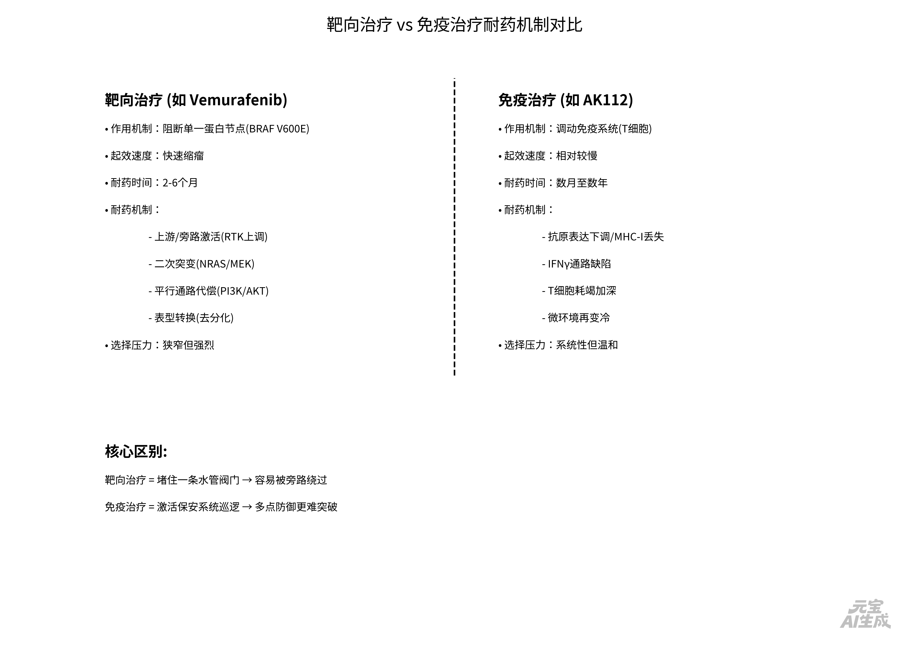
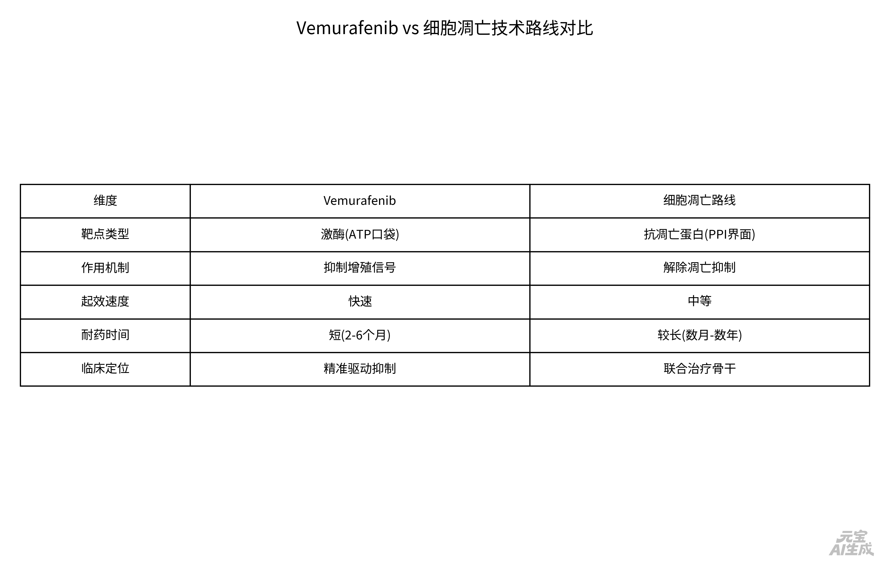

## 目前艾滋病有药物治疗吗

## 核心结论

**艾滋病现在有成熟、有效的治疗药物，但它目前仍无法被完全根治，只能长期控制**：

全球通用的标准治疗方案是「抗逆转录病毒治疗（ART，也就是俗称的鸡尾酒疗法）」，联合2~3种不同作用机制的药物抑制HIV复制。

------

## 规范治疗能达到什么效果？

只要确诊后尽早启动治疗、每天规律吃药（依从性≥95%）、定期监测，就能实现：

1. 血液中病毒载量降到**检测不到的水平**（此时基本没有性传播风险，也就是医学界公认的「U=U：测不到=不传染」）；
2. 免疫CD4细胞逐步恢复，不会发展到艾滋病期（出现各种机会感染、肿瘤），预期寿命可接近普通健康人群，现在多数人每天只要吃1片复方制剂就可以维持。我国现在抗病毒治疗的成功率已经超过95%，国家还有「四免一关怀」政策，为感染者提供免费的一线抗病毒药物。

------

## 目前的治疗局限

现有药物只能抑制活跃的病毒，**清不掉体内少量潜伏在细胞里的休眠病毒库**，所以一旦停药病毒就会反弹，绝大多数患者需要终身服药，不存在吃一段时间药就能停的「根治」方案。

全球仅有极少数特殊病例（比如患白血病同时做了CCR5突变干细胞移植的「柏林病人」「伦敦病人」）实现了长期缓解，但这种方案风险极高、不可能普及到普通患者。目前全球都在研究功能性治愈方案（治疗性疫苗、基因编辑等），但还都处于临床试验阶段，没有落地到常规临床。

------

## 补充提醒

如果是发生了高危暴露（无保护性行为/共用针具/职业暴露等）**72小时内**还可以去当地传染病专科医院/疾控中心吃暴露后阻断药（PEP），成功率可达95%以上，越早吃效果越好。

如果需要检测/咨询，直接联系当地疾控中心是完全免费、保密的。


## 目前有在临床的药物是根治艾滋病的吗，或者有biotech专门做这类药的吗

## 简短结论先讲清楚

**截至 2026 年中，临床上仍然没有获批可常规使用的"根治艾滋病药物"。**

能用的、能救命的、指南推荐的标准方案依然是 **抗逆转录病毒治疗（ART）**——目标是把病毒压到检测不到（U=U），但需要**长期坚持**，而不是"吃一个疗程就根治"。

学术界说的"治愈"分两种：

- **功能性治愈（functional cure）**：病毒还在体内，但停药后长期不反弹、靠免疫控制 → 这是目前几乎所有 biotech 在追的目标；
- **彻底清除（sterilizing cure）**：体内完全找不到完整前病毒 → 目前只在某些极端个案（CCR5Δ32 干细胞移植）里看到过，不能当成可推广疗法。

------

## 有没有 biotech 在做？有，而且不止一家——但大多还在早期临床（Ⅰ/Ⅱ期）

下面这些是公开披露、比较有代表性的方向（**不等价于马上能用**）：

### 1) CRISPR / 基因编辑 — 试图"切掉"整合进基因组的 HIV

- **Excision BioTherapeutics**：EBT‑101（CRISPR‑Cas9 通过 AAV9 递送，切割 HIV 前病毒多个保守位点），已拿到 FDA 许可进入 **Phase I/II** 人体试验，主要是看安全性/耐受性，长期随访到 2030+ 量级。

> 这条路很前沿，但离"上市根治药"还差很多环节：安全性（脱靶/免疫反应）、到底清了多少潜伏库、能否在更多人身上复现。

### 2) 基因修饰自体细胞（CCR5 方向 / 慢病毒载体）——让免疫细胞"不怕 HIV"

- **American Gene Technologies（AGT）**：AGT103‑T（把患者自体 T 细胞体外改造，靶向让它们抵抗 CCR5‑tropic HIV），Phase I 数据里出现过"储存库指标下降、停药后延缓反弹"的信号，公司曾表示计划往更大队列推进，但**这仍是早期证据**，远未到获批治愈的程度。

### 3) 免疫新机制：双特异性 TCR / "拉出并杀掉"潜伏感染细胞

- **Immunocore**：IMC‑M113V（ImmTAX 双特异性 TCR，引导 CD8 T 细胞识别并打击 HIV 感染细胞），在 **Phase 1/2 STRIVE** 里做"中断 ART 的分析性治疗中断（ATI）"试验，公开口径是**耐受尚可 + 看到一些抗病毒信号**，但仍在高剂量/扩展阶段推进。

### 4) 广谱中和抗体（bNAbs）、潜伏激活剂 + 免疫组合（"shock & kill / block & lock"家族）

- bNAb 双抗组合（如 3BNC117‑LS + 10‑1074‑LS）在受控试验里能**延长停药不反弹的时间**，但多数人在数周到几个月内仍会反弹；所以它更像是"争取缓解窗口"，不是确定根治。
- 一些 TLR7/TLR9 激动剂、N‑803 等也在配合试验，但整体仍处在证明"谁能稳定控制、谁只是延迟"的阶段。

### 5) 治疗性疫苗 / DNA 疫苗（偏"功能治愈"思路）

- 香港的 **Immuno Cure** 在做 ICVAX（HIV DNA therapeutic vaccine）路线，披露过 Phase I 完成、瞄准 Phase II 的信息，属于同一类"想让免疫系统长期压制"的方向。

------

## 你该怎么理解这些新闻（很重要）

- **"进入临床"≠"快上市了"≠"能根治"**：上面这些大多在 Ⅰ/Ⅱ 期，失败率很高；并且很多试验的"疗效终点"并不是永久停药，而是**分析性停药后多久反弹**——这跟普通人理解的"治好了"不完全是一回事。
- 真正已经改变生活的"新药"，更多是**让 ART 更省事**：长效注射（如 Cabenuva 每1～2个月一针、Lenacapavir 研究到更长间隔）+ 每天1片复方——它们是"控制方案进化"，不是根治。

如果你愿意告诉我：**你是出于行业/投资视角问（想追踪哪类管线/适应症/机制优先级），还是个人/亲友感染需要决策下一步（要不要参与临床试验、怎么跟医生谈）**，我可以把上面这些 biotech 按「更接近现实落地 vs 更科幻但高风险」给你排个优先级，并标注哪些在中国可能有研究中心入组。


# 为什么外源性的艾滋病也要用靶向治疗

你这里的“外源性”说得其实很准：**HIV 是从外界感染来的病毒（不是你自己的基因坏了）**。但正因为它是**病毒**，而且是一种会把自己“藏进你细胞染色体里”的逆转录病毒，所以人类才被迫走**精准靶向**这条路（也就是 ART / 抗逆转录病毒靶向方案），而不是像对付很多细菌那样“粗暴扫荡”。

## 1) HIV 最大的麻烦：它很快就不再是“外源物”，而变成了“半内部零件”

- HIV 进入细胞后，会用**逆转录酶**把 RNA 变成 DNA，再用**整合酶**把这段病毒 DNA **插到你免疫细胞（主要是 CD4 T 细胞等）的染色体里**。
- 于是它就形成了**潜伏感染/病毒库**：外表看不出来，也不怎么产生蛋白，免疫系统很难识别，药物也碰不到它（它这时候像个“潜伏间谍”，不发电报）。
- 所以你就算把**血液里游离病毒**压没了，它还能躲在细胞基因组里等机会反弹——这就是为啥需要长期控制，而不是一次“清体外毒素”式处理。

## 2) 为什么不能“广谱杀灭/一把药通杀”？

病毒不像细菌那样有很多只在细菌里存在、而人体细胞完全没有的结构。HIV 复制高度依赖**你自己的细胞机器**：

- 杀病毒如果太“泛”，往往会**把正常细胞也一起重伤**（比如影响细胞分裂、线粒体、肝肾代谢等）。
- 因此必须找“病毒特有的或依赖度远超人体的环节”来下手——这本质上就是**靶向**：打锁，不打墙。

典型靶点是：

- **附着/融合**：不让病毒进门（恩夫韦地/融合抑制剂等）
- **逆转录酶**：阻止它把 RNA→DNA（NRTI/NNRTI）
- **整合酶**：阻止它把病毒 DNA 塞进你染色体（INSTI，现在的主力）
- **蛋白酶**：阻止它把病毒蛋白剪切成可用零件（PI）

## 3) 另一个致命现实：HIV 变异太快——必须“多点同时靶向”

HIV 的逆转录酶很粗心，复制时**突变率高**；如果只用一个靶向药，很容易筛出**耐药株**，很快失效。

这也是为什么标准方案一定是**联合靶向（至少 2–3 种不同机制一起上）**：让它同时在几道“必经工序”被卡住，耐药概率陡降到接近零（前提是依从性好）。

## 4) “靶向治疗”这个词在 HIV 里容易被误会

在肿瘤里我们说“靶向治疗”通常指：针对癌细胞特有突变/通路。

在 HIV 里，“靶向”更准确的说法是：**靶向病毒生命周期的关键酶/步骤（以及少数宿主协同因子）**，目标是——

- 在**不把人毒翻**的前提下，把病毒载量压到检测不到（U=U），
- 让免疫系统喘过气来重建，
- 防止传播与发病；但它目前仍做不到（对大多数人）把潜伏库也干净清除 → 所以叫“控制型靶向”，不叫“根治型靶向”。

------

如果你愿意，我也可以顺着你把这句话补全成一句话回答版（更口语）：

> “因为 HIV 不是一直飘在外面的东西，它会把自己的基因缝进你的细胞里；我们没法用‘广谱杀菌’不伤人，所以只能精准卡死它复制必需的几把‘钥匙’，还得几把同时卡，才能把它压到检测不到。”

你要的是科普解释，还是也想延伸到：**为什么现在靶向也攻不破‘潜伏库’、根治需要从靶向转向激活/免疫清除那一类逻辑**？我可以继续往下拆。


# 为什么vemurafenib对恶性黑色素瘤的效果只有 2 个月，癌症就产生了抗药性，而ak112 可能几年才有抗药性

这是一个非常漂亮的问题——它本质上是在问：**为什么"堵住一个蛋白开关"那么容易被绕开，而"调动免疫系统"却能拖很久**。

------

## 先对齐事实：vemurafenib单药为什么"2～6个月就耐药"

Vemurafenib 只做一件事：**堵住 BRAF V600E 这个激酶的口袋**，让它不能往下传信号（MAPK通路：BRAF→MEK→ERK）。见效极快、缩瘤极猛——但问题在于：

### 🎯 它压的是一条通路的**一个节点**，而这条通路有无数条"后门"

肿瘤不需要发明新东西，它只需要把这条通路从**旁路上重新点亮**：

| 逃逸方式            | 具体发生了什么                                               |
| ------------------- | ------------------------------------------------------------ |
| **上游/旁路激活**   | vemurafenib压下ERK后，负反馈解除 → RTK（PDGFR、EGFR、IGF-1R、MET、AXL）上调 → 通过NRAS → 重新激活MAPK，**完全绕过BRAF** |
| **二次突变**        | 克隆本来就异质：进展灶里检得到 **NRAS Q61突变**、**MEK1突变（Q56P/E203K）**、BRAF扩增或剪切异构体 |
| **平行通路代偿**    | PI3K-AKT-mTOR 被拉起来替补，细胞照样活                       |
| **表型转换/去分化** | 黑色素瘤可以向非色素/间充质样转，减少对MAPK依赖              |

**一句话总结：** vemurafenib制造了一个**极窄但极强**的选择压力——凡是碰巧自带旁路开关的稀有克隆，立刻被"筛选"成主流，几代细胞周期就翻盘了。

> 补一句：vemurafenib **+ MEK抑制剂（cobimetinib）** 做"垂直联合"把PFS从~5个月拉到~12个月，恰恰证明——不是BRAF不该打，而是**单节点不够**。

------

## 那 AK112（PD-1/VEGF双抗）为什么能"拖几年"？

**先澄清**：AK112 的 mPFS 也不是几年——在PD-L1+ NSCLC一线，HARMONi-2里 mPFS ≈ **11.1个月** vs pembro 5.8个月。真正厉害的不是"永不耐药"，而是：

### 🧬 它的起效对象不是一个蛋白，而是一个**系统**

```
AK112 做的事：
  PD-1阻断 ──→ 松开T细胞刹车（重新激活抗肿瘤免疫）
  anti-VEGF ──→ 正常化肿瘤血管 + 减少Treg/髓系抑制细胞 → 免疫微环境变"热"
```

一旦起效，**杀肿瘤的不是AK112自己，而是患者自身的T细胞阵列**——一套带着TCR（T细胞受体）多样性的"活体侦察部队"。

### 为什么这套系统更难被"绕开"？

| 靶向药耐药                                         | IO的"慢耐药"                                                 |
| -------------------------------------------------- | ------------------------------------------------------------ |
| 只需改**一个点**（突变/扩增/旁路）→信号恢复→药失效 | 要同时破坏**一张网**：抗原表达↓、MHC-I丢失、IFNγ通路坏掉、T细胞耗竭加深、微环境再变冷……**多点协同突变的概率低得多** |
| 药效 = 药物浓度×靶点占有率（停药就没）             | 有效者会形成**免疫记忆**（CD8⁺记忆T细胞、CD4⁺ Th1）——相当于在体内留了个"巡逻队" |
| 肿瘤克隆只要找到一条旁路就赢                       | 肿瘤即使丢掉某个抗原，还有其他肿瘤抗原可提呈（抗原广度）     |

这就是免疫治疗的经典**"拖尾效应"曲线**——Kaplan-Meier图上右侧那条长尾巴：大部分人PFS一般，但一小批人确实多年不进展甚至达到临床长期缓解。

### 但它也不是"不耐药"

免疫治疗也有获得性耐药，机制更复杂更难预测——只是它**不是"几个月就翻盘"的模式**，而是：一部分人从来不响应（冷肿瘤/低TMB/低炎症），少数响应者在数月～数年后的确进展，但整体曲线右移了。

------

## 核心对比：一句话讲透

> **Vemurafenib 是在堵一条水管的阀门——聪明，但水管会爆另一条支路；AK112 是在把保安系统修好让保安自己巡逻——慢热，但保安的"识别方式"不是单一密码，所以更难被一次性骗过去。**

------

## 如果你在看的是研发角度的深层含义

这其实是整个 oncology 领域过去15年学到的最贵的一课：

- **单一致癌驱动 × 单一抑制剂 = 必然被进化绕过**（不只是BRAF，EGFR TKI也是同样剧本：9-14个月耐药→二代/三代→四代仍在追）
- 真正延长 durable response 的路只有两条：**垂直联合**（同一通路多节点一起压，如BRAFi+MEKi，或EGFR+MET）**换成"系统级"机制**（IO、细胞治疗、ADC的旁观者效应也算广义的"系统杀伤"）

如果你是想把这套逻辑整理成**presentation/论文论述框架**（比如靶向 vs 免疫的耐药动力学对比图），我也可以帮你画一个"选择压力-克隆演化-耐药时间轴"的结构框图出来。





# vemurafenib和亚盛的细胞凋亡技术路线有什么区别

## 一句话锚定本质

**Vemurafenib 是"掐信号"——把致癌驱动通路（BRAF→MEK→ERK）的一个激酶节点关掉；

亚盛的细胞凋亡路线是"拆防火墙"——把癌细胞用来逃避死亡的抗凋亡蛋白（BCL-2 等）按住，强行恢复凋亡程序。**

它们打的根本不是同一类"锁"：一个是**酶活性口袋**，一个是**蛋白-蛋白相互作用界面（PPI）**。

------

## 核心对比（抓住差异就够了）

| 维度             | Vemurafenib（BRAF V600E 抑制剂）                        | 亚盛凋亡路线（以 APG-2575/BCL-2 BH3 模拟物为代表）           |
| ---------------- | ------------------------------------------------------- | ------------------------------------------------------------ |
| **靶点物理形态** | 激酶结构域的 **ATP 结合口袋**（经典可成药口袋）         | BCL-2 家族的 **BH3 结合沟槽（groove）**——一个大面积疏水 PPI 界面 |
| **药理本质**     | 抑制"异常增殖信号"→细胞周期停滞 + 部分促凋亡次级效应    | 解除"凋亡抑制"→**直接触发线粒体凋亡（MOMP）→caspase 级联→细胞死亡** |
| **对肿瘤的要求** | 肿瘤必须**成瘾于 BRAF V600E→MAPK**（否则单药基本没戏）  | 肿瘤必须在凋亡调控上**依赖某个抗凋亡成员**（最常见：BCL-2 高、MCL-1 相对低、BAX/BAK intact） |
| **起效观感**     | 往往缩瘤很快（几天～几周），但耐药也快（旁路/二次突变） | 更像"把死刑令签了"——在敏感肿瘤里杀伤较硬，但很多肿瘤先天/获得性不敏感 |
| **耐药主因**     | MAPK 旁路重激活（NRAS、RTK、MEK突变、PI3K等）           | 凋亡轴代偿：**MCL-1↑、BCL-xL↑、BAX/BAK 丢失/p53 丧失、IAP↑**等 |
| **临床定位**     | 精准驱动突变的"快速压制"工具                            | 更多是**联合骨架**（与 BTKi、去甲基化药、化疗、免疫等搭在一起） |

------

## 展开讲：为什么这两条路线"看起来像两个物种"

### 1）打的"锁"完全不同

- **Vemurafenib**：钻进 BRAF V600E 的 ATP 口袋，让这个激酶**转不动**→下游 MEK/ERK 磷酸化掉下来 → 增殖停止。
- **APG-2575（BCL-2 选择性 BH3 模拟物）**：不碰酶的活性，而是**模拟促凋亡蛋白的 BH3 短肽**，挤进 BCL-2 表面的那条疏水槽里，把被 BCL-2 抓着的促凋亡因子（如 BIM）**顶出去** → BAX/BAK 寡聚化 → 线粒体外膜通透化（MOMP）→细胞色素 c 漏出 → caspase 瀑布启动 →细胞死。

你可以把它想成：

- vemurafenib：**断供电**（信号停了，但灯泡还在墙上）
- BCL-2 抑制剂：**砸掉断路器锁**（直接把"程序性自杀开关"拨回 ON）

### 2）为什么亚盛要做 PPI（蛋白-蛋白界面），而不去卷激酶

BCL-2 家族那个结合面**面积大、平坦、疏水**，传统"小分子的钥匙-锁"思维很难弄——这也是为什么 BCL-2 抑制剂从 ABT-263 到 ABT-199（venetoclax）走了将近二十年。亚盛的技术底座就是围绕 **PPI 平台**去"造能占据大表面积的口服小分子"，并从 BCL-2 一路铺到 BCL-xL、MCL-1、IAP、MDM2-p53 等****。

### 3）但它们的耐药逻辑并不比激酶抑制更简单——只是换了轴

BCL-2 抑制剂常见"不响应/继发耐药"来自：

- 肿瘤其实更靠 **MCL-1 或 BCL-xL** 扛着（BCL-2 高选择性就覆盖不到）→亚盛同时有 **BCL-2/BCL-xL 双靶（APG-1252/pelcitoclax）**和 MCL-1 方向的先导管
- **BAX/BAK 基因丢失或功能受损**（凋亡终末执行器没了，你再怎么顶 BCL-2 也没瀑布）
- **IAP 上扬**（XIAP/cIAP 把 caspase 末端再掐一道）—所以亚盛还有 IAP 抑制剂 APG-1387 在管线里

所以凋亡路线不是"更无敌"，而是**杠杆更深**：它一旦匹配上生物标志物（比如 CLL/SLL 那种 BCL-2 成瘾、或 t(11;14) MM 等场景），杀伤比"只掐信号"更干脆；但如果标志物不对，单药也就卡住了——所以它最终的价值更多体现为**联合方案的"死亡开关模块"**。

------

## 亚盛凋亡管线的"拼图"长什么样（很关键）

他们的策略不是只做一个 BCL-2，而是把**凋亡通路上多个关键 PPI 节点**分别占住：

- **BCL-2 选择性**：APG-2575（利生妥/lisaftoclax）—已在国内附条件获批 CLL/SLL
- **BCL-2/BCL-xL 双靶**：APG-1252（pelcitoclax）
- **MDM2-p53 拮抗剂**：APG-115（想把 p53 野生型的"凋亡许可"打开，再配 BCL-2 抑制）
- **IAP 抑制剂**：APG-1387（针对 XIAP/cIAP 这一层的 caspase 抑制）
- **MCL-1 方向**：先导弹头/先导化合物（如文稿中提到 AS00491/APG-3526 类）

这条路线的哲学是：**肿瘤不只靠一个驱动信号活着，它还主动把"自杀通道"焊死；你要么双管齐下，要么把焊死处逐个撬开。**

------

如果你愿意，我可以再把这两套逻辑画成一张**同一张"细胞生存/死亡天平"示意图**——左边标 vemurafenib 压的 MAPK（增殖输入），右边标亚盛拆的 BCL-2/MCL-1/IAP（凋亡抑制输出），中间是 p53/BAX 那条线，这样你看一眼就知道为什么它们经常被拿来**做搭档而不是二选一**。




# vemurafenib和亚盛做的细胞凋亡，哪个更容易耐药


## 结论先说：**vemurafenib 更容易耐药，而且快得多**（以月计）；亚盛的细胞凋亡路线耐药模式不同——更多是**"先看你配不配对得上，配上了反而更硬"**。

但有一句很重要的前提要加上：

> **凋亡路线的"难"，很多时候不是获得性耐药快，而是原发性耐药（根本不响应）比例高**——它是另一种维度的挑战。

------

## 1）为什么 vemurafenib 的耐药几乎是"注定剧本"

它压的是一个**单一信号节点** BRAF→MEK→ERK，而这个通路天生带着一堆备用入口：

- **旁路 RTK 上调**（PDGFR、c-MET、AXL、EGFR…）→ 通过 NRAS → 重新喂饱 MEK
- **二次突变**：NRAS Q61R/K、MEK1 突变、BRAF 扩增/剪切变体
- **平行通路**：PI3K–AKT 代偿
- **表型转换**：向去分化/间质样滑，降低对 MAPK 的依赖

这些逃逸方式不需要"发明新东西"，肿瘤本来就有这些开关，只是被 vemurafenib 造成的负反馈解除后**释放出来**。**单节点抑制 = 强选择压力压在一个窄口 = 旁路克隆迅速被筛选上来** → 2–6 个月翻盘是规律，不是意外。

而 vemurafenib + MEK 抑制剂把 PFS 拉到 ~11–12 个月这件事本身就证明了：**单节点不够，垂直联合才能延命**——但也只是延命，不是解决根本问题。

------

## 2）细胞凋亡路线（BCL-2 选择性 BH3 mimetic）为什么"耐药动力学"不一样

### 它压的不是一条信号水管的阀门，而是**细胞死或不死的判决执行层面**

APG-2575 / venetoclax 做的是：挤进 BCL-2 的 BH3 groove → 把被扣押的促凋亡蛋白（BIM、t-BID 等）**顶出来** → BAX/BAK 寡聚化 → 线粒体膜破溃 → caspase 级联 → **细胞死**。

关键点：**这里不存在"MAPK 那种同通路旁路"**——因为 BCL-2 抓 BH3 是个相对专属的物理锁扣，你不能简单地用"另一条路"替代 BCL-2 的功能（至少在 BCL-2–addicted 肿瘤里不行）。

### 那它怎么耐药？——换了一类机制：

| 耐药类型                           | 具体表现                                                     | 为什么它不等同于"vemurafenib 式快耐药"                       |
| ---------------------------------- | ------------------------------------------------------------ | ------------------------------------------------------------ |
| **原发性不响应（更常见的瓶颈）**   | 肿瘤其实靠 **MCL-1 或 BCL-xL** 扛着，而不是 BCL-2 → BCL-2 选择性抑制剂单药纹丝不动 | 这不是"后来耐药"，而是**一开始就没匹配上**——所以临床价值全靠 biomarker（BCL-2/MCL-1 比值、t(11;14)、BAX/BAK intact）来筛选 |
| **获得性耐药（相对慢、更情境化）** | MCL-1↑/BCL-xL↑ 转录后上调；BAX/BAK 丢失；p53 通路塌了；IAP（XIAP）升高把 caspase 末端再掐住 | 需要多个点协同失调才翻盘，概率低一些，**时间轴更偏数月→更长**；但也意味着单药在长期内仍会被绕过 |
| **微环境庇护**                     | 基质/骨髓微环境给肿瘤细胞提供存活信号（IL-6、CD40L、VCAM-1 等），削弱 BCL-2 抑制剂的"裸杀"优势 | 这也是为什么它最终大量走向联合（BTKi、去甲基化药、免疫、BCL-xL/MCL-1 覆盖） |

### 亚盛的多靶点布局本身就是对耐药的答案

他们不只做一个 BCL-2：

- **BCL-2 selective**（APG-2575）→ 解决 BCL-2 addicted（CLL/SLL 这类最匹配）
- **BCL-2/BCL-xL dual**（APG-1252）→ 覆盖一部分 MCL-1/BCL-xL 代偿
- **IAP**（APG-1387）→ 堵 caspase 末端那道锁
- **MDM2-p53**（APG-115）→ 把 p53 野生型的"凋亡许可证"打开

逻辑很清楚：**凋亡轴耐药的应对不是"加大剂量"，而是横向补齐互补节点（或找对的搭档）。**

------

## 3）一句话总结

|                          | vemurafenib                | 亚盛凋亡路线（BCL-2 选择性）                           |
| ------------------------ | -------------------------- | ------------------------------------------------------ |
| **获得性耐药来得有多快** | ⚡ 很快，2–6 个月是典型     | 相对慢，但…                                            |
| **真正的硬伤**           | 旁路重生（同通路多入口）   | **原发性不匹配**（肿瘤不靠你抓的那个蛋白）             |
| **"容易耐药"的含义**     | 几乎必然被绕，只是时间问题 | 配对对了不一定快耐药，但**配对错了等于从第一天就无效** |
| **解法**                 | 垂直联合（BRAFi+MEKi）     | Biomarker筛选 + 横向补轴（MCL-1/BCL-xL/IAP）+ 联合方案 |

所以如果你的问题是**"哪个更容易出现耐药"**——答案是 **vemurafenib 更容易、更快、更可预测**。

但如果你投研/战略角度问的是**"哪个的临床风险更大"**——凋亡路线的风险不在"几个月就耐药"，而在 **Patient Selection（你到底筛不筛得准）和联合策略（单药天花板明显）**，这两个才是决定它能不能跑出来的真门槛。

------

如果你愿意，我可以把这两者的**耐药进化动力学画成一张"选择压力–克隆演化时间轴"草图**（vemurafenib 是陡峭窄峰，凋亡是宽缓但带高原发性淘汰率的曲线），对做 deck 或技术路线论证会很有用。


# 列出 2022 年 5 月到今天，康方生物做的主要事件

下面按**时间轴**，把康方生物（**9926.HK / Akeso**）从 **2022/5 → 2026/6/21** 的**主要事件**梳理出来（偏“硬事件”：获批/申报、关键临床、BD/合作、医保准入）。

------

## 2022

- **2022/06/29｜卡度尼利（开坦尼®，PD‑1/CTLA‑4双抗，AK104/cadonilimab）首次NMPA获批**用于**既往含铂化疗失败的复发/转移性宫颈癌**（全球首个获批的肿瘤免疫双抗之一、国内首个双抗新药级别里程碑）
- **2022/11｜依沃西（AK112/ivonescimab）获CDE三项突破性治疗认定（肺癌为主）**
- **2022/12｜与 Summit Therapeutics 签署许可/合作：AK112部分海外权益（美/欧/加/日）对外授权**首付 **5亿美元**，总潜在金额最高可到**约50亿美元**＋销售净额**低双位数提成**（当时中国创新药对外许可金额级纪录）

------

## 2023

- **2023/08｜依沃西（AK112）首个NDA获CDE受理并获优先审评**（用于后续2024/5获批的那个适应症路径）

------

## 2024（双抗商业化+“头对头击败K药”叙事集中爆发）

- **2024/05/24（官宣：5/30发货）｜依沃西（依达方®，PD‑1/VEGF双抗，AK112/ivonescimab）获NMPA批准**适应症：**EGFR‑TKI进展后的局部晚期/转移性非鳞NSCLC**（并被描述为“免疫+抗血管”机制双抗维度的首个获批）随后进入商业发货与终端铺货（首批货值过亿级口径的公司传播信息）。
- **2024/05/31｜HARMONi‑2（AK112‑303）IDMC期中分析达主要终点：依沃西单药 vs 帕博利珠单抗（K药）一线PD‑L1阳性NSCLC，PFS显著改善**——“头对头优于K药”的关键临床事件
- **2024/08｜中期业绩/业务更新口径：依沃西上市放量、HARMONi‑A是唯一在所有亚组显示PFS显著获益的III期等证据继续被公司用来强化学术与商业化叙事**
- **2024/09/30｜卡度尼利** **二线适应症之外，拿下“全人群”的重要扩围：NMPA批准其联合化疗用于局部晚期不可切除/转移性** **G/GEJ腺癌一线治疗**
- **2024 WCLC/ESMO季｜依沃西大量数据披露**：包括HARMONi‑2的PFS绝对值/HR、围术期NSCLCⅡ期口头报告、TNBCⅡ期、mCRC组合探索等（属于“证据积累”类大事件）
- **2024/11-12｜医保谈判结果落地口径：卡度尼利 + 依沃西被纳入新版国家医保目录（相关适应症2025/1/1起执行）**

------

## 2025（适应症继续扩围 + 自免/代谢补齐版图 + 海外路径推进）

- **2025/03｜HARMONi‑2数据登上 \*The Lancet\***（把“优于K药”证据放进顶级期刊，学术地位型事件）
- **2025/04/26｜依沃西获NMPA批准：一线 PD‑L1阳性 NSCLC（基于那项头对头III期）**→ 这条是把“头对头阳性”转化为**新适应症上市批准**的关键监管事件。
- **2025/04｜爱达罗®（依若奇单抗，IL‑12/IL‑23，AK101/ebdarokimab）NMPA获批：中重度斑块状银屑病**
- **2025/04｜派安普利单抗（安尼可®，PD‑1）获FDA批准（鼻咽癌两项适应症）**——康方口径下“首个自主研发全程主导并获FDA批准”的事件
- **2025/04｜上药控股与康方战略合作签约**（围绕卡度尼利/依沃西/伊努西的全国渠道合作）
- **2025下半年｜更多管线推进**：例如公司披露 **AK152（双抗/三抗方向）进入临床**、**个性化mRNA疫苗Ⅰ期首例给药**等（属于“平台扩展”信号）
- **2025/12｜医保口径更新：康方披露5个新药相关适应症谈判结果，强调纳入/新增纳入医保的执行信息**（2026年起执行口径）

------

## 2026至今（到 2026/06/21）

- **2026/01｜依沃西说明书更新/补充数据事件**：NMPA侧出现“说明书纳入III期最终分析数据、显示显著生存获益”的公开记录节点
- **2026/01｜海外路径动作**：合作方 **Summit披露向FDA提交依沃西相关BLA（EGFR‑TKI耐药后NSCLC场景）并提及与GSK的ADC联用探索合作**
- **2026上半年｜管线更前端事件**：例如 **AK150（三抗）首次获批临床**这类早期R&D信号出现在公开记录中
- **2026/06/11｜自免线再下一城：古莫奇单抗（奇佑康®，AK111，IL‑17）获批上市（中重度斑块状银屑病）**——康方官网新闻稿口径

------

### 如果你想把它做成“更像年报附录/投资笔记”的清单

我可以再把每条后面补上：**对应适应症/注册路径（NDA/sNDA/BLA）→ 公告日期 → 信息来源链接**，或者按你关心的维度（只看肿瘤双抗 / 只看BD现金流 / 只看医保价格冲击）再做一版精简表。你更想按哪种口径收束？


# 介绍：ALXO公司

# ALX Oncology Holdings Inc. (NASDAQ: **ALXO**)

------

## 📌 一句话概括

**ALX Oncology（ALXO）是一家临床阶段免疫肿瘤学生物技术公司**，核心策略是通过阻断癌细胞用来"隐身"的 **CD47 检查点通路**，唤醒人体先天免疫系统去识别并吞噬肿瘤细胞。

------

## 🏢 公司基本信息

| 项目         | 详情                                                         |
| ------------ | ------------------------------------------------------------ |
| **公司全称** | ALX Oncology Holdings Inc.                                   |
| **股票代码** | ALXO（纳斯达克）                                             |
| **成立时间** | 2015年（由 Corey Goodman、Jaume Pons、K. Christopher Garcia 创立） |
| **总部**     | 南旧金山，加州（323 Allerton Avenue, South San Francisco, CA 94080） |
| **CEO**      | Jason W. Lettmann                                            |
| **员工数**   | ~43人（精简型biotech架构）                                   |
| **IPO日期**  | 2020年7月17日（发行价 $19.00）                               |
| **官网**     | [alxoncology.com](https://www.alxoncology.com/)              |
| **所属行业** | 生物技术 / 医疗保健                                          |

------

## 🧬 科学核心：CD47 — "别吃我"信号

癌细胞表面会高表达一种叫 **CD47** 的蛋白质，它向巨噬细胞发送 **"别吃我"（Don't Eat Me）** 信号，让免疫系统对肿瘤"视而不见"。

> **ALXO 的思路很简单但很巧妙**：用一种 engineered fusion protein（evorpacept / 曾用名 ALX148）把 CD47 位点堵住 → 解除"别吃我"伪装 → 巨噬细胞就能认出并吞噬癌细胞——**尤其是当它与已上市的靶向抗体（如曲妥珠单抗、利妥昔单抗等）联用时效果最佳**。

关键差异化设计：**Fc 结构域被刻意沉默（Fc-silenced）**，大幅降低与传统 CD47 抗体相关的 **红细胞毒性/血液毒性** 风险——这是整个 CD47 赛道前辈们（如 Gilead 的 magrolimab）翻车的地方。

------

## 💊 研发管线

### ① **Evorpacept（ALX148）—— 核心资产 · CD47 阻断融合蛋白**

| 维度         | 内容                                                         |
| ------------ | ------------------------------------------------------------ |
| **机制**     | 高亲和力 CD47 结合蛋白，Fc 沉默，阻断"别吃我"信号            |
| **开发策略** | **联合疗法为主**（本身不是单药故事，而是"放大器"）           |
| **关键临床** | **ASPEN-06**：Evorpacept + 曲妥珠单抗 + 雷莫西尤单抗 + 紫杉醇 → **Phase 2/3**，针对 **HER2+ 胃/胃食道交界腺癌（Gastric/GEJ）** |
|              | **ASPEN-09**：Evorpacept + 曲妥珠单抗 + 化疗 → **Phase 1**，针对 **转移性 HER2+ 乳腺癌** |
| **合作伙伴** | • **Jazz Pharma**（zanidatamab 组合，HER2-expressing cancers） • **Sanofi**（Sarclisa/isatuximab 组合，复发/难治多发性骨髓瘤） • **MD Anderson**（rituximab + lenalidomide，NHL） |
| **状态**     | 多项 Phase 1/2 试验进行中，覆盖实体瘤和血液瘤                |

### ② **ALX2004 —— 第二梯队 · EGFR 靶向 ADC**

| 维度       | 内容                                                         |
| ---------- | ------------------------------------------------------------ |
| **机制**   | 新型 **EGFR 靶向抗体偶联药物**（Antibody-Drug Conjugate）    |
| **特点**   | 利用自有 **linker-payload 平台**（拓扑异构酶 I 抑制剂 payload），每个组件都经过优化以 **扩大治疗窗口、降低毒性** |
| **适应症** | EGFR 表达的实体瘤（NSCLC、CRC、HNSCC、ESCC 等）              |
| **状态**   | **Phase 1** 剂量递增试验进行中（IND 已获 FDA 许可，首批安全性数据预期 1H 2026） |

------

## 💰 财务快照（近期）

| 指标                | 数值                                                        |
| ------------------- | ----------------------------------------------------------- |
| **市值**            | ~1.9–2.6亿美元（随股价波动，当前价位1.4–1.6 区间）          |
| **现金储备**        | 约 **$1.86 亿**（截至 2024Q4 披露，公司称可运营至 2026 年） |
| **营收**            | $0（临床阶段，无上市产品）                                  |
| **Non-GAAP 净亏损** | ~88.8M（2025全年）/ 20.1M（2025Q4）                         |
| **每股账面价值**    | ~$0.48                                                      |
| **市盈率**          | N/A（亏损中）                                               |

⚠️ **估值警示**：ALXO 股价从 IPO 19一路回落至1–2 区间，属于典型的 **小市值临床阶段 biotech**——高波动性、二元化风险（临床数据好→暴涨，数据差/安全性问题→暴跌）。

------

## ⚖️ 投资/关注角度的关键要点

**看多逻辑：**

- CD47 靶点是经过验证的巨型机会，evorpacept 的 **Fc 沉默设计** 解决了前辈未能解决的安全性瓶颈
- 联合疗法策略切入口务实（搭已有上市抗体的便车）
- 精简团队 + 大药企合作分担成本（Jazz、Sanofi）降低烧钱速度
- ASPEN-06（胃癌）Phase 2 数据曾带来过正面催化剂

**主要风险：**

- **临床阶段尚无获批产品**，所有价值都在管线里
- CD47 赛道竞争与历史包袱（magrolimab 的失败让市场对该靶点敏感）
- 小市值 + 低股价 → 融资灵活性受限，存在进一步 dilution 风险
- 关键临床读出时间点集中，属于 **事件驱动的二元博弈**

------

如果你告诉我你关注的是 **投资角度（估值/催化剂时间表/风险评估）** 还是 **行业研究角度（CD47 赛道竞争格局 vs. Forty Seven/Gilead/MacroGenics 等）**，我可以再往下钻一层，帮你做更细的对比分析。


# ADCC的功能在ICI机制中存在争议

这是什么意思：ADCC的功能在ICI机制中存在争议，举个例子，Y药的ADCC效应被认为减少了Treg，减少了免疫抑制，增强了抗肿瘤效果，所以这个ADCC的机制在ICI应用中单独拿出来究竟起到什么样的作用目前还不够确定，但IL-6和IL-8更为确定，目前大量的临床数据基本确证了这个机制

小分子药物设计与双特异性抗体（双抗）设计代表了两种截然不同的“药物创造哲学”——一个是**化学层面的精准锁钥**，另一个是**生物层面的空间架构师**。它们最根本的区别在于：**小分子是化学合成的、能自由扩散的“小物件”；而双抗是活细胞表达的、庞大且精密的“蛋白质机器”**。

下面我们从六个核心维度彻底拆解这个区别：

## 1. 作用机制与可及靶点：不是同一种战场

| 维度         | 小分子设计                                                   | 双抗设计                                                     |
| ------------ | ------------------------------------------------------------ | ------------------------------------------------------------ |
| **核心逻辑** | 找到能嵌入蛋白**口袋/活性位点**的化学结构（通常是疏水、可合成的有机分子）。 | 创造一种蛋白，其**两个臂（或结构域）能同时结合两个不同的靶点/表位**，强行拉近距离或重新定向免疫细胞。 |
| **主要靶点** | **酶口袋、受体胞内域、离子通道**等——凡是能有“口袋”且**小分子能到达**的地方。 | **细胞外表面抗原、膜蛋白**。几乎无法穿透细胞膜，只能作用于细胞“外壳”。 |
| **经典例子** | 伊马替尼（靶向BCR-ABL激酶口袋）、阿司匹林（靶向COX酶活性位点）。 | Blinatumomab（CD19×CD3，把T细胞拉到肿瘤细胞旁）、Emicizumab（IX×X，模拟凝血复合体）。 |

**关键洞察**：小分子擅长“**堵住一个开关**”（抑制酶活性或信号）；双抗擅长“**在空间中建立一座桥**”或“**给免疫细胞装上一个新导航仪**”。

## 2. 设计起点：从晶体结构 vs 从抗体序列

- **小分子设计**的起点往往是：**一个明确的靶点蛋白结构（X射线晶体/冷冻电镜）+ 一个可成药口袋**。设计师像玩乐高一样，用**虚拟筛选、骨架跃迁、基团替换**来修饰分子，让它结合得更紧、代谢更稳定。**“形状互补”和“疏水/氢键网络”是语言**。
- **双抗设计**的起点更复杂：你需要**两个已经存在或新发现的抗体（或结合域）**，或者至少要明确**两个你想连接的抗原**。设计重点不在“锁钥”，而在**架构**：如何把两条不同的重链/轻链正确组装？如何让两个结合臂不互相干扰？如何避免被免疫系统当异物攻击（免疫原性）？

## 3. 构建与优化循环：“烧瓶反应” vs “细胞工厂”

这是工作流程上最直观的差异：

| 步骤         | 小分子设计（Chemistry）                                      | 双抗设计（Bio-engineering）                                  |
| ------------ | ------------------------------------------------------------ | ------------------------------------------------------------ |
| **原型产生** | **有机合成**（几步到几十步反应），毫克级样品几天到几周可得。 | **转染哺乳动物细胞（如CHO细胞）→ 培养 → 纯化**，第一批蛋白需数周到数月。 |
| **优化参数** | 专注**化学修饰**：提高 potency、改善 PK（半衰期）、降低毒性（脱靶/肝毒性）、增加水溶性。 | 专注**蛋白工程**：优化亲和力、调整价态、改造Fc段（改变半衰期或效应功能如ADCC）、稳定异源二聚体（Knob-into-Hole等技术）、降低聚集。 |
| **迭代速度** | 可以并行合成数百个类似物（“快进快出”）。                     | 每次构建都要走表达-纯化-功能验证，循环慢得多，成本高。       |

## 4. 成药性挑战：完全不同的“坑”

- **小分子的地雷**：水溶性差、代谢太快（CYP450酶）、心脏毒性（hERG风险）、不吸收/不透过血脑屏障、脱靶毒性源于化学相似性。
- **双抗的地雷**：**错配组装**（轻重链胡乱配对产生无效同二聚体）、稳定性/聚集导致粘度高难以注射、免疫原性（非人序列残留）、分子太大（~150 kDa）**无法进入实体瘤深处**（只停留在血管/间质边缘）、生产成本极高。

## 5. 生产模式：化工 vs 生物工艺

这可能是商业上最痛的区别：

- 小分子 = **精细化工**。一旦路线锁定，可以万吨级发酵/化学放大，成本低，纯度易控，口服方便。
- 双抗 = **生物制药**。依赖活细胞“酿造”，每批次需严格监控细胞状态，纯化步骤繁多（Protein A层析等），成本高昂，几乎只能注射给药。

## 6. 它们正在相互借鉴

虽然本质不同，但前沿在设计哲学上有融合：

- **小分子想获得特异性**：出现了**PROTAC**（用一个小分子 linker 连两个配物，把蛋白拉到E3连接酶旁降解——本质是“用小分子实现双功能/‘桥梁’逻辑”）。
- **双抗想变小**：出现了**纳米抗体（VHH）/小型化双抗**（缩小体积，改善穿透性）和**ADC**（抗体连上细胞毒小分子，把小分子的“杀力”用抗体精准投送）。

## 一句话总结你的疑问

**小分子设计是“雕刻一把完美的钥匙去独守一个锁孔”；双抗设计是“搭建一座有识别功能的双向天桥，强制两个原本不碰面的细胞握手”。** 前者是化学的胜利，后者是生物工程的造物。

如果你告诉我你关注的是**哪个治疗领域**（如肿瘤、自免）或**具体靶点类型**（激酶？GPCR？膜蛋白？），我可以把上述框架落到更具体的案例上。


# 给我阿卡替尼和伊布替尼竞争数据

下面给你一份**阿卡替尼（Acalabrutinib / Calquence）vs 伊布替尼（Ibrutinib / Imbruvica）竞争要点卡片**——覆盖**销售体量、份额趋势、以及决定替代的临床/安全证据**。

------

## 1) 销售体量（最核心的“竞争温度计”）

> 口径提醒：伊布替尼收入通常被拆成**艾伯维报表确认应收**（偏美国/直接）vs **强生Janssen合作分成**两部分；很多媒体会把两边混着报，所以你会看到“60亿+”和“30+亿”两种口径并存的叙述。

| 产品                                              | 公司        |                                         关键公开口径（约数） | 备注                                                     |
| ------------------------------------------------- | ----------- | -----------------------------------------------------------: | -------------------------------------------------------- |
| **伊布替尼（Imbruvica）**                         | 艾伯维/强生 | **2023 年常被引述“突破60亿美元”量级**（接近峰值后回落区间）；**艾伯维年报口径2024 = 33.47亿美元（同比 −6.9%）** | 峰值约**98亿美元**（2021前后），此后在二代BTKi冲击下转跌 |
| **阿卡替尼（Calquence/Acalabrutinib）**           | 阿斯利康    | **2023 ≈ 25.14亿美元（+22%）**；**2024 ≈ 31.29亿美元（+24%）**（阿斯利康年报口径营收） | 核心增长来自CLL/SLL+MCL增量渗透                          |
| **泽布替尼（Brukinsa/Zanubrutinib）**（背景参照） | 百济神州    |                    **2024全球销售额≈26亿美元**，美国增速极强 | 说明二代/三代BTKi整体在抢伊布替尼存量                    |

另外的行业汇总口径：

- **2024H1 三强流水（非严格会计口径，用于看走势）**：伊布替尼≈32.25亿 / 阿卡≈15.08亿 / 泽布≈11.26亿；同比约 **−6.6% / +27% / +117%**

------

## 2) 市场份额趋势：伊布替尼在“退”，阿卡替尼在“稳吃存量”（但泽布替尼冲得最猛）

不同机构切法不同（按金额/按处方量/按新启动患者），但方向一致：

- 有分析把BTK抑制剂整体盘子拆分到**份额画像**：**伊布替尼约5成上下（仍在第一）→ 阿卡替尼约1/4 → 泽布替尼约2成并上升**（并提到某些季度泽布替尼已反超阿卡替尼拿到份额第二）
- 更“叙事型”的汇总口径也说：伊布替尼占比从早年极高位一路降到**2023约63%→2024Q1约56%**这一带（数字随统计口径浮动，但趋势可信）

一句话：**伊布替尼仍最大，但增长逻辑已经变成防守（降价/专利策略/生命周期管理）；阿卡替尼吃到的是“更安全二代”的结构性替代；泽布替尼则用头对头证据+美国放量抢速度。**

------

## 3) 竞争真正的“刀口”：ELEVATE‑RR 头对头（阿卡替尼 vs 伊布替尼）的安全/耐受性优势

阿卡替尼之所以能对伊布替尼形成替代，核心不在于“更强杀瘤”（它主打**非劣+更好耐受**），关键证据就是 **ELEVATE‑RR（NCT02477696）**：

- **设计**：开放标签、随机、**非劣效**Phase 3；**既往治疗、高危CLL（del17p/del11q）**；主要终点=**PFS非劣**
- **疗效结论（竞争意义）**：阿卡替尼 **PFS不劣于伊布替尼**（两臂中位PFS都≈38.4个月量级）
- **安全差异（这才是替代驱动力）**：**心房颤动/扑动**：**9.4% vs 16.0%**（伊布替尼更高，统计显著）**高血压发生率**：**9.4% vs 23.2%****任意出血事件**：**38% vs 51.3%**（更频繁见于伊布替尼）但：**major bleeding** 两组更接近（4.5% vs 5.3%），别把“少出血”简单夸大成“没出血风险”
- 细节补充：事后分析也显示伊布替尼组腹泻、关节痛、尿路感等更突出；阿卡替尼组则**头痛/咳嗽**略多，但整体**因AE导致用药中断率更低（HR≈0.62）**

> 临床竞争的落地含义：在**老年/心血管合并症多/抗凝联用难**的CLL人群里，医生更愿意把伊布替尼换成阿卡替尼（或泽布替尼）——这是份额迁移的“医学原因”。

------

## 4）你想怎么用这组数据？

如果你告诉我用途，我可以把上面再压成你要的版本（含可引用的数字表格/图表骨架）：

1. **商业尽调/PPT**：要“市场容量—增速—毛利率/费用率—专利悬崖时间点—仿制药风险”？
2. **医学/准入**：要按适应症拆（CLL一线 vs R/R、MCL、其他探索）？
3. **中国视角**：要把国内样本医院/医保谈判/齐鲁等首仿影响叠进来？（搜索结果里也提到国内伊布替尼已出现仿制药批件与价格压力）

你回我一句：**你关注的是“全球现金竞争”还是“中国市场替代路径”**，以及**你需要到哪一年（2024实际 vs 2025E vs 2030E）**，我就把口径补齐成可直接放进deck的数字包。


# 研究的主要终点为IRRC评估的PFS，次要终点为OS，单侧α=0.025。什么叫单侧α

α（alpha）是临床试验预先设定的**假阳性概率（Type I Error）**。

简单说：

> 明明药物没效果，却因为随机误差被判定“有效”的概率。

------

以HARMONi-3为例：

单侧 α=0.025

意思是：

> 如果AK112实际上并不优于K药，研究最多允许有2.5%的概率错误地宣布AK112获胜。

对应统计学显著性要求：

```text
P < 0.025
```

即可达到主要终点阳性。

------

为什么是单侧（One-sided）？

因为研究只关心一个方向：

```text
AK112 是否优于 K药
```

而不关心：

```text
AK112 是否劣于 K药
```

所以只计算一边尾部概率。

图示：

```text
双侧检验

← 劣于K药       无差异      优于K药 →
    2.5%                     2.5%

总α = 5%
单侧检验

← 劣于K药       无差异      优于K药 →
                           2.5%

总α = 2.5%
```

------

因此：

| 写法        | 实际含义 |
| ----------- | -------- |
| 单侧α=0.025 | P<0.025  |
| 双侧α=0.05  | P<0.05   |

两者统计学门槛其实完全等价。

所以很多肿瘤III期研究写：

```text
One-sided α = 0.025
```

实际上相当于大家熟悉的：

```text
Two-sided α = 0.05
```

------

再结合你看的这句话：

> 主要终点为IRRC评估的PFS，次要终点为OS，单侧α=0.025

意味着：

1. 先检验PFS
2. PFS达到统计学显著
3. 才能继续检验OS（层级检验）
4. 整个试验允许的假阳性率控制在2.5%

因此市场最关注的其实不是P值是否小于0.025，而是：

- PFS HR是多少（0.8、0.7还是0.6）
- OS最终HR是多少

例如：

| PFS HR | 投资者评价             |
| ------ | ---------------------- |
| 0.85   | 勉强阳性               |
| 0.75   | 较好                   |
| 0.65   | 很强                   |
| <0.60  | 极强，接近改写标准治疗 |

对于AK112，市场普遍希望看到：

- PFS HR ≤ 0.70
- 后续OS HR ≤ 0.80

这样才有较大机会在全球范围挑战K药的一线肺癌地位。


α（alpha）是临床试验预先设定的**假阳性概率（Type I Error）**。

简单说：

> 明明药物没效果，却因为随机误差被判定“有效”的概率。

------

以HARMONi-3为例：

单侧 α=0.025

意思是：

> 如果AK112实际上并不优于K药，研究最多允许有2.5%的概率错误地宣布AK112获胜。

对应统计学显著性要求：

```text
P < 0.025
```

即可达到主要终点阳性。

------

为什么是单侧（One-sided）？

因为研究只关心一个方向：

```text
AK112 是否优于 K药
```

而不关心：

```text
AK112 是否劣于 K药
```

所以只计算一边尾部概率。

图示：

```text
双侧检验

← 劣于K药       无差异      优于K药 →
    2.5%                     2.5%

总α = 5%
单侧检验

← 劣于K药       无差异      优于K药 →
                           2.5%

总α = 2.5%
```

------

因此：

| 写法        | 实际含义 |
| ----------- | -------- |
| 单侧α=0.025 | P<0.025  |
| 双侧α=0.05  | P<0.05   |

两者统计学门槛其实完全等价。

所以很多肿瘤III期研究写：

```text
One-sided α = 0.025
```

实际上相当于大家熟悉的：

```text
Two-sided α = 0.05
```

------

再结合你看的这句话：

> 主要终点为IRRC评估的PFS，次要终点为OS，单侧α=0.025

意味着：

1. 先检验PFS
2. PFS达到统计学显著
3. 才能继续检验OS（层级检验）
4. 整个试验允许的假阳性率控制在2.5%

因此市场最关注的其实不是P值是否小于0.025，而是：

- PFS HR是多少（0.8、0.7还是0.6）
- OS最终HR是多少

例如：

| PFS HR | 投资者评价             |
| ------ | ---------------------- |
| 0.85   | 勉强阳性               |
| 0.75   | 较好                   |
| 0.65   | 很强                   |
| <0.60  | 极强，接近改写标准治疗 |

对于AK112，市场普遍希望看到：

- PFS HR ≤ 0.70
- 后续OS HR ≤ 0.80

这样才有较大机会在全球范围挑战K药的一线肺癌地位。


# 卡铂是什么

卡铂（Carboplatin）是一种经典的**铂类化疗药**，与顺铂（Cisplatin）、奥沙利铂（Oxaliplatin）属于同一家族。

实体：Carboplatin

作用机制：

- 进入肿瘤细胞后释放铂离子
- 与DNA结合形成交联
- 阻止DNA复制和转录
- 最终导致肿瘤细胞死亡

简单理解：

```text
DNA = 肿瘤细胞的说明书

卡铂 = 用订书机把说明书钉死

细胞无法复制
↓
细胞死亡
```

肺癌中为什么常用卡铂？

因为它比顺铂毒性更低：

| 项目       | 卡铂 | 顺铂 |
| ---------- | ---- | ---- |
| 肾毒性     | 较低 | 较高 |
| 恶心呕吐   | 较轻 | 较重 |
| 神经毒性   | 较低 | 较高 |
| 骨髓抑制   | 较高 | 中等 |
| 使用便利性 | 较好 | 较差 |

因此全球肺癌一线治疗大量采用：

- 卡铂 + 培美曲塞（非鳞癌）
- 卡铂 + 紫杉醇（鳞癌）

再联合：

- K药（Pembrolizumab）
- AK112（Ivonescimab）

形成目前主流方案。

在HARMONi-3中：

非鳞癌：

```text
AK112 + 卡铂 + 培美曲塞
VS
K药 + 卡铂 + 培美曲塞
```

鳞癌：

```text
AK112 + 卡铂 + 紫杉醇
VS
K药 + 卡铂 + 紫杉醇
```

卡铂在这里主要负责：

- 快速缩瘤
- 杀死大量肿瘤细胞
- 释放肿瘤抗原

而AK112或K药负责：

- 激活免疫系统
- 维持长期控制

从商业角度看，卡铂已经是几十年的老药，价格很低，真正决定疗效差异的是：

- K药（PD-1）
- AK112（PD-1/VEGF双抗）

所以HARMONi-3本质上是在比较：

```text
AK112 + 标准化疗
VS
K药 + 标准化疗
```

而不是比较卡铂本身。


# α不同，PFS的HR会不同吗


不会。

**HR（Hazard Ratio）和 α 是两件完全不同的东西。**

- HR：试验真实观察到的疗效大小
- α：统计学显著性的判定门槛

例如同一个试验：

```text
PFS HR = 0.70
95%CI = 0.58-0.84
P = 0.0002
```

无论你设：

- α=0.05
- α=0.025
- α=0.01

HR永远还是：

```text
0.70
```

因为HR来自患者实际数据。

------

α影响什么？

影响你是否能宣布成功。

举例：

某试验结果：

```text
HR = 0.85
P = 0.03
```

如果：

```text
α = 0.05
```

则：

```text
P < α
```

试验成功。

如果：

```text
α = 0.025
```

则：

```text
P > α
```

试验失败。

此时HR还是0.85，没有变化。

------

α会间接影响试验设计。

假设预期：

```text
目标HR = 0.75
```

如果把α设得更严格：

```text
0.05 → 0.025 → 0.01
```

为了达到统计学显著性，往往需要：

- 更多患者
- 更多PFS事件数
- 更长随访时间

但最终观察到的HR仍由药物疗效决定。

------

对于HARMONi-3：

```text
主要终点：
PFS

单侧α：
0.025

样本量：
约1080例
```

这意味着研究者在设计时大概假设：

```text
AK112 PFS HR ≈ 0.75~0.80
```

然后计算：

> 需要多少患者和事件数，才能在α=0.025下有80%-90%的把握（Power）检出这个差异。

因此：

- α不会改变最终HR
- α会影响达到显著性所需的证据强度
- 同一个HR，在不同α下可能成功也可能失败

举例：

| HR   | P值    | α=0.05 | α=0.025 |
| ---- | ------ | ------ | ------- |
| 0.90 | 0.10   | 失败   | 失败    |
| 0.80 | 0.03   | 成功   | 失败    |
| 0.75 | 0.008  | 成功   | 成功    |
| 0.65 | <0.001 | 成功   | 成功    |

所以投资者真正关注的是：

- **HR有多低（疗效有多强）**
- **置信区间是否稳健**

而不是α本身。α主要是统计学规则，不是药效指标。


# TME是什么

TME 是 **Tumor Microenvironment（肿瘤微环境）**。

包括：

- 免疫细胞
  - CD8+ T细胞
  - NK细胞
  - Treg细胞
  - 巨噬细胞
- 血管
  - VEGF驱动的新生血管
- 成纤维细胞（CAF）
- 细胞因子
  - TGF-β
  - IL-6
  - VEGF
- 细胞外基质（ECM）

不是T细胞杀不死癌细胞，而是进不去肿瘤

VEGF不仅长血管，还会：

- 阻止T细胞进入肿瘤
- 招募免疫抑制细胞
- 增加Treg
- 增加MDSC

导致：

```
肿瘤微环境
↓
越来越免疫抑制
↓
PD-1效果变差
```


# 个能够带来血管正常化的合理抗血管生成治疗方案可以与 ICB 疗法的免疫刺激效应产生协同作用

这句话是 AK112、PD-1+VEGF 双抗理论的核心。

先拆开看：

- ICB = Immune Checkpoint Blockade（免疫检查点抑制剂）
  - 如K药（Pembrolizumab）
  - O药（Nivolumab）
  - AK112里的PD-1部分

作用：

```text
解除T细胞刹车
↓
让T细胞恢复战斗力
```

但有个问题：

```text
T细胞有战斗力
≠
T细胞能进入肿瘤
```

------

为什么进不去？

因为肿瘤血管很异常。

正常组织：

```text
动脉
 ↓
毛细血管
 ↓
静脉
```

排列整齐。

而肿瘤组织：

```text
血管乱长
血管扭曲
血管渗漏
血流紊乱
局部缺氧
```

像违章建筑一样。

结果：

- T细胞难以进入
- 药物难以进入
- 肿瘤内部缺氧
- VEGF持续升高

形成免疫抑制环境。

------

什么叫血管正常化（Vascular Normalization）？

不是把血管全部杀掉。

早期很多人认为：

```text
抗VEGF
=
饿死肿瘤
```

后来发现：

```text
VEGF抑制过强
↓
血管全部塌掉
↓
更缺氧
↓
肿瘤更凶
```

因此最佳状态是：

```text
异常血管
↓
部分修剪
↓
恢复正常结构
↓
血流改善
```

这就叫：

```text
血管正常化
```

------

正常化后发生什么？

### 第一层

T细胞更容易进入肿瘤

```text
PD-1药激活T细胞
+
血管正常化

↓
更多T细胞进入肿瘤
```

------

### 第二层

缺氧减少

肿瘤缺氧会诱导：

- VEGF
- TGF-β
- MDSC
- Treg

这些都是免疫抑制因素。

血管正常化后：

```text
缺氧下降
↓
免疫抑制下降
```

------

### 第三层

药物渗透增加

```text
化疗
PD-1抗体
免疫细胞

更容易到达肿瘤内部
```

------

因此这句话翻译成人话就是：

> 如果抗血管生成治疗的强度恰到好处，能够把肿瘤畸形血管修复得更接近正常状态，那么PD-1等免疫治疗激活的T细胞就能更容易进入肿瘤，从而产生1+1>2的协同效应。

这也是 AK112 最大的理论优势：

```text
K药
=
给士兵发武器

AK112
=
给士兵发武器
+
修好进城的道路
```

所以在很多AK112论文里经常会看到：

```text
VEGF blockade
↓
Vascular normalization
↓
T-cell infiltration
↓
Enhanced ICB efficacy
```

即：

```text
抗VEGF
↓
血管正常化
↓
更多T细胞进入肿瘤
↓
PD-1疗效增强
```

这正是AK112相比单纯K药最重要的生物学逻辑。


# 罗氏的IMpower150、IMpower151实验是什么，有什么区别

IMpower150 和 IMpower151 本质上都是罗氏用来验证：

> PD-L1（阿替利珠单抗）+ VEGF（贝伐珠单抗）+ 化疗

这一思路的III期研究。

而AK112的很多理论基础，其实都可以追溯到IMpower150。([新英格兰医学杂志](https://www.nejm.org/doi/full/10.1056/NEJMoa1716948?utm_source=chatgpt.com))

先看对比：

| 项目     | IMpower150              | IMpower151              |
| -------- | ----------------------- | ----------------------- |
| 时间     | 全球III期               | 中国III期               |
| 患者     | 转移性非鳞NSCLC         | 转移性非鳞NSCLC         |
| 主要药物 | 阿替利珠单抗+贝伐珠单抗 | 阿替利珠单抗+贝伐珠单抗 |
| 化疗     | 卡铂+紫杉醇             | 卡铂+培美曲塞或紫杉醇   |
| 样本量   | ≈1200                   | ≈300                    |
| 主要终点 | PFS、OS                 | PFS                     |
| 结果     | 成功                    | 失败                    |
| 影响     | 改变治疗格局            | 基本无影响              |

------

### IMpower150

方案：

```text
Atezolizumab
+
Bevacizumab
+
Carboplatin
+
Paclitaxel

(ABCP)
```

对照：

```text
Bevacizumab
+
Carboplatin
+
Paclitaxel

(BCP)
```

结果：

- PFS显著改善
- OS显著改善
- ORR提高

最终OS：

- ABCP：19.2个月
- BCP：14.7个月

OS HR≈0.78

PFS HR≈0.71。([ascopost.com](https://ascopost.com/issues/august-25-2019/atezolizumab-plus-chemotherapy-and-bevacizumab-in-first-line-treatment-of-metastatic-lung-cancer/?utm_source=chatgpt.com))

这是历史上第一次明确证明：

```text
PD-L1
+
VEGF
+
化疗
```

能够产生协同作用。

因此后来行业开始接受：

```text
VEGF抑制
↓
血管正常化
↓
T细胞浸润增加
↓
免疫疗效增强
```

这一理论。([癌症文献库](https://ascopubs.org/doi/10.1200/JCO.2018.36.15_suppl.9002?utm_source=chatgpt.com))

------

### IMpower151

很多人以为是150的复制版。

实际上不是。

IMpower151是中国研究者主导的验证性III期。

研究设计：

```text
阿替利珠单抗
+
贝伐珠单抗
+
化疗

VS

贝伐珠单抗
+
化疗
```

主要终点：

```text
研究者评估PFS
```

患者：

```text
中国
一线
非鳞NSCLC
```

结果：

```text
未达到主要终点
```

即：

```text
PFS阴性
```

官方结论：

> IMpower151 did not meet its primary endpoint (PFS)。([Nature](https://www.nature.com/articles/s41591-025-03658-y?utm_source=chatgpt.com))

------

### 为什么150成功而151失败？

目前主流解释有几个。

#### 1. 样本量差距

IMpower150：

```text
约1200例
```

IMpower151：

```text
约300例
```

统计把握度差很多。([tecentriq](https://www.tecentriq-hcp.com/metastatic-nsclc/efficacy/impower150-trial-information.html?utm_source=chatgpt.com))

------

#### 2. 中国患者基因背景不同

中国肺腺癌：

```text
EGFR突变
≈40%-50%
```

欧美：

```text
EGFR突变
≈10%-15%
```

EGFR患者天然对PD-1/PD-L1敏感度较低。

因此会稀释整体获益。([ascopost.com](https://ascopost.com/issues/october-10-2023/checkpoint-inhibitors-offer-limited-benefit-in-egfr-mutated-lung-cancer-after-disease-progression/?utm_source=chatgpt.com))

------

#### 3. 化疗方案改变

IMpower150使用：

```text
卡铂 + 紫杉醇
```

IMpower151允许：

```text
卡铂 + 培美曲塞
或
卡铂 + 紫杉醇
```

患者异质性更大。([PMC](https://pmc.ncbi.nlm.nih.gov/articles/PMC12283377/?utm_source=chatgpt.com))

------

### 对AK112最大的启发

实际上AK112最大的逻辑来源不是K药。

而是IMpower150。

因为IMpower150已经证明：

```text
PD-L1
+
VEGF
```

这个方向是成立的。([新英格兰医学杂志](https://www.nejm.org/doi/full/10.1056/NEJMoa1716948?utm_source=chatgpt.com))

区别在于：

IMpower150：

```text
阿替利珠单抗
+
贝伐珠单抗

两个药
```

AK112：

```text
PD-1
+
VEGF

一个分子
```

因此康方和Summit一直在强调：

```text
AK112
=
内置版 IMpower150
```

如果HARMONi-3成功，本质上是在证明：

> 双特异性抗体（PD-1×VEGF）比传统PD-1+化疗更进一步。

所以从历史地位看：

- IMpower150：PD-(L)1+VEGF时代的开创者。
- IMpower151：中国验证研究，结果阴性。
- HARMONi/HARMONi-3：试图用双抗方式继承并超越IMpower150路线。


TKI是什么意思

TKI 是 **Tyrosine Kinase Inhibitor（酪氨酸激酶抑制剂）**。

简单理解：

> 一种专门关闭癌细胞生长信号开关的靶向药。

------

癌细胞表面有很多受体：

```text
EGFR
ALK
ROS1
RET
MET
HER2
...
```

这些受体被激活后，会向细胞内部发送：

```text
增殖
存活
转移
血管生成
```

等信号。

发送信号时依赖一种酶：

```text
Tyrosine Kinase
（酪氨酸激酶）
```

TKI就是把这个酶堵住。

```text
EGFR激活
    ↓
酪氨酸激酶
    ↓
细胞增殖

TKI
    ↓
切断信号
    ↓
癌细胞死亡
```

------

肺癌最常见的是EGFR-TKI。

EGFR突变患者约占：

- 中国：40%-50%
- 欧美：10%-15%

常见EGFR-TKI：

| 代次 | 药物                         |
| ---- | ---------------------------- |
| 一代 | 吉非替尼、厄洛替尼、埃克替尼 |
| 二代 | 阿法替尼、达可替尼           |
| 三代 | 奥希替尼                     |

实体：

- Gefitinib
- Osimertinib

------

为什么你经常看到：

> EGFR-TKI失败后

因为EGFR患者治疗路径通常是：

```text
确诊EGFR突变肺癌
↓
奥希替尼
↓
耐药
↓
化疗
或
AK112+化疗
```

例如HARMONi研究：

```text
EGFR突变
+
奥希替尼治疗后进展
↓
随机

AK112+化疗
VS
化疗
```

这里的TKI实际上主要指：

```text
奥希替尼（Osimertinib）
```

------

为什么会耐药？

因为癌细胞会进化。

例如：

```text
EGFR突变
↓
奥希替尼有效
↓
癌细胞再发生新突变
↓
绕过EGFR通路
↓
耐药
```

常见耐药机制：

- MET扩增
- HER2扩增
- KRAS突变
- 小细胞转化
- C797S突变

所以你在AK112、HARMONi、MARIPOSA等研究中看到的：

> Post-EGFR TKI

本质上就是：

> EGFR靶向药已经失效，需要进入下一线治疗的患者。

这部分患者目前标准治疗长期是：

```text
培美曲塞 + 铂类化疗
```

而AK112想证明：

```text
AK112 + 化疗
```

比单纯化疗更好。HARMONi阳性的核心意义就在这里。


# PFS到OS的转化，毒性这也只是一个条件

OS=PFS+SPP，SPP受很多因素影响，如PFS或者DOR还有CR本身的数值提高、PD-L1等标志物表达的变化（比如KF也提到过112耐药患者的VEGF会大幅降低等）、后线用药方案、如脑转移等负荷转移的恶化状况、肿瘤本身状态如微环境或者异质性等影响等。


对。**毒性只是PFS能否转化为OS获益的一个变量**，你的框架更完整。

- 个体患者层面可以写成：
  **OS = PFS + PPS**
  PPS即进展后生存期（Post-Progression Survival，较少写SPP）。
- 但在试验总体层面不能直接写成：
  **中位OS = 中位PFS + 中位PPS**
  因为三者的中位数来自不同患者，HR也不能简单相加或换算。

影响PFS→OS转化的因素主要包括：

1. **PFS获益的性质**
   - 是真正长期控制肿瘤，还是仅将影像学进展推迟几个月。
   - PFS HR越低、曲线分离越持久，通常越有利于OS。
   - 尾部平台、长期无进展患者比例，可能比单纯中位PFS更重要。
2. **缓解深度和持续时间**
   - CR、深度缩瘤、DoR延长可能降低患者进展时的肿瘤负荷，并改善身体状态，从而延长PPS。
   - 但CR、DoR不是OS公式中的独立加项，它们与PFS高度相关，只是提示PFS获益的“质量”更高。
   - 免疫治疗试验中，ORR和PFS对OS的预测能力并不稳定，不能仅凭这些替代指标断定OS一定阳性。([PubMed](https://pubmed.ncbi.nlm.nih.gov/41412311?utm_source=chatgpt.com))
3. **进展后的疾病状态**
   - 脑、肝、骨等不同部位进展，预后差异很大。
   - 寡进展与全身爆发性进展不同。
   - 进展时的肿瘤负荷、ECOG体能状态、症状和器官功能都会决定PPS。
4. **耐药后的肿瘤生物学**
   - 治疗可能留下更具侵袭性的耐药克隆，也可能产生持续的免疫记忆。
   - 肿瘤微环境、异质性、血管生成依赖程度、免疫细胞浸润都可能改变。
   - 因此同样是“进展”，不同治疗组进展后的疾病恶性程度未必相同。
5. **后线治疗和交叉用药**
   - 对照组进展后如果获得有效的免疫、抗血管、ADC或其他药物，会显著延长其PPS，稀释OS差异。
   - 实验组如果因前线治疗导致后线选择减少，也可能抵消PFS获益。
   - FDA也明确认为后续治疗和交叉用药是OS分析的重要混杂因素。([U.S. Food and Drug Administration](https://www.fda.gov/regulatory-information/search-fda-guidance-documents/approaches-assessment-overall-survival-oncology-clinical-trials?utm_source=chatgpt.com))
6. **毒性**
   - 治疗相关死亡、停药、严重不良反应、长期激素使用以及身体状态下降，都可能缩短PPS或直接损害OS。
   - 所以毒性不是唯一条件，但在两组疗效差距不大时，可能决定OS最终方向。

关于你提到的VEGF，需要区分：

- 已发表的依沃西单抗早期研究显示，给药后24小时内血清**游离VEGF**下降约80%–95%。([jitc.bmj.com](https://jitc.bmj.com/content/12/4/e008037?utm_source=chatgpt.com))
- 这首先说明药物结合并中和了游离VEGF，是药效学现象。
- 它不等同于“耐药患者的肿瘤不再产生VEGF”，也不能单凭这个数值推断耐药后的PPS或OS。
- 要证明VEGF变化影响OS转化，需要结合进展时肿瘤组织、循环标志物、耐药机制以及后续生存进行配对分析。

因此更准确的表达是：

> OS获益取决于实验组获得的PFS增量，能否在进展后继续保留，或者进一步转化为PPS优势；如果PPS被后线治疗、耐药生物学或毒性抵消，就可能出现PFS阳性而OS阴性。


# 为什么有些临床在中国人和在欧美人身上做出来的实验效果不一样

主要原因有几类:

**药物代谢的遗传差异** 最经典的是肝药酶基因多态性。比如 CYP2C19 的弱代谢型在东亚人群中比例高(约15-20%),影响氯吡格雷、PPI 等药物;CYP2D6、CYP3A 也有种族差异。这导致同样剂量下中国人血药浓度可能更高,疗效和毒性都不同。还有 HLA 等位基因差异,影响某些药物的过敏/严重不良反应风险(如卡马西平相关的 HLA-B*1502 在汉族中更常见)。

**靶点/疾病分子特征不同** 同一个适应症,东西方患者的驱动突变谱可能不一样。最典型是非小细胞肺癌的 EGFR 突变率——东亚不吸烟人群约30-50%,欧美约10-15%。所以做 EGFR 通路相关药物时,中国人群获益比例天然更高。乙肝相关肝癌、胃癌的分子分型也有区域差异。

**基线特征与合并背景不同** 体重、BMI、合并用药、合并病(如乙肝、幽门螺杆菌感染率)、肿瘤分期分布、既往治疗线数等都可能系统性不同。比如中国患者入组时往往体重更轻,固定剂量下暴露量偏高。

**临床实践与试验设计差异** 标准治疗(对照臂)在不同国家不一样,后线可及药物、医保覆盖、随访依从性、影像评估习惯都会影响终点读出。crossover 比例不同也会显著影响 OS 的解读。

**统计与人群代表性问题** 单区域小样本本身波动大,有时"差异"只是样本量不足或入组偏倚带来的噪声,未必是真实的种族效应。

这也是为什么很多药要做专门的中国/亚洲人群桥接试验(bridging study),以及监管对"全球多中心试验中中国亚组一致性"的关注——你研究 AK112、亚盛那些管线时,判断一个海外数据能不能外推到国内,这几条正是关键的拆解维度。


# 有什么是中国人和欧美人一样的吗

当然有,而且共性其实是大头——种族差异是叠加在一套高度保守的人类生物学之上的"修正项"。

**绝大多数药理机制是通用的** 靶点本身的生物学几乎不分种族。EGFR 受体被抑制后下游通路怎么停、PD-1/PD-L1 通路怎么解除T细胞抑制、BCL-2 怎么触发凋亡——这些分子机制在中国人和欧美人身上是一回事。所以一个药"在机制上有没有效",通常不存在东西方之分,差异主要体现在"效应大小"和"安全性边际"上。

**多数常见基因和代谢酶是一致的** 前面说的 CYP2C19 弱代谢型差异,反过来看也意味着大部分人(包括中欧两边的多数个体)是正常代谢型。绝大多数药物的主流代谢通路、转运体、受体结构是共享的,有显著种族差异的只是其中一小撮位点。

**很多疾病的核心生物学相同** 高血压、糖尿病、动脉粥样硬化、大多数实体瘤的基本发病机制是共通的。即便突变谱比例不同,KRAS 突变的肺癌还是 KRAS 突变的肺癌,治疗逻辑一致。

**对很多药,种族不是有意义的变量** 单抗类大分子受 CYP 酶影响小,种族间药代差异通常远小于小分子。很多全球多中心试验做完中国亚组分析,结论就是"与全球人群一致",这恰恰是常态而非例外——FDA/NMPA 接受数据外推的前提也正是这种一致性。

放到你的研究框架里:判断海外数据能不能外推国内,默认假设其实应该是"大概率一致",然后去主动找那几个可能打破一致性的因子(EGFR 突变率、体重、对照臂标准、HLA、CYP 位点)。如果找不到强机制理由,海外的疗效信号通常是可信的。这个"先假定共通、再排查差异"的思路,比反过来更不容易被单区域噪声误导。


# 你的意思是单抗类药物或者双抗类药物的种族差异是要小于分子类药物的吗

大方向上可以这么说,但要分清"哪一层的差异"——单抗/双抗确实在**药代动力学(PK)层面**的种族差异通常小于小分子,但在**疗效层面**不一定。

**PK 层面:大分子的种族差异确实更小** 这是比较确定的。小分子主要靠肝脏 CYP 酶代谢,而 CYP 酶的基因多态性正是种族差异的重灾区(CYP2C19、CYP2D6 那些)。单抗/双抗是蛋白,不走 CYP 通路,主要通过网状内皮系统的蛋白水解降解、以及靶点介导的清除(TMDD)来消除,这套机制在人群间高度保守。所以单抗的清除率、半衰期在中欧人群间差异通常较小,这也是很多单抗能用固定剂量(flat dosing)全球统一给药的原因之一。

**但要打几个折扣:**

一是**体重相关的暴露差异仍然存在**。大分子分布容积和清除率和体重相关,中国患者平均体重偏轻,固定剂量下暴露量可能偏高。只是这种差异是连续的体型差异,不是 CYP 那种"代谢型有无"的离散突变,可控性更强。

二是**抗药抗体(ADA)有种族/遗传背景差异**。免疫原性和 HLA 背景相关,某些蛋白药在不同人群中产生中和抗体的比例不同,这会影响长期暴露和疗效,属于大分子特有的变量。

三——也是最关键的——**疗效的种族差异主要不来自 PK,而来自靶点/疾病生物学**。这一层大分子并不豁免。比如 AK112(PD-1/VEGF 双抗)在中国人群和全球人群的疗效差异,如果存在,更可能源于 EGFR 突变率、PD-L1 表达分布、瘤种构成这些**患者特征**,而不是双抗本身被清除得快慢。你研究的双抗,种族外推的风险点恰恰在分母(什么样的病人)而非分子(药物本身)。

所以更精确的说法是:**单抗/双抗在"药物暴露"这条线上的种族差异小于小分子,但在"什么样的人群获益"这条线上,并不比小分子更安全**。判断海外双抗数据能否外推国内,重点看入组人群的分子特征是否可比,而不是默认"大分子=种族无关"。


# 有什么推荐的书籍可以辅助我学习吗

先给你一个学习路径的判断:你现在缺的不是某一本"种族差异"专著(那种书太专业、太碎),而是**三块地基**——临床试验怎么读、肿瘤/药理的基本盘、以及把这些和投资连起来的视角。我按由浅入深推荐,你可以挑着来。

**第一层:打底,看得懂临床试验在说什么**

《众病之王:癌症传》(The Emperor of All Maladies,悉达多·穆克吉)。这本不是教材,是科普叙事,讲人类和癌症斗争的历史、化疗放疗靶向药怎么一步步来的。读完你对"前人用过哪些药、为什么不够好"会有整体感觉,正好对应你那个疾病史的分析维度。强烈建议从这本开始,可读性极高。

《医学的真相》(The Laws of Medicine,同作者的小册子)。很薄,讲临床决策里的不确定性和概率思维,和你做投资用的概率框架是相通的。

**第二层:真正学会读临床数据**

《Designing Clinical Research》(Hulley 等,中文版《临床研究设计》)。这是临床流行病学的经典入门,讲样本量、终点、偏倚、对照设计这些。你之前问的 crossover、HR、PFS/OS,根子都在这里。不用全读,挑研究设计和统计那几章。

如果想更轻,先看 BMJ 的免费系列 "How to read a paper"(Trisha Greenhalgh 写的,也出过同名书《怎样阅读循证医学论文》),专门教非专业人士怎么批判性地读一篇临床论文,性价比很高。

**第三层:药理和肿瘤的机制盘**

这块最容易劝退,我反而建议你**别买大部头教材**。靶向治疗、免疫治疗的机制,用 NCCN 指南的患者版、或者丁香园/医学时间的科普长文,配着具体药物边查边学,比啃《古德曼药理学》效率高得多。你本来就是带着 AK112、亚盛的具体问题在学,问题驱动比系统学习更适合你现在的阶段。

**关于种族差异本身**

没有好的科普书,但有个免费且权威的入口:FDA 的 ICH E5 指导原则(讲的就是"种族因素对临床数据外推的影响"),以及 E17(多区域临床试验)。这俩是监管层面判断"海外数据能不能外推国内"的官方框架,是你那套外推思路的源头文件。短、免费、直击你的问题,等你看完前两层再来读会很顺。

要不要我先帮你确认下这几本的中文版现况和大致价格?另外如果你愿意说一句你更想偏"读懂论文数据"还是"理解疾病和药物机制",我可以把上面收窄成两三本主攻,不用全铺开。


# 比如中国和欧美在EGFR基因上表达就不同，我想要知道哪些基因是共有的？哪些基因是人种间有差异化的，为什么免疫治疗不太会在人种间有差异化

你这个问题其实包含三个层次,我先把一个常见的概念误区点破,再分层回答——因为这恰恰是理解后面所有内容的关键。

先纠一个关键点:**EGFR 不是"基因表达"在人种间不同,而是"突变频率"不同。**

EGFR 这个基因本身,中国人和欧美人都有,而且基因序列、编码的蛋白、正常功能完全一样,这是共有的。差异在于:在肺癌患者里,**携带 EGFR 激活突变的人的比例**不同——东亚不吸烟腺癌人群约 30-50%,欧美约 10-15%。换句话说,不是"基因不同",而是"得了这种突变型癌症的人占比不同"。这个区分非常重要,直接关系到你后面两个问题怎么理解。

**那到底什么是"共有"、什么是"有差异"的?**

可以分成几个层次,从"完全共有"到"有差异",理解了这个梯度,你就有了一个稳定的判断框架:

第一层,**基因本身(序列和功能)——基本全人类共有**。人类基因组 99.9% 是相同的。EGFR、PD-1、BCL-2 这些基因,人人都有,蛋白结构和功能一致。这是"先假定共通"的生物学根基。

第二层,**常见变异位点(SNP)的频率——这里开始有人种差异**。同一个基因上,某个位点是 A 还是 G,不同人群的比例不同。这就是"等位基因频率差异"。典型例子:CYP2C19 的失活变异在东亚约 15-20%、欧美约 2-5%(影响药物代谢);HLA-B*15:02 在汉族/东南亚显著高于欧美(影响卡马西平等药物的严重过敏);ALDH2 失活变异(喝酒脸红)几乎是东亚特有。这些是真正"人种间有差异"的部分。

第三层,**疾病相关的体细胞突变频率——比如 EGFR**。注意这是后天在肿瘤里发生的突变,不是遗传的,但它的发生率在人群间有系统性差异。EGFR(东亚肺癌高)、部分胃癌/肝癌分型也是这一类。

所以一句话总结:**基因序列几乎全共有;差异主要体现在"某些位点变异的频率"和"某些疾病突变的发生率"上,而不是"有没有这个基因"。**

**为什么免疫治疗在人种间差异相对小?**

这是你这个问题里最精彩的一环,核心在于免疫治疗的**作用对象和机制层次**和靶向药不一样:

靶向药(比如 EGFR 抑制剂)是**精准打击一个特定突变**。它的疗效直接依赖"你的肿瘤有没有这个突变"。而这个突变的频率人种间差异大,所以靶向药的"人群获益比例"天然受人种影响。

免疫治疗(PD-1/PD-L1 抑制剂)打的不是某个具体突变,而是**松开免疫系统的刹车**——它作用的是 T 细胞和肿瘤之间那套通用的免疫调控机制。PD-1/PD-L1 这套通路的生物学,在所有人种里高度保守,是一套"人类共有的免疫操作系统"。它不挑"你有没有 X 突变",而是恢复你自身免疫系统去识别肿瘤的能力。

更进一步,免疫治疗起效还和**肿瘤突变负荷(TMB)、新抗原、PD-L1 表达**这些因素相关,而这些更多由具体瘤种、吸烟史、肿瘤本身特征决定,不是由"中国人/欧美人"这个标签决定。两个 PD-L1 高表达的肺癌患者,无论种族,获益逻辑是相通的。

不过要给你一个诚实的修正:**说免疫治疗"完全无人种差异"是过头的。** 实际仍有一些次级差异——比如东亚胃癌、肝癌的免疫微环境、EB 病毒相关胃癌比例、HLA 多样性(影响新抗原呈递)都可能让某些瘤种的免疫治疗应答略有不同。只是相比靶向药那种"突变频率直接决定获益比例"的强依赖,免疫治疗的人种差异是弱一级的。

**把这个框架收拢成一句话给你记:** 靶向药的疗效绑在"特定突变的频率"上 → 人种差异明显;免疫治疗的疗效绑在"通用的免疫机制"上 → 人种差异弱。判断一个海外数据能不能外推国内,先问它是哪一类——这比记任何具体基因都管用。

如果你想,我可以帮你列一张小白也能看懂的对照表:左边是几个关键基因/位点,右边标注"全共有 / 频率有差异",再各配一句它影响什么药——做成一张可以随时查的速查图。要不要?


# 化疗和放疗哪个更好

这个问题没有"哪个更好"的统一答案——因为它俩根本不是competitors,而是**针对不同情况、解决不同问题的两种工具**,很多时候还是配合使用的。我先把本质区别讲清楚,你就明白为什么不能直接比。

**最核心的区别:打击范围不同**

放疗是**局部武器**。它用高能射线精准照射身体某一个特定部位,只杀那一块区域的癌细胞,对身体其他地方基本没影响。好比用聚焦的光束烧掉一个点。

化疗是**全身武器**。药物通过血液跑遍全身,哪里有癌细胞就打哪里。好比往整个鱼塘里下药。

这个区别决定了它们各自的用武之地。

**什么时候用放疗(局部问题)**

肿瘤局限在一个地方、还没扩散,或者只有少数几个转移灶时,放疗很合适。比如早期鼻咽癌、前列腺癌、某些脑瘤,放疗甚至可以作为根治手段。还有缓解症状——比如骨转移很痛,对着那个部位放疗能快速止痛。它的副作用也主要集中在照射部位(比如照胸部可能伤食道、照腹部可能恶心),全身性副作用相对小。

**什么时候用化疗(全身问题)**

癌细胞已经扩散、或者有扩散风险、或者是天生就"全身性"的癌症(比如白血病、淋巴瘤)时,必须用能跑遍全身的化疗。因为这时候癌细胞不知道藏在哪,局部照射够不着。代价是副作用也是全身性的——脱发、恶心、骨髓抑制、免疫力下降,因为药物在杀癌细胞的同时也伤到了正常的快速分裂细胞(毛囊、肠道、骨髓)。

**关键:它们经常是队友,不是对手**

现实中很多治疗方案是两者联用,甚至加上手术、靶向、免疫。常见组合比如:先化疗把肿瘤缩小,再放疗精准清除;或者放化疗同步进行(concurrent chemoradiation),化疗药还能让癌细胞对放射线更敏感,增强放疗效果。手术切除后,用化疗清扫可能残留的扩散细胞、用放疗清扫手术床周边。

**一句话帮你建立框架:**

不是"哪个更好",而是"这个病是局部的还是全身的"。局部问题优先想放疗,全身/扩散问题必须靠化疗,大多数实体瘤的现代治疗是多种手段的组合拳。具体到某个病人用什么、怎么配比,完全取决于癌种、分期、分子分型和身体状况,这是肿瘤科医生综合判断的事。

放到你的投资框架里其实有个有用的延伸:正因为化疗副作用大、放疗范围受限,**靶向药和免疫治疗这些"更精准、毒性更低"的新疗法**才有巨大的替代和增量空间——你研究的 AK112、那些 ADC,本质上都是在抢化疗的份额、或者去做化放疗都搞不定的耐药人群。理解了化放疗的局限,你就理解了创新药故事的起点。


# 是否大部分疗法的OS都无法显著超过化疗

这个判断**部分成立,但说"大部分"会过头**,而且容易让你对创新药的价值产生系统性误判。我帮你把它拆精确——这恰恰是你做投资最该校准的一个认知。

**先说为什么你会有这个印象**

你这个印象很可能来自刚才 HARMONi 的讨论。在**EGFR-TKI 耐药后**这个特定场景里,专家确实说了那句很扎心的话:至今没有任何方案在 OS 上真正大幅超越化疗。但请注意——**这是一个被精心挑选出来的"困难场景",不能外推到全局。** 这个人群的耐药机制极度混杂、病人已经过多线治疗、身体状况差,本来就是公认的硬骨头。在这种地方 OS 难超化疗,是这个场景的特殊性,不是肿瘤治疗的普遍规律。

**为什么"大部分疗法 OS 难超化疗"这个说法不成立**

有大量反例,而且是改变行业格局的那种:

驱动基因阳性的靶向药,OS 碾压化疗。EGFR、ALK 阳性肺癌一线用对应靶向药,中位 OS 能到三四年甚至更长,化疗时代只有一年多。这不是"略超",是代际差距。

免疫治疗在多个癌种 OS 显著超化疗。PD-1 抑制剂在黑色素瘤、PD-L1 高表达肺癌、部分肾癌里,把一部分病人变成了"长尾生存"——五年生存率从个位数提到百分之二三十,出现了化疗时代根本没有的长期存活平台。AK112 自己的 HARMONi-A(TKI耐药后)最终也做出了 OS 显著获益(降低死亡风险 26%),HARMONi-2(一线头对头帕博利珠单抗)更是直接赢了 PD-1 单抗。

ADC 也在不断击穿化疗天花板。乳腺癌、肺癌的多款 ADC 已经在头对头里 OS 打赢标准化疗。

**那"OS 难超化疗"在什么时候是真的?**

这才是有价值的精确版本——它在这几类情况下确实常见:

一是**多线治疗后的耐药场景**(就像 HARMONi 那个),病人底子已经很差,任何药的增量都有限。二是**没有明确驱动靶点、免疫又不敏感的"冷肿瘤"**,比如大部分胰腺癌、MSS型肠癌,这些地方化疗确实长期难以被超越,是创新药的"硬骨头墓地"。三是**PFS 赢了但 OS 没赢的试验**,这种很常见,原因往往是对照组后续也用上了好药(后线交叉),把 OS 差距摊平了——这是统计现象,不代表药没用。

**给你的投资框架收口:**

判断一个疗法时,别用"能不能超化疗 OS"做一刀切的标准,要问三个更细的问题:

它打的是**什么场景**?一线 vs 多线、有靶点 vs 无靶点、热肿瘤 vs 冷肿瘤——场景决定了超越化疗的难度天差地别。OS 没超化疗,是**药不行,还是被交叉用药稀释了**?后者很常见,要去看 PFS 和后线治疗比例。这个适应症是**红海还是蓝海**?在化疗长期无法被撼动的冷肿瘤里,谁真做出 OS 获益,谁的价值就极大(定价权、稀缺性)。

所以更准确的图景是:**在一线、有靶点、热肿瘤的场景,创新药超越化疗 OS 已是常态;真正难超的是多线耐药和冷肿瘤这些硬骨头——而恰恰是这些硬骨头,谁啃下来谁的投资价值最大。** 你盯的 AK112 之所以受关注,正是因为它在 TKI 耐药这个公认难场景里做出了 OS 显著获益,稀缺性就在这。


# 历史上哪些药物能做到pfs获益，但os无法获益的，各自是因为什么

这是个很经典的肿瘤药临床问题。下面是历史上几类典型的"PFS获益但OS不获益"的药物，以及各自的原因。

**1. Bevacizumab(贝伐珠单抗,Avastin)**

- 多个适应症:转移性乳腺癌、晚期胃癌、部分结直肠癌方案中,PFS明显延长但OS无统计学获益。
- 原因:抗血管生成只是延缓肿瘤进展(影像学层面),并未真正杀灭肿瘤;且乳腺癌患者后线治疗选择多,**交叉/后续治疗(crossover & subsequent therapy)** 稀释了OS差异。FDA于2011年因此撤销了其转移性乳腺癌适应症。

**2. Olaparib等PARP抑制剂(部分维持治疗适应症)**

- 卵巢癌维持治疗中PFS大幅延长,但早期数据OS常不显著。
- 原因:维持治疗本身只是推迟复发;**后线交叉用药**严重,对照组进展后也用上了PARP抑制剂或其他有效药,OS被拉平。长期随访(如SOLO2)才在部分亚组看到OS趋势。

**3. Everolimus(依维莫司)**

- 晚期乳腺癌(BOLERO-2)、神经内分泌瘤等,PFS翻倍但OS未达统计学显著。
- 原因:mTOR抑制剂主要是**细胞抑制(cytostatic)而非细胞毒**,延缓而非根除;后续治疗与较长的自然病程稀释信号。

**4. Sunitinib/Sorafenib(部分适应症)**

- 肾癌、肝癌等,PFS获益清晰,OS有时不显著。
- 原因:**对照组crossover**(对照组进展后获准使用试验药)是肾癌领域反复出现的OS稀释主因。

**几个核心机制归纳:**

| 原因              | 说明                                                         |
| ----------------- | ------------------------------------------------------------ |
| Crossover交叉用药 | 对照组进展后用上有效药,抹平OS差距                            |
| 后线治疗丰富      | 病种(如乳腺癌)后续选择多,稀释OS                              |
| 细胞抑制类机制    | 延缓进展而非杀灭,不转化为生存                                |
| 病程长/竞争性死亡 | 随访期长,非肿瘤死亡或其他因素干扰                            |
| PFS评估偏倚       | 影像学进展判定的主观性与评估间隔影响PFS,但不影响OS这一硬终点 |

需要的话,我可以针对某一个具体药物(比如贝伐珠单抗在乳腺癌的ITT数据细节,或PARP抑制剂的crossover比例)展开更深入的分析。

# 列出具体数据，包括HR和p值

我需要核实这些临床试验的具体HR和p值,以免记错数据。让我查一下。让我再核实PARP抑制剂和everolimus的具体OS数据。最后核实everolimus BOLERO-2的OS数据。数据已核实。下面是各药物经查证的具体PFS与OS数据。

**1. Bevacizumab(贝伐珠单抗)— 转移性乳腺癌一线**

E2100试验(n=722):PFS中位11.8 vs 5.9个月,HR 0.60,P<0.001;OS中位26.7 vs 25.2个月,HR 0.88,P=0.16。

三大试验(E2100/AVADO/RIBBON-1)汇总meta(n=2447):PFS HR 0.64(95%CI 0.57–0.71),OS HR 0.97(95%CI 0.86–1.08),中位OS 26.7 vs 26.4个月。

原因:抗血管生成属延缓进展而非杀灭肿瘤;AVADO约40%、RIBBON-1约60%的对照组患者在二线接受了贝伐珠单抗,后线交叉与丰富的后续治疗稀释了OS。FDA于2011年撤销该乳腺癌适应症。

**2. Everolimus(依维莫司)— HR+/HER2- 晚期乳腺癌**

BOLERO-2试验:局部评估PFS中位6.9 vs 2.8个月,HR 0.43,P<0.001(中心评估10.6 vs 4.1个月,HR 0.36)。最终OS:中位31.0 vs 26.6个月,HR 0.89(95%CI 0.73–1.10),log-rank P=0.14。

原因:mTOR抑制属细胞抑制(cytostatic)机制,延缓而非根除;EVE+EXE组84%、PBO+EXE组90%接受了后续治疗,后线治疗充分稀释了生存信号。

**3. Olaparib(奥拉帕利)— 铂敏感复发卵巢癌维持(SOLO2)**

SOLO2试验:研究者评估PFS中位19.1 vs 5.5个月,HR 0.30(95%CI 0.22–0.41),P<0.0001。最终OS:中位51.7 vs 38.8个月,HR 0.74(95%CI 0.54–1.00),P=0.054(未达统计学显著)。

原因:核心是crossover。38.4%的安慰剂组患者交叉使用了PARP抑制剂,把对照组生存拉高;OS的HR 0.74虽有趋势,但P=0.054差一步,未跨过显著阈值。

值得一提的反例是同药在一线维持的SOLO1:7年随访OS HR 0.55(95%CI 0.40–0.76),P=0.0004——一线维持因疾病早期、肿瘤负荷低,反而更易转化为OS获益。

**核心机制对照**

| 药物/试验             | PFS HR (P)     | OS HR (P)    | 主因                                     |
| --------------------- | -------------- | ------------ | ---------------------------------------- |
| Bevacizumab / E2100   | 0.60 (<0.001)  | 0.88 (0.16)  | 细胞抑制机制+后线交叉/丰富后续治疗       |
| Everolimus / BOLERO-2 | 0.43 (<0.001)  | 0.89 (0.14)  | 细胞抑制(cytostatic)+后续治疗稀释        |
| Olaparib / SOLO2      | 0.30 (<0.0001) | 0.74 (0.054) | 对照组38%交叉用PARP抑制剂,差一步未达显著 |

三者共同主线:**机制上延缓而非杀灭** + **crossover/后线治疗稀释OS信号**。SOLO2尤其典型——OS其实有真实的趋势性获益,只是被crossover和样本量"卡"在了统计学显著性门槛之外。

需要的话,我可以再补几个经典案例(如某些TKI在肾癌的crossover、CDK4/6抑制剂早期OS数据、或免疫治疗的OS-PFS分离现象)。


# ak112 发生这样的可能性高吗

AK112(依沃西单抗,ivonescimab,商品名依达方/Summit的SMT112)是个很值得讨论的对象。我先确认一下它最新的临床数据状态,尤其是OS随访进展。基于最新数据,我对AK112(依沃西单抗)发生"PFS获益但OS不获益"的可能性判断如下——**总体上比贝伐/依维莫司那类药要低,但全球HARMONi试验确实已经踩在了这条线上**,需要分场景看。

**先看已经发生的事实**

全球HARMONi试验(2L EGFRm NSCLC,38%为欧美患者)在主分析时其实**就是个PFS达标、OS未达标的案例**:OS主分析HR 0.79(95%CI 0.62–1.01,p=0.057),统计学显著要求p<0.0448,没跨过去;中位OS 16.8 vs 14.0个月。这和SOLO2的处境几乎一模一样——HR方向对、有临床意义,但CI上界压在1.0以上、p值差一口气。

不过随访延长后在改善:9月更新OS HR降到0.78(95%CI 0.62–0.98),CI上界已低于1.0,名义p=0.0332;欧美与亚洲人群一致(西方HR 0.84,亚洲HR 0.76)。而中国本土的HARMONi-A最终OS则是明确达标:中位OS 16.8 vs 14.1个月,HR 0.74,P=0.019。

**为什么AK112不容易长期陷在"只PFS不OS"**

机制上和贝伐/依维莫司有本质区别。AK112是PD-1/VEGF双抗,**带有免疫激活组分**。免疫治疗的特点是一部分应答者出现长拖尾的持续缓解,这通常更容易转化为OS获益,而不是单纯延后进展的"细胞抑制式"延缓。这也是为什么随访拉长后AK112的OS曲线是往好的方向走,而不是被对照组追平。

**真正的风险点在哪**

把前面三个失败案例的机制套到AK112上,最值得警惕的是**crossover与后线治疗稀释**这一条,而非机制问题:

- HARMONi/HARMONi-A的对照组是化疗,患者进展后大概率会用上各种后续疗法(包括其他免疫或抗血管药),这会稀释OS。
- EGFRm这个特定人群本身后线选择多、自然病程相对长,与当年贝伐在乳腺癌遇到的稀释逻辑类似。
- 全球试验里欧美患者随访时间一度短于中位OS,数据不成熟也会让OS分析"看起来"不达标。

**最关键的变量:HARMONi-2(头对头PK帕博利珠单抗)**

这个才是市场和监管最看重的硬仗。一线PD-L1阳性、单药对单药、对照组是K药而非化疗——这里crossover稀释问题小得多,但门槛也高(要赢的是有效药而非化疗)。目前:HARMONi-2在39%数据成熟度的中期分析OS HR 0.777,数值上相对帕博利珠单抗降低22%死亡风险,呈positive trend。这只是中期、未成熟,最终能否把这个趋势转成统计学显著的OS,是决定AK112"成色"的真正分水岭。

**结论**

发生"PFS好、OS不达标"的概率:全球HARMONi主分析已经实质发生过一次(p=0.057),所以不能说低;但与贝伐/依维莫司不同,AK112的免疫机制让OS随时间往好的方向收敛,这是质的区别。中长期被永久卡在"只PFS不OS"的概率我个人判断**中等偏低**,核心待观察项是HARMONi-2的最终OS能否成熟达标。

需要提醒的是,这是基于公开临床数据的分析,不构成投资建议;OS的最终读数、监管对名义p值vs预设阈值的态度,都还有不确定性。要不要我把AK112几个关键试验(HARMONi-A / HARMONi / HARMONi-2 / HARMONi-3 / HARMONi-6)的OS成熟度和读数时间点整理成一张催化剂日历?


