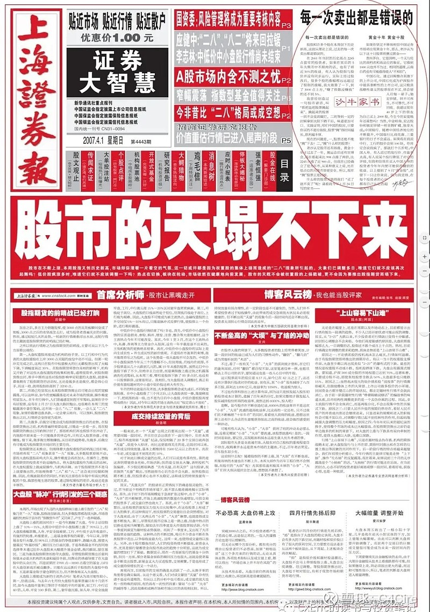

#### 01

投资者普遍明白，情绪具有显著周期性，人会在牛市乐观、在熊市悲观；但投资者容易忽略的是：思想也具有鲜明的市场周期特征。

你的反思和总结，甚至引以为豪的“顿悟”与“Aha时刻”，都带有鲜明的市场周期特色——甚至，这些想法本身就是市场周期的产物之一。

如果跨周期地观察投资者群体，会发现：

在2006年，股民普遍爱好价值投资，核心战法是“捂股”，谁拿得久谁是赢家，流行口号是“每次卖出都是错误”；

在2015年，股民普遍热爱成长股投资，热门板块是互联网、游戏，要的就是成长性、创新性，甚至是“颠覆性”；

接着，股民在2017年重新爱上价值投资，随后下一年又痛斥价值投资都是骗人的。

这些热爱都过于短暂，以至于不像是真爱。又或者，股民像段正淳一样：每年都有新的真爱。

#### 02

熊市反思集中投资，牛市反思分散投资；熊市集体追捧股息率，牛市一起吹爆成长性。

跌得不行，就反思A股适不适合价值投资；跌得超惨，干脆思考A股是不是要推倒重来。

众所周知，A股股民的一大特征就是爱反思，另外两个特征是：幽默和不赚钱。

前不久曾盛行的一些反思包括：

1）炒股太危险，买[贵州茅台](https://xueqiu.com/S/SH600519?from=status_stock_match)就OK；

2）炒股太危险，买明星公募基金就OK；

3）炒股太危险，跟投指数基金计划就OK。

结果证明，投资没有容易的时候，当你以为很容易就OK时，OK往往都会变成K.O.。

在慢慢熊途之下，当前A股盛行的反思有：

1）集中投资是高风险的，all in个股简直是赌博；

2）分散投资才是价值投资的真义；

3）高股息股是王道策略，股息率是核心指标；

4）成长股投资都是高风险策略。

估计再跌一段时间，集体反思就变成：股市都是骗人的。

#### 03

我无意评价这些观点的对错，我想讨论的是这些反思与总结本身。

很多投资者所谓的反思，本质上，不过是将策略对个人市场经历做最大化“拟合”——即，什么策略在过去两年多赚钱/少亏钱，就认定这才是真正的投资“圣杯”，再以此为基准修正投资认知与策略。

过去两年高股息赚钱，就认定分红才是脚踏实地的价值；过去两年成长股行情，就认为成长才是价值创造的根源。

不仅情绪会跟着K线走，投资者的认知、策略、方法和理念，也会以一种微妙的节奏跟着K线左右摇摆。人却以为，这些都是自己主观意识创造出来的想法。

更有趣的是，不管曾经历几轮牛熊，人脑袋中的“拟合”重点永远是过去的两三年行情。

即便是一个见识过6000点和1600点的老股民，也会在2015年被[创业板](https://xueqiu.com/S/SZ399606?from=status_stock_match)行情搞得头晕目眩，也会在激烈行情中高喊 “侠之大者，为国接盘”。

这意味着，虽然一个老股民有二十年的股市经验，但他赋予最高决策权重的经验永远是：去年。

毕竟，经验停留在遥远的过去，奖惩却发生在鲜活的当下。

从这个角度说，我们就不难理解，为什么一些人热衷于每两三年就“修正”一次投资体系，每次都有新的“Aha！”、顿悟时刻，但过两三年又要再来一次。

因为他总是试图修正认知，以符合“记忆中的现实”。面对一个多变量复杂函数，你总是尝试线性拟合，显然是会不断受挫。

#### 04

当我说大多数反思与总结，不过是对过去两三年进行“拟合”时，可有证据？

有。

不妨随便找一篇深刻反思的文章或报告，尤其是那种结尾大幅修正、升级投资策略的文章，我敢大胆预言：

一个新鲜出炉的投资策略，总是对过去2-3年的市场最有效。

相较之下，对于更久远的行情，例如5-10年前的行情，这个策略的回测效果就会大幅降低。

因而，如果过去两年单边上涨，他拟定的新策略会偏“尽量少操作”；如果过去两年震荡行情，他拟定的新策略就会偏“高抛低吸”。

如果过去是低估值占优，他的新策略会重视PE、PB；如果过去是高成长占优，他的新策略会更强调PEG。

这些投资者修正策略的方向总是：让新策略在“鲜活的经验”中拿到最高分。

这类做法看似合乎直觉，但它们都隐含一个逻辑前提：假定市场行情会延续过去2-3年的结构特征。又或者说得文绉绉一点：假定2-3年历史数据，可对未来行情做有效推断。

是否相信这些假定，会指引投资者走上不同的道路。

#### 05

现实生活中很少有一个地方，像金融市场一样显著地兼具随机性与周期性。

随机性，意味着一定程度的混乱与不可预测；周期性，意味着循环往复、反转与反转之反转。

它们还共同意味着另一件事：变化——不是正在变化，就是在酝酿变化。

这就造成了，在投资者群体中存在一种吊诡的观念冲突：

一者是，市场每年都能发现“新东西”，不是全新的商业逻辑，就是全新的行情特征，每两三年就有人惊呼：变天了。

一者是，股民会拘泥于脑袋中最鲜活的经验，默认过往经验会持续奏效，尤其是当经验曾带来强烈“奖励”与“伤痛”体验时。

如何调和这两种观点的冲突？或许可用这句名言：历史踏着相同的韵脚，却不会简单地重复。

历史当然会重复，但不是你以为的那种形式；历史当然会变化，但蓦然回首，又像没有变化。

文学创作讲究“意料之外，情理之中”，历史也有这个风格：

历史的变化，永远是意料之外；历史的不变，却又在情理之中。

#### 06

当周期与随机性、奖惩机制结合，它会轻易地扰乱人类的思考过程，产生一些错误的认知结果：错误地评价自我，错误地认知方法，乃至于错误地——认知规律。

我将此称为：[周期的愚弄](https://xueqiu.com/4373567778/290201361)。

例如，人在顺境与逆境时，自我评价往往天壤之别；例如，股民在盈利与亏损时，他对投资方法的自信程度也截然不同。

*“周期，用顺风让你以为自己很棒，用逆风让你以为自己很差。*

*但实际上，你既没那么优秀，也没有那么糟糕。*

*世界不是精密机器，世界也不是草台班子。”*

*——摘自《周期之舞》，C4Cire*

而本文试图讨论的是：周期会影响人对规律的认知。

事实上很多时候，当一种“规律认知”被广泛传播与认可，这本身就是一种周期现象。

在历史上，美股曾有“[漂亮50](https://xueqiu.com/S/SH561500?from=status_stock_match)”狂热，A股曾有“核心资产”信仰，二者都是投资者集体发现了“股坛必胜法”：买它就稳了。就此而言，东西方各奏乐曲，却押中相同韵脚。

这缘自人类的心理本能：这东西一直在赚钱，肯定是对的，总结它；这方法一直在亏钱，肯定是错的，反思它。但请留意，大部分人所谓的“一直”，并非物理时间上的“一直”，而是心理时间上的“一直”，譬如说：去年以来。

所以，为什么A股股民爱反思？可能是因为经常亏钱。

如果哪一年A股股民普遍赚钱，你就看不到反思了。

你会看到一大堆的“成功经验”介绍。

熊市多反思，牛市多总结。

#### 结尾

我曾在数年前，对一位老股民费力讲解，为什么虽然要除权，但股票分红依然有积极意义。说了一个下午，他依然不理解不认可，只得作罢。

次年，高股息股大涨一轮，他忽然告诉我，他悟了：对对对，分红是好东西——理由一二三，跟我的原话几乎一样。

我也曾在数年前，跟一位朋友费力讲解，为什么价值投资可以自圆其说、是一种可行的策略。说了一晚上，他依然不理解不认可，只得作罢。

某年，价值股大涨一轮，这位朋友告诉我，他悟了：还是价值投资好啊。

我无法区分，是我的话让他明白了，还是股价让他明白了——或许，股价上涨有助于刷新认知？

又过了一些时月，我逐渐观察发现：周期会影响人的情绪，周期也会影响人的认知——甚至是对规律的认知。

这种惊奇程度相当于，一群物理学家被降薪后集体怒斥，万有引力、质能方程都是骗人的东西，物理学应该推倒重来；下个月涨薪后又集体称赞，牛顿和爱因斯坦的工作还是不错的，这些规律还是存在的。

此时，我们只觉得这群物理学家疯了，而不是物理规律歪了。

但在股市里，投资者这个群体，却会对“什么是股市”、“股票是否有意义”、“什么是好投资”、“如果通过投资赚钱”——这些定义性质、规律性质的问题——给出周期性变化的、截然不同的答案。

今天股民集体拥护价值投资，明天怒斥巴菲特是骗子；

今天说，股市是普通人翻身的唯一机会，明天又高呼，A股都是骗人的东西。

所以，当你遭遇市场痛击后反思，一拍大腿，“Aha!我悟了！”，以为找到了投资圣杯、发现投资真谛，但要留意，这或许不过是周期在施展奖惩魔法愚弄你。

如果，你能审视自己的情绪合理性；那么，你也应该试着审视自己的认知合理性。换句话说，不要把自己的情绪太当回事，也不要对自己的反思太过认真。

从不反思的投资者，肯定是有问题的；但每年都在反思的投资者，好像也是有问题的