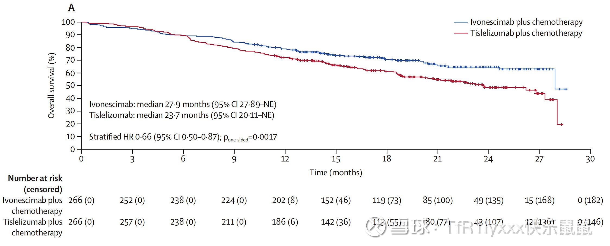

## 快乐鼠鼠摘录

#### 2024

2024.7.20

可乐组合都失败了，还不如 k，没有比较的意义了，贝伐鳞癌都用不了。

2024.7.18

首先可乐不是 k+贝伐，而是 k+仑伐，其次这种亲和力的增强是双抗所特有的，你可以简单理解为一个抗体，帮助富集了另一个抗体，但是 ICI+血管正常化本身的协同作用可乐也是有的，只是可乐的毒性太大了，没有 112 靶向性那么强，毒性大和靶向性的不足造成了可乐组合的失败，也给 AK112 留下了突破口。

2024.7.19

确实也可以简单的理解为 VEGF 的存在增强了 AK112 对肿瘤微环境 PD-1 的靶向

2024.7.11

CD3-TAA和康方这种完全不在一个赛道，我也看好CD3-TAA或者是BiTE,但是本质上面临的难点和所需要突破的困境完全不同，这也造就了两者平台完全不同，我认为CD3-TAA双抗可能会成为针对血液瘤廉价版的CAR-T，但是在实体瘤中激活免疫，把冷肿瘤变成热肿瘤，激活CD8Teff，尤其是改善肿瘤微环境对TILs的抑制和康方这种双抗还是没法比的，而且CD3-TAA本质上还是缺乏普适性的TAA，如果有那么多好的TAA实体瘤也就要好攻克的多

请教一个专业问题：
如果国际顶级的研发团队带着充足的资本来模仿甚至超越康方的双抗平台，您觉得会需要多久时间？

说实话，这个问题不可能有准确答案，因为研发是有很大运气成分存在的，康方肯定有专利保护了核心技术，以我个人经验看必然藏了一些trick，但是如果真的有人盯着模仿，肯定是有机会的，即使如此投入，恐怕也要至少5年-10年，因为临床至少要做到二期才能证明模仿的有效，当然这些都是个人观点，也不排除天降神兵，快速超越康方的可能性，但是就算最快，做到三期结束其实也要很久很久了。

2024.7.26

PFS的阳性转化为OS阳性主要是几个重点，一个是PFS的阳有多阳，HR是多少，这点可以从康方自己的公告中所说的强阳这个表述看，基本是稳的，第二个是毒性如何，如果药物通过对细胞的杀伤消灭肿瘤，控制肿瘤，同时也给机体带来过多的毒性，那么虽然代表肿瘤进展的PFS有阳性，但OS会因为药物对机体的杀伤失去阳性，这也正是目前很多免疫检查点抑制剂+血管正常化治疗的弊端，但是从康方公布的大量的AK112的数据看，其本身毒性很低，这方面不需要太担心，当然这些都只是我的个人认知，可能会错，具体可以参考我的[网页链接](https://xueqiu.com/2693678800/297963644)和[网页链接](https://xueqiu.com/2693678800/298218204)这两篇文章。

2024.7.21

不要再质疑AK112为什么不去和K药（PD-1）或者其他ICI+贝伐/仑伐替尼（VEGF）或者其他的血管正常化治疗联用做头对头了，因为其他ICI+血管正常化治疗都是有缺陷的，AK112是最接近弥补这些缺陷的同时还增强优势的。
这次补充主要简单评价一下Leap006和Leap007这两项和K药PK的，006其实是非鳞癌NSCLC，其实就这点就已经没法和AK112直接比较了，不过也拿出来一起看看吧。

可以看到不管加不加化疗K+仑伐替尼（可乐）在PFS上至少都还凑合，简单点讲就是肿瘤的大小等进展没变，肿瘤没变大变多，但是到OS就变了，K+仑伐替尼甚至还不如K，这就是我说的，虽然肿瘤没有进展，但是仑伐替尼的副作用太大了，造成了病人身体的损伤，寿命的缩短，也导致了临床的失败，这个其实从PFS和OS的HR都能看出来，PFS的HR都至少0.78了，OS的HR更是超过了1，可也说是多终点的失败了，而AK112目前看如果是强阳性的PFS，肯定要大幅度好于Leap006和Leap007的PFS和PFS的HR，也就能很好的补上这一尚未被满足的临床的需求

其实序贯大概率不如联用的，血管正常化和 ici 联用产生的免疫微环境的激活很重要，这方面文章都发了很多了，1+1>2 还是比较容易的。

AK104产生的IL-6和IL-8分泌极少。这是好事，IL-6和IL-8分泌容易引起免疫治疗的副作用

2024.8.10 

长安曾为客：如果说连ADCC都不信，那还讨论什么CD47呢

回复 [@长安曾为客](https://xueqiu.com/n/长安曾为客)：

并不是说不相信ADCC，而是说ADCC的存在并不完全是坏事，很大一部分观点认为靶向免疫抑制性细胞所高表达marker的抗体所介导的ADCC对免疫抑制性细胞的杀伤是有利的，ADCC至少现有的临床试验数据并不能证明，因为ADCC几乎一定是和ADCP，CDC和细胞因子释放等同时存在的，但是现在临床数据没有直接证明在所有肿瘤中ICI介导的ADCC的存在是只有害的，但是Fc介导的IL-6和IL-8的释放确实在临床中被证明与较差的预后和较强的副作用有关。

长安曾为客：Fc段的改造主要是消除ADCC的功能，防止CTL细胞被NK细胞杀死

ADCC的功能在ICI机制中存在争议，举个例子，Y药的ADCC效应被认为减少了Treg，减少了免疫抑制，增强了抗肿瘤效果，所以这个ADCC的机制在ICI应用中单独拿出来究竟起到什么样的作用目前还不够确定，但IL-6和IL-8更为确定，目前大量的临床数据基本确证了这个机制

长安曾为客：唉，还有拿TREG说事的，最强的CTL都没了，就好比说我亏钱亏的比别人少能帮你挣钱么

期刊和我们自己实验数据证明，都有类似结果，不要臆测，数据确实有这个现象。CTL 也不会全死，都是一个平衡的过程

长安曾为客：我只能说基础到临床差太远，太多动物实验好得飞起， 一上临床就废的例子

临床的数据也没有确证ADCC的作用，反而只有IL-6和IL-8的确证了，有争议的何必要强调呢？

长安曾为客：我都笑死了哈哈哈😂😂😂

这些可不是我说的，是康方的投稿说的，你可以自己看看，Ligufalimab, a novel anti-CD47 antibody with no hemagglutination demonstrates both monotherapy and combo antitumor activity。

Y 药实际上很大一部分功能就是通过靶向 Treg 实现的，kf 有 kf 的优势，但是这个世界上目前还不可能有完美的药物，只能说不断进步吧，免疫的平衡远比想象的复杂，如果能针对不同 Fc 受体做出亲和力改变，或许才是这个问题的最终答案，但是有点太难了

MNC试过很多，但是其实最后还是K的PD-L1最成功，但是KF大概率有其他的标志物，或者标志物组合，PD-1也很有可能只是起到靶向某些T细胞亚群，再通过双抗发挥作用

看到数据突然想起来一件事，PD-L1作为PD-1治疗分组marker其实有问题的，大家现在习惯了只是因为K药是这么用了而已，但是这其实是非常不合理的，PD-L1阴性的患者理论上也能通过靶向PD-1的ICI获得很大受益，只不过是K药的数据看起来做不太到而已。但是K药做不到不代表其他药做不到，在真实肿瘤免疫微环境形成的过程中，很多时候PD-L1的阳性只是果，不是因

O:这不挺好吗，可以差异化做PD-L1阴性的适应症，不需要和K药正面硬杠

不好，如果康方能找到自己的标志物那就真的远超K药了，就是真的革命式的更新换代了，K药超过O药靠的就是PDL-1这个分组

ADC 本来也不是 kf 长项，而且其实也没放弃什么。现在几个双抗都是有可能基石药级别的，怎么可能放弃，我还是很看好逆转 T 细胞衰竭这几个双抗的，反而 ADC 我觉得不着急 ，以我的经验看其实 ADC 相对来说容易的多

[@好多人从众](https://xueqiu.com/n/好多人从众):回复[@TfR1lyxxx](https://xueqiu.com/n/TfR1lyxxx):未来究竟是ICI双抗+ADC疗效好，还是TCE双抗+ADC疗效，还是最后是ICI双抗+TCE双抗+ADC呢？从百利天恒的四抗看，我倾向于是TCE双抗+ADC，激活的免疫因子这个层面来看，TCE可能比ICI更强。

回复[@好多人从众](https://xueqiu.com/n/好多人从众): 首先TCE靠的是T细胞杀伤，和ICI就不是一个赛道的，TCE本质上还不如CART，CART现在都有knock out ICI的趋势，其次TCE如果真正能挤掉那也是挤掉ADC因为ADC能用的靶点TCE都能用，但是ICI用的和TCE完全是两套靶点系统，最后，ICI是大药基石药，一款ICI适配很多款ADC/TCE，这才是ICI的价值，也是康方的价值。

回复[@好多人从众](https://xueqiu.com/n/好多人从众): 这个问题早就有谈到过，首先TAA如果有那么多好的病人都可以用的，免疫治疗其实早就会不如直接靶向TAA治疗了，TCE真正竞争的是ADC，因为都是靠靶向TAA杀伤的，只不过ADC靠的是毒素的直接杀伤，而到TCE想要发挥功能的时候还是需要足够多，足够保持活力的T细胞，这才是康方双抗的作用，最后本质上还是ICI+ADC和ICI+TCE的竞争，而ICI才是基石。如果这都不懂也没必要再讨论了，就感觉像是完全没看我说的话一样!//[@好多人从众](https://xueqiu.com/n/好多人从众):回复[@TfR1lyxxx](https://xueqiu.com/n/TfR1lyxxx):di第三个趋势，默沙东7亿美元首付收购同润生物CD3xCD19 TCE双抗CN201，和国内嘉和生物的CD3/CD20 TCE双抗GB261出海，第一三共反向引进默沙东的MK-6070也就是DLL/CD3 TCE双抗。
第一是在血液瘤看见了非常好的疗效，强生的BCMA/CD3，GPRC5D/CD3都预计是50亿美元产品。
第二是在实体瘤上面，安进的CD3/DLL3双抗在美国也取得加速审批上市，信达CD3/18.2Q取得进展。
第三是这个CD3/TAA TCE机制不只是肿瘤治疗，在免疫治疗，比如多发性硬化症、重症肌无力、系统性红斑狼疮、干燥综合征、狼疮性肾炎都可能有治疗效果，自勉是肿瘤之外第二大市场。

回复[@好多人从众](https://xueqiu.com/n/好多人从众): 所以这能说明什么？少YY，多看点文章，TCE和双抗完全没有竞争关系，你想让KF像罗氏一样广撒网那也是不可能的。biotech就是应该把自己擅长的做到极致。//[@好多人从众](https://xueqiu.com/n/好多人从众):回复[@TfR1lyxxx](https://xueqiu.com/n/TfR1lyxxx):第二个趋势，基因泰克：团队重组，主管离职8月15日，据外媒报道，基因泰克目前正在重组其癌症免疫学团队，其癌症免疫学副总裁Ira Mellman将离职。这一决定是基于免疫肿瘤学的变化做出的，该公司计划将其癌症免疫学和分子肿瘤学研究小组合并在一个肿瘤学组织下。

回复[@好多人从众](https://xueqiu.com/n/好多人从众): 首先ADC效果是否比抗体好可是不一定的，其次过B7-H4直接靶向他免疫治疗本来就不是好趋势好选择，和PD-L1一样，按照PD-L1的阴性收益趋势看，这条路不如选择其他免疫细胞上的ICI，所以放弃靶向肿瘤上的ICI改做ADC很正常，完全和KF是两个东西，如果这都没懂就没必要讨论了。//[@好多人从众](https://xueqiu.com/n/好多人从众):回复[@TfR1lyxxx](https://xueqiu.com/n/TfR1lyxxx):好，我们好好交流，陈列平创建的nextcare都放弃免疫治疗靶点B7-H4，改为合作B7-H4ADC了，这个算一个趋势吧。

[星星之火，可以燎原---双抗新赛道TCE逐步兴起 $康方生物(09926)$ 先说结论：在免疫治疗PD1 PD-L1取得大获成功之后大约2018年ADC药物8201带领下... - 雪球](https://xueqiu.com/9180294005/301373783)

回复[@好多人从众](https://xueqiu.com/n/好多人从众): 还证明一切，你都没懂 TCE 和康方的免疫双抗根本没有直接竞争，TCE 发挥功效需要足够的活化的有功能的 T 细胞，不同于 CART，TCE 或者 BiTE 只能用内源 T 细胞，内源 T 细胞的活化和功能维持包括免疫微环境的改善靠的都是康方这样的 ICI 单抗或双抗。你要是好好讨论就好好讨论，别老对这个对那个失望遗憾的，有这个评判能力吗？就批评上了？就遗憾上了？我一个做的完全相近的转化都不敢说有什么评价的。我觉得都挺好的康方在基石 ICI 上的突破实在极为罕见，你就在这失望遗憾上了。//[@好多人从众](https://xueqiu.com/n/好多人从众):回复[@TfR1lyxxx](https://xueqiu.com/n/TfR1lyxxx):我们不用争对错，时间会证明一切。

回复[@高棋剑](https://xueqiu.com/n/高棋剑): 正好看到Bonum开的新管线LAG3-IL2的一些数据，最近也是开始要绽放光芒了，这个领域信达确实做的不错，但是PD-1未必是最终的最优答案，PD-1/LAG-3/CD73都有机会甚至多抗的靶头或许才是最优解，康方的工作也很有价值，只不过康方的双抗平台用在这里是否能起到好的效果还有待商榷，信达的IBI363也算先行者，但是对于IL-2的偏向性和选择anti-PD-1作为抗体是否是最优解，能否提供足够的优势也还有待商榷，整体来说都有机会，角度不同，都在尽量做自己做擅长的事，biotech就是这样，先把自己的基本盘做精，现金流充足了再去考虑其他的。[$康方生物(09926)$](https://xueqiu.com/S/09926) [$信达生物(01801)$](https://xueqiu.com/S/01801) [$罗氏控股(RHHBY)$](https://xueqiu.com/S/RHHBY)//[@高棋剑](https://xueqiu.com/n/高棋剑):回复[@TfR1lyxxx](https://xueqiu.com/n/TfR1lyxxx):LAG3、CD73这些靶点，只有LAG3在黑色素瘤有点效果，其他目前看基本上都废了，现在看起来，IBI363虽然有点早，但可能是最有希望打破这种T细胞耗竭的分子！

回复[@好多人从众](https://xueqiu.com/n/好多人从众): 别跟小孩似的，都说了，这些没有竞争，你现在错在给的逻辑都是错的，观点也是错的，全是主观臆断，认为 CD73， LAG3 等靶点完全是浪费才是错的，康方就算要做也得等把现有平台发挥到极致，现金流好起来才适合扩这些管线，你根本没搞懂康方平台的优势在哪，光想着别的管线的好，这个世界上不是只有一条路，你列这些也太搞笑了，小学生吵架一样，列出来我都觉得和你讨论这么久太丢人了!//[@好多人从众](https://xueqiu.com/n/好多人从众):回复[@TfR1lyxxx](https://xueqiu.com/n/TfR1lyxxx):好了，我是错的。我曾经说康方不做ADC是错的，现在他们做了，基本证明我是对的。
1、第一我们未来看，康方如果做了TCE，是不是应该算我对。
2、第二如果康方没有做，但是TCE发扬光大了，是不是应该算我对。
3、第三康方做了TCE，但是这个方向错了，浪费了资源，被我误导了，算我错的。
这个就是总结帖子，让时间来验证吧。

回复[@沔阳青衫](https://xueqiu.com/n/沔阳青衫): 几个原因，第一个是肿瘤异质性太强，尤其是实体瘤里面TAA其实很多都很一般，这也是这些现在ADC毒性都那么大的原因，毕竟TAA只是在肿瘤细胞当中高表达，他在正常组织细胞当中也有表达，其次实体瘤和血液瘤最大的区别就是实体，肿瘤实体会形成非常强的免疫抑制环境，造成T细胞功能无法发挥，这也是康方这样的ICI的重要价值。当然还有其他比如T细胞运输等原因，但是主要就是这两个。//[@沔阳青衫](https://xueqiu.com/n/沔阳青衫):回复[@TfR1lyxxx](https://xueqiu.com/n/TfR1lyxxx):博士，CAR-T没法在实体瘤实现血液瘤这样的效果，原理是啥？好奇。

最近对康方生物比较关注AK129，不知道AK129的联合康方生物AK117，在PD-1/L1疗法耐药后的经典霍奇金淋巴瘤患者中，于2024年10月启动计划入组人数为280例的1/2期临床试验NCT06642792，能否拿到足够好的数据，像AK104在二线宫颈癌一样凭借二期数据上市。如果成功AK129将是康方生物成功上市的第三个双抗药物，成药平台的强大和背后的认知将得到进一步证实，尤其是看到默沙东PD-1+LAG-3双免治疗在MSS mCRC三期失败后，双抗在我的认知里是要高于单抗联用的

回复[@喜见贤达](https://xueqiu.com/n/喜见贤达): 这才是正确的想法，又不是什么几千 e 市值的大公司，对于 Biotech 做出几个 BIC，做出差异化才是放量最好办法，MNC 才会 cover 所有领域。//[@喜见贤达](https://xueqiu.com/n/喜见贤达):回复[@好多人从众](https://xueqiu.com/n/好多人从众):市场很大，成一两个大适应症就够了！

回复[@好多人从众](https://xueqiu.com/n/好多人从众): 算了好心告诉你吧，由于异质性和PD-L1阳性率不同，不同的人不同的适应症一定有PD-L1更好的，也一定有PD-1更好的，咱可不瞎吹。靶向PD-1真正的好处在后面，很多时候PD-L1是受反馈上升表达的，这也是为什么治疗后后期肿瘤PD-L1反而有时会上调。但从领域内角度看PD-1肯定是更容易卖更多的，至于联用海外市场SMMT只需要把自己卖给一家MNC合作的ADC就会源源不断。和KLBT合作基本是无稽之谈，除非MSD把SMMT买了，但是这样对MSD来说性价比很低，上百e的临床花费会浪费掉很多，联用也得一步步来，两个都没上市的药开联用风险太大太大，基石药上市后，树枝会有很多根送过来，你所想的基本都是纯纯YY幻想，不过虽然112不会缺ADC联用，未来免疫治疗也不是你死我活的市场，而是越来越个体化的市场。//[@好多人从众](https://xueqiu.com/n/好多人从众):回复[@TfR1lyxxx](https://xueqiu.com/n/TfR1lyxxx):你理解了PD-1 和 PD-L1，那么请问PD-L1/VEGF的PM8002 是不是PD-1/VEGF112的威胁，他们是不是竞争对手。

P284

## HARMONi 6 OS 中期数据简析

先看数据。共 532 例患者被随机分组（每组 266 例）。截至 2026 年 2 月 27 日，中位随访时间 21.4 个月时，康方生物依沃西单抗（ivonescimab）联合化疗相比替雷利珠单抗（tislelizumab）联合化疗显著改善了总生存期（OS）。

依沃西单抗联合化疗组中位 OS 为 27.9 个月（95% CI：27.89~ 未达到 [NE]），替雷利珠单抗联合化疗组为 23.7 个月（95% CI：20.11~ 未达到 [NE]）（风险比 [HR]：0.66；95% CI：0.50~0.87；单侧 P=0.0017），达到了预设的统计学显著性边界（P<0.0049）。

在所有预设亚组中，OS 获益均一致：在 PD-L1 肿瘤比例评分（TPS）<1% 的患者中，中位 OS 分别为未达到和 18.6 个月（HR：0.64；95% CI：0.43~0.96）在 PD-L1 TPS≥1% 的患者中，中位 OS 分别为未达到和 27.3 个月（HR：0.68；95% CI：0.46~0.99），依沃西联合化疗12个月OS率为78.9%(vs 对照组为72.2%)，24个月OS率为64.7%(vs 对照组为48.6%)依沃西单抗联合化疗的安全性特征可控，与既往报道一致，未观察到新的安全性信号

从图形上来看，早期确实是分离趋势没有那么明显。但是在 6 个月之后，曲线就开始快速的分离，并且保持分离趋势，甚至有一定的分离扩大的趋势。虽然不能完全体现拖尾的情况吧，毕竟随访时间也还没有那么久，但是至少可以说并没有出现传统贝伐珠单抗的纺锤形曲线，甚至是一个大概率扩大差距的曲线。大概率会呈现比 PD1 单药更好的拖尾的效果。这也体现了我一直强调的，VEGF 可以对肿瘤微环境进行改造，有助于免疫治疗发挥功能的作用

对于 mOS 有一些朋友可能会觉得差值不是太大，但是首先，mOS 的差值本身就不能代表太多。其次，现在的这个 mOS 正如康方生物在公众号上写的那样，是因为后期随访人数太少，随访时间不够，一两个病人的突然的事件就有可能影响较大。我认为随着长期随访 mOS 的差值也是很有可能会变大的。不过正如我前面说到的，这个值本身也没有那么重要，只要不太小就可以。24个月OS率为64.7%(vs 对照组为48.6%)最重要，这个数据标志着康方生物 AK112 的决定性的胜出，代表着其已经打开了 IO 2.0 的大门。当然，这也代表着 H3 的鳞癌的大概率胜出，甚至可以说失败的概率已经非常接近于 0 了。虽然说杜根可能会比较菜，但是至少在 H3 鳞癌这个适应症上，只要他随访的时间足够。那么最后一定就是拼的药物的本身的疗效。我觉得就以目前这个数据来看，H3 鳞癌失败的可能性真的已经非常小了

那么即使从最下限的角度上来看，就算是大家对[康方生物](https://xueqiu.com/S/09926?from=status_stock_match) AK112 的其他适应症有怀疑，那么对于鳞癌来说，至少其拿下的概率已经是接近于 100% 了。至于说其他的适应症，从最下限的角度上来看，也只需要很短的时间就能拿到结果。比如说腺癌可以看 H2 的 final OS 的分析，包括 H3 的中期的分析，这些都并不会太久了，结直肠癌也是一样。至于说更多的适应症，我相信杜根一定不会傻等着的，要么就是自己开发出来，要么就是引入 MNC 进行开发。只要将大量适应症开起来。那么康方生物 AK112 的上限也就会非常高。哪怕是从最下限的角度上来看，一步一步走。康方生物AK112 在美国多个适应症上市取得营收也只是时间的问题了

---

回应一下大家对 Brahmer 教授所提出观点的疑问吧。首先第一个我们要明白，也是我这里要提到的一个核心的问题就是，一项临床试验不管是康方生物在国内做的，还是 Summit 在海外、在全球做的，它最重要的不是每一个细节有多么的完美，而是能否得到监管的认可。
带着这样的一个前提，我们看一下 Brahmer 教授对康方生物 HARMONi 6 所提出的一些观点吧。我不按他讲的顺序来，而是挑几个重点来。首先第一点，也就是很多人提到的，就是关于患者年龄的问题。关于入组的患者年龄呢，我们先去看一个问题，那就是大年龄的患者，或者说所谓的，他认为的老年的患者，是否是真的效果比较差。关于这个问题，其实之前我也简单写过，包括康方生物本身也做过纠正性分析。我认为目前看起来比较差是因为其并没有做到完美的随机分组，导致 112 组的入组的患者基线比替雷利珠组的可能稍差了那么一些。根据 PFS 之前的纠正性的这样一个分析，可以看到在调整之后，这个数据应该和年龄没那么高的，所谓的就是年轻一点的那样的亚组是接近一致的。那么我们退一步讲，如果说，就算是真的高龄组稍微差一点，那又怎样呢？对此我们可以参考 Keynote 407 的分组。我们可以看到 Keynote 407 的分组实际上高龄组也是差一些。然而当它以和 HARMONi 6 近似比例的高龄组和低龄组的分配时。取得了最后的阳性成果，而这样的阳性成果监管也是认可的。我认为只要 HARMONi 3 能够重复大部分 HARMONi 6 的结果，那么即使在某些亚组中稍微差一点，只要不太差，一样也是会受到 FDA 的认可的。而只要受到 FDA 的认可，那么对于后续的上市以及转化成营收就有了保障。这才是最关键的。那么第二点则是所谓的对血管侵犯的入组排除。这个首先我们要知道，康方生物 HARMONi 6 和 Summit 海外的 HARMONi 3 的入组排除条件是不一样的。我认为这两种入组排除条件都受到了监管的认可，而且执行的也非常好，没有任何问题。它实际上是模糊了大血管侵犯和普通的血管侵犯的边界。所以说这是一个我认为一定程度上他不应该质疑的一个点。或者说至少在当时，他可能是没有理解。第三点则是所谓的用 HARMONi 6 推到全球 HARMONi 3 的一个推广的问题。首先我们要知道， Summit 也不可能用康方生物的 HARMONi 6 去申请 FDA 的上市，那么最后决定它能否上市的肯定是 HARMONi 3 这个临床试验。而康方生物的 HARMONi 6 已经完美的体现出了 112 这款药物本身的强大，那么其并没有走出了贝伐可能会出现的纺锤形曲线。而是分开的这个口子越来越大，这无疑证明了这款药本身的一个强大的一个有效性，这个有效性是相对于 PD1 单抗的，那么这种优势我们认为推广到全球范围的 HARMONi 3 临床上是很难不重现的。我认为 HARMONi 3 不出现这种曲线的概率是非常低的。顶多是程度问题和时间问题罢了。当然，就像我很早就提到的，这本身也是一种大家不同的预期。那么最终决定预期的一个进展，下一步的落地的一定是 HARMONi 3 的数据。我对 HARMONi 3 数据还是比较有信心的。就像我前面提到的，我认为鳞癌这部分失败的可能性真的已经非常低了。那么就算是像 Brahmer 教授这样的 KOL 暂时不认可，我觉得等未来数据落地之后，那么一切将水落石出。至于还有一些问题，像随访时间不够这些，我认为虽然随访时间不够可能会造成最末端的曲线有一定失真，但是曲线本身开口越来越大的这样一个曲线的形状，就已经强有力的支持了。康方生物 AK112 相较于 PD1 单抗的优势，我认为这些质疑只是一种挑刺罢了。那么在最后不得不说的就是，作为 KOL，实际上大部分 KOL 都无法做到完全的客观，一定是带有一定的主观的。而这种主观又与其过往的临床的成果有关。像 Brahmer 教授实际上就是 PD1 单抗当时走向上市的重要 KOL 之一。因此也不难理解他会对康方生物和 Summit 的 AK112 有着诸多的所谓的挑刺吧。但是归根到底，一定程度上还是两家公司在国际上的话语权不够。关于这一点，如果引入一家 MNC 就会好很多。不过这些也没有那么重要了，因为一旦获得 FDA 的认可。实际上 KOL 也会慢慢认可，只不过是 MNC 去让 KOL 认可可能会比较快，而 Summit 去让 KOL 认可可能需要的时间比较长而已。但最终一款好药就一定会被大部分人认可。

---

简单再补充聊几句杜根的问题吧。感觉大家对杜根还是比较有争议的，这其实也正常，因为杜根之前的战绩确实是不那么尽如人意。如果从不确定性上讲，他的一系列操作算是增加了一些不确定性吧。但是我觉得只要康方生物 AK112 这款药够好，那么最后落地的概率是没有太大的变化的。因为从 H6 数据的曲线形状上来看，做好这款药的难度并没有想象中那么大，风险还是比较小的。当然了，杜根如果现在能够引入一家 MNC 合作，或许会在机构或者是一部分人眼里，把这部分不确定性去掉。这也是为什么很多人一直都觉得 AK112 必须要由 MNC 来做吧，因为在一部分投资人眼里，只有 MNC 的临床能力才是足够的。而杜根确实需要用 HARMONi3 接下来的数据来证明自己。
由我个人的经验来看，以杜根目前的操作来看，大概率是会引入一家 MNC 来合作的，不管是以什么形式。而节点上呢，一般对于一款药物的开发，如果大家比较了解的话，就知道关键节点其实也就那么几个。要么是三期临床开启前，而对于康方生物和杜根的 AK112 来说已经过了这个节点了。要么是三期临床数据读出，这里可能是 H3 的临床数据读出，或者是商业化的节点，这里就可以关注一下年底 HARMONi 能否获得 FDA 批准上市了。这些节点一般会推动一些合作或者是交易的发生。
当然了，其实杜根只要自己去加大投入，去扩张自己的团队，其实也是能推得动的。因为杜根和一些初创企业不同，他本身有着非常充足的现金流，而且他旗下也并非只有一家公司，我认为他的其他公司也有可能完成卖身，给他带来超高的现金流回报。当然，就算不考虑这些，他本身的现金流应该也是非常高的，非常充足的。但是这一步就需要杜根加大自己的投入的同时，可能还要稀释一部分股份。
但不管怎么说，对于康方生物 AK112 这款药来说，只要你不把它的预期定的太高，它基本上还是能实现的，绝对是一款非常好的药物。但是对于整个康方生物来说，所谓的 AK112 也只不过是现在被大家主要关注的一款药而已。我认为像未来的 AK104 和 AK117 都有可能有着不错的进展，只不过大家目前都只关注了 AK112 而已。

---

## HARMONi 3 鳞癌的 PFS 中期分析

https://xueqiu.com/2693678800/387268079

目前来说这次中期分析肯定是失败的，这个毋庸置疑。我们关注的是 iDMC 所给的回复，目前是推荐继续进行试验随访。那么iDMC 给出这样一个回复意味着什么呢？一般来说呢iDMC 的回复是基于一个上限和一个下限。如果你的 HR 和 P 值大于了这个上限，那么则会回复建议终止这个临床。而如果你的 HR 和 P 值小于这个范围，则会判定临床直接成功，已经达到了终点。而在这个上限和下限之间，则会给出建议继续随访的意见。而给出继续随访之后呢，实际上像杜根他们并不知道目前的 HR 和 P 值是多少，他们也只知道这两个数字在设定的那个范围内。而这两个数字究竟是多少呢？我猜测下限大概在 0.65 左右，而上限则在 0.8 左右。所以说目前也只知道数据大概在这个范围内，而不知道具体的数字。

对于这个结果，我认为是一次遗憾的失败。因为如果多分配一些阿尔法，我觉得达到显著并非一件难事。那么目前这个结果究竟能给我们什么信息呢？首先我们并不知道这次的结果究竟是多少，我们只知道结果大概的范围在什么范围。其次，我们目前能知道的是，这次中期分析 HARMONi 3 所得到的 HR 值大概率是要弱于康方生物 HARMONi 6 中期分析时所得到的。但是这不代表 HARMONi 3 的 PFS 就要弱于康方生物 HARMONi 6 的 PFS，这是因为本身 HR 值和入组时间、随访时间等都有关系。对于 HARMONi 3 中鳞癌的亚组，我认为目前拿下还是大概率的。尤其是我认为在康方生物 HARMONi 6 的中期分析中，OS 应该取得了不错的结果。不过这样一次分析也反映了杜根目前在试验的设计上是比较激进，有可能会有一些小的意外的。因此目前来看，尽早的卖身对于他可能来说是一种更好的选择。而目前想要达成卖身或者说是 BD 的话，由于这一次没有读出数据，只能靠着康方生物 HARMONi 6 的数据去谈，或者是等到 HARMONi 3 的最终分析得出时再去谈。但无论是哪一个，我想都应该加快进度，争取在今年完成。

总的来说呢，这一次是一次有遗憾的失败。但是由于有 HARMONi 6 的兜底，至少鳞癌上还是有很大的可能性拿下的。失败的可能性还是比较小，只要杜根不要去搞一些胡乱的操作。但是面对一些更难的、更有挑战性的临床，可能以杜根的能力来看还是有一些风险的。还是希望他能够尽快做出 BD 或者是卖身吧，亦或者是能够从中吸取教训，做好后面的临床设计吧

---

再补充两个点，第一，就算最后 Summit 做出来的数据比康方生物差一点，其实也不算是人种差异，因为海外的多国家临床本来就会比国内多中心更难管理一点。第二，我认为海外的鳞癌数据可能会比中国的更好，这是因为海外鳞癌存在一些基线上的差别，基线构成本身就和国内康方生物所面对的不一样，包括吸烟时间的长度，或是STK11、KEAP1这类突变的比例和程度不同，PD-1单抗治疗在海外鳞癌中的效果本来就大概率会比国内差一点，这样就给杜根和Summit留下了足够的空间和容错。

---

这两天有很多朋友问我，在ASCO会议上已经公布的摘要的数据中，有哪些比较需要关注？有哪些和康方生物的关系比较大？其实康方生物自己最关键的H6的数据还是要等到6月1号那天才能看到。所以说在这之前都是一些其他公司的最重要的数据可能会对康方生物的走势产生影响。已经公布的数据中，最重点需要关注的还是科伦博泰的264的数据。这个数据确实是非常好，称得上是一份接近满分的答卷。虽然说是国内的，而且也不是很严格的双盲这样的设计，但是这个数据也已经足够好了。那么在假定IO加ADC为最终的治疗手段，或者说是短期的最终的治疗手段时，那么在之前的过渡态当中，就将是一代的IO，比如说K药加264这样的ADC和二代的IO，比如说康方生物、Summit 112加化疗的一个对抗。所以说它的这个数据这么好，之后那就是进度的比拼了。看一下海外264的一线的鳞癌和康方生物、Summit H3的鳞癌的进度吧。未来是这两者争夺市场。杜根还是得加油啊。

---

****

