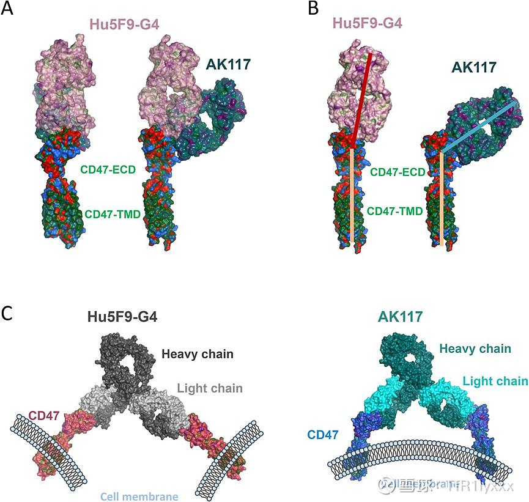

## HARMONi 6 OS 中期数据简析

先看数据。共 532 例患者被随机分组（每组 266 例）。截至 2026 年 2 月 27 日，中位随访时间 21.4 个月时，康方生物依沃西单抗（ivonescimab）联合化疗相比替雷利珠单抗（tislelizumab）联合化疗显著改善了总生存期（OS）。

依沃西单抗联合化疗组中位 OS 为 27.9 个月（95% CI：27.89~ 未达到 [NE]），替雷利珠单抗联合化疗组为 23.7 个月（95% CI：20.11~ 未达到 [NE]）（风险比 [HR]：0.66；95% CI：0.50~0.87；单侧 P=0.0017），达到了预设的统计学显著性边界（P<0.0049）。

在所有预设亚组中，OS 获益均一致：在 PD-L1 肿瘤比例评分（TPS）<1% 的患者中，中位 OS 分别为未达到和 18.6 个月（HR：0.64；95% CI：0.43~0.96）在 PD-L1 TPS≥1% 的患者中，中位 OS 分别为未达到和 27.3 个月（HR：0.68；95% CI：0.46~0.99），依沃西联合化疗12个月OS率为78.9%(vs 对照组为72.2%)，24个月OS率为64.7%(vs 对照组为48.6%)依沃西单抗联合化疗的安全性特征可控，与既往报道一致，未观察到新的安全性信号

从图形上来看，早期确实是分离趋势没有那么明显。但是在 6 个月之后，曲线就开始快速的分离，并且保持分离趋势，甚至有一定的分离扩大的趋势。虽然不能完全体现拖尾的情况吧，毕竟随访时间也还没有那么久，但是至少可以说并没有出现传统贝伐珠单抗的纺锤形曲线，甚至是一个大概率扩大差距的曲线。大概率会呈现比 PD1 单药更好的拖尾的效果。这也体现了我一直强调的，VEGF 可以对肿瘤微环境进行改造，有助于免疫治疗发挥功能的作用

对于 mOS 有一些朋友可能会觉得差值不是太大，但是首先，mOS 的差值本身就不能代表太多。其次，现在的这个 mOS 正如康方生物在公众号上写的那样，是因为后期随访人数太少，随访时间不够，一两个病人的突然的事件就有可能影响较大。我认为随着长期随访 mOS 的差值也是很有可能会变大的。不过正如我前面说到的，这个值本身也没有那么重要，只要不太小就可以。24个月OS率为64.7%(vs 对照组为48.6%)最重要，这个数据标志着康方生物 AK112 的决定性的胜出，代表着其已经打开了 IO 2.0 的大门。当然，这也代表着 H3 的鳞癌的大概率胜出，甚至可以说失败的概率已经非常接近于 0 了。虽然说杜根可能会比较菜，但是至少在 H3 鳞癌这个适应症上，只要他随访的时间足够。那么最后一定就是拼的药物的本身的疗效。我觉得就以目前这个数据来看，H3 鳞癌失败的可能性真的已经非常小了

那么即使从最下限的角度上来看，就算是大家对[康方生物](https://xueqiu.com/S/09926?from=status_stock_match) AK112 的其他适应症有怀疑，那么对于鳞癌来说，至少其拿下的概率已经是接近于 100% 了。至于说其他的适应症，从最下限的角度上来看，也只需要很短的时间就能拿到结果。比如说腺癌可以看 H2 的 final OS 的分析，包括 H3 的中期的分析，这些都并不会太久了，结直肠癌也是一样。至于说更多的适应症，我相信杜根一定不会傻等着的，要么就是自己开发出来，要么就是引入 MNC 进行开发。只要将大量适应症开起来。那么康方生物 AK112 的上限也就会非常高。哪怕是从最下限的角度上来看，一步一步走。康方生物AK112 在美国多个适应症上市取得营收也只是时间的问题了

---

回应一下大家对 Brahmer 教授所提出观点的疑问吧。首先第一个我们要明白，也是我这里要提到的一个核心的问题就是，一项临床试验不管是康方生物在国内做的，还是 Summit 在海外、在全球做的，它最重要的不是每一个细节有多么的完美，而是能否得到监管的认可。
带着这样的一个前提，我们看一下 Brahmer 教授对康方生物 HARMONi 6 所提出的一些观点吧。我不按他讲的顺序来，而是挑几个重点来。首先第一点，也就是很多人提到的，就是关于患者年龄的问题。关于入组的患者年龄呢，我们先去看一个问题，那就是大年龄的患者，或者说所谓的，他认为的老年的患者，是否是真的效果比较差。关于这个问题，其实之前我也简单写过，包括康方生物本身也做过纠正性分析。我认为目前看起来比较差是因为其并没有做到完美的随机分组，导致 112 组的入组的患者基线比替雷利珠组的可能稍差了那么一些。根据 PFS 之前的纠正性的这样一个分析，可以看到在调整之后，这个数据应该和年龄没那么高的，所谓的就是年轻一点的那样的亚组是接近一致的。那么我们退一步讲，如果说，就算是真的高龄组稍微差一点，那又怎样呢？对此我们可以参考 Keynote 407 的分组。我们可以看到 Keynote 407 的分组实际上高龄组也是差一些。然而当它以和 HARMONi 6 近似比例的高龄组和低龄组的分配时。取得了最后的阳性成果，而这样的阳性成果监管也是认可的。我认为只要 HARMONi 3 能够重复大部分 HARMONi 6 的结果，那么即使在某些亚组中稍微差一点，只要不太差，一样也是会受到 FDA 的认可的。而只要受到 FDA 的认可，那么对于后续的上市以及转化成营收就有了保障。这才是最关键的。那么第二点则是所谓的对血管侵犯的入组排除。这个首先我们要知道，康方生物 HARMONi 6 和 Summit 海外的 HARMONi 3 的入组排除条件是不一样的。我认为这两种入组排除条件都受到了监管的认可，而且执行的也非常好，没有任何问题。它实际上是模糊了大血管侵犯和普通的血管侵犯的边界。所以说这是一个我认为一定程度上他不应该质疑的一个点。或者说至少在当时，他可能是没有理解。第三点则是所谓的用 HARMONi 6 推到全球 HARMONi 3 的一个推广的问题。首先我们要知道， Summit 也不可能用康方生物的 HARMONi 6 去申请 FDA 的上市，那么最后决定它能否上市的肯定是 HARMONi 3 这个临床试验。而康方生物的 HARMONi 6 已经完美的体现出了 112 这款药物本身的强大，那么其并没有走出了贝伐可能会出现的纺锤形曲线。而是分开的这个口子越来越大，这无疑证明了这款药本身的一个强大的一个有效性，这个有效性是相对于 PD1 单抗的，那么这种优势我们认为推广到全球范围的 HARMONi 3 临床上是很难不重现的。我认为 HARMONi 3 不出现这种曲线的概率是非常低的。顶多是程度问题和时间问题罢了。当然，就像我很早就提到的，这本身也是一种大家不同的预期。那么最终决定预期的一个进展，下一步的落地的一定是 HARMONi 3 的数据。我对 HARMONi 3 数据还是比较有信心的。就像我前面提到的，我认为鳞癌这部分失败的可能性真的已经非常低了。那么就算是像 Brahmer 教授这样的 KOL 暂时不认可，我觉得等未来数据落地之后，那么一切将水落石出。至于还有一些问题，像随访时间不够这些，我认为虽然随访时间不够可能会造成最末端的曲线有一定失真，但是曲线本身开口越来越大的这样一个曲线的形状，就已经强有力的支持了。康方生物 AK112 相较于 PD1 单抗的优势，我认为这些质疑只是一种挑刺罢了。那么在最后不得不说的就是，作为 KOL，实际上大部分 KOL 都无法做到完全的客观，一定是带有一定的主观的。而这种主观又与其过往的临床的成果有关。像 Brahmer 教授实际上就是 PD1 单抗当时走向上市的重要 KOL 之一。因此也不难理解他会对康方生物和 Summit 的 AK112 有着诸多的所谓的挑刺吧。但是归根到底，一定程度上还是两家公司在国际上的话语权不够。关于这一点，如果引入一家 MNC 就会好很多。不过这些也没有那么重要了，因为一旦获得 FDA 的认可。实际上 KOL 也会慢慢认可，只不过是 MNC 去让 KOL 认可可能会比较快，而 Summit 去让 KOL 认可可能需要的时间比较长而已。但最终一款好药就一定会被大部分人认可。

---

简单再补充聊几句杜根的问题吧。感觉大家对杜根还是比较有争议的，这其实也正常，因为杜根之前的战绩确实是不那么尽如人意。如果从不确定性上讲，他的一系列操作算是增加了一些不确定性吧。但是我觉得只要康方生物 AK112 这款药够好，那么最后落地的概率是没有太大的变化的。因为从 H6 数据的曲线形状上来看，做好这款药的难度并没有想象中那么大，风险还是比较小的。当然了，杜根如果现在能够引入一家 MNC 合作，或许会在机构或者是一部分人眼里，把这部分不确定性去掉。这也是为什么很多人一直都觉得 AK112 必须要由 MNC 来做吧，因为在一部分投资人眼里，只有 MNC 的临床能力才是足够的。而杜根确实需要用 HARMONi3 接下来的数据来证明自己。
由我个人的经验来看，以杜根目前的操作来看，大概率是会引入一家 MNC 来合作的，不管是以什么形式。而节点上呢，一般对于一款药物的开发，如果大家比较了解的话，就知道关键节点其实也就那么几个。要么是三期临床开启前，而对于康方生物和杜根的 AK112 来说已经过了这个节点了。要么是三期临床数据读出，这里可能是 H3 的临床数据读出，或者是商业化的节点，这里就可以关注一下年底 HARMONi 能否获得 FDA 批准上市了。这些节点一般会推动一些合作或者是交易的发生。
当然了，其实杜根只要自己去加大投入，去扩张自己的团队，其实也是能推得动的。因为杜根和一些初创企业不同，他本身有着非常充足的现金流，而且他旗下也并非只有一家公司，我认为他的其他公司也有可能完成卖身，给他带来超高的现金流回报。当然，就算不考虑这些，他本身的现金流应该也是非常高的，非常充足的。但是这一步就需要杜根加大自己的投入的同时，可能还要稀释一部分股份。
但不管怎么说，对于康方生物 AK112 这款药来说，只要你不把它的预期定的太高，它基本上还是能实现的，绝对是一款非常好的药物。但是对于整个康方生物来说，所谓的 AK112 也只不过是现在被大家主要关注的一款药而已。我认为像未来的 AK104 和 AK117 都有可能有着不错的进展，只不过大家目前都只关注了 AK112 而已。

---

## HARMONi 3 鳞癌的 PFS 中期分析

https://xueqiu.com/2693678800/387268079

目前来说这次中期分析肯定是失败的，这个毋庸置疑。我们关注的是 iDMC 所给的回复，目前是推荐继续进行试验随访。那么iDMC 给出这样一个回复意味着什么呢？一般来说呢iDMC 的回复是基于一个上限和一个下限。如果你的 HR 和 P 值大于了这个上限，那么则会回复建议终止这个临床。而如果你的 HR 和 P 值小于这个范围，则会判定临床直接成功，已经达到了终点。而在这个上限和下限之间，则会给出建议继续随访的意见。而给出继续随访之后呢，实际上像杜根他们并不知道目前的 HR 和 P 值是多少，他们也只知道这两个数字在设定的那个范围内。而这两个数字究竟是多少呢？我猜测下限大概在 0.65 左右，而上限则在 0.8 左右。所以说目前也只知道数据大概在这个范围内，而不知道具体的数字。

对于这个结果，我认为是一次遗憾的失败。因为如果多分配一些阿尔法，我觉得达到显著并非一件难事。那么目前这个结果究竟能给我们什么信息呢？首先我们并不知道这次的结果究竟是多少，我们只知道结果大概的范围在什么范围。其次，我们目前能知道的是，这次中期分析 HARMONi 3 所得到的 HR 值大概率是要弱于康方生物 HARMONi 6 中期分析时所得到的。但是这不代表 HARMONi 3 的 PFS 就要弱于康方生物 HARMONi 6 的 PFS，这是因为本身 HR 值和入组时间、随访时间等都有关系。对于 HARMONi 3 中鳞癌的亚组，我认为目前拿下还是大概率的。尤其是我认为在康方生物 HARMONi 6 的中期分析中，OS 应该取得了不错的结果。不过这样一次分析也反映了杜根目前在试验的设计上是比较激进，有可能会有一些小的意外的。因此目前来看，尽早的卖身对于他可能来说是一种更好的选择。而目前想要达成卖身或者说是 BD 的话，由于这一次没有读出数据，只能靠着康方生物 HARMONi 6 的数据去谈，或者是等到 HARMONi 3 的最终分析得出时再去谈。但无论是哪一个，我想都应该加快进度，争取在今年完成。

总的来说呢，这一次是一次有遗憾的失败。但是由于有 HARMONi 6 的兜底，至少鳞癌上还是有很大的可能性拿下的。失败的可能性还是比较小，只要杜根不要去搞一些胡乱的操作。但是面对一些更难的、更有挑战性的临床，可能以杜根的能力来看还是有一些风险的。还是希望他能够尽快做出 BD 或者是卖身吧，亦或者是能够从中吸取教训，做好后面的临床设计吧

---

再补充两个点，第一，就算最后 Summit 做出来的数据比康方生物差一点，其实也不算是人种差异，因为海外的多国家临床本来就会比国内多中心更难管理一点。第二，我认为海外的鳞癌数据可能会比中国的更好，这是因为海外鳞癌存在一些基线上的差别，基线构成本身就和国内康方生物所面对的不一样，包括吸烟时间的长度，或是STK11、KEAP1这类突变的比例和程度不同，PD-1单抗治疗在海外鳞癌中的效果本来就大概率会比国内差一点，这样就给杜根和Summit留下了足够的空间和容错。

---

这两天有很多朋友问我，在ASCO会议上已经公布的摘要的数据中，有哪些比较需要关注？有哪些和康方生物的关系比较大？其实康方生物自己最关键的H6的数据还是要等到6月1号那天才能看到。所以说在这之前都是一些其他公司的最重要的数据可能会对康方生物的走势产生影响。已经公布的数据中，最重点需要关注的还是科伦博泰的264的数据。这个数据确实是非常好，称得上是一份接近满分的答卷。虽然说是国内的，而且也不是很严格的双盲这样的设计，但是这个数据也已经足够好了。那么在假定IO加ADC为最终的治疗手段，或者说是短期的最终的治疗手段时，那么在之前的过渡态当中，就将是一代的IO，比如说K药加264这样的ADC和二代的IO，比如说康方生物、Summit 112加化疗的一个对抗。所以说它的这个数据这么好，之后那就是进度的比拼了。看一下海外264的一线的鳞癌和康方生物、Summit H3的鳞癌的进度吧。未来是这两者争夺市场。杜根还是得加油啊。

## 风起于青苹之末—从 Biotech 和 Pharma 之别看中国 Biotech 突围之道

在雪球看了不少帖子了，发现很多投资者没有弄清Biotech类型公司和pharma类公司的区别，甚至分不清Biotech类型公司和MNC这种巨头的管线布局理念的区别，今天就斗胆简单写写，聊聊Biotech，Biopharma，pharma，MNC这几个常见公司类型的不同特点，也借此聊聊咱们中国Biotech的一些优势，同时也看看咱们中国Biotech未来的路。

首先是Biotech公司，从名字就可以看出来，Biotech是以[生物科技](https://xueqiu.com/S/SH501009?from=status_stock_match)为主的创新药企业，通常专注于利用生物学和生物工程技术开发新药、诊断工具、治疗方法和其他生物产品。这类公司以创新和研发为核心，大多数处于早期研发阶段，一般来说相比Pharma有着研发驱动，规模较小，依赖融资，管线少而精的特点。Biotech公司一般自己专注于几条核心管线，通过几条管线以小博大，以较低的市值，较小的规模去挑战去撼动巨头公司的药物地位，但是往往并不注重销售团队的建立，尤其在早期常常选择与Pharma等合作，通过授权（BD）或并购的方式来获得现金流，推动公司前进。全球代表公司有最典型的Genentech，现在已经被罗氏收购了，国内则也有很多像[康方生物](https://xueqiu.com/S/09926?from=status_stock_match)，[亚盛医药](https://xueqiu.com/S/06855?from=status_stock_match)等。Biotech在完成了自己早期几条管线的研发后，通过授权等方式获得了一定的现金流后就会面临一个选择，是继续抱着研发驱动，规模较小，管线少而精的特点还是去尝试发展自己的销售团队，或者两者并行，发展到下一阶段，于是部分Biotech公司就进入到了一个过渡态，Biopharma这一名称由此而来。

Biopharma其实就是Biotech到Pharma的过渡态，即Biotech加上一定的商业化能力，追求更多的管线布局，融合了创新与市场化，规模较大，一般会有自己的商业化团队，具有更完整管线矩阵的这样一个过渡态，也是Biotech在保留自己创新驱动下拓展自身规模的一种过渡态。这种概念其实比较模糊，更类似于一种在Biotech和Pharma边界的地带的公司，但是数量却已经不少,全球代表公司典型的有Amgen等，国内[百济神州](https://xueqiu.com/S/06160?from=status_stock_match)和信达生物也算踏入了这一行列。由于这一概念较为模糊属于介于Biotech和Pharma的中间地带，而且大部分公司都是由Biotech发展而来，那么其实把这类公司归类到Biotech里也是没问题的，区分没有那么明显。

那么接下来就是Pharma，Pharma顾名思义是制药公司，主要从事药物的研发、生产和销售，通常具有成熟的产品线和稳健的市场表现，依赖于大规模的生产和销售网络。产品范围广泛，涵盖处方药、非处方药、仿制药等多个领域。Pharma最大的特点就是商业化能力强，覆盖面广，管线矩阵丰富，且Pharma由于一般有着较为健康的现金流，常与Biotech合作，通过分成授权等方式帮助Biotech销售其药物，为Biotech提供现金流的同时也为自己赚取了利润丰富了管线矩阵，往往是一种双赢的合作。全球代表公司有很多了包括[辉瑞](https://xueqiu.com/S/PFE?from=status_stock_match)，诺华等，当然这些公司很多也都属于最后要解释的MNC公司，国内也有一批早年从仿制药做起，近年来开展创新药管线的Pharma如恒瑞医药，[华东医药](https://xueqiu.com/S/SZ000963?from=status_stock_match)等。这些公司一方面把握住自己的老本仿制药，另一方面或通过自己研发，或通过和Biotech合作丰富自己的矩阵，利用自己强大的商业化能力创造收入。

最后则是MNC，Multinational Corporation，跨国公司，相比之前在商业化和创新驱动上的区别，MNC主要是指那些在多个国家和地区开展业务的公司，通常拥有全球布局和资源整合能力。这些公司通常在全球范围内设有研发、生产和销售网络。主要靠着在多个国家设有分支机构，能够灵活应对不同市场的需求和变化的全球运营，通过全球范围内的资源整合和运营优化，有效降低成本，提高竞争力，且都具有丰富的产品矩阵。也代表着目前医药企业的巨头如[礼来](https://xueqiu.com/S/LLY?from=status_stock_match)，[默沙东](https://xueqiu.com/S/MRK?from=status_stock_match)，当然也包括前面Pharma中提到过的[辉瑞](https://xueqiu.com/S/PFE?from=status_stock_match)，诺华等，相信中国在不久的将来也会孵化出属于中国力量的MNC。

简单总结一下，随着Biotech这种特殊类型公司的发展，Biotech和Pharma之间的界限开始模糊，于是诞生了Biopharma这一概念，很多时候界限没有以前清晰了，但是大区别还是有的，例如不能要求Biotech有着MNC那样丰富的管线矩阵，Biotech是没有那么多现金流和人手精力的，盲目的开展管线就丢失了Biotech小而精的特点了，应该让Biotech做好自己最擅长的工作，把几个明星产品做到最好，这才是Biotech大多数时候的生存之道。

那么到这里也简单聊一下国内几个比较有特色的Biotech公司的发展路线和各自的优点：

首先是Biotech龙头[百济神州](https://xueqiu.com/S/06160?from=status_stock_match)，高举高打的典型，烧钱的同时也确实打造出了PD-1和BTK两款大药，尤其是BTK泽布替尼作为中国第一个十亿美元分子，未来还会创造一系列的纪录，同时后续管线也算是比较充裕不管是BCL-2还是PROTAC也算是在自己强势的小分子领域的一些有一定想象力的管线。同时作为国内少有的能在海外自己销售的生物制药公司，百济也算把中国药物推向世界的先驱，也算为后来者之处了出海这条路，百济预计今年Q4就将扭亏为盈，也算是走出了Biotech现金流困境，可以朝着下一个阶段前进，也希望百济后续管线可以成功，向世界更多的展示中国[生物科技](https://xueqiu.com/S/SH501009?from=status_stock_match)力量。

再简单聊一下[信达生物](https://xueqiu.com/S/01801?from=status_stock_match)，信达生物这家公司最大的优点就是他的执行力和临床推进速度，凭借着License in 和合作开发，以及fast follow，[信达](https://xueqiu.com/S/01801?from=status_stock_match)也是用自己的方式丰富了自己的管线矩阵，再配合自身较强的销售能力，以及近年来开始闪光的一些自研管线，也是在一定程度上奠定了自身目前的地位。

接着是[康方生物](https://xueqiu.com/S/09926?from=status_stock_match)，康方生物就是最标准的Biotech，早期通过授权将自己的产品权益授予给了[默沙东](https://xueqiu.com/S/MRK?from=status_stock_match)，AK105和天晴合作销售市场化，紧接着又产生了一系列精品管线AK104和AK112，通过授权合作的方式走向了出海的道路，又有着Biotech公司中少见的可以稳定产出同类型药物的双抗平台这一平台，走出了差异化的避免内卷的发展路线。

最后是[亚盛医药](https://xueqiu.com/S/06855?from=status_stock_match)，亚盛医药是一家市值更小，管线更小而精的小分子药物为主的Biotech公司。同样也是两款潜力产品，奥雷巴替尼和APG2575，奥雷巴替尼国内和信达合作，海外授权给了武田，2575的潜力也是巨大，未来也是非常值得期待，相信还是会和强力的合作伙伴完成合作或者说授权。可以说是小Biotech合作模式的标准之作，也是小分子Biotech发展的旗帜标杆之一。

总的来说，可以看到中国Biotech公司按照Biotech到Biopharma的发展中也是契合全世界潮流的，早期通过对外授权和pharma合作，后面建立起自己的市场化商业化团队，转型Biopharma，转型后甚至可以反过来用自己的销售团队和其他未建立强大商业化团队的Biotech公司合作，实现良性循环，互利共赢。

风起于青苹之末，可以看到，中国Biotech在过去一段时间里有了很惊人的发展，作为和半导体近乎同等高度和意义的行业，[生物科技](https://xueqiu.com/S/SH501009?from=status_stock_match)有着不易被硬件封锁所制裁的优势，在过去的一段时间内以惊人的速度取得了发展，如果大家对通过最近的财报和发展趋势对中国Biotech行业的发展阶段分析感兴趣的话，请告诉我，我也可以再写一篇

---

最近又有很多人开始混淆Pharma和Biotech这些公司的估值概念了，同时关于医保的讨论也越来越多。本质上就是不同的类型的公司，就比如康方生物，亚盛医药等处于Biotech，恒瑞医药，科伦药业等则属于Pharma。Biotech公司如康方生物在60+融资，以较小的折价幅度为出海融资，本身是一笔Biotech类型公司非常成功的融资操作，最多是看成中性，甚至长期看大概率是很利好的，但是一样的操作放在一家成熟的Pharma类型公司可能就会完全不一样了。这就是Biotech公司的不同之处，投资者还是对康方生物等Biotech类型公司了解太少。按Pharma算盈利的更是太可笑了，甚至还有和CXO比较的，简直是让人惊讶。还是希望大家至少了解下基本概念，不要乱说，以免贻笑大方。至于进入医保，我觉得对于Biotech和Pharma来说都是好事，可以在控制销售成本的同时，快速放量。当然要维持一个不能太低的价格，不过我觉得国家对于真的创新药应该不会太亏待，对于一些me worse或者me too和一些其他的才更应该控制进医保的价格，腾笼换鸟，支持真正的创新药这种难得的新质生产力和这种少见的最近几年依然快速增长的内需。虽然不进医保康方生物等企业一样可以卖一个不错的营收，但是进了可以造福更多患者，我还是愿意相信可以得到一个谈判双方都满意的价格的

---

亚盛医药的me better和BIC潜力在王少萌老师的打造下确实非常强成功率也真的是非常高了，临床也没问题，就是销售，好在以后可以多BD多依赖Pharma和MNC的帮助，自己先能做一个更纯粹的Biotech也很好了。

O：

康方为啥能搞出来这些世界级大药，我也不知道啊，反正如果都兑现了确实牛逼。至于亚盛，王少萌以前就卖过几次几亿美金分子了，亚盛市值也才 100 多亿港币，搞出几个10 亿美金级别的药，我觉得是王少萌的正常水平。所以我选择持有亚盛，至于康方这个团队要是真干成了，几千亿市值，我只能说牛逼佩服。

## 浪成于微澜之间—从中国Biotech财报看中国创新药黄金十年收获期

在阅读本文之间，建议大家阅读一下我写的上一篇文章“风起于青苹之末—从 Biotech 和 Pharma 之别看中国 Biotech 突围之道”[网页链接](https://xueqiu.com/2693678800/303209618)，上篇文章已经提到了中国Biotech目前发展的几个特点。21世纪初期目前看硬科技，主要是两条线，一条是半导体AI，另一条则是[生物科技](https://xueqiu.com/S/SH501009?from=status_stock_match)，不同于前者容易受到硬件封锁的影响，中国生物科技正在以惊人的速度追赶世界top水平，[百济神州](https://xueqiu.com/S/06160?from=status_stock_match)BTK，[康方生物](https://xueqiu.com/S/09926?from=status_stock_match)PD-1/VEGF等一个个头对头实验的开出标志着[中国生物](https://xueqiu.com/S/CHBT?from=status_stock_match)力量的进步和自信，也让人从蛮期待。

本文源于本人作为从业者对中国[生物医药](https://xueqiu.com/S/SZ399441?from=status_stock_match)发展迅猛发自内心的感慨和激动，此外，由于前两天正值Biotech的财报密集发布时间，看到很多人对财报非常关心，这里简单讲几句我个人对Biotech企业价值和财报的看法，首先在我看来Biotech，哪怕是已经可以称之为Biopharma的Biotech，真正的价值大多数情况下只在屈指可数的几条管线的价值和潜力，对于中国Biotech，另一个关键的点是出海的潜力，这也是为什么百济可以称之为现在的龙头，因为他有较为自主可控的独立出海的能力。那么财报对于一家Biotech来说最重要的又是哪些呢？

在我看来，最容易看的是一些最基本的数据，如现金流，现金流对于Biotech类企业还是很重要的，尤其是在商业化能力比较欠缺的时候，高度依赖融资的情况下，剩余现金能支撑多久，能否撑到授权或商业化加强后现金流回暖，这是关乎Biotech公司生死的一点。第二个比较简单的是大适应症开卖后药品的放量速度，这一点也是很重要的，但是也要注意，比较关键的是大适应症，如各种癌症的一线治疗，或者几个大癌种的二线治疗等，过小的，过于细分的适应症前期放量慢也是情有可原的，这种一般都是Biotech为了求稳，为了早点让药品上市销售，或者为了满足部分急需满足的临床需求而选择的适应症，在这种情况下，早期销售数据意义没那么大。第三个则是控费，Biotech是高度依赖融资且烧钱的企业类型，虽然是烧钱企业，但是也要进行适度控费，若是研发费用，销售费用，管理费用等过高也是有一定风险的，合理的控费，适当的烧钱，把钱花在刀刃上才是最理想的模式。

上述几点属于比较简单的，比较基础的数据，接下来才是最最关键的，也是每个人认知分歧可能比较大的部分。

首先第一点是临床中最重要的核心管线的临床进度，一般来说，这一点会在财报中标出，甚至会有后续指引，也是业绩解读会所关注的重点，不管是接下来要新开的大三期，还是进行中大三期的数据成熟时间，都是十分重要的，开哪个大三期，开什么样的大三期一般都是管理层精挑细选的，属于未来的想象空间和增长空间，也属于管理层对早期数据的一种解读，而进行中数据的成熟时间则代表着临床试验结束的时间和结果，如果进度变快，有可能表示临床效率增高，也是一种积极的现象，且重要数据的公布时间一般也是Biotech的关键节点。

第二则是一些新上临床的管线，这也很关键，因为新上临床的管线往往代表着Biotech公司未来的发展之路的规划，究竟是要在什么领域，开展什么样的靶点，又是否已经形成了平台，可否与自家较成熟管线联用？这些都是非常非常重要的，也是很能体现出企业思路和水平的。当然要看懂这些可能需要一些专业能力。

那么说了这么多，24年上半年国内Biotech公司的财报想必大家也都看了不少，那么如何看待行业整体现在的发展阶段呢，我认为现在正处于中国医药创新药尤其是Biotech类公司黄金十年的收获期，为什么说是黄金十年，让我们看一下之前简评过的几家Biotech公司，[百济神州](https://xueqiu.com/S/06160?from=status_stock_match)成立于2010年，[信达生物](https://xueqiu.com/S/01801?from=status_stock_match)成立于2011年，[康方生物](https://xueqiu.com/S/09926?from=status_stock_match)成立于2012年，[亚盛医药](https://xueqiu.com/S/06855?from=status_stock_match)成立于2009年。我们都知道创新药的研发是双十，十年+十亿，那么现在距离这些Biotech公司成立正好10年多一点，又加上2015年后国家政策的频出，再加上2020年事件驱动和今年的全链条，可以说Biotech公司在过去十年有了一段最好的发育机会，也研发出了一批具有[BIC](https://xueqiu.com/S/BICEY?from=status_stock_match)（Best in class，同类最佳），FIC（First in class，同类首创）潜力的药物。同时近年来各种形式的出海也是越来越频繁，中国药物走向世界已经不再是口号而是一个个真实的案例。此外从财报中和其他报道中我们也可以看到越来越多的头对头临床，这标志着中国药物在挑战世界原有药物霸主的地位。除此之外，根据财报上增收控费的趋势，在未来两年将有不小的一批Biotech公司如百济神州，康方生物扭亏为盈，可以产生持续性的正现金流，这也意味着他们从九死一生的Biotech困境中成功上岸，这也是非常重要的。可以看到我们现在正处于这样一个关键的节点上。

浪成于微澜之间，综上所述，根据最近的中报和最近几年中国Biotech发展的趋势和所取得的一系列的成就，可以感受到虽然Biotech是一个九死一生的企业模式，但是中国Biotech的第一个黄金十年所孵育出的第一批要上岸的企业开始收获他们的果实了。未来也是希望我们中国创新药企业能够越来越好，越来越多的走向世界，在更多的领域和靶点上展示我们[中国生物](https://xueqiu.com/S/CHBT?from=status_stock_match)的智慧和力量

## 安能行叹复坐愁—投资Biotech心态（以康方生物WCLC数据公布前为例）

看到大家都在讨论PFS转化成OS的可能性，包括PFS的数据预测，各种自己吓自己，自己慌乱，感觉完全没这个必要。我简单讲两句吧，我也不想预测什么，也不想给出我心里预期的数值，只是单纯简单分析下，因为有很多朋友来找我，我就简单写一下，同时也是为了让大家放平心态，不要总是自己吓自己，明明是一件还不知道好坏的事，就把自己搞的草木皆兵风声鹤唳可不行，这种心态很容易会被利用，让人反复挨打得不偿失。

首先AK112是什么？是VEGF+PD-1双抗，那么我们假设认为112的PD-1部分和K药功能相近，VEGF被PD-1部分带着靶向实现了减毒。那么即使在不考虑双抗对PD-1部分的增强，那也是一个PD-1+一个减毒版本的贝伐，那么一个减毒版本的贝伐有效吗？我觉得PFS肯定有，OS也大概率有。这就是最基本的对112的认识，再细致一点可以看看我之前的文章，“从AK112看[康方生物](https://xueqiu.com/S/09926?from=status_stock_match)对目前的免疫治疗联合血管正常化治疗的未满足领域的补充和基石药物的迭代” [网页链接](https://xueqiu.com/2693678800/297963644) 和“补充一下为什么说AK112满足了之前未被满足的免疫治疗+血管正常化治疗的需求。” [网页链接](https://xueqiu.com/2693678800/298218204) 这两篇已经讲的比较详细了。也基本代表了我对AK112的看法。

那么至于说具体数据呢，首先这个头对头只是PFS数据的公布，PFS数据我们首先肯定是比PFS的长度，这点管理层已经释放过积极的信号，想必延长的PFS还是比较可观的，第二是PFS的质量，这一点主要看对照组K药组PFS是否和MSD当年的临床数据相近，这其中还包括分组，鳞癌非鳞癌，PD-L1表达高低，脑转移等组别占的比例和各自的数据，当然这些之前也大都有积极信号的释放，各组都是应该有这不错的延长时间和HR，最后则是HR，为什么在112的头对头当中要格外关注HR呢，是因为抗血管治疗血管正常化易产生副作用带来毒性，造成患者虽然肿瘤不进展（PFS延长），但是身体也被药物副作用所伤（OS效果差），但是以目前公布的这些数据看112 VEGF部分的副作用非常的小，所以结合之前释放的积极信号，这部分也是还可以的。当然具体数据出来之后，如果我有时间，我也会第一时间解读的。

说了这么多，我也不是说预测PFS有多阳性，OS会成功之类的，毕竟这些都是几率而已，在FDA批准上市前，一切的数据都只是增加FDA批准上市的几率而已，这些只是说从现有的PFS延长时间和HR超预期的低的积极信号，结合112本身的优势来看，我个人的一些分析，也是希望大家放平心态，没必要那么担心受怕，很多时候都是自己吓自己，没有那个必要。

---

有很多朋友问我怎么看H6数据的预期，其实我都已经说了很多遍了。在2024年的时候我写了这篇文章，这个时候讲的是康方生物 H2 的 PFS 的数据。其实现在也是一样的。要说最后的价值，肯定是 FDA 批准康方生物和 Summit 的 112 上市并产生营收。而从一个数据到最后的营收是一条很远的路，在这条路上有很多个环节，每一个环节走通了，下限就会上升一点。但是要说市场会给多少估值呢？这个没有人知道，我觉得也没有必要去知道。所以说 H6 数据出来之后，哪怕是不涨，哪怕它很好也不涨，我觉得其实也没有什么，只要拿得住，等到最后的那一步。就一定会把前面所有的概率累加起来，一起来兑现。如果说市场愿意先给一些高概率呢，也是有可能的。但是我觉得这些根本就不重要。下限肯定是在不断的提升的，这种基本面的下限的提升是我们更应该关注的。而市场什么时候给康方生物估值，无非是时间的问题罢了。

## 免疫检查点抑制剂抗体药物IgG类型的选择——康方生物不一样的答案

本文是为了讨论免疫检查点抑制剂抗体药物IgG类型的选择，尤其是[康方生物](https://xueqiu.com/S/09926?from=status_stock_match)不一样的选择，关于康方生物抗体骨架平台的选择改造，之前其实在我“为什么是康方生物的双抗？免疫治疗：从单靶点单抗到联合治疗再到双抗” [网页链接](https://xueqiu.com/2693678800/300143288)这篇文章有过一定的介绍，本文也算是从其他角度进行一系列分析补充。

先简单介绍下抗体，抗体Ig 分子在木瓜蛋白酶的作用下可以被水解成 Fab 片段和 Fc 片段。Fab 片段主要负责与抗原结合，起到特异性识别的作用，而 Fc 片段则与抗体依赖的细胞介导的细胞毒性（ADCC）、抗体依赖性细胞介导的吞噬作用（ADCP）和补体依赖的细胞毒性（CDC）等有关，能够通过与免疫系统的效应细胞和补体结合，介导对靶细胞的杀伤，从而发挥抗体的免疫功能。抗体一般分为IgM、IgG、IgA、IgE、IgD五类，其中抗体药物，尤其是免疫检查点抑制剂抗体药物一般采用IgG抗体骨架。IgG 是血液中最常见的免疫球蛋白，占总免疫球蛋白的约 75%。它主要由脾脏和淋巴结中的浆细胞合成并分泌，具有多种重要的免疫功能，例如特异性结合抗原、激活补体系统、增强吞噬细胞的作用以及穿过胎盘保护胎儿。这些功能使 IgG 在机体的免疫防御中发挥着关键作用。IgG抗体又分为IgG1、IgG2、IgG3和IgG4四类。其中IgG1能通过Fc段介导最强的ADCC效应，直接杀死靶细胞，之后分别是IgG3、IgG2和IgG4，而在免疫检查点抑制剂抗体药物IgG骨架的选择上则一般都是选择两头的，要么是杀伤最强的IgG1，要么是杀伤最弱的IgG4，那么我们接下来具体分析原因。

首先我们先看一下全球主要的几款免疫检查点抑制剂抗体药物，O药和K药两款靶向免疫细胞表面的PD-1的药物均是选择了IgG4这一杀伤力最弱的骨架，而T药和I药这两款靶向肿瘤表面的PD-L1的药物则是选择了去除了Fc端ADCC和ADCP作用的IgG1亚型单抗，而同样靶向PD-L1的Avelumab（Bavencio）则是选择了保留Fc端ADCC和ADCP作用的IgG1亚型单抗。那么可以看到，在靶向肿瘤细胞时，各大药企倾向于选择IgG1这一结构更稳定血清半衰期较长的抗体骨架，甚至有保留抗体的杀伤能力的设计，而靶向免疫细胞的抗体则都倾向于选择杀伤能力最弱的IgG4骨架。这也很好理解，毕竟我们要保护好免疫细胞来杀伤肿瘤细胞，但是现在的选择就是最好的了吗？[康方生物](https://xueqiu.com/S/09926?from=status_stock_match)给出了另一个解。

[康方生物](https://xueqiu.com/S/09926?from=status_stock_match)在PD-1抑制剂的开发中选择采用了更为稳定的IgG1抗体形式，这一决策在当时的抗体工程领域显得尤为大胆且具有开创性。当时市场上多数在研的PD-1抑制剂都采用了IgG4抗体，因为IgG4具有较低的抗体依赖性细胞毒性（ADCC），理论上能够减少免疫相关的不良反应。然而，IgG4的选择并非没有缺陷，其Fc段结构的特殊性导致其容易与其他IgG的Fc部分相互作用，进而发生自身聚集，这种聚集可能降低IgG4与PD-1的结合亲和力，影响药效。

更为重要的是，IgG4可能与体内存在的肿瘤特异性IgG1抗体结合，从而抑制后者的抗肿瘤效应。对于肿瘤免疫治疗来说，这无疑是一个重大缺陷。因此，尽管IgG4在一定程度上能减少不良反应的风险，但其在某些情况下可能并不适合肿瘤免疫治疗，尤其是在需要强力的抗体依赖性效应时。

相比之下，IgG1抗体结构更加稳定，有效避免了IgG4可能出现的自身聚集问题。此外，IgG1抗体在生产过程中更易纯化，纯化过程中宿主细胞蛋白的残留较少，这意味着患者用药后出现发热等不良反应的风险也显著降低。更稳定的结构也意味着IgG1抗体在体内的效力和持久性可能更强，尤其是在需要长时间维持免疫反应的治疗中表现更为优越。

这种创新不仅反映了团队对抗体结构功能的深刻理解，更展示了他们在无先例情况下突破技术瓶颈的勇气。通过选择IgG1而非传统的IgG4，[康方生物](https://xueqiu.com/S/09926?from=status_stock_match)为PD-1抑制剂的开发开辟了新的路径，这一举措为后续抗体药物开发提供了宝贵的参考，也显示出在抗体工程领域中创新思维的重要性。这一创新也构成了康方生物的平台的一部分，为后续康方一系列药物的成功打下了深厚的基础，在本来已经同质化十分严重的免疫检查点抑制剂抗体药物市场成功开辟出了自己的道路，走出了差异化的路线

链接：https://xueqiu.com/2693678800/302241596

## 怎么又是头对头K药？为什么BMS敢启动PD-1+LAG-3+化疗在一线非小细胞肺癌对照K药+化疗头对头三期临床试验？

链接：https://xueqiu.com/2693678800/301814511

修改于2024-08-21

看到在clinical trials网站上，BMS登记了一项三期临床试验NCT06561386，Anti-PD-1抗体Nivolumab（O药）+Anti-LAG-3抗体Relatlimab联合化疗，在PD-L1表达量为1-49%的非鳞状晚期非小细胞肺癌的一线治疗中，[默沙东](https://xueqiu.com/S/MRK?from=status_stock_match)Anti-PD-1抗体Pembrolizumab（K药）联合化疗的，头对头比对三期临床试验，这一临床试验虽不敢说是标志性事件，但是意义也十分重大，可以说是BMS在免疫治疗ICI组合上的又一次大胆且大力的尝试。**头对头的临床试验往往花费巨大，那么这位免疫治疗ICI联用先驱，在开出了O+Y之后又是什么原因使他豪掷千金，开出这样一个头对头临床呢？**

关于这一点，其实在我先前的文章“**使用Anti-PD-1抗体，PD-L1是完美Marker吗？**” [网页链接](https://xueqiu.com/2693678800/301317513)就有提到过，LAG-3是靶向耗竭T细胞的又一有力靶点。这里引用两段：“传统观点认为anti-PD-1抗体的作用是依赖PD-L1来实现的, 传统观点认为PD-1作为一种重要的免疫抑制分子，PD-1与肿瘤细胞上的PD-L1结合，抑制T细胞，逃避肿瘤免疫应答。Anti-PD-1抗体的作用就是阻断PD-1与PD-L1之间的结合，让免疫细胞得以保持活性，恢复其对肿瘤细胞的识别和杀伤力。”“目前已经有了许多新的观点，很大一部分观点认为，anti-PD-1抗体结合的只是PD-1阳性的细胞，而PD-1阳性的细胞很大一部分正处于耗竭状态，那么什么是T细胞耗竭呢？T细胞耗竭（T Cell Exhaustion）就是指慢性感染或者癌症患者由于长期暴露于持续性抗原或慢性炎症，体内T细胞功能丧失。疲惫的T细胞逐渐失去效应功能，记忆T细胞特征也开始缺失。研究表明通过阻止PD-1等抑制性通路，这种耗竭是可以逆转的，至少部分逆转。当然PD-1阳性的细胞中耗竭T细胞只是一个子集亚群，耗竭T细胞的marker研究还有很多，如CD73，LAG3，TIM-3等，靶向这些通路的抗体都有逆转T细胞耗竭的潜力。”

那么这里再次简单介绍一下T细胞耗竭，在慢性病毒感染和癌症中，持续的刺激驱动了抗原特异性T细胞的耗竭。耗竭的CD8+ T细胞失去了增殖能力和多功能性，从而削弱了对疾病的效应。耗竭T细胞的标志包括多种抑制性受体（inhibitory receptors，IRs）如程序性细胞死亡蛋白1（PD-1）和淋巴细胞活化基因3（LAG-3）的持续共表达以及由转录因子TOX控制的独特的转录和表观遗传程序。**在T细胞耗竭领域的一个重大转折点是发现阻断PD-1通路可以至少部分恢复耗竭T细胞的活性。这些发现揭示了IRs在抑制耗竭T细胞反应中的关键作用，并为在慢性感染和癌症患者中阻断该通路铺平了道路。尽管有一定的效果，但单独阻断PD-1通路在大多数患者中不足以导致持久的疾病控制。实际上，与PD-1共同靶向其他IRs可以进一步改善耗竭T细胞的恢复活性和疾病控制。特别是，PD-1和LAG-3的联合阻断协同增强了T ex细胞的扩展和效应功能，从而减少了疾病进展。此前的临床试验显示，与单独使用Nivolumab（O药，抗PD-1单抗）相比，Nivolumab（O药，抗PD-1单抗）与Relatlimab（抗LAG-3单抗）联用可改善晚期黑色素瘤患者的无进展生存期和总生存期，且Nivolumab（O药，抗PD-1单抗）+Relatlimab（抗LAG-3单抗）的安全性高于Nivolumab（O药，抗PD-1单抗）+Ipilimumab（Y药，抗CTLA-4单抗）。**

**那么这里再简单介绍一下LAG-3这一靶点，LAG-3全称为淋巴细胞活化基因3（Lymphocyte Activation Gene-3），又名CD223，其主要功能是负调控T细胞的功能，属于免疫球蛋白超家族的成员。LAG-3的主要配体为MHC II类分子。LAG-3与MHC II的结合比CD4与MHC II的亲和力高100倍左右，LAG-3与MHC II的结合比CD4与MHC II的亲和力高100倍左右，这使得LAG-3能够有效竞争并抑制T细胞的活化。LAG-3在多种实体瘤的肿瘤浸润淋巴细胞（TIL）中高表达，尤其是在TIL中耗竭的T细胞上往往高表达。使用Anti-LAG-3抗体阻断LAG-3可以通过促进NK受体基因的表达，解除对CD94/NKG2通路的抑制，依赖于应激配体Qa-1b的肿瘤杀伤能力增强等途径，在包括TOX、细胞杀伤和CD94/NKG2，这些涉及免疫监视和对感染、应激或癌变细胞的识别和清除的通路，促进TIL的增殖以及细胞因子的分泌，对肿瘤细胞形成杀伤。同时研究发现，使用抗LAG-3单抗+抗PD-1单抗不会有冗余的功效，反而相互促进，协同发挥功能。**

**一句话总结一下这些理论和临床结果，抗PD-1抗体+抗LAG-3抗体联用可以协同发挥功效，通过逆转T细胞耗竭，发挥安全高效的抗肿瘤效果，如果后续成功将为ICI免疫治疗做出新的突破提供新的思路**

## 使用Anti-PD-1抗体，PD-L1是完美Marker吗？

链接：https://xueqiu.com/2693678800/301317513

> 这句话在问一个临床用药的关键问题：**用Anti-PD-1抗体之前，能不能靠检测PD-L1来判断哪个病人会有效？而PD-L1这个指标够不够"完美"？** 答案是：**PD-L1是目前最常用的指标，但远不完美。** 我帮你拆开。
>
> Marker这里指的是**疗效预测标志物（predictive biomarker）**——简单说就是"用药前先做个检测，预测这个病人用了药会不会有效"的指标。
>
> 因为Anti-PD-1抗体（K药、O药）很贵、也不是对所有人都有效，真实有效率往往只有20%~40%。医生当然希望**用药前就筛出那些会获益的人**，别让无效的病人白花钱、白受副作用。
>
> **为什么会想到用PD-L1当marker**
>
> 逻辑很直接：Anti-PD-1的机制是阻断"PD-1↔PD-L1"这对刹车。那如果肿瘤表面PD-L1表达得多（刹车踩得狠），松刹车的药应该就更管用。所以临床上就拿"肿瘤PD-L1表达水平"来当预测指标——PD-L1高的人，优先用药。这是目前FDA批准、用得最广的伴随诊断指标。
>
> **但为什么说它"不完美"**
>
> 这正是这句话的核心质疑。PD-L1作为marker有一堆毛病：
>
> PD-L1低甚至阴性的病人，也有不少用药有效——说明肿瘤逃逸不止PD-L1这一条路。
>
> PD-L1高的病人，也有相当一部分无效——高表达不等于一定获益。
>
> PD-L1本身**测不准、不稳定**：它的表达会随时间、随治疗变化（动态的，不是固定的）；肿瘤不同部位表达不均一（这块高那块低，取样取到哪很影响结果）；而且不同药厂用不同的检测抗体、不同的判读阈值（1%？5%？50%？），标准都不统一。
>
> 所以PD-L1更像一个"参考指标"，能提高命中率，但既会漏掉有效的人，也会误选无效的人——这就是它"不完美"的含义。
>
> **业界因此在找更好的marker**
>
> 正因为PD-L1不够用，现在还会结合其他预测指标一起判断，比如：TMB（肿瘤突变负荷，突变越多越可能有效）、MSI-H/dMMR（错配修复缺陷）、肿瘤浸润淋巴细胞、肠道菌群等。趋势是**多个marker组合**来预测，而不是单押PD-L1。

关注临床数据，尤其是关注免疫治疗临床数据的人都会发现，在免疫治疗当中，尤其是anti-PD-1的抗体免疫治疗当中。**入组的病人往往都是按照PD-L1来分组，那么有没有想过为什么怎么分组？这样分组有什么好处？这样分组对每款anti-PD-1抗体都是最有效的吗？**

那么要回答这些问题，**我们首先要看看最先将这一分组运用发挥优势进而快速发展起来的药物K药Keytruda也就是帕博利珠单抗Pembrolizumab，K药实际上是第二款在PD-1靶点上取得重大成功的药物，但是现在却已经超越了先辈，独占高峰，登顶药王，那么他是如何超越他的前辈O药Opdivo也就是纳武利尤单抗Nivolumab的呢？这就要从PD-L1说起了，K药在落后O药几年进度的情况下，选择了在当时尚有争议的生物标志物筛选，即选择了在肿瘤表面表达的PD-L1作为标记物，通过它来帮助研究人员更有效的筛选出能接受免疫应答的患者。**通过这一筛选方法帮助K药快速寻找到最适合自己的高表达PD-L1的病人，进而快速拿下了一系列本来进度较O药落后的适应症。K药也是FDA首次基于生物标志物批准的药物，虽然K药后续也开发了高微卫星不稳定性（MSI-H）和错配修复缺陷（dMMR）等用药marker但是PD-L1一直是K药最重要的marker之一，虽然O药后续也尝试用类似方法进行追赶，但是很多时候临床就是一步慢步步慢，弯道超车终究只是少数。

**然而PD-L1的分组方式真的就是最正确的吗？尤其是在现在联用甚至多特异性抗体发展的当下，anti-PD-1抗体的作用还是一定依赖PD-L1来实现的吗？**

首先让我们看看为什么传统观点认为anti-PD-1抗体的作用是依赖PD-L1来实现的, 传统观点认为PD-1作为一种重要的免疫抑制分子，PD-1与肿瘤细胞上的PD-L1结合，抑制T细胞，逃避肿瘤免疫应答。Anti-PD-1抗体的作用就是阻断PD-1与PD-L1之间的结合，让免疫细胞得以保持活性，恢复其对肿瘤细胞的识别和杀伤力。由此来看PD-L1的高表达确实是Anti-PD-1抗体能够发挥作用的关键，然而这就包括了全部的事实吗？

先看看现实世界的临床数据吧，在一项多中心临床试验CA209-003中，研究对象为多次治疗失败的晚期非小细胞肺癌（NSCLC）患者，并给予O药（纳武利尤单抗）治疗。结果显示，所有患者的5年生存率达到了16%。研究发现，患者的生存时间与PD-L1表达水平呈正相关，例如，PD-L1表达水平超过50%的患者，其5年生存率高达43%。然而，令人意外的是，即使是PD-L1表达水平低于1%的患者，其5年生存率也达到了20%。更为重要的是，那些对O药治疗有响应的PD-L1＜1%患者，不仅总生存期显著延长，其持续缓解时间（DOR）也与PD-L1≥50%的患者相当。在国产PD-1抗体中类似的现象也屡见不鲜，ORIENT-11是一项评估信迪利单抗或安慰剂联合培美曲塞和铂类用于晚期或复发性非鳞状非小细胞肺癌（NSCLC）一线治疗有效性和安全性的随机、双盲、Ⅲ期对照临床研究。研究中发现主要组织相容性复合体（MHC）Ⅱ类通路相关基因的高表达与患者更长的PFS或者OS显著相关。而对于PD-L1表达较低或者阴性的患者，如果其MHC-Ⅱ类相关基因高表达，则仍然能从联合治疗中获益**。可见PD-L1在信迪利单抗治疗中大概率不是最合适的标志物。而在[恒瑞医药](https://xueqiu.com/S/SH600276?from=status_stock_match)的卡瑞利珠单抗，[君实生物](https://xueqiu.com/S/SH688180?from=status_stock_match)的特瑞普利单抗，[百济神州](https://xueqiu.com/S/06160?from=status_stock_match)的替雷利珠单抗等也观察到了相似的现象，这表明PD-L1并不是是anti-PD-1抗体发挥作用的必要条件。**

**那么针对这一现象我们该如何解释呢？其实目前已经有了许多观点，很大一部分观点认为，anti-PD-1抗体结合的只是PD-1阳性的细胞，而PD-1阳性的细胞很大一部分正处于耗竭状态，**那么什么是T细胞耗竭呢？T细胞耗竭（T Cell Exhaustion）就是指慢性感染或者癌症患者由于长期暴露于持续性抗原或慢性炎症，体内T细胞功能丧失。疲惫的T细胞逐渐失去效应功能，记忆T细胞特征也开始缺失。研究表明通过阻止PD-1等抑制性通路，这种耗竭是可以逆转的，至少部分逆转。**当然PD-1阳性的细胞中耗竭T细胞只是一个子集亚群，耗竭T细胞的marker研究还有很多，如CD73，LAG3，TIM-3等，靶向这些通路的抗体都有逆转T细胞耗竭的潜力，同时通过这些靶点的靶向将其他细胞因子等促进T细胞活性的药物用类似ADC的概念的方式携带过来也是当下的热点，[信达生物](https://xueqiu.com/S/01801?from=status_stock_match)的IBI363和罗氏的PD1-IL2v都是类似的概念。当然看到这些靶点，想必很多人的第一反应都是[康方生物](https://xueqiu.com/S/09926?from=status_stock_match)的双抗，康方生物恰恰构建了一系列的PD-1+CD73/LAG3的双抗，可以预见这些双抗可能会对PD-L1阴性但仍会响应anti-PD-1抗体的患者通过逆转T细胞耗竭等可能的效应有着更好的效果**

> 如果PD-L1是阴性的，那是不是T细胞就不会被肿瘤细胞抑制了?
>
> 这个推理方向是对的，但结论**不成立**——PD-L1阴性 ≠ T细胞就自由了。原因有三层，从浅到深：
>
> 
>
> **第一层：肿瘤细胞阴性，不等于微环境里没有PD-L1**
>
> 我们测的"PD-L1阴性"通常只数了**肿瘤细胞**（TPS评分）。但PD-L1不只肿瘤细胞会表达——肿瘤周围的**免疫细胞**（巨噬细胞、树突状细胞等)也会挂PD-L1。所以肿瘤细胞这端是阴性，旁边的免疫细胞可能照样在踩T细胞的PD-1刹车。这也是为什么有些癌种改用CPS评分（把周围免疫细胞也数进去）。
>
> **第二层：检测本身可能"假阴性"**
>
> 前面聊过，PD-L1表达是动态的、分布不均的，还受取样部位、检测抗体、判读阈值影响。所以"测出来阴性"有可能是**没取到表达的那块、或那一刻没表达**，并不代表真的全程都没有。这种情况下PD-1刹车其实还在被踩。
>
> **第三层（最关键）：PD-1/PD-L1只是众多刹车里的一条**
>
> 就算肿瘤真的完全不表达PD-L1、PD-1这条通路确实没被踩，T细胞**照样可能被抑制**——因为肿瘤压制免疫的手段远不止这一种。回想我们第二轮聊的那些靶点，它们都是独立的"刹车"或抑制机制：
>
> 其他检查点：CTLA-4、LAG-3、TIM-3、TIGIT 等，各走各的通路把T细胞按住。
>
>  抑制性细胞：调节性T细胞（Treg）、髓系来源抑制细胞（MDSC）会主动压制免疫。
>
>  代谢抑制：比如你第一轮问的 **CD73-腺苷轴**，肿瘤微环境产生大量腺苷，直接让T细胞"喘不过气"。
>
>  抑制性因子：TGF-β、IL-10 等细胞因子，也在压T细胞。
>
> 所以肿瘤是用"一整套刹车系统"困住T细胞，PD-1/PD-L1只是其中最有名的一条。松开这一条（或这条本来就没踩），别的刹车还照踩。
>
> **这恰好解释了两个临床现象**
>
> 为什么PD-L1阴性的病人，单用Anti-PD-1往往效果差——因为压制T细胞的主力可能根本不是PD-L1，松这条刹车没松到点子上，所以这类病人通常要**联合化疗或联合其他免疫药**。 反过来也解释了为什么PD-L1阴性也有少数人有效——可能存在前面说的"假阴性"或微环境PD-L1。

## 中国下一家Biopharma康方生物的登阶之路（含中报简析）

[康方生物](https://xueqiu.com/S/09926?from=status_stock_match)中报已出，亮点颇多，先说下总体给人的感觉，总体来看，康方生物已经从一家Biotech接近转型Biopharma了，具体为什么这么说接下来从几个概括性的方面和几个个人感到非常惊喜的亮点进行分析。

**首先是财报上一些最基础的数据，一般来说关注营收和控费，其实这一点大家都有自己的判断，我认为在去年的情况下，这个营收至少是符合我的预期的，在1L适应症都没开卖的情况下，其实现在这个营收已经很让我满足了。我更关注的是控费，康方的控费在我看来非常亮眼，已经基本达到Biopharma的门槛了，尤其是在销售费用的控制上。当然，这些只要稍微多看看财报基本都能分析出来，而且基本符合我的预期，所以接下来几个亮点才是我更关心的。**

**首先是112+117 VS K药的在PD-L1阳性头颈鳞癌的头对头，我认为这是康方在去化疗治疗上的一次自己的理解和勇敢的尝试，目前K+化还是一定程度上的金标准，但是一方面K+ADC等ICI+ADC的组合已经在尝试去化疗，但是ICI+ADC中的ADC还是毒性较大，那么有没有其他的去化疗路径呢？康方再一次给出了不一样的尝试，那就是血管正常化治疗+特异性免疫ICI+非特异性ICI，AK112是血管正常化治疗+主要靶向特异性免疫通路中的T细胞的PD-1的双特异性抗体药物，这一部分在我之前两篇文章“从AK112看[康方生物](https://xueqiu.com/S/09926?from=status_stock_match)对目前的免疫治疗联合血管正常化治疗的未满足领域的补充和基石药物的迭代”** **[网页链接](https://xueqiu.com/2693678800/297963644)和“补充一下为什么说AK112满足了之前未被满足的免疫治疗+血管正常化治疗的需求。”** **[网页链接](https://xueqiu.com/2693678800/298218204)都有详细介绍，可以说在这一领域康方的AK112属于独领风骚。而AK117这一药物我也详细写文章解读过“历经风浪的CD47：AK117的优势究竟在哪里？”** **[网页链接](https://xueqiu.com/2693678800/300650137)** **它的原理则是靶向在非特异性免疫中的CD47-SIRPα这一重要通路，促进巨噬细胞等吞噬细胞对肿瘤细胞的吞噬，AK117在这一领域也是全球第一梯队，此临床也是CD47靶点在实体瘤领域的全球首个三期。作用上AK117阻断CD47-SIRPα相互作用可以有效促进巨噬细胞等吞噬细胞对肿瘤细胞的吞噬，并通过抗原呈递细胞将肿瘤抗原处理并交叉呈递给T细胞，从而激活适应性免疫反应。此外，阻断CD47还可以促进其他免疫细胞向肿瘤部位的募集，以协同增强先天性和适应性免疫反应，CD47阻断还通过树突状细胞触发T细胞反应，激活适应性免疫系统，从而协同AK112更好的发挥作用。不得不说这是一次大胆但非常值得的尝试，适应症的2期数据应该也快看见了，管理层也一定是在看了数据觉得可行后才开了这个三期，非常期待详细数据。**

**第二个则是，康方的一款新双抗，AK137（CD73/LAG-3双抗），关于这两个靶点，在我之前的两篇文章里也有提过“使用Anti-PD-1抗体，PD-L1是完美Marker吗？”** [网页链接](https://xueqiu.com/2693678800/301317513)**，“怎么又是头对头K药？为什么BMS敢启动PD-1+LAG-3+化疗在一线非小细胞肺癌对照K药+化疗头对头三期临床试验？”** [网页链接](https://xueqiu.com/2693678800/301814511)**，这两个靶点总的来说可以靶向阻断逆转T细胞耗竭，活化B细胞，形成记忆B细胞，从多个角度改善肿瘤微环境，将肿瘤微环境中的免疫抑制环境逆转成正常免疫环境，甚至是高于正常免疫环境，后续推测AK137可能会单药，但更大可能是与AK104或AK112甚至加上AK117联用，从多角度，多通路，多途径协同激活免疫，或许也是将来去化疗的一种可能性，也是非常期待这一管线的后续进展。**

其他的包括胆道癌的头对头，AK135（IL-1RAP），还有ADC当然也都不错，但是基本都是中报前就已经知道了的了，如果大家想看，我也可以大概写写，但是太早期的那些就只能写写靶点选择这些了。**除了这些最近还比较期待的是SMMT的第三项global三期大临床，我预期下半年或者25年上半年大概率会有AK112的第三项globa三期大临床，之前康方给的预期是围手术的大三期，目前看来可能性也是很大的。**至于和[中国生物制药](https://xueqiu.com/S/01177?from=status_stock_match)合作这些算是意外之喜，但是也值得小期待一下。

**总的来说，在我看来康方正在逐步从Biotech迈向Biopharma，更丰富的产品管线矩阵，在104和112后仍有多款具备大药潜力的药物管线接上后续，有着自己的布局和理解，不管是联用还是作为双抗的一部分都有着康方自己的理解和思考，尤其是在满足未被满足的临床需求上，康方也很好的贯彻了这一理念，同时，也把钱尽量花在了刀刃上，钱花的相当节制控费也算在Biotech里做的比较好的，可以预见康方在不久的将来就将稳定扭亏为盈，开始盈利，同时扩大商业化市场化规模，逐步迈向Biopharma**

## 历经风浪的CD47：AK117的优势究竟在哪里？

写在前面：最近看到社区里大家都在关注[康方生物](https://xueqiu.com/S/09926?from=status_stock_match)的AK117，甚至有部分观点认为康方应该放弃AK117，我对此有一些自己的理解，正好赶上自己的工作有了一定突破，或许离IND近了一点，就有了一些时间，写下这篇文章，仅作分享和学术讨论，不构成投资建议。可能文章稍有难度，重点我尽量加粗。

**先简单介绍下CD47，CD47广泛分布于肿瘤细胞和正常细胞中，尤其是在红细胞中。目前，CD47阻断抗体的主要副作用是红细胞凝集和贫血，这限制了CD47抗体在临床中的应用。目前正在探索几种方法来应对这些问题。一部分抗体被设计成与红细胞上的CD47结合减弱，而另一部分则被设计为双特异性抗体，通过另一个靶点的高亲和力来减少与CD47的结合。**

在过去的几十年里，免疫治疗在癌症治疗中显示出了显著的临床疗效，特别是针对细胞毒性T淋巴细胞相关抗原4（CTLA-4）、程序性细胞死亡蛋白-1（PD-1）和程序性死亡配体-1（PD-L1）的免疫检查点抑制剂（ICIs），这些抑制剂对多种癌症类型起作用，主要作用于适应性免疫系统。巨噬细胞是先天免疫系统的专业吞噬细胞，广泛分布于我们身体的各个组织中。它们通过吞噬作用吞噬肿瘤细胞，而这种吞噬作用受促吞噬信号和抗吞噬信号的调节。然而，巨噬细胞的功能受制于一种吞噬作用免疫检查点，即CD47‐SIRPα通路。目前，适应性ICIs与先天性ICIs联合使用已经成为一种新型的抗癌策略，通过协同作用实现吞噬作用、自然杀伤和T细胞介导的细胞毒性。**CD47是一种跨膜蛋白，广泛存在于几乎所有人类细胞类型中，并且在多种肿瘤类型中广泛过表达。CD47的过表达与癌症患者的不良预后相关。CD47通过与吞噬细胞上的SIRPα相互作用来抑制吞噬细胞的活性，向先天免疫系统发出“不要吃我”的信号，作为一种免疫逃逸机制。近年来，越来越多的研究集中于抗CD47免疫治疗，有研究报告指出，通过阻断CD47-SIRPα相互作用，可以显著抑制肿瘤生长和转移。阻断CD47-SIRPα相互作用可以有效促进巨噬细胞等吞噬细胞对肿瘤细胞的吞噬，并通过抗原呈递细胞将肿瘤抗原处理并交叉呈递给T细胞，从而激活适应性免疫反应。此外，阻断CD47还可以促进其他免疫细胞向肿瘤部位的募集，以协同增强先天性和适应性免疫反应，CD47阻断还通过树突状细胞触发T细胞反应，激活适应性免疫系统。树突状细胞在先天免疫反应和适应性免疫反应中起着关键作用，并在T细胞介导的肿瘤免疫治疗中发挥重要作用**

**然而，CD47-SIRPα轴可以影响红细胞、血小板和造血干细胞的生存。CD47广泛表达于多种人类细胞中，包括红细胞和血小板。因此，抗CD47抗体通过阻断CD47可能会诱导细胞毒性，导致严重的靶向非肿瘤毒性效应，包括红细胞凝集（血凝）、贫血和血小板聚集。过去的几年中，已有超过20种CD47相关的治疗药物在全球范围内进行的超过40项临床研究中用于治疗多种血液恶性肿瘤和实体瘤。然而，几项失败的临床研究为CD47药物的开发蒙上了阴影。主要问题是单药治疗缺乏疗效，以及贫血、中性粒细胞减少症和血小板减少症的发生。**

2018年，在复发/难治性急性髓性白血病和高危骨髓增生异常综合征患者中进行的CC-90002的I期剂量递增临床研究因单药疗效不足和抗药抗体的证据而终止。尽管2019年在急性髓性白血病和骨髓增生异常综合征患者中进行的magrolimab（Hu5F9-G4）联合阿扎胞苷的Ib期临床研究显示出积极结果，但仍需要采用“启动剂量”策略来改善贫血问题。因此，迫切需要开发下一代抗CD47抗体，以克服上述问题并进一步提高安全性和治疗效果。正是为了增强抗CD47抗体的耐受性，调节由CD47-SIRPα信号介导的病理生理功能，并保持抗肿瘤疗效，[康方生物](https://xueqiu.com/S/09926?from=status_stock_match)开发了第二代抗CD47抗体ligufalimab（AK117）。**AK117，是一种具有独特结构的人源化IgG4单克隆抗体。Ligufalimab能够有效消除红细胞凝集和贫血，并诱导强大的巨噬细胞介导的癌细胞吞噬作用，在无需使用低“启动”剂量以防止贫血的情况下，提高抗肿瘤效果。**

**为了鉴定用于治疗靶向CD47的抗体，[康方生物](https://xueqiu.com/S/09926?from=status_stock_match)基于自己的抗体筛选平台实施了一种策略，其中包括在筛选层次结构中较高位置的红细胞凝集排除步骤。发现了一种不诱导红细胞凝集的CD47阻断抗体，后来将其人源化并命名为AK117。**

ELISA结果显示，AK117能够以半数有效浓度（EC50）为0.078 nM的浓度特异性地结合人CD47抗原。为了评估AK117的细胞结合活性，使用高内源性CD47表达的不同肿瘤细胞进行了流式细胞术检测。AK117与Jurkat和Raji细胞的EC50分别为0.40 nM和0.32 nM，AK117在这些细胞上的结合活性与Hu5F9-G4相当。这些结果表明，AK117可以高亲和力特异性地结合人CD47。同时AK117以EC50为0.194 nM的浓度与SIRPα-ECD竞争结合人CD4。AK117在Jurkat和Raji细胞表面有效阻断了CD47-SIRPα相互作用，其EC50分别为2.748 nM和0.4465 nM，且AK117的阻断活性与Hu5F9-G4相当。

红细胞凝集试验显示，即使在高达3000 nM的浓度下，AK117也不诱导红细胞凝集，而Hu5F9-G4在低至4.1 nM的浓度下就能诱导红细胞凝集。通过检测Hu5F9的双价性是否是Hu5F9凝集红细胞所必需的，单价的Hu5F9-G4、单价的AK117和双价的AK117均不诱导红细胞凝集，而双价的Hu5F9-G4则诱导了红细胞凝集。AK117诱导的红细胞吞噬作用显著低于Hu5F9-G4。AK117以EC50为1.379 nM的浓度结合人红细胞，其对红细胞的结合活性显著低于Hu5F9-G4。**这些结果表明，AK117在血液毒性方面相较于Hu5F9-G4具有更好的安全性特征。**

**通过抗体结构模拟和抗原结合对接分析解释了AK117不诱导红细胞凝集的潜在机制。**AK117和Hu5F9-G4都与CD47-ECD在特定区域发生相互作用。将AK117和Hu5F9-G4的Fab片段叠加在CD47蛋白上，发现AK117从CD47-ECD的侧面区域定向，而Hu5F9-G4则在CD47-ECD上形成了头对头构，表明AK117和Hu5F9-G4在CD47上的表位结合区域不同。分析并比较AK117和Hu5F9-G4的Fab片段在CD47上的结合方向，Fab Hu5F9-G4与CD47之间的夹角约为180度，而AK117/CD47复合物形成了一个较小的夹角。Hu5F9-G4与两个CD47蛋白结合，并形成一个Y形构象，两个CD47蛋白之间的距离很大，二面角为28.5度，AK117与两个CD47蛋白结合，这两个蛋白几乎是平行的，它们之间的间距较小，二面角为40.0度，AK117/CD47复合物的二面角较大，但与Hu5F9-G4/CD47复合物相比，这种差异不足以提供足够的空间来结合另一种细胞。**这一分析提示AK117由于其构象变化，不太可能同时结合两个细胞，而Y形构象与较大间距之间结合的两个CD47蛋白更有可能让Hu5F9-G4在两个不同的细胞上结合CD47，从而导致红细胞凝集。此外实验数据表明，AK117引起的血红蛋白减少是暂时性的，能够自行恢复**

**AK117的I期临床研究还表明，在接受每周45 mg/kg剂量的受试者中，AK117具有良好的耐受性，没有观察到剂量限制性毒性事件，也没有患者出现与治疗相关的血液学不良事件。因此，AK117不需要较低的“启动”剂量来预防贫血。在受试者外周血T淋巴细胞上，AK117的CD47受体占有率在剂量为3mg/kg时就达到了100%，在≥1 mg/kg时观察到外周血中完全且持久的受体占有率。所有这些数据表明，AK117在临床应用中具有出色的安全特性。**

**之前的研究发现，CD47上调限制了VEGF/VEGFR抑制剂的抗肿瘤作用。阻断VEGF/VEGFR通路可增加肿瘤细胞上CD47的表达，从而抑制巨噬细胞的抗肿瘤作用，因认为同时阻断VEGF和CD47能够有效抑制抗血管生成治疗引起的免疫抑制途径，并通过增强巨噬细胞介导的吞噬作用来改善抗肿瘤效果。故[康方生物](https://xueqiu.com/S/09926?from=status_stock_match)开展了AK117+AK112临床，同时CD47与PD-1、CTLA-4不同的非特异性免疫解锁机制，也让CD47+AK104或者CD47+AK112的组合成为特异性+非特异性免疫解锁激活协同互补的选择。此外，更加关键的是康方生物已经在后续管线中开发了Claudin18.2/CD47的双抗，选择这两个高效但可能高毒的靶点做成双特异性抗体，可以进一步发挥康方生物的双抗平台优势和抗体筛选能力。**

**总结：AK117与人类CD47具有高亲和力结合，阻断了CD47-SIRPα的相互作用，实现了出色的抗肿瘤效果。更重要的是，与Hu5F9-G4相比，AK117不诱导红细胞凝集，这为AK117的改良安全性提供了机制基础。此外AK117引起的血红蛋白减少是暂时性的，能够自行恢复。CD47广泛分布于肿瘤细胞和正常细胞中，尤其是在红细胞中。目前，CD47阻断抗体的主要副作用是红细胞凝集和贫血，这限制了CD47抗体在临床中的应用。目前正在探索几种方法来应对这些问题。在这些情况下，一些抗体被设计成与红细胞上的CD47结合很少，而另一些则被设计为双特异性抗体，通过另一个靶点的高亲和力来减少与CD47的结合。一个重要的问题是，降低CD47的亲和力是否也会影响CD47阻断的效果，从而影响抗肿瘤效果。研究发现，AK117不诱导红细胞凝集，同时还能维持对肿瘤细胞的CD47阻断的完全效果。此外，基于分子模拟的空间结构分析表明，AK117/CD47复合物相比Hu5F9-G4/CD47复合物呈现出不同的结合构象。Hu5F9-G4/CD47复合物的Y形构象可能有助于Hu5F9-G4与两个独立的红细胞结合，而AK117则成功避免了这一点。AK117阻断CD47增强巨噬细胞介导的吞噬作用来改善抗肿瘤效果，还通过树突状细胞触发T细胞反应，激活适应性免疫系统。目前的临床数据也充分证明了AK117在临床应用中具有出色的安全特性。**

写在后面：写的比较赶，如果有错误还望大家海涵，康方不是最早做CD47的，所以吸取了很多前人的经验，本来基于联用和双抗，康方在CD47上只要得个90分不掉队就很好了，但是由于其他先行者的失败，硬是被推上了95分的期待，现在看还不好说能不能成药，但是康方敢于挑战的勇气，和独特的抗体筛选方法确实值得期待，个人还是非常期待AK117后续的临床进展的，毕竟在非特异性免疫ICI上的突破会是十分具有意义的。而且如果放弃CD47，那么剩下的靶点其实就很少了，康方要想真正的站在世界上，做出一款这样的药，会是最好的办法之一。

> 在过去的几十年里，免疫治疗在癌症治疗中显示出了显著的临床疗效，特别是针对细胞毒性T淋巴细胞相关抗原4（CTLA-4）、程序性细胞死亡蛋白-1（PD-1）和程序性死亡配体-1（PD-L1）的免疫检查点抑制剂（ICIs），这些抑制剂对多种癌症类型起作用，主要作用于适应性免疫系统，这些靶点是干嘛的，有什么功能吗？
>
> 免疫系统分两套：**先天免疫**（生来就有、反应快但不精准，如巨噬细胞、NK细胞）和**适应性免疫**（后天针对特定抗原训练出来、精准且有记忆，主力是T细胞和B细胞）。CTLA-4、PD-1这些检查点都长在**T细胞**上，所以这句话说"主要作用于适应性免疫系统"——意思是这类药调控的是T细胞这套精准的、有记忆的免疫，而不是先天免疫。这也是为什么它能形成长期、持久的抗肿瘤效果。
>
> **CTLA-4（刹车一号，管"启动"阶段）**
>  这是T细胞**刚被激活时**的刹车，作用在**早期、在淋巴结里**。T细胞要被激活，需要两个信号：一是识别抗原，二是CD28这个"油门"分子接收到共刺激信号（去结合抗原提呈细胞上的B7分子）。而CTLA-4的作用就是**和CD28抢B7**——它和B7的结合力比CD28强得多，一旦它上位，就把油门信号抢走，T细胞激活被压下去。
>  通俗说：CTLA-4管的是"这个T细胞**到底要不要被启用**"，是源头的总闸。它在调节性T细胞（Treg，专门压制免疫的那群）上也高表达。代表药：伊匹木单抗（Ipilimumab，Yervoy)，是第一个上市的检查点抑制剂。
>
> **PD-1（刹车二号，管"干活"阶段）**
>  这是T细胞**已经被激活、跑到肿瘤现场之后**的刹车，作用在**后期、在外周组织/肿瘤里**。我们前几轮详细聊过：它高表达在被肿瘤长期刺激、走向耗竭的T细胞上，接收"别开枪"信号，让正在前线的T细胞停火。
>  通俗说：CTLA-4管"招不招兵"，PD-1管"已经上了战场的兵还打不打"。代表药：K药、O药。
>
> **PD-L1(PD-1的配体，是"刹车踏板")**
>  它不是T细胞上的刹车，而是肿瘤细胞（和部分免疫细胞）挂出来去**踩T细胞PD-1刹车**的那只手。肿瘤靠高表达PD-L1来按住T细胞、实现免疫逃逸。Anti-PD-L1药物（如阿替利珠单抗T药）就是从配体这一端堵住同一条通路。
>
> 
>
> 时间线上：CTLA-4管**激活的源头**（早、在淋巴结），PD-1/PD-L1管**效应的现场**（晚、在肿瘤）。
>  所以临床上常把两者**联用**——CTLA-4抑制剂多招兵、PD-1抑制剂让兵敢打，一前一后协同（比如O药+Y药联合治疗黑色素瘤、肝癌等），效果往往比单用强，但副作用也更大。
