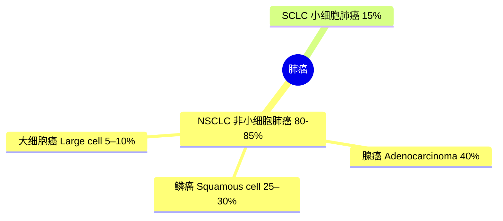
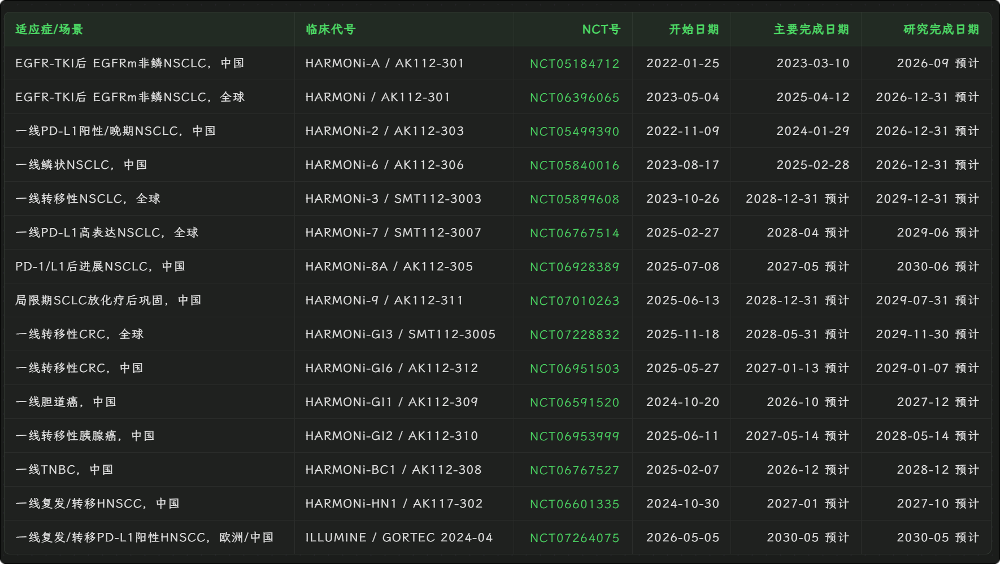

研究创新药企，主要是研究其核心产品/管线的适应症、市场规模、药理机制、临床数据、竞争格局。

选股策略：

1. 大单品，且预计单品销售峰值在2倍市值以上
2. 较好的竞争格局或极强的药效

目前创新药相关有以下几只：康方生物（14%）、传奇生物（14%）、再鼎医药（2%）、亚盛医药（2%）、药明合联（1%），创新药占整体仓位比例约32%。

国内创新药的适应症主要集中在肿瘤赛道，也就是癌症。健康的细胞发现"我DNA坏了/我老了/我多余了"，就会自己启动拆解程序，碎成小块，再被被邻居清理掉。细胞癌变的本质是凋亡逃逸，本该启动死亡程序的细胞拒绝赴死，继而陷入失控性增殖。由于癌细胞本质上也是人体自身的细胞，所以无法被免疫系统识别。

上述药企也均为抗肿瘤的药企，其药物功能均为杀死癌细胞，但技术路线各有不同。大方向上主要分为两类，干掉癌细胞（**外源性清除**）和让癌细胞自己去死（**内源性诱导凋亡**）。

- 康方生物的AK112是双抗，通过强行把T细胞和癌细胞绑定在一起，让T细胞干掉癌细胞
- 传奇生物的Carvykti是CAR-T，改造T细胞，让它能识别癌细胞
- 再鼎医药的zoci是ADC、类似于用导弹攻击癌细胞
- 亚盛医药 奥雷巴替尼/利沙托克拉，重新打开癌细胞凋亡回路，让它自己挂掉

按 2030 年全球药物市场规模排序的 Top 20 疾病（癌症已细分到具体瘤种）：

| 排名 | 疾病（癌症细分到瘤种） | 2030 全球药物市场规模（代表性区间） |
|---|---|---|
| 1 | 糖尿病 | ~1300–1350 亿美元 |
| 2 | 哮喘 & COPD（呼吸，合计） | ~1000–1550 亿美元（口径偏高，谨慎看） |
| 3 | 肥胖 / 减重（GLP-1 类） | ~950–1500 亿美元（代表 ~1100 亿） |
| 4 | **肺癌**（NSCLC 为主） | ~500–880 亿美元（代表 ~600 亿） |
| 5 | 乳腺癌 | ~520–640 亿美元 |
| 6 | HIV | ~420–450 亿美元 |
| 7 | 类风湿关节炎 | ~410 亿美元 |
| 8 | 多发性骨髓瘤 | ~300–355 亿美元 |
| 9 | 银屑病 | ~300 亿美元 |
| 10 | 特应性皮炎（湿疹） | ~290–300 亿美元 |
| 11 | 多发性硬化 | ~290 亿美元 |
| 12 | 前列腺癌 | ~220–320 亿美元 |
| 13 | 炎症性肠病（UC+克罗恩） | ~265 亿美元 |
| 14 | MASH/NASH（脂肪肝炎） | ~200–250 亿美元（高增速） |
| 15 | 白血病 | ~200–250 亿美元 |
| 16 | 年龄相关黄斑变性（含湿性 AMD） | ~180–250 亿美元 |
| 17 | 结直肠癌 | ~170 亿美元 |
| 18 | 非霍奇金淋巴瘤 | ~130–170 亿美元 |
| 19 | 黑色素瘤 | ~110–140 亿美元 |
| 20 | 阿尔茨海默病 | ~80–150 亿美元（增速最快，DMT CAGR ~68%） |
|  | ... |  |
|  | 胃癌 | 57–112 亿美元，中国高发 |
| | 宫颈癌 | 70–120 亿美元 |

对康方生物而言，市场主要担心的点是ak112在中国人群的试验数据能否复刻到全球人群。其核心是中国人群EGFR靶点高表达占比40%~50%，而欧美人群EGFR高表达只有10%左右。由于PD1xVEGF设计机制（后续详述），Ak112在EGFR高表达人群中可以显著获益。通俗的说，AK112在某类病重难治人群可以有很好的疗效，只是契合了该人群的特征，但推广到大部分普通患者，未必比标准疗法更优。

**先看主要临床：**

2026/5/31出的HAROMNi-6（中国人群，一线晚期鳞状 NSCLC,依沃西+化疗 vs 替雷利珠+化疗,N=532）的数据，让上述问题显得更加明朗。主要是鳞癌的EGFR几乎不表达（3%左右），直接回击了AK112是依赖EGFR高表达才能做出优秀的临床的观点。且OS的KM曲线尾部越拉越开，12 个月时两臂只差约 6.7 个百分点,到 24 个月差距扩大到约 16 个百分点(64.7% vs 48.6%)，能显著延长患者获益时间。

AK112核心适应症是肺癌，肺癌下细分子类，80%是非小细胞肺癌（NSCLC），15%是小细胞肺癌（SCLC）。80%的非小细胞肺癌又可以细分为非鳞癌和鳞癌，人群比例是3:1，EGFR：表皮生长因子受体，是细胞表面一个控制"生长信号"的开关，让癌细胞不停增殖，EGFR突变基本只会在非鳞癌NSCLC患者中存在，靶向EGFR的药物会导致该靶点耐药。是尚未被满足的治疗领域，也是HARMONi-A的研究人群。

PD-L1是癌细胞用来"伪装、躲避免疫攻击"的分子，PD-L1阳性是用来筛选免疫治疗获益的标志物。1线（未治疗的）PD-L1阳性的NSCLC患者，是HARMONi-2研究人群，也是头对头拿下K药的那组临床。

1线晚期鳞状非小细胞肺癌，大部分VEGF靶向药物对鳞癌不适用或有风险，这是HARMONi-6（联合化疗 vs 替雷利珠单抗+化疗）瞄准的人群。

PD-1耐药后的非小细胞肺癌，这类患者先用过PD-1/PD-L1抑制剂（如K药、O药等），一开始有效，但用一段时间后肿瘤进化出逃逸机制、免疫药失效、疾病重新进展。

把三者放一起看，本质是按"治没治过、扩没扩散、什么亚型、对哪类药耐药"四个维度去切分肺癌人群。不同切法对应完全不同的治疗难度、市场大小和临床证据要求——一线大人群是"主战场"，耐药后人群是"硬骨头"，鳞癌是"长期被冷落的角落"。

市场空间，取决于适应症（均为推测数据）

*HARMONi-3 公司层面给的指引是鳞癌队列终期 PFS 在 2026 下半年、非鳞队列 PFS 在 2027 上半年先行读出,OS 则更晚(与登记表 2028 年底的口径一致)*

| 适应症            | 临床                                                         | 全球药物市场           | 备注                                 | 数据                                                         |
| ----------------- | ------------------------------------------------------------ | ---------------------- | ------------------------------------ | ------------------------------------------------------------ |
| **NSCLC(总)**     |                                                              | $44–54B                | 绝对主战场                           |                                                              |
| 其中：1L PD-L1+   | HARMONi-2 OS                                                 | NSCLC 最大单一池       |                                      | OS 期中在约 39% 成熟度时 HR 0.777                            |
| 其中：1L 鳞癌     | HARMONi-6                                                    | 占 NSCLC ~25–30%       | 已 OS 阳性,抗血管+IO 破鳞癌禁区      |                                                              |
| 其中： 1L 全人群  | HARMONi-3                                                    | $40B                   | 赔率最大、未读出                     | 终期 PFS 预计 2026 下半年(此前 Q2 的鳞癌期中 PFS 未达预设高门槛,但 IDMC 建议继续、维持双盲,不代表趋势转负); 入组 2026 年中完成,PFS 数据预计 2027 上半年; |
| 其中：EGFRm 经TKI | HARMONi/HARMONi-A                                            | $5~10B                 | 美国首发适应症,但人群较窄            |                                                              |
| **结直肠癌 CRC**  |                                                              | $16–25B                | 市场极大,但 IO 现仅对 MSI-H(~5%)有效 | 全球 II 期 AK112-206,依沃西 + mFOLFOX6 一线 mCRC,ORR 70.8%、DCR 100%、20mg/kg 剂量组 9 个月 PFS 率 76.1%,ASCO 2026 公布 |
| **胆道癌 BTC**    | III 期注册研究 AK112-309 / HARMONi-GI1 II 期打底数据很扎实(ORR 63.6%、DCR 100%、mPFS 8.5 个月、mOS 16.8 个月) | ~$1.4–5.7B(口径差异大) | 小但高未满足、竞争少、稀缺性高       | 中国III期，已获BTD                                           |
| **头颈癌 HNSCC**  |                                                              | $3–5.25B               | 中等体量,新辅助场景是增量            | 中国+欧洲/全球III期                                          |

*NSCLC(440–540 亿美元)>> 结直肠(160–250 亿)> 头颈(30–53 亿)≈ 胆道(14–57 亿)*

- 结直肠:整体药物市场 160–250 亿美元,但免疫治疗目前只对 MSI-H(约占转移性肠癌 5%)有效,占绝大多数的 MSS 型是 IO 禁区。依沃西 II 期 ORR 70.8% 若能在 MSS 延续,等于把一个原本对 IO 关闭的 200 亿美元市场重新打开——这就是它被列为"可能超预期"的原因:弹性来自渗透率从 ~0 起跳,而非市场本身新增。
- 胆道癌是"小池高赔率"。绝对市场不大(十几亿到几十亿美元),中国年新发约 12 万,但一线长期只有"化疗±PD-L1"、生存获益有限,竞争稀疏。依沃西若 OS 头对头赢度伐利尤,临床稀缺性和定价权都强,适合作为差异化亮点而非走量主力。胆道癌是 IO 长期啃不动的硬骨头(度伐利尤+化疗只把 mOS 从 ~11.5 推到 ~12.8 个月),所以这块 OS 一旦阳性,临床意义和稀缺性都很高
- 头颈体量中等(30–50 亿美元),>95% 是鳞癌,依沃西做的是新辅助/围手术期这个增量场景,属于打开新治疗线、而非抢存量。

帕博利珠单抗美国核心化合物专利于2028年到期。

竞争对手：以最热的PD-1/VEGF赛道看，康方领先主要对手约2–3年：

- 康方依沃西已上市、已有多个III期阳性读出；FDA已于2026年1月受理上市申请（PDUFA定于11月14日）。
- 三生制药 SSGJ-707（已授权辉瑞，首付12.5亿美元）头对头K药的III期单药数据预计2026年7月才出。
- 普米斯/BioNTech 的 BNT327（PM8002，已转手BMS，总额超百亿美元）、默沙东引进的 LM-299 等，多数仍处更早期或刚进III期。
- 截至2025年中，约15个PD-1/VEGF双抗里只有康方一个获批、三生一个进III期，其余排在后面。

EGFRm（HARMONi全球） 和 无EGFR（HARMONi-6 中国） 同样可以反驳人群差异：

AK112在EGFRm NSCLC后线（单纯PD-1已被证明失效的人群）的全球数据 ，正是检验这一质疑的最佳战场 。 全球HARMONi已强力反驳该质疑的PFS维度：全人群PFS HR=0.52 ，且西方亚组HR（0.30）优于中国（0.56）；西方患者中位 OS（17.0 月）甚至不低于亚洲（16.7 月） 。但全球OS最终分析HR=0.79（p=0.0570） 、西方长期随访HR=0.78（名义p=0.0332） ，尚未达正式统计学显著 ，且西方OS随访仅约9–14个月 、远未成熟 。结论：AK112跨人种不确定性已大幅降低 ，PFS维度基本闭合 ，OS维度方向积极但有待随访成熟 。

要反驳这个质疑，得找一个"最干净、最难作弊"的场景。EGFRm（EGFR突变）NSCLC在用完靶向药耐药后，单纯的PD-1免疫药在这群人身上已被反复证明几乎无效。所以如果依沃西在这群"PD-1注定失败"的患者里、而且是在全球（含西方人群）试验里还能做出获益，那就很难再用"东亚人群占便宜"来解释——因为这本来就是免疫药的"死亡地形"。这就是说它是"检验质疑的最佳战场"。这里指的就是全球 HARMONi 研究（美国/全球多中心、2L EGFR人群）。

全人群 PFS HR=0.52：无进展生存期上，依沃西组的进展/死亡风险只有对照组的52%，即降低约48%，幅度很大。西方亚组 HR=0.30 优于中国 0.56：把患者按地域拆开看（"亚组分析"），西方患者的获益（HR=0.30，降低70%）甚至比中国患者（降低44%）更猛——这直接反打"只有东亚人受益"的说法。全球OS最终分析 HR=0.79，p=0.0570：死亡风险降低约21%，方向是好的；但 p=0.0570 大于通常的0.05门槛，所以没达到正式统计学显著——按规矩还不能宣布"已证明"。西方长期随访 HR=0.78，名义p=0.0332：单看西方人群，死亡风险降低22%，p=0.0332看似过了0.05。但注意"名义（nominal）p值"这个词——它是单独算出来的、没有经过多重检验校正的p值，统计上只能当作"参考性、提示性"证据，不能据此正式声称达标。

HARMONi-2 中期分析，类似于一个人去赌场带了500块，赌场平均胜率49%，先拿出1块钱赌一把，看看能不能赚100万，结果发现没赚到。（没有统计学获益）

## 药理机制

## 临床

### HARMONi-A

OS 最终分析已出且阳性：HR=0.74、p=0.019、mOS 16.8 vs 14.1月。这个已经完成。

### HARMONi

主要终点 PFS（无进展生存期）——已经正式读出、且达标。 全球 HARMONi 的 PFS 在预设的主分析里就达到了统计学显著（HR≈0.52）。

关键次要终点 OS（总生存期）——还没读完，目前都是期中分析（interim analysis）。 OS 是"附加题"，需要观察到足够多的死亡事件才算成熟。现在公布的那几个数字（HR=0.79 / p=0.0570、西方 HR=0.78 / 名义 p=0.0332）都是在不同时间点切一刀看的中期结果，随访才约9–14个月、死亡事件还不够，远未成熟，所以OS 的最终分析尚未出炉。

OS 最终分析已经出了，而且没达标——就是 HR=0.79、p=0.057 这一版（mOS 16.8 vs 14.0月）。也就是说，前面争议的那个全球 OS，预设的正式检验基本已经走完、没跨过显著性门槛；之后所谓"西方长期随访 HR=0.78、名义 p=0.0332"只是随访拉长后的描述性/参考性更新，不会再变成一个能正式官宣达标的"最终数据"。所以这一个，方向好但"盖章"的机会基本已经过去了。

需要纠正我上一条的措辞：这个全球 HARMONi 的 OS 不是"还没到最终"，而是"最终分析已出、未显著、后续只是随访补充"。

为什么AK112用在EGFRm患者药效更好？

2026-11-14  FDA PDUFA:2L EGFRm 适应症审评决定日

**HARMONi 的 OS 不达标，会不会预示 HARMONi-3 也失败？**

## HARMONi-3

全球一线 NSCLC

- 鳞状队列：2026 上半年完成入组；PFS 主要终点预计 2026 下半年达到预设事件数；OS 期中分析也约在 2026 下半年前后。
- 非鳞状队列：2026 下半年完成入组；PFS 主要终点预计 2027 上半年。
- 两个队列的成熟 OS（真正的最终生存数据）会更晚，普遍预计要到 2027 年及以后才陆续读出。

## HARMONi-6

## HARMONi-7

H7和H3哪个更重要？

