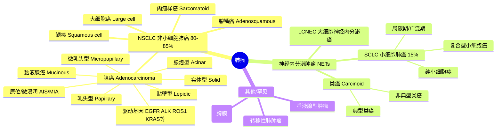

给我详细做一份报告，关于康方生物，涉及以下内容：
1、Ak112过往临床数据分析，临床数据颗粒度要尽量细（比如入组患者特征对比），临床能说明ak112什么样的特征
2、Ak112药理机制分析
3、Ak112对比同类竞品，包括过往竞品失败的原因，未失败竞品的药理机制以及临床数据
4、分析康方生物国内业务，包括医保放量，预估销售额（AK104+AK112） 
5、分析康方生物其他管线，有临床的列出临床数据，以及未来临床的时间
6、分析Ak112的HARMONi-3和HARMONi-7数据优质的可能性
7、整理康方双抗平台和其他同类药企双抗平台的对比
8、分析你认为我遗漏的，但比较重要的关于康方生物的内容

我把你贴的内容去重后，汇成一张总表如下：

| 管线      | 药物/机制                 | 当前进度                              | 重点适应症/市场                                              | 2026及后续关键节点                                           | 市场空间/销售峰值口径                                        | 与其他管线关系                                               |
| --------- | ------------------------- | ------------------------------------- | ------------------------------------------------------------ | ------------------------------------------------------------ | ------------------------------------------------------------ | ------------------------------------------------------------ |
| AK104 | 卡度尼利，PD-1/CTLA-4双抗 | 已商业化                          | 已在宫颈癌、胃/胃食管结合部癌等获批；后续关注肺癌、肝癌、海外胃癌等 | 2026年关注国内 PD-L1阴性肺癌 数据；期待更多海外临床；关注 AK104 + AK112 联用数据 | 国内峰值中性约 45-50亿元/年；若海外/HCC等兑现，上行可到 100亿元+ | 与AK112在部分实体瘤会有局部竞争，但机制不同；也可能作为联合方案组成部分 |
| **AK112** | 依沃西，PD-1/VEGF双抗     | 已商业化 + 海外申报/全球III期推进 | 肺癌是核心战场；中国已获批EGFR-TKI后EGFR突变非鳞NSCLC、1L PD-L1阳性NSCLC；还覆盖CRC、胆道癌、胰腺癌、头颈鳞癌、TNBC等 | 必看 HARMONi-6一线鳞状NSCLC、胆道癌OS；大概率看HARMONi-2 OS、HARMONi-3 PFS/OS；可能有头颈鳞癌、结直肠癌数据 | 理论TAM最大：1L转移性NSCLC中国约 750-975亿元；1L CRC约 270-375亿元；EGFR-TKI后NSCLC约 120-180亿元。这是TAM，不等于销售额 | 与AK104同属PD-1骨架IO双抗，但AK112更偏“IO + 抗血管生成”平台药，是康方最核心大单品 |
| AK117 | 莱法利，CD47单抗          | 未上市，III期/II期临床验证中      | 实体瘤：头颈鳞癌、胰腺癌等；血液瘤：MDS/AML是更关键方向      | 头颈鳞癌推进较快、相对乐观；胰腺癌难度较高；最重要催化是首个血液瘤大III期，最好是全球MDS或AML | 风险调整后全球峰值中性约 50-100亿元/年；若实体瘤III期成功，乐观可看 100亿元+ | 更多是与AK104/AK112联用增效，不是替代；公司已布局多个AK117 + AK112/AK104实体瘤研究 |
| AK132 | CLDN18.2/CD47双抗         | 更早期/精准人群探索               | 偏CLDN18.2阳性肿瘤，如胃癌、胰腺癌等                         | 贴文未列明确临床读出时间，主要看后续早期数据和适应症选择     | 贴文未给峰值；潜在空间取决于CLDN18.2阳性人群、疗效和与AK104/AK117方案的定位 | 与AK117在CD47机制上有重叠，但AK132多了CLDN18.2靶向，可能更偏特定人群；远期或在胃癌/胰腺癌与AK104、AK117方案局部竞争 |

康方生物的26年太关键，有太多关键的节点了：
1.AK112的数据，必出的H-6和胆道癌OS数据，大概率出的有H-2 OS数据，还有H-3的PFS和OS的数据，可能超预期出的有头颈和结直肠的数据
2. 之后是康方生物AK104的节点，首先是希望康方生物能多开点海外的临床，因为只有这样才能走出去，之后则是一些数据节点，首先是国内的PD-L1阴性的肺癌，这个26年大概率有数据，之后我关心的则是AK112和AK104联用的数据，但是未必会发出来，只能说期待吧
3. ，对于AK117来说，实体瘤，头颈比较快，我也比较乐观，胰腺癌比较难，但是对AK117来说，血液瘤才是最重要，期待第一个大三期，希望是全球的，不管是MDS还是AML吧，都可以

## AK104/AK112/AK117/AK132 竞争关系

结论：**会有局部竞争，但整体更像“分层布局 + 联合用药矩阵”，不是四个产品彼此全面内耗。**

| 药物       | 靶点/定位                                                    | 与其他几个的竞争关系                                         |
| ---------- | ------------------------------------------------------------ | ------------------------------------------------------------ |
| **AK104 ** | PD-1/CTLA-4 双抗，已在宫颈癌、胃/胃食管结合部癌等获批        | 与 AK112 在部分实体瘤适应症可能重叠，尤其未来若都拓展肺癌、胃癌、肝癌等，会有患者池竞争 |
| **AK112**  | PD-1/VEGF 双抗，肺癌是核心战场，已获批 EGFR-TKI 后 NSCLC、PD-L1 阳性一线 NSCLC | 与 AK104 都是 PD-1 骨架的 IO 双抗，但临床定位不同；AK112更偏“IO + 抗血管生成”平台型药物 |
| **AK117 ** | CD47 单抗，血液瘤 + 实体瘤联用                               | 更多是和 AK104/AK112 **联用增效**，而不是替代它们。康方公告中也明确 AK117 已与依沃西或卡度尼利开展多个实体瘤研究 |
| **AK132**  | CLDN18.2/CD47 双抗，偏 CLDN18.2 阳性肿瘤，如胃癌、胰腺癌等   | 与 AK117 在“CD47”层面有重叠，但 AK132多了 CLDN18.2 选择性，可能更偏特定人群；未来在胃癌等领域可能与 AK104/AK117方案形成局部竞争 |

我会把竞争强度分成三档：

**1. AK104 vs AK112：中等竞争，最需要关注。** 
两者都覆盖实体瘤、都含 PD-1 免疫治疗逻辑。康方 2026 年 6 月公告显示，AK112 正在开展超过 60 项 II/III 期研究，覆盖 40 个适应症；AK104 也有超过 40 项 II/III 期研究，覆盖 20 多个适应症。因此未来在胃癌、肺癌、肝癌、胰腺癌等方向一定会有交叉。但它们机制不同：AK104偏 PD-1/CTLA-4，AK112偏 PD-1/VEGF，所以医生会按癌种、分线、PD-L1、出血风险、免疫毒性、抗血管适用性等因素分层选择。

**2. AK117 vs AK104/AK112：更多互补，不是主竞争。** 
AK117 是 CD47 单抗，康方披露其与 ivonescimab/AK112 或 cadonilimab/AK104 已启动 10 多项、覆盖 8 个以上实体瘤适应症的联用研究，包括头颈癌、胰腺癌、胃癌、胆道癌、结直肠癌等。这说明公司更希望把 AK117 做成“组合拳”的增效部件，而不是单独去抢 AK104/AK112 的位置。

**3. AK132 vs AK117/AK104：远期、特定人群竞争。** 
AK132 是 CLDN18.2/CD47 双抗，理论上会和 AK117 在 CD47 机制上重叠，也可能在 CLDN18.2 阳性的胃癌/胰腺癌等场景与 AK104方案竞争。但它目前更像早期、精准人群产品；NCI 对 AK132 的定义也强调其通过 CLDN18.2 选择性靶向肿瘤细胞，再增强 CD47 相关作用。

所以一句话判断：短期看，AK112 和 AK104最可能在部分实体瘤市场形成内部选择问题；AK117、AK132更多是补充和升级路线。长期看，如果多个产品都在同一癌种同一治疗线获批，才会出现更实质的商业化竞争。

## AK112 适应症和临床

截至 **2026年6月3日**，AK112 就是 **依沃西单抗 Ivonescimab，PD-1/VEGF 双抗**。

**一句话概括：** 
AK112 已经从“肺癌药”扩展成一个广谱肿瘤免疫平台型药物：**中国已获批2个NSCLC适应症；已开展/启动超过60项临床、覆盖40多个适应症；15项注册性/III期临床已开展或启动。** 康方产品页也明确写到，其临床覆盖肺癌、结直肠癌、头颈鳞癌、胆道癌、胰腺癌、乳腺癌等方向。

**已经获批的适应症**

| 状态                 | 适应症                                               | 方案                    |
| -------------------- | ---------------------------------------------------- | ----------------------- |
| 中国已获批、纳入医保 | EGFR-TKI治疗后进展的 EGFR突变、局晚/转移性非鳞NSCLC  | AK112 + 培美曲塞 + 卡铂 |
| 中国已获批、纳入医保 | PD-L1 TPS≥1%、EGFR/ALK阴性的局晚/转移性NSCLC一线治疗 | AK112单药               |

上述两项在康方产品页说明书适应症中列明。

**已经重点开展的临床适应症**
| 瘤种       | 已做/正在做的主要适应症                                      |
| ---------- | ------------------------------------------------------------ |
| NSCLC      | EGFR-TKI耐药非鳞NSCLC；一线PD-L1阳性NSCLC；一线PD-L1高表达NSCLC；一线鳞状NSCLC；一线鳞癌+非鳞NSCLC；PD-1/L1治疗后进展NSCLC；可切除NSCLC新辅助/辅助 |
| SCLC       | 局限期小细胞肺癌cCRT后巩固治疗；广泛期SCLC一线探索           |
| 结直肠癌   | 一线转移性CRC，尤其MSS/pMMR人群；CRC肝转移；二线MSS/pMMR mCRC |
| 胆道癌     | 一线晚期/不可切除或转移性胆道癌；二线胆道癌探索              |
| 胰腺癌     | 一线转移性胰腺癌/PDAC                                        |
| 头颈鳞癌   | 一线PD-L1阳性复发/转移性HNSCC                                |
| 三阴乳腺癌 | 一线局晚不可切除/转移性TNBC                                  |
| 肝癌       | 一线晚期HCC、可切除HCC围手术期/辅助、TACE联合                |
| 卵巢癌     | 铂耐药/复发卵巢癌、铂敏感卵巢癌                              |
| 其他探索   | 胃/胃食管结合部癌、食管鳞癌、肾透明细胞癌、鼻咽癌、胸腺癌、胸膜间皮瘤、胶质母细胞瘤、妇科肿瘤、晚期实体瘤等 |

**未来/下一步重点适应症**

| 优先级         | 方向                                                         |
| -------------- | ------------------------------------------------------------ |
| 近期最核心     | 一线鳞状NSCLC，中国sNDA已在审评；美国/海外EGFR-TKI后NSCLC上市申请审评中，FDA目标审评日期为 **2026年11月14日** |
| 全球III期扩张  | HARMONi-3：一线转移性NSCLC；HARMONi-7：一线PD-L1高表达NSCLC；HARMONi-GI3：一线转移性结直肠癌；ILLUMINE：一线复发/转移性头颈鳞癌 |
| 中国III期扩张  | 胆道癌、三阴乳腺癌、头颈鳞癌、小细胞肺癌、结直肠癌、胰腺癌   |
| 联合疗法新方向 | 与B7-H3 ADC联合，用于多个实体瘤；与RAS(ON)抑制剂联合，面向RAS突变实体瘤，包括RAS突变NSCLC、胰腺癌、结直肠癌等 |

Summit最新管线页列出了全球/中国主要III期：HARMONi、HARMONi-3、HARMONi-7、HARMONi-GI3、ILLUMINE，以及中国的HARMONi-A/2/6/8A/9、BC1、GI1、GI2、GI6、HN1等。[来源：Summit Pipeline](https://www.smmttx.com/pipeline/) 
Summit 2026年一季度更新还提到，后续会继续把AK112全球III期扩展到 **NSCLC、CRC、HNSCC之外的更多瘤种**。

## 市场空间

可以，但要先说明口径：下面是理论可及市场空间 TAM，不是AK112未来销售额。实际销售额还要乘以获批概率、渗透率、医保/定价、竞争格局、联合用药分成等。

我按中国当前依沃西医保价格粗算：**约15万人民币/患者/年**。依据是医保资料披露的 20mg/kg、每3周一次，以及医保支付标准价约 736元/100mg。

**核心适应症市场空间粗算**
| 适应症                          |                 AK112阶段 | 中国可治疗人群/年 粗估 | 中国理论TAM |                              全球/海外量级 |
| ------------------------------- | ------------------------: | ---------------------: | ----------: | -----------------------------------------: |
| EGFR-TKI后进展 EGFRm非鳞NSCLC   | 中国已获批；美国BLA审评中 |               8-12万人 | 120-180亿元 |                             50-100亿美元级 |
| 1L PD-L1阳性、EGFR/ALK阴性NSCLC |                中国已获批 |              20-30万人 | 300-450亿元 |                            100亿美元级以上 |
| 1L PD-L1高表达NSCLC             |                 全球III期 |               8-15万人 | 120-225亿元 |                             50-100亿美元级 |
| 1L鳞状NSCLC                     |            中国sNDA审评中 |              10-15万人 | 150-225亿元 |                             60-100亿美元级 |
| 1L转移性NSCLC，鳞+非鳞          |                 全球III期 |              50-65万人 | 750-975亿元 |           肺癌治疗总市场约360-470亿美元/年 |
| PD-1/L1经治或IO耐药NSCLC        |                 中国III期 |              15-25万人 | 225-375亿元 |                   50-100亿美元级潜在子市场 |
| 局限期SCLC同步放化疗后巩固      |                中国临床中 |                2-4万人 |   30-60亿元 |                   SCLC治疗市场约80亿美元级 |
| 1L转移性结直肠癌，MSS/pMMR为主  |            中国+全球III期 |              18-25万人 | 270-375亿元 |              CRC治疗市场约140-350亿美元/年 |
| 1L胆道癌                        |        中国III期，已获BTD |                3-5万人 |   45-75亿元 |                              13-25亿美元级 |
| 1L转移性胰腺癌/PDAC             |                 中国III期 |                6-9万人 |  90-135亿元 |                              30-80亿美元级 |
| 1L PD-L1阳性复发/转移头颈鳞癌   |       中国+欧洲/全球III期 |                3-5万人 |   45-75亿元 | 28-100亿美元级，取决于是否按广义头颈癌口径 |
| 1L三阴乳腺癌TNBC                |        中国III期，已获BTD |                2-4万人 |   30-60亿元 |                              10-50亿美元级 |

**早期/探索适应症**
| 适应症                                               |      中国理论空间 粗估 | 备注                                                         |
| ---------------------------------------------------- | ---------------------: | ------------------------------------------------------------ |
| 肝细胞癌HCC                                          |            150-300亿元 | 中国新发肝癌基数大，但AK112定位仍在探索，不能直接按一线全量算 |
| 卵巢癌                                               |              30-75亿元 | 包括铂敏感/铂耐药等不同人群，竞争和联合方案会影响空间        |
| 胃/胃食管结合部癌                                    |            120-225亿元 | 大市场，但PD-1、CLDN18.2、HER2 ADC等竞争强                   |
| 食管鳞癌                                             |             75-150亿元 | 中国/亚洲权重高，AK112多为新辅助或联合探索                   |
| 肾透明细胞癌、鼻咽癌、胸腺癌、间皮瘤、胶质母细胞瘤等 | 单项多为数亿到数十亿元 | 多数还属于IST或II期探索，商业确定性低                        |

**怎么看大小排序**
最大的是：一线NSCLC > 一线CRC > IO耐药/EGFR-TKI后NSCLC > 胰腺癌/鳞状NSCLC/PD-L1阳性NSCLC > 胆道癌、头颈鳞癌、TNBC。 
但从确定性看，排序又不同：已获批NSCLC最高，其次鳞状NSCLC、全球NSCLC、CRC、胆道癌/TNBC/胰腺癌/头颈鳞癌。

主要参考：康方产品页与2026路演材料、Summit pipeline、NMPA/医保资料、IARC/GLOBOCAN与中国2022癌症统计、公开市场研究报告。 

## 临床时间

下面按**核心/注册性临床**列，日期来自 ClinicalTrials.gov 当前登记；“主要完成”通常是读主要终点的时间，“研究完成”才是整项随访结束时间。

| 适应症/场景                            | 临床代号                  |                                                       NCT号 |   开始日期 |    主要完成日期 |    研究完成日期 |
| -------------------------------------- | ------------------------- | ----------------------------------------------------------: | ---------: | --------------: | --------------: |
| EGFR-TKI后 EGFRm非鳞NSCLC，中国        | HARMONi-A / AK112-301     | [NCT05184712](https://clinicaltrials.gov/study/NCT05184712) | 2022-01-25 |      2023-03-10 |    2026-09 预计 |
| EGFR-TKI后 EGFRm非鳞NSCLC，全球        | HARMONi / AK112-301       | [NCT06396065](https://clinicaltrials.gov/study/NCT06396065) | 2023-05-04 |      2025-04-12 | 2026-12-31 预计 |
| 一线PD-L1阳性/晚期NSCLC，中国          | HARMONi-2 / AK112-303     | [NCT05499390](https://clinicaltrials.gov/study/NCT05499390) | 2022-11-09 |      2024-01-29 | 2026-12-31 预计 |
| 一线鳞状NSCLC，中国                    | HARMONi-6 / AK112-306     | [NCT05840016](https://clinicaltrials.gov/study/NCT05840016) | 2023-08-17 |      2025-02-28 | 2026-12-31 预计 |
| 一线转移性NSCLC，全球                  | HARMONi-3 / SMT112-3003   | [NCT05899608](https://clinicaltrials.gov/study/NCT05899608) | 2023-10-26 | 2028-12-31 预计 | 2029-12-31 预计 |
| 一线PD-L1高表达NSCLC，全球             | HARMONi-7 / SMT112-3007   | [NCT06767514](https://clinicaltrials.gov/study/NCT06767514) | 2025-02-27 |    2028-04 预计 |    2029-06 预计 |
| PD-1/L1后进展NSCLC，中国               | HARMONi-8A / AK112-305    | [NCT06928389](https://clinicaltrials.gov/study/NCT06928389) | 2025-07-08 |    2027-05 预计 |    2030-06 预计 |
| 局限期SCLC放化疗后巩固，中国           | HARMONi-9 / AK112-311     | [NCT07010263](https://clinicaltrials.gov/study/NCT07010263) | 2025-06-13 | 2028-12-31 预计 | 2029-07-31 预计 |
| 一线转移性CRC，全球                    | HARMONi-GI3 / SMT112-3005 | [NCT07228832](https://clinicaltrials.gov/study/NCT07228832) | 2025-11-18 | 2028-05-31 预计 | 2029-11-30 预计 |
| 一线转移性CRC，中国                    | HARMONi-GI6 / AK112-312   | [NCT06951503](https://clinicaltrials.gov/study/NCT06951503) | 2025-05-27 | 2027-01-13 预计 | 2029-01-07 预计 |
| 一线胆道癌，中国                       | HARMONi-GI1 / AK112-309   | [NCT06591520](https://clinicaltrials.gov/study/NCT06591520) | 2024-10-20 |    2026-10 预计 |    2027-12 预计 |
| 一线转移性胰腺癌，中国                 | HARMONi-GI2 / AK112-310   | [NCT06953999](https://clinicaltrials.gov/study/NCT06953999) | 2025-06-11 | 2027-05-14 预计 | 2028-05-14 预计 |
| 一线TNBC，中国                         | HARMONi-BC1 / AK112-308   | [NCT06767527](https://clinicaltrials.gov/study/NCT06767527) | 2025-02-07 |    2026-12 预计 |    2028-12 预计 |
| 一线复发/转移HNSCC，中国               | HARMONi-HN1 / AK117-302   | [NCT06601335](https://clinicaltrials.gov/study/NCT06601335) | 2024-10-30 |    2027-01 预计 |    2027-10 预计 |
| 一线复发/转移PD-L1阳性HNSCC，欧洲/中国 | ILLUMINE / GORTEC 2024-04 | [NCT07264075](https://clinicaltrials.gov/study/NCT07264075) | 2026-05-05 |    2030-05 预计 |    2030-05 预计 |

**较重要的II期/探索适应症**
| 适应症/场景           | 临床代号      |                                                       NCT号 |   开始日期 |    主要完成日期 |    研究完成日期 |
| --------------------- | ------------- | ----------------------------------------------------------: | ---------: | --------------: | --------------: |
| 可切除NSCLC围手术期   | AK112-205     | [NCT05247684](https://clinicaltrials.gov/study/NCT05247684) | 2022-02-20 |      2025-08-18 | 2026-12-31 预计 |
| 转移性CRC探索         | AK112-206     | [NCT05382442](https://clinicaltrials.gov/study/NCT05382442) | 2022-06-27 | 2026-05-15 预计 | 2028-08-12 预计 |
| 一线广泛期SCLC        | AK112-214     | [NCT07245446](https://clinicaltrials.gov/study/NCT07245446) | 2025-10-29 |    2027-12 预计 |    2028-06 预计 |
| 晚期HCC               | AK112-209     | [NCT06530251](https://clinicaltrials.gov/study/NCT06530251) | 2024-09-24 |    2026-06 预计 |    2028-09 预计 |
| 复发卵巢癌            | AK104-221     | [NCT06560112](https://clinicaltrials.gov/study/NCT06560112) | 2024-11-12 | 2026-05-01 预计 | 2027-05-01 预计 |
| 铂敏感卵巢癌          | AK112-211     | [NCT06686030](https://clinicaltrials.gov/study/NCT06686030) | 2025-02-17 |    2027-10 预计 |    2028-07 预计 |
| 胃/胃食管结合部癌一线 | AK104-IIT-041 | [NCT06196697](https://clinicaltrials.gov/study/NCT06196697) | 2024-04-10 |    2027-01 预计 |    2027-03 预计 |
| 食管鳞癌二线联合放疗  | 2025KY-296    | [NCT07188103](https://clinicaltrials.gov/study/NCT07188103) | 2025-07-01 | 2027-06-30 预计 | 2027-06-30 预计 |

临床代号对应关系主要参考 [Summit Pipeline](https://www.smmttx.com/pipeline/)；起止日期按各 NCT 登记页。

## AK104和AK117 简述

按“药品可兑现销售额”口径看，结论先放前面：

| 产品 | 主要对应市场 | 市场规模粗略口径 | 预计销售峰值 |
|---|---|---:|---:|
| **AK104 / 卡度尼利** | 胃/胃食管结合部癌、宫颈癌；后续肝癌、海外胃癌等 | 中国胃癌治疗市场约 **8.1亿美元/2024 → 15.1亿美元/2030**；中国宫颈癌治疗市场约 **7.6亿美元/2024 → 11.7亿美元/2033** | **国内中性：45-50亿元人民币/年**；若海外/HCC兑现，上行可到 **100亿元+** |
| **AK117 / 莱法利，CD47** | CD47赛道；头颈鳞癌、胰腺癌、MDS/AML等 | 全球Anti-CD47药物市场约 **5.6亿美元/2024 → 41亿美元/2030**；MDS全球药物市场约 **28.8亿美元/2023 → 52.8亿美元/2030** | **风险调整后中性：50-100亿元人民币/年全球口径**；若实体瘤III期成功，乐观可看 **100亿元+** |

我的判断：**AK104是确定性更高的45-50亿国内峰值品种；AK117是弹性更大的期权品种，峰值取决于头颈鳞癌/胰腺癌III期能否打出来。**

依据上，AK104已在中国获批二线及以上宫颈癌、一线胃/GEJ癌，并在2025年获批一线宫颈癌，且相关已获批适应症进入医保；康方2025年商业化销售收入约30.33亿元，同比增长51%。AK104的公开券商测算多落在国内峰值 **40亿以上到约48亿元**，例如兴证/建银等口径约40-45亿，未来智库摘录的测算为 **48.35亿元**。

AK117现在还没商业化，所以峰值不宜按“确定销售”看。公司披露其为全球唯一进入实体瘤III期的CD47抗体之一，已有3项中国/全球注册III期，包括一线PD-L1阳性头颈鳞癌和一线胰腺癌；同时还有MDS/AML方向。这个资产如果只在血液瘤或小适应症成功，峰值会明显低；真正的100亿级弹性来自实体瘤联用AK112/AK104成功。

截至 **2026年6月3日**，三条线的进度大致是：

| 管线 | 药物/靶点 | 当前阶段 | 关键进度 |
|---|---|---|---|
| **AK104** | 卡度尼利，PD-1/CTLA-4双抗 | **已商业化** | 中国已获批 **3个适应症**：二线及以上宫颈癌、一线胃/胃食管结合部癌、一线宫颈癌；三项均已进医保。全球层面在推进一线胃癌全球III期、IO耐药肝癌注册性研究等。 |
| **AK112** | 依沃西，PD-1/VEGF双抗 | **已商业化 + 海外申报** | 中国已获批 **2个肺癌适应症**：EGFR-TKI失败后EGFR突变非鳞NSCLC、1L PD-L1阳性NSCLC；1L鳞状NSCLC适应症在中国审评中。美国BLA已被FDA受理，PDUFA日期为 **2026年11月14日**。 |
| **AK117** | 莱法利，CD47单抗 | **未上市，临床III期/II期** | 实体瘤已有 **3个III期方向**：头颈鳞癌、胰腺癌、全球头颈鳞癌ILLUMINE；血液瘤方向MDS全球II期、AML中国II期已完成入组/披露数据，AML获FDA孤儿药资格。 |

简单判断：**AK104是成熟商业化品种，AK112是正在从中国商业化走向全球申报的核心大单品，AK117还处在临床验证期，弹性大但风险也最大。**

> AK104，AK 112 大双抗，中排的 117 等，至于后排的AK132,AK137双抗

## 康方生物在双抗的布局，是否领先于行业内，如果领先，领先多少，和同行对比药效如何

结论：康方在双抗（尤其是肿瘤免疫双抗）领域确实是全球领先者，但"领先"主要建立在中国数据上，全球化验证仍有变数。

**领先的体现**

康方约在2014年就押注双抗赛道，跑出两个"全球首创且已上市"的产品，这是同行没有的：

- 卡度尼利（PD-1/CTLA-4）：全球首个获批上市的PD-1/CTLA-4双抗（2022年中国获批）。
- 依沃西（PD-1/VEGF，AK112）：全球首个进入III期、也是全球首个在头对头K药（帕博利珠单抗）III期研究中取得显著阳性的药物，2025年4月在中国获批一线PD-L1阳性NSCLC。

**领先多少**

以最热的PD-1/VEGF赛道看，康方领先主要对手约2–3年：

- 康方依沃西已上市、已有多个III期阳性读出；FDA已于2026年1月受理上市申请（PDUFA定于11月14日）。
- 三生制药 SSGJ-707（已授权辉瑞，首付12.5亿美元）头对头K药的III期单药数据预计2026年7月才出。
- 普米斯/BioNTech 的 BNT327（PM8002，已转手BMS，总额超百亿美元）、默沙东引进的 LM-299 等，多数仍处更早期或刚进III期。
- 截至2025年中，约15个PD-1/VEGF双抗里只有康方一个获批、三生一个进III期，其余排在后面。

依沃西本身已在肺癌、结直肠癌、头颈鳞癌等铺开约14项III期，管线纵深也明显超过同行单一适应症的布局。

**药效对比（头对头硬数据）**

这是康方最强的论据——它是少数敢做、且赢了头对头的：

- HARMONi-2（中国，单药 vs K药）：依沃西 mPFS 11.14个月 vs K药 5.82个月，近乎翻倍，且≥3级不良反应更低。
- HARMONi-6（中国，联合化疗 vs 替雷利珠单抗+化疗）：OS HR=0.66，死亡风险降低34%，是全球首个在一线击败"活性PD-1对照"的方案，入选2026 ASCO全体大会（本届唯一中国研究）。

相比之下，多数同行目前对比的是化疗或安慰剂，缺乏直接击败PD-1"药王"的III期OS证据。

**需要打的折扣**

康方的优势在中国数据上很扎实，但出海遇到坎：依沃西在美国/全球的关键研究（如 HARMONi 2L EGFR 队列、HARMONi-3）出现OS未达预设统计阈值的情况，引发"中美数据差异"质疑，2026年5月相关全球III期未达阈值的消息也压制了估值。所以更准确的说法是：**康方在双抗布局的广度、上市进度和头对头疗效证据上全球领先约2–3年，但其全球（尤其欧美人群）疗效能否复制中国结果，仍是决定这份领先含金量的关键变量。**

## EGFR耐药后的非鳞状非小细胞肺癌，1线PDL1阳性非小细胞肺癌；1线晚期鳞状非小细胞肺癌；PD1耐药后的非小细胞肺癌；这些是什么意思

这是把好几个限定词叠在一起的医学描述，拆开看就清楚了。我从最里层往外讲。

**肺癌**：肺部的恶性肿瘤。

**非小细胞肺癌（NSCLC）**：肺癌按癌细胞在显微镜下的样子分两大类——小细胞肺癌和非小细胞肺癌。非小细胞型占肺癌的约80–85%，是绝大多数患者的类型。之所以这么分，是因为两类的生长方式和治疗方案完全不同。

**非鳞状**：非小细胞肺癌内部又再细分，主要是"鳞状"（鳞癌，起源于气道表面的鳞状上皮）和"非鳞状"（主要是腺癌，起源于肺里分泌黏液的腺体细胞）。区分这两者很关键，因为有些药对鳞癌不能用（比如贝伐珠单抗这类抗血管药用在鳞癌有出血风险），而很多靶向治疗的基因突变也主要出现在非鳞/腺癌里。

**EGFR**：表皮生长因子受体，是细胞表面一个控制"生长信号"的开关。一部分非鳞NSCLC患者的肿瘤带有EGFR基因突变，相当于这个开关被卡在"一直开"的状态，让癌细胞不停增殖。这类患者通常先用EGFR靶向药（如奥希替尼等），疗效往往很好。

**耐药后**：靶向药用一段时间后，癌细胞会进化出新的逃逸机制，让原来的药失效、肿瘤重新进展，这就叫"获得性耐药"。"EGFR耐药后"指的就是这类患者已经用过EGFR靶向药、现在药不管用了、需要换下一线治疗的阶段。

合起来，**"EGFR耐药后的非鳞状非小细胞肺癌"**指的是：一群得了非小细胞肺癌、属于非鳞（多为腺癌）亚型、肿瘤带EGFR突变、且已经对EGFR靶向药产生耐药、疾病再次进展的患者。

这正是依沃西（以及前面提到的 HARMONi-A 研究）重点瞄准的人群——这类患者耐药后选择有限，化疗效果一般，所以是个尚未被满足、竞争也很激烈的治疗场景。

这三个也是"治疗阶段 + 人群限定"的组合，我逐个拆给你。前面讲过的"非小细胞肺癌""鳞状/非鳞""PD-L1"这里直接用。

**一线（1L）PD-L1阳性非小细胞肺癌**

"一线"指患者确诊后接受的**第一种**正式治疗（还没用过其他抗癌药）。后面接受的依次叫二线、三线。一线人群通常身体状态较好、肿瘤未被前面的治疗"折腾"过，是各家药企最想抢的市场。

"PD-L1阳性"指肿瘤细胞表面表达PD-L1这个蛋白。PD-L1是癌细胞用来"伪装、躲避免疫攻击"的分子，临床用一个叫TPS的比例衡量它的表达量（比如≥1%算阳性）。表达越高，通常对PD-1/PD-L1类免疫药越敏感，所以这是筛选"谁更可能从免疫治疗获益"的标志物。

合起来：刚确诊、还没治过、且肿瘤PD-L1阳性的NSCLC患者。这就是依沃西 HARMONi-2 头对头K药拿下的人群。

**一线晚期鳞状非小细胞肺癌**

"晚期"指肿瘤已经扩散转移（通常是IV期），无法靠手术切除根治，只能靠全身性药物控制。

"鳞状"是前面说的鳞癌亚型（起源于气道鳞状上皮）。鳞癌治疗选择比腺癌少——很多靶向药和部分抗血管药对鳞癌不适用或有风险，所以这块长期是个难啃、需求未被满足的领域。

合起来：刚确诊、肿瘤已扩散、且是鳞癌亚型的NSCLC患者。这正是依沃西 HARMONi-6（联合化疗 vs 替雷利珠单抗+化疗）瞄准并拿下OS阳性的人群。

**PD-1耐药后的非小细胞肺癌**

和上一条里讲的"EGFR耐药后"是同一个逻辑，只是耐药的药换成了免疫药。这类患者先用过PD-1/PD-L1抑制剂（如K药、O药等），一开始有效，但用一段时间后肿瘤进化出逃逸机制、免疫药失效、疾病重新进展，就叫"PD-1耐药/经治"。

这群人耐药后非常棘手——免疫药已经不管用，化疗效果有限，是目前肺癌领域最难治、也最缺新方案的场景之一，所以是很多新药（包括双抗）想去证明价值的地方。

把三者放一起看，本质是**按"治没治过、扩没扩散、什么亚型、对哪类药耐药"四个维度**去切分肺癌人群。不同切法对应完全不同的治疗难度、市场大小和临床证据要求——一线大人群是"主战场"，耐药后人群是"硬骨头"，鳞癌是"长期被冷落的角落"。

## 解释里面的每个专业词汇：在ITT人群中 ，在39%成熟度时进行的总生存期（OS）的期中分析（本次分析α分配值仅为0.0001）结果显示 ，依沃西对比帕博利珠单抗具有显著的临床生存获益 ，HR=0.777 ，降低死亡风险22.3%”

这句话是临床试验读数的标准表述，信息密度很高。我把每个术语拆开解释，最后再把整句翻成大白话。

**ITT人群（意向治疗人群，Intention-To-Treat）** 指"所有按计划被随机分组的患者，全都算进分析里"，不管他们后来有没有真正用药、有没有中途退出。这样做是为了防止"挑数据"——比如把效果差的、提前退出的人剔掉会让结果虚高。ITT是最严格、最被监管机构认可的统计口径。

**总生存期（OS，Overall Survival）** 从随机入组到患者因任何原因死亡的时间。这是肿瘤试验里**含金量最高的终点**，因为它直接回答"这药能不能让人活得更久"，比"肿瘤缩没缩小（PFS、ORR）"更硬。监管和医生最看重它。

**期中分析（Interim Analysis）** 试验还没完全做完、终点事件（这里是死亡）还没攒够的时候，提前做的一次中途分析。好处是如果药效已经非常突出，可以早点拿到结论、早点让患者受益；代价是数据还不够成熟，得用更严格的统计门槛来防止"碰运气提前宣布成功"。

**成熟度39%（Maturity）** 指预设需要观察到的死亡事件，目前只发生了39%。换句话说，大部分患者还活着、随访还在继续，这是一次相当早期的期中分析。成熟度越低，数据越不稳定，所以越需要严格的统计标准——这就引出下一个词。

**α分配值0.0001（Alpha，显著性水平/I类错误）** α代表"允许的假阳性概率"，即"药其实没用、却被误判成有用"的容忍度。常规试验用0.05（5%）。因为这次是超早期期中分析，又是从总的"统计预算"里只拨出极小一份来用，所以门槛被压到0.0001（万分之一）——意思是结果必须强到"几乎不可能是偶然"才算数。能在这么苛刻的门槛下达标，反而说明信号非常硬。

**依沃西 vs 帕博利珠单抗** 依沃西是康方的PD-1/VEGF双抗（试验药）；帕博利珠单抗就是"K药"（Keytruda），全球销量第一的PD-1单抗，这里是对照组、也就是要被挑战的"标杆"。

**显著的临床生存获益** "显著"是统计学含义——在上述0.0001的门槛下达到了统计学意义，不是偶然；"临床生存获益"是医学含义——这种延长对患者真实有意义。两者都满足，才算真正站得住。

**HR=0.777（风险比，Hazard Ratio）** HR比较两组在任一时刻发生事件（死亡）的速率之比。HR=0.777 表示依沃西组的瞬时死亡风险是K药组的77.7%。HR<1对试验药有利，HR=1表示两组无差别。

**降低死亡风险22.3%** 就是 1 − 0.777 = 0.223 的直白说法：相比用K药，用依沃西让死亡风险降低了约22.3%。注意这是"风险降低比例"，不等于"多活22%的时间"，两者概念不同。

**整句翻成大白话**

在最严格的"所有随机患者都算"的口径下，趁死亡事件才发生了39%、数据还很早的时候提前看了一眼。因为看得早，这次只用了万分之一这种极苛刻的过关标准。即便如此，依沃西对比全球标杆K药仍然达标了，死亡风险降低约22%（HR=0.777）——也就是说，活得更久这个最硬的指标上，依沃西在很早期就已经显示出战胜K药的信号。

补充一句价值判断：能在这么低的成熟度和这么严的α下就达到OS显著，是个相当强的结果；但39%成熟度毕竟早，最终数值（尤其HR会不会回升）还要等数据继续成熟、随访更完整后才能盖棺定论。

## SCLC和NSCLC生长方式和治疗方式已经病因有什么区别

小细胞肺癌（SCLC）和非小细胞肺癌（NSCLC）虽然都长在肺里，但几乎可以当成两种不同的病来理解。它们的根本差异源于细胞起源不同，进而决定了病因、生长方式和治疗的全面分化。

**细胞起源（最根本的区别）**

SCLC起源于肺里的**神经内分泌细胞**（一类能分泌激素样物质的细胞），显微镜下细胞小、胞浆少、挤在一起。NSCLC起源于普通的上皮细胞，又分腺癌（腺体细胞）、鳞癌（气道鳞状上皮）等亚型。起源不同，是后面所有差异的源头。

**病因**

两者最大的共同病因都是**吸烟**，但SCLC对吸烟的依赖更极端——绝大多数SCLC患者是重度吸烟者，几乎不发生在从不吸烟的人身上。NSCLC虽然也和吸烟强相关，但相当一部分（尤其是腺癌、亚洲女性）发生在不吸烟人群，这类往往由特定基因突变驱动（如EGFR、ALK等）。换句话说，SCLC几乎是"纯烟草病"，NSCLC的病因更多元。

**生长方式**

这是临床上最要命的区别。SCLC**生长极快、极早转移**——确诊时往往已经扩散到淋巴结、肝、脑、骨等远处，所以传统上不用常规的I–IV分期，而是简单分为"局限期"和"广泛期"，且大多数一发现就是广泛期。NSCLC生长相对慢，转移也较晚，所以有更多患者在早期被发现、能用常规TNM分期、也更有手术根治的机会。

一个矛盾的特点：SCLC长得快，所以**对化疗和放疗一开始反应特别好、肿瘤缩得很快**；但也极容易复发、且复发后迅速耐药，整体预后差。NSCLC生长慢，对化疗的初始敏感性反而不如SCLC，但治疗手段更丰富、长期控制和治愈的机会更大。

**治疗方式**

NSCLC是"精准治疗"的主战场。早期可手术切除±辅助治疗；晚期则高度依赖**基因检测**——查到EGFR、ALK、ROS1等驱动突变就用对应靶向药，效果好；没有可靶向突变的，用免疫治疗（PD-1/PD-L1）±化疗。前面聊的依沃西、K药这些都属于NSCLC的免疫/双抗赛道。

SCLC则**很少手术**（因为发现时多已扩散），治疗以**化疗为主干**（铂类+依托泊苷），加上放疗，近年再叠加免疫治疗（如阿替利珠单抗、度伐利尤单抗）。SCLC的靶向治疗长期是块"硬骨头"——驱动突变少、可用靶点少，所以进展远慢于NSCLC；近期有像tarlatamab（靶向DLL3的双抗）这样的新方向开始突破。整体上SCLC的治疗选择仍明显少于NSCLC。

**一句话总结**

NSCLC：起源普通上皮、病因更多元、长得慢转移晚、有手术和靶向/免疫的丰富武器、整体预后较好；SCLC：起源神经内分泌细胞、几乎只见于重度吸烟者、长得快极早转移、化放疗初期反应猛但极易复发、可用靶点少、预后差。正因如此，确诊后第一步病理分型（是不是小细胞）就直接决定了完全不同的治疗路线。

如果你愿意，我可以把这套NSCLC/SCLC的对比、加上前面聊的依沃西等双抗内容，整理成一份结构化的中文笔记或对比表文档。

## 肺癌分类思维导图

> 以 WHO 肺肿瘤病理分类为骨架，括号内为大致占比，仅供参考。

- 肺癌（原发性支气管肺癌）
  - 非小细胞肺癌 NSCLC（约 80–85%）
    - 腺癌 Adenocarcinoma（NSCLC 中最常见，约占全部肺癌 40%）
      - 浸润性非黏液腺癌（按主要形态分型）
        - 贴壁型 Lepidic
        - 腺泡型 Acinar
        - 乳头型 Papillary
        - 微乳头型 Micropapillary（侵袭性强）
        - 实体型 Solid（侵袭性强）
      - 浸润性黏液腺癌 Invasive mucinous
      - 微浸润腺癌 MIA（≤3cm，浸润≤5mm）
      - 原位腺癌 AIS（早期，原"细支气管肺泡癌"）
      - 常见驱动基因（决定靶向用药）：EGFR、ALK、ROS1、KRAS(G12C)、BRAF、MET、RET、HER2、NTRK
    - 鳞状细胞癌 Squamous cell carcinoma（约 25–30%）
      - 角化型 / 非角化型 / 基底样
      - 多与吸烟相关，中央型多见，驱动突变少
    - 大细胞癌 Large cell carcinoma（约 5–10%）
      - 排除性诊断（无腺/鳞/神经内分泌分化）
    - 腺鳞癌 Adenosquamous carcinoma（少见）
    - 肉瘤样癌 Sarcomatoid carcinoma（罕见、侵袭强）
      - 多形性癌 / 梭形细胞癌 / 巨细胞癌 / 癌肉瘤 / 肺母细胞瘤
    - 唾液腺型肿瘤（罕见）
      - 黏液表皮样癌 / 腺样囊性癌
  - 神经内分泌肿瘤 Neuroendocrine tumors（NETs）
    - 小细胞肺癌 SCLC（约 15%）
      - 纯小细胞癌 Pure SCLC
      - 复合型小细胞癌 Combined SCLC（混合 NSCLC 成分）
      - 临床分期：局限期 Limited / 广泛期 Extensive
    - 大细胞神经内分泌癌 LCNEC（约 3%，高级别）
    - 类癌 Carcinoid（低/中级别）
      - 典型类癌 Typical carcinoid（低级别）
      - 非典型类癌 Atypical carcinoid（中级别）
  - 其他 / 罕见类型
    - 转移性肺肿瘤（继发性，来自其他器官，最常见的肺恶性肿瘤但非"原发肺癌"）
    - 间皮瘤（胸膜来源，非肺实质，常与石棉相关）

- 第一刀：是不是神经内分泌起源 → 决定 SCLC/类癌 vs 普通 NSCLC，治疗路线完全不同。
- 第二刀（NSCLC 内部）：腺癌 vs 鳞癌 → 决定能否用抗血管药、是否做基因检测找靶点。
- 第三刀（腺癌内部）：有无驱动基因突变 → 有突变走靶向治疗，无突变走免疫±化疗。
- SCLC：分期只分"局限期/广泛期"，以化放疗+免疫为主，靶点少、预后差。

**非小细胞肺癌（NSCLC）**：肺癌按癌细胞在显微镜下的样子分两大类——小细胞肺癌和非小细胞肺癌。非小细胞型占肺癌的约80–85%，是绝大多数患者的类型。之所以这么分，是因为两类的生长方式和治疗方案完全不同。

**非鳞状**：非小细胞肺癌内部又再细分，主要是"鳞状"（鳞癌，起源于气道表面的鳞状上皮）和"非鳞状"（主要是腺癌，起源于肺里分泌黏液的腺体细胞）。区分这两者很关键，因为有些药对鳞癌不能用（比如贝伐珠单抗这类抗血管药用在鳞癌有出血风险），而很多靶向治疗的基因突变也主要出现在非鳞/腺癌里。

**EGFR**：表皮生长因子受体，是细胞表面一个控制"生长信号"的开关。一部分非鳞NSCLC患者的肿瘤带有EGFR基因突变，相当于这个开关被卡在"一直开"的状态，让癌细胞不停增殖。这类患者通常先用EGFR靶向药（如奥希替尼等），疗效往往很好。

"一线"：指患者确诊后接受的第一种正式治疗（还没用过其他抗癌药）。后面接受的依次叫二线、三线。一线人群通常身体状态较好、肿瘤未被前面的治疗"折腾"过，是各家药企最想抢的市场。

**PD-L1阳性**：指肿瘤细胞表面表达PD-L1这个蛋白。PD-L1是癌细胞用来"伪装、躲避免疫攻击"的分子，临床用一个叫TPS的比例衡量它的表达量（比如≥1%算阳性）。表达越高，通常对PD-1/PD-L1类免疫药越敏感，所以这是筛选"谁更可能从免疫治疗获益"的标志物。

**晚期**：指肿瘤已经扩散转移（通常是IV期），无法靠手术切除根治，只能靠全身性药物控制。

## 解释：西方对中国免疫数据的核心质疑是“人群差异论”——认为中国试验的疗效优势可能源于东亚特殊人群与试验设计 、而非药物本身 ，难以外推至西方 。AK112在EGFRm NSCLC后线（单纯PD-1已被证明失效的人群）的全球数据 ，正是检验这一质疑的最佳战场 。 全球HARMONi已强力反驳该质疑的PFS维度：全人群PFS HR=0.52 ，且西方亚组HR（0.30）优于中国（0.56）；西方患者中位 OS（17.0 月）甚至不低于亚洲（16.7 月） 。但全球OS最终分析HR=0.79（p=0.0570） 、西方长期随访HR=0.78（名义p=0.0332） ，尚未达正式统计学显著 ，且西方OS随访仅约9–14个月 、远未成熟 。结论：AK112跨人种不确定性已大幅降低 ，PFS维度基本闭合 ，OS维度方向积极但有待随访成熟 。

这段是投资/临床视角对"依沃西（AK112）能不能在西方复制中国疗效"这一核心争议的论证。我把它的逻辑链和每个术语拆开讲。

**1. 争议的本质：人群差异论**

西方对中国免疫药数据的核心质疑是："你在中国试验里赢，可能不是因为药真的好，而是因为东亚人群本身特殊（基因、肿瘤生物学、合并治疗习惯不同）+ 试验设计对你有利。"换句话说，他们怀疑疗效优势**不可外推（extrapolate）**——"外推"就是"把A人群的结论搬到B人群身上用"。能不能外推，是FDA批不批、欧美医生用不用的关键。

**2. 为什么 EGFR耐药后人群是"最佳战场"**

要反驳这个质疑，得找一个"最干净、最难作弊"的场景。EGFRm（EGFR突变）NSCLC在用完靶向药耐药后，**单纯的PD-1免疫药在这群人身上已被反复证明几乎无效**。所以如果依沃西在这群"PD-1注定失败"的患者里、而且是在**全球（含西方人群）**试验里还能做出获益，那就很难再用"东亚人群占便宜"来解释——因为这本来就是免疫药的"死亡地形"。这就是说它是"检验质疑的最佳战场"。这里指的就是全球 HARMONi 研究（美国/全球多中心、2L EGFR人群）。

**3. PFS维度：质疑基本被驳倒**

- **全人群 PFS HR=0.52**：无进展生存期上，依沃西组的进展/死亡风险只有对照组的52%，即降低约48%，幅度很大。
- **西方亚组 HR=0.30 优于中国 0.56**：把患者按地域拆开看（"亚组分析"），西方患者的获益（HR=0.30，降低70%）甚至比中国患者（降低44%）更猛——这直接反打"只有东亚人受益"的说法。
- **西方中位OS 17.0月 ≥ 亚洲16.7月**：中位生存时间西方患者不输甚至略高于亚洲。

这三点合起来，PFS层面"人群差异论"基本站不住了，所以说"PFS维度基本闭合"（闭合=这个争议点已经被堵上）。

**4. OS维度：方向好，但还没"盖章"**

OS（总生存，最硬的终点）目前是这样：

- **全球OS最终分析 HR=0.79，p=0.0570**：死亡风险降低约21%，方向是好的；但 p=0.0570 **大于通常的0.05门槛**，所以**没达到正式统计学显著**——按规矩还不能宣布"已证明"。
- **西方长期随访 HR=0.78，名义p=0.0332**：单看西方人群，死亡风险降低22%，p=0.0332看似过了0.05。但注意"**名义（nominal）p值**"这个词——它是单独算出来的、**没有经过多重检验校正**的p值，统计上只能当作"参考性、提示性"证据，不能据此正式声称达标。
- **随访仅约9–14个月、远未成熟**：OS需要观察到足够多的死亡事件才可靠。现在随访时间短、死亡事件少（即前面说的"成熟度低"），数字还会变，所以现在下结论为时尚早。

**5. 整段结论翻成大白话**

"依沃西能否跨人种复制疗效"的不确定性已经**大幅下降**：在PFS这个维度上，西方人群不仅有效、甚至比中国人群更好，"东亚特殊论"基本被驳倒；但在最关键的OS（活得更不更久）维度上，目前数据**方向是积极的、却还没正式达到统计学显著**，而且随访太短、不成熟，所以还需要继续等数据攒够才能最终定论。

一句话：**PFS已经赢下并平息争议，OS看起来在赢的路上、但还没到能官宣的时候。** 这也正好呼应前面提到的——HARMONi 全球OS"未达统计阈值"的消息之所以压估值，根子就在这个"OS尚未成熟达标"上。

指的是全球 **HARMONi 研究**（注意：是不带后缀的"HARMONi"，要和 HARMONi-2、HARMONi-6、HARMONi-A 等区分开）。

判断依据，段落里的几个特征和它一一对应：

- **适应症**：EGFR突变（EGFRm）NSCLC、EGFR靶向药耐药后的后线人群——正是 HARMONi 的入组人群（依沃西+化疗 vs 化疗/安慰剂）。
- **"全球"**：HARMONi 是由 Summit 主导、覆盖美国/欧洲/中国的全球多中心III期，所以才有"西方亚组 vs 中国亚组"的拆分，这是其他几个中国本土试验没有的。
- **具体数字对得上**：前面搜索到的 HARMONi 数据就是 OS HR≈0.78（名义p=0.0332，WCLC 公布）、最终分析 HR=0.79 / p=0.057 未达统计学显著——和段落里的数字完全一致。

容易混淆的一点：**HARMONi-A** 是**同一个适应症（EGFR耐药后NSCLC）但只在中国做的**那个III期（mOS 16.8 vs 14.1月，已达OS终点）。而这段讨论的核心是"能不能外推到西方"，靠的必须是带西方人群的全球试验，所以这里说的是**全球版 HARMONi，不是中国版 HARMONi-A**。

一句话：这段评论的就是 Summit/康方的全球 HARMONi 三期研究——PFS 已达标且西方亚组更优，OS 方向积极但尚未正式显著、随访未成熟。

## 通俗的解释p是什么意思；HARMONi所有数据均读出吗，上面那个数据是中期分析还是什么数据

## 先说 p 是什么（大白话）

p 值回答一个问题：**"如果这药其实根本没用，那我能纯靠运气、碰巧测出现在这么好的结果的概率有多大？"**

- p 越小，说明"靠运气蒙到"的可能性越低，结果越可能是真的。
- 通常拿 **0.05（5%）** 当及格线：p<0.05 就认为"基本不是巧合，算证明了"；p>0.05 就是"还不能排除是运气，不算数"。

打个比方：你说自己会掷硬币控制正面。掷5次全正，别人可能觉得"运气好"（p 较大）；连掷20次全正，几乎不可能是运气（p 极小），大家就信你真有本事。p 就是量化这个"还能不能用运气解释"的数字。

所以前面那两个数：

- OS **p=0.0570 > 0.05** → 没及格，"还不能排除是运气"，**不算正式证明**。
- 西方 **名义 p=0.0332 < 0.05** → 看着及格了，但"名义"两个字意味着它没做多重检验校正，只能当**参考性提示**，不能据此官宣。

## HARMONi 的数据是不是都读出来了？是中期分析吗？

**没有全部读完。** 要分两个终点看：

**主要终点 PFS（无进展生存期）——已经正式读出、且达标。** 这是试验设计里"主考科目"，全球 HARMONi 的 PFS 在预设的主分析里就达到了统计学显著（HR≈0.52），这部分等于"考完交卷、过了"。

**关键次要终点 OS（总生存期）——还没读完，目前都是期中分析（interim analysis）。** OS 是"附加题"，需要观察到足够多的死亡事件才算成熟。现在公布的那几个数字（HR=0.79 / p=0.0570、西方 HR=0.78 / 名义 p=0.0332）都是在**不同时间点切一刀**看的中期结果，随访才约9–14个月、死亡事件还不够，远未成熟，所以**OS 的最终分析尚未出炉**。

需要纠正一个措辞：你看到的那段把 OS HR=0.79 称作"最终分析"，这个说法不太严谨。在全球 HARMONi 里，真正"最终、成熟"的 OS 还没到；那个 0.79 实质是一次**预设的 OS 期中分析**（后面随访拉长后又更新出 0.78 那一版）。所以正确理解是：**PFS 已盖章，OS 仍在中途、还要继续等数据攒够。**

一个容易混的点顺便厘清：你前面看到的"mOS 16.8 vs 14.1、HR=0.74、OS 达标"那组数据，属于**中国版的 HARMONi-A**（同一适应症但只在中国做，OS 已经做出最终阳性结果）；而这段争议讨论的是**带西方人群的全球版 HARMONi**——它的 OS 恰恰还没成熟达标，这才是争议焦点所在。

简单收尾：

- PFS：全球、中国都已读出且阳性 → 闭合。
- OS：中国版（HARMONi-A）已最终达标；全球版（HARMONi）还只是期中、未成熟、暂未正式显著 → 待观察。

Sources:

- [Phase 3 HARMONi Trial Meets PFS Endpoint in EGFR-Mutated NSCLC](https://www.lungcancerstoday.com/post/phase-3-harmoni-trial-meets-pfs-endpoint-in-egfr-mutated-nsclc)
- [HARMONi-A Final OS Analysis (OS HR=0.74)](https://www.prnewswire.com/news-releases/ivonescimab-harmoni-a-study-final-os-analysis-results-presented-at-sitc-2025-with-os-hr0-74--302608764.html)

## 最终数据什么时候出

要看你指哪个"最终数据"，因为康方/Summit同时在跑好几个 HARMONi。我按"已出"和"待出"分清楚讲。

**1. 全球 HARMONi（2L EGFR耐药，争议焦点的那个）**

这个其实**OS 最终分析已经出了，而且没达标**——就是 HR=0.79、p=0.057 这一版（mOS 16.8 vs 14.0月）。也就是说，前面争议的那个全球 OS，预设的正式检验**基本已经走完、没跨过显著性门槛**；之后所谓"西方长期随访 HR=0.78、名义 p=0.0332"只是随访拉长后的描述性/参考性更新，**不会再变成一个能正式官宣达标的"最终数据"**。所以这一个，方向好但"盖章"的机会基本已经过去了。

需要纠正我上一条的措辞：这个全球 HARMONi 的 OS 不是"还没到最终"，而是"最终分析已出、未显著、后续只是随访补充"。

**2. 中国 HARMONi-A（同适应症、中国版）**

OS 最终分析已出且**阳性**：HR=0.74、p=0.019、mOS 16.8 vs 14.1月。这个已经完成。

**3. 真正还没出的"大数据"是 HARMONi-3（全球一线 NSCLC）**

这才是后面决定出海成败的关键，时间表大致是（康方2025年10月披露的指引）：

- **鳞状队列**：2026 上半年完成入组；**PFS 主要终点预计 2026 下半年**达到预设事件数；OS 期中分析也约在 2026 下半年前后。
- **非鳞状队列**：2026 下半年完成入组；**PFS 主要终点预计 2027 上半年**。
- 两个队列的**成熟 OS（真正的最终生存数据）会更晚**，普遍预计要到 2027 年及以后才陆续读出。

**一句话回答**

- 你最关心的那个全球 2L EGFR 的 OS——**已经出了最终分析，且未达统计学显著**，没有新的"翻盘版最终数据"在等。
- 接下来值得等的"最终数据"是**全球 HARMONi-3**：PFS 在 **2026下半年（鳞状）/ 2027上半年（非鳞状）**，成熟 OS 要到 **2027 年之后**。

这也是为什么市场现在的判断是"PFS 维度基本闭合、OS 维度悬念主要押在 HARMONi-3 上"。

## ak112的药理机制是什么？EGFR靶点有什么用？

先纠正一个很关键、也很容易混的点：**AK112（依沃西）打的靶点是 PD-1 和 VEGF，它本身并不靶向 EGFR。** 前面老出现"EGFR"，是因为在说**患者人群**（EGFR突变、靶向药耐药后的那群人），不是说这个药打 EGFR。这是两件事，下面分开讲。

## AK112 的药理机制：一个药同时干两件事

AK112 是一个 **PD-1 × VEGF 双特异性抗体**——一个抗体分子上有两只"手"，分别抓两个不同的靶点，所以能同时踩两条癌症通路。

**第一只手：抓 PD-1（松开免疫刹车）** PD-1 是 T 细胞（人体的"免疫杀手细胞"）表面的一个"刹车"开关。癌细胞会伸出 PD-L1 去按这个刹车，让 T 细胞"误以为是自己人"而不攻击。AK112 把 PD-1 挡住，相当于松开刹车，让 T 细胞重新认出并攻击肿瘤。这就是所有 PD-1 免疫药（K药、O药等）的共同原理。

**第二只手：抓 VEGF（断肿瘤的"补给线"）** VEGF（血管内皮生长因子）是肿瘤用来"招血管"的信号。肿瘤长大需要源源不断的血供来送氧气养分，它就大量分泌 VEGF 诱导新血管长进来。AK112 把 VEGF 中和掉，相当于切断补给线，让肿瘤"饿"住、长不大。这是贝伐珠单抗那类抗血管药的原理。

**为什么合成一个双抗、而不是两个药一起打——核心创新点：**

1. **协同增效**：肿瘤周围的血管杂乱、免疫环境压抑，VEGF 本身还会抑制免疫细胞。抑制 VEGF 能"修整"血管、改善肿瘤微环境，让免疫细胞更容易进去；松开 PD-1 刹车又让免疫细胞更能打。两条路互相加成，1+1>2。
2. **"四价"高亲和、肿瘤局部富集**：依沃西设计上对 VEGF 有较强的结合能力，当肿瘤里 VEGF 浓度高时，药物会更倾向于"聚集"在肿瘤局部、把 PD-1 那只手也带过去，相当于把免疫火力**精准引导到肿瘤现场**，理论上既增效又减少全身副作用。
3. **一个分子搞定**：相比两个单抗联用，单一双抗在给药、配比、成本和安全性管理上更简洁。

一句话：**AK112 = 免疫激活（抗 PD-1）+ 抗血管/改造微环境（抗 VEGF），二合一并产生协同。**

## 那 EGFR 是什么、跟 AK112 什么关系

**EGFR（表皮生长因子受体）是另一个完全不同的靶点**，是细胞表面控制"生长信号"的开关。一部分肺腺癌的 EGFR 基因发生突变，开关被卡死在"常开"，癌细胞不停增殖——这类叫 **EGFR 突变型 NSCLC**。

针对它的药是**专门的 EGFR-TKI 小分子靶向药**（如奥希替尼/泰瑞沙等），不是 AK112。这些药能精准关掉那个卡住的开关，初期疗效很好，但用一两年后肿瘤会进化出耐药、药失效。

**EGFR 在这里的作用，是用来"圈定人群"，不是 AK112 的靶点：**

- 这群 EGFR 突变患者一旦对 TKI 耐药，后续治疗很棘手——而且**单纯的 PD-1 免疫药在他们身上几乎无效**（这是公认难题）。
- AK112 想证明的是：靠"PD-1+VEGF"双重机制，能在这群"免疫药注定失败"的人身上做出获益。所以 HARMONi / HARMONi-A 才专门选 EGFR 耐药人群来测试——既是临床痛点，也是最能反驳"中国人群占便宜"质疑的硬场景。

**把两者关系理顺：**

- EGFR 突变 → 决定"这是哪类病人、之前用过什么药"。
- AK112 的 PD-1/VEGF 双机制 → 决定"用什么新办法去治这群病人"。

所以正确表述是：**AK112 是 PD-1/VEGF 双抗，用在 EGFR 突变耐药的患者身上；EGFR 是患者的致病突变和分群标准，而不是 AK112 攻击的靶点。**

## HARMONi数据OS不达标，是不是意味着HARMONi-3也会失败？鳞状和非鳞状在临床时对ak112来说有什么区别？

## 一、HARMONi 的 OS 不达标，会不会预示 HARMONi-3 也失败？

**不必然，两者其实是很不一样的"赌局"。** 不能简单地把一个的失利套到另一个上。关键差别有几层：

**1. 治疗线和人群完全不同。** HARMONi 打的是**二线、EGFR突变耐药**人群——这是免疫治疗公认的"死亡地形"，病人病情重、之前被靶向药折腾过、免疫应答差，本身就难做出 OS。HARMONi-3 打的是**一线、EGFR野生型为主**的初治人群——身体状态更好、肿瘤未被前线治疗破坏、对免疫更敏感，获益窗口天然更大。在更有利的战场，胜算结构不一样。

**2. 对照组不同（这点很重要）。** HARMONi 的对照是**化疗/安慰剂**——按理说更容易赢，结果 PFS 大胜但 OS 没过线，主因更可能是**样本偏小、OS 被随访不足和"后续换药"稀释**，而不是药没效。HARMONi-3 的对照换成了**K药（活性 PD-1）联合化疗**——对手更强，是"硬碰硬"，赢的难度其实更高。所以两者难点根本不在一处。

**3. HARMONi OS 没过线的"病因"是可解释的。** PFS（HR≈0.52）赢得很干净，说明**药物有真实抗肿瘤活性**；OS 没显著，更像是统计学层面的问题（试验规模、事件数不足、患者进展后又用了别的有效药把两组生存拉近），而非"药无效"。这类"PFS 强阳、OS 因设计/随访没达标"在肿瘤试验里很常见，并不直接预测下一个试验失败。

**但也别过度乐观——HARMONi-3 有它自己的风险：**

- 对手是 K药这种"药王"，一线击败活性 PD-1 难度大；
- 一线 OS 因为后续治疗多，往往更难、更慢做出显著；
- "西方人群能否复制"的核心质疑仍未真正解决，要靠 HARMONi-3 的全球数据来回答。

**一句话：** HARMONi 的 OS 失利不等于 HARMONi-3 注定失败——人群更有利、药物活性已被 PFS 证实是利好；但对照更强、出海验证压力仍在，是利空。它是个**独立的、悬念仍大的赌局**，而不是前一个的"复制"。

## 二、鳞状 vs 非鳞状，对 AK112 临床上的关键区别

因为 AK112 带了一只**抗 VEGF 的手**，鳞/非鳞的区分对它格外敏感，主要体现在三点：

**1. 出血安全性——这是 AK112 在鳞癌上最被盯的点。** 鳞癌往往位置靠近大气道、容易形成空洞、血供丰富，历史上**抗血管药（如贝伐珠单抗）在鳞癌中因致命性肺出血风险而被禁用**。所以一个带 VEGF 靶点的药能不能安全用于鳞癌，是核心问号。AK112 的意义就在于：它在鳞癌一线的 **HARMONi-6**（中国）里不仅做出了显著 OS 获益（死亡风险降34%），**安全性也可控、没有出现抗血管药那种灾难性出血**——这等于初步"拆雷"，证明双抗设计在鳞癌里能用。这是单纯抗血管药做不到的差异化。

**2. 化疗搭子不同。** 非鳞癌（腺癌）一线常用**培美曲塞**为基础的化疗；而**培美曲塞对鳞癌无效、不能用**，鳞癌得换成紫杉类/吉西他滨等方案。所以 AK112 在两个队列里联用的化疗骨架不一样，疗效和毒性表现也需要分别验证——这正是 HARMONi-3 **把鳞状和非鳞状拆成两个独立队列**做的原因。

**3. 可靶向突变与免疫特征不同。** EGFR、ALK 等驱动突变几乎只集中在**非鳞/腺癌**，鳞癌极少有可靶向突变，所以鳞癌患者基本只能走"免疫±化疗"这条路——这反而让 AK112 这类免疫双抗在鳞癌里有更纯粹的用武之地。两类的 PD-L1 表达分布、肿瘤微环境也有差异，可能影响获益幅度。

**为什么 HARMONi-3 要分两个队列：** 正因为上面这些差别（安全性风险、化疗方案、生物学行为都不同），监管和临床上把鳞状、非鳞状当**两个半独立的问题**来证明。所以它俩的入组和读数时间也错开——鳞状队列 PFS 约 2026 下半年，非鳞状约 2027 上半年。对 AK112 来说，**鳞癌要重点证明"安全（不出血）+ 有效"，非鳞癌要重点在"已被 K药+化疗占据的强对照下还能更优"**。

一句话收尾：鳞/非鳞对 AK112 不是分类学上的小细节，而是直接牵动**出血安全性、化疗配方和获益证明逻辑**的大事，所以临床上必须分开打、分开证明。

## 为什么AK112能用在鳞癌，药物机制是什么；鳞癌和非鳞癌哪个更难

## 一、为什么 AK112 能用在鳞癌

先澄清一个常见误解：**"抗血管药不能用于鳞癌"这句话，准确说只针对贝伐珠单抗那一类**，不是所有抗 VEGF 药都禁用。事实上像雷莫西尤单抗（抗 VEGFR2）这类抗血管药，本来就获批用于含鳞癌的 NSCLC。所以"带 VEGF 靶点 = 鳞癌禁区"本身就是个过度简化。

具体到 AK112 能安全用于鳞癌，有几层原因：

**1. 它和贝伐珠单抗是不同的分子，药理不一样。** 当年贝伐珠单抗在鳞癌里因致命性肺出血被排除，根子在于鳞癌常**靠近大气道、易形成空洞、血供丰富**，全身性强力阻断 VEGF 会让这些脆弱血管破裂出血。AK112 是 PD-1/VEGF 双抗，分子结构和结合方式都不同，并非简单复制贝伐珠单抗的全身抗血管效应。

**2. 关键设计：肿瘤局部富集，减少全身抗血管副作用。** 依沃西采用"协同/四价"结合设计——当肿瘤微环境里 VEGF 浓度高时，药物更倾向于**聚集在肿瘤局部**发挥作用，相对减少了对全身正常血管的强力阻断。理论上这能在保留肿瘤内抗血管+免疫增效的同时，**降低系统性出血、高血压等典型抗 VEGF 毒性**。这是它区别于传统抗血管药的核心卖点。

**3. 临床入组本身会筛人。** 试验会把**高出血风险的患者排除掉**（比如肿瘤空洞明显、侵犯大血管、近期咯血的），从源头控制风险。

**4. 最硬的证据是实测出来的，不是推理出来的。** 真正让大家信服的是 **HARMONi-6（一线鳞癌、中国）**：AK112+化疗不仅做出显著 OS 获益（死亡风险降34%），而且**安全性可控、没有出现抗血管药那种灾难性出血**。这等于用实打实的III期数据"拆了雷"。

**需要诚实说明的一点：** AK112 在鳞癌里出血风险为何相对可控，目前更多是"分子设计的合理假设 + 临床观察到安全"，并没有一个被彻底证实的单一机制结论。换句话说，是**临床证据先行，机制解释在后**。

**一句话：** AK112 能用于鳞癌，靠的是"分子不同 + 肿瘤局部富集降低全身出血风险 + 入组筛选 + 最重要的是 HARMONi-6 实测安全有效"——而它真正的疗效引擎，仍然主要来自 PD-1 那只手（免疫激活），VEGF 那只手是增效与改造微环境。

## 二、鳞癌和非鳞癌，哪个更难

这个问题要看从哪个角度问，没有单一答案，我分两个维度讲：

**从"治疗武器多不多"看——鳞癌更难、更受限。** 非鳞癌（腺癌）的工具箱大得多：可以做基因检测找 EGFR/ALK 等靶点用**靶向药**，能用**培美曲塞**、也能用**贝伐珠单抗**这类抗血管药。而鳞癌几乎样样受限——**很少有可靶向突变**、**培美曲塞无效不能用**、**贝伐珠单抗禁用**，长期只能靠化疗+免疫硬扛，且患者多为重度吸烟、年纪大、合并症多，历史预后总体偏差。所以从"可选方案"和"整体预后"看，**鳞癌通常被认为是更难啃、更被冷落的那一类**——这也正是 AK112 在鳞癌里做出获益特别有价值的原因。

**从"某个具体难治场景"看——非鳞癌里也有硬骨头。** 非鳞癌虽然整体武器多，但它内部有一块公认的"绝境"：**EGFR 突变、靶向药耐药后的人群**——这群人**单纯免疫药几乎无效**，是前面 HARMONi/HARMONi-A 专挑的难场景。所以不能说非鳞癌就一定好治。

**从免疫治疗角度看，其实鳞癌反而常有优势。** 鳞癌多与吸烟相关、**肿瘤突变负荷（TMB）高**，往往对 PD-1 免疫药应答还不错；而带驱动突变的非鳞癌对免疫药反应差。所以单论"免疫治疗好不好用"，鳞癌有时比突变型非鳞癌更吃得开。

**综合判断：**

- 论**整体治疗选择的丰富度和历史预后**：**鳞癌更难**（工具少、突破慢、人群更差）。
- 论**单一最棘手的细分场景**：**EGFR耐药的非鳞癌**是公认的免疫"死亡地形"。
- 论**对免疫/双抗这类药的天然适配度**：鳞癌反而不差。

所以更准确的说法不是"谁绝对更难"，而是：**鳞癌是"选择少、底子差"的难，非鳞癌是"局部有耐药绝境"的难**。AK112 的策略恰恰是两头都想拿下——用 HARMONi-6 证明能攻克鳞癌这个"选择贫瘠区"，用 HARMONi-A 证明能撬动 EGFR 耐药这个"免疫禁区"。

## 为什么非鳞癌EGFR突变更有利于靶向治疗

这里其实有两个问题叠在一起：一是为什么 EGFR 突变多发生在非鳞癌，二是为什么"有 EGFR 突变"就特别适合靶向治疗。分开讲。

## 一、为什么 EGFR 突变集中在非鳞癌（腺癌）

这和**细胞起源 + 致癌方式**有关。

腺癌起源于肺里的腺体/分泌细胞，这类细胞的生长本来就**高度依赖 EGFR 这条生长信号通路**，所以一旦 EGFR 基因发生突变、通路被激活，就足以"单枪匹马"把一个正常细胞推成癌细胞。因此 EGFR 突变在腺癌里是常见的"主驱动力"，尤其多见于**不吸烟、亚洲、女性**人群——这类肺癌往往不是烟草熏出来的，而是由单个驱动基因突变引爆的。

鳞癌则不同。鳞癌主要是**长期吸烟**导致的——香烟里的致癌物在基因组里造成**成百上千处杂乱突变**，是靠"多处损伤累积"致癌，而不是靠某一个干净的开关。所以鳞癌很少有单一、可打击的 EGFR 这种驱动突变，它的基因改变更分散、更难找到一个"命门"。

一句话：**腺癌常由"一个明确开关（如 EGFR）"驱动，鳞癌多由"一片杂乱突变"驱动。**

## 二、为什么"有 EGFR 突变"就特别适合靶向治疗

核心概念叫 **"癌基因成瘾"（oncogene addiction）**。

打个比方：如果一座大厦的供电全靠**一根总电缆**（EGFR 这个被卡死在"常开"的开关），那这根电缆就是它的命门——**一刀剪断（用 EGFR-TKI 靶向药精准关掉这个开关），整栋楼瞬间断电、癌细胞大面积凋亡。** 因为肿瘤的生存高度"依赖/成瘾"于这一条通路，针对它下手就能立竿见影，这就是为什么 EGFR 突变患者用奥希替尼等靶向药**初期缓解率很高、起效快、副作用比化疗小**。

反过来看为什么靶向药需要"先有突变"：

- **靶向药是"配钥匙"的逻辑**——它专门设计来卡住那个突变的 EGFR。**有这把锁（突变），钥匙才有用**；没有突变的肿瘤，给 EGFR 靶向药基本无效，因为它的生长不靠这条路。
- 而鳞癌"一片杂乱突变、没有单一命门"，剪断任何一根线，肿瘤都能靠别的线继续供电，所以**找不到一剪就垮的靶点**，只能退回到化疗+免疫这种"广撒网"的打法。

## 把整条逻辑串起来

非鳞癌（腺癌）→ 起源细胞依赖 EGFR 通路 + 常由单一驱动突变致癌 → **更可能携带 EGFR 这种"明确命门"** → 肿瘤"成瘾"于这条通路 → 用靶向药精准切断就高效 → 所以**有利于靶向治疗**。

鳞癌 → 吸烟导致一片杂乱突变、无单一命门 → 找不到可精准打击的靶点 → 只能靠免疫+化疗。

这也正好解释了前面那条线索：**为什么基因检测主要对非鳞癌有意义、为什么 EGFR 突变几乎只在腺癌里谈**——因为只有"由单一开关驱动"的肿瘤，才给了靶向药用武之地。

补一句呼应前面的内容：EGFR 突变虽然让**靶向治疗**很有利，但它同时让**免疫治疗**变得很不利（这群人单用 PD-1 几乎无效）。这正是 AK112 想用"PD-1+VEGF 双机制"去攻克 EGFR 耐药人群的原因——靶向药耐药后，免疫又天然失灵，是个真正的治疗空白。

## FDA批准AK112的标准是什么

FDA 批不批 AK112，本质上看的是一套通用的肿瘤药审批标准，再叠加 AK112 这个具体申请的特殊处境。我分三层讲。

## 一、FDA 批肿瘤药的通用标准（"安全 + 有效"）

FDA 批准一款新药的法定核心标准就两条：**"实质性证据证明有效"（substantial evidence of effectiveness）+ 安全性可接受、获益大于风险**。具体到肿瘤药，落地为几个要点：

- **要有足够说服力的临床终点。** 最被认可的是 **OS（总生存，证明让人活更久）**；其次是 **PFS、ORR** 等"替代终点"。用替代终点也能批，但 FDA 会更严格地审视它能不能"合理预测临床获益"。
- **充分且良好对照的试验**（通常是随机III期）。
- **获益—风险平衡**：疗效得值回它的毒性。
- **可适用于美国人群**：试验数据要能代表、外推到美国患者——这正是 AK112 的痛点。

FDA 还有两条审批路径：**完全批准（基于已证实的临床获益，如 OS）** 和 **加速批准（基于替代终点先批、后续补证）**。

## 二、AK112 这次申请的具体标准/依据

事实层面（截至2026年6月）：

- **2026年1月29日，FDA 已受理 AK112 的 BLA（上市申请）**，**PDUFA 审批期限定在 2026年11月14日**。
- **适应症**：AK112 + 含铂化疗，用于 **EGFR 突变、三代 TKI（如奥希替尼）耐药后的非鳞 NSCLC**。
- **审批依据**：全球 **HARMONi** 三期（AK112+化疗 vs 安慰剂+化疗）。其**主要终点 PFS 达标且强阳性（HR≈0.52）**，OS 则呈获益趋势但**未达统计学显著**（HR≈0.79、p≈0.057）。

也就是说，**这次 FDA 主要是基于 PFS 这个替代终点来审**——而这正是悬念所在。

## 三、为什么这次"标准"特别微妙（风险点）

AK112 的获批难点不在"有没有效"，而在 FDA 近年的两条态度：

**1. FDA 越来越看重 OS、对"只靠 PFS"趋于谨慎。** PFS 强阳但 OS 没做出显著，FDA 会追问："肿瘤是控制住了，但病人到底有没有活更久？" 在一个本就难做 OS 的二线人群，OS 没过线会削弱说服力。

**2. FDA 明确质疑"单一国家/非美国人群数据"的可外推性。** 这就是前面反复说的"人群差异论"的监管版。FDA 近年多次表态：**主要靠中国数据、美国患者占比低的试验，难以直接支持美国上市**。HARMONi 虽是全球试验、含西方人群，但西方样本和 OS 成熟度仍是审评焦点。

**结果上的两种可能：** FDA 可能认可"PFS 强阳 + 西方亚组 OS 趋势积极 + 这是个治疗选择极少的人群（未满足需求大）"而放行；也可能因 **OS 未显著 + 外推性存疑**要求补数据、开咨询委员会，甚至推迟/拒批。

**一个需要提醒的最新变量：** 近期有消息称 **HARMONi-3（全球一线）的期中 PFS 也未达预设阈值**——如果属实，会进一步加重 FDA 对"全球疗效一致性"的疑虑，对这次 11 月的审批是潜在利空。这条建议你以 Summit/康方官方披露为准再确认。

**一句话总结：** FDA 的标准始终是"充分对照试验证明获益大于风险、且能外推到美国人群"。AK112 这次是**以 HARMONi 的 PFS 阳性为主要依据**申报 EGFR 耐药非鳞 NSCLC，但能否过关，关键卡在 **OS 未达显著 + 数据外推性**这两道坎上，11 月14 日是关键节点。

Sources:

- [Summit/FDA 受理 AK112 BLA（EGFRm NSCLC post-TKI，PDUFA 11/14/2026）](https://smmttx.com/news/press-releases/news-details/2026/Summit-Therapeutics-Announces-U-S--FDA-Acceptance-of-Biologics-License-Application-BLA-Seeking-Approval-for-Ivonescimab-in-Combination-with-Chemotherapy-in-Treatment-of-Patients-with-EGFRm-NSCLC-Post-TKI-Therapy/default.aspx)
- [FDA Accepts BLA for Ivonescimab in Pretreated EGFR-Mutated NSCLC (CancerNetwork)](https://www.cancernetwork.com/view/fda-accepts-bla-for-ivonescimab-regimen-in-pretreated-egfr-mutated-nsclc)
- [Ivonescimab heads toward November FDA decision as HARMONi-3 interim PFS misses threshold (AllSci)](https://allsci.com/news/clinical-trials/summits-ivonescimab-heads-toward-november-fda-decision-as-harmoni-3-interim-pfs-misses-threshold/)

## 全球 HARMONi 纳入约 38% 西方患者。PFS 稳健达标(HR 0.52, 95%CI 0.41–0.66, p<0.0001)，但 OS 主分析 HR 0.79(95%CI 0.62–1.01, p=0.057)未达统计学显著；公司解释为西方患者随访时长短于其中位 OS。延长随访后全球 OS 改善至 HR 0.78、名义 p=0.0332，北美亚组 OS HR≈0.70。其中“西方患者随访时长短于其中位 OS”是什么意思

这句话是公司用来解释"为什么全球 OS 暂时没做出显著"的核心理由，理解它的关键是搞懂**"中位 OS"和"随访时长"这两个时间的赛跑关系**。

先拆两个时间

- **中位 OS（中位总生存期）**：把一组患者按生存时间排队，**正好排在中间那个人**活了多久，就是中位 OS。它代表"这组里一半人去世"所需的时间。要算出这个数，前提是**这组里至少得有一半人已经去世**——否则你根本不知道"中间那个人"在哪。
- **随访时长**：从患者入组到现在，研究者**实际观察了他们多久**。

"随访时长 < 中位 OS"是什么意思

意思是：**对西方患者，研究观察他们的时间，还没长到能让他们当中一半人去世。** 换句话说，西方组里**大部分人到现在还活着**，中位 OS 还"算不出来"（专业说法叫 **median not reached，中位未达到**）。

打个比方：你想知道一个班"中等水平的同学考多少分"，但考试才进行到一半、大多数人还没交卷。这时你硬要报一个"中位成绩"，是非常不靠谱的——因为决定中位数的那批人成绩还没出来。

这跟 OS 没达统计学显著有什么关系

OS 的 HR 和 p 值，是靠**已经发生的"死亡事件"**算出来的。死亡事件越少，统计就越"虚"、波动越大、越难达到显著门槛。西方患者随访短、死亡事件还没攒够，所以：

- 当下的 OS 数据**不成熟**，HR=0.79、p=0.057 没过线，**很可能只是"还没观察够"，而不是"药真的没用"**。
- 这正是公司的辩解逻辑：**"再多等一段时间、让更多事件发生，OS 大概率会变得更好、更显著。"** 后来"延长随访后全球 OS 改善到 HR=0.78、北美亚组 HR≈0.70"，确实在朝这个方向走——随访拉长、事件变多，数字往好的方向收敛，印证了"之前只是不够成熟"的说法。

一句话总结

"西方患者随访时长短于其中位 OS" = **观察时间太短，西方组一半人都还没去世，OS 这个指标根本没'熟'**。所以主分析没做出显著，更可能是"火候未到"而非"药无效"——这是个利好导向的解释，但**究竟是真没熟、还是疗效本身在西方人群打折，还得等随访进一步成熟才能定论**，这也正是 FDA 和市场盯着不放的核心悬念。

## HR 0.78、名义 p=0.0332 这个数据算好吗

分两面看——**临床上是个不错的信号，但统计/监管上不能当"已证明"来用。**

好的一面

- **HR 0.78 = 死亡风险降低约22%**，对一个 EGFR 耐药、免疫药通常无效的二线人群来说，这是有临床意义的幅度，方向明确向好。
- **p=0.0332 < 0.05**，单看数字是"过了常规及格线"的，说明这个结果"靠运气蒙到"的可能性较低。
- 它是**随访拉长之后**得到的，比早期更成熟的数据还在往好的方向走，印证了"之前只是火候未到"的解释。

必须打折的一面——关键在"名义（nominal）"两个字

"名义 p 值"意味着这个 0.0332 **没有经过多重检验校正、也不在预设的正式检验框架里**，所以统计上**只能当"参考性、提示性"证据，不能据此正式宣布达标**。原因有三：

1. **它是亚组/更新分析，不是主分析。** 真正的主分析（全人群 OS）是 HR 0.79、**p=0.057，没过线**。一个试验的"结论"以预设主分析为准；事后单拎出北美亚组或延长随访的数字，属于"探索性"，证据等级低一档。
2. **多重比较问题。** 一个试验里如果到处切亚组、多次看数据，总有几个会"碰巧"p<0.05。统计学要求对这种"多看几眼"做惩罚性校正，校正后这个 0.0332 很可能就不显著了。所以才特意标"名义"来提醒：别拿它当硬证据。
3. **样本和成熟度仍有限。** 西方/北美亚组人数不多、事件数不够，置信区间宽，数字还会变。

底线判断

- **作为"疗效真实、且在西方人群同样有效"的旁证**：挺有说服力，是利好，缓解了"只有东亚人受益"的质疑。
- **作为"OS 已经证明、足以支持监管批准"的正式证据**：**不够**——因为正式的主分析没过线，这个 0.0332 只是名义值。FDA 不会单凭它就认定 OS 达标。

一句话：**这是个"方向令人鼓舞、但不能盖章"的数据**。它让人更相信药是真有效的，却还不足以替代那个没达标的正式 OS 主分析——所以悬念依旧押在更成熟的数据（尤其 HARMONi-3）上。

## 为什么有些药物，PFS显著，但OS却不显著呢

这是肿瘤临床里非常常见的现象，原因可以归成三大类：统计层面、机制层面、和"被稀释"层面。我逐个讲。

## 一、最常见的原因：后续治疗"抹平"了生存差距（交叉/混杂）

这是头号元凶。PFS 只算"用这个药期间肿瘤有没有进展"，而 OS 算的是"从头到死的全程"——**包括患者进展之后又用了什么药**。

设想：对照组的患者一旦进展，往往会**换用试验药或其他有效药**（有的试验甚至允许"交叉"到试验组）。结果对照组的人后线也被救了一把、活得不短，于是两组的**最终生存差距被拉近**，OS 就难做出显著。

换句话说：**试验药把"第一阶段"赢了（PFS），但对照组靠"后续换药"在"下半场"追了回来，全程算总账（OS）就打平了。** 这恰恰说明现在可选的有效药越多，单个新药越难在 OS 上拉开差距。

## 二、统计/试验设计层面：OS 更难、更慢"显著"

- **需要的事件更多、随访更长。** PFS 的事件是"进展"，发生得早又频繁；OS 的事件是"死亡"，发生得晚。要攒够死亡事件、让中位 OS"成熟"，往往要多等好几年。随访不够时，OS 数据不成熟，HR 再好也过不了门槛（这正是 HARMONi 西方患者的情况）。
- **统计功效（power）不足。** 很多试验是按 PFS 来设计样本量的，对 OS 这个"附加题"本就**没配足够的人和事件**，于是 OS 即使有真实获益也"测不出显著"。
- **检验顺序与 α 分配。** OS 常是次要终点，只分到一小份统计预算（前面说的 α），门槛被压得更严，更难达标。

## 三、机制层面：有些"控制肿瘤"不等于"延长生命"

- **肿瘤缩小/延缓进展，未必转化为活更久。** 比如某些药能让肿瘤一段时间不长（PFS 好看），但肿瘤一旦再进展就变得更凶猛、或药物毒性本身带来风险，最终把生存好处抵消掉。
- **毒性拖累。** 个别药 PFS 获益，但严重副作用增加了非肿瘤死亡，OS 就被拖平甚至变差。
- **PFS 测量本身的"水分"。** PFS 依赖影像评估的判读、扫描时间点等，容易有偏差或"评估误差"，有时 PFS 的获益被略微高估，而 OS 是硬终点（死亡很难误判），所以 OS 显得更"保守"。

## 怎么解读"PFS 显著、OS 不显著"

不能一概而论，要看是哪种情形：

- 若是**第一、第二类**（后续换药稀释 + 随访不够/功效不足）——**多半是好药，只是 OS"被环境拖住或还没熟"**，这时延长随访、看亚组趋势往往能看到 OS 向好（依沃西就是被往这个方向解释的）。
- 若是**第三类**（机制上控瘤但不延寿、或毒性抵消)——那就是**真问题**，说明 PFS 的获益"含金量低"，监管会很警惕。

**监管和市场的态度**：正因为存在第三类风险，FDA 近年越来越强调 OS、不轻易只认 PFS。所以"PFS 强阳但 OS 没显著"既可能是"好药遇到难环境"，也可能是"PFS 虚胖"——**区分二者，要靠随访成熟度、亚组一致性、毒性数据和生物学合理性综合判断**，这也正是依沃西现在争议的本质。

一句话总结：**PFS 衡量"药在场时压住肿瘤的能力"，OS 衡量"算上后续所有治疗后病人到底多活了没"。后续有效药越多、随访越短、样本越不够，PFS 赢而 OS 难显著就越常见——它不一定代表药不好，但也确实是 OS 这个金标准要替我们守住的那道关。**

## 对于HARMONI，一组用ak112加化疗，另一组安慰剂加化疗，为什么另一组还能用其他药，这样对比不就不准了吗

你这个疑问其实正中肿瘤试验设计的一个核心矛盾——而答案是：**对照组进展后还能换药，不是设计漏洞，而是伦理上必须如此、且故意为之。** 我拆开讲。

## 一、为什么必须允许对照组换药——伦理红线

临床试验有一条不可逾越的底线：**不能为了数据好看而损害患者利益。**

对照组的患者用"安慰剂+化疗"，肿瘤一旦进展，他们就有权接受当时**标准的、有效的后续治疗**——这是患者的基本权益，研究者无权为了"让 OS 差距更大"而故意不给对照组用别的药、眼睁睁看他们恶化。

如果禁止对照组换药，等于"为了证明新药好，故意让对照组病人死得更快"——这在伦理审查（IRB/伦理委员会）那一关根本通不过，也违反《赫尔辛基宣言》。所以**"对照组进展后能用其他药"是强制的、不可避免的**。

## 二、所以"OS 被稀释"是已知的、被接受的代价

你的直觉完全对：**这确实会让 OS 对比"不那么干净"**——对照组靠后续换药把生存追了回来，两组 OS 差距被缩小，新药 OS 更难显著。统计上这叫 **"后续治疗稀释"或"治疗交叉效应"**。

但临床研究界**接受这个代价**，理由是：宁可数据难做一点，也不能牺牲患者。换句话说，**OS 这个终点天生就"脏"，是它换取伦理正当性的必然结果。**

## 三、那怎么保证"对比还算公平"——靠设计来补救

虽然不能禁止换药，但试验用几种办法让对比尽量公平：

1. **随机分组本身是公平的基础。** 两组患者是随机分配的，理论上"进展后会换药"的倾向、可换的药，在两组里是**对称的**——不是只有对照组能换，试验组进展后也能换。所以"换药"这件事对两组的影响方向一致，不会单方面偏袒谁。
2. **记录并分析后续治疗。** 试验会详细记录每个患者进展后用了什么药，事后可以做统计校正（比如 RPSFT、IPCW 等方法）去**估算"如果对照组没换药，OS 差距会有多大"**，给监管一个参考。
3. **主要终点放在 PFS。** 正因为知道 OS 会被稀释，HARMONi 这类试验常把**主要终点设为 PFS**——PFS 衡量的是"在换药发生之前、新药本身压制肿瘤的能力"，这一段对照组还没开始换药，对比相对最干净。OS 只作为关键次要终点。这就是为什么前面说"PFS 才是这个试验的主考科目、且赢得很干净"。

## 四、换个角度看——这其实反映了真实世界

还有一层积极意义：**真实临床中病人本来就会换药。** 一个新药如果连"在病人后续还能用别的药"的真实情境下都能拉开 OS 差距，那才说明它的获益足够扎实。所以"对照组能换药下的 OS"虽然更难做，但**更接近药物上市后的真实价值**，监管反而看重这种"经得起稀释"的获益。

## 一句话总结

对照组进展后能用其他药，**不是对比不公，而是伦理强制 + 双组对称**：

- 它确实会稀释 OS、让 OS 更难显著——这是已知且被接受的代价；
- 公平性靠"随机化让两组换药倾向对称""主要终点放在尚未被污染的 PFS""事后统计校正"来保障；
- 真正不公平的做法（禁止对照组换药）才是伦理不允许的。

所以正确理解是：**HARMONi 的 OS 没显著，部分正是这种"伦理性稀释"的结果，而不是对比设计有问题——这也是为什么大家会用"PFS 强阳 + OS 趋势向好"来综合判断，而不是只盯着 OS 一个数。**

## 对照组后续能用AK112吗

这是个很关键的问题，而且它正好牵动 HARMONi 的 OS 解读。直接回答：**视试验设计而定——在 HARMONi 这种"试验药尚未在当地上市"的全球试验里，对照组进展后通常拿不到 AK112（不设正式交叉），这反而对新药的 OS 有利。**

展开讲。

## 一、对照组进展后能不能用上 AK112，取决于两点

**1. 试验有没有设"交叉（crossover）"机制。** 有些试验会主动允许对照组进展后**交叉**到试验组用新药（出于伦理补偿）。如果设了交叉，对照组很多人后续会用上 AK112——这会**严重稀释 OS**，因为对照组也享受到了新药的好处。

**2. 当地有没有别的途径拿到这个药。** 就算试验不安排交叉，如果该药已在当地**上市/可及**，对照组进展后也可能自费或通过其他渠道用上。

## 二、HARMONi 的实际情况

HARMONi 是 EGFR 耐药、二线人群的全球试验，关键点在于：

- **AK112（依沃西）当时在美国/欧洲都还没获批上市**——它在西方根本买不到。所以**西方的对照组患者，进展后基本没有合法途径用上 AK112**。
- 在中国，依沃西已上市、可及性高，中国对照组进展后**更有可能**用上同类 PD-1/VEGF 药或依沃西本身。

这就造成一个有意思的**区域差异**：

- **西方对照组**：进展后用不到 AK112，只能用现有标准方案 → 对照组"后线救援"较弱 → 两组 OS 差距更容易显出来 → **理论上对新药 OS 有利**。
- **中国对照组**：进展后更可能用上同类有效药 → 对照组被"救"得更好 → OS 差距被稀释 → 新药 OS 更难显著。

## 三、这反而帮我们理解前面的数据

你回想一下前面的数字：**西方亚组的 OS 反而比中国更好（北美 HR≈0.70 vs 全球 0.78–0.79）**。这背后的一个重要解释正是：

- 西方对照组进展后**用不到依沃西这类药**，后线选择有限，所以对照组生存被拉低、试验组的 OS 优势更明显；
- 中国对照组进展后**更容易用上同类药**，把对照组生存抬高了，反而把中国的 OS 差距给"稀释"掉了。

所以"西方 OS 看起来更好"，**未必全是药在西方人身上更有效，也可能部分是因为西方对照组缺乏后续有效治疗**。这是一个"双刃"——它一方面反驳了"只有东亚人受益"的质疑，另一方面也提醒：跨区域的 OS 比较受"后线可及药物不同"影响，不能简单线性解读。

## 一句话总结

- **设交叉的试验**：对照组进展后能用新药，会大幅稀释 OS。
- **HARMONi**：AK112 在西方尚未上市、通常不设正式交叉，所以**西方对照组进展后基本用不到 AK112**，这反而让西方 OS 差距更容易显现；而中国对照组因当地药物可及、稀释更重。
- 这也部分解释了"为何西方 OS 亚组反而更亮眼"——既有疗效因素，也有**对照组后线治疗差异**这个混杂因素在里面。

要不要我把这一连串问答（从双抗布局、HARMONi 数据到 OS/PFS、FDA 标准、对照组稀释逻辑）整理成一份结构化的中文学习笔记文档，方便你回看？

# Reference

从血管正常化的重要性聊聊康方生物AK112在免疫治疗的优势：https://xueqiu.com/2693678800/348563990

康方生物从AK117到AK132的进化: https://xueqiu.com/2693678800/311852142

抗PD疗法耐药机制及克服耐药的探索: https://xueqiu.com/2693678800/307989842

简析康方生物AK112+AK117对MSS CRC治疗的迭代潜力: https://xueqiu.com/2693678800/304606852

简析海内外投资者对康方生物和SMMT关心的问题: https://xueqiu.com/2693678800/304330004

中国下一家Biopharma康方生物的登阶之路（含中报简析）：https://xueqiu.com/2693678800/302876994

从 Biotech 和 Pharma 之别看中国 Biotech 突围之道：https://xueqiu.com/2693678800/303209618

从康方生物看Biotech舵手的重要性：https://xueqiu.com/2693678800/301994003

历经风浪的CD47：AK117的优势究竟在哪里？：https://xueqiu.com/2693678800/300650137

## 分析康方生物ak112的药理机制

AK112 和传统肿瘤免疫药最大的区别是：**它不是单纯 PD-1 药，而是 PD-1/VEGF-A 双特异性抗体**。也就是说，它一边解除 T 细胞免疫抑制，一边抑制 VEGF 相关的血管生成和免疫抑制微环境。IUPHAR 将其定义为 first-in-class anti-PD-1/VEGF-A 双抗，中国 2024 年已批准上市。([guidetopharmacology.org](https://www.guidetopharmacology.org/GRAC/LigandDisplayForward?ligandId=13396&tab=clinical))

**核心区别可以这样看：**

| 对比对象 | 代表药物/方案 | 主要机制 | AK112 的不同点 |
|---|---|---|---|
| PD-1 单抗 | K 药 pembrolizumab、O 药 nivolumab、替雷利珠单抗等 | 只阻断 PD-1 免疫刹车 | AK112 同时阻断 PD-1 和 VEGF，理论上既增强 T 细胞活性，又改善肿瘤血管/免疫微环境 |
| PD-L1 单抗 | atezolizumab、durvalumab | 阻断 PD-L1，与 PD-1 药类似但靶点在配体 | AK112 仍是 PD-1 端阻断，但额外带 VEGF 抑制 |
| CTLA-4 类免疫药 | ipilimumab；康方卡度尼利 PD-1/CTLA-4 | 更偏免疫启动阶段，免疫毒性通常更强 | AK112 不走 CTLA-4，而是走“免疫 + 抗血管生成”路线 |
| PD-1/PD-L1 + 抗 VEGF 联合 | atezolizumab + bevacizumab + 化疗等 | 两个药分别给，机制互补 | AK112 把两个靶点做进一个分子，并宣称有协同结合/肿瘤微环境富集特征 |
| T 细胞接合器/CAR-T | blinatumomab、CAR-T 等 | 直接把 T 细胞拉去杀伤特定抗原细胞 | AK112 不是细胞治疗，也不是 TCE；它是“调节免疫环境”的抗体药 |

**临床信号上，AK112 最突出的地方是做过头对头。**  
在 HARMONi-2 中，AK112 单药对比 pembrolizumab 单药用于 PD-L1 阳性晚期 NSCLC，一线治疗中位 PFS 为 **11.1 个月 vs 5.8 个月**，HR 0.51；但 3 级及以上治疗相关不良事件也更高，为 **29% vs 16%**，而 3 级及以上免疫相关不良事件相近。([sciencedirect.com](https://www.sciencedirect.com/science/article/pii/S0140673624027223)) 这说明它的差异不只是机制叙事，至少在这项中国 III 期研究里显示出比 K 药单药更强的 PFS 信号。

**和“PD-1 + 化疗”相比，AK112 的目标是把抗 VEGF 也叠进去。**  
HARMONi-6 中，AK112 + 化疗对比替雷利珠单抗 + 化疗用于一线鳞状 NSCLC，中位 PFS 为 **11.14 个月 vs 6.90 个月**，HR 0.60。安全性总体可管理，但 VEGF 相关 3 级以上事件更高，尤其高血压、蛋白尿、出血风险需要关注。([sec.gov](https://www.sec.gov/Archives/edgar/data/1599298/000159929825000156/a2025_prx1019xesmoharmon.htm)) 2026 年 5 月 31 日公布的 HARMONi-6 中期 OS 分析也称 AK112 + 化疗较替雷利珠单抗 + 化疗有统计学和临床意义的 OS 改善。([lifescience.net](https://www.lifescience.net/entries/885439/articles-ivonescimab-plus-chemotherapy-versus-ti-2/))

**它相对贝伐珠单抗联合免疫的区别也很关键。**  
传统抗 VEGF 单抗如 bevacizumab 在鳞癌 NSCLC 中受出血风险限制，使用范围不如非鳞癌宽。HARMONi-6 的资料也特别提到，鳞癌中 VEGF-A 单抗历史上因出血等毒性风险发展受限，而 AK112 在鳞癌场景下显示出可管理安全性。([sec.gov](https://www.sec.gov/Archives/edgar/data/1599298/000159929825000156/a2025_prx1019xesmoharmon.htm)) 这正是 AK112 试图证明的差异：不是简单复制“PD-1 + 贝伐珠单抗”，而是用双抗结构降低/重塑抗 VEGF 在某些场景的使用边界。

**限制也要看清楚。**  
截至 2026 年 6 月 3 日，AK112 已在中国获批，但在美国和欧洲仍未获批；Summit 的美国 BLA 已被 FDA 受理，目标审评日期为 **2026 年 11 月 14 日**。([nasdaq.com](https://www.nasdaq.com/press-release/summit-therapeutics-announces-us-fda-acceptance-biologics-license-application-bla)) 所以它目前最强的证据集中在 NSCLC，尤其中国研究数据；能否在全球、多癌种、长期 OS 和真实世界安全性上全面挑战 K 药，还需要更多结果。

一句话总结：**AK112 的区别是“下一代免疫检查点药 + 抗血管生成药”的融合体；它比 PD-1 单抗多了 VEGF 维度，比传统联合方案多了双抗协同设计，但也因此多了 VEGF 相关毒性和全球验证的不确定性。**