# 存储行业全景学习资料

> 写给完全没有基础的你：本资料假设你既不懂半导体、也不懂金融，从"存储到底是什么"一路讲到"这个行业怎么赚钱、怎么投资"。每个专业概念都会先用大白话打比方，再讲准确定义。读完它，你能和行业内的人正常对话，看懂研报、新闻、财报里的绝大多数术语。
>
> 阅读建议：第一遍可以只读每节开头的【一句话】和【小白版】，建立整体感觉；第二遍再读细节。不需要从头背到尾，把它当字典查也可以。
>
> 数据截止：2026 年 6 月。行业正处于由 AI 驱动的"超级周期"中，价格和份额数据变化很快，文中给出的具体数字请理解为"某一时点的快照"，重点是理解背后的逻辑而不是记死数字。

---

## 目录

1. 导论：存储是什么，为什么它突然这么火
2. 存储的底层原理与分类（技术科普核心）
3. DRAM 深度拆解：内存条里的主角
4. NAND 闪存深度拆解：SSD、U盘、手机存储的来源
5. HBM 专题：AI 时代最贵的存储
6. 其他存储介质：HDD、磁带、新型存储与未来技术
7. 存储产业链全景：从一粒沙子到一块硬盘
8. 全球竞争格局：三大原厂与第二梯队
9. 行业周期：为什么存储是"周期之王"
10. 中国存储产业：国产替代的突围之路
11. 投资框架：怎么看、怎么想、有哪些标的与风险
12. 术语表、学习路径与趋势展望

---

## 第一部分　导论：存储是什么，为什么它突然这么火

### 1.1 用一个最简单的比喻理解"存储"

【一句话】存储（Storage / Memory）就是计算机用来"记住东西"的地方。

【小白版】把一台电脑想象成一个正在工作的人：

- **CPU（中央处理器）** 是这个人的"大脑"，负责思考和计算。
- **存储** 是这个人用来"记东西"的各种工具：手里正在看的那张便签、桌上摊开的几本书、身后书架上的全部藏书、以及地下室里落灰的旧档案箱。

人脑思考再快，如果记不住数字、记不住步骤，也什么都做不成。计算机也一样：CPU 再强，如果没有地方存放数据和指令，它就是一个空转的发动机。**存储的本质，就是"把信息以某种物理状态保存下来，需要时再读出来"。**

这里有一个很多新手会混淆的点，先一次说清楚：中文里"存储"这个词，其实对应英文里两个不同的概念。

- **Memory（内存 / 记忆体）**：指 CPU 直接、高速打交道的那部分，典型代表是 DRAM 做的"内存条"。它的特点是快，但断电就忘。
- **Storage（存储 / 储存）**：指长期保存数据的那部分，典型代表是 SSD、硬盘、U盘。它的特点是断电也能记住，但相对慢。

在产业语境里，"存储行业"通常把这两类**一起**算进去（内存芯片 + 闪存 + 硬盘等），因为它们都是"记东西"的生意，制造工艺、周期规律、玩家高度重叠。本资料也采用这个广义口径。

### 1.2 为什么 2024–2026 年存储突然成了风口

如果你是 2025 年之后才听说"存储芯片很火"，那你赶上的是几十年一遇的大行情。原因可以浓缩成一句话：**AI 把存储的需求量和价格同时引爆了。**

展开讲，背后有三股力量叠加：

第一，**AI 服务器是"存储吞噬怪"**。训练和运行大模型（如 GPT 类模型）需要海量的高速内存。业内一个广泛引用的经验值是：一台 AI 服务器的 DRAM 需求大约是传统服务器的 8–10 倍，NAND（闪存）需求大约是 3 倍。当全世界的科技巨头都在抢着建 AI 数据中心时，对存储的需求是爆炸式的。

第二，**供给端"刚性收缩"**。生产存储芯片的工厂（晶圆厂）极其昂贵，建一座新厂动辄上百亿美元、要好几年才能投产。短期内产能没法说加就加。更关键的是，三大原厂（三星、SK海力士、美光）把宝贵的产能优先挪去生产利润最高的 HBM（高带宽内存，专供 AI），结果普通内存（DDR5、DDR4）的供给反而被挤压，于是出现了"高端紧、低端也紧"的全面短缺。

第三，**价格暴涨形成正反馈**。供不应求直接体现在价格上。2025 到 2026 年，DRAM、NAND 合约价出现了史所罕见的连续暴涨：据 TrendForce 等机构数据，2026 年第一季度通用型 DRAM 合约价环比上涨高达 90%–95%，NAND 也大幅跳涨；一些机构预测 2026 全年 DRAM 均价上涨可能接近九成。价格涨，原厂利润暴增，股价大涨，又吸引资本和媒体关注，行业热度螺旋上升。

这就是为什么你会在新闻里反复看到"存储超级周期""涨价潮""手机PC要涨价"这类标题。**它不是某一家公司的故事，而是整个行业被 AI 这台巨型抽水机抽干了库存。**

### 1.3 这份资料会带你走过的地图

学存储行业，最怕一上来就被 DDR5、TLC、HBM3E、CoWoS、3D NAND 这些缩写淹没。我们换个走法，按"由表及里、由技术到生意"的顺序：

先搞清楚**存储有哪些种类、各自怎么工作**（第 2–6 部分，技术科普）；再看**这些芯片是怎么造出来、谁在造、产业链怎么分工**（第 7–8 部分，产业格局）；然后理解**这个行业为什么大起大落、现在处在周期什么位置**（第 9 部分，周期规律）；接着聚焦**中国自己的存储产业和国产替代**（第 10 部分）；最后落到**怎么看待它的投资价值、有哪些公司和风险**（第 11 部分）。结尾配一份术语表和学习路径（第 12 部分），方便你随时回查。

准备好了，我们从最基础的"存储金字塔"开始。

---

## 第二部分　存储的底层原理与分类（技术科普核心）

这一部分是整份资料的"地基"。把这里读懂，后面所有的 DRAM、NAND、HBM 就都是在往这个框架里填细节。

### 2.1 存储金字塔：为什么不能只用一种存储

【一句话】计算机里同时存在好几种存储，是因为"又快又大又便宜又不丢数据"这四个优点没法同时满足，只能分层搭配。

【小白版】回到前面那个"工作的人"的比喻：

- 你手里正看的**便签**：拿取最快（一瞥就读到），但只能写几个字，而且很容易丢。
- 桌上摊开的**几本书**：比便签慢一点，但能放更多内容。
- 身后的**书架**：容量大很多，可代价是你得起身去拿，慢。
- 地下室的**档案箱**：能存一辈子的资料，但找一次要半天。

没有任何一种工具能同时做到"瞬间取到 + 无限大 + 不要钱 + 永不丢失"。所以聪明的做法是**分层**：最常用的放手边（快但小），不常用的放远处（慢但大）。计算机的存储体系正是这样一座金字塔。

存储金字塔从上到下（越往上越快越贵越小，越往下越慢越便宜越大）：

| 层级 | 典型器件 | 速度（量级） | 容量 | 断电是否保留 | 单位成本 |
|---|---|---|---|---|---|
| 寄存器 Register | CPU 内部 | 最快（<1纳秒） | 极小（KB级） | 否 | 最贵 |
| 高速缓存 Cache（SRAM） | CPU 内部 L1/L2/L3 | 极快（纳秒级） | 小（MB级） | 否 | 很贵 |
| 主内存 Main Memory（DRAM） | 内存条 | 快（几十纳秒） | 中（GB级） | 否 | 中等 |
| 固态硬盘 SSD（NAND） | SSD | 较慢（微秒级） | 大（TB级） | 是 | 较低 |
| 机械硬盘 HDD | 硬盘 | 慢（毫秒级） | 很大（TB级） | 是 | 低 |
| 磁带 Tape | 磁带库 | 最慢（秒级） | 极大（PB级） | 是 | 最低 |

注：纳秒（ns）= 十亿分之一秒，微秒（μs）= 百万分之一秒，毫秒（ms）= 千分之一秒。从 DRAM 到 SSD 速度差大约 1000 倍，从 SSD 到 HDD 又差大约 1000 倍。这种数量级的鸿沟，正是为什么我们需要这么多层。

**记住两个关键分界：**

1. **易失 vs 非易失（断电会不会忘）**：金字塔上半部分（寄存器、Cache、DRAM）是"易失性存储"，断电数据全没；下半部分（SSD、HDD、磁带）是"非易失性存储"，断电也保留。这是理解"内存"和"硬盘"区别的根本。
2. **内存 vs 外存**：CPU 能直接按地址访问的（寄存器、Cache、DRAM）叫"内存"；需要通过接口、以"块"为单位读写的（SSD、HDD）叫"外存"或"存储"。

### 2.2 易失性存储：SRAM 与 DRAM

【一句话】易失性存储靠"持续供电维持状态"来记数据，断电即忘，但极快，用来做 CPU 缓存和电脑内存。

#### SRAM（静态随机存取存储器）

SRAM 用 6 个晶体管组成一个"触发器"来保存 1 个比特（bit，最小的信息单位，非 0 即 1）。

【小白版】想象一个跷跷板，要么左低右高、要么左高右低，两种稳定姿势分别代表 0 和 1。只要不断电，它就一直保持那个姿势，读的时候一看就知道。这就是"静态"的含义——不需要反复刷新。

优点：极快、稳定。缺点：一个比特要用 6 个晶体管，太占地方、太贵。所以 SRAM 只用在最讲究速度、容量需求又小的地方——CPU 内部的 L1/L2/L3 高速缓存（Cache）。你买 CPU 时看到的"30MB 缓存"，那就是 SRAM。

#### DRAM（动态随机存取存储器）

DRAM 用 **1 个晶体管 + 1 个电容** 保存 1 个比特，这就是大名鼎鼎的"1T1C"结构。

【小白版】把电容想象成一个**会漏水的小水桶**：装满水代表 1，空着代表 0。问题是这桶一直在漏，几十毫秒就漏光了。所以系统必须**每隔几毫秒就给该是 1 的桶重新加满水一次**——这个反复加水的动作叫"刷新（Refresh）"，"动态（Dynamic）"这个名字就是从这来的。

优点：一个比特只要 1 个晶体管 + 1 个电容，结构简单、能做得很密、很便宜（相对 SRAM）。缺点：需要不停刷新（耗电、增加复杂度），速度比 SRAM 慢。

正因为 DRAM 在"密度/成本"和"速度"之间取得了最佳平衡，它成了电脑、手机、服务器**主内存**的绝对主力。你说的"8G 内存""16G 内存"，指的就是 DRAM 的容量。DRAM 是整个存储行业里产值最大、最受关注的品类之一，后面第三部分会专门深挖。

### 2.3 非易失性存储：闪存的革命

【一句话】非易失性存储靠"把电荷困在绝缘层里"或"改变物理材料状态"来记数据，断电也不丢，代表是 NAND/NOR 闪存。

#### 浮栅晶体管：闪存为什么断电不忘

闪存（Flash Memory）的核心发明是"浮栅晶体管（Floating Gate Transistor）"。

【小白版】普通晶体管像一个开关。闪存在这个开关里加了一个**被绝缘材料完全包裹起来的小金属口袋（浮栅）**。往口袋里塞电子，开关的"开启难度"就变了；读的时候测一下这个难度，就知道里面有没有电子，从而判断是 0 还是 1。因为口袋是被绝缘层封死的，电子被"困"在里面，**即使断电也跑不出去**，所以数据能长期保存（通常能存 10 年左右）。写入和擦除则是用较高电压"硬把电子推进/拽出"绝缘层。

这个"推进拽出"会慢慢磨损绝缘层，这就是为什么闪存有**寿命限制**（擦写次数有限），这是它和内存一个很重要的区别，后面讲 SSD 寿命时会再用到。

#### NOR 闪存 vs NAND 闪存

闪存按内部连接方式分两大类，名字来自数字电路里的逻辑门：

- **NOR 闪存**：每个存储单元都能被独立、随机地快速读取，像"每本书都有独立书签，翻到哪页都很快"。优点是读取快、可靠、可以直接在上面运行程序代码（这叫 XIP，就地执行）。缺点是容量做不大、贵。用途：存放设备开机代码（BIOS/固件）、汽车电子、工业控制等小容量但要求高可靠的场景。中国的兆易创新（GigaDevice）就是全球 NOR Flash 的重要玩家。
- **NAND 闪存**：存储单元串成一长串（像"一串糖葫芦"），必须成块读写，不能像 NOR 那样想读哪个字节就读哪个字节。代价是随机访问不灵活，但好处是**密度极高、成本极低**，能把容量做到非常大。用途：U盘、SD卡、手机存储（UFS/eMMC）、固态硬盘（SSD）——所有"大容量、便宜"的存储几乎都是 NAND。

一句话区分：**NOR 适合"小而精、读得快、跑代码"；NAND 适合"大而廉、存海量数据"。** 行业里说"闪存"时，绝大多数指的是 NAND，因为它的市场规模远大于 NOR。NAND 的细节在第四部分展开。

### 2.4 磁存储与其他介质

除了半导体存储（DRAM、闪存），还有靠"磁"和"光"来记数据的：

- **HDD（机械硬盘）**：用磁头在高速旋转的磁盘上改变磁颗粒的磁极方向来记 0/1，像老式唱片机。便宜、容量大，但有机械运动所以慢、怕震。如今仍是数据中心冷数据、备份的主力。
- **磁带（Tape）**：把数据记在一卷磁带上，容量极大、单位成本极低、能存几十年，但读取要"倒带"所以极慢。用于超大规模归档（比如银行、科研、影视母带）。别以为磁带过时了——在 PB 级冷数据归档领域它依然不可替代。
- **光存储（CD/DVD/蓝光）**：用激光在盘片上烧出/读取凹坑。如今消费端基本退场，但在某些长期归档场景仍有用。
- **新型存储（MRAM、ReRAM、PCM 等）**：试图兼顾"快"和"非易失"的下一代技术，目前是小众和探索阶段，第六部分会讲。

### 2.5 把整个分类装进脑子里的一张图

为了让你不被术语绕晕，记住这棵"分类树"：

```
存储 Storage/Memory
├── 易失性（断电就忘，做"内存")
│   ├── SRAM —— CPU缓存，最快最贵
│   └── DRAM —— 内存条主力（DDR/LPDDR/GDDR/HBM 都属于DRAM家族）
│
└── 非易失性（断电保留，做"存储")
    ├── 半导体类
    │   ├── NOR Flash —— 小容量、跑代码（BIOS/车规）
    │   └── NAND Flash —— 大容量主力（SSD/U盘/手机）
    │        └── 按每单元存几位：SLC/MLC/TLC/QLC/PLC
    ├── 磁存储类
    │   ├── HDD 机械硬盘
    │   └── 磁带 Tape
    ├── 光存储类（CD/DVD/蓝光）
    └── 新型存储（MRAM/ReRAM/PCM/3D XPoint 等）
```

特别提醒一个新手最容易搞错的点：**HBM 不是一种全新的存储，它本质上还是 DRAM**，只是把多片 DRAM 像盖楼一样堆起来、用先进封装连到芯片旁边，专门服务 AI。所以它挂在 DRAM 家族下面。这个会在第五部分细讲。

有了这张地图，我们正式进入主角们的深度拆解。

---

## 第三部分　DRAM 深度拆解：内存条里的主角

DRAM 是存储行业里产值最大、技术迭代最受关注、也是本轮 AI 超级周期最核心的品类。这一部分把它讲透。

### 3.1 再认识 DRAM：1T1C 与"漏水的桶"

复习第二部分：DRAM 一个比特 = 1 个晶体管 + 1 个电容（1T1C）。电容存电荷，满=1、空=0；电荷会漏，所以要不停刷新。

把这个结构在脑中放大，你会理解 DRAM 技术进步的两条主线：

1. **把单元做得更小更密**：同样面积里塞下更多"水桶"，容量就更大、单位成本更低。这就是"制程微缩"。
2. **让数据进出更快**：在外部接口上想办法提速，这就是 DDR 的不断升级。

DRAM 在芯片内部排成巨大的二维网格（行 Row × 列 Column）。读数据时先选中某一行（激活，把整行电荷搬到放大器），再从中选列读出。这个"先开行再选列"的机制，决定了 DRAM 访问有"延迟（Latency）"的概念——这也是为什么内存条参数里有 CL（CAS Latency，列地址选通延迟）这种数字，数字越小代表响应越快。

### 3.2 制程微缩：从"几十纳米"到"1α、1β、1γ"

【一句话】DRAM 厂商通过把电路线宽越做越细来提升密度，但 DRAM 微缩比逻辑芯片更难，已经逼近物理极限。

【小白版】"制程"可以粗略理解为电路里最细的线有多细，单位是纳米（nm，十亿分之一米）。线越细，同样面积能塞的单元越多。逻辑芯片（CPU/GPU）现在已经到了 3nm、2nm，但 DRAM 不一样——它的电容必须保持足够大才能存住电荷、不被漏光，所以**没法无限缩小**。

DRAM 微缩到 20nm 以下后，厂商不再用准确数字命名，而是改用"代际"叫法：

- **1x nm**（约 16–19nm）
- **1y nm**（约 14–16nm）
- **1z nm**（约 12–14nm）
- **1α（1-alpha，约 14nm 级）**
- **1β（1-beta，约 12nm 级）**
- **1γ（1-gamma，约 11nm 级，开始引入 EUV 光刻）**
- 再往下还有 1δ 等规划。

每往前推进一代，需要更贵的设备（尤其是 EUV 极紫外光刻机，一台造价超 1.5 亿美元，只有 ASML 一家能造）、更复杂的工艺、更高的研发投入。这也是为什么 DRAM 是一个"资本极度密集、只有少数巨头玩得起"的行业——这一点对理解后面的竞争格局至关重要。

为了在不能继续缩小平面的情况下继续提升性能，业界也在探索把电容立起来、甚至把 DRAM 像 NAND 一样往上堆叠（3D DRAM）的方向，这被视为未来 5–10 年的关键技术战场。

### 3.3 DDR 的进化史：DDR1 到 DDR5

【一句话】DDR 是 DRAM 对外的"接口标准"，每升级一代，带宽（数据搬运速度）大致翻倍，电压更低更省电。

DDR = Double Data Rate，"双倍数据速率"，指在时钟信号的上升沿和下降沿都传数据（一个来回搬两次）。它由行业标准组织 JEDEC 制定。演进脉络：

| 标准 | 大致商用年代 | 典型速率 | 工作电压 | 特点 |
|---|---|---|---|---|
| DDR / DDR1 | ~2000 | 200–400 MT/s | 2.5V | 第一代双倍速率 |
| DDR2 | ~2003 | 400–1066 MT/s | 1.8V | 更省电更快 |
| DDR3 | ~2007 | 800–2133 MT/s | 1.5V | 长寿命主流 |
| DDR4 | ~2014 | 1600–3200 MT/s | 1.2V | 上一代主流，现被视作"成熟/利基制程" |
| DDR5 | ~2021起放量 | 4800–8800+ MT/s | 1.1V | 当前主流，AI服务器标配 |
| DDR6 | 研发中（~2027+） | 目标更高 | 更低 | 下一代 |

MT/s = 每秒百万次传输，可粗略理解为速度单位，数字越大越快。

理解几个要点：

- **DDR4 是本轮周期的一个"戏剧性角色"**。它本是成熟、便宜的老一代产品，但原厂为了腾产能给高利润的 DDR5 和 HBM，大幅削减 DDR4 生产线（据报道三星已把 DDR4 产能砍到 2025 年高点的两成以下）。结果造成 DDR4 供给骤减、价格反而暴涨，出现"老产品比新产品还抢手"的奇景。这正是供给端"刚性收缩"逻辑的生动案例。
- **DDR5 是 AI 服务器的标配**。新一代 CPU 平台（如服务器的 Intel/AMD 新平台）只支持 DDR5，AI 数据中心建设直接拉动 DDR5 需求。

### 3.4 DRAM 的"分身"：按用途分的产品线

同样是 DRAM，针对不同设备会做成不同形态，参数、封装、价格差别很大。这是新手看研报最容易混的地方，一次理清：

- **标准 DDR（PC/服务器内存）**：就是插在电脑主板上的"内存条"（模组）。服务器用的还有带纠错功能的 RDIMM/ECC 内存，可靠性更高。
- **LPDDR（Low Power DDR，低功耗版）**：用于手机、平板、笔记本等电池设备，极度省电。你的手机"12GB 运存"就是 LPDDR。随着 AI PC 和端侧 AI 兴起，LPDDR 需求也在涨。
- **GDDR（Graphics DDR，显存）**：专为显卡设计，带宽极高，用于游戏显卡、部分 AI 加速卡。比如显卡上的 GDDR6/GDDR7。
- **HBM（High Bandwidth Memory，高带宽内存）**：DRAM 家族里最贵、最高端的形态，专供 AI/高性能计算。单独在第五部分讲。
- **利基型 DRAM（Niche/Specialty DRAM）**：指容量较小、用于消费电子（电视、机顶盒、网络设备、工业、车载等）的 DRAM，通常是较成熟制程（DDR3、DDR4、低容量 DDR）。它不追求最先进工艺，玩家相对分散，中国的兆易创新、北京君正等公司在这块有布局。这是国产替代相对容易切入的领域。

【小白版打比方】同一个"DRAM 引擎"，装在跑车上叫 GDDR（追求极速），装在省油家用车上叫 LPDDR（追求续航），装在大货车上叫服务器 RDIMM（追求可靠拉货），而 HBM 则是装在 F1 赛车上、外加一整套涡轮增压的顶配版。

### 3.5 一句话理解 DRAM 在本轮周期的地位

DRAM（尤其是 HBM 和服务器 DDR5）是这轮 AI 超级周期里**最受益、最紧缺、涨价最猛**的环节。SK海力士、三星、美光三家几乎垄断了全球 DRAM 供给（合计份额长期在 90% 以上），它们的产能分配（多做 HBM 还是多做普通 DRAM）直接决定全球内存的松紧与价格。这就是为什么财经新闻天天盯着这三家原厂的财报和扩产计划。

---

## 第四部分　NAND 闪存深度拆解：SSD、U盘、手机存储的来源

如果说 DRAM 是"快但断电就忘"的工作台，NAND 闪存就是"慢一点但断电不忘"的仓库。你手机里的照片、电脑 SSD 里的文件、U盘里的资料，全靠它。

### 4.1 NAND 的基本结构：糖葫芦串

复习第二部分：NAND 用浮栅晶体管（或更新的电荷俘获结构）存数据，电子被困在绝缘层里，断电也跑不掉。

NAND 的"NAND"名字来自它的连接方式：许多存储单元**串联**成一长条（像一串糖葫芦），多条并排组成阵列。这种结构的好处是省去大量连线、密度极高、成本极低；代价是不能像 NOR 那样随机读取单个字节，必须**以"页（Page）"为单位读写、以"块（Block）"为单位擦除**。

【小白版】可以把 NAND 想象成一栋大仓库，最小的入库/出库单位是"一箱（页）"，而清空重置的最小单位是"一整个货架（块，包含很多箱）"。你想改写其中一箱的内容，往往得把整个货架先搬空再重写——这就是 NAND 写入比读取复杂、且需要"垃圾回收"机制的根源，后面讲 SSD 时会用到。

### 4.2 SLC/MLC/TLC/QLC/PLC：一个格子塞几位数据

【一句话】通过让一个存储单元表示更多的比特，NAND 容量和成本大幅下降，但速度、寿命、可靠性随之降低。

这是 NAND 最重要的概念，务必搞懂。前面说浮栅里"有没有电子"代表 1 位（0 或 1）。工程师发现，如果能精确区分电子的**不同数量等级**，一个单元就能表示更多位：

| 类型 | 全称 | 每单元存几位 | 可区分的电压等级 | 特点 |
|---|---|---|---|---|
| SLC | Single-Level Cell | 1 位 | 2 级 | 最快、最耐用（擦写10万次级）、最贵，用于工业/企业关键场景 |
| MLC | Multi-Level Cell | 2 位 | 4 级 | 速度寿命中等，曾是高端消费主流 |
| TLC | Triple-Level Cell | 3 位 | 8 级 | 当前消费级主流，性价比好 |
| QLC | Quad-Level Cell | 4 位 | 16 级 | 容量大、便宜，速度寿命较弱，用于大容量盘、AI存储 |
| PLC | Penta-Level Cell | 5 位 | 32 级 | 研发/早期阶段，更便宜但更难做 |

【小白版打比方】把每个存储单元想成一个"量杯"。

- SLC：只分"空"和"满"两档，一眼看清，不容易看错，但一杯只记 1 位信息。
- QLC：要把量杯分成 16 个刻度去读，记的信息多了（4 位），但刻度太密，稍微漏一点电或读得不准就容易认错档位，所以**更慢、更容易出错、寿命更短**。

这解释了一个重要现象：厂商想降成本、提容量，就往 TLC、QLC 走；但越往上，单元越脆弱，越依赖**主控芯片的纠错算法**来保证可靠。AI 数据中心需要海量、相对便宜的存储来放数据，所以**企业级 QLC SSD 需求在 AI 时代大涨**——这是 NAND 在本轮周期的一个重要增长点。

### 4.3 从 2D 到 3D NAND：盖楼革命

【一句话】当平面微缩走到尽头，NAND 改为向上垂直堆叠层数，这是过去十年 NAND 容量飙升、成本暴跌的根本原因。

【小白版】2D NAND 时代，提升容量靠"把每户房子盖得更小、在同一块地上多挤几户"，但挤到 15nm 左右就挤不动了——单元太近会互相干扰。于是行业转向 **3D NAND：不在平面上挤，而是盖摩天大楼，一层层往上叠**。第一层、第二层……每多盖一层，单位面积容量就多一份。

3D NAND 的竞争核心就变成了**"层数竞赛"**：

- 早期：32 层、48 层、64 层
- 中期：96 层、128 层
- 近年：176 层、200+ 层、232 层
- 最新：290+ 层、300 层以上（厂商已在冲刺 400 层、甚至规划 1000 层的长期路线）

层数越高，技术越难（要在极深的孔里均匀地做出每一层、还要保证良率），但单位比特成本越低、容量越大。**层数 = NAND 厂商的核心竞争力指标之一**。中国的长江存储（YMTC）正是凭借其独创的 Xtacking（晶栈）架构在层数上追赶国际大厂，已实现 294 层量产并推进 300 层以上，这是国产存储最亮眼的技术突破，第十部分会详述。

### 4.4 SSD 是怎么组成的：不只是 NAND

很多人以为 SSD（固态硬盘）就是 NAND 颗粒，其实一块 SSD 是一个小系统，主要由三部分组成：

1. **NAND 闪存颗粒**：负责实际存数据，占成本大头（约七八成）。
2. **主控芯片（Controller）**：SSD 的"大脑"，负责管理数据怎么存、纠错（ECC）、磨损均衡、垃圾回收、和电脑沟通。主控的好坏直接决定 SSD 的性能、稳定和寿命。代表厂商：群联（Phison）、慧荣（Silicon Motion）、马维尔（Marvell）等，中国也有大普微、得一微等在做企业级主控。
3. **DRAM 缓存（部分型号）**：放映射表加速，部分低端盘省掉它（叫 DRAM-less）。

此外还有接口和协议，决定 SSD 接到电脑上能跑多快：

- **接口**：SATA（老，速度上限约 550MB/s）、PCIe（新，快得多）。
- **协议**：AHCI（为机械硬盘设计的老协议）、**NVMe**（专为闪存设计的新协议，能充分发挥 PCIe 高速）。你买电脑看到的"NVMe PCIe 4.0 SSD"，意思是用 NVMe 协议跑在 PCIe 4.0 通道上，速度可达每秒数 GB。
- **手机/嵌入式**：用 eMMC（较老较慢）和 UFS（较新较快）标准，原理同样是 NAND + 主控的组合。

### 4.5 NAND 的寿命问题与几个关键名词

因为写入会磨损绝缘层，NAND 有写入寿命，这衍生出几个你会在产品页和研报里反复见到的词：

- **P/E Cycle（擦写次数）**：每个块能擦写多少次，SLC 可达数万到十万次，TLC 几千次，QLC 上千次。
- **TBW（Total Bytes Written，总写入量）**：厂商标注一块盘一生能写入多少 TB 数据，是寿命的实用指标。
- **磨损均衡（Wear Leveling）**：主控让所有块均匀地被擦写，避免某些块先坏。
- **写入放大（Write Amplification）**：因为要"擦整块才能改一页"，实际写入量大于你以为的写入量，这会加速磨损，好的主控能把它降低。
- **OP（Over-Provisioning，预留空间）**：留一部分容量不给用户用，专门用于垃圾回收和坏块替换，提升寿命和性能。

理解这些，你就能看懂"为什么企业级 SSD 比消费级贵很多"——企业盘用更好的颗粒、更大的 OP、更强的主控和断电保护，因为数据中心 7×24 小时高强度读写，对可靠性要求极高。

### 4.6 NAND 在产业里的地位

NAND 市场规模仅次于 DRAM，是存储行业第二大品类。它的玩家比 DRAM 多一些：三星、SK海力士（含收购自英特尔的 Solidigm）、铠侠（Kioxia，原东芝存储）、闪迪（SanDisk，原西部数据存储业务）、美光，加上中国的长江存储。这六家基本构成全球 NAND 供给。NAND 同样有强烈的周期性，且本轮在 AI 存储（企业级 QLC SSD）和供给收缩的双重作用下大幅涨价，2025–2026 年 NAND 合约价出现连续大涨。

---

## 第五部分　HBM 专题：AI 时代最贵的存储



如果你只想搞懂本轮存储行情最核心的一个东西，那就是 HBM。它是 AI 浪潮中存储行业皇冠上的明珠，也是三大原厂利润和股价的核心引擎。

### 5.1 为什么 AI 需要 HBM：内存墙问题

【一句话】AI 芯片（GPU）算得飞快，但传统内存喂数据太慢，HBM 就是为了给 GPU"超高速喂料"而生的。

【小白版】想象一个食量惊人、吃得飞快的大胃王（GPU），旁边只有一根细吸管（普通内存接口）给他送食物。结果他大部分时间在**饿着等食物**，再能吃也没用。这就是著名的"内存墙（Memory Wall）"问题：处理器的算力增长远快于内存带宽增长，内存成了瓶颈。

大模型训练要反复搬运海量参数和数据，对"带宽（每秒能搬多少数据）"的需求是天文级的。普通 DDR5 内存的带宽完全喂不饱 AI GPU。HBM 的解法很暴力也很聪明：**把很多根吸管换成一条超宽的传送带，而且把食物仓库直接搬到大胃王嘴边。**

### 5.2 HBM 到底是什么：堆叠的 DRAM + 先进封装

再强调一次：**HBM 本质上还是 DRAM**，没有改变存数据的物理原理。它的革命在于"组装方式"：

1. **垂直堆叠（3D Stacking）**：把多颗 DRAM 裸片（die）像盖楼一样上下叠起来（比如 8 层、12 层、16 层）。
2. **TSV 硅通孔（Through-Silicon Via）**：在这些叠起来的芯片上打无数个垂直的微孔并填入金属，让上下层芯片直接用最短路径连通，相当于给这栋楼装了无数部高速直达电梯。
3. **超宽接口**：HBM 的数据接口位宽达到 1024 位（普通 DDR5 一条通道才 64 位），等于把"吸管"换成了"宽传送带"，带宽暴增。
4. **靠近 GPU 封装在一起**：HBM 芯片堆和 GPU 芯片一起被封装在同一块基板上（通过硅中介层 Interposer 连接），物理距离极近，进一步降低延迟、提高带宽。这一步要用到台积电 CoWoS 等先进封装技术。

【小白版总结】HBM = 把内存"盖成高楼 + 装满高速电梯（TSV）+ 用宽传送带连接 + 搬到 GPU 隔壁"。同样的 DRAM，换了一种豪华装配方式，性能和价格都上了一个数量级。

### 5.3 HBM 的代际：HBM2 → HBM3 → HBM3E → HBM4

和 DDR 一样，HBM 也由 JEDEC 定标准，逐代提升带宽和容量：

| 代际 | 大致时间 | 特点 |
|---|---|---|
| HBM / HBM2 | 2016–2018 | 早期，用于高端显卡、HPC |
| HBM2E | ~2020 | 带宽容量提升 |
| HBM3 | ~2022–2023 | AI 训练爆发期主力，英伟达 H100 等采用 |
| HBM3E | 2024–2025 | 当前主力，速度更高，英伟达 H200/B 系列采用 |
| HBM4 | 2025–2026 起 | 下一代，接口翻倍、引入定制化基础裸片，竞争焦点 |

每一代 HBM 的层数（堆几层）和容量也在涨，比如从 8 层（8-Hi）到 12 层（12-Hi）再到 16 层（16-Hi）。**HBM4 被视为 2026 年原厂竞争的决胜点**，谁能率先以高良率量产 HBM4，谁就能拿到英伟达等大客户的优先订单。

### 5.4 HBM 为什么这么贵、利润这么高

几个原因叠加，让 HBM 成为存储里的"奢侈品"：

- **工艺极难**：堆叠、打 TSV、键合（把多层芯片精确粘连），任何一层出问题整个堆就废了，所以**良率低**，能做好的厂商少。
- **消耗大量产能**：生产 1 GB 的 HBM 消耗的晶圆产能远高于生产 1 GB 普通 DRAM（业内常说 HBM 的"die penalty"，即占用的硅面积大得多）。这意味着多做 HBM 就要少做普通 DRAM——这正是普通内存供给被挤压、跟着涨价的原因。
- **供不应求 + 客户愿意付高价**：AI 芯片整体价值极高（一块 AI GPU 售卖数万美元），HBM 作为其性能关键，客户对 HBM 价格不那么敏感，原厂得以维持高毛利。
- **价格飙升的实证**：据行业数据，一颗 HBM3 的现货价从 2025 年的低点约 180–220 美元，一路涨到 2026 年的约 700–850 美元，涨幅超 3 倍。HBM 整体市场收入据估算从 2025 年约 350 亿美元跃升到 2026 年约 600 亿美元，同比增长约 70%。

### 5.5 HBM 的竞争格局：SK海力士的统治与追赶者

HBM 是三大原厂里**分化最明显**的战场：

- **SK海力士**：HBM 的绝对领头羊，长期占据约 6 成市场份额（2025 年中一度达 62%），凭借 HBM3/HBM3E 深度绑定英伟达，赚得盆满钵满，这也是它一度反超三星、登上全球 DRAM 第一的关键。
- **三星（Samsung）**：体量最大的内存厂，但在 HBM 上一度落后，HBM3E 认证进度曾受挫，正全力追赶 HBM4 想要翻盘。
- **美光（Micron）**：起步稍晚但进步神速，凭借 HBM3E 的能效优势抢下可观份额，2025 年 HBM 份额一度超越三星位居第二（约 21%–22%）。

随着各家 HBM4 量产和扩产，HBM 份额格局在 2026 年仍在快速变动。值得注意的是，业内也开始讨论 **HBM 潜在的供给过剩风险**：当各厂都疯狂扩产 HBM4 时，2026 年下半年到 2027 年存在阶段性供过于求、价格回落的可能。这提醒我们：再火的赛道也逃不开周期。

### 5.6 中国与 HBM

HBM 是国产存储的"硬骨头"。它不仅需要先进 DRAM 工艺，还需要先进封装（TSV、混合键合）能力，技术门槛极高。中国的长鑫存储（CXMT）已在 2024 年下半年开始量产 HBM2，并研发 HBM3，计划最快 2026 年量产——虽然与国际最先进的 HBM3E/HBM4 仍有代差，但实现了从无到有的突破。在中美科技博弈、HBM 对华出口受限的背景下，国产 HBM 的进展具有重要的战略意义，也是资本市场高度关注的主题。

---

## 第六部分　其他存储介质：HDD、磁带、新型存储与未来技术

存储不止内存和闪存。这一部分讲那些"配角"和"潜力股"，它们在特定场景不可替代，有的还可能是未来。

### 6.1 HDD 机械硬盘：没死，还在数据中心干重活

【一句话】HDD 靠磁头在旋转盘片上读写磁颗粒，速度慢但每 TB 最便宜，是数据中心海量冷数据的主力。

【小白版】HDD 像一台精密的唱片机：盘片高速旋转（7200 转/分钟很常见），磁头悬浮在上方千分之几毫米处，通过改变磁颗粒的磁极方向写入 0/1。因为有机械运动，它慢、怕震、有噪音，但**便宜、容量大**。

很多人以为 SSD 普及后 HDD 就死了。其实不然：在数据中心，"热数据"（频繁访问）用 SSD，"冷数据"（很少访问，如备份、归档、视频库）仍大量用 HDD，因为论"每 TB 成本"，HDD 还是便宜得多。AI 时代产生的数据爆炸，反而让大容量 HDD（用 HAMR 热辅助磁记录等新技术把单盘做到 30TB 以上）需求回暖。三大 HDD 厂商：希捷（Seagate）、西部数据（Western Digital）、东芝（Toshiba）。

### 6.2 磁带 Tape：最古老也最长寿的归档之王

磁带听起来像上世纪的东西，但在**超大规模、超长期、低频访问**的归档场景，它依然是性价比之王。主流标准是 LTO（线性磁带开放协议），单盒容量已达数十 TB，且能保存 30 年。银行流水、科研数据、影视母带、超大云服务商的最冷层数据，很多都躺在磁带库里。它的特点：单位成本最低、最省电（不通电也保存）、但访问极慢（要倒带，按秒甚至分钟计）。

### 6.3 存储层级的"金钱观"

把第二部分的金字塔换成"钱"的视角，你会更懂数据中心为什么要混搭：

- HBM/DRAM：最贵，按 GB 算钱，只放最需要高速处理的数据。
- SSD（NAND）：中等，放需要较快访问的热/温数据。
- HDD：便宜，放冷数据。
- 磁带：最便宜，放极冷的归档数据。

一个聪明的数据中心 = 用最少的钱，把对的数据放在对的层级上。存储行业的需求结构，本质就是全社会"数据量×分层比例×单位价格"的总和。AI 让数据量和高速层比例同时暴涨，所以存储总需求被推到历史高位。

### 6.4 新型存储技术：试图打破"快"与"非易失"的取舍

长期以来，存储有个根本矛盾：快的（DRAM）断电就忘，不忘的（NAND）相对慢。工程师一直梦想造出"又快又不忘、还耐用"的存储，这类探索统称"新型存储"或"存算新介质"：

- **MRAM（磁性随机存储器）**：用磁性材料的磁化方向存数据，快、耐用、非易失，已在部分工业、车规、嵌入式场景小规模应用，但容量和成本暂时拼不过主流。
- **ReRAM / RRAM（阻变存储器）**：靠材料电阻的高低变化存数据，结构简单、潜力大，被看好用于存算一体和 AI 边缘场景，仍在产业化早期。
- **PCM（相变存储器）**：利用材料在晶态/非晶态之间切换时电阻不同来存数据。英特尔和美光曾联合推出基于 PCM 的 **3D XPoint（傲腾 Optane）**，定位介于 DRAM 和 NAND 之间，可惜因成本和生态问题，英特尔已于 2022 年宣布终止傲腾业务——这是一个"技术先进但商业失败"的经典案例，提醒我们存储行业不只是比技术，更比成本和生态。
- **FeRAM（铁电存储器）**：低功耗、高耐久，用于特定低容量场景。

【小白版】这些新型存储就像"概念车"：参数亮眼，但要么太贵、要么容量太小、要么良率不行，暂时无法挑战 DRAM 和 NAND 的主流地位。但它们是行业长期的技术储备，一旦某项突破成本关口，可能改写格局。投资上属于"主题性、长期性"机会，短期不构成大规模产业。

### 6.5 更远的未来：DNA 存储与存算一体

- **DNA 存储**：把数据编码进人工合成的 DNA 分子，密度高到不可思议（理论上一克 DNA 能存几十万 TB），且能保存千年。目前还在实验室阶段，读写慢、成本极高，属于"几十年后的归档黑科技"。
- **存算一体（Computing-in-Memory）**：传统架构里数据要在内存和处理器之间反复搬运（"冯·诺依曼瓶颈"），存算一体试图让存储单元本身具备计算能力，减少搬运、降低功耗，被视为 AI 时代的重要方向，与新型存储介质（如 ReRAM）结合潜力大。

这些方向短期不影响产业格局，但理解它们能帮你判断行业的长期演化方向，避免被"颠覆性技术马上要来了"的故事误导——存储行业的颠覆往往以十年计。

---

## 第七部分　存储产业链全景：从一粒沙子到一块硬盘

搞懂了产品，接下来看"生意"：一块存储芯片是怎么从沙子（硅）变成你手里的 SSD 的？谁在产业链的哪个环节赚钱？这是看懂投资的基础。

### 7.1 产业链总览：上游、中游、下游

存储产业链可以分成三段：

- **上游：设备 + 材料 + EDA/IP**——造芯片需要的"工具和原料"。
- **中游：设计 + 制造（晶圆） + 封装测试 + 模组**——把原料变成成品芯片和存储产品。
- **下游：应用**——手机、电脑、服务器、汽车、数据中心等买家。

下面逐段拆。

### 7.2 上游：设备、材料、EDA

这是产业链里**技术壁垒最高、利润最丰厚、也最被"卡脖子"**的环节。

**半导体设备**：造芯片要经过几百道工序，每道都需要专用设备。关键设备包括：

- **光刻机（Lithography）**：把电路图案"印"到晶圆上，是最核心最贵的设备。最先进的 EUV（极紫外）光刻机全球只有荷兰 ASML 能造，一台超 1.5 亿美元。DRAM 推进到 1γ 代以下离不开 EUV。
- **刻蚀机（Etch）**：把不需要的材料精准"刻"掉，3D NAND 叠那么多层、要打那么深的孔，对刻蚀要求极高。代表厂商：泛林（Lam Research）、应用材料（AMAT）、中国的中微公司（AMEC）。
- **薄膜沉积设备（CVD/PVD/ALD）**：一层层"镀"上材料。代表：应用材料、泛林、东京电子，中国的拓荆科技、微导纳米。
- **离子注入、清洗、量测、CMP（化学机械抛光）等**：各有专用设备和厂商。

设备行业高度集中在美国（应用材料、泛林、科磊）、荷兰（ASML）、日本（东京电子）少数巨头手里，这也是中国半导体被"卡脖子"的关键环节，国产替代空间巨大（后面第十部分细讲）。

**半导体材料**：包括硅片（晶圆基底）、光刻胶、电子特气、CMP 抛光材料、靶材、湿电子化学品等。日本企业（信越、JSR、东京应化等）在很多高端材料上占主导。材料是国产替代的另一片广阔天地。

**EDA 与 IP**：EDA（电子设计自动化软件）是设计芯片必备的"画图和仿真工具"，被美国三巨头（新思 Synopsys、铿腾 Cadence、西门子 EDA）垄断；IP 是可复用的电路设计模块。这也是受出口管制影响的敏感环节，国产 EDA（华大九天等）正在追赶，有消息称长江存储、长鑫已在导入国产 EDA。

### 7.3 中游：设计、制造、封测、模组

**存储芯片设计/IDM**：DRAM 和 NAND 的"原厂"基本都是 IDM（设计制造一体，自己设计自己造），如三星、SK海力士、美光、铠侠、长江存储、长鑫。也有纯设计公司（Fabless）专注利基产品，如中国的兆易创新（NOR、利基 DRAM 设计，制造外包）、北京君正、东芯股份、普冉股份、聚辰股份。

**晶圆制造**：在晶圆厂（Fab）里经过几百道工序把设计变成芯片。存储芯片的制造由原厂自己完成（IDM 模式），资本开支极其惊人——一座先进存储晶圆厂投资动辄上百亿美元。

**封装测试（封测）**：把晶圆切成单颗芯片，封装保护、引出管脚，再测试筛选。HBM 因为需要先进封装（TSV、堆叠键合），让封测环节战略地位大升。代表：日月光、安靠，中国的长电科技、通富微电、深科技、华天科技、汇成股份。

**存储模组（Module）**：把原厂的存储颗粒（DRAM die、NAND die）加上主控、PCB，组装成内存条、SSD、U盘、存储卡等终端产品，贴牌销售。模组厂不自己造芯片，而是"采购颗粒+设计组装+品牌渠道"。这是中国企业参与度最高的环节，代表：江波龙（旗下 FORESEE、Lexar 雷克沙）、佰维存储、德明利、金士顿（Kingston，全球内存模组龙头）、威刚等。

【小白版理解模组生意】模组厂有点像"组装电脑/品牌服装"的逻辑：核心面料（颗粒）向上游原厂买，自己做设计、组装、品控、品牌和渠道。在存储涨价周期，模组厂如果**提前低价囤了颗粒库存**，等涨价后高价卖出成品，利润会暴增——这正是 2025–2026 年江波龙、佰维等模组厂利润同比暴涨十几倍、几十倍的核心原因（库存增值 + 量价齐升）。但反过来，跌价周期里高价囤的库存会变成"地雷"，导致巨亏。所以模组厂业绩弹性极大、周期性极强。

### 7.4 下游：需求从哪来

存储的最终需求来自各类电子设备和系统：

- **服务器/数据中心**：本轮最强引擎，尤其 AI 服务器。Counterpoint 等机构预计服务器存储占比将从 2025 年的不到 50% 升至 2027 年的约 57%，AI 把需求结构整体推向高端、高容量。
- **智能手机**：LPDDR + UFS，存量巨大但增长平缓；AI 手机带动单机容量提升。
- **PC/笔记本**：DDR5 + SSD，AI PC 是新增量。
- **消费电子/IoT**：电视、可穿戴、智能家居等，多用利基存储。
- **汽车电子**：智能驾驶、智能座舱让单车存储用量飙升，且要求车规级高可靠，是稳定的高价值增量市场。
- **工业/网络/安防**等。

理解下游结构很重要：**当某个下游（如 AI 服务器）爆发，会重塑整个存储的供需和价格**。本轮就是 AI 服务器这一个下游，硬生生把全行业拉进超级周期。

---

## 第八部分　全球竞争格局：三大原厂与第二梯队

存储是一个**寡头垄断**的行业。理解"谁是玩家、各自多大、强在哪"，是看懂行业新闻和投资的前提。

### 8.1 为什么存储是寡头垄断

回顾前面：建一座先进存储晶圆厂要上百亿美元、技术迭代要持续巨额研发、还得承受周期里的巨亏。门槛高到只有极少数巨头能持续投入。经过几十年的价格战和并购淘汰（曾经的德国奇梦达、日本尔必达等都倒下或被吞并），如今 DRAM 基本是"三家通吃"，NAND 是"六家分食"。这种高集中度有个重要含义：**当头部厂商默契地控制产能、不打价格战时，行业盈利能力会比分散行业好得多**——这也是本轮原厂"主动减产稳价、优先做 HBM"策略能成立的结构基础。

### 8.2 DRAM 三巨头

DRAM 长期由三家瓜分约 95% 份额：

- **SK海力士（SK hynix，韩国）**：HBM 的王者。凭借 HBM3/HBM3E 深度绑定英伟达，2025 年一度反超三星，成为**全球 DRAM 市占第一**（约 34%–36%），这是它 26 年来首次登顶，标志性事件。
- **三星电子（Samsung，韩国）**：综合体量最大的存储巨头（DRAM+NAND 都做、设备资金雄厚），但在 HBM 上一度落后，正全力反攻 HBM4。2026 年初有数据显示三星 DRAM 份额回升、重夺第一（约 38%），三星与海力士的"内存王座"之争是行业最大看点之一。
- **美光（Micron，美国）**：唯一的美国存储原厂，DRAM 份额约 25%，在 HBM3E 上凭能效优势异军突起，2025 年 HBM 份额一度超越三星位居第二。作为美股标的，它是国际投资者参与存储周期的主要选择，2025 年股价大涨约 145%。

【小白版记忆】DRAM 就记这三家：海力士（HBM 最强）、三星（体量最大）、美光（美国独苗、进步快）。它们仨的产能和定价，几乎就是全球内存市场的"天气"。

### 8.3 NAND 玩家：六家分食

NAND 集中度略低于 DRAM，约六家占 90%+：

- **三星**：NAND 长期老大（份额约 28%–32%）。
- **SK海力士（含 Solidigm）**：通过收购英特尔 NAND 业务（Solidigm）跃居前列（约 20%–22%），在企业级 QLC SSD 上受益于 AI。
- **铠侠（Kioxia，日本）**：原东芝存储，3D NAND 技术深厚（BiCS 系列），2025 年上市后股价大涨，是 NAND 重要力量（约 15%）。
- **闪迪（SanDisk，美国）**：原西部数据闪存业务，与铠侠是合资建厂的长期盟友（既合作又竞争），份额约 12%。
- **美光**：NAND 也有一席。
- **长江存储（YMTC，中国）**：凭 Xtacking 架构和高层数快速追赶，份额持续提升。

NAND 的玩家更多、技术路线更分散，所以历史上 NAND 的价格战比 DRAM 更惨烈、周期波动更大。

### 8.4 一张表看懂"谁强在哪"

| 公司 | 国别 | DRAM | NAND | HBM | 特点标签 |
|---|---|---|---|---|---|
| SK海力士 | 韩国 | 强（第一/第二） | 强（含Solidigm） | 最强（约6成） | HBM王者、绑定英伟达 |
| 三星 | 韩国 | 强（第一/第二） | 最强 | 追赶中 | 体量最大、全能 |
| 美光 | 美国 | 第三 | 有 | 黑马（第二/三） | 美国独苗、能效强 |
| 铠侠 | 日本 | 无 | 强 | 无 | NAND技术派 |
| 闪迪 | 美国 | 无 | 强 | 无 | 铠侠盟友 |
| 长江存储 | 中国 | 规划中 | 追赶（294层） | 无 | 国产NAND突破 |
| 长鑫存储 | 中国 | 追赶 | 无 | HBM2起步 | 国产DRAM突破 |

### 8.5 资本市场表现：原厂是周期最直接的赢家

本轮超级周期里，原厂股价的涨幅最直观地说明了行情之猛：据报道，2025 年内三星、SK海力士、美光股价分别上涨约 80%、175%、145%，铠侠上市后股价更是翻数倍。**原厂是存储涨价最直接、最纯粹的受益者**：它们手握产能、产品涨价直接转化为毛利和利润暴增。对投资者而言，原厂（多为韩股、美股、日股）是参与存储周期的"主战场"，但 A 股投资者更多通过国产产业链（设计、模组、设备、封测）来参与，这是下一部分和第十、十一部分的重点。

---

## 第九部分　行业周期：为什么存储是"周期之王"

如果只让你记住存储行业的一个特性，那就是：**它是典型的强周期行业**，价格大起大落，公司业绩跟着坐过山车。看不懂周期，就看不懂这个行业的投资。

### 9.1 存储为什么这么"周期"

【一句话】存储产品高度标准化（像大宗商品），需求随经济和科技波动，而供给（建厂）调整极慢，供需错配就造成价格暴涨暴跌。

拆开看三个根因：

1. **产品同质化，价格是核心竞争**。同样规格的 DDR5 内存，三星造的和海力士造的功能上几乎一样，买家主要看价格。这让存储更像"大宗商品"（如石油、铜）而非"品牌消费品"，价格弹性极大。
2. **供给刚性、调整滞后**。建一座新晶圆厂要两三年、上百亿美元，产能没法随需求灵活增减。需求好时大家拼命扩产，等新产能开出来，需求可能已经退潮——于是供过于求、价格崩盘；价格崩了大家又减产、不敢投资，等需求回暖时产能又不够——价格暴涨。这种"扩产—过剩—减产—短缺"的循环，是周期的发动机。
3. **需求受宏观和创新驱动，波动大**。PC、手机、服务器、AI 等需求随经济景气和技术换代起伏，叠加渠道的"囤货/去库存"行为（缺货时恐慌性多囤、过剩时拼命抛售），进一步放大波动，业内叫"长鞭效应"。

### 9.2 一轮典型周期长什么样

存储周期通常 2–4 年一轮，分四个阶段：

1. **复苏**：需求回暖，库存见底，价格开始涨，原厂还没敢大扩产。
2. **过热/景气顶部**：价格暴涨，原厂利润暴增、疯狂扩产、资本开支冲高，新玩家或新产能涌入。
3. **衰退**：新产能集中释放，恰逢需求走弱，供过于求，价格暴跌。
4. **萧条/底部**：价格跌破成本，原厂巨亏、减产、砍资本开支，库存出清，为下一轮复苏埋下伏笔。

【小白版】这就像"猪周期"或"养鸡周期"：猪肉贵→大家都去养猪→猪太多→肉价崩→大家不养了→猪又少了→肉价再涨。存储就是科技界的"猪周期"，只是单轮投资更大、波动更剧烈。

### 9.3 历史上的几轮大周期（简要）

- **2016–2017 上行**：服务器和智能手机需求爆发，DRAM/NAND 大涨，原厂利润创纪录。
- **2018–2019 下行**：产能过剩 + 中美贸易摩擦 + 需求走弱，价格腰斩，原厂利润大幅缩水。
- **2020–2021 波动**：疫情带来"宅经济"需求（PC、平板、数据中心），先紧后松。
- **2022–2023 深度下行**：通胀、消费电子萎靡、库存高企，存储进入历史性低谷，三星、海力士、美光一度季度巨亏，纷纷大幅减产。
- **2024–2026 超级上行**：AI 引爆需求 + 原厂减产后供给收缩 + HBM 挤占普通产能，价格连续暴涨，被称为"超级周期"。

### 9.4 本轮"超级周期"为什么不一样

普通周期是"需求波动 × 供给滞后"，本轮被冠以"超级"，是因为几个因素叠加得格外极端：

- **需求是结构性、爆发式的**：AI 不是短期刺激，而是一场可能持续多年的算力基础设施建设，单台 AI 服务器吃 8–10 倍 DRAM、3 倍 NAND，需求台阶式抬升。
- **供给罕见地"主动收缩"**：经历 2022–2023 巨亏后，三大原厂学乖了，不再盲目扩产打价格战，而是默契地控制产能、优先做高利润 HBM，导致普通 DRAM/NAND 供给被双重挤压。
- **价格涨幅史所罕见**：2026 年一季度 DRAM 合约价环比涨 90%–95%，NAND 大幅跳涨；机构预测 2026 全年 DRAM 均价涨幅可能接近 88%、NAND 约 74%。这种涨幅在历史上极为罕见。
- **传导到消费端**：因为内存太贵太缺，手机、PC 厂商被迫涨价或"减配"（降低标配内存），2026 年消费电子价格普遍承压——"AI 让你的手机变贵"成了现实。
- **持续性预期长**：多家机构判断这轮景气至少延续到 2026 年底，新增晶圆产能要到 2027–2028 年才大规模开出，供给紧张短期难解。

### 9.5 周期投资的核心提醒

周期股有一句名言："在 PE（市盈率）最低时买入，往往是最危险的；在 PE 很高甚至亏损时买入，反而可能是底部。"因为周期顶部时公司利润暴增、PE 看起来很低，但盈利不可持续；周期底部时公司亏损、PE 为负或极高，但恰恰是反转前夜。**判断存储股不能只看 PE，更要看"周期位置"和"价格趋势"**。这一点在第十一部分投资框架里会展开。理解周期，是理解存储投资风险与机会的钥匙。

---

## 第十部分　中国存储产业：国产替代的突围之路

对中国投资者和读者来说，这一部分可能是最有现实意义的：在全球被韩美日垄断的存储版图里，中国正在艰难而坚定地"突围"。

### 10.1 为什么存储是国产替代的"必争之地"

存储芯片是中国进口金额最大的商品之一（常年与原油不相上下），自给率长期很低。在中美科技博弈、供应链安全上升为国家战略的背景下，**实现存储自主可控**意义重大——它既是巨大的进口替代市场（每年数千亿元规模），又是国家安全的关键环节。因此存储是中国半导体产业重点扶持的方向，国家大基金、地方政府、产业资本持续投入。

中国的存储突围分两条主线：一是**自己造芯片的"原厂"**（长江存储、长鑫存储、福建晋华），这是最硬核、最难、也最具战略价值的；二是**产业链上下游的国产化**（设计、模组、设备、材料、封测、主控等），参与公司多、A 股标的丰富。

### 10.2 三大国产存储原厂

**长江存储（YMTC）—— 国产 NAND 的旗手**

成立于 2016 年（武汉），是中国 NAND 闪存的国家队。核心竞争力是其独创的 **Xtacking（晶栈）架构**：把存储单元阵列和外围控制电路分别在两片晶圆上制造，再键合在一起。这种"分而治之、再合体"的思路让它能更快迭代层数、提升性能。

进展（截至 2026 年）：已成功量产 **294 层 3D NAND**，并积极推进 300 层以上开发；2025 年产能扩张目标约 15 万片/月（WSPM），对应全球 NAND 供给约 8%；提出力争到 2026 年底挑战全球 NAND 供给约 15% 的目标。更关键的是，长江存储在**全国产化设备产线**上取得重大突破，首条全国产化产线计划试产——这意味着即便在设备出口受限下，也要把"造芯片的工具"逐步换成国产。此外，长江存储计划新建第三座晶圆厂，其中约 50% 产能将转向 DRAM，标志着它从单一 NAND 向 DRAM 延伸。三期项目已于 2025 年 9 月动工，量产目标有望从原定 2027 年提前到 2026 年下半年。曾被美国列入实体清单，倒逼其加速国产化，反而走出一条更自主的路。

**长鑫存储（CXMT）—— 国产 DRAM 的旗手**

成立于 2016 年（合肥），是中国 DRAM 的国家队，从最难的内存主粮 DDR 起步。

进展（截至 2026 年）：产能从 2022 年约 7 万片/月，提升到 2023 年约 12 万片/月，2025 年预计约 20 万片/月，扩产速度惊人。技术上已成功量产本土 **DDR5** 模组，2024 年下半年开始量产 **HBM2**，并研发 HBM3、计划最快 2026 年量产。市场份额（按比特出货）从 2025 年一季度约 4% 提升到四季度约 7.67%，增长迅猛。长鑫正在上海建设新厂，规划产能达合肥总基地的 2–3 倍，主攻服务器、PC、车用 DRAM，预计 2027 年量产。长鑫科技还启动了 IPO，有望成为"国产存储第一股"，是 A 股市场高度期待的事件。

**福建晋华（JHICC）**：曾因与美光的知识产权纠纷被美国制裁，发展受阻，目前聚焦利基型 DRAM（如消费、网络设备用的特种内存），相对低调。

【小白版总结】记住一句话：**长江存储管 NAND（闪存/硬盘那类），长鑫存储管 DRAM（内存那类）**，这是中国存储自主的两大顶梁柱。它们和国际巨头还有技术代差（尤其在最先进制程和 HBM 上），但进步速度是全球罕见的，且在国产设备、国产 EDA 配套上越走越自主。

### 10.3 A 股存储产业链：投资者能买到的环节

由于长江存储、长鑫存储尚未直接上市（长鑫在推进 IPO），A 股投资者主要通过产业链上下游公司参与存储行情。按环节梳理（以下为行业内常被提及的代表公司，仅作行业认知，非投资推荐）：

**存储芯片设计（Fabless）**：
- 兆易创新（GigaDevice）：国产存储设计龙头，NOR Flash 全球领先，利基型 DRAM 国内领先，与长鑫深度合作。
- 北京君正：车载存储、利基存储，收购 ISSI 后实力增强。
- 东芯股份：中小容量 NAND、NOR、利基 DRAM。
- 普冉股份、聚辰股份：NOR、EEPROM 等利基存储。

**存储模组（颗粒+主控组装+品牌）**：
- 江波龙：国内存储模组龙头，拥有 FORESEE（行业级）和 Lexar 雷克沙（高端消费）品牌。
- 佰维存储：少数实现"研发+封测+制造"全流程覆盖的模组企业，覆盖嵌入式、消费、工业级。
- 德明利：消费级存储模组、主控。

**主控芯片**：群联、慧荣（中国台湾），大陆的大普微、得一微、联芸等。

**封装测试**：深科技（存储封测重要力量）、长电科技、通富微电、华天科技、汇成股份。

**半导体设备（国产替代核心受益）**：中微公司（刻蚀）、北方华创（多品类）、拓荆科技（薄膜沉积）、微导纳米（ALD）、精智达（检测）、京仪装备、华海清科（CMP）等。存储原厂扩产+国产化，直接拉动国产设备需求，被多家券商视为"历史性机遇"。

**材料**：硅片、光刻胶、电子特气、抛光材料等领域的国产厂商。

### 10.4 2025–2026 国产链业绩"炸裂"的真相

本轮周期里，A 股存储公司业绩出现惊人增长。例如据公开披露，2026 年一季度：江波龙净利润约 38.6 亿元、同比增长约 2644%；佰维存储净利润约 29 亿元、同比增长约 1568%；兆易创新净利润约 14.6 亿元、同比增长约 523%。

为什么涨这么夸张？两个原因：

1. **量价齐升**：存储涨价直接抬高营收和毛利。
2. **库存增值（最关键）**：模组厂在涨价前以低价囤积了大量颗粒库存，涨价后这些库存价值大增，卖出成品获得超额利润，甚至账面库存重估也贡献收益。"一个季度赚足一年利润"是这类公司的真实写照。

但务必清醒：**这种业绩弹性是双刃剑**。涨价周期里库存是金矿，跌价周期里高价库存就是巨亏来源。模组厂的盈利极不稳定，是典型的"高β周期股"，追高风险很大。这一点直接引出下一部分的投资框架。

### 10.5 国产存储的挑战与机遇

挑战：与国际巨头的**技术代差**（最先进 DRAM 制程、HBM3E/HBM4、高端主控仍落后）；**设备材料被卡脖子**（先进光刻、部分关键设备和材料仍依赖进口或受出口管制）；**良率和成本**仍需爬坡；**专利壁垒**（国际巨头握有大量基础专利）。

机遇：巨大的**国产替代空间**（自给率低、市场大）；**国家战略支持**和持续资本投入；**全产业链国产化的协同推进**（原厂带动设备、材料、EDA 一起成长）；以及本轮**超级周期提供的现金流和市场窗口**，让国产厂商有钱有市场去扩产、追赶。可以说，存储是中国半导体最有希望率先实现规模化突破的领域之一。

---

## 第十一部分　投资框架：怎么看、怎么想、有哪些标的与风险

> **重要声明**：我不是投资顾问，下面的内容是帮助你建立分析框架和行业认知的"思考工具"，不是任何买卖建议。文中提到的公司仅为帮助理解行业结构，不构成推荐。存储是高波动周期行业，投资有亏损本金的风险，任何决策请基于你自己的研究、风险承受能力，并咨询有资质的专业人士。

### 11.1 存储投资的核心逻辑：量价齐升的"戴维斯双击"

存储这轮行情，投资逻辑可以浓缩成一条公式链：

**AI 超级需求 + 供给刚性收缩 → 价格上行 → 量价齐升 → 业绩爆发 → 估值提升 →（业绩×估值）双击**

拆解：

- **需求端**：AI 服务器是最强驱动（单台吃 8–10 倍 DRAM、3 倍 NAND），叠加 AI 手机、AI PC、汽车智能化等。
- **供给端**：原厂减产+优先 HBM，产能刚性，新晶圆厂 2027–2028 才大规模投产，短期供给难放量。
- **价格端**：合约价连续暴涨，直接传导到全产业链营收和毛利。
- **业绩端**：原厂利润暴增，模组厂因库存增值+量价齐升，利润同比可达数倍到几十倍。
- **估值端**：市场预期景气持续，给予更高估值（顺周期时）。

业绩和估值同时向上，就是所谓"戴维斯双击"，股价弹性极大。但反过来，周期反转时会变成"戴维斯双杀"，跌起来同样凶猛。

### 11.2 按产业链环节理解投资逻辑（各环节的"赚钱方式"不同）

不同环节在周期里的受益方式、弹性、确定性不一样，这是构建认知的关键：

- **原厂（三星、海力士、美光等，主要在韩/美/日股市）**：涨价最直接的受益者，弹性最纯粹。A 股买不到，国际投资者通过美光（美股）等参与。
- **存储模组厂（江波龙、佰维等）**：弹性最大但最不稳定。核心变量是"颗粒库存"——涨价周期靠低价库存增值赚超额利润，跌价周期高价库存变巨亏。属于高β、高波动标的，择时要求极高。
- **存储设计厂（兆易创新等）**：产品涨价受益，但利基产品与主流大宗存储的价格联动有差异；同时受益于国产替代的长期成长，确定性相对模组厂高一些。
- **半导体设备/材料厂（中微、北方华创、拓荆等）**：受益逻辑是"存储原厂扩产+国产化"带来的设备订单。它和存储价格的关联是"间接的、滞后的"——存储景气→原厂赚钱→扩产→买设备。好处是更偏成长（国产替代长逻辑），周期性相对存储颗粒本身弱一些。
- **封测厂（深科技、通富微电等）**：受益于存储封装需求增长，HBM 等先进封装尤其受关注。
- **主控芯片厂**：随 SSD/存储产品出货增长受益。

【小白版理解"弹性 vs 确定性"】越靠近"卖标准化颗粒、吃价差"的环节（如模组厂），弹性越大、波动越大、越难择时；越偏"卖设备/技术、吃国产替代长逻辑"的环节（如设备厂），成长更平滑、确定性更高、但短期爆发力小一些。投资风格不同，选择不同。

### 11.3 看存储股要盯哪些关键指标

如果你想跟踪这个行业，重点关注这几类信号（这是行业研究员日常盯的东西）：

1. **DRAM/NAND 现货价与合约价走势**：现货价（散单、即时）是领先信号，合约价（大客户长约）反映主流成交。价格拐头往往领先股价。可关注 TrendForce、CFM 闪存市场、DRAMeXchange 等机构数据。
2. **原厂的产能与资本开支计划**：三星、海力士、美光是否扩产、扩多少、何时投产，决定未来供给。它们的财报电话会是重要信息源。
3. **库存水平**：原厂库存、渠道库存、模组厂库存。库存见底是涨价前兆，库存高企是跌价前兆。
4. **下游需求景气**：AI 服务器出货（看英伟达等）、手机/PC 出货、数据中心资本开支（看微软、谷歌、亚马逊、Meta 等云厂商 Capex）。
5. **HBM 进展**：各原厂 HBM3E/HBM4 的认证、量产、份额变化。
6. **公司财报的"价"与"量"拆解**：营收增长里多少来自涨价、多少来自销量；毛利率变化；存货变动（对模组厂尤其关键）。

### 11.4 怎么判断周期位置（最难也最重要）

判断"现在是周期的哪个阶段"，比选哪只股票更重要。几个经验性信号：

- **接近顶部的信号**：价格涨幅趋缓甚至滞涨；原厂宣布大规模扩产、资本开支冲到历史高位；新增产能即将集中释放；下游开始抱怨太贵、需求出现替代或递延；媒体一片狂热、人人都在谈存储。
- **接近底部的信号**：价格跌破现金成本，原厂连续巨亏并大幅减产、砍资本开支；库存出清接近尾声；估值/市净率处于历史低位；市场极度悲观、无人问津。

记住第九部分的提醒：**周期股不能只看 PE**。顶部利润高、PE 低，但盈利不可持续；底部亏损、PE 失真，却可能是转折点。更实用的是看 **PB（市净率）** 和**周期位置**的配合，以及价格趋势是否反转。

### 11.5 风险清单（投资前必须想清楚的"坏情况"）

任何看多逻辑都要配一份"如果错了会怎样"的清单：

- **周期反转风险**：这是最大的风险。一旦 AI 需求增速放缓、或原厂扩产过猛导致供给过剩，价格可能从暴涨转为暴跌，业绩和股价"双杀"。
- **AI 需求证伪/降温风险**：本轮逻辑高度依赖 AI 资本开支持续高增。若云厂商 Capex 见顶、AI 商业化不及预期，需求支柱会松动。
- **HBM 供给过剩风险**：各厂疯狂扩 HBM4，2026 下半年到 2027 年可能出现阶段性供过于求、HBM 价格回落。
- **模组厂库存风险**：跌价时高价库存减值，可能从暴赚变巨亏，业绩反转极快。
- **地缘政治/出口管制风险**：对国产链是双刃剑——管制倒逼国产替代（利好），但也限制先进设备、HBM、EDA 获取（利空），政策变化影响巨大。
- **技术迭代/落后风险**：跟不上层数、制程、HBM 代际竞争的厂商会掉队。
- **估值过高风险**：景气高点市场情绪亢奋，估值透支未来，一旦预期反转回调剧烈。
- **汇率、原材料、宏观经济**等系统性因素。

### 11.6 给小白的投资认知小结

如果你是普通投资者，关于存储，记住几条"心法"：

1. **它是周期行业，不是永远涨**。再火的超级周期也有终点，高位追涨风险极大。
2. **弹性越大的环节（模组），越要警惕周期反转**。利润暴增的同时，反转时也暴跌。
3. **国产替代是更长期、更平滑的逻辑**，设备、材料、设计等环节兼具周期与成长。
4. **跟踪价格和库存，比听故事更重要**。价格趋势和库存周期是这个行业最硬的领先指标。
5. **分散、控制仓位、看长逻辑**，不要把强周期股当成稳健资产重仓押注。
6. **承认自己看不准周期顶底是常态**，专业机构也经常判断失误，普通人更应敬畏波动。

再次强调：以上是分析框架，不是投资建议。真要参与，请做足功课、量力而行、咨询专业人士。

---

## 附录 A　半导体存储是怎么造出来的：晶圆制造全流程图解

很多人对"芯片制造"完全没概念，只觉得很神秘。这一节用大白话把一块存储芯片从沙子到成品的过程讲清楚。理解制造流程，你才能真正明白为什么这个行业资本如此密集、设备材料为什么是命脉、良率为什么决定生死。

### A.1 从沙子到晶圆：原料的诞生

【一句话】芯片的"画布"是一块高纯度的圆形硅片，叫晶圆。

芯片的主要原料是硅（Silicon），而硅来自最普通的沙子（二氧化硅）。但芯片用的硅必须是**极致纯净**的——纯度要达到 99.9999999%（业内叫"9 个 9"甚至更高）。把沙子提纯成多晶硅，再用"直拉法"长成一根圆柱形的单晶硅锭（像拉糖葫芦一样从熔融硅里慢慢拉出一根完美的单晶棒），然后像切香肠一样切成一片片薄薄的圆片，经过研磨抛光，就成了**晶圆（Wafer）**。

晶圆是圆的，常见尺寸是直径 300 毫米（业内叫"12 英寸"）。一片 12 英寸晶圆上，可以同时制造成百上千颗芯片。晶圆越大，单位成本越低，所以行业一直在往更大尺寸走。中国的沪硅产业、立昂微等是国产硅片厂商。

### A.2 核心工艺：在晶圆上"反复盖楼"

【小白版】在晶圆上造芯片，本质是**在一张极小的画布上，用光、化学和金属，一层层地"印"出精密到纳米级的立体电路**。这个过程要重复几百次（几百道工序、十几张"光罩"），像盖一栋有几十层、每层布满精密管线的微型摩天大楼。核心工序循环包括：

1. **氧化/沉积（Deposition）**：在晶圆表面"镀"上一层薄膜材料（绝缘层、导电层等）。用到 CVD、PVD、ALD 等设备（应用材料、泛林、东京电子、拓荆、微导纳米）。

2. **光刻（Lithography）**：这是最核心、最贵的一步。先涂一层"光刻胶"（一种遇光会变性的化学物质），再用光刻机把"光罩"上的电路图案投影到晶圆上，被光照到的胶发生变化。这一步决定了电路能做到多精细。最先进的 EUV 光刻机只有荷兰 ASML 能造，一台超 1.5 亿美元，是全球最复杂的机器之一。

【小白版打比方】光刻就像用幻灯机把图案投到墙上，但精度要到纳米级（一根头发丝的几万分之一）。光罩是"底片"，光刻胶是"相纸"，光刻机是"放映机+镜头"。

3. **刻蚀（Etch）**：把光刻定义出来、不需要的部分用化学或等离子体"刻"掉，留下想要的电路结构。3D NAND 要在很厚的材料里垂直打几百层的深孔，对刻蚀设备要求极高（泛林、应用材料、中微公司）。

4. **离子注入（Ion Implantation）**：把特定杂质原子"打进"硅里，改变其导电性，造出晶体管。

5. **清洗、抛光（CMP）、量测**：每道工序后都要清洗，用化学机械抛光（CMP）把表面磨平，并用量测设备检查有没有做坏（华海清科做 CMP，精智达做检测）。

这五类工序循环往复几百遍，就在晶圆上长出了完整的存储芯片电路。整个过程在"无尘室"里进行——洁净度要求极高，一粒灰尘就能毁掉一颗芯片，工人穿着像宇航服一样的防尘服。

### A.3 后段：切割、封装、测试

晶圆做完后，上面是一格格的芯片（叫 die，裸片），还要经过：

- **测试（CP/晶圆测试）**：先在晶圆上测一遍，标出坏的。
- **切割（Dicing）**：把晶圆切成一颗颗独立的裸片。
- **封装（Packaging）**：给裸片穿上"外壳"，引出可以焊接的管脚，保护芯片并便于使用。HBM 的封装尤其复杂，要把多片 DRAM 堆叠、打 TSV、键合——这就是为什么 HBM 让"先进封装"变得这么重要（长电科技、通富微电、深科技、日月光、安靠）。
- **成品测试（FT）**：最后再测一遍，按性能分级（比如同一批芯片，跑得快的卖高端、慢一点的降级卖）。

### A.4 良率：决定赚钱还是亏钱的生命线

【一句话】良率就是一片晶圆上"做出来是好的"芯片占的比例，它直接决定成本和利润。

【小白版】假设一片晶圆造价固定（比如几千美元），如果上面 1000 颗芯片里 900 颗是好的（良率 90%），每颗成本就低；如果只有 500 颗好的（良率 50%），每颗成本就翻倍。新工艺刚量产时良率往往很低，要靠工程师不断调试"爬坡"到高良率，这个过程叫"yield ramp"。

良率是存储厂商最核心的机密和竞争力之一。同样做 HBM3E，谁的良率高，谁就能多产、成本低、赚得多。三星在 HBM 上一度落后，很大程度就是卡在良率和客户认证上。理解了良率，你就理解了为什么存储是"技术 + 工程 + 经验"的综合较量，新玩家很难快速追上——不是买了设备就能造好，调良率需要长期的 know-how 积累。

### A.5 为什么这个行业"赢家通吃、资本密集"

把上面串起来，你就明白存储行业的几个铁律：

- **极度烧钱**：一座先进存储晶圆厂，光设备就要几百亿元，建厂周期两三年。没有巨额资本撑不住。
- **持续研发**：制程/层数每代迭代都要海量研发投入，停下来就被甩开。
- **良率为王**：技术领先 + 良率领先才能成本领先，进而在价格战里活下来。
- **规模效应**：产量越大，单位成本越低，强者愈强。
- **周期煎熬**：还得能扛过周期低谷的巨亏（2022–2023 三大原厂都曾季度巨亏）。

这就是为什么几十年下来，DRAM 只剩三家、NAND 只剩六家——绝大多数挑战者都倒在了资本、良率或周期的某一关上。也正因如此，**中国能搞出长江存储、长鑫存储，本身就是极其了不起的产业成就。**

---

## 附录 B　AI 到底怎么"吃"存储：训练、推理与 KV Cache

前面反复说"AI 服务器吃 8–10 倍 DRAM"，但 AI 究竟为什么这么耗存储？这一节讲清楚，让你真正理解本轮周期的需求根基。

### B.1 大模型的两个阶段：训练与推理

AI 大模型（如 GPT 类）的生命周期分两段，都极度依赖存储：

**训练（Training）**：让模型从海量数据里"学习"，是最耗资源的阶段。训练时，模型的几千亿个"参数"（可以理解为模型的"记忆和能力"）必须全部装进高速内存里反复读写计算。参数越多，需要的内存越大。训练一个前沿大模型，要动用成千上万张 AI 加速卡（GPU），每张卡都配着昂贵的 HBM，彼此还要高速交换数据。这就是 HBM 需求爆炸的直接原因——**没有足够的 HBM，再强的算力也喂不饱、跑不动大模型。**

**推理（Inference）**：模型训练好后，用来实际回答问题、生成内容，叫推理。推理虽然单次比训练轻，但**用户量巨大、调用频繁**（全世界每天调用 AI 无数次），累积起来对存储（HBM + 普通 DRAM + SSD）的需求同样惊人。而且随着 AI 应用普及，推理需求的总量正在快速超过训练。

### B.2 KV Cache：推理时的"存储吞噬者"

这里讲一个稍进阶但很关键的概念——**KV Cache（键值缓存）**。

【小白版】大模型生成文字是"一个字一个字往外蹦"的。为了不重复计算前面已经处理过的内容，它会把前文的中间结果暂存起来，这个暂存区就是 KV Cache。**对话越长、上下文越大、并发用户越多，KV Cache 占用的内存就越大。** 这意味着 AI 推理服务对内存（HBM 和扩展内存）的需求会随着"长上下文"和"高并发"快速膨胀。

这就是为什么业界在研究 CXL 内存扩展（让服务器能灵活加挂更多内存）、以及用高速 SSD 来承接部分 KV Cache。AI 不只是吃 HBM，它正在重塑从 HBM 到 DRAM 到 SSD 的**整个存储层级的需求结构**。

### B.3 为什么"一台 AI 服务器顶 8–10 台普通服务器"的存储量

把上面串起来，一台 AI 服务器（比如装 8 张顶级 GPU 的服务器）的存储配置大致是：

- **HBM**：每张 GPU 自带几十到上百 GB 的 HBM，8 张就是几百 GB 到上 TB 的 HBM——这是普通服务器完全没有的部分。
- **普通 DRAM（DDR5）**：作为系统主内存，容量也远超普通服务器，常达 TB 级。
- **NAND（SSD）**：要存放海量训练数据、模型文件、缓存，企业级大容量 QLC SSD 需求大增。

三者叠加，单台 AI 服务器的存储用量就达到传统服务器的 8–10 倍（DRAM）和 3 倍（NAND）。而全世界正在建成千上万这样的 AI 服务器——需求台阶式抬升，供给却来不及跟上，于是有了超级周期。

### B.4 从存储视角看 AI 的投资含义

理解了 AI 怎么吃存储，你就能看懂几条关键投资线索：

- **HBM = 训练算力的咽喉**，与 AI 加速卡（GPU）出货强相关，跟踪英伟达等 GPU 龙头的出货和指引，就能预判 HBM 需求。
- **企业级大容量 SSD（QLC）= AI 数据存储的受益者**，跟踪云厂商资本开支。
- **普通 DRAM 被 HBM 挤压而紧缺**，是"躺枪式"受益（不是 AI 直接需要它，而是产能被 HBM 抢走导致它也缺）。
- **CXL、存算一体等新架构**是 AI 时代存储演进的长期方向，值得长期跟踪。

一句话：**AI 的尽头是算力，算力的瓶颈是存储（带宽和容量）。** 谁卡住了存储这个咽喉，谁就在 AI 产业链里拥有定价权——这正是 SK海力士们赚得盆满钵满的底层逻辑。

---

## 附录 C　存储行业简史与大事记：周期与洗牌的轮回

读懂历史，才能更冷静地看待当下的狂热。存储行业几十年来反复上演"繁荣—过剩—洗牌—寡头化"的剧本。

### C.1 DRAM 的血腥洗牌史

DRAM 行业曾经玩家众多，是一部惨烈的淘汰史：

- **1970–1980 年代**：美国企业（英特尔最早就是做存储起家的）开创 DRAM，后被日本企业（NEC、东芝、日立等）用更高良率和价格战击败，美国厂商大批退出（英特尔正是在这次危机中转型做 CPU 才活下来，这是商业史经典案例）。
- **1990 年代—2000 年代**：韩国企业（三星、现代/海力士）崛起，靠"反周期投资"（别人不敢投时它猛投扩产）在低谷期把对手拖垮，逐步登顶。
- **2000 年代后期—2010 年代初的大洗牌**：2008 年金融危机叠加产能过剩，DRAM 价格暴跌。德国的**奇梦达（Qimonda）于 2009 年破产**，日本的**尔必达（Elpida）于 2012 年破产、被美光收购**。经此一役，DRAM 从十几家厮杀变成"三星、海力士、美光"三足鼎立的格局，延续至今。

这段历史的启示：**存储是反周期投资的游戏，是良率和成本的死亡竞赛，活下来的都是能扛过最惨低谷的巨头。** 也正因为洗牌已经完成、格局稳定，如今三大原厂才有"默契控产、不打价格战"的能力——这是理解本轮原厂行为的历史背景。

### C.2 NAND 与闪存的崛起

- NAND 闪存由东芝（现铠侠）于 1980 年代发明，最初不被看好。
- 随着数码相机、MP3、U盘、智能手机的普及，NAND 需求爆发。
- 2007 年 iPhone 问世，开启移动互联网时代，手机存储需求井喷，NAND 进入黄金成长期。
- 3D NAND（2013 年起三星率先量产）解决了平面微缩的瓶颈，开启"层数竞赛"，容量持续暴涨、价格持续下降，SSD 逐步取代机械硬盘成为主流。
- 近年行业整合：英特尔把 NAND 业务卖给 SK海力士（成立 Solidigm）；西部数据把闪存业务分拆为闪迪（SanDisk）；铠侠从东芝独立并于近年上市。NAND 也走向更集中的格局。

### C.3 中国存储的从无到有

- **2016 年**：长江存储（武汉）、长鑫存储/合肥长鑫、福建晋华几乎同时成立，中国正式向存储"无人区"发起冲击。
- **2018–2019 年**：福建晋华因美光知识产权诉讼被美国制裁，发展受阻，给中国存储敲响警钟。
- **2020–2022 年**：长江存储 NAND、长鑫 DDR4 陆续量产，实现"从 0 到 1"。
- **2022 年底**：长江存储被美国列入实体清单，倒逼其加速设备和材料的全国产化。
- **2023–2026 年**：长江存储推进到 294 层 NAND、长鑫量产 DDR5 并起步 HBM，份额快速提升，并借超级周期的现金流加速扩产。长鑫科技启动 IPO 冲击"国产存储第一股"。

中国存储用不到十年走完了别人几十年的路，虽然仍有代差，但这是全球存储史上罕见的"后来者强势入场"。

### C.4 历次周期的教训

回顾几轮周期，有几条反复验证的规律值得刻进脑子：

1. **价格暴涨之后必有暴跌，反之亦然**——没有只涨不跌的存储。
2. **过度扩产是周期由盛转衰的祸根**——盯紧资本开支和新产能投放时间。
3. **谁能扛过低谷，谁就能在下一轮收获**——反周期能力决定长期赢家。
4. **技术代际切换是洗牌窗口**——跟不上制程/层数/HBM 代际的会掉队。
5. **情绪在顶部最亢奋、在底部最悲观**——和大众情绪反着想，往往更接近真相。

把这些教训放在今天：本轮超级周期固然真实而猛烈，但历史提醒我们——**越是众人狂热、价格陡涨之时，越要冷静思考供给何时放量、需求能否持续。**

---

## 第十二部分　术语表、学习路径与趋势展望

### 12.1 存储行业术语表（按主题分类，方便随时回查）

这是一份"查字典"用的速查表。看到不懂的缩写，回这里找。

**基础概念类**

- **Bit（比特）**：信息最小单位，非 0 即 1。8 个 bit = 1 个 Byte（字节）。
- **Byte（字节）**：8 位，常用容量单位（KB、MB、GB、TB、PB 逐级 ×1024）。
- **易失性存储（Volatile）**：断电数据丢失，如 DRAM、SRAM。
- **非易失性存储（Non-Volatile）**：断电数据保留，如 NAND、HDD。
- **带宽（Bandwidth）**：单位时间能搬运的数据量，越大越快（如 GB/s）。
- **延迟（Latency）**：发出请求到拿到数据的等待时间，越小越好（如纳秒）。
- **内存墙（Memory Wall）**：处理器算力增长远快于内存带宽增长，内存成瓶颈。
- **冯·诺依曼瓶颈**：数据在内存与处理器间反复搬运造成的效率损耗。

**DRAM 类**

- **DRAM**：动态随机存储器，主内存主力，1T1C 结构，需刷新。
- **SRAM**：静态随机存储器，做 CPU 缓存，6 晶体管，快但贵。
- **Refresh（刷新）**：DRAM 周期性给电容补电以防数据漏失。
- **DDR**：双倍数据速率，DRAM 接口标准（DDR3/4/5/6）。
- **LPDDR**：低功耗 DDR，用于手机、笔记本。
- **GDDR**：图形 DDR，用于显卡显存。
- **HBM**：高带宽内存，堆叠 DRAM+先进封装，专供 AI。
- **RDIMM/ECC**：带寄存器/纠错的服务器内存，可靠性高。
- **利基 DRAM（Niche DRAM）**：小容量、成熟制程、消费/工业用。
- **1α/1β/1γ**：先进 DRAM 制程代际命名（约 14/12/11nm 级）。
- **CL（CAS Latency）**：内存列地址选通延迟，数值越小越快。

**NAND/闪存类**

- **NAND Flash**：大容量闪存主力，串联结构，块擦页写。
- **NOR Flash**：小容量、可随机读、跑代码，用于固件/车规。
- **浮栅晶体管/电荷俘获**：闪存存数据的物理结构。
- **SLC/MLC/TLC/QLC/PLC**：一个单元存 1/2/3/4/5 位，越多越便宜但越慢越短寿。
- **3D NAND**：垂直堆叠的 NAND，靠"层数"提容量降成本。
- **层数（Layers）**：3D NAND 堆叠的层数（如 232 层、294 层），核心竞争力指标。
- **Xtacking（晶栈）**：长江存储独创的 3D NAND 架构。
- **P/E Cycle**：擦写次数，衡量闪存寿命。
- **TBW**：总写入字节数，SSD 寿命指标。
- **写入放大（WA）**：实际写入量大于名义写入量。
- **磨损均衡（Wear Leveling）**：让各块均匀磨损以延寿。
- **垃圾回收（GC）**：整理无效数据、腾出可写空间。
- **OP（预留空间）**：留作管理用的隐藏容量。

**SSD/接口类**

- **SSD**：固态硬盘 = NAND + 主控（+缓存）。
- **HDD**：机械硬盘，磁记录，便宜大容量但慢。
- **主控（Controller）**：SSD 的"大脑"，管理读写、纠错、寿命。
- **SATA / PCIe**：存储接口，PCIe 比 SATA 快得多。
- **NVMe**：为闪存设计的高速协议，跑在 PCIe 上。
- **AHCI**：为机械硬盘设计的老协议。
- **eMMC / UFS**：手机和嵌入式的存储标准，UFS 更新更快。
- **ECC（纠错码）**：检测并纠正存储错误，保证可靠性。

**HBM/封装类**

- **TSV（硅通孔）**：贯穿芯片的垂直微孔，连接堆叠的多层芯片。
- **Interposer（中介层）**：连接 HBM 和 GPU 的硅基板。
- **CoWoS**：台积电的先进封装技术（Chip on Wafer on Substrate），用于 HBM+GPU 集成。
- **HBM2/3/3E/4**：HBM 代际，带宽容量逐代提升。
- **8-Hi/12-Hi/16-Hi**：HBM 堆叠 8/12/16 层。
- **混合键合（Hybrid Bonding）**：高密度堆叠键合技术。

**产业/市场类**

- **IDM**：设计制造一体（如三星、海力士、美光）。
- **Fabless**：只设计不制造（如兆易创新）。
- **Foundry**：代工厂（如台积电），但存储原厂多为 IDM。
- **晶圆（Wafer）**：圆形硅片，芯片在上面批量制造。
- **WSPM**：每月晶圆产能（Wafers Started Per Month）。
- **良率（Yield）**：合格芯片占比，越高越赚钱。
- **合约价/现货价**：长约成交价 / 即时散单价。
- **原厂**：自己造存储芯片的大厂（三星、海力士、美光、铠侠等）。
- **模组厂**：买颗粒组装成内存条/SSD 卖（江波龙、佰维等）。
- **EDA**：芯片设计软件（新思、铿腾、西门子 EDA）。
- **EUV**：极紫外光刻，最先进光刻技术（仅 ASML 能造设备）。

**机构/数据源类**

- **TrendForce（集邦咨询）**：权威存储市场研究机构。
- **Counterpoint / IDC / Gartner**：科技市场研究机构。
- **CFM 闪存市场 / DRAMeXchange**：存储价格数据平台。
- **JEDEC**：制定 DDR、HBM 等存储标准的行业组织。
- **大基金**：国家集成电路产业投资基金，扶持中国半导体。

### 12.2 给小白的学习路径建议

如果你想系统地把存储行业学扎实，建议按这个顺序推进：

第一阶段（建立框架，1–2 周）：把本资料读两遍，重点吃透第二部分（存储分类金字塔）和第九部分（周期）。这两块是"骨架"，其余都是往上挂的"血肉"。能用大白话给别人讲清"内存和硬盘的区别""为什么存储有周期"，就算入门了。

第二阶段（跟踪行业，持续）：养成每周看存储新闻的习惯。关注 TrendForce、CFM 闪存市场的价格数据，读券商的存储行业研报（很多免费摘要），跟踪三星/海力士/美光的财报电话会要点，以及英伟达等 AI 龙头的需求信号。把"价格—库存—产能—需求"四个变量当成仪表盘天天看。

第三阶段（深化技术，按需）：如果想更懂技术，可以找半导体基础读物补"晶体管、晶圆制造工艺"的底层知识；想更懂投资，可以系统学"周期股投资方法"和"财报分析"，尤其是存货、毛利率、资本开支这几项。

第四阶段（形成自己的判断）：当你能独立判断"现在大概在周期什么位置、哪个环节更有机会、风险在哪"，并且能对券商观点有自己的质疑和验证时，你就从"小白"变成"能独立思考的行业观察者"了。

学习心态上：不要试图一次记住所有缩写，把术语表当字典随用随查；不要被"超级周期永不结束"之类的情绪化叙事带跑，始终回到供需和周期的基本盘；多看一手数据，少听二手故事。

### 12.3 趋势展望：未来 3–5 年看什么

最后，给你几条值得长期跟踪的大趋势，作为你理解行业演化方向的"指南针"：

**1. AI 需求能否持续是头号变量**。本轮一切的根基是 AI 算力建设。未来要紧盯：云厂商资本开支会不会见顶？AI 应用能否产生足够的商业回报来支撑持续投入？这决定超级周期能走多远。

**2. HBM 仍是高端主战场，但要警惕过剩**。HBM4 及后续代际是原厂竞争焦点，SK海力士、三星、美光的座次会继续变动。同时，疯狂扩产可能在 2026 下半年到 2027 年带来阶段性供给过剩，HBM 高价未必一直维持。

**3. 供给何时放量决定周期拐点**。三大原厂的新晶圆厂大多要 2027–2028 年才大规模投产。新产能集中释放之时，往往就是周期由盛转衰的拐点，这是判断中长期最关键的时间窗口。

**4. 国产替代是中国市场的长期主线**。长江存储、长鑫存储的技术追赶（层数、制程、HBM）、全国产化产线、长鑫 IPO，以及设备材料 EDA 的国产化，是未来数年中国存储产业最确定的成长方向，重要性甚至超过短期价格波动。

**5. 技术路线的长期演进**。3D DRAM、更高层数 NAND、PLC、新型存储（MRAM/ReRAM）、存算一体、CXL（一种让内存能在服务器间灵活扩展共享的新互联技术）等，都是改变长期格局的潜在变量。其中 CXL 内存扩展尤其值得关注，它可能改变数据中心使用内存的方式。

**6. 数据爆炸是最底层的长期需求**。无论周期如何起伏，人类产生和需要存储的数据量长期单调上升（AI 生成内容、视频、IoT、自动驾驶等都在制造海量数据）。这是支撑存储行业长期增长的最根本逻辑——周期波动之上，是一条向上的长期趋势线。

### 12.4 结语

存储行业是一个迷人的领域：它既有"晶体管、浮栅、TSV"这样硬核的物理技术，又有"猪周期式"剧烈波动的商业属性，还叠加了"AI 革命"和"中美科技博弈、国产替代"两条时代主线。理解它，等于同时理解了半导体的一个核心切面、周期投资的一个经典样本、以及中国科技自立的一个关键战场。

希望这份资料帮你从完全的小白，建立起一张能装下整个行业的"认知地图"。记住：**先理解逻辑（分类、周期、供需、产业链），再记数字；数字会变，逻辑长存。** 当你下次再看到"DRAM 涨价 90%""HBM4 量产""长江存储 300 层"这样的新闻时，希望你已经能会心一笑，知道它在整张地图的哪个位置、意味着什么。

祝学习愉快，欢迎随时回来查阅。

---

## 主要参考数据来源

本资料中的市场数据、价格、份额、公司进展等，综合自以下公开信息来源（数据截至 2026 年 6 月，具体数字会随行情变动）：

- TrendForce（集邦咨询）关于 DRAM/NAND 合约价、HBM、各厂份额的系列报道
- IDC 关于全球存储短缺与 2026 年供需的分析
- Counterpoint Research 全球 DRAM/HBM/NAND 份额季度数据
- Tom's Hardware、NextPlatform、TechTimes、Astute Group 等关于 DRAM/NAND/HBM 价格与竞争格局的报道
- 21 世纪经济报道、第一财经、证券时报、财联社、新浪财经、腾讯新闻等关于存储超级周期、A 股存储产业链、长江存储/长鑫存储进展的报道
- CFM 闪存市场关于长江存储、长鑫存储产能与技术的资料
- 各公司公开财报与公告

> 免责声明：本资料为学习科普用途，不构成任何投资建议。所涉公司仅用于帮助理解行业，非推荐标的。存储为高波动周期行业，投资有风险，决策需谨慎并咨询专业人士。

---

## 附录 D　小白常见问题 30 问（FAQ）

把读这份资料时最容易冒出来的疑问，集中用问答的方式再过一遍。看完它，很多模糊的地方会彻底打通。

**Q1：内存和硬盘到底有什么区别？我老是搞混。**

最核心一句话：内存（DRAM）断电就忘、但极快，是 CPU 干活时的"工作台"；硬盘（SSD/HDD）断电也记得、但慢，是长期存东西的"仓库"。你打开一个软件，是把它从硬盘（仓库）搬到内存（工作台）上运行；关机后内存清空，但硬盘里的文件还在。买电脑时"16G 内存 + 512G 固态"，前者是 DRAM、后者是 NAND SSD，完全是两种东西。

**Q2：为什么不能干脆只用一种又快又不丢数据的存储？**

因为"又快、又大、又便宜、又不丢"这四个优点在物理上没法同时满足。快的（SRAM/DRAM）贵且断电就忘，不忘的（NAND/HDD）相对慢。所以只能分层搭配，让最常用的数据待在快而贵的地方、不常用的待在慢而便宜的地方。这就是"存储金字塔"。新型存储一直想打破这个取舍，但至今都因成本或容量问题没能成为主流。

**Q3：DRAM、NAND、HBM、闪存、内存条……这些词怎么对应？**

- DRAM = 做内存条的芯片（易失，快）。
- 内存条 = DRAM 颗粒装在一块小板上的成品。
- NAND = 做 U盘/SSD/手机存储的闪存芯片（非易失，大容量）。
- 闪存 = Flash，通常就指 NAND（也包括小众的 NOR）。
- HBM = 一种把多片 DRAM 堆叠起来的高端形态，专供 AI，本质还是 DRAM。

记住：HBM 属于 DRAM 家族，闪存（NAND）是另一条线。

**Q4：HBM 为什么这么贵、这么火？**

因为 AI 芯片（GPU）算得飞快，但普通内存"喂数据"太慢，形成"内存墙"瓶颈。HBM 通过把内存堆成高楼、用 TSV 硅通孔连接、用超宽接口、贴在 GPU 旁边，把数据带宽提升一个数量级，专门解决喂料问题。它工艺极难、良率低、还特别占产能，加上 AI 需求爆炸、供不应求，所以又贵又火，是三大原厂利润的核心来源。

**Q5：为什么 2025–2026 年存储疯狂涨价？**

三股力量叠加：一是 AI 服务器吃存储吃得凶（单台顶 8–10 台普通服务器的内存量）；二是原厂把产能优先挪去做高利润的 HBM，导致普通内存供给被挤压；三是经历过 2022–2023 巨亏后原厂不再盲目扩产，供给"刚性收缩"。需求暴涨 + 供给收缩 = 价格暴涨，2026 年一季度 DRAM 合约价环比涨了 90% 以上。

**Q6：涨价对我这个普通消费者有什么影响？**

直接影响是手机、电脑、SSD、内存条变贵，或者同价位产品"减配"（标配内存变小）。2026 年消费电子普遍涨价或缩水，很大一部分"锅"就是存储涨价。如果你近期要买内存条、SSD、手机，会明显感觉到比前两年贵。

**Q7：SLC、TLC、QLC 是什么，买 SSD 时要看吗？**

它们指 NAND 一个存储单元存几位数据：SLC 存 1 位（最快最耐用最贵）、TLC 存 3 位（消费主流，性价比好）、QLC 存 4 位（便宜大容量但慢一点、寿命短一点）。普通用户买消费级 SSD，TLC 是稳妥选择；QLC 适合预算有限、看重大容量、读多写少的场景。企业级和发烧友更看重颗粒类型、主控和有无 DRAM 缓存。

**Q8：3D NAND 的"层数"是越高越好吗？**

总体是的——层数越高，单位容量成本越低、容量越大，是厂商核心竞争力。但层数越高制造越难、对良率挑战越大。对消费者而言不用纠结具体层数，看实际性能、寿命（TBW）、品牌和价格即可。对行业和投资而言，层数是判断技术领先程度的重要指标（比如长江存储做到 294 层是重大突破）。

**Q9：为什么 DRAM 只有三家、NAND 只有六家？别人为什么造不出来？**

因为门槛极高：建一座先进晶圆厂要上百亿美元、技术每代迭代要海量研发、良率要靠长期经验"爬坡"、还得扛过周期低谷的巨亏。几十年价格战下来，绝大多数挑战者（如德国奇梦达、日本尔必达）都破产或被收购，只剩寡头。这也是为什么中国能搞出长江存储、长鑫存储是了不起的成就。

**Q10：存储行业为什么大起大落，像坐过山车？**

因为它像"科技界的猪周期"。产品标准化（拼价格）、供给调整极慢（建厂要两三年）、需求随经济和科技波动。好的时候大家拼命扩产，等产能开出来需求退潮就过剩、价格崩；崩了大家减产，需求回暖时产能又不够、价格暴涨。这种"扩产—过剩—减产—短缺"的循环就是周期。

**Q11：现在是周期顶部还是底部？该不该追？**

没有人能精确判断顶底（专业机构也常错）。一般而言，价格涨幅趋缓、原厂大举扩产、新产能即将释放、媒体一片狂热时，要警惕接近顶部；价格跌破成本、原厂巨亏减产、市场极度悲观时，可能接近底部。本资料成文时（2026 年中）处于超级周期的景气高位，越是众人狂热越要冷静——但这不构成任何买卖建议，请独立判断并咨询专业人士。

**Q12：为什么有的存储公司一个季度利润暴涨几十倍？这能持续吗？**

主要是模组厂（如江波龙、佰维），因为它们在涨价前低价囤了大量颗粒库存，涨价后库存大幅增值、成品高价卖出，利润暴增。但这是双刃剑：跌价周期里高价库存会减值，可能从暴赚变巨亏。所以这类业绩弹性极大、极不稳定，不可简单线性外推，追高风险很大。

**Q13：我是 A 股投资者，怎么参与存储行情？**

三大原厂（三星、海力士、美光）在韩股、美股、日股，A 股买不到。A 股主要通过产业链参与：设计公司（兆易创新等）、模组厂（江波龙、佰维等）、半导体设备（中微、北方华创、拓荆等）、封测（深科技、通富微电等）、主控等。不同环节弹性和确定性不同（详见第十一部分）。再次提醒：以上仅为行业认知，非推荐。

**Q14：HBM 会不会过剩？**

有可能。各原厂都在疯狂扩产 HBM4，业内已在讨论 2026 下半年到 2027 年可能出现阶段性供过于求、价格回落的风险。再火的赛道也逃不开周期规律。这提醒投资者不要把"HBM 永远紧缺涨价"当成铁律。

**Q15：长江存储和长鑫存储有什么区别？**

简单记：长江存储（YMTC，武汉）做 NAND 闪存（U盘/SSD那类），代表技术是 Xtacking 架构和高层数 3D NAND；长鑫存储（CXMT，合肥）做 DRAM 内存（内存条那类），已量产 DDR5、起步 HBM。两者是中国存储自主的两大顶梁柱，都成立于 2016 年，都在快速追赶但仍与国际巨头有代差。

**Q16：什么是"卡脖子"？存储被卡在哪里？**

"卡脖子"指关键环节被别人掐住、自己造不出来。存储被卡的主要是上游：最先进的 EUV 光刻机（只有荷兰 ASML 能造）、部分高端刻蚀/沉积/量测设备（美日企业主导）、高端材料（日本为主）、EDA 设计软件（美国三巨头垄断）。加上美国对华出口管制，限制中国获取这些设备和先进技术。这正是国产替代要攻克的方向，也是设备材料板块受关注的原因。

**Q17：U盘、SD卡、手机存储、SSD，都是 NAND 吗？**

是的，它们的存储介质都是 NAND 闪存，区别在于接口、主控和形态。U盘走 USB 接口；SD/TF 卡是卡片形态；手机内置存储用 eMMC 或 UFS 标准；SSD 走 SATA 或 PCIe/NVMe。本质都是"NAND 颗粒 + 主控"的组合，只是封装和接口不同。

**Q18：为什么机械硬盘（HDD）还没被淘汰？**

因为论"每 TB 成本"，HDD 仍比 SSD 便宜得多。数据中心把频繁访问的"热数据"放 SSD，把很少访问的"冷数据"（备份、归档、视频库）放 HDD，能省大钱。AI 时代数据爆炸，反而让大容量 HDD 需求回暖。所以 HDD 没死，只是退到了"冷数据仓库"的角色。再冷的数据还有磁带兜底。

**Q19：DDR4 是老产品，为什么反而涨价、还很抢手？**

因为原厂为了腾产能做高利润的 DDR5 和 HBM，大幅削减了 DDR4 生产线（三星把 DDR4 产能砍到高点的两成以下）。结果 DDR4 供给骤减，而市场上仍有大量老设备需要 DDR4，于是出现"老产品比新产品还紧俏、还涨价"的奇景。这是"供给刚性收缩"逻辑最生动的案例。

**Q20：存储芯片和逻辑芯片（CPU/GPU）有什么不同？**

逻辑芯片（CPU/GPU）负责"计算和思考"，结构复杂、追求最先进制程（已到 2-3nm），代表是英特尔、英伟达、台积电。存储芯片负责"记忆"，结构相对规整、可大规模重复阵列，制程微缩受电容/存储单元物理限制更早遇到瓶颈。两者是半导体的两大支柱，市场和玩家不同，但都极度依赖先进设备和工艺。

**Q21：什么是良率？为什么这么重要？**

良率 = 一片晶圆上做出来合格芯片的比例。良率高，单位成本就低、利润就高。新工艺刚量产时良率往往很低，要靠工程师长期调试"爬坡"。良率是存储厂最核心的机密和竞争力——同样做 HBM3E，谁良率高谁就赚得多。三星在 HBM 上落后，很大程度就卡在良率和客户认证上。

**Q22：CXL 是什么？为什么值得关注？**

CXL 是一种新的高速互联技术，让服务器能更灵活地扩展和共享内存（把内存像"内存池"一样按需调用）。在 AI 推理需要海量内存、而 HBM 又贵又有限的背景下，CXL 内存扩展可能改变数据中心使用内存的方式，是存储和服务器架构演进的重要长期方向。属于偏前沿、值得跟踪的主题。

**Q23：什么是"原厂"和"模组厂"？**

原厂指自己设计并制造存储芯片颗粒的大厂（三星、海力士、美光、铠侠、长江存储、长鑫等），掌握核心技术和产能。模组厂不造芯片，而是向原厂采购颗粒，加上主控、PCB 组装成内存条、SSD、U盘等成品，做品牌和渠道（如金士顿、江波龙、佰维、威刚）。原厂是产业链的"上游核心"，模组厂是"中下游组装品牌"。

**Q24：为什么说存储是"反周期投资"的游戏？**

因为最会赚钱的玩家，往往在行业最惨、别人都不敢投的低谷期反而大举扩产投资。等周期回暖、产能开出来时，它就能以更低成本、更大产能收割市场，把没扛住的对手挤垮。韩国三星、海力士就是靠这一招在历史上击败日本、德国对手登顶的。这需要极强的资金实力和战略定力。

**Q25：存储涨价会一直持续吗？**

不会。历史一再证明，没有只涨不跌的存储——价格暴涨之后必有暴跌，反之亦然。本轮超级周期虽然由 AI 驱动、力度空前，多家机构判断至少持续到 2026 年底，但新增晶圆产能在 2027–2028 年集中释放时，很可能就是周期由盛转衰的拐点。关注"供给何时放量"和"AI 需求能否持续"这两个变量。

**Q26：我想长期看好存储/半导体，该关注什么逻辑？**

两条长期主线：一是"数据爆炸"——AI、视频、IoT、自动驾驶不断制造海量数据，存储总需求长期向上（周期波动之上的上升趋势线）。二是"国产替代"——中国存储自给率低、市场巨大、国家战略支持，设备/材料/设计/制造环节有长期成长空间。这两条比短期价格波动更适合长期视角，但同样要注意估值和节奏。

**Q27：普通人怎么跟踪这个行业？看哪些信息？**

盯四个变量：价格（TrendForce、CFM 闪存市场的 DRAM/NAND 报价）、库存（原厂和渠道库存水平）、产能（三大原厂扩产和资本开支计划）、需求（AI 服务器出货、云厂商资本开支、手机PC销量）。再读读券商存储行业研报摘要、原厂财报电话会要点。把这些当成行业"仪表盘"，比听单一消息靠谱得多。

**Q28：傲腾（Optane）是什么，为什么失败了？**

傲腾是英特尔和美光基于 PCM 相变存储技术推出的新型存储，定位介于 DRAM 和 NAND 之间（比 NAND 快、比 DRAM 便宜且非易失）。技术先进，但因为成本下不来、生态不成熟、夹在 DRAM 和 NAND 之间定位尴尬，最终英特尔于 2022 年终止该业务。它是"技术先进但商业失败"的经典案例，提醒我们：存储行业不只比技术，更比成本和生态。

**Q29：存储和"国家安全"有什么关系？**

存储芯片是信息基础设施的核心部件，涉及数据安全和供应链安全。中国存储进口金额常年位居前列（与原油相当），高度依赖进口意味着一旦被断供，整个电子和信息产业都会受冲击。因此实现存储自主可控被上升为国家战略，国家大基金、地方政府持续重金投入长江存储、长鑫存储等项目，这既是经济账，也是安全账。

**Q30：学完这份资料，我算入门了吗？接下来该做什么？**

如果你能用大白话讲清"内存和硬盘的区别""为什么存储有周期""HBM 为什么火""国产替代卡在哪"，你已经超过了绝大多数门外汉，算正式入门了。接下来：保持每周看行业新闻和价格数据的习惯，读几份券商研报练手感，关注长鑫 IPO、HBM4 进展、原厂扩产等关键事件，慢慢从"看懂别人的观点"过渡到"形成自己的判断"。学习是持续的，欢迎随时回来查这份资料。

---

## 附录 E　如何看懂存储产品的参数（小白选购与识读实用指南）

学了这么多原理，落到实处：当你买内存条、SSD、手机时，那些参数到底是什么意思？这一节教你把前面的知识用起来。

### E.1 看懂内存条（DRAM 模组）参数

一根内存条上常标着类似 **"DDR5 6000MHz 16GB CL30 1.35V"** 的字样，逐个拆解：

- **DDR5**：内存代际，第五代，比 DDR4 更快更省电。买新电脑认准 DDR5（注意 DDR4 和 DDR5 插槽不通用，不能混插）。
- **6000MHz（或写 6000 MT/s）**：频率/速率，数字越大数据搬运越快。这是"带宽"的体现。
- **16GB**：容量，这根条能存多少数据。日常办公 16GB 够用，游戏/创作建议 32GB 起，AI 本地跑模型则越大越好。
- **CL30（CAS Latency）**：延迟，数字越小响应越快。同频率下 CL 越低越好。但延迟和频率要综合看，不能只看一个。
- **1.35V**：工作电压。超频内存电压略高。
- **XMP / EXPO**：一键超频配置文件（Intel 叫 XMP，AMD 叫 EXPO），在主板 BIOS 里开启后内存才能跑到标称高频，否则按默认低频运行。

实用建议：普通用户买内存，**先确认主板支持的代际（DDR4/DDR5）和最高频率**，再在预算内选合适容量，频率和时序次要。服务器/工作站还要看是否需要 ECC（纠错）内存。

### E.2 看懂 SSD（固态硬盘）参数

SSD 标识常见 **"1TB NVMe PCIe 4.0 TLC 读7000MB/s 写6000MB/s TBW 600"**：

- **1TB**：容量。
- **NVMe / SATA**：协议接口。NVMe 走 PCIe，比 SATA 快好几倍。新电脑优先 NVMe。SATA SSD 上限约 550MB/s，适合老电脑升级或当数据盘。
- **PCIe 4.0 / 5.0**：通道版本，越高越快（需主板支持）。PCIe 5.0 SSD 顺序读写可破万 MB/s。
- **TLC / QLC**：颗粒类型。TLC 更耐用、性能稳定，是主流推荐；QLC 更便宜大容量但写入慢、寿命短，适合存冷数据、做仓库盘。
- **读/写速度（MB/s）**：顺序读写速度，搬大文件时直观。但日常体验更看"4K 随机读写"和"有无 DRAM 缓存"。
- **有无 DRAM 缓存**：带独立 DRAM 缓存的盘（DRAM 版）性能更稳；无缓存（DRAM-less）盘便宜但持续写入掉速明显。
- **TBW（总写入量）**：寿命指标，比如 600TBW 表示一生能写 600TB 数据，普通用户几年都用不完。
- **主控**：决定性能和稳定，群联、慧荣、马维尔等是常见主控厂。

实用建议：系统盘选 **TLC + 有缓存 + NVMe** 的盘体验最好；当大容量仓库盘可考虑 QLC 省钱。注意主板的 M.2 插槽支持的 PCIe 版本。

### E.3 看懂手机存储参数

手机宣传"**12GB+512GB**"，前面的 12GB 是**运存（RAM，即 LPDDR）**，后面的 512GB 是**存储（ROM，即 UFS NAND）**——这俩是两种东西，别搞混：

- **运存（RAM/LPDDR）**：决定能同时流畅运行多少 App、切换是否卡顿。是易失性的 DRAM。
- **机身存储（ROM/UFS）**：存照片、视频、App 的地方，断电不丢，是 NAND 闪存。
- **UFS 版本**：UFS 3.1、UFS 4.0 等，版本越高读写越快，影响装 App、传文件、加载游戏的速度。旗舰手机看重 UFS 4.0。
- 注意有些低端机用较慢的 eMMC 而非 UFS，或用 UFS 2.x，体验差别明显。

实用建议：买手机别只看存储容量数字，**运存大小、UFS 版本同样影响流畅度**。AI 手机对运存要求更高（端侧大模型吃运存），建议运存往大了选。

### E.4 看懂存储价格与行业数据

如果你想跟踪行业，会遇到这些数据，教你怎么读：

- **合约价（Contract Price）**：原厂与大客户（如服务器厂、手机厂）签的批量长约价格，反映主流成交，相对稳定，是行业景气的"主温度计"。TrendForce 等机构定期发布。
- **现货价（Spot Price）**：市场上散单、即时成交价，波动快，往往**领先于合约价**，是观察短期供需变化的"先行指标"。现货价先涨，合约价后跟。
- **DXI 指数**：综合反映存储现货市场冷热的指数，可作景气参考。
- **位元成长率（Bit Growth）**：以"比特"计的供给或需求增长率，是行业供需分析的标准口径（因为单价波动大，用"量"更能反映真实供需）。
- **稼动率/产能利用率**：晶圆厂开工程度，满载说明景气、减产说明低迷。

读这些数据的心法：**别被单一数字吓到或冲昏头，要看趋势和拐点**。价格环比涨多少、库存在升还是降、原厂在扩产还是减产——这些"方向"比绝对数字更重要。

---

## 附录 F　存储无处不在：各行业应用场景全景

最后，看看存储到底用在哪里，帮你建立"这个行业的钱从哪些地方来"的直观感受。

### F.1 消费电子：最大众的需求基本盘

手机、平板、笔记本、台式机、智能手表、TWS 耳机、游戏机……几乎每个电子产品都内含存储。这是存储需求的基本盘，量大但增长平缓、价格敏感。AI 手机、AI PC 带来单机容量提升的新增量（端侧 AI 吃运存和存储）。消费电子也是存储涨价最先传导到老百姓钱包的环节。

### F.2 数据中心与云计算：增长最快的引擎

服务器、云存储、AI 训练/推理集群是当前增长最猛的需求。一个超大规模数据中心里有海量的 DRAM（服务器内存）、HBM（AI 加速卡）、企业级 SSD（热数据）、HDD（冷数据）、磁带（归档）。AI 浪潮让数据中心存储需求台阶式抬升，是本轮超级周期的核心驱动。机构预计服务器存储占比将从 2025 年不到 50% 升至 2027 年约 57%。

### F.3 汽车：单车存储量飙升的高价值市场

智能驾驶、智能座舱让汽车变成"带轮子的电脑"。自动驾驶要处理海量传感器数据、运行 AI 模型，智能座舱要跑大屏和娱乐系统，导致**单车存储用量从过去的几 GB 飙升到几百 GB 甚至 TB 级**。而且车规级存储要求极高可靠性（耐高低温、长寿命、零失效），单价和门槛都更高，是稳定增长的高价值市场。中国的北京君正、兆易创新等在车载存储有布局。

### F.4 工业与物联网（IoT）：海量、分散、长尾

工业控制、智能电表、安防监控、智能家居、可穿戴、机器人等，需要大量中小容量、高可靠、长生命周期的存储（多用 NOR、利基 DRAM、工业级 NAND）。这块市场分散、长尾，但总量可观，且对国产厂商相对友好（技术门槛没那么极致），是国产替代的重要切入点。

### F.5 AI 与前沿：定义未来需求的方向

除了数据中心 AI，边缘 AI（在设备端跑模型）、自动驾驶、人形机器人、AR/VR 等前沿场景，都将催生新的存储需求形态，并推动存算一体、新型存储、CXL 等技术演进。可以预见，**AI 将在未来很多年里持续重塑存储的需求结构和技术路线**——这是这个古老又年轻的行业最大的想象空间。

### F.6 一句话总结应用版图

从你口袋里的手机，到云端的 AI 数据中心，到马路上的智能汽车，再到工厂里的传感器——**只要有"计算"和"数据"的地方，就有存储**。数据量随数字化和 AI 长期单调上升，这条最底层的需求趋势线，支撑着存储行业穿越一轮又一轮周期持续成长。理解了"存储无处不在"，你就理解了为什么这是一个值得长期关注的万亿级行业。

---

## 附录 G　全球与中国存储重点公司速览（认知用，非投资推荐）

把前面散落各处的公司集中成一份"通讯录"，方便你建立"谁是谁"的印象。再次声明：以下仅为帮助理解行业，不构成任何投资建议。

### G.1 全球三大原厂

**三星电子（Samsung，韩国）**：全球最大的存储巨头，DRAM、NAND 都做且都名列前茅，资金和技术实力最雄厚，是少数"全能选手"。强项是综合规模和制造能力；近年的短板是 HBM 一度落后于 SK海力士，正全力以 HBM4 反攻。三星还自有晶圆代工、面板、手机等业务，存储只是其庞大版图的一部分，抗周期能力强。

**SK海力士（SK hynix，韩国）**：本轮超级周期最大的赢家之一。凭借在 HBM 上的绝对领先（深度绑定英伟达），2025 年一度反超三星成为全球 DRAM 第一，这是它 26 年来首次登顶。通过收购英特尔 NAND 业务（Solidigm）补强了 NAND 和企业级 SSD。是"HBM 红利"最纯粹的受益者。

**美光（Micron，美国）**：全球三大原厂中唯一的美国企业，也是美股投资者参与存储周期的主要标的。DRAM、NAND 都做，HBM 上凭借能效优势后来居上，一度份额超越三星位居第二。作为美国公司，在中美科技博弈中地位特殊（曾被中国安全审查），同时也受益于美国本土制造的政策支持。

### G.2 NAND 第二梯队与 HDD 厂商

**铠侠（Kioxia，日本）**：NAND 闪存的发明者东芝的存储业务独立而成，3D NAND（BiCS 系列）技术深厚，是 NAND 重要力量。近年上市后股价表现亮眼。与闪迪是长期合资建厂的盟友。

**闪迪（SanDisk，美国）**：原西部数据（WD）的闪存业务分拆而成，与铠侠共同投资建厂、共享产能，既是盟友也是竞争对手。在消费类存储卡、U盘、SSD 品牌领域知名度高。

**希捷（Seagate）/ 西部数据（WD）/ 东芝**：全球三大机械硬盘（HDD）厂商。在 SSD 冲击下转向大容量企业级 HDD（用 HAMR 等新技术做到 30TB+），受益于 AI 时代冷数据存储需求回暖。

### G.3 中国存储原厂

**长江存储（YMTC）**：国产 NAND 国家队（武汉，2016 年成立）。核心技术是 Xtacking（晶栈）架构，已量产 294 层 3D NAND 并推进 300 层以上。正推进设备全国产化，并规划新厂部分转向 DRAM。曾被列入实体清单，倒逼其走自主路线。

**长鑫存储（CXMT）**：国产 DRAM 国家队（合肥，2016 年成立）。已量产 DDR5、起步 HBM2 并研发 HBM3，产能和份额快速提升。在上海建设规划产能更大的新厂。长鑫科技正推进 IPO，有望成为"国产存储第一股"，是 A 股市场重大期待事件。

**福建晋华（JHICC）**：曾因与美光的知识产权纠纷被美国制裁，发展受阻，目前聚焦利基型 DRAM，相对低调。

### G.4 中国存储设计公司

**兆易创新（GigaDevice）**：国产存储设计龙头。NOR Flash 全球领先，利基型 DRAM 国内领先，还有 MCU（微控制器）业务，与长鑫深度合作。是 A 股最具代表性的存储设计标的之一。

**北京君正**：通过收购 ISSI 切入车载存储和工业存储，在车规级存储芯片领域有竞争力。

**东芯股份**：专注中小容量 NAND、NOR 和利基 DRAM，是国内少数同时拥有多品类存储自主设计能力的公司。

**普冉股份、聚辰股份**：聚焦 NOR Flash、EEPROM 等利基存储芯片。

### G.5 中国存储模组公司

**江波龙**：国内存储模组龙头，旗下有行业级品牌 FORESEE 和收购来的高端消费品牌 Lexar（雷克沙）。在超级周期中因库存增值业绩暴增，是模组板块代表，弹性极大。

**佰维存储**：国内少数实现 NAND+DRAM"研发+封测+制造"较完整布局的模组企业，产品覆盖嵌入式、消费、工业级。

**德明利**：消费级存储模组和主控起家，向更广产品线拓展。

### G.6 中国半导体设备公司（存储扩产受益）

**北方华创**：国产半导体设备平台型龙头，覆盖刻蚀、薄膜、清洗、炉管等多品类，受益面最广。

**中微公司（AMEC）**：刻蚀设备龙头，3D NAND 高深宽比刻蚀是其强项，与存储扩产高度相关。

**拓荆科技**：薄膜沉积（CVD/ALD 等）设备，存储制造关键环节。

**微导纳米**：原子层沉积（ALD）等设备。

**精智达、华海清科、京仪装备**等：分别在检测、CMP 抛光、专用设备等细分领域布局。

设备板块的逻辑是"存储原厂扩产 + 设备国产化"双重驱动，相比存储颗粒本身周期性更弱、成长属性更强。

### G.7 中国封测与材料

**封测**：深科技（存储封测重要力量）、长电科技、通富微电、华天科技、汇成股份等，受益于存储封装需求和先进封装（HBM 相关）趋势。

**材料**：硅片（沪硅产业、立昂微）、电子特气、光刻胶、抛光材料等领域的国产厂商，是国产替代的长尾但广阔的方向。

### G.8 上游"卡脖子"巨头（了解即可）

**ASML（荷兰）**：全球唯一能造 EUV 极紫外光刻机的公司，半导体产业链最关键的咽喉之一。

**应用材料（AMAT）、泛林（Lam Research）、科磊（KLA）（美国）**：薄膜、刻蚀、量测等设备巨头。

**东京电子（TEL，日本）**：涂胶显影、刻蚀等设备巨头。

**新思（Synopsys）、铿腾（Cadence）（美国）**：EDA 设计软件双雄。

这些公司掌握着造芯片的"工具和软件"，是中国半导体国产替代要长期攻关的对象，也是理解"卡脖子"的关键。

---

*（全文完。本资料为学习科普用途，数据截至 2026 年 6 月，会随行情变动；不构成任何投资建议，所涉公司仅用于帮助理解行业、非推荐标的；投资有风险，决策需谨慎并咨询专业人士。如需针对某一细分方向——例如只聚焦 HBM、只聚焦国产替代、或只聚焦某类投资标的——做更深入的专题版本，告诉我即可。）*
