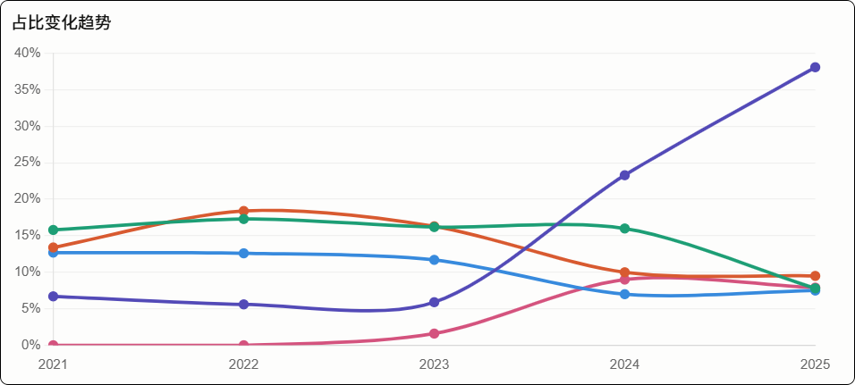
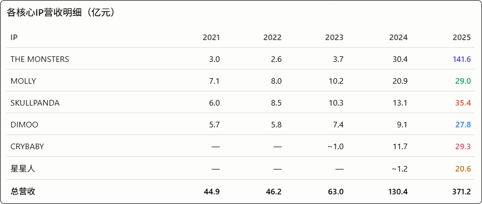

1. 火热的时候排队会增加每个消费者的购买金额，很多人的心态是，排了这么久的队，只买一个太亏了，于是多买几个。潜在增加单位用户消费金额，但会在热潮退却后回落

2. Labubu的火热也会带动其他，因为单店客流增加了；同样Labubu的退潮也会影响到其他IP

   

**THE MONSTERS（Labubu）彻底统治。** 从2023年的3.7亿→2024年30.4亿→2025年141.6亿，两年翻了38倍，占比从5.9%飙升到38.1%，单IP贡献超过总营收三分之一。

**IP集中度风险加剧。** 市场也注意到了这一点——2025年报发布后股价反而大跌超20%，核心担忧就是对Labubu的过度依赖，以及2026年增速预期仅20%。

**新黑马星星人崛起。** 从2024年约1.2亿暴涨至2025年的20.6亿（+1602%），已成第六大IP。

**SKULLPANDA逆袭回升。** 2024年增速放缓后，2025年从13.1亿跳至35.4亿（+171%），重新成为第二梯队领跑者。

