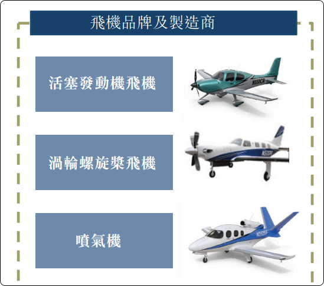
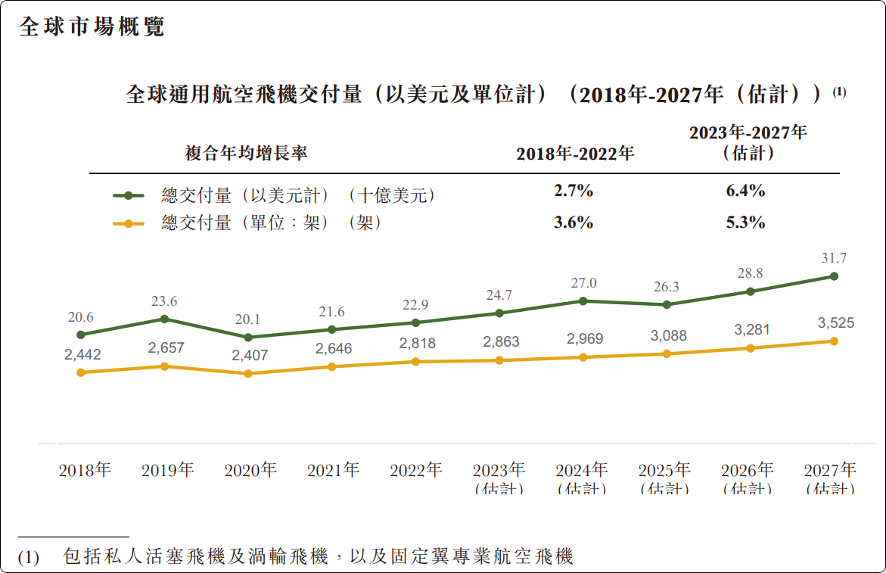
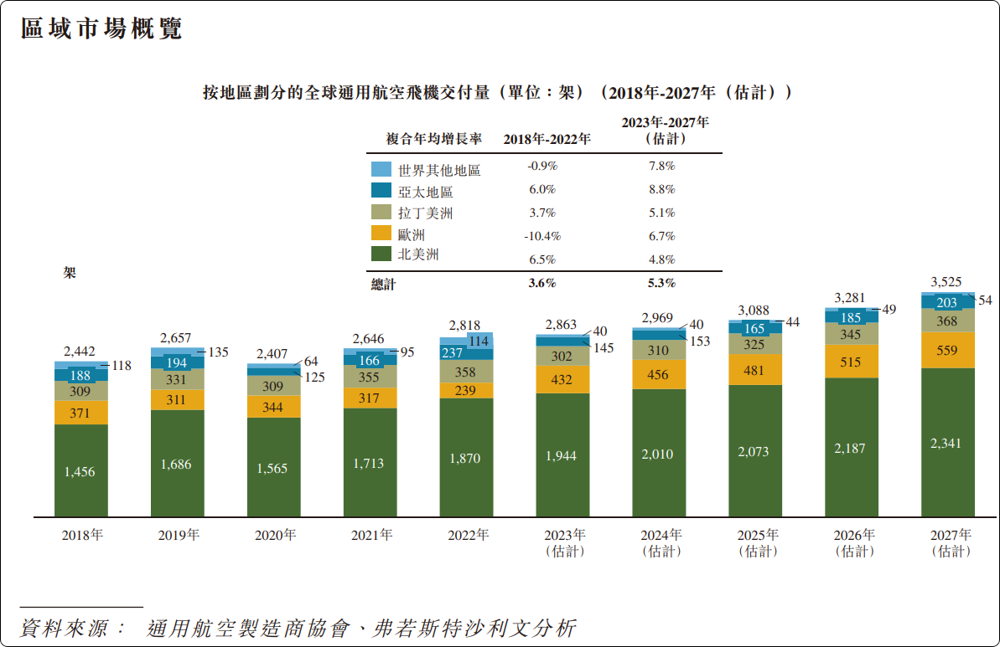
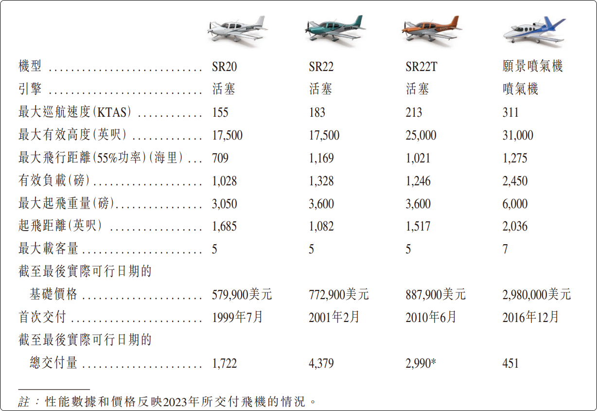

| 指标 \年份                 | 2021  | 2022  | 2023    | 2024    | 2025    |
| -------------------------- | ----- | ----- | ------- | ------- | ------- |
| 营业收入                   | 738.0 | 894.0 | 1,068.0 | 1,200.0 | 1,354.4 |
| 营业收入同比               | —     | 21.1% | 19.5%   | 12.4%   | 12.9%   |
| 净利润                     | 72.4  | 88.1  | 91.1    | 121.0   | 138.9   |
| 净利润同比                 | —     | 21.7% | 3.4%    | 32.8%   | 14.8%   |
| 净利率                     | 9.8%  | 9.9%  | 8.5%    | 10.1%   | 10.3%   |
| 毛利率                     | 32.8% | 33.3% | 34.2%   | 34.6%   | 35.2%   |
| 当年交付总量 (架)          | 528   | 629   | 708     | 731     | 797     |
| 其中 SR2X 系列             | 442   | 539   | 612     | 630     | 691     |
| 其中 愿景喷气机 Vision Jet | 86    | 90    | 96      | 101     | 106     |
| 整体单机均价 (含服务)      | 139.8 | 142.1 | 150.8   | 164.2   | 169.9   |
| 整体单机均价 (不含服务)    | 117.4 | 120.8 | 129.3   | 140.1   | 144.5   |
| SR2X 均价                  | 87.0  | 91.4  | 100.2   | 110.0   | 110.0   |
| 愿景喷气机均价             | 273.2 | 296.6 | 314.9   | 340.0   | 350.0   |
| 在手订单                   |       |       |         | 1,135   | 1,066   |
| 其中 Vision Jet            |       |       |         | 240     | 221     |
| Vision Jet比例             |       |       |         | 21.15%  | 20.73%  |

- ROE：27.4% → 25.6% → 21.1% → 19.2% → 16.7%
- 2021-2025 营收 CAGR 约 16.3%
- 2021-2025 净利润 CAGR 约 17.7%

- 2021 到 2025，总交付从 528 架增到 797 架，4年 CAGR 约 10.8%。
- 2021-2023 收入结构里，飞机销售占比 83.9% / 85.0% / 85.8%，服务及其他占比 16.1% / 15.0% / 14.2%。
- 2024 年港股上市后股东权益基数变大，所以 ROE 下行不等于经营恶化，更多是资本结构变化。

交付

|        | MODEL  | 2022 | 2023 | 2023 YOY  | 2024 | 2024 YOY   | 2025 | 2025 YOY  | 2026 | 2026 YOY   |
|--------|--------|------|------|-----------|------|------------|------|-----------|------|------------|
| Q1     | SR20   | 8    | 13   |           | 1    |            | 31   |           | 49   |            |
|      | SR22   | 19   | 5    |           | 14   |            | 13   |           | 31   |            |
|      | SR22T  | 41   | 54   |           | 40   |            | 87   |           | 95   |            |
|      | SF50   | 11   | 18   | 130.38    | 20   | 173.33     | 19   | 141.33    | 21   | 149.69     |
|      | TOTAL  | 79   | 90   | 13.92%    | 75   | -16.67%    | 150  | 100.00%   | 196  | 30.67%     |
|      | TB     | 1.03 | 1.28 | 24.27%    | 1.3  | 1.56%      | 2.12 | 63.08%    | 2.93 | 38.40%     |
| Q2     | SR20   | 27   | 28   |           | 66   |            | 36   |           |      |            |
|      | SR22   | 33   | 39   |           | 32   |            | 45   |           |      |            |
|      | SR22T  | 53   | 84   |           | 91   |            | 93   |           |      |            |
|      | SF50   | 19   | 26   | 133.33    | 23   | 127.36     | 26   | 144.50    |      |            |
|      | TOTAL  | 132  | 177  | 34.09%    | 212  | 19.77%     | 200  | -5.66%    |      |            |
|      | TB     | 1.57 | 2.36 | 50.32%    | 2.7  | 14.41%     | 2.89 | 7.04%     |      |            |
| Q3     | SR20   | 38   | 30   |           | 36   |            | 42   |           |      |            |
|      | SR22   | 34   | 49   |           | 45   |            | 52   |           |      |            |
|      | SR22T  | 60   | 87   |           | 94   |            | 84   |           |      |            |
|      | SF50   | 23   | 17   | 121.86    | 19   | 129.38     | 27   | 145.37    |      |            |
|      | TOTAL  | 155  | 183  | 18.06%    | 194  | 6.01%      | 205  | 5.67%     |      |            |
|      | TB     | 1.79 | 2.23 | 24.58%    | 2.51 | 12.56%     | 2.98 | 18.73%    |      |            |
| Q4     | SR20   | 27   | 44   |           | 18   |            | 43   |           |      |            |
|      | SR22   | 73   | 49   |           | 54   |            | 45   |           |      |            |
|      | SR22T  | 126  | 130  |           | 139  |            | 120  |           |      |            |
|      | SF50   | 37   | 35   | 133.33    | 39   | 149.60     | 34   | 157.73    |      |            |
|      | TOTAL  | 263  | 258  | -1.90%    | 250  | -3.10%     | 242  | -3.20%    |      |            |
|      | TB     | 3.26 | 3.44 | 5.52%     | 3.74 | 8.72%      | 3.82 | 2.06%     |      |            |
| ALL    | SR20   | 100  | 115  |           | 121  |            | 152  | 25.62%    |      |            |
|     | SR22   | 159  | 142  |           | 145  |            | 155  | 6.90%     |      |            |
|     | SR22T  | 280  | 355  |           | 364  |            | 384  | 5.49%     |      |            |
|     | SF50   | 90   | 96   | 131.50    | 101  | 140.22     | 106  | 148.14    |      |            |
|     | TOTAL  | 629  | 708  | 12.56%    | 731  | 3.25%      | 797  | 9.03%     |      |            |
|     | TB     | 7.65 | 9.31 | 21.70%    | 10.25| 10.10%     | 11.81| 15.19%    |      |            |
| ALL    | SERVICE| 1.29 | 1.37 | 6.20%     | 1.72 | 25.55%     | 2.03 | 18.02%    |      |            |
|     | REVENUE| 8.94 | 10.68| 19.46%    | 11.97| 12.08%     | 13.837|15.60%   |      |            |
|     | NI     | 0.88 | 0.91 | 3.41%     | 1.21 | 32.97%     | 1.39 | 14.88%    |      |            |
|     | NI/R   | 9.84%| 8.52%|           | 10.11%|           | 10.05%|          |      |            |
|     | PE     |      |      |           | 7.42 |            | 11.07|           |      |            |

Links：

招股书：https://statichk.iqdii.com/stockdata/notice/newprospectus/sehk23060800657_c.pdf

美国公司派息给开曼主体30%税，港股通再来20%，到手只有56%了，这长期股东咋玩。前面那个暂时不存在是因为目前可以用ipo的钱派息，不涉及美国公司分派给开曼主体。长期看公司的现金流来源于美国公司，开曼的上市主体没有现金流来源，需要美国公司派息时，就是30%股息预扣税啊（美国公司股息预扣税都是30%，中美有税收优惠协议，中国股东身份可以10%，西锐的开曼主体又不是中国公司）

定性：
1. 品牌+安全：SR系列连续20多年是全球最畅销的活塞机，尤其它的整机降落伞（CAPS）把"安全"做成了品牌标签，这在一个买家用生命投票的品类里是极强的心智壁垒，支撑了它的定价权。
2. 生态绑定带来的转换成本。买了西锐的飞机，后续的培训、维修、航材、延保都倾向于继续用它——这让客户黏性很高
3. 长订单簿带来的可见度
4. 强周期 + 可选奢侈消费，受制于宏观景气度
5. 单一终端市场，增长有上限。私人/通用航空的总盘子（TAM）相比商用航空很小，它已经是这个细分的龙头，靠抢份额扩张的空间有限，未来增长更多得靠提价、服务渗透和开拓新地区
6. 重认证、重研发、慢迭代。新机型从研发到拿适航证要烧几年、几亿美元，产品周期慢、试错成本极高。这也是历史上一堆飞机厂商破产的原因——一个失败的新项目就可能拖垮公司
7. 产品责任和监管风险长期存在。

分红：
100元美国利润 → 汇到开曼剩70 → 内地个人股东再缴20% → 到手56

西锐的上市主体（Cirrus Aircraft Limited）是开曼公司，由中航通飞香港100%持有，而真正赚钱的经营实体在美国（德卢斯、大福克斯）。所以现金引擎在美国、上市壳在开曼。
美国30%预扣税对。 美国对本国公司向境外股东派息，法定预扣税就是30%，靠税收协定才能降。开曼和美国之间没有税收协定，所以美国子公司向开曼主体分红，确实要被预提30%。
港股通20%对。 内地个人投资者通过港股通（南向）取得香港分红，按20%代扣个人所得税。
目前用IPO的钱派息、暂时没触发

风险：

1. 地缘政治，美国禁令
2. 安全风险，飞机出事一方面会赔钱，如果严重可能某一型号禁飞（但看SR系列历史挺长的，应该问题不大）

2011年，西锐在金融危机后陷入经营困境，被中国航空工业集团旗下的中航通飞以2.1亿美元全资收购。上市前，西锐100%由中航通飞香港持有，实际控制人是国资委全资的航空工业集团。
2024年6月，国内首架私人西锐SR22飞机已完成交付。
西锐虽然产品和工厂在美国，但资本属性是中国央企，港股是兼顾国际化定位与中资背景的最合理选择。

## 行业

通用航空是指除軍用及定期商業航線以外的所有航空。就已交付數量而言，通用 航空是世界上最大的航空市場。於2022年，通用航空飛機交付市場合共交付2,818架新 飛機，價值約230億美元。通用航空包括私人航空和專業航空。私人航空是指固定翼通 用航空飛機的非商業運行，包括自駕和飛行指導等活動。私人航空使用的主要飛機類 型包括活塞發動機飛機和渦輪飛機。渦輪飛機包括渦輪螺旋槳飛機與噴氣機。專業航 空涉及企業服務、包機服務、農業作業、消防、救災和環境保護等一系列活動

全球經濟增長和高淨值人士不斷增加、技術進步、機場基礎設施及相關輔助服務 的可用性和可及性的不斷提升正在推動全球通用航空市場的增長。於2022年，通用航 空飛機（包括私人航空飛機及固定翼專業航空飛機）交付量達到2,818架，較2018年的2,442 架有所增加，複合年均增長率為3.6%。展望未來，隨著全球經濟從疫情中復甦，高淨值 人士財富增長勢頭強勁，預計將帶動通用航空飛機作為奢侈品消費選擇的需求增加， 預計總交付量於2027年將達到3,525架，2023年至2027年的複合年均增長率為5.3%。按美 元價值衡量的全球通用航空飛機交付量預計於預測期內亦將穩步增長，於2027年將達 到317億美元，較2023年的247億美元有所增加，複合年均增長率為6.4%

## 产品线

**SR2X系列（单引擎活塞飞机）**，包括SR20、SR22和SR22T三款，基础售价约62万~100万美元。SR20是入门款，SR22/SR22T性能更强，是其核心收入来源。2025年推出了G7+代际升级，搭载Garmin Safe Return自动紧急着陆系统，是全球首款获FAA批准自主紧急降落功能的单引擎活塞飞机。SR系列已连续24年蝉联全球最畅销单引擎活塞飞机，累计交付超过11,000架。

**愿景喷气机（Vision Jet）**，单引擎涡扇喷气机，售价约324万美元，定位为"owner-flown"个人喷气机——机主无需专职飞行员即可驾驶。连续8年蝉联通用航空业最畅销喷气机，2025年交付106架创历史新高。

**行业地位方面**，西锐是全球通用航空飞机交付量第一。2025年全年交付797架（SR系列691架 + Vision Jet 106架），按GAMA数据排名全球第一，远超第二名德事隆（Textron，旗下有Cessna和Beechcraft）。2024年全球市场份额约23%，第二名德事隆约18%。

简单来说，西锐在私人/通用航空领域的地位类似于"大众消费级私人飞机的绝对龙头"，尤其在机主自驾（owner-flown）这个细分赛道几乎没有对手。

## 销售对象

**销售区域方面**，北美是绝对主力市场。2023年数据：北美占比约82%，欧洲约7%，其他地区（亚太、非洲、澳洲等）约12%。公司已向全球55个国家销售产品，在32个国家设有授权服务中心，但收入高度集中在北美，欧洲和亚太仍有较大增长空间。

**消费群体画像**，西锐的典型客户有几个显著特征：

"机主自驾"型用户——买家本人就是飞行员（或买飞机后学飞），而非雇用专职飞行员。这是西锐与传统公务机最大的区别。客户画像更接近"买保时捷的人自己开"，而非"买劳斯莱斯配司机"。

具体来说主要包括三类人群：一是高净值个人，用于私人出行和短途商务旅行，把飞机当作区域交通工具而非奢侈品炫耀；二是飞行培训机构，包括大学航空课程、专业飞行学院和航空公司培训中心，SR20是常见的教练机型；三是机队运营商，用于特殊任务和商业运营。

从定价来看，SR20约50-60万美元起，SR22/SR22T约70-100万美元，Vision Jet约324万美元。相比动辄千万美元级别的湾流、庞巴迪公务机，西锐定位更像通航领域的"入门级至中端消费品"，客户群体是富裕但不一定是超级富豪的阶层。

## 飞行故障

**事故概况：** 西锐早期的事故率引发过关注，2011年是高峰年，全球发生16起致命坠机事故，其中11月两周内就有5起。但调查发现，同级别机型（如Piper Saratoga、Mooney M20、Cessna 206）的致命事故率与西锐相当甚至更高，西锐并非特别危险，而是因为保有量大、关注度高，显得事故"多"。

**事故主因是飞行员而非飞机故障。** 数据显示，西锐事故中51.1%是飞行员操控失误，且出事飞行员的中位飞行时长仅727小时，在同类机型中最低。这与西锐的客户画像有关——大量买家是新手飞行员或非职业飞行员，经验不足是主要风险因素。

**安全改善显著。** 2011年之后致命事故逐年下降，尽管机队规模和飞行小时数持续增长。AOPA（美国飞机所有者与飞行员协会）将首个Joseph T. Nall安全奖颁给了西锐，称其在过去十年中建立了"行业最佳安全记录之一"。

**CAPS整机降落伞是关键安全特色。** 西锐是唯一全系标配整机降落伞系统的飞机制造商。截至2026年5月，CAPS已挽救了148次事故中的297条生命。不过也存在飞行员在可用情况下未拉伞的案例，这是培训层面的问题。

总体而言，西锐的事故更多归因于飞行员经验不足，而非产品设计缺陷。其整机降落伞系统在通航界是独创性的安全设计。

## 估值

**市盈率水平：** 静态PE约16-18倍。对比来看，亚洲航空航天与国防行业平均PE约55倍，西锐明显偏低。这主要因为西锐虽然归类在航空航天板块，但本质上更接近消费品制造商，市场给的是制造业估值而非军工/航天估值。

**盈利预测：** 2026/2027/2028年预计净利润分别为1.77/2.27/2.95亿美元，增速可观，主要驱动来自G7+新品周期、Vision Jet持续放量以及服务收入占比提升。

西锐当前16-18倍PE在同行业中算低估区间，但需要注意港股流动性偏弱（日成交额仅几千万港元），以及北美市场高度集中带来的风险。估值便宜的部分原因也在于港股对这类标的关注度有限。

