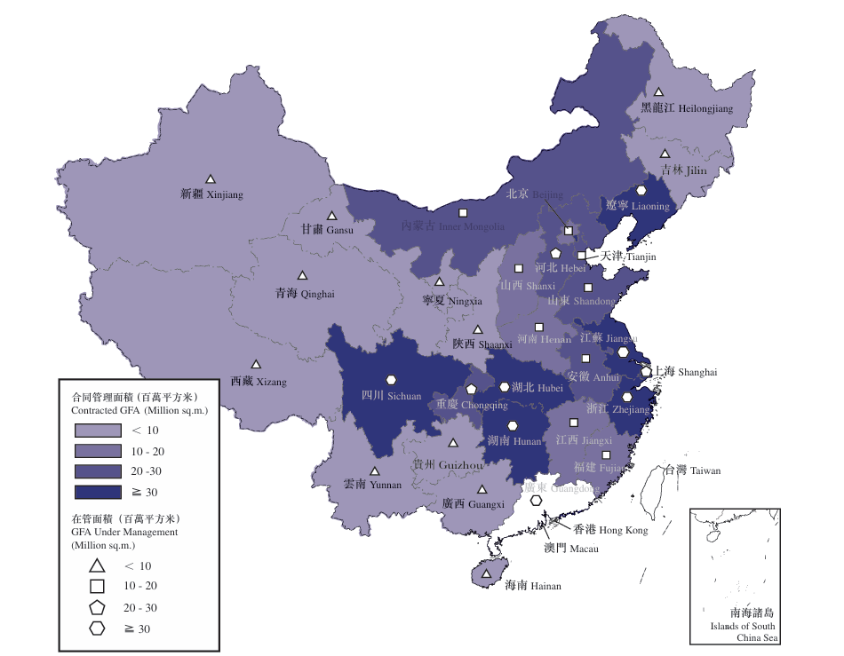

```
合同管理面積（千平方米）
收入（人民幣千元）
在管面積（千平方米）
在管單價（元 /㎡）-包含写字楼
```

2025年数据

| 項目來源         | 合同管理面積 | 佔合同管理面積 | 合同管理數量 | 收入       | 收入佔比 | 在管面積 | 在管面積佔比 | 在管項目數量 | 在管單價（元 /㎡） |
| ---------------- | ------------ | -------------- | ------------ | ---------- | -------- | -------- | ------------ | ------------ | ------------------ |
| 保利發展控股集團 | 363,504      | 35.9%          | 1,782        | 7,289,864  | 55.4     | 290,796  | 34.0%        | 1,596        | 25.07              |
| 第三方（附註 2） | 648,615      | 64.1%          | 1,603        | 5,859,951  | 44.6     | 564,214  | 66.0%        | 1,440        | 10.39              |
| 合計             | 1,012,119    | 100.0%         | 3,385        | 13,149,815 | 100.0    | 855,010  | 100.0%       | 3,036        | 15.38              |

2024年数据

| 項目來源         | 合同管理面積 | 佔合同管理面積 | 合同管理數量 | 收入       | 收入佔比 | 在管面積 | 在管面積佔比 | 在管項目數量 | 在管單價（元 /㎡） |
| ---------------- | ------------ | -------------- | ------------ | ---------- | -------- | -------- | ------------ | ------------ | ------------------ |
| 保利發展控股集團 | 358,730      | 36.3%          | 1,714        | 6,687,193  | 57.3     | 277,810  | 34.6%        | 1,476        | 24.07              |
| 第三方           | 629,395      | 63.7%          | 1,516        | 4,987,296  | 42.7     | 525,609  | 65.4%        | 1,345        | 9.49               |
| 合計             | 988,125      | 100.0%         | 3,230        | 11,674,489 | 100.0    | 803,419  | 100.0%       | 2,821        | 14.53              |


2025 年物业类型数据

| 物業類型         | 收入（人民幣千元） | 收入佔比（%） | 在管面積（千平方米） | 在管面積佔比（%） | 在管項目數量 | 單價（元 /㎡） |
| ---------------- | ------------------ | ------------- | -------------------- | ----------------- | ------------ | -------------- |
| 住宅社區         | 7,368,422          | 56.0          | 331,008              | 38.7              | 1,769        | 22.26          |
| 非住宅物業       | 5,781,393          | 44.0          | 524,002              | 61.3              | 1,267        | 11.03          |
| — 商業及寫字樓   | 2,484,211          | 18.9          | 48,693               | 5.7               | 525          | 51.02          |
| — 公共及其他物業 | 3,297,182          | 25.1          | 475,309              | 55.6              | 742          | 6.94           |
| 合計         | 13,149,815     | 100.0     | 855,010          | 100.0         | 3,036    | 15.38      |

2024 年物业类型数据

| 物業類型         | 收入（人民幣千元） | 收入佔比（%） | 在管面積（千平方米） | 在管面積佔比（%） | 在管項目數量 | 單價（元 /㎡） |
| ---------------- | ------------------ | ------------- | -------------------- | ----------------- | ------------ | -------------- |
| 住宅社區         | 6,779,510          | 58.1          | 314,216              | 39.1              | 1,654        | 21.58          |
| 非住宅物業       | 4,894,979          | 41.9          | 489,203              | 60.9              | 1,167        | 10.01          |
| — 商業及寫字樓   | 1,951,744          | 16.7          | 39,961               | 5.0               | 454          | 48.84          |
| — 公共及其他物業 | 2,943,235          | 25.2          | 449,242              | 55.9              | 713          | 6.55           |
| 合計         | 11,674,489     | 100.0     | 803,419          | 100.0         | 2,821    | 14.53      |


|                    | 截至 12 月 31 日止年度                |             |                    |
| ------------------ | ------------------------------------- | ----------- | ------------------ |
|                    | 2025 年（人民币元 / 平方米 / 月） | 2024 年 | 变动（人民币） |
| 住宅社區           | 2.47                                  | 2.41        | 增加 0.06 元       |
| －保利發展控股集團 | 2.56                                  | 2.51        | 增加 0.05 元       |
| －第三方           | 1.96                                  | 1.87        | 增加 0.09 元       |


|                | 截至 12 月 31 日止年度 |               |                    |               |            |
| -------------- | ---------------------- | ------------- | ------------------ | ------------- | ---------- |
|                | 2025 年            |               | 2024 年        |               | 增长率 |
|                | 收入（人民币千元）     | 收入占比（%） | 收入（人民币千元） | 收入占比（%） | %          |
| 物业管理服务   | 13,149,815             | 76.7          | 11,674,489         | 71.4          | 12.6       |
| 非业主增值服务 | 1,636,115              | 9.6           | 1,960,103          | 12.0          | -16.5      |
| 社区增值服务   | 2,340,138              | 13.7          | 2,707,720          | 16.6          | -13.6      |
| 合计       | 17,126,068         | 100.0     | 16,342,312     | 100.0     | 4.8    |

|                | 截至 12 月 31 日止年度 |               |             |                    |               |             |
| -------------- | ---------------------- | ------------- | ----------- | ------------------ | ------------- | ----------- |
|                | 2025 年            |               |             | 2024 年        |               |             |
|                | 毛利（人民币千元）     | 毛利占比（%） | 毛利率（%） | 毛利（人民币千元） | 毛利占比（%） | 毛利率（%） |
| 物业管理服务   | 1,761,276              | 59.0          | 13.39       | 1,673,449          | 56.1          | 14.33       |
| 非业主增值服务 | 258,570                | 8.7           | 15.80       | 313,967            | 10.5          | 16.02       |
| 社区增值服务   | 965,242                | 32.3          | 41.25       | 996,890            | 33.4          | 36.82       |
| 合计       | 2,985,088          | 100.0     | 17.43   | 2,984,306      | 100.0     | 18.26   |

